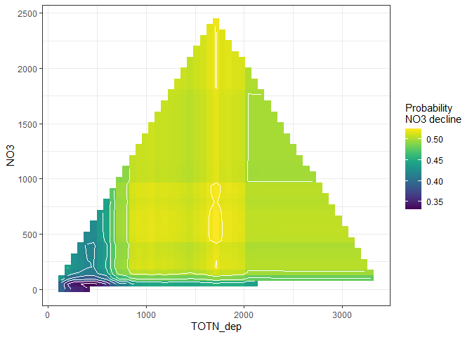

Methods and results - for report
================
DHJ
15 10 2021

-   [Overview of analyses](#overview-of-analyses)
-   [Short intro about trees and
    forests](#short-intro-about-trees-and-forests)
    -   [Measurements of variable
        importance](#measurements-of-variable-importance)
    -   [Variable effects / predictions of the
        model](#variable-effects--predictions-of-the-model)
-   [Results for NO3 decrease](#results-for-no3-decrease)
    -   [a. Full model](#a-full-model)
    -   [b. All variables except catchment
        area](#b-all-variables-except-catchment-area)
    -   [c. All variables except catchment area and
        TOC](#c-all-variables-except-catchment-area-and-toc)
    -   [d. All variables except catchment area and
        altitude](#d-all-variables-except-catchment-area-and-altitude)
-   [Results for TOC/TON ratio
    decrease](#results-for-tocton-ratio-decrease)
    -   [a. Full model](#a-full-model-1)
    -   [b. Not including the slopes of TOC and
        TON](#b-not-including-the-slopes-of-toc-and-ton)
    -   [c. Also removing TOC](#c-also-removing-toc)
-   [Results for Current status, NO3](#results-for-current-status-no3)
    -   [a. Full model](#a-full-model-2)
    -   [b. All variables except catchment area and
        TOC](#b-all-variables-except-catchment-area-and-toc)
-   [Results for Current status, TOC/TON
    ratio](#results-for-current-status-tocton-ratio)
    -   [a. All variables including TOC and TON
        medians](#a-all-variables-including-toc-and-ton-medians)
    -   [b. All variables except TOC and TON
        medians](#b-all-variables-except-toc-and-ton-medians)

## Overview of analyses

-   We performed four analyses:

    1.  How sites with decreasing NO3 differed from the other sites
        (i.e., a categorical response variable)
        -   response variable = `no3_decline`, defined as 1 if there was
            a significant decrease in NO3 over the period 1992-2016
            (`slope_no3_vs_time < 0 & p_no3_vs_time <= 0.05`)  
        -   I.e., sites with no NO3 trend and with increasing NO3 were
            treated the same  
    2.  How sites with decreasing TOC/TON differed from the other sites
    3.  How median NO3 2012-2016 differed among sites (i.e., a
        continuous response variable)
        -   response variable = log10(median_no3 + 0.1)  
    4.  How median TOC/TON ratio 2012-2016 differed among sites
        -   response variable = log10(median_tocton)

-   For analyses 1, we performed analyses using the following sets of
    predictor variables (N given for analysis 1):

    -   1.  All variables - N = 375 (none of the US stations have
            catchment area, so they are excluded)  

    -   2.  All variables except catchment area - N = 450 (lacking all
            Italian, Latvian, Irish stations, plus some German and
            Swedish ones)  

    -   3.  All variables except catchment area and TOC - N = 474
            (getting most IT,LV,IE,DE,SE stations, still lacking CH + 16
            US stations)  

    -   4.  All variables except catchment area and altitude - N = 450
            (same stations as in b)

-   For analyses 2, we performed analyses using the following sets of
    predictor variables (N given for analysis 1):

    -   1.  All variables including the slope of TOC and the slope of
            TON  

    -   2.  All variables excluding the slopes (TOC and TON)  

    -   3.  All variables excluding the slopes, and excludong TOC (in
            order to include 6 Italian stations)

-   For analyses 3, we performed analyses using the following sets of
    predictor variables:

    -   1.  All variables - N = 377 (no USA stations)  

    -   2.  All variables except catchment area and TOC - N = 457 (still
            lacking 16 US stations, plus most (9/11) Irish stations)

-   For analyses 4, we performed analyses using the following sets of
    predictor variables:

    -   1.  All variables including TOC and TON medians  

    -   2.  All variables excluding TOC and TON medians

-   All analysis were performed with ‘random forest analysis’ is an
    extension of ‘decision tree analysis’

## Short intro about trees and forests

-   In decision tree analysis, one first looks for the best variable A,
    an the best ‘splitting value’ x of that variable, to split the data
    in order to the response variable. In analysis 1 for instance, it
    may turn out that for stations with A \< x, 20% of the stations have
    `no3_decline`= 1, while for stations with A > x, 80% of the stations
    have `no3_decline`= 1. After this first split of the dataset, the
    procedure is repeated on each part of the data set (the A \< x part
    and the A > x). This results in a single decision tree.

-   The figure below is an example for ‘NO3 decrease’, where the data
    set is first split according to altitude (below or above 227
    m.a.s.l.), then each subset is split again two times (the
    first-split variable, altitude in this case, can have been used
    again for the next splits, but in this case it was outcompeted by
    other variables)

    -   The columns at the bottom shows the predictions of the model.
        E.g. for a site above 227 m.a.s.l. and with > 70%
        deciduous/mixed forest, only 10% of the stations had decreasing
        NO3_decline 

-   Two good things about decision trees are 1) they incorporate
    interactions between variables easily, and 2) they are easy to
    interpret. The bad thing is that we have no idea bout the
    uncertainty of the model and whether small changes in the data could
    have given us a very different tree. The random forest algorithm
    tries to fix that by making a large number of trees (e.g., 100
    trees), where the data used to make each tree differs slightly, in
    two ways: First, at each split, the algorithm randomly selects a
    subset of features which can be used as candidates for splitting the
    data. Secondly, each tree draws a random sample of data from the
    training dataset when generating its splits.

-   For further explanation, see this [non-technical
    introduction](https://victorzhou.com/blog/intro-to-random-forests/)
    or a [slightly more in-depth
    introduction](https://www.keboola.com/blog/random-forest-regression)

-   A main disadvantage of the random forest method is that it is hard
    to summarize the (e.g.) 100 different decision trees resulting from
    the method. There are mainly two aspects of this: Variable
    importance and model predictions.

### Measurements of variable importance

-   *times_a\_root*: how often the variable is the selected for the
    first split (the ‘root’ of the tree).

-   *mean_min_depth*: The ‘minimum depth’ of a variable in one tree is
    the level where it first was used (e.g. decid_mixed has level 2
    above). Then the mean of ‘minimum depth’ across trees is calculated.
    So this measure is related to ‘times_a\_root’: If ‘times_a\_root’ is
    low and ‘mean_min_depth’ is high, it means that this variable is
    important for only a subset of the data (after the data set first
    has been split up using other variables).

-   Example: When plotting these two measures against each other (see
    below), they show some level of agreement, with altitude and
    proportion of deciduous/mixed forest occupying the upper left
    corner, i.e. competing for being most important following these
    measures.

-   *gini_decrease*: the “Gini-Simpson index” (related to the ecological
    Simpson index) is a measure of “impurity” in the data set
    (ecologists would say ‘diversity’), and equals the probability that
    two stations picked at random have the same classification (e.g.,
    both have decreasing NO3). Each the data set is split in two in a
    decision tree, the Gini index decreases (one of the two data sets
    will have more no3_decline = 1 stations, the other will have more
    no3_decline = 0 stations). The Gini decrease for a variable measures
    how much the Gini-Simpson index decreases when the data set is split
    using that variable.

-   *accuracy_decrease* measures how much the accuracy decreases when
    the variable is removed from the model (where accuracy is measured
    by out-of-bag cross validated predictions)

-   Example: When plotting these two measures against each other (see
    below), they agree quite closely for the 6-7 most important
    variables. The most important variables occupy the upper right
    corner (which agree with the upper left corner of the plot above).
    In addition, this plot shows by color which variables that are
    statistically significant (in this case no less than 10 variables).

### Variable effects / predictions of the model

For a single decision tree, prediction is simple, as shown above. For a
random forest, predicting the outcome for a certain value of variable
*X* is done by letting all other variables vary randomly, making
predictions for each tree, and then averaging the result across all
trees. This is repeated for a range of values for *X*. As the effect of
other variaables is “removed” by drawing randiom values, this is called
the *partial effect of X*. In order to visualise interactions, one can
also predict the outcome of combinations of values for two predictor
variables (letting the other variables vary randomly). In the figures
shown in the results, we have made predictions for two predictor
variables at a time (starting with the two most important ones by the
‘Gini decrease’ index, then number 3 and 4, etc.), making a ‘map’ where
the colours of each cell indicate the probability for NO3 decline for a
station with this combination of values.

-   Example: In the figure below, we show the models’ predictions for a
    different combinations of TOTN_dep (deposition) and
    slope_dep_vs_time (change in deposition vs. time). The uncoloured
    areas of the graph (the white areas) are non-existent combinations
    of the two variables, here showing that only areas with a generally
    high deposition has low variables of ‘slope_dep_vs_time’ (i.e.,
    strong decrease). The dark parts towards the bottom right indicates
    that stations with a low deposition, which also have changed little
    over time, also have no NO3 decline. The yellow area in the middle
    shows that the highest chance/proportion of NO3 change is found for
    stations with a medium deposition and medium change in deposition.

> Note that the color scales of the figures differ (see legend in
> figures) - dark blue vs. yellow represents a bigger difference for the
> first figure in each analysis.

## Results for NO3 decrease

### a. Full model

**N = 375, all predictor variables included (lacking all US, IE, IT, LT
stations)** (*Same results as examples above.*)

    ## -------------------------------------------------------------
    ## Variables: 
    ## no3_decline,catchment_area, TOC,slope_dep_vs_time, NO3, TOTN_dep, latitude, longitude, altitude,pre, tmp, urban, cultivated, coniferous, decid_mixed, total_shrub_herbaceous,wetland, lake_water, bare_sparse
    ## 
    ## Number of complete observations by country: 
    ##                 complete
    ##                  FALSE TRUE
    ##   Canada             0  114
    ##   Czech Republic     1    7
    ##   Estonia            1    0
    ##   Finland            0   26
    ##   Germany            5   18   # lacking some
    ##   Ireland            3    0   # no stations included
    ##   Italy              6    0   # no stations included
    ##   Latvia             3    0   # no stations included
    ##   Netherlands        1    2
    ##   Norway             0   83
    ##   Poland             0    6
    ##   Slovakia           0   12
    ##   Sweden             6   86   # lacking some
    ##   Switzerland        6    0
    ##   United Kingdom     0   21
    ##   United States     91    0   # no stations included
    ## 
    ## 
    ## Original data: n = 498 
    ## Analysis: n = 375

**Variable importance:** Altitude, proportion of deciduous/mixed forest
and TOC level are the three most important variables (indicated by all
four measures of importance), followed by NO3, TOTN_dep and
slope_vs_time.

**Variable effects:** The partial effects for the two most important
variables show increasing probability of NO3 decline with increasing
altitude and for stations with very little deciduous/mixed forest. The
next figure shows that the combination of very low TOC but not very low
NO3 has a higher probability of NO3 decline. (But note that the color
scale in the second figure has a smaller range than in the first one!)
The final figure shows (as explained above) that the highest
chance/proportion of NO3 change is found for stations with a medium
deposition and medium change in deposition.

  
  

### b. All variables except catchment area

**N = 450 - Getting in most US staitons, but still lacking all Italian,
Latvian, Irish stations, plus some German and Swedish ones)**

    ## -------------------------------------------------------------
    ## Variables: 
    ## no3_decline,TOC,slope_dep_vs_time, NO3, TOTN_dep, latitude, longitude, altitude,pre, tmp, urban, cultivated, coniferous, decid_mixed, total_shrub_herbaceous,wetland, lake_water, bare_sparse
    ##
    ## Number of complete observations by country: 
    ##                 complete
    ##                  FALSE TRUE
    ##   Canada             0  114
    ##   Czech Republic     1    7
    ##   Estonia            1    0
    ##   Finland            0   26
    ##   Germany            5   18   # still lacking partly
    ##   Ireland            3    0   # still lacking
    ##   Italy              6    0   # still lacking
    ##   Latvia             3    0   # still lacking
    ##   Netherlands        1    2
    ##   Norway             0   83
    ##   Poland             0    6
    ##   Slovakia           0   12
    ##   Sweden             6   86   # still lacking partly
    ##   Switzerland        6    0
    ##   United Kingdom     0   21
    ##   United States     16   75   # most stations included
    ## 
    ## 
    ## Original data: n = 498 
    ## Analysis: n = 450

**Variable importance:** Similar results as above: Altitude, proportion
of deciduous/mixed forest and TOC level are the three most important
variables, followed by NO3, TOTN_dep and slope_vs_time. The importance
of altitude relative to the others has increased by including the US
data.

**Variable effects:** The partial effects graphs are a bit different as
the variables have reordered themselves according to th ‘gini-decrease’
index, which was used for selecting variables for these plots. E.g., in
the first plot, decid_mixed has been replaced by TOC, but the effct of
the TOC appears similar: low TOC is associated with high probability of
NO3 decline, but the effect of TOC appears non-linear (little difference
between TOC = 3 and TOC = 15).

  
  

### c. All variables except catchment area and TOC

**N = 474 (getting most IT,LV,IE,DE,SE stations, still lacking CH + 16
US stations)**

    ## -------------------------------------------------------------
    ## Variables: 
    ## no3_decline,slope_dep_vs_time, NO3, TOTN_dep, latitude, longitude, altitude,pre, tmp, urban, cultivated, coniferous, decid_mixed, total_shrub_herbaceous,wetland, lake_water, bare_sparse
    ##
    ## Number of complete observations by country: 
    ##                 complete
    ##                  FALSE TRUE
    ##   Canada             0  114
    ##   Czech Republic     0    8
    ##   Estonia            1    0
    ##   Finland            0   26
    ##   Germany            0   23
    ##   Ireland            1    2
    ##   Italy              0    6
    ##   Latvia             0    3
    ##   Netherlands        0    3
    ##   Norway             0   83
    ##   Poland             0    6
    ##   Slovakia           0   12
    ##   Sweden             0   92
    ##   Switzerland        6    0
    ##   United Kingdom     0   21
    ##   United States     16   75
    ## 
    ## 
    ## Original data: n = 498 
    ## Analysis: n = 474

**Variable importance:** Altitude and proportion of deciduous/mixed
forest are equally important. NO3, TOTN_dep and slope_vs_time still
quite important.

**Variable effects:** Interaction between altitude and decid_mixed:
Below altitude 250 masl, decid_mixed has no effect. Over 250 masl, the
probability of NO3 decline decreases steadily as the proportion fof
deciduous/mixed forest increases. Also, the probability of NO3 decline
decreases as tmp (temperature) increases (proxy for altitude?).

  
  

### d. All variables except catchment area and altitude

**N = 450 (same stations as in b)**

**Variable importance:** TOC “takes over for” altitude in variable
importance. TOTN_dep and slope_vs_time still quite important, NO3 a
little less important (see graph 2), while precipitation (pre) and
temperature (tmp) becomes more important.

**Variable effects:** Largest probability of NO3 decline for stations
with very low TOC, or very little deciduous/mixed forest, or
(especially) both. Also, larger probability of NO3 decline when
precipitation is over 1500 mm (for a range of NO3 values).

  
  

## Results for TOC/TON ratio decrease

**Note: in all of these results, ‘AtlCan’ data are excluded**

### a. Full model

**Variable importance:** The slopes of TON and TOC over time has a big
effect, not so surprising.

161a_Time_series_tocton\_

**Variable effects:** Dominated by the slopes over time - see next
analyses

  
  

### b. Not including the slopes of TOC and TON

**N = 224 - Missing the Italian ones, due to TOC**

    ## Variables: 
    ## tocton_decrease,catchment_area, TOC, TON,slope_dep_vs_time, TOTN_dep, latitude, longitude, altitude,pre, tmp, urban, cultivated, coniferous, decid_mixed, total_shrub_herbaceous,wetland, lake_water, bare_sparse
    ##
    ## 
    ## Number of complete observations by country: 
    ##                 complete
    ##                  FALSE TRUE
    ##   Canada             0    7
    ##   Finland            0   26
    ##   Germany            0    1
    ##   Italy              6    0
    ##   Norway             0   83
    ##   Sweden             0   86
    ##   United Kingdom     0   21
    ## 
    ## 
    ## Original data: n = 293 
    ## Data after filtering: n = 230 
    ## Analysis: n = 224

**Variable importance:** Decrease of deposition (slope_dep_vs_time) most
important. TOC and TOT_dep (mean value of deposition also important)

**Variable effects:** A decline in TOC/TON ratio is mostl likely if
there is a big decline in TOTN deposition and deposition is over ca.
1600.

  
  

### c. Also removing TOC

**N = 230 (all countries included)**

    ## Variables: 
    ## tocton_decrease,TON,slope_dep_vs_time, TOTN_dep, latitude, longitude, altitude,pre, tmp, urban, cultivated, coniferous, decid_mixed, total_shrub_herbaceous,wetland, lake_water, bare_sparse
    ## 
    ## Number of complete observations by country: 
    ##                 complete
    ##                  TRUE
    ##   Canada            7
    ##   Finland          26
    ##   Germany           1
    ##   Italy             6
    ##   Norway           83
    ##   Sweden           86
    ##   United Kingdom   21
    ## 
    ## 
    ## Original data: n = 293 
    ## Data after filtering: n = 230 
    ## Analysis: n = 230

**Variable importance:** Decrease of deposition (slope_dep_vs_time)
still most important. Total_shrub_herbacous comes in as quite important.

**Variable effects:** The probability of TOC/TON decline is highest for
some intermediate proportion of shrubs/herbacous (40-50%). A bit
suspicuous?

  
  

## Results for Current status, NO3

### a. Full model

**N = 377 (no USA stations)**

    ## Variables  
    ## log_median_no3,catchment_area, log_median_toc,slope_dep_vs_time, TOTN_dep, latitude, longitude, altitude,pre, tmp, urban, cultivated, coniferous, decid_mixed, total_shrub_herbaceous,wetland, lake_water, bare_sparse

    ## 
    ## Number of complete observations by country: 
    ##                 complete
    ##                  FALSE TRUE
    ##   Canada             0  115
    ##   Czech Republic     0    8
    ##   Estonia            1    0
    ##   Finland            0   23
    ##   Germany            0    3
    ##   Ireland            9    2
    ##   Italy              0    4
    ##   Latvia             0    5
    ##   Moldova            2    0
    ##   Netherlands        1    2
    ##   Norway             0   83
    ##   Poland             4    6
    ##   Slovakia           0   12
    ##   Sweden             0   92
    ##   Switzerland        9    0
    ##   United Kingdom     0   22
    ##   United States     91    0
    ## 
    ## 
    ## Original data: n = 494 
    ## Analysis: n = 377

**Variable importance:** Current level of depositon (TOTN_dep) and its
trend (slope_dep_vs_time) are the two most important variables by far,
and temperature (tmp) is clearly number 3.

**Variable effects:** Current deposition and its trend are clearly
correlated (forming a diagonal ‘bar’), but there is clearly an effect of
both. For high levels of current deposition, there seems to be little or
none effect of the deposition trend (i.e. deposition history), but for
stations with current deposition \< 500, deposition history matters:
there is higher NO3 levels if the deposition trend has been more
negative (i.e. if past deposition was higher). There is also high NO3
levels for stations with high temperature (tmp) and low TOC, and smaller
effects of prcipitation and altitude.

  
  

### b. All variables except catchment area and TOC

**N = 457** (still lacking 16 US stations, plus most (9/11) Irish
stations)

    ## -------------------------------------------------------------
    ## Variables: 
    ## log_median_no3,slope_dep_vs_time, TOTN_dep, latitude, longitude, altitude,pre, tmp, urban, cultivated, coniferous, decid_mixed, total_shrub_herbaceous,wetland, lake_water, bare_sparse
    ## -------------------------------------------------------------
    ## 
    ## Number of complete observations by country: 
    ##                 complete
    ##                  FALSE TRUE
    ##   Canada             0  115
    ##   Czech Republic     0    8
    ##   Estonia            1    0
    ##   Finland            0   23
    ##   Germany            0    3
    ##   Ireland            9    2
    ##   Italy              0    4
    ##   Latvia             0    5
    ##   Moldova            2    0
    ##   Netherlands        0    3
    ##   Norway             0   83
    ##   Poland             0   10
    ##   Slovakia           0   12
    ##   Sweden             0   92
    ##   Switzerland        9    0
    ##   United Kingdom     0   22
    ##   United States     16   75
    ## 
    ## 
    ## Original data: n = 494 
    ## Analysis: n = 457

**Variable importance:** Quite similar as above.

**Variable effects:** The effects of current deposition and deposition
trend are similar to the previous analyses only with stronger contrasts.
Effects pf temperature, precipitation and altitude appears similar.

  
  

## Results for Current status, TOC/TON ratio

### a. All variables including TOC and TON medians

**N = 310 (no USA stations)**

    ## Variables: 
    ## log_median_tocton,catchment_area, log_median_ton, log_median_toc,slope_dep_vs_time, TOTN_dep, latitude, longitude, altitude,pre, tmp, urban, cultivated, coniferous, decid_mixed, total_shrub_herbaceous,wetland, lake_water, bare_sparse
    ## -------------------------------------------------------------
    ## 
    ## Number of complete observations by country: 
    ##                 complete
    ##                  TRUE
    ##   Canada           78
    ##   Czech Republic    2
    ##   Finland          23
    ##   Germany           1
    ##   Italy             4
    ##   Latvia            5
    ##   Norway           83
    ##   Sweden           92
    ##   United Kingdom   22
    ## 
    ## 
    ## Original data: n = 310 
    ## Analysis: n = 310

**Variable importance:** This is very much dominated by TOC levels
(log_median_toc)

**Variable effects:** Again, TOC levels seems by far most important.

  
  

### b. All variables except TOC and TON medians

**N = 310 (no USA stations)** - same stations as the previous

**Variable importance:** The to 3 variables are all vegetation
parameters. total_shrub_herbaceous seems slightly more important than
bare_sparse and coniferous. Altitude and lake_water comes next, followed
by level and trend of TotN deposition.

**Variable effects:** High TOC/TON ratios are associated with little
shrub/herbaceous vegetation, little bare/sparse vegetation, little
lake/water and much coniferous forest. There is also a weaker effect of
TotN deposition at lower (\< 750 m.a.s.l).

  
  

