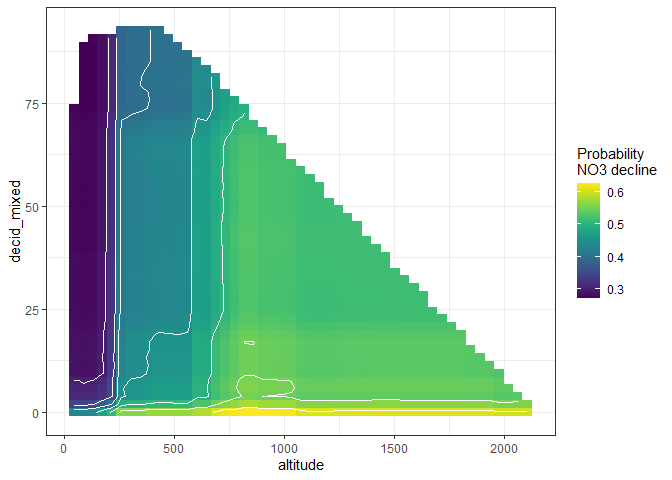

Methods and results - for report
================
DHJ
15 10 2021

-   [Overview of analyses](#overview-of-analyses)
-   [Short intro about trees and
    forests](#short-intro-about-trees-and-forests)
    -   [Measurements of variable
        importance](#measurements-of-variable-importance)
    -   [Predictions of the model](#predictions-of-the-model)
-   [Results](#results)
    -   [NO3 decrease](#no3-decrease)

## Overview of analyses

-   We performed four analyses:

    1.  How sites with decreasing NO3 differed from the other sites
        (i.e., a categorical response variable)
        -   response variable = `no3_decline`, defined as 1 if there was
            a significant decrease in NO3 over the period 1992-2016
            (`slope_no3_vs_time < 0 & p_no3_vs_time <= 0.05`)  
        -   I.e., sites with no NO3 trend and with increasing NO3 were
            treated the same  
    2.  How sites with decreasing TOC/TON differed from the other sites
        -   response variable = `tocton_decrease`, defined as 1 if there
            was a significant decrease in TOC/TON ratio
            (`slope_tocton_vs_time < 0 & p_tocton_vs_time <= 0.05`)  
    3.  How median NO3 2012-2016 differed among sites (i.e., a
        continuous response variable)
        -   response variable = log10(median_no3 + 0.1)  
    4.  How median TOC/TON ratio 2012-2016 differed among sites
        -   response variable = log10(median_tocton)

-   For analyses 1 and 2, we performed analyses using the following sets
    of predictor variables (N given for analysis 1):

    -   1.  All variables - N = 375 (none of the US stations have
            catchment area, so they are excluded)  

    -   2.  All variables except catchment area - N = 450 (lacking all
            Italian, Latvian, Irish stations, plus some German and
            Swedish ones)  

    -   3.  All variables except catchment area and TOC - N = 474
            (getting most IT,LV,IE,DE,SE stations, still lacking CH + 16
            US stations)  

    -   4.  All variables except catchment area and altitude - N = 450
            (same stations as in b)

-   For analyses 3, we performed analyses using the following sets of
    predictor variables:

    -   1.  All variables - N = 377 (no USA stations)  

    -   2.  All variables except catchment area and TOC - N = 457 (still
            lacking 16 US stations, plus most (9/11) Irish stations)

-   For analyses 4, we performed analyses using the following sets of
    predictor variables:

    -   1.  All variables including TOC and TON medians  

    -   2.  All variables excluding TOC and TON medians

-   All analysis were performed with ‘random forest analysis’ is an
    extension of ‘decision tree analysis’

## Short intro about trees and forests

-   In decision tree analysis, one first looks for the best variable A,
    an the best ‘splitting value’ x of that variable, to split the data
    in order to the response variable. In analysis 1 for instance, it
    may turn out that for stations with A \< x, 20% of the stations have
    `no3_decline`= 1, while for stations with A > x, 80% of the stations
    have `no3_decline`= 1. After this first split of the dataset, the
    procedure is repeated on each part of the data set (the A \< x part
    and the A > x). This results in a single decision tree.

-   The figure below is an example for ‘NO3 decrease’, where the data
    set is first split according to altitude (below or above 227
    m.a.s.l.), then each subset is split again two times (the
    first-split variable, altitude in this case, can have been used
    again for the next splits, but in this case it was outcompeted by
    other variables)

    -   The columns at the bottom shows the predictions of the model.
        E.g. for a site above 227 m.a.s.l. and with > 70%
        deciduous/mixed forest, only 10% of the stations had decreasing
        NO3_decline 

-   Two good things about decision trees are 1) they incorporate
    interactions between variables easily, and 2) they are easy to
    interpret. The bad thing is that we have no idea bout the
    uncertainty of the model and whether small changes in the data could
    have given us a very different tree. The random forest algorithm
    tries to fix that by making a large number of trees (e.g., 100
    trees), where the data used to make each tree differs slightly, in
    two ways: First, at each split, the algorithm randomly selects a
    subset of features which can be used as candidates for splitting the
    data. Secondly, each tree draws a random sample of data from the
    training dataset when generating its splits.

-   For further explanation, see this [non-technical
    introduction](https://victorzhou.com/blog/intro-to-random-forests/)
    or a [slightly more in-depth
    introduction](https://www.keboola.com/blog/random-forest-regression)

-   A main disadvantage of the random forest method is that it is hard
    to summarize the (e.g.) 100 different decision trees resulting from
    the method. There are mainly two aspects of this: Variable
    importance and model predictions.

### Measurements of variable importance

-   *times_a\_root*: how often the variable is the selected for the
    first split (the ‘root’ of the tree).

-   *mean_min_depth*: The ‘minimum depth’ of a variable in one tree is
    the level where it first was used (e.g. decid_mixed has level 2
    above). Then the mean of ‘minimum depth’ across trees is calculated.
    So this measure is related to ‘times_a\_root’: If ‘times_a\_root’ is
    low and ‘mean_min_depth’ is high, it means that this variable is
    important for only a subset of the data (after the data set first
    has been split up using other variables).

-   Example: When plotting these two measures against each other (see
    below), they show some level of agreement, with altitude and
    proportion of deciduous/mixed forest occupying the upper left
    corner, i.e. competing for being most important following these
    measures.

  

-   *gini_decrease*: the “Gini-Simpson index” (related to the ecological
    Simpson index) is a measure of “impurity” in the data set
    (ecologists would say ‘diversity’), and equals the probability that
    two stations picked at random have the same classification (e.g.,
    both have decreasing NO3). Each the data set is split in two in a
    decision tree, the Gini index decreases (one of the two data sets
    will have more no3_decline = 1 stations, the other will have more
    no3_decline = 0 stations). The Gini decrease for a variable measures
    how much the Gini-Simpson index decreases when the data set is split
    using that variable.

-   *accuracy_decrease* measures how much the accuracy decreases when
    the variable is removed from the model (where accuracy is measured
    by out-of-bag cross validated predictions)

-   Example: When plotting these two measures against each other (see
    below), they agree quite closely for the 6-7 most important
    variables. The most important variables occupy the upper right
    corner (which agree with the upper left corner of the plot above)

### Predictions of the model

For a single decision tree, prediction is simple, as shown above. For a
random forest, predicting the outcome for a certain value of a certain
variable is done by letting all other variables vary randomly, making
predictions for each tree, and then averaging the result. This must then
be repeated for a range of values for that variable. In order to
visualise interactions, one can also predict the outcome of combinations
of values for two predictor variables (letting the other variables vary
randomly). In the figures shown in the results, we have made predictions
for two predictor variables at a time (starting with the two most
important ones), making a ‘map’ where the colours of each cell indicate
the probability for NO3 decline for a station with this combination of
values.

-   Example: In the figure below, we show the models’ predicitions for a
    different combinations of altitude and proportion of deciduous/mixed
    forest. The lighter colors towards the right side indicate that the
    probability of NO3 decline increases with altitude. The yellow strip
    at the bottom indicates that the probability of NO3 decline is
    particularly high if there is approxmately zero deciduous/mixed
    forest. The uncoloured areas of the graph (the white areas) are
    non-existent combinations of the two variables.

## Results

### NO3 decrease
