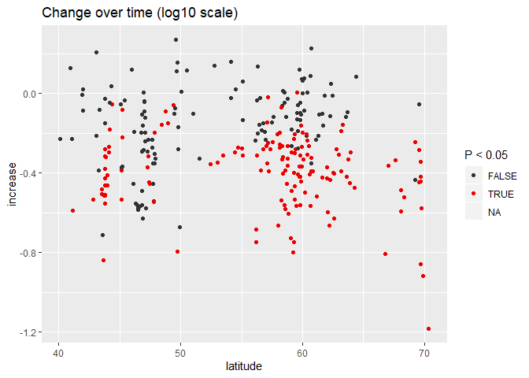
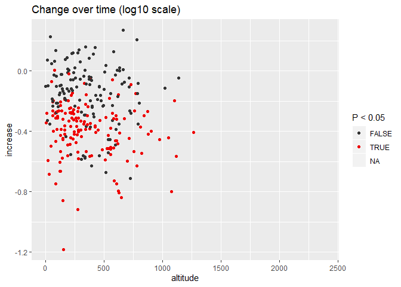
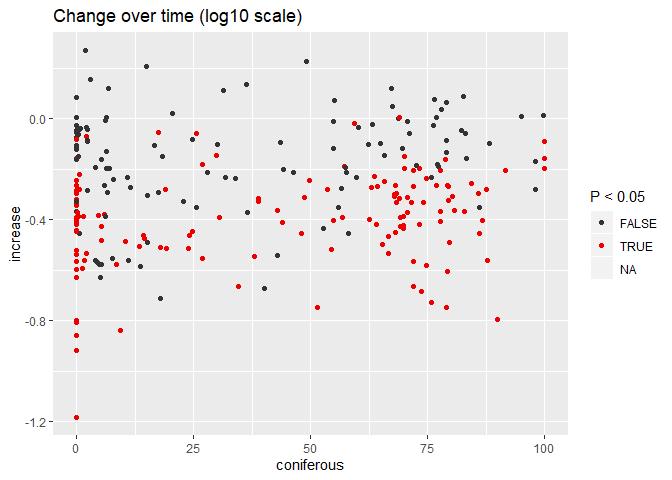
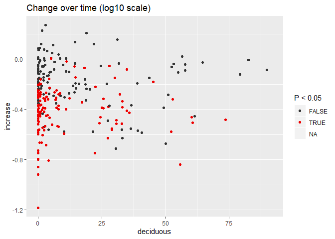
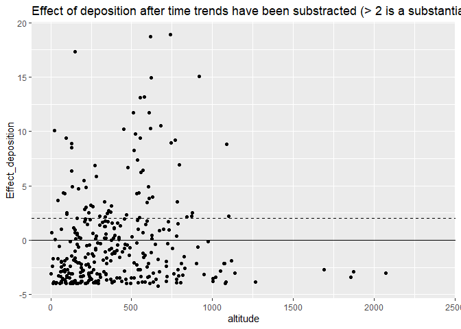
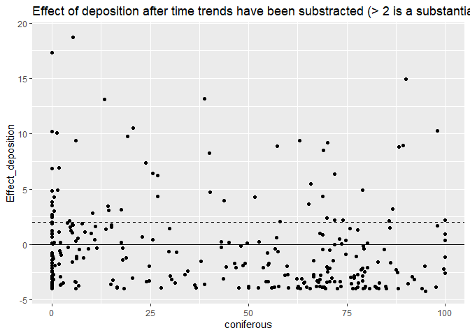
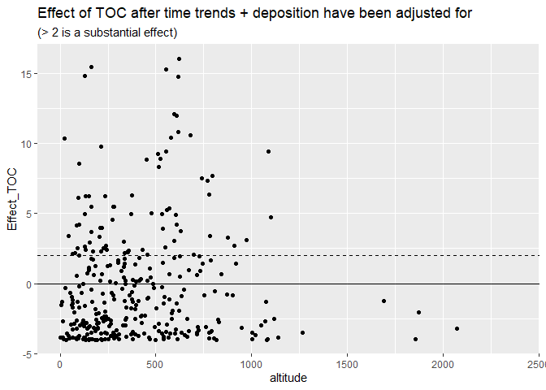
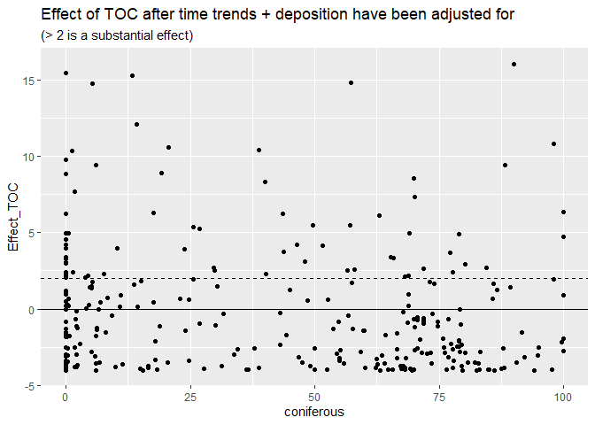

130\_Time\_series\_results
================
DHJ
8 5 2020

  - [1. Libraries](#libraries)
  - [2. Data](#data)
  - [3. Extraxt results as data frames](#extraxt-results-as-data-frames)
      - [Add AIC and p\_values to
        dat\_annual](#add-aic-and-p_values-to-dat_annual)
      - [Change over time](#change-over-time)
      - [Effect of totN\_deposition in addition to
        year](#effect-of-totn_deposition-in-addition-to-year)
      - [Effect of TOC in addition to year and
        totN\_deposition](#effect-of-toc-in-addition-to-year-and-totn_deposition)

## 1\. Libraries

``` r
# All of tehse packages cn be loaded at once using library(tidyverse). (I just like to be specific.)
library(dplyr)
library(purrr)
library(lubridate)
library(ggplot2)
library(forcats)
library(mgcv)
library(nlme)
```

## 2\. Data

``` r
dat_annual_sel_TOC <- readRDS("Data/120_dat_annual_sel_TOC.rds")
ts_model_list_with_TOC <- readRDS("Data/120_ts_model_list_with_TOC.rds")
# ts_model_list_wout_TOC <- readRDS("Data/120_ts_model_list_wout_TOC.rds")
```

## 3\. Extraxt results as data frames

Based on ts\_model\_list

``` r
ts_model_list <- ts_model_list_with_TOC
```

``` r
# Split data
dat_annual_split <- dat_annual_sel_TOC %>%
  filter(!is.na(TOC)) %>%
  group_by(station_id) %>%
  group_split()

# Name the split data
names(dat_annual_split) <- dat_annual_split %>% map_chr(~.$station_id[1])
```

adjustment\_ok

``` r
# Set names for result
names(ts_model_list$result) <- names(dat_annual_split)

# Which time series did not retun an error?
model_ok <- ts_model_list$error %>% map_lgl(is.null)
table(model_ok)
```

    ## model_ok
    ## FALSE  TRUE 
    ##    65   322

``` r
# Length of result: 4 if TOC is not included, 8 if TOC is included
result_length <- ts_model_list$result %>% map_int(length)

# Check contents of $result
ts_model_list$result[[1]][1:3] %>% str(2)
```

    ## List of 3
    ##  $ :List of 2
    ##   ..$ lme:List of 18
    ##   .. ..- attr(*, "class")= chr "lme"
    ##   ..$ gam:List of 31
    ##   .. ..- attr(*, "class")= chr "gam"
    ##   ..- attr(*, "class")= chr [1:2] "gamm" "list"
    ##  $ :List of 2
    ##   ..$ lme:List of 18
    ##   .. ..- attr(*, "class")= chr "lme"
    ##   ..$ gam:List of 31
    ##   .. ..- attr(*, "class")= chr "gam"
    ##   ..- attr(*, "class")= chr [1:2] "gamm" "list"
    ##  $ :List of 2
    ##   ..$ lme:List of 18
    ##   .. ..- attr(*, "class")= chr "lme"
    ##   ..$ gam:List of 31
    ##   .. ..- attr(*, "class")= chr "gam"
    ##   ..- attr(*, "class")= chr [1:2] "gamm" "list"

AIC

``` r
get_gamm_anova_with_TOC <- function(model_list){
  anova(model_list[[1]]$lme, 
        model_list[[2]]$lme, 
        model_list[[3]]$lme,
        model_list[[5]]$lme, 
        model_list[[6]]$lme, 
        model_list[[7]]$lme
        )
}
# ts_model_list$result[[1]] %>% str(1)
# get_gamm_anova_with_TOC(ts_model_list$result[[1]])

# FOR LATER
# get_aic_wout_TOC <- function(model_list){
#   aic <- get_gamm_anova_wout_TOC(model_list)$AIC %>% matrix(nrow = 1) %>% data.frame() 
#   result <- data.frame(aic, NA, NA, NA)
#   names(result) <- paste0("AIC_", c(1,2,3,5,6,7))
#   result
# }
# get_aic_wout_TOC(ts_model_list$result[[1]])

get_aic_with_TOC <- function(model_list){
  result <- get_gamm_anova_with_TOC(model_list)$AIC %>% matrix(nrow = 1) %>% data.frame() 
  aic4 <- AIC(model_list[[4]])
  result <- data.frame(result[,1:3], aic4, result[,4:6])
  names(result) <- paste0("AIC_", 1:7)
  result
}
# get_aic_with_TOC(ts_model_list$result[[1]])

aic <- ts_model_list$result[model_ok] %>% map_df(get_aic_with_TOC, .id = "station_id")

aic <- aic %>%
  mutate(AIC_min = pmin(AIC_1, AIC_2, AIC_3, AIC_4, AIC_5, AIC_6, AIC_7),
         dAIC_1 = AIC_1 - AIC_min,
         dAIC_2 = AIC_2 - AIC_min,
         dAIC_3 = AIC_3 - AIC_min,
         dAIC_4 = AIC_4 - AIC_min,
         dAIC_5 = AIC_5 - AIC_min,
         dAIC_6 = AIC_6 - AIC_min,
         dAIC_7 = AIC_7 - AIC_min)

# best model 
# Note hard-coded "9"
aic <- aic %>%
  mutate(AIC_best = apply(aic == 0, 1, which) - 9)
```

p-values

``` r
# ts_model_list$result[[1]] %>% str(2)
# ts_model_list$result[[1]][[1]] %>% str(1)
# summary(ts_model_list$result[[1]][[3]]$gam)$s.table
# x <- summary(ts_model_list$result[[1]][[3]]$gam)$s.table
# str(x)
# x[,4]

get_p <- function(model_list){
  tab1 <- summary(model_list[[1]]$gam)$s.table
  tab2 <- summary(model_list[[2]]$gam)$s.table
  tab3 <- summary(model_list[[3]]$gam)$s.table
  data.frame(year_m1 = tab1[1,4],
             totn_m2 = tab2[1,4],
             year_m3 = tab3[2,4],
             totn_m3 = tab3[1,4])
}
# get_p(ts_model_list$result[[1]])

p_values <- ts_model_list$result[model_ok] %>% map_df(get_p, .id = "station_id")
```

Predict

``` r
# predict(ts_model_list$result[[1]][[1]]$gam, data.frame(year = 1992:2020))
# ts_model_list$result[[1]]$years

get_predictions_time <- function(model_list){
  years <- seq(
    min(model_list$years),
    max(model_list$years)
  )
  pred <- predict(model_list[[1]]$gam, data.frame(year = years))
  data.frame(year = years, log_NO3_pred = pred)
}

# Test
# get_predictions_time(ts_model_list$result[[1]])

get_increase <- function(model_list){
  df_pred <- get_predictions_time(model_list)
  value1 <- df_pred %>%
    filter(year %in% 1992:1994) %>%
    pull(log_NO3_pred) %>%
    mean()
  value2 <- df_pred %>%
    filter(year %in% 2014:2016) %>%
    pull(log_NO3_pred) %>%
    mean()
  data.frame(increase = value2 - value1)
  }
# test
# get_increase(ts_model_list$result[[1]])

increase <- ts_model_list$result[model_ok] %>% map_df(get_increase, .id = "station_id")
```

### Add AIC and p\_values to dat\_annual

``` r
dat_annual2 <- dat_annual_sel_TOC %>%
  left_join(aic, by = "station_id") %>%
  left_join(p_values, by = "station_id") %>%
  left_join(increase, by = "station_id")
```

### Change over time

``` r
ggplot(dat_annual2, aes(longitude, latitude, color = increase)) +
  geom_point() +
  scale_color_gradient2("Change", midpoint = 0) +
  labs(title = "Change over time (log10 scale)")
```

<!-- -->

``` r
ggplot(dat_annual2, aes(latitude, increase, color = factor(year_m1 <= 0.05))) +
  geom_point() +
  scale_color_manual("P < 0.05", values = c("grey20", "red2")) +
  labs(title = "Change over time (log10 scale)")
```

    ## Warning: Removed 2166 rows containing missing values (geom_point).

<!-- -->

``` r
ggplot(dat_annual2, aes(altitude, increase, color = factor(year_m1 <= 0.05))) +
  geom_point() +
  scale_color_manual("P < 0.05", values = c("grey20", "red2")) +
  labs(title = "Change over time (log10 scale)")
```

    ## Warning: Removed 2166 rows containing missing values (geom_point).

<!-- -->

``` r
ggplot(dat_annual2, aes(coniferous, increase, color = factor(year_m1 <= 0.05))) +
  geom_point() +
  scale_color_manual("P < 0.05", values = c("grey20", "red2")) +
  labs(title = "Change over time (log10 scale)")
```

    ## Warning: Removed 2713 rows containing missing values (geom_point).

<!-- -->

``` r
ggplot(dat_annual2, aes(deciduous, increase, color = factor(year_m1 <= 0.05))) +
  geom_point() +
  scale_color_manual("P < 0.05", values = c("grey20", "red2")) +
  labs(title = "Change over time (log10 scale)")
```

    ## Warning: Removed 2713 rows containing missing values (geom_point).

<!-- -->

### Effect of totN\_deposition in addition to year

Model 3 vs model 2  
Higher is better

``` r
dat_annual2 %>%
  mutate(Effect_deposition = AIC_2 - AIC_3) %>%
  ggplot(aes(latitude, Effect_deposition)) +
  geom_point() +
  geom_hline(yintercept = 0) + geom_hline(yintercept = 2, linetype = 2) + 
  labs(title = "Effect of deposition after time trends have been substracted (> 2 is a substantial effect)")
```

    ## Warning: Removed 1510 rows containing missing values (geom_point).

<!-- -->

``` r
dat_annual2 %>%
  mutate(Effect_deposition = AIC_2 - AIC_3) %>%
  ggplot(aes(altitude, Effect_deposition)) +
  geom_point() +
  geom_hline(yintercept = 0) + geom_hline(yintercept = 2, linetype = 2) + 
  labs(title = "Effect of deposition after time trends have been substracted (> 2 is a substantial effect)")
```

    ## Warning: Removed 1510 rows containing missing values (geom_point).

<!-- -->

``` r
dat_annual2 %>%
  mutate(Effect_deposition = AIC_2 - AIC_3) %>%
  ggplot(aes(coniferous, Effect_deposition)) +
  geom_point() +
  geom_hline(yintercept = 0) + geom_hline(yintercept = 2, linetype = 2) + 
  labs(title = "Effect of deposition after time trends have been substracted (> 2 is a substantial effect)")
```

    ## Warning: Removed 2191 rows containing missing values (geom_point).

<!-- -->

### Effect of TOC in addition to year and totN\_deposition

Model 7 vs model 6  
Higher is better

``` r
df <- dat_annual2 %>%
  mutate(Effect_TOC = AIC_6 - AIC_7)

ggplot(df, aes(latitude, Effect_TOC)) +
  geom_point() +
  geom_hline(yintercept = 0) + geom_hline(yintercept = 2, linetype = 2) + 
  labs(title = "Effect of TOC after time trends + deposition have been adjusted for", subtitle = "(> 2 is a substantial effect)")
```

    ## Warning: Removed 1510 rows containing missing values (geom_point).

<!-- -->

``` r
ggplot(df, aes(altitude, Effect_TOC)) +
  geom_point() +
  geom_hline(yintercept = 0) + geom_hline(yintercept = 2, linetype = 2) + 
  labs(title = "Effect of TOC after time trends + deposition have been adjusted for", subtitle = "(> 2 is a substantial effect)")
```

    ## Warning: Removed 1510 rows containing missing values (geom_point).

<!-- -->

``` r
ggplot(df, aes(coniferous, Effect_TOC)) +
  geom_point() +
  geom_hline(yintercept = 0) + geom_hline(yintercept = 2, linetype = 2) + 
  labs(title = "Effect of TOC after time trends + deposition have been adjusted for", subtitle = "(> 2 is a substantial effect)")
```

    ## Warning: Removed 2191 rows containing missing values (geom_point).

<!-- -->
