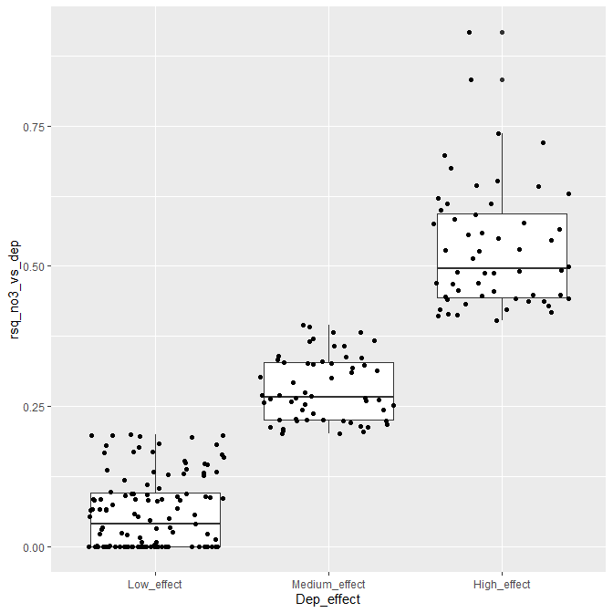

130\_Time\_series\_results
================
DHJ
8 5 2020

  - [1. Libraries](#libraries)
  - [2. Data](#data)
  - [3. Make ‘result\_list’](#make-result_list)
  - [4. Explote AIC values](#explote-aic-values)
      - [Extract dAIC for NO3 models](#extract-daic-for-no3-models)
      - [Show all AICs](#show-all-aics)
      - [Check how often adding climate to deposition improves the
        model](#check-how-often-adding-climate-to-deposition-improves-the-model)
  - [5. Rsq of the regression nitrate as function of deposition (model
    2)](#rsq-of-the-regression-nitrate-as-function-of-deposition-model-2)
      - [Extract R-sq’s](#extract-r-sqs)
      - [Plot R-sqs](#plot-r-sqs)
      - [Examples](#examples)
  - [6. What separates stations with little/strong effect of deposition
    on
    NO3](#what-separates-stations-with-littlestrong-effect-of-deposition-on-no3)
      - [Select cases](#select-cases)
      - [Data](#data-1)
      - [Multiple GAM](#multiple-gam)
      - [Random forest, classification](#random-forest-classification)
      - [Random forest, regression](#random-forest-regression)

## 1\. Libraries

``` r
# All of tehse packages cn be loaded at once using library(tidyverse). (I just like to be specific.)
library(dplyr)
library(tidyr)
library(purrr)
library(lubridate)
library(ggplot2)
library(forcats)
library(mgcv)
library(nlme)

library(MuMIn)
# install.packages("randomForest")
library(randomForest)

library(maps)
my_map <- map_data("world")
```

## 2\. Data

``` r
dat_annual_sel <- readRDS("Data/120_dat_annual_sel.rds")
ts_model_list <- readRDS("Data/120_ts_model_list.rds")
# ts_model_list_wout_TOC <- readRDS("Data/120_ts_model_list_wout_TOC.rds")

df_stations <- readRDS("Data/100_Stations.rds")
df_deposition <- readRDS("Data/100_Deposition.rds")
df_climate <- readRDS("Data/100_Climate.rds")
```

## 3\. Make ‘result\_list’

adjustment\_ok

``` r
# Which time series did not retun an error?
model_ok <- ts_model_list$error %>% map_lgl(is.null)
table(model_ok)
```

    ## model_ok
    ## FALSE  TRUE 
    ##    69   329

``` r
# Length of result: 4 if TOC is not included, 8 if TOC is included
result_length <- ts_model_list$result %>% map_int(length)

# Check contents of $result
# $result[[1]][1:3] %>% str(2)

result_list <- ts_model_list$result[model_ok]
```

## 4\. Explote AIC values

All models:  
c(“Time”, “Dep”, “P”, “T”, “P+T”, “Dep+P”, “Dep+T”, “Dep+P+T”,
“Dep\_vs\_time”, “P\_vs\_time”, “T\_vs\_time”)

### Extract dAIC for NO3 models

Not including the last three

``` r
model_labels <- 
  c("Time", "Dep", "P", "T", "P_T", "Dep_P", "Dep_T", "Dep_P_T")


get_anova <- function(model_list){
  anova(model_list[[1]]$lme, 
        model_list[[2]]$lme, 
        model_list[[3]]$lme,
        model_list[[4]]$lme,
        model_list[[5]]$lme, 
        model_list[[6]]$lme, 
        model_list[[7]]$lme,
        model_list[[8]]$lme
        )
}


# get_anova(result_list[[1]])

get_aic <- function(model_list){
  aic <- get_anova(model_list)$AIC
  daic <- aic - min(aic)
  df <- daic %>% matrix(nrow = 1) %>% data.frame() 
  names(df) <- model_labels
  data.frame(df, aic_min = min(aic), aic_best = which.min(aic))
}

get_aic_without_time <- function(model_list){
  aic <- get_anova(model_list)$AIC[-1]
  daic <- aic - min(aic)
  df <- daic %>% matrix(nrow = 1) %>% data.frame() 
  names(df) <- model_labels[-1]
  data.frame(df, aic_min = min(aic), aic_best = which.min(aic))
}

# get_aic(result_list[[1]])

daic <- result_list %>% map_df(get_aic, .id = "station_id")
daic_without_time <- result_list %>% map_df(get_aic, .id = "station_id")
```

### Show all AICs

``` r
df <- daic %>%
  select(station_id, Time:Dep_P_T) %>%
  tidyr::pivot_longer(Time:Dep_P_T, names_to = "Model", values_to = "dAIC") %>%
  mutate(Model = forcats::fct_inorder(Model))

df_without_time <- daic_without_time %>%
  select(station_id, Dep:Dep_P_T) %>%
  tidyr::pivot_longer(Dep:Dep_P_T, names_to = "Model", values_to = "dAIC") %>%
  mutate(Model = forcats::fct_inorder(Model))

df %>%
  filter(dAIC == 0) %>%
  ggplot(aes(Model)) +
  geom_histogram(stat = "count") +
  labs(tilte = "Best model")
```

    ## Warning: Ignoring unknown parameters: binwidth, bins, pad

<!-- -->

``` r
df_without_time %>%
  filter(dAIC == 0) %>%
  ggplot(aes(Model)) +
  geom_histogram(stat = "count") +
  labs(tilte = "Best model, not including the 'time' model")
```

    ## Warning: Ignoring unknown parameters: binwidth, bins, pad

<!-- -->

``` r
ggplot(df, aes(Model, dAIC)) +
  geom_boxplot()
```

<!-- -->

``` r
ggplot(df, aes(Model, station_id, fill = dAIC)) +
  geom_raster()
```

<!-- -->

### Check how often adding climate to deposition improves the model

Improves model if the point is under the line  
\- Conclusion: not so often

``` r
ggplot(daic, aes(Dep, Dep_P)) +
  geom_point() +
  geom_abline(intercept = 0, slope = 1)
```

<!-- -->

``` r
ggplot(daic, aes(Dep, Dep_T)) +
  geom_point() +
  geom_abline(intercept = 0, slope = 1)
```

<!-- -->

``` r
ggplot(daic, aes(Dep, Dep_P_T)) +
  geom_point() +
  geom_abline(intercept = 0, slope = 1)
```

<!-- -->

## 5\. Rsq of the regression nitrate as function of deposition (model 2)

### Extract R-sq’s

Models  
\- model 2: effect of deposition on NO3 - model 9: time trend in
deposition

``` r
# summary(result_list[[1]][[2]]$gam)$r.sq

rsq_no3_vs_dep <- result_list %>% 
  map_dbl(~summary(.[[2]]$gam)$r.sq)
rsq_dep_vs_time <- result_list %>% 
  map_dbl(~summary(.[[9]]$gam)$r.sq)

rsq <- tibble(
  station_id = names(rsq_no3_vs_dep),
  rsq_no3_vs_dep,
  rsq_dep_vs_time
)

# rsq
```

### Plot R-sqs

Interpretaton:  
\- Upper right = models with strong time trend in deposition and strong
effect of deposition on NO3  
\- Lower right = models with strong time trend in deposition but
nevertheless small effect of deposition on NO3  
\- Lower left = models with weak time trend in deposition and (for that
reason) small effect of deposition on NO3

Dotted lines are used in part 6:  
\- time series to the left of vertical dotted line are not used (low
variation in deposition)  
\- time series to the right of vertical dotted line: \* R-sq of
deposition on NO3 (vertical scale) used in GAM and random forest
regression \* Classification by horizontal lines used in random forest
classification

``` r
rsq %>%
  mutate(
    rsq_no3_vs_dep = case_when(
      rsq_no3_vs_dep < 0 ~ 0,
      rsq_no3_vs_dep >= 0 ~ rsq_no3_vs_dep)
  ) %>%
  ggplot(aes(rsq_dep_vs_time, rsq_no3_vs_dep)) + 
  geom_point() +
  geom_hline(yintercept = c(0.2, 0.4), linetype = "dashed") +
  geom_vline(xintercept = 0.7, linetype = "dashed")
```

<!-- -->

### Examples

#### Strong time trend in deposition (Rsq 0.91), strong effect of deposition on NO3 (Rsq 0.64)

``` r
id <- "38299"

filter(rsq, station_id == id)
```

    ## # A tibble: 1 x 3
    ##   station_id rsq_no3_vs_dep rsq_dep_vs_time
    ##   <chr>               <dbl>           <dbl>
    ## 1 38299               0.643           0.909

``` r
par(mfrow = c(1,2), mar = c(4,5,2,1))
plot(result_list[[id]][[2]]$gam, res = TRUE, pch = 1)
plot(result_list[[id]][[9]]$gam, res = TRUE, pch = 1)
```

<!-- -->

#### Strong time trend in deposition (Rsq 0.8), clear but weaker effect of deposition on NO3 (Rsq 0.4)

``` r
id <- "38090"

filter(rsq, station_id == id)
```

    ## # A tibble: 1 x 3
    ##   station_id rsq_no3_vs_dep rsq_dep_vs_time
    ##   <chr>               <dbl>           <dbl>
    ## 1 38090               0.413           0.810

``` r
par(mfrow = c(1,2), mar = c(4,5,2,1))
plot(result_list[[id]][[2]]$gam, res = TRUE, pch = 1)
plot(result_list[[id]][[9]]$gam, res = TRUE, pch = 1)
```

<!-- -->

#### Strong time trend in deposition (0.9), little effect of deposition on NO3 (Rsq 0.17)

``` r
id <- "23478"

filter(rsq, station_id == id)
```

    ## # A tibble: 1 x 3
    ##   station_id rsq_no3_vs_dep rsq_dep_vs_time
    ##   <chr>               <dbl>           <dbl>
    ## 1 23478               0.166           0.887

``` r
par(mfrow = c(1,2), mar = c(4,5,2,1))
plot(result_list[[id]][[2]]$gam, res = TRUE, pch = 1)
plot(result_list[[id]][[9]]$gam, res = TRUE, pch = 1)
```

<!-- -->

#### Weak time trend in deposition (Rsq 0.35), weak effect of deposition on NO3

``` r
id <- "38478"

filter(rsq, station_id == id)
```

    ## # A tibble: 1 x 3
    ##   station_id rsq_no3_vs_dep rsq_dep_vs_time
    ##   <chr>               <dbl>           <dbl>
    ## 1 38478               0.354           0.326

``` r
par(mfrow = c(1,2), mar = c(4,5,2,1))
plot(result_list[[id]][[2]]$gam, res = TRUE, pch = 1)
plot(result_list[[id]][[9]]$gam, res = TRUE, pch = 1)
```

<!-- -->

## 6\. What separates stations with little/strong effect of deposition on NO3

Analysis of time series with relatively strong time trend in deposition

### Select cases

``` r
rsq <- rsq %>%
  mutate(Dep_effect = 
           case_when(
             rsq_dep_vs_time < 0.7 ~ "Expected_low",
             rsq_no3_vs_dep < 0.20 ~ "Low_effect",
             rsq_no3_vs_dep < 0.40 ~ "Medium_effect",
             rsq_no3_vs_dep > 0.40 ~ "High_effect")
  ) %>%
  mutate(station_id = as.numeric(station_id))

table(rsq$Dep_effect)
```

    ## 
    ##  Expected_low   High_effect    Low_effect Medium_effect 
    ##            71            59           138            61

### Data

Adding mean deposition and mean precipitation + temeprature  
\- Exclude time series with “Expected\_low” - i.e., weak time series
trends in deposition

``` r
df_deposition_mean <-
  df_deposition %>% 
  group_by(station_id) %>% 
  summarise(Mean_dep = mean(TOTN_dep))

df_climate_mean <- df_climate %>%
  group_by(station_id, variable) %>% 
  summarise(mean = mean(value)) %>%
  tidyr::pivot_wider(names_from = "variable", values_from = "mean", names_prefix = "Mean_")


# df_stations %>% filter(is.na(coniferous))

df_stations2 <- df_stations %>%
  select(station_id, 
         coniferous, deciduous, lake, mixed_forest, wetland) %>%
  filter(!is.na(coniferous))
apply(is.na(df_stations2), 2, sum)
```

    ##   station_id   coniferous    deciduous         lake mixed_forest      wetland 
    ##            0            0            0            0            0            0

``` r
data_select <- df_stations2 %>% 
  left_join(df_deposition_mean, by  = "station_id") %>%
  left_join(df_climate_mean, by  = "station_id") %>%
  left_join(rsq, by  = "station_id") %>%
  # Exclude time series with "Expected_low" - i.e., weak time series trends in deposition
  filter(Dep_effect %in% c("Low_effect", "Medium_effect", "High_effect") ) %>%
  select(station_id, Dep_effect, rsq_no3_vs_dep, coniferous:Mean_tmp) %>%
  mutate(
    rsq_no3_vs_dep = case_when(
      rsq_no3_vs_dep < 0 ~ 0,
      rsq_no3_vs_dep >= 0 ~ rsq_no3_vs_dep),
    Dep_effect = factor(Dep_effect, 
                             levels = c("Low_effect", "Medium_effect", "High_effect")
                             ),
    coniferous = log(coniferous + 1), deciduous = log(deciduous + 1), lake = log(lake + 1), 
    mixed_forest = log(mixed_forest + 1), wetland = log(wetland + 1)
    ) %>%
  as.data.frame() 
# %>%
#   mutate(Dep_effect2 = case_when(
#     Dep_effect == "Low_effect" ~ 1,
#     Dep_effect == "Medium_effect" ~ 2,
#     Dep_effect == "High_effect" ~ 3)
#   ) %>% 
#   select(-Dep_effect)

rownames(data_select) <- data_select$station_id
data_select$station_id <- NULL

# Check missing values 
apply(is.na(data_select), 2, sum)
```

    ##     Dep_effect rsq_no3_vs_dep     coniferous      deciduous           lake 
    ##              0              0              0              0              0 
    ##   mixed_forest        wetland       Mean_dep       Mean_pre       Mean_tmp 
    ##              0              0              0              0              0

``` r
# 
table(addNA(data_select$Dep_effect))
```

    ## 
    ##    Low_effect Medium_effect   High_effect          <NA> 
    ##           123            58            56             0

``` r
# For making mutate code
# x1 <- data_select %>% names()
# x2 <- paste0(
#   paste0(x, " = "), paste0("log(", x, " + 1)")
# )
# x2 %>% paste(collapse = ", ")
```

### Multiple GAM

#### Plot

``` r
ggplot(data_select, aes(Dep_effect, rsq_no3_vs_dep)) +
  geom_boxplot() +
  geom_jitter()
```

<!-- -->

``` r
plot(data_select %>% select(-Dep_effect))
```

<!-- -->

#### Data

``` r
data_mumin <- data_select %>% 
  select(-Dep_effect)

# RUN AND SAVED ONLY INTERACTIVELY - because this fails when knitting Rmd documnet
# saveRDS(data_mumin, "Data/130_data_mumin.rds")
```

#### Find best models

``` r
# For making formula
# x <- data_select %>% names()
# paste0("s(", x, ", k = 3)") %>% paste(collapse = " + ")

data_mumin <- readRDS("Data/130_data_mumin.rds")

# Check for NAs
# apply(is.na(data_mumin), 2, sum)

# Check mean values
# apply(data_mumin, 2, mean)

mod_complete <- gam(rsq_no3_vs_dep ~ 
             s(coniferous, k = 3) + s(deciduous, k = 3) + s(lake, k = 3) + 
             s(mixed_forest, k = 3) + s(wetland, k = 3) + 
             s(Mean_dep, k = 3) + s(Mean_pre, k = 3) + s(Mean_tmp, k = 3), 
           data = data_mumin,
           na.action = "na.fail")
# RUN AND SAVED ONLY INTERACTIVELY - because this fails when knitting Rmd documnet
# summary(mod_complete)
# dd <- dredge(mod_complete)
# saveRDS(dd, "Data/130_mumin_object.rds")
dd <- readRDS("Data/130_mumin_object.rds")
```

#### Best models

``` r
subset(dd, delta < 2)
```

    ## Global model call: gam(formula = rsq_no3_vs_dep ~ s(coniferous, k = 3) + s(deciduous, 
    ##     k = 3) + s(lake, k = 3) + s(mixed_forest, k = 3) + s(wetland, 
    ##     k = 3) + s(Mean_dep, k = 3) + s(Mean_pre, k = 3) + s(Mean_tmp, 
    ##     k = 3), data = data_mumin, na.action = "na.fail")
    ## ---
    ## Model selection table 
    ##     (Int) s(cnf,3) s(dcd,3) s(lak,3) s(Men_dep,3) s(Men_pre,3) s(Men_tmp,3)
    ## 8  0.2261        +        +        +                                       
    ## 7  0.2261                 +        +                                       
    ## 23 0.2261                 +        +                         +             
    ## 24 0.2261        +        +        +                         +             
    ## 16 0.2261        +        +        +            +                          
    ## 40 0.2261        +        +        +                                      +
    ## 72 0.2261        +        +        +                                       
    ##    s(mxd_frs,3) df logLik  AICc delta weight
    ## 8                5 47.834 -84.4  0.00  0.269
    ## 7                4 46.010 -83.1  1.25  0.144
    ## 23               5 46.668 -83.1  1.29  0.141
    ## 24               6 47.970 -82.8  1.55  0.124
    ## 16               6 48.218 -82.8  1.60  0.121
    ## 40               6 48.057 -82.4  1.96  0.101
    ## 72            +  6 47.871 -82.4  1.99  0.100
    ## Models ranked by AICc(x)

#### Plot 3 best models

PLus ANOVA table for best model;

``` r
#'Best' models

# RUN AND SAVED ONLY INTERACTIVELY - because this fails when knitting Rmd documnet
# best_models <- list(
#   get.models(dd, 1)[[1]],
#   get.models(dd, 2)[[1]],
#   get.models(dd, 3)[[1]]
# )
# saveRDS(best_models, "Data/130_best_models.rds")

best_models <- readRDS("Data/130_best_models.rds")

summary(best_models[[1]])$s.table
```

    ##                   edf   Ref.df         F      p-value
    ## s(coniferous) 1.00000 1.000000  3.290411 7.095266e-02
    ## s(deciduous)  1.00000 1.000000 18.441956 2.542797e-05
    ## s(lake)       1.49561 1.745591  2.743986 4.786720e-02

``` r
par(mfrow = c(3,4), mar = c(4,5,2,1))
plot(best_models[[1]], res = TRUE, pch = 1)
par(mfg = c(2,1))
plot(best_models[[2]], res = TRUE, pch = 1)
par(mfg = c(3,1))
plot(best_models[[3]], res = TRUE, pch = 1)
```

<!-- -->

### Random forest, classification

#### Split into training and validation data

``` r
# data_select$Dep_effect2 <- as.factor(data_select$Dep_effect2)

set.seed(123)

x <- runif(nrow(data_select))
train <- ifelse(x < 0.8, TRUE, FALSE)

train_set <- data_select[train,] %>% select(-rsq_no3_vs_dep)
valid_set <- data_select[!train,] %>% select(-rsq_no3_vs_dep) 
```

#### Analysis

``` r
model1 <- randomForest(Dep_effect ~ ., 
                       data = train_set, 
                       mtry = 4,
                       importance = TRUE)

model1
```

    ## 
    ## Call:
    ##  randomForest(formula = Dep_effect ~ ., data = train_set, mtry = 4,      importance = TRUE) 
    ##                Type of random forest: classification
    ##                      Number of trees: 500
    ## No. of variables tried at each split: 4
    ## 
    ##         OOB estimate of  error rate: 59.28%
    ## Confusion matrix:
    ##               Low_effect Medium_effect High_effect class.error
    ## Low_effect            59            23          17   0.4040404
    ## Medium_effect         35            10           6   0.8039216
    ## High_effect           31             3          10   0.7727273

#### Predict on training data

``` r
# Predicting on train set
pred_valid <- predict(model1, valid_set, type = "class")
# Checking classification accuracy
table(pred_valid, valid_set$Dep_effect)  
```

    ##                
    ## pred_valid      Low_effect Medium_effect High_effect
    ##   Low_effect            20             5           7
    ##   Medium_effect          3             1           1
    ##   High_effect            1             1           4

#### Importance

High MeanDecreaseGini = high importance in
    model

``` r
randomForest::importance(model1)
```

    ##              Low_effect Medium_effect High_effect MeanDecreaseAccuracy
    ## coniferous    6.0625791    -1.1532905   -2.181982            3.5808483
    ## deciduous     4.7162546     4.0610976    6.801400            8.1723719
    ## lake          2.2160623    -5.1712967    1.046580           -0.3746233
    ## mixed_forest  4.9479066    -2.2451727    4.132561            4.6674392
    ## wetland       0.0265033    -0.3967775    4.556627            2.4212919
    ## Mean_dep      5.3177554    -1.5465078   -6.087018            0.5832684
    ## Mean_pre     -0.4353579     2.0373742   -4.998538           -1.8171435
    ## Mean_tmp      7.4487956    -1.4280235   -2.526465            4.1225071
    ##              MeanDecreaseGini
    ## coniferous           13.67862
    ## deciduous            16.64861
    ## lake                 16.10763
    ## mixed_forest         12.63762
    ## wetland              11.36081
    ## Mean_dep             17.46218
    ## Mean_pre             15.65897
    ## Mean_tmp             15.34305

``` r
varImpPlot(model1)
```

<!-- -->

### Random forest, regression

#### Split into training and validation data

``` r
# data_select$Dep_effect2 <- as.factor(data_select$Dep_effect2)

set.seed(123)

x <- runif(nrow(data_select))
train <- ifelse(x < 0.8, TRUE, FALSE)

train_set <- data_select[train,] %>% select(-Dep_effect)
valid_set <- data_select[!train,] %>% select(-Dep_effect) 
```

#### Analysis

``` r
model2 <- randomForest(rsq_no3_vs_dep ~ ., 
                       data = train_set, 
                       mtry = 4,
                       importance = TRUE)

model2
```

    ## 
    ## Call:
    ##  randomForest(formula = rsq_no3_vs_dep ~ ., data = train_set,      mtry = 4, importance = TRUE) 
    ##                Type of random forest: regression
    ##                      Number of trees: 500
    ## No. of variables tried at each split: 4
    ## 
    ##           Mean of squared residuals: 0.04077336
    ##                     % Var explained: -2.76

#### Importance

High MeanDecreaseGini = high importance in model

``` r
randomForest::importance(model2)
```

    ##                %IncMSE IncNodePurity
    ## coniferous    2.985782     0.7965861
    ## deciduous     5.608710     1.0009381
    ## lake         -1.064264     0.8302182
    ## mixed_forest 11.823985     0.7539584
    ## wetland       3.534004     0.6952950
    ## Mean_dep      2.076887     0.9992132
    ## Mean_pre      3.670766     1.1389070
    ## Mean_tmp      6.559421     0.8596048

``` r
varImpPlot(model2)
```

<!-- -->
