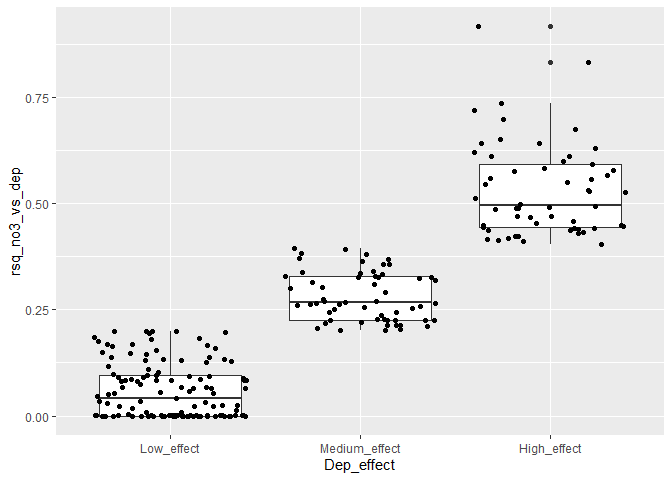

## 1. Libraries  

```r
# All of tehse packages cn be loaded at once using library(tidyverse). (I just like to be specific.)
library(dplyr)
library(tidyr)
library(purrr)
library(lubridate)
library(ggplot2)
library(forcats)
library(mgcv)
library(nlme)

library(MuMIn)
# install.packages("randomForest")
library(randomForest)

library(maps)
my_map <- map_data("world")
```


## 2. Data

```r
dat_annual_sel <- readRDS("Data/120_dat_annual_sel.rds")
ts_model_list <- readRDS("Data/120_ts_model_list.rds")
# ts_model_list_wout_TOC <- readRDS("Data/120_ts_model_list_wout_TOC.rds")

df_stations <- readRDS("Data/100_Stations.rds")
df_deposition <- readRDS("Data/100_Deposition.rds")
df_climate <- readRDS("Data/100_Climate.rds")
```


## 3. Make 'result_list'     

adjustment_ok

```r
# Which time series did not retun an error?
model_ok <- ts_model_list$error %>% map_lgl(is.null)
table(model_ok)
```

```
## model_ok
## FALSE  TRUE 
##    69   329
```

```r
# Length of result: 4 if TOC is not included, 8 if TOC is included
result_length <- ts_model_list$result %>% map_int(length)

# Check contents of $result
# $result[[1]][1:3] %>% str(2)

result_list <- ts_model_list$result[model_ok]
```


## 4. Explote AIC values 
All models:  
  c("Time", "Dep", "P", "T", "P+T", "Dep+P", "Dep+T", "Dep+P+T", "Dep_vs_time", "P_vs_time", "T_vs_time")


### Extract dAIC for NO3 models   
Not including the last three  

```r
model_labels <- 
  c("Time", "Dep", "P", "T", "P_T", "Dep_P", "Dep_T", "Dep_P_T")


get_anova <- function(model_list){
  anova(model_list[[1]]$lme, 
        model_list[[2]]$lme, 
        model_list[[3]]$lme,
        model_list[[4]]$lme,
        model_list[[5]]$lme, 
        model_list[[6]]$lme, 
        model_list[[7]]$lme,
        model_list[[8]]$lme
        )
}


# get_anova(result_list[[1]])

get_aic <- function(model_list){
  aic <- get_anova(model_list)$AIC
  daic <- aic - min(aic)
  df <- daic %>% matrix(nrow = 1) %>% data.frame() 
  names(df) <- model_labels
  data.frame(df, aic_min = min(aic), aic_best = which.min(aic))
}

get_aic_without_time <- function(model_list){
  aic <- get_anova(model_list)$AIC[-1]
  daic <- aic - min(aic)
  df <- daic %>% matrix(nrow = 1) %>% data.frame() 
  names(df) <- model_labels[-1]
  data.frame(df, aic_min = min(aic), aic_best = which.min(aic))
}

# get_aic(result_list[[1]])

daic <- result_list %>% map_df(get_aic, .id = "station_id")
daic_without_time <- result_list %>% map_df(get_aic, .id = "station_id")
```

### Show all AICs  

```r
df <- daic %>%
  select(station_id, Time:Dep_P_T) %>%
  tidyr::pivot_longer(Time:Dep_P_T, names_to = "Model", values_to = "dAIC") %>%
  mutate(Model = forcats::fct_inorder(Model))

df_without_time <- daic_without_time %>%
  select(station_id, Dep:Dep_P_T) %>%
  tidyr::pivot_longer(Dep:Dep_P_T, names_to = "Model", values_to = "dAIC") %>%
  mutate(Model = forcats::fct_inorder(Model))

df %>%
  filter(dAIC == 0) %>%
  ggplot(aes(Model)) +
  geom_histogram(stat = "count") +
  labs(tilte = "Best model")
```

```
## Warning: Ignoring unknown parameters: binwidth, bins, pad
```

<!-- -->

```r
df_without_time %>%
  filter(dAIC == 0) %>%
  ggplot(aes(Model)) +
  geom_histogram(stat = "count") +
  labs(tilte = "Best model, not including the 'time' model")
```

```
## Warning: Ignoring unknown parameters: binwidth, bins, pad
```

<!-- -->

```r
ggplot(df, aes(Model, dAIC)) +
  geom_boxplot()
```

<!-- -->

```r
ggplot(df, aes(Model, station_id, fill = dAIC)) +
  geom_raster()
```

<!-- -->

### Check how often adding climate to deposition improves the model  
Improves model if the point is under the line  
- Conclusion: not so often  

```r
ggplot(daic, aes(Dep, Dep_P)) +
  geom_point() +
  geom_abline(intercept = 0, slope = 1)
```

<!-- -->

```r
ggplot(daic, aes(Dep, Dep_T)) +
  geom_point() +
  geom_abline(intercept = 0, slope = 1)
```

<!-- -->

```r
ggplot(daic, aes(Dep, Dep_P_T)) +
  geom_point() +
  geom_abline(intercept = 0, slope = 1)
```

<!-- -->


## 5. Rsq of the regression nitrate as function of deposition (model 2)


### Extract R-sq's   
Models  
- model 2: effect of deposition on NO3
- model 9: time trend in deposition   

```r
# summary(result_list[[1]][[2]]$gam)$r.sq

rsq_no3_vs_dep <- result_list %>% 
  map_dbl(~summary(.[[2]]$gam)$r.sq)
rsq_dep_vs_time <- result_list %>% 
  map_dbl(~summary(.[[9]]$gam)$r.sq)

rsq <- tibble(
  station_id = names(rsq_no3_vs_dep),
  rsq_no3_vs_dep,
  rsq_dep_vs_time
)

# rsq
```

### Plot R-sqs   
Interpretaton:  
- Upper right = models with strong time trend in deposition and strong effect of deposition on NO3   
- Lower right = models with strong time trend in deposition but nevertheless small effect of deposition on NO3  
- Lower left = models with weak time trend in deposition and (for that reason) small effect of deposition on NO3  
  
Dotted lines are used in part 6:  
- time series to the left of vertical dotted line are not used (low variation in deposition)  
- time series to the right of vertical dotted line: 
    * R-sq of deposition on NO3 (vertical scale) used in GAM and random forest regression
    * Classification by horizontal lines used in random forest classification


```r
rsq %>%
  mutate(
    rsq_no3_vs_dep = case_when(
      rsq_no3_vs_dep < 0 ~ 0,
      rsq_no3_vs_dep >= 0 ~ rsq_no3_vs_dep)
  ) %>%
  ggplot(aes(rsq_dep_vs_time, rsq_no3_vs_dep)) + 
  geom_point() +
  geom_hline(yintercept = c(0.2, 0.4), linetype = "dashed") +
  geom_vline(xintercept = 0.7, linetype = "dashed")
```

<!-- -->

### Examples

#### Strong time trend in deposition (Rsq 0.91), strong effect of deposition on NO3 (Rsq 0.64)

```r
id <- "38299"

filter(rsq, station_id == id)
```

```
## # A tibble: 1 x 3
##   station_id rsq_no3_vs_dep rsq_dep_vs_time
##   <chr>               <dbl>           <dbl>
## 1 38299               0.643           0.909
```

```r
par(mfrow = c(1,2), mar = c(4,5,2,1))
plot(result_list[[id]][[2]]$gam, res = TRUE, pch = 1)
plot(result_list[[id]][[9]]$gam, res = TRUE, pch = 1)
```

<!-- -->


#### Strong time trend in deposition (Rsq 0.8), clear but weaker effect of deposition on NO3 (Rsq 0.4) 

```r
id <- "38090"

filter(rsq, station_id == id)
```

```
## # A tibble: 1 x 3
##   station_id rsq_no3_vs_dep rsq_dep_vs_time
##   <chr>               <dbl>           <dbl>
## 1 38090               0.413           0.810
```

```r
par(mfrow = c(1,2), mar = c(4,5,2,1))
plot(result_list[[id]][[2]]$gam, res = TRUE, pch = 1)
plot(result_list[[id]][[9]]$gam, res = TRUE, pch = 1)
```

<!-- -->

#### Strong time trend in deposition (0.9), little effect of deposition on NO3 (Rsq 0.17)

```r
id <- "23478"

filter(rsq, station_id == id)
```

```
## # A tibble: 1 x 3
##   station_id rsq_no3_vs_dep rsq_dep_vs_time
##   <chr>               <dbl>           <dbl>
## 1 23478               0.166           0.887
```

```r
par(mfrow = c(1,2), mar = c(4,5,2,1))
plot(result_list[[id]][[2]]$gam, res = TRUE, pch = 1)
plot(result_list[[id]][[9]]$gam, res = TRUE, pch = 1)
```

<!-- -->

#### Weak time trend in deposition (Rsq 0.35), weak effect of deposition on NO3 

```r
id <- "38478"

filter(rsq, station_id == id)
```

```
## # A tibble: 1 x 3
##   station_id rsq_no3_vs_dep rsq_dep_vs_time
##   <chr>               <dbl>           <dbl>
## 1 38478               0.354           0.326
```

```r
par(mfrow = c(1,2), mar = c(4,5,2,1))
plot(result_list[[id]][[2]]$gam, res = TRUE, pch = 1)
plot(result_list[[id]][[9]]$gam, res = TRUE, pch = 1)
```

<!-- -->


## 6. What separates stations with little/strong effect of deposition on NO3
Analysis of time series with relatively strong time trend in deposition   

### Select cases  

```r
rsq <- rsq %>%
  mutate(Dep_effect = 
           case_when(
             rsq_dep_vs_time < 0.7 ~ "Expected_low",
             rsq_no3_vs_dep < 0.20 ~ "Low_effect",
             rsq_no3_vs_dep < 0.40 ~ "Medium_effect",
             rsq_no3_vs_dep >= 0.40 ~ "High_effect")
  ) %>%
  mutate(station_id = as.numeric(station_id))

table(rsq$Dep_effect)
```

```
## 
##  Expected_low   High_effect    Low_effect Medium_effect 
##            71            59           138            61
```

### Data   

#### Check land cover NAs

```r
df_lacking_landcover <- df_stations %>% select(urban:other)
df_lacking_landcover <- is.na(df_lacking_landcover)

sel_lacking_all <- apply(df_lacking_landcover, 1, mean) == 1
# df_stations[sel_lacking_all,] %>% View()

apply(df_lacking_landcover[!sel_lacking_all,], 2, sum)
```

```
##                       urban                  cultivated 
##                           0                           0 
##                total_forest                   deciduous 
##                           0                           9 
##                  coniferous                mixed_forest 
##                           9                           9 
##      total_shrub_herbaceous                  grasslands 
##                           0                          28 
##                  heathlands transitional_woodland_shrub 
##                          28                          28 
##                   bare_rock          sparsely_vegetated 
##                           0                           0 
##                     glacier                     wetland 
##                           0                           0 
##                        lake               water_ex_lake 
##                           0                           0 
##                       other 
##                           0
```

```r
# df_stations %>% filter(is.na(grasslands)) %>% View()
```


#### Make data set 'data_select'
Adding mean deposition and mean precipitation + temeprature   
- Exclude time series with "Expected_low" - i.e., weak time series trends in deposition  

```r
df_deposition_mean <-
  df_deposition %>% 
  group_by(station_id) %>% 
  summarise(Mean_dep = mean(TOTN_dep))

df_climate_mean <- df_climate %>%
  group_by(station_id, variable) %>% 
  summarise(mean = mean(value)) %>%
  tidyr::pivot_wider(names_from = "variable", values_from = "mean", names_prefix = "Mean_")


# df_stations %>% filter(is.na(coniferous))
# apply(is.na(df_stations), 2, mean)

df_stations2 <- df_stations %>%
  mutate(bare_sparse = bare_rock + sparsely_vegetated + glacier) %>%
  select(station_id, 
         coniferous, deciduous, lake, mixed_forest, wetland, bare_sparse) %>%
  filter(!is.na(coniferous))


data_select <- df_stations2 %>% 
  left_join(df_deposition_mean, by  = "station_id") %>%
  left_join(df_climate_mean, by  = "station_id") %>%
  left_join(rsq, by  = "station_id") %>%
  # Exclude time series with "Expected_low" - i.e., weak time series trends in deposition
  filter(Dep_effect %in% c("Low_effect", "Medium_effect", "High_effect") ) %>%
  select(station_id, Dep_effect, rsq_no3_vs_dep, coniferous:Mean_tmp) %>%
  mutate(
    rsq_no3_vs_dep = case_when(
      rsq_no3_vs_dep < 0 ~ 0,
      rsq_no3_vs_dep >= 0 ~ rsq_no3_vs_dep),
    Dep_effect = factor(Dep_effect, 
                             levels = c("Low_effect", "Medium_effect", "High_effect")
                             ),
    coniferous = log(coniferous + 1), 
    deciduous = log(deciduous + 1), 
    lake = log(lake + 1), 
    mixed_forest = log(mixed_forest + 1), 
    wetland = log(wetland + 1),
    bare_sparse = log(bare_sparse + 1)
    ) %>%
  as.data.frame() 
# %>%
#   mutate(Dep_effect2 = case_when(
#     Dep_effect == "Low_effect" ~ 1,
#     Dep_effect == "Medium_effect" ~ 2,
#     Dep_effect == "High_effect" ~ 3)
#   ) %>% 
#   select(-Dep_effect)

rownames(data_select) <- data_select$station_id
data_select$station_id <- NULL

# Check missing values 
apply(is.na(data_select), 2, sum)
```

```
##     Dep_effect rsq_no3_vs_dep     coniferous      deciduous           lake 
##              0              0              0              0              0 
##   mixed_forest        wetland    bare_sparse       Mean_dep       Mean_pre 
##              0              0              0              0              0 
##       Mean_tmp 
##              0
```

```r
# 
table(addNA(data_select$Dep_effect))
```

```
## 
##    Low_effect Medium_effect   High_effect          <NA> 
##           123            58            56             0
```

```r
# For making mutate code
# x1 <- data_select %>% names()
# x2 <- paste0(
#   paste0(x, " = "), paste0("log(", x, " + 1)")
# )
# x2 %>% paste(collapse = ", ")
```

### Multiple GAM  


#### Plot 1

```r
ggplot(data_select, aes(Dep_effect, rsq_no3_vs_dep)) +
  geom_boxplot() +
  geom_jitter()
```

<!-- -->

#### Plot 2

```r
plot(data_select %>% select(-Dep_effect))
```

<!-- -->

#### Data

```r
data_mumin <- data_select %>% 
  select(-Dep_effect)

# RUN AND SAVED ONLY INTERACTIVELY - because this fails when knitting Rmd documnet
# saveRDS(data_mumin, "Data/130_data_mumin.rds")
```


#### Find best models

```r
# For making formula
# x <- data_select %>% names()
# paste0("s(", x, ", k = 3)") %>% paste(collapse = " + ")

# data_mumin <- readRDS("Data/130_data_mumin.rds")

# Check for NAs
# apply(is.na(data_mumin), 2, sum)

# Check mean values
# apply(data_mumin, 2, mean)

mod_complete <- gam(rsq_no3_vs_dep ~ 
             s(coniferous, k = 3) + s(deciduous, k = 3) + s(lake, k = 3) + 
             s(mixed_forest, k = 3) + s(wetland, k = 3) +  + s(bare_sparse, k = 3) +
             s(Mean_dep, k = 3) + s(Mean_pre, k = 3) + s(Mean_tmp, k = 3), 
           data = data_mumin,
           na.action = "na.fail")
# RUN AND SAVED ONLY INTERACTIVELY - because this fails when knitting Rmd documnet
# summary(mod_complete)
# dd <- dredge(mod_complete)
# saveRDS(dd, "Data/130_mumin_object.rds")

dd <- readRDS("Data/130_mumin_object.rds")
```

#### Best models

```r
subset(dd, delta < 2)
```

```
## Global model call: gam(formula = rsq_no3_vs_dep ~ s(coniferous, k = 3) + s(deciduous, 
##     k = 3) + s(lake, k = 3) + s(mixed_forest, k = 3) + s(wetland, 
##     k = 3) + +s(bare_sparse, k = 3) + s(Mean_dep, k = 3) + s(Mean_pre, 
##     k = 3) + s(Mean_tmp, k = 3), data = data_mumin, na.action = "na.fail")
## ---
## Model selection table 
##      (Int) s(bar_spr,3) s(cnf,3) s(dcd,3) s(lak,3) s(Men_dep,3) s(Men_pre,3)
## 15  0.2261                     +        +        +                          
## 13  0.2261                              +        +                          
## 45  0.2261                              +        +                         +
## 14  0.2261            +                 +        +                          
## 47  0.2261                     +        +        +                         +
## 31  0.2261                     +        +        +            +             
## 79  0.2261                     +        +        +                          
## 16  0.2261            +        +        +        +                          
## 143 0.2261                     +        +        +                          
##     s(Men_tmp,3) s(mxd_frs,3) df logLik  AICc delta weight
## 15                             5 47.834 -84.4  0.00  0.219
## 13                             4 46.010 -83.1  1.25  0.117
## 45                             5 46.668 -83.1  1.29  0.115
## 14                             5 46.808 -82.9  1.51  0.103
## 47                             6 47.970 -82.8  1.55  0.101
## 31                             6 48.218 -82.8  1.60  0.099
## 79             +               6 48.057 -82.4  1.96  0.082
## 16                             6 47.845 -82.4  1.97  0.082
## 143                         +  6 47.871 -82.4  1.99  0.081
## Models ranked by AICc(x)
```

#### Plot 3 best models  
PLus ANOVA table for best model;  

```r
#'Best' models

# RUN AND SAVED ONLY INTERACTIVELY - because this fails when knitting Rmd documnet
# best_models <- list(
#   get.models(dd, 1)[[1]],
#   get.models(dd, 2)[[1]],
#   get.models(dd, 3)[[1]],
#   get.models(dd, 4)[[1]]
# )
# saveRDS(best_models, "Data/130_best_models.rds")

best_models <- readRDS("Data/130_best_models.rds")

summary(best_models[[1]])
```

```
## 
## Family: gaussian 
## Link function: identity 
## 
## Formula:
## rsq_no3_vs_dep ~ s(coniferous, k = 3) + s(deciduous, k = 3) + 
##     s(lake, k = 3) + 1
## 
## Parametric coefficients:
##             Estimate Std. Error t value Pr(>|t|)    
## (Intercept)  0.22612    0.01297   17.44   <2e-16 ***
## ---
## Signif. codes:  0 '***' 0.001 '**' 0.01 '*' 0.05 '.' 0.1 ' ' 1
## 
## Approximate significance of smooth terms:
##                 edf Ref.df      F  p-value    
## s(coniferous) 1.000  1.000  3.290   0.0710 .  
## s(deciduous)  1.000  1.000 18.442 2.54e-05 ***
## s(lake)       1.496  1.746  2.744   0.0479 *  
## ---
## Signif. codes:  0 '***' 0.001 '**' 0.01 '*' 0.05 '.' 0.1 ' ' 1
## 
## R-sq.(adj) =  0.0772   Deviance explained = 9.08%
## GCV = 0.040631  Scale est. = 0.03986   n = 237
```

```r
par(mfrow = c(4,4), mar = c(4,5,2,1))
plot(best_models[[1]], res = TRUE, pch = 1)
par(mfg = c(2,1))
plot(best_models[[2]], res = TRUE, pch = 1)
par(mfg = c(3,1))
plot(best_models[[3]], res = TRUE, pch = 1)
par(mfg = c(4,1))
plot(best_models[[4]], res = TRUE, pch = 1)
```

<!-- -->


### Random forest, classification

#### Split into training and validation data

```r
# data_select$Dep_effect2 <- as.factor(data_select$Dep_effect2)

set.seed(123)

x <- runif(nrow(data_select))
train <- ifelse(x < 0.8, TRUE, FALSE)

train_set <- data_select[train,] %>% select(-rsq_no3_vs_dep)
valid_set <- data_select[!train,] %>% select(-rsq_no3_vs_dep) 
```

#### Analysis

```r
model1 <- randomForest(Dep_effect ~ ., 
                       data = train_set, 
                       mtry = 4,
                       importance = TRUE)

model1
```

```
## 
## Call:
##  randomForest(formula = Dep_effect ~ ., data = train_set, mtry = 4,      importance = TRUE) 
##                Type of random forest: classification
##                      Number of trees: 500
## No. of variables tried at each split: 4
## 
##         OOB estimate of  error rate: 56.7%
## Confusion matrix:
##               Low_effect Medium_effect High_effect class.error
## Low_effect            62            23          14   0.3737374
## Medium_effect         38             9           4   0.8235294
## High_effect           27             4          13   0.7045455
```

#### Predict on training data

```r
# Predicting on train set
pred_valid <- predict(model1, valid_set, type = "class")
# Checking classification accuracy
table(pred_valid, valid_set$Dep_effect)  
```

```
##                
## pred_valid      Low_effect Medium_effect High_effect
##   Low_effect            18             4           7
##   Medium_effect          5             2           1
##   High_effect            1             1           4
```

#### Importance  
High MeanDecreaseGini = high importance in model  

```r
randomForest::importance(model1)
```

```
##              Low_effect Medium_effect High_effect MeanDecreaseAccuracy
## coniferous    3.4874439    -0.8770853   -1.902401           1.61592660
## deciduous     2.4238148     3.4063274    5.788975           5.98133867
## lake          2.5555145    -3.8906399    1.637790           1.08464593
## mixed_forest  2.7498055    -0.9716128    3.991906           3.61244316
## wetland      -0.6656398    -0.7102391    3.729642           1.00512895
## bare_sparse   3.3979063    -0.2393390    5.628751           5.43058688
## Mean_dep      4.2625931    -1.8773101   -2.070285           1.46176743
## Mean_pre      0.7214104     2.2929785   -6.130386          -0.74579828
## Mean_tmp      3.6393268    -3.5043073   -2.935296           0.09814946
##              MeanDecreaseGini
## coniferous           13.22670
## deciduous            15.50128
## lake                 14.51172
## mixed_forest         11.80593
## wetland              10.31347
## bare_sparse           8.51635
## Mean_dep             15.24414
## Mean_pre             15.62597
## Mean_tmp             14.24339
```

```r
varImpPlot(model1)
```

<!-- -->

#### Plot partial effects (standard)   

```r
imp <- randomForest::importance(model1)
impvar1 <- rownames(imp)[order(imp[, 2], decreasing=TRUE)]
saveRDS(impvar1, "Data/130_impvar1.rmd")
# impvar1 <- readRDS("Data/130_impvar1.rmd")

par(mfrow=c(3,3))

for (i in seq_along(impvar1)) {
  partialPlot(model1, train_set, impvar1[i], xlab=impvar1[i],
              main=paste("Effect of", impvar1[i]),
              ylim=c(0, 1))
}
```

<!-- -->

```r
if (FALSE){
  
  
  # dir.create("Figures")

  png("Figures/Random_forest_class_partial.png", height = 17, width = 17, units = 'cm', 
     res = 300, type="cairo", antialias="default")

  par(mfrow=c(3,3), mar = c(5,4,2,1))
  
  for (i in seq_along(impvar1)) {
    partialPlot(model1, train_set, impvar1[i], xlab=impvar1[i],
              main=paste("Effect of", impvar1[i]),
                ylim=c(0.18, 0.36))
    
  }
  
  dev.off()
  
    
}
```

#### Partial plots - functions   

```r
# Random sample of variable number 'var_no'
random_sample <- function(var_no, 
                          data = train_set, 
                          n = 20) {
  base::sample(data[[var_no]], n, replace = TRUE)
}
# random_sample(2)

# Make variable going from min to max
make_focus_variable <- function(pred_data,
                                var, 
                                actual_data = train_set){
  n <- nrow(pred_data)
  pred_data[[var]] <- seq(min(actual_data[[var]]), max(actual_data[[var]]), length = n)
  pred_data
}

# Returns data for plot
# - where the 'focus variable' var is set to name 'x_var' and varies from min to max
# - the otehr variables 
plot_effect_get_data_class <- function(var, 
                                       data = train_set,
                                       model = model1,
                                       var_nos = 2:ncol(data), 
                                       n_categories = 12, n = 1000){
  
  sample_for_predict <- var_nos %>% 
    purrr::map_dfc(random_sample, n = n) %>%
    set_names(names(train_set)[var_nos]) %>%
    make_focus_variable(var = var)
  
  # Make predicted data
  sample_for_predict$Pred_class <- predict(model, sample_for_predict, type = "class")
  sample_for_predict$i <- 1:nrow(sample_for_predict)
  
  sample_for_predict <- sample_for_predict %>%
    mutate(Group = cut(i, breaks = n_categories))
  
  # Changes name of 'focus variable' to name 'x_var'
  sel <- names(sample_for_predict) == var
  names(sample_for_predict)[sel] <- "x_var"
  
  sample_for_predict_grouped <- sample_for_predict %>%
    group_by(Group) %>%
    summarize(x_var = mean(x_var),
              Low_effect = mean(Pred_class == "Low_effect"),
              Medium_effect = mean(Pred_class == "Medium_effect"),
              High_effect = mean(Pred_class == "High_effect")
    ) %>%
    pivot_longer(Low_effect:High_effect, names_to = "Class", values_to = "Fraction") %>%
    mutate(Class = forcats::fct_inorder(Class))
  
  sample_for_predict_grouped
}
# Test
# plot_effect_get_data("coniferous")

plot_effect_class <- function(var, 
                              data = train_set,
                              model = model1,
                              var_nos = 2:ncol(data), 
                              n_categories = 12, n = 1000,
                              backtransform = FALSE){
  
  sample_for_predict_grouped <- plot_effect_get_data_class(
    var = var,
    data = data,
    model = model,
    var_nos = var_nos, 
    n_categories = n_categories, 
    n = n)
  
  colors <- RColorBrewer::brewer.pal(n = 5, name = "YlOrRd")
  
  df <- sample_for_predict_grouped %>%
    mutate(Class = forcats::fct_rev(Class),)
  
  if (backtransform){
    df <- df %>%
      mutate(x_var = factor(round(exp(x_var) - 1,1)))
      xlabel <- paste0(var, ", percent")
  } else {
    df <- df %>%
      mutate(x_var = factor(round(x_var, 1)))
      xlabel <- paste0(var, ", log(percent + 1)")
  }
  ggplot(df, 
         aes(x = x_var, y = Fraction, fill = Class)) +
    geom_col() +
    scale_fill_manual(values = rev(colors)) +
    labs(x = xlabel)
  
} 
```


#### Partial plots

```r
# dir.create("Figures/Random_forest_class")
# dir.create("Figures/Random_forest_regr")

for (i in 1:length(impvar1)){
  var <- impvar1[i]
  # show log-transformed numbers (a)
  fn <- sprintf("Figures/Random_forest_class/Random_forest_class_%02ia_%s.png", i, var)
  gg <- plot_effect_class(var, data = train_set, model = model1)
  ggsave(fn, gg, height = 4, width = 7)
  # Original numbers (b)
  if (!var %in% c("Mean_tmp", "Mean_pre", "Mean_dep")){
    
    fn <- sprintf("Figures/Random_forest_class/Random_forest_class_%02ib_%s.png", i, var)
    gg <- plot_effect_class(var, data = train_set, model = model1, 
                           backtransform = TRUE)
    ggsave(fn, gg, height = 4, width = 7)
  }
} 
```

#### Partial plot for bare_sparse  

```r
plot_effect_class("bare_sparse", backtransform = TRUE)
```

<!-- -->


### Random forest, regression  

#### Split into training and validation data

```r
# data_select$Dep_effect2 <- as.factor(data_select$Dep_effect2)

set.seed(123)

x <- runif(nrow(data_select))
train <- ifelse(x < 0.8, TRUE, FALSE)

train_set <- data_select[train,] %>% select(-Dep_effect)
valid_set <- data_select[!train,] %>% select(-Dep_effect) 
```

#### Analysis

```r
model2 <- randomForest(rsq_no3_vs_dep ~ ., 
                       data = train_set, 
                       mtry = 4,
                       importance = TRUE)

model2
```

```
## 
## Call:
##  randomForest(formula = rsq_no3_vs_dep ~ ., data = train_set,      mtry = 4, importance = TRUE) 
##                Type of random forest: regression
##                      Number of trees: 500
## No. of variables tried at each split: 4
## 
##           Mean of squared residuals: 0.03969557
##                     % Var explained: -0.05
```

#### Actual vs Predicted, training set

```r
plot(model2$pred, train_set$rsq_no3_vs_dep)
```

<!-- -->

```r
# R-sq
summary(lm(train_set$rsq_no3_vs_dep ~ model2$pred))$r.sq
```

```
## [1] 0.04527545
```

#### Predict on training data

```r
# ?predict.randomForest

# Predicting on train set
pred_valid <- predict(model2, valid_set, type = "response")
# Checking classification accuracy
plot(pred_valid, valid_set$rsq_no3_vs_dep)  
abline(0, 1, lty = 2)
```

<!-- -->


#### Importance
High MeanDecreaseGini = high importance in model  

```r
randomForest::importance(model2)
```

```
##                %IncMSE IncNodePurity
## coniferous    3.303268     0.6983313
## deciduous     6.074216     0.9272845
## lake          2.171941     0.7499887
## mixed_forest 10.102015     0.7008207
## wetland       4.077935     0.6520419
## bare_sparse   8.070959     0.6516609
## Mean_dep      3.269205     0.8257007
## Mean_pre      3.993687     1.0615229
## Mean_tmp      5.251871     0.8039457
```

```r
varImpPlot(model2)
```

<!-- -->

```r
png("Figures/Random_forest_regr_importance.png", height = 14, width = 25, units = 'cm', 
    res = 300, type="cairo", antialias="default")

varImpPlot(model2)

dev.off()
```

```
## png 
##   2
```


#### Plot partial effects (standard plot)

```r
imp <- randomForest::importance(model2)
impvar2 <- rownames(imp)[order(imp[, 1], decreasing=TRUE)]
saveRDS(impvar2, "Data/130_impvar2.rmd")
# impvar2 <- readRDS("Data/130_impvar2.rmd")

op = par(mfrow=c(3,3))

for (i in seq_along(impvar2)) {
  partialPlot(model2, train_set, impvar2[i], xlab=impvar2[i],
              main=paste("Effect of", impvar2[i]),
              ylim=c(0.18, 0.36))
}
```

<!-- -->

```r
if (FALSE){
  
  
  # dir.create("Figures")

  png("Figures/Random_forest_regr_partial.png", height = 17, width = 17, units = 'cm', 
     res = 300, type="cairo", antialias="default")

  par(mfrow=c(3,3), mar = c(5,4,2,1))
  
  for (i in seq_along(impvar2)) {
    partialPlot(model2, train_set, impvar2[i], xlab=impvar2[i],
              main=paste("Effect of", impvar2[i]),
                ylim=c(0.18, 0.36))
    
  }
  
  dev.off()
  
    
}
```


#### Partial plots - functions   

```r
# random_sample() - AS ABOVE
# make_focus_variable() - AS ABOVE <- function(pred_data,

# Returns data for plot
# - where the 'focus variable' var is set to name 'x_var' and varies from min to max
# - the otehr variables 

# type  = "class" for classification, "response" for regression
plot_effect_get_data_regr <- function(var, 
                                       data = train_set,
                                       model = model2,
                                       var_nos = 2:ncol(data), 
                                       n_categories = 50, n = 2000){
  
  sample_for_predict <- var_nos %>% 
    purrr::map_dfc(random_sample, n = n) %>%
    set_names(names(data)[var_nos]) %>%
    make_focus_variable(var = var)
  
  # Make predicted data
  sample_for_predict$Pred_response <- predict(model, sample_for_predict, type = "response")
  sample_for_predict$i <- 1:nrow(sample_for_predict)
  
  sample_for_predict <- sample_for_predict %>%
    mutate(Group = cut(i, breaks = n_categories))
  
  # Changes name of 'focus variable' to name 'x_var'
  sel <- names(sample_for_predict) == var
  names(sample_for_predict)[sel] <- "x_var"

  sample_for_predict_grouped <- sample_for_predict %>%
    group_by(Group) %>%
    summarize(x_var = mean(x_var),
              Pred_response = mean(Pred_response)
    )
  sample_for_predict_grouped
}


# plot_effect_get_data_regr("bare_sparse", data = train_set, model2)
# 
# plot_effect_get_data_regr("bare_sparse", data = train_set, model2,
#                           n_categories = 50, n = 2000)

plot_effect_regr <- function(var, 
                             data = train_set,
                             model = model2,
                             backtransform = FALSE,
                             var_nos = 2:ncol(data), 
                             n_categories = 12, n = 1000){
  
  sample_for_predict_regr <- plot_effect_get_data_regr(
    var = var, 
    data = data,
    model = model,
    var_nos = var_nos, 
    n_categories = n_categories, 
    n = n)
  
  colors <- RColorBrewer::brewer.pal(n = 5, name = "YlOrRd")
  
  df <- sample_for_predict_regr
  
  if (backtransform){
    df <- df %>%
      mutate(x_var = round(exp(x_var) - 1,1))
      xlabel <- paste0(var, ", percent")
  } else {
      xlabel <- paste0(var, ", log(percent + 1)")
  }
  ggplot(df, 
         aes(x = x_var, y = Pred_response)) +
    geom_smooth(span = 0.3) +
    geom_point() +
    labs(x = xlabel)
  
} 
```

#### Partial plots

```r
for (i in 1:length(impvar2)){
  var <- impvar2[i]
  # show log-transformed numbers (a)
  fn <- sprintf("Figures/Random_forest_regr/Random_forest_regr_%02ia_%s.png", i, var)
  gg <- plot_effect_regr(var, data = train_set, model = model2)
  ggsave(fn, gg, height = 4, width = 7)
  # Original numbers (b)
  if (!var %in% c("Mean_tmp", "Mean_pre", "Mean_dep")){
    fn <- sprintf("Figures/Random_forest_regr/Random_forest_regr_%02ib_%s.png", i, var)
    gg <- plot_effect_regr(var, data = train_set, model = model2, 
                           backtransform = TRUE)
    ggsave(fn, gg, height = 4, width = 7)
  }
} 
```

```
## `geom_smooth()` using method = 'loess' and formula 'y ~ x'
```

```
## Warning in simpleLoess(y, x, w, span, degree = degree, parametric =
## parametric, : span too small. fewer data values than degrees of freedom.
```

```
## Warning in simpleLoess(y, x, w, span, degree = degree, parametric =
## parametric, : pseudoinverse used at 0.16129
```

```
## Warning in simpleLoess(y, x, w, span, degree = degree, parametric =
## parametric, : neighborhood radius 0.74737
```

```
## Warning in simpleLoess(y, x, w, span, degree = degree, parametric =
## parametric, : reciprocal condition number 0
```

```
## Warning in simpleLoess(y, x, w, span, degree = degree, parametric =
## parametric, : There are other near singularities as well. 0.55857
```

```
## Warning in predLoess(object$y, object$x, newx = if
## (is.null(newdata)) object$x else if (is.data.frame(newdata))
## as.matrix(model.frame(delete.response(terms(object)), : span too small. fewer
## data values than degrees of freedom.
```

```
## Warning in predLoess(object$y, object$x, newx = if
## (is.null(newdata)) object$x else if (is.data.frame(newdata))
## as.matrix(model.frame(delete.response(terms(object)), : pseudoinverse used at
## 0.16129
```

```
## Warning in predLoess(object$y, object$x, newx = if
## (is.null(newdata)) object$x else if (is.data.frame(newdata))
## as.matrix(model.frame(delete.response(terms(object)), : neighborhood radius
## 0.74737
```

```
## Warning in predLoess(object$y, object$x, newx = if
## (is.null(newdata)) object$x else if (is.data.frame(newdata))
## as.matrix(model.frame(delete.response(terms(object)), : reciprocal condition
## number 0
```

```
## Warning in predLoess(object$y, object$x, newx = if
## (is.null(newdata)) object$x else if (is.data.frame(newdata))
## as.matrix(model.frame(delete.response(terms(object)), : There are other near
## singularities as well. 0.55857
```

```
## `geom_smooth()` using method = 'loess' and formula 'y ~ x'
```

```
## Warning in simpleLoess(y, x, w, span, degree = degree, parametric =
## parametric, : span too small. fewer data values than degrees of freedom.
```

```
## Warning in simpleLoess(y, x, w, span, degree = degree, parametric =
## parametric, : pseudoinverse used at -0.122
```

```
## Warning in simpleLoess(y, x, w, span, degree = degree, parametric =
## parametric, : neighborhood radius 1.622
```

```
## Warning in simpleLoess(y, x, w, span, degree = degree, parametric =
## parametric, : reciprocal condition number 0
```

```
## Warning in simpleLoess(y, x, w, span, degree = degree, parametric =
## parametric, : There are other near singularities as well. 1171.1
```

```
## Warning in predLoess(object$y, object$x, newx = if
## (is.null(newdata)) object$x else if (is.data.frame(newdata))
## as.matrix(model.frame(delete.response(terms(object)), : span too small. fewer
## data values than degrees of freedom.
```

```
## Warning in predLoess(object$y, object$x, newx = if
## (is.null(newdata)) object$x else if (is.data.frame(newdata))
## as.matrix(model.frame(delete.response(terms(object)), : pseudoinverse used at
## -0.122
```

```
## Warning in predLoess(object$y, object$x, newx = if
## (is.null(newdata)) object$x else if (is.data.frame(newdata))
## as.matrix(model.frame(delete.response(terms(object)), : neighborhood radius
## 1.622
```

```
## Warning in predLoess(object$y, object$x, newx = if
## (is.null(newdata)) object$x else if (is.data.frame(newdata))
## as.matrix(model.frame(delete.response(terms(object)), : reciprocal condition
## number 0
```

```
## Warning in predLoess(object$y, object$x, newx = if
## (is.null(newdata)) object$x else if (is.data.frame(newdata))
## as.matrix(model.frame(delete.response(terms(object)), : There are other near
## singularities as well. 1171.1
```

```
## `geom_smooth()` using method = 'loess' and formula 'y ~ x'
```

```
## Warning in simpleLoess(y, x, w, span, degree = degree, parametric =
## parametric, : span too small. fewer data values than degrees of freedom.
```

```
## Warning in simpleLoess(y, x, w, span, degree = degree, parametric =
## parametric, : pseudoinverse used at 0.16133
```

```
## Warning in simpleLoess(y, x, w, span, degree = degree, parametric =
## parametric, : neighborhood radius 0.74757
```

```
## Warning in simpleLoess(y, x, w, span, degree = degree, parametric =
## parametric, : reciprocal condition number 0
```

```
## Warning in simpleLoess(y, x, w, span, degree = degree, parametric =
## parametric, : There are other near singularities as well. 0.55887
```

```
## Warning in predLoess(object$y, object$x, newx = if
## (is.null(newdata)) object$x else if (is.data.frame(newdata))
## as.matrix(model.frame(delete.response(terms(object)), : span too small. fewer
## data values than degrees of freedom.
```

```
## Warning in predLoess(object$y, object$x, newx = if
## (is.null(newdata)) object$x else if (is.data.frame(newdata))
## as.matrix(model.frame(delete.response(terms(object)), : pseudoinverse used at
## 0.16133
```

```
## Warning in predLoess(object$y, object$x, newx = if
## (is.null(newdata)) object$x else if (is.data.frame(newdata))
## as.matrix(model.frame(delete.response(terms(object)), : neighborhood radius
## 0.74757
```

```
## Warning in predLoess(object$y, object$x, newx = if
## (is.null(newdata)) object$x else if (is.data.frame(newdata))
## as.matrix(model.frame(delete.response(terms(object)), : reciprocal condition
## number 0
```

```
## Warning in predLoess(object$y, object$x, newx = if
## (is.null(newdata)) object$x else if (is.data.frame(newdata))
## as.matrix(model.frame(delete.response(terms(object)), : There are other near
## singularities as well. 0.55887
```

```
## `geom_smooth()` using method = 'loess' and formula 'y ~ x'
```

```
## Warning in simpleLoess(y, x, w, span, degree = degree, parametric =
## parametric, : span too small. fewer data values than degrees of freedom.
```

```
## Warning in simpleLoess(y, x, w, span, degree = degree, parametric =
## parametric, : pseudoinverse used at -0.122
```

```
## Warning in simpleLoess(y, x, w, span, degree = degree, parametric =
## parametric, : neighborhood radius 1.622
```

```
## Warning in simpleLoess(y, x, w, span, degree = degree, parametric =
## parametric, : reciprocal condition number 0
```

```
## Warning in simpleLoess(y, x, w, span, degree = degree, parametric =
## parametric, : There are other near singularities as well. 1171.1
```

```
## Warning in predLoess(object$y, object$x, newx = if
## (is.null(newdata)) object$x else if (is.data.frame(newdata))
## as.matrix(model.frame(delete.response(terms(object)), : span too small. fewer
## data values than degrees of freedom.
```

```
## Warning in predLoess(object$y, object$x, newx = if
## (is.null(newdata)) object$x else if (is.data.frame(newdata))
## as.matrix(model.frame(delete.response(terms(object)), : pseudoinverse used at
## -0.122
```

```
## Warning in predLoess(object$y, object$x, newx = if
## (is.null(newdata)) object$x else if (is.data.frame(newdata))
## as.matrix(model.frame(delete.response(terms(object)), : neighborhood radius
## 1.622
```

```
## Warning in predLoess(object$y, object$x, newx = if
## (is.null(newdata)) object$x else if (is.data.frame(newdata))
## as.matrix(model.frame(delete.response(terms(object)), : reciprocal condition
## number 0
```

```
## Warning in predLoess(object$y, object$x, newx = if
## (is.null(newdata)) object$x else if (is.data.frame(newdata))
## as.matrix(model.frame(delete.response(terms(object)), : There are other near
## singularities as well. 1171.1
```

```
## `geom_smooth()` using method = 'loess' and formula 'y ~ x'
```

```
## Warning in simpleLoess(y, x, w, span, degree = degree, parametric =
## parametric, : span too small. fewer data values than degrees of freedom.
```

```
## Warning in simpleLoess(y, x, w, span, degree = degree, parametric =
## parametric, : pseudoinverse used at 0.16602
```

```
## Warning in simpleLoess(y, x, w, span, degree = degree, parametric =
## parametric, : neighborhood radius 0.76932
```

```
## Warning in simpleLoess(y, x, w, span, degree = degree, parametric =
## parametric, : reciprocal condition number 0
```

```
## Warning in simpleLoess(y, x, w, span, degree = degree, parametric =
## parametric, : There are other near singularities as well. 0.59185
```

```
## Warning in predLoess(object$y, object$x, newx = if
## (is.null(newdata)) object$x else if (is.data.frame(newdata))
## as.matrix(model.frame(delete.response(terms(object)), : span too small. fewer
## data values than degrees of freedom.
```

```
## Warning in predLoess(object$y, object$x, newx = if
## (is.null(newdata)) object$x else if (is.data.frame(newdata))
## as.matrix(model.frame(delete.response(terms(object)), : pseudoinverse used at
## 0.16602
```

```
## Warning in predLoess(object$y, object$x, newx = if
## (is.null(newdata)) object$x else if (is.data.frame(newdata))
## as.matrix(model.frame(delete.response(terms(object)), : neighborhood radius
## 0.76932
```

```
## Warning in predLoess(object$y, object$x, newx = if
## (is.null(newdata)) object$x else if (is.data.frame(newdata))
## as.matrix(model.frame(delete.response(terms(object)), : reciprocal condition
## number 0
```

```
## Warning in predLoess(object$y, object$x, newx = if
## (is.null(newdata)) object$x else if (is.data.frame(newdata))
## as.matrix(model.frame(delete.response(terms(object)), : There are other near
## singularities as well. 0.59185
```

```
## `geom_smooth()` using method = 'loess' and formula 'y ~ x'
```

```
## Warning in simpleLoess(y, x, w, span, degree = degree, parametric =
## parametric, : span too small. fewer data values than degrees of freedom.
```

```
## Warning in simpleLoess(y, x, w, span, degree = degree, parametric =
## parametric, : pseudoinverse used at -0.1645
```

```
## Warning in simpleLoess(y, x, w, span, degree = degree, parametric =
## parametric, : neighborhood radius 1.6645
```

```
## Warning in simpleLoess(y, x, w, span, degree = degree, parametric =
## parametric, : reciprocal condition number 0
```

```
## Warning in simpleLoess(y, x, w, span, degree = degree, parametric =
## parametric, : There are other near singularities as well. 1549.6
```

```
## Warning in simpleLoess(y, x, w, span, degree = degree, parametric =
## parametric, : Chernobyl! trL>n 12

## Warning in simpleLoess(y, x, w, span, degree = degree, parametric =
## parametric, : Chernobyl! trL>n 12
```

```
## Warning in sqrt(sum.squares/one.delta): NaNs produced
```

```
## Warning in predLoess(object$y, object$x, newx = if
## (is.null(newdata)) object$x else if (is.data.frame(newdata))
## as.matrix(model.frame(delete.response(terms(object)), : span too small. fewer
## data values than degrees of freedom.
```

```
## Warning in predLoess(object$y, object$x, newx = if
## (is.null(newdata)) object$x else if (is.data.frame(newdata))
## as.matrix(model.frame(delete.response(terms(object)), : pseudoinverse used at
## -0.1645
```

```
## Warning in predLoess(object$y, object$x, newx = if
## (is.null(newdata)) object$x else if (is.data.frame(newdata))
## as.matrix(model.frame(delete.response(terms(object)), : neighborhood radius
## 1.6645
```

```
## Warning in predLoess(object$y, object$x, newx = if
## (is.null(newdata)) object$x else if (is.data.frame(newdata))
## as.matrix(model.frame(delete.response(terms(object)), : reciprocal condition
## number 0
```

```
## Warning in predLoess(object$y, object$x, newx = if
## (is.null(newdata)) object$x else if (is.data.frame(newdata))
## as.matrix(model.frame(delete.response(terms(object)), : There are other near
## singularities as well. 1549.6
```

```
## Warning in stats::qt(level/2 + 0.5, pred$df): NaNs produced
```

```
## `geom_smooth()` using method = 'loess' and formula 'y ~ x'
```

```
## Warning in simpleLoess(y, x, w, span, degree = degree, parametric =
## parametric, : span too small. fewer data values than degrees of freedom.
```

```
## Warning in simpleLoess(y, x, w, span, degree = degree, parametric =
## parametric, : pseudoinverse used at -2.7571
```

```
## Warning in simpleLoess(y, x, w, span, degree = degree, parametric =
## parametric, : neighborhood radius 2.3504
```

```
## Warning in simpleLoess(y, x, w, span, degree = degree, parametric =
## parametric, : reciprocal condition number 0
```

```
## Warning in simpleLoess(y, x, w, span, degree = degree, parametric =
## parametric, : There are other near singularities as well. 5.5245
```

```
## Warning in predLoess(object$y, object$x, newx = if
## (is.null(newdata)) object$x else if (is.data.frame(newdata))
## as.matrix(model.frame(delete.response(terms(object)), : span too small. fewer
## data values than degrees of freedom.
```

```
## Warning in predLoess(object$y, object$x, newx = if
## (is.null(newdata)) object$x else if (is.data.frame(newdata))
## as.matrix(model.frame(delete.response(terms(object)), : pseudoinverse used at
## -2.7571
```

```
## Warning in predLoess(object$y, object$x, newx = if
## (is.null(newdata)) object$x else if (is.data.frame(newdata))
## as.matrix(model.frame(delete.response(terms(object)), : neighborhood radius
## 2.3504
```

```
## Warning in predLoess(object$y, object$x, newx = if
## (is.null(newdata)) object$x else if (is.data.frame(newdata))
## as.matrix(model.frame(delete.response(terms(object)), : reciprocal condition
## number 0
```

```
## Warning in predLoess(object$y, object$x, newx = if
## (is.null(newdata)) object$x else if (is.data.frame(newdata))
## as.matrix(model.frame(delete.response(terms(object)), : There are other near
## singularities as well. 5.5245
```

```
## `geom_smooth()` using method = 'loess' and formula 'y ~ x'
```

```
## Warning in simpleLoess(y, x, w, span, degree = degree, parametric =
## parametric, : span too small. fewer data values than degrees of freedom.
```

```
## Warning in simpleLoess(y, x, w, span, degree = degree, parametric =
## parametric, : pseudoinverse used at 0.16553
```

```
## Warning in simpleLoess(y, x, w, span, degree = degree, parametric =
## parametric, : neighborhood radius 0.76703
```

```
## Warning in simpleLoess(y, x, w, span, degree = degree, parametric =
## parametric, : reciprocal condition number 0
```

```
## Warning in simpleLoess(y, x, w, span, degree = degree, parametric =
## parametric, : There are other near singularities as well. 0.58833
```

```
## Warning in predLoess(object$y, object$x, newx = if
## (is.null(newdata)) object$x else if (is.data.frame(newdata))
## as.matrix(model.frame(delete.response(terms(object)), : span too small. fewer
## data values than degrees of freedom.
```

```
## Warning in predLoess(object$y, object$x, newx = if
## (is.null(newdata)) object$x else if (is.data.frame(newdata))
## as.matrix(model.frame(delete.response(terms(object)), : pseudoinverse used at
## 0.16553
```

```
## Warning in predLoess(object$y, object$x, newx = if
## (is.null(newdata)) object$x else if (is.data.frame(newdata))
## as.matrix(model.frame(delete.response(terms(object)), : neighborhood radius
## 0.76703
```

```
## Warning in predLoess(object$y, object$x, newx = if
## (is.null(newdata)) object$x else if (is.data.frame(newdata))
## as.matrix(model.frame(delete.response(terms(object)), : reciprocal condition
## number 0
```

```
## Warning in predLoess(object$y, object$x, newx = if
## (is.null(newdata)) object$x else if (is.data.frame(newdata))
## as.matrix(model.frame(delete.response(terms(object)), : There are other near
## singularities as well. 0.58833
```

```
## `geom_smooth()` using method = 'loess' and formula 'y ~ x'
```

```
## Warning in simpleLoess(y, x, w, span, degree = degree, parametric =
## parametric, : span too small. fewer data values than degrees of freedom.
```

```
## Warning in simpleLoess(y, x, w, span, degree = degree, parametric =
## parametric, : pseudoinverse used at -0.16
```

```
## Warning in simpleLoess(y, x, w, span, degree = degree, parametric =
## parametric, : neighborhood radius 1.66
```

```
## Warning in simpleLoess(y, x, w, span, degree = degree, parametric =
## parametric, : reciprocal condition number 0
```

```
## Warning in simpleLoess(y, x, w, span, degree = degree, parametric =
## parametric, : There are other near singularities as well. 1510.1
```

```
## Warning in simpleLoess(y, x, w, span, degree = degree, parametric =
## parametric, : Chernobyl! trL>n 12

## Warning in simpleLoess(y, x, w, span, degree = degree, parametric =
## parametric, : Chernobyl! trL>n 12
```

```
## Warning in sqrt(sum.squares/one.delta): NaNs produced
```

```
## Warning in predLoess(object$y, object$x, newx = if
## (is.null(newdata)) object$x else if (is.data.frame(newdata))
## as.matrix(model.frame(delete.response(terms(object)), : span too small. fewer
## data values than degrees of freedom.
```

```
## Warning in predLoess(object$y, object$x, newx = if
## (is.null(newdata)) object$x else if (is.data.frame(newdata))
## as.matrix(model.frame(delete.response(terms(object)), : pseudoinverse used at
## -0.16
```

```
## Warning in predLoess(object$y, object$x, newx = if
## (is.null(newdata)) object$x else if (is.data.frame(newdata))
## as.matrix(model.frame(delete.response(terms(object)), : neighborhood radius 1.66
```

```
## Warning in predLoess(object$y, object$x, newx = if
## (is.null(newdata)) object$x else if (is.data.frame(newdata))
## as.matrix(model.frame(delete.response(terms(object)), : reciprocal condition
## number 0
```

```
## Warning in predLoess(object$y, object$x, newx = if
## (is.null(newdata)) object$x else if (is.data.frame(newdata))
## as.matrix(model.frame(delete.response(terms(object)), : There are other near
## singularities as well. 1510.1
```

```
## Warning in stats::qt(level/2 + 0.5, pred$df): NaNs produced
```

```
## `geom_smooth()` using method = 'loess' and formula 'y ~ x'
```

```
## Warning in simpleLoess(y, x, w, span, degree = degree, parametric =
## parametric, : span too small. fewer data values than degrees of freedom.
```

```
## Warning in simpleLoess(y, x, w, span, degree = degree, parametric =
## parametric, : pseudoinverse used at 576.27
```

```
## Warning in simpleLoess(y, x, w, span, degree = degree, parametric =
## parametric, : neighborhood radius 307.82
```

```
## Warning in simpleLoess(y, x, w, span, degree = degree, parametric =
## parametric, : reciprocal condition number 0
```

```
## Warning in simpleLoess(y, x, w, span, degree = degree, parametric =
## parametric, : There are other near singularities as well. 94756
```

```
## Warning in predLoess(object$y, object$x, newx = if
## (is.null(newdata)) object$x else if (is.data.frame(newdata))
## as.matrix(model.frame(delete.response(terms(object)), : span too small. fewer
## data values than degrees of freedom.
```

```
## Warning in predLoess(object$y, object$x, newx = if
## (is.null(newdata)) object$x else if (is.data.frame(newdata))
## as.matrix(model.frame(delete.response(terms(object)), : pseudoinverse used at
## 576.27
```

```
## Warning in predLoess(object$y, object$x, newx = if
## (is.null(newdata)) object$x else if (is.data.frame(newdata))
## as.matrix(model.frame(delete.response(terms(object)), : neighborhood radius
## 307.82
```

```
## Warning in predLoess(object$y, object$x, newx = if
## (is.null(newdata)) object$x else if (is.data.frame(newdata))
## as.matrix(model.frame(delete.response(terms(object)), : reciprocal condition
## number 0
```

```
## Warning in predLoess(object$y, object$x, newx = if
## (is.null(newdata)) object$x else if (is.data.frame(newdata))
## as.matrix(model.frame(delete.response(terms(object)), : There are other near
## singularities as well. 94756
```

```
## `geom_smooth()` using method = 'loess' and formula 'y ~ x'
```

```
## Warning in simpleLoess(y, x, w, span, degree = degree, parametric =
## parametric, : span too small. fewer data values than degrees of freedom.
```

```
## Warning in simpleLoess(y, x, w, span, degree = degree, parametric =
## parametric, : pseudoinverse used at 0.17056
```

```
## Warning in simpleLoess(y, x, w, span, degree = degree, parametric =
## parametric, : neighborhood radius 0.79035
```

```
## Warning in simpleLoess(y, x, w, span, degree = degree, parametric =
## parametric, : reciprocal condition number 0
```

```
## Warning in simpleLoess(y, x, w, span, degree = degree, parametric =
## parametric, : There are other near singularities as well. 0.62465
```

```
## Warning in predLoess(object$y, object$x, newx = if
## (is.null(newdata)) object$x else if (is.data.frame(newdata))
## as.matrix(model.frame(delete.response(terms(object)), : span too small. fewer
## data values than degrees of freedom.
```

```
## Warning in predLoess(object$y, object$x, newx = if
## (is.null(newdata)) object$x else if (is.data.frame(newdata))
## as.matrix(model.frame(delete.response(terms(object)), : pseudoinverse used at
## 0.17056
```

```
## Warning in predLoess(object$y, object$x, newx = if
## (is.null(newdata)) object$x else if (is.data.frame(newdata))
## as.matrix(model.frame(delete.response(terms(object)), : neighborhood radius
## 0.79035
```

```
## Warning in predLoess(object$y, object$x, newx = if
## (is.null(newdata)) object$x else if (is.data.frame(newdata))
## as.matrix(model.frame(delete.response(terms(object)), : reciprocal condition
## number 0
```

```
## Warning in predLoess(object$y, object$x, newx = if
## (is.null(newdata)) object$x else if (is.data.frame(newdata))
## as.matrix(model.frame(delete.response(terms(object)), : There are other near
## singularities as well. 0.62465
```

```
## `geom_smooth()` using method = 'loess' and formula 'y ~ x'
```

```
## Warning in simpleLoess(y, x, w, span, degree = degree, parametric =
## parametric, : span too small. fewer data values than degrees of freedom.
```

```
## Warning in simpleLoess(y, x, w, span, degree = degree, parametric =
## parametric, : pseudoinverse used at -0.211
```

```
## Warning in simpleLoess(y, x, w, span, degree = degree, parametric =
## parametric, : neighborhood radius 1.811
```

```
## Warning in simpleLoess(y, x, w, span, degree = degree, parametric =
## parametric, : reciprocal condition number 0
```

```
## Warning in simpleLoess(y, x, w, span, degree = degree, parametric =
## parametric, : There are other near singularities as well. 2044
```

```
## Warning in predLoess(object$y, object$x, newx = if
## (is.null(newdata)) object$x else if (is.data.frame(newdata))
## as.matrix(model.frame(delete.response(terms(object)), : span too small. fewer
## data values than degrees of freedom.
```

```
## Warning in predLoess(object$y, object$x, newx = if
## (is.null(newdata)) object$x else if (is.data.frame(newdata))
## as.matrix(model.frame(delete.response(terms(object)), : pseudoinverse used at
## -0.211
```

```
## Warning in predLoess(object$y, object$x, newx = if
## (is.null(newdata)) object$x else if (is.data.frame(newdata))
## as.matrix(model.frame(delete.response(terms(object)), : neighborhood radius
## 1.811
```

```
## Warning in predLoess(object$y, object$x, newx = if
## (is.null(newdata)) object$x else if (is.data.frame(newdata))
## as.matrix(model.frame(delete.response(terms(object)), : reciprocal condition
## number 0
```

```
## Warning in predLoess(object$y, object$x, newx = if
## (is.null(newdata)) object$x else if (is.data.frame(newdata))
## as.matrix(model.frame(delete.response(terms(object)), : There are other near
## singularities as well. 2044
```

```
## `geom_smooth()` using method = 'loess' and formula 'y ~ x'
```

```
## Warning in simpleLoess(y, x, w, span, degree = degree, parametric =
## parametric, : span too small. fewer data values than degrees of freedom.
```

```
## Warning in simpleLoess(y, x, w, span, degree = degree, parametric =
## parametric, : pseudoinverse used at 203.7
```

```
## Warning in simpleLoess(y, x, w, span, degree = degree, parametric =
## parametric, : neighborhood radius 634.55
```

```
## Warning in simpleLoess(y, x, w, span, degree = degree, parametric =
## parametric, : reciprocal condition number 0
```

```
## Warning in simpleLoess(y, x, w, span, degree = degree, parametric =
## parametric, : There are other near singularities as well. 4.0265e+005
```

```
## Warning in predLoess(object$y, object$x, newx = if
## (is.null(newdata)) object$x else if (is.data.frame(newdata))
## as.matrix(model.frame(delete.response(terms(object)), : span too small. fewer
## data values than degrees of freedom.
```

```
## Warning in predLoess(object$y, object$x, newx = if
## (is.null(newdata)) object$x else if (is.data.frame(newdata))
## as.matrix(model.frame(delete.response(terms(object)), : pseudoinverse used at
## 203.7
```

```
## Warning in predLoess(object$y, object$x, newx = if
## (is.null(newdata)) object$x else if (is.data.frame(newdata))
## as.matrix(model.frame(delete.response(terms(object)), : neighborhood radius
## 634.55
```

```
## Warning in predLoess(object$y, object$x, newx = if
## (is.null(newdata)) object$x else if (is.data.frame(newdata))
## as.matrix(model.frame(delete.response(terms(object)), : reciprocal condition
## number 0
```

```
## Warning in predLoess(object$y, object$x, newx = if
## (is.null(newdata)) object$x else if (is.data.frame(newdata))
## as.matrix(model.frame(delete.response(terms(object)), : There are other near
## singularities as well. 4.0265e+005
```

```
## `geom_smooth()` using method = 'loess' and formula 'y ~ x'
```

```
## Warning in simpleLoess(y, x, w, span, degree = degree, parametric =
## parametric, : span too small. fewer data values than degrees of freedom.
```

```
## Warning in simpleLoess(y, x, w, span, degree = degree, parametric =
## parametric, : pseudoinverse used at 0.16711
```

```
## Warning in simpleLoess(y, x, w, span, degree = degree, parametric =
## parametric, : neighborhood radius 0.77436
```

```
## Warning in simpleLoess(y, x, w, span, degree = degree, parametric =
## parametric, : reciprocal condition number 0
```

```
## Warning in simpleLoess(y, x, w, span, degree = degree, parametric =
## parametric, : There are other near singularities as well. 0.59964
```

```
## Warning in predLoess(object$y, object$x, newx = if
## (is.null(newdata)) object$x else if (is.data.frame(newdata))
## as.matrix(model.frame(delete.response(terms(object)), : span too small. fewer
## data values than degrees of freedom.
```

```
## Warning in predLoess(object$y, object$x, newx = if
## (is.null(newdata)) object$x else if (is.data.frame(newdata))
## as.matrix(model.frame(delete.response(terms(object)), : pseudoinverse used at
## 0.16711
```

```
## Warning in predLoess(object$y, object$x, newx = if
## (is.null(newdata)) object$x else if (is.data.frame(newdata))
## as.matrix(model.frame(delete.response(terms(object)), : neighborhood radius
## 0.77436
```

```
## Warning in predLoess(object$y, object$x, newx = if
## (is.null(newdata)) object$x else if (is.data.frame(newdata))
## as.matrix(model.frame(delete.response(terms(object)), : reciprocal condition
## number 0
```

```
## Warning in predLoess(object$y, object$x, newx = if
## (is.null(newdata)) object$x else if (is.data.frame(newdata))
## as.matrix(model.frame(delete.response(terms(object)), : There are other near
## singularities as well. 0.59964
```

```
## `geom_smooth()` using method = 'loess' and formula 'y ~ x'
```

```
## Warning in simpleLoess(y, x, w, span, degree = degree, parametric =
## parametric, : span too small. fewer data values than degrees of freedom.
```

```
## Warning in simpleLoess(y, x, w, span, degree = degree, parametric =
## parametric, : pseudoinverse used at -0.175
```

```
## Warning in simpleLoess(y, x, w, span, degree = degree, parametric =
## parametric, : neighborhood radius 1.775
```

```
## Warning in simpleLoess(y, x, w, span, degree = degree, parametric =
## parametric, : reciprocal condition number 0
```

```
## Warning in simpleLoess(y, x, w, span, degree = degree, parametric =
## parametric, : There are other near singularities as well. 1654.5
```

```
## Warning in predLoess(object$y, object$x, newx = if
## (is.null(newdata)) object$x else if (is.data.frame(newdata))
## as.matrix(model.frame(delete.response(terms(object)), : span too small. fewer
## data values than degrees of freedom.
```

```
## Warning in predLoess(object$y, object$x, newx = if
## (is.null(newdata)) object$x else if (is.data.frame(newdata))
## as.matrix(model.frame(delete.response(terms(object)), : pseudoinverse used at
## -0.175
```

```
## Warning in predLoess(object$y, object$x, newx = if
## (is.null(newdata)) object$x else if (is.data.frame(newdata))
## as.matrix(model.frame(delete.response(terms(object)), : neighborhood radius
## 1.775
```

```
## Warning in predLoess(object$y, object$x, newx = if
## (is.null(newdata)) object$x else if (is.data.frame(newdata))
## as.matrix(model.frame(delete.response(terms(object)), : reciprocal condition
## number 0
```

```
## Warning in predLoess(object$y, object$x, newx = if
## (is.null(newdata)) object$x else if (is.data.frame(newdata))
## as.matrix(model.frame(delete.response(terms(object)), : There are other near
## singularities as well. 1654.5
```

#### Partial plot for bare_sparse

```r
plot_effect_regr("bare_sparse", data = train_set, model = model2,
                          n_categories = 50, n = 2000)
```

```
## `geom_smooth()` using method = 'loess' and formula 'y ~ x'
```

<!-- -->

```r
plot_effect_regr("bare_sparse", data = train_set, model = model2,
                          n_categories = 50, n = 2000,
                 backtransform = TRUE)
```

```
## `geom_smooth()` using method = 'loess' and formula 'y ~ x'
```

<!-- -->


