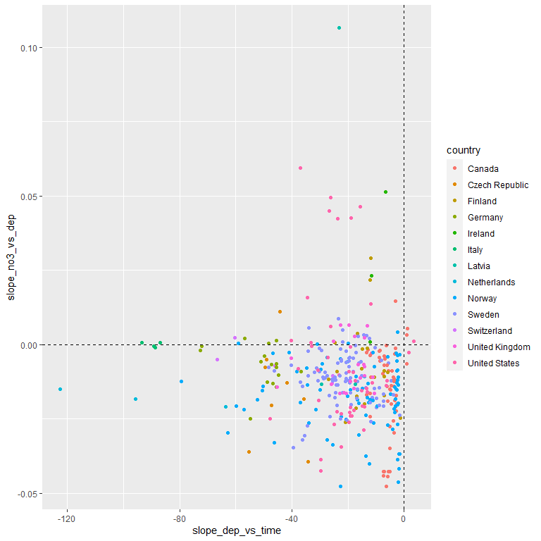

## 1. Libraries  

```r
# All of tehse packages cn be loaded at once using library(tidyverse). (I just like to be specific.)
library(dplyr)
library(tidyr)
library(purrr)
library(lubridate)
library(ggplot2)
library(forcats)
library(mgcv)
library(nlme)
library(mapview)
library()

library(MuMIn)
# install.packages("randomForest")
library(randomForest)

library(maps)
my_map <- map_data("world")

library(effects)    # handles lme models  
library(readxl)

knitr::opts_chunk$set(results = 'hold')
knitr::opts_chunk$set(warning = FALSE)
```


## 2. Data

```r
dat_annual_sel <- readRDS("Data/120_dat_annual_sel.rds")
ts_model_list <- readRDS("Data/120_ts_model_list_linear.rds")
# ts_model_list_wout_TOC <- readRDS("Data/120_ts_model_list_wout_TOC.rds")

df_stations <- readRDS("Data/100_Stations.rds")
df_deposition <- readRDS("Data/100_Deposition.rds")
df_climate <- readRDS("Data/100_Climate.rds")
```

### Station metadata

```r
df_station <- read_excel(
  "K:/Prosjekter/langtransporterte forurensninger/O-23300 - ICP-WATERS - HWI/Faglige rapporter/2020 report/Land cover/ICPW_All_Stations_2020_2020_05_04.xlsx") %>%
  mutate(station_id = as.character(station_id))
```


## 3. Make 'result_list'     

adjustment_ok

```r
# Which time series did not retun an error?
model_ok <- ts_model_list$error %>% map_lgl(is.null)
table(model_ok)

# Length of result: 4 if TOC is not included, 8 if TOC is included
result_length <- ts_model_list$result %>% map_int(length)

# Check contents of $result
# $result[[1]][1:3] %>% str(2)

result_list <- ts_model_list$result[model_ok]
```

```
## model_ok
## FALSE  TRUE 
##    43   355
```

### Check one station  

```r
st <- 1

# Station ID ( = station_ID in df_stations, df_deposition, df_climate...) 
names(result_list)[st]

# All models
# str(result_list[[st]], 1)

# Model 1 - log_NO3_madj ~ year 
# summary(result_list[[st]][[1]]$gam)

# Model 6 - log_NO3_madj ~ Deposition + precipitation  
# summary(result_list[[st]][[6]]$gam)

# Model 9 - Deposition ~ year      
# summary(result_list[[1]][[9]]$gam)
```

```
## [1] "23472"
```


## 4. Explote AIC values 
All models:  
  c("Time", "Dep", "P", "T", "P+T", "Dep+P", "Dep+T", "Dep+P+T", "Dep_vs_time", "P_vs_time", "T_vs_time")

### Extract dAIC for NO3 models   
Not including the last three  

```r
model_labels <- 
  c("Time", "Dep", "P", "T", "P_T", "Dep_P", "Dep_T", "Dep_P_T")


get_anova <- function(model_list){
  anova(model_list[[1]], 
        model_list[[2]], 
        model_list[[3]],
        model_list[[4]],
        model_list[[5]], 
        model_list[[6]], 
        model_list[[7]],
        model_list[[8]]
        )
}
# Test:
# get_anova(result_list[[1]])

# get_anova(result_list[[1]])

get_aic <- function(model_list){
  aic <- get_anova(model_list)$AIC
  daic <- aic - min(aic)
  df <- daic %>% matrix(nrow = 1) %>% data.frame() 
  names(df) <- model_labels
  data.frame(df, aic_min = min(aic), aic_best = which.min(aic))
}

get_aic_without_time <- function(model_list){
  aic <- get_anova(model_list)$AIC[-1]
  daic <- aic - min(aic)
  df <- daic %>% matrix(nrow = 1) %>% data.frame() 
  names(df) <- model_labels[-1]
  data.frame(df, aic_min = min(aic), aic_best = which.min(aic))
}

# get_aic(result_list[[1]])

daic <- result_list %>% map_df(get_aic, .id = "station_id")
daic_without_time <- result_list %>% map_df(get_aic, .id = "station_id")
```

### Show all AICs  

```r
df <- daic %>%
  select(station_id, Time:Dep_P_T) %>%
  tidyr::pivot_longer(Time:Dep_P_T, names_to = "Model", values_to = "dAIC") %>%
  mutate(Model = forcats::fct_inorder(Model))

df_without_time <- daic_without_time %>%
  select(station_id, Dep:Dep_P_T) %>%
  tidyr::pivot_longer(Dep:Dep_P_T, names_to = "Model", values_to = "dAIC") %>%
  mutate(Model = forcats::fct_inorder(Model))

df %>%
  filter(dAIC == 0) %>%
  ggplot(aes(Model)) +
  geom_histogram(stat = "count") +
  labs(title = "Best model")
```

<!-- -->

```r
df_without_time %>%
  filter(dAIC == 0) %>%
  ggplot(aes(Model)) +
  geom_histogram(stat = "count") +
  labs(tilte = "Best model, not including the 'time' model")
```

<!-- -->

```r
ggplot(df, aes(Model, dAIC)) +
  geom_boxplot()
```

<!-- -->

```r
ggplot(df, aes(Model, station_id, fill = dAIC)) +
  geom_raster()
```

<!-- -->

### Check how often adding climate to deposition improves the model  
Improves model if the point is under the line  
- Conclusion: in this case (linear model): almost never

```r
ggplot(daic, aes(Dep, Dep_P)) +
  geom_point() +
  geom_abline(intercept = 0, slope = 1)
```

<!-- -->

```r
ggplot(daic, aes(Dep, Dep_T)) +
  geom_point() +
  geom_abline(intercept = 0, slope = 1)
```

<!-- -->

```r
ggplot(daic, aes(Dep, Dep_P_T)) +
  geom_point() +
  geom_abline(intercept = 0, slope = 1)
```

<!-- -->

### Examples  

```r
i <- 1 


dat_annual_test <- dat_annual_sel %>%
  filter(station_id %in% unique(dat_annual_sel$station_id)[i])

mod_no3_year = lme(
  log_NO3_madj ~ year,
  data = dat_annual_test,
  random = ~ 1 | station_id,
  correlation = corAR1(form = ~ year | station_id)
)
mod_no3_tmp = lme(
  log_NO3_madj ~ tmp,
  data = dat_annual_test,
  random = ~ 1 | station_id,
  correlation = corAR1(form = ~ year | station_id)
)

mod_tmp_year = lme(
  tmp ~ year,
  data = dat_annual_test,
  random = ~ 1 | station_id,
  correlation = corAR1(form = ~ year | station_id)
)

summary(mod_no3_year)
# summary(result_list[[i]][[1]])
summary(mod_no3_tmp)

# Get slope (estimate and SE) 
# coef(summary(result_list[[i]][[1]]))[2, 1:2]

eff1 <- predictorEffects(mod_no3_year)
eff2 <- predictorEffects(mod_no3_tmp)
eff3 <- predictorEffects(mod_tmp_year)
plot(eff1)
```

<!-- -->

```r
plot(eff2)
```

<!-- -->

```r
plot(eff3)
```

<!-- -->

```
## Linear mixed-effects model fit by REML
##  Data: dat_annual_test 
##         AIC       BIC   logLik
##   -15.44391 -11.90366 12.72196
## 
## Random effects:
##  Formula: ~1 | station_id
##         (Intercept)   Residual
## StdDev:  0.05096493 0.07880049
## 
## Correlation Structure: ARMA(1,0)
##  Formula: ~year | station_id 
##  Parameter estimate(s):
##      Phi1 
## 0.2438523 
## Fixed effects: log_NO3_madj ~ year 
##                 Value Std.Error DF   t-value p-value
## (Intercept) 17.157668  6.473964 15  2.650257  0.0182
## year        -0.007254  0.003229 15 -2.246306  0.0402
##  Correlation: 
##      (Intr)
## year -1    
## 
## Standardized Within-Group Residuals:
##         Min          Q1         Med          Q3         Max 
## -1.62170852 -0.70441078  0.06202707  0.54368839  1.89781956 
## 
## Number of Observations: 17
## Number of Groups: 1 
## Linear mixed-effects model fit by REML
##  Data: dat_annual_test 
##         AIC       BIC   logLik
##   -18.83438 -15.29413 14.41719
## 
## Random effects:
##  Formula: ~1 | station_id
##         (Intercept)   Residual
## StdDev:  0.05529228 0.08549128
## 
## Correlation Structure: ARMA(1,0)
##  Formula: ~year | station_id 
##  Parameter estimate(s):
##      Phi1 
## 0.3667176 
## Fixed effects: log_NO3_madj ~ tmp 
##                  Value  Std.Error DF   t-value p-value
## (Intercept)  2.9423709 0.21261732 15 13.838811  0.0000
## tmp         -0.0585643 0.03647005 15 -1.605819  0.1292
##  Correlation: 
##     (Intr)
## tmp -0.957
## 
## Standardized Within-Group Residuals:
##        Min         Q1        Med         Q3        Max 
## -1.4616802 -0.7985214 -0.2514192  0.5675113  1.9245425 
## 
## Number of Observations: 17
## Number of Groups: 1
```

## 5. Slope estimates   

### Extract slope estimates   
Models  
- model 2: effect of deposition on NO3
- model 9: time trend in deposition   

```r
# summary(result_list[[1]][[2]]$gam)$r.sq

slope_no3_vs_dep <- result_list %>% 
  map_dbl(~coef(summary(.[[1]]))[2, 1])

slope_dep_vs_time <- result_list %>% 
  map_dbl(~coef(summary(.[[9]]))[2, 1])

slope_1 <- tibble(
  station_id = names(slope_no3_vs_dep),
  slope_no3_vs_dep,
  slope_dep_vs_time
)


names(dat_annual_sel) %>% paste(collapse = ", ")

df_meta <- dat_annual_sel %>%
  as_tibble() %>%
  group_by(station_id, country) %>%
  summarise(across(c(TOTN_dep, latitude, longitude, catchment_area, altitude, 
                     coniferous, deciduous, heathlands, lake,
                     mixed_forest, wetland, pre, tmp), mean)) %>%
  left_join(df_station[c("station_id", "region")], by = "station_id")
```

```
## `summarise()` regrouping output by 'station_id' (override with `.groups` argument)
```

```r
slope <- slope_1 %>%
  left_join(df_meta)
```

```
## Joining, by = "station_id"
```

```r
# slope
```

```
## [1] "station_id, year, log_NO3_madj, TOC, TOTN_dep, station_code, station_name, latitude, longitude, catchment_area, altitude, country, coniferous, deciduous, heathlands, lake, mixed_forest, wetland, pre, tmp"
```
## 6. Plot estimates  


```r
ggplot(slope, aes(slope_dep_vs_time, slope_no3_vs_dep, color = country)) + 
  geom_point() +
  geom_hline(yintercept = 0, linetype = 2) + 
  geom_vline(xintercept = 0, linetype = 2) 
```

<!-- -->

```r
ggplot(slope, aes(slope_dep_vs_time, slope_no3_vs_dep)) + 
  geom_point() +
  facet_wrap(vars(country)) +
  geom_hline(yintercept = 0, linetype = 2) + 
  geom_vline(xintercept = 0, linetype = 2) + 
  labs(title = "A selection of countries")
```

<!-- -->

```r
slope %>%
  filter(!country %in% c("Latvia","Ireland","Italy","Netherlands")) %>%
  ggplot(aes(slope_dep_vs_time, slope_no3_vs_dep)) + 
  geom_point() +
  facet_wrap(vars(country)) +
  geom_hline(yintercept = 0, linetype = 2) + 
  geom_vline(xintercept = 0, linetype = 2) + 
  labs(title = "A selection of countries")
```

<!-- -->


## 7. Plot all on map    

```r
# slope <- dplyr::sample_n(slope, 50)
  
slope_sf <- sf::st_as_sf(
  slope,
  coords = c("longitude", "latitude"), 
  crs = "+proj=longlat +ellps=WGS84", 
  agr = "constant") 

# Classify 'slope_no3_vs_dep' -> 'slope_no3_vs_dep_class'
slope_sf <- slope_sf %>%
  mutate(slope_no3_vs_dep_class = 
           cut(slope_no3_vs_dep, breaks = c(seq(-0.05, 0.02, 0.01), 0.11)))

mapview(slope_sf, zcol = "slope_no3_vs_dep_class")
```

<!--html_preserve--><div id="htmlwidget-2916e296bbb98b1850bd" style="width:864px;height:864px;" class="leaflet html-widget"></div>
<script type="application/json" data-for="htmlwidget-2916e296bbb98b1850bd">{"x":{"options":{"minZoom":1,"maxZoom":52,"crs":{"crsClass":"L.CRS.EPSG3857","code":null,"proj4def":null,"projectedBounds":null,"options":{}},"preferCanvas":false,"bounceAtZoomLimits":false,"maxBounds":[[[-90,-370]],[[90,370]]]},"calls":[{"method":"addProviderTiles","args":["CartoDB.Positron",1,"CartoDB.Positron",{"errorTileUrl":"","noWrap":false,"detectRetina":false}]},{"method":"addProviderTiles","args":["CartoDB.DarkMatter",2,"CartoDB.DarkMatter",{"errorTileUrl":"","noWrap":false,"detectRetina":false}]},{"method":"addProviderTiles","args":["OpenStreetMap",3,"OpenStreetMap",{"errorTileUrl":"","noWrap":false,"detectRetina":false}]},{"method":"addProviderTiles","args":["Esri.WorldImagery",4,"Esri.WorldImagery",{"errorTileUrl":"","noWrap":false,"detectRetina":false}]},{"method":"addProviderTiles","args":["OpenTopoMap",5,"OpenTopoMap",{"errorTileUrl":"","noWrap":false,"detectRetina":false}]},{"method":"createMapPane","args":["point",440]},{"method":"addCircleMarkers","args":[[46.363056,46.476111,46.449444,46.266111,46.273889,48.750167,50.085,50.987833,47.8785,49.924,48.9385,48.419833,51.855,50.041167,48.939667,49.718667,48.935833,49.769167,49.789,50.319,51.001167,53,53.47738,55.04752,45.9535,46.068,45.8015,45.791667,56.971429,57.1361,56.911944,61.637851,57.008911,57.091989,43.0817,40.9344,40.1444,41.17,41.0978,40.3514,44.468,42.8222,45.0056,62.259427,57.066218,66.765756,58.699922,60.842632,65.785698,47.06,47.041,47.041,47.05,47.39,47.367,47.273,47.317,47.467,44.38333,49.658,49.707,49.74,49.596667,49.437222,49.460833,49.562222,45.1999,45.2138,45.084,45.151,45.3798,45.128,45.1801,45.19,47.04167,46.85556,47.723,46.83889,47.69733,47.33889,46.80556,46.75833,46.65,47.30833,47.83583,47.88133,47.08333,47.79183,47.822,47.64167,46.475,47.9185,47.72333,46.20833,46.30833,46.98417,46.8,46.925,46.52972,47.13222,47.09444,46.51667,46.98333,46.88333,49.181414,49.165374,48.77781,49.075652,49.111781,48.934839,50.034417,50.8167,60.7054,59.9634,63.6565,61.2944,63.1615,60.3444,61.2423,69.7426,60.1677,60.3014,60.6981,61.6127,61.7991,61.8102,62.0178,62.1662,62.381,63.1638,64.9526,59.977669,60.107202,59.775661,58.685067,59.402993,59.74283,59.272889,60.37246,58.203917,67.593796,58.487223,60.831062,59.294921,62.612294,58.305398,65.056,59.872096,69.942379,69.868854,70.347286,69.706442,69.694975,62.051471,63.963465,68.054,59.504842,59.859877,59.588593,69.709245,58.757583,59.832611,61.342514,60.728364,58.494446,59.631876,58.631324,63.300433,58.563196,69.531884,58.41942,69.723107,59.826131,62.271927,59.210908,64.390779,59.056677,61.978453,69.243607,60.5669,58.119559,61.67025,68.078,58.548609,66.750981,59.544037,63.899582,59.102665,58.747436,69.253993,69.563991,59.076899,59.343639,58.292608,59.122993,59.635027,58.389938,61.151399,58.592641,60.386726,60.091292,58.316266,64.277881,69.55033,62.819073,59.891654,58.385426,58.621933,59.052333,62.782883,69.684738,60.53099,68.305835,57.947945,58.315098,59.715053,63.737032,59.52648,59.25134,59.344243,56.597203,65.526248,59.302379,56.246005,59.896977,59.805629,58.757759,56.535067,57.609084,58.148152,56.123474,60.645048,61.086672,62.466891,58.762568,59.618262,57.337247,56.8781,58.621213,60.162144,63.542743,58.0202,57.639215,67.058965,56.446397,56.206194,59.991355,59.58616,60.733618,58.99268,57.539137,60.027726,59.580301,62.594759,56.7669,60.357808,63.862036,58.815002,63.643065,59.357014,59.977884,56.323407,58.76312,59.335295,60.638793,56.671505,59.811943,58.11417,61.642759,59.114947,57.155893,56.947836,59.913009,62.540583,56.177465,56.32502,56.738747,60.022696,62.24353,57.466084,59.609761,62.330102,63.002451,57.228971,59.790109,57.175693,59.948681,58.171908,59.64119,56.28636,59.72567,59.893039,59.409459,59.837085,54.475667,54.48402,53.493,51.045,53.008833,52.795537,52.457,55.101,57.118,54.153,54.154167,54.74,50.505,52.379,56.758,56.755167,56.228241,56.216326,55.0895,55.003444,55.078,44.1589,43.9614,43.9722,43.8705,43.6361,43.6,43.5097,43.5228,44.1191,44.1308,44.1617,43.795,41.9367,41.9869,41.9725,42.0111,43.8273,43.7658,43.7977,43.8136,43.8292,43.7972,43.7861,43.7639,43.78256,44.323,43.3022,45.1272,43.1055,43.0455,42.925,42.9194,43.3139,43.0811,42.9167,42.7856,46.0011,51.5647,52.1598,52.8345],[8.689722,8.592778,8.539444,8.584722,8.773611,8.4503,11.8245,8.201333,8.057,7.619167,13.4085,8.358833,10.421,11.900833,13.405333,7.109833,13.4085,12.421333,12.424167,12.136833,8.203333,-6.35,-9.541,-7.95363,8.457833,8.692667,8.3865,8.384667,24.487392,25.903599,23.454444,17.086353,16.161882,14.529586,-72.868,-78.0228,-79.2103,-78.4061,-78.4467,-79.0511,-72.5,-73.0653,-71.9417,16.267982,12.789715,20.124675,14.6398,13.119547,19.08766,-84.393,-84.402,-84.406,-84.408,-71.572,-71.667,-71.403,-71.117,-70.973,-65.25,-93.717,-93.72,-93.793,-57.733333,-57.531667,-57.525,-57.726389,-78.9432,-78.9836,-79.036,-79.0876,-79.1335,-79.103,-78.8235,-78.9486,-72.08333,-72.99722,-71.76983,-73.00833,-72.02817,-73.23333,-74.325,-74.04444,-73.16667,-72.38611,-72.20767,-70.2375,-73.79167,-71.80517,-70.59867,-73.04167,-74.2,-71.6375,-70.904,-75.23333,-75.58333,-78,-77.40833,-76.775,-76.74444,-78.18556,-77.14306,-77.25,-76.96667,-76.83333,13.186624,13.200272,13.86773,13.401425,13.329335,13.653312,12.669428,15.1333,27.9181,23.3158,29.9466,26.4147,30.7103,24.599,25.0634,26.9499,23.5702,24.616,27.1471,25.1221,24.2811,24.2072,23.9304,22.0038,25.4449,30.6929,28.2152,10.152037,10.757415,11.773188,8.962033,10.998982,11.576457,8.842093,9.72666,7.44358,15.48789,6.188384,5.568354,7.727118,11.876558,7.16017,13.172,5.419814,29.113878,29.184604,30.884221,29.721089,30.656211,5.784195,10.564126,13.35,7.113198,6.578783,7.553098,30.601514,7.314653,8.73598,6.459471,5.51197,6.735276,8.113747,6.969318,8.776536,5.860664,29.447569,6.210912,30.187367,6.365324,8.840094,7.242517,12.084833,7.373267,6.183338,17.311394,11.654566,7.664899,5.179213,16.034,7.206118,15.410237,6.024655,10.1543,11.525462,7.97185,28.92774,29.805939,7.447322,10.969628,7.930483,11.683997,10.104806,7.970302,11.623626,8.54065,11.810501,11.927417,7.675424,10.986769,30.78036,7.532254,9.307345,8.241721,6.106409,8.653606,8.893443,30.386154,5.981984,18.652494,16.096322,12.502012,13.910674,16.769356,12.786586,12.213899,12.725927,15.728071,21.416926,12.339913,14.377527,15.68668,17.903998,14.702844,13.993759,15.249297,12.181194,13.487906,13.626457,16.949312,16.706314,15.142133,15.475073,13.711425,14.928577,14.475824,15.733446,17.633054,12.030389,15.755153,19.943647,13.992794,14.539986,13.347344,14.520404,16.424785,14.560335,13.945365,15.662726,11.84436,16.705504,13.427609,12.905761,18.272636,11.612461,17.390824,12.862696,17.158944,14.375444,16.233897,11.939088,15.445276,13.065326,14.626482,14.10621,16.575307,17.353497,14.516806,15.271186,13.427895,17.693794,14.937212,15.358164,15.406848,12.627787,15.673274,16.032841,12.293747,16.987209,17.515287,15.168946,13.547115,14.272717,12.598356,16.211824,15.133184,14.685102,12.757958,13.338181,12.98413,15.5503,-3.292167,-3.091238,-1.827,0.076,-4.0085,-3.962134,-3.48,-6.162,-3.85,-6.004,-5.9675,-7.006,-4.021,-3.685,-5.612,-3.224667,-4.509879,-4.338136,-4.424167,-4.265469,-4.431,-73.953,-75.0452,-74.9555,-74.9522,-74.7388,-74.6625,-74.8769,-74.948,-73.983,-73.9703,-74.4433,-74.6514,-74.3764,-74.5031,-74.4483,-74.4147,-74.8241,-74.6286,-74.8502,-74.8069,-74.85,-74.8583,-74.85,-74.9055,-74.835,-73.9033,-74.5858,-69.9781,-73.0028,-72.9458,-73.0653,-72.6833,-72.9305,-73.0186,-72.9167,-72.9875,-68.5406,5.2138,5.818,6.4384],6,null,"slope_sf - slope_no3_vs_dep_class",{"crs":{"crsClass":"L.CRS.EPSG3857","code":null,"proj4def":null,"projectedBounds":null,"options":{}},"pane":"point","stroke":true,"color":"#333333","weight":2,"opacity":[0.9,0.9,0.9,0.9,0.9,0.9,0.9,0.9,0.9,0.9,0.9,0.9,0.9,0.9,0.9,0.9,0.9,0.9,0.9,0.9,0.9,0.9,0.9,0.9,0.9,0.9,0.9,0.9,0.9,0.9,0.9,0.9,0.9,0.9,0.9,0.9,0.9,0.9,0.9,0.9,0.9,0.9,0.9,0.9,0.9,0.9,0.9,0.9,0.9,0.9,0.9,0.9,0.9,0.9,0.9,0.9,0.9,0.9,0.9,0.9,0.9,0.9,0.9,0.9,0.9,0.9,0.9,0.9,0.9,0.9,0.9,0.9,0.9,0.9,0.9,0.9,0.9,0.9,0.9,0.9,0.9,0.9,0.9,0.9,0.9,0.9,0.9,0.9,0.9,0.9,0.9,0.9,0.9,0.9,0.9,0.9,0.9,0.9,0.9,0.9,0.9,0.9,0.9,0.9,0.9,0.9,0.9,0.9,0.9,0.9,0.9,0.9,0.9,0.9,0.9,0.9,0.9,0.9,0.9,0.9,0.9,0.9,0.9,0.9,0.9,0.9,0.9,0.9,0.9,0.9,0.9,0.9,0.9,0.9,0.9,0.9,0.9,0.9,0.9,0.9,0.9,0.9,0.9,0.9,0.9,0.9,0.9,0.9,0.9,0.9,0.9,0.9,0.9,0.9,0.9,0.9,0.9,0.9,0.9,0.9,0.9,0.9,0.9,0.9,0.9,0.9,0.9,0.9,0.9,0.9,0.9,0.9,0.9,0.9,0.9,0.9,0.9,0.9,0.9,0.9,0.9,0.9,0.9,0.9,0.9,0.9,0.9,0.9,0.9,0.9,0.9,0.9,0.9,0.9,0.9,0.9,0.9,0.9,0.9,0.9,0.9,0.9,0.9,0.9,0.9,0.9,0.9,0.9,0.9,0.9,0.9,0.9,0.9,0.9,0.9,0.9,0.9,0.9,0.9,0.9,0.9,0.9,0.9,0.9,0.9,0.9,0.9,0.9,0.9,0.9,0.9,0.9,0.9,0.9,0.9,0.9,0.9,0.9,0.9,0.9,0.9,0.9,0.9,0.9,0.9,0.9,0.9,0.9,0.9,0.9,0.9,0.9,0.9,0.9,0.9,0.9,0.9,0.9,0.9,0.9,0.9,0.9,0.9,0.9,0.9,0.9,0.9,0.9,0.9,0.9,0.9,0.9,0.9,0.9,0.9,0.9,0.9,0.9,0.9,0.9,0.9,0.9,0.9,0.9,0.9,0.9,0.9,0.9,0.9,0.9,0.9,0.9,0.9,0.9,0.9,0.9,0.9,0.9,0.9,0.9,0.9,0.9,0.9,0.9,0.9,0.9,0.9,0.9,0.9,0.9,0.9,0.9,0.9,0.9,0.9,0.9,0.9,0.9,0.9,0.9,0.9,0.9,0.9,0.9,0.9,0.9,0.9,0.9,0.9,0.9,0.9,0.9,0.9,0.9,0.9,0.9,0.9,0.9,0.9,0.9,0.9,0.9,0.9,0.9,0.9,0.9,0.9,0.9,0.9,0.9,0.9,0.9,0.9,0.9,0.9],"fill":true,"fillColor":["#1FA187","#277F8E","#277F8E","#4AC16D","#1FA187","#1FA187","#4AC16D","#1FA187","#1FA187","#1FA187","#1FA187","#1FA187","#4AC16D","#277F8E","#4AC16D","#277F8E","#1FA187","#277F8E","#277F8E","#365C8D","#1FA187","#4AC16D","#FDE725","#FDE725","#4AC16D","#4AC16D","#1FA187","#1FA187","#277F8E","#277F8E","#FDE725","#1FA187","#277F8E","#277F8E","#FDE725","#4AC16D","#277F8E","#365C8D","#277F8E","#365C8D","#FDE725","#365C8D","#1FA187","#365C8D","#1FA187","#277F8E","#365C8D","#277F8E","#1FA187","#1FA187","#1FA187","#1FA187","#1FA187","#277F8E","#277F8E","#277F8E","#46337E","#365C8D","#1FA187","#4AC16D","#1FA187","#4AC16D","#9FDA3A","#1FA187","#1FA187","#1FA187","#277F8E","#277F8E","#1FA187","#277F8E","#1FA187","#277F8E","#365C8D","#1FA187","#1FA187","#440154","#365C8D","#277F8E","#277F8E","#277F8E","#365C8D","#1FA187","#440154","#277F8E","#277F8E","#277F8E","#277F8E","#365C8D","#365C8D","#277F8E","#440154","#277F8E","#277F8E","#1FA187","#440154","#1FA187","#1FA187","#1FA187","#440154","#440154","#1FA187","#440154","#277F8E","#440154","#1FA187","#1FA187","#46337E","#277F8E","#9FDA3A","#277F8E","#365C8D","#46337E","#277F8E","#4AC16D","#1FA187","#277F8E","#1FA187","#1FA187","#1FA187","#365C8D","#365C8D","#277F8E","#4AC16D","#FDE725","#1FA187","#1FA187","#277F8E","#365C8D","#FDE725","#277F8E","#277F8E","#4AC16D","#1FA187","#365C8D","#365C8D","#277F8E","#277F8E","#46337E","#277F8E","#365C8D","#277F8E","#1FA187","#277F8E","#277F8E","#365C8D","#1FA187","#277F8E","#1FA187","#46337E","#440154","#440154","#46337E","#277F8E","#365C8D","#277F8E","#365C8D","#365C8D","#365C8D","#277F8E","#365C8D","#440154","#1FA187","#1FA187","#277F8E","#365C8D","#440154","#365C8D","#1FA187","#277F8E","#277F8E","#277F8E","#1FA187","#277F8E","#1FA187","#46337E","#4AC16D","#46337E","#277F8E","#277F8E","#277F8E","#277F8E","#1FA187","#365C8D","#4AC16D","#46337E","#1FA187","#1FA187","#1FA187","#277F8E","#277F8E","#365C8D","#277F8E","#1FA187","#365C8D","#365C8D","#1FA187","#277F8E","#365C8D","#46337E","#277F8E","#277F8E","#277F8E","#365C8D","#1FA187","#1FA187","#277F8E","#4AC16D","#1FA187","#46337E","#277F8E","#277F8E","#277F8E","#365C8D","#1FA187","#277F8E","#365C8D","#277F8E","#4AC16D","#1FA187","#277F8E","#277F8E","#277F8E","#277F8E","#1FA187","#277F8E","#1FA187","#277F8E","#1FA187","#1FA187","#1FA187","#277F8E","#365C8D","#277F8E","#1FA187","#277F8E","#277F8E","#277F8E","#1FA187","#277F8E","#4AC16D","#1FA187","#46337E","#1FA187","#277F8E","#1FA187","#46337E","#1FA187","#1FA187","#277F8E","#277F8E","#277F8E","#1FA187","#1FA187","#277F8E","#1FA187","#1FA187","#365C8D","#365C8D","#277F8E","#365C8D","#4AC16D","#4AC16D","#1FA187","#365C8D","#4AC16D","#1FA187","#1FA187","#277F8E","#277F8E","#277F8E","#277F8E","#277F8E","#277F8E","#277F8E","#46337E","#1FA187","#277F8E","#277F8E","#365C8D","#1FA187","#1FA187","#4AC16D","#277F8E","#277F8E","#365C8D","#1FA187","#277F8E","#277F8E","#1FA187","#277F8E","#4AC16D","#1FA187","#4AC16D","#277F8E","#277F8E","#4AC16D","#277F8E","#1FA187","#277F8E","#4AC16D","#277F8E","#1FA187","#277F8E","#4AC16D","#4AC16D","#277F8E","#4AC16D","#277F8E","#277F8E","#1FA187","#1FA187","#277F8E","#4AC16D","#277F8E","#277F8E","#1FA187","#365C8D","#365C8D","#277F8E","#46337E","#440154","#365C8D","#365C8D","#277F8E","#277F8E","#1FA187","#277F8E","#1FA187","#1FA187","#1FA187","#4AC16D","#365C8D","#277F8E","#1FA187","#365C8D","#365C8D","#365C8D","#365C8D","#365C8D","#1FA187","#4AC16D","#277F8E","#277F8E","#9FDA3A","#FDE725","#4AC16D","#FDE725","#FDE725","#1FA187","#46337E","#FDE725","#9FDA3A","#277F8E","#277F8E","#365C8D"],"fillOpacity":[0.6,0.6,0.6,0.6,0.6,0.6,0.6,0.6,0.6,0.6,0.6,0.6,0.6,0.6,0.6,0.6,0.6,0.6,0.6,0.6,0.6,0.6,0.6,0.6,0.6,0.6,0.6,0.6,0.6,0.6,0.6,0.6,0.6,0.6,0.6,0.6,0.6,0.6,0.6,0.6,0.6,0.6,0.6,0.6,0.6,0.6,0.6,0.6,0.6,0.6,0.6,0.6,0.6,0.6,0.6,0.6,0.6,0.6,0.6,0.6,0.6,0.6,0.6,0.6,0.6,0.6,0.6,0.6,0.6,0.6,0.6,0.6,0.6,0.6,0.6,0.6,0.6,0.6,0.6,0.6,0.6,0.6,0.6,0.6,0.6,0.6,0.6,0.6,0.6,0.6,0.6,0.6,0.6,0.6,0.6,0.6,0.6,0.6,0.6,0.6,0.6,0.6,0.6,0.6,0.6,0.6,0.6,0.6,0.6,0.6,0.6,0.6,0.6,0.6,0.6,0.6,0.6,0.6,0.6,0.6,0.6,0.6,0.6,0.6,0.6,0.6,0.6,0.6,0.6,0.6,0.6,0.6,0.6,0.6,0.6,0.6,0.6,0.6,0.6,0.6,0.6,0.6,0.6,0.6,0.6,0.6,0.6,0.6,0.6,0.6,0.6,0.6,0.6,0.6,0.6,0.6,0.6,0.6,0.6,0.6,0.6,0.6,0.6,0.6,0.6,0.6,0.6,0.6,0.6,0.6,0.6,0.6,0.6,0.6,0.6,0.6,0.6,0.6,0.6,0.6,0.6,0.6,0.6,0.6,0.6,0.6,0.6,0.6,0.6,0.6,0.6,0.6,0.6,0.6,0.6,0.6,0.6,0.6,0.6,0.6,0.6,0.6,0.6,0.6,0.6,0.6,0.6,0.6,0.6,0.6,0.6,0.6,0.6,0.6,0.6,0.6,0.6,0.6,0.6,0.6,0.6,0.6,0.6,0.6,0.6,0.6,0.6,0.6,0.6,0.6,0.6,0.6,0.6,0.6,0.6,0.6,0.6,0.6,0.6,0.6,0.6,0.6,0.6,0.6,0.6,0.6,0.6,0.6,0.6,0.6,0.6,0.6,0.6,0.6,0.6,0.6,0.6,0.6,0.6,0.6,0.6,0.6,0.6,0.6,0.6,0.6,0.6,0.6,0.6,0.6,0.6,0.6,0.6,0.6,0.6,0.6,0.6,0.6,0.6,0.6,0.6,0.6,0.6,0.6,0.6,0.6,0.6,0.6,0.6,0.6,0.6,0.6,0.6,0.6,0.6,0.6,0.6,0.6,0.6,0.6,0.6,0.6,0.6,0.6,0.6,0.6,0.6,0.6,0.6,0.6,0.6,0.6,0.6,0.6,0.6,0.6,0.6,0.6,0.6,0.6,0.6,0.6,0.6,0.6,0.6,0.6,0.6,0.6,0.6,0.6,0.6,0.6,0.6,0.6,0.6,0.6,0.6,0.6,0.6,0.6,0.6,0.6,0.6,0.6,0.6,0.6,0.6,0.6,0.6,0.6,0.6,0.6,0.6,0.6,0.6]},null,null,["<html><head><link rel=\"stylesheet\" type=\"text/css\" href=\"lib/popup/popup.css\"><\/head><body><div class=\"scrollableContainer\"><table class=\"popup scrollable\" id=\"popup\"><tr class='coord'><td><\/td><td><b>Feature ID<\/b><\/td><td align='right'>1&emsp;<\/td><\/tr><tr class='alt'><td>1<\/td><td><b>station_id&emsp;<\/b><\/td><td align='right'>23472&emsp;<\/td><\/tr><tr><td>2<\/td><td><b>slope_no3_vs_dep&emsp;<\/b><\/td><td align='right'>-0.0072537227&emsp;<\/td><\/tr><tr class='alt'><td>3<\/td><td><b>slope_dep_vs_time&emsp;<\/b><\/td><td align='right'> -45.898828&emsp;<\/td><\/tr><tr><td>4<\/td><td><b>country&emsp;<\/b><\/td><td align='right'>Switzerland&emsp;<\/td><\/tr><tr class='alt'><td>5<\/td><td><b>TOTN_dep&emsp;<\/b><\/td><td align='right'>1091.06118&emsp;<\/td><\/tr><tr><td>6<\/td><td><b>catchment_area&emsp;<\/b><\/td><td align='right'>   2.941&emsp;<\/td><\/tr><tr class='alt'><td>7<\/td><td><b>altitude&emsp;<\/b><\/td><td align='right'>1692&emsp;<\/td><\/tr><tr><td>8<\/td><td><b>coniferous&emsp;<\/b><\/td><td align='right'>NA&emsp;<\/td><\/tr><tr class='alt'><td>9<\/td><td><b>deciduous&emsp;<\/b><\/td><td align='right'>NA&emsp;<\/td><\/tr><tr><td>10<\/td><td><b>heathlands&emsp;<\/b><\/td><td align='right'> 7.676&emsp;<\/td><\/tr><tr class='alt'><td>11<\/td><td><b>lake&emsp;<\/b><\/td><td align='right'> 1.958&emsp;<\/td><\/tr><tr><td>12<\/td><td><b>mixed_forest&emsp;<\/b><\/td><td align='right'>NA&emsp;<\/td><\/tr><tr class='alt'><td>13<\/td><td><b>wetland&emsp;<\/b><\/td><td align='right'> 0.000&emsp;<\/td><\/tr><tr><td>14<\/td><td><b>pre&emsp;<\/b><\/td><td align='right'>1826.3529&emsp;<\/td><\/tr><tr class='alt'><td>15<\/td><td><b>tmp&emsp;<\/b><\/td><td align='right'> 5.5823531&emsp;<\/td><\/tr><tr><td>16<\/td><td><b>region&emsp;<\/b><\/td><td align='right'>Alps&emsp;<\/td><\/tr><tr class='alt'><td>17<\/td><td><b>geometry&emsp;<\/b><\/td><td align='right'>sfc_POINT&emsp;<\/td><\/tr><tr><td>18<\/td><td><b>slope_no3_vs_dep_class&emsp;<\/b><\/td><td align='right'>(-0.01,0]&emsp;<\/td><\/tr><\/table><\/div><\/body><\/html>","<html><head><link rel=\"stylesheet\" type=\"text/css\" href=\"lib/popup/popup.css\"><\/head><body><div class=\"scrollableContainer\"><table class=\"popup scrollable\" id=\"popup\"><tr class='coord'><td><\/td><td><b>Feature ID<\/b><\/td><td align='right'>2&emsp;<\/td><\/tr><tr class='alt'><td>1<\/td><td><b>station_id&emsp;<\/b><\/td><td align='right'>23474&emsp;<\/td><\/tr><tr><td>2<\/td><td><b>slope_no3_vs_dep&emsp;<\/b><\/td><td align='right'>-0.0131781245&emsp;<\/td><\/tr><tr class='alt'><td>3<\/td><td><b>slope_dep_vs_time&emsp;<\/b><\/td><td align='right'> -25.692223&emsp;<\/td><\/tr><tr><td>4<\/td><td><b>country&emsp;<\/b><\/td><td align='right'>Switzerland&emsp;<\/td><\/tr><tr class='alt'><td>5<\/td><td><b>TOTN_dep&emsp;<\/b><\/td><td align='right'> 761.02895&emsp;<\/td><\/tr><tr><td>6<\/td><td><b>catchment_area&emsp;<\/b><\/td><td align='right'>   1.816&emsp;<\/td><\/tr><tr class='alt'><td>7<\/td><td><b>altitude&emsp;<\/b><\/td><td align='right'>2074&emsp;<\/td><\/tr><tr><td>8<\/td><td><b>coniferous&emsp;<\/b><\/td><td align='right'>NA&emsp;<\/td><\/tr><tr class='alt'><td>9<\/td><td><b>deciduous&emsp;<\/b><\/td><td align='right'>NA&emsp;<\/td><\/tr><tr><td>10<\/td><td><b>heathlands&emsp;<\/b><\/td><td align='right'> 0.414&emsp;<\/td><\/tr><tr class='alt'><td>11<\/td><td><b>lake&emsp;<\/b><\/td><td align='right'> 3.076&emsp;<\/td><\/tr><tr><td>12<\/td><td><b>mixed_forest&emsp;<\/b><\/td><td align='right'>NA&emsp;<\/td><\/tr><tr class='alt'><td>13<\/td><td><b>wetland&emsp;<\/b><\/td><td align='right'> 0.000&emsp;<\/td><\/tr><tr><td>14<\/td><td><b>pre&emsp;<\/b><\/td><td align='right'>1843.3579&emsp;<\/td><\/tr><tr class='alt'><td>15<\/td><td><b>tmp&emsp;<\/b><\/td><td align='right'> 5.5276317&emsp;<\/td><\/tr><tr><td>16<\/td><td><b>region&emsp;<\/b><\/td><td align='right'>Alps&emsp;<\/td><\/tr><tr class='alt'><td>17<\/td><td><b>geometry&emsp;<\/b><\/td><td align='right'>sfc_POINT&emsp;<\/td><\/tr><tr><td>18<\/td><td><b>slope_no3_vs_dep_class&emsp;<\/b><\/td><td align='right'>(-0.02,-0.01]&emsp;<\/td><\/tr><\/table><\/div><\/body><\/html>","<html><head><link rel=\"stylesheet\" type=\"text/css\" href=\"lib/popup/popup.css\"><\/head><body><div class=\"scrollableContainer\"><table class=\"popup scrollable\" id=\"popup\"><tr class='coord'><td><\/td><td><b>Feature ID<\/b><\/td><td align='right'>3&emsp;<\/td><\/tr><tr class='alt'><td>1<\/td><td><b>station_id&emsp;<\/b><\/td><td align='right'>23478&emsp;<\/td><\/tr><tr><td>2<\/td><td><b>slope_no3_vs_dep&emsp;<\/b><\/td><td align='right'>-0.0104521516&emsp;<\/td><\/tr><tr class='alt'><td>3<\/td><td><b>slope_dep_vs_time&emsp;<\/b><\/td><td align='right'> -25.412418&emsp;<\/td><\/tr><tr><td>4<\/td><td><b>country&emsp;<\/b><\/td><td align='right'>Switzerland&emsp;<\/td><\/tr><tr class='alt'><td>5<\/td><td><b>TOTN_dep&emsp;<\/b><\/td><td align='right'> 670.65188&emsp;<\/td><\/tr><tr><td>6<\/td><td><b>catchment_area&emsp;<\/b><\/td><td align='right'>   0.722&emsp;<\/td><\/tr><tr class='alt'><td>7<\/td><td><b>altitude&emsp;<\/b><\/td><td align='right'>2387&emsp;<\/td><\/tr><tr><td>8<\/td><td><b>coniferous&emsp;<\/b><\/td><td align='right'>NA&emsp;<\/td><\/tr><tr class='alt'><td>9<\/td><td><b>deciduous&emsp;<\/b><\/td><td align='right'>NA&emsp;<\/td><\/tr><tr><td>10<\/td><td><b>heathlands&emsp;<\/b><\/td><td align='right'> 0.000&emsp;<\/td><\/tr><tr class='alt'><td>11<\/td><td><b>lake&emsp;<\/b><\/td><td align='right'>17.584&emsp;<\/td><\/tr><tr><td>12<\/td><td><b>mixed_forest&emsp;<\/b><\/td><td align='right'>NA&emsp;<\/td><\/tr><tr class='alt'><td>13<\/td><td><b>wetland&emsp;<\/b><\/td><td align='right'> 0.000&emsp;<\/td><\/tr><tr><td>14<\/td><td><b>pre&emsp;<\/b><\/td><td align='right'>1820.1500&emsp;<\/td><\/tr><tr class='alt'><td>15<\/td><td><b>tmp&emsp;<\/b><\/td><td align='right'> 5.6192710&emsp;<\/td><\/tr><tr><td>16<\/td><td><b>region&emsp;<\/b><\/td><td align='right'>Alps&emsp;<\/td><\/tr><tr class='alt'><td>17<\/td><td><b>geometry&emsp;<\/b><\/td><td align='right'>sfc_POINT&emsp;<\/td><\/tr><tr><td>18<\/td><td><b>slope_no3_vs_dep_class&emsp;<\/b><\/td><td align='right'>(-0.02,-0.01]&emsp;<\/td><\/tr><\/table><\/div><\/body><\/html>","<html><head><link rel=\"stylesheet\" type=\"text/css\" href=\"lib/popup/popup.css\"><\/head><body><div class=\"scrollableContainer\"><table class=\"popup scrollable\" id=\"popup\"><tr class='coord'><td><\/td><td><b>Feature ID<\/b><\/td><td align='right'>4&emsp;<\/td><\/tr><tr class='alt'><td>1<\/td><td><b>station_id&emsp;<\/b><\/td><td align='right'>23488&emsp;<\/td><\/tr><tr><td>2<\/td><td><b>slope_no3_vs_dep&emsp;<\/b><\/td><td align='right'> 0.0023070133&emsp;<\/td><\/tr><tr class='alt'><td>3<\/td><td><b>slope_dep_vs_time&emsp;<\/b><\/td><td align='right'> -60.339872&emsp;<\/td><\/tr><tr><td>4<\/td><td><b>country&emsp;<\/b><\/td><td align='right'>Switzerland&emsp;<\/td><\/tr><tr class='alt'><td>5<\/td><td><b>TOTN_dep&emsp;<\/b><\/td><td align='right'>1353.24813&emsp;<\/td><\/tr><tr><td>6<\/td><td><b>catchment_area&emsp;<\/b><\/td><td align='right'>   1.104&emsp;<\/td><\/tr><tr class='alt'><td>7<\/td><td><b>altitude&emsp;<\/b><\/td><td align='right'>1855&emsp;<\/td><\/tr><tr><td>8<\/td><td><b>coniferous&emsp;<\/b><\/td><td align='right'>NA&emsp;<\/td><\/tr><tr class='alt'><td>9<\/td><td><b>deciduous&emsp;<\/b><\/td><td align='right'>NA&emsp;<\/td><\/tr><tr><td>10<\/td><td><b>heathlands&emsp;<\/b><\/td><td align='right'>28.539&emsp;<\/td><\/tr><tr class='alt'><td>11<\/td><td><b>lake&emsp;<\/b><\/td><td align='right'> 9.438&emsp;<\/td><\/tr><tr><td>12<\/td><td><b>mixed_forest&emsp;<\/b><\/td><td align='right'>NA&emsp;<\/td><\/tr><tr class='alt'><td>13<\/td><td><b>wetland&emsp;<\/b><\/td><td align='right'> 0.000&emsp;<\/td><\/tr><tr><td>14<\/td><td><b>pre&emsp;<\/b><\/td><td align='right'>1820.1500&emsp;<\/td><\/tr><tr class='alt'><td>15<\/td><td><b>tmp&emsp;<\/b><\/td><td align='right'> 5.6192710&emsp;<\/td><\/tr><tr><td>16<\/td><td><b>region&emsp;<\/b><\/td><td align='right'>Alps&emsp;<\/td><\/tr><tr class='alt'><td>17<\/td><td><b>geometry&emsp;<\/b><\/td><td align='right'>sfc_POINT&emsp;<\/td><\/tr><tr><td>18<\/td><td><b>slope_no3_vs_dep_class&emsp;<\/b><\/td><td align='right'>(0,0.01]&emsp;<\/td><\/tr><\/table><\/div><\/body><\/html>","<html><head><link rel=\"stylesheet\" type=\"text/css\" href=\"lib/popup/popup.css\"><\/head><body><div class=\"scrollableContainer\"><table class=\"popup scrollable\" id=\"popup\"><tr class='coord'><td><\/td><td><b>Feature ID<\/b><\/td><td align='right'>5&emsp;<\/td><\/tr><tr class='alt'><td>1<\/td><td><b>station_id&emsp;<\/b><\/td><td align='right'>23489&emsp;<\/td><\/tr><tr><td>2<\/td><td><b>slope_no3_vs_dep&emsp;<\/b><\/td><td align='right'>-0.0051180745&emsp;<\/td><\/tr><tr class='alt'><td>3<\/td><td><b>slope_dep_vs_time&emsp;<\/b><\/td><td align='right'> -66.517409&emsp;<\/td><\/tr><tr><td>4<\/td><td><b>country&emsp;<\/b><\/td><td align='right'>Switzerland&emsp;<\/td><\/tr><tr class='alt'><td>5<\/td><td><b>TOTN_dep&emsp;<\/b><\/td><td align='right'>1353.23867&emsp;<\/td><\/tr><tr><td>6<\/td><td><b>catchment_area&emsp;<\/b><\/td><td align='right'>   0.230&emsp;<\/td><\/tr><tr class='alt'><td>7<\/td><td><b>altitude&emsp;<\/b><\/td><td align='right'>1875&emsp;<\/td><\/tr><tr><td>8<\/td><td><b>coniferous&emsp;<\/b><\/td><td align='right'>NA&emsp;<\/td><\/tr><tr class='alt'><td>9<\/td><td><b>deciduous&emsp;<\/b><\/td><td align='right'>NA&emsp;<\/td><\/tr><tr><td>10<\/td><td><b>heathlands&emsp;<\/b><\/td><td align='right'>21.961&emsp;<\/td><\/tr><tr class='alt'><td>11<\/td><td><b>lake&emsp;<\/b><\/td><td align='right'> 4.661&emsp;<\/td><\/tr><tr><td>12<\/td><td><b>mixed_forest&emsp;<\/b><\/td><td align='right'>NA&emsp;<\/td><\/tr><tr class='alt'><td>13<\/td><td><b>wetland&emsp;<\/b><\/td><td align='right'> 0.000&emsp;<\/td><\/tr><tr><td>14<\/td><td><b>pre&emsp;<\/b><\/td><td align='right'>1825.2066&emsp;<\/td><\/tr><tr class='alt'><td>15<\/td><td><b>tmp&emsp;<\/b><\/td><td align='right'> 5.6183335&emsp;<\/td><\/tr><tr><td>16<\/td><td><b>region&emsp;<\/b><\/td><td align='right'>Alps&emsp;<\/td><\/tr><tr class='alt'><td>17<\/td><td><b>geometry&emsp;<\/b><\/td><td align='right'>sfc_POINT&emsp;<\/td><\/tr><tr><td>18<\/td><td><b>slope_no3_vs_dep_class&emsp;<\/b><\/td><td align='right'>(-0.01,0]&emsp;<\/td><\/tr><\/table><\/div><\/body><\/html>","<html><head><link rel=\"stylesheet\" type=\"text/css\" href=\"lib/popup/popup.css\"><\/head><body><div class=\"scrollableContainer\"><table class=\"popup scrollable\" id=\"popup\"><tr class='coord'><td><\/td><td><b>Feature ID<\/b><\/td><td align='right'>6&emsp;<\/td><\/tr><tr class='alt'><td>1<\/td><td><b>station_id&emsp;<\/b><\/td><td align='right'>23505&emsp;<\/td><\/tr><tr><td>2<\/td><td><b>slope_no3_vs_dep&emsp;<\/b><\/td><td align='right'>-0.0037977508&emsp;<\/td><\/tr><tr class='alt'><td>3<\/td><td><b>slope_dep_vs_time&emsp;<\/b><\/td><td align='right'> -49.831715&emsp;<\/td><\/tr><tr><td>4<\/td><td><b>country&emsp;<\/b><\/td><td align='right'>Germany&emsp;<\/td><\/tr><tr class='alt'><td>5<\/td><td><b>TOTN_dep&emsp;<\/b><\/td><td align='right'>1987.04227&emsp;<\/td><\/tr><tr><td>6<\/td><td><b>catchment_area&emsp;<\/b><\/td><td align='right'>   6.500&emsp;<\/td><\/tr><tr class='alt'><td>7<\/td><td><b>altitude&emsp;<\/b><\/td><td align='right'> 730&emsp;<\/td><\/tr><tr><td>8<\/td><td><b>coniferous&emsp;<\/b><\/td><td align='right'>100.000&emsp;<\/td><\/tr><tr class='alt'><td>9<\/td><td><b>deciduous&emsp;<\/b><\/td><td align='right'> 0.000&emsp;<\/td><\/tr><tr><td>10<\/td><td><b>heathlands&emsp;<\/b><\/td><td align='right'> 0.000&emsp;<\/td><\/tr><tr class='alt'><td>11<\/td><td><b>lake&emsp;<\/b><\/td><td align='right'> 0.000&emsp;<\/td><\/tr><tr><td>12<\/td><td><b>mixed_forest&emsp;<\/b><\/td><td align='right'> 0.000&emsp;<\/td><\/tr><tr class='alt'><td>13<\/td><td><b>wetland&emsp;<\/b><\/td><td align='right'> 0.000&emsp;<\/td><\/tr><tr><td>14<\/td><td><b>pre&emsp;<\/b><\/td><td align='right'> 846.1955&emsp;<\/td><\/tr><tr class='alt'><td>15<\/td><td><b>tmp&emsp;<\/b><\/td><td align='right'>10.2435609&emsp;<\/td><\/tr><tr><td>16<\/td><td><b>region&emsp;<\/b><\/td><td align='right'>WCE&emsp;<\/td><\/tr><tr class='alt'><td>17<\/td><td><b>geometry&emsp;<\/b><\/td><td align='right'>sfc_POINT&emsp;<\/td><\/tr><tr><td>18<\/td><td><b>slope_no3_vs_dep_class&emsp;<\/b><\/td><td align='right'>(-0.01,0]&emsp;<\/td><\/tr><\/table><\/div><\/body><\/html>","<html><head><link rel=\"stylesheet\" type=\"text/css\" href=\"lib/popup/popup.css\"><\/head><body><div class=\"scrollableContainer\"><table class=\"popup scrollable\" id=\"popup\"><tr class='coord'><td><\/td><td><b>Feature ID<\/b><\/td><td align='right'>7&emsp;<\/td><\/tr><tr class='alt'><td>1<\/td><td><b>station_id&emsp;<\/b><\/td><td align='right'>23506&emsp;<\/td><\/tr><tr><td>2<\/td><td><b>slope_no3_vs_dep&emsp;<\/b><\/td><td align='right'> 0.0004678372&emsp;<\/td><\/tr><tr class='alt'><td>3<\/td><td><b>slope_dep_vs_time&emsp;<\/b><\/td><td align='right'> -48.380833&emsp;<\/td><\/tr><tr><td>4<\/td><td><b>country&emsp;<\/b><\/td><td align='right'>Germany&emsp;<\/td><\/tr><tr class='alt'><td>5<\/td><td><b>TOTN_dep&emsp;<\/b><\/td><td align='right'>2016.31167&emsp;<\/td><\/tr><tr><td>6<\/td><td><b>catchment_area&emsp;<\/b><\/td><td align='right'>   2.000&emsp;<\/td><\/tr><tr class='alt'><td>7<\/td><td><b>altitude&emsp;<\/b><\/td><td align='right'> 664&emsp;<\/td><\/tr><tr><td>8<\/td><td><b>coniferous&emsp;<\/b><\/td><td align='right'> 95.000&emsp;<\/td><\/tr><tr class='alt'><td>9<\/td><td><b>deciduous&emsp;<\/b><\/td><td align='right'> 5.000&emsp;<\/td><\/tr><tr><td>10<\/td><td><b>heathlands&emsp;<\/b><\/td><td align='right'> 0.000&emsp;<\/td><\/tr><tr class='alt'><td>11<\/td><td><b>lake&emsp;<\/b><\/td><td align='right'> 0.000&emsp;<\/td><\/tr><tr><td>12<\/td><td><b>mixed_forest&emsp;<\/b><\/td><td align='right'> 0.000&emsp;<\/td><\/tr><tr class='alt'><td>13<\/td><td><b>wetland&emsp;<\/b><\/td><td align='right'> 0.000&emsp;<\/td><\/tr><tr><td>14<\/td><td><b>pre&emsp;<\/b><\/td><td align='right'> 699.8444&emsp;<\/td><\/tr><tr class='alt'><td>15<\/td><td><b>tmp&emsp;<\/b><\/td><td align='right'> 7.9726854&emsp;<\/td><\/tr><tr><td>16<\/td><td><b>region&emsp;<\/b><\/td><td align='right'>ECE&emsp;<\/td><\/tr><tr class='alt'><td>17<\/td><td><b>geometry&emsp;<\/b><\/td><td align='right'>sfc_POINT&emsp;<\/td><\/tr><tr><td>18<\/td><td><b>slope_no3_vs_dep_class&emsp;<\/b><\/td><td align='right'>(0,0.01]&emsp;<\/td><\/tr><\/table><\/div><\/body><\/html>","<html><head><link rel=\"stylesheet\" type=\"text/css\" href=\"lib/popup/popup.css\"><\/head><body><div class=\"scrollableContainer\"><table class=\"popup scrollable\" id=\"popup\"><tr class='coord'><td><\/td><td><b>Feature ID<\/b><\/td><td align='right'>8&emsp;<\/td><\/tr><tr class='alt'><td>1<\/td><td><b>station_id&emsp;<\/b><\/td><td align='right'>23507&emsp;<\/td><\/tr><tr><td>2<\/td><td><b>slope_no3_vs_dep&emsp;<\/b><\/td><td align='right'>-0.0004078612&emsp;<\/td><\/tr><tr class='alt'><td>3<\/td><td><b>slope_dep_vs_time&emsp;<\/b><\/td><td align='right'> -72.191674&emsp;<\/td><\/tr><tr><td>4<\/td><td><b>country&emsp;<\/b><\/td><td align='right'>Germany&emsp;<\/td><\/tr><tr class='alt'><td>5<\/td><td><b>TOTN_dep&emsp;<\/b><\/td><td align='right'>2325.08263&emsp;<\/td><\/tr><tr><td>6<\/td><td><b>catchment_area&emsp;<\/b><\/td><td align='right'>   4.500&emsp;<\/td><\/tr><tr class='alt'><td>7<\/td><td><b>altitude&emsp;<\/b><\/td><td align='right'> 540&emsp;<\/td><\/tr><tr><td>8<\/td><td><b>coniferous&emsp;<\/b><\/td><td align='right'> 50.000&emsp;<\/td><\/tr><tr class='alt'><td>9<\/td><td><b>deciduous&emsp;<\/b><\/td><td align='right'>40.000&emsp;<\/td><\/tr><tr><td>10<\/td><td><b>heathlands&emsp;<\/b><\/td><td align='right'> 0.000&emsp;<\/td><\/tr><tr class='alt'><td>11<\/td><td><b>lake&emsp;<\/b><\/td><td align='right'> 0.000&emsp;<\/td><\/tr><tr><td>12<\/td><td><b>mixed_forest&emsp;<\/b><\/td><td align='right'> 0.000&emsp;<\/td><\/tr><tr class='alt'><td>13<\/td><td><b>wetland&emsp;<\/b><\/td><td align='right'> 0.000&emsp;<\/td><\/tr><tr><td>14<\/td><td><b>pre&emsp;<\/b><\/td><td align='right'> 776.1368&emsp;<\/td><\/tr><tr class='alt'><td>15<\/td><td><b>tmp&emsp;<\/b><\/td><td align='right'> 9.3807020&emsp;<\/td><\/tr><tr><td>16<\/td><td><b>region&emsp;<\/b><\/td><td align='right'>WCE&emsp;<\/td><\/tr><tr class='alt'><td>17<\/td><td><b>geometry&emsp;<\/b><\/td><td align='right'>sfc_POINT&emsp;<\/td><\/tr><tr><td>18<\/td><td><b>slope_no3_vs_dep_class&emsp;<\/b><\/td><td align='right'>(-0.01,0]&emsp;<\/td><\/tr><\/table><\/div><\/body><\/html>","<html><head><link rel=\"stylesheet\" type=\"text/css\" href=\"lib/popup/popup.css\"><\/head><body><div class=\"scrollableContainer\"><table class=\"popup scrollable\" id=\"popup\"><tr class='coord'><td><\/td><td><b>Feature ID<\/b><\/td><td align='right'>9&emsp;<\/td><\/tr><tr class='alt'><td>1<\/td><td><b>station_id&emsp;<\/b><\/td><td align='right'>23509&emsp;<\/td><\/tr><tr><td>2<\/td><td><b>slope_no3_vs_dep&emsp;<\/b><\/td><td align='right'>-0.0090066468&emsp;<\/td><\/tr><tr class='alt'><td>3<\/td><td><b>slope_dep_vs_time&emsp;<\/b><\/td><td align='right'> -36.689626&emsp;<\/td><\/tr><tr><td>4<\/td><td><b>country&emsp;<\/b><\/td><td align='right'>Germany&emsp;<\/td><\/tr><tr class='alt'><td>5<\/td><td><b>TOTN_dep&emsp;<\/b><\/td><td align='right'>1666.27909&emsp;<\/td><\/tr><tr><td>6<\/td><td><b>catchment_area&emsp;<\/b><\/td><td align='right'>   2.500&emsp;<\/td><\/tr><tr class='alt'><td>7<\/td><td><b>altitude&emsp;<\/b><\/td><td align='right'>1100&emsp;<\/td><\/tr><tr><td>8<\/td><td><b>coniferous&emsp;<\/b><\/td><td align='right'>100.000&emsp;<\/td><\/tr><tr class='alt'><td>9<\/td><td><b>deciduous&emsp;<\/b><\/td><td align='right'> 0.000&emsp;<\/td><\/tr><tr><td>10<\/td><td><b>heathlands&emsp;<\/b><\/td><td align='right'> 0.000&emsp;<\/td><\/tr><tr class='alt'><td>11<\/td><td><b>lake&emsp;<\/b><\/td><td align='right'> 0.000&emsp;<\/td><\/tr><tr><td>12<\/td><td><b>mixed_forest&emsp;<\/b><\/td><td align='right'> 0.000&emsp;<\/td><\/tr><tr class='alt'><td>13<\/td><td><b>wetland&emsp;<\/b><\/td><td align='right'> 0.000&emsp;<\/td><\/tr><tr><td>14<\/td><td><b>pre&emsp;<\/b><\/td><td align='right'>1163.7409&emsp;<\/td><\/tr><tr class='alt'><td>15<\/td><td><b>tmp&emsp;<\/b><\/td><td align='right'> 9.0609850&emsp;<\/td><\/tr><tr><td>16<\/td><td><b>region&emsp;<\/b><\/td><td align='right'>WCE&emsp;<\/td><\/tr><tr class='alt'><td>17<\/td><td><b>geometry&emsp;<\/b><\/td><td align='right'>sfc_POINT&emsp;<\/td><\/tr><tr><td>18<\/td><td><b>slope_no3_vs_dep_class&emsp;<\/b><\/td><td align='right'>(-0.01,0]&emsp;<\/td><\/tr><\/table><\/div><\/body><\/html>","<html><head><link rel=\"stylesheet\" type=\"text/css\" href=\"lib/popup/popup.css\"><\/head><body><div class=\"scrollableContainer\"><table class=\"popup scrollable\" id=\"popup\"><tr class='coord'><td><\/td><td><b>Feature ID<\/b><\/td><td align='right'>10&emsp;<\/td><\/tr><tr class='alt'><td>1<\/td><td><b>station_id&emsp;<\/b><\/td><td align='right'>23510&emsp;<\/td><\/tr><tr><td>2<\/td><td><b>slope_no3_vs_dep&emsp;<\/b><\/td><td align='right'>-0.0057195681&emsp;<\/td><\/tr><tr class='alt'><td>3<\/td><td><b>slope_dep_vs_time&emsp;<\/b><\/td><td align='right'> -51.051519&emsp;<\/td><\/tr><tr><td>4<\/td><td><b>country&emsp;<\/b><\/td><td align='right'>Germany&emsp;<\/td><\/tr><tr class='alt'><td>5<\/td><td><b>TOTN_dep&emsp;<\/b><\/td><td align='right'>1880.57850&emsp;<\/td><\/tr><tr><td>6<\/td><td><b>catchment_area&emsp;<\/b><\/td><td align='right'>   5.000&emsp;<\/td><\/tr><tr class='alt'><td>7<\/td><td><b>altitude&emsp;<\/b><\/td><td align='right'> 515&emsp;<\/td><\/tr><tr><td>8<\/td><td><b>coniferous&emsp;<\/b><\/td><td align='right'> 40.000&emsp;<\/td><\/tr><tr class='alt'><td>9<\/td><td><b>deciduous&emsp;<\/b><\/td><td align='right'>50.000&emsp;<\/td><\/tr><tr><td>10<\/td><td><b>heathlands&emsp;<\/b><\/td><td align='right'> 0.000&emsp;<\/td><\/tr><tr class='alt'><td>11<\/td><td><b>lake&emsp;<\/b><\/td><td align='right'> 0.000&emsp;<\/td><\/tr><tr><td>12<\/td><td><b>mixed_forest&emsp;<\/b><\/td><td align='right'> 0.000&emsp;<\/td><\/tr><tr class='alt'><td>13<\/td><td><b>wetland&emsp;<\/b><\/td><td align='right'>10.000&emsp;<\/td><\/tr><tr><td>14<\/td><td><b>pre&emsp;<\/b><\/td><td align='right'> 706.1650&emsp;<\/td><\/tr><tr class='alt'><td>15<\/td><td><b>tmp&emsp;<\/b><\/td><td align='right'>10.2741669&emsp;<\/td><\/tr><tr><td>16<\/td><td><b>region&emsp;<\/b><\/td><td align='right'>WCE&emsp;<\/td><\/tr><tr class='alt'><td>17<\/td><td><b>geometry&emsp;<\/b><\/td><td align='right'>sfc_POINT&emsp;<\/td><\/tr><tr><td>18<\/td><td><b>slope_no3_vs_dep_class&emsp;<\/b><\/td><td align='right'>(-0.01,0]&emsp;<\/td><\/tr><\/table><\/div><\/body><\/html>","<html><head><link rel=\"stylesheet\" type=\"text/css\" href=\"lib/popup/popup.css\"><\/head><body><div class=\"scrollableContainer\"><table class=\"popup scrollable\" id=\"popup\"><tr class='coord'><td><\/td><td><b>Feature ID<\/b><\/td><td align='right'>11&emsp;<\/td><\/tr><tr class='alt'><td>1<\/td><td><b>station_id&emsp;<\/b><\/td><td align='right'>23514&emsp;<\/td><\/tr><tr><td>2<\/td><td><b>slope_no3_vs_dep&emsp;<\/b><\/td><td align='right'>-0.0076929496&emsp;<\/td><\/tr><tr class='alt'><td>3<\/td><td><b>slope_dep_vs_time&emsp;<\/b><\/td><td align='right'> -45.456000&emsp;<\/td><\/tr><tr><td>4<\/td><td><b>country&emsp;<\/b><\/td><td align='right'>Germany&emsp;<\/td><\/tr><tr class='alt'><td>5<\/td><td><b>TOTN_dep&emsp;<\/b><\/td><td align='right'>1558.35333&emsp;<\/td><\/tr><tr><td>6<\/td><td><b>catchment_area&emsp;<\/b><\/td><td align='right'>   4.000&emsp;<\/td><\/tr><tr class='alt'><td>7<\/td><td><b>altitude&emsp;<\/b><\/td><td align='right'> 771&emsp;<\/td><\/tr><tr><td>8<\/td><td><b>coniferous&emsp;<\/b><\/td><td align='right'> 70.000&emsp;<\/td><\/tr><tr class='alt'><td>9<\/td><td><b>deciduous&emsp;<\/b><\/td><td align='right'>30.000&emsp;<\/td><\/tr><tr><td>10<\/td><td><b>heathlands&emsp;<\/b><\/td><td align='right'> 0.000&emsp;<\/td><\/tr><tr class='alt'><td>11<\/td><td><b>lake&emsp;<\/b><\/td><td align='right'> 0.000&emsp;<\/td><\/tr><tr><td>12<\/td><td><b>mixed_forest&emsp;<\/b><\/td><td align='right'> 0.000&emsp;<\/td><\/tr><tr class='alt'><td>13<\/td><td><b>wetland&emsp;<\/b><\/td><td align='right'> 0.000&emsp;<\/td><\/tr><tr><td>14<\/td><td><b>pre&emsp;<\/b><\/td><td align='right'> 850.2715&emsp;<\/td><\/tr><tr class='alt'><td>15<\/td><td><b>tmp&emsp;<\/b><\/td><td align='right'> 8.7869050&emsp;<\/td><\/tr><tr><td>16<\/td><td><b>region&emsp;<\/b><\/td><td align='right'>ECE&emsp;<\/td><\/tr><tr class='alt'><td>17<\/td><td><b>geometry&emsp;<\/b><\/td><td align='right'>sfc_POINT&emsp;<\/td><\/tr><tr><td>18<\/td><td><b>slope_no3_vs_dep_class&emsp;<\/b><\/td><td align='right'>(-0.01,0]&emsp;<\/td><\/tr><\/table><\/div><\/body><\/html>","<html><head><link rel=\"stylesheet\" type=\"text/css\" href=\"lib/popup/popup.css\"><\/head><body><div class=\"scrollableContainer\"><table class=\"popup scrollable\" id=\"popup\"><tr class='coord'><td><\/td><td><b>Feature ID<\/b><\/td><td align='right'>12&emsp;<\/td><\/tr><tr class='alt'><td>1<\/td><td><b>station_id&emsp;<\/b><\/td><td align='right'>23515&emsp;<\/td><\/tr><tr><td>2<\/td><td><b>slope_no3_vs_dep&emsp;<\/b><\/td><td align='right'>-0.0067730787&emsp;<\/td><\/tr><tr class='alt'><td>3<\/td><td><b>slope_dep_vs_time&emsp;<\/b><\/td><td align='right'> -47.182500&emsp;<\/td><\/tr><tr><td>4<\/td><td><b>country&emsp;<\/b><\/td><td align='right'>Germany&emsp;<\/td><\/tr><tr class='alt'><td>5<\/td><td><b>TOTN_dep&emsp;<\/b><\/td><td align='right'>2016.32071&emsp;<\/td><\/tr><tr><td>6<\/td><td><b>catchment_area&emsp;<\/b><\/td><td align='right'>   6.500&emsp;<\/td><\/tr><tr class='alt'><td>7<\/td><td><b>altitude&emsp;<\/b><\/td><td align='right'> 620&emsp;<\/td><\/tr><tr><td>8<\/td><td><b>coniferous&emsp;<\/b><\/td><td align='right'>100.000&emsp;<\/td><\/tr><tr class='alt'><td>9<\/td><td><b>deciduous&emsp;<\/b><\/td><td align='right'> 0.000&emsp;<\/td><\/tr><tr><td>10<\/td><td><b>heathlands&emsp;<\/b><\/td><td align='right'> 0.000&emsp;<\/td><\/tr><tr class='alt'><td>11<\/td><td><b>lake&emsp;<\/b><\/td><td align='right'> 0.000&emsp;<\/td><\/tr><tr><td>12<\/td><td><b>mixed_forest&emsp;<\/b><\/td><td align='right'> 0.000&emsp;<\/td><\/tr><tr class='alt'><td>13<\/td><td><b>wetland&emsp;<\/b><\/td><td align='right'> 0.000&emsp;<\/td><\/tr><tr><td>14<\/td><td><b>pre&emsp;<\/b><\/td><td align='right'>1133.9929&emsp;<\/td><\/tr><tr class='alt'><td>15<\/td><td><b>tmp&emsp;<\/b><\/td><td align='right'> 8.3369051&emsp;<\/td><\/tr><tr><td>16<\/td><td><b>region&emsp;<\/b><\/td><td align='right'>WCE&emsp;<\/td><\/tr><tr class='alt'><td>17<\/td><td><b>geometry&emsp;<\/b><\/td><td align='right'>sfc_POINT&emsp;<\/td><\/tr><tr><td>18<\/td><td><b>slope_no3_vs_dep_class&emsp;<\/b><\/td><td align='right'>(-0.01,0]&emsp;<\/td><\/tr><\/table><\/div><\/body><\/html>","<html><head><link rel=\"stylesheet\" type=\"text/css\" href=\"lib/popup/popup.css\"><\/head><body><div class=\"scrollableContainer\"><table class=\"popup scrollable\" id=\"popup\"><tr class='coord'><td><\/td><td><b>Feature ID<\/b><\/td><td align='right'>13&emsp;<\/td><\/tr><tr class='alt'><td>1<\/td><td><b>station_id&emsp;<\/b><\/td><td align='right'>23516&emsp;<\/td><\/tr><tr><td>2<\/td><td><b>slope_no3_vs_dep&emsp;<\/b><\/td><td align='right'> 0.0020214181&emsp;<\/td><\/tr><tr class='alt'><td>3<\/td><td><b>slope_dep_vs_time&emsp;<\/b><\/td><td align='right'> -56.789696&emsp;<\/td><\/tr><tr><td>4<\/td><td><b>country&emsp;<\/b><\/td><td align='right'>Germany&emsp;<\/td><\/tr><tr class='alt'><td>5<\/td><td><b>TOTN_dep&emsp;<\/b><\/td><td align='right'>2204.79200&emsp;<\/td><\/tr><tr><td>6<\/td><td><b>catchment_area&emsp;<\/b><\/td><td align='right'>   0.760&emsp;<\/td><\/tr><tr class='alt'><td>7<\/td><td><b>altitude&emsp;<\/b><\/td><td align='right'> 520&emsp;<\/td><\/tr><tr><td>8<\/td><td><b>coniferous&emsp;<\/b><\/td><td align='right'> 96.000&emsp;<\/td><\/tr><tr class='alt'><td>9<\/td><td><b>deciduous&emsp;<\/b><\/td><td align='right'> 0.000&emsp;<\/td><\/tr><tr><td>10<\/td><td><b>heathlands&emsp;<\/b><\/td><td align='right'> 0.000&emsp;<\/td><\/tr><tr class='alt'><td>11<\/td><td><b>lake&emsp;<\/b><\/td><td align='right'> 0.000&emsp;<\/td><\/tr><tr><td>12<\/td><td><b>mixed_forest&emsp;<\/b><\/td><td align='right'> 0.000&emsp;<\/td><\/tr><tr class='alt'><td>13<\/td><td><b>wetland&emsp;<\/b><\/td><td align='right'> 0.000&emsp;<\/td><\/tr><tr><td>14<\/td><td><b>pre&emsp;<\/b><\/td><td align='right'> 685.0280&emsp;<\/td><\/tr><tr class='alt'><td>15<\/td><td><b>tmp&emsp;<\/b><\/td><td align='right'> 8.8070004&emsp;<\/td><\/tr><tr><td>16<\/td><td><b>region&emsp;<\/b><\/td><td align='right'>WCE&emsp;<\/td><\/tr><tr class='alt'><td>17<\/td><td><b>geometry&emsp;<\/b><\/td><td align='right'>sfc_POINT&emsp;<\/td><\/tr><tr><td>18<\/td><td><b>slope_no3_vs_dep_class&emsp;<\/b><\/td><td align='right'>(0,0.01]&emsp;<\/td><\/tr><\/table><\/div><\/body><\/html>","<html><head><link rel=\"stylesheet\" type=\"text/css\" href=\"lib/popup/popup.css\"><\/head><body><div class=\"scrollableContainer\"><table class=\"popup scrollable\" id=\"popup\"><tr class='coord'><td><\/td><td><b>Feature ID<\/b><\/td><td align='right'>14&emsp;<\/td><\/tr><tr class='alt'><td>1<\/td><td><b>station_id&emsp;<\/b><\/td><td align='right'>23522&emsp;<\/td><\/tr><tr><td>2<\/td><td><b>slope_no3_vs_dep&emsp;<\/b><\/td><td align='right'>-0.0131823802&emsp;<\/td><\/tr><tr class='alt'><td>3<\/td><td><b>slope_dep_vs_time&emsp;<\/b><\/td><td align='right'> -46.825417&emsp;<\/td><\/tr><tr><td>4<\/td><td><b>country&emsp;<\/b><\/td><td align='right'>Germany&emsp;<\/td><\/tr><tr class='alt'><td>5<\/td><td><b>TOTN_dep&emsp;<\/b><\/td><td align='right'>1936.18000&emsp;<\/td><\/tr><tr><td>6<\/td><td><b>catchment_area&emsp;<\/b><\/td><td align='right'>   2.000&emsp;<\/td><\/tr><tr class='alt'><td>7<\/td><td><b>altitude&emsp;<\/b><\/td><td align='right'> 660&emsp;<\/td><\/tr><tr><td>8<\/td><td><b>coniferous&emsp;<\/b><\/td><td align='right'> 95.000&emsp;<\/td><\/tr><tr class='alt'><td>9<\/td><td><b>deciduous&emsp;<\/b><\/td><td align='right'> 5.000&emsp;<\/td><\/tr><tr><td>10<\/td><td><b>heathlands&emsp;<\/b><\/td><td align='right'> 0.000&emsp;<\/td><\/tr><tr class='alt'><td>11<\/td><td><b>lake&emsp;<\/b><\/td><td align='right'> 0.000&emsp;<\/td><\/tr><tr><td>12<\/td><td><b>mixed_forest&emsp;<\/b><\/td><td align='right'> 0.000&emsp;<\/td><\/tr><tr class='alt'><td>13<\/td><td><b>wetland&emsp;<\/b><\/td><td align='right'> 0.000&emsp;<\/td><\/tr><tr><td>14<\/td><td><b>pre&emsp;<\/b><\/td><td align='right'> 699.8444&emsp;<\/td><\/tr><tr class='alt'><td>15<\/td><td><b>tmp&emsp;<\/b><\/td><td align='right'> 7.9726854&emsp;<\/td><\/tr><tr><td>16<\/td><td><b>region&emsp;<\/b><\/td><td align='right'>ECE&emsp;<\/td><\/tr><tr class='alt'><td>17<\/td><td><b>geometry&emsp;<\/b><\/td><td align='right'>sfc_POINT&emsp;<\/td><\/tr><tr><td>18<\/td><td><b>slope_no3_vs_dep_class&emsp;<\/b><\/td><td align='right'>(-0.02,-0.01]&emsp;<\/td><\/tr><\/table><\/div><\/body><\/html>","<html><head><link rel=\"stylesheet\" type=\"text/css\" href=\"lib/popup/popup.css\"><\/head><body><div class=\"scrollableContainer\"><table class=\"popup scrollable\" id=\"popup\"><tr class='coord'><td><\/td><td><b>Feature ID<\/b><\/td><td align='right'>15&emsp;<\/td><\/tr><tr class='alt'><td>1<\/td><td><b>station_id&emsp;<\/b><\/td><td align='right'>23527&emsp;<\/td><\/tr><tr><td>2<\/td><td><b>slope_no3_vs_dep&emsp;<\/b><\/td><td align='right'> 0.0012988677&emsp;<\/td><\/tr><tr class='alt'><td>3<\/td><td><b>slope_dep_vs_time&emsp;<\/b><\/td><td align='right'> -45.568000&emsp;<\/td><\/tr><tr><td>4<\/td><td><b>country&emsp;<\/b><\/td><td align='right'>Germany&emsp;<\/td><\/tr><tr class='alt'><td>5<\/td><td><b>TOTN_dep&emsp;<\/b><\/td><td align='right'>1559.68714&emsp;<\/td><\/tr><tr><td>6<\/td><td><b>catchment_area&emsp;<\/b><\/td><td align='right'>  10.000&emsp;<\/td><\/tr><tr class='alt'><td>7<\/td><td><b>altitude&emsp;<\/b><\/td><td align='right'> 771&emsp;<\/td><\/tr><tr><td>8<\/td><td><b>coniferous&emsp;<\/b><\/td><td align='right'> 70.000&emsp;<\/td><\/tr><tr class='alt'><td>9<\/td><td><b>deciduous&emsp;<\/b><\/td><td align='right'>30.000&emsp;<\/td><\/tr><tr><td>10<\/td><td><b>heathlands&emsp;<\/b><\/td><td align='right'> 0.000&emsp;<\/td><\/tr><tr class='alt'><td>11<\/td><td><b>lake&emsp;<\/b><\/td><td align='right'> 0.000&emsp;<\/td><\/tr><tr><td>12<\/td><td><b>mixed_forest&emsp;<\/b><\/td><td align='right'> 0.000&emsp;<\/td><\/tr><tr class='alt'><td>13<\/td><td><b>wetland&emsp;<\/b><\/td><td align='right'> 0.000&emsp;<\/td><\/tr><tr><td>14<\/td><td><b>pre&emsp;<\/b><\/td><td align='right'> 850.2715&emsp;<\/td><\/tr><tr class='alt'><td>15<\/td><td><b>tmp&emsp;<\/b><\/td><td align='right'> 8.7869050&emsp;<\/td><\/tr><tr><td>16<\/td><td><b>region&emsp;<\/b><\/td><td align='right'>ECE&emsp;<\/td><\/tr><tr class='alt'><td>17<\/td><td><b>geometry&emsp;<\/b><\/td><td align='right'>sfc_POINT&emsp;<\/td><\/tr><tr><td>18<\/td><td><b>slope_no3_vs_dep_class&emsp;<\/b><\/td><td align='right'>(0,0.01]&emsp;<\/td><\/tr><\/table><\/div><\/body><\/html>","<html><head><link rel=\"stylesheet\" type=\"text/css\" href=\"lib/popup/popup.css\"><\/head><body><div class=\"scrollableContainer\"><table class=\"popup scrollable\" id=\"popup\"><tr class='coord'><td><\/td><td><b>Feature ID<\/b><\/td><td align='right'>16&emsp;<\/td><\/tr><tr class='alt'><td>1<\/td><td><b>station_id&emsp;<\/b><\/td><td align='right'>23530&emsp;<\/td><\/tr><tr><td>2<\/td><td><b>slope_no3_vs_dep&emsp;<\/b><\/td><td align='right'>-0.0126617320&emsp;<\/td><\/tr><tr class='alt'><td>3<\/td><td><b>slope_dep_vs_time&emsp;<\/b><\/td><td align='right'> -48.848015&emsp;<\/td><\/tr><tr><td>4<\/td><td><b>country&emsp;<\/b><\/td><td align='right'>Germany&emsp;<\/td><\/tr><tr class='alt'><td>5<\/td><td><b>TOTN_dep&emsp;<\/b><\/td><td align='right'>1938.66000&emsp;<\/td><\/tr><tr><td>6<\/td><td><b>catchment_area&emsp;<\/b><\/td><td align='right'>   1.500&emsp;<\/td><\/tr><tr class='alt'><td>7<\/td><td><b>altitude&emsp;<\/b><\/td><td align='right'> 620&emsp;<\/td><\/tr><tr><td>8<\/td><td><b>coniferous&emsp;<\/b><\/td><td align='right'> 90.000&emsp;<\/td><\/tr><tr class='alt'><td>9<\/td><td><b>deciduous&emsp;<\/b><\/td><td align='right'> 0.000&emsp;<\/td><\/tr><tr><td>10<\/td><td><b>heathlands&emsp;<\/b><\/td><td align='right'> 0.000&emsp;<\/td><\/tr><tr class='alt'><td>11<\/td><td><b>lake&emsp;<\/b><\/td><td align='right'> 0.000&emsp;<\/td><\/tr><tr><td>12<\/td><td><b>mixed_forest&emsp;<\/b><\/td><td align='right'> 0.000&emsp;<\/td><\/tr><tr class='alt'><td>13<\/td><td><b>wetland&emsp;<\/b><\/td><td align='right'> 0.000&emsp;<\/td><\/tr><tr><td>14<\/td><td><b>pre&emsp;<\/b><\/td><td align='right'> 801.7050&emsp;<\/td><\/tr><tr class='alt'><td>15<\/td><td><b>tmp&emsp;<\/b><\/td><td align='right'> 9.7091667&emsp;<\/td><\/tr><tr><td>16<\/td><td><b>region&emsp;<\/b><\/td><td align='right'>WCE&emsp;<\/td><\/tr><tr class='alt'><td>17<\/td><td><b>geometry&emsp;<\/b><\/td><td align='right'>sfc_POINT&emsp;<\/td><\/tr><tr><td>18<\/td><td><b>slope_no3_vs_dep_class&emsp;<\/b><\/td><td align='right'>(-0.02,-0.01]&emsp;<\/td><\/tr><\/table><\/div><\/body><\/html>","<html><head><link rel=\"stylesheet\" type=\"text/css\" href=\"lib/popup/popup.css\"><\/head><body><div class=\"scrollableContainer\"><table class=\"popup scrollable\" id=\"popup\"><tr class='coord'><td><\/td><td><b>Feature ID<\/b><\/td><td align='right'>17&emsp;<\/td><\/tr><tr class='alt'><td>1<\/td><td><b>station_id&emsp;<\/b><\/td><td align='right'>23531&emsp;<\/td><\/tr><tr><td>2<\/td><td><b>slope_no3_vs_dep&emsp;<\/b><\/td><td align='right'>-0.0063456551&emsp;<\/td><\/tr><tr class='alt'><td>3<\/td><td><b>slope_dep_vs_time&emsp;<\/b><\/td><td align='right'> -45.475000&emsp;<\/td><\/tr><tr><td>4<\/td><td><b>country&emsp;<\/b><\/td><td align='right'>Germany&emsp;<\/td><\/tr><tr class='alt'><td>5<\/td><td><b>TOTN_dep&emsp;<\/b><\/td><td align='right'>1559.55667&emsp;<\/td><\/tr><tr><td>6<\/td><td><b>catchment_area&emsp;<\/b><\/td><td align='right'>   5.000&emsp;<\/td><\/tr><tr class='alt'><td>7<\/td><td><b>altitude&emsp;<\/b><\/td><td align='right'> 771&emsp;<\/td><\/tr><tr><td>8<\/td><td><b>coniferous&emsp;<\/b><\/td><td align='right'> 70.000&emsp;<\/td><\/tr><tr class='alt'><td>9<\/td><td><b>deciduous&emsp;<\/b><\/td><td align='right'>30.000&emsp;<\/td><\/tr><tr><td>10<\/td><td><b>heathlands&emsp;<\/b><\/td><td align='right'> 0.000&emsp;<\/td><\/tr><tr class='alt'><td>11<\/td><td><b>lake&emsp;<\/b><\/td><td align='right'> 0.000&emsp;<\/td><\/tr><tr><td>12<\/td><td><b>mixed_forest&emsp;<\/b><\/td><td align='right'> 0.000&emsp;<\/td><\/tr><tr class='alt'><td>13<\/td><td><b>wetland&emsp;<\/b><\/td><td align='right'> 0.000&emsp;<\/td><\/tr><tr><td>14<\/td><td><b>pre&emsp;<\/b><\/td><td align='right'> 850.2715&emsp;<\/td><\/tr><tr class='alt'><td>15<\/td><td><b>tmp&emsp;<\/b><\/td><td align='right'> 8.7869050&emsp;<\/td><\/tr><tr><td>16<\/td><td><b>region&emsp;<\/b><\/td><td align='right'>ECE&emsp;<\/td><\/tr><tr class='alt'><td>17<\/td><td><b>geometry&emsp;<\/b><\/td><td align='right'>sfc_POINT&emsp;<\/td><\/tr><tr><td>18<\/td><td><b>slope_no3_vs_dep_class&emsp;<\/b><\/td><td align='right'>(-0.01,0]&emsp;<\/td><\/tr><\/table><\/div><\/body><\/html>","<html><head><link rel=\"stylesheet\" type=\"text/css\" href=\"lib/popup/popup.css\"><\/head><body><div class=\"scrollableContainer\"><table class=\"popup scrollable\" id=\"popup\"><tr class='coord'><td><\/td><td><b>Feature ID<\/b><\/td><td align='right'>18&emsp;<\/td><\/tr><tr class='alt'><td>1<\/td><td><b>station_id&emsp;<\/b><\/td><td align='right'>23532&emsp;<\/td><\/tr><tr><td>2<\/td><td><b>slope_no3_vs_dep&emsp;<\/b><\/td><td align='right'>-0.0143504879&emsp;<\/td><\/tr><tr class='alt'><td>3<\/td><td><b>slope_dep_vs_time&emsp;<\/b><\/td><td align='right'> -45.552500&emsp;<\/td><\/tr><tr><td>4<\/td><td><b>country&emsp;<\/b><\/td><td align='right'>Germany&emsp;<\/td><\/tr><tr class='alt'><td>5<\/td><td><b>TOTN_dep&emsp;<\/b><\/td><td align='right'>1957.98889&emsp;<\/td><\/tr><tr><td>6<\/td><td><b>catchment_area&emsp;<\/b><\/td><td align='right'>   1.352&emsp;<\/td><\/tr><tr class='alt'><td>7<\/td><td><b>altitude&emsp;<\/b><\/td><td align='right'> 727&emsp;<\/td><\/tr><tr><td>8<\/td><td><b>coniferous&emsp;<\/b><\/td><td align='right'> 98.000&emsp;<\/td><\/tr><tr class='alt'><td>9<\/td><td><b>deciduous&emsp;<\/b><\/td><td align='right'> 2.000&emsp;<\/td><\/tr><tr><td>10<\/td><td><b>heathlands&emsp;<\/b><\/td><td align='right'> 0.000&emsp;<\/td><\/tr><tr class='alt'><td>11<\/td><td><b>lake&emsp;<\/b><\/td><td align='right'> 0.000&emsp;<\/td><\/tr><tr><td>12<\/td><td><b>mixed_forest&emsp;<\/b><\/td><td align='right'> 0.000&emsp;<\/td><\/tr><tr class='alt'><td>13<\/td><td><b>wetland&emsp;<\/b><\/td><td align='right'> 0.000&emsp;<\/td><\/tr><tr><td>14<\/td><td><b>pre&emsp;<\/b><\/td><td align='right'> 662.5500&emsp;<\/td><\/tr><tr class='alt'><td>15<\/td><td><b>tmp&emsp;<\/b><\/td><td align='right'> 8.0347225&emsp;<\/td><\/tr><tr><td>16<\/td><td><b>region&emsp;<\/b><\/td><td align='right'>ECE&emsp;<\/td><\/tr><tr class='alt'><td>17<\/td><td><b>geometry&emsp;<\/b><\/td><td align='right'>sfc_POINT&emsp;<\/td><\/tr><tr><td>18<\/td><td><b>slope_no3_vs_dep_class&emsp;<\/b><\/td><td align='right'>(-0.02,-0.01]&emsp;<\/td><\/tr><\/table><\/div><\/body><\/html>","<html><head><link rel=\"stylesheet\" type=\"text/css\" href=\"lib/popup/popup.css\"><\/head><body><div class=\"scrollableContainer\"><table class=\"popup scrollable\" id=\"popup\"><tr class='coord'><td><\/td><td><b>Feature ID<\/b><\/td><td align='right'>19&emsp;<\/td><\/tr><tr class='alt'><td>1<\/td><td><b>station_id&emsp;<\/b><\/td><td align='right'>23533&emsp;<\/td><\/tr><tr><td>2<\/td><td><b>slope_no3_vs_dep&emsp;<\/b><\/td><td align='right'>-0.0103349580&emsp;<\/td><\/tr><tr class='alt'><td>3<\/td><td><b>slope_dep_vs_time&emsp;<\/b><\/td><td align='right'> -44.726666&emsp;<\/td><\/tr><tr><td>4<\/td><td><b>country&emsp;<\/b><\/td><td align='right'>Germany&emsp;<\/td><\/tr><tr class='alt'><td>5<\/td><td><b>TOTN_dep&emsp;<\/b><\/td><td align='right'>1944.35556&emsp;<\/td><\/tr><tr><td>6<\/td><td><b>catchment_area&emsp;<\/b><\/td><td align='right'>   8.420&emsp;<\/td><\/tr><tr class='alt'><td>7<\/td><td><b>altitude&emsp;<\/b><\/td><td align='right'> 615&emsp;<\/td><\/tr><tr><td>8<\/td><td><b>coniferous&emsp;<\/b><\/td><td align='right'> 98.000&emsp;<\/td><\/tr><tr class='alt'><td>9<\/td><td><b>deciduous&emsp;<\/b><\/td><td align='right'> 2.000&emsp;<\/td><\/tr><tr><td>10<\/td><td><b>heathlands&emsp;<\/b><\/td><td align='right'> 0.000&emsp;<\/td><\/tr><tr class='alt'><td>11<\/td><td><b>lake&emsp;<\/b><\/td><td align='right'> 0.000&emsp;<\/td><\/tr><tr><td>12<\/td><td><b>mixed_forest&emsp;<\/b><\/td><td align='right'> 0.000&emsp;<\/td><\/tr><tr class='alt'><td>13<\/td><td><b>wetland&emsp;<\/b><\/td><td align='right'> 0.000&emsp;<\/td><\/tr><tr><td>14<\/td><td><b>pre&emsp;<\/b><\/td><td align='right'> 662.5500&emsp;<\/td><\/tr><tr class='alt'><td>15<\/td><td><b>tmp&emsp;<\/b><\/td><td align='right'> 8.0347225&emsp;<\/td><\/tr><tr><td>16<\/td><td><b>region&emsp;<\/b><\/td><td align='right'>ECE&emsp;<\/td><\/tr><tr class='alt'><td>17<\/td><td><b>geometry&emsp;<\/b><\/td><td align='right'>sfc_POINT&emsp;<\/td><\/tr><tr><td>18<\/td><td><b>slope_no3_vs_dep_class&emsp;<\/b><\/td><td align='right'>(-0.02,-0.01]&emsp;<\/td><\/tr><\/table><\/div><\/body><\/html>","<html><head><link rel=\"stylesheet\" type=\"text/css\" href=\"lib/popup/popup.css\"><\/head><body><div class=\"scrollableContainer\"><table class=\"popup scrollable\" id=\"popup\"><tr class='coord'><td><\/td><td><b>Feature ID<\/b><\/td><td align='right'>20&emsp;<\/td><\/tr><tr class='alt'><td>1<\/td><td><b>station_id&emsp;<\/b><\/td><td align='right'>23535&emsp;<\/td><\/tr><tr><td>2<\/td><td><b>slope_no3_vs_dep&emsp;<\/b><\/td><td align='right'>-0.0248081673&emsp;<\/td><\/tr><tr class='alt'><td>3<\/td><td><b>slope_dep_vs_time&emsp;<\/b><\/td><td align='right'> -54.885500&emsp;<\/td><\/tr><tr><td>4<\/td><td><b>country&emsp;<\/b><\/td><td align='right'>Germany&emsp;<\/td><\/tr><tr class='alt'><td>5<\/td><td><b>TOTN_dep&emsp;<\/b><\/td><td align='right'>1916.11200&emsp;<\/td><\/tr><tr><td>6<\/td><td><b>catchment_area&emsp;<\/b><\/td><td align='right'>   2.800&emsp;<\/td><\/tr><tr class='alt'><td>7<\/td><td><b>altitude&emsp;<\/b><\/td><td align='right'> 565&emsp;<\/td><\/tr><tr><td>8<\/td><td><b>coniferous&emsp;<\/b><\/td><td align='right'> 16.600&emsp;<\/td><\/tr><tr class='alt'><td>9<\/td><td><b>deciduous&emsp;<\/b><\/td><td align='right'> 1.900&emsp;<\/td><\/tr><tr><td>10<\/td><td><b>heathlands&emsp;<\/b><\/td><td align='right'> 0.000&emsp;<\/td><\/tr><tr class='alt'><td>11<\/td><td><b>lake&emsp;<\/b><\/td><td align='right'> 0.300&emsp;<\/td><\/tr><tr><td>12<\/td><td><b>mixed_forest&emsp;<\/b><\/td><td align='right'>10.700&emsp;<\/td><\/tr><tr class='alt'><td>13<\/td><td><b>wetland&emsp;<\/b><\/td><td align='right'> 0.000&emsp;<\/td><\/tr><tr><td>14<\/td><td><b>pre&emsp;<\/b><\/td><td align='right'> 669.2550&emsp;<\/td><\/tr><tr class='alt'><td>15<\/td><td><b>tmp&emsp;<\/b><\/td><td align='right'> 8.0187500&emsp;<\/td><\/tr><tr><td>16<\/td><td><b>region&emsp;<\/b><\/td><td align='right'>ECE&emsp;<\/td><\/tr><tr class='alt'><td>17<\/td><td><b>geometry&emsp;<\/b><\/td><td align='right'>sfc_POINT&emsp;<\/td><\/tr><tr><td>18<\/td><td><b>slope_no3_vs_dep_class&emsp;<\/b><\/td><td align='right'>(-0.03,-0.02]&emsp;<\/td><\/tr><\/table><\/div><\/body><\/html>","<html><head><link rel=\"stylesheet\" type=\"text/css\" href=\"lib/popup/popup.css\"><\/head><body><div class=\"scrollableContainer\"><table class=\"popup scrollable\" id=\"popup\"><tr class='coord'><td><\/td><td><b>Feature ID<\/b><\/td><td align='right'>21&emsp;<\/td><\/tr><tr class='alt'><td>1<\/td><td><b>station_id&emsp;<\/b><\/td><td align='right'>23536&emsp;<\/td><\/tr><tr><td>2<\/td><td><b>slope_no3_vs_dep&emsp;<\/b><\/td><td align='right'>-0.0018463767&emsp;<\/td><\/tr><tr class='alt'><td>3<\/td><td><b>slope_dep_vs_time&emsp;<\/b><\/td><td align='right'> -72.567958&emsp;<\/td><\/tr><tr><td>4<\/td><td><b>country&emsp;<\/b><\/td><td align='right'>Germany&emsp;<\/td><\/tr><tr class='alt'><td>5<\/td><td><b>TOTN_dep&emsp;<\/b><\/td><td align='right'>2343.17211&emsp;<\/td><\/tr><tr><td>6<\/td><td><b>catchment_area&emsp;<\/b><\/td><td align='right'>   2.000&emsp;<\/td><\/tr><tr class='alt'><td>7<\/td><td><b>altitude&emsp;<\/b><\/td><td align='right'> 540&emsp;<\/td><\/tr><tr><td>8<\/td><td><b>coniferous&emsp;<\/b><\/td><td align='right'> 60.000&emsp;<\/td><\/tr><tr class='alt'><td>9<\/td><td><b>deciduous&emsp;<\/b><\/td><td align='right'>35.000&emsp;<\/td><\/tr><tr><td>10<\/td><td><b>heathlands&emsp;<\/b><\/td><td align='right'> 0.000&emsp;<\/td><\/tr><tr class='alt'><td>11<\/td><td><b>lake&emsp;<\/b><\/td><td align='right'> 0.000&emsp;<\/td><\/tr><tr><td>12<\/td><td><b>mixed_forest&emsp;<\/b><\/td><td align='right'> 0.000&emsp;<\/td><\/tr><tr class='alt'><td>13<\/td><td><b>wetland&emsp;<\/b><\/td><td align='right'> 0.000&emsp;<\/td><\/tr><tr><td>14<\/td><td><b>pre&emsp;<\/b><\/td><td align='right'> 836.0316&emsp;<\/td><\/tr><tr class='alt'><td>15<\/td><td><b>tmp&emsp;<\/b><\/td><td align='right'> 8.8254389&emsp;<\/td><\/tr><tr><td>16<\/td><td><b>region&emsp;<\/b><\/td><td align='right'>WCE&emsp;<\/td><\/tr><tr class='alt'><td>17<\/td><td><b>geometry&emsp;<\/b><\/td><td align='right'>sfc_POINT&emsp;<\/td><\/tr><tr><td>18<\/td><td><b>slope_no3_vs_dep_class&emsp;<\/b><\/td><td align='right'>(-0.01,0]&emsp;<\/td><\/tr><\/table><\/div><\/body><\/html>","<html><head><link rel=\"stylesheet\" type=\"text/css\" href=\"lib/popup/popup.css\"><\/head><body><div class=\"scrollableContainer\"><table class=\"popup scrollable\" id=\"popup\"><tr class='coord'><td><\/td><td><b>Feature ID<\/b><\/td><td align='right'>22&emsp;<\/td><\/tr><tr class='alt'><td>1<\/td><td><b>station_id&emsp;<\/b><\/td><td align='right'>23552&emsp;<\/td><\/tr><tr><td>2<\/td><td><b>slope_no3_vs_dep&emsp;<\/b><\/td><td align='right'> 0.0009014304&emsp;<\/td><\/tr><tr class='alt'><td>3<\/td><td><b>slope_dep_vs_time&emsp;<\/b><\/td><td align='right'> -12.071191&emsp;<\/td><\/tr><tr><td>4<\/td><td><b>country&emsp;<\/b><\/td><td align='right'>Ireland&emsp;<\/td><\/tr><tr class='alt'><td>5<\/td><td><b>TOTN_dep&emsp;<\/b><\/td><td align='right'> 855.41917&emsp;<\/td><\/tr><tr><td>6<\/td><td><b>catchment_area&emsp;<\/b><\/td><td align='right'>  18.261&emsp;<\/td><\/tr><tr class='alt'><td>7<\/td><td><b>altitude&emsp;<\/b><\/td><td align='right'> 133&emsp;<\/td><\/tr><tr><td>8<\/td><td><b>coniferous&emsp;<\/b><\/td><td align='right'> 19.643&emsp;<\/td><\/tr><tr class='alt'><td>9<\/td><td><b>deciduous&emsp;<\/b><\/td><td align='right'> 0.109&emsp;<\/td><\/tr><tr><td>10<\/td><td><b>heathlands&emsp;<\/b><\/td><td align='right'>28.784&emsp;<\/td><\/tr><tr class='alt'><td>11<\/td><td><b>lake&emsp;<\/b><\/td><td align='right'> 1.921&emsp;<\/td><\/tr><tr><td>12<\/td><td><b>mixed_forest&emsp;<\/b><\/td><td align='right'> 4.010&emsp;<\/td><\/tr><tr class='alt'><td>13<\/td><td><b>wetland&emsp;<\/b><\/td><td align='right'>23.219&emsp;<\/td><\/tr><tr><td>14<\/td><td><b>pre&emsp;<\/b><\/td><td align='right'> 964.3250&emsp;<\/td><\/tr><tr class='alt'><td>15<\/td><td><b>tmp&emsp;<\/b><\/td><td align='right'> 9.6298611&emsp;<\/td><\/tr><tr><td>16<\/td><td><b>region&emsp;<\/b><\/td><td align='right'>UK-IE-NL&emsp;<\/td><\/tr><tr class='alt'><td>17<\/td><td><b>geometry&emsp;<\/b><\/td><td align='right'>sfc_POINT&emsp;<\/td><\/tr><tr><td>18<\/td><td><b>slope_no3_vs_dep_class&emsp;<\/b><\/td><td align='right'>(0,0.01]&emsp;<\/td><\/tr><\/table><\/div><\/body><\/html>","<html><head><link rel=\"stylesheet\" type=\"text/css\" href=\"lib/popup/popup.css\"><\/head><body><div class=\"scrollableContainer\"><table class=\"popup scrollable\" id=\"popup\"><tr class='coord'><td><\/td><td><b>Feature ID<\/b><\/td><td align='right'>23&emsp;<\/td><\/tr><tr class='alt'><td>1<\/td><td><b>station_id&emsp;<\/b><\/td><td align='right'>23556&emsp;<\/td><\/tr><tr><td>2<\/td><td><b>slope_no3_vs_dep&emsp;<\/b><\/td><td align='right'> 0.0514790578&emsp;<\/td><\/tr><tr class='alt'><td>3<\/td><td><b>slope_dep_vs_time&emsp;<\/b><\/td><td align='right'>  -6.737550&emsp;<\/td><\/tr><tr><td>4<\/td><td><b>country&emsp;<\/b><\/td><td align='right'>Ireland&emsp;<\/td><\/tr><tr class='alt'><td>5<\/td><td><b>TOTN_dep&emsp;<\/b><\/td><td align='right'> 477.21524&emsp;<\/td><\/tr><tr><td>6<\/td><td><b>catchment_area&emsp;<\/b><\/td><td align='right'>   3.872&emsp;<\/td><\/tr><tr class='alt'><td>7<\/td><td><b>altitude&emsp;<\/b><\/td><td align='right'>  48&emsp;<\/td><\/tr><tr><td>8<\/td><td><b>coniferous&emsp;<\/b><\/td><td align='right'>  0.000&emsp;<\/td><\/tr><tr class='alt'><td>9<\/td><td><b>deciduous&emsp;<\/b><\/td><td align='right'> 0.000&emsp;<\/td><\/tr><tr><td>10<\/td><td><b>heathlands&emsp;<\/b><\/td><td align='right'> 0.000&emsp;<\/td><\/tr><tr class='alt'><td>11<\/td><td><b>lake&emsp;<\/b><\/td><td align='right'> 7.138&emsp;<\/td><\/tr><tr><td>12<\/td><td><b>mixed_forest&emsp;<\/b><\/td><td align='right'> 0.000&emsp;<\/td><\/tr><tr class='alt'><td>13<\/td><td><b>wetland&emsp;<\/b><\/td><td align='right'>52.529&emsp;<\/td><\/tr><tr><td>14<\/td><td><b>pre&emsp;<\/b><\/td><td align='right'>1244.6238&emsp;<\/td><\/tr><tr class='alt'><td>15<\/td><td><b>tmp&emsp;<\/b><\/td><td align='right'>10.2019844&emsp;<\/td><\/tr><tr><td>16<\/td><td><b>region&emsp;<\/b><\/td><td align='right'>UK-IE-NL&emsp;<\/td><\/tr><tr class='alt'><td>17<\/td><td><b>geometry&emsp;<\/b><\/td><td align='right'>sfc_POINT&emsp;<\/td><\/tr><tr><td>18<\/td><td><b>slope_no3_vs_dep_class&emsp;<\/b><\/td><td align='right'>(0.02,0.11]&emsp;<\/td><\/tr><\/table><\/div><\/body><\/html>","<html><head><link rel=\"stylesheet\" type=\"text/css\" href=\"lib/popup/popup.css\"><\/head><body><div class=\"scrollableContainer\"><table class=\"popup scrollable\" id=\"popup\"><tr class='coord'><td><\/td><td><b>Feature ID<\/b><\/td><td align='right'>24&emsp;<\/td><\/tr><tr class='alt'><td>1<\/td><td><b>station_id&emsp;<\/b><\/td><td align='right'>23559&emsp;<\/td><\/tr><tr><td>2<\/td><td><b>slope_no3_vs_dep&emsp;<\/b><\/td><td align='right'> 0.0232728608&emsp;<\/td><\/tr><tr class='alt'><td>3<\/td><td><b>slope_dep_vs_time&emsp;<\/b><\/td><td align='right'> -11.521855&emsp;<\/td><\/tr><tr><td>4<\/td><td><b>country&emsp;<\/b><\/td><td align='right'>Ireland&emsp;<\/td><\/tr><tr class='alt'><td>5<\/td><td><b>TOTN_dep&emsp;<\/b><\/td><td align='right'> 555.55652&emsp;<\/td><\/tr><tr><td>6<\/td><td><b>catchment_area&emsp;<\/b><\/td><td align='right'>  34.492&emsp;<\/td><\/tr><tr class='alt'><td>7<\/td><td><b>altitude&emsp;<\/b><\/td><td align='right'>NA&emsp;<\/td><\/tr><tr><td>8<\/td><td><b>coniferous&emsp;<\/b><\/td><td align='right'>  0.000&emsp;<\/td><\/tr><tr class='alt'><td>9<\/td><td><b>deciduous&emsp;<\/b><\/td><td align='right'> 1.642&emsp;<\/td><\/tr><tr><td>10<\/td><td><b>heathlands&emsp;<\/b><\/td><td align='right'> 0.000&emsp;<\/td><\/tr><tr class='alt'><td>11<\/td><td><b>lake&emsp;<\/b><\/td><td align='right'> 7.538&emsp;<\/td><\/tr><tr><td>12<\/td><td><b>mixed_forest&emsp;<\/b><\/td><td align='right'> 1.094&emsp;<\/td><\/tr><tr class='alt'><td>13<\/td><td><b>wetland&emsp;<\/b><\/td><td align='right'>44.553&emsp;<\/td><\/tr><tr><td>14<\/td><td><b>pre&emsp;<\/b><\/td><td align='right'>1610.3957&emsp;<\/td><\/tr><tr class='alt'><td>15<\/td><td><b>tmp&emsp;<\/b><\/td><td align='right'> 9.1778989&emsp;<\/td><\/tr><tr><td>16<\/td><td><b>region&emsp;<\/b><\/td><td align='right'>UK-IE-NL&emsp;<\/td><\/tr><tr class='alt'><td>17<\/td><td><b>geometry&emsp;<\/b><\/td><td align='right'>sfc_POINT&emsp;<\/td><\/tr><tr><td>18<\/td><td><b>slope_no3_vs_dep_class&emsp;<\/b><\/td><td align='right'>(0.02,0.11]&emsp;<\/td><\/tr><\/table><\/div><\/body><\/html>","<html><head><link rel=\"stylesheet\" type=\"text/css\" href=\"lib/popup/popup.css\"><\/head><body><div class=\"scrollableContainer\"><table class=\"popup scrollable\" id=\"popup\"><tr class='coord'><td><\/td><td><b>Feature ID<\/b><\/td><td align='right'>25&emsp;<\/td><\/tr><tr class='alt'><td>1<\/td><td><b>station_id&emsp;<\/b><\/td><td align='right'>23563&emsp;<\/td><\/tr><tr><td>2<\/td><td><b>slope_no3_vs_dep&emsp;<\/b><\/td><td align='right'> 0.0007507447&emsp;<\/td><\/tr><tr class='alt'><td>3<\/td><td><b>slope_dep_vs_time&emsp;<\/b><\/td><td align='right'> -86.915582&emsp;<\/td><\/tr><tr><td>4<\/td><td><b>country&emsp;<\/b><\/td><td align='right'>Italy&emsp;<\/td><\/tr><tr class='alt'><td>5<\/td><td><b>TOTN_dep&emsp;<\/b><\/td><td align='right'>2750.90217&emsp;<\/td><\/tr><tr><td>6<\/td><td><b>catchment_area&emsp;<\/b><\/td><td align='right'>  10.430&emsp;<\/td><\/tr><tr class='alt'><td>7<\/td><td><b>altitude&emsp;<\/b><\/td><td align='right'> 194&emsp;<\/td><\/tr><tr><td>8<\/td><td><b>coniferous&emsp;<\/b><\/td><td align='right'>  0.000&emsp;<\/td><\/tr><tr class='alt'><td>9<\/td><td><b>deciduous&emsp;<\/b><\/td><td align='right'>38.800&emsp;<\/td><\/tr><tr><td>10<\/td><td><b>heathlands&emsp;<\/b><\/td><td align='right'> 0.000&emsp;<\/td><\/tr><tr class='alt'><td>11<\/td><td><b>lake&emsp;<\/b><\/td><td align='right'>17.000&emsp;<\/td><\/tr><tr><td>12<\/td><td><b>mixed_forest&emsp;<\/b><\/td><td align='right'> 0.000&emsp;<\/td><\/tr><tr class='alt'><td>13<\/td><td><b>wetland&emsp;<\/b><\/td><td align='right'> 0.000&emsp;<\/td><\/tr><tr><td>14<\/td><td><b>pre&emsp;<\/b><\/td><td align='right'>1353.6565&emsp;<\/td><\/tr><tr class='alt'><td>15<\/td><td><b>tmp&emsp;<\/b><\/td><td align='right'>10.3684784&emsp;<\/td><\/tr><tr><td>16<\/td><td><b>region&emsp;<\/b><\/td><td align='right'>Alps&emsp;<\/td><\/tr><tr class='alt'><td>17<\/td><td><b>geometry&emsp;<\/b><\/td><td align='right'>sfc_POINT&emsp;<\/td><\/tr><tr><td>18<\/td><td><b>slope_no3_vs_dep_class&emsp;<\/b><\/td><td align='right'>(0,0.01]&emsp;<\/td><\/tr><\/table><\/div><\/body><\/html>","<html><head><link rel=\"stylesheet\" type=\"text/css\" href=\"lib/popup/popup.css\"><\/head><body><div class=\"scrollableContainer\"><table class=\"popup scrollable\" id=\"popup\"><tr class='coord'><td><\/td><td><b>Feature ID<\/b><\/td><td align='right'>26&emsp;<\/td><\/tr><tr class='alt'><td>1<\/td><td><b>station_id&emsp;<\/b><\/td><td align='right'>23565&emsp;<\/td><\/tr><tr><td>2<\/td><td><b>slope_no3_vs_dep&emsp;<\/b><\/td><td align='right'> 0.0007496437&emsp;<\/td><\/tr><tr class='alt'><td>3<\/td><td><b>slope_dep_vs_time&emsp;<\/b><\/td><td align='right'> -93.558308&emsp;<\/td><\/tr><tr><td>4<\/td><td><b>country&emsp;<\/b><\/td><td align='right'>Italy&emsp;<\/td><\/tr><tr class='alt'><td>5<\/td><td><b>TOTN_dep&emsp;<\/b><\/td><td align='right'>2805.80000&emsp;<\/td><\/tr><tr><td>6<\/td><td><b>catchment_area&emsp;<\/b><\/td><td align='right'> 110.400&emsp;<\/td><\/tr><tr class='alt'><td>7<\/td><td><b>altitude&emsp;<\/b><\/td><td align='right'> 193&emsp;<\/td><\/tr><tr><td>8<\/td><td><b>coniferous&emsp;<\/b><\/td><td align='right'>  2.000&emsp;<\/td><\/tr><tr class='alt'><td>9<\/td><td><b>deciduous&emsp;<\/b><\/td><td align='right'>50.000&emsp;<\/td><\/tr><tr><td>10<\/td><td><b>heathlands&emsp;<\/b><\/td><td align='right'> 0.000&emsp;<\/td><\/tr><tr class='alt'><td>11<\/td><td><b>lake&emsp;<\/b><\/td><td align='right'> 1.000&emsp;<\/td><\/tr><tr><td>12<\/td><td><b>mixed_forest&emsp;<\/b><\/td><td align='right'> 0.000&emsp;<\/td><\/tr><tr class='alt'><td>13<\/td><td><b>wetland&emsp;<\/b><\/td><td align='right'> 0.000&emsp;<\/td><\/tr><tr><td>14<\/td><td><b>pre&emsp;<\/b><\/td><td align='right'>1853.9130&emsp;<\/td><\/tr><tr class='alt'><td>15<\/td><td><b>tmp&emsp;<\/b><\/td><td align='right'> 5.5307972&emsp;<\/td><\/tr><tr><td>16<\/td><td><b>region&emsp;<\/b><\/td><td align='right'>Alps&emsp;<\/td><\/tr><tr class='alt'><td>17<\/td><td><b>geometry&emsp;<\/b><\/td><td align='right'>sfc_POINT&emsp;<\/td><\/tr><tr><td>18<\/td><td><b>slope_no3_vs_dep_class&emsp;<\/b><\/td><td align='right'>(0,0.01]&emsp;<\/td><\/tr><\/table><\/div><\/body><\/html>","<html><head><link rel=\"stylesheet\" type=\"text/css\" href=\"lib/popup/popup.css\"><\/head><body><div class=\"scrollableContainer\"><table class=\"popup scrollable\" id=\"popup\"><tr class='coord'><td><\/td><td><b>Feature ID<\/b><\/td><td align='right'>27&emsp;<\/td><\/tr><tr class='alt'><td>1<\/td><td><b>station_id&emsp;<\/b><\/td><td align='right'>23566&emsp;<\/td><\/tr><tr><td>2<\/td><td><b>slope_no3_vs_dep&emsp;<\/b><\/td><td align='right'>-0.0008929674&emsp;<\/td><\/tr><tr class='alt'><td>3<\/td><td><b>slope_dep_vs_time&emsp;<\/b><\/td><td align='right'> -88.676162&emsp;<\/td><\/tr><tr><td>4<\/td><td><b>country&emsp;<\/b><\/td><td align='right'>Italy&emsp;<\/td><\/tr><tr class='alt'><td>5<\/td><td><b>TOTN_dep&emsp;<\/b><\/td><td align='right'>3157.63909&emsp;<\/td><\/tr><tr><td>6<\/td><td><b>catchment_area&emsp;<\/b><\/td><td align='right'>  17.500&emsp;<\/td><\/tr><tr class='alt'><td>7<\/td><td><b>altitude&emsp;<\/b><\/td><td align='right'> 290&emsp;<\/td><\/tr><tr><td>8<\/td><td><b>coniferous&emsp;<\/b><\/td><td align='right'>  0.000&emsp;<\/td><\/tr><tr class='alt'><td>9<\/td><td><b>deciduous&emsp;<\/b><\/td><td align='right'>83.000&emsp;<\/td><\/tr><tr><td>10<\/td><td><b>heathlands&emsp;<\/b><\/td><td align='right'> 0.000&emsp;<\/td><\/tr><tr class='alt'><td>11<\/td><td><b>lake&emsp;<\/b><\/td><td align='right'> 1.000&emsp;<\/td><\/tr><tr><td>12<\/td><td><b>mixed_forest&emsp;<\/b><\/td><td align='right'> 0.000&emsp;<\/td><\/tr><tr class='alt'><td>13<\/td><td><b>wetland&emsp;<\/b><\/td><td align='right'> 0.000&emsp;<\/td><\/tr><tr><td>14<\/td><td><b>pre&emsp;<\/b><\/td><td align='right'>1348.5409&emsp;<\/td><\/tr><tr class='alt'><td>15<\/td><td><b>tmp&emsp;<\/b><\/td><td align='right'>10.3518941&emsp;<\/td><\/tr><tr><td>16<\/td><td><b>region&emsp;<\/b><\/td><td align='right'>Alps&emsp;<\/td><\/tr><tr class='alt'><td>17<\/td><td><b>geometry&emsp;<\/b><\/td><td align='right'>sfc_POINT&emsp;<\/td><\/tr><tr><td>18<\/td><td><b>slope_no3_vs_dep_class&emsp;<\/b><\/td><td align='right'>(-0.01,0]&emsp;<\/td><\/tr><\/table><\/div><\/body><\/html>","<html><head><link rel=\"stylesheet\" type=\"text/css\" href=\"lib/popup/popup.css\"><\/head><body><div class=\"scrollableContainer\"><table class=\"popup scrollable\" id=\"popup\"><tr class='coord'><td><\/td><td><b>Feature ID<\/b><\/td><td align='right'>28&emsp;<\/td><\/tr><tr class='alt'><td>1<\/td><td><b>station_id&emsp;<\/b><\/td><td align='right'>23567&emsp;<\/td><\/tr><tr><td>2<\/td><td><b>slope_no3_vs_dep&emsp;<\/b><\/td><td align='right'>-0.0006147061&emsp;<\/td><\/tr><tr class='alt'><td>3<\/td><td><b>slope_dep_vs_time&emsp;<\/b><\/td><td align='right'> -89.236594&emsp;<\/td><\/tr><tr><td>4<\/td><td><b>country&emsp;<\/b><\/td><td align='right'>Italy&emsp;<\/td><\/tr><tr class='alt'><td>5<\/td><td><b>TOTN_dep&emsp;<\/b><\/td><td align='right'>3192.20364&emsp;<\/td><\/tr><tr><td>6<\/td><td><b>catchment_area&emsp;<\/b><\/td><td align='right'>   3.400&emsp;<\/td><\/tr><tr class='alt'><td>7<\/td><td><b>altitude&emsp;<\/b><\/td><td align='right'> 290&emsp;<\/td><\/tr><tr><td>8<\/td><td><b>coniferous&emsp;<\/b><\/td><td align='right'>  0.000&emsp;<\/td><\/tr><tr class='alt'><td>9<\/td><td><b>deciduous&emsp;<\/b><\/td><td align='right'>78.000&emsp;<\/td><\/tr><tr><td>10<\/td><td><b>heathlands&emsp;<\/b><\/td><td align='right'> 0.000&emsp;<\/td><\/tr><tr class='alt'><td>11<\/td><td><b>lake&emsp;<\/b><\/td><td align='right'> 1.000&emsp;<\/td><\/tr><tr><td>12<\/td><td><b>mixed_forest&emsp;<\/b><\/td><td align='right'> 0.000&emsp;<\/td><\/tr><tr class='alt'><td>13<\/td><td><b>wetland&emsp;<\/b><\/td><td align='right'> 0.000&emsp;<\/td><\/tr><tr><td>14<\/td><td><b>pre&emsp;<\/b><\/td><td align='right'>1348.5409&emsp;<\/td><\/tr><tr class='alt'><td>15<\/td><td><b>tmp&emsp;<\/b><\/td><td align='right'>10.3518941&emsp;<\/td><\/tr><tr><td>16<\/td><td><b>region&emsp;<\/b><\/td><td align='right'>Alps&emsp;<\/td><\/tr><tr class='alt'><td>17<\/td><td><b>geometry&emsp;<\/b><\/td><td align='right'>sfc_POINT&emsp;<\/td><\/tr><tr><td>18<\/td><td><b>slope_no3_vs_dep_class&emsp;<\/b><\/td><td align='right'>(-0.01,0]&emsp;<\/td><\/tr><\/table><\/div><\/body><\/html>","<html><head><link rel=\"stylesheet\" type=\"text/css\" href=\"lib/popup/popup.css\"><\/head><body><div class=\"scrollableContainer\"><table class=\"popup scrollable\" id=\"popup\"><tr class='coord'><td><\/td><td><b>Feature ID<\/b><\/td><td align='right'>29&emsp;<\/td><\/tr><tr class='alt'><td>1<\/td><td><b>station_id&emsp;<\/b><\/td><td align='right'>23570&emsp;<\/td><\/tr><tr><td>2<\/td><td><b>slope_no3_vs_dep&emsp;<\/b><\/td><td align='right'>-0.0131967905&emsp;<\/td><\/tr><tr class='alt'><td>3<\/td><td><b>slope_dep_vs_time&emsp;<\/b><\/td><td align='right'> -29.540000&emsp;<\/td><\/tr><tr><td>4<\/td><td><b>country&emsp;<\/b><\/td><td align='right'>Latvia&emsp;<\/td><\/tr><tr class='alt'><td>5<\/td><td><b>TOTN_dep&emsp;<\/b><\/td><td align='right'>1032.86182&emsp;<\/td><\/tr><tr><td>6<\/td><td><b>catchment_area&emsp;<\/b><\/td><td align='right'> 634.429&emsp;<\/td><\/tr><tr class='alt'><td>7<\/td><td><b>altitude&emsp;<\/b><\/td><td align='right'>   4&emsp;<\/td><\/tr><tr><td>8<\/td><td><b>coniferous&emsp;<\/b><\/td><td align='right'> 11.406&emsp;<\/td><\/tr><tr class='alt'><td>9<\/td><td><b>deciduous&emsp;<\/b><\/td><td align='right'> 2.791&emsp;<\/td><\/tr><tr><td>10<\/td><td><b>heathlands&emsp;<\/b><\/td><td align='right'> 0.000&emsp;<\/td><\/tr><tr class='alt'><td>11<\/td><td><b>lake&emsp;<\/b><\/td><td align='right'> 0.000&emsp;<\/td><\/tr><tr><td>12<\/td><td><b>mixed_forest&emsp;<\/b><\/td><td align='right'>26.697&emsp;<\/td><\/tr><tr class='alt'><td>13<\/td><td><b>wetland&emsp;<\/b><\/td><td align='right'> 3.097&emsp;<\/td><\/tr><tr><td>14<\/td><td><b>pre&emsp;<\/b><\/td><td align='right'> 650.1955&emsp;<\/td><\/tr><tr class='alt'><td>15<\/td><td><b>tmp&emsp;<\/b><\/td><td align='right'> 7.0810607&emsp;<\/td><\/tr><tr><td>16<\/td><td><b>region&emsp;<\/b><\/td><td align='right'>Baltic&emsp;<\/td><\/tr><tr class='alt'><td>17<\/td><td><b>geometry&emsp;<\/b><\/td><td align='right'>sfc_POINT&emsp;<\/td><\/tr><tr><td>18<\/td><td><b>slope_no3_vs_dep_class&emsp;<\/b><\/td><td align='right'>(-0.02,-0.01]&emsp;<\/td><\/tr><\/table><\/div><\/body><\/html>","<html><head><link rel=\"stylesheet\" type=\"text/css\" href=\"lib/popup/popup.css\"><\/head><body><div class=\"scrollableContainer\"><table class=\"popup scrollable\" id=\"popup\"><tr class='coord'><td><\/td><td><b>Feature ID<\/b><\/td><td align='right'>30&emsp;<\/td><\/tr><tr class='alt'><td>1<\/td><td><b>station_id&emsp;<\/b><\/td><td align='right'>23571&emsp;<\/td><\/tr><tr><td>2<\/td><td><b>slope_no3_vs_dep&emsp;<\/b><\/td><td align='right'>-0.0132975562&emsp;<\/td><\/tr><tr class='alt'><td>3<\/td><td><b>slope_dep_vs_time&emsp;<\/b><\/td><td align='right'> -17.479583&emsp;<\/td><\/tr><tr><td>4<\/td><td><b>country&emsp;<\/b><\/td><td align='right'>Latvia&emsp;<\/td><\/tr><tr class='alt'><td>5<\/td><td><b>TOTN_dep&emsp;<\/b><\/td><td align='right'> 675.15909&emsp;<\/td><\/tr><tr><td>6<\/td><td><b>catchment_area&emsp;<\/b><\/td><td align='right'>  34.165&emsp;<\/td><\/tr><tr class='alt'><td>7<\/td><td><b>altitude&emsp;<\/b><\/td><td align='right'> 178&emsp;<\/td><\/tr><tr><td>8<\/td><td><b>coniferous&emsp;<\/b><\/td><td align='right'>  1.842&emsp;<\/td><\/tr><tr class='alt'><td>9<\/td><td><b>deciduous&emsp;<\/b><\/td><td align='right'> 2.732&emsp;<\/td><\/tr><tr><td>10<\/td><td><b>heathlands&emsp;<\/b><\/td><td align='right'> 0.000&emsp;<\/td><\/tr><tr class='alt'><td>11<\/td><td><b>lake&emsp;<\/b><\/td><td align='right'> 0.000&emsp;<\/td><\/tr><tr><td>12<\/td><td><b>mixed_forest&emsp;<\/b><\/td><td align='right'>32.896&emsp;<\/td><\/tr><tr class='alt'><td>13<\/td><td><b>wetland&emsp;<\/b><\/td><td align='right'> 0.000&emsp;<\/td><\/tr><tr><td>14<\/td><td><b>pre&emsp;<\/b><\/td><td align='right'> 712.3182&emsp;<\/td><\/tr><tr class='alt'><td>15<\/td><td><b>tmp&emsp;<\/b><\/td><td align='right'> 5.9549243&emsp;<\/td><\/tr><tr><td>16<\/td><td><b>region&emsp;<\/b><\/td><td align='right'>Baltic&emsp;<\/td><\/tr><tr class='alt'><td>17<\/td><td><b>geometry&emsp;<\/b><\/td><td align='right'>sfc_POINT&emsp;<\/td><\/tr><tr><td>18<\/td><td><b>slope_no3_vs_dep_class&emsp;<\/b><\/td><td align='right'>(-0.02,-0.01]&emsp;<\/td><\/tr><\/table><\/div><\/body><\/html>","<html><head><link rel=\"stylesheet\" type=\"text/css\" href=\"lib/popup/popup.css\"><\/head><body><div class=\"scrollableContainer\"><table class=\"popup scrollable\" id=\"popup\"><tr class='coord'><td><\/td><td><b>Feature ID<\/b><\/td><td align='right'>31&emsp;<\/td><\/tr><tr class='alt'><td>1<\/td><td><b>station_id&emsp;<\/b><\/td><td align='right'>23572&emsp;<\/td><\/tr><tr><td>2<\/td><td><b>slope_no3_vs_dep&emsp;<\/b><\/td><td align='right'> 0.1065009772&emsp;<\/td><\/tr><tr class='alt'><td>3<\/td><td><b>slope_dep_vs_time&emsp;<\/b><\/td><td align='right'> -23.096666&emsp;<\/td><\/tr><tr><td>4<\/td><td><b>country&emsp;<\/b><\/td><td align='right'>Latvia&emsp;<\/td><\/tr><tr class='alt'><td>5<\/td><td><b>TOTN_dep&emsp;<\/b><\/td><td align='right'> 838.34455&emsp;<\/td><\/tr><tr><td>6<\/td><td><b>catchment_area&emsp;<\/b><\/td><td align='right'>   6.277&emsp;<\/td><\/tr><tr class='alt'><td>7<\/td><td><b>altitude&emsp;<\/b><\/td><td align='right'>  10&emsp;<\/td><\/tr><tr><td>8<\/td><td><b>coniferous&emsp;<\/b><\/td><td align='right'>  8.380&emsp;<\/td><\/tr><tr class='alt'><td>9<\/td><td><b>deciduous&emsp;<\/b><\/td><td align='right'> 0.253&emsp;<\/td><\/tr><tr><td>10<\/td><td><b>heathlands&emsp;<\/b><\/td><td align='right'> 0.000&emsp;<\/td><\/tr><tr class='alt'><td>11<\/td><td><b>lake&emsp;<\/b><\/td><td align='right'> 0.000&emsp;<\/td><\/tr><tr><td>12<\/td><td><b>mixed_forest&emsp;<\/b><\/td><td align='right'> 0.174&emsp;<\/td><\/tr><tr class='alt'><td>13<\/td><td><b>wetland&emsp;<\/b><\/td><td align='right'>87.142&emsp;<\/td><\/tr><tr><td>14<\/td><td><b>pre&emsp;<\/b><\/td><td align='right'> 668.1955&emsp;<\/td><\/tr><tr class='alt'><td>15<\/td><td><b>tmp&emsp;<\/b><\/td><td align='right'> 7.0541668&emsp;<\/td><\/tr><tr><td>16<\/td><td><b>region&emsp;<\/b><\/td><td align='right'>Baltic&emsp;<\/td><\/tr><tr class='alt'><td>17<\/td><td><b>geometry&emsp;<\/b><\/td><td align='right'>sfc_POINT&emsp;<\/td><\/tr><tr><td>18<\/td><td><b>slope_no3_vs_dep_class&emsp;<\/b><\/td><td align='right'>(0.02,0.11]&emsp;<\/td><\/tr><\/table><\/div><\/body><\/html>","<html><head><link rel=\"stylesheet\" type=\"text/css\" href=\"lib/popup/popup.css\"><\/head><body><div class=\"scrollableContainer\"><table class=\"popup scrollable\" id=\"popup\"><tr class='coord'><td><\/td><td><b>Feature ID<\/b><\/td><td align='right'>32&emsp;<\/td><\/tr><tr class='alt'><td>1<\/td><td><b>station_id&emsp;<\/b><\/td><td align='right'>23597&emsp;<\/td><\/tr><tr><td>2<\/td><td><b>slope_no3_vs_dep&emsp;<\/b><\/td><td align='right'>-0.0045413223&emsp;<\/td><\/tr><tr class='alt'><td>3<\/td><td><b>slope_dep_vs_time&emsp;<\/b><\/td><td align='right'> -18.172233&emsp;<\/td><\/tr><tr><td>4<\/td><td><b>country&emsp;<\/b><\/td><td align='right'>Sweden&emsp;<\/td><\/tr><tr class='alt'><td>5<\/td><td><b>TOTN_dep&emsp;<\/b><\/td><td align='right'> 536.30800&emsp;<\/td><\/tr><tr><td>6<\/td><td><b>catchment_area&emsp;<\/b><\/td><td align='right'>1985.331&emsp;<\/td><\/tr><tr class='alt'><td>7<\/td><td><b>altitude&emsp;<\/b><\/td><td align='right'>   2&emsp;<\/td><\/tr><tr><td>8<\/td><td><b>coniferous&emsp;<\/b><\/td><td align='right'> 62.291&emsp;<\/td><\/tr><tr class='alt'><td>9<\/td><td><b>deciduous&emsp;<\/b><\/td><td align='right'> 4.822&emsp;<\/td><\/tr><tr><td>10<\/td><td><b>heathlands&emsp;<\/b><\/td><td align='right'> 0.000&emsp;<\/td><\/tr><tr class='alt'><td>11<\/td><td><b>lake&emsp;<\/b><\/td><td align='right'>11.960&emsp;<\/td><\/tr><tr><td>12<\/td><td><b>mixed_forest&emsp;<\/b><\/td><td align='right'>10.474&emsp;<\/td><\/tr><tr class='alt'><td>13<\/td><td><b>wetland&emsp;<\/b><\/td><td align='right'> 3.233&emsp;<\/td><\/tr><tr><td>14<\/td><td><b>pre&emsp;<\/b><\/td><td align='right'> 542.2480&emsp;<\/td><\/tr><tr class='alt'><td>15<\/td><td><b>tmp&emsp;<\/b><\/td><td align='right'> 5.0710000&emsp;<\/td><\/tr><tr><td>16<\/td><td><b>region&emsp;<\/b><\/td><td align='right'>SoNord&emsp;<\/td><\/tr><tr class='alt'><td>17<\/td><td><b>geometry&emsp;<\/b><\/td><td align='right'>sfc_POINT&emsp;<\/td><\/tr><tr><td>18<\/td><td><b>slope_no3_vs_dep_class&emsp;<\/b><\/td><td align='right'>(-0.01,0]&emsp;<\/td><\/tr><\/table><\/div><\/body><\/html>","<html><head><link rel=\"stylesheet\" type=\"text/css\" href=\"lib/popup/popup.css\"><\/head><body><div class=\"scrollableContainer\"><table class=\"popup scrollable\" id=\"popup\"><tr class='coord'><td><\/td><td><b>Feature ID<\/b><\/td><td align='right'>33&emsp;<\/td><\/tr><tr class='alt'><td>1<\/td><td><b>station_id&emsp;<\/b><\/td><td align='right'>23598&emsp;<\/td><\/tr><tr><td>2<\/td><td><b>slope_no3_vs_dep&emsp;<\/b><\/td><td align='right'>-0.0122336118&emsp;<\/td><\/tr><tr class='alt'><td>3<\/td><td><b>slope_dep_vs_time&emsp;<\/b><\/td><td align='right'> -25.347565&emsp;<\/td><\/tr><tr><td>4<\/td><td><b>country&emsp;<\/b><\/td><td align='right'>Sweden&emsp;<\/td><\/tr><tr class='alt'><td>5<\/td><td><b>TOTN_dep&emsp;<\/b><\/td><td align='right'> 896.30320&emsp;<\/td><\/tr><tr><td>6<\/td><td><b>catchment_area&emsp;<\/b><\/td><td align='right'>1330.727&emsp;<\/td><\/tr><tr class='alt'><td>7<\/td><td><b>altitude&emsp;<\/b><\/td><td align='right'>  63&emsp;<\/td><\/tr><tr><td>8<\/td><td><b>coniferous&emsp;<\/b><\/td><td align='right'> 68.162&emsp;<\/td><\/tr><tr class='alt'><td>9<\/td><td><b>deciduous&emsp;<\/b><\/td><td align='right'> 6.440&emsp;<\/td><\/tr><tr><td>10<\/td><td><b>heathlands&emsp;<\/b><\/td><td align='right'> 0.000&emsp;<\/td><\/tr><tr class='alt'><td>11<\/td><td><b>lake&emsp;<\/b><\/td><td align='right'> 6.023&emsp;<\/td><\/tr><tr><td>12<\/td><td><b>mixed_forest&emsp;<\/b><\/td><td align='right'> 9.210&emsp;<\/td><\/tr><tr class='alt'><td>13<\/td><td><b>wetland&emsp;<\/b><\/td><td align='right'> 3.007&emsp;<\/td><\/tr><tr><td>14<\/td><td><b>pre&emsp;<\/b><\/td><td align='right'> 569.0280&emsp;<\/td><\/tr><tr class='alt'><td>15<\/td><td><b>tmp&emsp;<\/b><\/td><td align='right'> 7.4483334&emsp;<\/td><\/tr><tr><td>16<\/td><td><b>region&emsp;<\/b><\/td><td align='right'>SoNord&emsp;<\/td><\/tr><tr class='alt'><td>17<\/td><td><b>geometry&emsp;<\/b><\/td><td align='right'>sfc_POINT&emsp;<\/td><\/tr><tr><td>18<\/td><td><b>slope_no3_vs_dep_class&emsp;<\/b><\/td><td align='right'>(-0.02,-0.01]&emsp;<\/td><\/tr><\/table><\/div><\/body><\/html>","<html><head><link rel=\"stylesheet\" type=\"text/css\" href=\"lib/popup/popup.css\"><\/head><body><div class=\"scrollableContainer\"><table class=\"popup scrollable\" id=\"popup\"><tr class='coord'><td><\/td><td><b>Feature ID<\/b><\/td><td align='right'>34&emsp;<\/td><\/tr><tr class='alt'><td>1<\/td><td><b>station_id&emsp;<\/b><\/td><td align='right'>23603&emsp;<\/td><\/tr><tr><td>2<\/td><td><b>slope_no3_vs_dep&emsp;<\/b><\/td><td align='right'>-0.0108511393&emsp;<\/td><\/tr><tr class='alt'><td>3<\/td><td><b>slope_dep_vs_time&emsp;<\/b><\/td><td align='right'> -28.898305&emsp;<\/td><\/tr><tr><td>4<\/td><td><b>country&emsp;<\/b><\/td><td align='right'>Sweden&emsp;<\/td><\/tr><tr class='alt'><td>5<\/td><td><b>TOTN_dep&emsp;<\/b><\/td><td align='right'> 985.29720&emsp;<\/td><\/tr><tr><td>6<\/td><td><b>catchment_area&emsp;<\/b><\/td><td align='right'>   5.462&emsp;<\/td><\/tr><tr class='alt'><td>7<\/td><td><b>altitude&emsp;<\/b><\/td><td align='right'> 227&emsp;<\/td><\/tr><tr><td>8<\/td><td><b>coniferous&emsp;<\/b><\/td><td align='right'> 29.794&emsp;<\/td><\/tr><tr class='alt'><td>9<\/td><td><b>deciduous&emsp;<\/b><\/td><td align='right'>14.681&emsp;<\/td><\/tr><tr><td>10<\/td><td><b>heathlands&emsp;<\/b><\/td><td align='right'> 0.000&emsp;<\/td><\/tr><tr class='alt'><td>11<\/td><td><b>lake&emsp;<\/b><\/td><td align='right'>29.265&emsp;<\/td><\/tr><tr><td>12<\/td><td><b>mixed_forest&emsp;<\/b><\/td><td align='right'> 5.661&emsp;<\/td><\/tr><tr class='alt'><td>13<\/td><td><b>wetland&emsp;<\/b><\/td><td align='right'> 0.276&emsp;<\/td><\/tr><tr><td>14<\/td><td><b>pre&emsp;<\/b><\/td><td align='right'> 721.1680&emsp;<\/td><\/tr><tr class='alt'><td>15<\/td><td><b>tmp&emsp;<\/b><\/td><td align='right'> 6.5943333&emsp;<\/td><\/tr><tr><td>16<\/td><td><b>region&emsp;<\/b><\/td><td align='right'>SoNord&emsp;<\/td><\/tr><tr class='alt'><td>17<\/td><td><b>geometry&emsp;<\/b><\/td><td align='right'>sfc_POINT&emsp;<\/td><\/tr><tr><td>18<\/td><td><b>slope_no3_vs_dep_class&emsp;<\/b><\/td><td align='right'>(-0.02,-0.01]&emsp;<\/td><\/tr><\/table><\/div><\/body><\/html>","<html><head><link rel=\"stylesheet\" type=\"text/css\" href=\"lib/popup/popup.css\"><\/head><body><div class=\"scrollableContainer\"><table class=\"popup scrollable\" id=\"popup\"><tr class='coord'><td><\/td><td><b>Feature ID<\/b><\/td><td align='right'>35&emsp;<\/td><\/tr><tr class='alt'><td>1<\/td><td><b>station_id&emsp;<\/b><\/td><td align='right'>23621&emsp;<\/td><\/tr><tr><td>2<\/td><td><b>slope_no3_vs_dep&emsp;<\/b><\/td><td align='right'> 0.0425799800&emsp;<\/td><\/tr><tr class='alt'><td>3<\/td><td><b>slope_dep_vs_time&emsp;<\/b><\/td><td align='right'> -18.965174&emsp;<\/td><\/tr><tr><td>4<\/td><td><b>country&emsp;<\/b><\/td><td align='right'>United States&emsp;<\/td><\/tr><tr class='alt'><td>5<\/td><td><b>TOTN_dep&emsp;<\/b><\/td><td align='right'>1123.92623&emsp;<\/td><\/tr><tr><td>6<\/td><td><b>catchment_area&emsp;<\/b><\/td><td align='right'>   3.400&emsp;<\/td><\/tr><tr class='alt'><td>7<\/td><td><b>altitude&emsp;<\/b><\/td><td align='right'> 533&emsp;<\/td><\/tr><tr><td>8<\/td><td><b>coniferous&emsp;<\/b><\/td><td align='right'>NA&emsp;<\/td><\/tr><tr class='alt'><td>9<\/td><td><b>deciduous&emsp;<\/b><\/td><td align='right'>NA&emsp;<\/td><\/tr><tr><td>10<\/td><td><b>heathlands&emsp;<\/b><\/td><td align='right'>NA&emsp;<\/td><\/tr><tr class='alt'><td>11<\/td><td><b>lake&emsp;<\/b><\/td><td align='right'>NA&emsp;<\/td><\/tr><tr><td>12<\/td><td><b>mixed_forest&emsp;<\/b><\/td><td align='right'>NA&emsp;<\/td><\/tr><tr class='alt'><td>13<\/td><td><b>wetland&emsp;<\/b><\/td><td align='right'>NA&emsp;<\/td><\/tr><tr><td>14<\/td><td><b>pre&emsp;<\/b><\/td><td align='right'>1235.6909&emsp;<\/td><\/tr><tr class='alt'><td>15<\/td><td><b>tmp&emsp;<\/b><\/td><td align='right'> 6.9515151&emsp;<\/td><\/tr><tr><td>16<\/td><td><b>region&emsp;<\/b><\/td><td align='right'>QuMaVt&emsp;<\/td><\/tr><tr class='alt'><td>17<\/td><td><b>geometry&emsp;<\/b><\/td><td align='right'>sfc_POINT&emsp;<\/td><\/tr><tr><td>18<\/td><td><b>slope_no3_vs_dep_class&emsp;<\/b><\/td><td align='right'>(0.02,0.11]&emsp;<\/td><\/tr><\/table><\/div><\/body><\/html>","<html><head><link rel=\"stylesheet\" type=\"text/css\" href=\"lib/popup/popup.css\"><\/head><body><div class=\"scrollableContainer\"><table class=\"popup scrollable\" id=\"popup\"><tr class='coord'><td><\/td><td><b>Feature ID<\/b><\/td><td align='right'>36&emsp;<\/td><\/tr><tr class='alt'><td>1<\/td><td><b>station_id&emsp;<\/b><\/td><td align='right'>23719&emsp;<\/td><\/tr><tr><td>2<\/td><td><b>slope_no3_vs_dep&emsp;<\/b><\/td><td align='right'> 0.0061159332&emsp;<\/td><\/tr><tr class='alt'><td>3<\/td><td><b>slope_dep_vs_time&emsp;<\/b><\/td><td align='right'> -26.286214&emsp;<\/td><\/tr><tr><td>4<\/td><td><b>country&emsp;<\/b><\/td><td align='right'>United States&emsp;<\/td><\/tr><tr class='alt'><td>5<\/td><td><b>TOTN_dep&emsp;<\/b><\/td><td align='right'>1292.82801&emsp;<\/td><\/tr><tr><td>6<\/td><td><b>catchment_area&emsp;<\/b><\/td><td align='right'> 113.400&emsp;<\/td><\/tr><tr class='alt'><td>7<\/td><td><b>altitude&emsp;<\/b><\/td><td align='right'> 582&emsp;<\/td><\/tr><tr><td>8<\/td><td><b>coniferous&emsp;<\/b><\/td><td align='right'>NA&emsp;<\/td><\/tr><tr class='alt'><td>9<\/td><td><b>deciduous&emsp;<\/b><\/td><td align='right'>NA&emsp;<\/td><\/tr><tr><td>10<\/td><td><b>heathlands&emsp;<\/b><\/td><td align='right'>NA&emsp;<\/td><\/tr><tr class='alt'><td>11<\/td><td><b>lake&emsp;<\/b><\/td><td align='right'>NA&emsp;<\/td><\/tr><tr><td>12<\/td><td><b>mixed_forest&emsp;<\/b><\/td><td align='right'>NA&emsp;<\/td><\/tr><tr class='alt'><td>13<\/td><td><b>wetland&emsp;<\/b><\/td><td align='right'>NA&emsp;<\/td><\/tr><tr><td>14<\/td><td><b>pre&emsp;<\/b><\/td><td align='right'>1110.4709&emsp;<\/td><\/tr><tr class='alt'><td>15<\/td><td><b>tmp&emsp;<\/b><\/td><td align='right'> 9.6854168&emsp;<\/td><\/tr><tr><td>16<\/td><td><b>region&emsp;<\/b><\/td><td align='right'>Apps&emsp;<\/td><\/tr><tr class='alt'><td>17<\/td><td><b>geometry&emsp;<\/b><\/td><td align='right'>sfc_POINT&emsp;<\/td><\/tr><tr><td>18<\/td><td><b>slope_no3_vs_dep_class&emsp;<\/b><\/td><td align='right'>(0,0.01]&emsp;<\/td><\/tr><\/table><\/div><\/body><\/html>","<html><head><link rel=\"stylesheet\" type=\"text/css\" href=\"lib/popup/popup.css\"><\/head><body><div class=\"scrollableContainer\"><table class=\"popup scrollable\" id=\"popup\"><tr class='coord'><td><\/td><td><b>Feature ID<\/b><\/td><td align='right'>37&emsp;<\/td><\/tr><tr class='alt'><td>1<\/td><td><b>station_id&emsp;<\/b><\/td><td align='right'>23720&emsp;<\/td><\/tr><tr><td>2<\/td><td><b>slope_no3_vs_dep&emsp;<\/b><\/td><td align='right'>-0.0127922008&emsp;<\/td><\/tr><tr class='alt'><td>3<\/td><td><b>slope_dep_vs_time&emsp;<\/b><\/td><td align='right'> -11.417441&emsp;<\/td><\/tr><tr><td>4<\/td><td><b>country&emsp;<\/b><\/td><td align='right'>United States&emsp;<\/td><\/tr><tr class='alt'><td>5<\/td><td><b>TOTN_dep&emsp;<\/b><\/td><td align='right'>1360.22893&emsp;<\/td><\/tr><tr><td>6<\/td><td><b>catchment_area&emsp;<\/b><\/td><td align='right'> 100.000&emsp;<\/td><\/tr><tr class='alt'><td>7<\/td><td><b>altitude&emsp;<\/b><\/td><td align='right'> 573&emsp;<\/td><\/tr><tr><td>8<\/td><td><b>coniferous&emsp;<\/b><\/td><td align='right'>NA&emsp;<\/td><\/tr><tr class='alt'><td>9<\/td><td><b>deciduous&emsp;<\/b><\/td><td align='right'>NA&emsp;<\/td><\/tr><tr><td>10<\/td><td><b>heathlands&emsp;<\/b><\/td><td align='right'>NA&emsp;<\/td><\/tr><tr class='alt'><td>11<\/td><td><b>lake&emsp;<\/b><\/td><td align='right'>NA&emsp;<\/td><\/tr><tr><td>12<\/td><td><b>mixed_forest&emsp;<\/b><\/td><td align='right'>NA&emsp;<\/td><\/tr><tr class='alt'><td>13<\/td><td><b>wetland&emsp;<\/b><\/td><td align='right'>NA&emsp;<\/td><\/tr><tr><td>14<\/td><td><b>pre&emsp;<\/b><\/td><td align='right'>1214.8959&emsp;<\/td><\/tr><tr class='alt'><td>15<\/td><td><b>tmp&emsp;<\/b><\/td><td align='right'>10.4454864&emsp;<\/td><\/tr><tr><td>16<\/td><td><b>region&emsp;<\/b><\/td><td align='right'>Apps&emsp;<\/td><\/tr><tr class='alt'><td>17<\/td><td><b>geometry&emsp;<\/b><\/td><td align='right'>sfc_POINT&emsp;<\/td><\/tr><tr><td>18<\/td><td><b>slope_no3_vs_dep_class&emsp;<\/b><\/td><td align='right'>(-0.02,-0.01]&emsp;<\/td><\/tr><\/table><\/div><\/body><\/html>","<html><head><link rel=\"stylesheet\" type=\"text/css\" href=\"lib/popup/popup.css\"><\/head><body><div class=\"scrollableContainer\"><table class=\"popup scrollable\" id=\"popup\"><tr class='coord'><td><\/td><td><b>Feature ID<\/b><\/td><td align='right'>38&emsp;<\/td><\/tr><tr class='alt'><td>1<\/td><td><b>station_id&emsp;<\/b><\/td><td align='right'>23721&emsp;<\/td><\/tr><tr><td>2<\/td><td><b>slope_no3_vs_dep&emsp;<\/b><\/td><td align='right'>-0.0267695781&emsp;<\/td><\/tr><tr class='alt'><td>3<\/td><td><b>slope_dep_vs_time&emsp;<\/b><\/td><td align='right'> -24.971314&emsp;<\/td><\/tr><tr><td>4<\/td><td><b>country&emsp;<\/b><\/td><td align='right'>United States&emsp;<\/td><\/tr><tr class='alt'><td>5<\/td><td><b>TOTN_dep&emsp;<\/b><\/td><td align='right'>1237.67434&emsp;<\/td><\/tr><tr><td>6<\/td><td><b>catchment_area&emsp;<\/b><\/td><td align='right'> 107.000&emsp;<\/td><\/tr><tr class='alt'><td>7<\/td><td><b>altitude&emsp;<\/b><\/td><td align='right'> 509&emsp;<\/td><\/tr><tr><td>8<\/td><td><b>coniferous&emsp;<\/b><\/td><td align='right'>NA&emsp;<\/td><\/tr><tr class='alt'><td>9<\/td><td><b>deciduous&emsp;<\/b><\/td><td align='right'>NA&emsp;<\/td><\/tr><tr><td>10<\/td><td><b>heathlands&emsp;<\/b><\/td><td align='right'>NA&emsp;<\/td><\/tr><tr class='alt'><td>11<\/td><td><b>lake&emsp;<\/b><\/td><td align='right'>NA&emsp;<\/td><\/tr><tr><td>12<\/td><td><b>mixed_forest&emsp;<\/b><\/td><td align='right'>NA&emsp;<\/td><\/tr><tr class='alt'><td>13<\/td><td><b>wetland&emsp;<\/b><\/td><td align='right'>NA&emsp;<\/td><\/tr><tr><td>14<\/td><td><b>pre&emsp;<\/b><\/td><td align='right'>1082.7792&emsp;<\/td><\/tr><tr class='alt'><td>15<\/td><td><b>tmp&emsp;<\/b><\/td><td align='right'> 8.7444445&emsp;<\/td><\/tr><tr><td>16<\/td><td><b>region&emsp;<\/b><\/td><td align='right'>Apps&emsp;<\/td><\/tr><tr class='alt'><td>17<\/td><td><b>geometry&emsp;<\/b><\/td><td align='right'>sfc_POINT&emsp;<\/td><\/tr><tr><td>18<\/td><td><b>slope_no3_vs_dep_class&emsp;<\/b><\/td><td align='right'>(-0.03,-0.02]&emsp;<\/td><\/tr><\/table><\/div><\/body><\/html>","<html><head><link rel=\"stylesheet\" type=\"text/css\" href=\"lib/popup/popup.css\"><\/head><body><div class=\"scrollableContainer\"><table class=\"popup scrollable\" id=\"popup\"><tr class='coord'><td><\/td><td><b>Feature ID<\/b><\/td><td align='right'>39&emsp;<\/td><\/tr><tr class='alt'><td>1<\/td><td><b>station_id&emsp;<\/b><\/td><td align='right'>23722&emsp;<\/td><\/tr><tr><td>2<\/td><td><b>slope_no3_vs_dep&emsp;<\/b><\/td><td align='right'>-0.0101498936&emsp;<\/td><\/tr><tr class='alt'><td>3<\/td><td><b>slope_dep_vs_time&emsp;<\/b><\/td><td align='right'> -23.151907&emsp;<\/td><\/tr><tr><td>4<\/td><td><b>country&emsp;<\/b><\/td><td align='right'>United States&emsp;<\/td><\/tr><tr class='alt'><td>5<\/td><td><b>TOTN_dep&emsp;<\/b><\/td><td align='right'>1233.11353&emsp;<\/td><\/tr><tr><td>6<\/td><td><b>catchment_area&emsp;<\/b><\/td><td align='right'> 115.600&emsp;<\/td><\/tr><tr class='alt'><td>7<\/td><td><b>altitude&emsp;<\/b><\/td><td align='right'> 494&emsp;<\/td><\/tr><tr><td>8<\/td><td><b>coniferous&emsp;<\/b><\/td><td align='right'>NA&emsp;<\/td><\/tr><tr class='alt'><td>9<\/td><td><b>deciduous&emsp;<\/b><\/td><td align='right'>NA&emsp;<\/td><\/tr><tr><td>10<\/td><td><b>heathlands&emsp;<\/b><\/td><td align='right'>NA&emsp;<\/td><\/tr><tr class='alt'><td>11<\/td><td><b>lake&emsp;<\/b><\/td><td align='right'>NA&emsp;<\/td><\/tr><tr><td>12<\/td><td><b>mixed_forest&emsp;<\/b><\/td><td align='right'>NA&emsp;<\/td><\/tr><tr class='alt'><td>13<\/td><td><b>wetland&emsp;<\/b><\/td><td align='right'>NA&emsp;<\/td><\/tr><tr><td>14<\/td><td><b>pre&emsp;<\/b><\/td><td align='right'>1078.5857&emsp;<\/td><\/tr><tr class='alt'><td>15<\/td><td><b>tmp&emsp;<\/b><\/td><td align='right'> 8.6968254&emsp;<\/td><\/tr><tr><td>16<\/td><td><b>region&emsp;<\/b><\/td><td align='right'>Apps&emsp;<\/td><\/tr><tr class='alt'><td>17<\/td><td><b>geometry&emsp;<\/b><\/td><td align='right'>sfc_POINT&emsp;<\/td><\/tr><tr><td>18<\/td><td><b>slope_no3_vs_dep_class&emsp;<\/b><\/td><td align='right'>(-0.02,-0.01]&emsp;<\/td><\/tr><\/table><\/div><\/body><\/html>","<html><head><link rel=\"stylesheet\" type=\"text/css\" href=\"lib/popup/popup.css\"><\/head><body><div class=\"scrollableContainer\"><table class=\"popup scrollable\" id=\"popup\"><tr class='coord'><td><\/td><td><b>Feature ID<\/b><\/td><td align='right'>40&emsp;<\/td><\/tr><tr class='alt'><td>1<\/td><td><b>station_id&emsp;<\/b><\/td><td align='right'>23723&emsp;<\/td><\/tr><tr><td>2<\/td><td><b>slope_no3_vs_dep&emsp;<\/b><\/td><td align='right'>-0.0287664826&emsp;<\/td><\/tr><tr class='alt'><td>3<\/td><td><b>slope_dep_vs_time&emsp;<\/b><\/td><td align='right'> -14.426612&emsp;<\/td><\/tr><tr><td>4<\/td><td><b>country&emsp;<\/b><\/td><td align='right'>United States&emsp;<\/td><\/tr><tr class='alt'><td>5<\/td><td><b>TOTN_dep&emsp;<\/b><\/td><td align='right'>1332.22139&emsp;<\/td><\/tr><tr><td>6<\/td><td><b>catchment_area&emsp;<\/b><\/td><td align='right'>  53.500&emsp;<\/td><\/tr><tr class='alt'><td>7<\/td><td><b>altitude&emsp;<\/b><\/td><td align='right'> 439&emsp;<\/td><\/tr><tr><td>8<\/td><td><b>coniferous&emsp;<\/b><\/td><td align='right'>NA&emsp;<\/td><\/tr><tr class='alt'><td>9<\/td><td><b>deciduous&emsp;<\/b><\/td><td align='right'>NA&emsp;<\/td><\/tr><tr><td>10<\/td><td><b>heathlands&emsp;<\/b><\/td><td align='right'>NA&emsp;<\/td><\/tr><tr class='alt'><td>11<\/td><td><b>lake&emsp;<\/b><\/td><td align='right'>NA&emsp;<\/td><\/tr><tr><td>12<\/td><td><b>mixed_forest&emsp;<\/b><\/td><td align='right'>NA&emsp;<\/td><\/tr><tr class='alt'><td>13<\/td><td><b>wetland&emsp;<\/b><\/td><td align='right'>NA&emsp;<\/td><\/tr><tr><td>14<\/td><td><b>pre&emsp;<\/b><\/td><td align='right'>1214.8959&emsp;<\/td><\/tr><tr class='alt'><td>15<\/td><td><b>tmp&emsp;<\/b><\/td><td align='right'>10.4454864&emsp;<\/td><\/tr><tr><td>16<\/td><td><b>region&emsp;<\/b><\/td><td align='right'>Apps&emsp;<\/td><\/tr><tr class='alt'><td>17<\/td><td><b>geometry&emsp;<\/b><\/td><td align='right'>sfc_POINT&emsp;<\/td><\/tr><tr><td>18<\/td><td><b>slope_no3_vs_dep_class&emsp;<\/b><\/td><td align='right'>(-0.03,-0.02]&emsp;<\/td><\/tr><\/table><\/div><\/body><\/html>","<html><head><link rel=\"stylesheet\" type=\"text/css\" href=\"lib/popup/popup.css\"><\/head><body><div class=\"scrollableContainer\"><table class=\"popup scrollable\" id=\"popup\"><tr class='coord'><td><\/td><td><b>Feature ID<\/b><\/td><td align='right'>41&emsp;<\/td><\/tr><tr class='alt'><td>1<\/td><td><b>station_id&emsp;<\/b><\/td><td align='right'>23726&emsp;<\/td><\/tr><tr><td>2<\/td><td><b>slope_no3_vs_dep&emsp;<\/b><\/td><td align='right'> 0.0463375033&emsp;<\/td><\/tr><tr class='alt'><td>3<\/td><td><b>slope_dep_vs_time&emsp;<\/b><\/td><td align='right'> -15.771225&emsp;<\/td><\/tr><tr><td>4<\/td><td><b>country&emsp;<\/b><\/td><td align='right'>United States&emsp;<\/td><\/tr><tr class='alt'><td>5<\/td><td><b>TOTN_dep&emsp;<\/b><\/td><td align='right'> 815.90511&emsp;<\/td><\/tr><tr><td>6<\/td><td><b>catchment_area&emsp;<\/b><\/td><td align='right'>   9.600&emsp;<\/td><\/tr><tr class='alt'><td>7<\/td><td><b>altitude&emsp;<\/b><\/td><td align='right'> 478&emsp;<\/td><\/tr><tr><td>8<\/td><td><b>coniferous&emsp;<\/b><\/td><td align='right'>NA&emsp;<\/td><\/tr><tr class='alt'><td>9<\/td><td><b>deciduous&emsp;<\/b><\/td><td align='right'>NA&emsp;<\/td><\/tr><tr><td>10<\/td><td><b>heathlands&emsp;<\/b><\/td><td align='right'>NA&emsp;<\/td><\/tr><tr class='alt'><td>11<\/td><td><b>lake&emsp;<\/b><\/td><td align='right'>NA&emsp;<\/td><\/tr><tr><td>12<\/td><td><b>mixed_forest&emsp;<\/b><\/td><td align='right'>NA&emsp;<\/td><\/tr><tr class='alt'><td>13<\/td><td><b>wetland&emsp;<\/b><\/td><td align='right'>NA&emsp;<\/td><\/tr><tr><td>14<\/td><td><b>pre&emsp;<\/b><\/td><td align='right'>1163.5480&emsp;<\/td><\/tr><tr class='alt'><td>15<\/td><td><b>tmp&emsp;<\/b><\/td><td align='right'> 5.2963334&emsp;<\/td><\/tr><tr><td>16<\/td><td><b>region&emsp;<\/b><\/td><td align='right'>QuMaVt&emsp;<\/td><\/tr><tr class='alt'><td>17<\/td><td><b>geometry&emsp;<\/b><\/td><td align='right'>sfc_POINT&emsp;<\/td><\/tr><tr><td>18<\/td><td><b>slope_no3_vs_dep_class&emsp;<\/b><\/td><td align='right'>(0.02,0.11]&emsp;<\/td><\/tr><\/table><\/div><\/body><\/html>","<html><head><link rel=\"stylesheet\" type=\"text/css\" href=\"lib/popup/popup.css\"><\/head><body><div class=\"scrollableContainer\"><table class=\"popup scrollable\" id=\"popup\"><tr class='coord'><td><\/td><td><b>Feature ID<\/b><\/td><td align='right'>42&emsp;<\/td><\/tr><tr class='alt'><td>1<\/td><td><b>station_id&emsp;<\/b><\/td><td align='right'>23728&emsp;<\/td><\/tr><tr><td>2<\/td><td><b>slope_no3_vs_dep&emsp;<\/b><\/td><td align='right'>-0.0248027007&emsp;<\/td><\/tr><tr class='alt'><td>3<\/td><td><b>slope_dep_vs_time&emsp;<\/b><\/td><td align='right'> -47.761329&emsp;<\/td><\/tr><tr><td>4<\/td><td><b>country&emsp;<\/b><\/td><td align='right'>United States&emsp;<\/td><\/tr><tr class='alt'><td>5<\/td><td><b>TOTN_dep&emsp;<\/b><\/td><td align='right'>1208.01428&emsp;<\/td><\/tr><tr><td>6<\/td><td><b>catchment_area&emsp;<\/b><\/td><td align='right'>   9.600&emsp;<\/td><\/tr><tr class='alt'><td>7<\/td><td><b>altitude&emsp;<\/b><\/td><td align='right'> 753&emsp;<\/td><\/tr><tr><td>8<\/td><td><b>coniferous&emsp;<\/b><\/td><td align='right'>NA&emsp;<\/td><\/tr><tr class='alt'><td>9<\/td><td><b>deciduous&emsp;<\/b><\/td><td align='right'>NA&emsp;<\/td><\/tr><tr><td>10<\/td><td><b>heathlands&emsp;<\/b><\/td><td align='right'>NA&emsp;<\/td><\/tr><tr class='alt'><td>11<\/td><td><b>lake&emsp;<\/b><\/td><td align='right'>NA&emsp;<\/td><\/tr><tr><td>12<\/td><td><b>mixed_forest&emsp;<\/b><\/td><td align='right'>NA&emsp;<\/td><\/tr><tr class='alt'><td>13<\/td><td><b>wetland&emsp;<\/b><\/td><td align='right'>NA&emsp;<\/td><\/tr><tr><td>14<\/td><td><b>pre&emsp;<\/b><\/td><td align='right'>1194.4960&emsp;<\/td><\/tr><tr class='alt'><td>15<\/td><td><b>tmp&emsp;<\/b><\/td><td align='right'> 8.0840002&emsp;<\/td><\/tr><tr><td>16<\/td><td><b>region&emsp;<\/b><\/td><td align='right'>QuMaVt&emsp;<\/td><\/tr><tr class='alt'><td>17<\/td><td><b>geometry&emsp;<\/b><\/td><td align='right'>sfc_POINT&emsp;<\/td><\/tr><tr><td>18<\/td><td><b>slope_no3_vs_dep_class&emsp;<\/b><\/td><td align='right'>(-0.03,-0.02]&emsp;<\/td><\/tr><\/table><\/div><\/body><\/html>","<html><head><link rel=\"stylesheet\" type=\"text/css\" href=\"lib/popup/popup.css\"><\/head><body><div class=\"scrollableContainer\"><table class=\"popup scrollable\" id=\"popup\"><tr class='coord'><td><\/td><td><b>Feature ID<\/b><\/td><td align='right'>43&emsp;<\/td><\/tr><tr class='alt'><td>1<\/td><td><b>station_id&emsp;<\/b><\/td><td align='right'>23733&emsp;<\/td><\/tr><tr><td>2<\/td><td><b>slope_no3_vs_dep&emsp;<\/b><\/td><td align='right'>-0.0028147210&emsp;<\/td><\/tr><tr class='alt'><td>3<\/td><td><b>slope_dep_vs_time&emsp;<\/b><\/td><td align='right'> -11.694254&emsp;<\/td><\/tr><tr><td>4<\/td><td><b>country&emsp;<\/b><\/td><td align='right'>United States&emsp;<\/td><\/tr><tr class='alt'><td>5<\/td><td><b>TOTN_dep&emsp;<\/b><\/td><td align='right'> 804.87845&emsp;<\/td><\/tr><tr><td>6<\/td><td><b>catchment_area&emsp;<\/b><\/td><td align='right'>  25.600&emsp;<\/td><\/tr><tr class='alt'><td>7<\/td><td><b>altitude&emsp;<\/b><\/td><td align='right'> 468&emsp;<\/td><\/tr><tr><td>8<\/td><td><b>coniferous&emsp;<\/b><\/td><td align='right'>NA&emsp;<\/td><\/tr><tr class='alt'><td>9<\/td><td><b>deciduous&emsp;<\/b><\/td><td align='right'>NA&emsp;<\/td><\/tr><tr><td>10<\/td><td><b>heathlands&emsp;<\/b><\/td><td align='right'>NA&emsp;<\/td><\/tr><tr class='alt'><td>11<\/td><td><b>lake&emsp;<\/b><\/td><td align='right'>NA&emsp;<\/td><\/tr><tr><td>12<\/td><td><b>mixed_forest&emsp;<\/b><\/td><td align='right'>NA&emsp;<\/td><\/tr><tr class='alt'><td>13<\/td><td><b>wetland&emsp;<\/b><\/td><td align='right'>NA&emsp;<\/td><\/tr><tr><td>14<\/td><td><b>pre&emsp;<\/b><\/td><td align='right'>1191.4292&emsp;<\/td><\/tr><tr class='alt'><td>15<\/td><td><b>tmp&emsp;<\/b><\/td><td align='right'> 5.3184028&emsp;<\/td><\/tr><tr><td>16<\/td><td><b>region&emsp;<\/b><\/td><td align='right'>QuMaVt&emsp;<\/td><\/tr><tr class='alt'><td>17<\/td><td><b>geometry&emsp;<\/b><\/td><td align='right'>sfc_POINT&emsp;<\/td><\/tr><tr><td>18<\/td><td><b>slope_no3_vs_dep_class&emsp;<\/b><\/td><td align='right'>(-0.01,0]&emsp;<\/td><\/tr><\/table><\/div><\/body><\/html>","<html><head><link rel=\"stylesheet\" type=\"text/css\" href=\"lib/popup/popup.css\"><\/head><body><div class=\"scrollableContainer\"><table class=\"popup scrollable\" id=\"popup\"><tr class='coord'><td><\/td><td><b>Feature ID<\/b><\/td><td align='right'>44&emsp;<\/td><\/tr><tr class='alt'><td>1<\/td><td><b>station_id&emsp;<\/b><\/td><td align='right'>36459&emsp;<\/td><\/tr><tr><td>2<\/td><td><b>slope_no3_vs_dep&emsp;<\/b><\/td><td align='right'>-0.0211509426&emsp;<\/td><\/tr><tr class='alt'><td>3<\/td><td><b>slope_dep_vs_time&emsp;<\/b><\/td><td align='right'>  -9.883254&emsp;<\/td><\/tr><tr><td>4<\/td><td><b>country&emsp;<\/b><\/td><td align='right'>Sweden&emsp;<\/td><\/tr><tr class='alt'><td>5<\/td><td><b>TOTN_dep&emsp;<\/b><\/td><td align='right'> 285.64960&emsp;<\/td><\/tr><tr><td>6<\/td><td><b>catchment_area&emsp;<\/b><\/td><td align='right'>   3.378&emsp;<\/td><\/tr><tr class='alt'><td>7<\/td><td><b>altitude&emsp;<\/b><\/td><td align='right'> 414&emsp;<\/td><\/tr><tr><td>8<\/td><td><b>coniferous&emsp;<\/b><\/td><td align='right'> 68.866&emsp;<\/td><\/tr><tr class='alt'><td>9<\/td><td><b>deciduous&emsp;<\/b><\/td><td align='right'> 0.006&emsp;<\/td><\/tr><tr><td>10<\/td><td><b>heathlands&emsp;<\/b><\/td><td align='right'> 0.000&emsp;<\/td><\/tr><tr class='alt'><td>11<\/td><td><b>lake&emsp;<\/b><\/td><td align='right'> 3.739&emsp;<\/td><\/tr><tr><td>12<\/td><td><b>mixed_forest&emsp;<\/b><\/td><td align='right'> 5.971&emsp;<\/td><\/tr><tr class='alt'><td>13<\/td><td><b>wetland&emsp;<\/b><\/td><td align='right'>21.220&emsp;<\/td><\/tr><tr><td>14<\/td><td><b>pre&emsp;<\/b><\/td><td align='right'> 655.3400&emsp;<\/td><\/tr><tr class='alt'><td>15<\/td><td><b>tmp&emsp;<\/b><\/td><td align='right'> 2.8540001&emsp;<\/td><\/tr><tr><td>16<\/td><td><b>region&emsp;<\/b><\/td><td align='right'>NA&emsp;<\/td><\/tr><tr class='alt'><td>17<\/td><td><b>geometry&emsp;<\/b><\/td><td align='right'>sfc_POINT&emsp;<\/td><\/tr><tr><td>18<\/td><td><b>slope_no3_vs_dep_class&emsp;<\/b><\/td><td align='right'>(-0.03,-0.02]&emsp;<\/td><\/tr><\/table><\/div><\/body><\/html>","<html><head><link rel=\"stylesheet\" type=\"text/css\" href=\"lib/popup/popup.css\"><\/head><body><div class=\"scrollableContainer\"><table class=\"popup scrollable\" id=\"popup\"><tr class='coord'><td><\/td><td><b>Feature ID<\/b><\/td><td align='right'>45&emsp;<\/td><\/tr><tr class='alt'><td>1<\/td><td><b>station_id&emsp;<\/b><\/td><td align='right'>36460&emsp;<\/td><\/tr><tr><td>2<\/td><td><b>slope_no3_vs_dep&emsp;<\/b><\/td><td align='right'>-0.0075701932&emsp;<\/td><\/tr><tr class='alt'><td>3<\/td><td><b>slope_dep_vs_time&emsp;<\/b><\/td><td align='right'> -48.158395&emsp;<\/td><\/tr><tr><td>4<\/td><td><b>country&emsp;<\/b><\/td><td align='right'>Sweden&emsp;<\/td><\/tr><tr class='alt'><td>5<\/td><td><b>TOTN_dep&emsp;<\/b><\/td><td align='right'>1562.47560&emsp;<\/td><\/tr><tr><td>6<\/td><td><b>catchment_area&emsp;<\/b><\/td><td align='right'>   1.291&emsp;<\/td><\/tr><tr class='alt'><td>7<\/td><td><b>altitude&emsp;<\/b><\/td><td align='right'>  87&emsp;<\/td><\/tr><tr><td>8<\/td><td><b>coniferous&emsp;<\/b><\/td><td align='right'> 66.607&emsp;<\/td><\/tr><tr class='alt'><td>9<\/td><td><b>deciduous&emsp;<\/b><\/td><td align='right'> 3.022&emsp;<\/td><\/tr><tr><td>10<\/td><td><b>heathlands&emsp;<\/b><\/td><td align='right'> 0.000&emsp;<\/td><\/tr><tr class='alt'><td>11<\/td><td><b>lake&emsp;<\/b><\/td><td align='right'> 3.301&emsp;<\/td><\/tr><tr><td>12<\/td><td><b>mixed_forest&emsp;<\/b><\/td><td align='right'>14.597&emsp;<\/td><\/tr><tr class='alt'><td>13<\/td><td><b>wetland&emsp;<\/b><\/td><td align='right'>10.878&emsp;<\/td><\/tr><tr><td>14<\/td><td><b>pre&emsp;<\/b><\/td><td align='right'> 826.6760&emsp;<\/td><\/tr><tr class='alt'><td>15<\/td><td><b>tmp&emsp;<\/b><\/td><td align='right'> 7.5976668&emsp;<\/td><\/tr><tr><td>16<\/td><td><b>region&emsp;<\/b><\/td><td align='right'>NA&emsp;<\/td><\/tr><tr class='alt'><td>17<\/td><td><b>geometry&emsp;<\/b><\/td><td align='right'>sfc_POINT&emsp;<\/td><\/tr><tr><td>18<\/td><td><b>slope_no3_vs_dep_class&emsp;<\/b><\/td><td align='right'>(-0.01,0]&emsp;<\/td><\/tr><\/table><\/div><\/body><\/html>","<html><head><link rel=\"stylesheet\" type=\"text/css\" href=\"lib/popup/popup.css\"><\/head><body><div class=\"scrollableContainer\"><table class=\"popup scrollable\" id=\"popup\"><tr class='coord'><td><\/td><td><b>Feature ID<\/b><\/td><td align='right'>46&emsp;<\/td><\/tr><tr class='alt'><td>1<\/td><td><b>station_id&emsp;<\/b><\/td><td align='right'>36461&emsp;<\/td><\/tr><tr><td>2<\/td><td><b>slope_no3_vs_dep&emsp;<\/b><\/td><td align='right'>-0.0120211586&emsp;<\/td><\/tr><tr class='alt'><td>3<\/td><td><b>slope_dep_vs_time&emsp;<\/b><\/td><td align='right'>  -4.618001&emsp;<\/td><\/tr><tr><td>4<\/td><td><b>country&emsp;<\/b><\/td><td align='right'>Sweden&emsp;<\/td><\/tr><tr class='alt'><td>5<\/td><td><b>TOTN_dep&emsp;<\/b><\/td><td align='right'> 142.00800&emsp;<\/td><\/tr><tr><td>6<\/td><td><b>catchment_area&emsp;<\/b><\/td><td align='right'> 450.428&emsp;<\/td><\/tr><tr class='alt'><td>7<\/td><td><b>altitude&emsp;<\/b><\/td><td align='right'> 171&emsp;<\/td><\/tr><tr><td>8<\/td><td><b>coniferous&emsp;<\/b><\/td><td align='right'> 40.229&emsp;<\/td><\/tr><tr class='alt'><td>9<\/td><td><b>deciduous&emsp;<\/b><\/td><td align='right'> 1.276&emsp;<\/td><\/tr><tr><td>10<\/td><td><b>heathlands&emsp;<\/b><\/td><td align='right'> 0.000&emsp;<\/td><\/tr><tr class='alt'><td>11<\/td><td><b>lake&emsp;<\/b><\/td><td align='right'> 3.207&emsp;<\/td><\/tr><tr><td>12<\/td><td><b>mixed_forest&emsp;<\/b><\/td><td align='right'>10.688&emsp;<\/td><\/tr><tr class='alt'><td>13<\/td><td><b>wetland&emsp;<\/b><\/td><td align='right'>39.918&emsp;<\/td><\/tr><tr><td>14<\/td><td><b>pre&emsp;<\/b><\/td><td align='right'> 552.5640&emsp;<\/td><\/tr><tr class='alt'><td>15<\/td><td><b>tmp&emsp;<\/b><\/td><td align='right'>-0.5770000&emsp;<\/td><\/tr><tr><td>16<\/td><td><b>region&emsp;<\/b><\/td><td align='right'>NA&emsp;<\/td><\/tr><tr class='alt'><td>17<\/td><td><b>geometry&emsp;<\/b><\/td><td align='right'>sfc_POINT&emsp;<\/td><\/tr><tr><td>18<\/td><td><b>slope_no3_vs_dep_class&emsp;<\/b><\/td><td align='right'>(-0.02,-0.01]&emsp;<\/td><\/tr><\/table><\/div><\/body><\/html>","<html><head><link rel=\"stylesheet\" type=\"text/css\" href=\"lib/popup/popup.css\"><\/head><body><div class=\"scrollableContainer\"><table class=\"popup scrollable\" id=\"popup\"><tr class='coord'><td><\/td><td><b>Feature ID<\/b><\/td><td align='right'>47&emsp;<\/td><\/tr><tr class='alt'><td>1<\/td><td><b>station_id&emsp;<\/b><\/td><td align='right'>36462&emsp;<\/td><\/tr><tr><td>2<\/td><td><b>slope_no3_vs_dep&emsp;<\/b><\/td><td align='right'>-0.0241184058&emsp;<\/td><\/tr><tr class='alt'><td>3<\/td><td><b>slope_dep_vs_time&emsp;<\/b><\/td><td align='right'> -26.512605&emsp;<\/td><\/tr><tr><td>4<\/td><td><b>country&emsp;<\/b><\/td><td align='right'>Sweden&emsp;<\/td><\/tr><tr class='alt'><td>5<\/td><td><b>TOTN_dep&emsp;<\/b><\/td><td align='right'> 836.01080&emsp;<\/td><\/tr><tr><td>6<\/td><td><b>catchment_area&emsp;<\/b><\/td><td align='right'>   1.062&emsp;<\/td><\/tr><tr class='alt'><td>7<\/td><td><b>altitude&emsp;<\/b><\/td><td align='right'> 155&emsp;<\/td><\/tr><tr><td>8<\/td><td><b>coniferous&emsp;<\/b><\/td><td align='right'> 94.896&emsp;<\/td><\/tr><tr class='alt'><td>9<\/td><td><b>deciduous&emsp;<\/b><\/td><td align='right'> 0.160&emsp;<\/td><\/tr><tr><td>10<\/td><td><b>heathlands&emsp;<\/b><\/td><td align='right'> 0.000&emsp;<\/td><\/tr><tr class='alt'><td>11<\/td><td><b>lake&emsp;<\/b><\/td><td align='right'> 4.473&emsp;<\/td><\/tr><tr><td>12<\/td><td><b>mixed_forest&emsp;<\/b><\/td><td align='right'> 0.000&emsp;<\/td><\/tr><tr class='alt'><td>13<\/td><td><b>wetland&emsp;<\/b><\/td><td align='right'> 0.443&emsp;<\/td><\/tr><tr><td>14<\/td><td><b>pre&emsp;<\/b><\/td><td align='right'> 656.7880&emsp;<\/td><\/tr><tr class='alt'><td>15<\/td><td><b>tmp&emsp;<\/b><\/td><td align='right'> 6.4063336&emsp;<\/td><\/tr><tr><td>16<\/td><td><b>region&emsp;<\/b><\/td><td align='right'>NA&emsp;<\/td><\/tr><tr class='alt'><td>17<\/td><td><b>geometry&emsp;<\/b><\/td><td align='right'>sfc_POINT&emsp;<\/td><\/tr><tr><td>18<\/td><td><b>slope_no3_vs_dep_class&emsp;<\/b><\/td><td align='right'>(-0.03,-0.02]&emsp;<\/td><\/tr><\/table><\/div><\/body><\/html>","<html><head><link rel=\"stylesheet\" type=\"text/css\" href=\"lib/popup/popup.css\"><\/head><body><div class=\"scrollableContainer\"><table class=\"popup scrollable\" id=\"popup\"><tr class='coord'><td><\/td><td><b>Feature ID<\/b><\/td><td align='right'>48&emsp;<\/td><\/tr><tr class='alt'><td>1<\/td><td><b>station_id&emsp;<\/b><\/td><td align='right'>36463&emsp;<\/td><\/tr><tr><td>2<\/td><td><b>slope_no3_vs_dep&emsp;<\/b><\/td><td align='right'>-0.0177710611&emsp;<\/td><\/tr><tr class='alt'><td>3<\/td><td><b>slope_dep_vs_time&emsp;<\/b><\/td><td align='right'> -11.433351&emsp;<\/td><\/tr><tr><td>4<\/td><td><b>country&emsp;<\/b><\/td><td align='right'>Sweden&emsp;<\/td><\/tr><tr class='alt'><td>5<\/td><td><b>TOTN_dep&emsp;<\/b><\/td><td align='right'> 387.04960&emsp;<\/td><\/tr><tr><td>6<\/td><td><b>catchment_area&emsp;<\/b><\/td><td align='right'>   5.874&emsp;<\/td><\/tr><tr class='alt'><td>7<\/td><td><b>altitude&emsp;<\/b><\/td><td align='right'> 461&emsp;<\/td><\/tr><tr><td>8<\/td><td><b>coniferous&emsp;<\/b><\/td><td align='right'> 79.343&emsp;<\/td><\/tr><tr class='alt'><td>9<\/td><td><b>deciduous&emsp;<\/b><\/td><td align='right'> 0.478&emsp;<\/td><\/tr><tr><td>10<\/td><td><b>heathlands&emsp;<\/b><\/td><td align='right'> 0.000&emsp;<\/td><\/tr><tr class='alt'><td>11<\/td><td><b>lake&emsp;<\/b><\/td><td align='right'> 2.826&emsp;<\/td><\/tr><tr><td>12<\/td><td><b>mixed_forest&emsp;<\/b><\/td><td align='right'> 0.543&emsp;<\/td><\/tr><tr class='alt'><td>13<\/td><td><b>wetland&emsp;<\/b><\/td><td align='right'> 6.745&emsp;<\/td><\/tr><tr><td>14<\/td><td><b>pre&emsp;<\/b><\/td><td align='right'> 720.3360&emsp;<\/td><\/tr><tr class='alt'><td>15<\/td><td><b>tmp&emsp;<\/b><\/td><td align='right'> 3.8366667&emsp;<\/td><\/tr><tr><td>16<\/td><td><b>region&emsp;<\/b><\/td><td align='right'>NA&emsp;<\/td><\/tr><tr class='alt'><td>17<\/td><td><b>geometry&emsp;<\/b><\/td><td align='right'>sfc_POINT&emsp;<\/td><\/tr><tr><td>18<\/td><td><b>slope_no3_vs_dep_class&emsp;<\/b><\/td><td align='right'>(-0.02,-0.01]&emsp;<\/td><\/tr><\/table><\/div><\/body><\/html>","<html><head><link rel=\"stylesheet\" type=\"text/css\" href=\"lib/popup/popup.css\"><\/head><body><div class=\"scrollableContainer\"><table class=\"popup scrollable\" id=\"popup\"><tr class='coord'><td><\/td><td><b>Feature ID<\/b><\/td><td align='right'>49&emsp;<\/td><\/tr><tr class='alt'><td>1<\/td><td><b>station_id&emsp;<\/b><\/td><td align='right'>36464&emsp;<\/td><\/tr><tr><td>2<\/td><td><b>slope_no3_vs_dep&emsp;<\/b><\/td><td align='right'>-0.0062296391&emsp;<\/td><\/tr><tr class='alt'><td>3<\/td><td><b>slope_dep_vs_time&emsp;<\/b><\/td><td align='right'>  -5.688793&emsp;<\/td><\/tr><tr><td>4<\/td><td><b>country&emsp;<\/b><\/td><td align='right'>Sweden&emsp;<\/td><\/tr><tr class='alt'><td>5<\/td><td><b>TOTN_dep&emsp;<\/b><\/td><td align='right'> 160.30720&emsp;<\/td><\/tr><tr><td>6<\/td><td><b>catchment_area&emsp;<\/b><\/td><td align='right'>  10.781&emsp;<\/td><\/tr><tr class='alt'><td>7<\/td><td><b>altitude&emsp;<\/b><\/td><td align='right'> 440&emsp;<\/td><\/tr><tr><td>8<\/td><td><b>coniferous&emsp;<\/b><\/td><td align='right'> 73.429&emsp;<\/td><\/tr><tr class='alt'><td>9<\/td><td><b>deciduous&emsp;<\/b><\/td><td align='right'> 0.768&emsp;<\/td><\/tr><tr><td>10<\/td><td><b>heathlands&emsp;<\/b><\/td><td align='right'> 0.000&emsp;<\/td><\/tr><tr class='alt'><td>11<\/td><td><b>lake&emsp;<\/b><\/td><td align='right'> 0.893&emsp;<\/td><\/tr><tr><td>12<\/td><td><b>mixed_forest&emsp;<\/b><\/td><td align='right'> 2.135&emsp;<\/td><\/tr><tr class='alt'><td>13<\/td><td><b>wetland&emsp;<\/b><\/td><td align='right'>19.329&emsp;<\/td><\/tr><tr><td>14<\/td><td><b>pre&emsp;<\/b><\/td><td align='right'> 594.3880&emsp;<\/td><\/tr><tr class='alt'><td>15<\/td><td><b>tmp&emsp;<\/b><\/td><td align='right'> 0.1396667&emsp;<\/td><\/tr><tr><td>16<\/td><td><b>region&emsp;<\/b><\/td><td align='right'>NA&emsp;<\/td><\/tr><tr class='alt'><td>17<\/td><td><b>geometry&emsp;<\/b><\/td><td align='right'>sfc_POINT&emsp;<\/td><\/tr><tr><td>18<\/td><td><b>slope_no3_vs_dep_class&emsp;<\/b><\/td><td align='right'>(-0.01,0]&emsp;<\/td><\/tr><\/table><\/div><\/body><\/html>","<html><head><link rel=\"stylesheet\" type=\"text/css\" href=\"lib/popup/popup.css\"><\/head><body><div class=\"scrollableContainer\"><table class=\"popup scrollable\" id=\"popup\"><tr class='coord'><td><\/td><td><b>Feature ID<\/b><\/td><td align='right'>50&emsp;<\/td><\/tr><tr class='alt'><td>1<\/td><td><b>station_id&emsp;<\/b><\/td><td align='right'>38085&emsp;<\/td><\/tr><tr><td>2<\/td><td><b>slope_no3_vs_dep&emsp;<\/b><\/td><td align='right'>-0.0053920564&emsp;<\/td><\/tr><tr class='alt'><td>3<\/td><td><b>slope_dep_vs_time&emsp;<\/b><\/td><td align='right'>  -8.521580&emsp;<\/td><\/tr><tr><td>4<\/td><td><b>country&emsp;<\/b><\/td><td align='right'>Canada&emsp;<\/td><\/tr><tr class='alt'><td>5<\/td><td><b>TOTN_dep&emsp;<\/b><\/td><td align='right'> 736.22582&emsp;<\/td><\/tr><tr><td>6<\/td><td><b>catchment_area&emsp;<\/b><\/td><td align='right'>   0.761&emsp;<\/td><\/tr><tr class='alt'><td>7<\/td><td><b>altitude&emsp;<\/b><\/td><td align='right'> 497&emsp;<\/td><\/tr><tr><td>8<\/td><td><b>coniferous&emsp;<\/b><\/td><td align='right'>  0.000&emsp;<\/td><\/tr><tr class='alt'><td>9<\/td><td><b>deciduous&emsp;<\/b><\/td><td align='right'>79.186&emsp;<\/td><\/tr><tr><td>10<\/td><td><b>heathlands&emsp;<\/b><\/td><td align='right'> 3.023&emsp;<\/td><\/tr><tr class='alt'><td>11<\/td><td><b>lake&emsp;<\/b><\/td><td align='right'> 6.628&emsp;<\/td><\/tr><tr><td>12<\/td><td><b>mixed_forest&emsp;<\/b><\/td><td align='right'> 7.791&emsp;<\/td><\/tr><tr class='alt'><td>13<\/td><td><b>wetland&emsp;<\/b><\/td><td align='right'> 0.000&emsp;<\/td><\/tr><tr><td>14<\/td><td><b>pre&emsp;<\/b><\/td><td align='right'>1223.5960&emsp;<\/td><\/tr><tr class='alt'><td>15<\/td><td><b>tmp&emsp;<\/b><\/td><td align='right'> 3.4476667&emsp;<\/td><\/tr><tr><td>16<\/td><td><b>region&emsp;<\/b><\/td><td align='right'>Ont&emsp;<\/td><\/tr><tr class='alt'><td>17<\/td><td><b>geometry&emsp;<\/b><\/td><td align='right'>sfc_POINT&emsp;<\/td><\/tr><tr><td>18<\/td><td><b>slope_no3_vs_dep_class&emsp;<\/b><\/td><td align='right'>(-0.01,0]&emsp;<\/td><\/tr><\/table><\/div><\/body><\/html>","<html><head><link rel=\"stylesheet\" type=\"text/css\" href=\"lib/popup/popup.css\"><\/head><body><div class=\"scrollableContainer\"><table class=\"popup scrollable\" id=\"popup\"><tr class='coord'><td><\/td><td><b>Feature ID<\/b><\/td><td align='right'>51&emsp;<\/td><\/tr><tr class='alt'><td>1<\/td><td><b>station_id&emsp;<\/b><\/td><td align='right'>38086&emsp;<\/td><\/tr><tr><td>2<\/td><td><b>slope_no3_vs_dep&emsp;<\/b><\/td><td align='right'>-0.0020636692&emsp;<\/td><\/tr><tr class='alt'><td>3<\/td><td><b>slope_dep_vs_time&emsp;<\/b><\/td><td align='right'>  -8.793941&emsp;<\/td><\/tr><tr><td>4<\/td><td><b>country&emsp;<\/b><\/td><td align='right'>Canada&emsp;<\/td><\/tr><tr class='alt'><td>5<\/td><td><b>TOTN_dep&emsp;<\/b><\/td><td align='right'> 759.75659&emsp;<\/td><\/tr><tr><td>6<\/td><td><b>catchment_area&emsp;<\/b><\/td><td align='right'>   0.824&emsp;<\/td><\/tr><tr class='alt'><td>7<\/td><td><b>altitude&emsp;<\/b><\/td><td align='right'> 388&emsp;<\/td><\/tr><tr><td>8<\/td><td><b>coniferous&emsp;<\/b><\/td><td align='right'>  2.155&emsp;<\/td><\/tr><tr class='alt'><td>9<\/td><td><b>deciduous&emsp;<\/b><\/td><td align='right'>57.759&emsp;<\/td><\/tr><tr><td>10<\/td><td><b>heathlands&emsp;<\/b><\/td><td align='right'> 2.802&emsp;<\/td><\/tr><tr class='alt'><td>11<\/td><td><b>lake&emsp;<\/b><\/td><td align='right'>26.185&emsp;<\/td><\/tr><tr><td>12<\/td><td><b>mixed_forest&emsp;<\/b><\/td><td align='right'> 8.944&emsp;<\/td><\/tr><tr class='alt'><td>13<\/td><td><b>wetland&emsp;<\/b><\/td><td align='right'> 0.000&emsp;<\/td><\/tr><tr><td>14<\/td><td><b>pre&emsp;<\/b><\/td><td align='right'>1223.5960&emsp;<\/td><\/tr><tr class='alt'><td>15<\/td><td><b>tmp&emsp;<\/b><\/td><td align='right'> 3.4476667&emsp;<\/td><\/tr><tr><td>16<\/td><td><b>region&emsp;<\/b><\/td><td align='right'>Ont&emsp;<\/td><\/tr><tr class='alt'><td>17<\/td><td><b>geometry&emsp;<\/b><\/td><td align='right'>sfc_POINT&emsp;<\/td><\/tr><tr><td>18<\/td><td><b>slope_no3_vs_dep_class&emsp;<\/b><\/td><td align='right'>(-0.01,0]&emsp;<\/td><\/tr><\/table><\/div><\/body><\/html>","<html><head><link rel=\"stylesheet\" type=\"text/css\" href=\"lib/popup/popup.css\"><\/head><body><div class=\"scrollableContainer\"><table class=\"popup scrollable\" id=\"popup\"><tr class='coord'><td><\/td><td><b>Feature ID<\/b><\/td><td align='right'>52&emsp;<\/td><\/tr><tr class='alt'><td>1<\/td><td><b>station_id&emsp;<\/b><\/td><td align='right'>38087&emsp;<\/td><\/tr><tr><td>2<\/td><td><b>slope_no3_vs_dep&emsp;<\/b><\/td><td align='right'>-0.0042348882&emsp;<\/td><\/tr><tr class='alt'><td>3<\/td><td><b>slope_dep_vs_time&emsp;<\/b><\/td><td align='right'>  -8.807159&emsp;<\/td><\/tr><tr><td>4<\/td><td><b>country&emsp;<\/b><\/td><td align='right'>Canada&emsp;<\/td><\/tr><tr class='alt'><td>5<\/td><td><b>TOTN_dep&emsp;<\/b><\/td><td align='right'> 760.89858&emsp;<\/td><\/tr><tr><td>6<\/td><td><b>catchment_area&emsp;<\/b><\/td><td align='right'>   0.824&emsp;<\/td><\/tr><tr class='alt'><td>7<\/td><td><b>altitude&emsp;<\/b><\/td><td align='right'> 375&emsp;<\/td><\/tr><tr><td>8<\/td><td><b>coniferous&emsp;<\/b><\/td><td align='right'>  2.155&emsp;<\/td><\/tr><tr class='alt'><td>9<\/td><td><b>deciduous&emsp;<\/b><\/td><td align='right'>57.759&emsp;<\/td><\/tr><tr><td>10<\/td><td><b>heathlands&emsp;<\/b><\/td><td align='right'> 2.802&emsp;<\/td><\/tr><tr class='alt'><td>11<\/td><td><b>lake&emsp;<\/b><\/td><td align='right'>26.185&emsp;<\/td><\/tr><tr><td>12<\/td><td><b>mixed_forest&emsp;<\/b><\/td><td align='right'> 8.944&emsp;<\/td><\/tr><tr class='alt'><td>13<\/td><td><b>wetland&emsp;<\/b><\/td><td align='right'> 0.000&emsp;<\/td><\/tr><tr><td>14<\/td><td><b>pre&emsp;<\/b><\/td><td align='right'>1223.5960&emsp;<\/td><\/tr><tr class='alt'><td>15<\/td><td><b>tmp&emsp;<\/b><\/td><td align='right'> 3.4476667&emsp;<\/td><\/tr><tr><td>16<\/td><td><b>region&emsp;<\/b><\/td><td align='right'>Ont&emsp;<\/td><\/tr><tr class='alt'><td>17<\/td><td><b>geometry&emsp;<\/b><\/td><td align='right'>sfc_POINT&emsp;<\/td><\/tr><tr><td>18<\/td><td><b>slope_no3_vs_dep_class&emsp;<\/b><\/td><td align='right'>(-0.01,0]&emsp;<\/td><\/tr><\/table><\/div><\/body><\/html>","<html><head><link rel=\"stylesheet\" type=\"text/css\" href=\"lib/popup/popup.css\"><\/head><body><div class=\"scrollableContainer\"><table class=\"popup scrollable\" id=\"popup\"><tr class='coord'><td><\/td><td><b>Feature ID<\/b><\/td><td align='right'>53&emsp;<\/td><\/tr><tr class='alt'><td>1<\/td><td><b>station_id&emsp;<\/b><\/td><td align='right'>38088&emsp;<\/td><\/tr><tr><td>2<\/td><td><b>slope_no3_vs_dep&emsp;<\/b><\/td><td align='right'>-0.0019875821&emsp;<\/td><\/tr><tr class='alt'><td>3<\/td><td><b>slope_dep_vs_time&emsp;<\/b><\/td><td align='right'>  -8.708031&emsp;<\/td><\/tr><tr><td>4<\/td><td><b>country&emsp;<\/b><\/td><td align='right'>Canada&emsp;<\/td><\/tr><tr class='alt'><td>5<\/td><td><b>TOTN_dep&emsp;<\/b><\/td><td align='right'> 752.33437&emsp;<\/td><\/tr><tr><td>6<\/td><td><b>catchment_area&emsp;<\/b><\/td><td align='right'>   2.803&emsp;<\/td><\/tr><tr class='alt'><td>7<\/td><td><b>altitude&emsp;<\/b><\/td><td align='right'> 372&emsp;<\/td><\/tr><tr><td>8<\/td><td><b>coniferous&emsp;<\/b><\/td><td align='right'>  0.695&emsp;<\/td><\/tr><tr class='alt'><td>9<\/td><td><b>deciduous&emsp;<\/b><\/td><td align='right'>53.192&emsp;<\/td><\/tr><tr><td>10<\/td><td><b>heathlands&emsp;<\/b><\/td><td align='right'>11.283&emsp;<\/td><\/tr><tr class='alt'><td>11<\/td><td><b>lake&emsp;<\/b><\/td><td align='right'>20.259&emsp;<\/td><\/tr><tr><td>12<\/td><td><b>mixed_forest&emsp;<\/b><\/td><td align='right'>13.369&emsp;<\/td><\/tr><tr class='alt'><td>13<\/td><td><b>wetland&emsp;<\/b><\/td><td align='right'> 0.000&emsp;<\/td><\/tr><tr><td>14<\/td><td><b>pre&emsp;<\/b><\/td><td align='right'>1223.5960&emsp;<\/td><\/tr><tr class='alt'><td>15<\/td><td><b>tmp&emsp;<\/b><\/td><td align='right'> 3.4476667&emsp;<\/td><\/tr><tr><td>16<\/td><td><b>region&emsp;<\/b><\/td><td align='right'>Ont&emsp;<\/td><\/tr><tr class='alt'><td>17<\/td><td><b>geometry&emsp;<\/b><\/td><td align='right'>sfc_POINT&emsp;<\/td><\/tr><tr><td>18<\/td><td><b>slope_no3_vs_dep_class&emsp;<\/b><\/td><td align='right'>(-0.01,0]&emsp;<\/td><\/tr><\/table><\/div><\/body><\/html>","<html><head><link rel=\"stylesheet\" type=\"text/css\" href=\"lib/popup/popup.css\"><\/head><body><div class=\"scrollableContainer\"><table class=\"popup scrollable\" id=\"popup\"><tr class='coord'><td><\/td><td><b>Feature ID<\/b><\/td><td align='right'>54&emsp;<\/td><\/tr><tr class='alt'><td>1<\/td><td><b>station_id&emsp;<\/b><\/td><td align='right'>38089&emsp;<\/td><\/tr><tr><td>2<\/td><td><b>slope_no3_vs_dep&emsp;<\/b><\/td><td align='right'>-0.0199424026&emsp;<\/td><\/tr><tr class='alt'><td>3<\/td><td><b>slope_dep_vs_time&emsp;<\/b><\/td><td align='right'>  -4.699557&emsp;<\/td><\/tr><tr><td>4<\/td><td><b>country&emsp;<\/b><\/td><td align='right'>Canada&emsp;<\/td><\/tr><tr class='alt'><td>5<\/td><td><b>TOTN_dep&emsp;<\/b><\/td><td align='right'> 368.87203&emsp;<\/td><\/tr><tr><td>6<\/td><td><b>catchment_area&emsp;<\/b><\/td><td align='right'>   0.529&emsp;<\/td><\/tr><tr class='alt'><td>7<\/td><td><b>altitude&emsp;<\/b><\/td><td align='right'> 716&emsp;<\/td><\/tr><tr><td>8<\/td><td><b>coniferous&emsp;<\/b><\/td><td align='right'> 24.789&emsp;<\/td><\/tr><tr class='alt'><td>9<\/td><td><b>deciduous&emsp;<\/b><\/td><td align='right'> 3.710&emsp;<\/td><\/tr><tr><td>10<\/td><td><b>heathlands&emsp;<\/b><\/td><td align='right'> 1.180&emsp;<\/td><\/tr><tr class='alt'><td>11<\/td><td><b>lake&emsp;<\/b><\/td><td align='right'> 1.518&emsp;<\/td><\/tr><tr><td>12<\/td><td><b>mixed_forest&emsp;<\/b><\/td><td align='right'>68.803&emsp;<\/td><\/tr><tr class='alt'><td>13<\/td><td><b>wetland&emsp;<\/b><\/td><td align='right'> 0.000&emsp;<\/td><\/tr><tr><td>14<\/td><td><b>pre&emsp;<\/b><\/td><td align='right'>1487.4087&emsp;<\/td><\/tr><tr class='alt'><td>15<\/td><td><b>tmp&emsp;<\/b><\/td><td align='right'> 1.8271739&emsp;<\/td><\/tr><tr><td>16<\/td><td><b>region&emsp;<\/b><\/td><td align='right'>QuMaVt&emsp;<\/td><\/tr><tr class='alt'><td>17<\/td><td><b>geometry&emsp;<\/b><\/td><td align='right'>sfc_POINT&emsp;<\/td><\/tr><tr><td>18<\/td><td><b>slope_no3_vs_dep_class&emsp;<\/b><\/td><td align='right'>(-0.02,-0.01]&emsp;<\/td><\/tr><\/table><\/div><\/body><\/html>","<html><head><link rel=\"stylesheet\" type=\"text/css\" href=\"lib/popup/popup.css\"><\/head><body><div class=\"scrollableContainer\"><table class=\"popup scrollable\" id=\"popup\"><tr class='coord'><td><\/td><td><b>Feature ID<\/b><\/td><td align='right'>55&emsp;<\/td><\/tr><tr class='alt'><td>1<\/td><td><b>station_id&emsp;<\/b><\/td><td align='right'>38090&emsp;<\/td><\/tr><tr><td>2<\/td><td><b>slope_no3_vs_dep&emsp;<\/b><\/td><td align='right'>-0.0151646805&emsp;<\/td><\/tr><tr class='alt'><td>3<\/td><td><b>slope_dep_vs_time&emsp;<\/b><\/td><td align='right'>  -4.911071&emsp;<\/td><\/tr><tr><td>4<\/td><td><b>country&emsp;<\/b><\/td><td align='right'>Canada&emsp;<\/td><\/tr><tr class='alt'><td>5<\/td><td><b>TOTN_dep&emsp;<\/b><\/td><td align='right'> 382.23645&emsp;<\/td><\/tr><tr><td>6<\/td><td><b>catchment_area&emsp;<\/b><\/td><td align='right'>  41.746&emsp;<\/td><\/tr><tr class='alt'><td>7<\/td><td><b>altitude&emsp;<\/b><\/td><td align='right'> 671&emsp;<\/td><\/tr><tr><td>8<\/td><td><b>coniferous&emsp;<\/b><\/td><td align='right'> 68.892&emsp;<\/td><\/tr><tr class='alt'><td>9<\/td><td><b>deciduous&emsp;<\/b><\/td><td align='right'> 2.719&emsp;<\/td><\/tr><tr><td>10<\/td><td><b>heathlands&emsp;<\/b><\/td><td align='right'> 1.419&emsp;<\/td><\/tr><tr class='alt'><td>11<\/td><td><b>lake&emsp;<\/b><\/td><td align='right'> 0.953&emsp;<\/td><\/tr><tr><td>12<\/td><td><b>mixed_forest&emsp;<\/b><\/td><td align='right'>23.661&emsp;<\/td><\/tr><tr class='alt'><td>13<\/td><td><b>wetland&emsp;<\/b><\/td><td align='right'> 2.094&emsp;<\/td><\/tr><tr><td>14<\/td><td><b>pre&emsp;<\/b><\/td><td align='right'>1491.2625&emsp;<\/td><\/tr><tr class='alt'><td>15<\/td><td><b>tmp&emsp;<\/b><\/td><td align='right'> 1.8989583&emsp;<\/td><\/tr><tr><td>16<\/td><td><b>region&emsp;<\/b><\/td><td align='right'>QuMaVt&emsp;<\/td><\/tr><tr class='alt'><td>17<\/td><td><b>geometry&emsp;<\/b><\/td><td align='right'>sfc_POINT&emsp;<\/td><\/tr><tr><td>18<\/td><td><b>slope_no3_vs_dep_class&emsp;<\/b><\/td><td align='right'>(-0.02,-0.01]&emsp;<\/td><\/tr><\/table><\/div><\/body><\/html>","<html><head><link rel=\"stylesheet\" type=\"text/css\" href=\"lib/popup/popup.css\"><\/head><body><div class=\"scrollableContainer\"><table class=\"popup scrollable\" id=\"popup\"><tr class='coord'><td><\/td><td><b>Feature ID<\/b><\/td><td align='right'>56&emsp;<\/td><\/tr><tr class='alt'><td>1<\/td><td><b>station_id&emsp;<\/b><\/td><td align='right'>38091&emsp;<\/td><\/tr><tr><td>2<\/td><td><b>slope_no3_vs_dep&emsp;<\/b><\/td><td align='right'>-0.0189155148&emsp;<\/td><\/tr><tr class='alt'><td>3<\/td><td><b>slope_dep_vs_time&emsp;<\/b><\/td><td align='right'>  -5.908665&emsp;<\/td><\/tr><tr><td>4<\/td><td><b>country&emsp;<\/b><\/td><td align='right'>Canada&emsp;<\/td><\/tr><tr class='alt'><td>5<\/td><td><b>TOTN_dep&emsp;<\/b><\/td><td align='right'> 465.51883&emsp;<\/td><\/tr><tr><td>6<\/td><td><b>catchment_area&emsp;<\/b><\/td><td align='right'>   0.989&emsp;<\/td><\/tr><tr class='alt'><td>7<\/td><td><b>altitude&emsp;<\/b><\/td><td align='right'> 808&emsp;<\/td><\/tr><tr><td>8<\/td><td><b>coniferous&emsp;<\/b><\/td><td align='right'> 70.604&emsp;<\/td><\/tr><tr class='alt'><td>9<\/td><td><b>deciduous&emsp;<\/b><\/td><td align='right'> 0.000&emsp;<\/td><\/tr><tr><td>10<\/td><td><b>heathlands&emsp;<\/b><\/td><td align='right'> 0.000&emsp;<\/td><\/tr><tr class='alt'><td>11<\/td><td><b>lake&emsp;<\/b><\/td><td align='right'>11.993&emsp;<\/td><\/tr><tr><td>12<\/td><td><b>mixed_forest&emsp;<\/b><\/td><td align='right'>17.403&emsp;<\/td><\/tr><tr class='alt'><td>13<\/td><td><b>wetland&emsp;<\/b><\/td><td align='right'> 0.000&emsp;<\/td><\/tr><tr><td>14<\/td><td><b>pre&emsp;<\/b><\/td><td align='right'>1540.1500&emsp;<\/td><\/tr><tr class='alt'><td>15<\/td><td><b>tmp&emsp;<\/b><\/td><td align='right'> 1.6462122&emsp;<\/td><\/tr><tr><td>16<\/td><td><b>region&emsp;<\/b><\/td><td align='right'>QuMaVt&emsp;<\/td><\/tr><tr class='alt'><td>17<\/td><td><b>geometry&emsp;<\/b><\/td><td align='right'>sfc_POINT&emsp;<\/td><\/tr><tr><td>18<\/td><td><b>slope_no3_vs_dep_class&emsp;<\/b><\/td><td align='right'>(-0.02,-0.01]&emsp;<\/td><\/tr><\/table><\/div><\/body><\/html>","<html><head><link rel=\"stylesheet\" type=\"text/css\" href=\"lib/popup/popup.css\"><\/head><body><div class=\"scrollableContainer\"><table class=\"popup scrollable\" id=\"popup\"><tr class='coord'><td><\/td><td><b>Feature ID<\/b><\/td><td align='right'>57&emsp;<\/td><\/tr><tr class='alt'><td>1<\/td><td><b>station_id&emsp;<\/b><\/td><td align='right'>38092&emsp;<\/td><\/tr><tr><td>2<\/td><td><b>slope_no3_vs_dep&emsp;<\/b><\/td><td align='right'>-0.0347638987&emsp;<\/td><\/tr><tr class='alt'><td>3<\/td><td><b>slope_dep_vs_time&emsp;<\/b><\/td><td align='right'>  -5.069694&emsp;<\/td><\/tr><tr><td>4<\/td><td><b>country&emsp;<\/b><\/td><td align='right'>Canada&emsp;<\/td><\/tr><tr class='alt'><td>5<\/td><td><b>TOTN_dep&emsp;<\/b><\/td><td align='right'> 391.59789&emsp;<\/td><\/tr><tr><td>6<\/td><td><b>catchment_area&emsp;<\/b><\/td><td align='right'> 101.919&emsp;<\/td><\/tr><tr class='alt'><td>7<\/td><td><b>altitude&emsp;<\/b><\/td><td align='right'> 777&emsp;<\/td><\/tr><tr><td>8<\/td><td><b>coniferous&emsp;<\/b><\/td><td align='right'> 47.543&emsp;<\/td><\/tr><tr class='alt'><td>9<\/td><td><b>deciduous&emsp;<\/b><\/td><td align='right'> 7.061&emsp;<\/td><\/tr><tr><td>10<\/td><td><b>heathlands&emsp;<\/b><\/td><td align='right'> 1.715&emsp;<\/td><\/tr><tr class='alt'><td>11<\/td><td><b>lake&emsp;<\/b><\/td><td align='right'> 0.766&emsp;<\/td><\/tr><tr><td>12<\/td><td><b>mixed_forest&emsp;<\/b><\/td><td align='right'>38.972&emsp;<\/td><\/tr><tr class='alt'><td>13<\/td><td><b>wetland&emsp;<\/b><\/td><td align='right'> 0.245&emsp;<\/td><\/tr><tr><td>14<\/td><td><b>pre&emsp;<\/b><\/td><td align='right'>1552.1600&emsp;<\/td><\/tr><tr class='alt'><td>15<\/td><td><b>tmp&emsp;<\/b><\/td><td align='right'> 1.7323334&emsp;<\/td><\/tr><tr><td>16<\/td><td><b>region&emsp;<\/b><\/td><td align='right'>QuMaVt&emsp;<\/td><\/tr><tr class='alt'><td>17<\/td><td><b>geometry&emsp;<\/b><\/td><td align='right'>sfc_POINT&emsp;<\/td><\/tr><tr><td>18<\/td><td><b>slope_no3_vs_dep_class&emsp;<\/b><\/td><td align='right'>(-0.04,-0.03]&emsp;<\/td><\/tr><\/table><\/div><\/body><\/html>","<html><head><link rel=\"stylesheet\" type=\"text/css\" href=\"lib/popup/popup.css\"><\/head><body><div class=\"scrollableContainer\"><table class=\"popup scrollable\" id=\"popup\"><tr class='coord'><td><\/td><td><b>Feature ID<\/b><\/td><td align='right'>58&emsp;<\/td><\/tr><tr class='alt'><td>1<\/td><td><b>station_id&emsp;<\/b><\/td><td align='right'>38093&emsp;<\/td><\/tr><tr><td>2<\/td><td><b>slope_no3_vs_dep&emsp;<\/b><\/td><td align='right'>-0.0208648729&emsp;<\/td><\/tr><tr class='alt'><td>3<\/td><td><b>slope_dep_vs_time&emsp;<\/b><\/td><td align='right'>  -3.182248&emsp;<\/td><\/tr><tr><td>4<\/td><td><b>country&emsp;<\/b><\/td><td align='right'>Canada&emsp;<\/td><\/tr><tr class='alt'><td>5<\/td><td><b>TOTN_dep&emsp;<\/b><\/td><td align='right'> 252.52104&emsp;<\/td><\/tr><tr><td>6<\/td><td><b>catchment_area&emsp;<\/b><\/td><td align='right'>   0.805&emsp;<\/td><\/tr><tr class='alt'><td>7<\/td><td><b>altitude&emsp;<\/b><\/td><td align='right'> 975&emsp;<\/td><\/tr><tr><td>8<\/td><td><b>coniferous&emsp;<\/b><\/td><td align='right'> 47.951&emsp;<\/td><\/tr><tr class='alt'><td>9<\/td><td><b>deciduous&emsp;<\/b><\/td><td align='right'> 0.664&emsp;<\/td><\/tr><tr><td>10<\/td><td><b>heathlands&emsp;<\/b><\/td><td align='right'> 0.332&emsp;<\/td><\/tr><tr class='alt'><td>11<\/td><td><b>lake&emsp;<\/b><\/td><td align='right'>15.947&emsp;<\/td><\/tr><tr><td>12<\/td><td><b>mixed_forest&emsp;<\/b><\/td><td align='right'>35.105&emsp;<\/td><\/tr><tr class='alt'><td>13<\/td><td><b>wetland&emsp;<\/b><\/td><td align='right'> 0.000&emsp;<\/td><\/tr><tr><td>14<\/td><td><b>pre&emsp;<\/b><\/td><td align='right'>1434.1546&emsp;<\/td><\/tr><tr class='alt'><td>15<\/td><td><b>tmp&emsp;<\/b><\/td><td align='right'> 2.4238638&emsp;<\/td><\/tr><tr><td>16<\/td><td><b>region&emsp;<\/b><\/td><td align='right'>QuMaVt&emsp;<\/td><\/tr><tr class='alt'><td>17<\/td><td><b>geometry&emsp;<\/b><\/td><td align='right'>sfc_POINT&emsp;<\/td><\/tr><tr><td>18<\/td><td><b>slope_no3_vs_dep_class&emsp;<\/b><\/td><td align='right'>(-0.03,-0.02]&emsp;<\/td><\/tr><\/table><\/div><\/body><\/html>","<html><head><link rel=\"stylesheet\" type=\"text/css\" href=\"lib/popup/popup.css\"><\/head><body><div class=\"scrollableContainer\"><table class=\"popup scrollable\" id=\"popup\"><tr class='coord'><td><\/td><td><b>Feature ID<\/b><\/td><td align='right'>59&emsp;<\/td><\/tr><tr class='alt'><td>1<\/td><td><b>station_id&emsp;<\/b><\/td><td align='right'>38097&emsp;<\/td><\/tr><tr><td>2<\/td><td><b>slope_no3_vs_dep&emsp;<\/b><\/td><td align='right'>-0.0038623310&emsp;<\/td><\/tr><tr class='alt'><td>3<\/td><td><b>slope_dep_vs_time&emsp;<\/b><\/td><td align='right'>  -7.111306&emsp;<\/td><\/tr><tr><td>4<\/td><td><b>country&emsp;<\/b><\/td><td align='right'>Canada&emsp;<\/td><\/tr><tr class='alt'><td>5<\/td><td><b>TOTN_dep&emsp;<\/b><\/td><td align='right'> 408.20658&emsp;<\/td><\/tr><tr><td>6<\/td><td><b>catchment_area&emsp;<\/b><\/td><td align='right'>  33.858&emsp;<\/td><\/tr><tr class='alt'><td>7<\/td><td><b>altitude&emsp;<\/b><\/td><td align='right'> 375&emsp;<\/td><\/tr><tr><td>8<\/td><td><b>coniferous&emsp;<\/b><\/td><td align='right'> 17.536&emsp;<\/td><\/tr><tr class='alt'><td>9<\/td><td><b>deciduous&emsp;<\/b><\/td><td align='right'>27.983&emsp;<\/td><\/tr><tr><td>10<\/td><td><b>heathlands&emsp;<\/b><\/td><td align='right'> 2.831&emsp;<\/td><\/tr><tr class='alt'><td>11<\/td><td><b>lake&emsp;<\/b><\/td><td align='right'>29.372&emsp;<\/td><\/tr><tr><td>12<\/td><td><b>mixed_forest&emsp;<\/b><\/td><td align='right'>18.695&emsp;<\/td><\/tr><tr class='alt'><td>13<\/td><td><b>wetland&emsp;<\/b><\/td><td align='right'> 1.843&emsp;<\/td><\/tr><tr><td>14<\/td><td><b>pre&emsp;<\/b><\/td><td align='right'>1445.6500&emsp;<\/td><\/tr><tr class='alt'><td>15<\/td><td><b>tmp&emsp;<\/b><\/td><td align='right'> 7.0556820&emsp;<\/td><\/tr><tr><td>16<\/td><td><b>region&emsp;<\/b><\/td><td align='right'>AtlCan&emsp;<\/td><\/tr><tr class='alt'><td>17<\/td><td><b>geometry&emsp;<\/b><\/td><td align='right'>sfc_POINT&emsp;<\/td><\/tr><tr><td>18<\/td><td><b>slope_no3_vs_dep_class&emsp;<\/b><\/td><td align='right'>(-0.01,0]&emsp;<\/td><\/tr><\/table><\/div><\/body><\/html>","<html><head><link rel=\"stylesheet\" type=\"text/css\" href=\"lib/popup/popup.css\"><\/head><body><div class=\"scrollableContainer\"><table class=\"popup scrollable\" id=\"popup\"><tr class='coord'><td><\/td><td><b>Feature ID<\/b><\/td><td align='right'>60&emsp;<\/td><\/tr><tr class='alt'><td>1<\/td><td><b>station_id&emsp;<\/b><\/td><td align='right'>38099&emsp;<\/td><\/tr><tr><td>2<\/td><td><b>slope_no3_vs_dep&emsp;<\/b><\/td><td align='right'> 0.0053381575&emsp;<\/td><\/tr><tr class='alt'><td>3<\/td><td><b>slope_dep_vs_time&emsp;<\/b><\/td><td align='right'>   1.044214&emsp;<\/td><\/tr><tr><td>4<\/td><td><b>country&emsp;<\/b><\/td><td align='right'>Canada&emsp;<\/td><\/tr><tr class='alt'><td>5<\/td><td><b>TOTN_dep&emsp;<\/b><\/td><td align='right'> 471.67817&emsp;<\/td><\/tr><tr><td>6<\/td><td><b>catchment_area&emsp;<\/b><\/td><td align='right'>   3.980&emsp;<\/td><\/tr><tr class='alt'><td>7<\/td><td><b>altitude&emsp;<\/b><\/td><td align='right'> 408&emsp;<\/td><\/tr><tr><td>8<\/td><td><b>coniferous&emsp;<\/b><\/td><td align='right'> 31.276&emsp;<\/td><\/tr><tr class='alt'><td>9<\/td><td><b>deciduous&emsp;<\/b><\/td><td align='right'> 5.719&emsp;<\/td><\/tr><tr><td>10<\/td><td><b>heathlands&emsp;<\/b><\/td><td align='right'> 1.226&emsp;<\/td><\/tr><tr class='alt'><td>11<\/td><td><b>lake&emsp;<\/b><\/td><td align='right'>14.616&emsp;<\/td><\/tr><tr><td>12<\/td><td><b>mixed_forest&emsp;<\/b><\/td><td align='right'>42.329&emsp;<\/td><\/tr><tr class='alt'><td>13<\/td><td><b>wetland&emsp;<\/b><\/td><td align='right'> 0.363&emsp;<\/td><\/tr><tr><td>14<\/td><td><b>pre&emsp;<\/b><\/td><td align='right'> 712.4520&emsp;<\/td><\/tr><tr class='alt'><td>15<\/td><td><b>tmp&emsp;<\/b><\/td><td align='right'> 2.8413335&emsp;<\/td><\/tr><tr><td>16<\/td><td><b>region&emsp;<\/b><\/td><td align='right'>Ont&emsp;<\/td><\/tr><tr class='alt'><td>17<\/td><td><b>geometry&emsp;<\/b><\/td><td align='right'>sfc_POINT&emsp;<\/td><\/tr><tr><td>18<\/td><td><b>slope_no3_vs_dep_class&emsp;<\/b><\/td><td align='right'>(0,0.01]&emsp;<\/td><\/tr><\/table><\/div><\/body><\/html>","<html><head><link rel=\"stylesheet\" type=\"text/css\" href=\"lib/popup/popup.css\"><\/head><body><div class=\"scrollableContainer\"><table class=\"popup scrollable\" id=\"popup\"><tr class='coord'><td><\/td><td><b>Feature ID<\/b><\/td><td align='right'>61&emsp;<\/td><\/tr><tr class='alt'><td>1<\/td><td><b>station_id&emsp;<\/b><\/td><td align='right'>38100&emsp;<\/td><\/tr><tr><td>2<\/td><td><b>slope_no3_vs_dep&emsp;<\/b><\/td><td align='right'>-0.0065200675&emsp;<\/td><\/tr><tr class='alt'><td>3<\/td><td><b>slope_dep_vs_time&emsp;<\/b><\/td><td align='right'>   1.026097&emsp;<\/td><\/tr><tr><td>4<\/td><td><b>country&emsp;<\/b><\/td><td align='right'>Canada&emsp;<\/td><\/tr><tr class='alt'><td>5<\/td><td><b>TOTN_dep&emsp;<\/b><\/td><td align='right'> 463.49462&emsp;<\/td><\/tr><tr><td>6<\/td><td><b>catchment_area&emsp;<\/b><\/td><td align='right'>   0.455&emsp;<\/td><\/tr><tr class='alt'><td>7<\/td><td><b>altitude&emsp;<\/b><\/td><td align='right'> 393&emsp;<\/td><\/tr><tr><td>8<\/td><td><b>coniferous&emsp;<\/b><\/td><td align='right'> 62.698&emsp;<\/td><\/tr><tr class='alt'><td>9<\/td><td><b>deciduous&emsp;<\/b><\/td><td align='right'> 0.992&emsp;<\/td><\/tr><tr><td>10<\/td><td><b>heathlands&emsp;<\/b><\/td><td align='right'> 3.373&emsp;<\/td><\/tr><tr class='alt'><td>11<\/td><td><b>lake&emsp;<\/b><\/td><td align='right'>11.508&emsp;<\/td><\/tr><tr><td>12<\/td><td><b>mixed_forest&emsp;<\/b><\/td><td align='right'>21.429&emsp;<\/td><\/tr><tr class='alt'><td>13<\/td><td><b>wetland&emsp;<\/b><\/td><td align='right'> 0.000&emsp;<\/td><\/tr><tr><td>14<\/td><td><b>pre&emsp;<\/b><\/td><td align='right'> 712.4520&emsp;<\/td><\/tr><tr class='alt'><td>15<\/td><td><b>tmp&emsp;<\/b><\/td><td align='right'> 2.8413335&emsp;<\/td><\/tr><tr><td>16<\/td><td><b>region&emsp;<\/b><\/td><td align='right'>Ont&emsp;<\/td><\/tr><tr class='alt'><td>17<\/td><td><b>geometry&emsp;<\/b><\/td><td align='right'>sfc_POINT&emsp;<\/td><\/tr><tr><td>18<\/td><td><b>slope_no3_vs_dep_class&emsp;<\/b><\/td><td align='right'>(-0.01,0]&emsp;<\/td><\/tr><\/table><\/div><\/body><\/html>","<html><head><link rel=\"stylesheet\" type=\"text/css\" href=\"lib/popup/popup.css\"><\/head><body><div class=\"scrollableContainer\"><table class=\"popup scrollable\" id=\"popup\"><tr class='coord'><td><\/td><td><b>Feature ID<\/b><\/td><td align='right'>62&emsp;<\/td><\/tr><tr class='alt'><td>1<\/td><td><b>station_id&emsp;<\/b><\/td><td align='right'>38102&emsp;<\/td><\/tr><tr><td>2<\/td><td><b>slope_no3_vs_dep&emsp;<\/b><\/td><td align='right'> 0.0032025394&emsp;<\/td><\/tr><tr class='alt'><td>3<\/td><td><b>slope_dep_vs_time&emsp;<\/b><\/td><td align='right'>   1.026031&emsp;<\/td><\/tr><tr><td>4<\/td><td><b>country&emsp;<\/b><\/td><td align='right'>Canada&emsp;<\/td><\/tr><tr class='alt'><td>5<\/td><td><b>TOTN_dep&emsp;<\/b><\/td><td align='right'> 464.87659&emsp;<\/td><\/tr><tr><td>6<\/td><td><b>catchment_area&emsp;<\/b><\/td><td align='right'>   1.611&emsp;<\/td><\/tr><tr class='alt'><td>7<\/td><td><b>altitude&emsp;<\/b><\/td><td align='right'> 424&emsp;<\/td><\/tr><tr><td>8<\/td><td><b>coniferous&emsp;<\/b><\/td><td align='right'>  2.873&emsp;<\/td><\/tr><tr class='alt'><td>9<\/td><td><b>deciduous&emsp;<\/b><\/td><td align='right'>30.986&emsp;<\/td><\/tr><tr><td>10<\/td><td><b>heathlands&emsp;<\/b><\/td><td align='right'> 1.859&emsp;<\/td><\/tr><tr class='alt'><td>11<\/td><td><b>lake&emsp;<\/b><\/td><td align='right'>14.535&emsp;<\/td><\/tr><tr><td>12<\/td><td><b>mixed_forest&emsp;<\/b><\/td><td align='right'>46.197&emsp;<\/td><\/tr><tr class='alt'><td>13<\/td><td><b>wetland&emsp;<\/b><\/td><td align='right'> 0.225&emsp;<\/td><\/tr><tr><td>14<\/td><td><b>pre&emsp;<\/b><\/td><td align='right'> 714.9500&emsp;<\/td><\/tr><tr class='alt'><td>15<\/td><td><b>tmp&emsp;<\/b><\/td><td align='right'> 2.8826390&emsp;<\/td><\/tr><tr><td>16<\/td><td><b>region&emsp;<\/b><\/td><td align='right'>Ont&emsp;<\/td><\/tr><tr class='alt'><td>17<\/td><td><b>geometry&emsp;<\/b><\/td><td align='right'>sfc_POINT&emsp;<\/td><\/tr><tr><td>18<\/td><td><b>slope_no3_vs_dep_class&emsp;<\/b><\/td><td align='right'>(0,0.01]&emsp;<\/td><\/tr><\/table><\/div><\/body><\/html>","<html><head><link rel=\"stylesheet\" type=\"text/css\" href=\"lib/popup/popup.css\"><\/head><body><div class=\"scrollableContainer\"><table class=\"popup scrollable\" id=\"popup\"><tr class='coord'><td><\/td><td><b>Feature ID<\/b><\/td><td align='right'>63&emsp;<\/td><\/tr><tr class='alt'><td>1<\/td><td><b>station_id&emsp;<\/b><\/td><td align='right'>38103&emsp;<\/td><\/tr><tr><td>2<\/td><td><b>slope_no3_vs_dep&emsp;<\/b><\/td><td align='right'> 0.0146494714&emsp;<\/td><\/tr><tr class='alt'><td>3<\/td><td><b>slope_dep_vs_time&emsp;<\/b><\/td><td align='right'>  -3.178533&emsp;<\/td><\/tr><tr><td>4<\/td><td><b>country&emsp;<\/b><\/td><td align='right'>Canada&emsp;<\/td><\/tr><tr class='alt'><td>5<\/td><td><b>TOTN_dep&emsp;<\/b><\/td><td align='right'> 181.18887&emsp;<\/td><\/tr><tr><td>6<\/td><td><b>catchment_area&emsp;<\/b><\/td><td align='right'>   0.999&emsp;<\/td><\/tr><tr class='alt'><td>7<\/td><td><b>altitude&emsp;<\/b><\/td><td align='right'> 665&emsp;<\/td><\/tr><tr><td>8<\/td><td><b>coniferous&emsp;<\/b><\/td><td align='right'>  1.732&emsp;<\/td><\/tr><tr class='alt'><td>9<\/td><td><b>deciduous&emsp;<\/b><\/td><td align='right'> 2.917&emsp;<\/td><\/tr><tr><td>10<\/td><td><b>heathlands&emsp;<\/b><\/td><td align='right'>34.002&emsp;<\/td><\/tr><tr class='alt'><td>11<\/td><td><b>lake&emsp;<\/b><\/td><td align='right'>43.026&emsp;<\/td><\/tr><tr><td>12<\/td><td><b>mixed_forest&emsp;<\/b><\/td><td align='right'> 0.000&emsp;<\/td><\/tr><tr class='alt'><td>13<\/td><td><b>wetland&emsp;<\/b><\/td><td align='right'> 2.461&emsp;<\/td><\/tr><tr><td>14<\/td><td><b>pre&emsp;<\/b><\/td><td align='right'>1303.2600&emsp;<\/td><\/tr><tr class='alt'><td>15<\/td><td><b>tmp&emsp;<\/b><\/td><td align='right'> 3.0887501&emsp;<\/td><\/tr><tr><td>16<\/td><td><b>region&emsp;<\/b><\/td><td align='right'>AtlCan&emsp;<\/td><\/tr><tr class='alt'><td>17<\/td><td><b>geometry&emsp;<\/b><\/td><td align='right'>sfc_POINT&emsp;<\/td><\/tr><tr><td>18<\/td><td><b>slope_no3_vs_dep_class&emsp;<\/b><\/td><td align='right'>(0.01,0.02]&emsp;<\/td><\/tr><\/table><\/div><\/body><\/html>","<html><head><link rel=\"stylesheet\" type=\"text/css\" href=\"lib/popup/popup.css\"><\/head><body><div class=\"scrollableContainer\"><table class=\"popup scrollable\" id=\"popup\"><tr class='coord'><td><\/td><td><b>Feature ID<\/b><\/td><td align='right'>64&emsp;<\/td><\/tr><tr class='alt'><td>1<\/td><td><b>station_id&emsp;<\/b><\/td><td align='right'>38104&emsp;<\/td><\/tr><tr><td>2<\/td><td><b>slope_no3_vs_dep&emsp;<\/b><\/td><td align='right'>-0.0012951857&emsp;<\/td><\/tr><tr class='alt'><td>3<\/td><td><b>slope_dep_vs_time&emsp;<\/b><\/td><td align='right'>  -2.999730&emsp;<\/td><\/tr><tr><td>4<\/td><td><b>country&emsp;<\/b><\/td><td align='right'>Canada&emsp;<\/td><\/tr><tr class='alt'><td>5<\/td><td><b>TOTN_dep&emsp;<\/b><\/td><td align='right'> 171.40505&emsp;<\/td><\/tr><tr><td>6<\/td><td><b>catchment_area&emsp;<\/b><\/td><td align='right'>   0.322&emsp;<\/td><\/tr><tr class='alt'><td>7<\/td><td><b>altitude&emsp;<\/b><\/td><td align='right'> 571&emsp;<\/td><\/tr><tr><td>8<\/td><td><b>coniferous&emsp;<\/b><\/td><td align='right'> 25.556&emsp;<\/td><\/tr><tr class='alt'><td>9<\/td><td><b>deciduous&emsp;<\/b><\/td><td align='right'>14.167&emsp;<\/td><\/tr><tr><td>10<\/td><td><b>heathlands&emsp;<\/b><\/td><td align='right'>21.667&emsp;<\/td><\/tr><tr class='alt'><td>11<\/td><td><b>lake&emsp;<\/b><\/td><td align='right'>28.611&emsp;<\/td><\/tr><tr><td>12<\/td><td><b>mixed_forest&emsp;<\/b><\/td><td align='right'> 8.889&emsp;<\/td><\/tr><tr class='alt'><td>13<\/td><td><b>wetland&emsp;<\/b><\/td><td align='right'> 1.111&emsp;<\/td><\/tr><tr><td>14<\/td><td><b>pre&emsp;<\/b><\/td><td align='right'>1318.2368&emsp;<\/td><\/tr><tr class='alt'><td>15<\/td><td><b>tmp&emsp;<\/b><\/td><td align='right'> 3.7750000&emsp;<\/td><\/tr><tr><td>16<\/td><td><b>region&emsp;<\/b><\/td><td align='right'>AtlCan&emsp;<\/td><\/tr><tr class='alt'><td>17<\/td><td><b>geometry&emsp;<\/b><\/td><td align='right'>sfc_POINT&emsp;<\/td><\/tr><tr><td>18<\/td><td><b>slope_no3_vs_dep_class&emsp;<\/b><\/td><td align='right'>(-0.01,0]&emsp;<\/td><\/tr><\/table><\/div><\/body><\/html>","<html><head><link rel=\"stylesheet\" type=\"text/css\" href=\"lib/popup/popup.css\"><\/head><body><div class=\"scrollableContainer\"><table class=\"popup scrollable\" id=\"popup\"><tr class='coord'><td><\/td><td><b>Feature ID<\/b><\/td><td align='right'>65&emsp;<\/td><\/tr><tr class='alt'><td>1<\/td><td><b>station_id&emsp;<\/b><\/td><td align='right'>38105&emsp;<\/td><\/tr><tr><td>2<\/td><td><b>slope_no3_vs_dep&emsp;<\/b><\/td><td align='right'>-0.0029622640&emsp;<\/td><\/tr><tr class='alt'><td>3<\/td><td><b>slope_dep_vs_time&emsp;<\/b><\/td><td align='right'>  -3.073218&emsp;<\/td><\/tr><tr><td>4<\/td><td><b>country&emsp;<\/b><\/td><td align='right'>Canada&emsp;<\/td><\/tr><tr class='alt'><td>5<\/td><td><b>TOTN_dep&emsp;<\/b><\/td><td align='right'> 175.60413&emsp;<\/td><\/tr><tr><td>6<\/td><td><b>catchment_area&emsp;<\/b><\/td><td align='right'>   3.977&emsp;<\/td><\/tr><tr class='alt'><td>7<\/td><td><b>altitude&emsp;<\/b><\/td><td align='right'> 457&emsp;<\/td><\/tr><tr><td>8<\/td><td><b>coniferous&emsp;<\/b><\/td><td align='right'> 30.039&emsp;<\/td><\/tr><tr class='alt'><td>9<\/td><td><b>deciduous&emsp;<\/b><\/td><td align='right'>12.088&emsp;<\/td><\/tr><tr><td>10<\/td><td><b>heathlands&emsp;<\/b><\/td><td align='right'> 6.067&emsp;<\/td><\/tr><tr class='alt'><td>11<\/td><td><b>lake&emsp;<\/b><\/td><td align='right'>18.337&emsp;<\/td><\/tr><tr><td>12<\/td><td><b>mixed_forest&emsp;<\/b><\/td><td align='right'>33.129&emsp;<\/td><\/tr><tr class='alt'><td>13<\/td><td><b>wetland&emsp;<\/b><\/td><td align='right'> 0.341&emsp;<\/td><\/tr><tr><td>14<\/td><td><b>pre&emsp;<\/b><\/td><td align='right'>1318.2368&emsp;<\/td><\/tr><tr class='alt'><td>15<\/td><td><b>tmp&emsp;<\/b><\/td><td align='right'> 3.7750000&emsp;<\/td><\/tr><tr><td>16<\/td><td><b>region&emsp;<\/b><\/td><td align='right'>AtlCan&emsp;<\/td><\/tr><tr class='alt'><td>17<\/td><td><b>geometry&emsp;<\/b><\/td><td align='right'>sfc_POINT&emsp;<\/td><\/tr><tr><td>18<\/td><td><b>slope_no3_vs_dep_class&emsp;<\/b><\/td><td align='right'>(-0.01,0]&emsp;<\/td><\/tr><\/table><\/div><\/body><\/html>","<html><head><link rel=\"stylesheet\" type=\"text/css\" href=\"lib/popup/popup.css\"><\/head><body><div class=\"scrollableContainer\"><table class=\"popup scrollable\" id=\"popup\"><tr class='coord'><td><\/td><td><b>Feature ID<\/b><\/td><td align='right'>66&emsp;<\/td><\/tr><tr class='alt'><td>1<\/td><td><b>station_id&emsp;<\/b><\/td><td align='right'>38106&emsp;<\/td><\/tr><tr><td>2<\/td><td><b>slope_no3_vs_dep&emsp;<\/b><\/td><td align='right'>-0.0031642680&emsp;<\/td><\/tr><tr class='alt'><td>3<\/td><td><b>slope_dep_vs_time&emsp;<\/b><\/td><td align='right'>  -3.279567&emsp;<\/td><\/tr><tr><td>4<\/td><td><b>country&emsp;<\/b><\/td><td align='right'>Canada&emsp;<\/td><\/tr><tr class='alt'><td>5<\/td><td><b>TOTN_dep&emsp;<\/b><\/td><td align='right'> 186.94822&emsp;<\/td><\/tr><tr><td>6<\/td><td><b>catchment_area&emsp;<\/b><\/td><td align='right'>   0.533&emsp;<\/td><\/tr><tr class='alt'><td>7<\/td><td><b>altitude&emsp;<\/b><\/td><td align='right'> 673&emsp;<\/td><\/tr><tr><td>8<\/td><td><b>coniferous&emsp;<\/b><\/td><td align='right'>  0.000&emsp;<\/td><\/tr><tr class='alt'><td>9<\/td><td><b>deciduous&emsp;<\/b><\/td><td align='right'> 0.000&emsp;<\/td><\/tr><tr><td>10<\/td><td><b>heathlands&emsp;<\/b><\/td><td align='right'>79.019&emsp;<\/td><\/tr><tr class='alt'><td>11<\/td><td><b>lake&emsp;<\/b><\/td><td align='right'>19.628&emsp;<\/td><\/tr><tr><td>12<\/td><td><b>mixed_forest&emsp;<\/b><\/td><td align='right'> 0.000&emsp;<\/td><\/tr><tr class='alt'><td>13<\/td><td><b>wetland&emsp;<\/b><\/td><td align='right'> 1.354&emsp;<\/td><\/tr><tr><td>14<\/td><td><b>pre&emsp;<\/b><\/td><td align='right'>1303.2600&emsp;<\/td><\/tr><tr class='alt'><td>15<\/td><td><b>tmp&emsp;<\/b><\/td><td align='right'> 3.0887501&emsp;<\/td><\/tr><tr><td>16<\/td><td><b>region&emsp;<\/b><\/td><td align='right'>AtlCan&emsp;<\/td><\/tr><tr class='alt'><td>17<\/td><td><b>geometry&emsp;<\/b><\/td><td align='right'>sfc_POINT&emsp;<\/td><\/tr><tr><td>18<\/td><td><b>slope_no3_vs_dep_class&emsp;<\/b><\/td><td align='right'>(-0.01,0]&emsp;<\/td><\/tr><\/table><\/div><\/body><\/html>","<html><head><link rel=\"stylesheet\" type=\"text/css\" href=\"lib/popup/popup.css\"><\/head><body><div class=\"scrollableContainer\"><table class=\"popup scrollable\" id=\"popup\"><tr class='coord'><td><\/td><td><b>Feature ID<\/b><\/td><td align='right'>67&emsp;<\/td><\/tr><tr class='alt'><td>1<\/td><td><b>station_id&emsp;<\/b><\/td><td align='right'>38115&emsp;<\/td><\/tr><tr><td>2<\/td><td><b>slope_no3_vs_dep&emsp;<\/b><\/td><td align='right'>-0.0164707289&emsp;<\/td><\/tr><tr class='alt'><td>3<\/td><td><b>slope_dep_vs_time&emsp;<\/b><\/td><td align='right'> -12.159892&emsp;<\/td><\/tr><tr><td>4<\/td><td><b>country&emsp;<\/b><\/td><td align='right'>Canada&emsp;<\/td><\/tr><tr class='alt'><td>5<\/td><td><b>TOTN_dep&emsp;<\/b><\/td><td align='right'> 751.97160&emsp;<\/td><\/tr><tr><td>6<\/td><td><b>catchment_area&emsp;<\/b><\/td><td align='right'>   1.539&emsp;<\/td><\/tr><tr class='alt'><td>7<\/td><td><b>altitude&emsp;<\/b><\/td><td align='right'> 344&emsp;<\/td><\/tr><tr><td>8<\/td><td><b>coniferous&emsp;<\/b><\/td><td align='right'>  0.000&emsp;<\/td><\/tr><tr class='alt'><td>9<\/td><td><b>deciduous&emsp;<\/b><\/td><td align='right'>36.585&emsp;<\/td><\/tr><tr><td>10<\/td><td><b>heathlands&emsp;<\/b><\/td><td align='right'> 0.000&emsp;<\/td><\/tr><tr class='alt'><td>11<\/td><td><b>lake&emsp;<\/b><\/td><td align='right'>33.125&emsp;<\/td><\/tr><tr><td>12<\/td><td><b>mixed_forest&emsp;<\/b><\/td><td align='right'>25.581&emsp;<\/td><\/tr><tr class='alt'><td>13<\/td><td><b>wetland&emsp;<\/b><\/td><td align='right'> 0.000&emsp;<\/td><\/tr><tr><td>14<\/td><td><b>pre&emsp;<\/b><\/td><td align='right'>1175.5200&emsp;<\/td><\/tr><tr class='alt'><td>15<\/td><td><b>tmp&emsp;<\/b><\/td><td align='right'> 4.9010001&emsp;<\/td><\/tr><tr><td>16<\/td><td><b>region&emsp;<\/b><\/td><td align='right'>Ont&emsp;<\/td><\/tr><tr class='alt'><td>17<\/td><td><b>geometry&emsp;<\/b><\/td><td align='right'>sfc_POINT&emsp;<\/td><\/tr><tr><td>18<\/td><td><b>slope_no3_vs_dep_class&emsp;<\/b><\/td><td align='right'>(-0.02,-0.01]&emsp;<\/td><\/tr><\/table><\/div><\/body><\/html>","<html><head><link rel=\"stylesheet\" type=\"text/css\" href=\"lib/popup/popup.css\"><\/head><body><div class=\"scrollableContainer\"><table class=\"popup scrollable\" id=\"popup\"><tr class='coord'><td><\/td><td><b>Feature ID<\/b><\/td><td align='right'>68&emsp;<\/td><\/tr><tr class='alt'><td>1<\/td><td><b>station_id&emsp;<\/b><\/td><td align='right'>38116&emsp;<\/td><\/tr><tr><td>2<\/td><td><b>slope_no3_vs_dep&emsp;<\/b><\/td><td align='right'>-0.0109327033&emsp;<\/td><\/tr><tr class='alt'><td>3<\/td><td><b>slope_dep_vs_time&emsp;<\/b><\/td><td align='right'> -11.946718&emsp;<\/td><\/tr><tr><td>4<\/td><td><b>country&emsp;<\/b><\/td><td align='right'>Canada&emsp;<\/td><\/tr><tr class='alt'><td>5<\/td><td><b>TOTN_dep&emsp;<\/b><\/td><td align='right'> 738.98816&emsp;<\/td><\/tr><tr><td>6<\/td><td><b>catchment_area&emsp;<\/b><\/td><td align='right'>   1.826&emsp;<\/td><\/tr><tr class='alt'><td>7<\/td><td><b>altitude&emsp;<\/b><\/td><td align='right'> 343&emsp;<\/td><\/tr><tr><td>8<\/td><td><b>coniferous&emsp;<\/b><\/td><td align='right'>  0.479&emsp;<\/td><\/tr><tr class='alt'><td>9<\/td><td><b>deciduous&emsp;<\/b><\/td><td align='right'>22.472&emsp;<\/td><\/tr><tr><td>10<\/td><td><b>heathlands&emsp;<\/b><\/td><td align='right'> 0.000&emsp;<\/td><\/tr><tr class='alt'><td>11<\/td><td><b>lake&emsp;<\/b><\/td><td align='right'>18.543&emsp;<\/td><\/tr><tr><td>12<\/td><td><b>mixed_forest&emsp;<\/b><\/td><td align='right'>56.301&emsp;<\/td><\/tr><tr class='alt'><td>13<\/td><td><b>wetland&emsp;<\/b><\/td><td align='right'> 0.000&emsp;<\/td><\/tr><tr><td>14<\/td><td><b>pre&emsp;<\/b><\/td><td align='right'>1175.5200&emsp;<\/td><\/tr><tr class='alt'><td>15<\/td><td><b>tmp&emsp;<\/b><\/td><td align='right'> 4.9010001&emsp;<\/td><\/tr><tr><td>16<\/td><td><b>region&emsp;<\/b><\/td><td align='right'>Ont&emsp;<\/td><\/tr><tr class='alt'><td>17<\/td><td><b>geometry&emsp;<\/b><\/td><td align='right'>sfc_POINT&emsp;<\/td><\/tr><tr><td>18<\/td><td><b>slope_no3_vs_dep_class&emsp;<\/b><\/td><td align='right'>(-0.02,-0.01]&emsp;<\/td><\/tr><\/table><\/div><\/body><\/html>","<html><head><link rel=\"stylesheet\" type=\"text/css\" href=\"lib/popup/popup.css\"><\/head><body><div class=\"scrollableContainer\"><table class=\"popup scrollable\" id=\"popup\"><tr class='coord'><td><\/td><td><b>Feature ID<\/b><\/td><td align='right'>69&emsp;<\/td><\/tr><tr class='alt'><td>1<\/td><td><b>station_id&emsp;<\/b><\/td><td align='right'>38117&emsp;<\/td><\/tr><tr><td>2<\/td><td><b>slope_no3_vs_dep&emsp;<\/b><\/td><td align='right'>-0.0027062120&emsp;<\/td><\/tr><tr class='alt'><td>3<\/td><td><b>slope_dep_vs_time&emsp;<\/b><\/td><td align='right'> -13.385838&emsp;<\/td><\/tr><tr><td>4<\/td><td><b>country&emsp;<\/b><\/td><td align='right'>Canada&emsp;<\/td><\/tr><tr class='alt'><td>5<\/td><td><b>TOTN_dep&emsp;<\/b><\/td><td align='right'> 830.27267&emsp;<\/td><\/tr><tr><td>6<\/td><td><b>catchment_area&emsp;<\/b><\/td><td align='right'>   1.564&emsp;<\/td><\/tr><tr class='alt'><td>7<\/td><td><b>altitude&emsp;<\/b><\/td><td align='right'> 371&emsp;<\/td><\/tr><tr><td>8<\/td><td><b>coniferous&emsp;<\/b><\/td><td align='right'>  0.000&emsp;<\/td><\/tr><tr class='alt'><td>9<\/td><td><b>deciduous&emsp;<\/b><\/td><td align='right'>24.693&emsp;<\/td><\/tr><tr><td>10<\/td><td><b>heathlands&emsp;<\/b><\/td><td align='right'> 0.000&emsp;<\/td><\/tr><tr class='alt'><td>11<\/td><td><b>lake&emsp;<\/b><\/td><td align='right'>36.009&emsp;<\/td><\/tr><tr><td>12<\/td><td><b>mixed_forest&emsp;<\/b><\/td><td align='right'>36.566&emsp;<\/td><\/tr><tr class='alt'><td>13<\/td><td><b>wetland&emsp;<\/b><\/td><td align='right'> 0.000&emsp;<\/td><\/tr><tr><td>14<\/td><td><b>pre&emsp;<\/b><\/td><td align='right'>1075.0240&emsp;<\/td><\/tr><tr class='alt'><td>15<\/td><td><b>tmp&emsp;<\/b><\/td><td align='right'> 5.6273335&emsp;<\/td><\/tr><tr><td>16<\/td><td><b>region&emsp;<\/b><\/td><td align='right'>Ont&emsp;<\/td><\/tr><tr class='alt'><td>17<\/td><td><b>geometry&emsp;<\/b><\/td><td align='right'>sfc_POINT&emsp;<\/td><\/tr><tr><td>18<\/td><td><b>slope_no3_vs_dep_class&emsp;<\/b><\/td><td align='right'>(-0.01,0]&emsp;<\/td><\/tr><\/table><\/div><\/body><\/html>","<html><head><link rel=\"stylesheet\" type=\"text/css\" href=\"lib/popup/popup.css\"><\/head><body><div class=\"scrollableContainer\"><table class=\"popup scrollable\" id=\"popup\"><tr class='coord'><td><\/td><td><b>Feature ID<\/b><\/td><td align='right'>70&emsp;<\/td><\/tr><tr class='alt'><td>1<\/td><td><b>station_id&emsp;<\/b><\/td><td align='right'>38118&emsp;<\/td><\/tr><tr><td>2<\/td><td><b>slope_no3_vs_dep&emsp;<\/b><\/td><td align='right'>-0.0177804433&emsp;<\/td><\/tr><tr class='alt'><td>3<\/td><td><b>slope_dep_vs_time&emsp;<\/b><\/td><td align='right'> -13.239284&emsp;<\/td><\/tr><tr><td>4<\/td><td><b>country&emsp;<\/b><\/td><td align='right'>Canada&emsp;<\/td><\/tr><tr class='alt'><td>5<\/td><td><b>TOTN_dep&emsp;<\/b><\/td><td align='right'> 820.79608&emsp;<\/td><\/tr><tr><td>6<\/td><td><b>catchment_area&emsp;<\/b><\/td><td align='right'>   4.582&emsp;<\/td><\/tr><tr class='alt'><td>7<\/td><td><b>altitude&emsp;<\/b><\/td><td align='right'> 379&emsp;<\/td><\/tr><tr><td>8<\/td><td><b>coniferous&emsp;<\/b><\/td><td align='right'>  4.601&emsp;<\/td><\/tr><tr class='alt'><td>9<\/td><td><b>deciduous&emsp;<\/b><\/td><td align='right'>33.099&emsp;<\/td><\/tr><tr><td>10<\/td><td><b>heathlands&emsp;<\/b><\/td><td align='right'> 0.741&emsp;<\/td><\/tr><tr class='alt'><td>11<\/td><td><b>lake&emsp;<\/b><\/td><td align='right'>20.380&emsp;<\/td><\/tr><tr><td>12<\/td><td><b>mixed_forest&emsp;<\/b><\/td><td align='right'>33.783&emsp;<\/td><\/tr><tr class='alt'><td>13<\/td><td><b>wetland&emsp;<\/b><\/td><td align='right'> 0.570&emsp;<\/td><\/tr><tr><td>14<\/td><td><b>pre&emsp;<\/b><\/td><td align='right'>1075.0240&emsp;<\/td><\/tr><tr class='alt'><td>15<\/td><td><b>tmp&emsp;<\/b><\/td><td align='right'> 5.6273335&emsp;<\/td><\/tr><tr><td>16<\/td><td><b>region&emsp;<\/b><\/td><td align='right'>Ont&emsp;<\/td><\/tr><tr class='alt'><td>17<\/td><td><b>geometry&emsp;<\/b><\/td><td align='right'>sfc_POINT&emsp;<\/td><\/tr><tr><td>18<\/td><td><b>slope_no3_vs_dep_class&emsp;<\/b><\/td><td align='right'>(-0.02,-0.01]&emsp;<\/td><\/tr><\/table><\/div><\/body><\/html>","<html><head><link rel=\"stylesheet\" type=\"text/css\" href=\"lib/popup/popup.css\"><\/head><body><div class=\"scrollableContainer\"><table class=\"popup scrollable\" id=\"popup\"><tr class='coord'><td><\/td><td><b>Feature ID<\/b><\/td><td align='right'>71&emsp;<\/td><\/tr><tr class='alt'><td>1<\/td><td><b>station_id&emsp;<\/b><\/td><td align='right'>38119&emsp;<\/td><\/tr><tr><td>2<\/td><td><b>slope_no3_vs_dep&emsp;<\/b><\/td><td align='right'>-0.0016888849&emsp;<\/td><\/tr><tr class='alt'><td>3<\/td><td><b>slope_dep_vs_time&emsp;<\/b><\/td><td align='right'> -12.837502&emsp;<\/td><\/tr><tr><td>4<\/td><td><b>country&emsp;<\/b><\/td><td align='right'>Canada&emsp;<\/td><\/tr><tr class='alt'><td>5<\/td><td><b>TOTN_dep&emsp;<\/b><\/td><td align='right'> 793.60081&emsp;<\/td><\/tr><tr><td>6<\/td><td><b>catchment_area&emsp;<\/b><\/td><td align='right'>   4.824&emsp;<\/td><\/tr><tr class='alt'><td>7<\/td><td><b>altitude&emsp;<\/b><\/td><td align='right'> 327&emsp;<\/td><\/tr><tr><td>8<\/td><td><b>coniferous&emsp;<\/b><\/td><td align='right'>  2.062&emsp;<\/td><\/tr><tr class='alt'><td>9<\/td><td><b>deciduous&emsp;<\/b><\/td><td align='right'>31.669&emsp;<\/td><\/tr><tr><td>10<\/td><td><b>heathlands&emsp;<\/b><\/td><td align='right'> 0.543&emsp;<\/td><\/tr><tr class='alt'><td>11<\/td><td><b>lake&emsp;<\/b><\/td><td align='right'>14.994&emsp;<\/td><\/tr><tr><td>12<\/td><td><b>mixed_forest&emsp;<\/b><\/td><td align='right'>45.090&emsp;<\/td><\/tr><tr class='alt'><td>13<\/td><td><b>wetland&emsp;<\/b><\/td><td align='right'> 0.235&emsp;<\/td><\/tr><tr><td>14<\/td><td><b>pre&emsp;<\/b><\/td><td align='right'>1075.0240&emsp;<\/td><\/tr><tr class='alt'><td>15<\/td><td><b>tmp&emsp;<\/b><\/td><td align='right'> 5.6273335&emsp;<\/td><\/tr><tr><td>16<\/td><td><b>region&emsp;<\/b><\/td><td align='right'>Ont&emsp;<\/td><\/tr><tr class='alt'><td>17<\/td><td><b>geometry&emsp;<\/b><\/td><td align='right'>sfc_POINT&emsp;<\/td><\/tr><tr><td>18<\/td><td><b>slope_no3_vs_dep_class&emsp;<\/b><\/td><td align='right'>(-0.01,0]&emsp;<\/td><\/tr><\/table><\/div><\/body><\/html>","<html><head><link rel=\"stylesheet\" type=\"text/css\" href=\"lib/popup/popup.css\"><\/head><body><div class=\"scrollableContainer\"><table class=\"popup scrollable\" id=\"popup\"><tr class='coord'><td><\/td><td><b>Feature ID<\/b><\/td><td align='right'>72&emsp;<\/td><\/tr><tr class='alt'><td>1<\/td><td><b>station_id&emsp;<\/b><\/td><td align='right'>38120&emsp;<\/td><\/tr><tr><td>2<\/td><td><b>slope_no3_vs_dep&emsp;<\/b><\/td><td align='right'>-0.0169380104&emsp;<\/td><\/tr><tr class='alt'><td>3<\/td><td><b>slope_dep_vs_time&emsp;<\/b><\/td><td align='right'> -13.438799&emsp;<\/td><\/tr><tr><td>4<\/td><td><b>country&emsp;<\/b><\/td><td align='right'>Canada&emsp;<\/td><\/tr><tr class='alt'><td>5<\/td><td><b>TOTN_dep&emsp;<\/b><\/td><td align='right'> 833.62809&emsp;<\/td><\/tr><tr><td>6<\/td><td><b>catchment_area&emsp;<\/b><\/td><td align='right'>   1.259&emsp;<\/td><\/tr><tr class='alt'><td>7<\/td><td><b>altitude&emsp;<\/b><\/td><td align='right'> 342&emsp;<\/td><\/tr><tr><td>8<\/td><td><b>coniferous&emsp;<\/b><\/td><td align='right'>  0.416&emsp;<\/td><\/tr><tr class='alt'><td>9<\/td><td><b>deciduous&emsp;<\/b><\/td><td align='right'>25.000&emsp;<\/td><\/tr><tr><td>10<\/td><td><b>heathlands&emsp;<\/b><\/td><td align='right'> 0.346&emsp;<\/td><\/tr><tr class='alt'><td>11<\/td><td><b>lake&emsp;<\/b><\/td><td align='right'>17.105&emsp;<\/td><\/tr><tr><td>12<\/td><td><b>mixed_forest&emsp;<\/b><\/td><td align='right'>55.332&emsp;<\/td><\/tr><tr class='alt'><td>13<\/td><td><b>wetland&emsp;<\/b><\/td><td align='right'> 0.000&emsp;<\/td><\/tr><tr><td>14<\/td><td><b>pre&emsp;<\/b><\/td><td align='right'>1075.0240&emsp;<\/td><\/tr><tr class='alt'><td>15<\/td><td><b>tmp&emsp;<\/b><\/td><td align='right'> 5.6273335&emsp;<\/td><\/tr><tr><td>16<\/td><td><b>region&emsp;<\/b><\/td><td align='right'>Ont&emsp;<\/td><\/tr><tr class='alt'><td>17<\/td><td><b>geometry&emsp;<\/b><\/td><td align='right'>sfc_POINT&emsp;<\/td><\/tr><tr><td>18<\/td><td><b>slope_no3_vs_dep_class&emsp;<\/b><\/td><td align='right'>(-0.02,-0.01]&emsp;<\/td><\/tr><\/table><\/div><\/body><\/html>","<html><head><link rel=\"stylesheet\" type=\"text/css\" href=\"lib/popup/popup.css\"><\/head><body><div class=\"scrollableContainer\"><table class=\"popup scrollable\" id=\"popup\"><tr class='coord'><td><\/td><td><b>Feature ID<\/b><\/td><td align='right'>73&emsp;<\/td><\/tr><tr class='alt'><td>1<\/td><td><b>station_id&emsp;<\/b><\/td><td align='right'>38121&emsp;<\/td><\/tr><tr><td>2<\/td><td><b>slope_no3_vs_dep&emsp;<\/b><\/td><td align='right'>-0.0242508365&emsp;<\/td><\/tr><tr class='alt'><td>3<\/td><td><b>slope_dep_vs_time&emsp;<\/b><\/td><td align='right'> -12.244047&emsp;<\/td><\/tr><tr><td>4<\/td><td><b>country&emsp;<\/b><\/td><td align='right'>Canada&emsp;<\/td><\/tr><tr class='alt'><td>5<\/td><td><b>TOTN_dep&emsp;<\/b><\/td><td align='right'> 756.33107&emsp;<\/td><\/tr><tr><td>6<\/td><td><b>catchment_area&emsp;<\/b><\/td><td align='right'>   1.314&emsp;<\/td><\/tr><tr class='alt'><td>7<\/td><td><b>altitude&emsp;<\/b><\/td><td align='right'> 346&emsp;<\/td><\/tr><tr><td>8<\/td><td><b>coniferous&emsp;<\/b><\/td><td align='right'>  2.123&emsp;<\/td><\/tr><tr class='alt'><td>9<\/td><td><b>deciduous&emsp;<\/b><\/td><td align='right'> 7.631&emsp;<\/td><\/tr><tr><td>10<\/td><td><b>heathlands&emsp;<\/b><\/td><td align='right'> 0.000&emsp;<\/td><\/tr><tr class='alt'><td>11<\/td><td><b>lake&emsp;<\/b><\/td><td align='right'>24.486&emsp;<\/td><\/tr><tr><td>12<\/td><td><b>mixed_forest&emsp;<\/b><\/td><td align='right'>62.774&emsp;<\/td><\/tr><tr class='alt'><td>13<\/td><td><b>wetland&emsp;<\/b><\/td><td align='right'> 0.000&emsp;<\/td><\/tr><tr><td>14<\/td><td><b>pre&emsp;<\/b><\/td><td align='right'>1175.5200&emsp;<\/td><\/tr><tr class='alt'><td>15<\/td><td><b>tmp&emsp;<\/b><\/td><td align='right'> 4.9010001&emsp;<\/td><\/tr><tr><td>16<\/td><td><b>region&emsp;<\/b><\/td><td align='right'>Ont&emsp;<\/td><\/tr><tr class='alt'><td>17<\/td><td><b>geometry&emsp;<\/b><\/td><td align='right'>sfc_POINT&emsp;<\/td><\/tr><tr><td>18<\/td><td><b>slope_no3_vs_dep_class&emsp;<\/b><\/td><td align='right'>(-0.03,-0.02]&emsp;<\/td><\/tr><\/table><\/div><\/body><\/html>","<html><head><link rel=\"stylesheet\" type=\"text/css\" href=\"lib/popup/popup.css\"><\/head><body><div class=\"scrollableContainer\"><table class=\"popup scrollable\" id=\"popup\"><tr class='coord'><td><\/td><td><b>Feature ID<\/b><\/td><td align='right'>74&emsp;<\/td><\/tr><tr class='alt'><td>1<\/td><td><b>station_id&emsp;<\/b><\/td><td align='right'>38122&emsp;<\/td><\/tr><tr><td>2<\/td><td><b>slope_no3_vs_dep&emsp;<\/b><\/td><td align='right'>-0.0035308021&emsp;<\/td><\/tr><tr class='alt'><td>3<\/td><td><b>slope_dep_vs_time&emsp;<\/b><\/td><td align='right'> -12.244432&emsp;<\/td><\/tr><tr><td>4<\/td><td><b>country&emsp;<\/b><\/td><td align='right'>Canada&emsp;<\/td><\/tr><tr class='alt'><td>5<\/td><td><b>TOTN_dep&emsp;<\/b><\/td><td align='right'> 757.36934&emsp;<\/td><\/tr><tr><td>6<\/td><td><b>catchment_area&emsp;<\/b><\/td><td align='right'>   1.672&emsp;<\/td><\/tr><tr class='alt'><td>7<\/td><td><b>altitude&emsp;<\/b><\/td><td align='right'> 332&emsp;<\/td><\/tr><tr><td>8<\/td><td><b>coniferous&emsp;<\/b><\/td><td align='right'>  0.000&emsp;<\/td><\/tr><tr class='alt'><td>9<\/td><td><b>deciduous&emsp;<\/b><\/td><td align='right'>34.776&emsp;<\/td><\/tr><tr><td>10<\/td><td><b>heathlands&emsp;<\/b><\/td><td align='right'> 0.000&emsp;<\/td><\/tr><tr class='alt'><td>11<\/td><td><b>lake&emsp;<\/b><\/td><td align='right'>33.733&emsp;<\/td><\/tr><tr><td>12<\/td><td><b>mixed_forest&emsp;<\/b><\/td><td align='right'>24.609&emsp;<\/td><\/tr><tr class='alt'><td>13<\/td><td><b>wetland&emsp;<\/b><\/td><td align='right'> 0.000&emsp;<\/td><\/tr><tr><td>14<\/td><td><b>pre&emsp;<\/b><\/td><td align='right'>1175.5200&emsp;<\/td><\/tr><tr class='alt'><td>15<\/td><td><b>tmp&emsp;<\/b><\/td><td align='right'> 4.9010001&emsp;<\/td><\/tr><tr><td>16<\/td><td><b>region&emsp;<\/b><\/td><td align='right'>Ont&emsp;<\/td><\/tr><tr class='alt'><td>17<\/td><td><b>geometry&emsp;<\/b><\/td><td align='right'>sfc_POINT&emsp;<\/td><\/tr><tr><td>18<\/td><td><b>slope_no3_vs_dep_class&emsp;<\/b><\/td><td align='right'>(-0.01,0]&emsp;<\/td><\/tr><\/table><\/div><\/body><\/html>","<html><head><link rel=\"stylesheet\" type=\"text/css\" href=\"lib/popup/popup.css\"><\/head><body><div class=\"scrollableContainer\"><table class=\"popup scrollable\" id=\"popup\"><tr class='coord'><td><\/td><td><b>Feature ID<\/b><\/td><td align='right'>75&emsp;<\/td><\/tr><tr class='alt'><td>1<\/td><td><b>station_id&emsp;<\/b><\/td><td align='right'>38170&emsp;<\/td><\/tr><tr><td>2<\/td><td><b>slope_no3_vs_dep&emsp;<\/b><\/td><td align='right'>-0.0069103072&emsp;<\/td><\/tr><tr class='alt'><td>3<\/td><td><b>slope_dep_vs_time&emsp;<\/b><\/td><td align='right'>  -7.209176&emsp;<\/td><\/tr><tr><td>4<\/td><td><b>country&emsp;<\/b><\/td><td align='right'>Canada&emsp;<\/td><\/tr><tr class='alt'><td>5<\/td><td><b>TOTN_dep&emsp;<\/b><\/td><td align='right'> 548.88976&emsp;<\/td><\/tr><tr><td>6<\/td><td><b>catchment_area&emsp;<\/b><\/td><td align='right'>   1.138&emsp;<\/td><\/tr><tr class='alt'><td>7<\/td><td><b>altitude&emsp;<\/b><\/td><td align='right'> 366&emsp;<\/td><\/tr><tr><td>8<\/td><td><b>coniferous&emsp;<\/b><\/td><td align='right'> 18.896&emsp;<\/td><\/tr><tr class='alt'><td>9<\/td><td><b>deciduous&emsp;<\/b><\/td><td align='right'>13.841&emsp;<\/td><\/tr><tr><td>10<\/td><td><b>heathlands&emsp;<\/b><\/td><td align='right'> 0.000&emsp;<\/td><\/tr><tr class='alt'><td>11<\/td><td><b>lake&emsp;<\/b><\/td><td align='right'> 8.087&emsp;<\/td><\/tr><tr><td>12<\/td><td><b>mixed_forest&emsp;<\/b><\/td><td align='right'>58.942&emsp;<\/td><\/tr><tr class='alt'><td>13<\/td><td><b>wetland&emsp;<\/b><\/td><td align='right'> 0.000&emsp;<\/td><\/tr><tr><td>14<\/td><td><b>pre&emsp;<\/b><\/td><td align='right'>1222.8280&emsp;<\/td><\/tr><tr class='alt'><td>15<\/td><td><b>tmp&emsp;<\/b><\/td><td align='right'> 2.9163333&emsp;<\/td><\/tr><tr><td>16<\/td><td><b>region&emsp;<\/b><\/td><td align='right'>QuMaVt&emsp;<\/td><\/tr><tr class='alt'><td>17<\/td><td><b>geometry&emsp;<\/b><\/td><td align='right'>sfc_POINT&emsp;<\/td><\/tr><tr><td>18<\/td><td><b>slope_no3_vs_dep_class&emsp;<\/b><\/td><td align='right'>(-0.01,0]&emsp;<\/td><\/tr><\/table><\/div><\/body><\/html>","<html><head><link rel=\"stylesheet\" type=\"text/css\" href=\"lib/popup/popup.css\"><\/head><body><div class=\"scrollableContainer\"><table class=\"popup scrollable\" id=\"popup\"><tr class='coord'><td><\/td><td><b>Feature ID<\/b><\/td><td align='right'>76&emsp;<\/td><\/tr><tr class='alt'><td>1<\/td><td><b>station_id&emsp;<\/b><\/td><td align='right'>38171&emsp;<\/td><\/tr><tr><td>2<\/td><td><b>slope_no3_vs_dep&emsp;<\/b><\/td><td align='right'>-0.0426180773&emsp;<\/td><\/tr><tr class='alt'><td>3<\/td><td><b>slope_dep_vs_time&emsp;<\/b><\/td><td align='right'>  -5.175699&emsp;<\/td><\/tr><tr><td>4<\/td><td><b>country&emsp;<\/b><\/td><td align='right'>Canada&emsp;<\/td><\/tr><tr class='alt'><td>5<\/td><td><b>TOTN_dep&emsp;<\/b><\/td><td align='right'> 386.77581&emsp;<\/td><\/tr><tr><td>6<\/td><td><b>catchment_area&emsp;<\/b><\/td><td align='right'>   1.772&emsp;<\/td><\/tr><tr class='alt'><td>7<\/td><td><b>altitude&emsp;<\/b><\/td><td align='right'> 320&emsp;<\/td><\/tr><tr><td>8<\/td><td><b>coniferous&emsp;<\/b><\/td><td align='right'> 11.000&emsp;<\/td><\/tr><tr class='alt'><td>9<\/td><td><b>deciduous&emsp;<\/b><\/td><td align='right'> 4.032&emsp;<\/td><\/tr><tr><td>10<\/td><td><b>heathlands&emsp;<\/b><\/td><td align='right'>47.188&emsp;<\/td><\/tr><tr class='alt'><td>11<\/td><td><b>lake&emsp;<\/b><\/td><td align='right'>11.946&emsp;<\/td><\/tr><tr><td>12<\/td><td><b>mixed_forest&emsp;<\/b><\/td><td align='right'>15.829&emsp;<\/td><\/tr><tr class='alt'><td>13<\/td><td><b>wetland&emsp;<\/b><\/td><td align='right'> 0.597&emsp;<\/td><\/tr><tr><td>14<\/td><td><b>pre&emsp;<\/b><\/td><td align='right'>1174.4920&emsp;<\/td><\/tr><tr class='alt'><td>15<\/td><td><b>tmp&emsp;<\/b><\/td><td align='right'> 3.3760000&emsp;<\/td><\/tr><tr><td>16<\/td><td><b>region&emsp;<\/b><\/td><td align='right'>QuMaVt&emsp;<\/td><\/tr><tr class='alt'><td>17<\/td><td><b>geometry&emsp;<\/b><\/td><td align='right'>sfc_POINT&emsp;<\/td><\/tr><tr><td>18<\/td><td><b>slope_no3_vs_dep_class&emsp;<\/b><\/td><td align='right'>(-0.05,-0.04]&emsp;<\/td><\/tr><\/table><\/div><\/body><\/html>","<html><head><link rel=\"stylesheet\" type=\"text/css\" href=\"lib/popup/popup.css\"><\/head><body><div class=\"scrollableContainer\"><table class=\"popup scrollable\" id=\"popup\"><tr class='coord'><td><\/td><td><b>Feature ID<\/b><\/td><td align='right'>77&emsp;<\/td><\/tr><tr class='alt'><td>1<\/td><td><b>station_id&emsp;<\/b><\/td><td align='right'>38172&emsp;<\/td><\/tr><tr><td>2<\/td><td><b>slope_no3_vs_dep&emsp;<\/b><\/td><td align='right'>-0.0255484978&emsp;<\/td><\/tr><tr class='alt'><td>3<\/td><td><b>slope_dep_vs_time&emsp;<\/b><\/td><td align='right'>  -3.867142&emsp;<\/td><\/tr><tr><td>4<\/td><td><b>country&emsp;<\/b><\/td><td align='right'>Canada&emsp;<\/td><\/tr><tr class='alt'><td>5<\/td><td><b>TOTN_dep&emsp;<\/b><\/td><td align='right'> 303.09324&emsp;<\/td><\/tr><tr><td>6<\/td><td><b>catchment_area&emsp;<\/b><\/td><td align='right'>   1.237&emsp;<\/td><\/tr><tr class='alt'><td>7<\/td><td><b>altitude&emsp;<\/b><\/td><td align='right'> 549&emsp;<\/td><\/tr><tr><td>8<\/td><td><b>coniferous&emsp;<\/b><\/td><td align='right'> 58.020&emsp;<\/td><\/tr><tr class='alt'><td>9<\/td><td><b>deciduous&emsp;<\/b><\/td><td align='right'> 0.000&emsp;<\/td><\/tr><tr><td>10<\/td><td><b>heathlands&emsp;<\/b><\/td><td align='right'> 0.000&emsp;<\/td><\/tr><tr class='alt'><td>11<\/td><td><b>lake&emsp;<\/b><\/td><td align='right'> 7.153&emsp;<\/td><\/tr><tr><td>12<\/td><td><b>mixed_forest&emsp;<\/b><\/td><td align='right'>32.587&emsp;<\/td><\/tr><tr class='alt'><td>13<\/td><td><b>wetland&emsp;<\/b><\/td><td align='right'> 2.240&emsp;<\/td><\/tr><tr><td>14<\/td><td><b>pre&emsp;<\/b><\/td><td align='right'>1341.5320&emsp;<\/td><\/tr><tr class='alt'><td>15<\/td><td><b>tmp&emsp;<\/b><\/td><td align='right'> 1.7566667&emsp;<\/td><\/tr><tr><td>16<\/td><td><b>region&emsp;<\/b><\/td><td align='right'>QuMaVt&emsp;<\/td><\/tr><tr class='alt'><td>17<\/td><td><b>geometry&emsp;<\/b><\/td><td align='right'>sfc_POINT&emsp;<\/td><\/tr><tr><td>18<\/td><td><b>slope_no3_vs_dep_class&emsp;<\/b><\/td><td align='right'>(-0.03,-0.02]&emsp;<\/td><\/tr><\/table><\/div><\/body><\/html>","<html><head><link rel=\"stylesheet\" type=\"text/css\" href=\"lib/popup/popup.css\"><\/head><body><div class=\"scrollableContainer\"><table class=\"popup scrollable\" id=\"popup\"><tr class='coord'><td><\/td><td><b>Feature ID<\/b><\/td><td align='right'>78&emsp;<\/td><\/tr><tr class='alt'><td>1<\/td><td><b>station_id&emsp;<\/b><\/td><td align='right'>38174&emsp;<\/td><\/tr><tr><td>2<\/td><td><b>slope_no3_vs_dep&emsp;<\/b><\/td><td align='right'>-0.0149463803&emsp;<\/td><\/tr><tr class='alt'><td>3<\/td><td><b>slope_dep_vs_time&emsp;<\/b><\/td><td align='right'>  -5.212604&emsp;<\/td><\/tr><tr><td>4<\/td><td><b>country&emsp;<\/b><\/td><td align='right'>Canada&emsp;<\/td><\/tr><tr class='alt'><td>5<\/td><td><b>TOTN_dep&emsp;<\/b><\/td><td align='right'> 389.17547&emsp;<\/td><\/tr><tr><td>6<\/td><td><b>catchment_area&emsp;<\/b><\/td><td align='right'>   1.997&emsp;<\/td><\/tr><tr class='alt'><td>7<\/td><td><b>altitude&emsp;<\/b><\/td><td align='right'> 331&emsp;<\/td><\/tr><tr><td>8<\/td><td><b>coniferous&emsp;<\/b><\/td><td align='right'> 17.517&emsp;<\/td><\/tr><tr class='alt'><td>9<\/td><td><b>deciduous&emsp;<\/b><\/td><td align='right'> 6.075&emsp;<\/td><\/tr><tr><td>10<\/td><td><b>heathlands&emsp;<\/b><\/td><td align='right'>35.255&emsp;<\/td><\/tr><tr class='alt'><td>11<\/td><td><b>lake&emsp;<\/b><\/td><td align='right'>14.191&emsp;<\/td><\/tr><tr><td>12<\/td><td><b>mixed_forest&emsp;<\/b><\/td><td align='right'>20.310&emsp;<\/td><\/tr><tr class='alt'><td>13<\/td><td><b>wetland&emsp;<\/b><\/td><td align='right'> 0.222&emsp;<\/td><\/tr><tr><td>14<\/td><td><b>pre&emsp;<\/b><\/td><td align='right'>1091.1640&emsp;<\/td><\/tr><tr class='alt'><td>15<\/td><td><b>tmp&emsp;<\/b><\/td><td align='right'> 3.1890000&emsp;<\/td><\/tr><tr><td>16<\/td><td><b>region&emsp;<\/b><\/td><td align='right'>QuMaVt&emsp;<\/td><\/tr><tr class='alt'><td>17<\/td><td><b>geometry&emsp;<\/b><\/td><td align='right'>sfc_POINT&emsp;<\/td><\/tr><tr><td>18<\/td><td><b>slope_no3_vs_dep_class&emsp;<\/b><\/td><td align='right'>(-0.02,-0.01]&emsp;<\/td><\/tr><\/table><\/div><\/body><\/html>","<html><head><link rel=\"stylesheet\" type=\"text/css\" href=\"lib/popup/popup.css\"><\/head><body><div class=\"scrollableContainer\"><table class=\"popup scrollable\" id=\"popup\"><tr class='coord'><td><\/td><td><b>Feature ID<\/b><\/td><td align='right'>79&emsp;<\/td><\/tr><tr class='alt'><td>1<\/td><td><b>station_id&emsp;<\/b><\/td><td align='right'>38175&emsp;<\/td><\/tr><tr><td>2<\/td><td><b>slope_no3_vs_dep&emsp;<\/b><\/td><td align='right'>-0.0108153597&emsp;<\/td><\/tr><tr class='alt'><td>3<\/td><td><b>slope_dep_vs_time&emsp;<\/b><\/td><td align='right'>  -3.887919&emsp;<\/td><\/tr><tr><td>4<\/td><td><b>country&emsp;<\/b><\/td><td align='right'>Canada&emsp;<\/td><\/tr><tr class='alt'><td>5<\/td><td><b>TOTN_dep&emsp;<\/b><\/td><td align='right'> 304.41694&emsp;<\/td><\/tr><tr><td>6<\/td><td><b>catchment_area&emsp;<\/b><\/td><td align='right'>   0.610&emsp;<\/td><\/tr><tr class='alt'><td>7<\/td><td><b>altitude&emsp;<\/b><\/td><td align='right'> 488&emsp;<\/td><\/tr><tr><td>8<\/td><td><b>coniferous&emsp;<\/b><\/td><td align='right'> 31.686&emsp;<\/td><\/tr><tr class='alt'><td>9<\/td><td><b>deciduous&emsp;<\/b><\/td><td align='right'> 4.506&emsp;<\/td><\/tr><tr><td>10<\/td><td><b>heathlands&emsp;<\/b><\/td><td align='right'> 0.000&emsp;<\/td><\/tr><tr class='alt'><td>11<\/td><td><b>lake&emsp;<\/b><\/td><td align='right'>12.791&emsp;<\/td><\/tr><tr><td>12<\/td><td><b>mixed_forest&emsp;<\/b><\/td><td align='right'>51.017&emsp;<\/td><\/tr><tr class='alt'><td>13<\/td><td><b>wetland&emsp;<\/b><\/td><td align='right'> 0.000&emsp;<\/td><\/tr><tr><td>14<\/td><td><b>pre&emsp;<\/b><\/td><td align='right'>1139.4880&emsp;<\/td><\/tr><tr class='alt'><td>15<\/td><td><b>tmp&emsp;<\/b><\/td><td align='right'> 2.4533334&emsp;<\/td><\/tr><tr><td>16<\/td><td><b>region&emsp;<\/b><\/td><td align='right'>QuMaVt&emsp;<\/td><\/tr><tr class='alt'><td>17<\/td><td><b>geometry&emsp;<\/b><\/td><td align='right'>sfc_POINT&emsp;<\/td><\/tr><tr><td>18<\/td><td><b>slope_no3_vs_dep_class&emsp;<\/b><\/td><td align='right'>(-0.02,-0.01]&emsp;<\/td><\/tr><\/table><\/div><\/body><\/html>","<html><head><link rel=\"stylesheet\" type=\"text/css\" href=\"lib/popup/popup.css\"><\/head><body><div class=\"scrollableContainer\"><table class=\"popup scrollable\" id=\"popup\"><tr class='coord'><td><\/td><td><b>Feature ID<\/b><\/td><td align='right'>80&emsp;<\/td><\/tr><tr class='alt'><td>1<\/td><td><b>station_id&emsp;<\/b><\/td><td align='right'>38176&emsp;<\/td><\/tr><tr><td>2<\/td><td><b>slope_no3_vs_dep&emsp;<\/b><\/td><td align='right'>-0.0120518699&emsp;<\/td><\/tr><tr class='alt'><td>3<\/td><td><b>slope_dep_vs_time&emsp;<\/b><\/td><td align='right'>  -3.594517&emsp;<\/td><\/tr><tr><td>4<\/td><td><b>country&emsp;<\/b><\/td><td align='right'>Canada&emsp;<\/td><\/tr><tr class='alt'><td>5<\/td><td><b>TOTN_dep&emsp;<\/b><\/td><td align='right'> 274.38077&emsp;<\/td><\/tr><tr><td>6<\/td><td><b>catchment_area&emsp;<\/b><\/td><td align='right'>   1.902&emsp;<\/td><\/tr><tr class='alt'><td>7<\/td><td><b>altitude&emsp;<\/b><\/td><td align='right'> 396&emsp;<\/td><\/tr><tr><td>8<\/td><td><b>coniferous&emsp;<\/b><\/td><td align='right'> 10.816&emsp;<\/td><\/tr><tr class='alt'><td>9<\/td><td><b>deciduous&emsp;<\/b><\/td><td align='right'>14.872&emsp;<\/td><\/tr><tr><td>10<\/td><td><b>heathlands&emsp;<\/b><\/td><td align='right'> 0.326&emsp;<\/td><\/tr><tr class='alt'><td>11<\/td><td><b>lake&emsp;<\/b><\/td><td align='right'>28.159&emsp;<\/td><\/tr><tr><td>12<\/td><td><b>mixed_forest&emsp;<\/b><\/td><td align='right'>45.828&emsp;<\/td><\/tr><tr class='alt'><td>13<\/td><td><b>wetland&emsp;<\/b><\/td><td align='right'> 0.000&emsp;<\/td><\/tr><tr><td>14<\/td><td><b>pre&emsp;<\/b><\/td><td align='right'>1026.5600&emsp;<\/td><\/tr><tr class='alt'><td>15<\/td><td><b>tmp&emsp;<\/b><\/td><td align='right'> 2.8440000&emsp;<\/td><\/tr><tr><td>16<\/td><td><b>region&emsp;<\/b><\/td><td align='right'>QuMaVt&emsp;<\/td><\/tr><tr class='alt'><td>17<\/td><td><b>geometry&emsp;<\/b><\/td><td align='right'>sfc_POINT&emsp;<\/td><\/tr><tr><td>18<\/td><td><b>slope_no3_vs_dep_class&emsp;<\/b><\/td><td align='right'>(-0.02,-0.01]&emsp;<\/td><\/tr><\/table><\/div><\/body><\/html>","<html><head><link rel=\"stylesheet\" type=\"text/css\" href=\"lib/popup/popup.css\"><\/head><body><div class=\"scrollableContainer\"><table class=\"popup scrollable\" id=\"popup\"><tr class='coord'><td><\/td><td><b>Feature ID<\/b><\/td><td align='right'>81&emsp;<\/td><\/tr><tr class='alt'><td>1<\/td><td><b>station_id&emsp;<\/b><\/td><td align='right'>38177&emsp;<\/td><\/tr><tr><td>2<\/td><td><b>slope_no3_vs_dep&emsp;<\/b><\/td><td align='right'>-0.0276111385&emsp;<\/td><\/tr><tr class='alt'><td>3<\/td><td><b>slope_dep_vs_time&emsp;<\/b><\/td><td align='right'>  -5.165305&emsp;<\/td><\/tr><tr><td>4<\/td><td><b>country&emsp;<\/b><\/td><td align='right'>Canada&emsp;<\/td><\/tr><tr class='alt'><td>5<\/td><td><b>TOTN_dep&emsp;<\/b><\/td><td align='right'> 373.45535&emsp;<\/td><\/tr><tr><td>6<\/td><td><b>catchment_area&emsp;<\/b><\/td><td align='right'>   1.136&emsp;<\/td><\/tr><tr class='alt'><td>7<\/td><td><b>altitude&emsp;<\/b><\/td><td align='right'> 594&emsp;<\/td><\/tr><tr><td>8<\/td><td><b>coniferous&emsp;<\/b><\/td><td align='right'> 15.182&emsp;<\/td><\/tr><tr class='alt'><td>9<\/td><td><b>deciduous&emsp;<\/b><\/td><td align='right'>27.266&emsp;<\/td><\/tr><tr><td>10<\/td><td><b>heathlands&emsp;<\/b><\/td><td align='right'> 0.000&emsp;<\/td><\/tr><tr class='alt'><td>11<\/td><td><b>lake&emsp;<\/b><\/td><td align='right'>16.189&emsp;<\/td><\/tr><tr><td>12<\/td><td><b>mixed_forest&emsp;<\/b><\/td><td align='right'>38.885&emsp;<\/td><\/tr><tr class='alt'><td>13<\/td><td><b>wetland&emsp;<\/b><\/td><td align='right'> 2.479&emsp;<\/td><\/tr><tr><td>14<\/td><td><b>pre&emsp;<\/b><\/td><td align='right'>1021.6960&emsp;<\/td><\/tr><tr class='alt'><td>15<\/td><td><b>tmp&emsp;<\/b><\/td><td align='right'> 3.4446669&emsp;<\/td><\/tr><tr><td>16<\/td><td><b>region&emsp;<\/b><\/td><td align='right'>QuMaVt&emsp;<\/td><\/tr><tr class='alt'><td>17<\/td><td><b>geometry&emsp;<\/b><\/td><td align='right'>sfc_POINT&emsp;<\/td><\/tr><tr><td>18<\/td><td><b>slope_no3_vs_dep_class&emsp;<\/b><\/td><td align='right'>(-0.03,-0.02]&emsp;<\/td><\/tr><\/table><\/div><\/body><\/html>","<html><head><link rel=\"stylesheet\" type=\"text/css\" href=\"lib/popup/popup.css\"><\/head><body><div class=\"scrollableContainer\"><table class=\"popup scrollable\" id=\"popup\"><tr class='coord'><td><\/td><td><b>Feature ID<\/b><\/td><td align='right'>82&emsp;<\/td><\/tr><tr class='alt'><td>1<\/td><td><b>station_id&emsp;<\/b><\/td><td align='right'>38178&emsp;<\/td><\/tr><tr><td>2<\/td><td><b>slope_no3_vs_dep&emsp;<\/b><\/td><td align='right'>-0.0088897030&emsp;<\/td><\/tr><tr class='alt'><td>3<\/td><td><b>slope_dep_vs_time&emsp;<\/b><\/td><td align='right'>  -4.333902&emsp;<\/td><\/tr><tr><td>4<\/td><td><b>country&emsp;<\/b><\/td><td align='right'>Canada&emsp;<\/td><\/tr><tr class='alt'><td>5<\/td><td><b>TOTN_dep&emsp;<\/b><\/td><td align='right'> 315.12881&emsp;<\/td><\/tr><tr><td>6<\/td><td><b>catchment_area&emsp;<\/b><\/td><td align='right'>   1.630&emsp;<\/td><\/tr><tr class='alt'><td>7<\/td><td><b>altitude&emsp;<\/b><\/td><td align='right'> 472&emsp;<\/td><\/tr><tr><td>8<\/td><td><b>coniferous&emsp;<\/b><\/td><td align='right'>  6.898&emsp;<\/td><\/tr><tr class='alt'><td>9<\/td><td><b>deciduous&emsp;<\/b><\/td><td align='right'>26.942&emsp;<\/td><\/tr><tr><td>10<\/td><td><b>heathlands&emsp;<\/b><\/td><td align='right'> 0.000&emsp;<\/td><\/tr><tr class='alt'><td>11<\/td><td><b>lake&emsp;<\/b><\/td><td align='right'>14.612&emsp;<\/td><\/tr><tr><td>12<\/td><td><b>mixed_forest&emsp;<\/b><\/td><td align='right'>51.548&emsp;<\/td><\/tr><tr class='alt'><td>13<\/td><td><b>wetland&emsp;<\/b><\/td><td align='right'> 0.000&emsp;<\/td><\/tr><tr><td>14<\/td><td><b>pre&emsp;<\/b><\/td><td align='right'>1021.6960&emsp;<\/td><\/tr><tr class='alt'><td>15<\/td><td><b>tmp&emsp;<\/b><\/td><td align='right'> 3.4446669&emsp;<\/td><\/tr><tr><td>16<\/td><td><b>region&emsp;<\/b><\/td><td align='right'>QuMaVt&emsp;<\/td><\/tr><tr class='alt'><td>17<\/td><td><b>geometry&emsp;<\/b><\/td><td align='right'>sfc_POINT&emsp;<\/td><\/tr><tr><td>18<\/td><td><b>slope_no3_vs_dep_class&emsp;<\/b><\/td><td align='right'>(-0.01,0]&emsp;<\/td><\/tr><\/table><\/div><\/body><\/html>","<html><head><link rel=\"stylesheet\" type=\"text/css\" href=\"lib/popup/popup.css\"><\/head><body><div class=\"scrollableContainer\"><table class=\"popup scrollable\" id=\"popup\"><tr class='coord'><td><\/td><td><b>Feature ID<\/b><\/td><td align='right'>83&emsp;<\/td><\/tr><tr class='alt'><td>1<\/td><td><b>station_id&emsp;<\/b><\/td><td align='right'>38179&emsp;<\/td><\/tr><tr><td>2<\/td><td><b>slope_no3_vs_dep&emsp;<\/b><\/td><td align='right'>-0.0426180773&emsp;<\/td><\/tr><tr class='alt'><td>3<\/td><td><b>slope_dep_vs_time&emsp;<\/b><\/td><td align='right'>  -5.674979&emsp;<\/td><\/tr><tr><td>4<\/td><td><b>country&emsp;<\/b><\/td><td align='right'>Canada&emsp;<\/td><\/tr><tr class='alt'><td>5<\/td><td><b>TOTN_dep&emsp;<\/b><\/td><td align='right'> 419.09984&emsp;<\/td><\/tr><tr><td>6<\/td><td><b>catchment_area&emsp;<\/b><\/td><td align='right'>   2.042&emsp;<\/td><\/tr><tr class='alt'><td>7<\/td><td><b>altitude&emsp;<\/b><\/td><td align='right'> 335&emsp;<\/td><\/tr><tr><td>8<\/td><td><b>coniferous&emsp;<\/b><\/td><td align='right'>  4.498&emsp;<\/td><\/tr><tr class='alt'><td>9<\/td><td><b>deciduous&emsp;<\/b><\/td><td align='right'>39.057&emsp;<\/td><\/tr><tr><td>10<\/td><td><b>heathlands&emsp;<\/b><\/td><td align='right'> 0.000&emsp;<\/td><\/tr><tr class='alt'><td>11<\/td><td><b>lake&emsp;<\/b><\/td><td align='right'>22.967&emsp;<\/td><\/tr><tr><td>12<\/td><td><b>mixed_forest&emsp;<\/b><\/td><td align='right'>33.478&emsp;<\/td><\/tr><tr class='alt'><td>13<\/td><td><b>wetland&emsp;<\/b><\/td><td align='right'> 0.000&emsp;<\/td><\/tr><tr><td>14<\/td><td><b>pre&emsp;<\/b><\/td><td align='right'>1091.1640&emsp;<\/td><\/tr><tr class='alt'><td>15<\/td><td><b>tmp&emsp;<\/b><\/td><td align='right'> 3.1890000&emsp;<\/td><\/tr><tr><td>16<\/td><td><b>region&emsp;<\/b><\/td><td align='right'>QuMaVt&emsp;<\/td><\/tr><tr class='alt'><td>17<\/td><td><b>geometry&emsp;<\/b><\/td><td align='right'>sfc_POINT&emsp;<\/td><\/tr><tr><td>18<\/td><td><b>slope_no3_vs_dep_class&emsp;<\/b><\/td><td align='right'>(-0.05,-0.04]&emsp;<\/td><\/tr><\/table><\/div><\/body><\/html>","<html><head><link rel=\"stylesheet\" type=\"text/css\" href=\"lib/popup/popup.css\"><\/head><body><div class=\"scrollableContainer\"><table class=\"popup scrollable\" id=\"popup\"><tr class='coord'><td><\/td><td><b>Feature ID<\/b><\/td><td align='right'>84&emsp;<\/td><\/tr><tr class='alt'><td>1<\/td><td><b>station_id&emsp;<\/b><\/td><td align='right'>38180&emsp;<\/td><\/tr><tr><td>2<\/td><td><b>slope_no3_vs_dep&emsp;<\/b><\/td><td align='right'>-0.0138720235&emsp;<\/td><\/tr><tr class='alt'><td>3<\/td><td><b>slope_dep_vs_time&emsp;<\/b><\/td><td align='right'>  -4.704351&emsp;<\/td><\/tr><tr><td>4<\/td><td><b>country&emsp;<\/b><\/td><td align='right'>Canada&emsp;<\/td><\/tr><tr class='alt'><td>5<\/td><td><b>TOTN_dep&emsp;<\/b><\/td><td align='right'> 361.41171&emsp;<\/td><\/tr><tr><td>6<\/td><td><b>catchment_area&emsp;<\/b><\/td><td align='right'>   1.017&emsp;<\/td><\/tr><tr class='alt'><td>7<\/td><td><b>altitude&emsp;<\/b><\/td><td align='right'> 343&emsp;<\/td><\/tr><tr><td>8<\/td><td><b>coniferous&emsp;<\/b><\/td><td align='right'>  6.545&emsp;<\/td><\/tr><tr class='alt'><td>9<\/td><td><b>deciduous&emsp;<\/b><\/td><td align='right'> 8.639&emsp;<\/td><\/tr><tr><td>10<\/td><td><b>heathlands&emsp;<\/b><\/td><td align='right'> 0.000&emsp;<\/td><\/tr><tr class='alt'><td>11<\/td><td><b>lake&emsp;<\/b><\/td><td align='right'>15.445&emsp;<\/td><\/tr><tr><td>12<\/td><td><b>mixed_forest&emsp;<\/b><\/td><td align='right'>69.372&emsp;<\/td><\/tr><tr class='alt'><td>13<\/td><td><b>wetland&emsp;<\/b><\/td><td align='right'> 0.000&emsp;<\/td><\/tr><tr><td>14<\/td><td><b>pre&emsp;<\/b><\/td><td align='right'>1222.8280&emsp;<\/td><\/tr><tr class='alt'><td>15<\/td><td><b>tmp&emsp;<\/b><\/td><td align='right'> 2.9163333&emsp;<\/td><\/tr><tr><td>16<\/td><td><b>region&emsp;<\/b><\/td><td align='right'>QuMaVt&emsp;<\/td><\/tr><tr class='alt'><td>17<\/td><td><b>geometry&emsp;<\/b><\/td><td align='right'>sfc_POINT&emsp;<\/td><\/tr><tr><td>18<\/td><td><b>slope_no3_vs_dep_class&emsp;<\/b><\/td><td align='right'>(-0.02,-0.01]&emsp;<\/td><\/tr><\/table><\/div><\/body><\/html>","<html><head><link rel=\"stylesheet\" type=\"text/css\" href=\"lib/popup/popup.css\"><\/head><body><div class=\"scrollableContainer\"><table class=\"popup scrollable\" id=\"popup\"><tr class='coord'><td><\/td><td><b>Feature ID<\/b><\/td><td align='right'>85&emsp;<\/td><\/tr><tr class='alt'><td>1<\/td><td><b>station_id&emsp;<\/b><\/td><td align='right'>38181&emsp;<\/td><\/tr><tr><td>2<\/td><td><b>slope_no3_vs_dep&emsp;<\/b><\/td><td align='right'>-0.0140044026&emsp;<\/td><\/tr><tr class='alt'><td>3<\/td><td><b>slope_dep_vs_time&emsp;<\/b><\/td><td align='right'>  -3.517923&emsp;<\/td><\/tr><tr><td>4<\/td><td><b>country&emsp;<\/b><\/td><td align='right'>Canada&emsp;<\/td><\/tr><tr class='alt'><td>5<\/td><td><b>TOTN_dep&emsp;<\/b><\/td><td align='right'> 277.26909&emsp;<\/td><\/tr><tr><td>6<\/td><td><b>catchment_area&emsp;<\/b><\/td><td align='right'>   0.589&emsp;<\/td><\/tr><tr class='alt'><td>7<\/td><td><b>altitude&emsp;<\/b><\/td><td align='right'> 412&emsp;<\/td><\/tr><tr><td>8<\/td><td><b>coniferous&emsp;<\/b><\/td><td align='right'> 15.152&emsp;<\/td><\/tr><tr class='alt'><td>9<\/td><td><b>deciduous&emsp;<\/b><\/td><td align='right'>10.303&emsp;<\/td><\/tr><tr><td>10<\/td><td><b>heathlands&emsp;<\/b><\/td><td align='right'> 0.000&emsp;<\/td><\/tr><tr class='alt'><td>11<\/td><td><b>lake&emsp;<\/b><\/td><td align='right'>22.273&emsp;<\/td><\/tr><tr><td>12<\/td><td><b>mixed_forest&emsp;<\/b><\/td><td align='right'>52.273&emsp;<\/td><\/tr><tr class='alt'><td>13<\/td><td><b>wetland&emsp;<\/b><\/td><td align='right'> 0.000&emsp;<\/td><\/tr><tr><td>14<\/td><td><b>pre&emsp;<\/b><\/td><td align='right'>1139.4880&emsp;<\/td><\/tr><tr class='alt'><td>15<\/td><td><b>tmp&emsp;<\/b><\/td><td align='right'> 2.4533334&emsp;<\/td><\/tr><tr><td>16<\/td><td><b>region&emsp;<\/b><\/td><td align='right'>QuMaVt&emsp;<\/td><\/tr><tr class='alt'><td>17<\/td><td><b>geometry&emsp;<\/b><\/td><td align='right'>sfc_POINT&emsp;<\/td><\/tr><tr><td>18<\/td><td><b>slope_no3_vs_dep_class&emsp;<\/b><\/td><td align='right'>(-0.02,-0.01]&emsp;<\/td><\/tr><\/table><\/div><\/body><\/html>","<html><head><link rel=\"stylesheet\" type=\"text/css\" href=\"lib/popup/popup.css\"><\/head><body><div class=\"scrollableContainer\"><table class=\"popup scrollable\" id=\"popup\"><tr class='coord'><td><\/td><td><b>Feature ID<\/b><\/td><td align='right'>86&emsp;<\/td><\/tr><tr class='alt'><td>1<\/td><td><b>station_id&emsp;<\/b><\/td><td align='right'>38182&emsp;<\/td><\/tr><tr><td>2<\/td><td><b>slope_no3_vs_dep&emsp;<\/b><\/td><td align='right'>-0.0172085438&emsp;<\/td><\/tr><tr class='alt'><td>3<\/td><td><b>slope_dep_vs_time&emsp;<\/b><\/td><td align='right'>  -2.943174&emsp;<\/td><\/tr><tr><td>4<\/td><td><b>country&emsp;<\/b><\/td><td align='right'>Canada&emsp;<\/td><\/tr><tr class='alt'><td>5<\/td><td><b>TOTN_dep&emsp;<\/b><\/td><td align='right'> 230.94057&emsp;<\/td><\/tr><tr><td>6<\/td><td><b>catchment_area&emsp;<\/b><\/td><td align='right'>   1.348&emsp;<\/td><\/tr><tr class='alt'><td>7<\/td><td><b>altitude&emsp;<\/b><\/td><td align='right'> 625&emsp;<\/td><\/tr><tr><td>8<\/td><td><b>coniferous&emsp;<\/b><\/td><td align='right'> 25.661&emsp;<\/td><\/tr><tr class='alt'><td>9<\/td><td><b>deciduous&emsp;<\/b><\/td><td align='right'> 6.878&emsp;<\/td><\/tr><tr><td>10<\/td><td><b>heathlands&emsp;<\/b><\/td><td align='right'> 0.000&emsp;<\/td><\/tr><tr class='alt'><td>11<\/td><td><b>lake&emsp;<\/b><\/td><td align='right'> 7.474&emsp;<\/td><\/tr><tr><td>12<\/td><td><b>mixed_forest&emsp;<\/b><\/td><td align='right'>59.987&emsp;<\/td><\/tr><tr class='alt'><td>13<\/td><td><b>wetland&emsp;<\/b><\/td><td align='right'> 0.000&emsp;<\/td><\/tr><tr><td>14<\/td><td><b>pre&emsp;<\/b><\/td><td align='right'>1065.3360&emsp;<\/td><\/tr><tr class='alt'><td>15<\/td><td><b>tmp&emsp;<\/b><\/td><td align='right'> 2.4156666&emsp;<\/td><\/tr><tr><td>16<\/td><td><b>region&emsp;<\/b><\/td><td align='right'>QuMaVt&emsp;<\/td><\/tr><tr class='alt'><td>17<\/td><td><b>geometry&emsp;<\/b><\/td><td align='right'>sfc_POINT&emsp;<\/td><\/tr><tr><td>18<\/td><td><b>slope_no3_vs_dep_class&emsp;<\/b><\/td><td align='right'>(-0.02,-0.01]&emsp;<\/td><\/tr><\/table><\/div><\/body><\/html>","<html><head><link rel=\"stylesheet\" type=\"text/css\" href=\"lib/popup/popup.css\"><\/head><body><div class=\"scrollableContainer\"><table class=\"popup scrollable\" id=\"popup\"><tr class='coord'><td><\/td><td><b>Feature ID<\/b><\/td><td align='right'>87&emsp;<\/td><\/tr><tr class='alt'><td>1<\/td><td><b>station_id&emsp;<\/b><\/td><td align='right'>38183&emsp;<\/td><\/tr><tr><td>2<\/td><td><b>slope_no3_vs_dep&emsp;<\/b><\/td><td align='right'>-0.0115052666&emsp;<\/td><\/tr><tr class='alt'><td>3<\/td><td><b>slope_dep_vs_time&emsp;<\/b><\/td><td align='right'>  -3.492957&emsp;<\/td><\/tr><tr><td>4<\/td><td><b>country&emsp;<\/b><\/td><td align='right'>Canada&emsp;<\/td><\/tr><tr class='alt'><td>5<\/td><td><b>TOTN_dep&emsp;<\/b><\/td><td align='right'> 262.04980&emsp;<\/td><\/tr><tr><td>6<\/td><td><b>catchment_area&emsp;<\/b><\/td><td align='right'>   2.725&emsp;<\/td><\/tr><tr class='alt'><td>7<\/td><td><b>altitude&emsp;<\/b><\/td><td align='right'> 396&emsp;<\/td><\/tr><tr><td>8<\/td><td><b>coniferous&emsp;<\/b><\/td><td align='right'>  7.900&emsp;<\/td><\/tr><tr class='alt'><td>9<\/td><td><b>deciduous&emsp;<\/b><\/td><td align='right'>20.351&emsp;<\/td><\/tr><tr><td>10<\/td><td><b>heathlands&emsp;<\/b><\/td><td align='right'> 4.844&emsp;<\/td><\/tr><tr class='alt'><td>11<\/td><td><b>lake&emsp;<\/b><\/td><td align='right'>20.221&emsp;<\/td><\/tr><tr><td>12<\/td><td><b>mixed_forest&emsp;<\/b><\/td><td align='right'>44.441&emsp;<\/td><\/tr><tr class='alt'><td>13<\/td><td><b>wetland&emsp;<\/b><\/td><td align='right'> 1.398&emsp;<\/td><\/tr><tr><td>14<\/td><td><b>pre&emsp;<\/b><\/td><td align='right'> 953.0375&emsp;<\/td><\/tr><tr class='alt'><td>15<\/td><td><b>tmp&emsp;<\/b><\/td><td align='right'> 2.8670138&emsp;<\/td><\/tr><tr><td>16<\/td><td><b>region&emsp;<\/b><\/td><td align='right'>QuMaVt&emsp;<\/td><\/tr><tr class='alt'><td>17<\/td><td><b>geometry&emsp;<\/b><\/td><td align='right'>sfc_POINT&emsp;<\/td><\/tr><tr><td>18<\/td><td><b>slope_no3_vs_dep_class&emsp;<\/b><\/td><td align='right'>(-0.02,-0.01]&emsp;<\/td><\/tr><\/table><\/div><\/body><\/html>","<html><head><link rel=\"stylesheet\" type=\"text/css\" href=\"lib/popup/popup.css\"><\/head><body><div class=\"scrollableContainer\"><table class=\"popup scrollable\" id=\"popup\"><tr class='coord'><td><\/td><td><b>Feature ID<\/b><\/td><td align='right'>88&emsp;<\/td><\/tr><tr class='alt'><td>1<\/td><td><b>station_id&emsp;<\/b><\/td><td align='right'>38184&emsp;<\/td><\/tr><tr><td>2<\/td><td><b>slope_no3_vs_dep&emsp;<\/b><\/td><td align='right'>-0.0296090687&emsp;<\/td><\/tr><tr class='alt'><td>3<\/td><td><b>slope_dep_vs_time&emsp;<\/b><\/td><td align='right'>  -3.709347&emsp;<\/td><\/tr><tr><td>4<\/td><td><b>country&emsp;<\/b><\/td><td align='right'>Canada&emsp;<\/td><\/tr><tr class='alt'><td>5<\/td><td><b>TOTN_dep&emsp;<\/b><\/td><td align='right'> 291.58363&emsp;<\/td><\/tr><tr><td>6<\/td><td><b>catchment_area&emsp;<\/b><\/td><td align='right'>   1.482&emsp;<\/td><\/tr><tr class='alt'><td>7<\/td><td><b>altitude&emsp;<\/b><\/td><td align='right'> 533&emsp;<\/td><\/tr><tr><td>8<\/td><td><b>coniferous&emsp;<\/b><\/td><td align='right'> 42.969&emsp;<\/td><\/tr><tr class='alt'><td>9<\/td><td><b>deciduous&emsp;<\/b><\/td><td align='right'> 2.103&emsp;<\/td><\/tr><tr><td>10<\/td><td><b>heathlands&emsp;<\/b><\/td><td align='right'> 0.000&emsp;<\/td><\/tr><tr class='alt'><td>11<\/td><td><b>lake&emsp;<\/b><\/td><td align='right'> 7.692&emsp;<\/td><\/tr><tr><td>12<\/td><td><b>mixed_forest&emsp;<\/b><\/td><td align='right'>46.935&emsp;<\/td><\/tr><tr class='alt'><td>13<\/td><td><b>wetland&emsp;<\/b><\/td><td align='right'> 0.300&emsp;<\/td><\/tr><tr><td>14<\/td><td><b>pre&emsp;<\/b><\/td><td align='right'>1341.5320&emsp;<\/td><\/tr><tr class='alt'><td>15<\/td><td><b>tmp&emsp;<\/b><\/td><td align='right'> 1.7566667&emsp;<\/td><\/tr><tr><td>16<\/td><td><b>region&emsp;<\/b><\/td><td align='right'>QuMaVt&emsp;<\/td><\/tr><tr class='alt'><td>17<\/td><td><b>geometry&emsp;<\/b><\/td><td align='right'>sfc_POINT&emsp;<\/td><\/tr><tr><td>18<\/td><td><b>slope_no3_vs_dep_class&emsp;<\/b><\/td><td align='right'>(-0.03,-0.02]&emsp;<\/td><\/tr><\/table><\/div><\/body><\/html>","<html><head><link rel=\"stylesheet\" type=\"text/css\" href=\"lib/popup/popup.css\"><\/head><body><div class=\"scrollableContainer\"><table class=\"popup scrollable\" id=\"popup\"><tr class='coord'><td><\/td><td><b>Feature ID<\/b><\/td><td align='right'>89&emsp;<\/td><\/tr><tr class='alt'><td>1<\/td><td><b>station_id&emsp;<\/b><\/td><td align='right'>38185&emsp;<\/td><\/tr><tr><td>2<\/td><td><b>slope_no3_vs_dep&emsp;<\/b><\/td><td align='right'>-0.0222794602&emsp;<\/td><\/tr><tr class='alt'><td>3<\/td><td><b>slope_dep_vs_time&emsp;<\/b><\/td><td align='right'>  -2.768388&emsp;<\/td><\/tr><tr><td>4<\/td><td><b>country&emsp;<\/b><\/td><td align='right'>Canada&emsp;<\/td><\/tr><tr class='alt'><td>5<\/td><td><b>TOTN_dep&emsp;<\/b><\/td><td align='right'> 217.14108&emsp;<\/td><\/tr><tr><td>6<\/td><td><b>catchment_area&emsp;<\/b><\/td><td align='right'>   0.808&emsp;<\/td><\/tr><tr class='alt'><td>7<\/td><td><b>altitude&emsp;<\/b><\/td><td align='right'> 823&emsp;<\/td><\/tr><tr><td>8<\/td><td><b>coniferous&emsp;<\/b><\/td><td align='right'> 37.942&emsp;<\/td><\/tr><tr class='alt'><td>9<\/td><td><b>deciduous&emsp;<\/b><\/td><td align='right'> 1.770&emsp;<\/td><\/tr><tr><td>10<\/td><td><b>heathlands&emsp;<\/b><\/td><td align='right'> 0.000&emsp;<\/td><\/tr><tr class='alt'><td>11<\/td><td><b>lake&emsp;<\/b><\/td><td align='right'>16.482&emsp;<\/td><\/tr><tr><td>12<\/td><td><b>mixed_forest&emsp;<\/b><\/td><td align='right'>39.381&emsp;<\/td><\/tr><tr class='alt'><td>13<\/td><td><b>wetland&emsp;<\/b><\/td><td align='right'> 0.000&emsp;<\/td><\/tr><tr><td>14<\/td><td><b>pre&emsp;<\/b><\/td><td align='right'>1414.0840&emsp;<\/td><\/tr><tr class='alt'><td>15<\/td><td><b>tmp&emsp;<\/b><\/td><td align='right'> 0.7656666&emsp;<\/td><\/tr><tr><td>16<\/td><td><b>region&emsp;<\/b><\/td><td align='right'>QuMaVt&emsp;<\/td><\/tr><tr class='alt'><td>17<\/td><td><b>geometry&emsp;<\/b><\/td><td align='right'>sfc_POINT&emsp;<\/td><\/tr><tr><td>18<\/td><td><b>slope_no3_vs_dep_class&emsp;<\/b><\/td><td align='right'>(-0.03,-0.02]&emsp;<\/td><\/tr><\/table><\/div><\/body><\/html>","<html><head><link rel=\"stylesheet\" type=\"text/css\" href=\"lib/popup/popup.css\"><\/head><body><div class=\"scrollableContainer\"><table class=\"popup scrollable\" id=\"popup\"><tr class='coord'><td><\/td><td><b>Feature ID<\/b><\/td><td align='right'>90&emsp;<\/td><\/tr><tr class='alt'><td>1<\/td><td><b>station_id&emsp;<\/b><\/td><td align='right'>38186&emsp;<\/td><\/tr><tr><td>2<\/td><td><b>slope_no3_vs_dep&emsp;<\/b><\/td><td align='right'>-0.0123080736&emsp;<\/td><\/tr><tr class='alt'><td>3<\/td><td><b>slope_dep_vs_time&emsp;<\/b><\/td><td align='right'>  -3.583667&emsp;<\/td><\/tr><tr><td>4<\/td><td><b>country&emsp;<\/b><\/td><td align='right'>Canada&emsp;<\/td><\/tr><tr class='alt'><td>5<\/td><td><b>TOTN_dep&emsp;<\/b><\/td><td align='right'> 279.01419&emsp;<\/td><\/tr><tr><td>6<\/td><td><b>catchment_area&emsp;<\/b><\/td><td align='right'>   0.784&emsp;<\/td><\/tr><tr class='alt'><td>7<\/td><td><b>altitude&emsp;<\/b><\/td><td align='right'> 305&emsp;<\/td><\/tr><tr><td>8<\/td><td><b>coniferous&emsp;<\/b><\/td><td align='right'> 11.412&emsp;<\/td><\/tr><tr class='alt'><td>9<\/td><td><b>deciduous&emsp;<\/b><\/td><td align='right'>11.977&emsp;<\/td><\/tr><tr><td>10<\/td><td><b>heathlands&emsp;<\/b><\/td><td align='right'> 0.678&emsp;<\/td><\/tr><tr class='alt'><td>11<\/td><td><b>lake&emsp;<\/b><\/td><td align='right'>12.994&emsp;<\/td><\/tr><tr><td>12<\/td><td><b>mixed_forest&emsp;<\/b><\/td><td align='right'>62.486&emsp;<\/td><\/tr><tr class='alt'><td>13<\/td><td><b>wetland&emsp;<\/b><\/td><td align='right'> 0.000&emsp;<\/td><\/tr><tr><td>14<\/td><td><b>pre&emsp;<\/b><\/td><td align='right'> 982.5840&emsp;<\/td><\/tr><tr class='alt'><td>15<\/td><td><b>tmp&emsp;<\/b><\/td><td align='right'> 2.6363335&emsp;<\/td><\/tr><tr><td>16<\/td><td><b>region&emsp;<\/b><\/td><td align='right'>QuMaVt&emsp;<\/td><\/tr><tr class='alt'><td>17<\/td><td><b>geometry&emsp;<\/b><\/td><td align='right'>sfc_POINT&emsp;<\/td><\/tr><tr><td>18<\/td><td><b>slope_no3_vs_dep_class&emsp;<\/b><\/td><td align='right'>(-0.02,-0.01]&emsp;<\/td><\/tr><\/table><\/div><\/body><\/html>","<html><head><link rel=\"stylesheet\" type=\"text/css\" href=\"lib/popup/popup.css\"><\/head><body><div class=\"scrollableContainer\"><table class=\"popup scrollable\" id=\"popup\"><tr class='coord'><td><\/td><td><b>Feature ID<\/b><\/td><td align='right'>91&emsp;<\/td><\/tr><tr class='alt'><td>1<\/td><td><b>station_id&emsp;<\/b><\/td><td align='right'>38187&emsp;<\/td><\/tr><tr><td>2<\/td><td><b>slope_no3_vs_dep&emsp;<\/b><\/td><td align='right'>-0.0426180772&emsp;<\/td><\/tr><tr class='alt'><td>3<\/td><td><b>slope_dep_vs_time&emsp;<\/b><\/td><td align='right'>  -5.634843&emsp;<\/td><\/tr><tr><td>4<\/td><td><b>country&emsp;<\/b><\/td><td align='right'>Canada&emsp;<\/td><\/tr><tr class='alt'><td>5<\/td><td><b>TOTN_dep&emsp;<\/b><\/td><td align='right'> 402.50232&emsp;<\/td><\/tr><tr><td>6<\/td><td><b>catchment_area&emsp;<\/b><\/td><td align='right'>   0.709&emsp;<\/td><\/tr><tr class='alt'><td>7<\/td><td><b>altitude&emsp;<\/b><\/td><td align='right'> 457&emsp;<\/td><\/tr><tr><td>8<\/td><td><b>coniferous&emsp;<\/b><\/td><td align='right'>  3.865&emsp;<\/td><\/tr><tr class='alt'><td>9<\/td><td><b>deciduous&emsp;<\/b><\/td><td align='right'>32.918&emsp;<\/td><\/tr><tr><td>10<\/td><td><b>heathlands&emsp;<\/b><\/td><td align='right'> 0.000&emsp;<\/td><\/tr><tr class='alt'><td>11<\/td><td><b>lake&emsp;<\/b><\/td><td align='right'>22.818&emsp;<\/td><\/tr><tr><td>12<\/td><td><b>mixed_forest&emsp;<\/b><\/td><td align='right'>40.399&emsp;<\/td><\/tr><tr class='alt'><td>13<\/td><td><b>wetland&emsp;<\/b><\/td><td align='right'> 0.000&emsp;<\/td><\/tr><tr><td>14<\/td><td><b>pre&emsp;<\/b><\/td><td align='right'>1180.6520&emsp;<\/td><\/tr><tr class='alt'><td>15<\/td><td><b>tmp&emsp;<\/b><\/td><td align='right'> 3.7250001&emsp;<\/td><\/tr><tr><td>16<\/td><td><b>region&emsp;<\/b><\/td><td align='right'>QuMaVt&emsp;<\/td><\/tr><tr class='alt'><td>17<\/td><td><b>geometry&emsp;<\/b><\/td><td align='right'>sfc_POINT&emsp;<\/td><\/tr><tr><td>18<\/td><td><b>slope_no3_vs_dep_class&emsp;<\/b><\/td><td align='right'>(-0.05,-0.04]&emsp;<\/td><\/tr><\/table><\/div><\/body><\/html>","<html><head><link rel=\"stylesheet\" type=\"text/css\" href=\"lib/popup/popup.css\"><\/head><body><div class=\"scrollableContainer\"><table class=\"popup scrollable\" id=\"popup\"><tr class='coord'><td><\/td><td><b>Feature ID<\/b><\/td><td align='right'>92&emsp;<\/td><\/tr><tr class='alt'><td>1<\/td><td><b>station_id&emsp;<\/b><\/td><td align='right'>38188&emsp;<\/td><\/tr><tr><td>2<\/td><td><b>slope_no3_vs_dep&emsp;<\/b><\/td><td align='right'>-0.0188225884&emsp;<\/td><\/tr><tr class='alt'><td>3<\/td><td><b>slope_dep_vs_time&emsp;<\/b><\/td><td align='right'>  -3.350694&emsp;<\/td><\/tr><tr><td>4<\/td><td><b>country&emsp;<\/b><\/td><td align='right'>Canada&emsp;<\/td><\/tr><tr class='alt'><td>5<\/td><td><b>TOTN_dep&emsp;<\/b><\/td><td align='right'> 264.66146&emsp;<\/td><\/tr><tr><td>6<\/td><td><b>catchment_area&emsp;<\/b><\/td><td align='right'>   3.250&emsp;<\/td><\/tr><tr class='alt'><td>7<\/td><td><b>altitude&emsp;<\/b><\/td><td align='right'> 571&emsp;<\/td><\/tr><tr><td>8<\/td><td><b>coniferous&emsp;<\/b><\/td><td align='right'> 22.874&emsp;<\/td><\/tr><tr class='alt'><td>9<\/td><td><b>deciduous&emsp;<\/b><\/td><td align='right'>18.678&emsp;<\/td><\/tr><tr><td>10<\/td><td><b>heathlands&emsp;<\/b><\/td><td align='right'> 7.789&emsp;<\/td><\/tr><tr class='alt'><td>11<\/td><td><b>lake&emsp;<\/b><\/td><td align='right'>12.754&emsp;<\/td><\/tr><tr><td>12<\/td><td><b>mixed_forest&emsp;<\/b><\/td><td align='right'>35.080&emsp;<\/td><\/tr><tr class='alt'><td>13<\/td><td><b>wetland&emsp;<\/b><\/td><td align='right'> 0.137&emsp;<\/td><\/tr><tr><td>14<\/td><td><b>pre&emsp;<\/b><\/td><td align='right'>1341.5320&emsp;<\/td><\/tr><tr class='alt'><td>15<\/td><td><b>tmp&emsp;<\/b><\/td><td align='right'> 1.7566667&emsp;<\/td><\/tr><tr><td>16<\/td><td><b>region&emsp;<\/b><\/td><td align='right'>QuMaVt&emsp;<\/td><\/tr><tr class='alt'><td>17<\/td><td><b>geometry&emsp;<\/b><\/td><td align='right'>sfc_POINT&emsp;<\/td><\/tr><tr><td>18<\/td><td><b>slope_no3_vs_dep_class&emsp;<\/b><\/td><td align='right'>(-0.02,-0.01]&emsp;<\/td><\/tr><\/table><\/div><\/body><\/html>","<html><head><link rel=\"stylesheet\" type=\"text/css\" href=\"lib/popup/popup.css\"><\/head><body><div class=\"scrollableContainer\"><table class=\"popup scrollable\" id=\"popup\"><tr class='coord'><td><\/td><td><b>Feature ID<\/b><\/td><td align='right'>93&emsp;<\/td><\/tr><tr class='alt'><td>1<\/td><td><b>station_id&emsp;<\/b><\/td><td align='right'>38189&emsp;<\/td><\/tr><tr><td>2<\/td><td><b>slope_no3_vs_dep&emsp;<\/b><\/td><td align='right'>-0.0199127252&emsp;<\/td><\/tr><tr class='alt'><td>3<\/td><td><b>slope_dep_vs_time&emsp;<\/b><\/td><td align='right'>  -2.558100&emsp;<\/td><\/tr><tr><td>4<\/td><td><b>country&emsp;<\/b><\/td><td align='right'>Canada&emsp;<\/td><\/tr><tr class='alt'><td>5<\/td><td><b>TOTN_dep&emsp;<\/b><\/td><td align='right'> 200.20678&emsp;<\/td><\/tr><tr><td>6<\/td><td><b>catchment_area&emsp;<\/b><\/td><td align='right'>   2.433&emsp;<\/td><\/tr><tr class='alt'><td>7<\/td><td><b>altitude&emsp;<\/b><\/td><td align='right'> 788&emsp;<\/td><\/tr><tr><td>8<\/td><td><b>coniferous&emsp;<\/b><\/td><td align='right'> 86.012&emsp;<\/td><\/tr><tr class='alt'><td>9<\/td><td><b>deciduous&emsp;<\/b><\/td><td align='right'> 0.000&emsp;<\/td><\/tr><tr><td>10<\/td><td><b>heathlands&emsp;<\/b><\/td><td align='right'> 0.000&emsp;<\/td><\/tr><tr class='alt'><td>11<\/td><td><b>lake&emsp;<\/b><\/td><td align='right'>11.498&emsp;<\/td><\/tr><tr><td>12<\/td><td><b>mixed_forest&emsp;<\/b><\/td><td align='right'> 2.307&emsp;<\/td><\/tr><tr class='alt'><td>13<\/td><td><b>wetland&emsp;<\/b><\/td><td align='right'> 0.183&emsp;<\/td><\/tr><tr><td>14<\/td><td><b>pre&emsp;<\/b><\/td><td align='right'>1414.0840&emsp;<\/td><\/tr><tr class='alt'><td>15<\/td><td><b>tmp&emsp;<\/b><\/td><td align='right'> 0.7656666&emsp;<\/td><\/tr><tr><td>16<\/td><td><b>region&emsp;<\/b><\/td><td align='right'>QuMaVt&emsp;<\/td><\/tr><tr class='alt'><td>17<\/td><td><b>geometry&emsp;<\/b><\/td><td align='right'>sfc_POINT&emsp;<\/td><\/tr><tr><td>18<\/td><td><b>slope_no3_vs_dep_class&emsp;<\/b><\/td><td align='right'>(-0.02,-0.01]&emsp;<\/td><\/tr><\/table><\/div><\/body><\/html>","<html><head><link rel=\"stylesheet\" type=\"text/css\" href=\"lib/popup/popup.css\"><\/head><body><div class=\"scrollableContainer\"><table class=\"popup scrollable\" id=\"popup\"><tr class='coord'><td><\/td><td><b>Feature ID<\/b><\/td><td align='right'>94&emsp;<\/td><\/tr><tr class='alt'><td>1<\/td><td><b>station_id&emsp;<\/b><\/td><td align='right'>38190&emsp;<\/td><\/tr><tr><td>2<\/td><td><b>slope_no3_vs_dep&emsp;<\/b><\/td><td align='right'>-0.0097758057&emsp;<\/td><\/tr><tr class='alt'><td>3<\/td><td><b>slope_dep_vs_time&emsp;<\/b><\/td><td align='right'>  -7.616417&emsp;<\/td><\/tr><tr><td>4<\/td><td><b>country&emsp;<\/b><\/td><td align='right'>Canada&emsp;<\/td><\/tr><tr class='alt'><td>5<\/td><td><b>TOTN_dep&emsp;<\/b><\/td><td align='right'> 517.95916&emsp;<\/td><\/tr><tr><td>6<\/td><td><b>catchment_area&emsp;<\/b><\/td><td align='right'>   6.074&emsp;<\/td><\/tr><tr class='alt'><td>7<\/td><td><b>altitude&emsp;<\/b><\/td><td align='right'> 290&emsp;<\/td><\/tr><tr><td>8<\/td><td><b>coniferous&emsp;<\/b><\/td><td align='right'>  4.023&emsp;<\/td><\/tr><tr class='alt'><td>9<\/td><td><b>deciduous&emsp;<\/b><\/td><td align='right'>38.981&emsp;<\/td><\/tr><tr><td>10<\/td><td><b>heathlands&emsp;<\/b><\/td><td align='right'> 0.000&emsp;<\/td><\/tr><tr class='alt'><td>11<\/td><td><b>lake&emsp;<\/b><\/td><td align='right'>31.356&emsp;<\/td><\/tr><tr><td>12<\/td><td><b>mixed_forest&emsp;<\/b><\/td><td align='right'>25.640&emsp;<\/td><\/tr><tr class='alt'><td>13<\/td><td><b>wetland&emsp;<\/b><\/td><td align='right'> 0.000&emsp;<\/td><\/tr><tr><td>14<\/td><td><b>pre&emsp;<\/b><\/td><td align='right'>1075.1040&emsp;<\/td><\/tr><tr class='alt'><td>15<\/td><td><b>tmp&emsp;<\/b><\/td><td align='right'> 4.1870001&emsp;<\/td><\/tr><tr><td>16<\/td><td><b>region&emsp;<\/b><\/td><td align='right'>QuMaVt&emsp;<\/td><\/tr><tr class='alt'><td>17<\/td><td><b>geometry&emsp;<\/b><\/td><td align='right'>sfc_POINT&emsp;<\/td><\/tr><tr><td>18<\/td><td><b>slope_no3_vs_dep_class&emsp;<\/b><\/td><td align='right'>(-0.01,0]&emsp;<\/td><\/tr><\/table><\/div><\/body><\/html>","<html><head><link rel=\"stylesheet\" type=\"text/css\" href=\"lib/popup/popup.css\"><\/head><body><div class=\"scrollableContainer\"><table class=\"popup scrollable\" id=\"popup\"><tr class='coord'><td><\/td><td><b>Feature ID<\/b><\/td><td align='right'>95&emsp;<\/td><\/tr><tr class='alt'><td>1<\/td><td><b>station_id&emsp;<\/b><\/td><td align='right'>38191&emsp;<\/td><\/tr><tr><td>2<\/td><td><b>slope_no3_vs_dep&emsp;<\/b><\/td><td align='right'>-0.0426180773&emsp;<\/td><\/tr><tr class='alt'><td>3<\/td><td><b>slope_dep_vs_time&emsp;<\/b><\/td><td align='right'>  -7.374063&emsp;<\/td><\/tr><tr><td>4<\/td><td><b>country&emsp;<\/b><\/td><td align='right'>Canada&emsp;<\/td><\/tr><tr class='alt'><td>5<\/td><td><b>TOTN_dep&emsp;<\/b><\/td><td align='right'> 495.06293&emsp;<\/td><\/tr><tr><td>6<\/td><td><b>catchment_area&emsp;<\/b><\/td><td align='right'>   2.140&emsp;<\/td><\/tr><tr class='alt'><td>7<\/td><td><b>altitude&emsp;<\/b><\/td><td align='right'> 213&emsp;<\/td><\/tr><tr><td>8<\/td><td><b>coniferous&emsp;<\/b><\/td><td align='right'>  7.626&emsp;<\/td><\/tr><tr class='alt'><td>9<\/td><td><b>deciduous&emsp;<\/b><\/td><td align='right'>36.367&emsp;<\/td><\/tr><tr><td>10<\/td><td><b>heathlands&emsp;<\/b><\/td><td align='right'> 0.943&emsp;<\/td><\/tr><tr class='alt'><td>11<\/td><td><b>lake&emsp;<\/b><\/td><td align='right'>17.261&emsp;<\/td><\/tr><tr><td>12<\/td><td><b>mixed_forest&emsp;<\/b><\/td><td align='right'>36.490&emsp;<\/td><\/tr><tr class='alt'><td>13<\/td><td><b>wetland&emsp;<\/b><\/td><td align='right'> 0.123&emsp;<\/td><\/tr><tr><td>14<\/td><td><b>pre&emsp;<\/b><\/td><td align='right'> 999.3440&emsp;<\/td><\/tr><tr class='alt'><td>15<\/td><td><b>tmp&emsp;<\/b><\/td><td align='right'> 4.7570001&emsp;<\/td><\/tr><tr><td>16<\/td><td><b>region&emsp;<\/b><\/td><td align='right'>QuMaVt&emsp;<\/td><\/tr><tr class='alt'><td>17<\/td><td><b>geometry&emsp;<\/b><\/td><td align='right'>sfc_POINT&emsp;<\/td><\/tr><tr><td>18<\/td><td><b>slope_no3_vs_dep_class&emsp;<\/b><\/td><td align='right'>(-0.05,-0.04]&emsp;<\/td><\/tr><\/table><\/div><\/body><\/html>","<html><head><link rel=\"stylesheet\" type=\"text/css\" href=\"lib/popup/popup.css\"><\/head><body><div class=\"scrollableContainer\"><table class=\"popup scrollable\" id=\"popup\"><tr class='coord'><td><\/td><td><b>Feature ID<\/b><\/td><td align='right'>96&emsp;<\/td><\/tr><tr class='alt'><td>1<\/td><td><b>station_id&emsp;<\/b><\/td><td align='right'>38192&emsp;<\/td><\/tr><tr><td>2<\/td><td><b>slope_no3_vs_dep&emsp;<\/b><\/td><td align='right'>-0.0002076651&emsp;<\/td><\/tr><tr class='alt'><td>3<\/td><td><b>slope_dep_vs_time&emsp;<\/b><\/td><td align='right'>  -6.445678&emsp;<\/td><\/tr><tr><td>4<\/td><td><b>country&emsp;<\/b><\/td><td align='right'>Canada&emsp;<\/td><\/tr><tr class='alt'><td>5<\/td><td><b>TOTN_dep&emsp;<\/b><\/td><td align='right'> 424.75280&emsp;<\/td><\/tr><tr><td>6<\/td><td><b>catchment_area&emsp;<\/b><\/td><td align='right'>   6.628&emsp;<\/td><\/tr><tr class='alt'><td>7<\/td><td><b>altitude&emsp;<\/b><\/td><td align='right'> 335&emsp;<\/td><\/tr><tr><td>8<\/td><td><b>coniferous&emsp;<\/b><\/td><td align='right'>  6.291&emsp;<\/td><\/tr><tr class='alt'><td>9<\/td><td><b>deciduous&emsp;<\/b><\/td><td align='right'>10.886&emsp;<\/td><\/tr><tr><td>10<\/td><td><b>heathlands&emsp;<\/b><\/td><td align='right'> 0.321&emsp;<\/td><\/tr><tr class='alt'><td>11<\/td><td><b>lake&emsp;<\/b><\/td><td align='right'>29.237&emsp;<\/td><\/tr><tr><td>12<\/td><td><b>mixed_forest&emsp;<\/b><\/td><td align='right'>52.037&emsp;<\/td><\/tr><tr class='alt'><td>13<\/td><td><b>wetland&emsp;<\/b><\/td><td align='right'> 0.254&emsp;<\/td><\/tr><tr><td>14<\/td><td><b>pre&emsp;<\/b><\/td><td align='right'> 953.1840&emsp;<\/td><\/tr><tr class='alt'><td>15<\/td><td><b>tmp&emsp;<\/b><\/td><td align='right'> 3.5650000&emsp;<\/td><\/tr><tr><td>16<\/td><td><b>region&emsp;<\/b><\/td><td align='right'>QuMaVt&emsp;<\/td><\/tr><tr class='alt'><td>17<\/td><td><b>geometry&emsp;<\/b><\/td><td align='right'>sfc_POINT&emsp;<\/td><\/tr><tr><td>18<\/td><td><b>slope_no3_vs_dep_class&emsp;<\/b><\/td><td align='right'>(-0.01,0]&emsp;<\/td><\/tr><\/table><\/div><\/body><\/html>","<html><head><link rel=\"stylesheet\" type=\"text/css\" href=\"lib/popup/popup.css\"><\/head><body><div class=\"scrollableContainer\"><table class=\"popup scrollable\" id=\"popup\"><tr class='coord'><td><\/td><td><b>Feature ID<\/b><\/td><td align='right'>97&emsp;<\/td><\/tr><tr class='alt'><td>1<\/td><td><b>station_id&emsp;<\/b><\/td><td align='right'>38193&emsp;<\/td><\/tr><tr><td>2<\/td><td><b>slope_no3_vs_dep&emsp;<\/b><\/td><td align='right'>-0.0047912679&emsp;<\/td><\/tr><tr class='alt'><td>3<\/td><td><b>slope_dep_vs_time&emsp;<\/b><\/td><td align='right'>  -6.887836&emsp;<\/td><\/tr><tr><td>4<\/td><td><b>country&emsp;<\/b><\/td><td align='right'>Canada&emsp;<\/td><\/tr><tr class='alt'><td>5<\/td><td><b>TOTN_dep&emsp;<\/b><\/td><td align='right'> 444.42222&emsp;<\/td><\/tr><tr><td>6<\/td><td><b>catchment_area&emsp;<\/b><\/td><td align='right'>   0.748&emsp;<\/td><\/tr><tr class='alt'><td>7<\/td><td><b>altitude&emsp;<\/b><\/td><td align='right'> 457&emsp;<\/td><\/tr><tr><td>8<\/td><td><b>coniferous&emsp;<\/b><\/td><td align='right'>  0.000&emsp;<\/td><\/tr><tr class='alt'><td>9<\/td><td><b>deciduous&emsp;<\/b><\/td><td align='right'>55.018&emsp;<\/td><\/tr><tr><td>10<\/td><td><b>heathlands&emsp;<\/b><\/td><td align='right'> 0.000&emsp;<\/td><\/tr><tr class='alt'><td>11<\/td><td><b>lake&emsp;<\/b><\/td><td align='right'>21.488&emsp;<\/td><\/tr><tr><td>12<\/td><td><b>mixed_forest&emsp;<\/b><\/td><td align='right'>23.495&emsp;<\/td><\/tr><tr class='alt'><td>13<\/td><td><b>wetland&emsp;<\/b><\/td><td align='right'> 0.000&emsp;<\/td><\/tr><tr><td>14<\/td><td><b>pre&emsp;<\/b><\/td><td align='right'> 968.2720&emsp;<\/td><\/tr><tr class='alt'><td>15<\/td><td><b>tmp&emsp;<\/b><\/td><td align='right'> 3.5533334&emsp;<\/td><\/tr><tr><td>16<\/td><td><b>region&emsp;<\/b><\/td><td align='right'>QuMaVt&emsp;<\/td><\/tr><tr class='alt'><td>17<\/td><td><b>geometry&emsp;<\/b><\/td><td align='right'>sfc_POINT&emsp;<\/td><\/tr><tr><td>18<\/td><td><b>slope_no3_vs_dep_class&emsp;<\/b><\/td><td align='right'>(-0.01,0]&emsp;<\/td><\/tr><\/table><\/div><\/body><\/html>","<html><head><link rel=\"stylesheet\" type=\"text/css\" href=\"lib/popup/popup.css\"><\/head><body><div class=\"scrollableContainer\"><table class=\"popup scrollable\" id=\"popup\"><tr class='coord'><td><\/td><td><b>Feature ID<\/b><\/td><td align='right'>98&emsp;<\/td><\/tr><tr class='alt'><td>1<\/td><td><b>station_id&emsp;<\/b><\/td><td align='right'>38194&emsp;<\/td><\/tr><tr><td>2<\/td><td><b>slope_no3_vs_dep&emsp;<\/b><\/td><td align='right'>-0.0068645374&emsp;<\/td><\/tr><tr class='alt'><td>3<\/td><td><b>slope_dep_vs_time&emsp;<\/b><\/td><td align='right'>  -6.113490&emsp;<\/td><\/tr><tr><td>4<\/td><td><b>country&emsp;<\/b><\/td><td align='right'>Canada&emsp;<\/td><\/tr><tr class='alt'><td>5<\/td><td><b>TOTN_dep&emsp;<\/b><\/td><td align='right'> 404.76460&emsp;<\/td><\/tr><tr><td>6<\/td><td><b>catchment_area&emsp;<\/b><\/td><td align='right'>   0.743&emsp;<\/td><\/tr><tr class='alt'><td>7<\/td><td><b>altitude&emsp;<\/b><\/td><td align='right'> 426&emsp;<\/td><\/tr><tr><td>8<\/td><td><b>coniferous&emsp;<\/b><\/td><td align='right'>  5.162&emsp;<\/td><\/tr><tr class='alt'><td>9<\/td><td><b>deciduous&emsp;<\/b><\/td><td align='right'>18.367&emsp;<\/td><\/tr><tr><td>10<\/td><td><b>heathlands&emsp;<\/b><\/td><td align='right'> 0.000&emsp;<\/td><\/tr><tr class='alt'><td>11<\/td><td><b>lake&emsp;<\/b><\/td><td align='right'>20.528&emsp;<\/td><\/tr><tr><td>12<\/td><td><b>mixed_forest&emsp;<\/b><\/td><td align='right'>55.942&emsp;<\/td><\/tr><tr class='alt'><td>13<\/td><td><b>wetland&emsp;<\/b><\/td><td align='right'> 0.000&emsp;<\/td><\/tr><tr><td>14<\/td><td><b>pre&emsp;<\/b><\/td><td align='right'> 975.7880&emsp;<\/td><\/tr><tr class='alt'><td>15<\/td><td><b>tmp&emsp;<\/b><\/td><td align='right'> 3.7860001&emsp;<\/td><\/tr><tr><td>16<\/td><td><b>region&emsp;<\/b><\/td><td align='right'>QuMaVt&emsp;<\/td><\/tr><tr class='alt'><td>17<\/td><td><b>geometry&emsp;<\/b><\/td><td align='right'>sfc_POINT&emsp;<\/td><\/tr><tr><td>18<\/td><td><b>slope_no3_vs_dep_class&emsp;<\/b><\/td><td align='right'>(-0.01,0]&emsp;<\/td><\/tr><\/table><\/div><\/body><\/html>","<html><head><link rel=\"stylesheet\" type=\"text/css\" href=\"lib/popup/popup.css\"><\/head><body><div class=\"scrollableContainer\"><table class=\"popup scrollable\" id=\"popup\"><tr class='coord'><td><\/td><td><b>Feature ID<\/b><\/td><td align='right'>99&emsp;<\/td><\/tr><tr class='alt'><td>1<\/td><td><b>station_id&emsp;<\/b><\/td><td align='right'>38195&emsp;<\/td><\/tr><tr><td>2<\/td><td><b>slope_no3_vs_dep&emsp;<\/b><\/td><td align='right'>-0.0426180773&emsp;<\/td><\/tr><tr class='alt'><td>3<\/td><td><b>slope_dep_vs_time&emsp;<\/b><\/td><td align='right'>  -7.050315&emsp;<\/td><\/tr><tr><td>4<\/td><td><b>country&emsp;<\/b><\/td><td align='right'>Canada&emsp;<\/td><\/tr><tr class='alt'><td>5<\/td><td><b>TOTN_dep&emsp;<\/b><\/td><td align='right'> 451.01964&emsp;<\/td><\/tr><tr><td>6<\/td><td><b>catchment_area&emsp;<\/b><\/td><td align='right'>   0.612&emsp;<\/td><\/tr><tr class='alt'><td>7<\/td><td><b>altitude&emsp;<\/b><\/td><td align='right'> 335&emsp;<\/td><\/tr><tr><td>8<\/td><td><b>coniferous&emsp;<\/b><\/td><td align='right'>  5.316&emsp;<\/td><\/tr><tr class='alt'><td>9<\/td><td><b>deciduous&emsp;<\/b><\/td><td align='right'>10.201&emsp;<\/td><\/tr><tr><td>10<\/td><td><b>heathlands&emsp;<\/b><\/td><td align='right'> 0.000&emsp;<\/td><\/tr><tr class='alt'><td>11<\/td><td><b>lake&emsp;<\/b><\/td><td align='right'> 5.603&emsp;<\/td><\/tr><tr><td>12<\/td><td><b>mixed_forest&emsp;<\/b><\/td><td align='right'>77.586&emsp;<\/td><\/tr><tr class='alt'><td>13<\/td><td><b>wetland&emsp;<\/b><\/td><td align='right'> 1.293&emsp;<\/td><\/tr><tr><td>14<\/td><td><b>pre&emsp;<\/b><\/td><td align='right'> 975.7880&emsp;<\/td><\/tr><tr class='alt'><td>15<\/td><td><b>tmp&emsp;<\/b><\/td><td align='right'> 3.7860001&emsp;<\/td><\/tr><tr><td>16<\/td><td><b>region&emsp;<\/b><\/td><td align='right'>QuMaVt&emsp;<\/td><\/tr><tr class='alt'><td>17<\/td><td><b>geometry&emsp;<\/b><\/td><td align='right'>sfc_POINT&emsp;<\/td><\/tr><tr><td>18<\/td><td><b>slope_no3_vs_dep_class&emsp;<\/b><\/td><td align='right'>(-0.05,-0.04]&emsp;<\/td><\/tr><\/table><\/div><\/body><\/html>","<html><head><link rel=\"stylesheet\" type=\"text/css\" href=\"lib/popup/popup.css\"><\/head><body><div class=\"scrollableContainer\"><table class=\"popup scrollable\" id=\"popup\"><tr class='coord'><td><\/td><td><b>Feature ID<\/b><\/td><td align='right'>100&emsp;<\/td><\/tr><tr class='alt'><td>1<\/td><td><b>station_id&emsp;<\/b><\/td><td align='right'>38196&emsp;<\/td><\/tr><tr><td>2<\/td><td><b>slope_no3_vs_dep&emsp;<\/b><\/td><td align='right'>-0.0443538351&emsp;<\/td><\/tr><tr class='alt'><td>3<\/td><td><b>slope_dep_vs_time&emsp;<\/b><\/td><td align='right'>  -5.918589&emsp;<\/td><\/tr><tr><td>4<\/td><td><b>country&emsp;<\/b><\/td><td align='right'>Canada&emsp;<\/td><\/tr><tr class='alt'><td>5<\/td><td><b>TOTN_dep&emsp;<\/b><\/td><td align='right'> 395.96920&emsp;<\/td><\/tr><tr><td>6<\/td><td><b>catchment_area&emsp;<\/b><\/td><td align='right'>  11.501&emsp;<\/td><\/tr><tr class='alt'><td>7<\/td><td><b>altitude&emsp;<\/b><\/td><td align='right'> 335&emsp;<\/td><\/tr><tr><td>8<\/td><td><b>coniferous&emsp;<\/b><\/td><td align='right'>  4.818&emsp;<\/td><\/tr><tr class='alt'><td>9<\/td><td><b>deciduous&emsp;<\/b><\/td><td align='right'>21.540&emsp;<\/td><\/tr><tr><td>10<\/td><td><b>heathlands&emsp;<\/b><\/td><td align='right'> 0.000&emsp;<\/td><\/tr><tr class='alt'><td>11<\/td><td><b>lake&emsp;<\/b><\/td><td align='right'>15.812&emsp;<\/td><\/tr><tr><td>12<\/td><td><b>mixed_forest&emsp;<\/b><\/td><td align='right'>57.806&emsp;<\/td><\/tr><tr class='alt'><td>13<\/td><td><b>wetland&emsp;<\/b><\/td><td align='right'> 0.023&emsp;<\/td><\/tr><tr><td>14<\/td><td><b>pre&emsp;<\/b><\/td><td align='right'> 963.3080&emsp;<\/td><\/tr><tr class='alt'><td>15<\/td><td><b>tmp&emsp;<\/b><\/td><td align='right'> 2.9103334&emsp;<\/td><\/tr><tr><td>16<\/td><td><b>region&emsp;<\/b><\/td><td align='right'>QuMaVt&emsp;<\/td><\/tr><tr class='alt'><td>17<\/td><td><b>geometry&emsp;<\/b><\/td><td align='right'>sfc_POINT&emsp;<\/td><\/tr><tr><td>18<\/td><td><b>slope_no3_vs_dep_class&emsp;<\/b><\/td><td align='right'>(-0.05,-0.04]&emsp;<\/td><\/tr><\/table><\/div><\/body><\/html>","<html><head><link rel=\"stylesheet\" type=\"text/css\" href=\"lib/popup/popup.css\"><\/head><body><div class=\"scrollableContainer\"><table class=\"popup scrollable\" id=\"popup\"><tr class='coord'><td><\/td><td><b>Feature ID<\/b><\/td><td align='right'>101&emsp;<\/td><\/tr><tr class='alt'><td>1<\/td><td><b>station_id&emsp;<\/b><\/td><td align='right'>38197&emsp;<\/td><\/tr><tr><td>2<\/td><td><b>slope_no3_vs_dep&emsp;<\/b><\/td><td align='right'>-0.0087814558&emsp;<\/td><\/tr><tr class='alt'><td>3<\/td><td><b>slope_dep_vs_time&emsp;<\/b><\/td><td align='right'>  -5.714894&emsp;<\/td><\/tr><tr><td>4<\/td><td><b>country&emsp;<\/b><\/td><td align='right'>Canada&emsp;<\/td><\/tr><tr class='alt'><td>5<\/td><td><b>TOTN_dep&emsp;<\/b><\/td><td align='right'> 381.46209&emsp;<\/td><\/tr><tr><td>6<\/td><td><b>catchment_area&emsp;<\/b><\/td><td align='right'>   0.958&emsp;<\/td><\/tr><tr class='alt'><td>7<\/td><td><b>altitude&emsp;<\/b><\/td><td align='right'> 381&emsp;<\/td><\/tr><tr><td>8<\/td><td><b>coniferous&emsp;<\/b><\/td><td align='right'>  6.256&emsp;<\/td><\/tr><tr class='alt'><td>9<\/td><td><b>deciduous&emsp;<\/b><\/td><td align='right'>16.007&emsp;<\/td><\/tr><tr><td>10<\/td><td><b>heathlands&emsp;<\/b><\/td><td align='right'> 0.276&emsp;<\/td><\/tr><tr class='alt'><td>11<\/td><td><b>lake&emsp;<\/b><\/td><td align='right'>12.511&emsp;<\/td><\/tr><tr><td>12<\/td><td><b>mixed_forest&emsp;<\/b><\/td><td align='right'>64.949&emsp;<\/td><\/tr><tr class='alt'><td>13<\/td><td><b>wetland&emsp;<\/b><\/td><td align='right'> 0.000&emsp;<\/td><\/tr><tr><td>14<\/td><td><b>pre&emsp;<\/b><\/td><td align='right'> 951.4560&emsp;<\/td><\/tr><tr class='alt'><td>15<\/td><td><b>tmp&emsp;<\/b><\/td><td align='right'> 2.8190001&emsp;<\/td><\/tr><tr><td>16<\/td><td><b>region&emsp;<\/b><\/td><td align='right'>QuMaVt&emsp;<\/td><\/tr><tr class='alt'><td>17<\/td><td><b>geometry&emsp;<\/b><\/td><td align='right'>sfc_POINT&emsp;<\/td><\/tr><tr><td>18<\/td><td><b>slope_no3_vs_dep_class&emsp;<\/b><\/td><td align='right'>(-0.01,0]&emsp;<\/td><\/tr><\/table><\/div><\/body><\/html>","<html><head><link rel=\"stylesheet\" type=\"text/css\" href=\"lib/popup/popup.css\"><\/head><body><div class=\"scrollableContainer\"><table class=\"popup scrollable\" id=\"popup\"><tr class='coord'><td><\/td><td><b>Feature ID<\/b><\/td><td align='right'>102&emsp;<\/td><\/tr><tr class='alt'><td>1<\/td><td><b>station_id&emsp;<\/b><\/td><td align='right'>38198&emsp;<\/td><\/tr><tr><td>2<\/td><td><b>slope_no3_vs_dep&emsp;<\/b><\/td><td align='right'>-0.0440718197&emsp;<\/td><\/tr><tr class='alt'><td>3<\/td><td><b>slope_dep_vs_time&emsp;<\/b><\/td><td align='right'>  -7.305872&emsp;<\/td><\/tr><tr><td>4<\/td><td><b>country&emsp;<\/b><\/td><td align='right'>Canada&emsp;<\/td><\/tr><tr class='alt'><td>5<\/td><td><b>TOTN_dep&emsp;<\/b><\/td><td align='right'> 458.70417&emsp;<\/td><\/tr><tr><td>6<\/td><td><b>catchment_area&emsp;<\/b><\/td><td align='right'>   1.868&emsp;<\/td><\/tr><tr class='alt'><td>7<\/td><td><b>altitude&emsp;<\/b><\/td><td align='right'> 304&emsp;<\/td><\/tr><tr><td>8<\/td><td><b>coniferous&emsp;<\/b><\/td><td align='right'> 13.651&emsp;<\/td><\/tr><tr class='alt'><td>9<\/td><td><b>deciduous&emsp;<\/b><\/td><td align='right'>40.718&emsp;<\/td><\/tr><tr><td>10<\/td><td><b>heathlands&emsp;<\/b><\/td><td align='right'> 1.606&emsp;<\/td><\/tr><tr class='alt'><td>11<\/td><td><b>lake&emsp;<\/b><\/td><td align='right'> 7.605&emsp;<\/td><\/tr><tr><td>12<\/td><td><b>mixed_forest&emsp;<\/b><\/td><td align='right'>35.286&emsp;<\/td><\/tr><tr class='alt'><td>13<\/td><td><b>wetland&emsp;<\/b><\/td><td align='right'> 0.000&emsp;<\/td><\/tr><tr><td>14<\/td><td><b>pre&emsp;<\/b><\/td><td align='right'> 968.2720&emsp;<\/td><\/tr><tr class='alt'><td>15<\/td><td><b>tmp&emsp;<\/b><\/td><td align='right'> 3.5533334&emsp;<\/td><\/tr><tr><td>16<\/td><td><b>region&emsp;<\/b><\/td><td align='right'>QuMaVt&emsp;<\/td><\/tr><tr class='alt'><td>17<\/td><td><b>geometry&emsp;<\/b><\/td><td align='right'>sfc_POINT&emsp;<\/td><\/tr><tr><td>18<\/td><td><b>slope_no3_vs_dep_class&emsp;<\/b><\/td><td align='right'>(-0.05,-0.04]&emsp;<\/td><\/tr><\/table><\/div><\/body><\/html>","<html><head><link rel=\"stylesheet\" type=\"text/css\" href=\"lib/popup/popup.css\"><\/head><body><div class=\"scrollableContainer\"><table class=\"popup scrollable\" id=\"popup\"><tr class='coord'><td><\/td><td><b>Feature ID<\/b><\/td><td align='right'>103&emsp;<\/td><\/tr><tr class='alt'><td>1<\/td><td><b>station_id&emsp;<\/b><\/td><td align='right'>38199&emsp;<\/td><\/tr><tr><td>2<\/td><td><b>slope_no3_vs_dep&emsp;<\/b><\/td><td align='right'>-0.0139248882&emsp;<\/td><\/tr><tr class='alt'><td>3<\/td><td><b>slope_dep_vs_time&emsp;<\/b><\/td><td align='right'>  -6.062922&emsp;<\/td><\/tr><tr><td>4<\/td><td><b>country&emsp;<\/b><\/td><td align='right'>Canada&emsp;<\/td><\/tr><tr class='alt'><td>5<\/td><td><b>TOTN_dep&emsp;<\/b><\/td><td align='right'> 401.56413&emsp;<\/td><\/tr><tr><td>6<\/td><td><b>catchment_area&emsp;<\/b><\/td><td align='right'>   2.002&emsp;<\/td><\/tr><tr class='alt'><td>7<\/td><td><b>altitude&emsp;<\/b><\/td><td align='right'> 409&emsp;<\/td><\/tr><tr><td>8<\/td><td><b>coniferous&emsp;<\/b><\/td><td align='right'>  2.337&emsp;<\/td><\/tr><tr class='alt'><td>9<\/td><td><b>deciduous&emsp;<\/b><\/td><td align='right'>50.970&emsp;<\/td><\/tr><tr><td>10<\/td><td><b>heathlands&emsp;<\/b><\/td><td align='right'> 0.000&emsp;<\/td><\/tr><tr class='alt'><td>11<\/td><td><b>lake&emsp;<\/b><\/td><td align='right'> 7.363&emsp;<\/td><\/tr><tr><td>12<\/td><td><b>mixed_forest&emsp;<\/b><\/td><td align='right'>39.330&emsp;<\/td><\/tr><tr class='alt'><td>13<\/td><td><b>wetland&emsp;<\/b><\/td><td align='right'> 0.000&emsp;<\/td><\/tr><tr><td>14<\/td><td><b>pre&emsp;<\/b><\/td><td align='right'> 975.7880&emsp;<\/td><\/tr><tr class='alt'><td>15<\/td><td><b>tmp&emsp;<\/b><\/td><td align='right'> 3.7860001&emsp;<\/td><\/tr><tr><td>16<\/td><td><b>region&emsp;<\/b><\/td><td align='right'>QuMaVt&emsp;<\/td><\/tr><tr class='alt'><td>17<\/td><td><b>geometry&emsp;<\/b><\/td><td align='right'>sfc_POINT&emsp;<\/td><\/tr><tr><td>18<\/td><td><b>slope_no3_vs_dep_class&emsp;<\/b><\/td><td align='right'>(-0.02,-0.01]&emsp;<\/td><\/tr><\/table><\/div><\/body><\/html>","<html><head><link rel=\"stylesheet\" type=\"text/css\" href=\"lib/popup/popup.css\"><\/head><body><div class=\"scrollableContainer\"><table class=\"popup scrollable\" id=\"popup\"><tr class='coord'><td><\/td><td><b>Feature ID<\/b><\/td><td align='right'>104&emsp;<\/td><\/tr><tr class='alt'><td>1<\/td><td><b>station_id&emsp;<\/b><\/td><td align='right'>38200&emsp;<\/td><\/tr><tr><td>2<\/td><td><b>slope_no3_vs_dep&emsp;<\/b><\/td><td align='right'>-0.0475433355&emsp;<\/td><\/tr><tr class='alt'><td>3<\/td><td><b>slope_dep_vs_time&emsp;<\/b><\/td><td align='right'>  -6.300506&emsp;<\/td><\/tr><tr><td>4<\/td><td><b>country&emsp;<\/b><\/td><td align='right'>Canada&emsp;<\/td><\/tr><tr class='alt'><td>5<\/td><td><b>TOTN_dep&emsp;<\/b><\/td><td align='right'> 414.67327&emsp;<\/td><\/tr><tr><td>6<\/td><td><b>catchment_area&emsp;<\/b><\/td><td align='right'>   0.396&emsp;<\/td><\/tr><tr class='alt'><td>7<\/td><td><b>altitude&emsp;<\/b><\/td><td align='right'> 393&emsp;<\/td><\/tr><tr><td>8<\/td><td><b>coniferous&emsp;<\/b><\/td><td align='right'>  5.111&emsp;<\/td><\/tr><tr class='alt'><td>9<\/td><td><b>deciduous&emsp;<\/b><\/td><td align='right'>33.111&emsp;<\/td><\/tr><tr><td>10<\/td><td><b>heathlands&emsp;<\/b><\/td><td align='right'> 0.000&emsp;<\/td><\/tr><tr class='alt'><td>11<\/td><td><b>lake&emsp;<\/b><\/td><td align='right'> 0.444&emsp;<\/td><\/tr><tr><td>12<\/td><td><b>mixed_forest&emsp;<\/b><\/td><td align='right'>61.333&emsp;<\/td><\/tr><tr class='alt'><td>13<\/td><td><b>wetland&emsp;<\/b><\/td><td align='right'> 0.000&emsp;<\/td><\/tr><tr><td>14<\/td><td><b>pre&emsp;<\/b><\/td><td align='right'> 975.7880&emsp;<\/td><\/tr><tr class='alt'><td>15<\/td><td><b>tmp&emsp;<\/b><\/td><td align='right'> 3.7860001&emsp;<\/td><\/tr><tr><td>16<\/td><td><b>region&emsp;<\/b><\/td><td align='right'>QuMaVt&emsp;<\/td><\/tr><tr class='alt'><td>17<\/td><td><b>geometry&emsp;<\/b><\/td><td align='right'>sfc_POINT&emsp;<\/td><\/tr><tr><td>18<\/td><td><b>slope_no3_vs_dep_class&emsp;<\/b><\/td><td align='right'>(-0.05,-0.04]&emsp;<\/td><\/tr><\/table><\/div><\/body><\/html>","<html><head><link rel=\"stylesheet\" type=\"text/css\" href=\"lib/popup/popup.css\"><\/head><body><div class=\"scrollableContainer\"><table class=\"popup scrollable\" id=\"popup\"><tr class='coord'><td><\/td><td><b>Feature ID<\/b><\/td><td align='right'>105&emsp;<\/td><\/tr><tr class='alt'><td>1<\/td><td><b>station_id&emsp;<\/b><\/td><td align='right'>38201&emsp;<\/td><\/tr><tr><td>2<\/td><td><b>slope_no3_vs_dep&emsp;<\/b><\/td><td align='right'>-0.0050443576&emsp;<\/td><\/tr><tr class='alt'><td>3<\/td><td><b>slope_dep_vs_time&emsp;<\/b><\/td><td align='right'> -48.966762&emsp;<\/td><\/tr><tr><td>4<\/td><td><b>country&emsp;<\/b><\/td><td align='right'>Czech Republic&emsp;<\/td><\/tr><tr class='alt'><td>5<\/td><td><b>TOTN_dep&emsp;<\/b><\/td><td align='right'>1754.68000&emsp;<\/td><\/tr><tr><td>6<\/td><td><b>catchment_area&emsp;<\/b><\/td><td align='right'>   1.238&emsp;<\/td><\/tr><tr class='alt'><td>7<\/td><td><b>altitude&emsp;<\/b><\/td><td align='right'>1005&emsp;<\/td><\/tr><tr><td>8<\/td><td><b>coniferous&emsp;<\/b><\/td><td align='right'> 84.809&emsp;<\/td><\/tr><tr class='alt'><td>9<\/td><td><b>deciduous&emsp;<\/b><\/td><td align='right'> 0.000&emsp;<\/td><\/tr><tr><td>10<\/td><td><b>heathlands&emsp;<\/b><\/td><td align='right'> 0.000&emsp;<\/td><\/tr><tr class='alt'><td>11<\/td><td><b>lake&emsp;<\/b><\/td><td align='right'>15.191&emsp;<\/td><\/tr><tr><td>12<\/td><td><b>mixed_forest&emsp;<\/b><\/td><td align='right'> 0.000&emsp;<\/td><\/tr><tr class='alt'><td>13<\/td><td><b>wetland&emsp;<\/b><\/td><td align='right'> 0.000&emsp;<\/td><\/tr><tr><td>14<\/td><td><b>pre&emsp;<\/b><\/td><td align='right'> 830.0240&emsp;<\/td><\/tr><tr class='alt'><td>15<\/td><td><b>tmp&emsp;<\/b><\/td><td align='right'> 7.6873335&emsp;<\/td><\/tr><tr><td>16<\/td><td><b>region&emsp;<\/b><\/td><td align='right'>ECE&emsp;<\/td><\/tr><tr class='alt'><td>17<\/td><td><b>geometry&emsp;<\/b><\/td><td align='right'>sfc_POINT&emsp;<\/td><\/tr><tr><td>18<\/td><td><b>slope_no3_vs_dep_class&emsp;<\/b><\/td><td align='right'>(-0.01,0]&emsp;<\/td><\/tr><\/table><\/div><\/body><\/html>","<html><head><link rel=\"stylesheet\" type=\"text/css\" href=\"lib/popup/popup.css\"><\/head><body><div class=\"scrollableContainer\"><table class=\"popup scrollable\" id=\"popup\"><tr class='coord'><td><\/td><td><b>Feature ID<\/b><\/td><td align='right'>106&emsp;<\/td><\/tr><tr class='alt'><td>1<\/td><td><b>station_id&emsp;<\/b><\/td><td align='right'>38202&emsp;<\/td><\/tr><tr><td>2<\/td><td><b>slope_no3_vs_dep&emsp;<\/b><\/td><td align='right'>-0.0076143193&emsp;<\/td><\/tr><tr class='alt'><td>3<\/td><td><b>slope_dep_vs_time&emsp;<\/b><\/td><td align='right'> -49.464583&emsp;<\/td><\/tr><tr><td>4<\/td><td><b>country&emsp;<\/b><\/td><td align='right'>Czech Republic&emsp;<\/td><\/tr><tr class='alt'><td>5<\/td><td><b>TOTN_dep&emsp;<\/b><\/td><td align='right'>1737.61120&emsp;<\/td><\/tr><tr><td>6<\/td><td><b>catchment_area&emsp;<\/b><\/td><td align='right'>   1.104&emsp;<\/td><\/tr><tr class='alt'><td>7<\/td><td><b>altitude&emsp;<\/b><\/td><td align='right'>1002&emsp;<\/td><\/tr><tr><td>8<\/td><td><b>coniferous&emsp;<\/b><\/td><td align='right'> 90.464&emsp;<\/td><\/tr><tr class='alt'><td>9<\/td><td><b>deciduous&emsp;<\/b><\/td><td align='right'> 0.000&emsp;<\/td><\/tr><tr><td>10<\/td><td><b>heathlands&emsp;<\/b><\/td><td align='right'> 0.000&emsp;<\/td><\/tr><tr class='alt'><td>11<\/td><td><b>lake&emsp;<\/b><\/td><td align='right'> 9.536&emsp;<\/td><\/tr><tr><td>12<\/td><td><b>mixed_forest&emsp;<\/b><\/td><td align='right'> 0.000&emsp;<\/td><\/tr><tr class='alt'><td>13<\/td><td><b>wetland&emsp;<\/b><\/td><td align='right'> 0.000&emsp;<\/td><\/tr><tr><td>14<\/td><td><b>pre&emsp;<\/b><\/td><td align='right'> 830.0240&emsp;<\/td><\/tr><tr class='alt'><td>15<\/td><td><b>tmp&emsp;<\/b><\/td><td align='right'> 7.6873335&emsp;<\/td><\/tr><tr><td>16<\/td><td><b>region&emsp;<\/b><\/td><td align='right'>ECE&emsp;<\/td><\/tr><tr class='alt'><td>17<\/td><td><b>geometry&emsp;<\/b><\/td><td align='right'>sfc_POINT&emsp;<\/td><\/tr><tr><td>18<\/td><td><b>slope_no3_vs_dep_class&emsp;<\/b><\/td><td align='right'>(-0.01,0]&emsp;<\/td><\/tr><\/table><\/div><\/body><\/html>","<html><head><link rel=\"stylesheet\" type=\"text/css\" href=\"lib/popup/popup.css\"><\/head><body><div class=\"scrollableContainer\"><table class=\"popup scrollable\" id=\"popup\"><tr class='coord'><td><\/td><td><b>Feature ID<\/b><\/td><td align='right'>107&emsp;<\/td><\/tr><tr class='alt'><td>1<\/td><td><b>station_id&emsp;<\/b><\/td><td align='right'>38203&emsp;<\/td><\/tr><tr><td>2<\/td><td><b>slope_no3_vs_dep&emsp;<\/b><\/td><td align='right'>-0.0392806641&emsp;<\/td><\/tr><tr class='alt'><td>3<\/td><td><b>slope_dep_vs_time&emsp;<\/b><\/td><td align='right'> -34.274583&emsp;<\/td><\/tr><tr><td>4<\/td><td><b>country&emsp;<\/b><\/td><td align='right'>Czech Republic&emsp;<\/td><\/tr><tr class='alt'><td>5<\/td><td><b>TOTN_dep&emsp;<\/b><\/td><td align='right'>1389.33840&emsp;<\/td><\/tr><tr><td>6<\/td><td><b>catchment_area&emsp;<\/b><\/td><td align='right'>   0.677&emsp;<\/td><\/tr><tr class='alt'><td>7<\/td><td><b>altitude&emsp;<\/b><\/td><td align='right'>1086&emsp;<\/td><\/tr><tr><td>8<\/td><td><b>coniferous&emsp;<\/b><\/td><td align='right'> 88.213&emsp;<\/td><\/tr><tr class='alt'><td>9<\/td><td><b>deciduous&emsp;<\/b><\/td><td align='right'> 0.000&emsp;<\/td><\/tr><tr><td>10<\/td><td><b>heathlands&emsp;<\/b><\/td><td align='right'> 0.000&emsp;<\/td><\/tr><tr class='alt'><td>11<\/td><td><b>lake&emsp;<\/b><\/td><td align='right'>10.903&emsp;<\/td><\/tr><tr><td>12<\/td><td><b>mixed_forest&emsp;<\/b><\/td><td align='right'> 0.000&emsp;<\/td><\/tr><tr class='alt'><td>13<\/td><td><b>wetland&emsp;<\/b><\/td><td align='right'> 0.000&emsp;<\/td><\/tr><tr><td>14<\/td><td><b>pre&emsp;<\/b><\/td><td align='right'> 962.1440&emsp;<\/td><\/tr><tr class='alt'><td>15<\/td><td><b>tmp&emsp;<\/b><\/td><td align='right'> 7.5920000&emsp;<\/td><\/tr><tr><td>16<\/td><td><b>region&emsp;<\/b><\/td><td align='right'>ECE&emsp;<\/td><\/tr><tr class='alt'><td>17<\/td><td><b>geometry&emsp;<\/b><\/td><td align='right'>sfc_POINT&emsp;<\/td><\/tr><tr><td>18<\/td><td><b>slope_no3_vs_dep_class&emsp;<\/b><\/td><td align='right'>(-0.04,-0.03]&emsp;<\/td><\/tr><\/table><\/div><\/body><\/html>","<html><head><link rel=\"stylesheet\" type=\"text/css\" href=\"lib/popup/popup.css\"><\/head><body><div class=\"scrollableContainer\"><table class=\"popup scrollable\" id=\"popup\"><tr class='coord'><td><\/td><td><b>Feature ID<\/b><\/td><td align='right'>108&emsp;<\/td><\/tr><tr class='alt'><td>1<\/td><td><b>station_id&emsp;<\/b><\/td><td align='right'>38204&emsp;<\/td><\/tr><tr><td>2<\/td><td><b>slope_no3_vs_dep&emsp;<\/b><\/td><td align='right'>-0.0128436376&emsp;<\/td><\/tr><tr class='alt'><td>3<\/td><td><b>slope_dep_vs_time&emsp;<\/b><\/td><td align='right'> -41.755417&emsp;<\/td><\/tr><tr><td>4<\/td><td><b>country&emsp;<\/b><\/td><td align='right'>Czech Republic&emsp;<\/td><\/tr><tr class='alt'><td>5<\/td><td><b>TOTN_dep&emsp;<\/b><\/td><td align='right'>1504.28840&emsp;<\/td><\/tr><tr><td>6<\/td><td><b>catchment_area&emsp;<\/b><\/td><td align='right'>   0.705&emsp;<\/td><\/tr><tr class='alt'><td>7<\/td><td><b>altitude&emsp;<\/b><\/td><td align='right'>1079&emsp;<\/td><\/tr><tr><td>8<\/td><td><b>coniferous&emsp;<\/b><\/td><td align='right'> 94.118&emsp;<\/td><\/tr><tr class='alt'><td>9<\/td><td><b>deciduous&emsp;<\/b><\/td><td align='right'> 0.000&emsp;<\/td><\/tr><tr><td>10<\/td><td><b>heathlands&emsp;<\/b><\/td><td align='right'> 0.000&emsp;<\/td><\/tr><tr class='alt'><td>11<\/td><td><b>lake&emsp;<\/b><\/td><td align='right'> 5.882&emsp;<\/td><\/tr><tr><td>12<\/td><td><b>mixed_forest&emsp;<\/b><\/td><td align='right'> 0.000&emsp;<\/td><\/tr><tr class='alt'><td>13<\/td><td><b>wetland&emsp;<\/b><\/td><td align='right'> 0.000&emsp;<\/td><\/tr><tr><td>14<\/td><td><b>pre&emsp;<\/b><\/td><td align='right'> 830.0240&emsp;<\/td><\/tr><tr class='alt'><td>15<\/td><td><b>tmp&emsp;<\/b><\/td><td align='right'> 7.6873335&emsp;<\/td><\/tr><tr><td>16<\/td><td><b>region&emsp;<\/b><\/td><td align='right'>ECE&emsp;<\/td><\/tr><tr class='alt'><td>17<\/td><td><b>geometry&emsp;<\/b><\/td><td align='right'>sfc_POINT&emsp;<\/td><\/tr><tr><td>18<\/td><td><b>slope_no3_vs_dep_class&emsp;<\/b><\/td><td align='right'>(-0.02,-0.01]&emsp;<\/td><\/tr><\/table><\/div><\/body><\/html>","<html><head><link rel=\"stylesheet\" type=\"text/css\" href=\"lib/popup/popup.css\"><\/head><body><div class=\"scrollableContainer\"><table class=\"popup scrollable\" id=\"popup\"><tr class='coord'><td><\/td><td><b>Feature ID<\/b><\/td><td align='right'>109&emsp;<\/td><\/tr><tr class='alt'><td>1<\/td><td><b>station_id&emsp;<\/b><\/td><td align='right'>38205&emsp;<\/td><\/tr><tr><td>2<\/td><td><b>slope_no3_vs_dep&emsp;<\/b><\/td><td align='right'> 0.0110698632&emsp;<\/td><\/tr><tr class='alt'><td>3<\/td><td><b>slope_dep_vs_time&emsp;<\/b><\/td><td align='right'> -44.151667&emsp;<\/td><\/tr><tr><td>4<\/td><td><b>country&emsp;<\/b><\/td><td align='right'>Czech Republic&emsp;<\/td><\/tr><tr class='alt'><td>5<\/td><td><b>TOTN_dep&emsp;<\/b><\/td><td align='right'>1568.17680&emsp;<\/td><\/tr><tr><td>6<\/td><td><b>catchment_area&emsp;<\/b><\/td><td align='right'>   1.019&emsp;<\/td><\/tr><tr class='alt'><td>7<\/td><td><b>altitude&emsp;<\/b><\/td><td align='right'>1085&emsp;<\/td><\/tr><tr><td>8<\/td><td><b>coniferous&emsp;<\/b><\/td><td align='right'> 97.632&emsp;<\/td><\/tr><tr class='alt'><td>9<\/td><td><b>deciduous&emsp;<\/b><\/td><td align='right'> 0.000&emsp;<\/td><\/tr><tr><td>10<\/td><td><b>heathlands&emsp;<\/b><\/td><td align='right'> 0.000&emsp;<\/td><\/tr><tr class='alt'><td>11<\/td><td><b>lake&emsp;<\/b><\/td><td align='right'> 2.368&emsp;<\/td><\/tr><tr><td>12<\/td><td><b>mixed_forest&emsp;<\/b><\/td><td align='right'> 0.000&emsp;<\/td><\/tr><tr class='alt'><td>13<\/td><td><b>wetland&emsp;<\/b><\/td><td align='right'> 0.000&emsp;<\/td><\/tr><tr><td>14<\/td><td><b>pre&emsp;<\/b><\/td><td align='right'> 830.0240&emsp;<\/td><\/tr><tr class='alt'><td>15<\/td><td><b>tmp&emsp;<\/b><\/td><td align='right'> 7.6873335&emsp;<\/td><\/tr><tr><td>16<\/td><td><b>region&emsp;<\/b><\/td><td align='right'>ECE&emsp;<\/td><\/tr><tr class='alt'><td>17<\/td><td><b>geometry&emsp;<\/b><\/td><td align='right'>sfc_POINT&emsp;<\/td><\/tr><tr><td>18<\/td><td><b>slope_no3_vs_dep_class&emsp;<\/b><\/td><td align='right'>(0.01,0.02]&emsp;<\/td><\/tr><\/table><\/div><\/body><\/html>","<html><head><link rel=\"stylesheet\" type=\"text/css\" href=\"lib/popup/popup.css\"><\/head><body><div class=\"scrollableContainer\"><table class=\"popup scrollable\" id=\"popup\"><tr class='coord'><td><\/td><td><b>Feature ID<\/b><\/td><td align='right'>110&emsp;<\/td><\/tr><tr class='alt'><td>1<\/td><td><b>station_id&emsp;<\/b><\/td><td align='right'>38206&emsp;<\/td><\/tr><tr><td>2<\/td><td><b>slope_no3_vs_dep&emsp;<\/b><\/td><td align='right'>-0.0183909358&emsp;<\/td><\/tr><tr class='alt'><td>3<\/td><td><b>slope_dep_vs_time&emsp;<\/b><\/td><td align='right'> -35.705417&emsp;<\/td><\/tr><tr><td>4<\/td><td><b>country&emsp;<\/b><\/td><td align='right'>Czech Republic&emsp;<\/td><\/tr><tr class='alt'><td>5<\/td><td><b>TOTN_dep&emsp;<\/b><\/td><td align='right'>1373.71440&emsp;<\/td><\/tr><tr><td>6<\/td><td><b>catchment_area&emsp;<\/b><\/td><td align='right'>   1.761&emsp;<\/td><\/tr><tr class='alt'><td>7<\/td><td><b>altitude&emsp;<\/b><\/td><td align='right'> 948&emsp;<\/td><\/tr><tr><td>8<\/td><td><b>coniferous&emsp;<\/b><\/td><td align='right'> 92.136&emsp;<\/td><\/tr><tr class='alt'><td>9<\/td><td><b>deciduous&emsp;<\/b><\/td><td align='right'> 0.000&emsp;<\/td><\/tr><tr><td>10<\/td><td><b>heathlands&emsp;<\/b><\/td><td align='right'> 0.000&emsp;<\/td><\/tr><tr class='alt'><td>11<\/td><td><b>lake&emsp;<\/b><\/td><td align='right'> 0.894&emsp;<\/td><\/tr><tr><td>12<\/td><td><b>mixed_forest&emsp;<\/b><\/td><td align='right'> 0.000&emsp;<\/td><\/tr><tr class='alt'><td>13<\/td><td><b>wetland&emsp;<\/b><\/td><td align='right'> 0.000&emsp;<\/td><\/tr><tr><td>14<\/td><td><b>pre&emsp;<\/b><\/td><td align='right'> 962.1440&emsp;<\/td><\/tr><tr class='alt'><td>15<\/td><td><b>tmp&emsp;<\/b><\/td><td align='right'> 7.5920000&emsp;<\/td><\/tr><tr><td>16<\/td><td><b>region&emsp;<\/b><\/td><td align='right'>ECE&emsp;<\/td><\/tr><tr class='alt'><td>17<\/td><td><b>geometry&emsp;<\/b><\/td><td align='right'>sfc_POINT&emsp;<\/td><\/tr><tr><td>18<\/td><td><b>slope_no3_vs_dep_class&emsp;<\/b><\/td><td align='right'>(-0.02,-0.01]&emsp;<\/td><\/tr><\/table><\/div><\/body><\/html>","<html><head><link rel=\"stylesheet\" type=\"text/css\" href=\"lib/popup/popup.css\"><\/head><body><div class=\"scrollableContainer\"><table class=\"popup scrollable\" id=\"popup\"><tr class='coord'><td><\/td><td><b>Feature ID<\/b><\/td><td align='right'>111&emsp;<\/td><\/tr><tr class='alt'><td>1<\/td><td><b>station_id&emsp;<\/b><\/td><td align='right'>38207&emsp;<\/td><\/tr><tr><td>2<\/td><td><b>slope_no3_vs_dep&emsp;<\/b><\/td><td align='right'>-0.0203381558&emsp;<\/td><\/tr><tr class='alt'><td>3<\/td><td><b>slope_dep_vs_time&emsp;<\/b><\/td><td align='right'> -47.314167&emsp;<\/td><\/tr><tr><td>4<\/td><td><b>country&emsp;<\/b><\/td><td align='right'>Czech Republic&emsp;<\/td><\/tr><tr class='alt'><td>5<\/td><td><b>TOTN_dep&emsp;<\/b><\/td><td align='right'>1672.29000&emsp;<\/td><\/tr><tr><td>6<\/td><td><b>catchment_area&emsp;<\/b><\/td><td align='right'>   0.264&emsp;<\/td><\/tr><tr class='alt'><td>7<\/td><td><b>altitude&emsp;<\/b><\/td><td align='right'> 829&emsp;<\/td><\/tr><tr><td>8<\/td><td><b>coniferous&emsp;<\/b><\/td><td align='right'>100.000&emsp;<\/td><\/tr><tr class='alt'><td>9<\/td><td><b>deciduous&emsp;<\/b><\/td><td align='right'> 0.000&emsp;<\/td><\/tr><tr><td>10<\/td><td><b>heathlands&emsp;<\/b><\/td><td align='right'> 0.000&emsp;<\/td><\/tr><tr class='alt'><td>11<\/td><td><b>lake&emsp;<\/b><\/td><td align='right'> 0.000&emsp;<\/td><\/tr><tr><td>12<\/td><td><b>mixed_forest&emsp;<\/b><\/td><td align='right'> 0.000&emsp;<\/td><\/tr><tr class='alt'><td>13<\/td><td><b>wetland&emsp;<\/b><\/td><td align='right'> 0.000&emsp;<\/td><\/tr><tr><td>14<\/td><td><b>pre&emsp;<\/b><\/td><td align='right'> 774.3200&emsp;<\/td><\/tr><tr class='alt'><td>15<\/td><td><b>tmp&emsp;<\/b><\/td><td align='right'> 7.8690003&emsp;<\/td><\/tr><tr><td>16<\/td><td><b>region&emsp;<\/b><\/td><td align='right'>ECE&emsp;<\/td><\/tr><tr class='alt'><td>17<\/td><td><b>geometry&emsp;<\/b><\/td><td align='right'>sfc_POINT&emsp;<\/td><\/tr><tr><td>18<\/td><td><b>slope_no3_vs_dep_class&emsp;<\/b><\/td><td align='right'>(-0.03,-0.02]&emsp;<\/td><\/tr><\/table><\/div><\/body><\/html>","<html><head><link rel=\"stylesheet\" type=\"text/css\" href=\"lib/popup/popup.css\"><\/head><body><div class=\"scrollableContainer\"><table class=\"popup scrollable\" id=\"popup\"><tr class='coord'><td><\/td><td><b>Feature ID<\/b><\/td><td align='right'>112&emsp;<\/td><\/tr><tr class='alt'><td>1<\/td><td><b>station_id&emsp;<\/b><\/td><td align='right'>38208&emsp;<\/td><\/tr><tr><td>2<\/td><td><b>slope_no3_vs_dep&emsp;<\/b><\/td><td align='right'>-0.0359450365&emsp;<\/td><\/tr><tr class='alt'><td>3<\/td><td><b>slope_dep_vs_time&emsp;<\/b><\/td><td align='right'> -55.343562&emsp;<\/td><\/tr><tr><td>4<\/td><td><b>country&emsp;<\/b><\/td><td align='right'>Czech Republic&emsp;<\/td><\/tr><tr class='alt'><td>5<\/td><td><b>TOTN_dep&emsp;<\/b><\/td><td align='right'>1970.55708&emsp;<\/td><\/tr><tr><td>6<\/td><td><b>catchment_area&emsp;<\/b><\/td><td align='right'>   1.870&emsp;<\/td><\/tr><tr class='alt'><td>7<\/td><td><b>altitude&emsp;<\/b><\/td><td align='right'> 780&emsp;<\/td><\/tr><tr><td>8<\/td><td><b>coniferous&emsp;<\/b><\/td><td align='right'>100.000&emsp;<\/td><\/tr><tr class='alt'><td>9<\/td><td><b>deciduous&emsp;<\/b><\/td><td align='right'> 0.000&emsp;<\/td><\/tr><tr><td>10<\/td><td><b>heathlands&emsp;<\/b><\/td><td align='right'> 0.000&emsp;<\/td><\/tr><tr class='alt'><td>11<\/td><td><b>lake&emsp;<\/b><\/td><td align='right'> 0.000&emsp;<\/td><\/tr><tr><td>12<\/td><td><b>mixed_forest&emsp;<\/b><\/td><td align='right'> 0.000&emsp;<\/td><\/tr><tr class='alt'><td>13<\/td><td><b>wetland&emsp;<\/b><\/td><td align='right'> 0.000&emsp;<\/td><\/tr><tr><td>14<\/td><td><b>pre&emsp;<\/b><\/td><td align='right'> 959.9833&emsp;<\/td><\/tr><tr class='alt'><td>15<\/td><td><b>tmp&emsp;<\/b><\/td><td align='right'> 8.1385418&emsp;<\/td><\/tr><tr><td>16<\/td><td><b>region&emsp;<\/b><\/td><td align='right'>ECE&emsp;<\/td><\/tr><tr class='alt'><td>17<\/td><td><b>geometry&emsp;<\/b><\/td><td align='right'>sfc_POINT&emsp;<\/td><\/tr><tr><td>18<\/td><td><b>slope_no3_vs_dep_class&emsp;<\/b><\/td><td align='right'>(-0.04,-0.03]&emsp;<\/td><\/tr><\/table><\/div><\/body><\/html>","<html><head><link rel=\"stylesheet\" type=\"text/css\" href=\"lib/popup/popup.css\"><\/head><body><div class=\"scrollableContainer\"><table class=\"popup scrollable\" id=\"popup\"><tr class='coord'><td><\/td><td><b>Feature ID<\/b><\/td><td align='right'>113&emsp;<\/td><\/tr><tr class='alt'><td>1<\/td><td><b>station_id&emsp;<\/b><\/td><td align='right'>38209&emsp;<\/td><\/tr><tr><td>2<\/td><td><b>slope_no3_vs_dep&emsp;<\/b><\/td><td align='right'>-0.0173934540&emsp;<\/td><\/tr><tr class='alt'><td>3<\/td><td><b>slope_dep_vs_time&emsp;<\/b><\/td><td align='right'> -16.962732&emsp;<\/td><\/tr><tr><td>4<\/td><td><b>country&emsp;<\/b><\/td><td align='right'>Finland&emsp;<\/td><\/tr><tr class='alt'><td>5<\/td><td><b>TOTN_dep&emsp;<\/b><\/td><td align='right'> 641.72000&emsp;<\/td><\/tr><tr><td>6<\/td><td><b>catchment_area&emsp;<\/b><\/td><td align='right'>   0.327&emsp;<\/td><\/tr><tr class='alt'><td>7<\/td><td><b>altitude&emsp;<\/b><\/td><td align='right'>  34&emsp;<\/td><\/tr><tr><td>8<\/td><td><b>coniferous&emsp;<\/b><\/td><td align='right'> 55.903&emsp;<\/td><\/tr><tr class='alt'><td>9<\/td><td><b>deciduous&emsp;<\/b><\/td><td align='right'> 0.122&emsp;<\/td><\/tr><tr><td>10<\/td><td><b>heathlands&emsp;<\/b><\/td><td align='right'> 0.000&emsp;<\/td><\/tr><tr class='alt'><td>11<\/td><td><b>lake&emsp;<\/b><\/td><td align='right'>19.400&emsp;<\/td><\/tr><tr><td>12<\/td><td><b>mixed_forest&emsp;<\/b><\/td><td align='right'>10.214&emsp;<\/td><\/tr><tr class='alt'><td>13<\/td><td><b>wetland&emsp;<\/b><\/td><td align='right'> 0.000&emsp;<\/td><\/tr><tr><td>14<\/td><td><b>pre&emsp;<\/b><\/td><td align='right'> 582.9240&emsp;<\/td><\/tr><tr class='alt'><td>15<\/td><td><b>tmp&emsp;<\/b><\/td><td align='right'> 5.2163335&emsp;<\/td><\/tr><tr><td>16<\/td><td><b>region&emsp;<\/b><\/td><td align='right'>SoNord&emsp;<\/td><\/tr><tr class='alt'><td>17<\/td><td><b>geometry&emsp;<\/b><\/td><td align='right'>sfc_POINT&emsp;<\/td><\/tr><tr><td>18<\/td><td><b>slope_no3_vs_dep_class&emsp;<\/b><\/td><td align='right'>(-0.02,-0.01]&emsp;<\/td><\/tr><\/table><\/div><\/body><\/html>","<html><head><link rel=\"stylesheet\" type=\"text/css\" href=\"lib/popup/popup.css\"><\/head><body><div class=\"scrollableContainer\"><table class=\"popup scrollable\" id=\"popup\"><tr class='coord'><td><\/td><td><b>Feature ID<\/b><\/td><td align='right'>114&emsp;<\/td><\/tr><tr class='alt'><td>1<\/td><td><b>station_id&emsp;<\/b><\/td><td align='right'>38212&emsp;<\/td><\/tr><tr><td>2<\/td><td><b>slope_no3_vs_dep&emsp;<\/b><\/td><td align='right'> 0.0006081254&emsp;<\/td><\/tr><tr class='alt'><td>3<\/td><td><b>slope_dep_vs_time&emsp;<\/b><\/td><td align='right'> -24.780282&emsp;<\/td><\/tr><tr><td>4<\/td><td><b>country&emsp;<\/b><\/td><td align='right'>Finland&emsp;<\/td><\/tr><tr class='alt'><td>5<\/td><td><b>TOTN_dep&emsp;<\/b><\/td><td align='right'> 831.81320&emsp;<\/td><\/tr><tr><td>6<\/td><td><b>catchment_area&emsp;<\/b><\/td><td align='right'>   0.943&emsp;<\/td><\/tr><tr class='alt'><td>7<\/td><td><b>altitude&emsp;<\/b><\/td><td align='right'>  16&emsp;<\/td><\/tr><tr><td>8<\/td><td><b>coniferous&emsp;<\/b><\/td><td align='right'> 55.107&emsp;<\/td><\/tr><tr class='alt'><td>9<\/td><td><b>deciduous&emsp;<\/b><\/td><td align='right'> 0.117&emsp;<\/td><\/tr><tr><td>10<\/td><td><b>heathlands&emsp;<\/b><\/td><td align='right'> 0.000&emsp;<\/td><\/tr><tr class='alt'><td>11<\/td><td><b>lake&emsp;<\/b><\/td><td align='right'>30.363&emsp;<\/td><\/tr><tr><td>12<\/td><td><b>mixed_forest&emsp;<\/b><\/td><td align='right'>10.909&emsp;<\/td><\/tr><tr class='alt'><td>13<\/td><td><b>wetland&emsp;<\/b><\/td><td align='right'> 2.385&emsp;<\/td><\/tr><tr><td>14<\/td><td><b>pre&emsp;<\/b><\/td><td align='right'> 606.6160&emsp;<\/td><\/tr><tr class='alt'><td>15<\/td><td><b>tmp&emsp;<\/b><\/td><td align='right'> 5.9636668&emsp;<\/td><\/tr><tr><td>16<\/td><td><b>region&emsp;<\/b><\/td><td align='right'>SoNord&emsp;<\/td><\/tr><tr class='alt'><td>17<\/td><td><b>geometry&emsp;<\/b><\/td><td align='right'>sfc_POINT&emsp;<\/td><\/tr><tr><td>18<\/td><td><b>slope_no3_vs_dep_class&emsp;<\/b><\/td><td align='right'>(0,0.01]&emsp;<\/td><\/tr><\/table><\/div><\/body><\/html>","<html><head><link rel=\"stylesheet\" type=\"text/css\" href=\"lib/popup/popup.css\"><\/head><body><div class=\"scrollableContainer\"><table class=\"popup scrollable\" id=\"popup\"><tr class='coord'><td><\/td><td><b>Feature ID<\/b><\/td><td align='right'>115&emsp;<\/td><\/tr><tr class='alt'><td>1<\/td><td><b>station_id&emsp;<\/b><\/td><td align='right'>38213&emsp;<\/td><\/tr><tr><td>2<\/td><td><b>slope_no3_vs_dep&emsp;<\/b><\/td><td align='right'>-0.0092442227&emsp;<\/td><\/tr><tr class='alt'><td>3<\/td><td><b>slope_dep_vs_time&emsp;<\/b><\/td><td align='right'>  -5.749583&emsp;<\/td><\/tr><tr><td>4<\/td><td><b>country&emsp;<\/b><\/td><td align='right'>Finland&emsp;<\/td><\/tr><tr class='alt'><td>5<\/td><td><b>TOTN_dep&emsp;<\/b><\/td><td align='right'> 590.44720&emsp;<\/td><\/tr><tr><td>6<\/td><td><b>catchment_area&emsp;<\/b><\/td><td align='right'>   0.821&emsp;<\/td><\/tr><tr class='alt'><td>7<\/td><td><b>altitude&emsp;<\/b><\/td><td align='right'> 131&emsp;<\/td><\/tr><tr><td>8<\/td><td><b>coniferous&emsp;<\/b><\/td><td align='right'> 43.494&emsp;<\/td><\/tr><tr class='alt'><td>9<\/td><td><b>deciduous&emsp;<\/b><\/td><td align='right'> 0.000&emsp;<\/td><\/tr><tr><td>10<\/td><td><b>heathlands&emsp;<\/b><\/td><td align='right'> 0.000&emsp;<\/td><\/tr><tr class='alt'><td>11<\/td><td><b>lake&emsp;<\/b><\/td><td align='right'>25.529&emsp;<\/td><\/tr><tr><td>12<\/td><td><b>mixed_forest&emsp;<\/b><\/td><td align='right'> 1.133&emsp;<\/td><\/tr><tr class='alt'><td>13<\/td><td><b>wetland&emsp;<\/b><\/td><td align='right'>20.328&emsp;<\/td><\/tr><tr><td>14<\/td><td><b>pre&emsp;<\/b><\/td><td align='right'> 574.5000&emsp;<\/td><\/tr><tr class='alt'><td>15<\/td><td><b>tmp&emsp;<\/b><\/td><td align='right'> 2.6523334&emsp;<\/td><\/tr><tr><td>16<\/td><td><b>region&emsp;<\/b><\/td><td align='right'>NoNord&emsp;<\/td><\/tr><tr class='alt'><td>17<\/td><td><b>geometry&emsp;<\/b><\/td><td align='right'>sfc_POINT&emsp;<\/td><\/tr><tr><td>18<\/td><td><b>slope_no3_vs_dep_class&emsp;<\/b><\/td><td align='right'>(-0.01,0]&emsp;<\/td><\/tr><\/table><\/div><\/body><\/html>","<html><head><link rel=\"stylesheet\" type=\"text/css\" href=\"lib/popup/popup.css\"><\/head><body><div class=\"scrollableContainer\"><table class=\"popup scrollable\" id=\"popup\"><tr class='coord'><td><\/td><td><b>Feature ID<\/b><\/td><td align='right'>116&emsp;<\/td><\/tr><tr class='alt'><td>1<\/td><td><b>station_id&emsp;<\/b><\/td><td align='right'>38214&emsp;<\/td><\/tr><tr><td>2<\/td><td><b>slope_no3_vs_dep&emsp;<\/b><\/td><td align='right'>-0.0108688123&emsp;<\/td><\/tr><tr class='alt'><td>3<\/td><td><b>slope_dep_vs_time&emsp;<\/b><\/td><td align='right'> -10.556748&emsp;<\/td><\/tr><tr><td>4<\/td><td><b>country&emsp;<\/b><\/td><td align='right'>Finland&emsp;<\/td><\/tr><tr class='alt'><td>5<\/td><td><b>TOTN_dep&emsp;<\/b><\/td><td align='right'> 491.37040&emsp;<\/td><\/tr><tr><td>6<\/td><td><b>catchment_area&emsp;<\/b><\/td><td align='right'>   4.458&emsp;<\/td><\/tr><tr class='alt'><td>7<\/td><td><b>altitude&emsp;<\/b><\/td><td align='right'> 100&emsp;<\/td><\/tr><tr><td>8<\/td><td><b>coniferous&emsp;<\/b><\/td><td align='right'> 46.354&emsp;<\/td><\/tr><tr class='alt'><td>9<\/td><td><b>deciduous&emsp;<\/b><\/td><td align='right'> 1.254&emsp;<\/td><\/tr><tr><td>10<\/td><td><b>heathlands&emsp;<\/b><\/td><td align='right'> 0.000&emsp;<\/td><\/tr><tr class='alt'><td>11<\/td><td><b>lake&emsp;<\/b><\/td><td align='right'>37.093&emsp;<\/td><\/tr><tr><td>12<\/td><td><b>mixed_forest&emsp;<\/b><\/td><td align='right'>10.510&emsp;<\/td><\/tr><tr class='alt'><td>13<\/td><td><b>wetland&emsp;<\/b><\/td><td align='right'> 2.900&emsp;<\/td><\/tr><tr><td>14<\/td><td><b>pre&emsp;<\/b><\/td><td align='right'> 633.5520&emsp;<\/td><\/tr><tr class='alt'><td>15<\/td><td><b>tmp&emsp;<\/b><\/td><td align='right'> 4.5423334&emsp;<\/td><\/tr><tr><td>16<\/td><td><b>region&emsp;<\/b><\/td><td align='right'>SoNord&emsp;<\/td><\/tr><tr class='alt'><td>17<\/td><td><b>geometry&emsp;<\/b><\/td><td align='right'>sfc_POINT&emsp;<\/td><\/tr><tr><td>18<\/td><td><b>slope_no3_vs_dep_class&emsp;<\/b><\/td><td align='right'>(-0.02,-0.01]&emsp;<\/td><\/tr><\/table><\/div><\/body><\/html>","<html><head><link rel=\"stylesheet\" type=\"text/css\" href=\"lib/popup/popup.css\"><\/head><body><div class=\"scrollableContainer\"><table class=\"popup scrollable\" id=\"popup\"><tr class='coord'><td><\/td><td><b>Feature ID<\/b><\/td><td align='right'>117&emsp;<\/td><\/tr><tr class='alt'><td>1<\/td><td><b>station_id&emsp;<\/b><\/td><td align='right'>38215&emsp;<\/td><\/tr><tr><td>2<\/td><td><b>slope_no3_vs_dep&emsp;<\/b><\/td><td align='right'>-0.0087618350&emsp;<\/td><\/tr><tr class='alt'><td>3<\/td><td><b>slope_dep_vs_time&emsp;<\/b><\/td><td align='right'>  -7.205873&emsp;<\/td><\/tr><tr><td>4<\/td><td><b>country&emsp;<\/b><\/td><td align='right'>Finland&emsp;<\/td><\/tr><tr class='alt'><td>5<\/td><td><b>TOTN_dep&emsp;<\/b><\/td><td align='right'> 336.03360&emsp;<\/td><\/tr><tr><td>6<\/td><td><b>catchment_area&emsp;<\/b><\/td><td align='right'>   4.096&emsp;<\/td><\/tr><tr class='alt'><td>7<\/td><td><b>altitude&emsp;<\/b><\/td><td align='right'> 164&emsp;<\/td><\/tr><tr><td>8<\/td><td><b>coniferous&emsp;<\/b><\/td><td align='right'> 57.171&emsp;<\/td><\/tr><tr class='alt'><td>9<\/td><td><b>deciduous&emsp;<\/b><\/td><td align='right'> 0.020&emsp;<\/td><\/tr><tr><td>10<\/td><td><b>heathlands&emsp;<\/b><\/td><td align='right'> 0.000&emsp;<\/td><\/tr><tr class='alt'><td>11<\/td><td><b>lake&emsp;<\/b><\/td><td align='right'>24.705&emsp;<\/td><\/tr><tr><td>12<\/td><td><b>mixed_forest&emsp;<\/b><\/td><td align='right'> 1.091&emsp;<\/td><\/tr><tr class='alt'><td>13<\/td><td><b>wetland&emsp;<\/b><\/td><td align='right'>10.649&emsp;<\/td><\/tr><tr><td>14<\/td><td><b>pre&emsp;<\/b><\/td><td align='right'> 698.3640&emsp;<\/td><\/tr><tr class='alt'><td>15<\/td><td><b>tmp&emsp;<\/b><\/td><td align='right'> 2.0280000&emsp;<\/td><\/tr><tr><td>16<\/td><td><b>region&emsp;<\/b><\/td><td align='right'>NoNord&emsp;<\/td><\/tr><tr class='alt'><td>17<\/td><td><b>geometry&emsp;<\/b><\/td><td align='right'>sfc_POINT&emsp;<\/td><\/tr><tr><td>18<\/td><td><b>slope_no3_vs_dep_class&emsp;<\/b><\/td><td align='right'>(-0.01,0]&emsp;<\/td><\/tr><\/table><\/div><\/body><\/html>","<html><head><link rel=\"stylesheet\" type=\"text/css\" href=\"lib/popup/popup.css\"><\/head><body><div class=\"scrollableContainer\"><table class=\"popup scrollable\" id=\"popup\"><tr class='coord'><td><\/td><td><b>Feature ID<\/b><\/td><td align='right'>118&emsp;<\/td><\/tr><tr class='alt'><td>1<\/td><td><b>station_id&emsp;<\/b><\/td><td align='right'>38216&emsp;<\/td><\/tr><tr><td>2<\/td><td><b>slope_no3_vs_dep&emsp;<\/b><\/td><td align='right'>-0.0090105148&emsp;<\/td><\/tr><tr class='alt'><td>3<\/td><td><b>slope_dep_vs_time&emsp;<\/b><\/td><td align='right'> -24.014261&emsp;<\/td><\/tr><tr><td>4<\/td><td><b>country&emsp;<\/b><\/td><td align='right'>Finland&emsp;<\/td><\/tr><tr class='alt'><td>5<\/td><td><b>TOTN_dep&emsp;<\/b><\/td><td align='right'> 954.60440&emsp;<\/td><\/tr><tr><td>6<\/td><td><b>catchment_area&emsp;<\/b><\/td><td align='right'>   0.173&emsp;<\/td><\/tr><tr class='alt'><td>7<\/td><td><b>altitude&emsp;<\/b><\/td><td align='right'>  91&emsp;<\/td><\/tr><tr><td>8<\/td><td><b>coniferous&emsp;<\/b><\/td><td align='right'> 57.681&emsp;<\/td><\/tr><tr class='alt'><td>9<\/td><td><b>deciduous&emsp;<\/b><\/td><td align='right'> 0.000&emsp;<\/td><\/tr><tr><td>10<\/td><td><b>heathlands&emsp;<\/b><\/td><td align='right'> 0.000&emsp;<\/td><\/tr><tr class='alt'><td>11<\/td><td><b>lake&emsp;<\/b><\/td><td align='right'>32.084&emsp;<\/td><\/tr><tr><td>12<\/td><td><b>mixed_forest&emsp;<\/b><\/td><td align='right'> 1.853&emsp;<\/td><\/tr><tr class='alt'><td>13<\/td><td><b>wetland&emsp;<\/b><\/td><td align='right'> 0.600&emsp;<\/td><\/tr><tr><td>14<\/td><td><b>pre&emsp;<\/b><\/td><td align='right'> 641.4400&emsp;<\/td><\/tr><tr class='alt'><td>15<\/td><td><b>tmp&emsp;<\/b><\/td><td align='right'> 5.5536667&emsp;<\/td><\/tr><tr><td>16<\/td><td><b>region&emsp;<\/b><\/td><td align='right'>SoNord&emsp;<\/td><\/tr><tr class='alt'><td>17<\/td><td><b>geometry&emsp;<\/b><\/td><td align='right'>sfc_POINT&emsp;<\/td><\/tr><tr><td>18<\/td><td><b>slope_no3_vs_dep_class&emsp;<\/b><\/td><td align='right'>(-0.01,0]&emsp;<\/td><\/tr><\/table><\/div><\/body><\/html>","<html><head><link rel=\"stylesheet\" type=\"text/css\" href=\"lib/popup/popup.css\"><\/head><body><div class=\"scrollableContainer\"><table class=\"popup scrollable\" id=\"popup\"><tr class='coord'><td><\/td><td><b>Feature ID<\/b><\/td><td align='right'>119&emsp;<\/td><\/tr><tr class='alt'><td>1<\/td><td><b>station_id&emsp;<\/b><\/td><td align='right'>38217&emsp;<\/td><\/tr><tr><td>2<\/td><td><b>slope_no3_vs_dep&emsp;<\/b><\/td><td align='right'>-0.0012882356&emsp;<\/td><\/tr><tr class='alt'><td>3<\/td><td><b>slope_dep_vs_time&emsp;<\/b><\/td><td align='right'> -13.023680&emsp;<\/td><\/tr><tr><td>4<\/td><td><b>country&emsp;<\/b><\/td><td align='right'>Finland&emsp;<\/td><\/tr><tr class='alt'><td>5<\/td><td><b>TOTN_dep&emsp;<\/b><\/td><td align='right'> 542.52320&emsp;<\/td><\/tr><tr><td>6<\/td><td><b>catchment_area&emsp;<\/b><\/td><td align='right'>   0.211&emsp;<\/td><\/tr><tr class='alt'><td>7<\/td><td><b>altitude&emsp;<\/b><\/td><td align='right'> 155&emsp;<\/td><\/tr><tr><td>8<\/td><td><b>coniferous&emsp;<\/b><\/td><td align='right'> 80.267&emsp;<\/td><\/tr><tr class='alt'><td>9<\/td><td><b>deciduous&emsp;<\/b><\/td><td align='right'> 0.000&emsp;<\/td><\/tr><tr><td>10<\/td><td><b>heathlands&emsp;<\/b><\/td><td align='right'> 0.000&emsp;<\/td><\/tr><tr class='alt'><td>11<\/td><td><b>lake&emsp;<\/b><\/td><td align='right'>19.556&emsp;<\/td><\/tr><tr><td>12<\/td><td><b>mixed_forest&emsp;<\/b><\/td><td align='right'> 0.142&emsp;<\/td><\/tr><tr class='alt'><td>13<\/td><td><b>wetland&emsp;<\/b><\/td><td align='right'> 0.000&emsp;<\/td><\/tr><tr><td>14<\/td><td><b>pre&emsp;<\/b><\/td><td align='right'> 604.6400&emsp;<\/td><\/tr><tr class='alt'><td>15<\/td><td><b>tmp&emsp;<\/b><\/td><td align='right'> 4.5216667&emsp;<\/td><\/tr><tr><td>16<\/td><td><b>region&emsp;<\/b><\/td><td align='right'>SoNord&emsp;<\/td><\/tr><tr class='alt'><td>17<\/td><td><b>geometry&emsp;<\/b><\/td><td align='right'>sfc_POINT&emsp;<\/td><\/tr><tr><td>18<\/td><td><b>slope_no3_vs_dep_class&emsp;<\/b><\/td><td align='right'>(-0.01,0]&emsp;<\/td><\/tr><\/table><\/div><\/body><\/html>","<html><head><link rel=\"stylesheet\" type=\"text/css\" href=\"lib/popup/popup.css\"><\/head><body><div class=\"scrollableContainer\"><table class=\"popup scrollable\" id=\"popup\"><tr class='coord'><td><\/td><td><b>Feature ID<\/b><\/td><td align='right'>120&emsp;<\/td><\/tr><tr class='alt'><td>1<\/td><td><b>station_id&emsp;<\/b><\/td><td align='right'>38218&emsp;<\/td><\/tr><tr><td>2<\/td><td><b>slope_no3_vs_dep&emsp;<\/b><\/td><td align='right'>-0.0247570262&emsp;<\/td><\/tr><tr class='alt'><td>3<\/td><td><b>slope_dep_vs_time&emsp;<\/b><\/td><td align='right'>  -1.455344&emsp;<\/td><\/tr><tr><td>4<\/td><td><b>country&emsp;<\/b><\/td><td align='right'>Finland&emsp;<\/td><\/tr><tr class='alt'><td>5<\/td><td><b>TOTN_dep&emsp;<\/b><\/td><td align='right'>  78.87917&emsp;<\/td><\/tr><tr><td>6<\/td><td><b>catchment_area&emsp;<\/b><\/td><td align='right'>   1.709&emsp;<\/td><\/tr><tr class='alt'><td>7<\/td><td><b>altitude&emsp;<\/b><\/td><td align='right'> 143&emsp;<\/td><\/tr><tr><td>8<\/td><td><b>coniferous&emsp;<\/b><\/td><td align='right'>  8.425&emsp;<\/td><\/tr><tr class='alt'><td>9<\/td><td><b>deciduous&emsp;<\/b><\/td><td align='right'>52.209&emsp;<\/td><\/tr><tr><td>10<\/td><td><b>heathlands&emsp;<\/b><\/td><td align='right'>19.905&emsp;<\/td><\/tr><tr class='alt'><td>11<\/td><td><b>lake&emsp;<\/b><\/td><td align='right'>11.257&emsp;<\/td><\/tr><tr><td>12<\/td><td><b>mixed_forest&emsp;<\/b><\/td><td align='right'> 0.825&emsp;<\/td><\/tr><tr class='alt'><td>13<\/td><td><b>wetland&emsp;<\/b><\/td><td align='right'> 7.050&emsp;<\/td><\/tr><tr><td>14<\/td><td><b>pre&emsp;<\/b><\/td><td align='right'> 602.8833&emsp;<\/td><\/tr><tr class='alt'><td>15<\/td><td><b>tmp&emsp;<\/b><\/td><td align='right'>-2.1322917&emsp;<\/td><\/tr><tr><td>16<\/td><td><b>region&emsp;<\/b><\/td><td align='right'>NoNord&emsp;<\/td><\/tr><tr class='alt'><td>17<\/td><td><b>geometry&emsp;<\/b><\/td><td align='right'>sfc_POINT&emsp;<\/td><\/tr><tr><td>18<\/td><td><b>slope_no3_vs_dep_class&emsp;<\/b><\/td><td align='right'>(-0.03,-0.02]&emsp;<\/td><\/tr><\/table><\/div><\/body><\/html>","<html><head><link rel=\"stylesheet\" type=\"text/css\" href=\"lib/popup/popup.css\"><\/head><body><div class=\"scrollableContainer\"><table class=\"popup scrollable\" id=\"popup\"><tr class='coord'><td><\/td><td><b>Feature ID<\/b><\/td><td align='right'>121&emsp;<\/td><\/tr><tr class='alt'><td>1<\/td><td><b>station_id&emsp;<\/b><\/td><td align='right'>38219&emsp;<\/td><\/tr><tr><td>2<\/td><td><b>slope_no3_vs_dep&emsp;<\/b><\/td><td align='right'>-0.0262102257&emsp;<\/td><\/tr><tr class='alt'><td>3<\/td><td><b>slope_dep_vs_time&emsp;<\/b><\/td><td align='right'> -20.924529&emsp;<\/td><\/tr><tr><td>4<\/td><td><b>country&emsp;<\/b><\/td><td align='right'>Finland&emsp;<\/td><\/tr><tr class='alt'><td>5<\/td><td><b>TOTN_dep&emsp;<\/b><\/td><td align='right'> 761.93240&emsp;<\/td><\/tr><tr><td>6<\/td><td><b>catchment_area&emsp;<\/b><\/td><td align='right'>  10.148&emsp;<\/td><\/tr><tr class='alt'><td>7<\/td><td><b>altitude&emsp;<\/b><\/td><td align='right'>  46&emsp;<\/td><\/tr><tr><td>8<\/td><td><b>coniferous&emsp;<\/b><\/td><td align='right'> 65.272&emsp;<\/td><\/tr><tr class='alt'><td>9<\/td><td><b>deciduous&emsp;<\/b><\/td><td align='right'> 0.205&emsp;<\/td><\/tr><tr><td>10<\/td><td><b>heathlands&emsp;<\/b><\/td><td align='right'> 0.000&emsp;<\/td><\/tr><tr class='alt'><td>11<\/td><td><b>lake&emsp;<\/b><\/td><td align='right'>25.251&emsp;<\/td><\/tr><tr><td>12<\/td><td><b>mixed_forest&emsp;<\/b><\/td><td align='right'> 7.062&emsp;<\/td><\/tr><tr class='alt'><td>13<\/td><td><b>wetland&emsp;<\/b><\/td><td align='right'> 0.146&emsp;<\/td><\/tr><tr><td>14<\/td><td><b>pre&emsp;<\/b><\/td><td align='right'> 656.5400&emsp;<\/td><\/tr><tr class='alt'><td>15<\/td><td><b>tmp&emsp;<\/b><\/td><td align='right'> 5.1923335&emsp;<\/td><\/tr><tr><td>16<\/td><td><b>region&emsp;<\/b><\/td><td align='right'>SoNord&emsp;<\/td><\/tr><tr class='alt'><td>17<\/td><td><b>geometry&emsp;<\/b><\/td><td align='right'>sfc_POINT&emsp;<\/td><\/tr><tr><td>18<\/td><td><b>slope_no3_vs_dep_class&emsp;<\/b><\/td><td align='right'>(-0.03,-0.02]&emsp;<\/td><\/tr><\/table><\/div><\/body><\/html>","<html><head><link rel=\"stylesheet\" type=\"text/css\" href=\"lib/popup/popup.css\"><\/head><body><div class=\"scrollableContainer\"><table class=\"popup scrollable\" id=\"popup\"><tr class='coord'><td><\/td><td><b>Feature ID<\/b><\/td><td align='right'>122&emsp;<\/td><\/tr><tr class='alt'><td>1<\/td><td><b>station_id&emsp;<\/b><\/td><td align='right'>38220&emsp;<\/td><\/tr><tr><td>2<\/td><td><b>slope_no3_vs_dep&emsp;<\/b><\/td><td align='right'>-0.0115250996&emsp;<\/td><\/tr><tr class='alt'><td>3<\/td><td><b>slope_dep_vs_time&emsp;<\/b><\/td><td align='right'> -26.950548&emsp;<\/td><\/tr><tr><td>4<\/td><td><b>country&emsp;<\/b><\/td><td align='right'>Finland&emsp;<\/td><\/tr><tr class='alt'><td>5<\/td><td><b>TOTN_dep&emsp;<\/b><\/td><td align='right'>1065.03200&emsp;<\/td><\/tr><tr><td>6<\/td><td><b>catchment_area&emsp;<\/b><\/td><td align='right'>   1.956&emsp;<\/td><\/tr><tr class='alt'><td>7<\/td><td><b>altitude&emsp;<\/b><\/td><td align='right'>  61&emsp;<\/td><\/tr><tr><td>8<\/td><td><b>coniferous&emsp;<\/b><\/td><td align='right'> 71.841&emsp;<\/td><\/tr><tr class='alt'><td>9<\/td><td><b>deciduous&emsp;<\/b><\/td><td align='right'> 0.373&emsp;<\/td><\/tr><tr><td>10<\/td><td><b>heathlands&emsp;<\/b><\/td><td align='right'> 0.000&emsp;<\/td><\/tr><tr class='alt'><td>11<\/td><td><b>lake&emsp;<\/b><\/td><td align='right'>18.871&emsp;<\/td><\/tr><tr><td>12<\/td><td><b>mixed_forest&emsp;<\/b><\/td><td align='right'> 6.226&emsp;<\/td><\/tr><tr class='alt'><td>13<\/td><td><b>wetland&emsp;<\/b><\/td><td align='right'> 0.123&emsp;<\/td><\/tr><tr><td>14<\/td><td><b>pre&emsp;<\/b><\/td><td align='right'> 641.4400&emsp;<\/td><\/tr><tr class='alt'><td>15<\/td><td><b>tmp&emsp;<\/b><\/td><td align='right'> 5.5536667&emsp;<\/td><\/tr><tr><td>16<\/td><td><b>region&emsp;<\/b><\/td><td align='right'>SoNord&emsp;<\/td><\/tr><tr class='alt'><td>17<\/td><td><b>geometry&emsp;<\/b><\/td><td align='right'>sfc_POINT&emsp;<\/td><\/tr><tr><td>18<\/td><td><b>slope_no3_vs_dep_class&emsp;<\/b><\/td><td align='right'>(-0.02,-0.01]&emsp;<\/td><\/tr><\/table><\/div><\/body><\/html>","<html><head><link rel=\"stylesheet\" type=\"text/css\" href=\"lib/popup/popup.css\"><\/head><body><div class=\"scrollableContainer\"><table class=\"popup scrollable\" id=\"popup\"><tr class='coord'><td><\/td><td><b>Feature ID<\/b><\/td><td align='right'>123&emsp;<\/td><\/tr><tr class='alt'><td>1<\/td><td><b>station_id&emsp;<\/b><\/td><td align='right'>38221&emsp;<\/td><\/tr><tr><td>2<\/td><td><b>slope_no3_vs_dep&emsp;<\/b><\/td><td align='right'> 0.0036816257&emsp;<\/td><\/tr><tr class='alt'><td>3<\/td><td><b>slope_dep_vs_time&emsp;<\/b><\/td><td align='right'> -16.666811&emsp;<\/td><\/tr><tr><td>4<\/td><td><b>country&emsp;<\/b><\/td><td align='right'>Finland&emsp;<\/td><\/tr><tr class='alt'><td>5<\/td><td><b>TOTN_dep&emsp;<\/b><\/td><td align='right'> 687.83240&emsp;<\/td><\/tr><tr><td>6<\/td><td><b>catchment_area&emsp;<\/b><\/td><td align='right'>   5.460&emsp;<\/td><\/tr><tr class='alt'><td>7<\/td><td><b>altitude&emsp;<\/b><\/td><td align='right'>  42&emsp;<\/td><\/tr><tr><td>8<\/td><td><b>coniferous&emsp;<\/b><\/td><td align='right'> 49.091&emsp;<\/td><\/tr><tr class='alt'><td>9<\/td><td><b>deciduous&emsp;<\/b><\/td><td align='right'> 1.516&emsp;<\/td><\/tr><tr><td>10<\/td><td><b>heathlands&emsp;<\/b><\/td><td align='right'> 0.000&emsp;<\/td><\/tr><tr class='alt'><td>11<\/td><td><b>lake&emsp;<\/b><\/td><td align='right'>18.579&emsp;<\/td><\/tr><tr><td>12<\/td><td><b>mixed_forest&emsp;<\/b><\/td><td align='right'> 7.806&emsp;<\/td><\/tr><tr class='alt'><td>13<\/td><td><b>wetland&emsp;<\/b><\/td><td align='right'> 3.070&emsp;<\/td><\/tr><tr><td>14<\/td><td><b>pre&emsp;<\/b><\/td><td align='right'> 594.0240&emsp;<\/td><\/tr><tr class='alt'><td>15<\/td><td><b>tmp&emsp;<\/b><\/td><td align='right'> 5.2050002&emsp;<\/td><\/tr><tr><td>16<\/td><td><b>region&emsp;<\/b><\/td><td align='right'>SoNord&emsp;<\/td><\/tr><tr class='alt'><td>17<\/td><td><b>geometry&emsp;<\/b><\/td><td align='right'>sfc_POINT&emsp;<\/td><\/tr><tr><td>18<\/td><td><b>slope_no3_vs_dep_class&emsp;<\/b><\/td><td align='right'>(0,0.01]&emsp;<\/td><\/tr><\/table><\/div><\/body><\/html>","<html><head><link rel=\"stylesheet\" type=\"text/css\" href=\"lib/popup/popup.css\"><\/head><body><div class=\"scrollableContainer\"><table class=\"popup scrollable\" id=\"popup\"><tr class='coord'><td><\/td><td><b>Feature ID<\/b><\/td><td align='right'>124&emsp;<\/td><\/tr><tr class='alt'><td>1<\/td><td><b>station_id&emsp;<\/b><\/td><td align='right'>38222&emsp;<\/td><\/tr><tr><td>2<\/td><td><b>slope_no3_vs_dep&emsp;<\/b><\/td><td align='right'> 0.0290599085&emsp;<\/td><\/tr><tr class='alt'><td>3<\/td><td><b>slope_dep_vs_time&emsp;<\/b><\/td><td align='right'> -11.950859&emsp;<\/td><\/tr><tr><td>4<\/td><td><b>country&emsp;<\/b><\/td><td align='right'>Finland&emsp;<\/td><\/tr><tr class='alt'><td>5<\/td><td><b>TOTN_dep&emsp;<\/b><\/td><td align='right'> 504.35429&emsp;<\/td><\/tr><tr><td>6<\/td><td><b>catchment_area&emsp;<\/b><\/td><td align='right'>  10.134&emsp;<\/td><\/tr><tr class='alt'><td>7<\/td><td><b>altitude&emsp;<\/b><\/td><td align='right'> 129&emsp;<\/td><\/tr><tr><td>8<\/td><td><b>coniferous&emsp;<\/b><\/td><td align='right'> 57.289&emsp;<\/td><\/tr><tr class='alt'><td>9<\/td><td><b>deciduous&emsp;<\/b><\/td><td align='right'> 1.918&emsp;<\/td><\/tr><tr><td>10<\/td><td><b>heathlands&emsp;<\/b><\/td><td align='right'> 0.000&emsp;<\/td><\/tr><tr class='alt'><td>11<\/td><td><b>lake&emsp;<\/b><\/td><td align='right'> 8.897&emsp;<\/td><\/tr><tr><td>12<\/td><td><b>mixed_forest&emsp;<\/b><\/td><td align='right'>16.135&emsp;<\/td><\/tr><tr class='alt'><td>13<\/td><td><b>wetland&emsp;<\/b><\/td><td align='right'> 0.067&emsp;<\/td><\/tr><tr><td>14<\/td><td><b>pre&emsp;<\/b><\/td><td align='right'> 582.5286&emsp;<\/td><\/tr><tr class='alt'><td>15<\/td><td><b>tmp&emsp;<\/b><\/td><td align='right'> 4.0761904&emsp;<\/td><\/tr><tr><td>16<\/td><td><b>region&emsp;<\/b><\/td><td align='right'>SoNord&emsp;<\/td><\/tr><tr class='alt'><td>17<\/td><td><b>geometry&emsp;<\/b><\/td><td align='right'>sfc_POINT&emsp;<\/td><\/tr><tr><td>18<\/td><td><b>slope_no3_vs_dep_class&emsp;<\/b><\/td><td align='right'>(0.02,0.11]&emsp;<\/td><\/tr><\/table><\/div><\/body><\/html>","<html><head><link rel=\"stylesheet\" type=\"text/css\" href=\"lib/popup/popup.css\"><\/head><body><div class=\"scrollableContainer\"><table class=\"popup scrollable\" id=\"popup\"><tr class='coord'><td><\/td><td><b>Feature ID<\/b><\/td><td align='right'>125&emsp;<\/td><\/tr><tr class='alt'><td>1<\/td><td><b>station_id&emsp;<\/b><\/td><td align='right'>38223&emsp;<\/td><\/tr><tr><td>2<\/td><td><b>slope_no3_vs_dep&emsp;<\/b><\/td><td align='right'>-0.0081608824&emsp;<\/td><\/tr><tr class='alt'><td>3<\/td><td><b>slope_dep_vs_time&emsp;<\/b><\/td><td align='right'> -15.185881&emsp;<\/td><\/tr><tr><td>4<\/td><td><b>country&emsp;<\/b><\/td><td align='right'>Finland&emsp;<\/td><\/tr><tr class='alt'><td>5<\/td><td><b>TOTN_dep&emsp;<\/b><\/td><td align='right'> 517.38800&emsp;<\/td><\/tr><tr><td>6<\/td><td><b>catchment_area&emsp;<\/b><\/td><td align='right'>   5.520&emsp;<\/td><\/tr><tr class='alt'><td>7<\/td><td><b>altitude&emsp;<\/b><\/td><td align='right'> 152&emsp;<\/td><\/tr><tr><td>8<\/td><td><b>coniferous&emsp;<\/b><\/td><td align='right'> 52.423&emsp;<\/td><\/tr><tr class='alt'><td>9<\/td><td><b>deciduous&emsp;<\/b><\/td><td align='right'> 1.096&emsp;<\/td><\/tr><tr><td>10<\/td><td><b>heathlands&emsp;<\/b><\/td><td align='right'> 0.000&emsp;<\/td><\/tr><tr class='alt'><td>11<\/td><td><b>lake&emsp;<\/b><\/td><td align='right'> 6.584&emsp;<\/td><\/tr><tr><td>12<\/td><td><b>mixed_forest&emsp;<\/b><\/td><td align='right'>23.085&emsp;<\/td><\/tr><tr class='alt'><td>13<\/td><td><b>wetland&emsp;<\/b><\/td><td align='right'> 3.000&emsp;<\/td><\/tr><tr><td>14<\/td><td><b>pre&emsp;<\/b><\/td><td align='right'> 571.4720&emsp;<\/td><\/tr><tr class='alt'><td>15<\/td><td><b>tmp&emsp;<\/b><\/td><td align='right'> 4.2270002&emsp;<\/td><\/tr><tr><td>16<\/td><td><b>region&emsp;<\/b><\/td><td align='right'>SoNord&emsp;<\/td><\/tr><tr class='alt'><td>17<\/td><td><b>geometry&emsp;<\/b><\/td><td align='right'>sfc_POINT&emsp;<\/td><\/tr><tr><td>18<\/td><td><b>slope_no3_vs_dep_class&emsp;<\/b><\/td><td align='right'>(-0.01,0]&emsp;<\/td><\/tr><\/table><\/div><\/body><\/html>","<html><head><link rel=\"stylesheet\" type=\"text/css\" href=\"lib/popup/popup.css\"><\/head><body><div class=\"scrollableContainer\"><table class=\"popup scrollable\" id=\"popup\"><tr class='coord'><td><\/td><td><b>Feature ID<\/b><\/td><td align='right'>126&emsp;<\/td><\/tr><tr class='alt'><td>1<\/td><td><b>station_id&emsp;<\/b><\/td><td align='right'>38224&emsp;<\/td><\/tr><tr><td>2<\/td><td><b>slope_no3_vs_dep&emsp;<\/b><\/td><td align='right'>-0.0014362855&emsp;<\/td><\/tr><tr class='alt'><td>3<\/td><td><b>slope_dep_vs_time&emsp;<\/b><\/td><td align='right'> -14.992070&emsp;<\/td><\/tr><tr><td>4<\/td><td><b>country&emsp;<\/b><\/td><td align='right'>Finland&emsp;<\/td><\/tr><tr class='alt'><td>5<\/td><td><b>TOTN_dep&emsp;<\/b><\/td><td align='right'> 513.90920&emsp;<\/td><\/tr><tr><td>6<\/td><td><b>catchment_area&emsp;<\/b><\/td><td align='right'>   4.218&emsp;<\/td><\/tr><tr class='alt'><td>7<\/td><td><b>altitude&emsp;<\/b><\/td><td align='right'> 186&emsp;<\/td><\/tr><tr><td>8<\/td><td><b>coniferous&emsp;<\/b><\/td><td align='right'> 54.938&emsp;<\/td><\/tr><tr class='alt'><td>9<\/td><td><b>deciduous&emsp;<\/b><\/td><td align='right'> 0.654&emsp;<\/td><\/tr><tr><td>10<\/td><td><b>heathlands&emsp;<\/b><\/td><td align='right'> 0.000&emsp;<\/td><\/tr><tr class='alt'><td>11<\/td><td><b>lake&emsp;<\/b><\/td><td align='right'>22.492&emsp;<\/td><\/tr><tr><td>12<\/td><td><b>mixed_forest&emsp;<\/b><\/td><td align='right'>17.024&emsp;<\/td><\/tr><tr class='alt'><td>13<\/td><td><b>wetland&emsp;<\/b><\/td><td align='right'> 0.413&emsp;<\/td><\/tr><tr><td>14<\/td><td><b>pre&emsp;<\/b><\/td><td align='right'> 571.4720&emsp;<\/td><\/tr><tr class='alt'><td>15<\/td><td><b>tmp&emsp;<\/b><\/td><td align='right'> 4.2270002&emsp;<\/td><\/tr><tr><td>16<\/td><td><b>region&emsp;<\/b><\/td><td align='right'>SoNord&emsp;<\/td><\/tr><tr class='alt'><td>17<\/td><td><b>geometry&emsp;<\/b><\/td><td align='right'>sfc_POINT&emsp;<\/td><\/tr><tr><td>18<\/td><td><b>slope_no3_vs_dep_class&emsp;<\/b><\/td><td align='right'>(-0.01,0]&emsp;<\/td><\/tr><\/table><\/div><\/body><\/html>","<html><head><link rel=\"stylesheet\" type=\"text/css\" href=\"lib/popup/popup.css\"><\/head><body><div class=\"scrollableContainer\"><table class=\"popup scrollable\" id=\"popup\"><tr class='coord'><td><\/td><td><b>Feature ID<\/b><\/td><td align='right'>127&emsp;<\/td><\/tr><tr class='alt'><td>1<\/td><td><b>station_id&emsp;<\/b><\/td><td align='right'>38225&emsp;<\/td><\/tr><tr><td>2<\/td><td><b>slope_no3_vs_dep&emsp;<\/b><\/td><td align='right'>-0.0199227551&emsp;<\/td><\/tr><tr class='alt'><td>3<\/td><td><b>slope_dep_vs_time&emsp;<\/b><\/td><td align='right'> -14.173231&emsp;<\/td><\/tr><tr><td>4<\/td><td><b>country&emsp;<\/b><\/td><td align='right'>Finland&emsp;<\/td><\/tr><tr class='alt'><td>5<\/td><td><b>TOTN_dep&emsp;<\/b><\/td><td align='right'> 472.71042&emsp;<\/td><\/tr><tr><td>6<\/td><td><b>catchment_area&emsp;<\/b><\/td><td align='right'>  24.067&emsp;<\/td><\/tr><tr class='alt'><td>7<\/td><td><b>altitude&emsp;<\/b><\/td><td align='right'> 128&emsp;<\/td><\/tr><tr><td>8<\/td><td><b>coniferous&emsp;<\/b><\/td><td align='right'> 69.064&emsp;<\/td><\/tr><tr class='alt'><td>9<\/td><td><b>deciduous&emsp;<\/b><\/td><td align='right'> 0.707&emsp;<\/td><\/tr><tr><td>10<\/td><td><b>heathlands&emsp;<\/b><\/td><td align='right'> 0.000&emsp;<\/td><\/tr><tr class='alt'><td>11<\/td><td><b>lake&emsp;<\/b><\/td><td align='right'>11.263&emsp;<\/td><\/tr><tr><td>12<\/td><td><b>mixed_forest&emsp;<\/b><\/td><td align='right'>10.503&emsp;<\/td><\/tr><tr class='alt'><td>13<\/td><td><b>wetland&emsp;<\/b><\/td><td align='right'> 0.495&emsp;<\/td><\/tr><tr><td>14<\/td><td><b>pre&emsp;<\/b><\/td><td align='right'> 532.6042&emsp;<\/td><\/tr><tr class='alt'><td>15<\/td><td><b>tmp&emsp;<\/b><\/td><td align='right'> 4.4312502&emsp;<\/td><\/tr><tr><td>16<\/td><td><b>region&emsp;<\/b><\/td><td align='right'>SoNord&emsp;<\/td><\/tr><tr class='alt'><td>17<\/td><td><b>geometry&emsp;<\/b><\/td><td align='right'>sfc_POINT&emsp;<\/td><\/tr><tr><td>18<\/td><td><b>slope_no3_vs_dep_class&emsp;<\/b><\/td><td align='right'>(-0.02,-0.01]&emsp;<\/td><\/tr><\/table><\/div><\/body><\/html>","<html><head><link rel=\"stylesheet\" type=\"text/css\" href=\"lib/popup/popup.css\"><\/head><body><div class=\"scrollableContainer\"><table class=\"popup scrollable\" id=\"popup\"><tr class='coord'><td><\/td><td><b>Feature ID<\/b><\/td><td align='right'>128&emsp;<\/td><\/tr><tr class='alt'><td>1<\/td><td><b>station_id&emsp;<\/b><\/td><td align='right'>38226&emsp;<\/td><\/tr><tr><td>2<\/td><td><b>slope_no3_vs_dep&emsp;<\/b><\/td><td align='right'>-0.0213999301&emsp;<\/td><\/tr><tr class='alt'><td>3<\/td><td><b>slope_dep_vs_time&emsp;<\/b><\/td><td align='right'> -17.087113&emsp;<\/td><\/tr><tr><td>4<\/td><td><b>country&emsp;<\/b><\/td><td align='right'>Finland&emsp;<\/td><\/tr><tr class='alt'><td>5<\/td><td><b>TOTN_dep&emsp;<\/b><\/td><td align='right'> 502.70480&emsp;<\/td><\/tr><tr><td>6<\/td><td><b>catchment_area&emsp;<\/b><\/td><td align='right'>   1.140&emsp;<\/td><\/tr><tr class='alt'><td>7<\/td><td><b>altitude&emsp;<\/b><\/td><td align='right'> 121&emsp;<\/td><\/tr><tr><td>8<\/td><td><b>coniferous&emsp;<\/b><\/td><td align='right'> 34.470&emsp;<\/td><\/tr><tr class='alt'><td>9<\/td><td><b>deciduous&emsp;<\/b><\/td><td align='right'> 1.193&emsp;<\/td><\/tr><tr><td>10<\/td><td><b>heathlands&emsp;<\/b><\/td><td align='right'> 0.000&emsp;<\/td><\/tr><tr class='alt'><td>11<\/td><td><b>lake&emsp;<\/b><\/td><td align='right'>41.374&emsp;<\/td><\/tr><tr><td>12<\/td><td><b>mixed_forest&emsp;<\/b><\/td><td align='right'> 2.676&emsp;<\/td><\/tr><tr class='alt'><td>13<\/td><td><b>wetland&emsp;<\/b><\/td><td align='right'> 3.114&emsp;<\/td><\/tr><tr><td>14<\/td><td><b>pre&emsp;<\/b><\/td><td align='right'> 544.6560&emsp;<\/td><\/tr><tr class='alt'><td>15<\/td><td><b>tmp&emsp;<\/b><\/td><td align='right'> 4.7110001&emsp;<\/td><\/tr><tr><td>16<\/td><td><b>region&emsp;<\/b><\/td><td align='right'>SoNord&emsp;<\/td><\/tr><tr class='alt'><td>17<\/td><td><b>geometry&emsp;<\/b><\/td><td align='right'>sfc_POINT&emsp;<\/td><\/tr><tr><td>18<\/td><td><b>slope_no3_vs_dep_class&emsp;<\/b><\/td><td align='right'>(-0.03,-0.02]&emsp;<\/td><\/tr><\/table><\/div><\/body><\/html>","<html><head><link rel=\"stylesheet\" type=\"text/css\" href=\"lib/popup/popup.css\"><\/head><body><div class=\"scrollableContainer\"><table class=\"popup scrollable\" id=\"popup\"><tr class='coord'><td><\/td><td><b>Feature ID<\/b><\/td><td align='right'>129&emsp;<\/td><\/tr><tr class='alt'><td>1<\/td><td><b>station_id&emsp;<\/b><\/td><td align='right'>38227&emsp;<\/td><\/tr><tr><td>2<\/td><td><b>slope_no3_vs_dep&emsp;<\/b><\/td><td align='right'> 0.0217168551&emsp;<\/td><\/tr><tr class='alt'><td>3<\/td><td><b>slope_dep_vs_time&emsp;<\/b><\/td><td align='right'> -12.023581&emsp;<\/td><\/tr><tr><td>4<\/td><td><b>country&emsp;<\/b><\/td><td align='right'>Finland&emsp;<\/td><\/tr><tr class='alt'><td>5<\/td><td><b>TOTN_dep&emsp;<\/b><\/td><td align='right'> 457.33095&emsp;<\/td><\/tr><tr><td>6<\/td><td><b>catchment_area&emsp;<\/b><\/td><td align='right'>   2.575&emsp;<\/td><\/tr><tr class='alt'><td>7<\/td><td><b>altitude&emsp;<\/b><\/td><td align='right'> 177&emsp;<\/td><\/tr><tr><td>8<\/td><td><b>coniferous&emsp;<\/b><\/td><td align='right'> 46.821&emsp;<\/td><\/tr><tr class='alt'><td>9<\/td><td><b>deciduous&emsp;<\/b><\/td><td align='right'> 3.530&emsp;<\/td><\/tr><tr><td>10<\/td><td><b>heathlands&emsp;<\/b><\/td><td align='right'> 0.000&emsp;<\/td><\/tr><tr class='alt'><td>11<\/td><td><b>lake&emsp;<\/b><\/td><td align='right'>21.084&emsp;<\/td><\/tr><tr><td>12<\/td><td><b>mixed_forest&emsp;<\/b><\/td><td align='right'>10.381&emsp;<\/td><\/tr><tr class='alt'><td>13<\/td><td><b>wetland&emsp;<\/b><\/td><td align='right'> 0.668&emsp;<\/td><\/tr><tr><td>14<\/td><td><b>pre&emsp;<\/b><\/td><td align='right'> 557.6810&emsp;<\/td><\/tr><tr class='alt'><td>15<\/td><td><b>tmp&emsp;<\/b><\/td><td align='right'> 4.1285715&emsp;<\/td><\/tr><tr><td>16<\/td><td><b>region&emsp;<\/b><\/td><td align='right'>SoNord&emsp;<\/td><\/tr><tr class='alt'><td>17<\/td><td><b>geometry&emsp;<\/b><\/td><td align='right'>sfc_POINT&emsp;<\/td><\/tr><tr><td>18<\/td><td><b>slope_no3_vs_dep_class&emsp;<\/b><\/td><td align='right'>(0.02,0.11]&emsp;<\/td><\/tr><\/table><\/div><\/body><\/html>","<html><head><link rel=\"stylesheet\" type=\"text/css\" href=\"lib/popup/popup.css\"><\/head><body><div class=\"scrollableContainer\"><table class=\"popup scrollable\" id=\"popup\"><tr class='coord'><td><\/td><td><b>Feature ID<\/b><\/td><td align='right'>130&emsp;<\/td><\/tr><tr class='alt'><td>1<\/td><td><b>station_id&emsp;<\/b><\/td><td align='right'>38228&emsp;<\/td><\/tr><tr><td>2<\/td><td><b>slope_no3_vs_dep&emsp;<\/b><\/td><td align='right'>-0.0170162431&emsp;<\/td><\/tr><tr class='alt'><td>3<\/td><td><b>slope_dep_vs_time&emsp;<\/b><\/td><td align='right'>  -7.204108&emsp;<\/td><\/tr><tr><td>4<\/td><td><b>country&emsp;<\/b><\/td><td align='right'>Finland&emsp;<\/td><\/tr><tr class='alt'><td>5<\/td><td><b>TOTN_dep&emsp;<\/b><\/td><td align='right'> 336.62160&emsp;<\/td><\/tr><tr><td>6<\/td><td><b>catchment_area&emsp;<\/b><\/td><td align='right'>   0.966&emsp;<\/td><\/tr><tr class='alt'><td>7<\/td><td><b>altitude&emsp;<\/b><\/td><td align='right'> 164&emsp;<\/td><\/tr><tr><td>8<\/td><td><b>coniferous&emsp;<\/b><\/td><td align='right'> 56.763&emsp;<\/td><\/tr><tr class='alt'><td>9<\/td><td><b>deciduous&emsp;<\/b><\/td><td align='right'> 0.083&emsp;<\/td><\/tr><tr><td>10<\/td><td><b>heathlands&emsp;<\/b><\/td><td align='right'> 0.000&emsp;<\/td><\/tr><tr class='alt'><td>11<\/td><td><b>lake&emsp;<\/b><\/td><td align='right'> 6.208&emsp;<\/td><\/tr><tr><td>12<\/td><td><b>mixed_forest&emsp;<\/b><\/td><td align='right'> 2.173&emsp;<\/td><\/tr><tr class='alt'><td>13<\/td><td><b>wetland&emsp;<\/b><\/td><td align='right'>24.139&emsp;<\/td><\/tr><tr><td>14<\/td><td><b>pre&emsp;<\/b><\/td><td align='right'> 698.3640&emsp;<\/td><\/tr><tr class='alt'><td>15<\/td><td><b>tmp&emsp;<\/b><\/td><td align='right'> 2.0280000&emsp;<\/td><\/tr><tr><td>16<\/td><td><b>region&emsp;<\/b><\/td><td align='right'>NoNord&emsp;<\/td><\/tr><tr class='alt'><td>17<\/td><td><b>geometry&emsp;<\/b><\/td><td align='right'>sfc_POINT&emsp;<\/td><\/tr><tr><td>18<\/td><td><b>slope_no3_vs_dep_class&emsp;<\/b><\/td><td align='right'>(-0.02,-0.01]&emsp;<\/td><\/tr><\/table><\/div><\/body><\/html>","<html><head><link rel=\"stylesheet\" type=\"text/css\" href=\"lib/popup/popup.css\"><\/head><body><div class=\"scrollableContainer\"><table class=\"popup scrollable\" id=\"popup\"><tr class='coord'><td><\/td><td><b>Feature ID<\/b><\/td><td align='right'>131&emsp;<\/td><\/tr><tr class='alt'><td>1<\/td><td><b>station_id&emsp;<\/b><\/td><td align='right'>38230&emsp;<\/td><\/tr><tr><td>2<\/td><td><b>slope_no3_vs_dep&emsp;<\/b><\/td><td align='right'>-0.0107218543&emsp;<\/td><\/tr><tr class='alt'><td>3<\/td><td><b>slope_dep_vs_time&emsp;<\/b><\/td><td align='right'>  -7.065134&emsp;<\/td><\/tr><tr><td>4<\/td><td><b>country&emsp;<\/b><\/td><td align='right'>Finland&emsp;<\/td><\/tr><tr class='alt'><td>5<\/td><td><b>TOTN_dep&emsp;<\/b><\/td><td align='right'> 247.64542&emsp;<\/td><\/tr><tr><td>6<\/td><td><b>catchment_area&emsp;<\/b><\/td><td align='right'>   5.914&emsp;<\/td><\/tr><tr class='alt'><td>7<\/td><td><b>altitude&emsp;<\/b><\/td><td align='right'> 188&emsp;<\/td><\/tr><tr><td>8<\/td><td><b>coniferous&emsp;<\/b><\/td><td align='right'> 49.948&emsp;<\/td><\/tr><tr class='alt'><td>9<\/td><td><b>deciduous&emsp;<\/b><\/td><td align='right'> 0.142&emsp;<\/td><\/tr><tr><td>10<\/td><td><b>heathlands&emsp;<\/b><\/td><td align='right'> 0.000&emsp;<\/td><\/tr><tr class='alt'><td>11<\/td><td><b>lake&emsp;<\/b><\/td><td align='right'>19.131&emsp;<\/td><\/tr><tr><td>12<\/td><td><b>mixed_forest&emsp;<\/b><\/td><td align='right'>11.993&emsp;<\/td><\/tr><tr class='alt'><td>13<\/td><td><b>wetland&emsp;<\/b><\/td><td align='right'> 1.474&emsp;<\/td><\/tr><tr><td>14<\/td><td><b>pre&emsp;<\/b><\/td><td align='right'> 507.2625&emsp;<\/td><\/tr><tr class='alt'><td>15<\/td><td><b>tmp&emsp;<\/b><\/td><td align='right'> 2.3718750&emsp;<\/td><\/tr><tr><td>16<\/td><td><b>region&emsp;<\/b><\/td><td align='right'>NoNord&emsp;<\/td><\/tr><tr class='alt'><td>17<\/td><td><b>geometry&emsp;<\/b><\/td><td align='right'>sfc_POINT&emsp;<\/td><\/tr><tr><td>18<\/td><td><b>slope_no3_vs_dep_class&emsp;<\/b><\/td><td align='right'>(-0.02,-0.01]&emsp;<\/td><\/tr><\/table><\/div><\/body><\/html>","<html><head><link rel=\"stylesheet\" type=\"text/css\" href=\"lib/popup/popup.css\"><\/head><body><div class=\"scrollableContainer\"><table class=\"popup scrollable\" id=\"popup\"><tr class='coord'><td><\/td><td><b>Feature ID<\/b><\/td><td align='right'>132&emsp;<\/td><\/tr><tr class='alt'><td>1<\/td><td><b>station_id&emsp;<\/b><\/td><td align='right'>38235&emsp;<\/td><\/tr><tr><td>2<\/td><td><b>slope_no3_vs_dep&emsp;<\/b><\/td><td align='right'> 0.0005138320&emsp;<\/td><\/tr><tr class='alt'><td>3<\/td><td><b>slope_dep_vs_time&emsp;<\/b><\/td><td align='right'> -19.844492&emsp;<\/td><\/tr><tr><td>4<\/td><td><b>country&emsp;<\/b><\/td><td align='right'>Norway&emsp;<\/td><\/tr><tr class='alt'><td>5<\/td><td><b>TOTN_dep&emsp;<\/b><\/td><td align='right'> 570.37217&emsp;<\/td><\/tr><tr><td>6<\/td><td><b>catchment_area&emsp;<\/b><\/td><td align='right'>   1.465&emsp;<\/td><\/tr><tr class='alt'><td>7<\/td><td><b>altitude&emsp;<\/b><\/td><td align='right'> 634&emsp;<\/td><\/tr><tr><td>8<\/td><td><b>coniferous&emsp;<\/b><\/td><td align='right'> 68.706&emsp;<\/td><\/tr><tr class='alt'><td>9<\/td><td><b>deciduous&emsp;<\/b><\/td><td align='right'> 0.000&emsp;<\/td><\/tr><tr><td>10<\/td><td><b>heathlands&emsp;<\/b><\/td><td align='right'> 0.002&emsp;<\/td><\/tr><tr class='alt'><td>11<\/td><td><b>lake&emsp;<\/b><\/td><td align='right'>21.174&emsp;<\/td><\/tr><tr><td>12<\/td><td><b>mixed_forest&emsp;<\/b><\/td><td align='right'> 1.316&emsp;<\/td><\/tr><tr class='alt'><td>13<\/td><td><b>wetland&emsp;<\/b><\/td><td align='right'> 7.681&emsp;<\/td><\/tr><tr><td>14<\/td><td><b>pre&emsp;<\/b><\/td><td align='right'> 911.2870&emsp;<\/td><\/tr><tr class='alt'><td>15<\/td><td><b>tmp&emsp;<\/b><\/td><td align='right'> 6.0148552&emsp;<\/td><\/tr><tr><td>16<\/td><td><b>region&emsp;<\/b><\/td><td align='right'>SoNord&emsp;<\/td><\/tr><tr class='alt'><td>17<\/td><td><b>geometry&emsp;<\/b><\/td><td align='right'>sfc_POINT&emsp;<\/td><\/tr><tr><td>18<\/td><td><b>slope_no3_vs_dep_class&emsp;<\/b><\/td><td align='right'>(0,0.01]&emsp;<\/td><\/tr><\/table><\/div><\/body><\/html>","<html><head><link rel=\"stylesheet\" type=\"text/css\" href=\"lib/popup/popup.css\"><\/head><body><div class=\"scrollableContainer\"><table class=\"popup scrollable\" id=\"popup\"><tr class='coord'><td><\/td><td><b>Feature ID<\/b><\/td><td align='right'>133&emsp;<\/td><\/tr><tr class='alt'><td>1<\/td><td><b>station_id&emsp;<\/b><\/td><td align='right'>38236&emsp;<\/td><\/tr><tr><td>2<\/td><td><b>slope_no3_vs_dep&emsp;<\/b><\/td><td align='right'>-0.0043813219&emsp;<\/td><\/tr><tr class='alt'><td>3<\/td><td><b>slope_dep_vs_time&emsp;<\/b><\/td><td align='right'> -27.523486&emsp;<\/td><\/tr><tr><td>4<\/td><td><b>country&emsp;<\/b><\/td><td align='right'>Norway&emsp;<\/td><\/tr><tr class='alt'><td>5<\/td><td><b>TOTN_dep&emsp;<\/b><\/td><td align='right'> 799.07320&emsp;<\/td><\/tr><tr><td>6<\/td><td><b>catchment_area&emsp;<\/b><\/td><td align='right'>  10.920&emsp;<\/td><\/tr><tr class='alt'><td>7<\/td><td><b>altitude&emsp;<\/b><\/td><td align='right'> 344&emsp;<\/td><\/tr><tr><td>8<\/td><td><b>coniferous&emsp;<\/b><\/td><td align='right'> 78.967&emsp;<\/td><\/tr><tr class='alt'><td>9<\/td><td><b>deciduous&emsp;<\/b><\/td><td align='right'> 0.000&emsp;<\/td><\/tr><tr><td>10<\/td><td><b>heathlands&emsp;<\/b><\/td><td align='right'> 0.000&emsp;<\/td><\/tr><tr class='alt'><td>11<\/td><td><b>lake&emsp;<\/b><\/td><td align='right'> 5.004&emsp;<\/td><\/tr><tr><td>12<\/td><td><b>mixed_forest&emsp;<\/b><\/td><td align='right'> 0.009&emsp;<\/td><\/tr><tr class='alt'><td>13<\/td><td><b>wetland&emsp;<\/b><\/td><td align='right'> 7.364&emsp;<\/td><\/tr><tr><td>14<\/td><td><b>pre&emsp;<\/b><\/td><td align='right'> 927.0400&emsp;<\/td><\/tr><tr class='alt'><td>15<\/td><td><b>tmp&emsp;<\/b><\/td><td align='right'> 3.9503334&emsp;<\/td><\/tr><tr><td>16<\/td><td><b>region&emsp;<\/b><\/td><td align='right'>SoNord&emsp;<\/td><\/tr><tr class='alt'><td>17<\/td><td><b>geometry&emsp;<\/b><\/td><td align='right'>sfc_POINT&emsp;<\/td><\/tr><tr><td>18<\/td><td><b>slope_no3_vs_dep_class&emsp;<\/b><\/td><td align='right'>(-0.01,0]&emsp;<\/td><\/tr><\/table><\/div><\/body><\/html>","<html><head><link rel=\"stylesheet\" type=\"text/css\" href=\"lib/popup/popup.css\"><\/head><body><div class=\"scrollableContainer\"><table class=\"popup scrollable\" id=\"popup\"><tr class='coord'><td><\/td><td><b>Feature ID<\/b><\/td><td align='right'>134&emsp;<\/td><\/tr><tr class='alt'><td>1<\/td><td><b>station_id&emsp;<\/b><\/td><td align='right'>38237&emsp;<\/td><\/tr><tr><td>2<\/td><td><b>slope_no3_vs_dep&emsp;<\/b><\/td><td align='right'>-0.0251142921&emsp;<\/td><\/tr><tr class='alt'><td>3<\/td><td><b>slope_dep_vs_time&emsp;<\/b><\/td><td align='right'> -20.789688&emsp;<\/td><\/tr><tr><td>4<\/td><td><b>country&emsp;<\/b><\/td><td align='right'>Norway&emsp;<\/td><\/tr><tr class='alt'><td>5<\/td><td><b>TOTN_dep&emsp;<\/b><\/td><td align='right'> 678.92960&emsp;<\/td><\/tr><tr><td>6<\/td><td><b>catchment_area&emsp;<\/b><\/td><td align='right'>   3.057&emsp;<\/td><\/tr><tr class='alt'><td>7<\/td><td><b>altitude&emsp;<\/b><\/td><td align='right'> 228&emsp;<\/td><\/tr><tr><td>8<\/td><td><b>coniferous&emsp;<\/b><\/td><td align='right'> 77.680&emsp;<\/td><\/tr><tr class='alt'><td>9<\/td><td><b>deciduous&emsp;<\/b><\/td><td align='right'> 0.000&emsp;<\/td><\/tr><tr><td>10<\/td><td><b>heathlands&emsp;<\/b><\/td><td align='right'> 0.000&emsp;<\/td><\/tr><tr class='alt'><td>11<\/td><td><b>lake&emsp;<\/b><\/td><td align='right'>16.935&emsp;<\/td><\/tr><tr><td>12<\/td><td><b>mixed_forest&emsp;<\/b><\/td><td align='right'> 0.540&emsp;<\/td><\/tr><tr class='alt'><td>13<\/td><td><b>wetland&emsp;<\/b><\/td><td align='right'> 1.412&emsp;<\/td><\/tr><tr><td>14<\/td><td><b>pre&emsp;<\/b><\/td><td align='right'> 819.0960&emsp;<\/td><\/tr><tr class='alt'><td>15<\/td><td><b>tmp&emsp;<\/b><\/td><td align='right'> 5.4796668&emsp;<\/td><\/tr><tr><td>16<\/td><td><b>region&emsp;<\/b><\/td><td align='right'>SoNord&emsp;<\/td><\/tr><tr class='alt'><td>17<\/td><td><b>geometry&emsp;<\/b><\/td><td align='right'>sfc_POINT&emsp;<\/td><\/tr><tr><td>18<\/td><td><b>slope_no3_vs_dep_class&emsp;<\/b><\/td><td align='right'>(-0.03,-0.02]&emsp;<\/td><\/tr><\/table><\/div><\/body><\/html>","<html><head><link rel=\"stylesheet\" type=\"text/css\" href=\"lib/popup/popup.css\"><\/head><body><div class=\"scrollableContainer\"><table class=\"popup scrollable\" id=\"popup\"><tr class='coord'><td><\/td><td><b>Feature ID<\/b><\/td><td align='right'>135&emsp;<\/td><\/tr><tr class='alt'><td>1<\/td><td><b>station_id&emsp;<\/b><\/td><td align='right'>38238&emsp;<\/td><\/tr><tr><td>2<\/td><td><b>slope_no3_vs_dep&emsp;<\/b><\/td><td align='right'>-0.0206783187&emsp;<\/td><\/tr><tr class='alt'><td>3<\/td><td><b>slope_dep_vs_time&emsp;<\/b><\/td><td align='right'> -59.749002&emsp;<\/td><\/tr><tr><td>4<\/td><td><b>country&emsp;<\/b><\/td><td align='right'>Norway&emsp;<\/td><\/tr><tr class='alt'><td>5<\/td><td><b>TOTN_dep&emsp;<\/b><\/td><td align='right'>1271.31440&emsp;<\/td><\/tr><tr><td>6<\/td><td><b>catchment_area&emsp;<\/b><\/td><td align='right'>   2.534&emsp;<\/td><\/tr><tr class='alt'><td>7<\/td><td><b>altitude&emsp;<\/b><\/td><td align='right'> 150&emsp;<\/td><\/tr><tr><td>8<\/td><td><b>coniferous&emsp;<\/b><\/td><td align='right'> 86.054&emsp;<\/td><\/tr><tr class='alt'><td>9<\/td><td><b>deciduous&emsp;<\/b><\/td><td align='right'> 0.000&emsp;<\/td><\/tr><tr><td>10<\/td><td><b>heathlands&emsp;<\/b><\/td><td align='right'> 0.000&emsp;<\/td><\/tr><tr class='alt'><td>11<\/td><td><b>lake&emsp;<\/b><\/td><td align='right'> 8.772&emsp;<\/td><\/tr><tr><td>12<\/td><td><b>mixed_forest&emsp;<\/b><\/td><td align='right'> 0.861&emsp;<\/td><\/tr><tr class='alt'><td>13<\/td><td><b>wetland&emsp;<\/b><\/td><td align='right'> 3.844&emsp;<\/td><\/tr><tr><td>14<\/td><td><b>pre&emsp;<\/b><\/td><td align='right'>1281.4560&emsp;<\/td><\/tr><tr class='alt'><td>15<\/td><td><b>tmp&emsp;<\/b><\/td><td align='right'> 5.4523335&emsp;<\/td><\/tr><tr><td>16<\/td><td><b>region&emsp;<\/b><\/td><td align='right'>SoNord&emsp;<\/td><\/tr><tr class='alt'><td>17<\/td><td><b>geometry&emsp;<\/b><\/td><td align='right'>sfc_POINT&emsp;<\/td><\/tr><tr><td>18<\/td><td><b>slope_no3_vs_dep_class&emsp;<\/b><\/td><td align='right'>(-0.03,-0.02]&emsp;<\/td><\/tr><\/table><\/div><\/body><\/html>","<html><head><link rel=\"stylesheet\" type=\"text/css\" href=\"lib/popup/popup.css\"><\/head><body><div class=\"scrollableContainer\"><table class=\"popup scrollable\" id=\"popup\"><tr class='coord'><td><\/td><td><b>Feature ID<\/b><\/td><td align='right'>136&emsp;<\/td><\/tr><tr class='alt'><td>1<\/td><td><b>station_id&emsp;<\/b><\/td><td align='right'>38239&emsp;<\/td><\/tr><tr><td>2<\/td><td><b>slope_no3_vs_dep&emsp;<\/b><\/td><td align='right'>-0.0136227855&emsp;<\/td><\/tr><tr class='alt'><td>3<\/td><td><b>slope_dep_vs_time&emsp;<\/b><\/td><td align='right'> -34.524579&emsp;<\/td><\/tr><tr><td>4<\/td><td><b>country&emsp;<\/b><\/td><td align='right'>Norway&emsp;<\/td><\/tr><tr class='alt'><td>5<\/td><td><b>TOTN_dep&emsp;<\/b><\/td><td align='right'>1006.24520&emsp;<\/td><\/tr><tr><td>6<\/td><td><b>catchment_area&emsp;<\/b><\/td><td align='right'>   2.879&emsp;<\/td><\/tr><tr class='alt'><td>7<\/td><td><b>altitude&emsp;<\/b><\/td><td align='right'>  83&emsp;<\/td><\/tr><tr><td>8<\/td><td><b>coniferous&emsp;<\/b><\/td><td align='right'> 87.504&emsp;<\/td><\/tr><tr class='alt'><td>9<\/td><td><b>deciduous&emsp;<\/b><\/td><td align='right'> 0.000&emsp;<\/td><\/tr><tr><td>10<\/td><td><b>heathlands&emsp;<\/b><\/td><td align='right'> 0.000&emsp;<\/td><\/tr><tr class='alt'><td>11<\/td><td><b>lake&emsp;<\/b><\/td><td align='right'> 9.940&emsp;<\/td><\/tr><tr><td>12<\/td><td><b>mixed_forest&emsp;<\/b><\/td><td align='right'> 0.000&emsp;<\/td><\/tr><tr class='alt'><td>13<\/td><td><b>wetland&emsp;<\/b><\/td><td align='right'> 1.182&emsp;<\/td><\/tr><tr><td>14<\/td><td><b>pre&emsp;<\/b><\/td><td align='right'> 847.7840&emsp;<\/td><\/tr><tr class='alt'><td>15<\/td><td><b>tmp&emsp;<\/b><\/td><td align='right'> 7.1640002&emsp;<\/td><\/tr><tr><td>16<\/td><td><b>region&emsp;<\/b><\/td><td align='right'>SoNord&emsp;<\/td><\/tr><tr class='alt'><td>17<\/td><td><b>geometry&emsp;<\/b><\/td><td align='right'>sfc_POINT&emsp;<\/td><\/tr><tr><td>18<\/td><td><b>slope_no3_vs_dep_class&emsp;<\/b><\/td><td align='right'>(-0.02,-0.01]&emsp;<\/td><\/tr><\/table><\/div><\/body><\/html>","<html><head><link rel=\"stylesheet\" type=\"text/css\" href=\"lib/popup/popup.css\"><\/head><body><div class=\"scrollableContainer\"><table class=\"popup scrollable\" id=\"popup\"><tr class='coord'><td><\/td><td><b>Feature ID<\/b><\/td><td align='right'>137&emsp;<\/td><\/tr><tr class='alt'><td>1<\/td><td><b>station_id&emsp;<\/b><\/td><td align='right'>38240&emsp;<\/td><\/tr><tr><td>2<\/td><td><b>slope_no3_vs_dep&emsp;<\/b><\/td><td align='right'>-0.0172850298&emsp;<\/td><\/tr><tr class='alt'><td>3<\/td><td><b>slope_dep_vs_time&emsp;<\/b><\/td><td align='right'> -20.287430&emsp;<\/td><\/tr><tr><td>4<\/td><td><b>country&emsp;<\/b><\/td><td align='right'>Norway&emsp;<\/td><\/tr><tr class='alt'><td>5<\/td><td><b>TOTN_dep&emsp;<\/b><\/td><td align='right'> 673.46600&emsp;<\/td><\/tr><tr><td>6<\/td><td><b>catchment_area&emsp;<\/b><\/td><td align='right'>   5.088&emsp;<\/td><\/tr><tr class='alt'><td>7<\/td><td><b>altitude&emsp;<\/b><\/td><td align='right'> 214&emsp;<\/td><\/tr><tr><td>8<\/td><td><b>coniferous&emsp;<\/b><\/td><td align='right'> 82.893&emsp;<\/td><\/tr><tr class='alt'><td>9<\/td><td><b>deciduous&emsp;<\/b><\/td><td align='right'> 0.000&emsp;<\/td><\/tr><tr><td>10<\/td><td><b>heathlands&emsp;<\/b><\/td><td align='right'> 0.000&emsp;<\/td><\/tr><tr class='alt'><td>11<\/td><td><b>lake&emsp;<\/b><\/td><td align='right'> 8.696&emsp;<\/td><\/tr><tr><td>12<\/td><td><b>mixed_forest&emsp;<\/b><\/td><td align='right'> 0.000&emsp;<\/td><\/tr><tr class='alt'><td>13<\/td><td><b>wetland&emsp;<\/b><\/td><td align='right'> 7.264&emsp;<\/td><\/tr><tr><td>14<\/td><td><b>pre&emsp;<\/b><\/td><td align='right'> 819.0960&emsp;<\/td><\/tr><tr class='alt'><td>15<\/td><td><b>tmp&emsp;<\/b><\/td><td align='right'> 5.4796668&emsp;<\/td><\/tr><tr><td>16<\/td><td><b>region&emsp;<\/b><\/td><td align='right'>SoNord&emsp;<\/td><\/tr><tr class='alt'><td>17<\/td><td><b>geometry&emsp;<\/b><\/td><td align='right'>sfc_POINT&emsp;<\/td><\/tr><tr><td>18<\/td><td><b>slope_no3_vs_dep_class&emsp;<\/b><\/td><td align='right'>(-0.02,-0.01]&emsp;<\/td><\/tr><\/table><\/div><\/body><\/html>","<html><head><link rel=\"stylesheet\" type=\"text/css\" href=\"lib/popup/popup.css\"><\/head><body><div class=\"scrollableContainer\"><table class=\"popup scrollable\" id=\"popup\"><tr class='coord'><td><\/td><td><b>Feature ID<\/b><\/td><td align='right'>138&emsp;<\/td><\/tr><tr class='alt'><td>1<\/td><td><b>station_id&emsp;<\/b><\/td><td align='right'>38241&emsp;<\/td><\/tr><tr><td>2<\/td><td><b>slope_no3_vs_dep&emsp;<\/b><\/td><td align='right'>-0.0336598519&emsp;<\/td><\/tr><tr class='alt'><td>3<\/td><td><b>slope_dep_vs_time&emsp;<\/b><\/td><td align='right'> -25.487655&emsp;<\/td><\/tr><tr><td>4<\/td><td><b>country&emsp;<\/b><\/td><td align='right'>Norway&emsp;<\/td><\/tr><tr class='alt'><td>5<\/td><td><b>TOTN_dep&emsp;<\/b><\/td><td align='right'> 686.48840&emsp;<\/td><\/tr><tr><td>6<\/td><td><b>catchment_area&emsp;<\/b><\/td><td align='right'>   5.175&emsp;<\/td><\/tr><tr class='alt'><td>7<\/td><td><b>altitude&emsp;<\/b><\/td><td align='right'> 605&emsp;<\/td><\/tr><tr><td>8<\/td><td><b>coniferous&emsp;<\/b><\/td><td align='right'> 79.025&emsp;<\/td><\/tr><tr class='alt'><td>9<\/td><td><b>deciduous&emsp;<\/b><\/td><td align='right'> 0.000&emsp;<\/td><\/tr><tr><td>10<\/td><td><b>heathlands&emsp;<\/b><\/td><td align='right'> 3.015&emsp;<\/td><\/tr><tr class='alt'><td>11<\/td><td><b>lake&emsp;<\/b><\/td><td align='right'> 2.259&emsp;<\/td><\/tr><tr><td>12<\/td><td><b>mixed_forest&emsp;<\/b><\/td><td align='right'> 6.953&emsp;<\/td><\/tr><tr class='alt'><td>13<\/td><td><b>wetland&emsp;<\/b><\/td><td align='right'> 6.121&emsp;<\/td><\/tr><tr><td>14<\/td><td><b>pre&emsp;<\/b><\/td><td align='right'>1143.7960&emsp;<\/td><\/tr><tr class='alt'><td>15<\/td><td><b>tmp&emsp;<\/b><\/td><td align='right'> 3.2243333&emsp;<\/td><\/tr><tr><td>16<\/td><td><b>region&emsp;<\/b><\/td><td align='right'>SoNord&emsp;<\/td><\/tr><tr class='alt'><td>17<\/td><td><b>geometry&emsp;<\/b><\/td><td align='right'>sfc_POINT&emsp;<\/td><\/tr><tr><td>18<\/td><td><b>slope_no3_vs_dep_class&emsp;<\/b><\/td><td align='right'>(-0.04,-0.03]&emsp;<\/td><\/tr><\/table><\/div><\/body><\/html>","<html><head><link rel=\"stylesheet\" type=\"text/css\" href=\"lib/popup/popup.css\"><\/head><body><div class=\"scrollableContainer\"><table class=\"popup scrollable\" id=\"popup\"><tr class='coord'><td><\/td><td><b>Feature ID<\/b><\/td><td align='right'>139&emsp;<\/td><\/tr><tr class='alt'><td>1<\/td><td><b>station_id&emsp;<\/b><\/td><td align='right'>38242&emsp;<\/td><\/tr><tr><td>2<\/td><td><b>slope_no3_vs_dep&emsp;<\/b><\/td><td align='right'>-0.0106405567&emsp;<\/td><\/tr><tr class='alt'><td>3<\/td><td><b>slope_dep_vs_time&emsp;<\/b><\/td><td align='right'> -14.149521&emsp;<\/td><\/tr><tr><td>4<\/td><td><b>country&emsp;<\/b><\/td><td align='right'>Norway&emsp;<\/td><\/tr><tr class='alt'><td>5<\/td><td><b>TOTN_dep&emsp;<\/b><\/td><td align='right'> 442.33480&emsp;<\/td><\/tr><tr><td>6<\/td><td><b>catchment_area&emsp;<\/b><\/td><td align='right'>   4.678&emsp;<\/td><\/tr><tr class='alt'><td>7<\/td><td><b>altitude&emsp;<\/b><\/td><td align='right'> 516&emsp;<\/td><\/tr><tr><td>8<\/td><td><b>coniferous&emsp;<\/b><\/td><td align='right'> 80.284&emsp;<\/td><\/tr><tr class='alt'><td>9<\/td><td><b>deciduous&emsp;<\/b><\/td><td align='right'> 0.000&emsp;<\/td><\/tr><tr><td>10<\/td><td><b>heathlands&emsp;<\/b><\/td><td align='right'> 0.000&emsp;<\/td><\/tr><tr class='alt'><td>11<\/td><td><b>lake&emsp;<\/b><\/td><td align='right'> 4.921&emsp;<\/td><\/tr><tr><td>12<\/td><td><b>mixed_forest&emsp;<\/b><\/td><td align='right'> 0.040&emsp;<\/td><\/tr><tr class='alt'><td>13<\/td><td><b>wetland&emsp;<\/b><\/td><td align='right'>14.130&emsp;<\/td><\/tr><tr><td>14<\/td><td><b>pre&emsp;<\/b><\/td><td align='right'> 931.7000&emsp;<\/td><\/tr><tr class='alt'><td>15<\/td><td><b>tmp&emsp;<\/b><\/td><td align='right'> 3.1173334&emsp;<\/td><\/tr><tr><td>16<\/td><td><b>region&emsp;<\/b><\/td><td align='right'>SoNord&emsp;<\/td><\/tr><tr class='alt'><td>17<\/td><td><b>geometry&emsp;<\/b><\/td><td align='right'>sfc_POINT&emsp;<\/td><\/tr><tr><td>18<\/td><td><b>slope_no3_vs_dep_class&emsp;<\/b><\/td><td align='right'>(-0.02,-0.01]&emsp;<\/td><\/tr><\/table><\/div><\/body><\/html>","<html><head><link rel=\"stylesheet\" type=\"text/css\" href=\"lib/popup/popup.css\"><\/head><body><div class=\"scrollableContainer\"><table class=\"popup scrollable\" id=\"popup\"><tr class='coord'><td><\/td><td><b>Feature ID<\/b><\/td><td align='right'>140&emsp;<\/td><\/tr><tr class='alt'><td>1<\/td><td><b>station_id&emsp;<\/b><\/td><td align='right'>38243&emsp;<\/td><\/tr><tr><td>2<\/td><td><b>slope_no3_vs_dep&emsp;<\/b><\/td><td align='right'>-0.0217811219&emsp;<\/td><\/tr><tr class='alt'><td>3<\/td><td><b>slope_dep_vs_time&emsp;<\/b><\/td><td align='right'> -57.017497&emsp;<\/td><\/tr><tr><td>4<\/td><td><b>country&emsp;<\/b><\/td><td align='right'>Norway&emsp;<\/td><\/tr><tr class='alt'><td>5<\/td><td><b>TOTN_dep&emsp;<\/b><\/td><td align='right'>1372.86680&emsp;<\/td><\/tr><tr><td>6<\/td><td><b>catchment_area&emsp;<\/b><\/td><td align='right'>   3.536&emsp;<\/td><\/tr><tr class='alt'><td>7<\/td><td><b>altitude&emsp;<\/b><\/td><td align='right'> 279&emsp;<\/td><\/tr><tr><td>8<\/td><td><b>coniferous&emsp;<\/b><\/td><td align='right'> 58.613&emsp;<\/td><\/tr><tr class='alt'><td>9<\/td><td><b>deciduous&emsp;<\/b><\/td><td align='right'> 4.985&emsp;<\/td><\/tr><tr><td>10<\/td><td><b>heathlands&emsp;<\/b><\/td><td align='right'> 0.000&emsp;<\/td><\/tr><tr class='alt'><td>11<\/td><td><b>lake&emsp;<\/b><\/td><td align='right'>21.284&emsp;<\/td><\/tr><tr><td>12<\/td><td><b>mixed_forest&emsp;<\/b><\/td><td align='right'> 5.416&emsp;<\/td><\/tr><tr class='alt'><td>13<\/td><td><b>wetland&emsp;<\/b><\/td><td align='right'> 8.656&emsp;<\/td><\/tr><tr><td>14<\/td><td><b>pre&emsp;<\/b><\/td><td align='right'>1898.2760&emsp;<\/td><\/tr><tr class='alt'><td>15<\/td><td><b>tmp&emsp;<\/b><\/td><td align='right'> 6.4276669&emsp;<\/td><\/tr><tr><td>16<\/td><td><b>region&emsp;<\/b><\/td><td align='right'>SoNord&emsp;<\/td><\/tr><tr class='alt'><td>17<\/td><td><b>geometry&emsp;<\/b><\/td><td align='right'>sfc_POINT&emsp;<\/td><\/tr><tr><td>18<\/td><td><b>slope_no3_vs_dep_class&emsp;<\/b><\/td><td align='right'>(-0.03,-0.02]&emsp;<\/td><\/tr><\/table><\/div><\/body><\/html>","<html><head><link rel=\"stylesheet\" type=\"text/css\" href=\"lib/popup/popup.css\"><\/head><body><div class=\"scrollableContainer\"><table class=\"popup scrollable\" id=\"popup\"><tr class='coord'><td><\/td><td><b>Feature ID<\/b><\/td><td align='right'>141&emsp;<\/td><\/tr><tr class='alt'><td>1<\/td><td><b>station_id&emsp;<\/b><\/td><td align='right'>38244&emsp;<\/td><\/tr><tr><td>2<\/td><td><b>slope_no3_vs_dep&emsp;<\/b><\/td><td align='right'>-0.0152300771&emsp;<\/td><\/tr><tr class='alt'><td>3<\/td><td><b>slope_dep_vs_time&emsp;<\/b><\/td><td align='right'>  -2.708875&emsp;<\/td><\/tr><tr><td>4<\/td><td><b>country&emsp;<\/b><\/td><td align='right'>Norway&emsp;<\/td><\/tr><tr class='alt'><td>5<\/td><td><b>TOTN_dep&emsp;<\/b><\/td><td align='right'> 191.31920&emsp;<\/td><\/tr><tr><td>6<\/td><td><b>catchment_area&emsp;<\/b><\/td><td align='right'>   5.927&emsp;<\/td><\/tr><tr class='alt'><td>7<\/td><td><b>altitude&emsp;<\/b><\/td><td align='right'> 332&emsp;<\/td><\/tr><tr><td>8<\/td><td><b>coniferous&emsp;<\/b><\/td><td align='right'>  0.000&emsp;<\/td><\/tr><tr class='alt'><td>9<\/td><td><b>deciduous&emsp;<\/b><\/td><td align='right'>33.107&emsp;<\/td><\/tr><tr><td>10<\/td><td><b>heathlands&emsp;<\/b><\/td><td align='right'> 9.859&emsp;<\/td><\/tr><tr class='alt'><td>11<\/td><td><b>lake&emsp;<\/b><\/td><td align='right'>18.250&emsp;<\/td><\/tr><tr><td>12<\/td><td><b>mixed_forest&emsp;<\/b><\/td><td align='right'>11.546&emsp;<\/td><\/tr><tr class='alt'><td>13<\/td><td><b>wetland&emsp;<\/b><\/td><td align='right'>14.974&emsp;<\/td><\/tr><tr><td>14<\/td><td><b>pre&emsp;<\/b><\/td><td align='right'>1411.6520&emsp;<\/td><\/tr><tr class='alt'><td>15<\/td><td><b>tmp&emsp;<\/b><\/td><td align='right'> 2.8963334&emsp;<\/td><\/tr><tr><td>16<\/td><td><b>region&emsp;<\/b><\/td><td align='right'>NoNord&emsp;<\/td><\/tr><tr class='alt'><td>17<\/td><td><b>geometry&emsp;<\/b><\/td><td align='right'>sfc_POINT&emsp;<\/td><\/tr><tr><td>18<\/td><td><b>slope_no3_vs_dep_class&emsp;<\/b><\/td><td align='right'>(-0.02,-0.01]&emsp;<\/td><\/tr><\/table><\/div><\/body><\/html>","<html><head><link rel=\"stylesheet\" type=\"text/css\" href=\"lib/popup/popup.css\"><\/head><body><div class=\"scrollableContainer\"><table class=\"popup scrollable\" id=\"popup\"><tr class='coord'><td><\/td><td><b>Feature ID<\/b><\/td><td align='right'>142&emsp;<\/td><\/tr><tr class='alt'><td>1<\/td><td><b>station_id&emsp;<\/b><\/td><td align='right'>38245&emsp;<\/td><\/tr><tr><td>2<\/td><td><b>slope_no3_vs_dep&emsp;<\/b><\/td><td align='right'>-0.0026513833&emsp;<\/td><\/tr><tr class='alt'><td>3<\/td><td><b>slope_dep_vs_time&emsp;<\/b><\/td><td align='right'> -40.913204&emsp;<\/td><\/tr><tr><td>4<\/td><td><b>country&emsp;<\/b><\/td><td align='right'>Norway&emsp;<\/td><\/tr><tr class='alt'><td>5<\/td><td><b>TOTN_dep&emsp;<\/b><\/td><td align='right'>1507.16760&emsp;<\/td><\/tr><tr><td>6<\/td><td><b>catchment_area&emsp;<\/b><\/td><td align='right'>   1.491&emsp;<\/td><\/tr><tr class='alt'><td>7<\/td><td><b>altitude&emsp;<\/b><\/td><td align='right'> 254&emsp;<\/td><\/tr><tr><td>8<\/td><td><b>coniferous&emsp;<\/b><\/td><td align='right'>  0.356&emsp;<\/td><\/tr><tr class='alt'><td>9<\/td><td><b>deciduous&emsp;<\/b><\/td><td align='right'> 9.724&emsp;<\/td><\/tr><tr><td>10<\/td><td><b>heathlands&emsp;<\/b><\/td><td align='right'>22.145&emsp;<\/td><\/tr><tr class='alt'><td>11<\/td><td><b>lake&emsp;<\/b><\/td><td align='right'>24.262&emsp;<\/td><\/tr><tr><td>12<\/td><td><b>mixed_forest&emsp;<\/b><\/td><td align='right'>23.706&emsp;<\/td><\/tr><tr class='alt'><td>13<\/td><td><b>wetland&emsp;<\/b><\/td><td align='right'> 0.000&emsp;<\/td><\/tr><tr><td>14<\/td><td><b>pre&emsp;<\/b><\/td><td align='right'>1279.8160&emsp;<\/td><\/tr><tr class='alt'><td>15<\/td><td><b>tmp&emsp;<\/b><\/td><td align='right'> 7.4550002&emsp;<\/td><\/tr><tr><td>16<\/td><td><b>region&emsp;<\/b><\/td><td align='right'>SoNord&emsp;<\/td><\/tr><tr class='alt'><td>17<\/td><td><b>geometry&emsp;<\/b><\/td><td align='right'>sfc_POINT&emsp;<\/td><\/tr><tr><td>18<\/td><td><b>slope_no3_vs_dep_class&emsp;<\/b><\/td><td align='right'>(-0.01,0]&emsp;<\/td><\/tr><\/table><\/div><\/body><\/html>","<html><head><link rel=\"stylesheet\" type=\"text/css\" href=\"lib/popup/popup.css\"><\/head><body><div class=\"scrollableContainer\"><table class=\"popup scrollable\" id=\"popup\"><tr class='coord'><td><\/td><td><b>Feature ID<\/b><\/td><td align='right'>143&emsp;<\/td><\/tr><tr class='alt'><td>1<\/td><td><b>station_id&emsp;<\/b><\/td><td align='right'>38246&emsp;<\/td><\/tr><tr><td>2<\/td><td><b>slope_no3_vs_dep&emsp;<\/b><\/td><td align='right'>-0.0184069828&emsp;<\/td><\/tr><tr class='alt'><td>3<\/td><td><b>slope_dep_vs_time&emsp;<\/b><\/td><td align='right'> -12.134899&emsp;<\/td><\/tr><tr><td>4<\/td><td><b>country&emsp;<\/b><\/td><td align='right'>Norway&emsp;<\/td><\/tr><tr class='alt'><td>5<\/td><td><b>TOTN_dep&emsp;<\/b><\/td><td align='right'> 591.91870&emsp;<\/td><\/tr><tr><td>6<\/td><td><b>catchment_area&emsp;<\/b><\/td><td align='right'>   0.553&emsp;<\/td><\/tr><tr class='alt'><td>7<\/td><td><b>altitude&emsp;<\/b><\/td><td align='right'> 302&emsp;<\/td><\/tr><tr><td>8<\/td><td><b>coniferous&emsp;<\/b><\/td><td align='right'> 30.378&emsp;<\/td><\/tr><tr class='alt'><td>9<\/td><td><b>deciduous&emsp;<\/b><\/td><td align='right'>25.498&emsp;<\/td><\/tr><tr><td>10<\/td><td><b>heathlands&emsp;<\/b><\/td><td align='right'>25.637&emsp;<\/td><\/tr><tr class='alt'><td>11<\/td><td><b>lake&emsp;<\/b><\/td><td align='right'>14.469&emsp;<\/td><\/tr><tr><td>12<\/td><td><b>mixed_forest&emsp;<\/b><\/td><td align='right'> 9.591&emsp;<\/td><\/tr><tr class='alt'><td>13<\/td><td><b>wetland&emsp;<\/b><\/td><td align='right'> 0.225&emsp;<\/td><\/tr><tr><td>14<\/td><td><b>pre&emsp;<\/b><\/td><td align='right'>3138.3652&emsp;<\/td><\/tr><tr class='alt'><td>15<\/td><td><b>tmp&emsp;<\/b><\/td><td align='right'> 6.3166668&emsp;<\/td><\/tr><tr><td>16<\/td><td><b>region&emsp;<\/b><\/td><td align='right'>SoNord&emsp;<\/td><\/tr><tr class='alt'><td>17<\/td><td><b>geometry&emsp;<\/b><\/td><td align='right'>sfc_POINT&emsp;<\/td><\/tr><tr><td>18<\/td><td><b>slope_no3_vs_dep_class&emsp;<\/b><\/td><td align='right'>(-0.02,-0.01]&emsp;<\/td><\/tr><\/table><\/div><\/body><\/html>","<html><head><link rel=\"stylesheet\" type=\"text/css\" href=\"lib/popup/popup.css\"><\/head><body><div class=\"scrollableContainer\"><table class=\"popup scrollable\" id=\"popup\"><tr class='coord'><td><\/td><td><b>Feature ID<\/b><\/td><td align='right'>144&emsp;<\/td><\/tr><tr class='alt'><td>1<\/td><td><b>station_id&emsp;<\/b><\/td><td align='right'>38247&emsp;<\/td><\/tr><tr><td>2<\/td><td><b>slope_no3_vs_dep&emsp;<\/b><\/td><td align='right'>-0.0197247926&emsp;<\/td><\/tr><tr class='alt'><td>3<\/td><td><b>slope_dep_vs_time&emsp;<\/b><\/td><td align='right'> -16.133579&emsp;<\/td><\/tr><tr><td>4<\/td><td><b>country&emsp;<\/b><\/td><td align='right'>Norway&emsp;<\/td><\/tr><tr class='alt'><td>5<\/td><td><b>TOTN_dep&emsp;<\/b><\/td><td align='right'> 423.90840&emsp;<\/td><\/tr><tr><td>6<\/td><td><b>catchment_area&emsp;<\/b><\/td><td align='right'>   4.065&emsp;<\/td><\/tr><tr class='alt'><td>7<\/td><td><b>altitude&emsp;<\/b><\/td><td align='right'> 902&emsp;<\/td><\/tr><tr><td>8<\/td><td><b>coniferous&emsp;<\/b><\/td><td align='right'>  0.000&emsp;<\/td><\/tr><tr class='alt'><td>9<\/td><td><b>deciduous&emsp;<\/b><\/td><td align='right'>10.861&emsp;<\/td><\/tr><tr><td>10<\/td><td><b>heathlands&emsp;<\/b><\/td><td align='right'>27.493&emsp;<\/td><\/tr><tr class='alt'><td>11<\/td><td><b>lake&emsp;<\/b><\/td><td align='right'>31.255&emsp;<\/td><\/tr><tr><td>12<\/td><td><b>mixed_forest&emsp;<\/b><\/td><td align='right'>25.478&emsp;<\/td><\/tr><tr class='alt'><td>13<\/td><td><b>wetland&emsp;<\/b><\/td><td align='right'> 0.000&emsp;<\/td><\/tr><tr><td>14<\/td><td><b>pre&emsp;<\/b><\/td><td align='right'>1073.5320&emsp;<\/td><\/tr><tr class='alt'><td>15<\/td><td><b>tmp&emsp;<\/b><\/td><td align='right'> 3.2546668&emsp;<\/td><\/tr><tr><td>16<\/td><td><b>region&emsp;<\/b><\/td><td align='right'>SoNord&emsp;<\/td><\/tr><tr class='alt'><td>17<\/td><td><b>geometry&emsp;<\/b><\/td><td align='right'>sfc_POINT&emsp;<\/td><\/tr><tr><td>18<\/td><td><b>slope_no3_vs_dep_class&emsp;<\/b><\/td><td align='right'>(-0.02,-0.01]&emsp;<\/td><\/tr><\/table><\/div><\/body><\/html>","<html><head><link rel=\"stylesheet\" type=\"text/css\" href=\"lib/popup/popup.css\"><\/head><body><div class=\"scrollableContainer\"><table class=\"popup scrollable\" id=\"popup\"><tr class='coord'><td><\/td><td><b>Feature ID<\/b><\/td><td align='right'>145&emsp;<\/td><\/tr><tr class='alt'><td>1<\/td><td><b>station_id&emsp;<\/b><\/td><td align='right'>38248&emsp;<\/td><\/tr><tr><td>2<\/td><td><b>slope_no3_vs_dep&emsp;<\/b><\/td><td align='right'>-0.0283921873&emsp;<\/td><\/tr><tr class='alt'><td>3<\/td><td><b>slope_dep_vs_time&emsp;<\/b><\/td><td align='right'>  -4.091425&emsp;<\/td><\/tr><tr><td>4<\/td><td><b>country&emsp;<\/b><\/td><td align='right'>Norway&emsp;<\/td><\/tr><tr class='alt'><td>5<\/td><td><b>TOTN_dep&emsp;<\/b><\/td><td align='right'> 160.43600&emsp;<\/td><\/tr><tr><td>6<\/td><td><b>catchment_area&emsp;<\/b><\/td><td align='right'>   4.887&emsp;<\/td><\/tr><tr class='alt'><td>7<\/td><td><b>altitude&emsp;<\/b><\/td><td align='right'> 781&emsp;<\/td><\/tr><tr><td>8<\/td><td><b>coniferous&emsp;<\/b><\/td><td align='right'>  0.000&emsp;<\/td><\/tr><tr class='alt'><td>9<\/td><td><b>deciduous&emsp;<\/b><\/td><td align='right'>27.297&emsp;<\/td><\/tr><tr><td>10<\/td><td><b>heathlands&emsp;<\/b><\/td><td align='right'>12.328&emsp;<\/td><\/tr><tr class='alt'><td>11<\/td><td><b>lake&emsp;<\/b><\/td><td align='right'>28.026&emsp;<\/td><\/tr><tr><td>12<\/td><td><b>mixed_forest&emsp;<\/b><\/td><td align='right'>21.317&emsp;<\/td><\/tr><tr class='alt'><td>13<\/td><td><b>wetland&emsp;<\/b><\/td><td align='right'> 1.583&emsp;<\/td><\/tr><tr><td>14<\/td><td><b>pre&emsp;<\/b><\/td><td align='right'> 787.5760&emsp;<\/td><\/tr><tr class='alt'><td>15<\/td><td><b>tmp&emsp;<\/b><\/td><td align='right'> 1.2376667&emsp;<\/td><\/tr><tr><td>16<\/td><td><b>region&emsp;<\/b><\/td><td align='right'>SoNord&emsp;<\/td><\/tr><tr class='alt'><td>17<\/td><td><b>geometry&emsp;<\/b><\/td><td align='right'>sfc_POINT&emsp;<\/td><\/tr><tr><td>18<\/td><td><b>slope_no3_vs_dep_class&emsp;<\/b><\/td><td align='right'>(-0.03,-0.02]&emsp;<\/td><\/tr><\/table><\/div><\/body><\/html>","<html><head><link rel=\"stylesheet\" type=\"text/css\" href=\"lib/popup/popup.css\"><\/head><body><div class=\"scrollableContainer\"><table class=\"popup scrollable\" id=\"popup\"><tr class='coord'><td><\/td><td><b>Feature ID<\/b><\/td><td align='right'>146&emsp;<\/td><\/tr><tr class='alt'><td>1<\/td><td><b>station_id&emsp;<\/b><\/td><td align='right'>38249&emsp;<\/td><\/tr><tr><td>2<\/td><td><b>slope_no3_vs_dep&emsp;<\/b><\/td><td align='right'>-0.0028728952&emsp;<\/td><\/tr><tr class='alt'><td>3<\/td><td><b>slope_dep_vs_time&emsp;<\/b><\/td><td align='right'> -46.718263&emsp;<\/td><\/tr><tr><td>4<\/td><td><b>country&emsp;<\/b><\/td><td align='right'>Norway&emsp;<\/td><\/tr><tr class='alt'><td>5<\/td><td><b>TOTN_dep&emsp;<\/b><\/td><td align='right'>1183.22760&emsp;<\/td><\/tr><tr><td>6<\/td><td><b>catchment_area&emsp;<\/b><\/td><td align='right'>  11.549&emsp;<\/td><\/tr><tr class='alt'><td>7<\/td><td><b>altitude&emsp;<\/b><\/td><td align='right'> 391&emsp;<\/td><\/tr><tr><td>8<\/td><td><b>coniferous&emsp;<\/b><\/td><td align='right'>  0.231&emsp;<\/td><\/tr><tr class='alt'><td>9<\/td><td><b>deciduous&emsp;<\/b><\/td><td align='right'>52.432&emsp;<\/td><\/tr><tr><td>10<\/td><td><b>heathlands&emsp;<\/b><\/td><td align='right'>20.153&emsp;<\/td><\/tr><tr class='alt'><td>11<\/td><td><b>lake&emsp;<\/b><\/td><td align='right'> 2.955&emsp;<\/td><\/tr><tr><td>12<\/td><td><b>mixed_forest&emsp;<\/b><\/td><td align='right'>14.758&emsp;<\/td><\/tr><tr class='alt'><td>13<\/td><td><b>wetland&emsp;<\/b><\/td><td align='right'> 3.457&emsp;<\/td><\/tr><tr><td>14<\/td><td><b>pre&emsp;<\/b><\/td><td align='right'>1898.2760&emsp;<\/td><\/tr><tr class='alt'><td>15<\/td><td><b>tmp&emsp;<\/b><\/td><td align='right'> 6.4276669&emsp;<\/td><\/tr><tr><td>16<\/td><td><b>region&emsp;<\/b><\/td><td align='right'>SoNord&emsp;<\/td><\/tr><tr class='alt'><td>17<\/td><td><b>geometry&emsp;<\/b><\/td><td align='right'>sfc_POINT&emsp;<\/td><\/tr><tr><td>18<\/td><td><b>slope_no3_vs_dep_class&emsp;<\/b><\/td><td align='right'>(-0.01,0]&emsp;<\/td><\/tr><\/table><\/div><\/body><\/html>","<html><head><link rel=\"stylesheet\" type=\"text/css\" href=\"lib/popup/popup.css\"><\/head><body><div class=\"scrollableContainer\"><table class=\"popup scrollable\" id=\"popup\"><tr class='coord'><td><\/td><td><b>Feature ID<\/b><\/td><td align='right'>147&emsp;<\/td><\/tr><tr class='alt'><td>1<\/td><td><b>station_id&emsp;<\/b><\/td><td align='right'>38250&emsp;<\/td><\/tr><tr><td>2<\/td><td><b>slope_no3_vs_dep&emsp;<\/b><\/td><td align='right'>-0.0143350445&emsp;<\/td><\/tr><tr class='alt'><td>3<\/td><td><b>slope_dep_vs_time&emsp;<\/b><\/td><td align='right'>  -3.392666&emsp;<\/td><\/tr><tr><td>4<\/td><td><b>country&emsp;<\/b><\/td><td align='right'>Norway&emsp;<\/td><\/tr><tr class='alt'><td>5<\/td><td><b>TOTN_dep&emsp;<\/b><\/td><td align='right'> 165.50120&emsp;<\/td><\/tr><tr><td>6<\/td><td><b>catchment_area&emsp;<\/b><\/td><td align='right'>  10.823&emsp;<\/td><\/tr><tr class='alt'><td>7<\/td><td><b>altitude&emsp;<\/b><\/td><td align='right'> 494&emsp;<\/td><\/tr><tr><td>8<\/td><td><b>coniferous&emsp;<\/b><\/td><td align='right'>  0.000&emsp;<\/td><\/tr><tr class='alt'><td>9<\/td><td><b>deciduous&emsp;<\/b><\/td><td align='right'> 0.000&emsp;<\/td><\/tr><tr><td>10<\/td><td><b>heathlands&emsp;<\/b><\/td><td align='right'>48.791&emsp;<\/td><\/tr><tr class='alt'><td>11<\/td><td><b>lake&emsp;<\/b><\/td><td align='right'>25.879&emsp;<\/td><\/tr><tr><td>12<\/td><td><b>mixed_forest&emsp;<\/b><\/td><td align='right'>10.721&emsp;<\/td><\/tr><tr class='alt'><td>13<\/td><td><b>wetland&emsp;<\/b><\/td><td align='right'> 0.926&emsp;<\/td><\/tr><tr><td>14<\/td><td><b>pre&emsp;<\/b><\/td><td align='right'>1480.7240&emsp;<\/td><\/tr><tr class='alt'><td>15<\/td><td><b>tmp&emsp;<\/b><\/td><td align='right'> 1.7753333&emsp;<\/td><\/tr><tr><td>16<\/td><td><b>region&emsp;<\/b><\/td><td align='right'>NoNord&emsp;<\/td><\/tr><tr class='alt'><td>17<\/td><td><b>geometry&emsp;<\/b><\/td><td align='right'>sfc_POINT&emsp;<\/td><\/tr><tr><td>18<\/td><td><b>slope_no3_vs_dep_class&emsp;<\/b><\/td><td align='right'>(-0.02,-0.01]&emsp;<\/td><\/tr><\/table><\/div><\/body><\/html>","<html><head><link rel=\"stylesheet\" type=\"text/css\" href=\"lib/popup/popup.css\"><\/head><body><div class=\"scrollableContainer\"><table class=\"popup scrollable\" id=\"popup\"><tr class='coord'><td><\/td><td><b>Feature ID<\/b><\/td><td align='right'>148&emsp;<\/td><\/tr><tr class='alt'><td>1<\/td><td><b>station_id&emsp;<\/b><\/td><td align='right'>38251&emsp;<\/td><\/tr><tr><td>2<\/td><td><b>slope_no3_vs_dep&emsp;<\/b><\/td><td align='right'>-0.0046731516&emsp;<\/td><\/tr><tr class='alt'><td>3<\/td><td><b>slope_dep_vs_time&emsp;<\/b><\/td><td align='right'> -22.554601&emsp;<\/td><\/tr><tr><td>4<\/td><td><b>country&emsp;<\/b><\/td><td align='right'>Norway&emsp;<\/td><\/tr><tr class='alt'><td>5<\/td><td><b>TOTN_dep&emsp;<\/b><\/td><td align='right'>1081.14800&emsp;<\/td><\/tr><tr><td>6<\/td><td><b>catchment_area&emsp;<\/b><\/td><td align='right'>   4.413&emsp;<\/td><\/tr><tr class='alt'><td>7<\/td><td><b>altitude&emsp;<\/b><\/td><td align='right'> 263&emsp;<\/td><\/tr><tr><td>8<\/td><td><b>coniferous&emsp;<\/b><\/td><td align='right'> 16.578&emsp;<\/td><\/tr><tr class='alt'><td>9<\/td><td><b>deciduous&emsp;<\/b><\/td><td align='right'> 4.454&emsp;<\/td><\/tr><tr><td>10<\/td><td><b>heathlands&emsp;<\/b><\/td><td align='right'>55.886&emsp;<\/td><\/tr><tr class='alt'><td>11<\/td><td><b>lake&emsp;<\/b><\/td><td align='right'> 5.862&emsp;<\/td><\/tr><tr><td>12<\/td><td><b>mixed_forest&emsp;<\/b><\/td><td align='right'> 3.695&emsp;<\/td><\/tr><tr class='alt'><td>13<\/td><td><b>wetland&emsp;<\/b><\/td><td align='right'> 0.542&emsp;<\/td><\/tr><tr><td>14<\/td><td><b>pre&emsp;<\/b><\/td><td align='right'>2394.6600&emsp;<\/td><\/tr><tr class='alt'><td>15<\/td><td><b>tmp&emsp;<\/b><\/td><td align='right'> 7.8576669&emsp;<\/td><\/tr><tr><td>16<\/td><td><b>region&emsp;<\/b><\/td><td align='right'>SoNord&emsp;<\/td><\/tr><tr class='alt'><td>17<\/td><td><b>geometry&emsp;<\/b><\/td><td align='right'>sfc_POINT&emsp;<\/td><\/tr><tr><td>18<\/td><td><b>slope_no3_vs_dep_class&emsp;<\/b><\/td><td align='right'>(-0.01,0]&emsp;<\/td><\/tr><\/table><\/div><\/body><\/html>","<html><head><link rel=\"stylesheet\" type=\"text/css\" href=\"lib/popup/popup.css\"><\/head><body><div class=\"scrollableContainer\"><table class=\"popup scrollable\" id=\"popup\"><tr class='coord'><td><\/td><td><b>Feature ID<\/b><\/td><td align='right'>149&emsp;<\/td><\/tr><tr class='alt'><td>1<\/td><td><b>station_id&emsp;<\/b><\/td><td align='right'>38252&emsp;<\/td><\/tr><tr><td>2<\/td><td><b>slope_no3_vs_dep&emsp;<\/b><\/td><td align='right'>-0.0367520629&emsp;<\/td><\/tr><tr class='alt'><td>3<\/td><td><b>slope_dep_vs_time&emsp;<\/b><\/td><td align='right'>  -1.748069&emsp;<\/td><\/tr><tr><td>4<\/td><td><b>country&emsp;<\/b><\/td><td align='right'>Norway&emsp;<\/td><\/tr><tr class='alt'><td>5<\/td><td><b>TOTN_dep&emsp;<\/b><\/td><td align='right'>  84.11960&emsp;<\/td><\/tr><tr><td>6<\/td><td><b>catchment_area&emsp;<\/b><\/td><td align='right'>   7.309&emsp;<\/td><\/tr><tr class='alt'><td>7<\/td><td><b>altitude&emsp;<\/b><\/td><td align='right'> 320&emsp;<\/td><\/tr><tr><td>8<\/td><td><b>coniferous&emsp;<\/b><\/td><td align='right'>  0.000&emsp;<\/td><\/tr><tr class='alt'><td>9<\/td><td><b>deciduous&emsp;<\/b><\/td><td align='right'> 0.000&emsp;<\/td><\/tr><tr><td>10<\/td><td><b>heathlands&emsp;<\/b><\/td><td align='right'>16.883&emsp;<\/td><\/tr><tr class='alt'><td>11<\/td><td><b>lake&emsp;<\/b><\/td><td align='right'>24.402&emsp;<\/td><\/tr><tr><td>12<\/td><td><b>mixed_forest&emsp;<\/b><\/td><td align='right'> 0.000&emsp;<\/td><\/tr><tr class='alt'><td>13<\/td><td><b>wetland&emsp;<\/b><\/td><td align='right'> 0.485&emsp;<\/td><\/tr><tr><td>14<\/td><td><b>pre&emsp;<\/b><\/td><td align='right'> 590.4240&emsp;<\/td><\/tr><tr class='alt'><td>15<\/td><td><b>tmp&emsp;<\/b><\/td><td align='right'>-0.1133333&emsp;<\/td><\/tr><tr><td>16<\/td><td><b>region&emsp;<\/b><\/td><td align='right'>NoNord&emsp;<\/td><\/tr><tr class='alt'><td>17<\/td><td><b>geometry&emsp;<\/b><\/td><td align='right'>sfc_POINT&emsp;<\/td><\/tr><tr><td>18<\/td><td><b>slope_no3_vs_dep_class&emsp;<\/b><\/td><td align='right'>(-0.04,-0.03]&emsp;<\/td><\/tr><\/table><\/div><\/body><\/html>","<html><head><link rel=\"stylesheet\" type=\"text/css\" href=\"lib/popup/popup.css\"><\/head><body><div class=\"scrollableContainer\"><table class=\"popup scrollable\" id=\"popup\"><tr class='coord'><td><\/td><td><b>Feature ID<\/b><\/td><td align='right'>150&emsp;<\/td><\/tr><tr class='alt'><td>1<\/td><td><b>station_id&emsp;<\/b><\/td><td align='right'>38253&emsp;<\/td><\/tr><tr><td>2<\/td><td><b>slope_no3_vs_dep&emsp;<\/b><\/td><td align='right'>-0.0417619495&emsp;<\/td><\/tr><tr class='alt'><td>3<\/td><td><b>slope_dep_vs_time&emsp;<\/b><\/td><td align='right'>  -1.832782&emsp;<\/td><\/tr><tr><td>4<\/td><td><b>country&emsp;<\/b><\/td><td align='right'>Norway&emsp;<\/td><\/tr><tr class='alt'><td>5<\/td><td><b>TOTN_dep&emsp;<\/b><\/td><td align='right'>  83.49800&emsp;<\/td><\/tr><tr><td>6<\/td><td><b>catchment_area&emsp;<\/b><\/td><td align='right'>   2.480&emsp;<\/td><\/tr><tr class='alt'><td>7<\/td><td><b>altitude&emsp;<\/b><\/td><td align='right'> 275&emsp;<\/td><\/tr><tr><td>8<\/td><td><b>coniferous&emsp;<\/b><\/td><td align='right'>  0.000&emsp;<\/td><\/tr><tr class='alt'><td>9<\/td><td><b>deciduous&emsp;<\/b><\/td><td align='right'> 0.000&emsp;<\/td><\/tr><tr><td>10<\/td><td><b>heathlands&emsp;<\/b><\/td><td align='right'>33.328&emsp;<\/td><\/tr><tr class='alt'><td>11<\/td><td><b>lake&emsp;<\/b><\/td><td align='right'>27.869&emsp;<\/td><\/tr><tr><td>12<\/td><td><b>mixed_forest&emsp;<\/b><\/td><td align='right'> 0.000&emsp;<\/td><\/tr><tr class='alt'><td>13<\/td><td><b>wetland&emsp;<\/b><\/td><td align='right'> 0.000&emsp;<\/td><\/tr><tr><td>14<\/td><td><b>pre&emsp;<\/b><\/td><td align='right'> 590.4240&emsp;<\/td><\/tr><tr class='alt'><td>15<\/td><td><b>tmp&emsp;<\/b><\/td><td align='right'>-0.1133333&emsp;<\/td><\/tr><tr><td>16<\/td><td><b>region&emsp;<\/b><\/td><td align='right'>NoNord&emsp;<\/td><\/tr><tr class='alt'><td>17<\/td><td><b>geometry&emsp;<\/b><\/td><td align='right'>sfc_POINT&emsp;<\/td><\/tr><tr><td>18<\/td><td><b>slope_no3_vs_dep_class&emsp;<\/b><\/td><td align='right'>(-0.05,-0.04]&emsp;<\/td><\/tr><\/table><\/div><\/body><\/html>","<html><head><link rel=\"stylesheet\" type=\"text/css\" href=\"lib/popup/popup.css\"><\/head><body><div class=\"scrollableContainer\"><table class=\"popup scrollable\" id=\"popup\"><tr class='coord'><td><\/td><td><b>Feature ID<\/b><\/td><td align='right'>151&emsp;<\/td><\/tr><tr class='alt'><td>1<\/td><td><b>station_id&emsp;<\/b><\/td><td align='right'>38254&emsp;<\/td><\/tr><tr><td>2<\/td><td><b>slope_no3_vs_dep&emsp;<\/b><\/td><td align='right'>-0.0462536021&emsp;<\/td><\/tr><tr class='alt'><td>3<\/td><td><b>slope_dep_vs_time&emsp;<\/b><\/td><td align='right'>  -2.030620&emsp;<\/td><\/tr><tr><td>4<\/td><td><b>country&emsp;<\/b><\/td><td align='right'>Norway&emsp;<\/td><\/tr><tr class='alt'><td>5<\/td><td><b>TOTN_dep&emsp;<\/b><\/td><td align='right'>  90.37542&emsp;<\/td><\/tr><tr><td>6<\/td><td><b>catchment_area&emsp;<\/b><\/td><td align='right'>   9.604&emsp;<\/td><\/tr><tr class='alt'><td>7<\/td><td><b>altitude&emsp;<\/b><\/td><td align='right'> 151&emsp;<\/td><\/tr><tr><td>8<\/td><td><b>coniferous&emsp;<\/b><\/td><td align='right'>  0.000&emsp;<\/td><\/tr><tr class='alt'><td>9<\/td><td><b>deciduous&emsp;<\/b><\/td><td align='right'> 0.000&emsp;<\/td><\/tr><tr><td>10<\/td><td><b>heathlands&emsp;<\/b><\/td><td align='right'>65.974&emsp;<\/td><\/tr><tr class='alt'><td>11<\/td><td><b>lake&emsp;<\/b><\/td><td align='right'>28.508&emsp;<\/td><\/tr><tr><td>12<\/td><td><b>mixed_forest&emsp;<\/b><\/td><td align='right'> 0.000&emsp;<\/td><\/tr><tr class='alt'><td>13<\/td><td><b>wetland&emsp;<\/b><\/td><td align='right'> 1.815&emsp;<\/td><\/tr><tr><td>14<\/td><td><b>pre&emsp;<\/b><\/td><td align='right'> 519.2208&emsp;<\/td><\/tr><tr class='alt'><td>15<\/td><td><b>tmp&emsp;<\/b><\/td><td align='right'>-0.6454861&emsp;<\/td><\/tr><tr><td>16<\/td><td><b>region&emsp;<\/b><\/td><td align='right'>NoNord&emsp;<\/td><\/tr><tr class='alt'><td>17<\/td><td><b>geometry&emsp;<\/b><\/td><td align='right'>sfc_POINT&emsp;<\/td><\/tr><tr><td>18<\/td><td><b>slope_no3_vs_dep_class&emsp;<\/b><\/td><td align='right'>(-0.05,-0.04]&emsp;<\/td><\/tr><\/table><\/div><\/body><\/html>","<html><head><link rel=\"stylesheet\" type=\"text/css\" href=\"lib/popup/popup.css\"><\/head><body><div class=\"scrollableContainer\"><table class=\"popup scrollable\" id=\"popup\"><tr class='coord'><td><\/td><td><b>Feature ID<\/b><\/td><td align='right'>152&emsp;<\/td><\/tr><tr class='alt'><td>1<\/td><td><b>station_id&emsp;<\/b><\/td><td align='right'>38255&emsp;<\/td><\/tr><tr><td>2<\/td><td><b>slope_no3_vs_dep&emsp;<\/b><\/td><td align='right'>-0.0387134199&emsp;<\/td><\/tr><tr class='alt'><td>3<\/td><td><b>slope_dep_vs_time&emsp;<\/b><\/td><td align='right'>  -2.317840&emsp;<\/td><\/tr><tr><td>4<\/td><td><b>country&emsp;<\/b><\/td><td align='right'>Norway&emsp;<\/td><\/tr><tr class='alt'><td>5<\/td><td><b>TOTN_dep&emsp;<\/b><\/td><td align='right'>  99.10400&emsp;<\/td><\/tr><tr><td>6<\/td><td><b>catchment_area&emsp;<\/b><\/td><td align='right'>   7.202&emsp;<\/td><\/tr><tr class='alt'><td>7<\/td><td><b>altitude&emsp;<\/b><\/td><td align='right'> 149&emsp;<\/td><\/tr><tr><td>8<\/td><td><b>coniferous&emsp;<\/b><\/td><td align='right'>  0.000&emsp;<\/td><\/tr><tr class='alt'><td>9<\/td><td><b>deciduous&emsp;<\/b><\/td><td align='right'> 0.000&emsp;<\/td><\/tr><tr><td>10<\/td><td><b>heathlands&emsp;<\/b><\/td><td align='right'>75.250&emsp;<\/td><\/tr><tr class='alt'><td>11<\/td><td><b>lake&emsp;<\/b><\/td><td align='right'>13.563&emsp;<\/td><\/tr><tr><td>12<\/td><td><b>mixed_forest&emsp;<\/b><\/td><td align='right'> 0.000&emsp;<\/td><\/tr><tr class='alt'><td>13<\/td><td><b>wetland&emsp;<\/b><\/td><td align='right'> 1.036&emsp;<\/td><\/tr><tr><td>14<\/td><td><b>pre&emsp;<\/b><\/td><td align='right'> 622.7760&emsp;<\/td><\/tr><tr class='alt'><td>15<\/td><td><b>tmp&emsp;<\/b><\/td><td align='right'> 0.1790000&emsp;<\/td><\/tr><tr><td>16<\/td><td><b>region&emsp;<\/b><\/td><td align='right'>NoNord&emsp;<\/td><\/tr><tr class='alt'><td>17<\/td><td><b>geometry&emsp;<\/b><\/td><td align='right'>sfc_POINT&emsp;<\/td><\/tr><tr><td>18<\/td><td><b>slope_no3_vs_dep_class&emsp;<\/b><\/td><td align='right'>(-0.04,-0.03]&emsp;<\/td><\/tr><\/table><\/div><\/body><\/html>","<html><head><link rel=\"stylesheet\" type=\"text/css\" href=\"lib/popup/popup.css\"><\/head><body><div class=\"scrollableContainer\"><table class=\"popup scrollable\" id=\"popup\"><tr class='coord'><td><\/td><td><b>Feature ID<\/b><\/td><td align='right'>153&emsp;<\/td><\/tr><tr class='alt'><td>1<\/td><td><b>station_id&emsp;<\/b><\/td><td align='right'>38256&emsp;<\/td><\/tr><tr><td>2<\/td><td><b>slope_no3_vs_dep&emsp;<\/b><\/td><td align='right'>-0.0182935843&emsp;<\/td><\/tr><tr class='alt'><td>3<\/td><td><b>slope_dep_vs_time&emsp;<\/b><\/td><td align='right'>  -3.155864&emsp;<\/td><\/tr><tr><td>4<\/td><td><b>country&emsp;<\/b><\/td><td align='right'>Norway&emsp;<\/td><\/tr><tr class='alt'><td>5<\/td><td><b>TOTN_dep&emsp;<\/b><\/td><td align='right'> 102.48560&emsp;<\/td><\/tr><tr><td>6<\/td><td><b>catchment_area&emsp;<\/b><\/td><td align='right'>  20.044&emsp;<\/td><\/tr><tr class='alt'><td>7<\/td><td><b>altitude&emsp;<\/b><\/td><td align='right'> 164&emsp;<\/td><\/tr><tr><td>8<\/td><td><b>coniferous&emsp;<\/b><\/td><td align='right'>  0.000&emsp;<\/td><\/tr><tr class='alt'><td>9<\/td><td><b>deciduous&emsp;<\/b><\/td><td align='right'> 0.000&emsp;<\/td><\/tr><tr><td>10<\/td><td><b>heathlands&emsp;<\/b><\/td><td align='right'>49.376&emsp;<\/td><\/tr><tr class='alt'><td>11<\/td><td><b>lake&emsp;<\/b><\/td><td align='right'>17.980&emsp;<\/td><\/tr><tr><td>12<\/td><td><b>mixed_forest&emsp;<\/b><\/td><td align='right'>25.382&emsp;<\/td><\/tr><tr class='alt'><td>13<\/td><td><b>wetland&emsp;<\/b><\/td><td align='right'> 0.000&emsp;<\/td><\/tr><tr><td>14<\/td><td><b>pre&emsp;<\/b><\/td><td align='right'> 628.1120&emsp;<\/td><\/tr><tr class='alt'><td>15<\/td><td><b>tmp&emsp;<\/b><\/td><td align='right'> 1.2263333&emsp;<\/td><\/tr><tr><td>16<\/td><td><b>region&emsp;<\/b><\/td><td align='right'>NoNord&emsp;<\/td><\/tr><tr class='alt'><td>17<\/td><td><b>geometry&emsp;<\/b><\/td><td align='right'>sfc_POINT&emsp;<\/td><\/tr><tr><td>18<\/td><td><b>slope_no3_vs_dep_class&emsp;<\/b><\/td><td align='right'>(-0.02,-0.01]&emsp;<\/td><\/tr><\/table><\/div><\/body><\/html>","<html><head><link rel=\"stylesheet\" type=\"text/css\" href=\"lib/popup/popup.css\"><\/head><body><div class=\"scrollableContainer\"><table class=\"popup scrollable\" id=\"popup\"><tr class='coord'><td><\/td><td><b>Feature ID<\/b><\/td><td align='right'>154&emsp;<\/td><\/tr><tr class='alt'><td>1<\/td><td><b>station_id&emsp;<\/b><\/td><td align='right'>38257&emsp;<\/td><\/tr><tr><td>2<\/td><td><b>slope_no3_vs_dep&emsp;<\/b><\/td><td align='right'>-0.0270603780&emsp;<\/td><\/tr><tr class='alt'><td>3<\/td><td><b>slope_dep_vs_time&emsp;<\/b><\/td><td align='right'>  -5.968163&emsp;<\/td><\/tr><tr><td>4<\/td><td><b>country&emsp;<\/b><\/td><td align='right'>Norway&emsp;<\/td><\/tr><tr class='alt'><td>5<\/td><td><b>TOTN_dep&emsp;<\/b><\/td><td align='right'> 350.66760&emsp;<\/td><\/tr><tr><td>6<\/td><td><b>catchment_area&emsp;<\/b><\/td><td align='right'>   1.881&emsp;<\/td><\/tr><tr class='alt'><td>7<\/td><td><b>altitude&emsp;<\/b><\/td><td align='right'> 696&emsp;<\/td><\/tr><tr><td>8<\/td><td><b>coniferous&emsp;<\/b><\/td><td align='right'>  0.000&emsp;<\/td><\/tr><tr class='alt'><td>9<\/td><td><b>deciduous&emsp;<\/b><\/td><td align='right'> 0.000&emsp;<\/td><\/tr><tr><td>10<\/td><td><b>heathlands&emsp;<\/b><\/td><td align='right'>26.575&emsp;<\/td><\/tr><tr class='alt'><td>11<\/td><td><b>lake&emsp;<\/b><\/td><td align='right'>30.629&emsp;<\/td><\/tr><tr><td>12<\/td><td><b>mixed_forest&emsp;<\/b><\/td><td align='right'> 0.000&emsp;<\/td><\/tr><tr class='alt'><td>13<\/td><td><b>wetland&emsp;<\/b><\/td><td align='right'> 1.296&emsp;<\/td><\/tr><tr><td>14<\/td><td><b>pre&emsp;<\/b><\/td><td align='right'>1735.6640&emsp;<\/td><\/tr><tr class='alt'><td>15<\/td><td><b>tmp&emsp;<\/b><\/td><td align='right'> 6.1270002&emsp;<\/td><\/tr><tr><td>16<\/td><td><b>region&emsp;<\/b><\/td><td align='right'>SoNord&emsp;<\/td><\/tr><tr class='alt'><td>17<\/td><td><b>geometry&emsp;<\/b><\/td><td align='right'>sfc_POINT&emsp;<\/td><\/tr><tr><td>18<\/td><td><b>slope_no3_vs_dep_class&emsp;<\/b><\/td><td align='right'>(-0.03,-0.02]&emsp;<\/td><\/tr><\/table><\/div><\/body><\/html>","<html><head><link rel=\"stylesheet\" type=\"text/css\" href=\"lib/popup/popup.css\"><\/head><body><div class=\"scrollableContainer\"><table class=\"popup scrollable\" id=\"popup\"><tr class='coord'><td><\/td><td><b>Feature ID<\/b><\/td><td align='right'>155&emsp;<\/td><\/tr><tr class='alt'><td>1<\/td><td><b>station_id&emsp;<\/b><\/td><td align='right'>38258&emsp;<\/td><\/tr><tr><td>2<\/td><td><b>slope_no3_vs_dep&emsp;<\/b><\/td><td align='right'>-0.0127987878&emsp;<\/td><\/tr><tr class='alt'><td>3<\/td><td><b>slope_dep_vs_time&emsp;<\/b><\/td><td align='right'>  -2.620853&emsp;<\/td><\/tr><tr><td>4<\/td><td><b>country&emsp;<\/b><\/td><td align='right'>Norway&emsp;<\/td><\/tr><tr class='alt'><td>5<\/td><td><b>TOTN_dep&emsp;<\/b><\/td><td align='right'> 233.99640&emsp;<\/td><\/tr><tr><td>6<\/td><td><b>catchment_area&emsp;<\/b><\/td><td align='right'>   2.922&emsp;<\/td><\/tr><tr class='alt'><td>7<\/td><td><b>altitude&emsp;<\/b><\/td><td align='right'> 358&emsp;<\/td><\/tr><tr><td>8<\/td><td><b>coniferous&emsp;<\/b><\/td><td align='right'>  0.000&emsp;<\/td><\/tr><tr class='alt'><td>9<\/td><td><b>deciduous&emsp;<\/b><\/td><td align='right'> 0.000&emsp;<\/td><\/tr><tr><td>10<\/td><td><b>heathlands&emsp;<\/b><\/td><td align='right'>48.829&emsp;<\/td><\/tr><tr class='alt'><td>11<\/td><td><b>lake&emsp;<\/b><\/td><td align='right'>30.926&emsp;<\/td><\/tr><tr><td>12<\/td><td><b>mixed_forest&emsp;<\/b><\/td><td align='right'> 0.000&emsp;<\/td><\/tr><tr class='alt'><td>13<\/td><td><b>wetland&emsp;<\/b><\/td><td align='right'> 0.000&emsp;<\/td><\/tr><tr><td>14<\/td><td><b>pre&emsp;<\/b><\/td><td align='right'>1260.6920&emsp;<\/td><\/tr><tr class='alt'><td>15<\/td><td><b>tmp&emsp;<\/b><\/td><td align='right'> 5.0706667&emsp;<\/td><\/tr><tr><td>16<\/td><td><b>region&emsp;<\/b><\/td><td align='right'>NoNord&emsp;<\/td><\/tr><tr class='alt'><td>17<\/td><td><b>geometry&emsp;<\/b><\/td><td align='right'>sfc_POINT&emsp;<\/td><\/tr><tr><td>18<\/td><td><b>slope_no3_vs_dep_class&emsp;<\/b><\/td><td align='right'>(-0.02,-0.01]&emsp;<\/td><\/tr><\/table><\/div><\/body><\/html>","<html><head><link rel=\"stylesheet\" type=\"text/css\" href=\"lib/popup/popup.css\"><\/head><body><div class=\"scrollableContainer\"><table class=\"popup scrollable\" id=\"popup\"><tr class='coord'><td><\/td><td><b>Feature ID<\/b><\/td><td align='right'>156&emsp;<\/td><\/tr><tr class='alt'><td>1<\/td><td><b>station_id&emsp;<\/b><\/td><td align='right'>38259&emsp;<\/td><\/tr><tr><td>2<\/td><td><b>slope_no3_vs_dep&emsp;<\/b><\/td><td align='right'>-0.0268092437&emsp;<\/td><\/tr><tr class='alt'><td>3<\/td><td><b>slope_dep_vs_time&emsp;<\/b><\/td><td align='right'>  -2.462166&emsp;<\/td><\/tr><tr><td>4<\/td><td><b>country&emsp;<\/b><\/td><td align='right'>Norway&emsp;<\/td><\/tr><tr class='alt'><td>5<\/td><td><b>TOTN_dep&emsp;<\/b><\/td><td align='right'> 161.31480&emsp;<\/td><\/tr><tr><td>6<\/td><td><b>catchment_area&emsp;<\/b><\/td><td align='right'>   6.402&emsp;<\/td><\/tr><tr class='alt'><td>7<\/td><td><b>altitude&emsp;<\/b><\/td><td align='right'>  22&emsp;<\/td><\/tr><tr><td>8<\/td><td><b>coniferous&emsp;<\/b><\/td><td align='right'>  1.248&emsp;<\/td><\/tr><tr class='alt'><td>9<\/td><td><b>deciduous&emsp;<\/b><\/td><td align='right'>10.010&emsp;<\/td><\/tr><tr><td>10<\/td><td><b>heathlands&emsp;<\/b><\/td><td align='right'>21.028&emsp;<\/td><\/tr><tr class='alt'><td>11<\/td><td><b>lake&emsp;<\/b><\/td><td align='right'>18.808&emsp;<\/td><\/tr><tr><td>12<\/td><td><b>mixed_forest&emsp;<\/b><\/td><td align='right'> 0.350&emsp;<\/td><\/tr><tr class='alt'><td>13<\/td><td><b>wetland&emsp;<\/b><\/td><td align='right'> 0.363&emsp;<\/td><\/tr><tr><td>14<\/td><td><b>pre&emsp;<\/b><\/td><td align='right'>1469.2040&emsp;<\/td><\/tr><tr class='alt'><td>15<\/td><td><b>tmp&emsp;<\/b><\/td><td align='right'> 3.9566667&emsp;<\/td><\/tr><tr><td>16<\/td><td><b>region&emsp;<\/b><\/td><td align='right'>NoNord&emsp;<\/td><\/tr><tr class='alt'><td>17<\/td><td><b>geometry&emsp;<\/b><\/td><td align='right'>sfc_POINT&emsp;<\/td><\/tr><tr><td>18<\/td><td><b>slope_no3_vs_dep_class&emsp;<\/b><\/td><td align='right'>(-0.03,-0.02]&emsp;<\/td><\/tr><\/table><\/div><\/body><\/html>","<html><head><link rel=\"stylesheet\" type=\"text/css\" href=\"lib/popup/popup.css\"><\/head><body><div class=\"scrollableContainer\"><table class=\"popup scrollable\" id=\"popup\"><tr class='coord'><td><\/td><td><b>Feature ID<\/b><\/td><td align='right'>157&emsp;<\/td><\/tr><tr class='alt'><td>1<\/td><td><b>station_id&emsp;<\/b><\/td><td align='right'>38260&emsp;<\/td><\/tr><tr><td>2<\/td><td><b>slope_no3_vs_dep&emsp;<\/b><\/td><td align='right'>-0.0263981469&emsp;<\/td><\/tr><tr class='alt'><td>3<\/td><td><b>slope_dep_vs_time&emsp;<\/b><\/td><td align='right'> -11.000818&emsp;<\/td><\/tr><tr><td>4<\/td><td><b>country&emsp;<\/b><\/td><td align='right'>Norway&emsp;<\/td><\/tr><tr class='alt'><td>5<\/td><td><b>TOTN_dep&emsp;<\/b><\/td><td align='right'> 303.75480&emsp;<\/td><\/tr><tr><td>6<\/td><td><b>catchment_area&emsp;<\/b><\/td><td align='right'>  16.464&emsp;<\/td><\/tr><tr class='alt'><td>7<\/td><td><b>altitude&emsp;<\/b><\/td><td align='right'>1116&emsp;<\/td><\/tr><tr><td>8<\/td><td><b>coniferous&emsp;<\/b><\/td><td align='right'>  0.000&emsp;<\/td><\/tr><tr class='alt'><td>9<\/td><td><b>deciduous&emsp;<\/b><\/td><td align='right'> 0.000&emsp;<\/td><\/tr><tr><td>10<\/td><td><b>heathlands&emsp;<\/b><\/td><td align='right'> 7.072&emsp;<\/td><\/tr><tr class='alt'><td>11<\/td><td><b>lake&emsp;<\/b><\/td><td align='right'> 9.271&emsp;<\/td><\/tr><tr><td>12<\/td><td><b>mixed_forest&emsp;<\/b><\/td><td align='right'> 0.000&emsp;<\/td><\/tr><tr class='alt'><td>13<\/td><td><b>wetland&emsp;<\/b><\/td><td align='right'> 0.000&emsp;<\/td><\/tr><tr><td>14<\/td><td><b>pre&emsp;<\/b><\/td><td align='right'>1119.1840&emsp;<\/td><\/tr><tr class='alt'><td>15<\/td><td><b>tmp&emsp;<\/b><\/td><td align='right'> 2.1520000&emsp;<\/td><\/tr><tr><td>16<\/td><td><b>region&emsp;<\/b><\/td><td align='right'>SoNord&emsp;<\/td><\/tr><tr class='alt'><td>17<\/td><td><b>geometry&emsp;<\/b><\/td><td align='right'>sfc_POINT&emsp;<\/td><\/tr><tr><td>18<\/td><td><b>slope_no3_vs_dep_class&emsp;<\/b><\/td><td align='right'>(-0.03,-0.02]&emsp;<\/td><\/tr><\/table><\/div><\/body><\/html>","<html><head><link rel=\"stylesheet\" type=\"text/css\" href=\"lib/popup/popup.css\"><\/head><body><div class=\"scrollableContainer\"><table class=\"popup scrollable\" id=\"popup\"><tr class='coord'><td><\/td><td><b>Feature ID<\/b><\/td><td align='right'>158&emsp;<\/td><\/tr><tr class='alt'><td>1<\/td><td><b>station_id&emsp;<\/b><\/td><td align='right'>38262&emsp;<\/td><\/tr><tr><td>2<\/td><td><b>slope_no3_vs_dep&emsp;<\/b><\/td><td align='right'>-0.0205974814&emsp;<\/td><\/tr><tr class='alt'><td>3<\/td><td><b>slope_dep_vs_time&emsp;<\/b><\/td><td align='right'>  -9.537452&emsp;<\/td><\/tr><tr><td>4<\/td><td><b>country&emsp;<\/b><\/td><td align='right'>Norway&emsp;<\/td><\/tr><tr class='alt'><td>5<\/td><td><b>TOTN_dep&emsp;<\/b><\/td><td align='right'> 343.96125&emsp;<\/td><\/tr><tr><td>6<\/td><td><b>catchment_area&emsp;<\/b><\/td><td align='right'>   4.307&emsp;<\/td><\/tr><tr class='alt'><td>7<\/td><td><b>altitude&emsp;<\/b><\/td><td align='right'>1051&emsp;<\/td><\/tr><tr><td>8<\/td><td><b>coniferous&emsp;<\/b><\/td><td align='right'>  0.000&emsp;<\/td><\/tr><tr class='alt'><td>9<\/td><td><b>deciduous&emsp;<\/b><\/td><td align='right'> 0.000&emsp;<\/td><\/tr><tr><td>10<\/td><td><b>heathlands&emsp;<\/b><\/td><td align='right'>15.179&emsp;<\/td><\/tr><tr class='alt'><td>11<\/td><td><b>lake&emsp;<\/b><\/td><td align='right'>23.938&emsp;<\/td><\/tr><tr><td>12<\/td><td><b>mixed_forest&emsp;<\/b><\/td><td align='right'> 0.000&emsp;<\/td><\/tr><tr class='alt'><td>13<\/td><td><b>wetland&emsp;<\/b><\/td><td align='right'> 0.000&emsp;<\/td><\/tr><tr><td>14<\/td><td><b>pre&emsp;<\/b><\/td><td align='right'>1375.9709&emsp;<\/td><\/tr><tr class='alt'><td>15<\/td><td><b>tmp&emsp;<\/b><\/td><td align='right'> 2.6885417&emsp;<\/td><\/tr><tr><td>16<\/td><td><b>region&emsp;<\/b><\/td><td align='right'>SoNord&emsp;<\/td><\/tr><tr class='alt'><td>17<\/td><td><b>geometry&emsp;<\/b><\/td><td align='right'>sfc_POINT&emsp;<\/td><\/tr><tr><td>18<\/td><td><b>slope_no3_vs_dep_class&emsp;<\/b><\/td><td align='right'>(-0.03,-0.02]&emsp;<\/td><\/tr><\/table><\/div><\/body><\/html>","<html><head><link rel=\"stylesheet\" type=\"text/css\" href=\"lib/popup/popup.css\"><\/head><body><div class=\"scrollableContainer\"><table class=\"popup scrollable\" id=\"popup\"><tr class='coord'><td><\/td><td><b>Feature ID<\/b><\/td><td align='right'>159&emsp;<\/td><\/tr><tr class='alt'><td>1<\/td><td><b>station_id&emsp;<\/b><\/td><td align='right'>38263&emsp;<\/td><\/tr><tr><td>2<\/td><td><b>slope_no3_vs_dep&emsp;<\/b><\/td><td align='right'>-0.0195366854&emsp;<\/td><\/tr><tr class='alt'><td>3<\/td><td><b>slope_dep_vs_time&emsp;<\/b><\/td><td align='right'> -12.665792&emsp;<\/td><\/tr><tr><td>4<\/td><td><b>country&emsp;<\/b><\/td><td align='right'>Norway&emsp;<\/td><\/tr><tr class='alt'><td>5<\/td><td><b>TOTN_dep&emsp;<\/b><\/td><td align='right'> 315.82750&emsp;<\/td><\/tr><tr><td>6<\/td><td><b>catchment_area&emsp;<\/b><\/td><td align='right'>   7.930&emsp;<\/td><\/tr><tr class='alt'><td>7<\/td><td><b>altitude&emsp;<\/b><\/td><td align='right'>1266&emsp;<\/td><\/tr><tr><td>8<\/td><td><b>coniferous&emsp;<\/b><\/td><td align='right'>  0.000&emsp;<\/td><\/tr><tr class='alt'><td>9<\/td><td><b>deciduous&emsp;<\/b><\/td><td align='right'> 0.000&emsp;<\/td><\/tr><tr><td>10<\/td><td><b>heathlands&emsp;<\/b><\/td><td align='right'>17.295&emsp;<\/td><\/tr><tr class='alt'><td>11<\/td><td><b>lake&emsp;<\/b><\/td><td align='right'>14.135&emsp;<\/td><\/tr><tr><td>12<\/td><td><b>mixed_forest&emsp;<\/b><\/td><td align='right'> 0.000&emsp;<\/td><\/tr><tr class='alt'><td>13<\/td><td><b>wetland&emsp;<\/b><\/td><td align='right'> 0.000&emsp;<\/td><\/tr><tr><td>14<\/td><td><b>pre&emsp;<\/b><\/td><td align='right'> 882.1625&emsp;<\/td><\/tr><tr class='alt'><td>15<\/td><td><b>tmp&emsp;<\/b><\/td><td align='right'> 0.6767361&emsp;<\/td><\/tr><tr><td>16<\/td><td><b>region&emsp;<\/b><\/td><td align='right'>SoNord&emsp;<\/td><\/tr><tr class='alt'><td>17<\/td><td><b>geometry&emsp;<\/b><\/td><td align='right'>sfc_POINT&emsp;<\/td><\/tr><tr><td>18<\/td><td><b>slope_no3_vs_dep_class&emsp;<\/b><\/td><td align='right'>(-0.02,-0.01]&emsp;<\/td><\/tr><\/table><\/div><\/body><\/html>","<html><head><link rel=\"stylesheet\" type=\"text/css\" href=\"lib/popup/popup.css\"><\/head><body><div class=\"scrollableContainer\"><table class=\"popup scrollable\" id=\"popup\"><tr class='coord'><td><\/td><td><b>Feature ID<\/b><\/td><td align='right'>160&emsp;<\/td><\/tr><tr class='alt'><td>1<\/td><td><b>station_id&emsp;<\/b><\/td><td align='right'>38264&emsp;<\/td><\/tr><tr><td>2<\/td><td><b>slope_no3_vs_dep&emsp;<\/b><\/td><td align='right'>-0.0207535454&emsp;<\/td><\/tr><tr class='alt'><td>3<\/td><td><b>slope_dep_vs_time&emsp;<\/b><\/td><td align='right'>  -3.086003&emsp;<\/td><\/tr><tr><td>4<\/td><td><b>country&emsp;<\/b><\/td><td align='right'>Norway&emsp;<\/td><\/tr><tr class='alt'><td>5<\/td><td><b>TOTN_dep&emsp;<\/b><\/td><td align='right'> 100.42200&emsp;<\/td><\/tr><tr><td>6<\/td><td><b>catchment_area&emsp;<\/b><\/td><td align='right'>   1.810&emsp;<\/td><\/tr><tr class='alt'><td>7<\/td><td><b>altitude&emsp;<\/b><\/td><td align='right'> 216&emsp;<\/td><\/tr><tr><td>8<\/td><td><b>coniferous&emsp;<\/b><\/td><td align='right'>  0.000&emsp;<\/td><\/tr><tr class='alt'><td>9<\/td><td><b>deciduous&emsp;<\/b><\/td><td align='right'> 0.000&emsp;<\/td><\/tr><tr><td>10<\/td><td><b>heathlands&emsp;<\/b><\/td><td align='right'>60.269&emsp;<\/td><\/tr><tr class='alt'><td>11<\/td><td><b>lake&emsp;<\/b><\/td><td align='right'>23.119&emsp;<\/td><\/tr><tr><td>12<\/td><td><b>mixed_forest&emsp;<\/b><\/td><td align='right'>10.886&emsp;<\/td><\/tr><tr class='alt'><td>13<\/td><td><b>wetland&emsp;<\/b><\/td><td align='right'> 0.000&emsp;<\/td><\/tr><tr><td>14<\/td><td><b>pre&emsp;<\/b><\/td><td align='right'> 628.1120&emsp;<\/td><\/tr><tr class='alt'><td>15<\/td><td><b>tmp&emsp;<\/b><\/td><td align='right'> 1.2263333&emsp;<\/td><\/tr><tr><td>16<\/td><td><b>region&emsp;<\/b><\/td><td align='right'>NoNord&emsp;<\/td><\/tr><tr class='alt'><td>17<\/td><td><b>geometry&emsp;<\/b><\/td><td align='right'>sfc_POINT&emsp;<\/td><\/tr><tr><td>18<\/td><td><b>slope_no3_vs_dep_class&emsp;<\/b><\/td><td align='right'>(-0.03,-0.02]&emsp;<\/td><\/tr><\/table><\/div><\/body><\/html>","<html><head><link rel=\"stylesheet\" type=\"text/css\" href=\"lib/popup/popup.css\"><\/head><body><div class=\"scrollableContainer\"><table class=\"popup scrollable\" id=\"popup\"><tr class='coord'><td><\/td><td><b>Feature ID<\/b><\/td><td align='right'>161&emsp;<\/td><\/tr><tr class='alt'><td>1<\/td><td><b>station_id&emsp;<\/b><\/td><td align='right'>38265&emsp;<\/td><\/tr><tr><td>2<\/td><td><b>slope_no3_vs_dep&emsp;<\/b><\/td><td align='right'>-0.0477551859&emsp;<\/td><\/tr><tr class='alt'><td>3<\/td><td><b>slope_dep_vs_time&emsp;<\/b><\/td><td align='right'> -22.634307&emsp;<\/td><\/tr><tr><td>4<\/td><td><b>country&emsp;<\/b><\/td><td align='right'>Norway&emsp;<\/td><\/tr><tr class='alt'><td>5<\/td><td><b>TOTN_dep&emsp;<\/b><\/td><td align='right'> 602.13476&emsp;<\/td><\/tr><tr><td>6<\/td><td><b>catchment_area&emsp;<\/b><\/td><td align='right'>   7.395&emsp;<\/td><\/tr><tr class='alt'><td>7<\/td><td><b>altitude&emsp;<\/b><\/td><td align='right'> 814&emsp;<\/td><\/tr><tr><td>8<\/td><td><b>coniferous&emsp;<\/b><\/td><td align='right'>  0.000&emsp;<\/td><\/tr><tr class='alt'><td>9<\/td><td><b>deciduous&emsp;<\/b><\/td><td align='right'> 0.000&emsp;<\/td><\/tr><tr><td>10<\/td><td><b>heathlands&emsp;<\/b><\/td><td align='right'>79.101&emsp;<\/td><\/tr><tr class='alt'><td>11<\/td><td><b>lake&emsp;<\/b><\/td><td align='right'>13.032&emsp;<\/td><\/tr><tr><td>12<\/td><td><b>mixed_forest&emsp;<\/b><\/td><td align='right'> 0.000&emsp;<\/td><\/tr><tr class='alt'><td>13<\/td><td><b>wetland&emsp;<\/b><\/td><td align='right'> 0.000&emsp;<\/td><\/tr><tr><td>14<\/td><td><b>pre&emsp;<\/b><\/td><td align='right'>1726.2619&emsp;<\/td><\/tr><tr class='alt'><td>15<\/td><td><b>tmp&emsp;<\/b><\/td><td align='right'> 4.7591271&emsp;<\/td><\/tr><tr><td>16<\/td><td><b>region&emsp;<\/b><\/td><td align='right'>SoNord&emsp;<\/td><\/tr><tr class='alt'><td>17<\/td><td><b>geometry&emsp;<\/b><\/td><td align='right'>sfc_POINT&emsp;<\/td><\/tr><tr><td>18<\/td><td><b>slope_no3_vs_dep_class&emsp;<\/b><\/td><td align='right'>(-0.05,-0.04]&emsp;<\/td><\/tr><\/table><\/div><\/body><\/html>","<html><head><link rel=\"stylesheet\" type=\"text/css\" href=\"lib/popup/popup.css\"><\/head><body><div class=\"scrollableContainer\"><table class=\"popup scrollable\" id=\"popup\"><tr class='coord'><td><\/td><td><b>Feature ID<\/b><\/td><td align='right'>162&emsp;<\/td><\/tr><tr class='alt'><td>1<\/td><td><b>station_id&emsp;<\/b><\/td><td align='right'>38266&emsp;<\/td><\/tr><tr><td>2<\/td><td><b>slope_no3_vs_dep&emsp;<\/b><\/td><td align='right'>-0.0025931924&emsp;<\/td><\/tr><tr class='alt'><td>3<\/td><td><b>slope_dep_vs_time&emsp;<\/b><\/td><td align='right'> -11.232737&emsp;<\/td><\/tr><tr><td>4<\/td><td><b>country&emsp;<\/b><\/td><td align='right'>Norway&emsp;<\/td><\/tr><tr class='alt'><td>5<\/td><td><b>TOTN_dep&emsp;<\/b><\/td><td align='right'> 326.20600&emsp;<\/td><\/tr><tr><td>6<\/td><td><b>catchment_area&emsp;<\/b><\/td><td align='right'>  11.252&emsp;<\/td><\/tr><tr class='alt'><td>7<\/td><td><b>altitude&emsp;<\/b><\/td><td align='right'>1137&emsp;<\/td><\/tr><tr><td>8<\/td><td><b>coniferous&emsp;<\/b><\/td><td align='right'>  0.000&emsp;<\/td><\/tr><tr class='alt'><td>9<\/td><td><b>deciduous&emsp;<\/b><\/td><td align='right'> 0.000&emsp;<\/td><\/tr><tr><td>10<\/td><td><b>heathlands&emsp;<\/b><\/td><td align='right'>41.178&emsp;<\/td><\/tr><tr class='alt'><td>11<\/td><td><b>lake&emsp;<\/b><\/td><td align='right'>16.288&emsp;<\/td><\/tr><tr><td>12<\/td><td><b>mixed_forest&emsp;<\/b><\/td><td align='right'> 0.000&emsp;<\/td><\/tr><tr class='alt'><td>13<\/td><td><b>wetland&emsp;<\/b><\/td><td align='right'> 3.250&emsp;<\/td><\/tr><tr><td>14<\/td><td><b>pre&emsp;<\/b><\/td><td align='right'> 910.6080&emsp;<\/td><\/tr><tr class='alt'><td>15<\/td><td><b>tmp&emsp;<\/b><\/td><td align='right'> 1.0100000&emsp;<\/td><\/tr><tr><td>16<\/td><td><b>region&emsp;<\/b><\/td><td align='right'>SoNord&emsp;<\/td><\/tr><tr class='alt'><td>17<\/td><td><b>geometry&emsp;<\/b><\/td><td align='right'>sfc_POINT&emsp;<\/td><\/tr><tr><td>18<\/td><td><b>slope_no3_vs_dep_class&emsp;<\/b><\/td><td align='right'>(-0.01,0]&emsp;<\/td><\/tr><\/table><\/div><\/body><\/html>","<html><head><link rel=\"stylesheet\" type=\"text/css\" href=\"lib/popup/popup.css\"><\/head><body><div class=\"scrollableContainer\"><table class=\"popup scrollable\" id=\"popup\"><tr class='coord'><td><\/td><td><b>Feature ID<\/b><\/td><td align='right'>163&emsp;<\/td><\/tr><tr class='alt'><td>1<\/td><td><b>station_id&emsp;<\/b><\/td><td align='right'>38267&emsp;<\/td><\/tr><tr><td>2<\/td><td><b>slope_no3_vs_dep&emsp;<\/b><\/td><td align='right'>-0.0039608164&emsp;<\/td><\/tr><tr class='alt'><td>3<\/td><td><b>slope_dep_vs_time&emsp;<\/b><\/td><td align='right'>  -5.741381&emsp;<\/td><\/tr><tr><td>4<\/td><td><b>country&emsp;<\/b><\/td><td align='right'>Norway&emsp;<\/td><\/tr><tr class='alt'><td>5<\/td><td><b>TOTN_dep&emsp;<\/b><\/td><td align='right'> 280.18400&emsp;<\/td><\/tr><tr><td>6<\/td><td><b>catchment_area&emsp;<\/b><\/td><td align='right'>  21.952&emsp;<\/td><\/tr><tr class='alt'><td>7<\/td><td><b>altitude&emsp;<\/b><\/td><td align='right'> 714&emsp;<\/td><\/tr><tr><td>8<\/td><td><b>coniferous&emsp;<\/b><\/td><td align='right'>  0.000&emsp;<\/td><\/tr><tr class='alt'><td>9<\/td><td><b>deciduous&emsp;<\/b><\/td><td align='right'> 0.000&emsp;<\/td><\/tr><tr><td>10<\/td><td><b>heathlands&emsp;<\/b><\/td><td align='right'>20.292&emsp;<\/td><\/tr><tr class='alt'><td>11<\/td><td><b>lake&emsp;<\/b><\/td><td align='right'> 5.781&emsp;<\/td><\/tr><tr><td>12<\/td><td><b>mixed_forest&emsp;<\/b><\/td><td align='right'> 0.000&emsp;<\/td><\/tr><tr class='alt'><td>13<\/td><td><b>wetland&emsp;<\/b><\/td><td align='right'> 0.000&emsp;<\/td><\/tr><tr><td>14<\/td><td><b>pre&emsp;<\/b><\/td><td align='right'>2291.0640&emsp;<\/td><\/tr><tr class='alt'><td>15<\/td><td><b>tmp&emsp;<\/b><\/td><td align='right'> 4.1536667&emsp;<\/td><\/tr><tr><td>16<\/td><td><b>region&emsp;<\/b><\/td><td align='right'>SoNord&emsp;<\/td><\/tr><tr class='alt'><td>17<\/td><td><b>geometry&emsp;<\/b><\/td><td align='right'>sfc_POINT&emsp;<\/td><\/tr><tr><td>18<\/td><td><b>slope_no3_vs_dep_class&emsp;<\/b><\/td><td align='right'>(-0.01,0]&emsp;<\/td><\/tr><\/table><\/div><\/body><\/html>","<html><head><link rel=\"stylesheet\" type=\"text/css\" href=\"lib/popup/popup.css\"><\/head><body><div class=\"scrollableContainer\"><table class=\"popup scrollable\" id=\"popup\"><tr class='coord'><td><\/td><td><b>Feature ID<\/b><\/td><td align='right'>164&emsp;<\/td><\/tr><tr class='alt'><td>1<\/td><td><b>station_id&emsp;<\/b><\/td><td align='right'>38268&emsp;<\/td><\/tr><tr><td>2<\/td><td><b>slope_no3_vs_dep&emsp;<\/b><\/td><td align='right'>-0.0177722947&emsp;<\/td><\/tr><tr class='alt'><td>3<\/td><td><b>slope_dep_vs_time&emsp;<\/b><\/td><td align='right'> -13.051172&emsp;<\/td><\/tr><tr><td>4<\/td><td><b>country&emsp;<\/b><\/td><td align='right'>Norway&emsp;<\/td><\/tr><tr class='alt'><td>5<\/td><td><b>TOTN_dep&emsp;<\/b><\/td><td align='right'> 694.67960&emsp;<\/td><\/tr><tr><td>6<\/td><td><b>catchment_area&emsp;<\/b><\/td><td align='right'>   2.804&emsp;<\/td><\/tr><tr class='alt'><td>7<\/td><td><b>altitude&emsp;<\/b><\/td><td align='right'> 450&emsp;<\/td><\/tr><tr><td>8<\/td><td><b>coniferous&emsp;<\/b><\/td><td align='right'>  0.000&emsp;<\/td><\/tr><tr class='alt'><td>9<\/td><td><b>deciduous&emsp;<\/b><\/td><td align='right'> 0.129&emsp;<\/td><\/tr><tr><td>10<\/td><td><b>heathlands&emsp;<\/b><\/td><td align='right'>43.586&emsp;<\/td><\/tr><tr class='alt'><td>11<\/td><td><b>lake&emsp;<\/b><\/td><td align='right'>15.324&emsp;<\/td><\/tr><tr><td>12<\/td><td><b>mixed_forest&emsp;<\/b><\/td><td align='right'> 2.597&emsp;<\/td><\/tr><tr class='alt'><td>13<\/td><td><b>wetland&emsp;<\/b><\/td><td align='right'> 0.000&emsp;<\/td><\/tr><tr><td>14<\/td><td><b>pre&emsp;<\/b><\/td><td align='right'>3146.0160&emsp;<\/td><\/tr><tr class='alt'><td>15<\/td><td><b>tmp&emsp;<\/b><\/td><td align='right'> 6.2920001&emsp;<\/td><\/tr><tr><td>16<\/td><td><b>region&emsp;<\/b><\/td><td align='right'>SoNord&emsp;<\/td><\/tr><tr class='alt'><td>17<\/td><td><b>geometry&emsp;<\/b><\/td><td align='right'>sfc_POINT&emsp;<\/td><\/tr><tr><td>18<\/td><td><b>slope_no3_vs_dep_class&emsp;<\/b><\/td><td align='right'>(-0.02,-0.01]&emsp;<\/td><\/tr><\/table><\/div><\/body><\/html>","<html><head><link rel=\"stylesheet\" type=\"text/css\" href=\"lib/popup/popup.css\"><\/head><body><div class=\"scrollableContainer\"><table class=\"popup scrollable\" id=\"popup\"><tr class='coord'><td><\/td><td><b>Feature ID<\/b><\/td><td align='right'>165&emsp;<\/td><\/tr><tr class='alt'><td>1<\/td><td><b>station_id&emsp;<\/b><\/td><td align='right'>38269&emsp;<\/td><\/tr><tr><td>2<\/td><td><b>slope_no3_vs_dep&emsp;<\/b><\/td><td align='right'>-0.0263411437&emsp;<\/td><\/tr><tr class='alt'><td>3<\/td><td><b>slope_dep_vs_time&emsp;<\/b><\/td><td align='right'> -33.949904&emsp;<\/td><\/tr><tr><td>4<\/td><td><b>country&emsp;<\/b><\/td><td align='right'>Norway&emsp;<\/td><\/tr><tr class='alt'><td>5<\/td><td><b>TOTN_dep&emsp;<\/b><\/td><td align='right'> 959.52960&emsp;<\/td><\/tr><tr><td>6<\/td><td><b>catchment_area&emsp;<\/b><\/td><td align='right'>   6.563&emsp;<\/td><\/tr><tr class='alt'><td>7<\/td><td><b>altitude&emsp;<\/b><\/td><td align='right'> 394&emsp;<\/td><\/tr><tr><td>8<\/td><td><b>coniferous&emsp;<\/b><\/td><td align='right'>  1.708&emsp;<\/td><\/tr><tr class='alt'><td>9<\/td><td><b>deciduous&emsp;<\/b><\/td><td align='right'>28.993&emsp;<\/td><\/tr><tr><td>10<\/td><td><b>heathlands&emsp;<\/b><\/td><td align='right'>14.302&emsp;<\/td><\/tr><tr class='alt'><td>11<\/td><td><b>lake&emsp;<\/b><\/td><td align='right'>18.342&emsp;<\/td><\/tr><tr><td>12<\/td><td><b>mixed_forest&emsp;<\/b><\/td><td align='right'>22.825&emsp;<\/td><\/tr><tr class='alt'><td>13<\/td><td><b>wetland&emsp;<\/b><\/td><td align='right'> 3.698&emsp;<\/td><\/tr><tr><td>14<\/td><td><b>pre&emsp;<\/b><\/td><td align='right'>1949.0760&emsp;<\/td><\/tr><tr class='alt'><td>15<\/td><td><b>tmp&emsp;<\/b><\/td><td align='right'> 7.3563333&emsp;<\/td><\/tr><tr><td>16<\/td><td><b>region&emsp;<\/b><\/td><td align='right'>SoNord&emsp;<\/td><\/tr><tr class='alt'><td>17<\/td><td><b>geometry&emsp;<\/b><\/td><td align='right'>sfc_POINT&emsp;<\/td><\/tr><tr><td>18<\/td><td><b>slope_no3_vs_dep_class&emsp;<\/b><\/td><td align='right'>(-0.03,-0.02]&emsp;<\/td><\/tr><\/table><\/div><\/body><\/html>","<html><head><link rel=\"stylesheet\" type=\"text/css\" href=\"lib/popup/popup.css\"><\/head><body><div class=\"scrollableContainer\"><table class=\"popup scrollable\" id=\"popup\"><tr class='coord'><td><\/td><td><b>Feature ID<\/b><\/td><td align='right'>166&emsp;<\/td><\/tr><tr class='alt'><td>1<\/td><td><b>station_id&emsp;<\/b><\/td><td align='right'>38270&emsp;<\/td><\/tr><tr><td>2<\/td><td><b>slope_no3_vs_dep&emsp;<\/b><\/td><td align='right'>-0.0401692764&emsp;<\/td><\/tr><tr class='alt'><td>3<\/td><td><b>slope_dep_vs_time&emsp;<\/b><\/td><td align='right'> -12.468170&emsp;<\/td><\/tr><tr><td>4<\/td><td><b>country&emsp;<\/b><\/td><td align='right'>Norway&emsp;<\/td><\/tr><tr class='alt'><td>5<\/td><td><b>TOTN_dep&emsp;<\/b><\/td><td align='right'> 358.85040&emsp;<\/td><\/tr><tr><td>6<\/td><td><b>catchment_area&emsp;<\/b><\/td><td align='right'>   2.387&emsp;<\/td><\/tr><tr class='alt'><td>7<\/td><td><b>altitude&emsp;<\/b><\/td><td align='right'>1051&emsp;<\/td><\/tr><tr><td>8<\/td><td><b>coniferous&emsp;<\/b><\/td><td align='right'>  0.000&emsp;<\/td><\/tr><tr class='alt'><td>9<\/td><td><b>deciduous&emsp;<\/b><\/td><td align='right'> 0.000&emsp;<\/td><\/tr><tr><td>10<\/td><td><b>heathlands&emsp;<\/b><\/td><td align='right'>79.476&emsp;<\/td><\/tr><tr class='alt'><td>11<\/td><td><b>lake&emsp;<\/b><\/td><td align='right'>17.338&emsp;<\/td><\/tr><tr><td>12<\/td><td><b>mixed_forest&emsp;<\/b><\/td><td align='right'> 0.000&emsp;<\/td><\/tr><tr class='alt'><td>13<\/td><td><b>wetland&emsp;<\/b><\/td><td align='right'> 2.437&emsp;<\/td><\/tr><tr><td>14<\/td><td><b>pre&emsp;<\/b><\/td><td align='right'> 783.1840&emsp;<\/td><\/tr><tr class='alt'><td>15<\/td><td><b>tmp&emsp;<\/b><\/td><td align='right'> 1.2736667&emsp;<\/td><\/tr><tr><td>16<\/td><td><b>region&emsp;<\/b><\/td><td align='right'>SoNord&emsp;<\/td><\/tr><tr class='alt'><td>17<\/td><td><b>geometry&emsp;<\/b><\/td><td align='right'>sfc_POINT&emsp;<\/td><\/tr><tr><td>18<\/td><td><b>slope_no3_vs_dep_class&emsp;<\/b><\/td><td align='right'>(-0.05,-0.04]&emsp;<\/td><\/tr><\/table><\/div><\/body><\/html>","<html><head><link rel=\"stylesheet\" type=\"text/css\" href=\"lib/popup/popup.css\"><\/head><body><div class=\"scrollableContainer\"><table class=\"popup scrollable\" id=\"popup\"><tr class='coord'><td><\/td><td><b>Feature ID<\/b><\/td><td align='right'>167&emsp;<\/td><\/tr><tr class='alt'><td>1<\/td><td><b>station_id&emsp;<\/b><\/td><td align='right'>38271&emsp;<\/td><\/tr><tr><td>2<\/td><td><b>slope_no3_vs_dep&emsp;<\/b><\/td><td align='right'>-0.0240862628&emsp;<\/td><\/tr><tr class='alt'><td>3<\/td><td><b>slope_dep_vs_time&emsp;<\/b><\/td><td align='right'> -22.548755&emsp;<\/td><\/tr><tr><td>4<\/td><td><b>country&emsp;<\/b><\/td><td align='right'>Norway&emsp;<\/td><\/tr><tr class='alt'><td>5<\/td><td><b>TOTN_dep&emsp;<\/b><\/td><td align='right'> 655.11960&emsp;<\/td><\/tr><tr><td>6<\/td><td><b>catchment_area&emsp;<\/b><\/td><td align='right'>  11.353&emsp;<\/td><\/tr><tr class='alt'><td>7<\/td><td><b>altitude&emsp;<\/b><\/td><td align='right'> 500&emsp;<\/td><\/tr><tr><td>8<\/td><td><b>coniferous&emsp;<\/b><\/td><td align='right'>  5.657&emsp;<\/td><\/tr><tr class='alt'><td>9<\/td><td><b>deciduous&emsp;<\/b><\/td><td align='right'>11.797&emsp;<\/td><\/tr><tr><td>10<\/td><td><b>heathlands&emsp;<\/b><\/td><td align='right'>50.404&emsp;<\/td><\/tr><tr class='alt'><td>11<\/td><td><b>lake&emsp;<\/b><\/td><td align='right'> 2.343&emsp;<\/td><\/tr><tr><td>12<\/td><td><b>mixed_forest&emsp;<\/b><\/td><td align='right'> 7.570&emsp;<\/td><\/tr><tr class='alt'><td>13<\/td><td><b>wetland&emsp;<\/b><\/td><td align='right'> 5.239&emsp;<\/td><\/tr><tr><td>14<\/td><td><b>pre&emsp;<\/b><\/td><td align='right'>1928.6320&emsp;<\/td><\/tr><tr class='alt'><td>15<\/td><td><b>tmp&emsp;<\/b><\/td><td align='right'> 4.9416667&emsp;<\/td><\/tr><tr><td>16<\/td><td><b>region&emsp;<\/b><\/td><td align='right'>SoNord&emsp;<\/td><\/tr><tr class='alt'><td>17<\/td><td><b>geometry&emsp;<\/b><\/td><td align='right'>sfc_POINT&emsp;<\/td><\/tr><tr><td>18<\/td><td><b>slope_no3_vs_dep_class&emsp;<\/b><\/td><td align='right'>(-0.03,-0.02]&emsp;<\/td><\/tr><\/table><\/div><\/body><\/html>","<html><head><link rel=\"stylesheet\" type=\"text/css\" href=\"lib/popup/popup.css\"><\/head><body><div class=\"scrollableContainer\"><table class=\"popup scrollable\" id=\"popup\"><tr class='coord'><td><\/td><td><b>Feature ID<\/b><\/td><td align='right'>168&emsp;<\/td><\/tr><tr class='alt'><td>1<\/td><td><b>station_id&emsp;<\/b><\/td><td align='right'>38272&emsp;<\/td><\/tr><tr><td>2<\/td><td><b>slope_no3_vs_dep&emsp;<\/b><\/td><td align='right'>-0.0084753204&emsp;<\/td><\/tr><tr class='alt'><td>3<\/td><td><b>slope_dep_vs_time&emsp;<\/b><\/td><td align='right'>  -2.427456&emsp;<\/td><\/tr><tr><td>4<\/td><td><b>country&emsp;<\/b><\/td><td align='right'>Norway&emsp;<\/td><\/tr><tr class='alt'><td>5<\/td><td><b>TOTN_dep&emsp;<\/b><\/td><td align='right'> 302.38480&emsp;<\/td><\/tr><tr><td>6<\/td><td><b>catchment_area&emsp;<\/b><\/td><td align='right'>   4.078&emsp;<\/td><\/tr><tr class='alt'><td>7<\/td><td><b>altitude&emsp;<\/b><\/td><td align='right'> 348&emsp;<\/td><\/tr><tr><td>8<\/td><td><b>coniferous&emsp;<\/b><\/td><td align='right'>  0.000&emsp;<\/td><\/tr><tr class='alt'><td>9<\/td><td><b>deciduous&emsp;<\/b><\/td><td align='right'> 4.204&emsp;<\/td><\/tr><tr><td>10<\/td><td><b>heathlands&emsp;<\/b><\/td><td align='right'>63.248&emsp;<\/td><\/tr><tr class='alt'><td>11<\/td><td><b>lake&emsp;<\/b><\/td><td align='right'>12.364&emsp;<\/td><\/tr><tr><td>12<\/td><td><b>mixed_forest&emsp;<\/b><\/td><td align='right'> 2.308&emsp;<\/td><\/tr><tr class='alt'><td>13<\/td><td><b>wetland&emsp;<\/b><\/td><td align='right'> 1.020&emsp;<\/td><\/tr><tr><td>14<\/td><td><b>pre&emsp;<\/b><\/td><td align='right'>1461.4680&emsp;<\/td><\/tr><tr class='alt'><td>15<\/td><td><b>tmp&emsp;<\/b><\/td><td align='right'> 5.3303335&emsp;<\/td><\/tr><tr><td>16<\/td><td><b>region&emsp;<\/b><\/td><td align='right'>NoNord&emsp;<\/td><\/tr><tr class='alt'><td>17<\/td><td><b>geometry&emsp;<\/b><\/td><td align='right'>sfc_POINT&emsp;<\/td><\/tr><tr><td>18<\/td><td><b>slope_no3_vs_dep_class&emsp;<\/b><\/td><td align='right'>(-0.01,0]&emsp;<\/td><\/tr><\/table><\/div><\/body><\/html>","<html><head><link rel=\"stylesheet\" type=\"text/css\" href=\"lib/popup/popup.css\"><\/head><body><div class=\"scrollableContainer\"><table class=\"popup scrollable\" id=\"popup\"><tr class='coord'><td><\/td><td><b>Feature ID<\/b><\/td><td align='right'>169&emsp;<\/td><\/tr><tr class='alt'><td>1<\/td><td><b>station_id&emsp;<\/b><\/td><td align='right'>38273&emsp;<\/td><\/tr><tr><td>2<\/td><td><b>slope_no3_vs_dep&emsp;<\/b><\/td><td align='right'>-0.0194734758&emsp;<\/td><\/tr><tr class='alt'><td>3<\/td><td><b>slope_dep_vs_time&emsp;<\/b><\/td><td align='right'> -36.982696&emsp;<\/td><\/tr><tr><td>4<\/td><td><b>country&emsp;<\/b><\/td><td align='right'>Norway&emsp;<\/td><\/tr><tr class='alt'><td>5<\/td><td><b>TOTN_dep&emsp;<\/b><\/td><td align='right'>1555.00240&emsp;<\/td><\/tr><tr><td>6<\/td><td><b>catchment_area&emsp;<\/b><\/td><td align='right'>   9.079&emsp;<\/td><\/tr><tr class='alt'><td>7<\/td><td><b>altitude&emsp;<\/b><\/td><td align='right'> 131&emsp;<\/td><\/tr><tr><td>8<\/td><td><b>coniferous&emsp;<\/b><\/td><td align='right'>  1.337&emsp;<\/td><\/tr><tr class='alt'><td>9<\/td><td><b>deciduous&emsp;<\/b><\/td><td align='right'> 1.854&emsp;<\/td><\/tr><tr><td>10<\/td><td><b>heathlands&emsp;<\/b><\/td><td align='right'>78.038&emsp;<\/td><\/tr><tr class='alt'><td>11<\/td><td><b>lake&emsp;<\/b><\/td><td align='right'> 5.860&emsp;<\/td><\/tr><tr><td>12<\/td><td><b>mixed_forest&emsp;<\/b><\/td><td align='right'> 0.828&emsp;<\/td><\/tr><tr class='alt'><td>13<\/td><td><b>wetland&emsp;<\/b><\/td><td align='right'> 3.557&emsp;<\/td><\/tr><tr><td>14<\/td><td><b>pre&emsp;<\/b><\/td><td align='right'>1719.6280&emsp;<\/td><\/tr><tr class='alt'><td>15<\/td><td><b>tmp&emsp;<\/b><\/td><td align='right'> 8.1053333&emsp;<\/td><\/tr><tr><td>16<\/td><td><b>region&emsp;<\/b><\/td><td align='right'>SoNord&emsp;<\/td><\/tr><tr class='alt'><td>17<\/td><td><b>geometry&emsp;<\/b><\/td><td align='right'>sfc_POINT&emsp;<\/td><\/tr><tr><td>18<\/td><td><b>slope_no3_vs_dep_class&emsp;<\/b><\/td><td align='right'>(-0.02,-0.01]&emsp;<\/td><\/tr><\/table><\/div><\/body><\/html>","<html><head><link rel=\"stylesheet\" type=\"text/css\" href=\"lib/popup/popup.css\"><\/head><body><div class=\"scrollableContainer\"><table class=\"popup scrollable\" id=\"popup\"><tr class='coord'><td><\/td><td><b>Feature ID<\/b><\/td><td align='right'>170&emsp;<\/td><\/tr><tr class='alt'><td>1<\/td><td><b>station_id&emsp;<\/b><\/td><td align='right'>38274&emsp;<\/td><\/tr><tr><td>2<\/td><td><b>slope_no3_vs_dep&emsp;<\/b><\/td><td align='right'>-0.0134850399&emsp;<\/td><\/tr><tr class='alt'><td>3<\/td><td><b>slope_dep_vs_time&emsp;<\/b><\/td><td align='right'>  -1.996815&emsp;<\/td><\/tr><tr><td>4<\/td><td><b>country&emsp;<\/b><\/td><td align='right'>Norway&emsp;<\/td><\/tr><tr class='alt'><td>5<\/td><td><b>TOTN_dep&emsp;<\/b><\/td><td align='right'>  94.82750&emsp;<\/td><\/tr><tr><td>6<\/td><td><b>catchment_area&emsp;<\/b><\/td><td align='right'>   1.314&emsp;<\/td><\/tr><tr class='alt'><td>7<\/td><td><b>altitude&emsp;<\/b><\/td><td align='right'> 242&emsp;<\/td><\/tr><tr><td>8<\/td><td><b>coniferous&emsp;<\/b><\/td><td align='right'>  0.000&emsp;<\/td><\/tr><tr class='alt'><td>9<\/td><td><b>deciduous&emsp;<\/b><\/td><td align='right'> 0.000&emsp;<\/td><\/tr><tr><td>10<\/td><td><b>heathlands&emsp;<\/b><\/td><td align='right'>81.543&emsp;<\/td><\/tr><tr class='alt'><td>11<\/td><td><b>lake&emsp;<\/b><\/td><td align='right'>16.900&emsp;<\/td><\/tr><tr><td>12<\/td><td><b>mixed_forest&emsp;<\/b><\/td><td align='right'> 0.000&emsp;<\/td><\/tr><tr class='alt'><td>13<\/td><td><b>wetland&emsp;<\/b><\/td><td align='right'> 0.000&emsp;<\/td><\/tr><tr><td>14<\/td><td><b>pre&emsp;<\/b><\/td><td align='right'> 591.0875&emsp;<\/td><\/tr><tr class='alt'><td>15<\/td><td><b>tmp&emsp;<\/b><\/td><td align='right'>-0.1302083&emsp;<\/td><\/tr><tr><td>16<\/td><td><b>region&emsp;<\/b><\/td><td align='right'>NoNord&emsp;<\/td><\/tr><tr class='alt'><td>17<\/td><td><b>geometry&emsp;<\/b><\/td><td align='right'>sfc_POINT&emsp;<\/td><\/tr><tr><td>18<\/td><td><b>slope_no3_vs_dep_class&emsp;<\/b><\/td><td align='right'>(-0.02,-0.01]&emsp;<\/td><\/tr><\/table><\/div><\/body><\/html>","<html><head><link rel=\"stylesheet\" type=\"text/css\" href=\"lib/popup/popup.css\"><\/head><body><div class=\"scrollableContainer\"><table class=\"popup scrollable\" id=\"popup\"><tr class='coord'><td><\/td><td><b>Feature ID<\/b><\/td><td align='right'>171&emsp;<\/td><\/tr><tr class='alt'><td>1<\/td><td><b>station_id&emsp;<\/b><\/td><td align='right'>38275&emsp;<\/td><\/tr><tr><td>2<\/td><td><b>slope_no3_vs_dep&emsp;<\/b><\/td><td align='right'>-0.0154422677&emsp;<\/td><\/tr><tr class='alt'><td>3<\/td><td><b>slope_dep_vs_time&emsp;<\/b><\/td><td align='right'> -50.586613&emsp;<\/td><\/tr><tr><td>4<\/td><td><b>country&emsp;<\/b><\/td><td align='right'>Norway&emsp;<\/td><\/tr><tr class='alt'><td>5<\/td><td><b>TOTN_dep&emsp;<\/b><\/td><td align='right'>1528.81840&emsp;<\/td><\/tr><tr><td>6<\/td><td><b>catchment_area&emsp;<\/b><\/td><td align='right'>   1.788&emsp;<\/td><\/tr><tr class='alt'><td>7<\/td><td><b>altitude&emsp;<\/b><\/td><td align='right'> 150&emsp;<\/td><\/tr><tr><td>8<\/td><td><b>coniferous&emsp;<\/b><\/td><td align='right'>  0.000&emsp;<\/td><\/tr><tr class='alt'><td>9<\/td><td><b>deciduous&emsp;<\/b><\/td><td align='right'> 3.764&emsp;<\/td><\/tr><tr><td>10<\/td><td><b>heathlands&emsp;<\/b><\/td><td align='right'>57.869&emsp;<\/td><\/tr><tr class='alt'><td>11<\/td><td><b>lake&emsp;<\/b><\/td><td align='right'>16.223&emsp;<\/td><\/tr><tr><td>12<\/td><td><b>mixed_forest&emsp;<\/b><\/td><td align='right'> 1.741&emsp;<\/td><\/tr><tr class='alt'><td>13<\/td><td><b>wetland&emsp;<\/b><\/td><td align='right'> 2.400&emsp;<\/td><\/tr><tr><td>14<\/td><td><b>pre&emsp;<\/b><\/td><td align='right'>1279.8160&emsp;<\/td><\/tr><tr class='alt'><td>15<\/td><td><b>tmp&emsp;<\/b><\/td><td align='right'> 7.4550002&emsp;<\/td><\/tr><tr><td>16<\/td><td><b>region&emsp;<\/b><\/td><td align='right'>SoNord&emsp;<\/td><\/tr><tr class='alt'><td>17<\/td><td><b>geometry&emsp;<\/b><\/td><td align='right'>sfc_POINT&emsp;<\/td><\/tr><tr><td>18<\/td><td><b>slope_no3_vs_dep_class&emsp;<\/b><\/td><td align='right'>(-0.02,-0.01]&emsp;<\/td><\/tr><\/table><\/div><\/body><\/html>","<html><head><link rel=\"stylesheet\" type=\"text/css\" href=\"lib/popup/popup.css\"><\/head><body><div class=\"scrollableContainer\"><table class=\"popup scrollable\" id=\"popup\"><tr class='coord'><td><\/td><td><b>Feature ID<\/b><\/td><td align='right'>172&emsp;<\/td><\/tr><tr class='alt'><td>1<\/td><td><b>station_id&emsp;<\/b><\/td><td align='right'>38276&emsp;<\/td><\/tr><tr><td>2<\/td><td><b>slope_no3_vs_dep&emsp;<\/b><\/td><td align='right'>-0.0087012623&emsp;<\/td><\/tr><tr class='alt'><td>3<\/td><td><b>slope_dep_vs_time&emsp;<\/b><\/td><td align='right'>  -2.670935&emsp;<\/td><\/tr><tr><td>4<\/td><td><b>country&emsp;<\/b><\/td><td align='right'>Norway&emsp;<\/td><\/tr><tr class='alt'><td>5<\/td><td><b>TOTN_dep&emsp;<\/b><\/td><td align='right'> 103.21520&emsp;<\/td><\/tr><tr><td>6<\/td><td><b>catchment_area&emsp;<\/b><\/td><td align='right'>   3.065&emsp;<\/td><\/tr><tr class='alt'><td>7<\/td><td><b>altitude&emsp;<\/b><\/td><td align='right'>  90&emsp;<\/td><\/tr><tr><td>8<\/td><td><b>coniferous&emsp;<\/b><\/td><td align='right'>  0.000&emsp;<\/td><\/tr><tr class='alt'><td>9<\/td><td><b>deciduous&emsp;<\/b><\/td><td align='right'>31.634&emsp;<\/td><\/tr><tr><td>10<\/td><td><b>heathlands&emsp;<\/b><\/td><td align='right'>49.085&emsp;<\/td><\/tr><tr class='alt'><td>11<\/td><td><b>lake&emsp;<\/b><\/td><td align='right'>10.672&emsp;<\/td><\/tr><tr><td>12<\/td><td><b>mixed_forest&emsp;<\/b><\/td><td align='right'> 6.933&emsp;<\/td><\/tr><tr class='alt'><td>13<\/td><td><b>wetland&emsp;<\/b><\/td><td align='right'> 0.449&emsp;<\/td><\/tr><tr><td>14<\/td><td><b>pre&emsp;<\/b><\/td><td align='right'> 618.2720&emsp;<\/td><\/tr><tr class='alt'><td>15<\/td><td><b>tmp&emsp;<\/b><\/td><td align='right'> 0.9006667&emsp;<\/td><\/tr><tr><td>16<\/td><td><b>region&emsp;<\/b><\/td><td align='right'>NoNord&emsp;<\/td><\/tr><tr class='alt'><td>17<\/td><td><b>geometry&emsp;<\/b><\/td><td align='right'>sfc_POINT&emsp;<\/td><\/tr><tr><td>18<\/td><td><b>slope_no3_vs_dep_class&emsp;<\/b><\/td><td align='right'>(-0.01,0]&emsp;<\/td><\/tr><\/table><\/div><\/body><\/html>","<html><head><link rel=\"stylesheet\" type=\"text/css\" href=\"lib/popup/popup.css\"><\/head><body><div class=\"scrollableContainer\"><table class=\"popup scrollable\" id=\"popup\"><tr class='coord'><td><\/td><td><b>Feature ID<\/b><\/td><td align='right'>173&emsp;<\/td><\/tr><tr class='alt'><td>1<\/td><td><b>station_id&emsp;<\/b><\/td><td align='right'>38277&emsp;<\/td><\/tr><tr><td>2<\/td><td><b>slope_no3_vs_dep&emsp;<\/b><\/td><td align='right'>-0.0186855596&emsp;<\/td><\/tr><tr class='alt'><td>3<\/td><td><b>slope_dep_vs_time&emsp;<\/b><\/td><td align='right'> -11.225994&emsp;<\/td><\/tr><tr><td>4<\/td><td><b>country&emsp;<\/b><\/td><td align='right'>Norway&emsp;<\/td><\/tr><tr class='alt'><td>5<\/td><td><b>TOTN_dep&emsp;<\/b><\/td><td align='right'> 421.10917&emsp;<\/td><\/tr><tr><td>6<\/td><td><b>catchment_area&emsp;<\/b><\/td><td align='right'>  26.895&emsp;<\/td><\/tr><tr class='alt'><td>7<\/td><td><b>altitude&emsp;<\/b><\/td><td align='right'> 877&emsp;<\/td><\/tr><tr><td>8<\/td><td><b>coniferous&emsp;<\/b><\/td><td align='right'>  0.000&emsp;<\/td><\/tr><tr class='alt'><td>9<\/td><td><b>deciduous&emsp;<\/b><\/td><td align='right'> 0.000&emsp;<\/td><\/tr><tr><td>10<\/td><td><b>heathlands&emsp;<\/b><\/td><td align='right'>33.573&emsp;<\/td><\/tr><tr class='alt'><td>11<\/td><td><b>lake&emsp;<\/b><\/td><td align='right'> 4.082&emsp;<\/td><\/tr><tr><td>12<\/td><td><b>mixed_forest&emsp;<\/b><\/td><td align='right'> 0.000&emsp;<\/td><\/tr><tr class='alt'><td>13<\/td><td><b>wetland&emsp;<\/b><\/td><td align='right'> 0.077&emsp;<\/td><\/tr><tr><td>14<\/td><td><b>pre&emsp;<\/b><\/td><td align='right'>1931.3126&emsp;<\/td><\/tr><tr class='alt'><td>15<\/td><td><b>tmp&emsp;<\/b><\/td><td align='right'> 4.3989584&emsp;<\/td><\/tr><tr><td>16<\/td><td><b>region&emsp;<\/b><\/td><td align='right'>SoNord&emsp;<\/td><\/tr><tr class='alt'><td>17<\/td><td><b>geometry&emsp;<\/b><\/td><td align='right'>sfc_POINT&emsp;<\/td><\/tr><tr><td>18<\/td><td><b>slope_no3_vs_dep_class&emsp;<\/b><\/td><td align='right'>(-0.02,-0.01]&emsp;<\/td><\/tr><\/table><\/div><\/body><\/html>","<html><head><link rel=\"stylesheet\" type=\"text/css\" href=\"lib/popup/popup.css\"><\/head><body><div class=\"scrollableContainer\"><table class=\"popup scrollable\" id=\"popup\"><tr class='coord'><td><\/td><td><b>Feature ID<\/b><\/td><td align='right'>174&emsp;<\/td><\/tr><tr class='alt'><td>1<\/td><td><b>station_id&emsp;<\/b><\/td><td align='right'>38278&emsp;<\/td><\/tr><tr><td>2<\/td><td><b>slope_no3_vs_dep&emsp;<\/b><\/td><td align='right'>-0.0055113611&emsp;<\/td><\/tr><tr class='alt'><td>3<\/td><td><b>slope_dep_vs_time&emsp;<\/b><\/td><td align='right'>  -2.698989&emsp;<\/td><\/tr><tr><td>4<\/td><td><b>country&emsp;<\/b><\/td><td align='right'>Norway&emsp;<\/td><\/tr><tr class='alt'><td>5<\/td><td><b>TOTN_dep&emsp;<\/b><\/td><td align='right'> 104.62240&emsp;<\/td><\/tr><tr><td>6<\/td><td><b>catchment_area&emsp;<\/b><\/td><td align='right'>  50.049&emsp;<\/td><\/tr><tr class='alt'><td>7<\/td><td><b>altitude&emsp;<\/b><\/td><td align='right'>1019&emsp;<\/td><\/tr><tr><td>8<\/td><td><b>coniferous&emsp;<\/b><\/td><td align='right'>  0.000&emsp;<\/td><\/tr><tr class='alt'><td>9<\/td><td><b>deciduous&emsp;<\/b><\/td><td align='right'> 0.000&emsp;<\/td><\/tr><tr><td>10<\/td><td><b>heathlands&emsp;<\/b><\/td><td align='right'>17.698&emsp;<\/td><\/tr><tr class='alt'><td>11<\/td><td><b>lake&emsp;<\/b><\/td><td align='right'> 1.183&emsp;<\/td><\/tr><tr><td>12<\/td><td><b>mixed_forest&emsp;<\/b><\/td><td align='right'> 0.000&emsp;<\/td><\/tr><tr class='alt'><td>13<\/td><td><b>wetland&emsp;<\/b><\/td><td align='right'> 0.000&emsp;<\/td><\/tr><tr><td>14<\/td><td><b>pre&emsp;<\/b><\/td><td align='right'>1023.2000&emsp;<\/td><\/tr><tr class='alt'><td>15<\/td><td><b>tmp&emsp;<\/b><\/td><td align='right'>-0.9083334&emsp;<\/td><\/tr><tr><td>16<\/td><td><b>region&emsp;<\/b><\/td><td align='right'>SoNord&emsp;<\/td><\/tr><tr class='alt'><td>17<\/td><td><b>geometry&emsp;<\/b><\/td><td align='right'>sfc_POINT&emsp;<\/td><\/tr><tr><td>18<\/td><td><b>slope_no3_vs_dep_class&emsp;<\/b><\/td><td align='right'>(-0.01,0]&emsp;<\/td><\/tr><\/table><\/div><\/body><\/html>","<html><head><link rel=\"stylesheet\" type=\"text/css\" href=\"lib/popup/popup.css\"><\/head><body><div class=\"scrollableContainer\"><table class=\"popup scrollable\" id=\"popup\"><tr class='coord'><td><\/td><td><b>Feature ID<\/b><\/td><td align='right'>175&emsp;<\/td><\/tr><tr class='alt'><td>1<\/td><td><b>station_id&emsp;<\/b><\/td><td align='right'>38279&emsp;<\/td><\/tr><tr><td>2<\/td><td><b>slope_no3_vs_dep&emsp;<\/b><\/td><td align='right'>-0.0374969411&emsp;<\/td><\/tr><tr class='alt'><td>3<\/td><td><b>slope_dep_vs_time&emsp;<\/b><\/td><td align='right'> -13.643402&emsp;<\/td><\/tr><tr><td>4<\/td><td><b>country&emsp;<\/b><\/td><td align='right'>Norway&emsp;<\/td><\/tr><tr class='alt'><td>5<\/td><td><b>TOTN_dep&emsp;<\/b><\/td><td align='right'> 353.67273&emsp;<\/td><\/tr><tr><td>6<\/td><td><b>catchment_area&emsp;<\/b><\/td><td align='right'>   8.398&emsp;<\/td><\/tr><tr class='alt'><td>7<\/td><td><b>altitude&emsp;<\/b><\/td><td align='right'>1074&emsp;<\/td><\/tr><tr><td>8<\/td><td><b>coniferous&emsp;<\/b><\/td><td align='right'>  0.000&emsp;<\/td><\/tr><tr class='alt'><td>9<\/td><td><b>deciduous&emsp;<\/b><\/td><td align='right'> 0.000&emsp;<\/td><\/tr><tr><td>10<\/td><td><b>heathlands&emsp;<\/b><\/td><td align='right'>58.119&emsp;<\/td><\/tr><tr class='alt'><td>11<\/td><td><b>lake&emsp;<\/b><\/td><td align='right'> 8.261&emsp;<\/td><\/tr><tr><td>12<\/td><td><b>mixed_forest&emsp;<\/b><\/td><td align='right'> 0.000&emsp;<\/td><\/tr><tr class='alt'><td>13<\/td><td><b>wetland&emsp;<\/b><\/td><td align='right'> 0.000&emsp;<\/td><\/tr><tr><td>14<\/td><td><b>pre&emsp;<\/b><\/td><td align='right'>1389.0728&emsp;<\/td><\/tr><tr class='alt'><td>15<\/td><td><b>tmp&emsp;<\/b><\/td><td align='right'> 3.2965910&emsp;<\/td><\/tr><tr><td>16<\/td><td><b>region&emsp;<\/b><\/td><td align='right'>SoNord&emsp;<\/td><\/tr><tr class='alt'><td>17<\/td><td><b>geometry&emsp;<\/b><\/td><td align='right'>sfc_POINT&emsp;<\/td><\/tr><tr><td>18<\/td><td><b>slope_no3_vs_dep_class&emsp;<\/b><\/td><td align='right'>(-0.04,-0.03]&emsp;<\/td><\/tr><\/table><\/div><\/body><\/html>","<html><head><link rel=\"stylesheet\" type=\"text/css\" href=\"lib/popup/popup.css\"><\/head><body><div class=\"scrollableContainer\"><table class=\"popup scrollable\" id=\"popup\"><tr class='coord'><td><\/td><td><b>Feature ID<\/b><\/td><td align='right'>176&emsp;<\/td><\/tr><tr class='alt'><td>1<\/td><td><b>station_id&emsp;<\/b><\/td><td align='right'>38280&emsp;<\/td><\/tr><tr><td>2<\/td><td><b>slope_no3_vs_dep&emsp;<\/b><\/td><td align='right'> 0.0041429375&emsp;<\/td><\/tr><tr class='alt'><td>3<\/td><td><b>slope_dep_vs_time&emsp;<\/b><\/td><td align='right'>  -2.434869&emsp;<\/td><\/tr><tr><td>4<\/td><td><b>country&emsp;<\/b><\/td><td align='right'>Norway&emsp;<\/td><\/tr><tr class='alt'><td>5<\/td><td><b>TOTN_dep&emsp;<\/b><\/td><td align='right'> 262.82292&emsp;<\/td><\/tr><tr><td>6<\/td><td><b>catchment_area&emsp;<\/b><\/td><td align='right'>   9.987&emsp;<\/td><\/tr><tr class='alt'><td>7<\/td><td><b>altitude&emsp;<\/b><\/td><td align='right'> 372&emsp;<\/td><\/tr><tr><td>8<\/td><td><b>coniferous&emsp;<\/b><\/td><td align='right'>  0.000&emsp;<\/td><\/tr><tr class='alt'><td>9<\/td><td><b>deciduous&emsp;<\/b><\/td><td align='right'> 0.000&emsp;<\/td><\/tr><tr><td>10<\/td><td><b>heathlands&emsp;<\/b><\/td><td align='right'>76.558&emsp;<\/td><\/tr><tr class='alt'><td>11<\/td><td><b>lake&emsp;<\/b><\/td><td align='right'> 3.771&emsp;<\/td><\/tr><tr><td>12<\/td><td><b>mixed_forest&emsp;<\/b><\/td><td align='right'> 4.341&emsp;<\/td><\/tr><tr class='alt'><td>13<\/td><td><b>wetland&emsp;<\/b><\/td><td align='right'> 2.354&emsp;<\/td><\/tr><tr><td>14<\/td><td><b>pre&emsp;<\/b><\/td><td align='right'>1250.6292&emsp;<\/td><\/tr><tr class='alt'><td>15<\/td><td><b>tmp&emsp;<\/b><\/td><td align='right'> 2.5954862&emsp;<\/td><\/tr><tr><td>16<\/td><td><b>region&emsp;<\/b><\/td><td align='right'>NoNord&emsp;<\/td><\/tr><tr class='alt'><td>17<\/td><td><b>geometry&emsp;<\/b><\/td><td align='right'>sfc_POINT&emsp;<\/td><\/tr><tr><td>18<\/td><td><b>slope_no3_vs_dep_class&emsp;<\/b><\/td><td align='right'>(0,0.01]&emsp;<\/td><\/tr><\/table><\/div><\/body><\/html>","<html><head><link rel=\"stylesheet\" type=\"text/css\" href=\"lib/popup/popup.css\"><\/head><body><div class=\"scrollableContainer\"><table class=\"popup scrollable\" id=\"popup\"><tr class='coord'><td><\/td><td><b>Feature ID<\/b><\/td><td align='right'>177&emsp;<\/td><\/tr><tr class='alt'><td>1<\/td><td><b>station_id&emsp;<\/b><\/td><td align='right'>38281&emsp;<\/td><\/tr><tr><td>2<\/td><td><b>slope_no3_vs_dep&emsp;<\/b><\/td><td align='right'>-0.0303260147&emsp;<\/td><\/tr><tr class='alt'><td>3<\/td><td><b>slope_dep_vs_time&emsp;<\/b><\/td><td align='right'> -16.261402&emsp;<\/td><\/tr><tr><td>4<\/td><td><b>country&emsp;<\/b><\/td><td align='right'>Norway&emsp;<\/td><\/tr><tr class='alt'><td>5<\/td><td><b>TOTN_dep&emsp;<\/b><\/td><td align='right'> 434.91880&emsp;<\/td><\/tr><tr><td>6<\/td><td><b>catchment_area&emsp;<\/b><\/td><td align='right'>  33.647&emsp;<\/td><\/tr><tr class='alt'><td>7<\/td><td><b>altitude&emsp;<\/b><\/td><td align='right'> 769&emsp;<\/td><\/tr><tr><td>8<\/td><td><b>coniferous&emsp;<\/b><\/td><td align='right'>  0.000&emsp;<\/td><\/tr><tr class='alt'><td>9<\/td><td><b>deciduous&emsp;<\/b><\/td><td align='right'> 0.829&emsp;<\/td><\/tr><tr><td>10<\/td><td><b>heathlands&emsp;<\/b><\/td><td align='right'>59.850&emsp;<\/td><\/tr><tr class='alt'><td>11<\/td><td><b>lake&emsp;<\/b><\/td><td align='right'> 1.816&emsp;<\/td><\/tr><tr><td>12<\/td><td><b>mixed_forest&emsp;<\/b><\/td><td align='right'>29.710&emsp;<\/td><\/tr><tr class='alt'><td>13<\/td><td><b>wetland&emsp;<\/b><\/td><td align='right'> 1.837&emsp;<\/td><\/tr><tr><td>14<\/td><td><b>pre&emsp;<\/b><\/td><td align='right'>1367.6480&emsp;<\/td><\/tr><tr class='alt'><td>15<\/td><td><b>tmp&emsp;<\/b><\/td><td align='right'> 3.2166668&emsp;<\/td><\/tr><tr><td>16<\/td><td><b>region&emsp;<\/b><\/td><td align='right'>SoNord&emsp;<\/td><\/tr><tr class='alt'><td>17<\/td><td><b>geometry&emsp;<\/b><\/td><td align='right'>sfc_POINT&emsp;<\/td><\/tr><tr><td>18<\/td><td><b>slope_no3_vs_dep_class&emsp;<\/b><\/td><td align='right'>(-0.04,-0.03]&emsp;<\/td><\/tr><\/table><\/div><\/body><\/html>","<html><head><link rel=\"stylesheet\" type=\"text/css\" href=\"lib/popup/popup.css\"><\/head><body><div class=\"scrollableContainer\"><table class=\"popup scrollable\" id=\"popup\"><tr class='coord'><td><\/td><td><b>Feature ID<\/b><\/td><td align='right'>178&emsp;<\/td><\/tr><tr class='alt'><td>1<\/td><td><b>station_id&emsp;<\/b><\/td><td align='right'>38282&emsp;<\/td><\/tr><tr><td>2<\/td><td><b>slope_no3_vs_dep&emsp;<\/b><\/td><td align='right'>-0.0167254759&emsp;<\/td><\/tr><tr class='alt'><td>3<\/td><td><b>slope_dep_vs_time&emsp;<\/b><\/td><td align='right'>  -4.864350&emsp;<\/td><\/tr><tr><td>4<\/td><td><b>country&emsp;<\/b><\/td><td align='right'>Norway&emsp;<\/td><\/tr><tr class='alt'><td>5<\/td><td><b>TOTN_dep&emsp;<\/b><\/td><td align='right'> 314.32560&emsp;<\/td><\/tr><tr><td>6<\/td><td><b>catchment_area&emsp;<\/b><\/td><td align='right'>  20.538&emsp;<\/td><\/tr><tr class='alt'><td>7<\/td><td><b>altitude&emsp;<\/b><\/td><td align='right'> 421&emsp;<\/td><\/tr><tr><td>8<\/td><td><b>coniferous&emsp;<\/b><\/td><td align='right'>  0.161&emsp;<\/td><\/tr><tr class='alt'><td>9<\/td><td><b>deciduous&emsp;<\/b><\/td><td align='right'> 7.907&emsp;<\/td><\/tr><tr><td>10<\/td><td><b>heathlands&emsp;<\/b><\/td><td align='right'>41.426&emsp;<\/td><\/tr><tr class='alt'><td>11<\/td><td><b>lake&emsp;<\/b><\/td><td align='right'> 5.010&emsp;<\/td><\/tr><tr><td>12<\/td><td><b>mixed_forest&emsp;<\/b><\/td><td align='right'>11.169&emsp;<\/td><\/tr><tr class='alt'><td>13<\/td><td><b>wetland&emsp;<\/b><\/td><td align='right'> 2.923&emsp;<\/td><\/tr><tr><td>14<\/td><td><b>pre&emsp;<\/b><\/td><td align='right'>2143.2240&emsp;<\/td><\/tr><tr class='alt'><td>15<\/td><td><b>tmp&emsp;<\/b><\/td><td align='right'> 4.4136667&emsp;<\/td><\/tr><tr><td>16<\/td><td><b>region&emsp;<\/b><\/td><td align='right'>SoNord&emsp;<\/td><\/tr><tr class='alt'><td>17<\/td><td><b>geometry&emsp;<\/b><\/td><td align='right'>sfc_POINT&emsp;<\/td><\/tr><tr><td>18<\/td><td><b>slope_no3_vs_dep_class&emsp;<\/b><\/td><td align='right'>(-0.02,-0.01]&emsp;<\/td><\/tr><\/table><\/div><\/body><\/html>","<html><head><link rel=\"stylesheet\" type=\"text/css\" href=\"lib/popup/popup.css\"><\/head><body><div class=\"scrollableContainer\"><table class=\"popup scrollable\" id=\"popup\"><tr class='coord'><td><\/td><td><b>Feature ID<\/b><\/td><td align='right'>179&emsp;<\/td><\/tr><tr class='alt'><td>1<\/td><td><b>station_id&emsp;<\/b><\/td><td align='right'>38283&emsp;<\/td><\/tr><tr><td>2<\/td><td><b>slope_no3_vs_dep&emsp;<\/b><\/td><td align='right'>-0.0108343309&emsp;<\/td><\/tr><tr class='alt'><td>3<\/td><td><b>slope_dep_vs_time&emsp;<\/b><\/td><td align='right'>  -2.025441&emsp;<\/td><\/tr><tr><td>4<\/td><td><b>country&emsp;<\/b><\/td><td align='right'>Norway&emsp;<\/td><\/tr><tr class='alt'><td>5<\/td><td><b>TOTN_dep&emsp;<\/b><\/td><td align='right'> 145.76625&emsp;<\/td><\/tr><tr><td>6<\/td><td><b>catchment_area&emsp;<\/b><\/td><td align='right'>  18.252&emsp;<\/td><\/tr><tr class='alt'><td>7<\/td><td><b>altitude&emsp;<\/b><\/td><td align='right'> 213&emsp;<\/td><\/tr><tr><td>8<\/td><td><b>coniferous&emsp;<\/b><\/td><td align='right'>  0.000&emsp;<\/td><\/tr><tr class='alt'><td>9<\/td><td><b>deciduous&emsp;<\/b><\/td><td align='right'> 0.000&emsp;<\/td><\/tr><tr><td>10<\/td><td><b>heathlands&emsp;<\/b><\/td><td align='right'>27.503&emsp;<\/td><\/tr><tr class='alt'><td>11<\/td><td><b>lake&emsp;<\/b><\/td><td align='right'> 3.837&emsp;<\/td><\/tr><tr><td>12<\/td><td><b>mixed_forest&emsp;<\/b><\/td><td align='right'> 6.108&emsp;<\/td><\/tr><tr class='alt'><td>13<\/td><td><b>wetland&emsp;<\/b><\/td><td align='right'> 0.126&emsp;<\/td><\/tr><tr><td>14<\/td><td><b>pre&emsp;<\/b><\/td><td align='right'>1104.1959&emsp;<\/td><\/tr><tr class='alt'><td>15<\/td><td><b>tmp&emsp;<\/b><\/td><td align='right'> 2.0520834&emsp;<\/td><\/tr><tr><td>16<\/td><td><b>region&emsp;<\/b><\/td><td align='right'>NoNord&emsp;<\/td><\/tr><tr class='alt'><td>17<\/td><td><b>geometry&emsp;<\/b><\/td><td align='right'>sfc_POINT&emsp;<\/td><\/tr><tr><td>18<\/td><td><b>slope_no3_vs_dep_class&emsp;<\/b><\/td><td align='right'>(-0.02,-0.01]&emsp;<\/td><\/tr><\/table><\/div><\/body><\/html>","<html><head><link rel=\"stylesheet\" type=\"text/css\" href=\"lib/popup/popup.css\"><\/head><body><div class=\"scrollableContainer\"><table class=\"popup scrollable\" id=\"popup\"><tr class='coord'><td><\/td><td><b>Feature ID<\/b><\/td><td align='right'>180&emsp;<\/td><\/tr><tr class='alt'><td>1<\/td><td><b>station_id&emsp;<\/b><\/td><td align='right'>38284&emsp;<\/td><\/tr><tr><td>2<\/td><td><b>slope_no3_vs_dep&emsp;<\/b><\/td><td align='right'>-0.0184832714&emsp;<\/td><\/tr><tr class='alt'><td>3<\/td><td><b>slope_dep_vs_time&emsp;<\/b><\/td><td align='right'> -16.720491&emsp;<\/td><\/tr><tr><td>4<\/td><td><b>country&emsp;<\/b><\/td><td align='right'>Norway&emsp;<\/td><\/tr><tr class='alt'><td>5<\/td><td><b>TOTN_dep&emsp;<\/b><\/td><td align='right'> 567.46960&emsp;<\/td><\/tr><tr><td>6<\/td><td><b>catchment_area&emsp;<\/b><\/td><td align='right'>  21.240&emsp;<\/td><\/tr><tr class='alt'><td>7<\/td><td><b>altitude&emsp;<\/b><\/td><td align='right'> 429&emsp;<\/td><\/tr><tr><td>8<\/td><td><b>coniferous&emsp;<\/b><\/td><td align='right'> 77.775&emsp;<\/td><\/tr><tr class='alt'><td>9<\/td><td><b>deciduous&emsp;<\/b><\/td><td align='right'> 0.000&emsp;<\/td><\/tr><tr><td>10<\/td><td><b>heathlands&emsp;<\/b><\/td><td align='right'> 0.000&emsp;<\/td><\/tr><tr class='alt'><td>11<\/td><td><b>lake&emsp;<\/b><\/td><td align='right'> 2.186&emsp;<\/td><\/tr><tr><td>12<\/td><td><b>mixed_forest&emsp;<\/b><\/td><td align='right'> 0.540&emsp;<\/td><\/tr><tr class='alt'><td>13<\/td><td><b>wetland&emsp;<\/b><\/td><td align='right'>17.895&emsp;<\/td><\/tr><tr><td>14<\/td><td><b>pre&emsp;<\/b><\/td><td align='right'> 749.5920&emsp;<\/td><\/tr><tr class='alt'><td>15<\/td><td><b>tmp&emsp;<\/b><\/td><td align='right'> 4.0356666&emsp;<\/td><\/tr><tr><td>16<\/td><td><b>region&emsp;<\/b><\/td><td align='right'>SoNord&emsp;<\/td><\/tr><tr class='alt'><td>17<\/td><td><b>geometry&emsp;<\/b><\/td><td align='right'>sfc_POINT&emsp;<\/td><\/tr><tr><td>18<\/td><td><b>slope_no3_vs_dep_class&emsp;<\/b><\/td><td align='right'>(-0.02,-0.01]&emsp;<\/td><\/tr><\/table><\/div><\/body><\/html>","<html><head><link rel=\"stylesheet\" type=\"text/css\" href=\"lib/popup/popup.css\"><\/head><body><div class=\"scrollableContainer\"><table class=\"popup scrollable\" id=\"popup\"><tr class='coord'><td><\/td><td><b>Feature ID<\/b><\/td><td align='right'>181&emsp;<\/td><\/tr><tr class='alt'><td>1<\/td><td><b>station_id&emsp;<\/b><\/td><td align='right'>38285&emsp;<\/td><\/tr><tr><td>2<\/td><td><b>slope_no3_vs_dep&emsp;<\/b><\/td><td align='right'>-0.0123815775&emsp;<\/td><\/tr><tr class='alt'><td>3<\/td><td><b>slope_dep_vs_time&emsp;<\/b><\/td><td align='right'> -79.484730&emsp;<\/td><\/tr><tr><td>4<\/td><td><b>country&emsp;<\/b><\/td><td align='right'>Norway&emsp;<\/td><\/tr><tr class='alt'><td>5<\/td><td><b>TOTN_dep&emsp;<\/b><\/td><td align='right'>1657.57800&emsp;<\/td><\/tr><tr><td>6<\/td><td><b>catchment_area&emsp;<\/b><\/td><td align='right'>  17.966&emsp;<\/td><\/tr><tr class='alt'><td>7<\/td><td><b>altitude&emsp;<\/b><\/td><td align='right'>  93&emsp;<\/td><\/tr><tr><td>8<\/td><td><b>coniferous&emsp;<\/b><\/td><td align='right'> 63.026&emsp;<\/td><\/tr><tr class='alt'><td>9<\/td><td><b>deciduous&emsp;<\/b><\/td><td align='right'> 8.458&emsp;<\/td><\/tr><tr><td>10<\/td><td><b>heathlands&emsp;<\/b><\/td><td align='right'> 1.964&emsp;<\/td><\/tr><tr class='alt'><td>11<\/td><td><b>lake&emsp;<\/b><\/td><td align='right'> 2.522&emsp;<\/td><\/tr><tr><td>12<\/td><td><b>mixed_forest&emsp;<\/b><\/td><td align='right'>14.942&emsp;<\/td><\/tr><tr class='alt'><td>13<\/td><td><b>wetland&emsp;<\/b><\/td><td align='right'> 4.126&emsp;<\/td><\/tr><tr><td>14<\/td><td><b>pre&emsp;<\/b><\/td><td align='right'>1628.3360&emsp;<\/td><\/tr><tr class='alt'><td>15<\/td><td><b>tmp&emsp;<\/b><\/td><td align='right'> 6.8160001&emsp;<\/td><\/tr><tr><td>16<\/td><td><b>region&emsp;<\/b><\/td><td align='right'>SoNord&emsp;<\/td><\/tr><tr class='alt'><td>17<\/td><td><b>geometry&emsp;<\/b><\/td><td align='right'>sfc_POINT&emsp;<\/td><\/tr><tr><td>18<\/td><td><b>slope_no3_vs_dep_class&emsp;<\/b><\/td><td align='right'>(-0.02,-0.01]&emsp;<\/td><\/tr><\/table><\/div><\/body><\/html>","<html><head><link rel=\"stylesheet\" type=\"text/css\" href=\"lib/popup/popup.css\"><\/head><body><div class=\"scrollableContainer\"><table class=\"popup scrollable\" id=\"popup\"><tr class='coord'><td><\/td><td><b>Feature ID<\/b><\/td><td align='right'>182&emsp;<\/td><\/tr><tr class='alt'><td>1<\/td><td><b>station_id&emsp;<\/b><\/td><td align='right'>38286&emsp;<\/td><\/tr><tr><td>2<\/td><td><b>slope_no3_vs_dep&emsp;<\/b><\/td><td align='right'>-0.0073295323&emsp;<\/td><\/tr><tr class='alt'><td>3<\/td><td><b>slope_dep_vs_time&emsp;<\/b><\/td><td align='right'> -10.698072&emsp;<\/td><\/tr><tr><td>4<\/td><td><b>country&emsp;<\/b><\/td><td align='right'>Norway&emsp;<\/td><\/tr><tr class='alt'><td>5<\/td><td><b>TOTN_dep&emsp;<\/b><\/td><td align='right'> 698.01000&emsp;<\/td><\/tr><tr><td>6<\/td><td><b>catchment_area&emsp;<\/b><\/td><td align='right'>   2.743&emsp;<\/td><\/tr><tr class='alt'><td>7<\/td><td><b>altitude&emsp;<\/b><\/td><td align='right'> 470&emsp;<\/td><\/tr><tr><td>8<\/td><td><b>coniferous&emsp;<\/b><\/td><td align='right'>  0.000&emsp;<\/td><\/tr><tr class='alt'><td>9<\/td><td><b>deciduous&emsp;<\/b><\/td><td align='right'> 0.000&emsp;<\/td><\/tr><tr><td>10<\/td><td><b>heathlands&emsp;<\/b><\/td><td align='right'>15.541&emsp;<\/td><\/tr><tr class='alt'><td>11<\/td><td><b>lake&emsp;<\/b><\/td><td align='right'>25.454&emsp;<\/td><\/tr><tr><td>12<\/td><td><b>mixed_forest&emsp;<\/b><\/td><td align='right'> 0.000&emsp;<\/td><\/tr><tr class='alt'><td>13<\/td><td><b>wetland&emsp;<\/b><\/td><td align='right'> 0.000&emsp;<\/td><\/tr><tr><td>14<\/td><td><b>pre&emsp;<\/b><\/td><td align='right'>2463.7625&emsp;<\/td><\/tr><tr class='alt'><td>15<\/td><td><b>tmp&emsp;<\/b><\/td><td align='right'> 6.7250002&emsp;<\/td><\/tr><tr><td>16<\/td><td><b>region&emsp;<\/b><\/td><td align='right'>SoNord&emsp;<\/td><\/tr><tr class='alt'><td>17<\/td><td><b>geometry&emsp;<\/b><\/td><td align='right'>sfc_POINT&emsp;<\/td><\/tr><tr><td>18<\/td><td><b>slope_no3_vs_dep_class&emsp;<\/b><\/td><td align='right'>(-0.01,0]&emsp;<\/td><\/tr><\/table><\/div><\/body><\/html>","<html><head><link rel=\"stylesheet\" type=\"text/css\" href=\"lib/popup/popup.css\"><\/head><body><div class=\"scrollableContainer\"><table class=\"popup scrollable\" id=\"popup\"><tr class='coord'><td><\/td><td><b>Feature ID<\/b><\/td><td align='right'>183&emsp;<\/td><\/tr><tr class='alt'><td>1<\/td><td><b>station_id&emsp;<\/b><\/td><td align='right'>38287&emsp;<\/td><\/tr><tr><td>2<\/td><td><b>slope_no3_vs_dep&emsp;<\/b><\/td><td align='right'>-0.0226945861&emsp;<\/td><\/tr><tr class='alt'><td>3<\/td><td><b>slope_dep_vs_time&emsp;<\/b><\/td><td align='right'>  -3.299982&emsp;<\/td><\/tr><tr><td>4<\/td><td><b>country&emsp;<\/b><\/td><td align='right'>Norway&emsp;<\/td><\/tr><tr class='alt'><td>5<\/td><td><b>TOTN_dep&emsp;<\/b><\/td><td align='right'> 191.79400&emsp;<\/td><\/tr><tr><td>6<\/td><td><b>catchment_area&emsp;<\/b><\/td><td align='right'>   6.202&emsp;<\/td><\/tr><tr class='alt'><td>7<\/td><td><b>altitude&emsp;<\/b><\/td><td align='right'> 208&emsp;<\/td><\/tr><tr><td>8<\/td><td><b>coniferous&emsp;<\/b><\/td><td align='right'> 10.382&emsp;<\/td><\/tr><tr class='alt'><td>9<\/td><td><b>deciduous&emsp;<\/b><\/td><td align='right'>30.729&emsp;<\/td><\/tr><tr><td>10<\/td><td><b>heathlands&emsp;<\/b><\/td><td align='right'>13.646&emsp;<\/td><\/tr><tr class='alt'><td>11<\/td><td><b>lake&emsp;<\/b><\/td><td align='right'>22.812&emsp;<\/td><\/tr><tr><td>12<\/td><td><b>mixed_forest&emsp;<\/b><\/td><td align='right'> 6.871&emsp;<\/td><\/tr><tr class='alt'><td>13<\/td><td><b>wetland&emsp;<\/b><\/td><td align='right'> 2.981&emsp;<\/td><\/tr><tr><td>14<\/td><td><b>pre&emsp;<\/b><\/td><td align='right'>1285.0520&emsp;<\/td><\/tr><tr class='alt'><td>15<\/td><td><b>tmp&emsp;<\/b><\/td><td align='right'> 2.9290001&emsp;<\/td><\/tr><tr><td>16<\/td><td><b>region&emsp;<\/b><\/td><td align='right'>NoNord&emsp;<\/td><\/tr><tr class='alt'><td>17<\/td><td><b>geometry&emsp;<\/b><\/td><td align='right'>sfc_POINT&emsp;<\/td><\/tr><tr><td>18<\/td><td><b>slope_no3_vs_dep_class&emsp;<\/b><\/td><td align='right'>(-0.03,-0.02]&emsp;<\/td><\/tr><\/table><\/div><\/body><\/html>","<html><head><link rel=\"stylesheet\" type=\"text/css\" href=\"lib/popup/popup.css\"><\/head><body><div class=\"scrollableContainer\"><table class=\"popup scrollable\" id=\"popup\"><tr class='coord'><td><\/td><td><b>Feature ID<\/b><\/td><td align='right'>184&emsp;<\/td><\/tr><tr class='alt'><td>1<\/td><td><b>station_id&emsp;<\/b><\/td><td align='right'>38288&emsp;<\/td><\/tr><tr><td>2<\/td><td><b>slope_no3_vs_dep&emsp;<\/b><\/td><td align='right'> 0.0002522637&emsp;<\/td><\/tr><tr class='alt'><td>3<\/td><td><b>slope_dep_vs_time&emsp;<\/b><\/td><td align='right'> -30.839068&emsp;<\/td><\/tr><tr><td>4<\/td><td><b>country&emsp;<\/b><\/td><td align='right'>Norway&emsp;<\/td><\/tr><tr class='alt'><td>5<\/td><td><b>TOTN_dep&emsp;<\/b><\/td><td align='right'> 818.01960&emsp;<\/td><\/tr><tr><td>6<\/td><td><b>catchment_area&emsp;<\/b><\/td><td align='right'>   3.328&emsp;<\/td><\/tr><tr class='alt'><td>7<\/td><td><b>altitude&emsp;<\/b><\/td><td align='right'> 614&emsp;<\/td><\/tr><tr><td>8<\/td><td><b>coniferous&emsp;<\/b><\/td><td align='right'>  0.000&emsp;<\/td><\/tr><tr class='alt'><td>9<\/td><td><b>deciduous&emsp;<\/b><\/td><td align='right'> 8.607&emsp;<\/td><\/tr><tr><td>10<\/td><td><b>heathlands&emsp;<\/b><\/td><td align='right'>70.900&emsp;<\/td><\/tr><tr class='alt'><td>11<\/td><td><b>lake&emsp;<\/b><\/td><td align='right'> 7.854&emsp;<\/td><\/tr><tr><td>12<\/td><td><b>mixed_forest&emsp;<\/b><\/td><td align='right'> 0.451&emsp;<\/td><\/tr><tr class='alt'><td>13<\/td><td><b>wetland&emsp;<\/b><\/td><td align='right'> 7.347&emsp;<\/td><\/tr><tr><td>14<\/td><td><b>pre&emsp;<\/b><\/td><td align='right'>1726.7640&emsp;<\/td><\/tr><tr class='alt'><td>15<\/td><td><b>tmp&emsp;<\/b><\/td><td align='right'> 4.8190001&emsp;<\/td><\/tr><tr><td>16<\/td><td><b>region&emsp;<\/b><\/td><td align='right'>SoNord&emsp;<\/td><\/tr><tr class='alt'><td>17<\/td><td><b>geometry&emsp;<\/b><\/td><td align='right'>sfc_POINT&emsp;<\/td><\/tr><tr><td>18<\/td><td><b>slope_no3_vs_dep_class&emsp;<\/b><\/td><td align='right'>(0,0.01]&emsp;<\/td><\/tr><\/table><\/div><\/body><\/html>","<html><head><link rel=\"stylesheet\" type=\"text/css\" href=\"lib/popup/popup.css\"><\/head><body><div class=\"scrollableContainer\"><table class=\"popup scrollable\" id=\"popup\"><tr class='coord'><td><\/td><td><b>Feature ID<\/b><\/td><td align='right'>185&emsp;<\/td><\/tr><tr class='alt'><td>1<\/td><td><b>station_id&emsp;<\/b><\/td><td align='right'>38289&emsp;<\/td><\/tr><tr><td>2<\/td><td><b>slope_no3_vs_dep&emsp;<\/b><\/td><td align='right'>-0.0368063790&emsp;<\/td><\/tr><tr class='alt'><td>3<\/td><td><b>slope_dep_vs_time&emsp;<\/b><\/td><td align='right'>  -1.717704&emsp;<\/td><\/tr><tr><td>4<\/td><td><b>country&emsp;<\/b><\/td><td align='right'>Norway&emsp;<\/td><\/tr><tr class='alt'><td>5<\/td><td><b>TOTN_dep&emsp;<\/b><\/td><td align='right'>  88.97440&emsp;<\/td><\/tr><tr><td>6<\/td><td><b>catchment_area&emsp;<\/b><\/td><td align='right'>  36.413&emsp;<\/td><\/tr><tr class='alt'><td>7<\/td><td><b>altitude&emsp;<\/b><\/td><td align='right'> 626&emsp;<\/td><\/tr><tr><td>8<\/td><td><b>coniferous&emsp;<\/b><\/td><td align='right'>  0.000&emsp;<\/td><\/tr><tr class='alt'><td>9<\/td><td><b>deciduous&emsp;<\/b><\/td><td align='right'> 3.993&emsp;<\/td><\/tr><tr><td>10<\/td><td><b>heathlands&emsp;<\/b><\/td><td align='right'>32.311&emsp;<\/td><\/tr><tr class='alt'><td>11<\/td><td><b>lake&emsp;<\/b><\/td><td align='right'> 7.140&emsp;<\/td><\/tr><tr><td>12<\/td><td><b>mixed_forest&emsp;<\/b><\/td><td align='right'> 1.283&emsp;<\/td><\/tr><tr class='alt'><td>13<\/td><td><b>wetland&emsp;<\/b><\/td><td align='right'> 1.092&emsp;<\/td><\/tr><tr><td>14<\/td><td><b>pre&emsp;<\/b><\/td><td align='right'>1463.3200&emsp;<\/td><\/tr><tr class='alt'><td>15<\/td><td><b>tmp&emsp;<\/b><\/td><td align='right'>-1.2736666&emsp;<\/td><\/tr><tr><td>16<\/td><td><b>region&emsp;<\/b><\/td><td align='right'>NoNord&emsp;<\/td><\/tr><tr class='alt'><td>17<\/td><td><b>geometry&emsp;<\/b><\/td><td align='right'>sfc_POINT&emsp;<\/td><\/tr><tr><td>18<\/td><td><b>slope_no3_vs_dep_class&emsp;<\/b><\/td><td align='right'>(-0.04,-0.03]&emsp;<\/td><\/tr><\/table><\/div><\/body><\/html>","<html><head><link rel=\"stylesheet\" type=\"text/css\" href=\"lib/popup/popup.css\"><\/head><body><div class=\"scrollableContainer\"><table class=\"popup scrollable\" id=\"popup\"><tr class='coord'><td><\/td><td><b>Feature ID<\/b><\/td><td align='right'>186&emsp;<\/td><\/tr><tr class='alt'><td>1<\/td><td><b>station_id&emsp;<\/b><\/td><td align='right'>38290&emsp;<\/td><\/tr><tr><td>2<\/td><td><b>slope_no3_vs_dep&emsp;<\/b><\/td><td align='right'>-0.0057718707&emsp;<\/td><\/tr><tr class='alt'><td>3<\/td><td><b>slope_dep_vs_time&emsp;<\/b><\/td><td align='right'> -20.047153&emsp;<\/td><\/tr><tr><td>4<\/td><td><b>country&emsp;<\/b><\/td><td align='right'>Norway&emsp;<\/td><\/tr><tr class='alt'><td>5<\/td><td><b>TOTN_dep&emsp;<\/b><\/td><td align='right'>1090.46480&emsp;<\/td><\/tr><tr><td>6<\/td><td><b>catchment_area&emsp;<\/b><\/td><td align='right'>  17.094&emsp;<\/td><\/tr><tr class='alt'><td>7<\/td><td><b>altitude&emsp;<\/b><\/td><td align='right'> 229&emsp;<\/td><\/tr><tr><td>8<\/td><td><b>coniferous&emsp;<\/b><\/td><td align='right'>  6.251&emsp;<\/td><\/tr><tr class='alt'><td>9<\/td><td><b>deciduous&emsp;<\/b><\/td><td align='right'> 4.028&emsp;<\/td><\/tr><tr><td>10<\/td><td><b>heathlands&emsp;<\/b><\/td><td align='right'>48.731&emsp;<\/td><\/tr><tr class='alt'><td>11<\/td><td><b>lake&emsp;<\/b><\/td><td align='right'> 2.539&emsp;<\/td><\/tr><tr><td>12<\/td><td><b>mixed_forest&emsp;<\/b><\/td><td align='right'>13.218&emsp;<\/td><\/tr><tr class='alt'><td>13<\/td><td><b>wetland&emsp;<\/b><\/td><td align='right'> 4.561&emsp;<\/td><\/tr><tr><td>14<\/td><td><b>pre&emsp;<\/b><\/td><td align='right'>1913.4241&emsp;<\/td><\/tr><tr class='alt'><td>15<\/td><td><b>tmp&emsp;<\/b><\/td><td align='right'> 4.3380001&emsp;<\/td><\/tr><tr><td>16<\/td><td><b>region&emsp;<\/b><\/td><td align='right'>SoNord&emsp;<\/td><\/tr><tr class='alt'><td>17<\/td><td><b>geometry&emsp;<\/b><\/td><td align='right'>sfc_POINT&emsp;<\/td><\/tr><tr><td>18<\/td><td><b>slope_no3_vs_dep_class&emsp;<\/b><\/td><td align='right'>(-0.01,0]&emsp;<\/td><\/tr><\/table><\/div><\/body><\/html>","<html><head><link rel=\"stylesheet\" type=\"text/css\" href=\"lib/popup/popup.css\"><\/head><body><div class=\"scrollableContainer\"><table class=\"popup scrollable\" id=\"popup\"><tr class='coord'><td><\/td><td><b>Feature ID<\/b><\/td><td align='right'>187&emsp;<\/td><\/tr><tr class='alt'><td>1<\/td><td><b>station_id&emsp;<\/b><\/td><td align='right'>38291&emsp;<\/td><\/tr><tr><td>2<\/td><td><b>slope_no3_vs_dep&emsp;<\/b><\/td><td align='right'>-0.0036906445&emsp;<\/td><\/tr><tr class='alt'><td>3<\/td><td><b>slope_dep_vs_time&emsp;<\/b><\/td><td align='right'>  -2.315763&emsp;<\/td><\/tr><tr><td>4<\/td><td><b>country&emsp;<\/b><\/td><td align='right'>Norway&emsp;<\/td><\/tr><tr class='alt'><td>5<\/td><td><b>TOTN_dep&emsp;<\/b><\/td><td align='right'> 324.41280&emsp;<\/td><\/tr><tr><td>6<\/td><td><b>catchment_area&emsp;<\/b><\/td><td align='right'>  10.403&emsp;<\/td><\/tr><tr class='alt'><td>7<\/td><td><b>altitude&emsp;<\/b><\/td><td align='right'> 179&emsp;<\/td><\/tr><tr><td>8<\/td><td><b>coniferous&emsp;<\/b><\/td><td align='right'>  0.000&emsp;<\/td><\/tr><tr class='alt'><td>9<\/td><td><b>deciduous&emsp;<\/b><\/td><td align='right'> 0.000&emsp;<\/td><\/tr><tr><td>10<\/td><td><b>heathlands&emsp;<\/b><\/td><td align='right'>24.844&emsp;<\/td><\/tr><tr class='alt'><td>11<\/td><td><b>lake&emsp;<\/b><\/td><td align='right'>10.050&emsp;<\/td><\/tr><tr><td>12<\/td><td><b>mixed_forest&emsp;<\/b><\/td><td align='right'>33.077&emsp;<\/td><\/tr><tr class='alt'><td>13<\/td><td><b>wetland&emsp;<\/b><\/td><td align='right'> 1.752&emsp;<\/td><\/tr><tr><td>14<\/td><td><b>pre&emsp;<\/b><\/td><td align='right'>1334.9760&emsp;<\/td><\/tr><tr class='alt'><td>15<\/td><td><b>tmp&emsp;<\/b><\/td><td align='right'> 4.9676668&emsp;<\/td><\/tr><tr><td>16<\/td><td><b>region&emsp;<\/b><\/td><td align='right'>NoNord&emsp;<\/td><\/tr><tr class='alt'><td>17<\/td><td><b>geometry&emsp;<\/b><\/td><td align='right'>sfc_POINT&emsp;<\/td><\/tr><tr><td>18<\/td><td><b>slope_no3_vs_dep_class&emsp;<\/b><\/td><td align='right'>(-0.01,0]&emsp;<\/td><\/tr><\/table><\/div><\/body><\/html>","<html><head><link rel=\"stylesheet\" type=\"text/css\" href=\"lib/popup/popup.css\"><\/head><body><div class=\"scrollableContainer\"><table class=\"popup scrollable\" id=\"popup\"><tr class='coord'><td><\/td><td><b>Feature ID<\/b><\/td><td align='right'>188&emsp;<\/td><\/tr><tr class='alt'><td>1<\/td><td><b>station_id&emsp;<\/b><\/td><td align='right'>38292&emsp;<\/td><\/tr><tr><td>2<\/td><td><b>slope_no3_vs_dep&emsp;<\/b><\/td><td align='right'>-0.0078363809&emsp;<\/td><\/tr><tr class='alt'><td>3<\/td><td><b>slope_dep_vs_time&emsp;<\/b><\/td><td align='right'> -34.653494&emsp;<\/td><\/tr><tr><td>4<\/td><td><b>country&emsp;<\/b><\/td><td align='right'>Norway&emsp;<\/td><\/tr><tr class='alt'><td>5<\/td><td><b>TOTN_dep&emsp;<\/b><\/td><td align='right'> 874.95000&emsp;<\/td><\/tr><tr><td>6<\/td><td><b>catchment_area&emsp;<\/b><\/td><td align='right'>  10.062&emsp;<\/td><\/tr><tr class='alt'><td>7<\/td><td><b>altitude&emsp;<\/b><\/td><td align='right'> 164&emsp;<\/td><\/tr><tr><td>8<\/td><td><b>coniferous&emsp;<\/b><\/td><td align='right'> 77.162&emsp;<\/td><\/tr><tr class='alt'><td>9<\/td><td><b>deciduous&emsp;<\/b><\/td><td align='right'> 0.000&emsp;<\/td><\/tr><tr><td>10<\/td><td><b>heathlands&emsp;<\/b><\/td><td align='right'> 0.000&emsp;<\/td><\/tr><tr class='alt'><td>11<\/td><td><b>lake&emsp;<\/b><\/td><td align='right'>11.395&emsp;<\/td><\/tr><tr><td>12<\/td><td><b>mixed_forest&emsp;<\/b><\/td><td align='right'> 0.018&emsp;<\/td><\/tr><tr class='alt'><td>13<\/td><td><b>wetland&emsp;<\/b><\/td><td align='right'> 4.258&emsp;<\/td><\/tr><tr><td>14<\/td><td><b>pre&emsp;<\/b><\/td><td align='right'> 887.5600&emsp;<\/td><\/tr><tr class='alt'><td>15<\/td><td><b>tmp&emsp;<\/b><\/td><td align='right'> 6.2220002&emsp;<\/td><\/tr><tr><td>16<\/td><td><b>region&emsp;<\/b><\/td><td align='right'>SoNord&emsp;<\/td><\/tr><tr class='alt'><td>17<\/td><td><b>geometry&emsp;<\/b><\/td><td align='right'>sfc_POINT&emsp;<\/td><\/tr><tr><td>18<\/td><td><b>slope_no3_vs_dep_class&emsp;<\/b><\/td><td align='right'>(-0.01,0]&emsp;<\/td><\/tr><\/table><\/div><\/body><\/html>","<html><head><link rel=\"stylesheet\" type=\"text/css\" href=\"lib/popup/popup.css\"><\/head><body><div class=\"scrollableContainer\"><table class=\"popup scrollable\" id=\"popup\"><tr class='coord'><td><\/td><td><b>Feature ID<\/b><\/td><td align='right'>189&emsp;<\/td><\/tr><tr class='alt'><td>1<\/td><td><b>station_id&emsp;<\/b><\/td><td align='right'>38293&emsp;<\/td><\/tr><tr><td>2<\/td><td><b>slope_no3_vs_dep&emsp;<\/b><\/td><td align='right'>-0.0151580373&emsp;<\/td><\/tr><tr class='alt'><td>3<\/td><td><b>slope_dep_vs_time&emsp;<\/b><\/td><td align='right'> -29.918115&emsp;<\/td><\/tr><tr><td>4<\/td><td><b>country&emsp;<\/b><\/td><td align='right'>Norway&emsp;<\/td><\/tr><tr class='alt'><td>5<\/td><td><b>TOTN_dep&emsp;<\/b><\/td><td align='right'> 738.71320&emsp;<\/td><\/tr><tr><td>6<\/td><td><b>catchment_area&emsp;<\/b><\/td><td align='right'>   8.754&emsp;<\/td><\/tr><tr class='alt'><td>7<\/td><td><b>altitude&emsp;<\/b><\/td><td align='right'> 464&emsp;<\/td><\/tr><tr><td>8<\/td><td><b>coniferous&emsp;<\/b><\/td><td align='right'> 38.755&emsp;<\/td><\/tr><tr class='alt'><td>9<\/td><td><b>deciduous&emsp;<\/b><\/td><td align='right'> 0.000&emsp;<\/td><\/tr><tr><td>10<\/td><td><b>heathlands&emsp;<\/b><\/td><td align='right'>17.768&emsp;<\/td><\/tr><tr class='alt'><td>11<\/td><td><b>lake&emsp;<\/b><\/td><td align='right'> 3.812&emsp;<\/td><\/tr><tr><td>12<\/td><td><b>mixed_forest&emsp;<\/b><\/td><td align='right'>21.379&emsp;<\/td><\/tr><tr class='alt'><td>13<\/td><td><b>wetland&emsp;<\/b><\/td><td align='right'> 6.311&emsp;<\/td><\/tr><tr><td>14<\/td><td><b>pre&emsp;<\/b><\/td><td align='right'>1376.6960&emsp;<\/td><\/tr><tr class='alt'><td>15<\/td><td><b>tmp&emsp;<\/b><\/td><td align='right'> 5.0996668&emsp;<\/td><\/tr><tr><td>16<\/td><td><b>region&emsp;<\/b><\/td><td align='right'>SoNord&emsp;<\/td><\/tr><tr class='alt'><td>17<\/td><td><b>geometry&emsp;<\/b><\/td><td align='right'>sfc_POINT&emsp;<\/td><\/tr><tr><td>18<\/td><td><b>slope_no3_vs_dep_class&emsp;<\/b><\/td><td align='right'>(-0.02,-0.01]&emsp;<\/td><\/tr><\/table><\/div><\/body><\/html>","<html><head><link rel=\"stylesheet\" type=\"text/css\" href=\"lib/popup/popup.css\"><\/head><body><div class=\"scrollableContainer\"><table class=\"popup scrollable\" id=\"popup\"><tr class='coord'><td><\/td><td><b>Feature ID<\/b><\/td><td align='right'>190&emsp;<\/td><\/tr><tr class='alt'><td>1<\/td><td><b>station_id&emsp;<\/b><\/td><td align='right'>38294&emsp;<\/td><\/tr><tr><td>2<\/td><td><b>slope_no3_vs_dep&emsp;<\/b><\/td><td align='right'>-0.0197065937&emsp;<\/td><\/tr><tr class='alt'><td>3<\/td><td><b>slope_dep_vs_time&emsp;<\/b><\/td><td align='right'>  -2.209003&emsp;<\/td><\/tr><tr><td>4<\/td><td><b>country&emsp;<\/b><\/td><td align='right'>Norway&emsp;<\/td><\/tr><tr class='alt'><td>5<\/td><td><b>TOTN_dep&emsp;<\/b><\/td><td align='right'> 107.11920&emsp;<\/td><\/tr><tr><td>6<\/td><td><b>catchment_area&emsp;<\/b><\/td><td align='right'>  10.736&emsp;<\/td><\/tr><tr class='alt'><td>7<\/td><td><b>altitude&emsp;<\/b><\/td><td align='right'> 175&emsp;<\/td><\/tr><tr><td>8<\/td><td><b>coniferous&emsp;<\/b><\/td><td align='right'> 52.676&emsp;<\/td><\/tr><tr class='alt'><td>9<\/td><td><b>deciduous&emsp;<\/b><\/td><td align='right'> 1.715&emsp;<\/td><\/tr><tr><td>10<\/td><td><b>heathlands&emsp;<\/b><\/td><td align='right'> 0.569&emsp;<\/td><\/tr><tr class='alt'><td>11<\/td><td><b>lake&emsp;<\/b><\/td><td align='right'>24.093&emsp;<\/td><\/tr><tr><td>12<\/td><td><b>mixed_forest&emsp;<\/b><\/td><td align='right'> 1.163&emsp;<\/td><\/tr><tr class='alt'><td>13<\/td><td><b>wetland&emsp;<\/b><\/td><td align='right'> 1.187&emsp;<\/td><\/tr><tr><td>14<\/td><td><b>pre&emsp;<\/b><\/td><td align='right'> 510.7840&emsp;<\/td><\/tr><tr class='alt'><td>15<\/td><td><b>tmp&emsp;<\/b><\/td><td align='right'>-0.1316667&emsp;<\/td><\/tr><tr><td>16<\/td><td><b>region&emsp;<\/b><\/td><td align='right'>NoNord&emsp;<\/td><\/tr><tr class='alt'><td>17<\/td><td><b>geometry&emsp;<\/b><\/td><td align='right'>sfc_POINT&emsp;<\/td><\/tr><tr><td>18<\/td><td><b>slope_no3_vs_dep_class&emsp;<\/b><\/td><td align='right'>(-0.02,-0.01]&emsp;<\/td><\/tr><\/table><\/div><\/body><\/html>","<html><head><link rel=\"stylesheet\" type=\"text/css\" href=\"lib/popup/popup.css\"><\/head><body><div class=\"scrollableContainer\"><table class=\"popup scrollable\" id=\"popup\"><tr class='coord'><td><\/td><td><b>Feature ID<\/b><\/td><td align='right'>191&emsp;<\/td><\/tr><tr class='alt'><td>1<\/td><td><b>station_id&emsp;<\/b><\/td><td align='right'>38295&emsp;<\/td><\/tr><tr><td>2<\/td><td><b>slope_no3_vs_dep&emsp;<\/b><\/td><td align='right'>-0.0201647695&emsp;<\/td><\/tr><tr class='alt'><td>3<\/td><td><b>slope_dep_vs_time&emsp;<\/b><\/td><td align='right'>  -2.287687&emsp;<\/td><\/tr><tr><td>4<\/td><td><b>country&emsp;<\/b><\/td><td align='right'>Norway&emsp;<\/td><\/tr><tr class='alt'><td>5<\/td><td><b>TOTN_dep&emsp;<\/b><\/td><td align='right'>  99.55000&emsp;<\/td><\/tr><tr><td>6<\/td><td><b>catchment_area&emsp;<\/b><\/td><td align='right'>   8.082&emsp;<\/td><\/tr><tr class='alt'><td>7<\/td><td><b>altitude&emsp;<\/b><\/td><td align='right'> 150&emsp;<\/td><\/tr><tr><td>8<\/td><td><b>coniferous&emsp;<\/b><\/td><td align='right'>  0.000&emsp;<\/td><\/tr><tr class='alt'><td>9<\/td><td><b>deciduous&emsp;<\/b><\/td><td align='right'> 0.000&emsp;<\/td><\/tr><tr><td>10<\/td><td><b>heathlands&emsp;<\/b><\/td><td align='right'>64.051&emsp;<\/td><\/tr><tr class='alt'><td>11<\/td><td><b>lake&emsp;<\/b><\/td><td align='right'> 5.480&emsp;<\/td><\/tr><tr><td>12<\/td><td><b>mixed_forest&emsp;<\/b><\/td><td align='right'>13.290&emsp;<\/td><\/tr><tr class='alt'><td>13<\/td><td><b>wetland&emsp;<\/b><\/td><td align='right'> 2.325&emsp;<\/td><\/tr><tr><td>14<\/td><td><b>pre&emsp;<\/b><\/td><td align='right'> 626.1292&emsp;<\/td><\/tr><tr class='alt'><td>15<\/td><td><b>tmp&emsp;<\/b><\/td><td align='right'> 0.1809028&emsp;<\/td><\/tr><tr><td>16<\/td><td><b>region&emsp;<\/b><\/td><td align='right'>NoNord&emsp;<\/td><\/tr><tr class='alt'><td>17<\/td><td><b>geometry&emsp;<\/b><\/td><td align='right'>sfc_POINT&emsp;<\/td><\/tr><tr><td>18<\/td><td><b>slope_no3_vs_dep_class&emsp;<\/b><\/td><td align='right'>(-0.03,-0.02]&emsp;<\/td><\/tr><\/table><\/div><\/body><\/html>","<html><head><link rel=\"stylesheet\" type=\"text/css\" href=\"lib/popup/popup.css\"><\/head><body><div class=\"scrollableContainer\"><table class=\"popup scrollable\" id=\"popup\"><tr class='coord'><td><\/td><td><b>Feature ID<\/b><\/td><td align='right'>192&emsp;<\/td><\/tr><tr class='alt'><td>1<\/td><td><b>station_id&emsp;<\/b><\/td><td align='right'>38296&emsp;<\/td><\/tr><tr><td>2<\/td><td><b>slope_no3_vs_dep&emsp;<\/b><\/td><td align='right'>-0.0151154532&emsp;<\/td><\/tr><tr class='alt'><td>3<\/td><td><b>slope_dep_vs_time&emsp;<\/b><\/td><td align='right'> -16.531718&emsp;<\/td><\/tr><tr><td>4<\/td><td><b>country&emsp;<\/b><\/td><td align='right'>Norway&emsp;<\/td><\/tr><tr class='alt'><td>5<\/td><td><b>TOTN_dep&emsp;<\/b><\/td><td align='right'> 443.62480&emsp;<\/td><\/tr><tr><td>6<\/td><td><b>catchment_area&emsp;<\/b><\/td><td align='right'>   5.515&emsp;<\/td><\/tr><tr class='alt'><td>7<\/td><td><b>altitude&emsp;<\/b><\/td><td align='right'> 719&emsp;<\/td><\/tr><tr><td>8<\/td><td><b>coniferous&emsp;<\/b><\/td><td align='right'>  5.872&emsp;<\/td><\/tr><tr class='alt'><td>9<\/td><td><b>deciduous&emsp;<\/b><\/td><td align='right'>14.171&emsp;<\/td><\/tr><tr><td>10<\/td><td><b>heathlands&emsp;<\/b><\/td><td align='right'> 4.664&emsp;<\/td><\/tr><tr class='alt'><td>11<\/td><td><b>lake&emsp;<\/b><\/td><td align='right'>12.650&emsp;<\/td><\/tr><tr><td>12<\/td><td><b>mixed_forest&emsp;<\/b><\/td><td align='right'>55.563&emsp;<\/td><\/tr><tr class='alt'><td>13<\/td><td><b>wetland&emsp;<\/b><\/td><td align='right'> 5.168&emsp;<\/td><\/tr><tr><td>14<\/td><td><b>pre&emsp;<\/b><\/td><td align='right'>1367.6480&emsp;<\/td><\/tr><tr class='alt'><td>15<\/td><td><b>tmp&emsp;<\/b><\/td><td align='right'> 3.2166668&emsp;<\/td><\/tr><tr><td>16<\/td><td><b>region&emsp;<\/b><\/td><td align='right'>SoNord&emsp;<\/td><\/tr><tr class='alt'><td>17<\/td><td><b>geometry&emsp;<\/b><\/td><td align='right'>sfc_POINT&emsp;<\/td><\/tr><tr><td>18<\/td><td><b>slope_no3_vs_dep_class&emsp;<\/b><\/td><td align='right'>(-0.02,-0.01]&emsp;<\/td><\/tr><\/table><\/div><\/body><\/html>","<html><head><link rel=\"stylesheet\" type=\"text/css\" href=\"lib/popup/popup.css\"><\/head><body><div class=\"scrollableContainer\"><table class=\"popup scrollable\" id=\"popup\"><tr class='coord'><td><\/td><td><b>Feature ID<\/b><\/td><td align='right'>193&emsp;<\/td><\/tr><tr class='alt'><td>1<\/td><td><b>station_id&emsp;<\/b><\/td><td align='right'>38297&emsp;<\/td><\/tr><tr><td>2<\/td><td><b>slope_no3_vs_dep&emsp;<\/b><\/td><td align='right'>-0.0089568583&emsp;<\/td><\/tr><tr class='alt'><td>3<\/td><td><b>slope_dep_vs_time&emsp;<\/b><\/td><td align='right'> -38.330272&emsp;<\/td><\/tr><tr><td>4<\/td><td><b>country&emsp;<\/b><\/td><td align='right'>Norway&emsp;<\/td><\/tr><tr class='alt'><td>5<\/td><td><b>TOTN_dep&emsp;<\/b><\/td><td align='right'>1042.63160&emsp;<\/td><\/tr><tr><td>6<\/td><td><b>catchment_area&emsp;<\/b><\/td><td align='right'>   6.414&emsp;<\/td><\/tr><tr class='alt'><td>7<\/td><td><b>altitude&emsp;<\/b><\/td><td align='right'>  59&emsp;<\/td><\/tr><tr><td>8<\/td><td><b>coniferous&emsp;<\/b><\/td><td align='right'> 91.708&emsp;<\/td><\/tr><tr class='alt'><td>9<\/td><td><b>deciduous&emsp;<\/b><\/td><td align='right'> 0.000&emsp;<\/td><\/tr><tr><td>10<\/td><td><b>heathlands&emsp;<\/b><\/td><td align='right'> 0.001&emsp;<\/td><\/tr><tr class='alt'><td>11<\/td><td><b>lake&emsp;<\/b><\/td><td align='right'> 3.077&emsp;<\/td><\/tr><tr><td>12<\/td><td><b>mixed_forest&emsp;<\/b><\/td><td align='right'> 0.102&emsp;<\/td><\/tr><tr class='alt'><td>13<\/td><td><b>wetland&emsp;<\/b><\/td><td align='right'> 3.832&emsp;<\/td><\/tr><tr><td>14<\/td><td><b>pre&emsp;<\/b><\/td><td align='right'> 847.7840&emsp;<\/td><\/tr><tr class='alt'><td>15<\/td><td><b>tmp&emsp;<\/b><\/td><td align='right'> 7.1640002&emsp;<\/td><\/tr><tr><td>16<\/td><td><b>region&emsp;<\/b><\/td><td align='right'>SoNord&emsp;<\/td><\/tr><tr class='alt'><td>17<\/td><td><b>geometry&emsp;<\/b><\/td><td align='right'>sfc_POINT&emsp;<\/td><\/tr><tr><td>18<\/td><td><b>slope_no3_vs_dep_class&emsp;<\/b><\/td><td align='right'>(-0.01,0]&emsp;<\/td><\/tr><\/table><\/div><\/body><\/html>","<html><head><link rel=\"stylesheet\" type=\"text/css\" href=\"lib/popup/popup.css\"><\/head><body><div class=\"scrollableContainer\"><table class=\"popup scrollable\" id=\"popup\"><tr class='coord'><td><\/td><td><b>Feature ID<\/b><\/td><td align='right'>194&emsp;<\/td><\/tr><tr class='alt'><td>1<\/td><td><b>station_id&emsp;<\/b><\/td><td align='right'>38298&emsp;<\/td><\/tr><tr><td>2<\/td><td><b>slope_no3_vs_dep&emsp;<\/b><\/td><td align='right'>-0.0296781755&emsp;<\/td><\/tr><tr class='alt'><td>3<\/td><td><b>slope_dep_vs_time&emsp;<\/b><\/td><td align='right'> -62.882313&emsp;<\/td><\/tr><tr><td>4<\/td><td><b>country&emsp;<\/b><\/td><td align='right'>Norway&emsp;<\/td><\/tr><tr class='alt'><td>5<\/td><td><b>TOTN_dep&emsp;<\/b><\/td><td align='right'>1331.21760&emsp;<\/td><\/tr><tr><td>6<\/td><td><b>catchment_area&emsp;<\/b><\/td><td align='right'>  10.917&emsp;<\/td><\/tr><tr class='alt'><td>7<\/td><td><b>altitude&emsp;<\/b><\/td><td align='right'> 174&emsp;<\/td><\/tr><tr><td>8<\/td><td><b>coniferous&emsp;<\/b><\/td><td align='right'> 68.028&emsp;<\/td><\/tr><tr class='alt'><td>9<\/td><td><b>deciduous&emsp;<\/b><\/td><td align='right'> 0.581&emsp;<\/td><\/tr><tr><td>10<\/td><td><b>heathlands&emsp;<\/b><\/td><td align='right'> 0.000&emsp;<\/td><\/tr><tr class='alt'><td>11<\/td><td><b>lake&emsp;<\/b><\/td><td align='right'> 1.974&emsp;<\/td><\/tr><tr><td>12<\/td><td><b>mixed_forest&emsp;<\/b><\/td><td align='right'> 6.827&emsp;<\/td><\/tr><tr class='alt'><td>13<\/td><td><b>wetland&emsp;<\/b><\/td><td align='right'>16.202&emsp;<\/td><\/tr><tr><td>14<\/td><td><b>pre&emsp;<\/b><\/td><td align='right'>1628.3360&emsp;<\/td><\/tr><tr class='alt'><td>15<\/td><td><b>tmp&emsp;<\/b><\/td><td align='right'> 6.8160001&emsp;<\/td><\/tr><tr><td>16<\/td><td><b>region&emsp;<\/b><\/td><td align='right'>SoNord&emsp;<\/td><\/tr><tr class='alt'><td>17<\/td><td><b>geometry&emsp;<\/b><\/td><td align='right'>sfc_POINT&emsp;<\/td><\/tr><tr><td>18<\/td><td><b>slope_no3_vs_dep_class&emsp;<\/b><\/td><td align='right'>(-0.03,-0.02]&emsp;<\/td><\/tr><\/table><\/div><\/body><\/html>","<html><head><link rel=\"stylesheet\" type=\"text/css\" href=\"lib/popup/popup.css\"><\/head><body><div class=\"scrollableContainer\"><table class=\"popup scrollable\" id=\"popup\"><tr class='coord'><td><\/td><td><b>Feature ID<\/b><\/td><td align='right'>195&emsp;<\/td><\/tr><tr class='alt'><td>1<\/td><td><b>station_id&emsp;<\/b><\/td><td align='right'>38299&emsp;<\/td><\/tr><tr><td>2<\/td><td><b>slope_no3_vs_dep&emsp;<\/b><\/td><td align='right'>-0.0218995518&emsp;<\/td><\/tr><tr class='alt'><td>3<\/td><td><b>slope_dep_vs_time&emsp;<\/b><\/td><td align='right'> -31.412116&emsp;<\/td><\/tr><tr><td>4<\/td><td><b>country&emsp;<\/b><\/td><td align='right'>Norway&emsp;<\/td><\/tr><tr class='alt'><td>5<\/td><td><b>TOTN_dep&emsp;<\/b><\/td><td align='right'> 842.01400&emsp;<\/td><\/tr><tr><td>6<\/td><td><b>catchment_area&emsp;<\/b><\/td><td align='right'>   4.359&emsp;<\/td><\/tr><tr class='alt'><td>7<\/td><td><b>altitude&emsp;<\/b><\/td><td align='right'> 191&emsp;<\/td><\/tr><tr><td>8<\/td><td><b>coniferous&emsp;<\/b><\/td><td align='right'> 79.737&emsp;<\/td><\/tr><tr class='alt'><td>9<\/td><td><b>deciduous&emsp;<\/b><\/td><td align='right'> 0.000&emsp;<\/td><\/tr><tr><td>10<\/td><td><b>heathlands&emsp;<\/b><\/td><td align='right'> 0.000&emsp;<\/td><\/tr><tr class='alt'><td>11<\/td><td><b>lake&emsp;<\/b><\/td><td align='right'> 5.603&emsp;<\/td><\/tr><tr><td>12<\/td><td><b>mixed_forest&emsp;<\/b><\/td><td align='right'> 0.000&emsp;<\/td><\/tr><tr class='alt'><td>13<\/td><td><b>wetland&emsp;<\/b><\/td><td align='right'>12.707&emsp;<\/td><\/tr><tr><td>14<\/td><td><b>pre&emsp;<\/b><\/td><td align='right'> 887.5600&emsp;<\/td><\/tr><tr class='alt'><td>15<\/td><td><b>tmp&emsp;<\/b><\/td><td align='right'> 6.2220002&emsp;<\/td><\/tr><tr><td>16<\/td><td><b>region&emsp;<\/b><\/td><td align='right'>SoNord&emsp;<\/td><\/tr><tr class='alt'><td>17<\/td><td><b>geometry&emsp;<\/b><\/td><td align='right'>sfc_POINT&emsp;<\/td><\/tr><tr><td>18<\/td><td><b>slope_no3_vs_dep_class&emsp;<\/b><\/td><td align='right'>(-0.03,-0.02]&emsp;<\/td><\/tr><\/table><\/div><\/body><\/html>","<html><head><link rel=\"stylesheet\" type=\"text/css\" href=\"lib/popup/popup.css\"><\/head><body><div class=\"scrollableContainer\"><table class=\"popup scrollable\" id=\"popup\"><tr class='coord'><td><\/td><td><b>Feature ID<\/b><\/td><td align='right'>196&emsp;<\/td><\/tr><tr class='alt'><td>1<\/td><td><b>station_id&emsp;<\/b><\/td><td align='right'>38300&emsp;<\/td><\/tr><tr><td>2<\/td><td><b>slope_no3_vs_dep&emsp;<\/b><\/td><td align='right'>-0.0083729744&emsp;<\/td><\/tr><tr class='alt'><td>3<\/td><td><b>slope_dep_vs_time&emsp;<\/b><\/td><td align='right'> -29.819666&emsp;<\/td><\/tr><tr><td>4<\/td><td><b>country&emsp;<\/b><\/td><td align='right'>Norway&emsp;<\/td><\/tr><tr class='alt'><td>5<\/td><td><b>TOTN_dep&emsp;<\/b><\/td><td align='right'> 869.48880&emsp;<\/td><\/tr><tr><td>6<\/td><td><b>catchment_area&emsp;<\/b><\/td><td align='right'>   5.119&emsp;<\/td><\/tr><tr class='alt'><td>7<\/td><td><b>altitude&emsp;<\/b><\/td><td align='right'> 442&emsp;<\/td><\/tr><tr><td>8<\/td><td><b>coniferous&emsp;<\/b><\/td><td align='right'> 77.391&emsp;<\/td><\/tr><tr class='alt'><td>9<\/td><td><b>deciduous&emsp;<\/b><\/td><td align='right'> 0.000&emsp;<\/td><\/tr><tr><td>10<\/td><td><b>heathlands&emsp;<\/b><\/td><td align='right'> 0.000&emsp;<\/td><\/tr><tr class='alt'><td>11<\/td><td><b>lake&emsp;<\/b><\/td><td align='right'> 7.069&emsp;<\/td><\/tr><tr><td>12<\/td><td><b>mixed_forest&emsp;<\/b><\/td><td align='right'> 1.778&emsp;<\/td><\/tr><tr class='alt'><td>13<\/td><td><b>wetland&emsp;<\/b><\/td><td align='right'> 9.443&emsp;<\/td><\/tr><tr><td>14<\/td><td><b>pre&emsp;<\/b><\/td><td align='right'> 907.9880&emsp;<\/td><\/tr><tr class='alt'><td>15<\/td><td><b>tmp&emsp;<\/b><\/td><td align='right'> 6.0176668&emsp;<\/td><\/tr><tr><td>16<\/td><td><b>region&emsp;<\/b><\/td><td align='right'>SoNord&emsp;<\/td><\/tr><tr class='alt'><td>17<\/td><td><b>geometry&emsp;<\/b><\/td><td align='right'>sfc_POINT&emsp;<\/td><\/tr><tr><td>18<\/td><td><b>slope_no3_vs_dep_class&emsp;<\/b><\/td><td align='right'>(-0.01,0]&emsp;<\/td><\/tr><\/table><\/div><\/body><\/html>","<html><head><link rel=\"stylesheet\" type=\"text/css\" href=\"lib/popup/popup.css\"><\/head><body><div class=\"scrollableContainer\"><table class=\"popup scrollable\" id=\"popup\"><tr class='coord'><td><\/td><td><b>Feature ID<\/b><\/td><td align='right'>197&emsp;<\/td><\/tr><tr class='alt'><td>1<\/td><td><b>station_id&emsp;<\/b><\/td><td align='right'>38301&emsp;<\/td><\/tr><tr><td>2<\/td><td><b>slope_no3_vs_dep&emsp;<\/b><\/td><td align='right'>-0.0183998814&emsp;<\/td><\/tr><tr class='alt'><td>3<\/td><td><b>slope_dep_vs_time&emsp;<\/b><\/td><td align='right'> -52.399123&emsp;<\/td><\/tr><tr><td>4<\/td><td><b>country&emsp;<\/b><\/td><td align='right'>Norway&emsp;<\/td><\/tr><tr class='alt'><td>5<\/td><td><b>TOTN_dep&emsp;<\/b><\/td><td align='right'>1151.24640&emsp;<\/td><\/tr><tr><td>6<\/td><td><b>catchment_area&emsp;<\/b><\/td><td align='right'>   3.707&emsp;<\/td><\/tr><tr class='alt'><td>7<\/td><td><b>altitude&emsp;<\/b><\/td><td align='right'> 247&emsp;<\/td><\/tr><tr><td>8<\/td><td><b>coniferous&emsp;<\/b><\/td><td align='right'> 86.635&emsp;<\/td><\/tr><tr class='alt'><td>9<\/td><td><b>deciduous&emsp;<\/b><\/td><td align='right'> 0.000&emsp;<\/td><\/tr><tr><td>10<\/td><td><b>heathlands&emsp;<\/b><\/td><td align='right'> 0.000&emsp;<\/td><\/tr><tr class='alt'><td>11<\/td><td><b>lake&emsp;<\/b><\/td><td align='right'> 7.801&emsp;<\/td><\/tr><tr><td>12<\/td><td><b>mixed_forest&emsp;<\/b><\/td><td align='right'> 0.000&emsp;<\/td><\/tr><tr class='alt'><td>13<\/td><td><b>wetland&emsp;<\/b><\/td><td align='right'> 3.382&emsp;<\/td><\/tr><tr><td>14<\/td><td><b>pre&emsp;<\/b><\/td><td align='right'>1628.3360&emsp;<\/td><\/tr><tr class='alt'><td>15<\/td><td><b>tmp&emsp;<\/b><\/td><td align='right'> 6.8160001&emsp;<\/td><\/tr><tr><td>16<\/td><td><b>region&emsp;<\/b><\/td><td align='right'>SoNord&emsp;<\/td><\/tr><tr class='alt'><td>17<\/td><td><b>geometry&emsp;<\/b><\/td><td align='right'>sfc_POINT&emsp;<\/td><\/tr><tr><td>18<\/td><td><b>slope_no3_vs_dep_class&emsp;<\/b><\/td><td align='right'>(-0.02,-0.01]&emsp;<\/td><\/tr><\/table><\/div><\/body><\/html>","<html><head><link rel=\"stylesheet\" type=\"text/css\" href=\"lib/popup/popup.css\"><\/head><body><div class=\"scrollableContainer\"><table class=\"popup scrollable\" id=\"popup\"><tr class='coord'><td><\/td><td><b>Feature ID<\/b><\/td><td align='right'>198&emsp;<\/td><\/tr><tr class='alt'><td>1<\/td><td><b>station_id&emsp;<\/b><\/td><td align='right'>38302&emsp;<\/td><\/tr><tr><td>2<\/td><td><b>slope_no3_vs_dep&emsp;<\/b><\/td><td align='right'>-0.0236108368&emsp;<\/td><\/tr><tr class='alt'><td>3<\/td><td><b>slope_dep_vs_time&emsp;<\/b><\/td><td align='right'> -13.567824&emsp;<\/td><\/tr><tr><td>4<\/td><td><b>country&emsp;<\/b><\/td><td align='right'>Norway&emsp;<\/td><\/tr><tr class='alt'><td>5<\/td><td><b>TOTN_dep&emsp;<\/b><\/td><td align='right'> 444.81680&emsp;<\/td><\/tr><tr><td>6<\/td><td><b>catchment_area&emsp;<\/b><\/td><td align='right'>   4.937&emsp;<\/td><\/tr><tr class='alt'><td>7<\/td><td><b>altitude&emsp;<\/b><\/td><td align='right'> 558&emsp;<\/td><\/tr><tr><td>8<\/td><td><b>coniferous&emsp;<\/b><\/td><td align='right'> 54.374&emsp;<\/td><\/tr><tr class='alt'><td>9<\/td><td><b>deciduous&emsp;<\/b><\/td><td align='right'> 0.000&emsp;<\/td><\/tr><tr><td>10<\/td><td><b>heathlands&emsp;<\/b><\/td><td align='right'> 0.000&emsp;<\/td><\/tr><tr class='alt'><td>11<\/td><td><b>lake&emsp;<\/b><\/td><td align='right'>23.128&emsp;<\/td><\/tr><tr><td>12<\/td><td><b>mixed_forest&emsp;<\/b><\/td><td align='right'> 0.000&emsp;<\/td><\/tr><tr class='alt'><td>13<\/td><td><b>wetland&emsp;<\/b><\/td><td align='right'>21.565&emsp;<\/td><\/tr><tr><td>14<\/td><td><b>pre&emsp;<\/b><\/td><td align='right'> 714.5480&emsp;<\/td><\/tr><tr class='alt'><td>15<\/td><td><b>tmp&emsp;<\/b><\/td><td align='right'> 1.9240000&emsp;<\/td><\/tr><tr><td>16<\/td><td><b>region&emsp;<\/b><\/td><td align='right'>SoNord&emsp;<\/td><\/tr><tr class='alt'><td>17<\/td><td><b>geometry&emsp;<\/b><\/td><td align='right'>sfc_POINT&emsp;<\/td><\/tr><tr><td>18<\/td><td><b>slope_no3_vs_dep_class&emsp;<\/b><\/td><td align='right'>(-0.03,-0.02]&emsp;<\/td><\/tr><\/table><\/div><\/body><\/html>","<html><head><link rel=\"stylesheet\" type=\"text/css\" href=\"lib/popup/popup.css\"><\/head><body><div class=\"scrollableContainer\"><table class=\"popup scrollable\" id=\"popup\"><tr class='coord'><td><\/td><td><b>Feature ID<\/b><\/td><td align='right'>199&emsp;<\/td><\/tr><tr class='alt'><td>1<\/td><td><b>station_id&emsp;<\/b><\/td><td align='right'>38303&emsp;<\/td><\/tr><tr><td>2<\/td><td><b>slope_no3_vs_dep&emsp;<\/b><\/td><td align='right'>-0.0329418587&emsp;<\/td><\/tr><tr class='alt'><td>3<\/td><td><b>slope_dep_vs_time&emsp;<\/b><\/td><td align='right'> -46.320326&emsp;<\/td><\/tr><tr><td>4<\/td><td><b>country&emsp;<\/b><\/td><td align='right'>Norway&emsp;<\/td><\/tr><tr class='alt'><td>5<\/td><td><b>TOTN_dep&emsp;<\/b><\/td><td align='right'>1026.27600&emsp;<\/td><\/tr><tr><td>6<\/td><td><b>catchment_area&emsp;<\/b><\/td><td align='right'>   2.276&emsp;<\/td><\/tr><tr class='alt'><td>7<\/td><td><b>altitude&emsp;<\/b><\/td><td align='right'> 281&emsp;<\/td><\/tr><tr><td>8<\/td><td><b>coniferous&emsp;<\/b><\/td><td align='right'> 74.734&emsp;<\/td><\/tr><tr class='alt'><td>9<\/td><td><b>deciduous&emsp;<\/b><\/td><td align='right'> 0.000&emsp;<\/td><\/tr><tr><td>10<\/td><td><b>heathlands&emsp;<\/b><\/td><td align='right'> 0.000&emsp;<\/td><\/tr><tr class='alt'><td>11<\/td><td><b>lake&emsp;<\/b><\/td><td align='right'>13.627&emsp;<\/td><\/tr><tr><td>12<\/td><td><b>mixed_forest&emsp;<\/b><\/td><td align='right'> 0.000&emsp;<\/td><\/tr><tr class='alt'><td>13<\/td><td><b>wetland&emsp;<\/b><\/td><td align='right'>10.699&emsp;<\/td><\/tr><tr><td>14<\/td><td><b>pre&emsp;<\/b><\/td><td align='right'>1281.4560&emsp;<\/td><\/tr><tr class='alt'><td>15<\/td><td><b>tmp&emsp;<\/b><\/td><td align='right'> 5.4523335&emsp;<\/td><\/tr><tr><td>16<\/td><td><b>region&emsp;<\/b><\/td><td align='right'>SoNord&emsp;<\/td><\/tr><tr class='alt'><td>17<\/td><td><b>geometry&emsp;<\/b><\/td><td align='right'>sfc_POINT&emsp;<\/td><\/tr><tr><td>18<\/td><td><b>slope_no3_vs_dep_class&emsp;<\/b><\/td><td align='right'>(-0.04,-0.03]&emsp;<\/td><\/tr><\/table><\/div><\/body><\/html>","<html><head><link rel=\"stylesheet\" type=\"text/css\" href=\"lib/popup/popup.css\"><\/head><body><div class=\"scrollableContainer\"><table class=\"popup scrollable\" id=\"popup\"><tr class='coord'><td><\/td><td><b>Feature ID<\/b><\/td><td align='right'>200&emsp;<\/td><\/tr><tr class='alt'><td>1<\/td><td><b>station_id&emsp;<\/b><\/td><td align='right'>38304&emsp;<\/td><\/tr><tr><td>2<\/td><td><b>slope_no3_vs_dep&emsp;<\/b><\/td><td align='right'>-0.0107865177&emsp;<\/td><\/tr><tr class='alt'><td>3<\/td><td><b>slope_dep_vs_time&emsp;<\/b><\/td><td align='right'> -17.126429&emsp;<\/td><\/tr><tr><td>4<\/td><td><b>country&emsp;<\/b><\/td><td align='right'>Norway&emsp;<\/td><\/tr><tr class='alt'><td>5<\/td><td><b>TOTN_dep&emsp;<\/b><\/td><td align='right'> 582.57000&emsp;<\/td><\/tr><tr><td>6<\/td><td><b>catchment_area&emsp;<\/b><\/td><td align='right'>  22.060&emsp;<\/td><\/tr><tr class='alt'><td>7<\/td><td><b>altitude&emsp;<\/b><\/td><td align='right'> 361&emsp;<\/td><\/tr><tr><td>8<\/td><td><b>coniferous&emsp;<\/b><\/td><td align='right'> 74.761&emsp;<\/td><\/tr><tr class='alt'><td>9<\/td><td><b>deciduous&emsp;<\/b><\/td><td align='right'> 0.000&emsp;<\/td><\/tr><tr><td>10<\/td><td><b>heathlands&emsp;<\/b><\/td><td align='right'> 0.000&emsp;<\/td><\/tr><tr class='alt'><td>11<\/td><td><b>lake&emsp;<\/b><\/td><td align='right'> 4.738&emsp;<\/td><\/tr><tr><td>12<\/td><td><b>mixed_forest&emsp;<\/b><\/td><td align='right'> 0.007&emsp;<\/td><\/tr><tr class='alt'><td>13<\/td><td><b>wetland&emsp;<\/b><\/td><td align='right'>19.135&emsp;<\/td><\/tr><tr><td>14<\/td><td><b>pre&emsp;<\/b><\/td><td align='right'> 779.7680&emsp;<\/td><\/tr><tr class='alt'><td>15<\/td><td><b>tmp&emsp;<\/b><\/td><td align='right'> 4.4596668&emsp;<\/td><\/tr><tr><td>16<\/td><td><b>region&emsp;<\/b><\/td><td align='right'>SoNord&emsp;<\/td><\/tr><tr class='alt'><td>17<\/td><td><b>geometry&emsp;<\/b><\/td><td align='right'>sfc_POINT&emsp;<\/td><\/tr><tr><td>18<\/td><td><b>slope_no3_vs_dep_class&emsp;<\/b><\/td><td align='right'>(-0.02,-0.01]&emsp;<\/td><\/tr><\/table><\/div><\/body><\/html>","<html><head><link rel=\"stylesheet\" type=\"text/css\" href=\"lib/popup/popup.css\"><\/head><body><div class=\"scrollableContainer\"><table class=\"popup scrollable\" id=\"popup\"><tr class='coord'><td><\/td><td><b>Feature ID<\/b><\/td><td align='right'>201&emsp;<\/td><\/tr><tr class='alt'><td>1<\/td><td><b>station_id&emsp;<\/b><\/td><td align='right'>38305&emsp;<\/td><\/tr><tr><td>2<\/td><td><b>slope_no3_vs_dep&emsp;<\/b><\/td><td align='right'>-0.0151175890&emsp;<\/td><\/tr><tr class='alt'><td>3<\/td><td><b>slope_dep_vs_time&emsp;<\/b><\/td><td align='right'> -19.135295&emsp;<\/td><\/tr><tr><td>4<\/td><td><b>country&emsp;<\/b><\/td><td align='right'>Norway&emsp;<\/td><\/tr><tr class='alt'><td>5<\/td><td><b>TOTN_dep&emsp;<\/b><\/td><td align='right'> 627.87160&emsp;<\/td><\/tr><tr><td>6<\/td><td><b>catchment_area&emsp;<\/b><\/td><td align='right'>  29.350&emsp;<\/td><\/tr><tr class='alt'><td>7<\/td><td><b>altitude&emsp;<\/b><\/td><td align='right'> 301&emsp;<\/td><\/tr><tr><td>8<\/td><td><b>coniferous&emsp;<\/b><\/td><td align='right'> 74.059&emsp;<\/td><\/tr><tr class='alt'><td>9<\/td><td><b>deciduous&emsp;<\/b><\/td><td align='right'> 0.000&emsp;<\/td><\/tr><tr><td>10<\/td><td><b>heathlands&emsp;<\/b><\/td><td align='right'> 0.000&emsp;<\/td><\/tr><tr class='alt'><td>11<\/td><td><b>lake&emsp;<\/b><\/td><td align='right'> 3.936&emsp;<\/td><\/tr><tr><td>12<\/td><td><b>mixed_forest&emsp;<\/b><\/td><td align='right'> 0.543&emsp;<\/td><\/tr><tr class='alt'><td>13<\/td><td><b>wetland&emsp;<\/b><\/td><td align='right'>18.506&emsp;<\/td><\/tr><tr><td>14<\/td><td><b>pre&emsp;<\/b><\/td><td align='right'> 779.7680&emsp;<\/td><\/tr><tr class='alt'><td>15<\/td><td><b>tmp&emsp;<\/b><\/td><td align='right'> 4.4596668&emsp;<\/td><\/tr><tr><td>16<\/td><td><b>region&emsp;<\/b><\/td><td align='right'>SoNord&emsp;<\/td><\/tr><tr class='alt'><td>17<\/td><td><b>geometry&emsp;<\/b><\/td><td align='right'>sfc_POINT&emsp;<\/td><\/tr><tr><td>18<\/td><td><b>slope_no3_vs_dep_class&emsp;<\/b><\/td><td align='right'>(-0.02,-0.01]&emsp;<\/td><\/tr><\/table><\/div><\/body><\/html>","<html><head><link rel=\"stylesheet\" type=\"text/css\" href=\"lib/popup/popup.css\"><\/head><body><div class=\"scrollableContainer\"><table class=\"popup scrollable\" id=\"popup\"><tr class='coord'><td><\/td><td><b>Feature ID<\/b><\/td><td align='right'>202&emsp;<\/td><\/tr><tr class='alt'><td>1<\/td><td><b>station_id&emsp;<\/b><\/td><td align='right'>38306&emsp;<\/td><\/tr><tr><td>2<\/td><td><b>slope_no3_vs_dep&emsp;<\/b><\/td><td align='right'>-0.0140536903&emsp;<\/td><\/tr><tr class='alt'><td>3<\/td><td><b>slope_dep_vs_time&emsp;<\/b><\/td><td align='right'> -50.247721&emsp;<\/td><\/tr><tr><td>4<\/td><td><b>country&emsp;<\/b><\/td><td align='right'>Norway&emsp;<\/td><\/tr><tr class='alt'><td>5<\/td><td><b>TOTN_dep&emsp;<\/b><\/td><td align='right'>1172.08320&emsp;<\/td><\/tr><tr><td>6<\/td><td><b>catchment_area&emsp;<\/b><\/td><td align='right'>   9.490&emsp;<\/td><\/tr><tr class='alt'><td>7<\/td><td><b>altitude&emsp;<\/b><\/td><td align='right'> 266&emsp;<\/td><\/tr><tr><td>8<\/td><td><b>coniferous&emsp;<\/b><\/td><td align='right'> 71.456&emsp;<\/td><\/tr><tr class='alt'><td>9<\/td><td><b>deciduous&emsp;<\/b><\/td><td align='right'> 0.666&emsp;<\/td><\/tr><tr><td>10<\/td><td><b>heathlands&emsp;<\/b><\/td><td align='right'> 0.000&emsp;<\/td><\/tr><tr class='alt'><td>11<\/td><td><b>lake&emsp;<\/b><\/td><td align='right'> 2.515&emsp;<\/td><\/tr><tr><td>12<\/td><td><b>mixed_forest&emsp;<\/b><\/td><td align='right'> 0.849&emsp;<\/td><\/tr><tr class='alt'><td>13<\/td><td><b>wetland&emsp;<\/b><\/td><td align='right'>16.006&emsp;<\/td><\/tr><tr><td>14<\/td><td><b>pre&emsp;<\/b><\/td><td align='right'>1628.3360&emsp;<\/td><\/tr><tr class='alt'><td>15<\/td><td><b>tmp&emsp;<\/b><\/td><td align='right'> 6.8160001&emsp;<\/td><\/tr><tr><td>16<\/td><td><b>region&emsp;<\/b><\/td><td align='right'>SoNord&emsp;<\/td><\/tr><tr class='alt'><td>17<\/td><td><b>geometry&emsp;<\/b><\/td><td align='right'>sfc_POINT&emsp;<\/td><\/tr><tr><td>18<\/td><td><b>slope_no3_vs_dep_class&emsp;<\/b><\/td><td align='right'>(-0.02,-0.01]&emsp;<\/td><\/tr><\/table><\/div><\/body><\/html>","<html><head><link rel=\"stylesheet\" type=\"text/css\" href=\"lib/popup/popup.css\"><\/head><body><div class=\"scrollableContainer\"><table class=\"popup scrollable\" id=\"popup\"><tr class='coord'><td><\/td><td><b>Feature ID<\/b><\/td><td align='right'>203&emsp;<\/td><\/tr><tr class='alt'><td>1<\/td><td><b>station_id&emsp;<\/b><\/td><td align='right'>38307&emsp;<\/td><\/tr><tr><td>2<\/td><td><b>slope_no3_vs_dep&emsp;<\/b><\/td><td align='right'>-0.0216142110&emsp;<\/td><\/tr><tr class='alt'><td>3<\/td><td><b>slope_dep_vs_time&emsp;<\/b><\/td><td align='right'>  -3.554686&emsp;<\/td><\/tr><tr><td>4<\/td><td><b>country&emsp;<\/b><\/td><td align='right'>Norway&emsp;<\/td><\/tr><tr class='alt'><td>5<\/td><td><b>TOTN_dep&emsp;<\/b><\/td><td align='right'> 225.74240&emsp;<\/td><\/tr><tr><td>6<\/td><td><b>catchment_area&emsp;<\/b><\/td><td align='right'>   3.624&emsp;<\/td><\/tr><tr class='alt'><td>7<\/td><td><b>altitude&emsp;<\/b><\/td><td align='right'> 261&emsp;<\/td><\/tr><tr><td>8<\/td><td><b>coniferous&emsp;<\/b><\/td><td align='right'> 14.471&emsp;<\/td><\/tr><tr class='alt'><td>9<\/td><td><b>deciduous&emsp;<\/b><\/td><td align='right'> 0.000&emsp;<\/td><\/tr><tr><td>10<\/td><td><b>heathlands&emsp;<\/b><\/td><td align='right'>29.193&emsp;<\/td><\/tr><tr class='alt'><td>11<\/td><td><b>lake&emsp;<\/b><\/td><td align='right'>27.888&emsp;<\/td><\/tr><tr><td>12<\/td><td><b>mixed_forest&emsp;<\/b><\/td><td align='right'> 6.650&emsp;<\/td><\/tr><tr class='alt'><td>13<\/td><td><b>wetland&emsp;<\/b><\/td><td align='right'>20.562&emsp;<\/td><\/tr><tr><td>14<\/td><td><b>pre&emsp;<\/b><\/td><td align='right'>1265.7720&emsp;<\/td><\/tr><tr class='alt'><td>15<\/td><td><b>tmp&emsp;<\/b><\/td><td align='right'> 4.5753334&emsp;<\/td><\/tr><tr><td>16<\/td><td><b>region&emsp;<\/b><\/td><td align='right'>NoNord&emsp;<\/td><\/tr><tr class='alt'><td>17<\/td><td><b>geometry&emsp;<\/b><\/td><td align='right'>sfc_POINT&emsp;<\/td><\/tr><tr><td>18<\/td><td><b>slope_no3_vs_dep_class&emsp;<\/b><\/td><td align='right'>(-0.03,-0.02]&emsp;<\/td><\/tr><\/table><\/div><\/body><\/html>","<html><head><link rel=\"stylesheet\" type=\"text/css\" href=\"lib/popup/popup.css\"><\/head><body><div class=\"scrollableContainer\"><table class=\"popup scrollable\" id=\"popup\"><tr class='coord'><td><\/td><td><b>Feature ID<\/b><\/td><td align='right'>204&emsp;<\/td><\/tr><tr class='alt'><td>1<\/td><td><b>station_id&emsp;<\/b><\/td><td align='right'>38308&emsp;<\/td><\/tr><tr><td>2<\/td><td><b>slope_no3_vs_dep&emsp;<\/b><\/td><td align='right'>-0.0027666817&emsp;<\/td><\/tr><tr class='alt'><td>3<\/td><td><b>slope_dep_vs_time&emsp;<\/b><\/td><td align='right'>  -2.837336&emsp;<\/td><\/tr><tr><td>4<\/td><td><b>country&emsp;<\/b><\/td><td align='right'>Norway&emsp;<\/td><\/tr><tr class='alt'><td>5<\/td><td><b>TOTN_dep&emsp;<\/b><\/td><td align='right'>  96.55250&emsp;<\/td><\/tr><tr><td>6<\/td><td><b>catchment_area&emsp;<\/b><\/td><td align='right'>   1.340&emsp;<\/td><\/tr><tr class='alt'><td>7<\/td><td><b>altitude&emsp;<\/b><\/td><td align='right'> 293&emsp;<\/td><\/tr><tr><td>8<\/td><td><b>coniferous&emsp;<\/b><\/td><td align='right'>  0.000&emsp;<\/td><\/tr><tr class='alt'><td>9<\/td><td><b>deciduous&emsp;<\/b><\/td><td align='right'> 0.000&emsp;<\/td><\/tr><tr><td>10<\/td><td><b>heathlands&emsp;<\/b><\/td><td align='right'>66.185&emsp;<\/td><\/tr><tr class='alt'><td>11<\/td><td><b>lake&emsp;<\/b><\/td><td align='right'>14.306&emsp;<\/td><\/tr><tr><td>12<\/td><td><b>mixed_forest&emsp;<\/b><\/td><td align='right'> 0.000&emsp;<\/td><\/tr><tr class='alt'><td>13<\/td><td><b>wetland&emsp;<\/b><\/td><td align='right'>18.585&emsp;<\/td><\/tr><tr><td>14<\/td><td><b>pre&emsp;<\/b><\/td><td align='right'> 628.3667&emsp;<\/td><\/tr><tr class='alt'><td>15<\/td><td><b>tmp&emsp;<\/b><\/td><td align='right'> 1.2100694&emsp;<\/td><\/tr><tr><td>16<\/td><td><b>region&emsp;<\/b><\/td><td align='right'>NoNord&emsp;<\/td><\/tr><tr class='alt'><td>17<\/td><td><b>geometry&emsp;<\/b><\/td><td align='right'>sfc_POINT&emsp;<\/td><\/tr><tr><td>18<\/td><td><b>slope_no3_vs_dep_class&emsp;<\/b><\/td><td align='right'>(-0.01,0]&emsp;<\/td><\/tr><\/table><\/div><\/body><\/html>","<html><head><link rel=\"stylesheet\" type=\"text/css\" href=\"lib/popup/popup.css\"><\/head><body><div class=\"scrollableContainer\"><table class=\"popup scrollable\" id=\"popup\"><tr class='coord'><td><\/td><td><b>Feature ID<\/b><\/td><td align='right'>205&emsp;<\/td><\/tr><tr class='alt'><td>1<\/td><td><b>station_id&emsp;<\/b><\/td><td align='right'>38309&emsp;<\/td><\/tr><tr><td>2<\/td><td><b>slope_no3_vs_dep&emsp;<\/b><\/td><td align='right'>-0.0032381117&emsp;<\/td><\/tr><tr class='alt'><td>3<\/td><td><b>slope_dep_vs_time&emsp;<\/b><\/td><td align='right'>  -1.688350&emsp;<\/td><\/tr><tr><td>4<\/td><td><b>country&emsp;<\/b><\/td><td align='right'>Norway&emsp;<\/td><\/tr><tr class='alt'><td>5<\/td><td><b>TOTN_dep&emsp;<\/b><\/td><td align='right'> 325.23333&emsp;<\/td><\/tr><tr><td>6<\/td><td><b>catchment_area&emsp;<\/b><\/td><td align='right'>   5.950&emsp;<\/td><\/tr><tr class='alt'><td>7<\/td><td><b>altitude&emsp;<\/b><\/td><td align='right'> 253&emsp;<\/td><\/tr><tr><td>8<\/td><td><b>coniferous&emsp;<\/b><\/td><td align='right'>  0.581&emsp;<\/td><\/tr><tr class='alt'><td>9<\/td><td><b>deciduous&emsp;<\/b><\/td><td align='right'>45.330&emsp;<\/td><\/tr><tr><td>10<\/td><td><b>heathlands&emsp;<\/b><\/td><td align='right'>30.275&emsp;<\/td><\/tr><tr class='alt'><td>11<\/td><td><b>lake&emsp;<\/b><\/td><td align='right'> 5.742&emsp;<\/td><\/tr><tr><td>12<\/td><td><b>mixed_forest&emsp;<\/b><\/td><td align='right'> 6.677&emsp;<\/td><\/tr><tr class='alt'><td>13<\/td><td><b>wetland&emsp;<\/b><\/td><td align='right'>10.536&emsp;<\/td><\/tr><tr><td>14<\/td><td><b>pre&emsp;<\/b><\/td><td align='right'>1667.3959&emsp;<\/td><\/tr><tr class='alt'><td>15<\/td><td><b>tmp&emsp;<\/b><\/td><td align='right'> 3.5739583&emsp;<\/td><\/tr><tr><td>16<\/td><td><b>region&emsp;<\/b><\/td><td align='right'>SoNord&emsp;<\/td><\/tr><tr class='alt'><td>17<\/td><td><b>geometry&emsp;<\/b><\/td><td align='right'>sfc_POINT&emsp;<\/td><\/tr><tr><td>18<\/td><td><b>slope_no3_vs_dep_class&emsp;<\/b><\/td><td align='right'>(-0.01,0]&emsp;<\/td><\/tr><\/table><\/div><\/body><\/html>","<html><head><link rel=\"stylesheet\" type=\"text/css\" href=\"lib/popup/popup.css\"><\/head><body><div class=\"scrollableContainer\"><table class=\"popup scrollable\" id=\"popup\"><tr class='coord'><td><\/td><td><b>Feature ID<\/b><\/td><td align='right'>206&emsp;<\/td><\/tr><tr class='alt'><td>1<\/td><td><b>station_id&emsp;<\/b><\/td><td align='right'>38311&emsp;<\/td><\/tr><tr><td>2<\/td><td><b>slope_no3_vs_dep&emsp;<\/b><\/td><td align='right'>-0.0146290107&emsp;<\/td><\/tr><tr class='alt'><td>3<\/td><td><b>slope_dep_vs_time&emsp;<\/b><\/td><td align='right'> -15.019553&emsp;<\/td><\/tr><tr><td>4<\/td><td><b>country&emsp;<\/b><\/td><td align='right'>Norway&emsp;<\/td><\/tr><tr class='alt'><td>5<\/td><td><b>TOTN_dep&emsp;<\/b><\/td><td align='right'> 487.74958&emsp;<\/td><\/tr><tr><td>6<\/td><td><b>catchment_area&emsp;<\/b><\/td><td align='right'>   4.384&emsp;<\/td><\/tr><tr class='alt'><td>7<\/td><td><b>altitude&emsp;<\/b><\/td><td align='right'> 543&emsp;<\/td><\/tr><tr><td>8<\/td><td><b>coniferous&emsp;<\/b><\/td><td align='right'> 63.685&emsp;<\/td><\/tr><tr class='alt'><td>9<\/td><td><b>deciduous&emsp;<\/b><\/td><td align='right'> 0.000&emsp;<\/td><\/tr><tr><td>10<\/td><td><b>heathlands&emsp;<\/b><\/td><td align='right'> 1.586&emsp;<\/td><\/tr><tr class='alt'><td>11<\/td><td><b>lake&emsp;<\/b><\/td><td align='right'> 1.815&emsp;<\/td><\/tr><tr><td>12<\/td><td><b>mixed_forest&emsp;<\/b><\/td><td align='right'> 9.682&emsp;<\/td><\/tr><tr class='alt'><td>13<\/td><td><b>wetland&emsp;<\/b><\/td><td align='right'>21.807&emsp;<\/td><\/tr><tr><td>14<\/td><td><b>pre&emsp;<\/b><\/td><td align='right'> 932.9667&emsp;<\/td><\/tr><tr class='alt'><td>15<\/td><td><b>tmp&emsp;<\/b><\/td><td align='right'> 3.7302084&emsp;<\/td><\/tr><tr><td>16<\/td><td><b>region&emsp;<\/b><\/td><td align='right'>SoNord&emsp;<\/td><\/tr><tr class='alt'><td>17<\/td><td><b>geometry&emsp;<\/b><\/td><td align='right'>sfc_POINT&emsp;<\/td><\/tr><tr><td>18<\/td><td><b>slope_no3_vs_dep_class&emsp;<\/b><\/td><td align='right'>(-0.02,-0.01]&emsp;<\/td><\/tr><\/table><\/div><\/body><\/html>","<html><head><link rel=\"stylesheet\" type=\"text/css\" href=\"lib/popup/popup.css\"><\/head><body><div class=\"scrollableContainer\"><table class=\"popup scrollable\" id=\"popup\"><tr class='coord'><td><\/td><td><b>Feature ID<\/b><\/td><td align='right'>207&emsp;<\/td><\/tr><tr class='alt'><td>1<\/td><td><b>station_id&emsp;<\/b><\/td><td align='right'>38312&emsp;<\/td><\/tr><tr><td>2<\/td><td><b>slope_no3_vs_dep&emsp;<\/b><\/td><td align='right'> 0.0004986804&emsp;<\/td><\/tr><tr class='alt'><td>3<\/td><td><b>slope_dep_vs_time&emsp;<\/b><\/td><td align='right'> -58.953327&emsp;<\/td><\/tr><tr><td>4<\/td><td><b>country&emsp;<\/b><\/td><td align='right'>Norway&emsp;<\/td><\/tr><tr class='alt'><td>5<\/td><td><b>TOTN_dep&emsp;<\/b><\/td><td align='right'>1255.81320&emsp;<\/td><\/tr><tr><td>6<\/td><td><b>catchment_area&emsp;<\/b><\/td><td align='right'>   0.410&emsp;<\/td><\/tr><tr class='alt'><td>7<\/td><td><b>altitude&emsp;<\/b><\/td><td align='right'> 189&emsp;<\/td><\/tr><tr><td>8<\/td><td><b>coniferous&emsp;<\/b><\/td><td align='right'> 99.698&emsp;<\/td><\/tr><tr class='alt'><td>9<\/td><td><b>deciduous&emsp;<\/b><\/td><td align='right'> 0.000&emsp;<\/td><\/tr><tr><td>10<\/td><td><b>heathlands&emsp;<\/b><\/td><td align='right'> 0.000&emsp;<\/td><\/tr><tr class='alt'><td>11<\/td><td><b>lake&emsp;<\/b><\/td><td align='right'> 0.000&emsp;<\/td><\/tr><tr><td>12<\/td><td><b>mixed_forest&emsp;<\/b><\/td><td align='right'> 0.000&emsp;<\/td><\/tr><tr class='alt'><td>13<\/td><td><b>wetland&emsp;<\/b><\/td><td align='right'> 0.000&emsp;<\/td><\/tr><tr><td>14<\/td><td><b>pre&emsp;<\/b><\/td><td align='right'>1499.1400&emsp;<\/td><\/tr><tr class='alt'><td>15<\/td><td><b>tmp&emsp;<\/b><\/td><td align='right'> 7.2249999&emsp;<\/td><\/tr><tr><td>16<\/td><td><b>region&emsp;<\/b><\/td><td align='right'>SoNord&emsp;<\/td><\/tr><tr class='alt'><td>17<\/td><td><b>geometry&emsp;<\/b><\/td><td align='right'>sfc_POINT&emsp;<\/td><\/tr><tr><td>18<\/td><td><b>slope_no3_vs_dep_class&emsp;<\/b><\/td><td align='right'>(0,0.01]&emsp;<\/td><\/tr><\/table><\/div><\/body><\/html>","<html><head><link rel=\"stylesheet\" type=\"text/css\" href=\"lib/popup/popup.css\"><\/head><body><div class=\"scrollableContainer\"><table class=\"popup scrollable\" id=\"popup\"><tr class='coord'><td><\/td><td><b>Feature ID<\/b><\/td><td align='right'>208&emsp;<\/td><\/tr><tr class='alt'><td>1<\/td><td><b>station_id&emsp;<\/b><\/td><td align='right'>38313&emsp;<\/td><\/tr><tr><td>2<\/td><td><b>slope_no3_vs_dep&emsp;<\/b><\/td><td align='right'>-0.0064095557&emsp;<\/td><\/tr><tr class='alt'><td>3<\/td><td><b>slope_dep_vs_time&emsp;<\/b><\/td><td align='right'> -29.160585&emsp;<\/td><\/tr><tr><td>4<\/td><td><b>country&emsp;<\/b><\/td><td align='right'>Norway&emsp;<\/td><\/tr><tr class='alt'><td>5<\/td><td><b>TOTN_dep&emsp;<\/b><\/td><td align='right'>1300.03360&emsp;<\/td><\/tr><tr><td>6<\/td><td><b>catchment_area&emsp;<\/b><\/td><td align='right'>   1.895&emsp;<\/td><\/tr><tr class='alt'><td>7<\/td><td><b>altitude&emsp;<\/b><\/td><td align='right'> 182&emsp;<\/td><\/tr><tr><td>8<\/td><td><b>coniferous&emsp;<\/b><\/td><td align='right'>  0.000&emsp;<\/td><\/tr><tr class='alt'><td>9<\/td><td><b>deciduous&emsp;<\/b><\/td><td align='right'> 0.380&emsp;<\/td><\/tr><tr><td>10<\/td><td><b>heathlands&emsp;<\/b><\/td><td align='right'>88.691&emsp;<\/td><\/tr><tr class='alt'><td>11<\/td><td><b>lake&emsp;<\/b><\/td><td align='right'> 0.000&emsp;<\/td><\/tr><tr><td>12<\/td><td><b>mixed_forest&emsp;<\/b><\/td><td align='right'> 3.056&emsp;<\/td><\/tr><tr class='alt'><td>13<\/td><td><b>wetland&emsp;<\/b><\/td><td align='right'> 0.000&emsp;<\/td><\/tr><tr><td>14<\/td><td><b>pre&emsp;<\/b><\/td><td align='right'>2307.3440&emsp;<\/td><\/tr><tr class='alt'><td>15<\/td><td><b>tmp&emsp;<\/b><\/td><td align='right'> 5.8906668&emsp;<\/td><\/tr><tr><td>16<\/td><td><b>region&emsp;<\/b><\/td><td align='right'>SoNord&emsp;<\/td><\/tr><tr class='alt'><td>17<\/td><td><b>geometry&emsp;<\/b><\/td><td align='right'>sfc_POINT&emsp;<\/td><\/tr><tr><td>18<\/td><td><b>slope_no3_vs_dep_class&emsp;<\/b><\/td><td align='right'>(-0.01,0]&emsp;<\/td><\/tr><\/table><\/div><\/body><\/html>","<html><head><link rel=\"stylesheet\" type=\"text/css\" href=\"lib/popup/popup.css\"><\/head><body><div class=\"scrollableContainer\"><table class=\"popup scrollable\" id=\"popup\"><tr class='coord'><td><\/td><td><b>Feature ID<\/b><\/td><td align='right'>209&emsp;<\/td><\/tr><tr class='alt'><td>1<\/td><td><b>station_id&emsp;<\/b><\/td><td align='right'>38314&emsp;<\/td><\/tr><tr><td>2<\/td><td><b>slope_no3_vs_dep&emsp;<\/b><\/td><td align='right'>-0.0320302830&emsp;<\/td><\/tr><tr class='alt'><td>3<\/td><td><b>slope_dep_vs_time&emsp;<\/b><\/td><td align='right'> -27.325226&emsp;<\/td><\/tr><tr><td>4<\/td><td><b>country&emsp;<\/b><\/td><td align='right'>Norway&emsp;<\/td><\/tr><tr class='alt'><td>5<\/td><td><b>TOTN_dep&emsp;<\/b><\/td><td align='right'> 704.21160&emsp;<\/td><\/tr><tr><td>6<\/td><td><b>catchment_area&emsp;<\/b><\/td><td align='right'>   0.589&emsp;<\/td><\/tr><tr class='alt'><td>7<\/td><td><b>altitude&emsp;<\/b><\/td><td align='right'> 587&emsp;<\/td><\/tr><tr><td>8<\/td><td><b>coniferous&emsp;<\/b><\/td><td align='right'> 75.731&emsp;<\/td><\/tr><tr class='alt'><td>9<\/td><td><b>deciduous&emsp;<\/b><\/td><td align='right'> 0.000&emsp;<\/td><\/tr><tr><td>10<\/td><td><b>heathlands&emsp;<\/b><\/td><td align='right'>17.860&emsp;<\/td><\/tr><tr class='alt'><td>11<\/td><td><b>lake&emsp;<\/b><\/td><td align='right'> 0.000&emsp;<\/td><\/tr><tr><td>12<\/td><td><b>mixed_forest&emsp;<\/b><\/td><td align='right'> 0.000&emsp;<\/td><\/tr><tr class='alt'><td>13<\/td><td><b>wetland&emsp;<\/b><\/td><td align='right'> 0.000&emsp;<\/td><\/tr><tr><td>14<\/td><td><b>pre&emsp;<\/b><\/td><td align='right'>1143.7960&emsp;<\/td><\/tr><tr class='alt'><td>15<\/td><td><b>tmp&emsp;<\/b><\/td><td align='right'> 3.2243333&emsp;<\/td><\/tr><tr><td>16<\/td><td><b>region&emsp;<\/b><\/td><td align='right'>SoNord&emsp;<\/td><\/tr><tr class='alt'><td>17<\/td><td><b>geometry&emsp;<\/b><\/td><td align='right'>sfc_POINT&emsp;<\/td><\/tr><tr><td>18<\/td><td><b>slope_no3_vs_dep_class&emsp;<\/b><\/td><td align='right'>(-0.04,-0.03]&emsp;<\/td><\/tr><\/table><\/div><\/body><\/html>","<html><head><link rel=\"stylesheet\" type=\"text/css\" href=\"lib/popup/popup.css\"><\/head><body><div class=\"scrollableContainer\"><table class=\"popup scrollable\" id=\"popup\"><tr class='coord'><td><\/td><td><b>Feature ID<\/b><\/td><td align='right'>210&emsp;<\/td><\/tr><tr class='alt'><td>1<\/td><td><b>station_id&emsp;<\/b><\/td><td align='right'>38315&emsp;<\/td><\/tr><tr><td>2<\/td><td><b>slope_no3_vs_dep&emsp;<\/b><\/td><td align='right'>-0.0119514030&emsp;<\/td><\/tr><tr class='alt'><td>3<\/td><td><b>slope_dep_vs_time&emsp;<\/b><\/td><td align='right'>  -2.455513&emsp;<\/td><\/tr><tr><td>4<\/td><td><b>country&emsp;<\/b><\/td><td align='right'>Norway&emsp;<\/td><\/tr><tr class='alt'><td>5<\/td><td><b>TOTN_dep&emsp;<\/b><\/td><td align='right'> 165.42280&emsp;<\/td><\/tr><tr><td>6<\/td><td><b>catchment_area&emsp;<\/b><\/td><td align='right'>  23.878&emsp;<\/td><\/tr><tr class='alt'><td>7<\/td><td><b>altitude&emsp;<\/b><\/td><td align='right'> 217&emsp;<\/td><\/tr><tr><td>8<\/td><td><b>coniferous&emsp;<\/b><\/td><td align='right'>  0.482&emsp;<\/td><\/tr><tr class='alt'><td>9<\/td><td><b>deciduous&emsp;<\/b><\/td><td align='right'> 0.904&emsp;<\/td><\/tr><tr><td>10<\/td><td><b>heathlands&emsp;<\/b><\/td><td align='right'>45.592&emsp;<\/td><\/tr><tr class='alt'><td>11<\/td><td><b>lake&emsp;<\/b><\/td><td align='right'> 0.000&emsp;<\/td><\/tr><tr><td>12<\/td><td><b>mixed_forest&emsp;<\/b><\/td><td align='right'> 3.457&emsp;<\/td><\/tr><tr class='alt'><td>13<\/td><td><b>wetland&emsp;<\/b><\/td><td align='right'> 1.355&emsp;<\/td><\/tr><tr><td>14<\/td><td><b>pre&emsp;<\/b><\/td><td align='right'>1294.6400&emsp;<\/td><\/tr><tr class='alt'><td>15<\/td><td><b>tmp&emsp;<\/b><\/td><td align='right'> 0.1533334&emsp;<\/td><\/tr><tr><td>16<\/td><td><b>region&emsp;<\/b><\/td><td align='right'>SoNord&emsp;<\/td><\/tr><tr class='alt'><td>17<\/td><td><b>geometry&emsp;<\/b><\/td><td align='right'>sfc_POINT&emsp;<\/td><\/tr><tr><td>18<\/td><td><b>slope_no3_vs_dep_class&emsp;<\/b><\/td><td align='right'>(-0.02,-0.01]&emsp;<\/td><\/tr><\/table><\/div><\/body><\/html>","<html><head><link rel=\"stylesheet\" type=\"text/css\" href=\"lib/popup/popup.css\"><\/head><body><div class=\"scrollableContainer\"><table class=\"popup scrollable\" id=\"popup\"><tr class='coord'><td><\/td><td><b>Feature ID<\/b><\/td><td align='right'>211&emsp;<\/td><\/tr><tr class='alt'><td>1<\/td><td><b>station_id&emsp;<\/b><\/td><td align='right'>38316&emsp;<\/td><\/tr><tr><td>2<\/td><td><b>slope_no3_vs_dep&emsp;<\/b><\/td><td align='right'>-0.0149625001&emsp;<\/td><\/tr><tr class='alt'><td>3<\/td><td><b>slope_dep_vs_time&emsp;<\/b><\/td><td align='right'>  -2.765158&emsp;<\/td><\/tr><tr><td>4<\/td><td><b>country&emsp;<\/b><\/td><td align='right'>Norway&emsp;<\/td><\/tr><tr class='alt'><td>5<\/td><td><b>TOTN_dep&emsp;<\/b><\/td><td align='right'>  95.23840&emsp;<\/td><\/tr><tr><td>6<\/td><td><b>catchment_area&emsp;<\/b><\/td><td align='right'>   3.099&emsp;<\/td><\/tr><tr class='alt'><td>7<\/td><td><b>altitude&emsp;<\/b><\/td><td align='right'>   7&emsp;<\/td><\/tr><tr><td>8<\/td><td><b>coniferous&emsp;<\/b><\/td><td align='right'>  0.000&emsp;<\/td><\/tr><tr class='alt'><td>9<\/td><td><b>deciduous&emsp;<\/b><\/td><td align='right'>17.096&emsp;<\/td><\/tr><tr><td>10<\/td><td><b>heathlands&emsp;<\/b><\/td><td align='right'>41.395&emsp;<\/td><\/tr><tr class='alt'><td>11<\/td><td><b>lake&emsp;<\/b><\/td><td align='right'> 0.000&emsp;<\/td><\/tr><tr><td>12<\/td><td><b>mixed_forest&emsp;<\/b><\/td><td align='right'>20.491&emsp;<\/td><\/tr><tr class='alt'><td>13<\/td><td><b>wetland&emsp;<\/b><\/td><td align='right'> 5.788&emsp;<\/td><\/tr><tr><td>14<\/td><td><b>pre&emsp;<\/b><\/td><td align='right'> 618.2720&emsp;<\/td><\/tr><tr class='alt'><td>15<\/td><td><b>tmp&emsp;<\/b><\/td><td align='right'> 0.9006667&emsp;<\/td><\/tr><tr><td>16<\/td><td><b>region&emsp;<\/b><\/td><td align='right'>NoNord&emsp;<\/td><\/tr><tr class='alt'><td>17<\/td><td><b>geometry&emsp;<\/b><\/td><td align='right'>sfc_POINT&emsp;<\/td><\/tr><tr><td>18<\/td><td><b>slope_no3_vs_dep_class&emsp;<\/b><\/td><td align='right'>(-0.02,-0.01]&emsp;<\/td><\/tr><\/table><\/div><\/body><\/html>","<html><head><link rel=\"stylesheet\" type=\"text/css\" href=\"lib/popup/popup.css\"><\/head><body><div class=\"scrollableContainer\"><table class=\"popup scrollable\" id=\"popup\"><tr class='coord'><td><\/td><td><b>Feature ID<\/b><\/td><td align='right'>212&emsp;<\/td><\/tr><tr class='alt'><td>1<\/td><td><b>station_id&emsp;<\/b><\/td><td align='right'>38317&emsp;<\/td><\/tr><tr><td>2<\/td><td><b>slope_no3_vs_dep&emsp;<\/b><\/td><td align='right'>-0.0130063302&emsp;<\/td><\/tr><tr class='alt'><td>3<\/td><td><b>slope_dep_vs_time&emsp;<\/b><\/td><td align='right'> -12.900144&emsp;<\/td><\/tr><tr><td>4<\/td><td><b>country&emsp;<\/b><\/td><td align='right'>Norway&emsp;<\/td><\/tr><tr class='alt'><td>5<\/td><td><b>TOTN_dep&emsp;<\/b><\/td><td align='right'> 521.74167&emsp;<\/td><\/tr><tr><td>6<\/td><td><b>catchment_area&emsp;<\/b><\/td><td align='right'>   5.617&emsp;<\/td><\/tr><tr class='alt'><td>7<\/td><td><b>altitude&emsp;<\/b><\/td><td align='right'> 761&emsp;<\/td><\/tr><tr><td>8<\/td><td><b>coniferous&emsp;<\/b><\/td><td align='right'>  0.000&emsp;<\/td><\/tr><tr class='alt'><td>9<\/td><td><b>deciduous&emsp;<\/b><\/td><td align='right'> 0.000&emsp;<\/td><\/tr><tr><td>10<\/td><td><b>heathlands&emsp;<\/b><\/td><td align='right'> 9.090&emsp;<\/td><\/tr><tr class='alt'><td>11<\/td><td><b>lake&emsp;<\/b><\/td><td align='right'> 5.341&emsp;<\/td><\/tr><tr><td>12<\/td><td><b>mixed_forest&emsp;<\/b><\/td><td align='right'> 0.000&emsp;<\/td><\/tr><tr class='alt'><td>13<\/td><td><b>wetland&emsp;<\/b><\/td><td align='right'> 0.000&emsp;<\/td><\/tr><tr><td>14<\/td><td><b>pre&emsp;<\/b><\/td><td align='right'>3154.5709&emsp;<\/td><\/tr><tr class='alt'><td>15<\/td><td><b>tmp&emsp;<\/b><\/td><td align='right'> 6.2996529&emsp;<\/td><\/tr><tr><td>16<\/td><td><b>region&emsp;<\/b><\/td><td align='right'>SoNord&emsp;<\/td><\/tr><tr class='alt'><td>17<\/td><td><b>geometry&emsp;<\/b><\/td><td align='right'>sfc_POINT&emsp;<\/td><\/tr><tr><td>18<\/td><td><b>slope_no3_vs_dep_class&emsp;<\/b><\/td><td align='right'>(-0.02,-0.01]&emsp;<\/td><\/tr><\/table><\/div><\/body><\/html>","<html><head><link rel=\"stylesheet\" type=\"text/css\" href=\"lib/popup/popup.css\"><\/head><body><div class=\"scrollableContainer\"><table class=\"popup scrollable\" id=\"popup\"><tr class='coord'><td><\/td><td><b>Feature ID<\/b><\/td><td align='right'>213&emsp;<\/td><\/tr><tr class='alt'><td>1<\/td><td><b>station_id&emsp;<\/b><\/td><td align='right'>38335&emsp;<\/td><\/tr><tr><td>2<\/td><td><b>slope_no3_vs_dep&emsp;<\/b><\/td><td align='right'>-0.0236742288&emsp;<\/td><\/tr><tr class='alt'><td>3<\/td><td><b>slope_dep_vs_time&emsp;<\/b><\/td><td align='right'>  -1.604055&emsp;<\/td><\/tr><tr><td>4<\/td><td><b>country&emsp;<\/b><\/td><td align='right'>Sweden&emsp;<\/td><\/tr><tr class='alt'><td>5<\/td><td><b>TOTN_dep&emsp;<\/b><\/td><td align='right'>  66.49880&emsp;<\/td><\/tr><tr><td>6<\/td><td><b>catchment_area&emsp;<\/b><\/td><td align='right'> 357.423&emsp;<\/td><\/tr><tr class='alt'><td>7<\/td><td><b>altitude&emsp;<\/b><\/td><td align='right'> 486&emsp;<\/td><\/tr><tr><td>8<\/td><td><b>coniferous&emsp;<\/b><\/td><td align='right'>  0.006&emsp;<\/td><\/tr><tr class='alt'><td>9<\/td><td><b>deciduous&emsp;<\/b><\/td><td align='right'> 5.317&emsp;<\/td><\/tr><tr><td>10<\/td><td><b>heathlands&emsp;<\/b><\/td><td align='right'> 0.000&emsp;<\/td><\/tr><tr class='alt'><td>11<\/td><td><b>lake&emsp;<\/b><\/td><td align='right'> 4.332&emsp;<\/td><\/tr><tr><td>12<\/td><td><b>mixed_forest&emsp;<\/b><\/td><td align='right'> 0.042&emsp;<\/td><\/tr><tr class='alt'><td>13<\/td><td><b>wetland&emsp;<\/b><\/td><td align='right'> 0.636&emsp;<\/td><\/tr><tr><td>14<\/td><td><b>pre&emsp;<\/b><\/td><td align='right'> 847.0600&emsp;<\/td><\/tr><tr class='alt'><td>15<\/td><td><b>tmp&emsp;<\/b><\/td><td align='right'>-3.2643333&emsp;<\/td><\/tr><tr><td>16<\/td><td><b>region&emsp;<\/b><\/td><td align='right'>NoNord&emsp;<\/td><\/tr><tr class='alt'><td>17<\/td><td><b>geometry&emsp;<\/b><\/td><td align='right'>sfc_POINT&emsp;<\/td><\/tr><tr><td>18<\/td><td><b>slope_no3_vs_dep_class&emsp;<\/b><\/td><td align='right'>(-0.03,-0.02]&emsp;<\/td><\/tr><\/table><\/div><\/body><\/html>","<html><head><link rel=\"stylesheet\" type=\"text/css\" href=\"lib/popup/popup.css\"><\/head><body><div class=\"scrollableContainer\"><table class=\"popup scrollable\" id=\"popup\"><tr class='coord'><td><\/td><td><b>Feature ID<\/b><\/td><td align='right'>214&emsp;<\/td><\/tr><tr class='alt'><td>1<\/td><td><b>station_id&emsp;<\/b><\/td><td align='right'>38336&emsp;<\/td><\/tr><tr><td>2<\/td><td><b>slope_no3_vs_dep&emsp;<\/b><\/td><td align='right'>-0.0095393369&emsp;<\/td><\/tr><tr class='alt'><td>3<\/td><td><b>slope_dep_vs_time&emsp;<\/b><\/td><td align='right'> -20.650364&emsp;<\/td><\/tr><tr><td>4<\/td><td><b>country&emsp;<\/b><\/td><td align='right'>Sweden&emsp;<\/td><\/tr><tr class='alt'><td>5<\/td><td><b>TOTN_dep&emsp;<\/b><\/td><td align='right'> 753.12440&emsp;<\/td><\/tr><tr><td>6<\/td><td><b>catchment_area&emsp;<\/b><\/td><td align='right'>   1.158&emsp;<\/td><\/tr><tr class='alt'><td>7<\/td><td><b>altitude&emsp;<\/b><\/td><td align='right'> 127&emsp;<\/td><\/tr><tr><td>8<\/td><td><b>coniferous&emsp;<\/b><\/td><td align='right'> 77.770&emsp;<\/td><\/tr><tr class='alt'><td>9<\/td><td><b>deciduous&emsp;<\/b><\/td><td align='right'> 0.250&emsp;<\/td><\/tr><tr><td>10<\/td><td><b>heathlands&emsp;<\/b><\/td><td align='right'>NA&emsp;<\/td><\/tr><tr class='alt'><td>11<\/td><td><b>lake&emsp;<\/b><\/td><td align='right'>14.716&emsp;<\/td><\/tr><tr><td>12<\/td><td><b>mixed_forest&emsp;<\/b><\/td><td align='right'> 5.337&emsp;<\/td><\/tr><tr class='alt'><td>13<\/td><td><b>wetland&emsp;<\/b><\/td><td align='right'> 0.164&emsp;<\/td><\/tr><tr><td>14<\/td><td><b>pre&emsp;<\/b><\/td><td align='right'> 589.6240&emsp;<\/td><\/tr><tr class='alt'><td>15<\/td><td><b>tmp&emsp;<\/b><\/td><td align='right'> 7.2300002&emsp;<\/td><\/tr><tr><td>16<\/td><td><b>region&emsp;<\/b><\/td><td align='right'>SoNord&emsp;<\/td><\/tr><tr class='alt'><td>17<\/td><td><b>geometry&emsp;<\/b><\/td><td align='right'>sfc_POINT&emsp;<\/td><\/tr><tr><td>18<\/td><td><b>slope_no3_vs_dep_class&emsp;<\/b><\/td><td align='right'>(-0.01,0]&emsp;<\/td><\/tr><\/table><\/div><\/body><\/html>","<html><head><link rel=\"stylesheet\" type=\"text/css\" href=\"lib/popup/popup.css\"><\/head><body><div class=\"scrollableContainer\"><table class=\"popup scrollable\" id=\"popup\"><tr class='coord'><td><\/td><td><b>Feature ID<\/b><\/td><td align='right'>215&emsp;<\/td><\/tr><tr class='alt'><td>1<\/td><td><b>station_id&emsp;<\/b><\/td><td align='right'>38337&emsp;<\/td><\/tr><tr><td>2<\/td><td><b>slope_no3_vs_dep&emsp;<\/b><\/td><td align='right'>-0.0120642480&emsp;<\/td><\/tr><tr class='alt'><td>3<\/td><td><b>slope_dep_vs_time&emsp;<\/b><\/td><td align='right'> -30.671558&emsp;<\/td><\/tr><tr><td>4<\/td><td><b>country&emsp;<\/b><\/td><td align='right'>Sweden&emsp;<\/td><\/tr><tr class='alt'><td>5<\/td><td><b>TOTN_dep&emsp;<\/b><\/td><td align='right'> 947.53800&emsp;<\/td><\/tr><tr><td>6<\/td><td><b>catchment_area&emsp;<\/b><\/td><td align='right'>   1.567&emsp;<\/td><\/tr><tr class='alt'><td>7<\/td><td><b>altitude&emsp;<\/b><\/td><td align='right'> 113&emsp;<\/td><\/tr><tr><td>8<\/td><td><b>coniferous&emsp;<\/b><\/td><td align='right'> 76.835&emsp;<\/td><\/tr><tr class='alt'><td>9<\/td><td><b>deciduous&emsp;<\/b><\/td><td align='right'> 0.000&emsp;<\/td><\/tr><tr><td>10<\/td><td><b>heathlands&emsp;<\/b><\/td><td align='right'> 0.000&emsp;<\/td><\/tr><tr class='alt'><td>11<\/td><td><b>lake&emsp;<\/b><\/td><td align='right'> 5.029&emsp;<\/td><\/tr><tr><td>12<\/td><td><b>mixed_forest&emsp;<\/b><\/td><td align='right'> 5.667&emsp;<\/td><\/tr><tr class='alt'><td>13<\/td><td><b>wetland&emsp;<\/b><\/td><td align='right'>10.230&emsp;<\/td><\/tr><tr><td>14<\/td><td><b>pre&emsp;<\/b><\/td><td align='right'> 771.8480&emsp;<\/td><\/tr><tr class='alt'><td>15<\/td><td><b>tmp&emsp;<\/b><\/td><td align='right'> 7.0386668&emsp;<\/td><\/tr><tr><td>16<\/td><td><b>region&emsp;<\/b><\/td><td align='right'>SoNord&emsp;<\/td><\/tr><tr class='alt'><td>17<\/td><td><b>geometry&emsp;<\/b><\/td><td align='right'>sfc_POINT&emsp;<\/td><\/tr><tr><td>18<\/td><td><b>slope_no3_vs_dep_class&emsp;<\/b><\/td><td align='right'>(-0.02,-0.01]&emsp;<\/td><\/tr><\/table><\/div><\/body><\/html>","<html><head><link rel=\"stylesheet\" type=\"text/css\" href=\"lib/popup/popup.css\"><\/head><body><div class=\"scrollableContainer\"><table class=\"popup scrollable\" id=\"popup\"><tr class='coord'><td><\/td><td><b>Feature ID<\/b><\/td><td align='right'>216&emsp;<\/td><\/tr><tr class='alt'><td>1<\/td><td><b>station_id&emsp;<\/b><\/td><td align='right'>38338&emsp;<\/td><\/tr><tr><td>2<\/td><td><b>slope_no3_vs_dep&emsp;<\/b><\/td><td align='right'>-0.0202027772&emsp;<\/td><\/tr><tr class='alt'><td>3<\/td><td><b>slope_dep_vs_time&emsp;<\/b><\/td><td align='right'> -18.800038&emsp;<\/td><\/tr><tr><td>4<\/td><td><b>country&emsp;<\/b><\/td><td align='right'>Sweden&emsp;<\/td><\/tr><tr class='alt'><td>5<\/td><td><b>TOTN_dep&emsp;<\/b><\/td><td align='right'> 631.41520&emsp;<\/td><\/tr><tr><td>6<\/td><td><b>catchment_area&emsp;<\/b><\/td><td align='right'>  61.904&emsp;<\/td><\/tr><tr class='alt'><td>7<\/td><td><b>altitude&emsp;<\/b><\/td><td align='right'> 162&emsp;<\/td><\/tr><tr><td>8<\/td><td><b>coniferous&emsp;<\/b><\/td><td align='right'> 73.179&emsp;<\/td><\/tr><tr class='alt'><td>9<\/td><td><b>deciduous&emsp;<\/b><\/td><td align='right'> 0.986&emsp;<\/td><\/tr><tr><td>10<\/td><td><b>heathlands&emsp;<\/b><\/td><td align='right'> 0.000&emsp;<\/td><\/tr><tr class='alt'><td>11<\/td><td><b>lake&emsp;<\/b><\/td><td align='right'>16.526&emsp;<\/td><\/tr><tr><td>12<\/td><td><b>mixed_forest&emsp;<\/b><\/td><td align='right'> 0.343&emsp;<\/td><\/tr><tr class='alt'><td>13<\/td><td><b>wetland&emsp;<\/b><\/td><td align='right'> 4.513&emsp;<\/td><\/tr><tr><td>14<\/td><td><b>pre&emsp;<\/b><\/td><td align='right'> 708.3000&emsp;<\/td><\/tr><tr class='alt'><td>15<\/td><td><b>tmp&emsp;<\/b><\/td><td align='right'> 5.3403334&emsp;<\/td><\/tr><tr><td>16<\/td><td><b>region&emsp;<\/b><\/td><td align='right'>SoNord&emsp;<\/td><\/tr><tr class='alt'><td>17<\/td><td><b>geometry&emsp;<\/b><\/td><td align='right'>sfc_POINT&emsp;<\/td><\/tr><tr><td>18<\/td><td><b>slope_no3_vs_dep_class&emsp;<\/b><\/td><td align='right'>(-0.03,-0.02]&emsp;<\/td><\/tr><\/table><\/div><\/body><\/html>","<html><head><link rel=\"stylesheet\" type=\"text/css\" href=\"lib/popup/popup.css\"><\/head><body><div class=\"scrollableContainer\"><table class=\"popup scrollable\" id=\"popup\"><tr class='coord'><td><\/td><td><b>Feature ID<\/b><\/td><td align='right'>217&emsp;<\/td><\/tr><tr class='alt'><td>1<\/td><td><b>station_id&emsp;<\/b><\/td><td align='right'>38339&emsp;<\/td><\/tr><tr><td>2<\/td><td><b>slope_no3_vs_dep&emsp;<\/b><\/td><td align='right'>-0.0143740569&emsp;<\/td><\/tr><tr class='alt'><td>3<\/td><td><b>slope_dep_vs_time&emsp;<\/b><\/td><td align='right'>  -8.779851&emsp;<\/td><\/tr><tr><td>4<\/td><td><b>country&emsp;<\/b><\/td><td align='right'>Sweden&emsp;<\/td><\/tr><tr class='alt'><td>5<\/td><td><b>TOTN_dep&emsp;<\/b><\/td><td align='right'> 236.86200&emsp;<\/td><\/tr><tr><td>6<\/td><td><b>catchment_area&emsp;<\/b><\/td><td align='right'> 477.950&emsp;<\/td><\/tr><tr class='alt'><td>7<\/td><td><b>altitude&emsp;<\/b><\/td><td align='right'> 197&emsp;<\/td><\/tr><tr><td>8<\/td><td><b>coniferous&emsp;<\/b><\/td><td align='right'> 68.389&emsp;<\/td><\/tr><tr class='alt'><td>9<\/td><td><b>deciduous&emsp;<\/b><\/td><td align='right'> 2.649&emsp;<\/td><\/tr><tr><td>10<\/td><td><b>heathlands&emsp;<\/b><\/td><td align='right'> 0.000&emsp;<\/td><\/tr><tr class='alt'><td>11<\/td><td><b>lake&emsp;<\/b><\/td><td align='right'>10.880&emsp;<\/td><\/tr><tr><td>12<\/td><td><b>mixed_forest&emsp;<\/b><\/td><td align='right'> 9.398&emsp;<\/td><\/tr><tr class='alt'><td>13<\/td><td><b>wetland&emsp;<\/b><\/td><td align='right'> 5.734&emsp;<\/td><\/tr><tr><td>14<\/td><td><b>pre&emsp;<\/b><\/td><td align='right'> 628.2480&emsp;<\/td><\/tr><tr class='alt'><td>15<\/td><td><b>tmp&emsp;<\/b><\/td><td align='right'> 1.6633334&emsp;<\/td><\/tr><tr><td>16<\/td><td><b>region&emsp;<\/b><\/td><td align='right'>SoNord&emsp;<\/td><\/tr><tr class='alt'><td>17<\/td><td><b>geometry&emsp;<\/b><\/td><td align='right'>sfc_POINT&emsp;<\/td><\/tr><tr><td>18<\/td><td><b>slope_no3_vs_dep_class&emsp;<\/b><\/td><td align='right'>(-0.02,-0.01]&emsp;<\/td><\/tr><\/table><\/div><\/body><\/html>","<html><head><link rel=\"stylesheet\" type=\"text/css\" href=\"lib/popup/popup.css\"><\/head><body><div class=\"scrollableContainer\"><table class=\"popup scrollable\" id=\"popup\"><tr class='coord'><td><\/td><td><b>Feature ID<\/b><\/td><td align='right'>218&emsp;<\/td><\/tr><tr class='alt'><td>1<\/td><td><b>station_id&emsp;<\/b><\/td><td align='right'>38340&emsp;<\/td><\/tr><tr><td>2<\/td><td><b>slope_no3_vs_dep&emsp;<\/b><\/td><td align='right'> 0.0009948783&emsp;<\/td><\/tr><tr class='alt'><td>3<\/td><td><b>slope_dep_vs_time&emsp;<\/b><\/td><td align='right'> -21.999047&emsp;<\/td><\/tr><tr><td>4<\/td><td><b>country&emsp;<\/b><\/td><td align='right'>Sweden&emsp;<\/td><\/tr><tr class='alt'><td>5<\/td><td><b>TOTN_dep&emsp;<\/b><\/td><td align='right'> 682.79080&emsp;<\/td><\/tr><tr><td>6<\/td><td><b>catchment_area&emsp;<\/b><\/td><td align='right'>  20.684&emsp;<\/td><\/tr><tr class='alt'><td>7<\/td><td><b>altitude&emsp;<\/b><\/td><td align='right'>  77&emsp;<\/td><\/tr><tr><td>8<\/td><td><b>coniferous&emsp;<\/b><\/td><td align='right'> 68.863&emsp;<\/td><\/tr><tr class='alt'><td>9<\/td><td><b>deciduous&emsp;<\/b><\/td><td align='right'> 4.928&emsp;<\/td><\/tr><tr><td>10<\/td><td><b>heathlands&emsp;<\/b><\/td><td align='right'> 0.000&emsp;<\/td><\/tr><tr class='alt'><td>11<\/td><td><b>lake&emsp;<\/b><\/td><td align='right'> 8.200&emsp;<\/td><\/tr><tr><td>12<\/td><td><b>mixed_forest&emsp;<\/b><\/td><td align='right'> 3.489&emsp;<\/td><\/tr><tr class='alt'><td>13<\/td><td><b>wetland&emsp;<\/b><\/td><td align='right'> 0.773&emsp;<\/td><\/tr><tr><td>14<\/td><td><b>pre&emsp;<\/b><\/td><td align='right'> 789.3560&emsp;<\/td><\/tr><tr class='alt'><td>15<\/td><td><b>tmp&emsp;<\/b><\/td><td align='right'> 5.2633335&emsp;<\/td><\/tr><tr><td>16<\/td><td><b>region&emsp;<\/b><\/td><td align='right'>SoNord&emsp;<\/td><\/tr><tr class='alt'><td>17<\/td><td><b>geometry&emsp;<\/b><\/td><td align='right'>sfc_POINT&emsp;<\/td><\/tr><tr><td>18<\/td><td><b>slope_no3_vs_dep_class&emsp;<\/b><\/td><td align='right'>(0,0.01]&emsp;<\/td><\/tr><\/table><\/div><\/body><\/html>","<html><head><link rel=\"stylesheet\" type=\"text/css\" href=\"lib/popup/popup.css\"><\/head><body><div class=\"scrollableContainer\"><table class=\"popup scrollable\" id=\"popup\"><tr class='coord'><td><\/td><td><b>Feature ID<\/b><\/td><td align='right'>219&emsp;<\/td><\/tr><tr class='alt'><td>1<\/td><td><b>station_id&emsp;<\/b><\/td><td align='right'>38341&emsp;<\/td><\/tr><tr><td>2<\/td><td><b>slope_no3_vs_dep&emsp;<\/b><\/td><td align='right'>-0.0054298184&emsp;<\/td><\/tr><tr class='alt'><td>3<\/td><td><b>slope_dep_vs_time&emsp;<\/b><\/td><td align='right'> -22.457505&emsp;<\/td><\/tr><tr><td>4<\/td><td><b>country&emsp;<\/b><\/td><td align='right'>Sweden&emsp;<\/td><\/tr><tr class='alt'><td>5<\/td><td><b>TOTN_dep&emsp;<\/b><\/td><td align='right'> 690.29280&emsp;<\/td><\/tr><tr><td>6<\/td><td><b>catchment_area&emsp;<\/b><\/td><td align='right'>   9.949&emsp;<\/td><\/tr><tr class='alt'><td>7<\/td><td><b>altitude&emsp;<\/b><\/td><td align='right'> 112&emsp;<\/td><\/tr><tr><td>8<\/td><td><b>coniferous&emsp;<\/b><\/td><td align='right'> 67.596&emsp;<\/td><\/tr><tr class='alt'><td>9<\/td><td><b>deciduous&emsp;<\/b><\/td><td align='right'> 1.790&emsp;<\/td><\/tr><tr><td>10<\/td><td><b>heathlands&emsp;<\/b><\/td><td align='right'> 0.000&emsp;<\/td><\/tr><tr class='alt'><td>11<\/td><td><b>lake&emsp;<\/b><\/td><td align='right'>14.256&emsp;<\/td><\/tr><tr><td>12<\/td><td><b>mixed_forest&emsp;<\/b><\/td><td align='right'>12.167&emsp;<\/td><\/tr><tr class='alt'><td>13<\/td><td><b>wetland&emsp;<\/b><\/td><td align='right'> 1.030&emsp;<\/td><\/tr><tr><td>14<\/td><td><b>pre&emsp;<\/b><\/td><td align='right'> 828.2840&emsp;<\/td><\/tr><tr class='alt'><td>15<\/td><td><b>tmp&emsp;<\/b><\/td><td align='right'> 5.9953336&emsp;<\/td><\/tr><tr><td>16<\/td><td><b>region&emsp;<\/b><\/td><td align='right'>SoNord&emsp;<\/td><\/tr><tr class='alt'><td>17<\/td><td><b>geometry&emsp;<\/b><\/td><td align='right'>sfc_POINT&emsp;<\/td><\/tr><tr><td>18<\/td><td><b>slope_no3_vs_dep_class&emsp;<\/b><\/td><td align='right'>(-0.01,0]&emsp;<\/td><\/tr><\/table><\/div><\/body><\/html>","<html><head><link rel=\"stylesheet\" type=\"text/css\" href=\"lib/popup/popup.css\"><\/head><body><div class=\"scrollableContainer\"><table class=\"popup scrollable\" id=\"popup\"><tr class='coord'><td><\/td><td><b>Feature ID<\/b><\/td><td align='right'>220&emsp;<\/td><\/tr><tr class='alt'><td>1<\/td><td><b>station_id&emsp;<\/b><\/td><td align='right'>38342&emsp;<\/td><\/tr><tr><td>2<\/td><td><b>slope_no3_vs_dep&emsp;<\/b><\/td><td align='right'>-0.0134777575&emsp;<\/td><\/tr><tr class='alt'><td>3<\/td><td><b>slope_dep_vs_time&emsp;<\/b><\/td><td align='right'> -23.777668&emsp;<\/td><\/tr><tr><td>4<\/td><td><b>country&emsp;<\/b><\/td><td align='right'>Sweden&emsp;<\/td><\/tr><tr class='alt'><td>5<\/td><td><b>TOTN_dep&emsp;<\/b><\/td><td align='right'> 743.82920&emsp;<\/td><\/tr><tr><td>6<\/td><td><b>catchment_area&emsp;<\/b><\/td><td align='right'>  19.467&emsp;<\/td><\/tr><tr class='alt'><td>7<\/td><td><b>altitude&emsp;<\/b><\/td><td align='right'> 100&emsp;<\/td><\/tr><tr><td>8<\/td><td><b>coniferous&emsp;<\/b><\/td><td align='right'> 67.832&emsp;<\/td><\/tr><tr class='alt'><td>9<\/td><td><b>deciduous&emsp;<\/b><\/td><td align='right'> 3.280&emsp;<\/td><\/tr><tr><td>10<\/td><td><b>heathlands&emsp;<\/b><\/td><td align='right'> 0.000&emsp;<\/td><\/tr><tr class='alt'><td>11<\/td><td><b>lake&emsp;<\/b><\/td><td align='right'> 7.218&emsp;<\/td><\/tr><tr><td>12<\/td><td><b>mixed_forest&emsp;<\/b><\/td><td align='right'>14.263&emsp;<\/td><\/tr><tr class='alt'><td>13<\/td><td><b>wetland&emsp;<\/b><\/td><td align='right'> 1.204&emsp;<\/td><\/tr><tr><td>14<\/td><td><b>pre&emsp;<\/b><\/td><td align='right'> 758.6040&emsp;<\/td><\/tr><tr class='alt'><td>15<\/td><td><b>tmp&emsp;<\/b><\/td><td align='right'> 6.1440000&emsp;<\/td><\/tr><tr><td>16<\/td><td><b>region&emsp;<\/b><\/td><td align='right'>SoNord&emsp;<\/td><\/tr><tr class='alt'><td>17<\/td><td><b>geometry&emsp;<\/b><\/td><td align='right'>sfc_POINT&emsp;<\/td><\/tr><tr><td>18<\/td><td><b>slope_no3_vs_dep_class&emsp;<\/b><\/td><td align='right'>(-0.02,-0.01]&emsp;<\/td><\/tr><\/table><\/div><\/body><\/html>","<html><head><link rel=\"stylesheet\" type=\"text/css\" href=\"lib/popup/popup.css\"><\/head><body><div class=\"scrollableContainer\"><table class=\"popup scrollable\" id=\"popup\"><tr class='coord'><td><\/td><td><b>Feature ID<\/b><\/td><td align='right'>221&emsp;<\/td><\/tr><tr class='alt'><td>1<\/td><td><b>station_id&emsp;<\/b><\/td><td align='right'>38343&emsp;<\/td><\/tr><tr><td>2<\/td><td><b>slope_no3_vs_dep&emsp;<\/b><\/td><td align='right'>-0.0170839143&emsp;<\/td><\/tr><tr class='alt'><td>3<\/td><td><b>slope_dep_vs_time&emsp;<\/b><\/td><td align='right'> -26.711898&emsp;<\/td><\/tr><tr><td>4<\/td><td><b>country&emsp;<\/b><\/td><td align='right'>Sweden&emsp;<\/td><\/tr><tr class='alt'><td>5<\/td><td><b>TOTN_dep&emsp;<\/b><\/td><td align='right'> 969.56360&emsp;<\/td><\/tr><tr><td>6<\/td><td><b>catchment_area&emsp;<\/b><\/td><td align='right'>   4.163&emsp;<\/td><\/tr><tr class='alt'><td>7<\/td><td><b>altitude&emsp;<\/b><\/td><td align='right'>  99&emsp;<\/td><\/tr><tr><td>8<\/td><td><b>coniferous&emsp;<\/b><\/td><td align='right'> 69.889&emsp;<\/td><\/tr><tr class='alt'><td>9<\/td><td><b>deciduous&emsp;<\/b><\/td><td align='right'> 7.146&emsp;<\/td><\/tr><tr><td>10<\/td><td><b>heathlands&emsp;<\/b><\/td><td align='right'>NA&emsp;<\/td><\/tr><tr class='alt'><td>11<\/td><td><b>lake&emsp;<\/b><\/td><td align='right'> 2.621&emsp;<\/td><\/tr><tr><td>12<\/td><td><b>mixed_forest&emsp;<\/b><\/td><td align='right'>14.916&emsp;<\/td><\/tr><tr class='alt'><td>13<\/td><td><b>wetland&emsp;<\/b><\/td><td align='right'> 1.799&emsp;<\/td><\/tr><tr><td>14<\/td><td><b>pre&emsp;<\/b><\/td><td align='right'> 619.5760&emsp;<\/td><\/tr><tr class='alt'><td>15<\/td><td><b>tmp&emsp;<\/b><\/td><td align='right'> 7.2696668&emsp;<\/td><\/tr><tr><td>16<\/td><td><b>region&emsp;<\/b><\/td><td align='right'>SoNord&emsp;<\/td><\/tr><tr class='alt'><td>17<\/td><td><b>geometry&emsp;<\/b><\/td><td align='right'>sfc_POINT&emsp;<\/td><\/tr><tr><td>18<\/td><td><b>slope_no3_vs_dep_class&emsp;<\/b><\/td><td align='right'>(-0.02,-0.01]&emsp;<\/td><\/tr><\/table><\/div><\/body><\/html>","<html><head><link rel=\"stylesheet\" type=\"text/css\" href=\"lib/popup/popup.css\"><\/head><body><div class=\"scrollableContainer\"><table class=\"popup scrollable\" id=\"popup\"><tr class='coord'><td><\/td><td><b>Feature ID<\/b><\/td><td align='right'>222&emsp;<\/td><\/tr><tr class='alt'><td>1<\/td><td><b>station_id&emsp;<\/b><\/td><td align='right'>38344&emsp;<\/td><\/tr><tr><td>2<\/td><td><b>slope_no3_vs_dep&emsp;<\/b><\/td><td align='right'>-0.0165500550&emsp;<\/td><\/tr><tr class='alt'><td>3<\/td><td><b>slope_dep_vs_time&emsp;<\/b><\/td><td align='right'>  -7.294862&emsp;<\/td><\/tr><tr><td>4<\/td><td><b>country&emsp;<\/b><\/td><td align='right'>Sweden&emsp;<\/td><\/tr><tr class='alt'><td>5<\/td><td><b>TOTN_dep&emsp;<\/b><\/td><td align='right'> 271.99040&emsp;<\/td><\/tr><tr><td>6<\/td><td><b>catchment_area&emsp;<\/b><\/td><td align='right'>  12.280&emsp;<\/td><\/tr><tr class='alt'><td>7<\/td><td><b>altitude&emsp;<\/b><\/td><td align='right'>  84&emsp;<\/td><\/tr><tr><td>8<\/td><td><b>coniferous&emsp;<\/b><\/td><td align='right'> 65.710&emsp;<\/td><\/tr><tr class='alt'><td>9<\/td><td><b>deciduous&emsp;<\/b><\/td><td align='right'> 7.116&emsp;<\/td><\/tr><tr><td>10<\/td><td><b>heathlands&emsp;<\/b><\/td><td align='right'> 0.000&emsp;<\/td><\/tr><tr class='alt'><td>11<\/td><td><b>lake&emsp;<\/b><\/td><td align='right'> 9.782&emsp;<\/td><\/tr><tr><td>12<\/td><td><b>mixed_forest&emsp;<\/b><\/td><td align='right'> 7.653&emsp;<\/td><\/tr><tr class='alt'><td>13<\/td><td><b>wetland&emsp;<\/b><\/td><td align='right'> 6.260&emsp;<\/td><\/tr><tr><td>14<\/td><td><b>pre&emsp;<\/b><\/td><td align='right'> 566.5640&emsp;<\/td><\/tr><tr class='alt'><td>15<\/td><td><b>tmp&emsp;<\/b><\/td><td align='right'> 1.8426667&emsp;<\/td><\/tr><tr><td>16<\/td><td><b>region&emsp;<\/b><\/td><td align='right'>SoNord&emsp;<\/td><\/tr><tr class='alt'><td>17<\/td><td><b>geometry&emsp;<\/b><\/td><td align='right'>sfc_POINT&emsp;<\/td><\/tr><tr><td>18<\/td><td><b>slope_no3_vs_dep_class&emsp;<\/b><\/td><td align='right'>(-0.02,-0.01]&emsp;<\/td><\/tr><\/table><\/div><\/body><\/html>","<html><head><link rel=\"stylesheet\" type=\"text/css\" href=\"lib/popup/popup.css\"><\/head><body><div class=\"scrollableContainer\"><table class=\"popup scrollable\" id=\"popup\"><tr class='coord'><td><\/td><td><b>Feature ID<\/b><\/td><td align='right'>223&emsp;<\/td><\/tr><tr class='alt'><td>1<\/td><td><b>station_id&emsp;<\/b><\/td><td align='right'>38345&emsp;<\/td><\/tr><tr><td>2<\/td><td><b>slope_no3_vs_dep&emsp;<\/b><\/td><td align='right'>-0.0105446364&emsp;<\/td><\/tr><tr class='alt'><td>3<\/td><td><b>slope_dep_vs_time&emsp;<\/b><\/td><td align='right'> -22.888716&emsp;<\/td><\/tr><tr><td>4<\/td><td><b>country&emsp;<\/b><\/td><td align='right'>Sweden&emsp;<\/td><\/tr><tr class='alt'><td>5<\/td><td><b>TOTN_dep&emsp;<\/b><\/td><td align='right'> 717.42160&emsp;<\/td><\/tr><tr><td>6<\/td><td><b>catchment_area&emsp;<\/b><\/td><td align='right'>  10.638&emsp;<\/td><\/tr><tr class='alt'><td>7<\/td><td><b>altitude&emsp;<\/b><\/td><td align='right'> 126&emsp;<\/td><\/tr><tr><td>8<\/td><td><b>coniferous&emsp;<\/b><\/td><td align='right'> 63.580&emsp;<\/td><\/tr><tr class='alt'><td>9<\/td><td><b>deciduous&emsp;<\/b><\/td><td align='right'> 4.509&emsp;<\/td><\/tr><tr><td>10<\/td><td><b>heathlands&emsp;<\/b><\/td><td align='right'>NA&emsp;<\/td><\/tr><tr class='alt'><td>11<\/td><td><b>lake&emsp;<\/b><\/td><td align='right'>13.021&emsp;<\/td><\/tr><tr><td>12<\/td><td><b>mixed_forest&emsp;<\/b><\/td><td align='right'> 5.808&emsp;<\/td><\/tr><tr class='alt'><td>13<\/td><td><b>wetland&emsp;<\/b><\/td><td align='right'> 2.594&emsp;<\/td><\/tr><tr><td>14<\/td><td><b>pre&emsp;<\/b><\/td><td align='right'> 828.2840&emsp;<\/td><\/tr><tr class='alt'><td>15<\/td><td><b>tmp&emsp;<\/b><\/td><td align='right'> 5.9953336&emsp;<\/td><\/tr><tr><td>16<\/td><td><b>region&emsp;<\/b><\/td><td align='right'>NoNord&emsp;<\/td><\/tr><tr class='alt'><td>17<\/td><td><b>geometry&emsp;<\/b><\/td><td align='right'>sfc_POINT&emsp;<\/td><\/tr><tr><td>18<\/td><td><b>slope_no3_vs_dep_class&emsp;<\/b><\/td><td align='right'>(-0.02,-0.01]&emsp;<\/td><\/tr><\/table><\/div><\/body><\/html>","<html><head><link rel=\"stylesheet\" type=\"text/css\" href=\"lib/popup/popup.css\"><\/head><body><div class=\"scrollableContainer\"><table class=\"popup scrollable\" id=\"popup\"><tr class='coord'><td><\/td><td><b>Feature ID<\/b><\/td><td align='right'>224&emsp;<\/td><\/tr><tr class='alt'><td>1<\/td><td><b>station_id&emsp;<\/b><\/td><td align='right'>38346&emsp;<\/td><\/tr><tr><td>2<\/td><td><b>slope_no3_vs_dep&emsp;<\/b><\/td><td align='right'>-0.0021651983&emsp;<\/td><\/tr><tr class='alt'><td>3<\/td><td><b>slope_dep_vs_time&emsp;<\/b><\/td><td align='right'> -34.175090&emsp;<\/td><\/tr><tr><td>4<\/td><td><b>country&emsp;<\/b><\/td><td align='right'>Sweden&emsp;<\/td><\/tr><tr class='alt'><td>5<\/td><td><b>TOTN_dep&emsp;<\/b><\/td><td align='right'>1281.02760&emsp;<\/td><\/tr><tr><td>6<\/td><td><b>catchment_area&emsp;<\/b><\/td><td align='right'>   9.720&emsp;<\/td><\/tr><tr class='alt'><td>7<\/td><td><b>altitude&emsp;<\/b><\/td><td align='right'>  90&emsp;<\/td><\/tr><tr><td>8<\/td><td><b>coniferous&emsp;<\/b><\/td><td align='right'> 60.122&emsp;<\/td><\/tr><tr class='alt'><td>9<\/td><td><b>deciduous&emsp;<\/b><\/td><td align='right'>14.491&emsp;<\/td><\/tr><tr><td>10<\/td><td><b>heathlands&emsp;<\/b><\/td><td align='right'>NA&emsp;<\/td><\/tr><tr class='alt'><td>11<\/td><td><b>lake&emsp;<\/b><\/td><td align='right'> 6.986&emsp;<\/td><\/tr><tr><td>12<\/td><td><b>mixed_forest&emsp;<\/b><\/td><td align='right'> 8.866&emsp;<\/td><\/tr><tr class='alt'><td>13<\/td><td><b>wetland&emsp;<\/b><\/td><td align='right'> 0.664&emsp;<\/td><\/tr><tr><td>14<\/td><td><b>pre&emsp;<\/b><\/td><td align='right'> 695.5320&emsp;<\/td><\/tr><tr class='alt'><td>15<\/td><td><b>tmp&emsp;<\/b><\/td><td align='right'> 7.8470001&emsp;<\/td><\/tr><tr><td>16<\/td><td><b>region&emsp;<\/b><\/td><td align='right'>SoNord&emsp;<\/td><\/tr><tr class='alt'><td>17<\/td><td><b>geometry&emsp;<\/b><\/td><td align='right'>sfc_POINT&emsp;<\/td><\/tr><tr><td>18<\/td><td><b>slope_no3_vs_dep_class&emsp;<\/b><\/td><td align='right'>(-0.01,0]&emsp;<\/td><\/tr><\/table><\/div><\/body><\/html>","<html><head><link rel=\"stylesheet\" type=\"text/css\" href=\"lib/popup/popup.css\"><\/head><body><div class=\"scrollableContainer\"><table class=\"popup scrollable\" id=\"popup\"><tr class='coord'><td><\/td><td><b>Feature ID<\/b><\/td><td align='right'>225&emsp;<\/td><\/tr><tr class='alt'><td>1<\/td><td><b>station_id&emsp;<\/b><\/td><td align='right'>38347&emsp;<\/td><\/tr><tr><td>2<\/td><td><b>slope_no3_vs_dep&emsp;<\/b><\/td><td align='right'>-0.0122647588&emsp;<\/td><\/tr><tr class='alt'><td>3<\/td><td><b>slope_dep_vs_time&emsp;<\/b><\/td><td align='right'> -16.689230&emsp;<\/td><\/tr><tr><td>4<\/td><td><b>country&emsp;<\/b><\/td><td align='right'>Sweden&emsp;<\/td><\/tr><tr class='alt'><td>5<\/td><td><b>TOTN_dep&emsp;<\/b><\/td><td align='right'> 565.35200&emsp;<\/td><\/tr><tr><td>6<\/td><td><b>catchment_area&emsp;<\/b><\/td><td align='right'>  17.225&emsp;<\/td><\/tr><tr class='alt'><td>7<\/td><td><b>altitude&emsp;<\/b><\/td><td align='right'> 131&emsp;<\/td><\/tr><tr><td>8<\/td><td><b>coniferous&emsp;<\/b><\/td><td align='right'> 56.559&emsp;<\/td><\/tr><tr class='alt'><td>9<\/td><td><b>deciduous&emsp;<\/b><\/td><td align='right'> 6.534&emsp;<\/td><\/tr><tr><td>10<\/td><td><b>heathlands&emsp;<\/b><\/td><td align='right'>NA&emsp;<\/td><\/tr><tr class='alt'><td>11<\/td><td><b>lake&emsp;<\/b><\/td><td align='right'>16.248&emsp;<\/td><\/tr><tr><td>12<\/td><td><b>mixed_forest&emsp;<\/b><\/td><td align='right'>14.626&emsp;<\/td><\/tr><tr class='alt'><td>13<\/td><td><b>wetland&emsp;<\/b><\/td><td align='right'> 0.715&emsp;<\/td><\/tr><tr><td>14<\/td><td><b>pre&emsp;<\/b><\/td><td align='right'> 659.3720&emsp;<\/td><\/tr><tr class='alt'><td>15<\/td><td><b>tmp&emsp;<\/b><\/td><td align='right'> 5.3536669&emsp;<\/td><\/tr><tr><td>16<\/td><td><b>region&emsp;<\/b><\/td><td align='right'>SoNord&emsp;<\/td><\/tr><tr class='alt'><td>17<\/td><td><b>geometry&emsp;<\/b><\/td><td align='right'>sfc_POINT&emsp;<\/td><\/tr><tr><td>18<\/td><td><b>slope_no3_vs_dep_class&emsp;<\/b><\/td><td align='right'>(-0.02,-0.01]&emsp;<\/td><\/tr><\/table><\/div><\/body><\/html>","<html><head><link rel=\"stylesheet\" type=\"text/css\" href=\"lib/popup/popup.css\"><\/head><body><div class=\"scrollableContainer\"><table class=\"popup scrollable\" id=\"popup\"><tr class='coord'><td><\/td><td><b>Feature ID<\/b><\/td><td align='right'>226&emsp;<\/td><\/tr><tr class='alt'><td>1<\/td><td><b>station_id&emsp;<\/b><\/td><td align='right'>38348&emsp;<\/td><\/tr><tr><td>2<\/td><td><b>slope_no3_vs_dep&emsp;<\/b><\/td><td align='right'>-0.0044496392&emsp;<\/td><\/tr><tr class='alt'><td>3<\/td><td><b>slope_dep_vs_time&emsp;<\/b><\/td><td align='right'> -19.687989&emsp;<\/td><\/tr><tr><td>4<\/td><td><b>country&emsp;<\/b><\/td><td align='right'>Sweden&emsp;<\/td><\/tr><tr class='alt'><td>5<\/td><td><b>TOTN_dep&emsp;<\/b><\/td><td align='right'> 657.43760&emsp;<\/td><\/tr><tr><td>6<\/td><td><b>catchment_area&emsp;<\/b><\/td><td align='right'>   4.089&emsp;<\/td><\/tr><tr class='alt'><td>7<\/td><td><b>altitude&emsp;<\/b><\/td><td align='right'>  18&emsp;<\/td><\/tr><tr><td>8<\/td><td><b>coniferous&emsp;<\/b><\/td><td align='right'> 64.824&emsp;<\/td><\/tr><tr class='alt'><td>9<\/td><td><b>deciduous&emsp;<\/b><\/td><td align='right'>10.977&emsp;<\/td><\/tr><tr><td>10<\/td><td><b>heathlands&emsp;<\/b><\/td><td align='right'> 0.000&emsp;<\/td><\/tr><tr class='alt'><td>11<\/td><td><b>lake&emsp;<\/b><\/td><td align='right'> 3.977&emsp;<\/td><\/tr><tr><td>12<\/td><td><b>mixed_forest&emsp;<\/b><\/td><td align='right'>10.559&emsp;<\/td><\/tr><tr class='alt'><td>13<\/td><td><b>wetland&emsp;<\/b><\/td><td align='right'> 1.206&emsp;<\/td><\/tr><tr><td>14<\/td><td><b>pre&emsp;<\/b><\/td><td align='right'> 538.4360&emsp;<\/td><\/tr><tr class='alt'><td>15<\/td><td><b>tmp&emsp;<\/b><\/td><td align='right'> 6.6563335&emsp;<\/td><\/tr><tr><td>16<\/td><td><b>region&emsp;<\/b><\/td><td align='right'>NoNord&emsp;<\/td><\/tr><tr class='alt'><td>17<\/td><td><b>geometry&emsp;<\/b><\/td><td align='right'>sfc_POINT&emsp;<\/td><\/tr><tr><td>18<\/td><td><b>slope_no3_vs_dep_class&emsp;<\/b><\/td><td align='right'>(-0.01,0]&emsp;<\/td><\/tr><\/table><\/div><\/body><\/html>","<html><head><link rel=\"stylesheet\" type=\"text/css\" href=\"lib/popup/popup.css\"><\/head><body><div class=\"scrollableContainer\"><table class=\"popup scrollable\" id=\"popup\"><tr class='coord'><td><\/td><td><b>Feature ID<\/b><\/td><td align='right'>227&emsp;<\/td><\/tr><tr class='alt'><td>1<\/td><td><b>station_id&emsp;<\/b><\/td><td align='right'>38349&emsp;<\/td><\/tr><tr><td>2<\/td><td><b>slope_no3_vs_dep&emsp;<\/b><\/td><td align='right'>-0.0161327410&emsp;<\/td><\/tr><tr class='alt'><td>3<\/td><td><b>slope_dep_vs_time&emsp;<\/b><\/td><td align='right'> -24.477002&emsp;<\/td><\/tr><tr><td>4<\/td><td><b>country&emsp;<\/b><\/td><td align='right'>Sweden&emsp;<\/td><\/tr><tr class='alt'><td>5<\/td><td><b>TOTN_dep&emsp;<\/b><\/td><td align='right'> 779.06360&emsp;<\/td><\/tr><tr><td>6<\/td><td><b>catchment_area&emsp;<\/b><\/td><td align='right'>   1.810&emsp;<\/td><\/tr><tr class='alt'><td>7<\/td><td><b>altitude&emsp;<\/b><\/td><td align='right'> 164&emsp;<\/td><\/tr><tr><td>8<\/td><td><b>coniferous&emsp;<\/b><\/td><td align='right'> 80.770&emsp;<\/td><\/tr><tr class='alt'><td>9<\/td><td><b>deciduous&emsp;<\/b><\/td><td align='right'> 0.166&emsp;<\/td><\/tr><tr><td>10<\/td><td><b>heathlands&emsp;<\/b><\/td><td align='right'> 0.000&emsp;<\/td><\/tr><tr class='alt'><td>11<\/td><td><b>lake&emsp;<\/b><\/td><td align='right'>12.253&emsp;<\/td><\/tr><tr><td>12<\/td><td><b>mixed_forest&emsp;<\/b><\/td><td align='right'> 1.359&emsp;<\/td><\/tr><tr class='alt'><td>13<\/td><td><b>wetland&emsp;<\/b><\/td><td align='right'> 1.873&emsp;<\/td><\/tr><tr><td>14<\/td><td><b>pre&emsp;<\/b><\/td><td align='right'> 656.7880&emsp;<\/td><\/tr><tr class='alt'><td>15<\/td><td><b>tmp&emsp;<\/b><\/td><td align='right'> 6.4063336&emsp;<\/td><\/tr><tr><td>16<\/td><td><b>region&emsp;<\/b><\/td><td align='right'>NoNord&emsp;<\/td><\/tr><tr class='alt'><td>17<\/td><td><b>geometry&emsp;<\/b><\/td><td align='right'>sfc_POINT&emsp;<\/td><\/tr><tr><td>18<\/td><td><b>slope_no3_vs_dep_class&emsp;<\/b><\/td><td align='right'>(-0.02,-0.01]&emsp;<\/td><\/tr><\/table><\/div><\/body><\/html>","<html><head><link rel=\"stylesheet\" type=\"text/css\" href=\"lib/popup/popup.css\"><\/head><body><div class=\"scrollableContainer\"><table class=\"popup scrollable\" id=\"popup\"><tr class='coord'><td><\/td><td><b>Feature ID<\/b><\/td><td align='right'>228&emsp;<\/td><\/tr><tr class='alt'><td>1<\/td><td><b>station_id&emsp;<\/b><\/td><td align='right'>38350&emsp;<\/td><\/tr><tr><td>2<\/td><td><b>slope_no3_vs_dep&emsp;<\/b><\/td><td align='right'>-0.0012436650&emsp;<\/td><\/tr><tr class='alt'><td>3<\/td><td><b>slope_dep_vs_time&emsp;<\/b><\/td><td align='right'> -30.270832&emsp;<\/td><\/tr><tr><td>4<\/td><td><b>country&emsp;<\/b><\/td><td align='right'>Sweden&emsp;<\/td><\/tr><tr class='alt'><td>5<\/td><td><b>TOTN_dep&emsp;<\/b><\/td><td align='right'>1170.80240&emsp;<\/td><\/tr><tr><td>6<\/td><td><b>catchment_area&emsp;<\/b><\/td><td align='right'>  19.410&emsp;<\/td><\/tr><tr class='alt'><td>7<\/td><td><b>altitude&emsp;<\/b><\/td><td align='right'> 134&emsp;<\/td><\/tr><tr><td>8<\/td><td><b>coniferous&emsp;<\/b><\/td><td align='right'> 63.168&emsp;<\/td><\/tr><tr class='alt'><td>9<\/td><td><b>deciduous&emsp;<\/b><\/td><td align='right'> 6.414&emsp;<\/td><\/tr><tr><td>10<\/td><td><b>heathlands&emsp;<\/b><\/td><td align='right'> 0.000&emsp;<\/td><\/tr><tr class='alt'><td>11<\/td><td><b>lake&emsp;<\/b><\/td><td align='right'> 1.281&emsp;<\/td><\/tr><tr><td>12<\/td><td><b>mixed_forest&emsp;<\/b><\/td><td align='right'> 8.609&emsp;<\/td><\/tr><tr class='alt'><td>13<\/td><td><b>wetland&emsp;<\/b><\/td><td align='right'>11.501&emsp;<\/td><\/tr><tr><td>14<\/td><td><b>pre&emsp;<\/b><\/td><td align='right'> 809.0680&emsp;<\/td><\/tr><tr class='alt'><td>15<\/td><td><b>tmp&emsp;<\/b><\/td><td align='right'> 7.4930001&emsp;<\/td><\/tr><tr><td>16<\/td><td><b>region&emsp;<\/b><\/td><td align='right'>SoNord&emsp;<\/td><\/tr><tr class='alt'><td>17<\/td><td><b>geometry&emsp;<\/b><\/td><td align='right'>sfc_POINT&emsp;<\/td><\/tr><tr><td>18<\/td><td><b>slope_no3_vs_dep_class&emsp;<\/b><\/td><td align='right'>(-0.01,0]&emsp;<\/td><\/tr><\/table><\/div><\/body><\/html>","<html><head><link rel=\"stylesheet\" type=\"text/css\" href=\"lib/popup/popup.css\"><\/head><body><div class=\"scrollableContainer\"><table class=\"popup scrollable\" id=\"popup\"><tr class='coord'><td><\/td><td><b>Feature ID<\/b><\/td><td align='right'>229&emsp;<\/td><\/tr><tr class='alt'><td>1<\/td><td><b>station_id&emsp;<\/b><\/td><td align='right'>38351&emsp;<\/td><\/tr><tr><td>2<\/td><td><b>slope_no3_vs_dep&emsp;<\/b><\/td><td align='right'>-0.0061578055&emsp;<\/td><\/tr><tr class='alt'><td>3<\/td><td><b>slope_dep_vs_time&emsp;<\/b><\/td><td align='right'> -23.626903&emsp;<\/td><\/tr><tr><td>4<\/td><td><b>country&emsp;<\/b><\/td><td align='right'>Sweden&emsp;<\/td><\/tr><tr class='alt'><td>5<\/td><td><b>TOTN_dep&emsp;<\/b><\/td><td align='right'> 797.67680&emsp;<\/td><\/tr><tr><td>6<\/td><td><b>catchment_area&emsp;<\/b><\/td><td align='right'>   3.347&emsp;<\/td><\/tr><tr class='alt'><td>7<\/td><td><b>altitude&emsp;<\/b><\/td><td align='right'> 233&emsp;<\/td><\/tr><tr><td>8<\/td><td><b>coniferous&emsp;<\/b><\/td><td align='right'> 65.136&emsp;<\/td><\/tr><tr class='alt'><td>9<\/td><td><b>deciduous&emsp;<\/b><\/td><td align='right'> 4.718&emsp;<\/td><\/tr><tr><td>10<\/td><td><b>heathlands&emsp;<\/b><\/td><td align='right'> 0.000&emsp;<\/td><\/tr><tr class='alt'><td>11<\/td><td><b>lake&emsp;<\/b><\/td><td align='right'>11.201&emsp;<\/td><\/tr><tr><td>12<\/td><td><b>mixed_forest&emsp;<\/b><\/td><td align='right'>11.820&emsp;<\/td><\/tr><tr class='alt'><td>13<\/td><td><b>wetland&emsp;<\/b><\/td><td align='right'> 0.218&emsp;<\/td><\/tr><tr><td>14<\/td><td><b>pre&emsp;<\/b><\/td><td align='right'> 659.9560&emsp;<\/td><\/tr><tr class='alt'><td>15<\/td><td><b>tmp&emsp;<\/b><\/td><td align='right'> 6.5023333&emsp;<\/td><\/tr><tr><td>16<\/td><td><b>region&emsp;<\/b><\/td><td align='right'>SoNord&emsp;<\/td><\/tr><tr class='alt'><td>17<\/td><td><b>geometry&emsp;<\/b><\/td><td align='right'>sfc_POINT&emsp;<\/td><\/tr><tr><td>18<\/td><td><b>slope_no3_vs_dep_class&emsp;<\/b><\/td><td align='right'>(-0.01,0]&emsp;<\/td><\/tr><\/table><\/div><\/body><\/html>","<html><head><link rel=\"stylesheet\" type=\"text/css\" href=\"lib/popup/popup.css\"><\/head><body><div class=\"scrollableContainer\"><table class=\"popup scrollable\" id=\"popup\"><tr class='coord'><td><\/td><td><b>Feature ID<\/b><\/td><td align='right'>230&emsp;<\/td><\/tr><tr class='alt'><td>1<\/td><td><b>station_id&emsp;<\/b><\/td><td align='right'>38352&emsp;<\/td><\/tr><tr><td>2<\/td><td><b>slope_no3_vs_dep&emsp;<\/b><\/td><td align='right'>-0.0092032113&emsp;<\/td><\/tr><tr class='alt'><td>3<\/td><td><b>slope_dep_vs_time&emsp;<\/b><\/td><td align='right'> -32.078234&emsp;<\/td><\/tr><tr><td>4<\/td><td><b>country&emsp;<\/b><\/td><td align='right'>Sweden&emsp;<\/td><\/tr><tr class='alt'><td>5<\/td><td><b>TOTN_dep&emsp;<\/b><\/td><td align='right'>1093.57400&emsp;<\/td><\/tr><tr><td>6<\/td><td><b>catchment_area&emsp;<\/b><\/td><td align='right'>   4.548&emsp;<\/td><\/tr><tr class='alt'><td>7<\/td><td><b>altitude&emsp;<\/b><\/td><td align='right'>  65&emsp;<\/td><\/tr><tr><td>8<\/td><td><b>coniferous&emsp;<\/b><\/td><td align='right'> 70.029&emsp;<\/td><\/tr><tr class='alt'><td>9<\/td><td><b>deciduous&emsp;<\/b><\/td><td align='right'> 0.950&emsp;<\/td><\/tr><tr><td>10<\/td><td><b>heathlands&emsp;<\/b><\/td><td align='right'> 0.000&emsp;<\/td><\/tr><tr class='alt'><td>11<\/td><td><b>lake&emsp;<\/b><\/td><td align='right'> 6.177&emsp;<\/td><\/tr><tr><td>12<\/td><td><b>mixed_forest&emsp;<\/b><\/td><td align='right'>11.531&emsp;<\/td><\/tr><tr class='alt'><td>13<\/td><td><b>wetland&emsp;<\/b><\/td><td align='right'> 1.638&emsp;<\/td><\/tr><tr><td>14<\/td><td><b>pre&emsp;<\/b><\/td><td align='right'> 869.2600&emsp;<\/td><\/tr><tr class='alt'><td>15<\/td><td><b>tmp&emsp;<\/b><\/td><td align='right'> 7.1923335&emsp;<\/td><\/tr><tr><td>16<\/td><td><b>region&emsp;<\/b><\/td><td align='right'>SoNord&emsp;<\/td><\/tr><tr class='alt'><td>17<\/td><td><b>geometry&emsp;<\/b><\/td><td align='right'>sfc_POINT&emsp;<\/td><\/tr><tr><td>18<\/td><td><b>slope_no3_vs_dep_class&emsp;<\/b><\/td><td align='right'>(-0.01,0]&emsp;<\/td><\/tr><\/table><\/div><\/body><\/html>","<html><head><link rel=\"stylesheet\" type=\"text/css\" href=\"lib/popup/popup.css\"><\/head><body><div class=\"scrollableContainer\"><table class=\"popup scrollable\" id=\"popup\"><tr class='coord'><td><\/td><td><b>Feature ID<\/b><\/td><td align='right'>231&emsp;<\/td><\/tr><tr class='alt'><td>1<\/td><td><b>station_id&emsp;<\/b><\/td><td align='right'>38353&emsp;<\/td><\/tr><tr><td>2<\/td><td><b>slope_no3_vs_dep&emsp;<\/b><\/td><td align='right'>-0.0105074671&emsp;<\/td><\/tr><tr class='alt'><td>3<\/td><td><b>slope_dep_vs_time&emsp;<\/b><\/td><td align='right'> -34.179389&emsp;<\/td><\/tr><tr><td>4<\/td><td><b>country&emsp;<\/b><\/td><td align='right'>Sweden&emsp;<\/td><\/tr><tr class='alt'><td>5<\/td><td><b>TOTN_dep&emsp;<\/b><\/td><td align='right'>1408.40680&emsp;<\/td><\/tr><tr><td>6<\/td><td><b>catchment_area&emsp;<\/b><\/td><td align='right'>  10.056&emsp;<\/td><\/tr><tr class='alt'><td>7<\/td><td><b>altitude&emsp;<\/b><\/td><td align='right'> 105&emsp;<\/td><\/tr><tr><td>8<\/td><td><b>coniferous&emsp;<\/b><\/td><td align='right'> 33.845&emsp;<\/td><\/tr><tr class='alt'><td>9<\/td><td><b>deciduous&emsp;<\/b><\/td><td align='right'>18.964&emsp;<\/td><\/tr><tr><td>10<\/td><td><b>heathlands&emsp;<\/b><\/td><td align='right'> 0.000&emsp;<\/td><\/tr><tr class='alt'><td>11<\/td><td><b>lake&emsp;<\/b><\/td><td align='right'>19.587&emsp;<\/td><\/tr><tr><td>12<\/td><td><b>mixed_forest&emsp;<\/b><\/td><td align='right'> 8.435&emsp;<\/td><\/tr><tr class='alt'><td>13<\/td><td><b>wetland&emsp;<\/b><\/td><td align='right'> 6.850&emsp;<\/td><\/tr><tr><td>14<\/td><td><b>pre&emsp;<\/b><\/td><td align='right'> 829.5680&emsp;<\/td><\/tr><tr class='alt'><td>15<\/td><td><b>tmp&emsp;<\/b><\/td><td align='right'> 7.9533335&emsp;<\/td><\/tr><tr><td>16<\/td><td><b>region&emsp;<\/b><\/td><td align='right'>SoNord&emsp;<\/td><\/tr><tr class='alt'><td>17<\/td><td><b>geometry&emsp;<\/b><\/td><td align='right'>sfc_POINT&emsp;<\/td><\/tr><tr><td>18<\/td><td><b>slope_no3_vs_dep_class&emsp;<\/b><\/td><td align='right'>(-0.02,-0.01]&emsp;<\/td><\/tr><\/table><\/div><\/body><\/html>","<html><head><link rel=\"stylesheet\" type=\"text/css\" href=\"lib/popup/popup.css\"><\/head><body><div class=\"scrollableContainer\"><table class=\"popup scrollable\" id=\"popup\"><tr class='coord'><td><\/td><td><b>Feature ID<\/b><\/td><td align='right'>232&emsp;<\/td><\/tr><tr class='alt'><td>1<\/td><td><b>station_id&emsp;<\/b><\/td><td align='right'>38354&emsp;<\/td><\/tr><tr><td>2<\/td><td><b>slope_no3_vs_dep&emsp;<\/b><\/td><td align='right'>-0.0257957513&emsp;<\/td><\/tr><tr class='alt'><td>3<\/td><td><b>slope_dep_vs_time&emsp;<\/b><\/td><td align='right'> -11.926782&emsp;<\/td><\/tr><tr><td>4<\/td><td><b>country&emsp;<\/b><\/td><td align='right'>Sweden&emsp;<\/td><\/tr><tr class='alt'><td>5<\/td><td><b>TOTN_dep&emsp;<\/b><\/td><td align='right'> 399.31120&emsp;<\/td><\/tr><tr><td>6<\/td><td><b>catchment_area&emsp;<\/b><\/td><td align='right'>  10.815&emsp;<\/td><\/tr><tr class='alt'><td>7<\/td><td><b>altitude&emsp;<\/b><\/td><td align='right'> 377&emsp;<\/td><\/tr><tr><td>8<\/td><td><b>coniferous&emsp;<\/b><\/td><td align='right'> 71.906&emsp;<\/td><\/tr><tr class='alt'><td>9<\/td><td><b>deciduous&emsp;<\/b><\/td><td align='right'> 2.177&emsp;<\/td><\/tr><tr><td>10<\/td><td><b>heathlands&emsp;<\/b><\/td><td align='right'>NA&emsp;<\/td><\/tr><tr class='alt'><td>11<\/td><td><b>lake&emsp;<\/b><\/td><td align='right'> 6.925&emsp;<\/td><\/tr><tr><td>12<\/td><td><b>mixed_forest&emsp;<\/b><\/td><td align='right'> 2.478&emsp;<\/td><\/tr><tr class='alt'><td>13<\/td><td><b>wetland&emsp;<\/b><\/td><td align='right'>11.029&emsp;<\/td><\/tr><tr><td>14<\/td><td><b>pre&emsp;<\/b><\/td><td align='right'> 683.9200&emsp;<\/td><\/tr><tr class='alt'><td>15<\/td><td><b>tmp&emsp;<\/b><\/td><td align='right'> 4.0833334&emsp;<\/td><\/tr><tr><td>16<\/td><td><b>region&emsp;<\/b><\/td><td align='right'>SoNord&emsp;<\/td><\/tr><tr class='alt'><td>17<\/td><td><b>geometry&emsp;<\/b><\/td><td align='right'>sfc_POINT&emsp;<\/td><\/tr><tr><td>18<\/td><td><b>slope_no3_vs_dep_class&emsp;<\/b><\/td><td align='right'>(-0.03,-0.02]&emsp;<\/td><\/tr><\/table><\/div><\/body><\/html>","<html><head><link rel=\"stylesheet\" type=\"text/css\" href=\"lib/popup/popup.css\"><\/head><body><div class=\"scrollableContainer\"><table class=\"popup scrollable\" id=\"popup\"><tr class='coord'><td><\/td><td><b>Feature ID<\/b><\/td><td align='right'>233&emsp;<\/td><\/tr><tr class='alt'><td>1<\/td><td><b>station_id&emsp;<\/b><\/td><td align='right'>38355&emsp;<\/td><\/tr><tr><td>2<\/td><td><b>slope_no3_vs_dep&emsp;<\/b><\/td><td align='right'>-0.0105446540&emsp;<\/td><\/tr><tr class='alt'><td>3<\/td><td><b>slope_dep_vs_time&emsp;<\/b><\/td><td align='right'> -15.072153&emsp;<\/td><\/tr><tr><td>4<\/td><td><b>country&emsp;<\/b><\/td><td align='right'>Sweden&emsp;<\/td><\/tr><tr class='alt'><td>5<\/td><td><b>TOTN_dep&emsp;<\/b><\/td><td align='right'> 466.81880&emsp;<\/td><\/tr><tr><td>6<\/td><td><b>catchment_area&emsp;<\/b><\/td><td align='right'>   1.758&emsp;<\/td><\/tr><tr class='alt'><td>7<\/td><td><b>altitude&emsp;<\/b><\/td><td align='right'>  63&emsp;<\/td><\/tr><tr><td>8<\/td><td><b>coniferous&emsp;<\/b><\/td><td align='right'> 59.689&emsp;<\/td><\/tr><tr class='alt'><td>9<\/td><td><b>deciduous&emsp;<\/b><\/td><td align='right'> 1.064&emsp;<\/td><\/tr><tr><td>10<\/td><td><b>heathlands&emsp;<\/b><\/td><td align='right'> 0.000&emsp;<\/td><\/tr><tr class='alt'><td>11<\/td><td><b>lake&emsp;<\/b><\/td><td align='right'>23.413&emsp;<\/td><\/tr><tr><td>12<\/td><td><b>mixed_forest&emsp;<\/b><\/td><td align='right'>11.152&emsp;<\/td><\/tr><tr class='alt'><td>13<\/td><td><b>wetland&emsp;<\/b><\/td><td align='right'> 3.624&emsp;<\/td><\/tr><tr><td>14<\/td><td><b>pre&emsp;<\/b><\/td><td align='right'> 645.4480&emsp;<\/td><\/tr><tr class='alt'><td>15<\/td><td><b>tmp&emsp;<\/b><\/td><td align='right'> 4.3590001&emsp;<\/td><\/tr><tr><td>16<\/td><td><b>region&emsp;<\/b><\/td><td align='right'>NoNord&emsp;<\/td><\/tr><tr class='alt'><td>17<\/td><td><b>geometry&emsp;<\/b><\/td><td align='right'>sfc_POINT&emsp;<\/td><\/tr><tr><td>18<\/td><td><b>slope_no3_vs_dep_class&emsp;<\/b><\/td><td align='right'>(-0.02,-0.01]&emsp;<\/td><\/tr><\/table><\/div><\/body><\/html>","<html><head><link rel=\"stylesheet\" type=\"text/css\" href=\"lib/popup/popup.css\"><\/head><body><div class=\"scrollableContainer\"><table class=\"popup scrollable\" id=\"popup\"><tr class='coord'><td><\/td><td><b>Feature ID<\/b><\/td><td align='right'>234&emsp;<\/td><\/tr><tr class='alt'><td>1<\/td><td><b>station_id&emsp;<\/b><\/td><td align='right'>38356&emsp;<\/td><\/tr><tr><td>2<\/td><td><b>slope_no3_vs_dep&emsp;<\/b><\/td><td align='right'>-0.0008827486&emsp;<\/td><\/tr><tr class='alt'><td>3<\/td><td><b>slope_dep_vs_time&emsp;<\/b><\/td><td align='right'> -10.347974&emsp;<\/td><\/tr><tr><td>4<\/td><td><b>country&emsp;<\/b><\/td><td align='right'>Sweden&emsp;<\/td><\/tr><tr class='alt'><td>5<\/td><td><b>TOTN_dep&emsp;<\/b><\/td><td align='right'> 299.54200&emsp;<\/td><\/tr><tr><td>6<\/td><td><b>catchment_area&emsp;<\/b><\/td><td align='right'>  10.437&emsp;<\/td><\/tr><tr class='alt'><td>7<\/td><td><b>altitude&emsp;<\/b><\/td><td align='right'> 239&emsp;<\/td><\/tr><tr><td>8<\/td><td><b>coniferous&emsp;<\/b><\/td><td align='right'> 70.650&emsp;<\/td><\/tr><tr class='alt'><td>9<\/td><td><b>deciduous&emsp;<\/b><\/td><td align='right'> 2.541&emsp;<\/td><\/tr><tr><td>10<\/td><td><b>heathlands&emsp;<\/b><\/td><td align='right'> 0.000&emsp;<\/td><\/tr><tr class='alt'><td>11<\/td><td><b>lake&emsp;<\/b><\/td><td align='right'> 3.738&emsp;<\/td><\/tr><tr><td>12<\/td><td><b>mixed_forest&emsp;<\/b><\/td><td align='right'>20.707&emsp;<\/td><\/tr><tr class='alt'><td>13<\/td><td><b>wetland&emsp;<\/b><\/td><td align='right'> 1.049&emsp;<\/td><\/tr><tr><td>14<\/td><td><b>pre&emsp;<\/b><\/td><td align='right'> 683.9120&emsp;<\/td><\/tr><tr class='alt'><td>15<\/td><td><b>tmp&emsp;<\/b><\/td><td align='right'> 2.8260001&emsp;<\/td><\/tr><tr><td>16<\/td><td><b>region&emsp;<\/b><\/td><td align='right'>SoNord&emsp;<\/td><\/tr><tr class='alt'><td>17<\/td><td><b>geometry&emsp;<\/b><\/td><td align='right'>sfc_POINT&emsp;<\/td><\/tr><tr><td>18<\/td><td><b>slope_no3_vs_dep_class&emsp;<\/b><\/td><td align='right'>(-0.01,0]&emsp;<\/td><\/tr><\/table><\/div><\/body><\/html>","<html><head><link rel=\"stylesheet\" type=\"text/css\" href=\"lib/popup/popup.css\"><\/head><body><div class=\"scrollableContainer\"><table class=\"popup scrollable\" id=\"popup\"><tr class='coord'><td><\/td><td><b>Feature ID<\/b><\/td><td align='right'>235&emsp;<\/td><\/tr><tr class='alt'><td>1<\/td><td><b>station_id&emsp;<\/b><\/td><td align='right'>38357&emsp;<\/td><\/tr><tr><td>2<\/td><td><b>slope_no3_vs_dep&emsp;<\/b><\/td><td align='right'>-0.0122817828&emsp;<\/td><\/tr><tr class='alt'><td>3<\/td><td><b>slope_dep_vs_time&emsp;<\/b><\/td><td align='right'> -21.024647&emsp;<\/td><\/tr><tr><td>4<\/td><td><b>country&emsp;<\/b><\/td><td align='right'>Sweden&emsp;<\/td><\/tr><tr class='alt'><td>5<\/td><td><b>TOTN_dep&emsp;<\/b><\/td><td align='right'> 726.12880&emsp;<\/td><\/tr><tr><td>6<\/td><td><b>catchment_area&emsp;<\/b><\/td><td align='right'>   1.986&emsp;<\/td><\/tr><tr class='alt'><td>7<\/td><td><b>altitude&emsp;<\/b><\/td><td align='right'> 138&emsp;<\/td><\/tr><tr><td>8<\/td><td><b>coniferous&emsp;<\/b><\/td><td align='right'> 79.201&emsp;<\/td><\/tr><tr class='alt'><td>9<\/td><td><b>deciduous&emsp;<\/b><\/td><td align='right'> 0.801&emsp;<\/td><\/tr><tr><td>10<\/td><td><b>heathlands&emsp;<\/b><\/td><td align='right'> 0.000&emsp;<\/td><\/tr><tr class='alt'><td>11<\/td><td><b>lake&emsp;<\/b><\/td><td align='right'>12.147&emsp;<\/td><\/tr><tr><td>12<\/td><td><b>mixed_forest&emsp;<\/b><\/td><td align='right'> 3.782&emsp;<\/td><\/tr><tr class='alt'><td>13<\/td><td><b>wetland&emsp;<\/b><\/td><td align='right'> 0.342&emsp;<\/td><\/tr><tr><td>14<\/td><td><b>pre&emsp;<\/b><\/td><td align='right'> 651.4160&emsp;<\/td><\/tr><tr class='alt'><td>15<\/td><td><b>tmp&emsp;<\/b><\/td><td align='right'> 6.4083336&emsp;<\/td><\/tr><tr><td>16<\/td><td><b>region&emsp;<\/b><\/td><td align='right'>SoNord&emsp;<\/td><\/tr><tr class='alt'><td>17<\/td><td><b>geometry&emsp;<\/b><\/td><td align='right'>sfc_POINT&emsp;<\/td><\/tr><tr><td>18<\/td><td><b>slope_no3_vs_dep_class&emsp;<\/b><\/td><td align='right'>(-0.02,-0.01]&emsp;<\/td><\/tr><\/table><\/div><\/body><\/html>","<html><head><link rel=\"stylesheet\" type=\"text/css\" href=\"lib/popup/popup.css\"><\/head><body><div class=\"scrollableContainer\"><table class=\"popup scrollable\" id=\"popup\"><tr class='coord'><td><\/td><td><b>Feature ID<\/b><\/td><td align='right'>236&emsp;<\/td><\/tr><tr class='alt'><td>1<\/td><td><b>station_id&emsp;<\/b><\/td><td align='right'>38358&emsp;<\/td><\/tr><tr><td>2<\/td><td><b>slope_no3_vs_dep&emsp;<\/b><\/td><td align='right'>-0.0128697587&emsp;<\/td><\/tr><tr class='alt'><td>3<\/td><td><b>slope_dep_vs_time&emsp;<\/b><\/td><td align='right'> -19.494740&emsp;<\/td><\/tr><tr><td>4<\/td><td><b>country&emsp;<\/b><\/td><td align='right'>Sweden&emsp;<\/td><\/tr><tr class='alt'><td>5<\/td><td><b>TOTN_dep&emsp;<\/b><\/td><td align='right'> 629.14920&emsp;<\/td><\/tr><tr><td>6<\/td><td><b>catchment_area&emsp;<\/b><\/td><td align='right'>   3.184&emsp;<\/td><\/tr><tr class='alt'><td>7<\/td><td><b>altitude&emsp;<\/b><\/td><td align='right'>  92&emsp;<\/td><\/tr><tr><td>8<\/td><td><b>coniferous&emsp;<\/b><\/td><td align='right'> 56.643&emsp;<\/td><\/tr><tr class='alt'><td>9<\/td><td><b>deciduous&emsp;<\/b><\/td><td align='right'> 4.145&emsp;<\/td><\/tr><tr><td>10<\/td><td><b>heathlands&emsp;<\/b><\/td><td align='right'> 0.000&emsp;<\/td><\/tr><tr class='alt'><td>11<\/td><td><b>lake&emsp;<\/b><\/td><td align='right'>14.103&emsp;<\/td><\/tr><tr><td>12<\/td><td><b>mixed_forest&emsp;<\/b><\/td><td align='right'> 5.900&emsp;<\/td><\/tr><tr class='alt'><td>13<\/td><td><b>wetland&emsp;<\/b><\/td><td align='right'>17.532&emsp;<\/td><\/tr><tr><td>14<\/td><td><b>pre&emsp;<\/b><\/td><td align='right'> 731.8920&emsp;<\/td><\/tr><tr class='alt'><td>15<\/td><td><b>tmp&emsp;<\/b><\/td><td align='right'> 5.0296669&emsp;<\/td><\/tr><tr><td>16<\/td><td><b>region&emsp;<\/b><\/td><td align='right'>SoNord&emsp;<\/td><\/tr><tr class='alt'><td>17<\/td><td><b>geometry&emsp;<\/b><\/td><td align='right'>sfc_POINT&emsp;<\/td><\/tr><tr><td>18<\/td><td><b>slope_no3_vs_dep_class&emsp;<\/b><\/td><td align='right'>(-0.02,-0.01]&emsp;<\/td><\/tr><\/table><\/div><\/body><\/html>","<html><head><link rel=\"stylesheet\" type=\"text/css\" href=\"lib/popup/popup.css\"><\/head><body><div class=\"scrollableContainer\"><table class=\"popup scrollable\" id=\"popup\"><tr class='coord'><td><\/td><td><b>Feature ID<\/b><\/td><td align='right'>237&emsp;<\/td><\/tr><tr class='alt'><td>1<\/td><td><b>station_id&emsp;<\/b><\/td><td align='right'>38359&emsp;<\/td><\/tr><tr><td>2<\/td><td><b>slope_no3_vs_dep&emsp;<\/b><\/td><td align='right'>-0.0126884790&emsp;<\/td><\/tr><tr class='alt'><td>3<\/td><td><b>slope_dep_vs_time&emsp;<\/b><\/td><td align='right'> -37.078886&emsp;<\/td><\/tr><tr><td>4<\/td><td><b>country&emsp;<\/b><\/td><td align='right'>Sweden&emsp;<\/td><\/tr><tr class='alt'><td>5<\/td><td><b>TOTN_dep&emsp;<\/b><\/td><td align='right'>1048.02760&emsp;<\/td><\/tr><tr><td>6<\/td><td><b>catchment_area&emsp;<\/b><\/td><td align='right'>   0.720&emsp;<\/td><\/tr><tr class='alt'><td>7<\/td><td><b>altitude&emsp;<\/b><\/td><td align='right'> 167&emsp;<\/td><\/tr><tr><td>8<\/td><td><b>coniferous&emsp;<\/b><\/td><td align='right'> 53.658&emsp;<\/td><\/tr><tr class='alt'><td>9<\/td><td><b>deciduous&emsp;<\/b><\/td><td align='right'> 8.024&emsp;<\/td><\/tr><tr><td>10<\/td><td><b>heathlands&emsp;<\/b><\/td><td align='right'> 0.000&emsp;<\/td><\/tr><tr class='alt'><td>11<\/td><td><b>lake&emsp;<\/b><\/td><td align='right'>16.604&emsp;<\/td><\/tr><tr><td>12<\/td><td><b>mixed_forest&emsp;<\/b><\/td><td align='right'> 3.499&emsp;<\/td><\/tr><tr class='alt'><td>13<\/td><td><b>wetland&emsp;<\/b><\/td><td align='right'> 4.220&emsp;<\/td><\/tr><tr><td>14<\/td><td><b>pre&emsp;<\/b><\/td><td align='right'> 794.8160&emsp;<\/td><\/tr><tr class='alt'><td>15<\/td><td><b>tmp&emsp;<\/b><\/td><td align='right'> 6.8523335&emsp;<\/td><\/tr><tr><td>16<\/td><td><b>region&emsp;<\/b><\/td><td align='right'>SoNord&emsp;<\/td><\/tr><tr class='alt'><td>17<\/td><td><b>geometry&emsp;<\/b><\/td><td align='right'>sfc_POINT&emsp;<\/td><\/tr><tr><td>18<\/td><td><b>slope_no3_vs_dep_class&emsp;<\/b><\/td><td align='right'>(-0.02,-0.01]&emsp;<\/td><\/tr><\/table><\/div><\/body><\/html>","<html><head><link rel=\"stylesheet\" type=\"text/css\" href=\"lib/popup/popup.css\"><\/head><body><div class=\"scrollableContainer\"><table class=\"popup scrollable\" id=\"popup\"><tr class='coord'><td><\/td><td><b>Feature ID<\/b><\/td><td align='right'>238&emsp;<\/td><\/tr><tr class='alt'><td>1<\/td><td><b>station_id&emsp;<\/b><\/td><td align='right'>38360&emsp;<\/td><\/tr><tr><td>2<\/td><td><b>slope_no3_vs_dep&emsp;<\/b><\/td><td align='right'>-0.0092162449&emsp;<\/td><\/tr><tr class='alt'><td>3<\/td><td><b>slope_dep_vs_time&emsp;<\/b><\/td><td align='right'> -28.077870&emsp;<\/td><\/tr><tr><td>4<\/td><td><b>country&emsp;<\/b><\/td><td align='right'>Sweden&emsp;<\/td><\/tr><tr class='alt'><td>5<\/td><td><b>TOTN_dep&emsp;<\/b><\/td><td align='right'> 993.84040&emsp;<\/td><\/tr><tr><td>6<\/td><td><b>catchment_area&emsp;<\/b><\/td><td align='right'>   3.981&emsp;<\/td><\/tr><tr class='alt'><td>7<\/td><td><b>altitude&emsp;<\/b><\/td><td align='right'> 171&emsp;<\/td><\/tr><tr><td>8<\/td><td><b>coniferous&emsp;<\/b><\/td><td align='right'> 57.509&emsp;<\/td><\/tr><tr class='alt'><td>9<\/td><td><b>deciduous&emsp;<\/b><\/td><td align='right'>14.531&emsp;<\/td><\/tr><tr><td>10<\/td><td><b>heathlands&emsp;<\/b><\/td><td align='right'>NA&emsp;<\/td><\/tr><tr class='alt'><td>11<\/td><td><b>lake&emsp;<\/b><\/td><td align='right'> 8.174&emsp;<\/td><\/tr><tr><td>12<\/td><td><b>mixed_forest&emsp;<\/b><\/td><td align='right'> 8.520&emsp;<\/td><\/tr><tr class='alt'><td>13<\/td><td><b>wetland&emsp;<\/b><\/td><td align='right'> 1.035&emsp;<\/td><\/tr><tr><td>14<\/td><td><b>pre&emsp;<\/b><\/td><td align='right'> 687.3080&emsp;<\/td><\/tr><tr class='alt'><td>15<\/td><td><b>tmp&emsp;<\/b><\/td><td align='right'> 7.4290000&emsp;<\/td><\/tr><tr><td>16<\/td><td><b>region&emsp;<\/b><\/td><td align='right'>SoNord&emsp;<\/td><\/tr><tr class='alt'><td>17<\/td><td><b>geometry&emsp;<\/b><\/td><td align='right'>sfc_POINT&emsp;<\/td><\/tr><tr><td>18<\/td><td><b>slope_no3_vs_dep_class&emsp;<\/b><\/td><td align='right'>(-0.01,0]&emsp;<\/td><\/tr><\/table><\/div><\/body><\/html>","<html><head><link rel=\"stylesheet\" type=\"text/css\" href=\"lib/popup/popup.css\"><\/head><body><div class=\"scrollableContainer\"><table class=\"popup scrollable\" id=\"popup\"><tr class='coord'><td><\/td><td><b>Feature ID<\/b><\/td><td align='right'>239&emsp;<\/td><\/tr><tr class='alt'><td>1<\/td><td><b>station_id&emsp;<\/b><\/td><td align='right'>38361&emsp;<\/td><\/tr><tr><td>2<\/td><td><b>slope_no3_vs_dep&emsp;<\/b><\/td><td align='right'>-0.0104162919&emsp;<\/td><\/tr><tr class='alt'><td>3<\/td><td><b>slope_dep_vs_time&emsp;<\/b><\/td><td align='right'> -27.476187&emsp;<\/td><\/tr><tr><td>4<\/td><td><b>country&emsp;<\/b><\/td><td align='right'>Sweden&emsp;<\/td><\/tr><tr class='alt'><td>5<\/td><td><b>TOTN_dep&emsp;<\/b><\/td><td align='right'> 862.12000&emsp;<\/td><\/tr><tr><td>6<\/td><td><b>catchment_area&emsp;<\/b><\/td><td align='right'>   0.591&emsp;<\/td><\/tr><tr class='alt'><td>7<\/td><td><b>altitude&emsp;<\/b><\/td><td align='right'> 129&emsp;<\/td><\/tr><tr><td>8<\/td><td><b>coniferous&emsp;<\/b><\/td><td align='right'> 40.014&emsp;<\/td><\/tr><tr class='alt'><td>9<\/td><td><b>deciduous&emsp;<\/b><\/td><td align='right'> 0.271&emsp;<\/td><\/tr><tr><td>10<\/td><td><b>heathlands&emsp;<\/b><\/td><td align='right'> 0.000&emsp;<\/td><\/tr><tr class='alt'><td>11<\/td><td><b>lake&emsp;<\/b><\/td><td align='right'>43.940&emsp;<\/td><\/tr><tr><td>12<\/td><td><b>mixed_forest&emsp;<\/b><\/td><td align='right'>15.775&emsp;<\/td><\/tr><tr class='alt'><td>13<\/td><td><b>wetland&emsp;<\/b><\/td><td align='right'> 0.000&emsp;<\/td><\/tr><tr><td>14<\/td><td><b>pre&emsp;<\/b><\/td><td align='right'> 663.0320&emsp;<\/td><\/tr><tr class='alt'><td>15<\/td><td><b>tmp&emsp;<\/b><\/td><td align='right'> 6.3903335&emsp;<\/td><\/tr><tr><td>16<\/td><td><b>region&emsp;<\/b><\/td><td align='right'>SoNord&emsp;<\/td><\/tr><tr class='alt'><td>17<\/td><td><b>geometry&emsp;<\/b><\/td><td align='right'>sfc_POINT&emsp;<\/td><\/tr><tr><td>18<\/td><td><b>slope_no3_vs_dep_class&emsp;<\/b><\/td><td align='right'>(-0.02,-0.01]&emsp;<\/td><\/tr><\/table><\/div><\/body><\/html>","<html><head><link rel=\"stylesheet\" type=\"text/css\" href=\"lib/popup/popup.css\"><\/head><body><div class=\"scrollableContainer\"><table class=\"popup scrollable\" id=\"popup\"><tr class='coord'><td><\/td><td><b>Feature ID<\/b><\/td><td align='right'>240&emsp;<\/td><\/tr><tr class='alt'><td>1<\/td><td><b>station_id&emsp;<\/b><\/td><td align='right'>38362&emsp;<\/td><\/tr><tr><td>2<\/td><td><b>slope_no3_vs_dep&emsp;<\/b><\/td><td align='right'> 0.0031937567&emsp;<\/td><\/tr><tr class='alt'><td>3<\/td><td><b>slope_dep_vs_time&emsp;<\/b><\/td><td align='right'> -14.462440&emsp;<\/td><\/tr><tr><td>4<\/td><td><b>country&emsp;<\/b><\/td><td align='right'>Sweden&emsp;<\/td><\/tr><tr class='alt'><td>5<\/td><td><b>TOTN_dep&emsp;<\/b><\/td><td align='right'> 503.07320&emsp;<\/td><\/tr><tr><td>6<\/td><td><b>catchment_area&emsp;<\/b><\/td><td align='right'>   1.500&emsp;<\/td><\/tr><tr class='alt'><td>7<\/td><td><b>altitude&emsp;<\/b><\/td><td align='right'> 168&emsp;<\/td><\/tr><tr><td>8<\/td><td><b>coniferous&emsp;<\/b><\/td><td align='right'> 76.527&emsp;<\/td><\/tr><tr class='alt'><td>9<\/td><td><b>deciduous&emsp;<\/b><\/td><td align='right'> 2.247&emsp;<\/td><\/tr><tr><td>10<\/td><td><b>heathlands&emsp;<\/b><\/td><td align='right'> 0.000&emsp;<\/td><\/tr><tr class='alt'><td>11<\/td><td><b>lake&emsp;<\/b><\/td><td align='right'>13.827&emsp;<\/td><\/tr><tr><td>12<\/td><td><b>mixed_forest&emsp;<\/b><\/td><td align='right'> 3.420&emsp;<\/td><\/tr><tr class='alt'><td>13<\/td><td><b>wetland&emsp;<\/b><\/td><td align='right'> 1.553&emsp;<\/td><\/tr><tr><td>14<\/td><td><b>pre&emsp;<\/b><\/td><td align='right'> 671.1520&emsp;<\/td><\/tr><tr class='alt'><td>15<\/td><td><b>tmp&emsp;<\/b><\/td><td align='right'> 4.6736668&emsp;<\/td><\/tr><tr><td>16<\/td><td><b>region&emsp;<\/b><\/td><td align='right'>SoNord&emsp;<\/td><\/tr><tr class='alt'><td>17<\/td><td><b>geometry&emsp;<\/b><\/td><td align='right'>sfc_POINT&emsp;<\/td><\/tr><tr><td>18<\/td><td><b>slope_no3_vs_dep_class&emsp;<\/b><\/td><td align='right'>(0,0.01]&emsp;<\/td><\/tr><\/table><\/div><\/body><\/html>","<html><head><link rel=\"stylesheet\" type=\"text/css\" href=\"lib/popup/popup.css\"><\/head><body><div class=\"scrollableContainer\"><table class=\"popup scrollable\" id=\"popup\"><tr class='coord'><td><\/td><td><b>Feature ID<\/b><\/td><td align='right'>241&emsp;<\/td><\/tr><tr class='alt'><td>1<\/td><td><b>station_id&emsp;<\/b><\/td><td align='right'>38363&emsp;<\/td><\/tr><tr><td>2<\/td><td><b>slope_no3_vs_dep&emsp;<\/b><\/td><td align='right'>-0.0053646693&emsp;<\/td><\/tr><tr class='alt'><td>3<\/td><td><b>slope_dep_vs_time&emsp;<\/b><\/td><td align='right'>  -8.076877&emsp;<\/td><\/tr><tr><td>4<\/td><td><b>country&emsp;<\/b><\/td><td align='right'>Sweden&emsp;<\/td><\/tr><tr class='alt'><td>5<\/td><td><b>TOTN_dep&emsp;<\/b><\/td><td align='right'> 246.42520&emsp;<\/td><\/tr><tr><td>6<\/td><td><b>catchment_area&emsp;<\/b><\/td><td align='right'> 108.660&emsp;<\/td><\/tr><tr class='alt'><td>7<\/td><td><b>altitude&emsp;<\/b><\/td><td align='right'> 218&emsp;<\/td><\/tr><tr><td>8<\/td><td><b>coniferous&emsp;<\/b><\/td><td align='right'> 69.629&emsp;<\/td><\/tr><tr class='alt'><td>9<\/td><td><b>deciduous&emsp;<\/b><\/td><td align='right'> 2.036&emsp;<\/td><\/tr><tr><td>10<\/td><td><b>heathlands&emsp;<\/b><\/td><td align='right'>NA&emsp;<\/td><\/tr><tr class='alt'><td>11<\/td><td><b>lake&emsp;<\/b><\/td><td align='right'> 8.547&emsp;<\/td><\/tr><tr><td>12<\/td><td><b>mixed_forest&emsp;<\/b><\/td><td align='right'>12.242&emsp;<\/td><\/tr><tr class='alt'><td>13<\/td><td><b>wetland&emsp;<\/b><\/td><td align='right'> 4.931&emsp;<\/td><\/tr><tr><td>14<\/td><td><b>pre&emsp;<\/b><\/td><td align='right'> 657.4880&emsp;<\/td><\/tr><tr class='alt'><td>15<\/td><td><b>tmp&emsp;<\/b><\/td><td align='right'> 1.7563334&emsp;<\/td><\/tr><tr><td>16<\/td><td><b>region&emsp;<\/b><\/td><td align='right'>SoNord&emsp;<\/td><\/tr><tr class='alt'><td>17<\/td><td><b>geometry&emsp;<\/b><\/td><td align='right'>sfc_POINT&emsp;<\/td><\/tr><tr><td>18<\/td><td><b>slope_no3_vs_dep_class&emsp;<\/b><\/td><td align='right'>(-0.01,0]&emsp;<\/td><\/tr><\/table><\/div><\/body><\/html>","<html><head><link rel=\"stylesheet\" type=\"text/css\" href=\"lib/popup/popup.css\"><\/head><body><div class=\"scrollableContainer\"><table class=\"popup scrollable\" id=\"popup\"><tr class='coord'><td><\/td><td><b>Feature ID<\/b><\/td><td align='right'>242&emsp;<\/td><\/tr><tr class='alt'><td>1<\/td><td><b>station_id&emsp;<\/b><\/td><td align='right'>38364&emsp;<\/td><\/tr><tr><td>2<\/td><td><b>slope_no3_vs_dep&emsp;<\/b><\/td><td align='right'>-0.0306560486&emsp;<\/td><\/tr><tr class='alt'><td>3<\/td><td><b>slope_dep_vs_time&emsp;<\/b><\/td><td align='right'> -35.380919&emsp;<\/td><\/tr><tr><td>4<\/td><td><b>country&emsp;<\/b><\/td><td align='right'>Sweden&emsp;<\/td><\/tr><tr class='alt'><td>5<\/td><td><b>TOTN_dep&emsp;<\/b><\/td><td align='right'>1251.01120&emsp;<\/td><\/tr><tr><td>6<\/td><td><b>catchment_area&emsp;<\/b><\/td><td align='right'>   1.897&emsp;<\/td><\/tr><tr class='alt'><td>7<\/td><td><b>altitude&emsp;<\/b><\/td><td align='right'> 128&emsp;<\/td><\/tr><tr><td>8<\/td><td><b>coniferous&emsp;<\/b><\/td><td align='right'> 71.926&emsp;<\/td><\/tr><tr class='alt'><td>9<\/td><td><b>deciduous&emsp;<\/b><\/td><td align='right'> 0.438&emsp;<\/td><\/tr><tr><td>10<\/td><td><b>heathlands&emsp;<\/b><\/td><td align='right'> 0.000&emsp;<\/td><\/tr><tr class='alt'><td>11<\/td><td><b>lake&emsp;<\/b><\/td><td align='right'>20.608&emsp;<\/td><\/tr><tr><td>12<\/td><td><b>mixed_forest&emsp;<\/b><\/td><td align='right'> 3.448&emsp;<\/td><\/tr><tr class='alt'><td>13<\/td><td><b>wetland&emsp;<\/b><\/td><td align='right'> 3.105&emsp;<\/td><\/tr><tr><td>14<\/td><td><b>pre&emsp;<\/b><\/td><td align='right'> 869.2600&emsp;<\/td><\/tr><tr class='alt'><td>15<\/td><td><b>tmp&emsp;<\/b><\/td><td align='right'> 7.1923335&emsp;<\/td><\/tr><tr><td>16<\/td><td><b>region&emsp;<\/b><\/td><td align='right'>SoNord&emsp;<\/td><\/tr><tr class='alt'><td>17<\/td><td><b>geometry&emsp;<\/b><\/td><td align='right'>sfc_POINT&emsp;<\/td><\/tr><tr><td>18<\/td><td><b>slope_no3_vs_dep_class&emsp;<\/b><\/td><td align='right'>(-0.04,-0.03]&emsp;<\/td><\/tr><\/table><\/div><\/body><\/html>","<html><head><link rel=\"stylesheet\" type=\"text/css\" href=\"lib/popup/popup.css\"><\/head><body><div class=\"scrollableContainer\"><table class=\"popup scrollable\" id=\"popup\"><tr class='coord'><td><\/td><td><b>Feature ID<\/b><\/td><td align='right'>243&emsp;<\/td><\/tr><tr class='alt'><td>1<\/td><td><b>station_id&emsp;<\/b><\/td><td align='right'>38365&emsp;<\/td><\/tr><tr><td>2<\/td><td><b>slope_no3_vs_dep&emsp;<\/b><\/td><td align='right'>-0.0053866597&emsp;<\/td><\/tr><tr class='alt'><td>3<\/td><td><b>slope_dep_vs_time&emsp;<\/b><\/td><td align='right'> -19.641990&emsp;<\/td><\/tr><tr><td>4<\/td><td><b>country&emsp;<\/b><\/td><td align='right'>Sweden&emsp;<\/td><\/tr><tr class='alt'><td>5<\/td><td><b>TOTN_dep&emsp;<\/b><\/td><td align='right'> 751.48680&emsp;<\/td><\/tr><tr><td>6<\/td><td><b>catchment_area&emsp;<\/b><\/td><td align='right'>   1.524&emsp;<\/td><\/tr><tr class='alt'><td>7<\/td><td><b>altitude&emsp;<\/b><\/td><td align='right'> 141&emsp;<\/td><\/tr><tr><td>8<\/td><td><b>coniferous&emsp;<\/b><\/td><td align='right'> 54.919&emsp;<\/td><\/tr><tr class='alt'><td>9<\/td><td><b>deciduous&emsp;<\/b><\/td><td align='right'> 0.341&emsp;<\/td><\/tr><tr><td>10<\/td><td><b>heathlands&emsp;<\/b><\/td><td align='right'>NA&emsp;<\/td><\/tr><tr class='alt'><td>11<\/td><td><b>lake&emsp;<\/b><\/td><td align='right'>38.387&emsp;<\/td><\/tr><tr><td>12<\/td><td><b>mixed_forest&emsp;<\/b><\/td><td align='right'> 2.199&emsp;<\/td><\/tr><tr class='alt'><td>13<\/td><td><b>wetland&emsp;<\/b><\/td><td align='right'> 0.020&emsp;<\/td><\/tr><tr><td>14<\/td><td><b>pre&emsp;<\/b><\/td><td align='right'> 626.6360&emsp;<\/td><\/tr><tr class='alt'><td>15<\/td><td><b>tmp&emsp;<\/b><\/td><td align='right'> 6.8123333&emsp;<\/td><\/tr><tr><td>16<\/td><td><b>region&emsp;<\/b><\/td><td align='right'>SoNord&emsp;<\/td><\/tr><tr class='alt'><td>17<\/td><td><b>geometry&emsp;<\/b><\/td><td align='right'>sfc_POINT&emsp;<\/td><\/tr><tr><td>18<\/td><td><b>slope_no3_vs_dep_class&emsp;<\/b><\/td><td align='right'>(-0.01,0]&emsp;<\/td><\/tr><\/table><\/div><\/body><\/html>","<html><head><link rel=\"stylesheet\" type=\"text/css\" href=\"lib/popup/popup.css\"><\/head><body><div class=\"scrollableContainer\"><table class=\"popup scrollable\" id=\"popup\"><tr class='coord'><td><\/td><td><b>Feature ID<\/b><\/td><td align='right'>244&emsp;<\/td><\/tr><tr class='alt'><td>1<\/td><td><b>station_id&emsp;<\/b><\/td><td align='right'>38366&emsp;<\/td><\/tr><tr><td>2<\/td><td><b>slope_no3_vs_dep&emsp;<\/b><\/td><td align='right'>-0.0167480236&emsp;<\/td><\/tr><tr class='alt'><td>3<\/td><td><b>slope_dep_vs_time&emsp;<\/b><\/td><td align='right'>  -3.919280&emsp;<\/td><\/tr><tr><td>4<\/td><td><b>country&emsp;<\/b><\/td><td align='right'>Sweden&emsp;<\/td><\/tr><tr class='alt'><td>5<\/td><td><b>TOTN_dep&emsp;<\/b><\/td><td align='right'> 124.07160&emsp;<\/td><\/tr><tr><td>6<\/td><td><b>catchment_area&emsp;<\/b><\/td><td align='right'>  18.982&emsp;<\/td><\/tr><tr class='alt'><td>7<\/td><td><b>altitude&emsp;<\/b><\/td><td align='right'> 423&emsp;<\/td><\/tr><tr><td>8<\/td><td><b>coniferous&emsp;<\/b><\/td><td align='right'> 42.964&emsp;<\/td><\/tr><tr class='alt'><td>9<\/td><td><b>deciduous&emsp;<\/b><\/td><td align='right'> 1.138&emsp;<\/td><\/tr><tr><td>10<\/td><td><b>heathlands&emsp;<\/b><\/td><td align='right'> 0.000&emsp;<\/td><\/tr><tr class='alt'><td>11<\/td><td><b>lake&emsp;<\/b><\/td><td align='right'> 6.308&emsp;<\/td><\/tr><tr><td>12<\/td><td><b>mixed_forest&emsp;<\/b><\/td><td align='right'>12.477&emsp;<\/td><\/tr><tr class='alt'><td>13<\/td><td><b>wetland&emsp;<\/b><\/td><td align='right'>22.655&emsp;<\/td><\/tr><tr><td>14<\/td><td><b>pre&emsp;<\/b><\/td><td align='right'> 508.3640&emsp;<\/td><\/tr><tr class='alt'><td>15<\/td><td><b>tmp&emsp;<\/b><\/td><td align='right'>-0.8916666&emsp;<\/td><\/tr><tr><td>16<\/td><td><b>region&emsp;<\/b><\/td><td align='right'>SoNord&emsp;<\/td><\/tr><tr class='alt'><td>17<\/td><td><b>geometry&emsp;<\/b><\/td><td align='right'>sfc_POINT&emsp;<\/td><\/tr><tr><td>18<\/td><td><b>slope_no3_vs_dep_class&emsp;<\/b><\/td><td align='right'>(-0.02,-0.01]&emsp;<\/td><\/tr><\/table><\/div><\/body><\/html>","<html><head><link rel=\"stylesheet\" type=\"text/css\" href=\"lib/popup/popup.css\"><\/head><body><div class=\"scrollableContainer\"><table class=\"popup scrollable\" id=\"popup\"><tr class='coord'><td><\/td><td><b>Feature ID<\/b><\/td><td align='right'>245&emsp;<\/td><\/tr><tr class='alt'><td>1<\/td><td><b>station_id&emsp;<\/b><\/td><td align='right'>38367&emsp;<\/td><\/tr><tr><td>2<\/td><td><b>slope_no3_vs_dep&emsp;<\/b><\/td><td align='right'>-0.0078611858&emsp;<\/td><\/tr><tr class='alt'><td>3<\/td><td><b>slope_dep_vs_time&emsp;<\/b><\/td><td align='right'> -31.156894&emsp;<\/td><\/tr><tr><td>4<\/td><td><b>country&emsp;<\/b><\/td><td align='right'>Sweden&emsp;<\/td><\/tr><tr class='alt'><td>5<\/td><td><b>TOTN_dep&emsp;<\/b><\/td><td align='right'>1228.69560&emsp;<\/td><\/tr><tr><td>6<\/td><td><b>catchment_area&emsp;<\/b><\/td><td align='right'>   2.249&emsp;<\/td><\/tr><tr class='alt'><td>7<\/td><td><b>altitude&emsp;<\/b><\/td><td align='right'> 117&emsp;<\/td><\/tr><tr><td>8<\/td><td><b>coniferous&emsp;<\/b><\/td><td align='right'> 83.261&emsp;<\/td><\/tr><tr class='alt'><td>9<\/td><td><b>deciduous&emsp;<\/b><\/td><td align='right'> 1.067&emsp;<\/td><\/tr><tr><td>10<\/td><td><b>heathlands&emsp;<\/b><\/td><td align='right'> 0.000&emsp;<\/td><\/tr><tr class='alt'><td>11<\/td><td><b>lake&emsp;<\/b><\/td><td align='right'> 5.061&emsp;<\/td><\/tr><tr><td>12<\/td><td><b>mixed_forest&emsp;<\/b><\/td><td align='right'> 3.144&emsp;<\/td><\/tr><tr class='alt'><td>13<\/td><td><b>wetland&emsp;<\/b><\/td><td align='right'> 2.739&emsp;<\/td><\/tr><tr><td>14<\/td><td><b>pre&emsp;<\/b><\/td><td align='right'> 756.9720&emsp;<\/td><\/tr><tr class='alt'><td>15<\/td><td><b>tmp&emsp;<\/b><\/td><td align='right'> 7.9470002&emsp;<\/td><\/tr><tr><td>16<\/td><td><b>region&emsp;<\/b><\/td><td align='right'>SoNord&emsp;<\/td><\/tr><tr class='alt'><td>17<\/td><td><b>geometry&emsp;<\/b><\/td><td align='right'>sfc_POINT&emsp;<\/td><\/tr><tr><td>18<\/td><td><b>slope_no3_vs_dep_class&emsp;<\/b><\/td><td align='right'>(-0.01,0]&emsp;<\/td><\/tr><\/table><\/div><\/body><\/html>","<html><head><link rel=\"stylesheet\" type=\"text/css\" href=\"lib/popup/popup.css\"><\/head><body><div class=\"scrollableContainer\"><table class=\"popup scrollable\" id=\"popup\"><tr class='coord'><td><\/td><td><b>Feature ID<\/b><\/td><td align='right'>246&emsp;<\/td><\/tr><tr class='alt'><td>1<\/td><td><b>station_id&emsp;<\/b><\/td><td align='right'>38368&emsp;<\/td><\/tr><tr><td>2<\/td><td><b>slope_no3_vs_dep&emsp;<\/b><\/td><td align='right'>-0.0320152348&emsp;<\/td><\/tr><tr class='alt'><td>3<\/td><td><b>slope_dep_vs_time&emsp;<\/b><\/td><td align='right'> -36.208682&emsp;<\/td><\/tr><tr><td>4<\/td><td><b>country&emsp;<\/b><\/td><td align='right'>Sweden&emsp;<\/td><\/tr><tr class='alt'><td>5<\/td><td><b>TOTN_dep&emsp;<\/b><\/td><td align='right'>1332.02760&emsp;<\/td><\/tr><tr><td>6<\/td><td><b>catchment_area&emsp;<\/b><\/td><td align='right'>   0.365&emsp;<\/td><\/tr><tr class='alt'><td>7<\/td><td><b>altitude&emsp;<\/b><\/td><td align='right'>  87&emsp;<\/td><\/tr><tr><td>8<\/td><td><b>coniferous&emsp;<\/b><\/td><td align='right'> 51.508&emsp;<\/td><\/tr><tr class='alt'><td>9<\/td><td><b>deciduous&emsp;<\/b><\/td><td align='right'>22.314&emsp;<\/td><\/tr><tr><td>10<\/td><td><b>heathlands&emsp;<\/b><\/td><td align='right'> 0.000&emsp;<\/td><\/tr><tr class='alt'><td>11<\/td><td><b>lake&emsp;<\/b><\/td><td align='right'>10.252&emsp;<\/td><\/tr><tr><td>12<\/td><td><b>mixed_forest&emsp;<\/b><\/td><td align='right'> 9.539&emsp;<\/td><\/tr><tr class='alt'><td>13<\/td><td><b>wetland&emsp;<\/b><\/td><td align='right'> 0.000&emsp;<\/td><\/tr><tr><td>14<\/td><td><b>pre&emsp;<\/b><\/td><td align='right'> 657.9960&emsp;<\/td><\/tr><tr class='alt'><td>15<\/td><td><b>tmp&emsp;<\/b><\/td><td align='right'> 7.9670001&emsp;<\/td><\/tr><tr><td>16<\/td><td><b>region&emsp;<\/b><\/td><td align='right'>SoNord&emsp;<\/td><\/tr><tr class='alt'><td>17<\/td><td><b>geometry&emsp;<\/b><\/td><td align='right'>sfc_POINT&emsp;<\/td><\/tr><tr><td>18<\/td><td><b>slope_no3_vs_dep_class&emsp;<\/b><\/td><td align='right'>(-0.04,-0.03]&emsp;<\/td><\/tr><\/table><\/div><\/body><\/html>","<html><head><link rel=\"stylesheet\" type=\"text/css\" href=\"lib/popup/popup.css\"><\/head><body><div class=\"scrollableContainer\"><table class=\"popup scrollable\" id=\"popup\"><tr class='coord'><td><\/td><td><b>Feature ID<\/b><\/td><td align='right'>247&emsp;<\/td><\/tr><tr class='alt'><td>1<\/td><td><b>station_id&emsp;<\/b><\/td><td align='right'>38369&emsp;<\/td><\/tr><tr><td>2<\/td><td><b>slope_no3_vs_dep&emsp;<\/b><\/td><td align='right'>-0.0089865605&emsp;<\/td><\/tr><tr class='alt'><td>3<\/td><td><b>slope_dep_vs_time&emsp;<\/b><\/td><td align='right'> -18.223268&emsp;<\/td><\/tr><tr><td>4<\/td><td><b>country&emsp;<\/b><\/td><td align='right'>Sweden&emsp;<\/td><\/tr><tr class='alt'><td>5<\/td><td><b>TOTN_dep&emsp;<\/b><\/td><td align='right'> 580.89680&emsp;<\/td><\/tr><tr><td>6<\/td><td><b>catchment_area&emsp;<\/b><\/td><td align='right'>   4.165&emsp;<\/td><\/tr><tr class='alt'><td>7<\/td><td><b>altitude&emsp;<\/b><\/td><td align='right'> 194&emsp;<\/td><\/tr><tr><td>8<\/td><td><b>coniferous&emsp;<\/b><\/td><td align='right'> 73.227&emsp;<\/td><\/tr><tr class='alt'><td>9<\/td><td><b>deciduous&emsp;<\/b><\/td><td align='right'> 0.451&emsp;<\/td><\/tr><tr><td>10<\/td><td><b>heathlands&emsp;<\/b><\/td><td align='right'> 0.000&emsp;<\/td><\/tr><tr class='alt'><td>11<\/td><td><b>lake&emsp;<\/b><\/td><td align='right'>21.766&emsp;<\/td><\/tr><tr><td>12<\/td><td><b>mixed_forest&emsp;<\/b><\/td><td align='right'> 0.391&emsp;<\/td><\/tr><tr class='alt'><td>13<\/td><td><b>wetland&emsp;<\/b><\/td><td align='right'> 2.183&emsp;<\/td><\/tr><tr><td>14<\/td><td><b>pre&emsp;<\/b><\/td><td align='right'> 727.7040&emsp;<\/td><\/tr><tr class='alt'><td>15<\/td><td><b>tmp&emsp;<\/b><\/td><td align='right'> 5.5410002&emsp;<\/td><\/tr><tr><td>16<\/td><td><b>region&emsp;<\/b><\/td><td align='right'>SoNord&emsp;<\/td><\/tr><tr class='alt'><td>17<\/td><td><b>geometry&emsp;<\/b><\/td><td align='right'>sfc_POINT&emsp;<\/td><\/tr><tr><td>18<\/td><td><b>slope_no3_vs_dep_class&emsp;<\/b><\/td><td align='right'>(-0.01,0]&emsp;<\/td><\/tr><\/table><\/div><\/body><\/html>","<html><head><link rel=\"stylesheet\" type=\"text/css\" href=\"lib/popup/popup.css\"><\/head><body><div class=\"scrollableContainer\"><table class=\"popup scrollable\" id=\"popup\"><tr class='coord'><td><\/td><td><b>Feature ID<\/b><\/td><td align='right'>248&emsp;<\/td><\/tr><tr class='alt'><td>1<\/td><td><b>station_id&emsp;<\/b><\/td><td align='right'>38370&emsp;<\/td><\/tr><tr><td>2<\/td><td><b>slope_no3_vs_dep&emsp;<\/b><\/td><td align='right'>-0.0026255375&emsp;<\/td><\/tr><tr class='alt'><td>3<\/td><td><b>slope_dep_vs_time&emsp;<\/b><\/td><td align='right'> -17.049633&emsp;<\/td><\/tr><tr><td>4<\/td><td><b>country&emsp;<\/b><\/td><td align='right'>Sweden&emsp;<\/td><\/tr><tr class='alt'><td>5<\/td><td><b>TOTN_dep&emsp;<\/b><\/td><td align='right'> 601.46120&emsp;<\/td><\/tr><tr><td>6<\/td><td><b>catchment_area&emsp;<\/b><\/td><td align='right'>   9.544&emsp;<\/td><\/tr><tr class='alt'><td>7<\/td><td><b>altitude&emsp;<\/b><\/td><td align='right'> 235&emsp;<\/td><\/tr><tr><td>8<\/td><td><b>coniferous&emsp;<\/b><\/td><td align='right'> 71.087&emsp;<\/td><\/tr><tr class='alt'><td>9<\/td><td><b>deciduous&emsp;<\/b><\/td><td align='right'> 2.151&emsp;<\/td><\/tr><tr><td>10<\/td><td><b>heathlands&emsp;<\/b><\/td><td align='right'>NA&emsp;<\/td><\/tr><tr class='alt'><td>11<\/td><td><b>lake&emsp;<\/b><\/td><td align='right'>18.428&emsp;<\/td><\/tr><tr><td>12<\/td><td><b>mixed_forest&emsp;<\/b><\/td><td align='right'> 1.768&emsp;<\/td><\/tr><tr class='alt'><td>13<\/td><td><b>wetland&emsp;<\/b><\/td><td align='right'> 4.465&emsp;<\/td><\/tr><tr><td>14<\/td><td><b>pre&emsp;<\/b><\/td><td align='right'> 749.3640&emsp;<\/td><\/tr><tr class='alt'><td>15<\/td><td><b>tmp&emsp;<\/b><\/td><td align='right'> 4.9406667&emsp;<\/td><\/tr><tr><td>16<\/td><td><b>region&emsp;<\/b><\/td><td align='right'>NoNord&emsp;<\/td><\/tr><tr class='alt'><td>17<\/td><td><b>geometry&emsp;<\/b><\/td><td align='right'>sfc_POINT&emsp;<\/td><\/tr><tr><td>18<\/td><td><b>slope_no3_vs_dep_class&emsp;<\/b><\/td><td align='right'>(-0.01,0]&emsp;<\/td><\/tr><\/table><\/div><\/body><\/html>","<html><head><link rel=\"stylesheet\" type=\"text/css\" href=\"lib/popup/popup.css\"><\/head><body><div class=\"scrollableContainer\"><table class=\"popup scrollable\" id=\"popup\"><tr class='coord'><td><\/td><td><b>Feature ID<\/b><\/td><td align='right'>249&emsp;<\/td><\/tr><tr class='alt'><td>1<\/td><td><b>station_id&emsp;<\/b><\/td><td align='right'>38371&emsp;<\/td><\/tr><tr><td>2<\/td><td><b>slope_no3_vs_dep&emsp;<\/b><\/td><td align='right'>-0.0145887885&emsp;<\/td><\/tr><tr class='alt'><td>3<\/td><td><b>slope_dep_vs_time&emsp;<\/b><\/td><td align='right'> -13.698826&emsp;<\/td><\/tr><tr><td>4<\/td><td><b>country&emsp;<\/b><\/td><td align='right'>Sweden&emsp;<\/td><\/tr><tr class='alt'><td>5<\/td><td><b>TOTN_dep&emsp;<\/b><\/td><td align='right'> 448.05640&emsp;<\/td><\/tr><tr><td>6<\/td><td><b>catchment_area&emsp;<\/b><\/td><td align='right'>   0.610&emsp;<\/td><\/tr><tr class='alt'><td>7<\/td><td><b>altitude&emsp;<\/b><\/td><td align='right'> 240&emsp;<\/td><\/tr><tr><td>8<\/td><td><b>coniferous&emsp;<\/b><\/td><td align='right'> 79.456&emsp;<\/td><\/tr><tr class='alt'><td>9<\/td><td><b>deciduous&emsp;<\/b><\/td><td align='right'> 6.722&emsp;<\/td><\/tr><tr><td>10<\/td><td><b>heathlands&emsp;<\/b><\/td><td align='right'> 0.000&emsp;<\/td><\/tr><tr class='alt'><td>11<\/td><td><b>lake&emsp;<\/b><\/td><td align='right'>10.412&emsp;<\/td><\/tr><tr><td>12<\/td><td><b>mixed_forest&emsp;<\/b><\/td><td align='right'> 2.263&emsp;<\/td><\/tr><tr class='alt'><td>13<\/td><td><b>wetland&emsp;<\/b><\/td><td align='right'> 0.000&emsp;<\/td><\/tr><tr><td>14<\/td><td><b>pre&emsp;<\/b><\/td><td align='right'> 659.9720&emsp;<\/td><\/tr><tr class='alt'><td>15<\/td><td><b>tmp&emsp;<\/b><\/td><td align='right'> 4.4860000&emsp;<\/td><\/tr><tr><td>16<\/td><td><b>region&emsp;<\/b><\/td><td align='right'>SoNord&emsp;<\/td><\/tr><tr class='alt'><td>17<\/td><td><b>geometry&emsp;<\/b><\/td><td align='right'>sfc_POINT&emsp;<\/td><\/tr><tr><td>18<\/td><td><b>slope_no3_vs_dep_class&emsp;<\/b><\/td><td align='right'>(-0.02,-0.01]&emsp;<\/td><\/tr><\/table><\/div><\/body><\/html>","<html><head><link rel=\"stylesheet\" type=\"text/css\" href=\"lib/popup/popup.css\"><\/head><body><div class=\"scrollableContainer\"><table class=\"popup scrollable\" id=\"popup\"><tr class='coord'><td><\/td><td><b>Feature ID<\/b><\/td><td align='right'>250&emsp;<\/td><\/tr><tr class='alt'><td>1<\/td><td><b>station_id&emsp;<\/b><\/td><td align='right'>38372&emsp;<\/td><\/tr><tr><td>2<\/td><td><b>slope_no3_vs_dep&emsp;<\/b><\/td><td align='right'>-0.0161916674&emsp;<\/td><\/tr><tr class='alt'><td>3<\/td><td><b>slope_dep_vs_time&emsp;<\/b><\/td><td align='right'> -21.939263&emsp;<\/td><\/tr><tr><td>4<\/td><td><b>country&emsp;<\/b><\/td><td align='right'>Sweden&emsp;<\/td><\/tr><tr class='alt'><td>5<\/td><td><b>TOTN_dep&emsp;<\/b><\/td><td align='right'> 719.47120&emsp;<\/td><\/tr><tr><td>6<\/td><td><b>catchment_area&emsp;<\/b><\/td><td align='right'>   3.798&emsp;<\/td><\/tr><tr class='alt'><td>7<\/td><td><b>altitude&emsp;<\/b><\/td><td align='right'> 112&emsp;<\/td><\/tr><tr><td>8<\/td><td><b>coniferous&emsp;<\/b><\/td><td align='right'> 79.008&emsp;<\/td><\/tr><tr class='alt'><td>9<\/td><td><b>deciduous&emsp;<\/b><\/td><td align='right'> 0.729&emsp;<\/td><\/tr><tr><td>10<\/td><td><b>heathlands&emsp;<\/b><\/td><td align='right'> 0.000&emsp;<\/td><\/tr><tr class='alt'><td>11<\/td><td><b>lake&emsp;<\/b><\/td><td align='right'> 8.322&emsp;<\/td><\/tr><tr><td>12<\/td><td><b>mixed_forest&emsp;<\/b><\/td><td align='right'> 5.478&emsp;<\/td><\/tr><tr class='alt'><td>13<\/td><td><b>wetland&emsp;<\/b><\/td><td align='right'> 1.851&emsp;<\/td><\/tr><tr><td>14<\/td><td><b>pre&emsp;<\/b><\/td><td align='right'> 656.7880&emsp;<\/td><\/tr><tr class='alt'><td>15<\/td><td><b>tmp&emsp;<\/b><\/td><td align='right'> 6.4063336&emsp;<\/td><\/tr><tr><td>16<\/td><td><b>region&emsp;<\/b><\/td><td align='right'>SoNord&emsp;<\/td><\/tr><tr class='alt'><td>17<\/td><td><b>geometry&emsp;<\/b><\/td><td align='right'>sfc_POINT&emsp;<\/td><\/tr><tr><td>18<\/td><td><b>slope_no3_vs_dep_class&emsp;<\/b><\/td><td align='right'>(-0.02,-0.01]&emsp;<\/td><\/tr><\/table><\/div><\/body><\/html>","<html><head><link rel=\"stylesheet\" type=\"text/css\" href=\"lib/popup/popup.css\"><\/head><body><div class=\"scrollableContainer\"><table class=\"popup scrollable\" id=\"popup\"><tr class='coord'><td><\/td><td><b>Feature ID<\/b><\/td><td align='right'>251&emsp;<\/td><\/tr><tr class='alt'><td>1<\/td><td><b>station_id&emsp;<\/b><\/td><td align='right'>38373&emsp;<\/td><\/tr><tr><td>2<\/td><td><b>slope_no3_vs_dep&emsp;<\/b><\/td><td align='right'>-0.0111350380&emsp;<\/td><\/tr><tr class='alt'><td>3<\/td><td><b>slope_dep_vs_time&emsp;<\/b><\/td><td align='right'> -28.162933&emsp;<\/td><\/tr><tr><td>4<\/td><td><b>country&emsp;<\/b><\/td><td align='right'>Sweden&emsp;<\/td><\/tr><tr class='alt'><td>5<\/td><td><b>TOTN_dep&emsp;<\/b><\/td><td align='right'> 919.06760&emsp;<\/td><\/tr><tr><td>6<\/td><td><b>catchment_area&emsp;<\/b><\/td><td align='right'>   2.753&emsp;<\/td><\/tr><tr class='alt'><td>7<\/td><td><b>altitude&emsp;<\/b><\/td><td align='right'> 279&emsp;<\/td><\/tr><tr><td>8<\/td><td><b>coniferous&emsp;<\/b><\/td><td align='right'> 49.669&emsp;<\/td><\/tr><tr class='alt'><td>9<\/td><td><b>deciduous&emsp;<\/b><\/td><td align='right'> 0.316&emsp;<\/td><\/tr><tr><td>10<\/td><td><b>heathlands&emsp;<\/b><\/td><td align='right'> 0.000&emsp;<\/td><\/tr><tr class='alt'><td>11<\/td><td><b>lake&emsp;<\/b><\/td><td align='right'>18.660&emsp;<\/td><\/tr><tr><td>12<\/td><td><b>mixed_forest&emsp;<\/b><\/td><td align='right'> 9.168&emsp;<\/td><\/tr><tr class='alt'><td>13<\/td><td><b>wetland&emsp;<\/b><\/td><td align='right'>20.632&emsp;<\/td><\/tr><tr><td>14<\/td><td><b>pre&emsp;<\/b><\/td><td align='right'> 751.6760&emsp;<\/td><\/tr><tr class='alt'><td>15<\/td><td><b>tmp&emsp;<\/b><\/td><td align='right'> 6.3396666&emsp;<\/td><\/tr><tr><td>16<\/td><td><b>region&emsp;<\/b><\/td><td align='right'>NoNord&emsp;<\/td><\/tr><tr class='alt'><td>17<\/td><td><b>geometry&emsp;<\/b><\/td><td align='right'>sfc_POINT&emsp;<\/td><\/tr><tr><td>18<\/td><td><b>slope_no3_vs_dep_class&emsp;<\/b><\/td><td align='right'>(-0.02,-0.01]&emsp;<\/td><\/tr><\/table><\/div><\/body><\/html>","<html><head><link rel=\"stylesheet\" type=\"text/css\" href=\"lib/popup/popup.css\"><\/head><body><div class=\"scrollableContainer\"><table class=\"popup scrollable\" id=\"popup\"><tr class='coord'><td><\/td><td><b>Feature ID<\/b><\/td><td align='right'>252&emsp;<\/td><\/tr><tr class='alt'><td>1<\/td><td><b>station_id&emsp;<\/b><\/td><td align='right'>38374&emsp;<\/td><\/tr><tr><td>2<\/td><td><b>slope_no3_vs_dep&emsp;<\/b><\/td><td align='right'>-0.0057145266&emsp;<\/td><\/tr><tr class='alt'><td>3<\/td><td><b>slope_dep_vs_time&emsp;<\/b><\/td><td align='right'> -15.482814&emsp;<\/td><\/tr><tr><td>4<\/td><td><b>country&emsp;<\/b><\/td><td align='right'>Sweden&emsp;<\/td><\/tr><tr class='alt'><td>5<\/td><td><b>TOTN_dep&emsp;<\/b><\/td><td align='right'> 523.37200&emsp;<\/td><\/tr><tr><td>6<\/td><td><b>catchment_area&emsp;<\/b><\/td><td align='right'>   3.920&emsp;<\/td><\/tr><tr class='alt'><td>7<\/td><td><b>altitude&emsp;<\/b><\/td><td align='right'> 102&emsp;<\/td><\/tr><tr><td>8<\/td><td><b>coniferous&emsp;<\/b><\/td><td align='right'> 65.874&emsp;<\/td><\/tr><tr class='alt'><td>9<\/td><td><b>deciduous&emsp;<\/b><\/td><td align='right'> 6.857&emsp;<\/td><\/tr><tr><td>10<\/td><td><b>heathlands&emsp;<\/b><\/td><td align='right'> 0.000&emsp;<\/td><\/tr><tr class='alt'><td>11<\/td><td><b>lake&emsp;<\/b><\/td><td align='right'>10.864&emsp;<\/td><\/tr><tr><td>12<\/td><td><b>mixed_forest&emsp;<\/b><\/td><td align='right'>11.073&emsp;<\/td><\/tr><tr class='alt'><td>13<\/td><td><b>wetland&emsp;<\/b><\/td><td align='right'> 1.525&emsp;<\/td><\/tr><tr><td>14<\/td><td><b>pre&emsp;<\/b><\/td><td align='right'> 671.1520&emsp;<\/td><\/tr><tr class='alt'><td>15<\/td><td><b>tmp&emsp;<\/b><\/td><td align='right'> 4.6736668&emsp;<\/td><\/tr><tr><td>16<\/td><td><b>region&emsp;<\/b><\/td><td align='right'>SoNord&emsp;<\/td><\/tr><tr class='alt'><td>17<\/td><td><b>geometry&emsp;<\/b><\/td><td align='right'>sfc_POINT&emsp;<\/td><\/tr><tr><td>18<\/td><td><b>slope_no3_vs_dep_class&emsp;<\/b><\/td><td align='right'>(-0.01,0]&emsp;<\/td><\/tr><\/table><\/div><\/body><\/html>","<html><head><link rel=\"stylesheet\" type=\"text/css\" href=\"lib/popup/popup.css\"><\/head><body><div class=\"scrollableContainer\"><table class=\"popup scrollable\" id=\"popup\"><tr class='coord'><td><\/td><td><b>Feature ID<\/b><\/td><td align='right'>253&emsp;<\/td><\/tr><tr class='alt'><td>1<\/td><td><b>station_id&emsp;<\/b><\/td><td align='right'>38375&emsp;<\/td><\/tr><tr><td>2<\/td><td><b>slope_no3_vs_dep&emsp;<\/b><\/td><td align='right'>-0.0049385414&emsp;<\/td><\/tr><tr class='alt'><td>3<\/td><td><b>slope_dep_vs_time&emsp;<\/b><\/td><td align='right'> -22.423978&emsp;<\/td><\/tr><tr><td>4<\/td><td><b>country&emsp;<\/b><\/td><td align='right'>Sweden&emsp;<\/td><\/tr><tr class='alt'><td>5<\/td><td><b>TOTN_dep&emsp;<\/b><\/td><td align='right'> 710.05840&emsp;<\/td><\/tr><tr><td>6<\/td><td><b>catchment_area&emsp;<\/b><\/td><td align='right'>  10.227&emsp;<\/td><\/tr><tr class='alt'><td>7<\/td><td><b>altitude&emsp;<\/b><\/td><td align='right'> 123&emsp;<\/td><\/tr><tr><td>8<\/td><td><b>coniferous&emsp;<\/b><\/td><td align='right'> 88.106&emsp;<\/td><\/tr><tr class='alt'><td>9<\/td><td><b>deciduous&emsp;<\/b><\/td><td align='right'> 0.984&emsp;<\/td><\/tr><tr><td>10<\/td><td><b>heathlands&emsp;<\/b><\/td><td align='right'> 0.000&emsp;<\/td><\/tr><tr class='alt'><td>11<\/td><td><b>lake&emsp;<\/b><\/td><td align='right'> 8.245&emsp;<\/td><\/tr><tr><td>12<\/td><td><b>mixed_forest&emsp;<\/b><\/td><td align='right'> 0.330&emsp;<\/td><\/tr><tr class='alt'><td>13<\/td><td><b>wetland&emsp;<\/b><\/td><td align='right'> 1.310&emsp;<\/td><\/tr><tr><td>14<\/td><td><b>pre&emsp;<\/b><\/td><td align='right'> 819.0960&emsp;<\/td><\/tr><tr class='alt'><td>15<\/td><td><b>tmp&emsp;<\/b><\/td><td align='right'> 5.4796668&emsp;<\/td><\/tr><tr><td>16<\/td><td><b>region&emsp;<\/b><\/td><td align='right'>SoNord&emsp;<\/td><\/tr><tr class='alt'><td>17<\/td><td><b>geometry&emsp;<\/b><\/td><td align='right'>sfc_POINT&emsp;<\/td><\/tr><tr><td>18<\/td><td><b>slope_no3_vs_dep_class&emsp;<\/b><\/td><td align='right'>(-0.01,0]&emsp;<\/td><\/tr><\/table><\/div><\/body><\/html>","<html><head><link rel=\"stylesheet\" type=\"text/css\" href=\"lib/popup/popup.css\"><\/head><body><div class=\"scrollableContainer\"><table class=\"popup scrollable\" id=\"popup\"><tr class='coord'><td><\/td><td><b>Feature ID<\/b><\/td><td align='right'>254&emsp;<\/td><\/tr><tr class='alt'><td>1<\/td><td><b>station_id&emsp;<\/b><\/td><td align='right'>38376&emsp;<\/td><\/tr><tr><td>2<\/td><td><b>slope_no3_vs_dep&emsp;<\/b><\/td><td align='right'>-0.0181555541&emsp;<\/td><\/tr><tr class='alt'><td>3<\/td><td><b>slope_dep_vs_time&emsp;<\/b><\/td><td align='right'>  -9.848335&emsp;<\/td><\/tr><tr><td>4<\/td><td><b>country&emsp;<\/b><\/td><td align='right'>Sweden&emsp;<\/td><\/tr><tr class='alt'><td>5<\/td><td><b>TOTN_dep&emsp;<\/b><\/td><td align='right'> 288.64400&emsp;<\/td><\/tr><tr><td>6<\/td><td><b>catchment_area&emsp;<\/b><\/td><td align='right'>  36.952&emsp;<\/td><\/tr><tr class='alt'><td>7<\/td><td><b>altitude&emsp;<\/b><\/td><td align='right'> 279&emsp;<\/td><\/tr><tr><td>8<\/td><td><b>coniferous&emsp;<\/b><\/td><td align='right'> 54.828&emsp;<\/td><\/tr><tr class='alt'><td>9<\/td><td><b>deciduous&emsp;<\/b><\/td><td align='right'> 1.568&emsp;<\/td><\/tr><tr><td>10<\/td><td><b>heathlands&emsp;<\/b><\/td><td align='right'> 0.000&emsp;<\/td><\/tr><tr class='alt'><td>11<\/td><td><b>lake&emsp;<\/b><\/td><td align='right'>29.018&emsp;<\/td><\/tr><tr><td>12<\/td><td><b>mixed_forest&emsp;<\/b><\/td><td align='right'>11.087&emsp;<\/td><\/tr><tr class='alt'><td>13<\/td><td><b>wetland&emsp;<\/b><\/td><td align='right'> 1.916&emsp;<\/td><\/tr><tr><td>14<\/td><td><b>pre&emsp;<\/b><\/td><td align='right'> 663.6760&emsp;<\/td><\/tr><tr class='alt'><td>15<\/td><td><b>tmp&emsp;<\/b><\/td><td align='right'> 2.5460000&emsp;<\/td><\/tr><tr><td>16<\/td><td><b>region&emsp;<\/b><\/td><td align='right'>SoNord&emsp;<\/td><\/tr><tr class='alt'><td>17<\/td><td><b>geometry&emsp;<\/b><\/td><td align='right'>sfc_POINT&emsp;<\/td><\/tr><tr><td>18<\/td><td><b>slope_no3_vs_dep_class&emsp;<\/b><\/td><td align='right'>(-0.02,-0.01]&emsp;<\/td><\/tr><\/table><\/div><\/body><\/html>","<html><head><link rel=\"stylesheet\" type=\"text/css\" href=\"lib/popup/popup.css\"><\/head><body><div class=\"scrollableContainer\"><table class=\"popup scrollable\" id=\"popup\"><tr class='coord'><td><\/td><td><b>Feature ID<\/b><\/td><td align='right'>255&emsp;<\/td><\/tr><tr class='alt'><td>1<\/td><td><b>station_id&emsp;<\/b><\/td><td align='right'>38377&emsp;<\/td><\/tr><tr><td>2<\/td><td><b>slope_no3_vs_dep&emsp;<\/b><\/td><td align='right'>-0.0068587744&emsp;<\/td><\/tr><tr class='alt'><td>3<\/td><td><b>slope_dep_vs_time&emsp;<\/b><\/td><td align='right'> -40.143365&emsp;<\/td><\/tr><tr><td>4<\/td><td><b>country&emsp;<\/b><\/td><td align='right'>Sweden&emsp;<\/td><\/tr><tr class='alt'><td>5<\/td><td><b>TOTN_dep&emsp;<\/b><\/td><td align='right'>1264.99880&emsp;<\/td><\/tr><tr><td>6<\/td><td><b>catchment_area&emsp;<\/b><\/td><td align='right'>   1.293&emsp;<\/td><\/tr><tr class='alt'><td>7<\/td><td><b>altitude&emsp;<\/b><\/td><td align='right'> 160&emsp;<\/td><\/tr><tr><td>8<\/td><td><b>coniferous&emsp;<\/b><\/td><td align='right'> 18.374&emsp;<\/td><\/tr><tr class='alt'><td>9<\/td><td><b>deciduous&emsp;<\/b><\/td><td align='right'> 0.271&emsp;<\/td><\/tr><tr><td>10<\/td><td><b>heathlands&emsp;<\/b><\/td><td align='right'>NA&emsp;<\/td><\/tr><tr class='alt'><td>11<\/td><td><b>lake&emsp;<\/b><\/td><td align='right'>19.689&emsp;<\/td><\/tr><tr><td>12<\/td><td><b>mixed_forest&emsp;<\/b><\/td><td align='right'> 0.952&emsp;<\/td><\/tr><tr class='alt'><td>13<\/td><td><b>wetland&emsp;<\/b><\/td><td align='right'>60.715&emsp;<\/td><\/tr><tr><td>14<\/td><td><b>pre&emsp;<\/b><\/td><td align='right'> 853.6600&emsp;<\/td><\/tr><tr class='alt'><td>15<\/td><td><b>tmp&emsp;<\/b><\/td><td align='right'> 7.4860002&emsp;<\/td><\/tr><tr><td>16<\/td><td><b>region&emsp;<\/b><\/td><td align='right'>NoNord&emsp;<\/td><\/tr><tr class='alt'><td>17<\/td><td><b>geometry&emsp;<\/b><\/td><td align='right'>sfc_POINT&emsp;<\/td><\/tr><tr><td>18<\/td><td><b>slope_no3_vs_dep_class&emsp;<\/b><\/td><td align='right'>(-0.01,0]&emsp;<\/td><\/tr><\/table><\/div><\/body><\/html>","<html><head><link rel=\"stylesheet\" type=\"text/css\" href=\"lib/popup/popup.css\"><\/head><body><div class=\"scrollableContainer\"><table class=\"popup scrollable\" id=\"popup\"><tr class='coord'><td><\/td><td><b>Feature ID<\/b><\/td><td align='right'>256&emsp;<\/td><\/tr><tr class='alt'><td>1<\/td><td><b>station_id&emsp;<\/b><\/td><td align='right'>38378&emsp;<\/td><\/tr><tr><td>2<\/td><td><b>slope_no3_vs_dep&emsp;<\/b><\/td><td align='right'>-0.0001676446&emsp;<\/td><\/tr><tr class='alt'><td>3<\/td><td><b>slope_dep_vs_time&emsp;<\/b><\/td><td align='right'> -17.485286&emsp;<\/td><\/tr><tr><td>4<\/td><td><b>country&emsp;<\/b><\/td><td align='right'>Sweden&emsp;<\/td><\/tr><tr class='alt'><td>5<\/td><td><b>TOTN_dep&emsp;<\/b><\/td><td align='right'> 534.57609&emsp;<\/td><\/tr><tr><td>6<\/td><td><b>catchment_area&emsp;<\/b><\/td><td align='right'>  11.750&emsp;<\/td><\/tr><tr class='alt'><td>7<\/td><td><b>altitude&emsp;<\/b><\/td><td align='right'> 197&emsp;<\/td><\/tr><tr><td>8<\/td><td><b>coniferous&emsp;<\/b><\/td><td align='right'> 76.847&emsp;<\/td><\/tr><tr class='alt'><td>9<\/td><td><b>deciduous&emsp;<\/b><\/td><td align='right'> 2.185&emsp;<\/td><\/tr><tr><td>10<\/td><td><b>heathlands&emsp;<\/b><\/td><td align='right'> 0.000&emsp;<\/td><\/tr><tr class='alt'><td>11<\/td><td><b>lake&emsp;<\/b><\/td><td align='right'>12.793&emsp;<\/td><\/tr><tr><td>12<\/td><td><b>mixed_forest&emsp;<\/b><\/td><td align='right'> 1.300&emsp;<\/td><\/tr><tr class='alt'><td>13<\/td><td><b>wetland&emsp;<\/b><\/td><td align='right'> 3.508&emsp;<\/td><\/tr><tr><td>14<\/td><td><b>pre&emsp;<\/b><\/td><td align='right'> 843.7217&emsp;<\/td><\/tr><tr class='alt'><td>15<\/td><td><b>tmp&emsp;<\/b><\/td><td align='right'> 4.2521740&emsp;<\/td><\/tr><tr><td>16<\/td><td><b>region&emsp;<\/b><\/td><td align='right'>SoNord&emsp;<\/td><\/tr><tr class='alt'><td>17<\/td><td><b>geometry&emsp;<\/b><\/td><td align='right'>sfc_POINT&emsp;<\/td><\/tr><tr><td>18<\/td><td><b>slope_no3_vs_dep_class&emsp;<\/b><\/td><td align='right'>(-0.01,0]&emsp;<\/td><\/tr><\/table><\/div><\/body><\/html>","<html><head><link rel=\"stylesheet\" type=\"text/css\" href=\"lib/popup/popup.css\"><\/head><body><div class=\"scrollableContainer\"><table class=\"popup scrollable\" id=\"popup\"><tr class='coord'><td><\/td><td><b>Feature ID<\/b><\/td><td align='right'>257&emsp;<\/td><\/tr><tr class='alt'><td>1<\/td><td><b>station_id&emsp;<\/b><\/td><td align='right'>38379&emsp;<\/td><\/tr><tr><td>2<\/td><td><b>slope_no3_vs_dep&emsp;<\/b><\/td><td align='right'>-0.0205893173&emsp;<\/td><\/tr><tr class='alt'><td>3<\/td><td><b>slope_dep_vs_time&emsp;<\/b><\/td><td align='right'>  -7.434544&emsp;<\/td><\/tr><tr><td>4<\/td><td><b>country&emsp;<\/b><\/td><td align='right'>Sweden&emsp;<\/td><\/tr><tr class='alt'><td>5<\/td><td><b>TOTN_dep&emsp;<\/b><\/td><td align='right'> 229.92120&emsp;<\/td><\/tr><tr><td>6<\/td><td><b>catchment_area&emsp;<\/b><\/td><td align='right'> 125.612&emsp;<\/td><\/tr><tr class='alt'><td>7<\/td><td><b>altitude&emsp;<\/b><\/td><td align='right'> 234&emsp;<\/td><\/tr><tr><td>8<\/td><td><b>coniferous&emsp;<\/b><\/td><td align='right'> 68.126&emsp;<\/td><\/tr><tr class='alt'><td>9<\/td><td><b>deciduous&emsp;<\/b><\/td><td align='right'> 2.979&emsp;<\/td><\/tr><tr><td>10<\/td><td><b>heathlands&emsp;<\/b><\/td><td align='right'>NA&emsp;<\/td><\/tr><tr class='alt'><td>11<\/td><td><b>lake&emsp;<\/b><\/td><td align='right'> 4.240&emsp;<\/td><\/tr><tr><td>12<\/td><td><b>mixed_forest&emsp;<\/b><\/td><td align='right'>13.138&emsp;<\/td><\/tr><tr class='alt'><td>13<\/td><td><b>wetland&emsp;<\/b><\/td><td align='right'> 8.446&emsp;<\/td><\/tr><tr><td>14<\/td><td><b>pre&emsp;<\/b><\/td><td align='right'> 679.3400&emsp;<\/td><\/tr><tr class='alt'><td>15<\/td><td><b>tmp&emsp;<\/b><\/td><td align='right'> 1.9216667&emsp;<\/td><\/tr><tr><td>16<\/td><td><b>region&emsp;<\/b><\/td><td align='right'>SoNord&emsp;<\/td><\/tr><tr class='alt'><td>17<\/td><td><b>geometry&emsp;<\/b><\/td><td align='right'>sfc_POINT&emsp;<\/td><\/tr><tr><td>18<\/td><td><b>slope_no3_vs_dep_class&emsp;<\/b><\/td><td align='right'>(-0.03,-0.02]&emsp;<\/td><\/tr><\/table><\/div><\/body><\/html>","<html><head><link rel=\"stylesheet\" type=\"text/css\" href=\"lib/popup/popup.css\"><\/head><body><div class=\"scrollableContainer\"><table class=\"popup scrollable\" id=\"popup\"><tr class='coord'><td><\/td><td><b>Feature ID<\/b><\/td><td align='right'>258&emsp;<\/td><\/tr><tr class='alt'><td>1<\/td><td><b>station_id&emsp;<\/b><\/td><td align='right'>38380&emsp;<\/td><\/tr><tr><td>2<\/td><td><b>slope_no3_vs_dep&emsp;<\/b><\/td><td align='right'>-0.0273786427&emsp;<\/td><\/tr><tr class='alt'><td>3<\/td><td><b>slope_dep_vs_time&emsp;<\/b><\/td><td align='right'> -34.495199&emsp;<\/td><\/tr><tr><td>4<\/td><td><b>country&emsp;<\/b><\/td><td align='right'>Sweden&emsp;<\/td><\/tr><tr class='alt'><td>5<\/td><td><b>TOTN_dep&emsp;<\/b><\/td><td align='right'> 991.72000&emsp;<\/td><\/tr><tr><td>6<\/td><td><b>catchment_area&emsp;<\/b><\/td><td align='right'>   3.461&emsp;<\/td><\/tr><tr class='alt'><td>7<\/td><td><b>altitude&emsp;<\/b><\/td><td align='right'> 120&emsp;<\/td><\/tr><tr><td>8<\/td><td><b>coniferous&emsp;<\/b><\/td><td align='right'> 79.217&emsp;<\/td><\/tr><tr class='alt'><td>9<\/td><td><b>deciduous&emsp;<\/b><\/td><td align='right'> 1.632&emsp;<\/td><\/tr><tr><td>10<\/td><td><b>heathlands&emsp;<\/b><\/td><td align='right'>NA&emsp;<\/td><\/tr><tr class='alt'><td>11<\/td><td><b>lake&emsp;<\/b><\/td><td align='right'> 4.782&emsp;<\/td><\/tr><tr><td>12<\/td><td><b>mixed_forest&emsp;<\/b><\/td><td align='right'> 0.751&emsp;<\/td><\/tr><tr class='alt'><td>13<\/td><td><b>wetland&emsp;<\/b><\/td><td align='right'>11.667&emsp;<\/td><\/tr><tr><td>14<\/td><td><b>pre&emsp;<\/b><\/td><td align='right'> 920.7560&emsp;<\/td><\/tr><tr class='alt'><td>15<\/td><td><b>tmp&emsp;<\/b><\/td><td align='right'> 6.6520000&emsp;<\/td><\/tr><tr><td>16<\/td><td><b>region&emsp;<\/b><\/td><td align='right'>SoNord&emsp;<\/td><\/tr><tr class='alt'><td>17<\/td><td><b>geometry&emsp;<\/b><\/td><td align='right'>sfc_POINT&emsp;<\/td><\/tr><tr><td>18<\/td><td><b>slope_no3_vs_dep_class&emsp;<\/b><\/td><td align='right'>(-0.03,-0.02]&emsp;<\/td><\/tr><\/table><\/div><\/body><\/html>","<html><head><link rel=\"stylesheet\" type=\"text/css\" href=\"lib/popup/popup.css\"><\/head><body><div class=\"scrollableContainer\"><table class=\"popup scrollable\" id=\"popup\"><tr class='coord'><td><\/td><td><b>Feature ID<\/b><\/td><td align='right'>259&emsp;<\/td><\/tr><tr class='alt'><td>1<\/td><td><b>station_id&emsp;<\/b><\/td><td align='right'>38381&emsp;<\/td><\/tr><tr><td>2<\/td><td><b>slope_no3_vs_dep&emsp;<\/b><\/td><td align='right'>-0.0190831732&emsp;<\/td><\/tr><tr class='alt'><td>3<\/td><td><b>slope_dep_vs_time&emsp;<\/b><\/td><td align='right'>  -7.492136&emsp;<\/td><\/tr><tr><td>4<\/td><td><b>country&emsp;<\/b><\/td><td align='right'>Sweden&emsp;<\/td><\/tr><tr class='alt'><td>5<\/td><td><b>TOTN_dep&emsp;<\/b><\/td><td align='right'> 234.93120&emsp;<\/td><\/tr><tr><td>6<\/td><td><b>catchment_area&emsp;<\/b><\/td><td align='right'> 102.955&emsp;<\/td><\/tr><tr class='alt'><td>7<\/td><td><b>altitude&emsp;<\/b><\/td><td align='right'> 243&emsp;<\/td><\/tr><tr><td>8<\/td><td><b>coniferous&emsp;<\/b><\/td><td align='right'> 63.982&emsp;<\/td><\/tr><tr class='alt'><td>9<\/td><td><b>deciduous&emsp;<\/b><\/td><td align='right'> 2.288&emsp;<\/td><\/tr><tr><td>10<\/td><td><b>heathlands&emsp;<\/b><\/td><td align='right'> 0.000&emsp;<\/td><\/tr><tr class='alt'><td>11<\/td><td><b>lake&emsp;<\/b><\/td><td align='right'> 3.492&emsp;<\/td><\/tr><tr><td>12<\/td><td><b>mixed_forest&emsp;<\/b><\/td><td align='right'>16.066&emsp;<\/td><\/tr><tr class='alt'><td>13<\/td><td><b>wetland&emsp;<\/b><\/td><td align='right'>11.475&emsp;<\/td><\/tr><tr><td>14<\/td><td><b>pre&emsp;<\/b><\/td><td align='right'> 598.1720&emsp;<\/td><\/tr><tr class='alt'><td>15<\/td><td><b>tmp&emsp;<\/b><\/td><td align='right'> 2.1870000&emsp;<\/td><\/tr><tr><td>16<\/td><td><b>region&emsp;<\/b><\/td><td align='right'>SoNord&emsp;<\/td><\/tr><tr class='alt'><td>17<\/td><td><b>geometry&emsp;<\/b><\/td><td align='right'>sfc_POINT&emsp;<\/td><\/tr><tr><td>18<\/td><td><b>slope_no3_vs_dep_class&emsp;<\/b><\/td><td align='right'>(-0.02,-0.01]&emsp;<\/td><\/tr><\/table><\/div><\/body><\/html>","<html><head><link rel=\"stylesheet\" type=\"text/css\" href=\"lib/popup/popup.css\"><\/head><body><div class=\"scrollableContainer\"><table class=\"popup scrollable\" id=\"popup\"><tr class='coord'><td><\/td><td><b>Feature ID<\/b><\/td><td align='right'>260&emsp;<\/td><\/tr><tr class='alt'><td>1<\/td><td><b>station_id&emsp;<\/b><\/td><td align='right'>38382&emsp;<\/td><\/tr><tr><td>2<\/td><td><b>slope_no3_vs_dep&emsp;<\/b><\/td><td align='right'>-0.0203876953&emsp;<\/td><\/tr><tr class='alt'><td>3<\/td><td><b>slope_dep_vs_time&emsp;<\/b><\/td><td align='right'> -23.811770&emsp;<\/td><\/tr><tr><td>4<\/td><td><b>country&emsp;<\/b><\/td><td align='right'>Sweden&emsp;<\/td><\/tr><tr class='alt'><td>5<\/td><td><b>TOTN_dep&emsp;<\/b><\/td><td align='right'> 740.19040&emsp;<\/td><\/tr><tr><td>6<\/td><td><b>catchment_area&emsp;<\/b><\/td><td align='right'>  33.020&emsp;<\/td><\/tr><tr class='alt'><td>7<\/td><td><b>altitude&emsp;<\/b><\/td><td align='right'>  87&emsp;<\/td><\/tr><tr><td>8<\/td><td><b>coniferous&emsp;<\/b><\/td><td align='right'> 66.573&emsp;<\/td><\/tr><tr class='alt'><td>9<\/td><td><b>deciduous&emsp;<\/b><\/td><td align='right'> 4.367&emsp;<\/td><\/tr><tr><td>10<\/td><td><b>heathlands&emsp;<\/b><\/td><td align='right'> 0.000&emsp;<\/td><\/tr><tr class='alt'><td>11<\/td><td><b>lake&emsp;<\/b><\/td><td align='right'> 5.416&emsp;<\/td><\/tr><tr><td>12<\/td><td><b>mixed_forest&emsp;<\/b><\/td><td align='right'> 8.543&emsp;<\/td><\/tr><tr class='alt'><td>13<\/td><td><b>wetland&emsp;<\/b><\/td><td align='right'> 7.458&emsp;<\/td><\/tr><tr><td>14<\/td><td><b>pre&emsp;<\/b><\/td><td align='right'> 758.6040&emsp;<\/td><\/tr><tr class='alt'><td>15<\/td><td><b>tmp&emsp;<\/b><\/td><td align='right'> 6.1440000&emsp;<\/td><\/tr><tr><td>16<\/td><td><b>region&emsp;<\/b><\/td><td align='right'>SoNord&emsp;<\/td><\/tr><tr class='alt'><td>17<\/td><td><b>geometry&emsp;<\/b><\/td><td align='right'>sfc_POINT&emsp;<\/td><\/tr><tr><td>18<\/td><td><b>slope_no3_vs_dep_class&emsp;<\/b><\/td><td align='right'>(-0.03,-0.02]&emsp;<\/td><\/tr><\/table><\/div><\/body><\/html>","<html><head><link rel=\"stylesheet\" type=\"text/css\" href=\"lib/popup/popup.css\"><\/head><body><div class=\"scrollableContainer\"><table class=\"popup scrollable\" id=\"popup\"><tr class='coord'><td><\/td><td><b>Feature ID<\/b><\/td><td align='right'>261&emsp;<\/td><\/tr><tr class='alt'><td>1<\/td><td><b>station_id&emsp;<\/b><\/td><td align='right'>38383&emsp;<\/td><\/tr><tr><td>2<\/td><td><b>slope_no3_vs_dep&emsp;<\/b><\/td><td align='right'> 0.0028942603&emsp;<\/td><\/tr><tr class='alt'><td>3<\/td><td><b>slope_dep_vs_time&emsp;<\/b><\/td><td align='right'> -16.361554&emsp;<\/td><\/tr><tr><td>4<\/td><td><b>country&emsp;<\/b><\/td><td align='right'>Sweden&emsp;<\/td><\/tr><tr class='alt'><td>5<\/td><td><b>TOTN_dep&emsp;<\/b><\/td><td align='right'> 582.01000&emsp;<\/td><\/tr><tr><td>6<\/td><td><b>catchment_area&emsp;<\/b><\/td><td align='right'>  20.368&emsp;<\/td><\/tr><tr class='alt'><td>7<\/td><td><b>altitude&emsp;<\/b><\/td><td align='right'>  75&emsp;<\/td><\/tr><tr><td>8<\/td><td><b>coniferous&emsp;<\/b><\/td><td align='right'> 78.932&emsp;<\/td><\/tr><tr class='alt'><td>9<\/td><td><b>deciduous&emsp;<\/b><\/td><td align='right'> 3.406&emsp;<\/td><\/tr><tr><td>10<\/td><td><b>heathlands&emsp;<\/b><\/td><td align='right'>NA&emsp;<\/td><\/tr><tr class='alt'><td>11<\/td><td><b>lake&emsp;<\/b><\/td><td align='right'> 7.985&emsp;<\/td><\/tr><tr><td>12<\/td><td><b>mixed_forest&emsp;<\/b><\/td><td align='right'> 2.002&emsp;<\/td><\/tr><tr class='alt'><td>13<\/td><td><b>wetland&emsp;<\/b><\/td><td align='right'> 3.277&emsp;<\/td><\/tr><tr><td>14<\/td><td><b>pre&emsp;<\/b><\/td><td align='right'> 555.9360&emsp;<\/td><\/tr><tr class='alt'><td>15<\/td><td><b>tmp&emsp;<\/b><\/td><td align='right'> 6.4003334&emsp;<\/td><\/tr><tr><td>16<\/td><td><b>region&emsp;<\/b><\/td><td align='right'>SoNord&emsp;<\/td><\/tr><tr class='alt'><td>17<\/td><td><b>geometry&emsp;<\/b><\/td><td align='right'>sfc_POINT&emsp;<\/td><\/tr><tr><td>18<\/td><td><b>slope_no3_vs_dep_class&emsp;<\/b><\/td><td align='right'>(0,0.01]&emsp;<\/td><\/tr><\/table><\/div><\/body><\/html>","<html><head><link rel=\"stylesheet\" type=\"text/css\" href=\"lib/popup/popup.css\"><\/head><body><div class=\"scrollableContainer\"><table class=\"popup scrollable\" id=\"popup\"><tr class='coord'><td><\/td><td><b>Feature ID<\/b><\/td><td align='right'>262&emsp;<\/td><\/tr><tr class='alt'><td>1<\/td><td><b>station_id&emsp;<\/b><\/td><td align='right'>38384&emsp;<\/td><\/tr><tr><td>2<\/td><td><b>slope_no3_vs_dep&emsp;<\/b><\/td><td align='right'> 0.0055910777&emsp;<\/td><\/tr><tr class='alt'><td>3<\/td><td><b>slope_dep_vs_time&emsp;<\/b><\/td><td align='right'> -34.028262&emsp;<\/td><\/tr><tr><td>4<\/td><td><b>country&emsp;<\/b><\/td><td align='right'>Sweden&emsp;<\/td><\/tr><tr class='alt'><td>5<\/td><td><b>TOTN_dep&emsp;<\/b><\/td><td align='right'>1252.89240&emsp;<\/td><\/tr><tr><td>6<\/td><td><b>catchment_area&emsp;<\/b><\/td><td align='right'>   1.067&emsp;<\/td><\/tr><tr class='alt'><td>7<\/td><td><b>altitude&emsp;<\/b><\/td><td align='right'>  88&emsp;<\/td><\/tr><tr><td>8<\/td><td><b>coniferous&emsp;<\/b><\/td><td align='right'> 36.235&emsp;<\/td><\/tr><tr class='alt'><td>9<\/td><td><b>deciduous&emsp;<\/b><\/td><td align='right'>14.337&emsp;<\/td><\/tr><tr><td>10<\/td><td><b>heathlands&emsp;<\/b><\/td><td align='right'> 0.000&emsp;<\/td><\/tr><tr class='alt'><td>11<\/td><td><b>lake&emsp;<\/b><\/td><td align='right'>30.154&emsp;<\/td><\/tr><tr><td>12<\/td><td><b>mixed_forest&emsp;<\/b><\/td><td align='right'>13.409&emsp;<\/td><\/tr><tr class='alt'><td>13<\/td><td><b>wetland&emsp;<\/b><\/td><td align='right'> 1.190&emsp;<\/td><\/tr><tr><td>14<\/td><td><b>pre&emsp;<\/b><\/td><td align='right'> 695.5320&emsp;<\/td><\/tr><tr class='alt'><td>15<\/td><td><b>tmp&emsp;<\/b><\/td><td align='right'> 7.8470001&emsp;<\/td><\/tr><tr><td>16<\/td><td><b>region&emsp;<\/b><\/td><td align='right'>SoNord&emsp;<\/td><\/tr><tr class='alt'><td>17<\/td><td><b>geometry&emsp;<\/b><\/td><td align='right'>sfc_POINT&emsp;<\/td><\/tr><tr><td>18<\/td><td><b>slope_no3_vs_dep_class&emsp;<\/b><\/td><td align='right'>(0,0.01]&emsp;<\/td><\/tr><\/table><\/div><\/body><\/html>","<html><head><link rel=\"stylesheet\" type=\"text/css\" href=\"lib/popup/popup.css\"><\/head><body><div class=\"scrollableContainer\"><table class=\"popup scrollable\" id=\"popup\"><tr class='coord'><td><\/td><td><b>Feature ID<\/b><\/td><td align='right'>263&emsp;<\/td><\/tr><tr class='alt'><td>1<\/td><td><b>station_id&emsp;<\/b><\/td><td align='right'>38385&emsp;<\/td><\/tr><tr><td>2<\/td><td><b>slope_no3_vs_dep&emsp;<\/b><\/td><td align='right'>-0.0013704250&emsp;<\/td><\/tr><tr class='alt'><td>3<\/td><td><b>slope_dep_vs_time&emsp;<\/b><\/td><td align='right'> -22.613239&emsp;<\/td><\/tr><tr><td>4<\/td><td><b>country&emsp;<\/b><\/td><td align='right'>Sweden&emsp;<\/td><\/tr><tr class='alt'><td>5<\/td><td><b>TOTN_dep&emsp;<\/b><\/td><td align='right'> 736.98960&emsp;<\/td><\/tr><tr><td>6<\/td><td><b>catchment_area&emsp;<\/b><\/td><td align='right'>   0.873&emsp;<\/td><\/tr><tr class='alt'><td>7<\/td><td><b>altitude&emsp;<\/b><\/td><td align='right'>  72&emsp;<\/td><\/tr><tr><td>8<\/td><td><b>coniferous&emsp;<\/b><\/td><td align='right'> 76.132&emsp;<\/td><\/tr><tr class='alt'><td>9<\/td><td><b>deciduous&emsp;<\/b><\/td><td align='right'> 0.309&emsp;<\/td><\/tr><tr><td>10<\/td><td><b>heathlands&emsp;<\/b><\/td><td align='right'> 0.000&emsp;<\/td><\/tr><tr class='alt'><td>11<\/td><td><b>lake&emsp;<\/b><\/td><td align='right'>19.697&emsp;<\/td><\/tr><tr><td>12<\/td><td><b>mixed_forest&emsp;<\/b><\/td><td align='right'> 1.146&emsp;<\/td><\/tr><tr class='alt'><td>13<\/td><td><b>wetland&emsp;<\/b><\/td><td align='right'> 0.080&emsp;<\/td><\/tr><tr><td>14<\/td><td><b>pre&emsp;<\/b><\/td><td align='right'> 573.5360&emsp;<\/td><\/tr><tr class='alt'><td>15<\/td><td><b>tmp&emsp;<\/b><\/td><td align='right'> 6.8386668&emsp;<\/td><\/tr><tr><td>16<\/td><td><b>region&emsp;<\/b><\/td><td align='right'>SoNord&emsp;<\/td><\/tr><tr class='alt'><td>17<\/td><td><b>geometry&emsp;<\/b><\/td><td align='right'>sfc_POINT&emsp;<\/td><\/tr><tr><td>18<\/td><td><b>slope_no3_vs_dep_class&emsp;<\/b><\/td><td align='right'>(-0.01,0]&emsp;<\/td><\/tr><\/table><\/div><\/body><\/html>","<html><head><link rel=\"stylesheet\" type=\"text/css\" href=\"lib/popup/popup.css\"><\/head><body><div class=\"scrollableContainer\"><table class=\"popup scrollable\" id=\"popup\"><tr class='coord'><td><\/td><td><b>Feature ID<\/b><\/td><td align='right'>264&emsp;<\/td><\/tr><tr class='alt'><td>1<\/td><td><b>station_id&emsp;<\/b><\/td><td align='right'>38386&emsp;<\/td><\/tr><tr><td>2<\/td><td><b>slope_no3_vs_dep&emsp;<\/b><\/td><td align='right'>-0.0250003794&emsp;<\/td><\/tr><tr class='alt'><td>3<\/td><td><b>slope_dep_vs_time&emsp;<\/b><\/td><td align='right'> -22.737227&emsp;<\/td><\/tr><tr><td>4<\/td><td><b>country&emsp;<\/b><\/td><td align='right'>Sweden&emsp;<\/td><\/tr><tr class='alt'><td>5<\/td><td><b>TOTN_dep&emsp;<\/b><\/td><td align='right'> 722.93000&emsp;<\/td><\/tr><tr><td>6<\/td><td><b>catchment_area&emsp;<\/b><\/td><td align='right'>   5.394&emsp;<\/td><\/tr><tr class='alt'><td>7<\/td><td><b>altitude&emsp;<\/b><\/td><td align='right'> 128&emsp;<\/td><\/tr><tr><td>8<\/td><td><b>coniferous&emsp;<\/b><\/td><td align='right'> 66.605&emsp;<\/td><\/tr><tr class='alt'><td>9<\/td><td><b>deciduous&emsp;<\/b><\/td><td align='right'> 2.722&emsp;<\/td><\/tr><tr><td>10<\/td><td><b>heathlands&emsp;<\/b><\/td><td align='right'> 0.000&emsp;<\/td><\/tr><tr class='alt'><td>11<\/td><td><b>lake&emsp;<\/b><\/td><td align='right'>14.142&emsp;<\/td><\/tr><tr><td>12<\/td><td><b>mixed_forest&emsp;<\/b><\/td><td align='right'>13.172&emsp;<\/td><\/tr><tr class='alt'><td>13<\/td><td><b>wetland&emsp;<\/b><\/td><td align='right'> 0.643&emsp;<\/td><\/tr><tr><td>14<\/td><td><b>pre&emsp;<\/b><\/td><td align='right'> 887.5600&emsp;<\/td><\/tr><tr class='alt'><td>15<\/td><td><b>tmp&emsp;<\/b><\/td><td align='right'> 6.2220002&emsp;<\/td><\/tr><tr><td>16<\/td><td><b>region&emsp;<\/b><\/td><td align='right'>SoNord&emsp;<\/td><\/tr><tr class='alt'><td>17<\/td><td><b>geometry&emsp;<\/b><\/td><td align='right'>sfc_POINT&emsp;<\/td><\/tr><tr><td>18<\/td><td><b>slope_no3_vs_dep_class&emsp;<\/b><\/td><td align='right'>(-0.03,-0.02]&emsp;<\/td><\/tr><\/table><\/div><\/body><\/html>","<html><head><link rel=\"stylesheet\" type=\"text/css\" href=\"lib/popup/popup.css\"><\/head><body><div class=\"scrollableContainer\"><table class=\"popup scrollable\" id=\"popup\"><tr class='coord'><td><\/td><td><b>Feature ID<\/b><\/td><td align='right'>265&emsp;<\/td><\/tr><tr class='alt'><td>1<\/td><td><b>station_id&emsp;<\/b><\/td><td align='right'>38387&emsp;<\/td><\/tr><tr><td>2<\/td><td><b>slope_no3_vs_dep&emsp;<\/b><\/td><td align='right'> 0.0031044778&emsp;<\/td><\/tr><tr class='alt'><td>3<\/td><td><b>slope_dep_vs_time&emsp;<\/b><\/td><td align='right'> -13.490257&emsp;<\/td><\/tr><tr><td>4<\/td><td><b>country&emsp;<\/b><\/td><td align='right'>Sweden&emsp;<\/td><\/tr><tr class='alt'><td>5<\/td><td><b>TOTN_dep&emsp;<\/b><\/td><td align='right'> 453.65200&emsp;<\/td><\/tr><tr><td>6<\/td><td><b>catchment_area&emsp;<\/b><\/td><td align='right'>   3.920&emsp;<\/td><\/tr><tr class='alt'><td>7<\/td><td><b>altitude&emsp;<\/b><\/td><td align='right'> 183&emsp;<\/td><\/tr><tr><td>8<\/td><td><b>coniferous&emsp;<\/b><\/td><td align='right'> 82.613&emsp;<\/td><\/tr><tr class='alt'><td>9<\/td><td><b>deciduous&emsp;<\/b><\/td><td align='right'> 0.431&emsp;<\/td><\/tr><tr><td>10<\/td><td><b>heathlands&emsp;<\/b><\/td><td align='right'> 0.000&emsp;<\/td><\/tr><tr class='alt'><td>11<\/td><td><b>lake&emsp;<\/b><\/td><td align='right'>11.397&emsp;<\/td><\/tr><tr><td>12<\/td><td><b>mixed_forest&emsp;<\/b><\/td><td align='right'> 1.760&emsp;<\/td><\/tr><tr class='alt'><td>13<\/td><td><b>wetland&emsp;<\/b><\/td><td align='right'> 1.549&emsp;<\/td><\/tr><tr><td>14<\/td><td><b>pre&emsp;<\/b><\/td><td align='right'> 676.3840&emsp;<\/td><\/tr><tr class='alt'><td>15<\/td><td><b>tmp&emsp;<\/b><\/td><td align='right'> 3.9006668&emsp;<\/td><\/tr><tr><td>16<\/td><td><b>region&emsp;<\/b><\/td><td align='right'>SoNord&emsp;<\/td><\/tr><tr class='alt'><td>17<\/td><td><b>geometry&emsp;<\/b><\/td><td align='right'>sfc_POINT&emsp;<\/td><\/tr><tr><td>18<\/td><td><b>slope_no3_vs_dep_class&emsp;<\/b><\/td><td align='right'>(0,0.01]&emsp;<\/td><\/tr><\/table><\/div><\/body><\/html>","<html><head><link rel=\"stylesheet\" type=\"text/css\" href=\"lib/popup/popup.css\"><\/head><body><div class=\"scrollableContainer\"><table class=\"popup scrollable\" id=\"popup\"><tr class='coord'><td><\/td><td><b>Feature ID<\/b><\/td><td align='right'>266&emsp;<\/td><\/tr><tr class='alt'><td>1<\/td><td><b>station_id&emsp;<\/b><\/td><td align='right'>38388&emsp;<\/td><\/tr><tr><td>2<\/td><td><b>slope_no3_vs_dep&emsp;<\/b><\/td><td align='right'>-0.0088429215&emsp;<\/td><\/tr><tr class='alt'><td>3<\/td><td><b>slope_dep_vs_time&emsp;<\/b><\/td><td align='right'> -46.343150&emsp;<\/td><\/tr><tr><td>4<\/td><td><b>country&emsp;<\/b><\/td><td align='right'>Sweden&emsp;<\/td><\/tr><tr class='alt'><td>5<\/td><td><b>TOTN_dep&emsp;<\/b><\/td><td align='right'>1658.38560&emsp;<\/td><\/tr><tr><td>6<\/td><td><b>catchment_area&emsp;<\/b><\/td><td align='right'>   2.563&emsp;<\/td><\/tr><tr class='alt'><td>7<\/td><td><b>altitude&emsp;<\/b><\/td><td align='right'>  57&emsp;<\/td><\/tr><tr><td>8<\/td><td><b>coniferous&emsp;<\/b><\/td><td align='right'> 72.492&emsp;<\/td><\/tr><tr class='alt'><td>9<\/td><td><b>deciduous&emsp;<\/b><\/td><td align='right'> 3.621&emsp;<\/td><\/tr><tr><td>10<\/td><td><b>heathlands&emsp;<\/b><\/td><td align='right'>NA&emsp;<\/td><\/tr><tr class='alt'><td>11<\/td><td><b>lake&emsp;<\/b><\/td><td align='right'>16.423&emsp;<\/td><\/tr><tr><td>12<\/td><td><b>mixed_forest&emsp;<\/b><\/td><td align='right'> 3.153&emsp;<\/td><\/tr><tr class='alt'><td>13<\/td><td><b>wetland&emsp;<\/b><\/td><td align='right'> 0.964&emsp;<\/td><\/tr><tr><td>14<\/td><td><b>pre&emsp;<\/b><\/td><td align='right'> 853.6600&emsp;<\/td><\/tr><tr class='alt'><td>15<\/td><td><b>tmp&emsp;<\/b><\/td><td align='right'> 7.4860002&emsp;<\/td><\/tr><tr><td>16<\/td><td><b>region&emsp;<\/b><\/td><td align='right'>SoNord&emsp;<\/td><\/tr><tr class='alt'><td>17<\/td><td><b>geometry&emsp;<\/b><\/td><td align='right'>sfc_POINT&emsp;<\/td><\/tr><tr><td>18<\/td><td><b>slope_no3_vs_dep_class&emsp;<\/b><\/td><td align='right'>(-0.01,0]&emsp;<\/td><\/tr><\/table><\/div><\/body><\/html>","<html><head><link rel=\"stylesheet\" type=\"text/css\" href=\"lib/popup/popup.css\"><\/head><body><div class=\"scrollableContainer\"><table class=\"popup scrollable\" id=\"popup\"><tr class='coord'><td><\/td><td><b>Feature ID<\/b><\/td><td align='right'>267&emsp;<\/td><\/tr><tr class='alt'><td>1<\/td><td><b>station_id&emsp;<\/b><\/td><td align='right'>38389&emsp;<\/td><\/tr><tr><td>2<\/td><td><b>slope_no3_vs_dep&emsp;<\/b><\/td><td align='right'>-0.0063072757&emsp;<\/td><\/tr><tr class='alt'><td>3<\/td><td><b>slope_dep_vs_time&emsp;<\/b><\/td><td align='right'> -16.197665&emsp;<\/td><\/tr><tr><td>4<\/td><td><b>country&emsp;<\/b><\/td><td align='right'>Sweden&emsp;<\/td><\/tr><tr class='alt'><td>5<\/td><td><b>TOTN_dep&emsp;<\/b><\/td><td align='right'> 559.93560&emsp;<\/td><\/tr><tr><td>6<\/td><td><b>catchment_area&emsp;<\/b><\/td><td align='right'>   7.688&emsp;<\/td><\/tr><tr class='alt'><td>7<\/td><td><b>altitude&emsp;<\/b><\/td><td align='right'> 199&emsp;<\/td><\/tr><tr><td>8<\/td><td><b>coniferous&emsp;<\/b><\/td><td align='right'> 79.026&emsp;<\/td><\/tr><tr class='alt'><td>9<\/td><td><b>deciduous&emsp;<\/b><\/td><td align='right'> 3.508&emsp;<\/td><\/tr><tr><td>10<\/td><td><b>heathlands&emsp;<\/b><\/td><td align='right'> 0.000&emsp;<\/td><\/tr><tr class='alt'><td>11<\/td><td><b>lake&emsp;<\/b><\/td><td align='right'> 9.093&emsp;<\/td><\/tr><tr><td>12<\/td><td><b>mixed_forest&emsp;<\/b><\/td><td align='right'> 1.898&emsp;<\/td><\/tr><tr class='alt'><td>13<\/td><td><b>wetland&emsp;<\/b><\/td><td align='right'> 3.578&emsp;<\/td><\/tr><tr><td>14<\/td><td><b>pre&emsp;<\/b><\/td><td align='right'> 749.3640&emsp;<\/td><\/tr><tr class='alt'><td>15<\/td><td><b>tmp&emsp;<\/b><\/td><td align='right'> 4.9406667&emsp;<\/td><\/tr><tr><td>16<\/td><td><b>region&emsp;<\/b><\/td><td align='right'>SoNord&emsp;<\/td><\/tr><tr class='alt'><td>17<\/td><td><b>geometry&emsp;<\/b><\/td><td align='right'>sfc_POINT&emsp;<\/td><\/tr><tr><td>18<\/td><td><b>slope_no3_vs_dep_class&emsp;<\/b><\/td><td align='right'>(-0.01,0]&emsp;<\/td><\/tr><\/table><\/div><\/body><\/html>","<html><head><link rel=\"stylesheet\" type=\"text/css\" href=\"lib/popup/popup.css\"><\/head><body><div class=\"scrollableContainer\"><table class=\"popup scrollable\" id=\"popup\"><tr class='coord'><td><\/td><td><b>Feature ID<\/b><\/td><td align='right'>268&emsp;<\/td><\/tr><tr class='alt'><td>1<\/td><td><b>station_id&emsp;<\/b><\/td><td align='right'>38390&emsp;<\/td><\/tr><tr><td>2<\/td><td><b>slope_no3_vs_dep&emsp;<\/b><\/td><td align='right'>-0.0118712194&emsp;<\/td><\/tr><tr class='alt'><td>3<\/td><td><b>slope_dep_vs_time&emsp;<\/b><\/td><td align='right'> -24.555205&emsp;<\/td><\/tr><tr><td>4<\/td><td><b>country&emsp;<\/b><\/td><td align='right'>Sweden&emsp;<\/td><\/tr><tr class='alt'><td>5<\/td><td><b>TOTN_dep&emsp;<\/b><\/td><td align='right'> 873.92120&emsp;<\/td><\/tr><tr><td>6<\/td><td><b>catchment_area&emsp;<\/b><\/td><td align='right'>   2.431&emsp;<\/td><\/tr><tr class='alt'><td>7<\/td><td><b>altitude&emsp;<\/b><\/td><td align='right'> 240&emsp;<\/td><\/tr><tr><td>8<\/td><td><b>coniferous&emsp;<\/b><\/td><td align='right'> 84.414&emsp;<\/td><\/tr><tr class='alt'><td>9<\/td><td><b>deciduous&emsp;<\/b><\/td><td align='right'> 0.000&emsp;<\/td><\/tr><tr><td>10<\/td><td><b>heathlands&emsp;<\/b><\/td><td align='right'> 0.000&emsp;<\/td><\/tr><tr class='alt'><td>11<\/td><td><b>lake&emsp;<\/b><\/td><td align='right'> 2.826&emsp;<\/td><\/tr><tr><td>12<\/td><td><b>mixed_forest&emsp;<\/b><\/td><td align='right'> 1.341&emsp;<\/td><\/tr><tr class='alt'><td>13<\/td><td><b>wetland&emsp;<\/b><\/td><td align='right'> 6.331&emsp;<\/td><\/tr><tr><td>14<\/td><td><b>pre&emsp;<\/b><\/td><td align='right'> 639.7920&emsp;<\/td><\/tr><tr class='alt'><td>15<\/td><td><b>tmp&emsp;<\/b><\/td><td align='right'> 6.7233335&emsp;<\/td><\/tr><tr><td>16<\/td><td><b>region&emsp;<\/b><\/td><td align='right'>SoNord&emsp;<\/td><\/tr><tr class='alt'><td>17<\/td><td><b>geometry&emsp;<\/b><\/td><td align='right'>sfc_POINT&emsp;<\/td><\/tr><tr><td>18<\/td><td><b>slope_no3_vs_dep_class&emsp;<\/b><\/td><td align='right'>(-0.02,-0.01]&emsp;<\/td><\/tr><\/table><\/div><\/body><\/html>","<html><head><link rel=\"stylesheet\" type=\"text/css\" href=\"lib/popup/popup.css\"><\/head><body><div class=\"scrollableContainer\"><table class=\"popup scrollable\" id=\"popup\"><tr class='coord'><td><\/td><td><b>Feature ID<\/b><\/td><td align='right'>269&emsp;<\/td><\/tr><tr class='alt'><td>1<\/td><td><b>station_id&emsp;<\/b><\/td><td align='right'>38391&emsp;<\/td><\/tr><tr><td>2<\/td><td><b>slope_no3_vs_dep&emsp;<\/b><\/td><td align='right'>-0.0193805464&emsp;<\/td><\/tr><tr class='alt'><td>3<\/td><td><b>slope_dep_vs_time&emsp;<\/b><\/td><td align='right'> -12.104904&emsp;<\/td><\/tr><tr><td>4<\/td><td><b>country&emsp;<\/b><\/td><td align='right'>Sweden&emsp;<\/td><\/tr><tr class='alt'><td>5<\/td><td><b>TOTN_dep&emsp;<\/b><\/td><td align='right'> 370.69800&emsp;<\/td><\/tr><tr><td>6<\/td><td><b>catchment_area&emsp;<\/b><\/td><td align='right'>   3.599&emsp;<\/td><\/tr><tr class='alt'><td>7<\/td><td><b>altitude&emsp;<\/b><\/td><td align='right'> 269&emsp;<\/td><\/tr><tr><td>8<\/td><td><b>coniferous&emsp;<\/b><\/td><td align='right'> 69.877&emsp;<\/td><\/tr><tr class='alt'><td>9<\/td><td><b>deciduous&emsp;<\/b><\/td><td align='right'> 0.231&emsp;<\/td><\/tr><tr><td>10<\/td><td><b>heathlands&emsp;<\/b><\/td><td align='right'> 0.000&emsp;<\/td><\/tr><tr class='alt'><td>11<\/td><td><b>lake&emsp;<\/b><\/td><td align='right'>15.780&emsp;<\/td><\/tr><tr><td>12<\/td><td><b>mixed_forest&emsp;<\/b><\/td><td align='right'> 5.129&emsp;<\/td><\/tr><tr class='alt'><td>13<\/td><td><b>wetland&emsp;<\/b><\/td><td align='right'> 7.522&emsp;<\/td><\/tr><tr><td>14<\/td><td><b>pre&emsp;<\/b><\/td><td align='right'> 666.9000&emsp;<\/td><\/tr><tr class='alt'><td>15<\/td><td><b>tmp&emsp;<\/b><\/td><td align='right'> 3.4536668&emsp;<\/td><\/tr><tr><td>16<\/td><td><b>region&emsp;<\/b><\/td><td align='right'>NoNord&emsp;<\/td><\/tr><tr class='alt'><td>17<\/td><td><b>geometry&emsp;<\/b><\/td><td align='right'>sfc_POINT&emsp;<\/td><\/tr><tr><td>18<\/td><td><b>slope_no3_vs_dep_class&emsp;<\/b><\/td><td align='right'>(-0.02,-0.01]&emsp;<\/td><\/tr><\/table><\/div><\/body><\/html>","<html><head><link rel=\"stylesheet\" type=\"text/css\" href=\"lib/popup/popup.css\"><\/head><body><div class=\"scrollableContainer\"><table class=\"popup scrollable\" id=\"popup\"><tr class='coord'><td><\/td><td><b>Feature ID<\/b><\/td><td align='right'>270&emsp;<\/td><\/tr><tr class='alt'><td>1<\/td><td><b>station_id&emsp;<\/b><\/td><td align='right'>38392&emsp;<\/td><\/tr><tr><td>2<\/td><td><b>slope_no3_vs_dep&emsp;<\/b><\/td><td align='right'>-0.0134284064&emsp;<\/td><\/tr><tr class='alt'><td>3<\/td><td><b>slope_dep_vs_time&emsp;<\/b><\/td><td align='right'> -24.113638&emsp;<\/td><\/tr><tr><td>4<\/td><td><b>country&emsp;<\/b><\/td><td align='right'>Sweden&emsp;<\/td><\/tr><tr class='alt'><td>5<\/td><td><b>TOTN_dep&emsp;<\/b><\/td><td align='right'> 695.51400&emsp;<\/td><\/tr><tr><td>6<\/td><td><b>catchment_area&emsp;<\/b><\/td><td align='right'>   1.519&emsp;<\/td><\/tr><tr class='alt'><td>7<\/td><td><b>altitude&emsp;<\/b><\/td><td align='right'>  63&emsp;<\/td><\/tr><tr><td>8<\/td><td><b>coniferous&emsp;<\/b><\/td><td align='right'> 68.218&emsp;<\/td><\/tr><tr class='alt'><td>9<\/td><td><b>deciduous&emsp;<\/b><\/td><td align='right'> 0.645&emsp;<\/td><\/tr><tr><td>10<\/td><td><b>heathlands&emsp;<\/b><\/td><td align='right'>NA&emsp;<\/td><\/tr><tr class='alt'><td>11<\/td><td><b>lake&emsp;<\/b><\/td><td align='right'>26.083&emsp;<\/td><\/tr><tr><td>12<\/td><td><b>mixed_forest&emsp;<\/b><\/td><td align='right'> 3.798&emsp;<\/td><\/tr><tr class='alt'><td>13<\/td><td><b>wetland&emsp;<\/b><\/td><td align='right'> 0.237&emsp;<\/td><\/tr><tr><td>14<\/td><td><b>pre&emsp;<\/b><\/td><td align='right'> 529.4240&emsp;<\/td><\/tr><tr class='alt'><td>15<\/td><td><b>tmp&emsp;<\/b><\/td><td align='right'> 6.7943335&emsp;<\/td><\/tr><tr><td>16<\/td><td><b>region&emsp;<\/b><\/td><td align='right'>SoNord&emsp;<\/td><\/tr><tr class='alt'><td>17<\/td><td><b>geometry&emsp;<\/b><\/td><td align='right'>sfc_POINT&emsp;<\/td><\/tr><tr><td>18<\/td><td><b>slope_no3_vs_dep_class&emsp;<\/b><\/td><td align='right'>(-0.02,-0.01]&emsp;<\/td><\/tr><\/table><\/div><\/body><\/html>","<html><head><link rel=\"stylesheet\" type=\"text/css\" href=\"lib/popup/popup.css\"><\/head><body><div class=\"scrollableContainer\"><table class=\"popup scrollable\" id=\"popup\"><tr class='coord'><td><\/td><td><b>Feature ID<\/b><\/td><td align='right'>271&emsp;<\/td><\/tr><tr class='alt'><td>1<\/td><td><b>station_id&emsp;<\/b><\/td><td align='right'>38393&emsp;<\/td><\/tr><tr><td>2<\/td><td><b>slope_no3_vs_dep&emsp;<\/b><\/td><td align='right'>-0.0113802004&emsp;<\/td><\/tr><tr class='alt'><td>3<\/td><td><b>slope_dep_vs_time&emsp;<\/b><\/td><td align='right'> -28.723858&emsp;<\/td><\/tr><tr><td>4<\/td><td><b>country&emsp;<\/b><\/td><td align='right'>Sweden&emsp;<\/td><\/tr><tr class='alt'><td>5<\/td><td><b>TOTN_dep&emsp;<\/b><\/td><td align='right'> 965.15440&emsp;<\/td><\/tr><tr><td>6<\/td><td><b>catchment_area&emsp;<\/b><\/td><td align='right'>   6.742&emsp;<\/td><\/tr><tr class='alt'><td>7<\/td><td><b>altitude&emsp;<\/b><\/td><td align='right'> 206&emsp;<\/td><\/tr><tr><td>8<\/td><td><b>coniferous&emsp;<\/b><\/td><td align='right'> 65.794&emsp;<\/td><\/tr><tr class='alt'><td>9<\/td><td><b>deciduous&emsp;<\/b><\/td><td align='right'> 7.233&emsp;<\/td><\/tr><tr><td>10<\/td><td><b>heathlands&emsp;<\/b><\/td><td align='right'>NA&emsp;<\/td><\/tr><tr class='alt'><td>11<\/td><td><b>lake&emsp;<\/b><\/td><td align='right'> 5.425&emsp;<\/td><\/tr><tr><td>12<\/td><td><b>mixed_forest&emsp;<\/b><\/td><td align='right'> 7.440&emsp;<\/td><\/tr><tr class='alt'><td>13<\/td><td><b>wetland&emsp;<\/b><\/td><td align='right'> 2.452&emsp;<\/td><\/tr><tr><td>14<\/td><td><b>pre&emsp;<\/b><\/td><td align='right'> 721.1680&emsp;<\/td><\/tr><tr class='alt'><td>15<\/td><td><b>tmp&emsp;<\/b><\/td><td align='right'> 6.5943333&emsp;<\/td><\/tr><tr><td>16<\/td><td><b>region&emsp;<\/b><\/td><td align='right'>SoNord&emsp;<\/td><\/tr><tr class='alt'><td>17<\/td><td><b>geometry&emsp;<\/b><\/td><td align='right'>sfc_POINT&emsp;<\/td><\/tr><tr><td>18<\/td><td><b>slope_no3_vs_dep_class&emsp;<\/b><\/td><td align='right'>(-0.02,-0.01]&emsp;<\/td><\/tr><\/table><\/div><\/body><\/html>","<html><head><link rel=\"stylesheet\" type=\"text/css\" href=\"lib/popup/popup.css\"><\/head><body><div class=\"scrollableContainer\"><table class=\"popup scrollable\" id=\"popup\"><tr class='coord'><td><\/td><td><b>Feature ID<\/b><\/td><td align='right'>272&emsp;<\/td><\/tr><tr class='alt'><td>1<\/td><td><b>station_id&emsp;<\/b><\/td><td align='right'>38394&emsp;<\/td><\/tr><tr><td>2<\/td><td><b>slope_no3_vs_dep&emsp;<\/b><\/td><td align='right'>-0.0109026625&emsp;<\/td><\/tr><tr class='alt'><td>3<\/td><td><b>slope_dep_vs_time&emsp;<\/b><\/td><td align='right'> -24.781385&emsp;<\/td><\/tr><tr><td>4<\/td><td><b>country&emsp;<\/b><\/td><td align='right'>Sweden&emsp;<\/td><\/tr><tr class='alt'><td>5<\/td><td><b>TOTN_dep&emsp;<\/b><\/td><td align='right'> 882.14840&emsp;<\/td><\/tr><tr><td>6<\/td><td><b>catchment_area&emsp;<\/b><\/td><td align='right'>   2.679&emsp;<\/td><\/tr><tr class='alt'><td>7<\/td><td><b>altitude&emsp;<\/b><\/td><td align='right'> 252&emsp;<\/td><\/tr><tr><td>8<\/td><td><b>coniferous&emsp;<\/b><\/td><td align='right'> 75.877&emsp;<\/td><\/tr><tr class='alt'><td>9<\/td><td><b>deciduous&emsp;<\/b><\/td><td align='right'> 0.190&emsp;<\/td><\/tr><tr><td>10<\/td><td><b>heathlands&emsp;<\/b><\/td><td align='right'>NA&emsp;<\/td><\/tr><tr class='alt'><td>11<\/td><td><b>lake&emsp;<\/b><\/td><td align='right'>13.771&emsp;<\/td><\/tr><tr><td>12<\/td><td><b>mixed_forest&emsp;<\/b><\/td><td align='right'> 4.341&emsp;<\/td><\/tr><tr class='alt'><td>13<\/td><td><b>wetland&emsp;<\/b><\/td><td align='right'> 4.174&emsp;<\/td><\/tr><tr><td>14<\/td><td><b>pre&emsp;<\/b><\/td><td align='right'> 678.7600&emsp;<\/td><\/tr><tr class='alt'><td>15<\/td><td><b>tmp&emsp;<\/b><\/td><td align='right'> 7.0890002&emsp;<\/td><\/tr><tr><td>16<\/td><td><b>region&emsp;<\/b><\/td><td align='right'>NoNord&emsp;<\/td><\/tr><tr class='alt'><td>17<\/td><td><b>geometry&emsp;<\/b><\/td><td align='right'>sfc_POINT&emsp;<\/td><\/tr><tr><td>18<\/td><td><b>slope_no3_vs_dep_class&emsp;<\/b><\/td><td align='right'>(-0.02,-0.01]&emsp;<\/td><\/tr><\/table><\/div><\/body><\/html>","<html><head><link rel=\"stylesheet\" type=\"text/css\" href=\"lib/popup/popup.css\"><\/head><body><div class=\"scrollableContainer\"><table class=\"popup scrollable\" id=\"popup\"><tr class='coord'><td><\/td><td><b>Feature ID<\/b><\/td><td align='right'>273&emsp;<\/td><\/tr><tr class='alt'><td>1<\/td><td><b>station_id&emsp;<\/b><\/td><td align='right'>38395&emsp;<\/td><\/tr><tr><td>2<\/td><td><b>slope_no3_vs_dep&emsp;<\/b><\/td><td align='right'>-0.0161562775&emsp;<\/td><\/tr><tr class='alt'><td>3<\/td><td><b>slope_dep_vs_time&emsp;<\/b><\/td><td align='right'> -19.140092&emsp;<\/td><\/tr><tr><td>4<\/td><td><b>country&emsp;<\/b><\/td><td align='right'>Sweden&emsp;<\/td><\/tr><tr class='alt'><td>5<\/td><td><b>TOTN_dep&emsp;<\/b><\/td><td align='right'> 598.17000&emsp;<\/td><\/tr><tr><td>6<\/td><td><b>catchment_area&emsp;<\/b><\/td><td align='right'>  16.362&emsp;<\/td><\/tr><tr class='alt'><td>7<\/td><td><b>altitude&emsp;<\/b><\/td><td align='right'> 264&emsp;<\/td><\/tr><tr><td>8<\/td><td><b>coniferous&emsp;<\/b><\/td><td align='right'> 77.697&emsp;<\/td><\/tr><tr class='alt'><td>9<\/td><td><b>deciduous&emsp;<\/b><\/td><td align='right'> 0.661&emsp;<\/td><\/tr><tr><td>10<\/td><td><b>heathlands&emsp;<\/b><\/td><td align='right'> 0.000&emsp;<\/td><\/tr><tr class='alt'><td>11<\/td><td><b>lake&emsp;<\/b><\/td><td align='right'>13.811&emsp;<\/td><\/tr><tr><td>12<\/td><td><b>mixed_forest&emsp;<\/b><\/td><td align='right'> 0.706&emsp;<\/td><\/tr><tr class='alt'><td>13<\/td><td><b>wetland&emsp;<\/b><\/td><td align='right'> 5.700&emsp;<\/td><\/tr><tr><td>14<\/td><td><b>pre&emsp;<\/b><\/td><td align='right'> 727.7040&emsp;<\/td><\/tr><tr class='alt'><td>15<\/td><td><b>tmp&emsp;<\/b><\/td><td align='right'> 5.5410002&emsp;<\/td><\/tr><tr><td>16<\/td><td><b>region&emsp;<\/b><\/td><td align='right'>SoNord&emsp;<\/td><\/tr><tr class='alt'><td>17<\/td><td><b>geometry&emsp;<\/b><\/td><td align='right'>sfc_POINT&emsp;<\/td><\/tr><tr><td>18<\/td><td><b>slope_no3_vs_dep_class&emsp;<\/b><\/td><td align='right'>(-0.02,-0.01]&emsp;<\/td><\/tr><\/table><\/div><\/body><\/html>","<html><head><link rel=\"stylesheet\" type=\"text/css\" href=\"lib/popup/popup.css\"><\/head><body><div class=\"scrollableContainer\"><table class=\"popup scrollable\" id=\"popup\"><tr class='coord'><td><\/td><td><b>Feature ID<\/b><\/td><td align='right'>274&emsp;<\/td><\/tr><tr class='alt'><td>1<\/td><td><b>station_id&emsp;<\/b><\/td><td align='right'>38396&emsp;<\/td><\/tr><tr><td>2<\/td><td><b>slope_no3_vs_dep&emsp;<\/b><\/td><td align='right'>-0.0180361762&emsp;<\/td><\/tr><tr class='alt'><td>3<\/td><td><b>slope_dep_vs_time&emsp;<\/b><\/td><td align='right'> -16.874951&emsp;<\/td><\/tr><tr><td>4<\/td><td><b>country&emsp;<\/b><\/td><td align='right'>Sweden&emsp;<\/td><\/tr><tr class='alt'><td>5<\/td><td><b>TOTN_dep&emsp;<\/b><\/td><td align='right'> 462.71400&emsp;<\/td><\/tr><tr><td>6<\/td><td><b>catchment_area&emsp;<\/b><\/td><td align='right'>  36.066&emsp;<\/td><\/tr><tr class='alt'><td>7<\/td><td><b>altitude&emsp;<\/b><\/td><td align='right'>  65&emsp;<\/td><\/tr><tr><td>8<\/td><td><b>coniferous&emsp;<\/b><\/td><td align='right'> 62.461&emsp;<\/td><\/tr><tr class='alt'><td>9<\/td><td><b>deciduous&emsp;<\/b><\/td><td align='right'> 8.019&emsp;<\/td><\/tr><tr><td>10<\/td><td><b>heathlands&emsp;<\/b><\/td><td align='right'> 0.000&emsp;<\/td><\/tr><tr class='alt'><td>11<\/td><td><b>lake&emsp;<\/b><\/td><td align='right'> 9.962&emsp;<\/td><\/tr><tr><td>12<\/td><td><b>mixed_forest&emsp;<\/b><\/td><td align='right'> 8.872&emsp;<\/td><\/tr><tr class='alt'><td>13<\/td><td><b>wetland&emsp;<\/b><\/td><td align='right'> 4.222&emsp;<\/td><\/tr><tr><td>14<\/td><td><b>pre&emsp;<\/b><\/td><td align='right'> 696.1200&emsp;<\/td><\/tr><tr class='alt'><td>15<\/td><td><b>tmp&emsp;<\/b><\/td><td align='right'> 3.5086667&emsp;<\/td><\/tr><tr><td>16<\/td><td><b>region&emsp;<\/b><\/td><td align='right'>SoNord&emsp;<\/td><\/tr><tr class='alt'><td>17<\/td><td><b>geometry&emsp;<\/b><\/td><td align='right'>sfc_POINT&emsp;<\/td><\/tr><tr><td>18<\/td><td><b>slope_no3_vs_dep_class&emsp;<\/b><\/td><td align='right'>(-0.02,-0.01]&emsp;<\/td><\/tr><\/table><\/div><\/body><\/html>","<html><head><link rel=\"stylesheet\" type=\"text/css\" href=\"lib/popup/popup.css\"><\/head><body><div class=\"scrollableContainer\"><table class=\"popup scrollable\" id=\"popup\"><tr class='coord'><td><\/td><td><b>Feature ID<\/b><\/td><td align='right'>275&emsp;<\/td><\/tr><tr class='alt'><td>1<\/td><td><b>station_id&emsp;<\/b><\/td><td align='right'>38398&emsp;<\/td><\/tr><tr><td>2<\/td><td><b>slope_no3_vs_dep&emsp;<\/b><\/td><td align='right'>-0.0345919582&emsp;<\/td><\/tr><tr class='alt'><td>3<\/td><td><b>slope_dep_vs_time&emsp;<\/b><\/td><td align='right'> -39.515809&emsp;<\/td><\/tr><tr><td>4<\/td><td><b>country&emsp;<\/b><\/td><td align='right'>Sweden&emsp;<\/td><\/tr><tr class='alt'><td>5<\/td><td><b>TOTN_dep&emsp;<\/b><\/td><td align='right'>1368.72640&emsp;<\/td><\/tr><tr><td>6<\/td><td><b>catchment_area&emsp;<\/b><\/td><td align='right'>   1.656&emsp;<\/td><\/tr><tr class='alt'><td>7<\/td><td><b>altitude&emsp;<\/b><\/td><td align='right'>  28&emsp;<\/td><\/tr><tr><td>8<\/td><td><b>coniferous&emsp;<\/b><\/td><td align='right'> 73.655&emsp;<\/td><\/tr><tr class='alt'><td>9<\/td><td><b>deciduous&emsp;<\/b><\/td><td align='right'> 3.146&emsp;<\/td><\/tr><tr><td>10<\/td><td><b>heathlands&emsp;<\/b><\/td><td align='right'>NA&emsp;<\/td><\/tr><tr class='alt'><td>11<\/td><td><b>lake&emsp;<\/b><\/td><td align='right'>11.292&emsp;<\/td><\/tr><tr><td>12<\/td><td><b>mixed_forest&emsp;<\/b><\/td><td align='right'> 8.937&emsp;<\/td><\/tr><tr class='alt'><td>13<\/td><td><b>wetland&emsp;<\/b><\/td><td align='right'> 1.999&emsp;<\/td><\/tr><tr><td>14<\/td><td><b>pre&emsp;<\/b><\/td><td align='right'> 657.9960&emsp;<\/td><\/tr><tr class='alt'><td>15<\/td><td><b>tmp&emsp;<\/b><\/td><td align='right'> 7.9670001&emsp;<\/td><\/tr><tr><td>16<\/td><td><b>region&emsp;<\/b><\/td><td align='right'>NoNord&emsp;<\/td><\/tr><tr class='alt'><td>17<\/td><td><b>geometry&emsp;<\/b><\/td><td align='right'>sfc_POINT&emsp;<\/td><\/tr><tr><td>18<\/td><td><b>slope_no3_vs_dep_class&emsp;<\/b><\/td><td align='right'>(-0.04,-0.03]&emsp;<\/td><\/tr><\/table><\/div><\/body><\/html>","<html><head><link rel=\"stylesheet\" type=\"text/css\" href=\"lib/popup/popup.css\"><\/head><body><div class=\"scrollableContainer\"><table class=\"popup scrollable\" id=\"popup\"><tr class='coord'><td><\/td><td><b>Feature ID<\/b><\/td><td align='right'>276&emsp;<\/td><\/tr><tr class='alt'><td>1<\/td><td><b>station_id&emsp;<\/b><\/td><td align='right'>38399&emsp;<\/td><\/tr><tr><td>2<\/td><td><b>slope_no3_vs_dep&emsp;<\/b><\/td><td align='right'>-0.0091002725&emsp;<\/td><\/tr><tr class='alt'><td>3<\/td><td><b>slope_dep_vs_time&emsp;<\/b><\/td><td align='right'> -30.184075&emsp;<\/td><\/tr><tr><td>4<\/td><td><b>country&emsp;<\/b><\/td><td align='right'>Sweden&emsp;<\/td><\/tr><tr class='alt'><td>5<\/td><td><b>TOTN_dep&emsp;<\/b><\/td><td align='right'>1128.18840&emsp;<\/td><\/tr><tr><td>6<\/td><td><b>catchment_area&emsp;<\/b><\/td><td align='right'>   4.878&emsp;<\/td><\/tr><tr class='alt'><td>7<\/td><td><b>altitude&emsp;<\/b><\/td><td align='right'>  63&emsp;<\/td><\/tr><tr><td>8<\/td><td><b>coniferous&emsp;<\/b><\/td><td align='right'> 44.226&emsp;<\/td><\/tr><tr class='alt'><td>9<\/td><td><b>deciduous&emsp;<\/b><\/td><td align='right'>18.548&emsp;<\/td><\/tr><tr><td>10<\/td><td><b>heathlands&emsp;<\/b><\/td><td align='right'>NA&emsp;<\/td><\/tr><tr class='alt'><td>11<\/td><td><b>lake&emsp;<\/b><\/td><td align='right'>20.768&emsp;<\/td><\/tr><tr><td>12<\/td><td><b>mixed_forest&emsp;<\/b><\/td><td align='right'>11.934&emsp;<\/td><\/tr><tr class='alt'><td>13<\/td><td><b>wetland&emsp;<\/b><\/td><td align='right'> 0.484&emsp;<\/td><\/tr><tr><td>14<\/td><td><b>pre&emsp;<\/b><\/td><td align='right'> 626.5560&emsp;<\/td><\/tr><tr class='alt'><td>15<\/td><td><b>tmp&emsp;<\/b><\/td><td align='right'> 8.0023334&emsp;<\/td><\/tr><tr><td>16<\/td><td><b>region&emsp;<\/b><\/td><td align='right'>SoNord&emsp;<\/td><\/tr><tr class='alt'><td>17<\/td><td><b>geometry&emsp;<\/b><\/td><td align='right'>sfc_POINT&emsp;<\/td><\/tr><tr><td>18<\/td><td><b>slope_no3_vs_dep_class&emsp;<\/b><\/td><td align='right'>(-0.01,0]&emsp;<\/td><\/tr><\/table><\/div><\/body><\/html>","<html><head><link rel=\"stylesheet\" type=\"text/css\" href=\"lib/popup/popup.css\"><\/head><body><div class=\"scrollableContainer\"><table class=\"popup scrollable\" id=\"popup\"><tr class='coord'><td><\/td><td><b>Feature ID<\/b><\/td><td align='right'>277&emsp;<\/td><\/tr><tr class='alt'><td>1<\/td><td><b>station_id&emsp;<\/b><\/td><td align='right'>38400&emsp;<\/td><\/tr><tr><td>2<\/td><td><b>slope_no3_vs_dep&emsp;<\/b><\/td><td align='right'>-0.0117337859&emsp;<\/td><\/tr><tr class='alt'><td>3<\/td><td><b>slope_dep_vs_time&emsp;<\/b><\/td><td align='right'> -25.578677&emsp;<\/td><\/tr><tr><td>4<\/td><td><b>country&emsp;<\/b><\/td><td align='right'>Sweden&emsp;<\/td><\/tr><tr class='alt'><td>5<\/td><td><b>TOTN_dep&emsp;<\/b><\/td><td align='right'> 939.40040&emsp;<\/td><\/tr><tr><td>6<\/td><td><b>catchment_area&emsp;<\/b><\/td><td align='right'>   3.848&emsp;<\/td><\/tr><tr class='alt'><td>7<\/td><td><b>altitude&emsp;<\/b><\/td><td align='right'> 180&emsp;<\/td><\/tr><tr><td>8<\/td><td><b>coniferous&emsp;<\/b><\/td><td align='right'> 84.167&emsp;<\/td><\/tr><tr class='alt'><td>9<\/td><td><b>deciduous&emsp;<\/b><\/td><td align='right'> 1.611&emsp;<\/td><\/tr><tr><td>10<\/td><td><b>heathlands&emsp;<\/b><\/td><td align='right'>NA&emsp;<\/td><\/tr><tr class='alt'><td>11<\/td><td><b>lake&emsp;<\/b><\/td><td align='right'> 2.066&emsp;<\/td><\/tr><tr><td>12<\/td><td><b>mixed_forest&emsp;<\/b><\/td><td align='right'> 3.498&emsp;<\/td><\/tr><tr class='alt'><td>13<\/td><td><b>wetland&emsp;<\/b><\/td><td align='right'> 3.669&emsp;<\/td><\/tr><tr><td>14<\/td><td><b>pre&emsp;<\/b><\/td><td align='right'> 678.7600&emsp;<\/td><\/tr><tr class='alt'><td>15<\/td><td><b>tmp&emsp;<\/b><\/td><td align='right'> 7.0890002&emsp;<\/td><\/tr><tr><td>16<\/td><td><b>region&emsp;<\/b><\/td><td align='right'>SoNord&emsp;<\/td><\/tr><tr class='alt'><td>17<\/td><td><b>geometry&emsp;<\/b><\/td><td align='right'>sfc_POINT&emsp;<\/td><\/tr><tr><td>18<\/td><td><b>slope_no3_vs_dep_class&emsp;<\/b><\/td><td align='right'>(-0.02,-0.01]&emsp;<\/td><\/tr><\/table><\/div><\/body><\/html>","<html><head><link rel=\"stylesheet\" type=\"text/css\" href=\"lib/popup/popup.css\"><\/head><body><div class=\"scrollableContainer\"><table class=\"popup scrollable\" id=\"popup\"><tr class='coord'><td><\/td><td><b>Feature ID<\/b><\/td><td align='right'>278&emsp;<\/td><\/tr><tr class='alt'><td>1<\/td><td><b>station_id&emsp;<\/b><\/td><td align='right'>38401&emsp;<\/td><\/tr><tr><td>2<\/td><td><b>slope_no3_vs_dep&emsp;<\/b><\/td><td align='right'>-0.0110815723&emsp;<\/td><\/tr><tr class='alt'><td>3<\/td><td><b>slope_dep_vs_time&emsp;<\/b><\/td><td align='right'> -19.087697&emsp;<\/td><\/tr><tr><td>4<\/td><td><b>country&emsp;<\/b><\/td><td align='right'>Sweden&emsp;<\/td><\/tr><tr class='alt'><td>5<\/td><td><b>TOTN_dep&emsp;<\/b><\/td><td align='right'> 604.91200&emsp;<\/td><\/tr><tr><td>6<\/td><td><b>catchment_area&emsp;<\/b><\/td><td align='right'>  24.504&emsp;<\/td><\/tr><tr class='alt'><td>7<\/td><td><b>altitude&emsp;<\/b><\/td><td align='right'> 205&emsp;<\/td><\/tr><tr><td>8<\/td><td><b>coniferous&emsp;<\/b><\/td><td align='right'> 82.720&emsp;<\/td><\/tr><tr class='alt'><td>9<\/td><td><b>deciduous&emsp;<\/b><\/td><td align='right'> 2.085&emsp;<\/td><\/tr><tr><td>10<\/td><td><b>heathlands&emsp;<\/b><\/td><td align='right'> 0.000&emsp;<\/td><\/tr><tr class='alt'><td>11<\/td><td><b>lake&emsp;<\/b><\/td><td align='right'> 4.338&emsp;<\/td><\/tr><tr><td>12<\/td><td><b>mixed_forest&emsp;<\/b><\/td><td align='right'> 2.737&emsp;<\/td><\/tr><tr class='alt'><td>13<\/td><td><b>wetland&emsp;<\/b><\/td><td align='right'> 5.306&emsp;<\/td><\/tr><tr><td>14<\/td><td><b>pre&emsp;<\/b><\/td><td align='right'> 842.1800&emsp;<\/td><\/tr><tr class='alt'><td>15<\/td><td><b>tmp&emsp;<\/b><\/td><td align='right'> 4.2813334&emsp;<\/td><\/tr><tr><td>16<\/td><td><b>region&emsp;<\/b><\/td><td align='right'>SoNord&emsp;<\/td><\/tr><tr class='alt'><td>17<\/td><td><b>geometry&emsp;<\/b><\/td><td align='right'>sfc_POINT&emsp;<\/td><\/tr><tr><td>18<\/td><td><b>slope_no3_vs_dep_class&emsp;<\/b><\/td><td align='right'>(-0.02,-0.01]&emsp;<\/td><\/tr><\/table><\/div><\/body><\/html>","<html><head><link rel=\"stylesheet\" type=\"text/css\" href=\"lib/popup/popup.css\"><\/head><body><div class=\"scrollableContainer\"><table class=\"popup scrollable\" id=\"popup\"><tr class='coord'><td><\/td><td><b>Feature ID<\/b><\/td><td align='right'>279&emsp;<\/td><\/tr><tr class='alt'><td>1<\/td><td><b>station_id&emsp;<\/b><\/td><td align='right'>38402&emsp;<\/td><\/tr><tr><td>2<\/td><td><b>slope_no3_vs_dep&emsp;<\/b><\/td><td align='right'>-0.0203817906&emsp;<\/td><\/tr><tr class='alt'><td>3<\/td><td><b>slope_dep_vs_time&emsp;<\/b><\/td><td align='right'>  -8.757196&emsp;<\/td><\/tr><tr><td>4<\/td><td><b>country&emsp;<\/b><\/td><td align='right'>Sweden&emsp;<\/td><\/tr><tr class='alt'><td>5<\/td><td><b>TOTN_dep&emsp;<\/b><\/td><td align='right'> 259.82520&emsp;<\/td><\/tr><tr><td>6<\/td><td><b>catchment_area&emsp;<\/b><\/td><td align='right'>  36.378&emsp;<\/td><\/tr><tr class='alt'><td>7<\/td><td><b>altitude&emsp;<\/b><\/td><td align='right'> 308&emsp;<\/td><\/tr><tr><td>8<\/td><td><b>coniferous&emsp;<\/b><\/td><td align='right'> 69.915&emsp;<\/td><\/tr><tr class='alt'><td>9<\/td><td><b>deciduous&emsp;<\/b><\/td><td align='right'> 0.614&emsp;<\/td><\/tr><tr><td>10<\/td><td><b>heathlands&emsp;<\/b><\/td><td align='right'> 0.000&emsp;<\/td><\/tr><tr class='alt'><td>11<\/td><td><b>lake&emsp;<\/b><\/td><td align='right'> 7.644&emsp;<\/td><\/tr><tr><td>12<\/td><td><b>mixed_forest&emsp;<\/b><\/td><td align='right'>12.425&emsp;<\/td><\/tr><tr class='alt'><td>13<\/td><td><b>wetland&emsp;<\/b><\/td><td align='right'> 5.659&emsp;<\/td><\/tr><tr><td>14<\/td><td><b>pre&emsp;<\/b><\/td><td align='right'> 653.3720&emsp;<\/td><\/tr><tr class='alt'><td>15<\/td><td><b>tmp&emsp;<\/b><\/td><td align='right'> 2.4590001&emsp;<\/td><\/tr><tr><td>16<\/td><td><b>region&emsp;<\/b><\/td><td align='right'>SoNord&emsp;<\/td><\/tr><tr class='alt'><td>17<\/td><td><b>geometry&emsp;<\/b><\/td><td align='right'>sfc_POINT&emsp;<\/td><\/tr><tr><td>18<\/td><td><b>slope_no3_vs_dep_class&emsp;<\/b><\/td><td align='right'>(-0.03,-0.02]&emsp;<\/td><\/tr><\/table><\/div><\/body><\/html>","<html><head><link rel=\"stylesheet\" type=\"text/css\" href=\"lib/popup/popup.css\"><\/head><body><div class=\"scrollableContainer\"><table class=\"popup scrollable\" id=\"popup\"><tr class='coord'><td><\/td><td><b>Feature ID<\/b><\/td><td align='right'>280&emsp;<\/td><\/tr><tr class='alt'><td>1<\/td><td><b>station_id&emsp;<\/b><\/td><td align='right'>38403&emsp;<\/td><\/tr><tr><td>2<\/td><td><b>slope_no3_vs_dep&emsp;<\/b><\/td><td align='right'>-0.0060097523&emsp;<\/td><\/tr><tr class='alt'><td>3<\/td><td><b>slope_dep_vs_time&emsp;<\/b><\/td><td align='right'> -20.626181&emsp;<\/td><\/tr><tr><td>4<\/td><td><b>country&emsp;<\/b><\/td><td align='right'>Sweden&emsp;<\/td><\/tr><tr class='alt'><td>5<\/td><td><b>TOTN_dep&emsp;<\/b><\/td><td align='right'> 782.63080&emsp;<\/td><\/tr><tr><td>6<\/td><td><b>catchment_area&emsp;<\/b><\/td><td align='right'>   0.488&emsp;<\/td><\/tr><tr class='alt'><td>7<\/td><td><b>altitude&emsp;<\/b><\/td><td align='right'> 120&emsp;<\/td><\/tr><tr><td>8<\/td><td><b>coniferous&emsp;<\/b><\/td><td align='right'> 65.717&emsp;<\/td><\/tr><tr class='alt'><td>9<\/td><td><b>deciduous&emsp;<\/b><\/td><td align='right'> 2.090&emsp;<\/td><\/tr><tr><td>10<\/td><td><b>heathlands&emsp;<\/b><\/td><td align='right'> 0.000&emsp;<\/td><\/tr><tr class='alt'><td>11<\/td><td><b>lake&emsp;<\/b><\/td><td align='right'>22.152&emsp;<\/td><\/tr><tr><td>12<\/td><td><b>mixed_forest&emsp;<\/b><\/td><td align='right'> 0.717&emsp;<\/td><\/tr><tr class='alt'><td>13<\/td><td><b>wetland&emsp;<\/b><\/td><td align='right'> 0.307&emsp;<\/td><\/tr><tr><td>14<\/td><td><b>pre&emsp;<\/b><\/td><td align='right'> 569.0280&emsp;<\/td><\/tr><tr class='alt'><td>15<\/td><td><b>tmp&emsp;<\/b><\/td><td align='right'> 7.4483334&emsp;<\/td><\/tr><tr><td>16<\/td><td><b>region&emsp;<\/b><\/td><td align='right'>SoNord&emsp;<\/td><\/tr><tr class='alt'><td>17<\/td><td><b>geometry&emsp;<\/b><\/td><td align='right'>sfc_POINT&emsp;<\/td><\/tr><tr><td>18<\/td><td><b>slope_no3_vs_dep_class&emsp;<\/b><\/td><td align='right'>(-0.01,0]&emsp;<\/td><\/tr><\/table><\/div><\/body><\/html>","<html><head><link rel=\"stylesheet\" type=\"text/css\" href=\"lib/popup/popup.css\"><\/head><body><div class=\"scrollableContainer\"><table class=\"popup scrollable\" id=\"popup\"><tr class='coord'><td><\/td><td><b>Feature ID<\/b><\/td><td align='right'>281&emsp;<\/td><\/tr><tr class='alt'><td>1<\/td><td><b>station_id&emsp;<\/b><\/td><td align='right'>38404&emsp;<\/td><\/tr><tr><td>2<\/td><td><b>slope_no3_vs_dep&emsp;<\/b><\/td><td align='right'>-0.0022271774&emsp;<\/td><\/tr><tr class='alt'><td>3<\/td><td><b>slope_dep_vs_time&emsp;<\/b><\/td><td align='right'> -20.715290&emsp;<\/td><\/tr><tr><td>4<\/td><td><b>country&emsp;<\/b><\/td><td align='right'>Sweden&emsp;<\/td><\/tr><tr class='alt'><td>5<\/td><td><b>TOTN_dep&emsp;<\/b><\/td><td align='right'> 669.96760&emsp;<\/td><\/tr><tr><td>6<\/td><td><b>catchment_area&emsp;<\/b><\/td><td align='right'>   3.980&emsp;<\/td><\/tr><tr class='alt'><td>7<\/td><td><b>altitude&emsp;<\/b><\/td><td align='right'> 212&emsp;<\/td><\/tr><tr><td>8<\/td><td><b>coniferous&emsp;<\/b><\/td><td align='right'> 83.099&emsp;<\/td><\/tr><tr class='alt'><td>9<\/td><td><b>deciduous&emsp;<\/b><\/td><td align='right'> 1.422&emsp;<\/td><\/tr><tr><td>10<\/td><td><b>heathlands&emsp;<\/b><\/td><td align='right'>NA&emsp;<\/td><\/tr><tr class='alt'><td>11<\/td><td><b>lake&emsp;<\/b><\/td><td align='right'>12.914&emsp;<\/td><\/tr><tr><td>12<\/td><td><b>mixed_forest&emsp;<\/b><\/td><td align='right'> 0.613&emsp;<\/td><\/tr><tr class='alt'><td>13<\/td><td><b>wetland&emsp;<\/b><\/td><td align='right'> 0.784&emsp;<\/td><\/tr><tr><td>14<\/td><td><b>pre&emsp;<\/b><\/td><td align='right'> 790.9640&emsp;<\/td><\/tr><tr class='alt'><td>15<\/td><td><b>tmp&emsp;<\/b><\/td><td align='right'> 5.4056668&emsp;<\/td><\/tr><tr><td>16<\/td><td><b>region&emsp;<\/b><\/td><td align='right'>NoNord&emsp;<\/td><\/tr><tr class='alt'><td>17<\/td><td><b>geometry&emsp;<\/b><\/td><td align='right'>sfc_POINT&emsp;<\/td><\/tr><tr><td>18<\/td><td><b>slope_no3_vs_dep_class&emsp;<\/b><\/td><td align='right'>(-0.01,0]&emsp;<\/td><\/tr><\/table><\/div><\/body><\/html>","<html><head><link rel=\"stylesheet\" type=\"text/css\" href=\"lib/popup/popup.css\"><\/head><body><div class=\"scrollableContainer\"><table class=\"popup scrollable\" id=\"popup\"><tr class='coord'><td><\/td><td><b>Feature ID<\/b><\/td><td align='right'>282&emsp;<\/td><\/tr><tr class='alt'><td>1<\/td><td><b>station_id&emsp;<\/b><\/td><td align='right'>38405&emsp;<\/td><\/tr><tr><td>2<\/td><td><b>slope_no3_vs_dep&emsp;<\/b><\/td><td align='right'> 0.0021744024&emsp;<\/td><\/tr><tr class='alt'><td>3<\/td><td><b>slope_dep_vs_time&emsp;<\/b><\/td><td align='right'> -12.492327&emsp;<\/td><\/tr><tr><td>4<\/td><td><b>country&emsp;<\/b><\/td><td align='right'>Sweden&emsp;<\/td><\/tr><tr class='alt'><td>5<\/td><td><b>TOTN_dep&emsp;<\/b><\/td><td align='right'> 360.57000&emsp;<\/td><\/tr><tr><td>6<\/td><td><b>catchment_area&emsp;<\/b><\/td><td align='right'>  50.325&emsp;<\/td><\/tr><tr class='alt'><td>7<\/td><td><b>altitude&emsp;<\/b><\/td><td align='right'>  50&emsp;<\/td><\/tr><tr><td>8<\/td><td><b>coniferous&emsp;<\/b><\/td><td align='right'> 67.494&emsp;<\/td><\/tr><tr class='alt'><td>9<\/td><td><b>deciduous&emsp;<\/b><\/td><td align='right'> 5.318&emsp;<\/td><\/tr><tr><td>10<\/td><td><b>heathlands&emsp;<\/b><\/td><td align='right'> 0.000&emsp;<\/td><\/tr><tr class='alt'><td>11<\/td><td><b>lake&emsp;<\/b><\/td><td align='right'> 3.922&emsp;<\/td><\/tr><tr><td>12<\/td><td><b>mixed_forest&emsp;<\/b><\/td><td align='right'>15.661&emsp;<\/td><\/tr><tr class='alt'><td>13<\/td><td><b>wetland&emsp;<\/b><\/td><td align='right'> 1.465&emsp;<\/td><\/tr><tr><td>14<\/td><td><b>pre&emsp;<\/b><\/td><td align='right'> 683.9120&emsp;<\/td><\/tr><tr class='alt'><td>15<\/td><td><b>tmp&emsp;<\/b><\/td><td align='right'> 2.8260001&emsp;<\/td><\/tr><tr><td>16<\/td><td><b>region&emsp;<\/b><\/td><td align='right'>SoNord&emsp;<\/td><\/tr><tr class='alt'><td>17<\/td><td><b>geometry&emsp;<\/b><\/td><td align='right'>sfc_POINT&emsp;<\/td><\/tr><tr><td>18<\/td><td><b>slope_no3_vs_dep_class&emsp;<\/b><\/td><td align='right'>(0,0.01]&emsp;<\/td><\/tr><\/table><\/div><\/body><\/html>","<html><head><link rel=\"stylesheet\" type=\"text/css\" href=\"lib/popup/popup.css\"><\/head><body><div class=\"scrollableContainer\"><table class=\"popup scrollable\" id=\"popup\"><tr class='coord'><td><\/td><td><b>Feature ID<\/b><\/td><td align='right'>283&emsp;<\/td><\/tr><tr class='alt'><td>1<\/td><td><b>station_id&emsp;<\/b><\/td><td align='right'>38406&emsp;<\/td><\/tr><tr><td>2<\/td><td><b>slope_no3_vs_dep&emsp;<\/b><\/td><td align='right'>-0.0146945332&emsp;<\/td><\/tr><tr class='alt'><td>3<\/td><td><b>slope_dep_vs_time&emsp;<\/b><\/td><td align='right'> -10.606654&emsp;<\/td><\/tr><tr><td>4<\/td><td><b>country&emsp;<\/b><\/td><td align='right'>Sweden&emsp;<\/td><\/tr><tr class='alt'><td>5<\/td><td><b>TOTN_dep&emsp;<\/b><\/td><td align='right'> 332.31600&emsp;<\/td><\/tr><tr><td>6<\/td><td><b>catchment_area&emsp;<\/b><\/td><td align='right'>  97.938&emsp;<\/td><\/tr><tr class='alt'><td>7<\/td><td><b>altitude&emsp;<\/b><\/td><td align='right'> 100&emsp;<\/td><\/tr><tr><td>8<\/td><td><b>coniferous&emsp;<\/b><\/td><td align='right'> 67.833&emsp;<\/td><\/tr><tr class='alt'><td>9<\/td><td><b>deciduous&emsp;<\/b><\/td><td align='right'> 6.929&emsp;<\/td><\/tr><tr><td>10<\/td><td><b>heathlands&emsp;<\/b><\/td><td align='right'>NA&emsp;<\/td><\/tr><tr class='alt'><td>11<\/td><td><b>lake&emsp;<\/b><\/td><td align='right'> 3.731&emsp;<\/td><\/tr><tr><td>12<\/td><td><b>mixed_forest&emsp;<\/b><\/td><td align='right'>13.902&emsp;<\/td><\/tr><tr class='alt'><td>13<\/td><td><b>wetland&emsp;<\/b><\/td><td align='right'> 3.050&emsp;<\/td><\/tr><tr><td>14<\/td><td><b>pre&emsp;<\/b><\/td><td align='right'> 683.3280&emsp;<\/td><\/tr><tr class='alt'><td>15<\/td><td><b>tmp&emsp;<\/b><\/td><td align='right'> 2.4316668&emsp;<\/td><\/tr><tr><td>16<\/td><td><b>region&emsp;<\/b><\/td><td align='right'>SoNord&emsp;<\/td><\/tr><tr class='alt'><td>17<\/td><td><b>geometry&emsp;<\/b><\/td><td align='right'>sfc_POINT&emsp;<\/td><\/tr><tr><td>18<\/td><td><b>slope_no3_vs_dep_class&emsp;<\/b><\/td><td align='right'>(-0.02,-0.01]&emsp;<\/td><\/tr><\/table><\/div><\/body><\/html>","<html><head><link rel=\"stylesheet\" type=\"text/css\" href=\"lib/popup/popup.css\"><\/head><body><div class=\"scrollableContainer\"><table class=\"popup scrollable\" id=\"popup\"><tr class='coord'><td><\/td><td><b>Feature ID<\/b><\/td><td align='right'>284&emsp;<\/td><\/tr><tr class='alt'><td>1<\/td><td><b>station_id&emsp;<\/b><\/td><td align='right'>38407&emsp;<\/td><\/tr><tr><td>2<\/td><td><b>slope_no3_vs_dep&emsp;<\/b><\/td><td align='right'>-0.0178078511&emsp;<\/td><\/tr><tr class='alt'><td>3<\/td><td><b>slope_dep_vs_time&emsp;<\/b><\/td><td align='right'> -24.581510&emsp;<\/td><\/tr><tr><td>4<\/td><td><b>country&emsp;<\/b><\/td><td align='right'>Sweden&emsp;<\/td><\/tr><tr class='alt'><td>5<\/td><td><b>TOTN_dep&emsp;<\/b><\/td><td align='right'> 846.40960&emsp;<\/td><\/tr><tr><td>6<\/td><td><b>catchment_area&emsp;<\/b><\/td><td align='right'>  14.851&emsp;<\/td><\/tr><tr class='alt'><td>7<\/td><td><b>altitude&emsp;<\/b><\/td><td align='right'> 281&emsp;<\/td><\/tr><tr><td>8<\/td><td><b>coniferous&emsp;<\/b><\/td><td align='right'> 69.163&emsp;<\/td><\/tr><tr class='alt'><td>9<\/td><td><b>deciduous&emsp;<\/b><\/td><td align='right'> 2.570&emsp;<\/td><\/tr><tr><td>10<\/td><td><b>heathlands&emsp;<\/b><\/td><td align='right'> 0.000&emsp;<\/td><\/tr><tr class='alt'><td>11<\/td><td><b>lake&emsp;<\/b><\/td><td align='right'> 5.594&emsp;<\/td><\/tr><tr><td>12<\/td><td><b>mixed_forest&emsp;<\/b><\/td><td align='right'> 7.419&emsp;<\/td><\/tr><tr class='alt'><td>13<\/td><td><b>wetland&emsp;<\/b><\/td><td align='right'> 8.988&emsp;<\/td><\/tr><tr><td>14<\/td><td><b>pre&emsp;<\/b><\/td><td align='right'> 676.8600&emsp;<\/td><\/tr><tr class='alt'><td>15<\/td><td><b>tmp&emsp;<\/b><\/td><td align='right'> 6.6443334&emsp;<\/td><\/tr><tr><td>16<\/td><td><b>region&emsp;<\/b><\/td><td align='right'>SoNord&emsp;<\/td><\/tr><tr class='alt'><td>17<\/td><td><b>geometry&emsp;<\/b><\/td><td align='right'>sfc_POINT&emsp;<\/td><\/tr><tr><td>18<\/td><td><b>slope_no3_vs_dep_class&emsp;<\/b><\/td><td align='right'>(-0.02,-0.01]&emsp;<\/td><\/tr><\/table><\/div><\/body><\/html>","<html><head><link rel=\"stylesheet\" type=\"text/css\" href=\"lib/popup/popup.css\"><\/head><body><div class=\"scrollableContainer\"><table class=\"popup scrollable\" id=\"popup\"><tr class='coord'><td><\/td><td><b>Feature ID<\/b><\/td><td align='right'>285&emsp;<\/td><\/tr><tr class='alt'><td>1<\/td><td><b>station_id&emsp;<\/b><\/td><td align='right'>38408&emsp;<\/td><\/tr><tr><td>2<\/td><td><b>slope_no3_vs_dep&emsp;<\/b><\/td><td align='right'>-0.0252764374&emsp;<\/td><\/tr><tr class='alt'><td>3<\/td><td><b>slope_dep_vs_time&emsp;<\/b><\/td><td align='right'> -20.519740&emsp;<\/td><\/tr><tr><td>4<\/td><td><b>country&emsp;<\/b><\/td><td align='right'>Sweden&emsp;<\/td><\/tr><tr class='alt'><td>5<\/td><td><b>TOTN_dep&emsp;<\/b><\/td><td align='right'> 639.71840&emsp;<\/td><\/tr><tr><td>6<\/td><td><b>catchment_area&emsp;<\/b><\/td><td align='right'>  11.992&emsp;<\/td><\/tr><tr class='alt'><td>7<\/td><td><b>altitude&emsp;<\/b><\/td><td align='right'> 189&emsp;<\/td><\/tr><tr><td>8<\/td><td><b>coniferous&emsp;<\/b><\/td><td align='right'> 87.804&emsp;<\/td><\/tr><tr class='alt'><td>9<\/td><td><b>deciduous&emsp;<\/b><\/td><td align='right'> 0.339&emsp;<\/td><\/tr><tr><td>10<\/td><td><b>heathlands&emsp;<\/b><\/td><td align='right'> 0.000&emsp;<\/td><\/tr><tr class='alt'><td>11<\/td><td><b>lake&emsp;<\/b><\/td><td align='right'> 4.790&emsp;<\/td><\/tr><tr><td>12<\/td><td><b>mixed_forest&emsp;<\/b><\/td><td align='right'> 0.056&emsp;<\/td><\/tr><tr class='alt'><td>13<\/td><td><b>wetland&emsp;<\/b><\/td><td align='right'> 5.390&emsp;<\/td><\/tr><tr><td>14<\/td><td><b>pre&emsp;<\/b><\/td><td align='right'> 708.3000&emsp;<\/td><\/tr><tr class='alt'><td>15<\/td><td><b>tmp&emsp;<\/b><\/td><td align='right'> 5.3403334&emsp;<\/td><\/tr><tr><td>16<\/td><td><b>region&emsp;<\/b><\/td><td align='right'>SoNord&emsp;<\/td><\/tr><tr class='alt'><td>17<\/td><td><b>geometry&emsp;<\/b><\/td><td align='right'>sfc_POINT&emsp;<\/td><\/tr><tr><td>18<\/td><td><b>slope_no3_vs_dep_class&emsp;<\/b><\/td><td align='right'>(-0.03,-0.02]&emsp;<\/td><\/tr><\/table><\/div><\/body><\/html>","<html><head><link rel=\"stylesheet\" type=\"text/css\" href=\"lib/popup/popup.css\"><\/head><body><div class=\"scrollableContainer\"><table class=\"popup scrollable\" id=\"popup\"><tr class='coord'><td><\/td><td><b>Feature ID<\/b><\/td><td align='right'>286&emsp;<\/td><\/tr><tr class='alt'><td>1<\/td><td><b>station_id&emsp;<\/b><\/td><td align='right'>38409&emsp;<\/td><\/tr><tr><td>2<\/td><td><b>slope_no3_vs_dep&emsp;<\/b><\/td><td align='right'>-0.0018164467&emsp;<\/td><\/tr><tr class='alt'><td>3<\/td><td><b>slope_dep_vs_time&emsp;<\/b><\/td><td align='right'> -29.528268&emsp;<\/td><\/tr><tr><td>4<\/td><td><b>country&emsp;<\/b><\/td><td align='right'>Sweden&emsp;<\/td><\/tr><tr class='alt'><td>5<\/td><td><b>TOTN_dep&emsp;<\/b><\/td><td align='right'> 940.88760&emsp;<\/td><\/tr><tr><td>6<\/td><td><b>catchment_area&emsp;<\/b><\/td><td align='right'>   3.746&emsp;<\/td><\/tr><tr class='alt'><td>7<\/td><td><b>altitude&emsp;<\/b><\/td><td align='right'> 201&emsp;<\/td><\/tr><tr><td>8<\/td><td><b>coniferous&emsp;<\/b><\/td><td align='right'> 59.300&emsp;<\/td><\/tr><tr class='alt'><td>9<\/td><td><b>deciduous&emsp;<\/b><\/td><td align='right'>11.000&emsp;<\/td><\/tr><tr><td>10<\/td><td><b>heathlands&emsp;<\/b><\/td><td align='right'>NA&emsp;<\/td><\/tr><tr class='alt'><td>11<\/td><td><b>lake&emsp;<\/b><\/td><td align='right'> 9.406&emsp;<\/td><\/tr><tr><td>12<\/td><td><b>mixed_forest&emsp;<\/b><\/td><td align='right'>11.005&emsp;<\/td><\/tr><tr class='alt'><td>13<\/td><td><b>wetland&emsp;<\/b><\/td><td align='right'> 0.494&emsp;<\/td><\/tr><tr><td>14<\/td><td><b>pre&emsp;<\/b><\/td><td align='right'> 740.9760&emsp;<\/td><\/tr><tr class='alt'><td>15<\/td><td><b>tmp&emsp;<\/b><\/td><td align='right'> 6.7400001&emsp;<\/td><\/tr><tr><td>16<\/td><td><b>region&emsp;<\/b><\/td><td align='right'>NoNord&emsp;<\/td><\/tr><tr class='alt'><td>17<\/td><td><b>geometry&emsp;<\/b><\/td><td align='right'>sfc_POINT&emsp;<\/td><\/tr><tr><td>18<\/td><td><b>slope_no3_vs_dep_class&emsp;<\/b><\/td><td align='right'>(-0.01,0]&emsp;<\/td><\/tr><\/table><\/div><\/body><\/html>","<html><head><link rel=\"stylesheet\" type=\"text/css\" href=\"lib/popup/popup.css\"><\/head><body><div class=\"scrollableContainer\"><table class=\"popup scrollable\" id=\"popup\"><tr class='coord'><td><\/td><td><b>Feature ID<\/b><\/td><td align='right'>287&emsp;<\/td><\/tr><tr class='alt'><td>1<\/td><td><b>station_id&emsp;<\/b><\/td><td align='right'>38410&emsp;<\/td><\/tr><tr><td>2<\/td><td><b>slope_no3_vs_dep&emsp;<\/b><\/td><td align='right'>-0.0121656012&emsp;<\/td><\/tr><tr class='alt'><td>3<\/td><td><b>slope_dep_vs_time&emsp;<\/b><\/td><td align='right'> -19.692487&emsp;<\/td><\/tr><tr><td>4<\/td><td><b>country&emsp;<\/b><\/td><td align='right'>Sweden&emsp;<\/td><\/tr><tr class='alt'><td>5<\/td><td><b>TOTN_dep&emsp;<\/b><\/td><td align='right'> 619.50760&emsp;<\/td><\/tr><tr><td>6<\/td><td><b>catchment_area&emsp;<\/b><\/td><td align='right'>   2.974&emsp;<\/td><\/tr><tr class='alt'><td>7<\/td><td><b>altitude&emsp;<\/b><\/td><td align='right'> 276&emsp;<\/td><\/tr><tr><td>8<\/td><td><b>coniferous&emsp;<\/b><\/td><td align='right'> 79.469&emsp;<\/td><\/tr><tr class='alt'><td>9<\/td><td><b>deciduous&emsp;<\/b><\/td><td align='right'> 0.272&emsp;<\/td><\/tr><tr><td>10<\/td><td><b>heathlands&emsp;<\/b><\/td><td align='right'> 0.000&emsp;<\/td><\/tr><tr class='alt'><td>11<\/td><td><b>lake&emsp;<\/b><\/td><td align='right'>16.099&emsp;<\/td><\/tr><tr><td>12<\/td><td><b>mixed_forest&emsp;<\/b><\/td><td align='right'> 0.188&emsp;<\/td><\/tr><tr class='alt'><td>13<\/td><td><b>wetland&emsp;<\/b><\/td><td align='right'> 3.195&emsp;<\/td><\/tr><tr><td>14<\/td><td><b>pre&emsp;<\/b><\/td><td align='right'> 789.3560&emsp;<\/td><\/tr><tr class='alt'><td>15<\/td><td><b>tmp&emsp;<\/b><\/td><td align='right'> 5.2633335&emsp;<\/td><\/tr><tr><td>16<\/td><td><b>region&emsp;<\/b><\/td><td align='right'>SoNord&emsp;<\/td><\/tr><tr class='alt'><td>17<\/td><td><b>geometry&emsp;<\/b><\/td><td align='right'>sfc_POINT&emsp;<\/td><\/tr><tr><td>18<\/td><td><b>slope_no3_vs_dep_class&emsp;<\/b><\/td><td align='right'>(-0.02,-0.01]&emsp;<\/td><\/tr><\/table><\/div><\/body><\/html>","<html><head><link rel=\"stylesheet\" type=\"text/css\" href=\"lib/popup/popup.css\"><\/head><body><div class=\"scrollableContainer\"><table class=\"popup scrollable\" id=\"popup\"><tr class='coord'><td><\/td><td><b>Feature ID<\/b><\/td><td align='right'>288&emsp;<\/td><\/tr><tr class='alt'><td>1<\/td><td><b>station_id&emsp;<\/b><\/td><td align='right'>38411&emsp;<\/td><\/tr><tr><td>2<\/td><td><b>slope_no3_vs_dep&emsp;<\/b><\/td><td align='right'>-0.0114779578&emsp;<\/td><\/tr><tr class='alt'><td>3<\/td><td><b>slope_dep_vs_time&emsp;<\/b><\/td><td align='right'> -20.690966&emsp;<\/td><\/tr><tr><td>4<\/td><td><b>country&emsp;<\/b><\/td><td align='right'>Sweden&emsp;<\/td><\/tr><tr class='alt'><td>5<\/td><td><b>TOTN_dep&emsp;<\/b><\/td><td align='right'> 714.83320&emsp;<\/td><\/tr><tr><td>6<\/td><td><b>catchment_area&emsp;<\/b><\/td><td align='right'>   8.307&emsp;<\/td><\/tr><tr class='alt'><td>7<\/td><td><b>altitude&emsp;<\/b><\/td><td align='right'> 101&emsp;<\/td><\/tr><tr><td>8<\/td><td><b>coniferous&emsp;<\/b><\/td><td align='right'> 64.229&emsp;<\/td><\/tr><tr class='alt'><td>9<\/td><td><b>deciduous&emsp;<\/b><\/td><td align='right'> 3.084&emsp;<\/td><\/tr><tr><td>10<\/td><td><b>heathlands&emsp;<\/b><\/td><td align='right'> 0.000&emsp;<\/td><\/tr><tr class='alt'><td>11<\/td><td><b>lake&emsp;<\/b><\/td><td align='right'>26.928&emsp;<\/td><\/tr><tr><td>12<\/td><td><b>mixed_forest&emsp;<\/b><\/td><td align='right'> 3.593&emsp;<\/td><\/tr><tr class='alt'><td>13<\/td><td><b>wetland&emsp;<\/b><\/td><td align='right'> 0.124&emsp;<\/td><\/tr><tr><td>14<\/td><td><b>pre&emsp;<\/b><\/td><td align='right'> 570.7080&emsp;<\/td><\/tr><tr class='alt'><td>15<\/td><td><b>tmp&emsp;<\/b><\/td><td align='right'> 7.1726669&emsp;<\/td><\/tr><tr><td>16<\/td><td><b>region&emsp;<\/b><\/td><td align='right'>SoNord&emsp;<\/td><\/tr><tr class='alt'><td>17<\/td><td><b>geometry&emsp;<\/b><\/td><td align='right'>sfc_POINT&emsp;<\/td><\/tr><tr><td>18<\/td><td><b>slope_no3_vs_dep_class&emsp;<\/b><\/td><td align='right'>(-0.02,-0.01]&emsp;<\/td><\/tr><\/table><\/div><\/body><\/html>","<html><head><link rel=\"stylesheet\" type=\"text/css\" href=\"lib/popup/popup.css\"><\/head><body><div class=\"scrollableContainer\"><table class=\"popup scrollable\" id=\"popup\"><tr class='coord'><td><\/td><td><b>Feature ID<\/b><\/td><td align='right'>289&emsp;<\/td><\/tr><tr class='alt'><td>1<\/td><td><b>station_id&emsp;<\/b><\/td><td align='right'>38412&emsp;<\/td><\/tr><tr><td>2<\/td><td><b>slope_no3_vs_dep&emsp;<\/b><\/td><td align='right'>-0.0041875492&emsp;<\/td><\/tr><tr class='alt'><td>3<\/td><td><b>slope_dep_vs_time&emsp;<\/b><\/td><td align='right'> -19.310275&emsp;<\/td><\/tr><tr><td>4<\/td><td><b>country&emsp;<\/b><\/td><td align='right'>Sweden&emsp;<\/td><\/tr><tr class='alt'><td>5<\/td><td><b>TOTN_dep&emsp;<\/b><\/td><td align='right'> 617.73200&emsp;<\/td><\/tr><tr><td>6<\/td><td><b>catchment_area&emsp;<\/b><\/td><td align='right'>   2.388&emsp;<\/td><\/tr><tr class='alt'><td>7<\/td><td><b>altitude&emsp;<\/b><\/td><td align='right'> 175&emsp;<\/td><\/tr><tr><td>8<\/td><td><b>coniferous&emsp;<\/b><\/td><td align='right'> 63.234&emsp;<\/td><\/tr><tr class='alt'><td>9<\/td><td><b>deciduous&emsp;<\/b><\/td><td align='right'> 5.189&emsp;<\/td><\/tr><tr><td>10<\/td><td><b>heathlands&emsp;<\/b><\/td><td align='right'> 0.000&emsp;<\/td><\/tr><tr class='alt'><td>11<\/td><td><b>lake&emsp;<\/b><\/td><td align='right'>10.905&emsp;<\/td><\/tr><tr><td>12<\/td><td><b>mixed_forest&emsp;<\/b><\/td><td align='right'>14.340&emsp;<\/td><\/tr><tr class='alt'><td>13<\/td><td><b>wetland&emsp;<\/b><\/td><td align='right'> 0.293&emsp;<\/td><\/tr><tr><td>14<\/td><td><b>pre&emsp;<\/b><\/td><td align='right'> 731.8920&emsp;<\/td><\/tr><tr class='alt'><td>15<\/td><td><b>tmp&emsp;<\/b><\/td><td align='right'> 5.0296669&emsp;<\/td><\/tr><tr><td>16<\/td><td><b>region&emsp;<\/b><\/td><td align='right'>SoNord&emsp;<\/td><\/tr><tr class='alt'><td>17<\/td><td><b>geometry&emsp;<\/b><\/td><td align='right'>sfc_POINT&emsp;<\/td><\/tr><tr><td>18<\/td><td><b>slope_no3_vs_dep_class&emsp;<\/b><\/td><td align='right'>(-0.01,0]&emsp;<\/td><\/tr><\/table><\/div><\/body><\/html>","<html><head><link rel=\"stylesheet\" type=\"text/css\" href=\"lib/popup/popup.css\"><\/head><body><div class=\"scrollableContainer\"><table class=\"popup scrollable\" id=\"popup\"><tr class='coord'><td><\/td><td><b>Feature ID<\/b><\/td><td align='right'>290&emsp;<\/td><\/tr><tr class='alt'><td>1<\/td><td><b>station_id&emsp;<\/b><\/td><td align='right'>38413&emsp;<\/td><\/tr><tr><td>2<\/td><td><b>slope_no3_vs_dep&emsp;<\/b><\/td><td align='right'>-0.0140854095&emsp;<\/td><\/tr><tr class='alt'><td>3<\/td><td><b>slope_dep_vs_time&emsp;<\/b><\/td><td align='right'> -36.248536&emsp;<\/td><\/tr><tr><td>4<\/td><td><b>country&emsp;<\/b><\/td><td align='right'>Sweden&emsp;<\/td><\/tr><tr class='alt'><td>5<\/td><td><b>TOTN_dep&emsp;<\/b><\/td><td align='right'>1252.33120&emsp;<\/td><\/tr><tr><td>6<\/td><td><b>catchment_area&emsp;<\/b><\/td><td align='right'>   0.883&emsp;<\/td><\/tr><tr class='alt'><td>7<\/td><td><b>altitude&emsp;<\/b><\/td><td align='right'>  88&emsp;<\/td><\/tr><tr><td>8<\/td><td><b>coniferous&emsp;<\/b><\/td><td align='right'> 48.545&emsp;<\/td><\/tr><tr class='alt'><td>9<\/td><td><b>deciduous&emsp;<\/b><\/td><td align='right'>12.230&emsp;<\/td><\/tr><tr><td>10<\/td><td><b>heathlands&emsp;<\/b><\/td><td align='right'>NA&emsp;<\/td><\/tr><tr class='alt'><td>11<\/td><td><b>lake&emsp;<\/b><\/td><td align='right'>22.229&emsp;<\/td><\/tr><tr><td>12<\/td><td><b>mixed_forest&emsp;<\/b><\/td><td align='right'>12.637&emsp;<\/td><\/tr><tr class='alt'><td>13<\/td><td><b>wetland&emsp;<\/b><\/td><td align='right'> 0.079&emsp;<\/td><\/tr><tr><td>14<\/td><td><b>pre&emsp;<\/b><\/td><td align='right'> 657.9960&emsp;<\/td><\/tr><tr class='alt'><td>15<\/td><td><b>tmp&emsp;<\/b><\/td><td align='right'> 7.9670001&emsp;<\/td><\/tr><tr><td>16<\/td><td><b>region&emsp;<\/b><\/td><td align='right'>SoNord&emsp;<\/td><\/tr><tr class='alt'><td>17<\/td><td><b>geometry&emsp;<\/b><\/td><td align='right'>sfc_POINT&emsp;<\/td><\/tr><tr><td>18<\/td><td><b>slope_no3_vs_dep_class&emsp;<\/b><\/td><td align='right'>(-0.02,-0.01]&emsp;<\/td><\/tr><\/table><\/div><\/body><\/html>","<html><head><link rel=\"stylesheet\" type=\"text/css\" href=\"lib/popup/popup.css\"><\/head><body><div class=\"scrollableContainer\"><table class=\"popup scrollable\" id=\"popup\"><tr class='coord'><td><\/td><td><b>Feature ID<\/b><\/td><td align='right'>291&emsp;<\/td><\/tr><tr class='alt'><td>1<\/td><td><b>station_id&emsp;<\/b><\/td><td align='right'>38414&emsp;<\/td><\/tr><tr><td>2<\/td><td><b>slope_no3_vs_dep&emsp;<\/b><\/td><td align='right'> 0.0049951746&emsp;<\/td><\/tr><tr class='alt'><td>3<\/td><td><b>slope_dep_vs_time&emsp;<\/b><\/td><td align='right'> -21.991576&emsp;<\/td><\/tr><tr><td>4<\/td><td><b>country&emsp;<\/b><\/td><td align='right'>Sweden&emsp;<\/td><\/tr><tr class='alt'><td>5<\/td><td><b>TOTN_dep&emsp;<\/b><\/td><td align='right'> 692.96440&emsp;<\/td><\/tr><tr><td>6<\/td><td><b>catchment_area&emsp;<\/b><\/td><td align='right'>   2.951&emsp;<\/td><\/tr><tr class='alt'><td>7<\/td><td><b>altitude&emsp;<\/b><\/td><td align='right'> 277&emsp;<\/td><\/tr><tr><td>8<\/td><td><b>coniferous&emsp;<\/b><\/td><td align='right'> 67.246&emsp;<\/td><\/tr><tr class='alt'><td>9<\/td><td><b>deciduous&emsp;<\/b><\/td><td align='right'> 1.013&emsp;<\/td><\/tr><tr><td>10<\/td><td><b>heathlands&emsp;<\/b><\/td><td align='right'> 0.000&emsp;<\/td><\/tr><tr class='alt'><td>11<\/td><td><b>lake&emsp;<\/b><\/td><td align='right'>26.437&emsp;<\/td><\/tr><tr><td>12<\/td><td><b>mixed_forest&emsp;<\/b><\/td><td align='right'> 2.135&emsp;<\/td><\/tr><tr class='alt'><td>13<\/td><td><b>wetland&emsp;<\/b><\/td><td align='right'> 2.433&emsp;<\/td><\/tr><tr><td>14<\/td><td><b>pre&emsp;<\/b><\/td><td align='right'> 789.3560&emsp;<\/td><\/tr><tr class='alt'><td>15<\/td><td><b>tmp&emsp;<\/b><\/td><td align='right'> 5.2633335&emsp;<\/td><\/tr><tr><td>16<\/td><td><b>region&emsp;<\/b><\/td><td align='right'>SoNord&emsp;<\/td><\/tr><tr class='alt'><td>17<\/td><td><b>geometry&emsp;<\/b><\/td><td align='right'>sfc_POINT&emsp;<\/td><\/tr><tr><td>18<\/td><td><b>slope_no3_vs_dep_class&emsp;<\/b><\/td><td align='right'>(0,0.01]&emsp;<\/td><\/tr><\/table><\/div><\/body><\/html>","<html><head><link rel=\"stylesheet\" type=\"text/css\" href=\"lib/popup/popup.css\"><\/head><body><div class=\"scrollableContainer\"><table class=\"popup scrollable\" id=\"popup\"><tr class='coord'><td><\/td><td><b>Feature ID<\/b><\/td><td align='right'>292&emsp;<\/td><\/tr><tr class='alt'><td>1<\/td><td><b>station_id&emsp;<\/b><\/td><td align='right'>38415&emsp;<\/td><\/tr><tr><td>2<\/td><td><b>slope_no3_vs_dep&emsp;<\/b><\/td><td align='right'>-0.0073240566&emsp;<\/td><\/tr><tr class='alt'><td>3<\/td><td><b>slope_dep_vs_time&emsp;<\/b><\/td><td align='right'> -19.754215&emsp;<\/td><\/tr><tr><td>4<\/td><td><b>country&emsp;<\/b><\/td><td align='right'>Sweden&emsp;<\/td><\/tr><tr class='alt'><td>5<\/td><td><b>TOTN_dep&emsp;<\/b><\/td><td align='right'> 615.59000&emsp;<\/td><\/tr><tr><td>6<\/td><td><b>catchment_area&emsp;<\/b><\/td><td align='right'>   2.124&emsp;<\/td><\/tr><tr class='alt'><td>7<\/td><td><b>altitude&emsp;<\/b><\/td><td align='right'> 219&emsp;<\/td><\/tr><tr><td>8<\/td><td><b>coniferous&emsp;<\/b><\/td><td align='right'> 78.685&emsp;<\/td><\/tr><tr class='alt'><td>9<\/td><td><b>deciduous&emsp;<\/b><\/td><td align='right'> 0.815&emsp;<\/td><\/tr><tr><td>10<\/td><td><b>heathlands&emsp;<\/b><\/td><td align='right'>NA&emsp;<\/td><\/tr><tr class='alt'><td>11<\/td><td><b>lake&emsp;<\/b><\/td><td align='right'>18.395&emsp;<\/td><\/tr><tr><td>12<\/td><td><b>mixed_forest&emsp;<\/b><\/td><td align='right'> 0.056&emsp;<\/td><\/tr><tr class='alt'><td>13<\/td><td><b>wetland&emsp;<\/b><\/td><td align='right'> 0.231&emsp;<\/td><\/tr><tr><td>14<\/td><td><b>pre&emsp;<\/b><\/td><td align='right'> 727.7040&emsp;<\/td><\/tr><tr class='alt'><td>15<\/td><td><b>tmp&emsp;<\/b><\/td><td align='right'> 5.5410002&emsp;<\/td><\/tr><tr><td>16<\/td><td><b>region&emsp;<\/b><\/td><td align='right'>SoNord&emsp;<\/td><\/tr><tr class='alt'><td>17<\/td><td><b>geometry&emsp;<\/b><\/td><td align='right'>sfc_POINT&emsp;<\/td><\/tr><tr><td>18<\/td><td><b>slope_no3_vs_dep_class&emsp;<\/b><\/td><td align='right'>(-0.01,0]&emsp;<\/td><\/tr><\/table><\/div><\/body><\/html>","<html><head><link rel=\"stylesheet\" type=\"text/css\" href=\"lib/popup/popup.css\"><\/head><body><div class=\"scrollableContainer\"><table class=\"popup scrollable\" id=\"popup\"><tr class='coord'><td><\/td><td><b>Feature ID<\/b><\/td><td align='right'>293&emsp;<\/td><\/tr><tr class='alt'><td>1<\/td><td><b>station_id&emsp;<\/b><\/td><td align='right'>38416&emsp;<\/td><\/tr><tr><td>2<\/td><td><b>slope_no3_vs_dep&emsp;<\/b><\/td><td align='right'> 0.0087144883&emsp;<\/td><\/tr><tr class='alt'><td>3<\/td><td><b>slope_dep_vs_time&emsp;<\/b><\/td><td align='right'> -23.331480&emsp;<\/td><\/tr><tr><td>4<\/td><td><b>country&emsp;<\/b><\/td><td align='right'>Sweden&emsp;<\/td><\/tr><tr class='alt'><td>5<\/td><td><b>TOTN_dep&emsp;<\/b><\/td><td align='right'> 739.61640&emsp;<\/td><\/tr><tr><td>6<\/td><td><b>catchment_area&emsp;<\/b><\/td><td align='right'>  15.899&emsp;<\/td><\/tr><tr class='alt'><td>7<\/td><td><b>altitude&emsp;<\/b><\/td><td align='right'>  58&emsp;<\/td><\/tr><tr><td>8<\/td><td><b>coniferous&emsp;<\/b><\/td><td align='right'> 47.758&emsp;<\/td><\/tr><tr class='alt'><td>9<\/td><td><b>deciduous&emsp;<\/b><\/td><td align='right'> 7.135&emsp;<\/td><\/tr><tr><td>10<\/td><td><b>heathlands&emsp;<\/b><\/td><td align='right'>NA&emsp;<\/td><\/tr><tr class='alt'><td>11<\/td><td><b>lake&emsp;<\/b><\/td><td align='right'>14.240&emsp;<\/td><\/tr><tr><td>12<\/td><td><b>mixed_forest&emsp;<\/b><\/td><td align='right'>14.292&emsp;<\/td><\/tr><tr class='alt'><td>13<\/td><td><b>wetland&emsp;<\/b><\/td><td align='right'> 2.917&emsp;<\/td><\/tr><tr><td>14<\/td><td><b>pre&emsp;<\/b><\/td><td align='right'> 758.6040&emsp;<\/td><\/tr><tr class='alt'><td>15<\/td><td><b>tmp&emsp;<\/b><\/td><td align='right'> 6.1440000&emsp;<\/td><\/tr><tr><td>16<\/td><td><b>region&emsp;<\/b><\/td><td align='right'>SoNord&emsp;<\/td><\/tr><tr class='alt'><td>17<\/td><td><b>geometry&emsp;<\/b><\/td><td align='right'>sfc_POINT&emsp;<\/td><\/tr><tr><td>18<\/td><td><b>slope_no3_vs_dep_class&emsp;<\/b><\/td><td align='right'>(0,0.01]&emsp;<\/td><\/tr><\/table><\/div><\/body><\/html>","<html><head><link rel=\"stylesheet\" type=\"text/css\" href=\"lib/popup/popup.css\"><\/head><body><div class=\"scrollableContainer\"><table class=\"popup scrollable\" id=\"popup\"><tr class='coord'><td><\/td><td><b>Feature ID<\/b><\/td><td align='right'>294&emsp;<\/td><\/tr><tr class='alt'><td>1<\/td><td><b>station_id&emsp;<\/b><\/td><td align='right'>38417&emsp;<\/td><\/tr><tr><td>2<\/td><td><b>slope_no3_vs_dep&emsp;<\/b><\/td><td align='right'>-0.0148982774&emsp;<\/td><\/tr><tr class='alt'><td>3<\/td><td><b>slope_dep_vs_time&emsp;<\/b><\/td><td align='right'> -16.736573&emsp;<\/td><\/tr><tr><td>4<\/td><td><b>country&emsp;<\/b><\/td><td align='right'>Sweden&emsp;<\/td><\/tr><tr class='alt'><td>5<\/td><td><b>TOTN_dep&emsp;<\/b><\/td><td align='right'> 559.23080&emsp;<\/td><\/tr><tr><td>6<\/td><td><b>catchment_area&emsp;<\/b><\/td><td align='right'>   8.242&emsp;<\/td><\/tr><tr class='alt'><td>7<\/td><td><b>altitude&emsp;<\/b><\/td><td align='right'> 222&emsp;<\/td><\/tr><tr><td>8<\/td><td><b>coniferous&emsp;<\/b><\/td><td align='right'> 70.672&emsp;<\/td><\/tr><tr class='alt'><td>9<\/td><td><b>deciduous&emsp;<\/b><\/td><td align='right'> 1.996&emsp;<\/td><\/tr><tr><td>10<\/td><td><b>heathlands&emsp;<\/b><\/td><td align='right'>NA&emsp;<\/td><\/tr><tr class='alt'><td>11<\/td><td><b>lake&emsp;<\/b><\/td><td align='right'>19.249&emsp;<\/td><\/tr><tr><td>12<\/td><td><b>mixed_forest&emsp;<\/b><\/td><td align='right'> 3.119&emsp;<\/td><\/tr><tr class='alt'><td>13<\/td><td><b>wetland&emsp;<\/b><\/td><td align='right'> 3.104&emsp;<\/td><\/tr><tr><td>14<\/td><td><b>pre&emsp;<\/b><\/td><td align='right'> 659.3720&emsp;<\/td><\/tr><tr class='alt'><td>15<\/td><td><b>tmp&emsp;<\/b><\/td><td align='right'> 5.3536669&emsp;<\/td><\/tr><tr><td>16<\/td><td><b>region&emsp;<\/b><\/td><td align='right'>SoNord&emsp;<\/td><\/tr><tr class='alt'><td>17<\/td><td><b>geometry&emsp;<\/b><\/td><td align='right'>sfc_POINT&emsp;<\/td><\/tr><tr><td>18<\/td><td><b>slope_no3_vs_dep_class&emsp;<\/b><\/td><td align='right'>(-0.02,-0.01]&emsp;<\/td><\/tr><\/table><\/div><\/body><\/html>","<html><head><link rel=\"stylesheet\" type=\"text/css\" href=\"lib/popup/popup.css\"><\/head><body><div class=\"scrollableContainer\"><table class=\"popup scrollable\" id=\"popup\"><tr class='coord'><td><\/td><td><b>Feature ID<\/b><\/td><td align='right'>295&emsp;<\/td><\/tr><tr class='alt'><td>1<\/td><td><b>station_id&emsp;<\/b><\/td><td align='right'>38418&emsp;<\/td><\/tr><tr><td>2<\/td><td><b>slope_no3_vs_dep&emsp;<\/b><\/td><td align='right'>-0.0133432064&emsp;<\/td><\/tr><tr class='alt'><td>3<\/td><td><b>slope_dep_vs_time&emsp;<\/b><\/td><td align='right'> -25.816157&emsp;<\/td><\/tr><tr><td>4<\/td><td><b>country&emsp;<\/b><\/td><td align='right'>United Kingdom&emsp;<\/td><\/tr><tr class='alt'><td>5<\/td><td><b>TOTN_dep&emsp;<\/b><\/td><td align='right'>1131.04875&emsp;<\/td><\/tr><tr><td>6<\/td><td><b>catchment_area&emsp;<\/b><\/td><td align='right'>   0.950&emsp;<\/td><\/tr><tr class='alt'><td>7<\/td><td><b>altitude&emsp;<\/b><\/td><td align='right'> 602&emsp;<\/td><\/tr><tr><td>8<\/td><td><b>coniferous&emsp;<\/b><\/td><td align='right'>NA&emsp;<\/td><\/tr><tr class='alt'><td>9<\/td><td><b>deciduous&emsp;<\/b><\/td><td align='right'>NA&emsp;<\/td><\/tr><tr><td>10<\/td><td><b>heathlands&emsp;<\/b><\/td><td align='right'>NA&emsp;<\/td><\/tr><tr class='alt'><td>11<\/td><td><b>lake&emsp;<\/b><\/td><td align='right'>NA&emsp;<\/td><\/tr><tr><td>12<\/td><td><b>mixed_forest&emsp;<\/b><\/td><td align='right'>NA&emsp;<\/td><\/tr><tr class='alt'><td>13<\/td><td><b>wetland&emsp;<\/b><\/td><td align='right'>NA&emsp;<\/td><\/tr><tr><td>14<\/td><td><b>pre&emsp;<\/b><\/td><td align='right'>2312.7250&emsp;<\/td><\/tr><tr class='alt'><td>15<\/td><td><b>tmp&emsp;<\/b><\/td><td align='right'> 9.0576391&emsp;<\/td><\/tr><tr><td>16<\/td><td><b>region&emsp;<\/b><\/td><td align='right'>UK-IE-NL&emsp;<\/td><\/tr><tr class='alt'><td>17<\/td><td><b>geometry&emsp;<\/b><\/td><td align='right'>sfc_POINT&emsp;<\/td><\/tr><tr><td>18<\/td><td><b>slope_no3_vs_dep_class&emsp;<\/b><\/td><td align='right'>(-0.02,-0.01]&emsp;<\/td><\/tr><\/table><\/div><\/body><\/html>","<html><head><link rel=\"stylesheet\" type=\"text/css\" href=\"lib/popup/popup.css\"><\/head><body><div class=\"scrollableContainer\"><table class=\"popup scrollable\" id=\"popup\"><tr class='coord'><td><\/td><td><b>Feature ID<\/b><\/td><td align='right'>296&emsp;<\/td><\/tr><tr class='alt'><td>1<\/td><td><b>station_id&emsp;<\/b><\/td><td align='right'>38419&emsp;<\/td><\/tr><tr><td>2<\/td><td><b>slope_no3_vs_dep&emsp;<\/b><\/td><td align='right'> 0.0011506140&emsp;<\/td><\/tr><tr class='alt'><td>3<\/td><td><b>slope_dep_vs_time&emsp;<\/b><\/td><td align='right'> -25.083557&emsp;<\/td><\/tr><tr><td>4<\/td><td><b>country&emsp;<\/b><\/td><td align='right'>United Kingdom&emsp;<\/td><\/tr><tr class='alt'><td>5<\/td><td><b>TOTN_dep&emsp;<\/b><\/td><td align='right'>1031.86120&emsp;<\/td><\/tr><tr><td>6<\/td><td><b>catchment_area&emsp;<\/b><\/td><td align='right'>NA&emsp;<\/td><\/tr><tr class='alt'><td>7<\/td><td><b>altitude&emsp;<\/b><\/td><td align='right'> 252&emsp;<\/td><\/tr><tr><td>8<\/td><td><b>coniferous&emsp;<\/b><\/td><td align='right'>NA&emsp;<\/td><\/tr><tr class='alt'><td>9<\/td><td><b>deciduous&emsp;<\/b><\/td><td align='right'>NA&emsp;<\/td><\/tr><tr><td>10<\/td><td><b>heathlands&emsp;<\/b><\/td><td align='right'>NA&emsp;<\/td><\/tr><tr class='alt'><td>11<\/td><td><b>lake&emsp;<\/b><\/td><td align='right'>NA&emsp;<\/td><\/tr><tr><td>12<\/td><td><b>mixed_forest&emsp;<\/b><\/td><td align='right'>NA&emsp;<\/td><\/tr><tr class='alt'><td>13<\/td><td><b>wetland&emsp;<\/b><\/td><td align='right'>NA&emsp;<\/td><\/tr><tr><td>14<\/td><td><b>pre&emsp;<\/b><\/td><td align='right'>2309.7600&emsp;<\/td><\/tr><tr class='alt'><td>15<\/td><td><b>tmp&emsp;<\/b><\/td><td align='right'> 9.0643335&emsp;<\/td><\/tr><tr><td>16<\/td><td><b>region&emsp;<\/b><\/td><td align='right'>UK-IE-NL&emsp;<\/td><\/tr><tr class='alt'><td>17<\/td><td><b>geometry&emsp;<\/b><\/td><td align='right'>sfc_POINT&emsp;<\/td><\/tr><tr><td>18<\/td><td><b>slope_no3_vs_dep_class&emsp;<\/b><\/td><td align='right'>(0,0.01]&emsp;<\/td><\/tr><\/table><\/div><\/body><\/html>","<html><head><link rel=\"stylesheet\" type=\"text/css\" href=\"lib/popup/popup.css\"><\/head><body><div class=\"scrollableContainer\"><table class=\"popup scrollable\" id=\"popup\"><tr class='coord'><td><\/td><td><b>Feature ID<\/b><\/td><td align='right'>297&emsp;<\/td><\/tr><tr class='alt'><td>1<\/td><td><b>station_id&emsp;<\/b><\/td><td align='right'>38420&emsp;<\/td><\/tr><tr><td>2<\/td><td><b>slope_no3_vs_dep&emsp;<\/b><\/td><td align='right'>-0.0141823203&emsp;<\/td><\/tr><tr class='alt'><td>3<\/td><td><b>slope_dep_vs_time&emsp;<\/b><\/td><td align='right'> -45.327784&emsp;<\/td><\/tr><tr><td>4<\/td><td><b>country&emsp;<\/b><\/td><td align='right'>United Kingdom&emsp;<\/td><\/tr><tr class='alt'><td>5<\/td><td><b>TOTN_dep&emsp;<\/b><\/td><td align='right'>1614.36800&emsp;<\/td><\/tr><tr><td>6<\/td><td><b>catchment_area&emsp;<\/b><\/td><td align='right'>NA&emsp;<\/td><\/tr><tr class='alt'><td>7<\/td><td><b>altitude&emsp;<\/b><\/td><td align='right'> 280&emsp;<\/td><\/tr><tr><td>8<\/td><td><b>coniferous&emsp;<\/b><\/td><td align='right'>NA&emsp;<\/td><\/tr><tr class='alt'><td>9<\/td><td><b>deciduous&emsp;<\/b><\/td><td align='right'>NA&emsp;<\/td><\/tr><tr><td>10<\/td><td><b>heathlands&emsp;<\/b><\/td><td align='right'>NA&emsp;<\/td><\/tr><tr class='alt'><td>11<\/td><td><b>lake&emsp;<\/b><\/td><td align='right'>NA&emsp;<\/td><\/tr><tr><td>12<\/td><td><b>mixed_forest&emsp;<\/b><\/td><td align='right'>NA&emsp;<\/td><\/tr><tr class='alt'><td>13<\/td><td><b>wetland&emsp;<\/b><\/td><td align='right'>NA&emsp;<\/td><\/tr><tr><td>14<\/td><td><b>pre&emsp;<\/b><\/td><td align='right'>1183.8120&emsp;<\/td><\/tr><tr class='alt'><td>15<\/td><td><b>tmp&emsp;<\/b><\/td><td align='right'> 8.9093335&emsp;<\/td><\/tr><tr><td>16<\/td><td><b>region&emsp;<\/b><\/td><td align='right'>UK-IE-NL&emsp;<\/td><\/tr><tr class='alt'><td>17<\/td><td><b>geometry&emsp;<\/b><\/td><td align='right'>sfc_POINT&emsp;<\/td><\/tr><tr><td>18<\/td><td><b>slope_no3_vs_dep_class&emsp;<\/b><\/td><td align='right'>(-0.02,-0.01]&emsp;<\/td><\/tr><\/table><\/div><\/body><\/html>","<html><head><link rel=\"stylesheet\" type=\"text/css\" href=\"lib/popup/popup.css\"><\/head><body><div class=\"scrollableContainer\"><table class=\"popup scrollable\" id=\"popup\"><tr class='coord'><td><\/td><td><b>Feature ID<\/b><\/td><td align='right'>298&emsp;<\/td><\/tr><tr class='alt'><td>1<\/td><td><b>station_id&emsp;<\/b><\/td><td align='right'>38421&emsp;<\/td><\/tr><tr><td>2<\/td><td><b>slope_no3_vs_dep&emsp;<\/b><\/td><td align='right'>-0.0045988009&emsp;<\/td><\/tr><tr class='alt'><td>3<\/td><td><b>slope_dep_vs_time&emsp;<\/b><\/td><td align='right'> -40.274433&emsp;<\/td><\/tr><tr><td>4<\/td><td><b>country&emsp;<\/b><\/td><td align='right'>United Kingdom&emsp;<\/td><\/tr><tr class='alt'><td>5<\/td><td><b>TOTN_dep&emsp;<\/b><\/td><td align='right'>1512.57120&emsp;<\/td><\/tr><tr><td>6<\/td><td><b>catchment_area&emsp;<\/b><\/td><td align='right'>NA&emsp;<\/td><\/tr><tr class='alt'><td>7<\/td><td><b>altitude&emsp;<\/b><\/td><td align='right'>  94&emsp;<\/td><\/tr><tr><td>8<\/td><td><b>coniferous&emsp;<\/b><\/td><td align='right'>NA&emsp;<\/td><\/tr><tr class='alt'><td>9<\/td><td><b>deciduous&emsp;<\/b><\/td><td align='right'>NA&emsp;<\/td><\/tr><tr><td>10<\/td><td><b>heathlands&emsp;<\/b><\/td><td align='right'>NA&emsp;<\/td><\/tr><tr class='alt'><td>11<\/td><td><b>lake&emsp;<\/b><\/td><td align='right'>NA&emsp;<\/td><\/tr><tr><td>12<\/td><td><b>mixed_forest&emsp;<\/b><\/td><td align='right'>NA&emsp;<\/td><\/tr><tr class='alt'><td>13<\/td><td><b>wetland&emsp;<\/b><\/td><td align='right'>NA&emsp;<\/td><\/tr><tr><td>14<\/td><td><b>pre&emsp;<\/b><\/td><td align='right'> 798.5840&emsp;<\/td><\/tr><tr class='alt'><td>15<\/td><td><b>tmp&emsp;<\/b><\/td><td align='right'>10.4616669&emsp;<\/td><\/tr><tr><td>16<\/td><td><b>region&emsp;<\/b><\/td><td align='right'>UK-IE-NL&emsp;<\/td><\/tr><tr class='alt'><td>17<\/td><td><b>geometry&emsp;<\/b><\/td><td align='right'>sfc_POINT&emsp;<\/td><\/tr><tr><td>18<\/td><td><b>slope_no3_vs_dep_class&emsp;<\/b><\/td><td align='right'>(-0.01,0]&emsp;<\/td><\/tr><\/table><\/div><\/body><\/html>","<html><head><link rel=\"stylesheet\" type=\"text/css\" href=\"lib/popup/popup.css\"><\/head><body><div class=\"scrollableContainer\"><table class=\"popup scrollable\" id=\"popup\"><tr class='coord'><td><\/td><td><b>Feature ID<\/b><\/td><td align='right'>299&emsp;<\/td><\/tr><tr class='alt'><td>1<\/td><td><b>station_id&emsp;<\/b><\/td><td align='right'>38422&emsp;<\/td><\/tr><tr><td>2<\/td><td><b>slope_no3_vs_dep&emsp;<\/b><\/td><td align='right'>-0.0161540406&emsp;<\/td><\/tr><tr class='alt'><td>3<\/td><td><b>slope_dep_vs_time&emsp;<\/b><\/td><td align='right'> -21.354284&emsp;<\/td><\/tr><tr><td>4<\/td><td><b>country&emsp;<\/b><\/td><td align='right'>United Kingdom&emsp;<\/td><\/tr><tr class='alt'><td>5<\/td><td><b>TOTN_dep&emsp;<\/b><\/td><td align='right'> 932.89680&emsp;<\/td><\/tr><tr><td>6<\/td><td><b>catchment_area&emsp;<\/b><\/td><td align='right'>   1.570&emsp;<\/td><\/tr><tr class='alt'><td>7<\/td><td><b>altitude&emsp;<\/b><\/td><td align='right'> 380&emsp;<\/td><\/tr><tr><td>8<\/td><td><b>coniferous&emsp;<\/b><\/td><td align='right'>NA&emsp;<\/td><\/tr><tr class='alt'><td>9<\/td><td><b>deciduous&emsp;<\/b><\/td><td align='right'>NA&emsp;<\/td><\/tr><tr><td>10<\/td><td><b>heathlands&emsp;<\/b><\/td><td align='right'>NA&emsp;<\/td><\/tr><tr class='alt'><td>11<\/td><td><b>lake&emsp;<\/b><\/td><td align='right'>NA&emsp;<\/td><\/tr><tr><td>12<\/td><td><b>mixed_forest&emsp;<\/b><\/td><td align='right'>NA&emsp;<\/td><\/tr><tr class='alt'><td>13<\/td><td><b>wetland&emsp;<\/b><\/td><td align='right'>NA&emsp;<\/td><\/tr><tr><td>14<\/td><td><b>pre&emsp;<\/b><\/td><td align='right'>1324.7280&emsp;<\/td><\/tr><tr class='alt'><td>15<\/td><td><b>tmp&emsp;<\/b><\/td><td align='right'>10.2600001&emsp;<\/td><\/tr><tr><td>16<\/td><td><b>region&emsp;<\/b><\/td><td align='right'>UK-IE-NL&emsp;<\/td><\/tr><tr class='alt'><td>17<\/td><td><b>geometry&emsp;<\/b><\/td><td align='right'>sfc_POINT&emsp;<\/td><\/tr><tr><td>18<\/td><td><b>slope_no3_vs_dep_class&emsp;<\/b><\/td><td align='right'>(-0.02,-0.01]&emsp;<\/td><\/tr><\/table><\/div><\/body><\/html>","<html><head><link rel=\"stylesheet\" type=\"text/css\" href=\"lib/popup/popup.css\"><\/head><body><div class=\"scrollableContainer\"><table class=\"popup scrollable\" id=\"popup\"><tr class='coord'><td><\/td><td><b>Feature ID<\/b><\/td><td align='right'>300&emsp;<\/td><\/tr><tr class='alt'><td>1<\/td><td><b>station_id&emsp;<\/b><\/td><td align='right'>38423&emsp;<\/td><\/tr><tr><td>2<\/td><td><b>slope_no3_vs_dep&emsp;<\/b><\/td><td align='right'> 0.0066259811&emsp;<\/td><\/tr><tr class='alt'><td>3<\/td><td><b>slope_dep_vs_time&emsp;<\/b><\/td><td align='right'> -22.553949&emsp;<\/td><\/tr><tr><td>4<\/td><td><b>country&emsp;<\/b><\/td><td align='right'>United Kingdom&emsp;<\/td><\/tr><tr class='alt'><td>5<\/td><td><b>TOTN_dep&emsp;<\/b><\/td><td align='right'>1007.63760&emsp;<\/td><\/tr><tr><td>6<\/td><td><b>catchment_area&emsp;<\/b><\/td><td align='right'>NA&emsp;<\/td><\/tr><tr class='alt'><td>7<\/td><td><b>altitude&emsp;<\/b><\/td><td align='right'> 285&emsp;<\/td><\/tr><tr><td>8<\/td><td><b>coniferous&emsp;<\/b><\/td><td align='right'>NA&emsp;<\/td><\/tr><tr class='alt'><td>9<\/td><td><b>deciduous&emsp;<\/b><\/td><td align='right'>NA&emsp;<\/td><\/tr><tr><td>10<\/td><td><b>heathlands&emsp;<\/b><\/td><td align='right'>NA&emsp;<\/td><\/tr><tr class='alt'><td>11<\/td><td><b>lake&emsp;<\/b><\/td><td align='right'>NA&emsp;<\/td><\/tr><tr><td>12<\/td><td><b>mixed_forest&emsp;<\/b><\/td><td align='right'>NA&emsp;<\/td><\/tr><tr class='alt'><td>13<\/td><td><b>wetland&emsp;<\/b><\/td><td align='right'>NA&emsp;<\/td><\/tr><tr><td>14<\/td><td><b>pre&emsp;<\/b><\/td><td align='right'>2099.8360&emsp;<\/td><\/tr><tr class='alt'><td>15<\/td><td><b>tmp&emsp;<\/b><\/td><td align='right'> 8.2893336&emsp;<\/td><\/tr><tr><td>16<\/td><td><b>region&emsp;<\/b><\/td><td align='right'>UK-IE-NL&emsp;<\/td><\/tr><tr class='alt'><td>17<\/td><td><b>geometry&emsp;<\/b><\/td><td align='right'>sfc_POINT&emsp;<\/td><\/tr><tr><td>18<\/td><td><b>slope_no3_vs_dep_class&emsp;<\/b><\/td><td align='right'>(0,0.01]&emsp;<\/td><\/tr><\/table><\/div><\/body><\/html>","<html><head><link rel=\"stylesheet\" type=\"text/css\" href=\"lib/popup/popup.css\"><\/head><body><div class=\"scrollableContainer\"><table class=\"popup scrollable\" id=\"popup\"><tr class='coord'><td><\/td><td><b>Feature ID<\/b><\/td><td align='right'>301&emsp;<\/td><\/tr><tr class='alt'><td>1<\/td><td><b>station_id&emsp;<\/b><\/td><td align='right'>38424&emsp;<\/td><\/tr><tr><td>2<\/td><td><b>slope_no3_vs_dep&emsp;<\/b><\/td><td align='right'>-0.0163914736&emsp;<\/td><\/tr><tr class='alt'><td>3<\/td><td><b>slope_dep_vs_time&emsp;<\/b><\/td><td align='right'> -20.776226&emsp;<\/td><\/tr><tr><td>4<\/td><td><b>country&emsp;<\/b><\/td><td align='right'>United Kingdom&emsp;<\/td><\/tr><tr class='alt'><td>5<\/td><td><b>TOTN_dep&emsp;<\/b><\/td><td align='right'> 971.52000&emsp;<\/td><\/tr><tr><td>6<\/td><td><b>catchment_area&emsp;<\/b><\/td><td align='right'>NA&emsp;<\/td><\/tr><tr class='alt'><td>7<\/td><td><b>altitude&emsp;<\/b><\/td><td align='right'> 355&emsp;<\/td><\/tr><tr><td>8<\/td><td><b>coniferous&emsp;<\/b><\/td><td align='right'>NA&emsp;<\/td><\/tr><tr class='alt'><td>9<\/td><td><b>deciduous&emsp;<\/b><\/td><td align='right'>NA&emsp;<\/td><\/tr><tr><td>10<\/td><td><b>heathlands&emsp;<\/b><\/td><td align='right'>NA&emsp;<\/td><\/tr><tr class='alt'><td>11<\/td><td><b>lake&emsp;<\/b><\/td><td align='right'>NA&emsp;<\/td><\/tr><tr><td>12<\/td><td><b>mixed_forest&emsp;<\/b><\/td><td align='right'>NA&emsp;<\/td><\/tr><tr class='alt'><td>13<\/td><td><b>wetland&emsp;<\/b><\/td><td align='right'>NA&emsp;<\/td><\/tr><tr><td>14<\/td><td><b>pre&emsp;<\/b><\/td><td align='right'>1172.9960&emsp;<\/td><\/tr><tr class='alt'><td>15<\/td><td><b>tmp&emsp;<\/b><\/td><td align='right'> 8.7426667&emsp;<\/td><\/tr><tr><td>16<\/td><td><b>region&emsp;<\/b><\/td><td align='right'>UK-IE-NL&emsp;<\/td><\/tr><tr class='alt'><td>17<\/td><td><b>geometry&emsp;<\/b><\/td><td align='right'>sfc_POINT&emsp;<\/td><\/tr><tr><td>18<\/td><td><b>slope_no3_vs_dep_class&emsp;<\/b><\/td><td align='right'>(-0.02,-0.01]&emsp;<\/td><\/tr><\/table><\/div><\/body><\/html>","<html><head><link rel=\"stylesheet\" type=\"text/css\" href=\"lib/popup/popup.css\"><\/head><body><div class=\"scrollableContainer\"><table class=\"popup scrollable\" id=\"popup\"><tr class='coord'><td><\/td><td><b>Feature ID<\/b><\/td><td align='right'>302&emsp;<\/td><\/tr><tr class='alt'><td>1<\/td><td><b>station_id&emsp;<\/b><\/td><td align='right'>38425&emsp;<\/td><\/tr><tr><td>2<\/td><td><b>slope_no3_vs_dep&emsp;<\/b><\/td><td align='right'>-0.0067778848&emsp;<\/td><\/tr><tr class='alt'><td>3<\/td><td><b>slope_dep_vs_time&emsp;<\/b><\/td><td align='right'> -14.310940&emsp;<\/td><\/tr><tr><td>4<\/td><td><b>country&emsp;<\/b><\/td><td align='right'>United Kingdom&emsp;<\/td><\/tr><tr class='alt'><td>5<\/td><td><b>TOTN_dep&emsp;<\/b><\/td><td align='right'> 893.79800&emsp;<\/td><\/tr><tr><td>6<\/td><td><b>catchment_area&emsp;<\/b><\/td><td align='right'>NA&emsp;<\/td><\/tr><tr class='alt'><td>7<\/td><td><b>altitude&emsp;<\/b><\/td><td align='right'> 150&emsp;<\/td><\/tr><tr><td>8<\/td><td><b>coniferous&emsp;<\/b><\/td><td align='right'>NA&emsp;<\/td><\/tr><tr class='alt'><td>9<\/td><td><b>deciduous&emsp;<\/b><\/td><td align='right'>NA&emsp;<\/td><\/tr><tr><td>10<\/td><td><b>heathlands&emsp;<\/b><\/td><td align='right'>NA&emsp;<\/td><\/tr><tr class='alt'><td>11<\/td><td><b>lake&emsp;<\/b><\/td><td align='right'>NA&emsp;<\/td><\/tr><tr><td>12<\/td><td><b>mixed_forest&emsp;<\/b><\/td><td align='right'>NA&emsp;<\/td><\/tr><tr class='alt'><td>13<\/td><td><b>wetland&emsp;<\/b><\/td><td align='right'>NA&emsp;<\/td><\/tr><tr><td>14<\/td><td><b>pre&emsp;<\/b><\/td><td align='right'>1165.2440&emsp;<\/td><\/tr><tr class='alt'><td>15<\/td><td><b>tmp&emsp;<\/b><\/td><td align='right'> 9.1766669&emsp;<\/td><\/tr><tr><td>16<\/td><td><b>region&emsp;<\/b><\/td><td align='right'>UK-IE-NL&emsp;<\/td><\/tr><tr class='alt'><td>17<\/td><td><b>geometry&emsp;<\/b><\/td><td align='right'>sfc_POINT&emsp;<\/td><\/tr><tr><td>18<\/td><td><b>slope_no3_vs_dep_class&emsp;<\/b><\/td><td align='right'>(-0.01,0]&emsp;<\/td><\/tr><\/table><\/div><\/body><\/html>","<html><head><link rel=\"stylesheet\" type=\"text/css\" href=\"lib/popup/popup.css\"><\/head><body><div class=\"scrollableContainer\"><table class=\"popup scrollable\" id=\"popup\"><tr class='coord'><td><\/td><td><b>Feature ID<\/b><\/td><td align='right'>303&emsp;<\/td><\/tr><tr class='alt'><td>1<\/td><td><b>station_id&emsp;<\/b><\/td><td align='right'>38426&emsp;<\/td><\/tr><tr><td>2<\/td><td><b>slope_no3_vs_dep&emsp;<\/b><\/td><td align='right'>-0.0163611882&emsp;<\/td><\/tr><tr class='alt'><td>3<\/td><td><b>slope_dep_vs_time&emsp;<\/b><\/td><td align='right'> -10.568555&emsp;<\/td><\/tr><tr><td>4<\/td><td><b>country&emsp;<\/b><\/td><td align='right'>United Kingdom&emsp;<\/td><\/tr><tr class='alt'><td>5<\/td><td><b>TOTN_dep&emsp;<\/b><\/td><td align='right'> 362.11611&emsp;<\/td><\/tr><tr><td>6<\/td><td><b>catchment_area&emsp;<\/b><\/td><td align='right'>NA&emsp;<\/td><\/tr><tr class='alt'><td>7<\/td><td><b>altitude&emsp;<\/b><\/td><td align='right'> 325&emsp;<\/td><\/tr><tr><td>8<\/td><td><b>coniferous&emsp;<\/b><\/td><td align='right'>NA&emsp;<\/td><\/tr><tr class='alt'><td>9<\/td><td><b>deciduous&emsp;<\/b><\/td><td align='right'>NA&emsp;<\/td><\/tr><tr><td>10<\/td><td><b>heathlands&emsp;<\/b><\/td><td align='right'>NA&emsp;<\/td><\/tr><tr class='alt'><td>11<\/td><td><b>lake&emsp;<\/b><\/td><td align='right'>NA&emsp;<\/td><\/tr><tr><td>12<\/td><td><b>mixed_forest&emsp;<\/b><\/td><td align='right'>NA&emsp;<\/td><\/tr><tr class='alt'><td>13<\/td><td><b>wetland&emsp;<\/b><\/td><td align='right'>NA&emsp;<\/td><\/tr><tr><td>14<\/td><td><b>pre&emsp;<\/b><\/td><td align='right'>1095.7000&emsp;<\/td><\/tr><tr class='alt'><td>15<\/td><td><b>tmp&emsp;<\/b><\/td><td align='right'> 6.6703706&emsp;<\/td><\/tr><tr><td>16<\/td><td><b>region&emsp;<\/b><\/td><td align='right'>UK-IE-NL&emsp;<\/td><\/tr><tr class='alt'><td>17<\/td><td><b>geometry&emsp;<\/b><\/td><td align='right'>sfc_POINT&emsp;<\/td><\/tr><tr><td>18<\/td><td><b>slope_no3_vs_dep_class&emsp;<\/b><\/td><td align='right'>(-0.02,-0.01]&emsp;<\/td><\/tr><\/table><\/div><\/body><\/html>","<html><head><link rel=\"stylesheet\" type=\"text/css\" href=\"lib/popup/popup.css\"><\/head><body><div class=\"scrollableContainer\"><table class=\"popup scrollable\" id=\"popup\"><tr class='coord'><td><\/td><td><b>Feature ID<\/b><\/td><td align='right'>304&emsp;<\/td><\/tr><tr class='alt'><td>1<\/td><td><b>station_id&emsp;<\/b><\/td><td align='right'>38427&emsp;<\/td><\/tr><tr><td>2<\/td><td><b>slope_no3_vs_dep&emsp;<\/b><\/td><td align='right'> 0.0023154505&emsp;<\/td><\/tr><tr class='alt'><td>3<\/td><td><b>slope_dep_vs_time&emsp;<\/b><\/td><td align='right'> -14.219588&emsp;<\/td><\/tr><tr><td>4<\/td><td><b>country&emsp;<\/b><\/td><td align='right'>United Kingdom&emsp;<\/td><\/tr><tr class='alt'><td>5<\/td><td><b>TOTN_dep&emsp;<\/b><\/td><td align='right'>1165.44960&emsp;<\/td><\/tr><tr><td>6<\/td><td><b>catchment_area&emsp;<\/b><\/td><td align='right'>NA&emsp;<\/td><\/tr><tr class='alt'><td>7<\/td><td><b>altitude&emsp;<\/b><\/td><td align='right'> 140&emsp;<\/td><\/tr><tr><td>8<\/td><td><b>coniferous&emsp;<\/b><\/td><td align='right'>NA&emsp;<\/td><\/tr><tr class='alt'><td>9<\/td><td><b>deciduous&emsp;<\/b><\/td><td align='right'>NA&emsp;<\/td><\/tr><tr><td>10<\/td><td><b>heathlands&emsp;<\/b><\/td><td align='right'>NA&emsp;<\/td><\/tr><tr class='alt'><td>11<\/td><td><b>lake&emsp;<\/b><\/td><td align='right'>NA&emsp;<\/td><\/tr><tr><td>12<\/td><td><b>mixed_forest&emsp;<\/b><\/td><td align='right'>NA&emsp;<\/td><\/tr><tr class='alt'><td>13<\/td><td><b>wetland&emsp;<\/b><\/td><td align='right'>NA&emsp;<\/td><\/tr><tr><td>14<\/td><td><b>pre&emsp;<\/b><\/td><td align='right'>1181.3040&emsp;<\/td><\/tr><tr class='alt'><td>15<\/td><td><b>tmp&emsp;<\/b><\/td><td align='right'> 9.1013334&emsp;<\/td><\/tr><tr><td>16<\/td><td><b>region&emsp;<\/b><\/td><td align='right'>UK-IE-NL&emsp;<\/td><\/tr><tr class='alt'><td>17<\/td><td><b>geometry&emsp;<\/b><\/td><td align='right'>sfc_POINT&emsp;<\/td><\/tr><tr><td>18<\/td><td><b>slope_no3_vs_dep_class&emsp;<\/b><\/td><td align='right'>(0,0.01]&emsp;<\/td><\/tr><\/table><\/div><\/body><\/html>","<html><head><link rel=\"stylesheet\" type=\"text/css\" href=\"lib/popup/popup.css\"><\/head><body><div class=\"scrollableContainer\"><table class=\"popup scrollable\" id=\"popup\"><tr class='coord'><td><\/td><td><b>Feature ID<\/b><\/td><td align='right'>305&emsp;<\/td><\/tr><tr class='alt'><td>1<\/td><td><b>station_id&emsp;<\/b><\/td><td align='right'>38428&emsp;<\/td><\/tr><tr><td>2<\/td><td><b>slope_no3_vs_dep&emsp;<\/b><\/td><td align='right'> 0.0062806270&emsp;<\/td><\/tr><tr class='alt'><td>3<\/td><td><b>slope_dep_vs_time&emsp;<\/b><\/td><td align='right'> -13.155200&emsp;<\/td><\/tr><tr><td>4<\/td><td><b>country&emsp;<\/b><\/td><td align='right'>United Kingdom&emsp;<\/td><\/tr><tr class='alt'><td>5<\/td><td><b>TOTN_dep&emsp;<\/b><\/td><td align='right'>1098.59480&emsp;<\/td><\/tr><tr><td>6<\/td><td><b>catchment_area&emsp;<\/b><\/td><td align='right'>   0.420&emsp;<\/td><\/tr><tr class='alt'><td>7<\/td><td><b>altitude&emsp;<\/b><\/td><td align='right'> 340&emsp;<\/td><\/tr><tr><td>8<\/td><td><b>coniferous&emsp;<\/b><\/td><td align='right'>NA&emsp;<\/td><\/tr><tr class='alt'><td>9<\/td><td><b>deciduous&emsp;<\/b><\/td><td align='right'>NA&emsp;<\/td><\/tr><tr><td>10<\/td><td><b>heathlands&emsp;<\/b><\/td><td align='right'>NA&emsp;<\/td><\/tr><tr class='alt'><td>11<\/td><td><b>lake&emsp;<\/b><\/td><td align='right'>NA&emsp;<\/td><\/tr><tr><td>12<\/td><td><b>mixed_forest&emsp;<\/b><\/td><td align='right'>NA&emsp;<\/td><\/tr><tr class='alt'><td>13<\/td><td><b>wetland&emsp;<\/b><\/td><td align='right'>NA&emsp;<\/td><\/tr><tr><td>14<\/td><td><b>pre&emsp;<\/b><\/td><td align='right'>1119.5560&emsp;<\/td><\/tr><tr class='alt'><td>15<\/td><td><b>tmp&emsp;<\/b><\/td><td align='right'> 9.5540000&emsp;<\/td><\/tr><tr><td>16<\/td><td><b>region&emsp;<\/b><\/td><td align='right'>UK-IE-NL&emsp;<\/td><\/tr><tr class='alt'><td>17<\/td><td><b>geometry&emsp;<\/b><\/td><td align='right'>sfc_POINT&emsp;<\/td><\/tr><tr><td>18<\/td><td><b>slope_no3_vs_dep_class&emsp;<\/b><\/td><td align='right'>(0,0.01]&emsp;<\/td><\/tr><\/table><\/div><\/body><\/html>","<html><head><link rel=\"stylesheet\" type=\"text/css\" href=\"lib/popup/popup.css\"><\/head><body><div class=\"scrollableContainer\"><table class=\"popup scrollable\" id=\"popup\"><tr class='coord'><td><\/td><td><b>Feature ID<\/b><\/td><td align='right'>306&emsp;<\/td><\/tr><tr class='alt'><td>1<\/td><td><b>station_id&emsp;<\/b><\/td><td align='right'>38429&emsp;<\/td><\/tr><tr><td>2<\/td><td><b>slope_no3_vs_dep&emsp;<\/b><\/td><td align='right'>-0.0105245285&emsp;<\/td><\/tr><tr class='alt'><td>3<\/td><td><b>slope_dep_vs_time&emsp;<\/b><\/td><td align='right'> -14.025149&emsp;<\/td><\/tr><tr><td>4<\/td><td><b>country&emsp;<\/b><\/td><td align='right'>United Kingdom&emsp;<\/td><\/tr><tr class='alt'><td>5<\/td><td><b>TOTN_dep&emsp;<\/b><\/td><td align='right'> 873.02583&emsp;<\/td><\/tr><tr><td>6<\/td><td><b>catchment_area&emsp;<\/b><\/td><td align='right'>NA&emsp;<\/td><\/tr><tr class='alt'><td>7<\/td><td><b>altitude&emsp;<\/b><\/td><td align='right'> 230&emsp;<\/td><\/tr><tr><td>8<\/td><td><b>coniferous&emsp;<\/b><\/td><td align='right'>NA&emsp;<\/td><\/tr><tr class='alt'><td>9<\/td><td><b>deciduous&emsp;<\/b><\/td><td align='right'>NA&emsp;<\/td><\/tr><tr><td>10<\/td><td><b>heathlands&emsp;<\/b><\/td><td align='right'>NA&emsp;<\/td><\/tr><tr class='alt'><td>11<\/td><td><b>lake&emsp;<\/b><\/td><td align='right'>NA&emsp;<\/td><\/tr><tr><td>12<\/td><td><b>mixed_forest&emsp;<\/b><\/td><td align='right'>NA&emsp;<\/td><\/tr><tr class='alt'><td>13<\/td><td><b>wetland&emsp;<\/b><\/td><td align='right'>NA&emsp;<\/td><\/tr><tr><td>14<\/td><td><b>pre&emsp;<\/b><\/td><td align='right'>1405.1500&emsp;<\/td><\/tr><tr class='alt'><td>15<\/td><td><b>tmp&emsp;<\/b><\/td><td align='right'> 8.5131946&emsp;<\/td><\/tr><tr><td>16<\/td><td><b>region&emsp;<\/b><\/td><td align='right'>UK-IE-NL&emsp;<\/td><\/tr><tr class='alt'><td>17<\/td><td><b>geometry&emsp;<\/b><\/td><td align='right'>sfc_POINT&emsp;<\/td><\/tr><tr><td>18<\/td><td><b>slope_no3_vs_dep_class&emsp;<\/b><\/td><td align='right'>(-0.02,-0.01]&emsp;<\/td><\/tr><\/table><\/div><\/body><\/html>","<html><head><link rel=\"stylesheet\" type=\"text/css\" href=\"lib/popup/popup.css\"><\/head><body><div class=\"scrollableContainer\"><table class=\"popup scrollable\" id=\"popup\"><tr class='coord'><td><\/td><td><b>Feature ID<\/b><\/td><td align='right'>307&emsp;<\/td><\/tr><tr class='alt'><td>1<\/td><td><b>station_id&emsp;<\/b><\/td><td align='right'>38430&emsp;<\/td><\/tr><tr><td>2<\/td><td><b>slope_no3_vs_dep&emsp;<\/b><\/td><td align='right'> 0.0067032601&emsp;<\/td><\/tr><tr class='alt'><td>3<\/td><td><b>slope_dep_vs_time&emsp;<\/b><\/td><td align='right'> -19.766089&emsp;<\/td><\/tr><tr><td>4<\/td><td><b>country&emsp;<\/b><\/td><td align='right'>United Kingdom&emsp;<\/td><\/tr><tr class='alt'><td>5<\/td><td><b>TOTN_dep&emsp;<\/b><\/td><td align='right'> 924.17000&emsp;<\/td><\/tr><tr><td>6<\/td><td><b>catchment_area&emsp;<\/b><\/td><td align='right'>NA&emsp;<\/td><\/tr><tr class='alt'><td>7<\/td><td><b>altitude&emsp;<\/b><\/td><td align='right'> 225&emsp;<\/td><\/tr><tr><td>8<\/td><td><b>coniferous&emsp;<\/b><\/td><td align='right'>NA&emsp;<\/td><\/tr><tr class='alt'><td>9<\/td><td><b>deciduous&emsp;<\/b><\/td><td align='right'>NA&emsp;<\/td><\/tr><tr><td>10<\/td><td><b>heathlands&emsp;<\/b><\/td><td align='right'>NA&emsp;<\/td><\/tr><tr class='alt'><td>11<\/td><td><b>lake&emsp;<\/b><\/td><td align='right'>NA&emsp;<\/td><\/tr><tr><td>12<\/td><td><b>mixed_forest&emsp;<\/b><\/td><td align='right'>NA&emsp;<\/td><\/tr><tr class='alt'><td>13<\/td><td><b>wetland&emsp;<\/b><\/td><td align='right'>NA&emsp;<\/td><\/tr><tr><td>14<\/td><td><b>pre&emsp;<\/b><\/td><td align='right'>1399.7801&emsp;<\/td><\/tr><tr class='alt'><td>15<\/td><td><b>tmp&emsp;<\/b><\/td><td align='right'>10.4150000&emsp;<\/td><\/tr><tr><td>16<\/td><td><b>region&emsp;<\/b><\/td><td align='right'>UK-IE-NL&emsp;<\/td><\/tr><tr class='alt'><td>17<\/td><td><b>geometry&emsp;<\/b><\/td><td align='right'>sfc_POINT&emsp;<\/td><\/tr><tr><td>18<\/td><td><b>slope_no3_vs_dep_class&emsp;<\/b><\/td><td align='right'>(0,0.01]&emsp;<\/td><\/tr><\/table><\/div><\/body><\/html>","<html><head><link rel=\"stylesheet\" type=\"text/css\" href=\"lib/popup/popup.css\"><\/head><body><div class=\"scrollableContainer\"><table class=\"popup scrollable\" id=\"popup\"><tr class='coord'><td><\/td><td><b>Feature ID<\/b><\/td><td align='right'>308&emsp;<\/td><\/tr><tr class='alt'><td>1<\/td><td><b>station_id&emsp;<\/b><\/td><td align='right'>38431&emsp;<\/td><\/tr><tr><td>2<\/td><td><b>slope_no3_vs_dep&emsp;<\/b><\/td><td align='right'>-0.0163104339&emsp;<\/td><\/tr><tr class='alt'><td>3<\/td><td><b>slope_dep_vs_time&emsp;<\/b><\/td><td align='right'> -22.970506&emsp;<\/td><\/tr><tr><td>4<\/td><td><b>country&emsp;<\/b><\/td><td align='right'>United Kingdom&emsp;<\/td><\/tr><tr class='alt'><td>5<\/td><td><b>TOTN_dep&emsp;<\/b><\/td><td align='right'> 930.17520&emsp;<\/td><\/tr><tr><td>6<\/td><td><b>catchment_area&emsp;<\/b><\/td><td align='right'>NA&emsp;<\/td><\/tr><tr class='alt'><td>7<\/td><td><b>altitude&emsp;<\/b><\/td><td align='right'> 440&emsp;<\/td><\/tr><tr><td>8<\/td><td><b>coniferous&emsp;<\/b><\/td><td align='right'>NA&emsp;<\/td><\/tr><tr class='alt'><td>9<\/td><td><b>deciduous&emsp;<\/b><\/td><td align='right'>NA&emsp;<\/td><\/tr><tr><td>10<\/td><td><b>heathlands&emsp;<\/b><\/td><td align='right'>NA&emsp;<\/td><\/tr><tr class='alt'><td>11<\/td><td><b>lake&emsp;<\/b><\/td><td align='right'>NA&emsp;<\/td><\/tr><tr><td>12<\/td><td><b>mixed_forest&emsp;<\/b><\/td><td align='right'>NA&emsp;<\/td><\/tr><tr class='alt'><td>13<\/td><td><b>wetland&emsp;<\/b><\/td><td align='right'>NA&emsp;<\/td><\/tr><tr><td>14<\/td><td><b>pre&emsp;<\/b><\/td><td align='right'>1810.5440&emsp;<\/td><\/tr><tr class='alt'><td>15<\/td><td><b>tmp&emsp;<\/b><\/td><td align='right'> 8.6273334&emsp;<\/td><\/tr><tr><td>16<\/td><td><b>region&emsp;<\/b><\/td><td align='right'>UK-IE-NL&emsp;<\/td><\/tr><tr class='alt'><td>17<\/td><td><b>geometry&emsp;<\/b><\/td><td align='right'>sfc_POINT&emsp;<\/td><\/tr><tr><td>18<\/td><td><b>slope_no3_vs_dep_class&emsp;<\/b><\/td><td align='right'>(-0.02,-0.01]&emsp;<\/td><\/tr><\/table><\/div><\/body><\/html>","<html><head><link rel=\"stylesheet\" type=\"text/css\" href=\"lib/popup/popup.css\"><\/head><body><div class=\"scrollableContainer\"><table class=\"popup scrollable\" id=\"popup\"><tr class='coord'><td><\/td><td><b>Feature ID<\/b><\/td><td align='right'>309&emsp;<\/td><\/tr><tr class='alt'><td>1<\/td><td><b>station_id&emsp;<\/b><\/td><td align='right'>38433&emsp;<\/td><\/tr><tr><td>2<\/td><td><b>slope_no3_vs_dep&emsp;<\/b><\/td><td align='right'>-0.0110429598&emsp;<\/td><\/tr><tr class='alt'><td>3<\/td><td><b>slope_dep_vs_time&emsp;<\/b><\/td><td align='right'> -11.110157&emsp;<\/td><\/tr><tr><td>4<\/td><td><b>country&emsp;<\/b><\/td><td align='right'>United Kingdom&emsp;<\/td><\/tr><tr class='alt'><td>5<\/td><td><b>TOTN_dep&emsp;<\/b><\/td><td align='right'> 532.45250&emsp;<\/td><\/tr><tr><td>6<\/td><td><b>catchment_area&emsp;<\/b><\/td><td align='right'>NA&emsp;<\/td><\/tr><tr class='alt'><td>7<\/td><td><b>altitude&emsp;<\/b><\/td><td align='right'>  10&emsp;<\/td><\/tr><tr><td>8<\/td><td><b>coniferous&emsp;<\/b><\/td><td align='right'>NA&emsp;<\/td><\/tr><tr class='alt'><td>9<\/td><td><b>deciduous&emsp;<\/b><\/td><td align='right'>NA&emsp;<\/td><\/tr><tr><td>10<\/td><td><b>heathlands&emsp;<\/b><\/td><td align='right'>NA&emsp;<\/td><\/tr><tr class='alt'><td>11<\/td><td><b>lake&emsp;<\/b><\/td><td align='right'>NA&emsp;<\/td><\/tr><tr><td>12<\/td><td><b>mixed_forest&emsp;<\/b><\/td><td align='right'>NA&emsp;<\/td><\/tr><tr class='alt'><td>13<\/td><td><b>wetland&emsp;<\/b><\/td><td align='right'>NA&emsp;<\/td><\/tr><tr><td>14<\/td><td><b>pre&emsp;<\/b><\/td><td align='right'>2809.1542&emsp;<\/td><\/tr><tr class='alt'><td>15<\/td><td><b>tmp&emsp;<\/b><\/td><td align='right'> 7.9180558&emsp;<\/td><\/tr><tr><td>16<\/td><td><b>region&emsp;<\/b><\/td><td align='right'>UK-IE-NL&emsp;<\/td><\/tr><tr class='alt'><td>17<\/td><td><b>geometry&emsp;<\/b><\/td><td align='right'>sfc_POINT&emsp;<\/td><\/tr><tr><td>18<\/td><td><b>slope_no3_vs_dep_class&emsp;<\/b><\/td><td align='right'>(-0.02,-0.01]&emsp;<\/td><\/tr><\/table><\/div><\/body><\/html>","<html><head><link rel=\"stylesheet\" type=\"text/css\" href=\"lib/popup/popup.css\"><\/head><body><div class=\"scrollableContainer\"><table class=\"popup scrollable\" id=\"popup\"><tr class='coord'><td><\/td><td><b>Feature ID<\/b><\/td><td align='right'>310&emsp;<\/td><\/tr><tr class='alt'><td>1<\/td><td><b>station_id&emsp;<\/b><\/td><td align='right'>38434&emsp;<\/td><\/tr><tr><td>2<\/td><td><b>slope_no3_vs_dep&emsp;<\/b><\/td><td align='right'>-0.0065821396&emsp;<\/td><\/tr><tr class='alt'><td>3<\/td><td><b>slope_dep_vs_time&emsp;<\/b><\/td><td align='right'> -16.433003&emsp;<\/td><\/tr><tr><td>4<\/td><td><b>country&emsp;<\/b><\/td><td align='right'>United Kingdom&emsp;<\/td><\/tr><tr class='alt'><td>5<\/td><td><b>TOTN_dep&emsp;<\/b><\/td><td align='right'> 693.83920&emsp;<\/td><\/tr><tr><td>6<\/td><td><b>catchment_area&emsp;<\/b><\/td><td align='right'>   0.920&emsp;<\/td><\/tr><tr class='alt'><td>7<\/td><td><b>altitude&emsp;<\/b><\/td><td align='right'> 785&emsp;<\/td><\/tr><tr><td>8<\/td><td><b>coniferous&emsp;<\/b><\/td><td align='right'>NA&emsp;<\/td><\/tr><tr class='alt'><td>9<\/td><td><b>deciduous&emsp;<\/b><\/td><td align='right'>NA&emsp;<\/td><\/tr><tr><td>10<\/td><td><b>heathlands&emsp;<\/b><\/td><td align='right'>NA&emsp;<\/td><\/tr><tr class='alt'><td>11<\/td><td><b>lake&emsp;<\/b><\/td><td align='right'>NA&emsp;<\/td><\/tr><tr><td>12<\/td><td><b>mixed_forest&emsp;<\/b><\/td><td align='right'>NA&emsp;<\/td><\/tr><tr class='alt'><td>13<\/td><td><b>wetland&emsp;<\/b><\/td><td align='right'>NA&emsp;<\/td><\/tr><tr><td>14<\/td><td><b>pre&emsp;<\/b><\/td><td align='right'>1205.4400&emsp;<\/td><\/tr><tr class='alt'><td>15<\/td><td><b>tmp&emsp;<\/b><\/td><td align='right'> 7.0193335&emsp;<\/td><\/tr><tr><td>16<\/td><td><b>region&emsp;<\/b><\/td><td align='right'>UK-IE-NL&emsp;<\/td><\/tr><tr class='alt'><td>17<\/td><td><b>geometry&emsp;<\/b><\/td><td align='right'>sfc_POINT&emsp;<\/td><\/tr><tr><td>18<\/td><td><b>slope_no3_vs_dep_class&emsp;<\/b><\/td><td align='right'>(-0.01,0]&emsp;<\/td><\/tr><\/table><\/div><\/body><\/html>","<html><head><link rel=\"stylesheet\" type=\"text/css\" href=\"lib/popup/popup.css\"><\/head><body><div class=\"scrollableContainer\"><table class=\"popup scrollable\" id=\"popup\"><tr class='coord'><td><\/td><td><b>Feature ID<\/b><\/td><td align='right'>311&emsp;<\/td><\/tr><tr class='alt'><td>1<\/td><td><b>station_id&emsp;<\/b><\/td><td align='right'>38435&emsp;<\/td><\/tr><tr><td>2<\/td><td><b>slope_no3_vs_dep&emsp;<\/b><\/td><td align='right'>-0.0074742891&emsp;<\/td><\/tr><tr class='alt'><td>3<\/td><td><b>slope_dep_vs_time&emsp;<\/b><\/td><td align='right'> -14.212244&emsp;<\/td><\/tr><tr><td>4<\/td><td><b>country&emsp;<\/b><\/td><td align='right'>United Kingdom&emsp;<\/td><\/tr><tr class='alt'><td>5<\/td><td><b>TOTN_dep&emsp;<\/b><\/td><td align='right'> 720.32560&emsp;<\/td><\/tr><tr><td>6<\/td><td><b>catchment_area&emsp;<\/b><\/td><td align='right'>NA&emsp;<\/td><\/tr><tr class='alt'><td>7<\/td><td><b>altitude&emsp;<\/b><\/td><td align='right'> 100&emsp;<\/td><\/tr><tr><td>8<\/td><td><b>coniferous&emsp;<\/b><\/td><td align='right'>NA&emsp;<\/td><\/tr><tr class='alt'><td>9<\/td><td><b>deciduous&emsp;<\/b><\/td><td align='right'>NA&emsp;<\/td><\/tr><tr><td>10<\/td><td><b>heathlands&emsp;<\/b><\/td><td align='right'>NA&emsp;<\/td><\/tr><tr class='alt'><td>11<\/td><td><b>lake&emsp;<\/b><\/td><td align='right'>NA&emsp;<\/td><\/tr><tr><td>12<\/td><td><b>mixed_forest&emsp;<\/b><\/td><td align='right'>NA&emsp;<\/td><\/tr><tr class='alt'><td>13<\/td><td><b>wetland&emsp;<\/b><\/td><td align='right'>NA&emsp;<\/td><\/tr><tr><td>14<\/td><td><b>pre&emsp;<\/b><\/td><td align='right'>3453.3480&emsp;<\/td><\/tr><tr class='alt'><td>15<\/td><td><b>tmp&emsp;<\/b><\/td><td align='right'> 6.7796668&emsp;<\/td><\/tr><tr><td>16<\/td><td><b>region&emsp;<\/b><\/td><td align='right'>UK-IE-NL&emsp;<\/td><\/tr><tr class='alt'><td>17<\/td><td><b>geometry&emsp;<\/b><\/td><td align='right'>sfc_POINT&emsp;<\/td><\/tr><tr><td>18<\/td><td><b>slope_no3_vs_dep_class&emsp;<\/b><\/td><td align='right'>(-0.01,0]&emsp;<\/td><\/tr><\/table><\/div><\/body><\/html>","<html><head><link rel=\"stylesheet\" type=\"text/css\" href=\"lib/popup/popup.css\"><\/head><body><div class=\"scrollableContainer\"><table class=\"popup scrollable\" id=\"popup\"><tr class='coord'><td><\/td><td><b>Feature ID<\/b><\/td><td align='right'>312&emsp;<\/td><\/tr><tr class='alt'><td>1<\/td><td><b>station_id&emsp;<\/b><\/td><td align='right'>38436&emsp;<\/td><\/tr><tr><td>2<\/td><td><b>slope_no3_vs_dep&emsp;<\/b><\/td><td align='right'>-0.0112288273&emsp;<\/td><\/tr><tr class='alt'><td>3<\/td><td><b>slope_dep_vs_time&emsp;<\/b><\/td><td align='right'> -15.548813&emsp;<\/td><\/tr><tr><td>4<\/td><td><b>country&emsp;<\/b><\/td><td align='right'>United Kingdom&emsp;<\/td><\/tr><tr class='alt'><td>5<\/td><td><b>TOTN_dep&emsp;<\/b><\/td><td align='right'> 813.38400&emsp;<\/td><\/tr><tr><td>6<\/td><td><b>catchment_area&emsp;<\/b><\/td><td align='right'>NA&emsp;<\/td><\/tr><tr class='alt'><td>7<\/td><td><b>altitude&emsp;<\/b><\/td><td align='right'> 420&emsp;<\/td><\/tr><tr><td>8<\/td><td><b>coniferous&emsp;<\/b><\/td><td align='right'>NA&emsp;<\/td><\/tr><tr class='alt'><td>9<\/td><td><b>deciduous&emsp;<\/b><\/td><td align='right'>NA&emsp;<\/td><\/tr><tr><td>10<\/td><td><b>heathlands&emsp;<\/b><\/td><td align='right'>NA&emsp;<\/td><\/tr><tr class='alt'><td>11<\/td><td><b>lake&emsp;<\/b><\/td><td align='right'>NA&emsp;<\/td><\/tr><tr><td>12<\/td><td><b>mixed_forest&emsp;<\/b><\/td><td align='right'>NA&emsp;<\/td><\/tr><tr class='alt'><td>13<\/td><td><b>wetland&emsp;<\/b><\/td><td align='right'>NA&emsp;<\/td><\/tr><tr><td>14<\/td><td><b>pre&emsp;<\/b><\/td><td align='right'>2084.8040&emsp;<\/td><\/tr><tr class='alt'><td>15<\/td><td><b>tmp&emsp;<\/b><\/td><td align='right'> 7.2343333&emsp;<\/td><\/tr><tr><td>16<\/td><td><b>region&emsp;<\/b><\/td><td align='right'>UK-IE-NL&emsp;<\/td><\/tr><tr class='alt'><td>17<\/td><td><b>geometry&emsp;<\/b><\/td><td align='right'>sfc_POINT&emsp;<\/td><\/tr><tr><td>18<\/td><td><b>slope_no3_vs_dep_class&emsp;<\/b><\/td><td align='right'>(-0.02,-0.01]&emsp;<\/td><\/tr><\/table><\/div><\/body><\/html>","<html><head><link rel=\"stylesheet\" type=\"text/css\" href=\"lib/popup/popup.css\"><\/head><body><div class=\"scrollableContainer\"><table class=\"popup scrollable\" id=\"popup\"><tr class='coord'><td><\/td><td><b>Feature ID<\/b><\/td><td align='right'>313&emsp;<\/td><\/tr><tr class='alt'><td>1<\/td><td><b>station_id&emsp;<\/b><\/td><td align='right'>38437&emsp;<\/td><\/tr><tr><td>2<\/td><td><b>slope_no3_vs_dep&emsp;<\/b><\/td><td align='right'> 0.0027243969&emsp;<\/td><\/tr><tr class='alt'><td>3<\/td><td><b>slope_dep_vs_time&emsp;<\/b><\/td><td align='right'> -17.732742&emsp;<\/td><\/tr><tr><td>4<\/td><td><b>country&emsp;<\/b><\/td><td align='right'>United Kingdom&emsp;<\/td><\/tr><tr class='alt'><td>5<\/td><td><b>TOTN_dep&emsp;<\/b><\/td><td align='right'> 900.00160&emsp;<\/td><\/tr><tr><td>6<\/td><td><b>catchment_area&emsp;<\/b><\/td><td align='right'>   0.950&emsp;<\/td><\/tr><tr class='alt'><td>7<\/td><td><b>altitude&emsp;<\/b><\/td><td align='right'> 295&emsp;<\/td><\/tr><tr><td>8<\/td><td><b>coniferous&emsp;<\/b><\/td><td align='right'>NA&emsp;<\/td><\/tr><tr class='alt'><td>9<\/td><td><b>deciduous&emsp;<\/b><\/td><td align='right'>NA&emsp;<\/td><\/tr><tr><td>10<\/td><td><b>heathlands&emsp;<\/b><\/td><td align='right'>NA&emsp;<\/td><\/tr><tr class='alt'><td>11<\/td><td><b>lake&emsp;<\/b><\/td><td align='right'>NA&emsp;<\/td><\/tr><tr><td>12<\/td><td><b>mixed_forest&emsp;<\/b><\/td><td align='right'>NA&emsp;<\/td><\/tr><tr class='alt'><td>13<\/td><td><b>wetland&emsp;<\/b><\/td><td align='right'>NA&emsp;<\/td><\/tr><tr><td>14<\/td><td><b>pre&emsp;<\/b><\/td><td align='right'>2048.7440&emsp;<\/td><\/tr><tr class='alt'><td>15<\/td><td><b>tmp&emsp;<\/b><\/td><td align='right'> 7.6150001&emsp;<\/td><\/tr><tr><td>16<\/td><td><b>region&emsp;<\/b><\/td><td align='right'>UK-IE-NL&emsp;<\/td><\/tr><tr class='alt'><td>17<\/td><td><b>geometry&emsp;<\/b><\/td><td align='right'>sfc_POINT&emsp;<\/td><\/tr><tr><td>18<\/td><td><b>slope_no3_vs_dep_class&emsp;<\/b><\/td><td align='right'>(0,0.01]&emsp;<\/td><\/tr><\/table><\/div><\/body><\/html>","<html><head><link rel=\"stylesheet\" type=\"text/css\" href=\"lib/popup/popup.css\"><\/head><body><div class=\"scrollableContainer\"><table class=\"popup scrollable\" id=\"popup\"><tr class='coord'><td><\/td><td><b>Feature ID<\/b><\/td><td align='right'>314&emsp;<\/td><\/tr><tr class='alt'><td>1<\/td><td><b>station_id&emsp;<\/b><\/td><td align='right'>38438&emsp;<\/td><\/tr><tr><td>2<\/td><td><b>slope_no3_vs_dep&emsp;<\/b><\/td><td align='right'>-0.0123747657&emsp;<\/td><\/tr><tr class='alt'><td>3<\/td><td><b>slope_dep_vs_time&emsp;<\/b><\/td><td align='right'> -19.288243&emsp;<\/td><\/tr><tr><td>4<\/td><td><b>country&emsp;<\/b><\/td><td align='right'>United Kingdom&emsp;<\/td><\/tr><tr class='alt'><td>5<\/td><td><b>TOTN_dep&emsp;<\/b><\/td><td align='right'>1031.22320&emsp;<\/td><\/tr><tr><td>6<\/td><td><b>catchment_area&emsp;<\/b><\/td><td align='right'>NA&emsp;<\/td><\/tr><tr class='alt'><td>7<\/td><td><b>altitude&emsp;<\/b><\/td><td align='right'> 210&emsp;<\/td><\/tr><tr><td>8<\/td><td><b>coniferous&emsp;<\/b><\/td><td align='right'>NA&emsp;<\/td><\/tr><tr class='alt'><td>9<\/td><td><b>deciduous&emsp;<\/b><\/td><td align='right'>NA&emsp;<\/td><\/tr><tr><td>10<\/td><td><b>heathlands&emsp;<\/b><\/td><td align='right'>NA&emsp;<\/td><\/tr><tr class='alt'><td>11<\/td><td><b>lake&emsp;<\/b><\/td><td align='right'>NA&emsp;<\/td><\/tr><tr><td>12<\/td><td><b>mixed_forest&emsp;<\/b><\/td><td align='right'>NA&emsp;<\/td><\/tr><tr class='alt'><td>13<\/td><td><b>wetland&emsp;<\/b><\/td><td align='right'>NA&emsp;<\/td><\/tr><tr><td>14<\/td><td><b>pre&emsp;<\/b><\/td><td align='right'>2048.7440&emsp;<\/td><\/tr><tr class='alt'><td>15<\/td><td><b>tmp&emsp;<\/b><\/td><td align='right'> 7.6150001&emsp;<\/td><\/tr><tr><td>16<\/td><td><b>region&emsp;<\/b><\/td><td align='right'>UK-IE-NL&emsp;<\/td><\/tr><tr class='alt'><td>17<\/td><td><b>geometry&emsp;<\/b><\/td><td align='right'>sfc_POINT&emsp;<\/td><\/tr><tr><td>18<\/td><td><b>slope_no3_vs_dep_class&emsp;<\/b><\/td><td align='right'>(-0.02,-0.01]&emsp;<\/td><\/tr><\/table><\/div><\/body><\/html>","<html><head><link rel=\"stylesheet\" type=\"text/css\" href=\"lib/popup/popup.css\"><\/head><body><div class=\"scrollableContainer\"><table class=\"popup scrollable\" id=\"popup\"><tr class='coord'><td><\/td><td><b>Feature ID<\/b><\/td><td align='right'>315&emsp;<\/td><\/tr><tr class='alt'><td>1<\/td><td><b>station_id&emsp;<\/b><\/td><td align='right'>38439&emsp;<\/td><\/tr><tr><td>2<\/td><td><b>slope_no3_vs_dep&emsp;<\/b><\/td><td align='right'>-0.0147475969&emsp;<\/td><\/tr><tr class='alt'><td>3<\/td><td><b>slope_dep_vs_time&emsp;<\/b><\/td><td align='right'> -17.889214&emsp;<\/td><\/tr><tr><td>4<\/td><td><b>country&emsp;<\/b><\/td><td align='right'>United Kingdom&emsp;<\/td><\/tr><tr class='alt'><td>5<\/td><td><b>TOTN_dep&emsp;<\/b><\/td><td align='right'> 910.03680&emsp;<\/td><\/tr><tr><td>6<\/td><td><b>catchment_area&emsp;<\/b><\/td><td align='right'>NA&emsp;<\/td><\/tr><tr class='alt'><td>7<\/td><td><b>altitude&emsp;<\/b><\/td><td align='right'> 260&emsp;<\/td><\/tr><tr><td>8<\/td><td><b>coniferous&emsp;<\/b><\/td><td align='right'>NA&emsp;<\/td><\/tr><tr class='alt'><td>9<\/td><td><b>deciduous&emsp;<\/b><\/td><td align='right'>NA&emsp;<\/td><\/tr><tr><td>10<\/td><td><b>heathlands&emsp;<\/b><\/td><td align='right'>NA&emsp;<\/td><\/tr><tr class='alt'><td>11<\/td><td><b>lake&emsp;<\/b><\/td><td align='right'>NA&emsp;<\/td><\/tr><tr><td>12<\/td><td><b>mixed_forest&emsp;<\/b><\/td><td align='right'>NA&emsp;<\/td><\/tr><tr class='alt'><td>13<\/td><td><b>wetland&emsp;<\/b><\/td><td align='right'>NA&emsp;<\/td><\/tr><tr><td>14<\/td><td><b>pre&emsp;<\/b><\/td><td align='right'>2048.7440&emsp;<\/td><\/tr><tr class='alt'><td>15<\/td><td><b>tmp&emsp;<\/b><\/td><td align='right'> 7.6150001&emsp;<\/td><\/tr><tr><td>16<\/td><td><b>region&emsp;<\/b><\/td><td align='right'>UK-IE-NL&emsp;<\/td><\/tr><tr class='alt'><td>17<\/td><td><b>geometry&emsp;<\/b><\/td><td align='right'>sfc_POINT&emsp;<\/td><\/tr><tr><td>18<\/td><td><b>slope_no3_vs_dep_class&emsp;<\/b><\/td><td align='right'>(-0.02,-0.01]&emsp;<\/td><\/tr><\/table><\/div><\/body><\/html>","<html><head><link rel=\"stylesheet\" type=\"text/css\" href=\"lib/popup/popup.css\"><\/head><body><div class=\"scrollableContainer\"><table class=\"popup scrollable\" id=\"popup\"><tr class='coord'><td><\/td><td><b>Feature ID<\/b><\/td><td align='right'>316&emsp;<\/td><\/tr><tr class='alt'><td>1<\/td><td><b>station_id&emsp;<\/b><\/td><td align='right'>38445&emsp;<\/td><\/tr><tr><td>2<\/td><td><b>slope_no3_vs_dep&emsp;<\/b><\/td><td align='right'>-0.0026805534&emsp;<\/td><\/tr><tr class='alt'><td>3<\/td><td><b>slope_dep_vs_time&emsp;<\/b><\/td><td align='right'>   1.764888&emsp;<\/td><\/tr><tr><td>4<\/td><td><b>country&emsp;<\/b><\/td><td align='right'>United States&emsp;<\/td><\/tr><tr class='alt'><td>5<\/td><td><b>TOTN_dep&emsp;<\/b><\/td><td align='right'> 902.32803&emsp;<\/td><\/tr><tr><td>6<\/td><td><b>catchment_area&emsp;<\/b><\/td><td align='right'>NA&emsp;<\/td><\/tr><tr class='alt'><td>7<\/td><td><b>altitude&emsp;<\/b><\/td><td align='right'> 715&emsp;<\/td><\/tr><tr><td>8<\/td><td><b>coniferous&emsp;<\/b><\/td><td align='right'> 82.144&emsp;<\/td><\/tr><tr class='alt'><td>9<\/td><td><b>deciduous&emsp;<\/b><\/td><td align='right'> 2.736&emsp;<\/td><\/tr><tr><td>10<\/td><td><b>heathlands&emsp;<\/b><\/td><td align='right'> 0.000&emsp;<\/td><\/tr><tr class='alt'><td>11<\/td><td><b>lake&emsp;<\/b><\/td><td align='right'> 0.242&emsp;<\/td><\/tr><tr><td>12<\/td><td><b>mixed_forest&emsp;<\/b><\/td><td align='right'>14.158&emsp;<\/td><\/tr><tr class='alt'><td>13<\/td><td><b>wetland&emsp;<\/b><\/td><td align='right'> 0.594&emsp;<\/td><\/tr><tr><td>14<\/td><td><b>pre&emsp;<\/b><\/td><td align='right'>1138.4522&emsp;<\/td><\/tr><tr class='alt'><td>15<\/td><td><b>tmp&emsp;<\/b><\/td><td align='right'> 4.7170291&emsp;<\/td><\/tr><tr><td>16<\/td><td><b>region&emsp;<\/b><\/td><td align='right'>AdsCsk&emsp;<\/td><\/tr><tr class='alt'><td>17<\/td><td><b>geometry&emsp;<\/b><\/td><td align='right'>sfc_POINT&emsp;<\/td><\/tr><tr><td>18<\/td><td><b>slope_no3_vs_dep_class&emsp;<\/b><\/td><td align='right'>(-0.01,0]&emsp;<\/td><\/tr><\/table><\/div><\/body><\/html>","<html><head><link rel=\"stylesheet\" type=\"text/css\" href=\"lib/popup/popup.css\"><\/head><body><div class=\"scrollableContainer\"><table class=\"popup scrollable\" id=\"popup\"><tr class='coord'><td><\/td><td><b>Feature ID<\/b><\/td><td align='right'>317&emsp;<\/td><\/tr><tr class='alt'><td>1<\/td><td><b>station_id&emsp;<\/b><\/td><td align='right'>38447&emsp;<\/td><\/tr><tr><td>2<\/td><td><b>slope_no3_vs_dep&emsp;<\/b><\/td><td align='right'>-0.0209208317&emsp;<\/td><\/tr><tr class='alt'><td>3<\/td><td><b>slope_dep_vs_time&emsp;<\/b><\/td><td align='right'> -14.151445&emsp;<\/td><\/tr><tr><td>4<\/td><td><b>country&emsp;<\/b><\/td><td align='right'>United States&emsp;<\/td><\/tr><tr class='alt'><td>5<\/td><td><b>TOTN_dep&emsp;<\/b><\/td><td align='right'> 954.29234&emsp;<\/td><\/tr><tr><td>6<\/td><td><b>catchment_area&emsp;<\/b><\/td><td align='right'>NA&emsp;<\/td><\/tr><tr class='alt'><td>7<\/td><td><b>altitude&emsp;<\/b><\/td><td align='right'> 607&emsp;<\/td><\/tr><tr><td>8<\/td><td><b>coniferous&emsp;<\/b><\/td><td align='right'> 24.041&emsp;<\/td><\/tr><tr class='alt'><td>9<\/td><td><b>deciduous&emsp;<\/b><\/td><td align='right'>60.177&emsp;<\/td><\/tr><tr><td>10<\/td><td><b>heathlands&emsp;<\/b><\/td><td align='right'> 0.000&emsp;<\/td><\/tr><tr class='alt'><td>11<\/td><td><b>lake&emsp;<\/b><\/td><td align='right'>12.832&emsp;<\/td><\/tr><tr><td>12<\/td><td><b>mixed_forest&emsp;<\/b><\/td><td align='right'> 0.000&emsp;<\/td><\/tr><tr class='alt'><td>13<\/td><td><b>wetland&emsp;<\/b><\/td><td align='right'> 2.802&emsp;<\/td><\/tr><tr><td>14<\/td><td><b>pre&emsp;<\/b><\/td><td align='right'>1108.1680&emsp;<\/td><\/tr><tr class='alt'><td>15<\/td><td><b>tmp&emsp;<\/b><\/td><td align='right'> 6.1570002&emsp;<\/td><\/tr><tr><td>16<\/td><td><b>region&emsp;<\/b><\/td><td align='right'>AdsCsk&emsp;<\/td><\/tr><tr class='alt'><td>17<\/td><td><b>geometry&emsp;<\/b><\/td><td align='right'>sfc_POINT&emsp;<\/td><\/tr><tr><td>18<\/td><td><b>slope_no3_vs_dep_class&emsp;<\/b><\/td><td align='right'>(-0.03,-0.02]&emsp;<\/td><\/tr><\/table><\/div><\/body><\/html>","<html><head><link rel=\"stylesheet\" type=\"text/css\" href=\"lib/popup/popup.css\"><\/head><body><div class=\"scrollableContainer\"><table class=\"popup scrollable\" id=\"popup\"><tr class='coord'><td><\/td><td><b>Feature ID<\/b><\/td><td align='right'>318&emsp;<\/td><\/tr><tr class='alt'><td>1<\/td><td><b>station_id&emsp;<\/b><\/td><td align='right'>38448&emsp;<\/td><\/tr><tr><td>2<\/td><td><b>slope_no3_vs_dep&emsp;<\/b><\/td><td align='right'>-0.0206828969&emsp;<\/td><\/tr><tr class='alt'><td>3<\/td><td><b>slope_dep_vs_time&emsp;<\/b><\/td><td align='right'> -14.792256&emsp;<\/td><\/tr><tr><td>4<\/td><td><b>country&emsp;<\/b><\/td><td align='right'>United States&emsp;<\/td><\/tr><tr class='alt'><td>5<\/td><td><b>TOTN_dep&emsp;<\/b><\/td><td align='right'> 894.25673&emsp;<\/td><\/tr><tr><td>6<\/td><td><b>catchment_area&emsp;<\/b><\/td><td align='right'>NA&emsp;<\/td><\/tr><tr class='alt'><td>7<\/td><td><b>altitude&emsp;<\/b><\/td><td align='right'> 630&emsp;<\/td><\/tr><tr><td>8<\/td><td><b>coniferous&emsp;<\/b><\/td><td align='right'> 43.840&emsp;<\/td><\/tr><tr class='alt'><td>9<\/td><td><b>deciduous&emsp;<\/b><\/td><td align='right'>34.842&emsp;<\/td><\/tr><tr><td>10<\/td><td><b>heathlands&emsp;<\/b><\/td><td align='right'> 0.000&emsp;<\/td><\/tr><tr class='alt'><td>11<\/td><td><b>lake&emsp;<\/b><\/td><td align='right'>16.676&emsp;<\/td><\/tr><tr><td>12<\/td><td><b>mixed_forest&emsp;<\/b><\/td><td align='right'> 1.146&emsp;<\/td><\/tr><tr class='alt'><td>13<\/td><td><b>wetland&emsp;<\/b><\/td><td align='right'> 3.438&emsp;<\/td><\/tr><tr><td>14<\/td><td><b>pre&emsp;<\/b><\/td><td align='right'>1150.7480&emsp;<\/td><\/tr><tr class='alt'><td>15<\/td><td><b>tmp&emsp;<\/b><\/td><td align='right'> 4.8610000&emsp;<\/td><\/tr><tr><td>16<\/td><td><b>region&emsp;<\/b><\/td><td align='right'>AdsCsk&emsp;<\/td><\/tr><tr class='alt'><td>17<\/td><td><b>geometry&emsp;<\/b><\/td><td align='right'>sfc_POINT&emsp;<\/td><\/tr><tr><td>18<\/td><td><b>slope_no3_vs_dep_class&emsp;<\/b><\/td><td align='right'>(-0.03,-0.02]&emsp;<\/td><\/tr><\/table><\/div><\/body><\/html>","<html><head><link rel=\"stylesheet\" type=\"text/css\" href=\"lib/popup/popup.css\"><\/head><body><div class=\"scrollableContainer\"><table class=\"popup scrollable\" id=\"popup\"><tr class='coord'><td><\/td><td><b>Feature ID<\/b><\/td><td align='right'>319&emsp;<\/td><\/tr><tr class='alt'><td>1<\/td><td><b>station_id&emsp;<\/b><\/td><td align='right'>38449&emsp;<\/td><\/tr><tr><td>2<\/td><td><b>slope_no3_vs_dep&emsp;<\/b><\/td><td align='right'>-0.0148104882&emsp;<\/td><\/tr><tr class='alt'><td>3<\/td><td><b>slope_dep_vs_time&emsp;<\/b><\/td><td align='right'> -13.464602&emsp;<\/td><\/tr><tr><td>4<\/td><td><b>country&emsp;<\/b><\/td><td align='right'>United States&emsp;<\/td><\/tr><tr class='alt'><td>5<\/td><td><b>TOTN_dep&emsp;<\/b><\/td><td align='right'> 931.47819&emsp;<\/td><\/tr><tr><td>6<\/td><td><b>catchment_area&emsp;<\/b><\/td><td align='right'>NA&emsp;<\/td><\/tr><tr class='alt'><td>7<\/td><td><b>altitude&emsp;<\/b><\/td><td align='right'> 607&emsp;<\/td><\/tr><tr><td>8<\/td><td><b>coniferous&emsp;<\/b><\/td><td align='right'>  0.000&emsp;<\/td><\/tr><tr class='alt'><td>9<\/td><td><b>deciduous&emsp;<\/b><\/td><td align='right'>52.778&emsp;<\/td><\/tr><tr><td>10<\/td><td><b>heathlands&emsp;<\/b><\/td><td align='right'> 0.806&emsp;<\/td><\/tr><tr class='alt'><td>11<\/td><td><b>lake&emsp;<\/b><\/td><td align='right'>13.441&emsp;<\/td><\/tr><tr><td>12<\/td><td><b>mixed_forest&emsp;<\/b><\/td><td align='right'>15.188&emsp;<\/td><\/tr><tr class='alt'><td>13<\/td><td><b>wetland&emsp;<\/b><\/td><td align='right'>17.742&emsp;<\/td><\/tr><tr><td>14<\/td><td><b>pre&emsp;<\/b><\/td><td align='right'>1150.7480&emsp;<\/td><\/tr><tr class='alt'><td>15<\/td><td><b>tmp&emsp;<\/b><\/td><td align='right'> 4.8610000&emsp;<\/td><\/tr><tr><td>16<\/td><td><b>region&emsp;<\/b><\/td><td align='right'>AdsCsk&emsp;<\/td><\/tr><tr class='alt'><td>17<\/td><td><b>geometry&emsp;<\/b><\/td><td align='right'>sfc_POINT&emsp;<\/td><\/tr><tr><td>18<\/td><td><b>slope_no3_vs_dep_class&emsp;<\/b><\/td><td align='right'>(-0.02,-0.01]&emsp;<\/td><\/tr><\/table><\/div><\/body><\/html>","<html><head><link rel=\"stylesheet\" type=\"text/css\" href=\"lib/popup/popup.css\"><\/head><body><div class=\"scrollableContainer\"><table class=\"popup scrollable\" id=\"popup\"><tr class='coord'><td><\/td><td><b>Feature ID<\/b><\/td><td align='right'>320&emsp;<\/td><\/tr><tr class='alt'><td>1<\/td><td><b>station_id&emsp;<\/b><\/td><td align='right'>38454&emsp;<\/td><\/tr><tr><td>2<\/td><td><b>slope_no3_vs_dep&emsp;<\/b><\/td><td align='right'>-0.0386954878&emsp;<\/td><\/tr><tr class='alt'><td>3<\/td><td><b>slope_dep_vs_time&emsp;<\/b><\/td><td align='right'> -29.638760&emsp;<\/td><\/tr><tr><td>4<\/td><td><b>country&emsp;<\/b><\/td><td align='right'>United States&emsp;<\/td><\/tr><tr class='alt'><td>5<\/td><td><b>TOTN_dep&emsp;<\/b><\/td><td align='right'> 939.86094&emsp;<\/td><\/tr><tr><td>6<\/td><td><b>catchment_area&emsp;<\/b><\/td><td align='right'>NA&emsp;<\/td><\/tr><tr class='alt'><td>7<\/td><td><b>altitude&emsp;<\/b><\/td><td align='right'> 645&emsp;<\/td><\/tr><tr><td>8<\/td><td><b>coniferous&emsp;<\/b><\/td><td align='right'>  9.300&emsp;<\/td><\/tr><tr class='alt'><td>9<\/td><td><b>deciduous&emsp;<\/b><\/td><td align='right'>55.711&emsp;<\/td><\/tr><tr><td>10<\/td><td><b>heathlands&emsp;<\/b><\/td><td align='right'> 3.476&emsp;<\/td><\/tr><tr class='alt'><td>11<\/td><td><b>lake&emsp;<\/b><\/td><td align='right'>23.883&emsp;<\/td><\/tr><tr><td>12<\/td><td><b>mixed_forest&emsp;<\/b><\/td><td align='right'> 0.000&emsp;<\/td><\/tr><tr class='alt'><td>13<\/td><td><b>wetland&emsp;<\/b><\/td><td align='right'> 7.585&emsp;<\/td><\/tr><tr><td>14<\/td><td><b>pre&emsp;<\/b><\/td><td align='right'>1150.7480&emsp;<\/td><\/tr><tr class='alt'><td>15<\/td><td><b>tmp&emsp;<\/b><\/td><td align='right'> 4.8610000&emsp;<\/td><\/tr><tr><td>16<\/td><td><b>region&emsp;<\/b><\/td><td align='right'>AdsCsk&emsp;<\/td><\/tr><tr class='alt'><td>17<\/td><td><b>geometry&emsp;<\/b><\/td><td align='right'>sfc_POINT&emsp;<\/td><\/tr><tr><td>18<\/td><td><b>slope_no3_vs_dep_class&emsp;<\/b><\/td><td align='right'>(-0.04,-0.03]&emsp;<\/td><\/tr><\/table><\/div><\/body><\/html>","<html><head><link rel=\"stylesheet\" type=\"text/css\" href=\"lib/popup/popup.css\"><\/head><body><div class=\"scrollableContainer\"><table class=\"popup scrollable\" id=\"popup\"><tr class='coord'><td><\/td><td><b>Feature ID<\/b><\/td><td align='right'>321&emsp;<\/td><\/tr><tr class='alt'><td>1<\/td><td><b>station_id&emsp;<\/b><\/td><td align='right'>38456&emsp;<\/td><\/tr><tr><td>2<\/td><td><b>slope_no3_vs_dep&emsp;<\/b><\/td><td align='right'>-0.0424893880&emsp;<\/td><\/tr><tr class='alt'><td>3<\/td><td><b>slope_dep_vs_time&emsp;<\/b><\/td><td align='right'> -29.786734&emsp;<\/td><\/tr><tr><td>4<\/td><td><b>country&emsp;<\/b><\/td><td align='right'>United States&emsp;<\/td><\/tr><tr class='alt'><td>5<\/td><td><b>TOTN_dep&emsp;<\/b><\/td><td align='right'>1010.00787&emsp;<\/td><\/tr><tr><td>6<\/td><td><b>catchment_area&emsp;<\/b><\/td><td align='right'>NA&emsp;<\/td><\/tr><tr class='alt'><td>7<\/td><td><b>altitude&emsp;<\/b><\/td><td align='right'> 722&emsp;<\/td><\/tr><tr><td>8<\/td><td><b>coniferous&emsp;<\/b><\/td><td align='right'> 17.914&emsp;<\/td><\/tr><tr class='alt'><td>9<\/td><td><b>deciduous&emsp;<\/b><\/td><td align='right'>30.442&emsp;<\/td><\/tr><tr><td>10<\/td><td><b>heathlands&emsp;<\/b><\/td><td align='right'> 0.283&emsp;<\/td><\/tr><tr class='alt'><td>11<\/td><td><b>lake&emsp;<\/b><\/td><td align='right'>22.506&emsp;<\/td><\/tr><tr><td>12<\/td><td><b>mixed_forest&emsp;<\/b><\/td><td align='right'>24.376&emsp;<\/td><\/tr><tr class='alt'><td>13<\/td><td><b>wetland&emsp;<\/b><\/td><td align='right'> 4.422&emsp;<\/td><\/tr><tr><td>14<\/td><td><b>pre&emsp;<\/b><\/td><td align='right'>1150.7480&emsp;<\/td><\/tr><tr class='alt'><td>15<\/td><td><b>tmp&emsp;<\/b><\/td><td align='right'> 4.8610000&emsp;<\/td><\/tr><tr><td>16<\/td><td><b>region&emsp;<\/b><\/td><td align='right'>AdsCsk&emsp;<\/td><\/tr><tr class='alt'><td>17<\/td><td><b>geometry&emsp;<\/b><\/td><td align='right'>sfc_POINT&emsp;<\/td><\/tr><tr><td>18<\/td><td><b>slope_no3_vs_dep_class&emsp;<\/b><\/td><td align='right'>(-0.05,-0.04]&emsp;<\/td><\/tr><\/table><\/div><\/body><\/html>","<html><head><link rel=\"stylesheet\" type=\"text/css\" href=\"lib/popup/popup.css\"><\/head><body><div class=\"scrollableContainer\"><table class=\"popup scrollable\" id=\"popup\"><tr class='coord'><td><\/td><td><b>Feature ID<\/b><\/td><td align='right'>322&emsp;<\/td><\/tr><tr class='alt'><td>1<\/td><td><b>station_id&emsp;<\/b><\/td><td align='right'>38458&emsp;<\/td><\/tr><tr><td>2<\/td><td><b>slope_no3_vs_dep&emsp;<\/b><\/td><td align='right'>-0.0224863133&emsp;<\/td><\/tr><tr class='alt'><td>3<\/td><td><b>slope_dep_vs_time&emsp;<\/b><\/td><td align='right'> -23.860957&emsp;<\/td><\/tr><tr><td>4<\/td><td><b>country&emsp;<\/b><\/td><td align='right'>United States&emsp;<\/td><\/tr><tr class='alt'><td>5<\/td><td><b>TOTN_dep&emsp;<\/b><\/td><td align='right'>1005.95739&emsp;<\/td><\/tr><tr><td>6<\/td><td><b>catchment_area&emsp;<\/b><\/td><td align='right'>NA&emsp;<\/td><\/tr><tr class='alt'><td>7<\/td><td><b>altitude&emsp;<\/b><\/td><td align='right'> 615&emsp;<\/td><\/tr><tr><td>8<\/td><td><b>coniferous&emsp;<\/b><\/td><td align='right'>  5.291&emsp;<\/td><\/tr><tr class='alt'><td>9<\/td><td><b>deciduous&emsp;<\/b><\/td><td align='right'>73.548&emsp;<\/td><\/tr><tr><td>10<\/td><td><b>heathlands&emsp;<\/b><\/td><td align='right'> 3.014&emsp;<\/td><\/tr><tr class='alt'><td>11<\/td><td><b>lake&emsp;<\/b><\/td><td align='right'>13.706&emsp;<\/td><\/tr><tr><td>12<\/td><td><b>mixed_forest&emsp;<\/b><\/td><td align='right'> 0.406&emsp;<\/td><\/tr><tr class='alt'><td>13<\/td><td><b>wetland&emsp;<\/b><\/td><td align='right'> 3.925&emsp;<\/td><\/tr><tr><td>14<\/td><td><b>pre&emsp;<\/b><\/td><td align='right'>1150.7480&emsp;<\/td><\/tr><tr class='alt'><td>15<\/td><td><b>tmp&emsp;<\/b><\/td><td align='right'> 4.8610000&emsp;<\/td><\/tr><tr><td>16<\/td><td><b>region&emsp;<\/b><\/td><td align='right'>AdsCsk&emsp;<\/td><\/tr><tr class='alt'><td>17<\/td><td><b>geometry&emsp;<\/b><\/td><td align='right'>sfc_POINT&emsp;<\/td><\/tr><tr><td>18<\/td><td><b>slope_no3_vs_dep_class&emsp;<\/b><\/td><td align='right'>(-0.03,-0.02]&emsp;<\/td><\/tr><\/table><\/div><\/body><\/html>","<html><head><link rel=\"stylesheet\" type=\"text/css\" href=\"lib/popup/popup.css\"><\/head><body><div class=\"scrollableContainer\"><table class=\"popup scrollable\" id=\"popup\"><tr class='coord'><td><\/td><td><b>Feature ID<\/b><\/td><td align='right'>323&emsp;<\/td><\/tr><tr class='alt'><td>1<\/td><td><b>station_id&emsp;<\/b><\/td><td align='right'>38459&emsp;<\/td><\/tr><tr><td>2<\/td><td><b>slope_no3_vs_dep&emsp;<\/b><\/td><td align='right'>-0.0232875097&emsp;<\/td><\/tr><tr class='alt'><td>3<\/td><td><b>slope_dep_vs_time&emsp;<\/b><\/td><td align='right'> -22.452777&emsp;<\/td><\/tr><tr><td>4<\/td><td><b>country&emsp;<\/b><\/td><td align='right'>United States&emsp;<\/td><\/tr><tr class='alt'><td>5<\/td><td><b>TOTN_dep&emsp;<\/b><\/td><td align='right'> 995.98646&emsp;<\/td><\/tr><tr><td>6<\/td><td><b>catchment_area&emsp;<\/b><\/td><td align='right'>NA&emsp;<\/td><\/tr><tr class='alt'><td>7<\/td><td><b>altitude&emsp;<\/b><\/td><td align='right'> 555&emsp;<\/td><\/tr><tr><td>8<\/td><td><b>coniferous&emsp;<\/b><\/td><td align='right'> 13.337&emsp;<\/td><\/tr><tr class='alt'><td>9<\/td><td><b>deciduous&emsp;<\/b><\/td><td align='right'>60.676&emsp;<\/td><\/tr><tr><td>10<\/td><td><b>heathlands&emsp;<\/b><\/td><td align='right'> 2.296&emsp;<\/td><\/tr><tr class='alt'><td>11<\/td><td><b>lake&emsp;<\/b><\/td><td align='right'> 3.807&emsp;<\/td><\/tr><tr><td>12<\/td><td><b>mixed_forest&emsp;<\/b><\/td><td align='right'> 6.399&emsp;<\/td><\/tr><tr class='alt'><td>13<\/td><td><b>wetland&emsp;<\/b><\/td><td align='right'>13.458&emsp;<\/td><\/tr><tr><td>14<\/td><td><b>pre&emsp;<\/b><\/td><td align='right'>1150.7480&emsp;<\/td><\/tr><tr class='alt'><td>15<\/td><td><b>tmp&emsp;<\/b><\/td><td align='right'> 4.8610000&emsp;<\/td><\/tr><tr><td>16<\/td><td><b>region&emsp;<\/b><\/td><td align='right'>AdsCsk&emsp;<\/td><\/tr><tr class='alt'><td>17<\/td><td><b>geometry&emsp;<\/b><\/td><td align='right'>sfc_POINT&emsp;<\/td><\/tr><tr><td>18<\/td><td><b>slope_no3_vs_dep_class&emsp;<\/b><\/td><td align='right'>(-0.03,-0.02]&emsp;<\/td><\/tr><\/table><\/div><\/body><\/html>","<html><head><link rel=\"stylesheet\" type=\"text/css\" href=\"lib/popup/popup.css\"><\/head><body><div class=\"scrollableContainer\"><table class=\"popup scrollable\" id=\"popup\"><tr class='coord'><td><\/td><td><b>Feature ID<\/b><\/td><td align='right'>324&emsp;<\/td><\/tr><tr class='alt'><td>1<\/td><td><b>station_id&emsp;<\/b><\/td><td align='right'>38462&emsp;<\/td><\/tr><tr><td>2<\/td><td><b>slope_no3_vs_dep&emsp;<\/b><\/td><td align='right'>-0.0138088206&emsp;<\/td><\/tr><tr class='alt'><td>3<\/td><td><b>slope_dep_vs_time&emsp;<\/b><\/td><td align='right'>  -6.343872&emsp;<\/td><\/tr><tr><td>4<\/td><td><b>country&emsp;<\/b><\/td><td align='right'>United States&emsp;<\/td><\/tr><tr class='alt'><td>5<\/td><td><b>TOTN_dep&emsp;<\/b><\/td><td align='right'> 922.51229&emsp;<\/td><\/tr><tr><td>6<\/td><td><b>catchment_area&emsp;<\/b><\/td><td align='right'>NA&emsp;<\/td><\/tr><tr class='alt'><td>7<\/td><td><b>altitude&emsp;<\/b><\/td><td align='right'> 842&emsp;<\/td><\/tr><tr><td>8<\/td><td><b>coniferous&emsp;<\/b><\/td><td align='right'> 85.815&emsp;<\/td><\/tr><tr class='alt'><td>9<\/td><td><b>deciduous&emsp;<\/b><\/td><td align='right'> 0.449&emsp;<\/td><\/tr><tr><td>10<\/td><td><b>heathlands&emsp;<\/b><\/td><td align='right'> 0.000&emsp;<\/td><\/tr><tr class='alt'><td>11<\/td><td><b>lake&emsp;<\/b><\/td><td align='right'> 6.561&emsp;<\/td><\/tr><tr><td>12<\/td><td><b>mixed_forest&emsp;<\/b><\/td><td align='right'> 5.200&emsp;<\/td><\/tr><tr class='alt'><td>13<\/td><td><b>wetland&emsp;<\/b><\/td><td align='right'> 1.960&emsp;<\/td><\/tr><tr><td>14<\/td><td><b>pre&emsp;<\/b><\/td><td align='right'>1128.5200&emsp;<\/td><\/tr><tr class='alt'><td>15<\/td><td><b>tmp&emsp;<\/b><\/td><td align='right'> 4.7680001&emsp;<\/td><\/tr><tr><td>16<\/td><td><b>region&emsp;<\/b><\/td><td align='right'>AdsCsk&emsp;<\/td><\/tr><tr class='alt'><td>17<\/td><td><b>geometry&emsp;<\/b><\/td><td align='right'>sfc_POINT&emsp;<\/td><\/tr><tr><td>18<\/td><td><b>slope_no3_vs_dep_class&emsp;<\/b><\/td><td align='right'>(-0.02,-0.01]&emsp;<\/td><\/tr><\/table><\/div><\/body><\/html>","<html><head><link rel=\"stylesheet\" type=\"text/css\" href=\"lib/popup/popup.css\"><\/head><body><div class=\"scrollableContainer\"><table class=\"popup scrollable\" id=\"popup\"><tr class='coord'><td><\/td><td><b>Feature ID<\/b><\/td><td align='right'>325&emsp;<\/td><\/tr><tr class='alt'><td>1<\/td><td><b>station_id&emsp;<\/b><\/td><td align='right'>38463&emsp;<\/td><\/tr><tr><td>2<\/td><td><b>slope_no3_vs_dep&emsp;<\/b><\/td><td align='right'>-0.0120651790&emsp;<\/td><\/tr><tr class='alt'><td>3<\/td><td><b>slope_dep_vs_time&emsp;<\/b><\/td><td align='right'>  -6.003406&emsp;<\/td><\/tr><tr><td>4<\/td><td><b>country&emsp;<\/b><\/td><td align='right'>United States&emsp;<\/td><\/tr><tr class='alt'><td>5<\/td><td><b>TOTN_dep&emsp;<\/b><\/td><td align='right'> 923.38786&emsp;<\/td><\/tr><tr><td>6<\/td><td><b>catchment_area&emsp;<\/b><\/td><td align='right'>NA&emsp;<\/td><\/tr><tr class='alt'><td>7<\/td><td><b>altitude&emsp;<\/b><\/td><td align='right'> 873&emsp;<\/td><\/tr><tr><td>8<\/td><td><b>coniferous&emsp;<\/b><\/td><td align='right'> 71.929&emsp;<\/td><\/tr><tr class='alt'><td>9<\/td><td><b>deciduous&emsp;<\/b><\/td><td align='right'> 0.521&emsp;<\/td><\/tr><tr><td>10<\/td><td><b>heathlands&emsp;<\/b><\/td><td align='right'> 0.000&emsp;<\/td><\/tr><tr class='alt'><td>11<\/td><td><b>lake&emsp;<\/b><\/td><td align='right'>16.307&emsp;<\/td><\/tr><tr><td>12<\/td><td><b>mixed_forest&emsp;<\/b><\/td><td align='right'>10.648&emsp;<\/td><\/tr><tr class='alt'><td>13<\/td><td><b>wetland&emsp;<\/b><\/td><td align='right'> 0.521&emsp;<\/td><\/tr><tr><td>14<\/td><td><b>pre&emsp;<\/b><\/td><td align='right'>1128.5200&emsp;<\/td><\/tr><tr class='alt'><td>15<\/td><td><b>tmp&emsp;<\/b><\/td><td align='right'> 4.7680001&emsp;<\/td><\/tr><tr><td>16<\/td><td><b>region&emsp;<\/b><\/td><td align='right'>AdsCsk&emsp;<\/td><\/tr><tr class='alt'><td>17<\/td><td><b>geometry&emsp;<\/b><\/td><td align='right'>sfc_POINT&emsp;<\/td><\/tr><tr><td>18<\/td><td><b>slope_no3_vs_dep_class&emsp;<\/b><\/td><td align='right'>(-0.02,-0.01]&emsp;<\/td><\/tr><\/table><\/div><\/body><\/html>","<html><head><link rel=\"stylesheet\" type=\"text/css\" href=\"lib/popup/popup.css\"><\/head><body><div class=\"scrollableContainer\"><table class=\"popup scrollable\" id=\"popup\"><tr class='coord'><td><\/td><td><b>Feature ID<\/b><\/td><td align='right'>326&emsp;<\/td><\/tr><tr class='alt'><td>1<\/td><td><b>station_id&emsp;<\/b><\/td><td align='right'>38464&emsp;<\/td><\/tr><tr><td>2<\/td><td><b>slope_no3_vs_dep&emsp;<\/b><\/td><td align='right'>-0.0089380727&emsp;<\/td><\/tr><tr class='alt'><td>3<\/td><td><b>slope_dep_vs_time&emsp;<\/b><\/td><td align='right'> -19.541796&emsp;<\/td><\/tr><tr><td>4<\/td><td><b>country&emsp;<\/b><\/td><td align='right'>United States&emsp;<\/td><\/tr><tr class='alt'><td>5<\/td><td><b>TOTN_dep&emsp;<\/b><\/td><td align='right'> 793.50356&emsp;<\/td><\/tr><tr><td>6<\/td><td><b>catchment_area&emsp;<\/b><\/td><td align='right'>NA&emsp;<\/td><\/tr><tr class='alt'><td>7<\/td><td><b>altitude&emsp;<\/b><\/td><td align='right'> 545&emsp;<\/td><\/tr><tr><td>8<\/td><td><b>coniferous&emsp;<\/b><\/td><td align='right'> 26.867&emsp;<\/td><\/tr><tr class='alt'><td>9<\/td><td><b>deciduous&emsp;<\/b><\/td><td align='right'>45.202&emsp;<\/td><\/tr><tr><td>10<\/td><td><b>heathlands&emsp;<\/b><\/td><td align='right'> 0.978&emsp;<\/td><\/tr><tr class='alt'><td>11<\/td><td><b>lake&emsp;<\/b><\/td><td align='right'> 8.398&emsp;<\/td><\/tr><tr><td>12<\/td><td><b>mixed_forest&emsp;<\/b><\/td><td align='right'> 8.703&emsp;<\/td><\/tr><tr class='alt'><td>13<\/td><td><b>wetland&emsp;<\/b><\/td><td align='right'> 9.742&emsp;<\/td><\/tr><tr><td>14<\/td><td><b>pre&emsp;<\/b><\/td><td align='right'>1061.7480&emsp;<\/td><\/tr><tr class='alt'><td>15<\/td><td><b>tmp&emsp;<\/b><\/td><td align='right'> 5.5313334&emsp;<\/td><\/tr><tr><td>16<\/td><td><b>region&emsp;<\/b><\/td><td align='right'>AdsCsk&emsp;<\/td><\/tr><tr class='alt'><td>17<\/td><td><b>geometry&emsp;<\/b><\/td><td align='right'>sfc_POINT&emsp;<\/td><\/tr><tr><td>18<\/td><td><b>slope_no3_vs_dep_class&emsp;<\/b><\/td><td align='right'>(-0.01,0]&emsp;<\/td><\/tr><\/table><\/div><\/body><\/html>","<html><head><link rel=\"stylesheet\" type=\"text/css\" href=\"lib/popup/popup.css\"><\/head><body><div class=\"scrollableContainer\"><table class=\"popup scrollable\" id=\"popup\"><tr class='coord'><td><\/td><td><b>Feature ID<\/b><\/td><td align='right'>327&emsp;<\/td><\/tr><tr class='alt'><td>1<\/td><td><b>station_id&emsp;<\/b><\/td><td align='right'>38465&emsp;<\/td><\/tr><tr><td>2<\/td><td><b>slope_no3_vs_dep&emsp;<\/b><\/td><td align='right'>-0.0122027404&emsp;<\/td><\/tr><tr class='alt'><td>3<\/td><td><b>slope_dep_vs_time&emsp;<\/b><\/td><td align='right'> -17.296861&emsp;<\/td><\/tr><tr><td>4<\/td><td><b>country&emsp;<\/b><\/td><td align='right'>United States&emsp;<\/td><\/tr><tr class='alt'><td>5<\/td><td><b>TOTN_dep&emsp;<\/b><\/td><td align='right'> 851.99869&emsp;<\/td><\/tr><tr><td>6<\/td><td><b>catchment_area&emsp;<\/b><\/td><td align='right'>NA&emsp;<\/td><\/tr><tr class='alt'><td>7<\/td><td><b>altitude&emsp;<\/b><\/td><td align='right'> 570&emsp;<\/td><\/tr><tr><td>8<\/td><td><b>coniferous&emsp;<\/b><\/td><td align='right'> 18.917&emsp;<\/td><\/tr><tr class='alt'><td>9<\/td><td><b>deciduous&emsp;<\/b><\/td><td align='right'>32.011&emsp;<\/td><\/tr><tr><td>10<\/td><td><b>heathlands&emsp;<\/b><\/td><td align='right'> 1.421&emsp;<\/td><\/tr><tr class='alt'><td>11<\/td><td><b>lake&emsp;<\/b><\/td><td align='right'>12.604&emsp;<\/td><\/tr><tr><td>12<\/td><td><b>mixed_forest&emsp;<\/b><\/td><td align='right'> 7.552&emsp;<\/td><\/tr><tr class='alt'><td>13<\/td><td><b>wetland&emsp;<\/b><\/td><td align='right'>26.252&emsp;<\/td><\/tr><tr><td>14<\/td><td><b>pre&emsp;<\/b><\/td><td align='right'>1150.7480&emsp;<\/td><\/tr><tr class='alt'><td>15<\/td><td><b>tmp&emsp;<\/b><\/td><td align='right'> 4.8610000&emsp;<\/td><\/tr><tr><td>16<\/td><td><b>region&emsp;<\/b><\/td><td align='right'>AdsCsk&emsp;<\/td><\/tr><tr class='alt'><td>17<\/td><td><b>geometry&emsp;<\/b><\/td><td align='right'>sfc_POINT&emsp;<\/td><\/tr><tr><td>18<\/td><td><b>slope_no3_vs_dep_class&emsp;<\/b><\/td><td align='right'>(-0.02,-0.01]&emsp;<\/td><\/tr><\/table><\/div><\/body><\/html>","<html><head><link rel=\"stylesheet\" type=\"text/css\" href=\"lib/popup/popup.css\"><\/head><body><div class=\"scrollableContainer\"><table class=\"popup scrollable\" id=\"popup\"><tr class='coord'><td><\/td><td><b>Feature ID<\/b><\/td><td align='right'>328&emsp;<\/td><\/tr><tr class='alt'><td>1<\/td><td><b>station_id&emsp;<\/b><\/td><td align='right'>38467&emsp;<\/td><\/tr><tr><td>2<\/td><td><b>slope_no3_vs_dep&emsp;<\/b><\/td><td align='right'>-0.0004482137&emsp;<\/td><\/tr><tr class='alt'><td>3<\/td><td><b>slope_dep_vs_time&emsp;<\/b><\/td><td align='right'> -32.842281&emsp;<\/td><\/tr><tr><td>4<\/td><td><b>country&emsp;<\/b><\/td><td align='right'>United States&emsp;<\/td><\/tr><tr class='alt'><td>5<\/td><td><b>TOTN_dep&emsp;<\/b><\/td><td align='right'>1131.86403&emsp;<\/td><\/tr><tr><td>6<\/td><td><b>catchment_area&emsp;<\/b><\/td><td align='right'>NA&emsp;<\/td><\/tr><tr class='alt'><td>7<\/td><td><b>altitude&emsp;<\/b><\/td><td align='right'> 503&emsp;<\/td><\/tr><tr><td>8<\/td><td><b>coniferous&emsp;<\/b><\/td><td align='right'>  6.102&emsp;<\/td><\/tr><tr class='alt'><td>9<\/td><td><b>deciduous&emsp;<\/b><\/td><td align='right'>82.593&emsp;<\/td><\/tr><tr><td>10<\/td><td><b>heathlands&emsp;<\/b><\/td><td align='right'> 0.000&emsp;<\/td><\/tr><tr class='alt'><td>11<\/td><td><b>lake&emsp;<\/b><\/td><td align='right'> 0.000&emsp;<\/td><\/tr><tr><td>12<\/td><td><b>mixed_forest&emsp;<\/b><\/td><td align='right'>11.299&emsp;<\/td><\/tr><tr class='alt'><td>13<\/td><td><b>wetland&emsp;<\/b><\/td><td align='right'> 0.000&emsp;<\/td><\/tr><tr><td>14<\/td><td><b>pre&emsp;<\/b><\/td><td align='right'>1204.9200&emsp;<\/td><\/tr><tr class='alt'><td>15<\/td><td><b>tmp&emsp;<\/b><\/td><td align='right'> 9.8750002&emsp;<\/td><\/tr><tr><td>16<\/td><td><b>region&emsp;<\/b><\/td><td align='right'>AdsCsk&emsp;<\/td><\/tr><tr class='alt'><td>17<\/td><td><b>geometry&emsp;<\/b><\/td><td align='right'>sfc_POINT&emsp;<\/td><\/tr><tr><td>18<\/td><td><b>slope_no3_vs_dep_class&emsp;<\/b><\/td><td align='right'>(-0.01,0]&emsp;<\/td><\/tr><\/table><\/div><\/body><\/html>","<html><head><link rel=\"stylesheet\" type=\"text/css\" href=\"lib/popup/popup.css\"><\/head><body><div class=\"scrollableContainer\"><table class=\"popup scrollable\" id=\"popup\"><tr class='coord'><td><\/td><td><b>Feature ID<\/b><\/td><td align='right'>329&emsp;<\/td><\/tr><tr class='alt'><td>1<\/td><td><b>station_id&emsp;<\/b><\/td><td align='right'>38468&emsp;<\/td><\/tr><tr><td>2<\/td><td><b>slope_no3_vs_dep&emsp;<\/b><\/td><td align='right'>-0.0043455248&emsp;<\/td><\/tr><tr class='alt'><td>3<\/td><td><b>slope_dep_vs_time&emsp;<\/b><\/td><td align='right'> -27.179937&emsp;<\/td><\/tr><tr><td>4<\/td><td><b>country&emsp;<\/b><\/td><td align='right'>United States&emsp;<\/td><\/tr><tr class='alt'><td>5<\/td><td><b>TOTN_dep&emsp;<\/b><\/td><td align='right'>1279.69180&emsp;<\/td><\/tr><tr><td>6<\/td><td><b>catchment_area&emsp;<\/b><\/td><td align='right'>NA&emsp;<\/td><\/tr><tr class='alt'><td>7<\/td><td><b>altitude&emsp;<\/b><\/td><td align='right'> 652&emsp;<\/td><\/tr><tr><td>8<\/td><td><b>coniferous&emsp;<\/b><\/td><td align='right'>  2.212&emsp;<\/td><\/tr><tr class='alt'><td>9<\/td><td><b>deciduous&emsp;<\/b><\/td><td align='right'>89.871&emsp;<\/td><\/tr><tr><td>10<\/td><td><b>heathlands&emsp;<\/b><\/td><td align='right'> 0.000&emsp;<\/td><\/tr><tr class='alt'><td>11<\/td><td><b>lake&emsp;<\/b><\/td><td align='right'> 0.000&emsp;<\/td><\/tr><tr><td>12<\/td><td><b>mixed_forest&emsp;<\/b><\/td><td align='right'> 6.616&emsp;<\/td><\/tr><tr class='alt'><td>13<\/td><td><b>wetland&emsp;<\/b><\/td><td align='right'> 0.802&emsp;<\/td><\/tr><tr><td>14<\/td><td><b>pre&emsp;<\/b><\/td><td align='right'>1227.9000&emsp;<\/td><\/tr><tr class='alt'><td>15<\/td><td><b>tmp&emsp;<\/b><\/td><td align='right'> 8.4026668&emsp;<\/td><\/tr><tr><td>16<\/td><td><b>region&emsp;<\/b><\/td><td align='right'>AdsCsk&emsp;<\/td><\/tr><tr class='alt'><td>17<\/td><td><b>geometry&emsp;<\/b><\/td><td align='right'>sfc_POINT&emsp;<\/td><\/tr><tr><td>18<\/td><td><b>slope_no3_vs_dep_class&emsp;<\/b><\/td><td align='right'>(-0.01,0]&emsp;<\/td><\/tr><\/table><\/div><\/body><\/html>","<html><head><link rel=\"stylesheet\" type=\"text/css\" href=\"lib/popup/popup.css\"><\/head><body><div class=\"scrollableContainer\"><table class=\"popup scrollable\" id=\"popup\"><tr class='coord'><td><\/td><td><b>Feature ID<\/b><\/td><td align='right'>330&emsp;<\/td><\/tr><tr class='alt'><td>1<\/td><td><b>station_id&emsp;<\/b><\/td><td align='right'>38469&emsp;<\/td><\/tr><tr><td>2<\/td><td><b>slope_no3_vs_dep&emsp;<\/b><\/td><td align='right'>-0.0086175798&emsp;<\/td><\/tr><tr class='alt'><td>3<\/td><td><b>slope_dep_vs_time&emsp;<\/b><\/td><td align='right'> -30.706132&emsp;<\/td><\/tr><tr><td>4<\/td><td><b>country&emsp;<\/b><\/td><td align='right'>United States&emsp;<\/td><\/tr><tr class='alt'><td>5<\/td><td><b>TOTN_dep&emsp;<\/b><\/td><td align='right'>1266.23077&emsp;<\/td><\/tr><tr><td>6<\/td><td><b>catchment_area&emsp;<\/b><\/td><td align='right'>NA&emsp;<\/td><\/tr><tr class='alt'><td>7<\/td><td><b>altitude&emsp;<\/b><\/td><td align='right'> 816&emsp;<\/td><\/tr><tr><td>8<\/td><td><b>coniferous&emsp;<\/b><\/td><td align='right'> 15.463&emsp;<\/td><\/tr><tr class='alt'><td>9<\/td><td><b>deciduous&emsp;<\/b><\/td><td align='right'>61.631&emsp;<\/td><\/tr><tr><td>10<\/td><td><b>heathlands&emsp;<\/b><\/td><td align='right'> 0.000&emsp;<\/td><\/tr><tr class='alt'><td>11<\/td><td><b>lake&emsp;<\/b><\/td><td align='right'> 0.000&emsp;<\/td><\/tr><tr><td>12<\/td><td><b>mixed_forest&emsp;<\/b><\/td><td align='right'>22.887&emsp;<\/td><\/tr><tr class='alt'><td>13<\/td><td><b>wetland&emsp;<\/b><\/td><td align='right'> 0.015&emsp;<\/td><\/tr><tr><td>14<\/td><td><b>pre&emsp;<\/b><\/td><td align='right'>1214.3087&emsp;<\/td><\/tr><tr class='alt'><td>15<\/td><td><b>tmp&emsp;<\/b><\/td><td align='right'> 9.9463770&emsp;<\/td><\/tr><tr><td>16<\/td><td><b>region&emsp;<\/b><\/td><td align='right'>AdsCsk&emsp;<\/td><\/tr><tr class='alt'><td>17<\/td><td><b>geometry&emsp;<\/b><\/td><td align='right'>sfc_POINT&emsp;<\/td><\/tr><tr><td>18<\/td><td><b>slope_no3_vs_dep_class&emsp;<\/b><\/td><td align='right'>(-0.01,0]&emsp;<\/td><\/tr><\/table><\/div><\/body><\/html>","<html><head><link rel=\"stylesheet\" type=\"text/css\" href=\"lib/popup/popup.css\"><\/head><body><div class=\"scrollableContainer\"><table class=\"popup scrollable\" id=\"popup\"><tr class='coord'><td><\/td><td><b>Feature ID<\/b><\/td><td align='right'>331&emsp;<\/td><\/tr><tr class='alt'><td>1<\/td><td><b>station_id&emsp;<\/b><\/td><td align='right'>38470&emsp;<\/td><\/tr><tr><td>2<\/td><td><b>slope_no3_vs_dep&emsp;<\/b><\/td><td align='right'> 0.0007768943&emsp;<\/td><\/tr><tr class='alt'><td>3<\/td><td><b>slope_dep_vs_time&emsp;<\/b><\/td><td align='right'> -33.298953&emsp;<\/td><\/tr><tr><td>4<\/td><td><b>country&emsp;<\/b><\/td><td align='right'>United States&emsp;<\/td><\/tr><tr class='alt'><td>5<\/td><td><b>TOTN_dep&emsp;<\/b><\/td><td align='right'>1341.29180&emsp;<\/td><\/tr><tr><td>6<\/td><td><b>catchment_area&emsp;<\/b><\/td><td align='right'>NA&emsp;<\/td><\/tr><tr class='alt'><td>7<\/td><td><b>altitude&emsp;<\/b><\/td><td align='right'> 634&emsp;<\/td><\/tr><tr><td>8<\/td><td><b>coniferous&emsp;<\/b><\/td><td align='right'> 20.410&emsp;<\/td><\/tr><tr class='alt'><td>9<\/td><td><b>deciduous&emsp;<\/b><\/td><td align='right'>56.501&emsp;<\/td><\/tr><tr><td>10<\/td><td><b>heathlands&emsp;<\/b><\/td><td align='right'> 0.000&emsp;<\/td><\/tr><tr class='alt'><td>11<\/td><td><b>lake&emsp;<\/b><\/td><td align='right'> 0.000&emsp;<\/td><\/tr><tr><td>12<\/td><td><b>mixed_forest&emsp;<\/b><\/td><td align='right'>22.813&emsp;<\/td><\/tr><tr class='alt'><td>13<\/td><td><b>wetland&emsp;<\/b><\/td><td align='right'> 0.000&emsp;<\/td><\/tr><tr><td>14<\/td><td><b>pre&emsp;<\/b><\/td><td align='right'>1298.1120&emsp;<\/td><\/tr><tr class='alt'><td>15<\/td><td><b>tmp&emsp;<\/b><\/td><td align='right'> 7.1060000&emsp;<\/td><\/tr><tr><td>16<\/td><td><b>region&emsp;<\/b><\/td><td align='right'>AdsCsk&emsp;<\/td><\/tr><tr class='alt'><td>17<\/td><td><b>geometry&emsp;<\/b><\/td><td align='right'>sfc_POINT&emsp;<\/td><\/tr><tr><td>18<\/td><td><b>slope_no3_vs_dep_class&emsp;<\/b><\/td><td align='right'>(0,0.01]&emsp;<\/td><\/tr><\/table><\/div><\/body><\/html>","<html><head><link rel=\"stylesheet\" type=\"text/css\" href=\"lib/popup/popup.css\"><\/head><body><div class=\"scrollableContainer\"><table class=\"popup scrollable\" id=\"popup\"><tr class='coord'><td><\/td><td><b>Feature ID<\/b><\/td><td align='right'>332&emsp;<\/td><\/tr><tr class='alt'><td>1<\/td><td><b>station_id&emsp;<\/b><\/td><td align='right'>38471&emsp;<\/td><\/tr><tr><td>2<\/td><td><b>slope_no3_vs_dep&emsp;<\/b><\/td><td align='right'>-0.0227554729&emsp;<\/td><\/tr><tr class='alt'><td>3<\/td><td><b>slope_dep_vs_time&emsp;<\/b><\/td><td align='right'> -19.332158&emsp;<\/td><\/tr><tr><td>4<\/td><td><b>country&emsp;<\/b><\/td><td align='right'>United States&emsp;<\/td><\/tr><tr class='alt'><td>5<\/td><td><b>TOTN_dep&emsp;<\/b><\/td><td align='right'> 861.44749&emsp;<\/td><\/tr><tr><td>6<\/td><td><b>catchment_area&emsp;<\/b><\/td><td align='right'>NA&emsp;<\/td><\/tr><tr class='alt'><td>7<\/td><td><b>altitude&emsp;<\/b><\/td><td align='right'> 582&emsp;<\/td><\/tr><tr><td>8<\/td><td><b>coniferous&emsp;<\/b><\/td><td align='right'> 17.900&emsp;<\/td><\/tr><tr class='alt'><td>9<\/td><td><b>deciduous&emsp;<\/b><\/td><td align='right'>24.064&emsp;<\/td><\/tr><tr><td>10<\/td><td><b>heathlands&emsp;<\/b><\/td><td align='right'> 2.843&emsp;<\/td><\/tr><tr class='alt'><td>11<\/td><td><b>lake&emsp;<\/b><\/td><td align='right'> 8.175&emsp;<\/td><\/tr><tr><td>12<\/td><td><b>mixed_forest&emsp;<\/b><\/td><td align='right'> 8.117&emsp;<\/td><\/tr><tr class='alt'><td>13<\/td><td><b>wetland&emsp;<\/b><\/td><td align='right'>38.892&emsp;<\/td><\/tr><tr><td>14<\/td><td><b>pre&emsp;<\/b><\/td><td align='right'>1150.7480&emsp;<\/td><\/tr><tr class='alt'><td>15<\/td><td><b>tmp&emsp;<\/b><\/td><td align='right'> 4.8610000&emsp;<\/td><\/tr><tr><td>16<\/td><td><b>region&emsp;<\/b><\/td><td align='right'>AdsCsk&emsp;<\/td><\/tr><tr class='alt'><td>17<\/td><td><b>geometry&emsp;<\/b><\/td><td align='right'>sfc_POINT&emsp;<\/td><\/tr><tr><td>18<\/td><td><b>slope_no3_vs_dep_class&emsp;<\/b><\/td><td align='right'>(-0.03,-0.02]&emsp;<\/td><\/tr><\/table><\/div><\/body><\/html>","<html><head><link rel=\"stylesheet\" type=\"text/css\" href=\"lib/popup/popup.css\"><\/head><body><div class=\"scrollableContainer\"><table class=\"popup scrollable\" id=\"popup\"><tr class='coord'><td><\/td><td><b>Feature ID<\/b><\/td><td align='right'>333&emsp;<\/td><\/tr><tr class='alt'><td>1<\/td><td><b>station_id&emsp;<\/b><\/td><td align='right'>38474&emsp;<\/td><\/tr><tr><td>2<\/td><td><b>slope_no3_vs_dep&emsp;<\/b><\/td><td align='right'>-0.0154917463&emsp;<\/td><\/tr><tr class='alt'><td>3<\/td><td><b>slope_dep_vs_time&emsp;<\/b><\/td><td align='right'> -15.250156&emsp;<\/td><\/tr><tr><td>4<\/td><td><b>country&emsp;<\/b><\/td><td align='right'>United States&emsp;<\/td><\/tr><tr class='alt'><td>5<\/td><td><b>TOTN_dep&emsp;<\/b><\/td><td align='right'> 850.62860&emsp;<\/td><\/tr><tr><td>6<\/td><td><b>catchment_area&emsp;<\/b><\/td><td align='right'>NA&emsp;<\/td><\/tr><tr class='alt'><td>7<\/td><td><b>altitude&emsp;<\/b><\/td><td align='right'> 580&emsp;<\/td><\/tr><tr><td>8<\/td><td><b>coniferous&emsp;<\/b><\/td><td align='right'> 38.825&emsp;<\/td><\/tr><tr class='alt'><td>9<\/td><td><b>deciduous&emsp;<\/b><\/td><td align='right'>25.626&emsp;<\/td><\/tr><tr><td>10<\/td><td><b>heathlands&emsp;<\/b><\/td><td align='right'> 0.688&emsp;<\/td><\/tr><tr class='alt'><td>11<\/td><td><b>lake&emsp;<\/b><\/td><td align='right'> 2.203&emsp;<\/td><\/tr><tr><td>12<\/td><td><b>mixed_forest&emsp;<\/b><\/td><td align='right'>11.823&emsp;<\/td><\/tr><tr class='alt'><td>13<\/td><td><b>wetland&emsp;<\/b><\/td><td align='right'>20.808&emsp;<\/td><\/tr><tr><td>14<\/td><td><b>pre&emsp;<\/b><\/td><td align='right'>1150.7480&emsp;<\/td><\/tr><tr class='alt'><td>15<\/td><td><b>tmp&emsp;<\/b><\/td><td align='right'> 4.8610000&emsp;<\/td><\/tr><tr><td>16<\/td><td><b>region&emsp;<\/b><\/td><td align='right'>AdsCsk&emsp;<\/td><\/tr><tr class='alt'><td>17<\/td><td><b>geometry&emsp;<\/b><\/td><td align='right'>sfc_POINT&emsp;<\/td><\/tr><tr><td>18<\/td><td><b>slope_no3_vs_dep_class&emsp;<\/b><\/td><td align='right'>(-0.02,-0.01]&emsp;<\/td><\/tr><\/table><\/div><\/body><\/html>","<html><head><link rel=\"stylesheet\" type=\"text/css\" href=\"lib/popup/popup.css\"><\/head><body><div class=\"scrollableContainer\"><table class=\"popup scrollable\" id=\"popup\"><tr class='coord'><td><\/td><td><b>Feature ID<\/b><\/td><td align='right'>334&emsp;<\/td><\/tr><tr class='alt'><td>1<\/td><td><b>station_id&emsp;<\/b><\/td><td align='right'>38476&emsp;<\/td><\/tr><tr><td>2<\/td><td><b>slope_no3_vs_dep&emsp;<\/b><\/td><td align='right'>-0.0007906138&emsp;<\/td><\/tr><tr class='alt'><td>3<\/td><td><b>slope_dep_vs_time&emsp;<\/b><\/td><td align='right'> -19.045547&emsp;<\/td><\/tr><tr><td>4<\/td><td><b>country&emsp;<\/b><\/td><td align='right'>United States&emsp;<\/td><\/tr><tr class='alt'><td>5<\/td><td><b>TOTN_dep&emsp;<\/b><\/td><td align='right'> 878.32894&emsp;<\/td><\/tr><tr><td>6<\/td><td><b>catchment_area&emsp;<\/b><\/td><td align='right'>NA&emsp;<\/td><\/tr><tr class='alt'><td>7<\/td><td><b>altitude&emsp;<\/b><\/td><td align='right'> 595&emsp;<\/td><\/tr><tr><td>8<\/td><td><b>coniferous&emsp;<\/b><\/td><td align='right'>  0.000&emsp;<\/td><\/tr><tr class='alt'><td>9<\/td><td><b>deciduous&emsp;<\/b><\/td><td align='right'>64.501&emsp;<\/td><\/tr><tr><td>10<\/td><td><b>heathlands&emsp;<\/b><\/td><td align='right'> 0.000&emsp;<\/td><\/tr><tr class='alt'><td>11<\/td><td><b>lake&emsp;<\/b><\/td><td align='right'> 8.121&emsp;<\/td><\/tr><tr><td>12<\/td><td><b>mixed_forest&emsp;<\/b><\/td><td align='right'> 0.928&emsp;<\/td><\/tr><tr class='alt'><td>13<\/td><td><b>wetland&emsp;<\/b><\/td><td align='right'>26.218&emsp;<\/td><\/tr><tr><td>14<\/td><td><b>pre&emsp;<\/b><\/td><td align='right'>1150.7480&emsp;<\/td><\/tr><tr class='alt'><td>15<\/td><td><b>tmp&emsp;<\/b><\/td><td align='right'> 4.8610000&emsp;<\/td><\/tr><tr><td>16<\/td><td><b>region&emsp;<\/b><\/td><td align='right'>AdsCsk&emsp;<\/td><\/tr><tr class='alt'><td>17<\/td><td><b>geometry&emsp;<\/b><\/td><td align='right'>sfc_POINT&emsp;<\/td><\/tr><tr><td>18<\/td><td><b>slope_no3_vs_dep_class&emsp;<\/b><\/td><td align='right'>(-0.01,0]&emsp;<\/td><\/tr><\/table><\/div><\/body><\/html>","<html><head><link rel=\"stylesheet\" type=\"text/css\" href=\"lib/popup/popup.css\"><\/head><body><div class=\"scrollableContainer\"><table class=\"popup scrollable\" id=\"popup\"><tr class='coord'><td><\/td><td><b>Feature ID<\/b><\/td><td align='right'>335&emsp;<\/td><\/tr><tr class='alt'><td>1<\/td><td><b>station_id&emsp;<\/b><\/td><td align='right'>38477&emsp;<\/td><\/tr><tr><td>2<\/td><td><b>slope_no3_vs_dep&emsp;<\/b><\/td><td align='right'>-0.0221807079&emsp;<\/td><\/tr><tr class='alt'><td>3<\/td><td><b>slope_dep_vs_time&emsp;<\/b><\/td><td align='right'> -17.988926&emsp;<\/td><\/tr><tr><td>4<\/td><td><b>country&emsp;<\/b><\/td><td align='right'>United States&emsp;<\/td><\/tr><tr class='alt'><td>5<\/td><td><b>TOTN_dep&emsp;<\/b><\/td><td align='right'> 872.57107&emsp;<\/td><\/tr><tr><td>6<\/td><td><b>catchment_area&emsp;<\/b><\/td><td align='right'>NA&emsp;<\/td><\/tr><tr class='alt'><td>7<\/td><td><b>altitude&emsp;<\/b><\/td><td align='right'> 597&emsp;<\/td><\/tr><tr><td>8<\/td><td><b>coniferous&emsp;<\/b><\/td><td align='right'> 14.275&emsp;<\/td><\/tr><tr class='alt'><td>9<\/td><td><b>deciduous&emsp;<\/b><\/td><td align='right'>24.374&emsp;<\/td><\/tr><tr><td>10<\/td><td><b>heathlands&emsp;<\/b><\/td><td align='right'> 1.592&emsp;<\/td><\/tr><tr class='alt'><td>11<\/td><td><b>lake&emsp;<\/b><\/td><td align='right'>22.156&emsp;<\/td><\/tr><tr><td>12<\/td><td><b>mixed_forest&emsp;<\/b><\/td><td align='right'>17.380&emsp;<\/td><\/tr><tr class='alt'><td>13<\/td><td><b>wetland&emsp;<\/b><\/td><td align='right'>20.198&emsp;<\/td><\/tr><tr><td>14<\/td><td><b>pre&emsp;<\/b><\/td><td align='right'>1150.7480&emsp;<\/td><\/tr><tr class='alt'><td>15<\/td><td><b>tmp&emsp;<\/b><\/td><td align='right'> 4.8610000&emsp;<\/td><\/tr><tr><td>16<\/td><td><b>region&emsp;<\/b><\/td><td align='right'>AdsCsk&emsp;<\/td><\/tr><tr class='alt'><td>17<\/td><td><b>geometry&emsp;<\/b><\/td><td align='right'>sfc_POINT&emsp;<\/td><\/tr><tr><td>18<\/td><td><b>slope_no3_vs_dep_class&emsp;<\/b><\/td><td align='right'>(-0.03,-0.02]&emsp;<\/td><\/tr><\/table><\/div><\/body><\/html>","<html><head><link rel=\"stylesheet\" type=\"text/css\" href=\"lib/popup/popup.css\"><\/head><body><div class=\"scrollableContainer\"><table class=\"popup scrollable\" id=\"popup\"><tr class='coord'><td><\/td><td><b>Feature ID<\/b><\/td><td align='right'>336&emsp;<\/td><\/tr><tr class='alt'><td>1<\/td><td><b>station_id&emsp;<\/b><\/td><td align='right'>38479&emsp;<\/td><\/tr><tr><td>2<\/td><td><b>slope_no3_vs_dep&emsp;<\/b><\/td><td align='right'>-0.0259927931&emsp;<\/td><\/tr><tr class='alt'><td>3<\/td><td><b>slope_dep_vs_time&emsp;<\/b><\/td><td align='right'> -19.714075&emsp;<\/td><\/tr><tr><td>4<\/td><td><b>country&emsp;<\/b><\/td><td align='right'>United States&emsp;<\/td><\/tr><tr class='alt'><td>5<\/td><td><b>TOTN_dep&emsp;<\/b><\/td><td align='right'> 864.19475&emsp;<\/td><\/tr><tr><td>6<\/td><td><b>catchment_area&emsp;<\/b><\/td><td align='right'>NA&emsp;<\/td><\/tr><tr class='alt'><td>7<\/td><td><b>altitude&emsp;<\/b><\/td><td align='right'> 556&emsp;<\/td><\/tr><tr><td>8<\/td><td><b>coniferous&emsp;<\/b><\/td><td align='right'> 26.920&emsp;<\/td><\/tr><tr class='alt'><td>9<\/td><td><b>deciduous&emsp;<\/b><\/td><td align='right'>28.898&emsp;<\/td><\/tr><tr><td>10<\/td><td><b>heathlands&emsp;<\/b><\/td><td align='right'> 2.657&emsp;<\/td><\/tr><tr class='alt'><td>11<\/td><td><b>lake&emsp;<\/b><\/td><td align='right'> 9.902&emsp;<\/td><\/tr><tr><td>12<\/td><td><b>mixed_forest&emsp;<\/b><\/td><td align='right'> 7.901&emsp;<\/td><\/tr><tr class='alt'><td>13<\/td><td><b>wetland&emsp;<\/b><\/td><td align='right'>23.444&emsp;<\/td><\/tr><tr><td>14<\/td><td><b>pre&emsp;<\/b><\/td><td align='right'>1150.7480&emsp;<\/td><\/tr><tr class='alt'><td>15<\/td><td><b>tmp&emsp;<\/b><\/td><td align='right'> 4.8610000&emsp;<\/td><\/tr><tr><td>16<\/td><td><b>region&emsp;<\/b><\/td><td align='right'>AdsCsk&emsp;<\/td><\/tr><tr class='alt'><td>17<\/td><td><b>geometry&emsp;<\/b><\/td><td align='right'>sfc_POINT&emsp;<\/td><\/tr><tr><td>18<\/td><td><b>slope_no3_vs_dep_class&emsp;<\/b><\/td><td align='right'>(-0.03,-0.02]&emsp;<\/td><\/tr><\/table><\/div><\/body><\/html>","<html><head><link rel=\"stylesheet\" type=\"text/css\" href=\"lib/popup/popup.css\"><\/head><body><div class=\"scrollableContainer\"><table class=\"popup scrollable\" id=\"popup\"><tr class='coord'><td><\/td><td><b>Feature ID<\/b><\/td><td align='right'>337&emsp;<\/td><\/tr><tr class='alt'><td>1<\/td><td><b>station_id&emsp;<\/b><\/td><td align='right'>38481&emsp;<\/td><\/tr><tr><td>2<\/td><td><b>slope_no3_vs_dep&emsp;<\/b><\/td><td align='right'>-0.0240797192&emsp;<\/td><\/tr><tr class='alt'><td>3<\/td><td><b>slope_dep_vs_time&emsp;<\/b><\/td><td align='right'> -19.045547&emsp;<\/td><\/tr><tr><td>4<\/td><td><b>country&emsp;<\/b><\/td><td align='right'>United States&emsp;<\/td><\/tr><tr class='alt'><td>5<\/td><td><b>TOTN_dep&emsp;<\/b><\/td><td align='right'> 878.32894&emsp;<\/td><\/tr><tr><td>6<\/td><td><b>catchment_area&emsp;<\/b><\/td><td align='right'>NA&emsp;<\/td><\/tr><tr class='alt'><td>7<\/td><td><b>altitude&emsp;<\/b><\/td><td align='right'> 535&emsp;<\/td><\/tr><tr><td>8<\/td><td><b>coniferous&emsp;<\/b><\/td><td align='right'> 23.900&emsp;<\/td><\/tr><tr class='alt'><td>9<\/td><td><b>deciduous&emsp;<\/b><\/td><td align='right'>30.597&emsp;<\/td><\/tr><tr><td>10<\/td><td><b>heathlands&emsp;<\/b><\/td><td align='right'> 2.670&emsp;<\/td><\/tr><tr class='alt'><td>11<\/td><td><b>lake&emsp;<\/b><\/td><td align='right'> 9.917&emsp;<\/td><\/tr><tr><td>12<\/td><td><b>mixed_forest&emsp;<\/b><\/td><td align='right'> 7.790&emsp;<\/td><\/tr><tr class='alt'><td>13<\/td><td><b>wetland&emsp;<\/b><\/td><td align='right'>24.779&emsp;<\/td><\/tr><tr><td>14<\/td><td><b>pre&emsp;<\/b><\/td><td align='right'>1150.7480&emsp;<\/td><\/tr><tr class='alt'><td>15<\/td><td><b>tmp&emsp;<\/b><\/td><td align='right'> 4.8610000&emsp;<\/td><\/tr><tr><td>16<\/td><td><b>region&emsp;<\/b><\/td><td align='right'>AdsCsk&emsp;<\/td><\/tr><tr class='alt'><td>17<\/td><td><b>geometry&emsp;<\/b><\/td><td align='right'>sfc_POINT&emsp;<\/td><\/tr><tr><td>18<\/td><td><b>slope_no3_vs_dep_class&emsp;<\/b><\/td><td align='right'>(-0.03,-0.02]&emsp;<\/td><\/tr><\/table><\/div><\/body><\/html>","<html><head><link rel=\"stylesheet\" type=\"text/css\" href=\"lib/popup/popup.css\"><\/head><body><div class=\"scrollableContainer\"><table class=\"popup scrollable\" id=\"popup\"><tr class='coord'><td><\/td><td><b>Feature ID<\/b><\/td><td align='right'>338&emsp;<\/td><\/tr><tr class='alt'><td>1<\/td><td><b>station_id&emsp;<\/b><\/td><td align='right'>38483&emsp;<\/td><\/tr><tr><td>2<\/td><td><b>slope_no3_vs_dep&emsp;<\/b><\/td><td align='right'>-0.0210285560&emsp;<\/td><\/tr><tr class='alt'><td>3<\/td><td><b>slope_dep_vs_time&emsp;<\/b><\/td><td align='right'> -19.045547&emsp;<\/td><\/tr><tr><td>4<\/td><td><b>country&emsp;<\/b><\/td><td align='right'>United States&emsp;<\/td><\/tr><tr class='alt'><td>5<\/td><td><b>TOTN_dep&emsp;<\/b><\/td><td align='right'> 878.32894&emsp;<\/td><\/tr><tr><td>6<\/td><td><b>catchment_area&emsp;<\/b><\/td><td align='right'>NA&emsp;<\/td><\/tr><tr class='alt'><td>7<\/td><td><b>altitude&emsp;<\/b><\/td><td align='right'> 535&emsp;<\/td><\/tr><tr><td>8<\/td><td><b>coniferous&emsp;<\/b><\/td><td align='right'>  5.192&emsp;<\/td><\/tr><tr class='alt'><td>9<\/td><td><b>deciduous&emsp;<\/b><\/td><td align='right'>35.739&emsp;<\/td><\/tr><tr><td>10<\/td><td><b>heathlands&emsp;<\/b><\/td><td align='right'> 2.630&emsp;<\/td><\/tr><tr class='alt'><td>11<\/td><td><b>lake&emsp;<\/b><\/td><td align='right'> 9.090&emsp;<\/td><\/tr><tr><td>12<\/td><td><b>mixed_forest&emsp;<\/b><\/td><td align='right'> 8.374&emsp;<\/td><\/tr><tr class='alt'><td>13<\/td><td><b>wetland&emsp;<\/b><\/td><td align='right'>38.968&emsp;<\/td><\/tr><tr><td>14<\/td><td><b>pre&emsp;<\/b><\/td><td align='right'>1150.7480&emsp;<\/td><\/tr><tr class='alt'><td>15<\/td><td><b>tmp&emsp;<\/b><\/td><td align='right'> 4.8610000&emsp;<\/td><\/tr><tr><td>16<\/td><td><b>region&emsp;<\/b><\/td><td align='right'>AdsCsk&emsp;<\/td><\/tr><tr class='alt'><td>17<\/td><td><b>geometry&emsp;<\/b><\/td><td align='right'>sfc_POINT&emsp;<\/td><\/tr><tr><td>18<\/td><td><b>slope_no3_vs_dep_class&emsp;<\/b><\/td><td align='right'>(-0.03,-0.02]&emsp;<\/td><\/tr><\/table><\/div><\/body><\/html>","<html><head><link rel=\"stylesheet\" type=\"text/css\" href=\"lib/popup/popup.css\"><\/head><body><div class=\"scrollableContainer\"><table class=\"popup scrollable\" id=\"popup\"><tr class='coord'><td><\/td><td><b>Feature ID<\/b><\/td><td align='right'>339&emsp;<\/td><\/tr><tr class='alt'><td>1<\/td><td><b>station_id&emsp;<\/b><\/td><td align='right'>38484&emsp;<\/td><\/tr><tr><td>2<\/td><td><b>slope_no3_vs_dep&emsp;<\/b><\/td><td align='right'>-0.0240339365&emsp;<\/td><\/tr><tr class='alt'><td>3<\/td><td><b>slope_dep_vs_time&emsp;<\/b><\/td><td align='right'> -18.669324&emsp;<\/td><\/tr><tr><td>4<\/td><td><b>country&emsp;<\/b><\/td><td align='right'>United States&emsp;<\/td><\/tr><tr class='alt'><td>5<\/td><td><b>TOTN_dep&emsp;<\/b><\/td><td align='right'> 905.89033&emsp;<\/td><\/tr><tr><td>6<\/td><td><b>catchment_area&emsp;<\/b><\/td><td align='right'>NA&emsp;<\/td><\/tr><tr class='alt'><td>7<\/td><td><b>altitude&emsp;<\/b><\/td><td align='right'> 524&emsp;<\/td><\/tr><tr><td>8<\/td><td><b>coniferous&emsp;<\/b><\/td><td align='right'> 19.241&emsp;<\/td><\/tr><tr class='alt'><td>9<\/td><td><b>deciduous&emsp;<\/b><\/td><td align='right'>32.742&emsp;<\/td><\/tr><tr><td>10<\/td><td><b>heathlands&emsp;<\/b><\/td><td align='right'> 2.952&emsp;<\/td><\/tr><tr class='alt'><td>11<\/td><td><b>lake&emsp;<\/b><\/td><td align='right'> 9.921&emsp;<\/td><\/tr><tr><td>12<\/td><td><b>mixed_forest&emsp;<\/b><\/td><td align='right'> 7.541&emsp;<\/td><\/tr><tr class='alt'><td>13<\/td><td><b>wetland&emsp;<\/b><\/td><td align='right'>27.334&emsp;<\/td><\/tr><tr><td>14<\/td><td><b>pre&emsp;<\/b><\/td><td align='right'>1150.7480&emsp;<\/td><\/tr><tr class='alt'><td>15<\/td><td><b>tmp&emsp;<\/b><\/td><td align='right'> 4.8610000&emsp;<\/td><\/tr><tr><td>16<\/td><td><b>region&emsp;<\/b><\/td><td align='right'>AdsCsk&emsp;<\/td><\/tr><tr class='alt'><td>17<\/td><td><b>geometry&emsp;<\/b><\/td><td align='right'>sfc_POINT&emsp;<\/td><\/tr><tr><td>18<\/td><td><b>slope_no3_vs_dep_class&emsp;<\/b><\/td><td align='right'>(-0.03,-0.02]&emsp;<\/td><\/tr><\/table><\/div><\/body><\/html>","<html><head><link rel=\"stylesheet\" type=\"text/css\" href=\"lib/popup/popup.css\"><\/head><body><div class=\"scrollableContainer\"><table class=\"popup scrollable\" id=\"popup\"><tr class='coord'><td><\/td><td><b>Feature ID<\/b><\/td><td align='right'>340&emsp;<\/td><\/tr><tr class='alt'><td>1<\/td><td><b>station_id&emsp;<\/b><\/td><td align='right'>38487&emsp;<\/td><\/tr><tr><td>2<\/td><td><b>slope_no3_vs_dep&emsp;<\/b><\/td><td align='right'>-0.0092480905&emsp;<\/td><\/tr><tr class='alt'><td>3<\/td><td><b>slope_dep_vs_time&emsp;<\/b><\/td><td align='right'> -18.281544&emsp;<\/td><\/tr><tr><td>4<\/td><td><b>country&emsp;<\/b><\/td><td align='right'>United States&emsp;<\/td><\/tr><tr class='alt'><td>5<\/td><td><b>TOTN_dep&emsp;<\/b><\/td><td align='right'> 874.06903&emsp;<\/td><\/tr><tr><td>6<\/td><td><b>catchment_area&emsp;<\/b><\/td><td align='right'>NA&emsp;<\/td><\/tr><tr class='alt'><td>7<\/td><td><b>altitude&emsp;<\/b><\/td><td align='right'> 553&emsp;<\/td><\/tr><tr><td>8<\/td><td><b>coniferous&emsp;<\/b><\/td><td align='right'>  0.336&emsp;<\/td><\/tr><tr class='alt'><td>9<\/td><td><b>deciduous&emsp;<\/b><\/td><td align='right'>43.697&emsp;<\/td><\/tr><tr><td>10<\/td><td><b>heathlands&emsp;<\/b><\/td><td align='right'> 2.437&emsp;<\/td><\/tr><tr class='alt'><td>11<\/td><td><b>lake&emsp;<\/b><\/td><td align='right'>16.092&emsp;<\/td><\/tr><tr><td>12<\/td><td><b>mixed_forest&emsp;<\/b><\/td><td align='right'> 7.437&emsp;<\/td><\/tr><tr class='alt'><td>13<\/td><td><b>wetland&emsp;<\/b><\/td><td align='right'>29.958&emsp;<\/td><\/tr><tr><td>14<\/td><td><b>pre&emsp;<\/b><\/td><td align='right'>1150.7480&emsp;<\/td><\/tr><tr class='alt'><td>15<\/td><td><b>tmp&emsp;<\/b><\/td><td align='right'> 4.8610000&emsp;<\/td><\/tr><tr><td>16<\/td><td><b>region&emsp;<\/b><\/td><td align='right'>AdsCsk&emsp;<\/td><\/tr><tr class='alt'><td>17<\/td><td><b>geometry&emsp;<\/b><\/td><td align='right'>sfc_POINT&emsp;<\/td><\/tr><tr><td>18<\/td><td><b>slope_no3_vs_dep_class&emsp;<\/b><\/td><td align='right'>(-0.01,0]&emsp;<\/td><\/tr><\/table><\/div><\/body><\/html>","<html><head><link rel=\"stylesheet\" type=\"text/css\" href=\"lib/popup/popup.css\"><\/head><body><div class=\"scrollableContainer\"><table class=\"popup scrollable\" id=\"popup\"><tr class='coord'><td><\/td><td><b>Feature ID<\/b><\/td><td align='right'>341&emsp;<\/td><\/tr><tr class='alt'><td>1<\/td><td><b>station_id&emsp;<\/b><\/td><td align='right'>38488&emsp;<\/td><\/tr><tr><td>2<\/td><td><b>slope_no3_vs_dep&emsp;<\/b><\/td><td align='right'> 0.0011948666&emsp;<\/td><\/tr><tr class='alt'><td>3<\/td><td><b>slope_dep_vs_time&emsp;<\/b><\/td><td align='right'>   3.306882&emsp;<\/td><\/tr><tr><td>4<\/td><td><b>country&emsp;<\/b><\/td><td align='right'>United States&emsp;<\/td><\/tr><tr class='alt'><td>5<\/td><td><b>TOTN_dep&emsp;<\/b><\/td><td align='right'> 783.02032&emsp;<\/td><\/tr><tr><td>6<\/td><td><b>catchment_area&emsp;<\/b><\/td><td align='right'>NA&emsp;<\/td><\/tr><tr class='alt'><td>7<\/td><td><b>altitude&emsp;<\/b><\/td><td align='right'> 515&emsp;<\/td><\/tr><tr><td>8<\/td><td><b>coniferous&emsp;<\/b><\/td><td align='right'> 77.937&emsp;<\/td><\/tr><tr class='alt'><td>9<\/td><td><b>deciduous&emsp;<\/b><\/td><td align='right'> 7.948&emsp;<\/td><\/tr><tr><td>10<\/td><td><b>heathlands&emsp;<\/b><\/td><td align='right'> 0.000&emsp;<\/td><\/tr><tr class='alt'><td>11<\/td><td><b>lake&emsp;<\/b><\/td><td align='right'> 2.890&emsp;<\/td><\/tr><tr><td>12<\/td><td><b>mixed_forest&emsp;<\/b><\/td><td align='right'> 7.831&emsp;<\/td><\/tr><tr class='alt'><td>13<\/td><td><b>wetland&emsp;<\/b><\/td><td align='right'> 3.385&emsp;<\/td><\/tr><tr><td>14<\/td><td><b>pre&emsp;<\/b><\/td><td align='right'>1128.5200&emsp;<\/td><\/tr><tr class='alt'><td>15<\/td><td><b>tmp&emsp;<\/b><\/td><td align='right'> 4.7680001&emsp;<\/td><\/tr><tr><td>16<\/td><td><b>region&emsp;<\/b><\/td><td align='right'>AdsCsk&emsp;<\/td><\/tr><tr class='alt'><td>17<\/td><td><b>geometry&emsp;<\/b><\/td><td align='right'>sfc_POINT&emsp;<\/td><\/tr><tr><td>18<\/td><td><b>slope_no3_vs_dep_class&emsp;<\/b><\/td><td align='right'>(0,0.01]&emsp;<\/td><\/tr><\/table><\/div><\/body><\/html>","<html><head><link rel=\"stylesheet\" type=\"text/css\" href=\"lib/popup/popup.css\"><\/head><body><div class=\"scrollableContainer\"><table class=\"popup scrollable\" id=\"popup\"><tr class='coord'><td><\/td><td><b>Feature ID<\/b><\/td><td align='right'>342&emsp;<\/td><\/tr><tr class='alt'><td>1<\/td><td><b>station_id&emsp;<\/b><\/td><td align='right'>38489&emsp;<\/td><\/tr><tr><td>2<\/td><td><b>slope_no3_vs_dep&emsp;<\/b><\/td><td align='right'>-0.0188151251&emsp;<\/td><\/tr><tr class='alt'><td>3<\/td><td><b>slope_dep_vs_time&emsp;<\/b><\/td><td align='right'> -30.544269&emsp;<\/td><\/tr><tr><td>4<\/td><td><b>country&emsp;<\/b><\/td><td align='right'>United States&emsp;<\/td><\/tr><tr class='alt'><td>5<\/td><td><b>TOTN_dep&emsp;<\/b><\/td><td align='right'>1049.65689&emsp;<\/td><\/tr><tr><td>6<\/td><td><b>catchment_area&emsp;<\/b><\/td><td align='right'>NA&emsp;<\/td><\/tr><tr class='alt'><td>7<\/td><td><b>altitude&emsp;<\/b><\/td><td align='right'> 599&emsp;<\/td><\/tr><tr><td>8<\/td><td><b>coniferous&emsp;<\/b><\/td><td align='right'>  6.012&emsp;<\/td><\/tr><tr class='alt'><td>9<\/td><td><b>deciduous&emsp;<\/b><\/td><td align='right'>49.364&emsp;<\/td><\/tr><tr><td>10<\/td><td><b>heathlands&emsp;<\/b><\/td><td align='right'> 0.347&emsp;<\/td><\/tr><tr class='alt'><td>11<\/td><td><b>lake&emsp;<\/b><\/td><td align='right'>13.584&emsp;<\/td><\/tr><tr><td>12<\/td><td><b>mixed_forest&emsp;<\/b><\/td><td align='right'>27.572&emsp;<\/td><\/tr><tr class='alt'><td>13<\/td><td><b>wetland&emsp;<\/b><\/td><td align='right'> 3.064&emsp;<\/td><\/tr><tr><td>14<\/td><td><b>pre&emsp;<\/b><\/td><td align='right'>1181.7160&emsp;<\/td><\/tr><tr class='alt'><td>15<\/td><td><b>tmp&emsp;<\/b><\/td><td align='right'> 5.9160002&emsp;<\/td><\/tr><tr><td>16<\/td><td><b>region&emsp;<\/b><\/td><td align='right'>AdsCsk&emsp;<\/td><\/tr><tr class='alt'><td>17<\/td><td><b>geometry&emsp;<\/b><\/td><td align='right'>sfc_POINT&emsp;<\/td><\/tr><tr><td>18<\/td><td><b>slope_no3_vs_dep_class&emsp;<\/b><\/td><td align='right'>(-0.02,-0.01]&emsp;<\/td><\/tr><\/table><\/div><\/body><\/html>","<html><head><link rel=\"stylesheet\" type=\"text/css\" href=\"lib/popup/popup.css\"><\/head><body><div class=\"scrollableContainer\"><table class=\"popup scrollable\" id=\"popup\"><tr class='coord'><td><\/td><td><b>Feature ID<\/b><\/td><td align='right'>343&emsp;<\/td><\/tr><tr class='alt'><td>1<\/td><td><b>station_id&emsp;<\/b><\/td><td align='right'>38493&emsp;<\/td><\/tr><tr><td>2<\/td><td><b>slope_no3_vs_dep&emsp;<\/b><\/td><td align='right'>-0.0158866323&emsp;<\/td><\/tr><tr class='alt'><td>3<\/td><td><b>slope_dep_vs_time&emsp;<\/b><\/td><td align='right'> -13.236015&emsp;<\/td><\/tr><tr><td>4<\/td><td><b>country&emsp;<\/b><\/td><td align='right'>United States&emsp;<\/td><\/tr><tr class='alt'><td>5<\/td><td><b>TOTN_dep&emsp;<\/b><\/td><td align='right'> 526.75309&emsp;<\/td><\/tr><tr><td>6<\/td><td><b>catchment_area&emsp;<\/b><\/td><td align='right'>NA&emsp;<\/td><\/tr><tr class='alt'><td>7<\/td><td><b>altitude&emsp;<\/b><\/td><td align='right'> 381&emsp;<\/td><\/tr><tr><td>8<\/td><td><b>coniferous&emsp;<\/b><\/td><td align='right'> 36.569&emsp;<\/td><\/tr><tr class='alt'><td>9<\/td><td><b>deciduous&emsp;<\/b><\/td><td align='right'>27.961&emsp;<\/td><\/tr><tr><td>10<\/td><td><b>heathlands&emsp;<\/b><\/td><td align='right'> 8.364&emsp;<\/td><\/tr><tr class='alt'><td>11<\/td><td><b>lake&emsp;<\/b><\/td><td align='right'> 6.960&emsp;<\/td><\/tr><tr><td>12<\/td><td><b>mixed_forest&emsp;<\/b><\/td><td align='right'> 5.189&emsp;<\/td><\/tr><tr class='alt'><td>13<\/td><td><b>wetland&emsp;<\/b><\/td><td align='right'> 3.663&emsp;<\/td><\/tr><tr><td>14<\/td><td><b>pre&emsp;<\/b><\/td><td align='right'>1258.2261&emsp;<\/td><\/tr><tr class='alt'><td>15<\/td><td><b>tmp&emsp;<\/b><\/td><td align='right'> 4.3818843&emsp;<\/td><\/tr><tr><td>16<\/td><td><b>region&emsp;<\/b><\/td><td align='right'>QuMaVt&emsp;<\/td><\/tr><tr class='alt'><td>17<\/td><td><b>geometry&emsp;<\/b><\/td><td align='right'>sfc_POINT&emsp;<\/td><\/tr><tr><td>18<\/td><td><b>slope_no3_vs_dep_class&emsp;<\/b><\/td><td align='right'>(-0.02,-0.01]&emsp;<\/td><\/tr><\/table><\/div><\/body><\/html>","<html><head><link rel=\"stylesheet\" type=\"text/css\" href=\"lib/popup/popup.css\"><\/head><body><div class=\"scrollableContainer\"><table class=\"popup scrollable\" id=\"popup\"><tr class='coord'><td><\/td><td><b>Feature ID<\/b><\/td><td align='right'>344&emsp;<\/td><\/tr><tr class='alt'><td>1<\/td><td><b>station_id&emsp;<\/b><\/td><td align='right'>38494&emsp;<\/td><\/tr><tr><td>2<\/td><td><b>slope_no3_vs_dep&emsp;<\/b><\/td><td align='right'> 0.0157945264&emsp;<\/td><\/tr><tr class='alt'><td>3<\/td><td><b>slope_dep_vs_time&emsp;<\/b><\/td><td align='right'> -34.504047&emsp;<\/td><\/tr><tr><td>4<\/td><td><b>country&emsp;<\/b><\/td><td align='right'>United States&emsp;<\/td><\/tr><tr class='alt'><td>5<\/td><td><b>TOTN_dep&emsp;<\/b><\/td><td align='right'>1268.85527&emsp;<\/td><\/tr><tr><td>6<\/td><td><b>catchment_area&emsp;<\/b><\/td><td align='right'>NA&emsp;<\/td><\/tr><tr class='alt'><td>7<\/td><td><b>altitude&emsp;<\/b><\/td><td align='right'> 778&emsp;<\/td><\/tr><tr><td>8<\/td><td><b>coniferous&emsp;<\/b><\/td><td align='right'> 14.968&emsp;<\/td><\/tr><tr class='alt'><td>9<\/td><td><b>deciduous&emsp;<\/b><\/td><td align='right'>19.013&emsp;<\/td><\/tr><tr><td>10<\/td><td><b>heathlands&emsp;<\/b><\/td><td align='right'> 0.162&emsp;<\/td><\/tr><tr class='alt'><td>11<\/td><td><b>lake&emsp;<\/b><\/td><td align='right'>19.094&emsp;<\/td><\/tr><tr><td>12<\/td><td><b>mixed_forest&emsp;<\/b><\/td><td align='right'>43.042&emsp;<\/td><\/tr><tr class='alt'><td>13<\/td><td><b>wetland&emsp;<\/b><\/td><td align='right'> 3.641&emsp;<\/td><\/tr><tr><td>14<\/td><td><b>pre&emsp;<\/b><\/td><td align='right'>1139.4720&emsp;<\/td><\/tr><tr class='alt'><td>15<\/td><td><b>tmp&emsp;<\/b><\/td><td align='right'> 7.3720000&emsp;<\/td><\/tr><tr><td>16<\/td><td><b>region&emsp;<\/b><\/td><td align='right'>QuMaVt&emsp;<\/td><\/tr><tr class='alt'><td>17<\/td><td><b>geometry&emsp;<\/b><\/td><td align='right'>sfc_POINT&emsp;<\/td><\/tr><tr><td>18<\/td><td><b>slope_no3_vs_dep_class&emsp;<\/b><\/td><td align='right'>(0.01,0.02]&emsp;<\/td><\/tr><\/table><\/div><\/body><\/html>","<html><head><link rel=\"stylesheet\" type=\"text/css\" href=\"lib/popup/popup.css\"><\/head><body><div class=\"scrollableContainer\"><table class=\"popup scrollable\" id=\"popup\"><tr class='coord'><td><\/td><td><b>Feature ID<\/b><\/td><td align='right'>345&emsp;<\/td><\/tr><tr class='alt'><td>1<\/td><td><b>station_id&emsp;<\/b><\/td><td align='right'>38495&emsp;<\/td><\/tr><tr><td>2<\/td><td><b>slope_no3_vs_dep&emsp;<\/b><\/td><td align='right'> 0.0450424420&emsp;<\/td><\/tr><tr class='alt'><td>3<\/td><td><b>slope_dep_vs_time&emsp;<\/b><\/td><td align='right'> -26.632544&emsp;<\/td><\/tr><tr><td>4<\/td><td><b>country&emsp;<\/b><\/td><td align='right'>United States&emsp;<\/td><\/tr><tr class='alt'><td>5<\/td><td><b>TOTN_dep&emsp;<\/b><\/td><td align='right'>1191.30051&emsp;<\/td><\/tr><tr><td>6<\/td><td><b>catchment_area&emsp;<\/b><\/td><td align='right'>NA&emsp;<\/td><\/tr><tr class='alt'><td>7<\/td><td><b>altitude&emsp;<\/b><\/td><td align='right'> 681&emsp;<\/td><\/tr><tr><td>8<\/td><td><b>coniferous&emsp;<\/b><\/td><td align='right'> 20.602&emsp;<\/td><\/tr><tr class='alt'><td>9<\/td><td><b>deciduous&emsp;<\/b><\/td><td align='right'>47.560&emsp;<\/td><\/tr><tr><td>10<\/td><td><b>heathlands&emsp;<\/b><\/td><td align='right'> 0.341&emsp;<\/td><\/tr><tr class='alt'><td>11<\/td><td><b>lake&emsp;<\/b><\/td><td align='right'>20.488&emsp;<\/td><\/tr><tr><td>12<\/td><td><b>mixed_forest&emsp;<\/b><\/td><td align='right'> 9.251&emsp;<\/td><\/tr><tr class='alt'><td>13<\/td><td><b>wetland&emsp;<\/b><\/td><td align='right'> 0.000&emsp;<\/td><\/tr><tr><td>14<\/td><td><b>pre&emsp;<\/b><\/td><td align='right'>1221.2320&emsp;<\/td><\/tr><tr class='alt'><td>15<\/td><td><b>tmp&emsp;<\/b><\/td><td align='right'> 6.8759999&emsp;<\/td><\/tr><tr><td>16<\/td><td><b>region&emsp;<\/b><\/td><td align='right'>QuMaVt&emsp;<\/td><\/tr><tr class='alt'><td>17<\/td><td><b>geometry&emsp;<\/b><\/td><td align='right'>sfc_POINT&emsp;<\/td><\/tr><tr><td>18<\/td><td><b>slope_no3_vs_dep_class&emsp;<\/b><\/td><td align='right'>(0.02,0.11]&emsp;<\/td><\/tr><\/table><\/div><\/body><\/html>","<html><head><link rel=\"stylesheet\" type=\"text/css\" href=\"lib/popup/popup.css\"><\/head><body><div class=\"scrollableContainer\"><table class=\"popup scrollable\" id=\"popup\"><tr class='coord'><td><\/td><td><b>Feature ID<\/b><\/td><td align='right'>346&emsp;<\/td><\/tr><tr class='alt'><td>1<\/td><td><b>station_id&emsp;<\/b><\/td><td align='right'>38496&emsp;<\/td><\/tr><tr><td>2<\/td><td><b>slope_no3_vs_dep&emsp;<\/b><\/td><td align='right'> 0.0013864688&emsp;<\/td><\/tr><tr class='alt'><td>3<\/td><td><b>slope_dep_vs_time&emsp;<\/b><\/td><td align='right'> -40.326603&emsp;<\/td><\/tr><tr><td>4<\/td><td><b>country&emsp;<\/b><\/td><td align='right'>United States&emsp;<\/td><\/tr><tr class='alt'><td>5<\/td><td><b>TOTN_dep&emsp;<\/b><\/td><td align='right'>1159.95974&emsp;<\/td><\/tr><tr><td>6<\/td><td><b>catchment_area&emsp;<\/b><\/td><td align='right'>NA&emsp;<\/td><\/tr><tr class='alt'><td>7<\/td><td><b>altitude&emsp;<\/b><\/td><td align='right'> 793&emsp;<\/td><\/tr><tr><td>8<\/td><td><b>coniferous&emsp;<\/b><\/td><td align='right'>  1.836&emsp;<\/td><\/tr><tr class='alt'><td>9<\/td><td><b>deciduous&emsp;<\/b><\/td><td align='right'>91.672&emsp;<\/td><\/tr><tr><td>10<\/td><td><b>heathlands&emsp;<\/b><\/td><td align='right'> 0.066&emsp;<\/td><\/tr><tr class='alt'><td>11<\/td><td><b>lake&emsp;<\/b><\/td><td align='right'> 5.836&emsp;<\/td><\/tr><tr><td>12<\/td><td><b>mixed_forest&emsp;<\/b><\/td><td align='right'> 0.525&emsp;<\/td><\/tr><tr class='alt'><td>13<\/td><td><b>wetland&emsp;<\/b><\/td><td align='right'> 0.000&emsp;<\/td><\/tr><tr><td>14<\/td><td><b>pre&emsp;<\/b><\/td><td align='right'>1194.4960&emsp;<\/td><\/tr><tr class='alt'><td>15<\/td><td><b>tmp&emsp;<\/b><\/td><td align='right'> 8.0840002&emsp;<\/td><\/tr><tr><td>16<\/td><td><b>region&emsp;<\/b><\/td><td align='right'>QuMaVt&emsp;<\/td><\/tr><tr class='alt'><td>17<\/td><td><b>geometry&emsp;<\/b><\/td><td align='right'>sfc_POINT&emsp;<\/td><\/tr><tr><td>18<\/td><td><b>slope_no3_vs_dep_class&emsp;<\/b><\/td><td align='right'>(0,0.01]&emsp;<\/td><\/tr><\/table><\/div><\/body><\/html>","<html><head><link rel=\"stylesheet\" type=\"text/css\" href=\"lib/popup/popup.css\"><\/head><body><div class=\"scrollableContainer\"><table class=\"popup scrollable\" id=\"popup\"><tr class='coord'><td><\/td><td><b>Feature ID<\/b><\/td><td align='right'>347&emsp;<\/td><\/tr><tr class='alt'><td>1<\/td><td><b>station_id&emsp;<\/b><\/td><td align='right'>38497&emsp;<\/td><\/tr><tr><td>2<\/td><td><b>slope_no3_vs_dep&emsp;<\/b><\/td><td align='right'> 0.0424953404&emsp;<\/td><\/tr><tr class='alt'><td>3<\/td><td><b>slope_dep_vs_time&emsp;<\/b><\/td><td align='right'> -23.714581&emsp;<\/td><\/tr><tr><td>4<\/td><td><b>country&emsp;<\/b><\/td><td align='right'>United States&emsp;<\/td><\/tr><tr class='alt'><td>5<\/td><td><b>TOTN_dep&emsp;<\/b><\/td><td align='right'> 987.98310&emsp;<\/td><\/tr><tr><td>6<\/td><td><b>catchment_area&emsp;<\/b><\/td><td align='right'>NA&emsp;<\/td><\/tr><tr class='alt'><td>7<\/td><td><b>altitude&emsp;<\/b><\/td><td align='right'> 421&emsp;<\/td><\/tr><tr><td>8<\/td><td><b>coniferous&emsp;<\/b><\/td><td align='right'> 17.334&emsp;<\/td><\/tr><tr class='alt'><td>9<\/td><td><b>deciduous&emsp;<\/b><\/td><td align='right'>28.353&emsp;<\/td><\/tr><tr><td>10<\/td><td><b>heathlands&emsp;<\/b><\/td><td align='right'> 0.000&emsp;<\/td><\/tr><tr class='alt'><td>11<\/td><td><b>lake&emsp;<\/b><\/td><td align='right'>17.416&emsp;<\/td><\/tr><tr><td>12<\/td><td><b>mixed_forest&emsp;<\/b><\/td><td align='right'>33.595&emsp;<\/td><\/tr><tr class='alt'><td>13<\/td><td><b>wetland&emsp;<\/b><\/td><td align='right'> 1.444&emsp;<\/td><\/tr><tr><td>14<\/td><td><b>pre&emsp;<\/b><\/td><td align='right'>1235.3560&emsp;<\/td><\/tr><tr class='alt'><td>15<\/td><td><b>tmp&emsp;<\/b><\/td><td align='right'> 7.9880001&emsp;<\/td><\/tr><tr><td>16<\/td><td><b>region&emsp;<\/b><\/td><td align='right'>QuMaVt&emsp;<\/td><\/tr><tr class='alt'><td>17<\/td><td><b>geometry&emsp;<\/b><\/td><td align='right'>sfc_POINT&emsp;<\/td><\/tr><tr><td>18<\/td><td><b>slope_no3_vs_dep_class&emsp;<\/b><\/td><td align='right'>(0.02,0.11]&emsp;<\/td><\/tr><\/table><\/div><\/body><\/html>","<html><head><link rel=\"stylesheet\" type=\"text/css\" href=\"lib/popup/popup.css\"><\/head><body><div class=\"scrollableContainer\"><table class=\"popup scrollable\" id=\"popup\"><tr class='coord'><td><\/td><td><b>Feature ID<\/b><\/td><td align='right'>348&emsp;<\/td><\/tr><tr class='alt'><td>1<\/td><td><b>station_id&emsp;<\/b><\/td><td align='right'>38498&emsp;<\/td><\/tr><tr><td>2<\/td><td><b>slope_no3_vs_dep&emsp;<\/b><\/td><td align='right'> 0.0495803436&emsp;<\/td><\/tr><tr class='alt'><td>3<\/td><td><b>slope_dep_vs_time&emsp;<\/b><\/td><td align='right'> -26.307175&emsp;<\/td><\/tr><tr><td>4<\/td><td><b>country&emsp;<\/b><\/td><td align='right'>United States&emsp;<\/td><\/tr><tr class='alt'><td>5<\/td><td><b>TOTN_dep&emsp;<\/b><\/td><td align='right'>1090.85612&emsp;<\/td><\/tr><tr><td>6<\/td><td><b>catchment_area&emsp;<\/b><\/td><td align='right'>NA&emsp;<\/td><\/tr><tr class='alt'><td>7<\/td><td><b>altitude&emsp;<\/b><\/td><td align='right'> 789&emsp;<\/td><\/tr><tr><td>8<\/td><td><b>coniferous&emsp;<\/b><\/td><td align='right'> 24.740&emsp;<\/td><\/tr><tr class='alt'><td>9<\/td><td><b>deciduous&emsp;<\/b><\/td><td align='right'> 6.250&emsp;<\/td><\/tr><tr><td>10<\/td><td><b>heathlands&emsp;<\/b><\/td><td align='right'> 0.868&emsp;<\/td><\/tr><tr class='alt'><td>11<\/td><td><b>lake&emsp;<\/b><\/td><td align='right'> 5.556&emsp;<\/td><\/tr><tr><td>12<\/td><td><b>mixed_forest&emsp;<\/b><\/td><td align='right'>60.156&emsp;<\/td><\/tr><tr class='alt'><td>13<\/td><td><b>wetland&emsp;<\/b><\/td><td align='right'> 2.344&emsp;<\/td><\/tr><tr><td>14<\/td><td><b>pre&emsp;<\/b><\/td><td align='right'>1226.5834&emsp;<\/td><\/tr><tr class='alt'><td>15<\/td><td><b>tmp&emsp;<\/b><\/td><td align='right'> 6.9093749&emsp;<\/td><\/tr><tr><td>16<\/td><td><b>region&emsp;<\/b><\/td><td align='right'>QuMaVt&emsp;<\/td><\/tr><tr class='alt'><td>17<\/td><td><b>geometry&emsp;<\/b><\/td><td align='right'>sfc_POINT&emsp;<\/td><\/tr><tr><td>18<\/td><td><b>slope_no3_vs_dep_class&emsp;<\/b><\/td><td align='right'>(0.02,0.11]&emsp;<\/td><\/tr><\/table><\/div><\/body><\/html>","<html><head><link rel=\"stylesheet\" type=\"text/css\" href=\"lib/popup/popup.css\"><\/head><body><div class=\"scrollableContainer\"><table class=\"popup scrollable\" id=\"popup\"><tr class='coord'><td><\/td><td><b>Feature ID<\/b><\/td><td align='right'>349&emsp;<\/td><\/tr><tr class='alt'><td>1<\/td><td><b>station_id&emsp;<\/b><\/td><td align='right'>38499&emsp;<\/td><\/tr><tr><td>2<\/td><td><b>slope_no3_vs_dep&emsp;<\/b><\/td><td align='right'>-0.0081356120&emsp;<\/td><\/tr><tr class='alt'><td>3<\/td><td><b>slope_dep_vs_time&emsp;<\/b><\/td><td align='right'> -37.779553&emsp;<\/td><\/tr><tr><td>4<\/td><td><b>country&emsp;<\/b><\/td><td align='right'>United States&emsp;<\/td><\/tr><tr class='alt'><td>5<\/td><td><b>TOTN_dep&emsp;<\/b><\/td><td align='right'>1290.32358&emsp;<\/td><\/tr><tr><td>6<\/td><td><b>catchment_area&emsp;<\/b><\/td><td align='right'>NA&emsp;<\/td><\/tr><tr class='alt'><td>7<\/td><td><b>altitude&emsp;<\/b><\/td><td align='right'> 802&emsp;<\/td><\/tr><tr><td>8<\/td><td><b>coniferous&emsp;<\/b><\/td><td align='right'> 27.821&emsp;<\/td><\/tr><tr class='alt'><td>9<\/td><td><b>deciduous&emsp;<\/b><\/td><td align='right'>13.556&emsp;<\/td><\/tr><tr><td>10<\/td><td><b>heathlands&emsp;<\/b><\/td><td align='right'> 0.568&emsp;<\/td><\/tr><tr class='alt'><td>11<\/td><td><b>lake&emsp;<\/b><\/td><td align='right'>12.846&emsp;<\/td><\/tr><tr><td>12<\/td><td><b>mixed_forest&emsp;<\/b><\/td><td align='right'>36.338&emsp;<\/td><\/tr><tr class='alt'><td>13<\/td><td><b>wetland&emsp;<\/b><\/td><td align='right'> 7.807&emsp;<\/td><\/tr><tr><td>14<\/td><td><b>pre&emsp;<\/b><\/td><td align='right'>1139.4720&emsp;<\/td><\/tr><tr class='alt'><td>15<\/td><td><b>tmp&emsp;<\/b><\/td><td align='right'> 7.3720000&emsp;<\/td><\/tr><tr><td>16<\/td><td><b>region&emsp;<\/b><\/td><td align='right'>QuMaVt&emsp;<\/td><\/tr><tr class='alt'><td>17<\/td><td><b>geometry&emsp;<\/b><\/td><td align='right'>sfc_POINT&emsp;<\/td><\/tr><tr><td>18<\/td><td><b>slope_no3_vs_dep_class&emsp;<\/b><\/td><td align='right'>(-0.01,0]&emsp;<\/td><\/tr><\/table><\/div><\/body><\/html>","<html><head><link rel=\"stylesheet\" type=\"text/css\" href=\"lib/popup/popup.css\"><\/head><body><div class=\"scrollableContainer\"><table class=\"popup scrollable\" id=\"popup\"><tr class='coord'><td><\/td><td><b>Feature ID<\/b><\/td><td align='right'>350&emsp;<\/td><\/tr><tr class='alt'><td>1<\/td><td><b>station_id&emsp;<\/b><\/td><td align='right'>38500&emsp;<\/td><\/tr><tr><td>2<\/td><td><b>slope_no3_vs_dep&emsp;<\/b><\/td><td align='right'>-0.0343367329&emsp;<\/td><\/tr><tr class='alt'><td>3<\/td><td><b>slope_dep_vs_time&emsp;<\/b><\/td><td align='right'> -22.317467&emsp;<\/td><\/tr><tr><td>4<\/td><td><b>country&emsp;<\/b><\/td><td align='right'>United States&emsp;<\/td><\/tr><tr class='alt'><td>5<\/td><td><b>TOTN_dep&emsp;<\/b><\/td><td align='right'>1223.37040&emsp;<\/td><\/tr><tr><td>6<\/td><td><b>catchment_area&emsp;<\/b><\/td><td align='right'>NA&emsp;<\/td><\/tr><tr class='alt'><td>7<\/td><td><b>altitude&emsp;<\/b><\/td><td align='right'> 910&emsp;<\/td><\/tr><tr><td>8<\/td><td><b>coniferous&emsp;<\/b><\/td><td align='right'> 29.655&emsp;<\/td><\/tr><tr class='alt'><td>9<\/td><td><b>deciduous&emsp;<\/b><\/td><td align='right'>27.069&emsp;<\/td><\/tr><tr><td>10<\/td><td><b>heathlands&emsp;<\/b><\/td><td align='right'> 0.000&emsp;<\/td><\/tr><tr class='alt'><td>11<\/td><td><b>lake&emsp;<\/b><\/td><td align='right'>21.207&emsp;<\/td><\/tr><tr><td>12<\/td><td><b>mixed_forest&emsp;<\/b><\/td><td align='right'>21.897&emsp;<\/td><\/tr><tr class='alt'><td>13<\/td><td><b>wetland&emsp;<\/b><\/td><td align='right'> 0.000&emsp;<\/td><\/tr><tr><td>14<\/td><td><b>pre&emsp;<\/b><\/td><td align='right'>1235.3560&emsp;<\/td><\/tr><tr class='alt'><td>15<\/td><td><b>tmp&emsp;<\/b><\/td><td align='right'> 7.9880001&emsp;<\/td><\/tr><tr><td>16<\/td><td><b>region&emsp;<\/b><\/td><td align='right'>QuMaVt&emsp;<\/td><\/tr><tr class='alt'><td>17<\/td><td><b>geometry&emsp;<\/b><\/td><td align='right'>sfc_POINT&emsp;<\/td><\/tr><tr><td>18<\/td><td><b>slope_no3_vs_dep_class&emsp;<\/b><\/td><td align='right'>(-0.04,-0.03]&emsp;<\/td><\/tr><\/table><\/div><\/body><\/html>","<html><head><link rel=\"stylesheet\" type=\"text/css\" href=\"lib/popup/popup.css\"><\/head><body><div class=\"scrollableContainer\"><table class=\"popup scrollable\" id=\"popup\"><tr class='coord'><td><\/td><td><b>Feature ID<\/b><\/td><td align='right'>351&emsp;<\/td><\/tr><tr class='alt'><td>1<\/td><td><b>station_id&emsp;<\/b><\/td><td align='right'>38501&emsp;<\/td><\/tr><tr><td>2<\/td><td><b>slope_no3_vs_dep&emsp;<\/b><\/td><td align='right'> 0.0594164786&emsp;<\/td><\/tr><tr class='alt'><td>3<\/td><td><b>slope_dep_vs_time&emsp;<\/b><\/td><td align='right'> -37.056130&emsp;<\/td><\/tr><tr><td>4<\/td><td><b>country&emsp;<\/b><\/td><td align='right'>United States&emsp;<\/td><\/tr><tr class='alt'><td>5<\/td><td><b>TOTN_dep&emsp;<\/b><\/td><td align='right'>1198.11426&emsp;<\/td><\/tr><tr><td>6<\/td><td><b>catchment_area&emsp;<\/b><\/td><td align='right'>NA&emsp;<\/td><\/tr><tr class='alt'><td>7<\/td><td><b>altitude&emsp;<\/b><\/td><td align='right'> 587&emsp;<\/td><\/tr><tr><td>8<\/td><td><b>coniferous&emsp;<\/b><\/td><td align='right'>  3.376&emsp;<\/td><\/tr><tr class='alt'><td>9<\/td><td><b>deciduous&emsp;<\/b><\/td><td align='right'>68.384&emsp;<\/td><\/tr><tr><td>10<\/td><td><b>heathlands&emsp;<\/b><\/td><td align='right'> 1.005&emsp;<\/td><\/tr><tr class='alt'><td>11<\/td><td><b>lake&emsp;<\/b><\/td><td align='right'> 1.763&emsp;<\/td><\/tr><tr><td>12<\/td><td><b>mixed_forest&emsp;<\/b><\/td><td align='right'>19.091&emsp;<\/td><\/tr><tr class='alt'><td>13<\/td><td><b>wetland&emsp;<\/b><\/td><td align='right'> 5.201&emsp;<\/td><\/tr><tr><td>14<\/td><td><b>pre&emsp;<\/b><\/td><td align='right'>1235.3560&emsp;<\/td><\/tr><tr class='alt'><td>15<\/td><td><b>tmp&emsp;<\/b><\/td><td align='right'> 7.9880001&emsp;<\/td><\/tr><tr><td>16<\/td><td><b>region&emsp;<\/b><\/td><td align='right'>QuMaVt&emsp;<\/td><\/tr><tr class='alt'><td>17<\/td><td><b>geometry&emsp;<\/b><\/td><td align='right'>sfc_POINT&emsp;<\/td><\/tr><tr><td>18<\/td><td><b>slope_no3_vs_dep_class&emsp;<\/b><\/td><td align='right'>(0.02,0.11]&emsp;<\/td><\/tr><\/table><\/div><\/body><\/html>","<html><head><link rel=\"stylesheet\" type=\"text/css\" href=\"lib/popup/popup.css\"><\/head><body><div class=\"scrollableContainer\"><table class=\"popup scrollable\" id=\"popup\"><tr class='coord'><td><\/td><td><b>Feature ID<\/b><\/td><td align='right'>352&emsp;<\/td><\/tr><tr class='alt'><td>1<\/td><td><b>station_id&emsp;<\/b><\/td><td align='right'>38508&emsp;<\/td><\/tr><tr><td>2<\/td><td><b>slope_no3_vs_dep&emsp;<\/b><\/td><td align='right'> 0.0136685405&emsp;<\/td><\/tr><tr class='alt'><td>3<\/td><td><b>slope_dep_vs_time&emsp;<\/b><\/td><td align='right'> -11.954847&emsp;<\/td><\/tr><tr><td>4<\/td><td><b>country&emsp;<\/b><\/td><td align='right'>United States&emsp;<\/td><\/tr><tr class='alt'><td>5<\/td><td><b>TOTN_dep&emsp;<\/b><\/td><td align='right'> 484.63034&emsp;<\/td><\/tr><tr><td>6<\/td><td><b>catchment_area&emsp;<\/b><\/td><td align='right'>NA&emsp;<\/td><\/tr><tr class='alt'><td>7<\/td><td><b>altitude&emsp;<\/b><\/td><td align='right'> 235&emsp;<\/td><\/tr><tr><td>8<\/td><td><b>coniferous&emsp;<\/b><\/td><td align='right'>  6.688&emsp;<\/td><\/tr><tr class='alt'><td>9<\/td><td><b>deciduous&emsp;<\/b><\/td><td align='right'>21.945&emsp;<\/td><\/tr><tr><td>10<\/td><td><b>heathlands&emsp;<\/b><\/td><td align='right'> 3.579&emsp;<\/td><\/tr><tr class='alt'><td>11<\/td><td><b>lake&emsp;<\/b><\/td><td align='right'> 0.651&emsp;<\/td><\/tr><tr><td>12<\/td><td><b>mixed_forest&emsp;<\/b><\/td><td align='right'>57.158&emsp;<\/td><\/tr><tr class='alt'><td>13<\/td><td><b>wetland&emsp;<\/b><\/td><td align='right'> 9.960&emsp;<\/td><\/tr><tr><td>14<\/td><td><b>pre&emsp;<\/b><\/td><td align='right'>1129.1625&emsp;<\/td><\/tr><tr class='alt'><td>15<\/td><td><b>tmp&emsp;<\/b><\/td><td align='right'> 4.0135418&emsp;<\/td><\/tr><tr><td>16<\/td><td><b>region&emsp;<\/b><\/td><td align='right'>QuMaVt&emsp;<\/td><\/tr><tr class='alt'><td>17<\/td><td><b>geometry&emsp;<\/b><\/td><td align='right'>sfc_POINT&emsp;<\/td><\/tr><tr><td>18<\/td><td><b>slope_no3_vs_dep_class&emsp;<\/b><\/td><td align='right'>(0.01,0.02]&emsp;<\/td><\/tr><\/table><\/div><\/body><\/html>","<html><head><link rel=\"stylesheet\" type=\"text/css\" href=\"lib/popup/popup.css\"><\/head><body><div class=\"scrollableContainer\"><table class=\"popup scrollable\" id=\"popup\"><tr class='coord'><td><\/td><td><b>Feature ID<\/b><\/td><td align='right'>353&emsp;<\/td><\/tr><tr class='alt'><td>1<\/td><td><b>station_id&emsp;<\/b><\/td><td align='right'>38605&emsp;<\/td><\/tr><tr><td>2<\/td><td><b>slope_no3_vs_dep&emsp;<\/b><\/td><td align='right'>-0.0148590503&emsp;<\/td><\/tr><tr class='alt'><td>3<\/td><td><b>slope_dep_vs_time&emsp;<\/b><\/td><td align='right'>-122.517616&emsp;<\/td><\/tr><tr><td>4<\/td><td><b>country&emsp;<\/b><\/td><td align='right'>Netherlands&emsp;<\/td><\/tr><tr class='alt'><td>5<\/td><td><b>TOTN_dep&emsp;<\/b><\/td><td align='right'>3803.37826&emsp;<\/td><\/tr><tr><td>6<\/td><td><b>catchment_area&emsp;<\/b><\/td><td align='right'>   0.050&emsp;<\/td><\/tr><tr class='alt'><td>7<\/td><td><b>altitude&emsp;<\/b><\/td><td align='right'>  14&emsp;<\/td><\/tr><tr><td>8<\/td><td><b>coniferous&emsp;<\/b><\/td><td align='right'>  0.000&emsp;<\/td><\/tr><tr class='alt'><td>9<\/td><td><b>deciduous&emsp;<\/b><\/td><td align='right'> 0.000&emsp;<\/td><\/tr><tr><td>10<\/td><td><b>heathlands&emsp;<\/b><\/td><td align='right'>10.000&emsp;<\/td><\/tr><tr class='alt'><td>11<\/td><td><b>lake&emsp;<\/b><\/td><td align='right'>50.000&emsp;<\/td><\/tr><tr><td>12<\/td><td><b>mixed_forest&emsp;<\/b><\/td><td align='right'>30.000&emsp;<\/td><\/tr><tr class='alt'><td>13<\/td><td><b>wetland&emsp;<\/b><\/td><td align='right'> 0.000&emsp;<\/td><\/tr><tr><td>14<\/td><td><b>pre&emsp;<\/b><\/td><td align='right'> 801.1609&emsp;<\/td><\/tr><tr class='alt'><td>15<\/td><td><b>tmp&emsp;<\/b><\/td><td align='right'>10.4235509&emsp;<\/td><\/tr><tr><td>16<\/td><td><b>region&emsp;<\/b><\/td><td align='right'>UK-IE-NL&emsp;<\/td><\/tr><tr class='alt'><td>17<\/td><td><b>geometry&emsp;<\/b><\/td><td align='right'>sfc_POINT&emsp;<\/td><\/tr><tr><td>18<\/td><td><b>slope_no3_vs_dep_class&emsp;<\/b><\/td><td align='right'>(-0.02,-0.01]&emsp;<\/td><\/tr><\/table><\/div><\/body><\/html>","<html><head><link rel=\"stylesheet\" type=\"text/css\" href=\"lib/popup/popup.css\"><\/head><body><div class=\"scrollableContainer\"><table class=\"popup scrollable\" id=\"popup\"><tr class='coord'><td><\/td><td><b>Feature ID<\/b><\/td><td align='right'>354&emsp;<\/td><\/tr><tr class='alt'><td>1<\/td><td><b>station_id&emsp;<\/b><\/td><td align='right'>38606&emsp;<\/td><\/tr><tr><td>2<\/td><td><b>slope_no3_vs_dep&emsp;<\/b><\/td><td align='right'>-0.0183306364&emsp;<\/td><\/tr><tr class='alt'><td>3<\/td><td><b>slope_dep_vs_time&emsp;<\/b><\/td><td align='right'> -95.575551&emsp;<\/td><\/tr><tr><td>4<\/td><td><b>country&emsp;<\/b><\/td><td align='right'>Netherlands&emsp;<\/td><\/tr><tr class='alt'><td>5<\/td><td><b>TOTN_dep&emsp;<\/b><\/td><td align='right'>3609.00957&emsp;<\/td><\/tr><tr><td>6<\/td><td><b>catchment_area&emsp;<\/b><\/td><td align='right'>   0.068&emsp;<\/td><\/tr><tr class='alt'><td>7<\/td><td><b>altitude&emsp;<\/b><\/td><td align='right'>  40&emsp;<\/td><\/tr><tr><td>8<\/td><td><b>coniferous&emsp;<\/b><\/td><td align='right'>  0.000&emsp;<\/td><\/tr><tr class='alt'><td>9<\/td><td><b>deciduous&emsp;<\/b><\/td><td align='right'> 0.000&emsp;<\/td><\/tr><tr><td>10<\/td><td><b>heathlands&emsp;<\/b><\/td><td align='right'> 7.000&emsp;<\/td><\/tr><tr class='alt'><td>11<\/td><td><b>lake&emsp;<\/b><\/td><td align='right'>67.000&emsp;<\/td><\/tr><tr><td>12<\/td><td><b>mixed_forest&emsp;<\/b><\/td><td align='right'> 0.000&emsp;<\/td><\/tr><tr class='alt'><td>13<\/td><td><b>wetland&emsp;<\/b><\/td><td align='right'>18.000&emsp;<\/td><\/tr><tr><td>14<\/td><td><b>pre&emsp;<\/b><\/td><td align='right'> 806.4957&emsp;<\/td><\/tr><tr class='alt'><td>15<\/td><td><b>tmp&emsp;<\/b><\/td><td align='right'>10.2340580&emsp;<\/td><\/tr><tr><td>16<\/td><td><b>region&emsp;<\/b><\/td><td align='right'>UK-IE-NL&emsp;<\/td><\/tr><tr class='alt'><td>17<\/td><td><b>geometry&emsp;<\/b><\/td><td align='right'>sfc_POINT&emsp;<\/td><\/tr><tr><td>18<\/td><td><b>slope_no3_vs_dep_class&emsp;<\/b><\/td><td align='right'>(-0.02,-0.01]&emsp;<\/td><\/tr><\/table><\/div><\/body><\/html>","<html><head><link rel=\"stylesheet\" type=\"text/css\" href=\"lib/popup/popup.css\"><\/head><body><div class=\"scrollableContainer\"><table class=\"popup scrollable\" id=\"popup\"><tr class='coord'><td><\/td><td><b>Feature ID<\/b><\/td><td align='right'>355&emsp;<\/td><\/tr><tr class='alt'><td>1<\/td><td><b>station_id&emsp;<\/b><\/td><td align='right'>38607&emsp;<\/td><\/tr><tr><td>2<\/td><td><b>slope_no3_vs_dep&emsp;<\/b><\/td><td align='right'>-0.0207664942&emsp;<\/td><\/tr><tr class='alt'><td>3<\/td><td><b>slope_dep_vs_time&emsp;<\/b><\/td><td align='right'> -63.460792&emsp;<\/td><\/tr><tr><td>4<\/td><td><b>country&emsp;<\/b><\/td><td align='right'>Netherlands&emsp;<\/td><\/tr><tr class='alt'><td>5<\/td><td><b>TOTN_dep&emsp;<\/b><\/td><td align='right'>2826.07043&emsp;<\/td><\/tr><tr><td>6<\/td><td><b>catchment_area&emsp;<\/b><\/td><td align='right'>   0.006&emsp;<\/td><\/tr><tr class='alt'><td>7<\/td><td><b>altitude&emsp;<\/b><\/td><td align='right'>  14&emsp;<\/td><\/tr><tr><td>8<\/td><td><b>coniferous&emsp;<\/b><\/td><td align='right'>  0.000&emsp;<\/td><\/tr><tr class='alt'><td>9<\/td><td><b>deciduous&emsp;<\/b><\/td><td align='right'> 0.000&emsp;<\/td><\/tr><tr><td>10<\/td><td><b>heathlands&emsp;<\/b><\/td><td align='right'> 0.000&emsp;<\/td><\/tr><tr class='alt'><td>11<\/td><td><b>lake&emsp;<\/b><\/td><td align='right'>91.000&emsp;<\/td><\/tr><tr><td>12<\/td><td><b>mixed_forest&emsp;<\/b><\/td><td align='right'> 0.000&emsp;<\/td><\/tr><tr class='alt'><td>13<\/td><td><b>wetland&emsp;<\/b><\/td><td align='right'> 5.000&emsp;<\/td><\/tr><tr><td>14<\/td><td><b>pre&emsp;<\/b><\/td><td align='right'> 820.7696&emsp;<\/td><\/tr><tr class='alt'><td>15<\/td><td><b>tmp&emsp;<\/b><\/td><td align='right'> 9.9398552&emsp;<\/td><\/tr><tr><td>16<\/td><td><b>region&emsp;<\/b><\/td><td align='right'>UK-IE-NL&emsp;<\/td><\/tr><tr class='alt'><td>17<\/td><td><b>geometry&emsp;<\/b><\/td><td align='right'>sfc_POINT&emsp;<\/td><\/tr><tr><td>18<\/td><td><b>slope_no3_vs_dep_class&emsp;<\/b><\/td><td align='right'>(-0.03,-0.02]&emsp;<\/td><\/tr><\/table><\/div><\/body><\/html>"],{"maxWidth":800,"minWidth":50,"autoPan":true,"keepInView":false,"closeButton":true,"closeOnClick":true,"className":""},["(-0.01,0]","(-0.02,-0.01]","(-0.02,-0.01]","(0,0.01]","(-0.01,0]","(-0.01,0]","(0,0.01]","(-0.01,0]","(-0.01,0]","(-0.01,0]","(-0.01,0]","(-0.01,0]","(0,0.01]","(-0.02,-0.01]","(0,0.01]","(-0.02,-0.01]","(-0.01,0]","(-0.02,-0.01]","(-0.02,-0.01]","(-0.03,-0.02]","(-0.01,0]","(0,0.01]","(0.02,0.11]","(0.02,0.11]","(0,0.01]","(0,0.01]","(-0.01,0]","(-0.01,0]","(-0.02,-0.01]","(-0.02,-0.01]","(0.02,0.11]","(-0.01,0]","(-0.02,-0.01]","(-0.02,-0.01]","(0.02,0.11]","(0,0.01]","(-0.02,-0.01]","(-0.03,-0.02]","(-0.02,-0.01]","(-0.03,-0.02]","(0.02,0.11]","(-0.03,-0.02]","(-0.01,0]","(-0.03,-0.02]","(-0.01,0]","(-0.02,-0.01]","(-0.03,-0.02]","(-0.02,-0.01]","(-0.01,0]","(-0.01,0]","(-0.01,0]","(-0.01,0]","(-0.01,0]","(-0.02,-0.01]","(-0.02,-0.01]","(-0.02,-0.01]","(-0.04,-0.03]","(-0.03,-0.02]","(-0.01,0]","(0,0.01]","(-0.01,0]","(0,0.01]","(0.01,0.02]","(-0.01,0]","(-0.01,0]","(-0.01,0]","(-0.02,-0.01]","(-0.02,-0.01]","(-0.01,0]","(-0.02,-0.01]","(-0.01,0]","(-0.02,-0.01]","(-0.03,-0.02]","(-0.01,0]","(-0.01,0]","(-0.05,-0.04]","(-0.03,-0.02]","(-0.02,-0.01]","(-0.02,-0.01]","(-0.02,-0.01]","(-0.03,-0.02]","(-0.01,0]","(-0.05,-0.04]","(-0.02,-0.01]","(-0.02,-0.01]","(-0.02,-0.01]","(-0.02,-0.01]","(-0.03,-0.02]","(-0.03,-0.02]","(-0.02,-0.01]","(-0.05,-0.04]","(-0.02,-0.01]","(-0.02,-0.01]","(-0.01,0]","(-0.05,-0.04]","(-0.01,0]","(-0.01,0]","(-0.01,0]","(-0.05,-0.04]","(-0.05,-0.04]","(-0.01,0]","(-0.05,-0.04]","(-0.02,-0.01]","(-0.05,-0.04]","(-0.01,0]","(-0.01,0]","(-0.04,-0.03]","(-0.02,-0.01]","(0.01,0.02]","(-0.02,-0.01]","(-0.03,-0.02]","(-0.04,-0.03]","(-0.02,-0.01]","(0,0.01]","(-0.01,0]","(-0.02,-0.01]","(-0.01,0]","(-0.01,0]","(-0.01,0]","(-0.03,-0.02]","(-0.03,-0.02]","(-0.02,-0.01]","(0,0.01]","(0.02,0.11]","(-0.01,0]","(-0.01,0]","(-0.02,-0.01]","(-0.03,-0.02]","(0.02,0.11]","(-0.02,-0.01]","(-0.02,-0.01]","(0,0.01]","(-0.01,0]","(-0.03,-0.02]","(-0.03,-0.02]","(-0.02,-0.01]","(-0.02,-0.01]","(-0.04,-0.03]","(-0.02,-0.01]","(-0.03,-0.02]","(-0.02,-0.01]","(-0.01,0]","(-0.02,-0.01]","(-0.02,-0.01]","(-0.03,-0.02]","(-0.01,0]","(-0.02,-0.01]","(-0.01,0]","(-0.04,-0.03]","(-0.05,-0.04]","(-0.05,-0.04]","(-0.04,-0.03]","(-0.02,-0.01]","(-0.03,-0.02]","(-0.02,-0.01]","(-0.03,-0.02]","(-0.03,-0.02]","(-0.03,-0.02]","(-0.02,-0.01]","(-0.03,-0.02]","(-0.05,-0.04]","(-0.01,0]","(-0.01,0]","(-0.02,-0.01]","(-0.03,-0.02]","(-0.05,-0.04]","(-0.03,-0.02]","(-0.01,0]","(-0.02,-0.01]","(-0.02,-0.01]","(-0.02,-0.01]","(-0.01,0]","(-0.02,-0.01]","(-0.01,0]","(-0.04,-0.03]","(0,0.01]","(-0.04,-0.03]","(-0.02,-0.01]","(-0.02,-0.01]","(-0.02,-0.01]","(-0.02,-0.01]","(-0.01,0]","(-0.03,-0.02]","(0,0.01]","(-0.04,-0.03]","(-0.01,0]","(-0.01,0]","(-0.01,0]","(-0.02,-0.01]","(-0.02,-0.01]","(-0.03,-0.02]","(-0.02,-0.01]","(-0.01,0]","(-0.03,-0.02]","(-0.03,-0.02]","(-0.01,0]","(-0.02,-0.01]","(-0.03,-0.02]","(-0.04,-0.03]","(-0.02,-0.01]","(-0.02,-0.01]","(-0.02,-0.01]","(-0.03,-0.02]","(-0.01,0]","(-0.01,0]","(-0.02,-0.01]","(0,0.01]","(-0.01,0]","(-0.04,-0.03]","(-0.02,-0.01]","(-0.02,-0.01]","(-0.02,-0.01]","(-0.03,-0.02]","(-0.01,0]","(-0.02,-0.01]","(-0.03,-0.02]","(-0.02,-0.01]","(0,0.01]","(-0.01,0]","(-0.02,-0.01]","(-0.02,-0.01]","(-0.02,-0.01]","(-0.02,-0.01]","(-0.01,0]","(-0.02,-0.01]","(-0.01,0]","(-0.02,-0.01]","(-0.01,0]","(-0.01,0]","(-0.01,0]","(-0.02,-0.01]","(-0.03,-0.02]","(-0.02,-0.01]","(-0.01,0]","(-0.02,-0.01]","(-0.02,-0.01]","(-0.02,-0.01]","(-0.01,0]","(-0.02,-0.01]","(0,0.01]","(-0.01,0]","(-0.04,-0.03]","(-0.01,0]","(-0.02,-0.01]","(-0.01,0]","(-0.04,-0.03]","(-0.01,0]","(-0.01,0]","(-0.02,-0.01]","(-0.02,-0.01]","(-0.02,-0.01]","(-0.01,0]","(-0.01,0]","(-0.02,-0.01]","(-0.01,0]","(-0.01,0]","(-0.03,-0.02]","(-0.03,-0.02]","(-0.02,-0.01]","(-0.03,-0.02]","(0,0.01]","(0,0.01]","(-0.01,0]","(-0.03,-0.02]","(0,0.01]","(-0.01,0]","(-0.01,0]","(-0.02,-0.01]","(-0.02,-0.01]","(-0.02,-0.01]","(-0.02,-0.01]","(-0.02,-0.01]","(-0.02,-0.01]","(-0.02,-0.01]","(-0.04,-0.03]","(-0.01,0]","(-0.02,-0.01]","(-0.02,-0.01]","(-0.03,-0.02]","(-0.01,0]","(-0.01,0]","(0,0.01]","(-0.02,-0.01]","(-0.02,-0.01]","(-0.03,-0.02]","(-0.01,0]","(-0.02,-0.01]","(-0.02,-0.01]","(-0.01,0]","(-0.02,-0.01]","(0,0.01]","(-0.01,0]","(0,0.01]","(-0.02,-0.01]","(-0.02,-0.01]","(0,0.01]","(-0.02,-0.01]","(-0.01,0]","(-0.02,-0.01]","(0,0.01]","(-0.02,-0.01]","(-0.01,0]","(-0.02,-0.01]","(0,0.01]","(0,0.01]","(-0.02,-0.01]","(0,0.01]","(-0.02,-0.01]","(-0.02,-0.01]","(-0.01,0]","(-0.01,0]","(-0.02,-0.01]","(0,0.01]","(-0.02,-0.01]","(-0.02,-0.01]","(-0.01,0]","(-0.03,-0.02]","(-0.03,-0.02]","(-0.02,-0.01]","(-0.04,-0.03]","(-0.05,-0.04]","(-0.03,-0.02]","(-0.03,-0.02]","(-0.02,-0.01]","(-0.02,-0.01]","(-0.01,0]","(-0.02,-0.01]","(-0.01,0]","(-0.01,0]","(-0.01,0]","(0,0.01]","(-0.03,-0.02]","(-0.02,-0.01]","(-0.01,0]","(-0.03,-0.02]","(-0.03,-0.02]","(-0.03,-0.02]","(-0.03,-0.02]","(-0.03,-0.02]","(-0.01,0]","(0,0.01]","(-0.02,-0.01]","(-0.02,-0.01]","(0.01,0.02]","(0.02,0.11]","(0,0.01]","(0.02,0.11]","(0.02,0.11]","(-0.01,0]","(-0.04,-0.03]","(0.02,0.11]","(0.01,0.02]","(-0.02,-0.01]","(-0.02,-0.01]","(-0.03,-0.02]"],{"interactive":false,"permanent":false,"direction":"auto","opacity":1,"offset":[0,0],"textsize":"10px","textOnly":false,"className":"","sticky":true},null]},{"method":"addScaleBar","args":[{"maxWidth":100,"metric":true,"imperial":true,"updateWhenIdle":true,"position":"bottomleft"}]},{"method":"addHomeButton","args":[-93.793,40.1444,30.884221,70.347286,"slope_sf - slope_no3_vs_dep_class","Zoom to slope_sf - slope_no3_vs_dep_class","<strong> slope_sf - slope_no3_vs_dep_class <\/strong>","bottomright"]},{"method":"addLayersControl","args":[["CartoDB.Positron","CartoDB.DarkMatter","OpenStreetMap","Esri.WorldImagery","OpenTopoMap"],"slope_sf - slope_no3_vs_dep_class",{"collapsed":true,"autoZIndex":true,"position":"topleft"}]},{"method":"addLegend","args":[{"colors":["#440154","#46337E","#365C8D","#277F8E","#1FA187","#4AC16D","#9FDA3A","#FDE725"],"labels":["(-0.01,0]","(-0.02,-0.01]","(-0.03,-0.02]","(-0.04,-0.03]","(-0.05,-0.04]","(0,0.01]","(0.01,0.02]","(0.02,0.11]"],"na_color":null,"na_label":"NA","opacity":1,"position":"topright","type":"factor","title":"slope_sf - slope_no3_vs_dep_class","extra":null,"layerId":null,"className":"info legend","group":"slope_sf - slope_no3_vs_dep_class"}]}],"limits":{"lat":[40.1444,70.347286],"lng":[-93.793,30.884221]}},"evals":[],"jsHooks":{"render":[{"code":"function(el, x, data) {\n  return (\n      function(el, x, data) {\n      // get the leaflet map\n      var map = this; //HTMLWidgets.find('#' + el.id);\n      // we need a new div element because we have to handle\n      // the mouseover output separately\n      // debugger;\n      function addElement () {\n      // generate new div Element\n      var newDiv = $(document.createElement('div'));\n      // append at end of leaflet htmlwidget container\n      $(el).append(newDiv);\n      //provide ID and style\n      newDiv.addClass('lnlt');\n      newDiv.css({\n      'position': 'relative',\n      'bottomleft':  '0px',\n      'background-color': 'rgba(255, 255, 255, 0.7)',\n      'box-shadow': '0 0 2px #bbb',\n      'background-clip': 'padding-box',\n      'margin': '0',\n      'padding-left': '5px',\n      'color': '#333',\n      'font': '9px/1.5 \"Helvetica Neue\", Arial, Helvetica, sans-serif',\n      'z-index': '700',\n      });\n      return newDiv;\n      }\n\n\n      // check for already existing lnlt class to not duplicate\n      var lnlt = $(el).find('.lnlt');\n\n      if(!lnlt.length) {\n      lnlt = addElement();\n\n      // grab the special div we generated in the beginning\n      // and put the mousmove output there\n\n      map.on('mousemove', function (e) {\n      if (e.originalEvent.ctrlKey) {\n      if (document.querySelector('.lnlt') === null) lnlt = addElement();\n      lnlt.text(\n                           ' lon: ' + (e.latlng.lng).toFixed(5) +\n                           ' | lat: ' + (e.latlng.lat).toFixed(5) +\n                           ' | zoom: ' + map.getZoom() +\n                           ' | x: ' + L.CRS.EPSG3857.project(e.latlng).x.toFixed(0) +\n                           ' | y: ' + L.CRS.EPSG3857.project(e.latlng).y.toFixed(0) +\n                           ' | epsg: 3857 ' +\n                           ' | proj4: +proj=merc +a=6378137 +b=6378137 +lat_ts=0.0 +lon_0=0.0 +x_0=0.0 +y_0=0 +k=1.0 +units=m +nadgrids=@null +no_defs ');\n      } else {\n      if (document.querySelector('.lnlt') === null) lnlt = addElement();\n      lnlt.text(\n                      ' lon: ' + (e.latlng.lng).toFixed(5) +\n                      ' | lat: ' + (e.latlng.lat).toFixed(5) +\n                      ' | zoom: ' + map.getZoom() + ' ');\n      }\n      });\n\n      // remove the lnlt div when mouse leaves map\n      map.on('mouseout', function (e) {\n      var strip = document.querySelector('.lnlt');\n      if( strip !==null) strip.remove();\n      });\n\n      };\n\n      //$(el).keypress(67, function(e) {\n      map.on('preclick', function(e) {\n      if (e.originalEvent.ctrlKey) {\n      if (document.querySelector('.lnlt') === null) lnlt = addElement();\n      lnlt.text(\n                      ' lon: ' + (e.latlng.lng).toFixed(5) +\n                      ' | lat: ' + (e.latlng.lat).toFixed(5) +\n                      ' | zoom: ' + map.getZoom() + ' ');\n      var txt = document.querySelector('.lnlt').textContent;\n      console.log(txt);\n      //txt.innerText.focus();\n      //txt.select();\n      setClipboardText('\"' + txt + '\"');\n      }\n      });\n\n      }\n      ).call(this.getMap(), el, x, data);\n}","data":null}]}}</script><!--/html_preserve-->


## 8. Analysis by region    

### Plot by region, N America    

```r
slope %>%
  filter(country %in% c("Canada", "United States")) %>%
  ggplot(aes(slope_dep_vs_time, slope_no3_vs_dep, color = region)) + 
  geom_point() +
  facet_wrap(vars(country)) +
  geom_hline(yintercept = 0, linetype = 2) + 
  geom_vline(xintercept = 0, linetype = 2)
```

<!-- -->

### USA, without land cover   

```r
slope %>%
  filter(country %in% "United States") %>%
  xtabs(~is.na(coniferous), .)

df <- slope %>%
  filter(country %in% "United States") %>%
  select(station_id, slope_no3_vs_dep, slope_dep_vs_time, latitude, longitude, altitude, pre, tmp)
df <- df[complete.cases(df),]
# colnames(slope)

cat("\nNumber of rows:", nrow(df), "\n")

options(na.action = "na.fail")
fm1 <- lm(slope_no3_vs_dep ~ slope_dep_vs_time + latitude + longitude + altitude + pre + tmp,
          data = df)
dd <- dredge(fm1)
```

```
## Fixed term is "(Intercept)"
```

```r
# coniferous, deciduous, heathlands, lake, mixed_forest, wetland, heathlands + lake + mixed_forest #+ wetland + pre + tmp
```

```
## is.na(coniferous)
## FALSE  TRUE 
##    37     9 
## 
## Number of rows: 46
```
#### Showing the best models (dAIC < 2)  

```r
subset(dd, delta < 2)
```

```
## Global model call: lm(formula = slope_no3_vs_dep ~ slope_dep_vs_time + latitude + 
##     longitude + altitude + pre + tmp, data = df)
## ---
## Model selection table 
##     (Int)        alt      ltt      lng slp_dep_vs_tim      tmp df  logLik
## 23 1.6620            -0.01693 0.012400      0.0006153           5 116.425
## 7  1.2740            -0.01212 0.010160                          4 114.962
## 37 0.4847                     0.007081                0.005656  4 114.813
## 8  1.3640 -3.224e-05 -0.01309 0.010540                          5 116.033
## 24 1.6730 -2.498e-05 -0.01695 0.012360      0.0005218           6 117.069
## 38 0.5076 -2.909e-05          0.007180                0.005985  5 115.687
## 53 0.5319                     0.007712      0.0004226 0.007020  5 115.587
##      AICc delta weight
## 23 -221.4  0.00  0.217
## 7  -220.9  0.40  0.177
## 37 -220.7  0.70  0.153
## 8  -220.6  0.78  0.146
## 24 -220.0  1.37  0.109
## 38 -219.9  1.48  0.104
## 53 -219.7  1.68  0.094
## Models ranked by AICc(x)
```


```r
par(mfrow = c(1,3), mar = c(4,5,2,1))
visreg::visreg(get.models(dd, 1)[[1]])
```

<!-- -->


```r
df_sel <- slope %>%
  filter(country %in% "United States")
df_sel$station_id[1]

dat_annual_test <- dat_annual_sel %>%
  filter(station_id %in% unique(dat_annual_sel$station_id)[i])

mod_no3_year = lme(
  log_NO3_madj ~ year,
  data = dat_annual_test,
  random = ~ 1 | station_id,
  correlation = corAR1(form = ~ year | station_id)
)
mod_no3_tmp = lme(
  log_NO3_madj ~ tmp,
  data = dat_annual_test,
  random = ~ 1 | station_id,
  correlation = corAR1(form = ~ year | station_id)
)

mod_tmp_year = lme(
  tmp ~ year,
  data = dat_annual_test,
  random = ~ 1 | station_id,
  correlation = corAR1(form = ~ year | station_id)
)
```

```
## [1] "23621"
```


### USA + Canada  , incl land cover   
Excluding 'catchment_area' as it lacks from 1/3 of the data    

```r
slope %>%
  filter(country %in% c("United States", "Canada")) %>%
  xtabs(~is.na(coniferous), .)

slope %>%
  filter(country %in% c("United States", "Canada")) %>%
  xtabs(~is.na(catchment_area), .)   # lacking for 37 stations (ca 1/3)

df <- slope %>%
  filter(country %in% "United States") %>%
  select(station_id, slope_no3_vs_dep, slope_dep_vs_time, latitude, longitude, altitude, 
         pre, tmp,
         coniferous, deciduous, heathlands, lake, mixed_forest, wetland)
df <- df[complete.cases(df),]


cat("\nNumber of rows:", nrow(df), "\n")

# colnames(slope)
# plot(select(df, -station_id))
```

```
## is.na(coniferous)
## FALSE  TRUE 
##    92     9 
## is.na(catchment_area)
## FALSE  TRUE 
##    64    37 
## 
## Number of rows: 37
```

#### Including latitude, longitude   

```r
options(na.action = "na.fail")
fm <- lm(
  slope_no3_vs_dep ~ slope_dep_vs_time + latitude + longitude + altitude + 
                     pre + tmp +
                     coniferous + deciduous + heathlands + lake + mixed_forest + 
                     wetland,
          data = df)
dd1 <- dredge(fm)
```

```
## Fixed term is "(Intercept)"
```

```r
subset(dd1, delta < 2)

cat("\n\nR2: \n")
summary(get.models(dd1, 1)[[1]])$r.sq
```

```
## Global model call: lm(formula = slope_no3_vs_dep ~ slope_dep_vs_time + latitude + 
##     longitude + altitude + pre + tmp + coniferous + deciduous + 
##     heathlands + lake + mixed_forest + wetland, data = df)
## ---
## Model selection table 
##       (Int)        alt       hth       ltt      lng       pre      tmp
## 106  1.2890 -4.974e-05 -0.006231 -0.009898 0.011160                   
## 330  0.4836 -4.523e-05 -0.007851           0.008422 0.0001457         
## 329  0.5099            -0.005954           0.008968 0.0001317         
## 105  1.1990            -0.004473 -0.008224 0.011390                   
## 2377 0.6069            -0.007623           0.010720 0.0001576         
## 1098 0.6467 -4.538e-05 -0.005992           0.008682           0.004097
## 73   0.7690            -0.006250           0.010390                   
##            wtl df logLik   AICc delta weight
## 106             6 99.336 -183.9  0.00  0.218
## 330             6 99.324 -183.8  0.02  0.215
## 329             5 97.631 -183.3  0.54  0.166
## 105             5 97.355 -182.8  1.10  0.126
## 2377 0.0004414  6 98.553 -182.3  1.56  0.100
## 1098            6 98.476 -182.2  1.72  0.092
## 73              4 95.596 -181.9  1.93  0.083
## Models ranked by AICc(x) 
## 
## 
## R2: 
## [1] 0.4956676
```

#### Excluding latitude, longitude  

```r
options(na.action = "na.fail")
fm <- lm(
  slope_no3_vs_dep ~ slope_dep_vs_time +  
                     pre + tmp +
                     coniferous + deciduous + heathlands + lake + mixed_forest + 
                     wetland,
          data = df)
dd2 <- dredge(fm)
```

```
## Fixed term is "(Intercept)"
```

```r
subset(dd2, delta < 2)

cat("\n\nR2: \n")
summary(get.models(dd2, 1)[[1]])$r.sq
```

```
## Global model call: lm(formula = slope_no3_vs_dep ~ slope_dep_vs_time + pre + tmp + 
##     coniferous + deciduous + heathlands + lake + mixed_forest + 
##     wetland, data = df)
## ---
## Model selection table 
##        (Int)       hth        lak   mxd_frs       pre slp_dep_vs_tim      tmp
## 145 -0.04508                      0.0006261                          0.004846
## 49  -0.20100                      0.0006563 0.0001575                        
## 53  -0.20350 -0.002788            0.0006123 0.0001631                        
## 153 -0.03598           -0.0005848 0.0006283                          0.004302
## 57  -0.17480           -0.0006036 0.0006543 0.0001404                        
## 177 -0.15050                      0.0006060 0.0000986                0.003229
## 61  -0.17770 -0.002750 -0.0005937 0.0006110 0.0001462                        
## 209 -0.04660                      0.0006482                0.0004071 0.006512
##     df logLik   AICc delta weight
## 145  4 94.124 -179.0  0.00  0.192
## 49   4 93.982 -178.7  0.28  0.166
## 53   5 95.114 -178.3  0.70  0.135
## 153  5 95.016 -178.1  0.90  0.122
## 57   5 94.934 -177.9  1.06  0.113
## 177  5 94.872 -177.8  1.19  0.106
## 61   6 96.093 -177.4  1.61  0.086
## 209  5 94.608 -177.3  1.72  0.081
## Models ranked by AICc(x) 
## 
## 
## R2: 
## [1] 0.3315445
```


#### Best models incl/excl latitude and longitude  

```r
par(mfrow = c(1,4), mar = c(4,5,2,1), oma = c(0,0,2,0))
visreg::visreg(get.models(dd1, 1)[[1]])
mtext("Best model incl latitude and longitude", outer = TRUE)
```

<!-- -->

```r
par(mfrow = c(1,4), mar = c(4,5,2,1))
visreg::visreg(get.models(dd2, 1)[[1]])
mtext("Best model excl latitude and longitude", outer = TRUE)
```

<!-- -->


### Nordics , incl land cover   

#### Plot by region        

```r
slope %>%
  filter(country %in% c("Norway", "Sweden", "Finland", "Latvia")) %>%
  ggplot(aes(slope_dep_vs_time, slope_no3_vs_dep, color = region)) + 
  geom_point() +
  facet_wrap(vars(country)) +
  geom_hline(yintercept = 0, linetype = 2) + 
  geom_vline(xintercept = 0, linetype = 2)
```

<!-- -->


#### Prepare data  

```r
slope %>%
  filter(country %in% c("Norway", "Sweden", "Finland", "Latvia")) %>%
  xtabs(~is.na(coniferous), .)

slope %>%
  filter(country %in% c("Norway", "Sweden", "Finland", "Latvia")) %>%
  xtabs(~is.na(catchment_area), .)   # lacking for none

df <- slope %>%
  filter(country %in% c("Norway", "Sweden", "Finland", "Latvia")) %>%
  filter(slope_no3_vs_dep <= 0.04)  %>%   # exclude one Lativa station with very high value
  select(station_id, slope_no3_vs_dep, slope_dep_vs_time, latitude, longitude, altitude, 
         pre, tmp, catchment_area,
         coniferous, deciduous, heathlands, lake, mixed_forest, wetland)
df <- df[complete.cases(df),]

cat("\n\nNumber of rows:", nrow(df), "\n")
# colnames(slope)

# plot(select(df, -station_id))
```

```
## is.na(coniferous)
## FALSE 
##   194 
## is.na(catchment_area)
## FALSE 
##   194 
## 
## 
## Number of rows: 165
```

#### Including latitude, longitude  

```r
options(na.action = "na.fail")
fm <- lm(
  slope_no3_vs_dep ~ slope_dep_vs_time + latitude + longitude + altitude + 
                     pre + tmp + catchment_area +
                     coniferous + deciduous + heathlands + lake + mixed_forest + 
                     wetland,
          data = df)
# dd1 <- dredge(fm)                           # only once
# saveRDS(dd1, "Data/140_Nordics_dd1.rds")    # save it as it takes a couple of minutes
dd1 <- readRDS("Data/140_Nordics_dd1.rds")

subset(dd1, delta < 2)

cat("\n\nR2: \n")
summary(get.models(dd1, 1)[[1]])$r.sq
```

```
## Global model call: lm(formula = slope_no3_vs_dep ~ slope_dep_vs_time + latitude + 
##     longitude + altitude + pre + tmp + catchment_area + coniferous + 
##     deciduous + heathlands + lake + mixed_forest + wetland, data = df)
## ---
## Model selection table 
##        (Int)        alt       dcd        hth       lak       ltt   mxd_frs
## 1090 0.08265 -1.644e-05                                -0.001419          
## 1346 0.07952 -1.599e-05                                -0.001384 0.0001055
## 1122 0.08404 -1.673e-05                      -9.14e-05 -0.001417          
## 1106 0.07556 -1.524e-05           -3.601e-05           -0.001303          
## 1602 0.08305 -1.722e-05                                -0.001432          
## 1098 0.08379 -1.640e-05 4.251e-05                      -0.001439          
## 3138 0.07203 -1.549e-05                                -0.001269          
##            pre slp_dep_vs_tim       tmp df  logLik    AICc delta weight
## 1090                0.0002693            5 521.070 -1031.8  0.00  0.259
## 1346                0.0002610            6 521.658 -1030.8  0.98  0.159
## 1122                0.0002807            6 521.632 -1030.7  1.03  0.155
## 1106                0.0002602            6 521.481 -1030.4  1.33  0.133
## 1602 8.372e-07      0.0002800            6 521.192 -1029.9  1.91  0.100
## 1098                0.0002724            6 521.180 -1029.8  1.93  0.099
## 3138                0.0002750 0.0002965  6 521.155 -1029.8  1.98  0.096
## Models ranked by AICc(x) 
## 
## 
## R2: 
## [1] 0.1687811
```

#### Excluding latitude, longitude  

```r
options(na.action = "na.fail")
fm <- lm(
  slope_no3_vs_dep ~ slope_dep_vs_time + 
                     pre + tmp + catchment_area +
                     coniferous + deciduous + heathlands + lake + mixed_forest + 
                     wetland,
          data = df)
dd2 <- dredge(fm)
```

```
## Fixed term is "(Intercept)"
```

```r
subset(dd2, delta < 2)

cat("\n\nR2: \n")
summary(get.models(dd2, 1)[[1]])$r.sq
```

```
## Global model call: lm(formula = slope_no3_vs_dep ~ slope_dep_vs_time + pre + tmp + 
##     catchment_area + coniferous + deciduous + heathlands + lake + 
##     mixed_forest + wetland, data = df)
## ---
## Model selection table 
##        (Int)       cnf       dcd        hth        lak   mxd_frs        pre
## 419 -0.02213 7.812e-05                                 0.0002245           
## 409 -0.01461                     -1.010e-04 -1.440e-04                     
## 441 -0.01564                     -9.817e-05 -1.380e-04 0.0001371           
## 393 -0.01656                     -9.774e-05                                
## 425 -0.01756                     -9.493e-05            0.0001445           
## 435 -0.02084 7.381e-05                      -8.867e-05 0.0002163           
## 473 -0.01335                     -7.531e-05 -1.619e-04           -2.220e-06
## 427 -0.02041 5.449e-05           -4.123e-05            0.0001985           
## 423 -0.02251 8.414e-05 7.097e-05                       0.0002112           
## 505 -0.01440                     -7.362e-05 -1.553e-04 0.0001330 -2.131e-06
##     slp_dep_vs_tim      tmp df  logLik    AICc delta weight
## 419      0.0002397 0.001742  6 519.144 -1025.8  0.00  0.169
## 409      0.0002507 0.001952  6 518.828 -1025.1  0.63  0.123
## 441      0.0002439 0.001916  7 519.809 -1024.9  0.85  0.111
## 393      0.0002171 0.001822  5 517.520 -1024.7  1.09  0.098
## 425      0.0002114 0.001790  6 518.595 -1024.7  1.10  0.098
## 435      0.0002575 0.001839  7 519.636 -1024.6  1.20  0.093
## 473      0.0002480 0.002124  7 519.560 -1024.4  1.35  0.086
## 427      0.0002338 0.001732  7 519.420 -1024.1  1.63  0.075
## 423      0.0002449 0.001741  7 519.410 -1024.1  1.65  0.074
## 505      0.0002416 0.002082  8 520.490 -1024.1  1.70  0.072
## Models ranked by AICc(x) 
## 
## 
## R2: 
## [1] 0.1491505
```


#### Best models incl/excl latitude and longitude  

```r
par(mfrow = c(1,5), mar = c(4,5,2,1), oma = c(0,0,2,0))
visreg::visreg(get.models(dd1, 1)[[1]])
mtext("Best model incl latitude and longitude", outer = TRUE)

par(mfrow = c(1,5), mar = c(4,5,2,1))
```

<!-- -->

```r
visreg::visreg(get.models(dd2, 1)[[1]])
mtext("Best model excl latitude and longitude", outer = TRUE)
```

<!-- -->


#### Best models incl/excl latitude and longitude  

```r
par(mfrow = c(1,4), mar = c(4,5,2,1), oma = c(0,0,2,0))
visreg::visreg(get.models(dd1, 1)[[1]])
mtext("Best model incl latitude and longitude", outer = TRUE)

par(mfrow = c(1,4), mar = c(4,5,2,1))
```

<!-- -->

```r
visreg::visreg(get.models(dd2, 1)[[1]])
mtext("Best model excl latitude and longitude", outer = TRUE)
```

<!-- -->


### Europe except Nordics , excl land cover   

#### Plot by region        

```r
slope %>%
  filter(!country %in% c("Norway", "Sweden", "Finland", "Latvia", "Canada", "United States")) %>%
  ggplot(aes(slope_dep_vs_time, slope_no3_vs_dep, color = region)) + 
  geom_point() +
  facet_wrap(vars(country)) +
  geom_hline(yintercept = 0, linetype = 2) + 
  geom_vline(xintercept = 0, linetype = 2)
```

<!-- -->


#### Prepare data  

```r
slope %>%
  filter(!country %in% c("Norway", "Sweden", "Finland", "Latvia", "Canada", "United States")) %>%
  xtabs(~is.na(coniferous), .)    # lacking for 26 rows = almost haf of the data  

slope %>%
  filter(!country %in% c("Norway", "Sweden", "Finland", "Latvia", "Canada", "United States")) %>%
  xtabs(~is.na(catchment_area), .)   # lacking for 37 stations (ca 1/3)

df <- slope %>%
  filter(!country %in% c("Norway", "Sweden", "Finland", "Latvia", "Canada", "United States")) %>%
  filter(slope_no3_vs_dep <= 0.04)  %>%   # exclude one Lativa station with very high value
  select(station_id, slope_no3_vs_dep, slope_dep_vs_time, latitude, longitude, altitude, 
         pre, tmp)
df <- df[complete.cases(df),]

cat("\n\nNumber of rows:", nrow(df), "\n")
# colnames(slope)

# plot(select(df, -station_id))
```

```
## is.na(coniferous)
## FALSE  TRUE 
##    34    26 
## is.na(catchment_area)
## FALSE  TRUE 
##    44    16 
## 
## 
## Number of rows: 58
```

#### Including latitude, longitude  

```r
options(na.action = "na.fail")
fm <- lm(
  slope_no3_vs_dep ~ slope_dep_vs_time + latitude + longitude + altitude + 
                     pre + tmp,
          data = df)
dd1 <- dredge(fm)  
```

```
## Fixed term is "(Intercept)"
```

```r
# dd1 <- readRDS("Data/140_Nordics_dd1.rds")

subset(dd1, delta < 2)

cat("\n\nR2: \n")
summary(get.models(dd1, 1)[[1]])$r.sq
```

```
## Global model call: lm(formula = slope_no3_vs_dep ~ slope_dep_vs_time + latitude + 
##     longitude + altitude + pre + tmp, data = df)
## ---
## Model selection table 
##      (Int)        alt       ltt        lng       tmp df  logLik   AICc delta
## 7  0.08479            -0.001750 -0.0008111            4 192.364 -376.0  0.00
## 8  0.09670 -2.648e-06 -0.001954 -0.0007824            5 192.825 -374.5  1.48
## 39 0.07986            -0.001750 -0.0007946 0.0005794  5 192.604 -374.1  1.92
##    weight
## 7   0.537
## 8   0.257
## 39  0.206
## Models ranked by AICc(x) 
## 
## 
## R2: 
## [1] 0.166319
```

#### Excluding latitude, longitude  

```r
options(na.action = "na.fail")
fm <- lm(
  slope_no3_vs_dep ~ slope_dep_vs_time + 
                     pre + tmp,
          data = df)
dd2 <- dredge(fm)
```

```
## Fixed term is "(Intercept)"
```

```r
subset(dd2, delta < 2)

cat("\n\nR2 model 1 (intercept only....): \n")
summary(get.models(dd2, 1)[[1]])$r.sq

cat("\n\nR2 model 2: \n")
summary(get.models(dd2, 2)[[1]])$r.sq
```

```
## Global model call: lm(formula = slope_no3_vs_dep ~ slope_dep_vs_time + pre + tmp, 
##     data = df)
## ---
## Model selection table 
##       (Int)       pre       tmp df  logLik   AICc delta weight
## 1 -0.008286                      2 187.089 -370.0  0.00  0.424
## 2 -0.010820 1.973e-06            3 187.531 -368.6  1.34  0.217
## 5 -0.014600           0.0007529  3 187.435 -368.4  1.53  0.197
## 6 -0.022980 3.121e-06 0.0012750  4 188.396 -368.0  1.92  0.162
## Models ranked by AICc(x) 
## 
## 
## R2 model 1 (intercept only....): 
## [1] 0
## 
## 
## R2 model 2: 
## [1] 0.01514459
```


#### Best models incl/excl latitude and longitude  

```r
par(mfrow = c(1,4), mar = c(4,5,2,1), oma = c(0,0,2,0))
visreg::visreg(get.models(dd1, 1)[[1]])
mtext("Best model incl latitude and longitude", outer = TRUE)

par(mfrow = c(1,4), mar = c(4,5,2,1))
```

<!-- -->

```r
visreg::visreg(get.models(dd2, 2)[[1]])
mtext("SECOND best model excl latitude and longitude", outer = TRUE)
```

<!-- -->


### Europe except Nordics , including land cover   

#### Plot by region        

```r
slope %>%
  filter(!country %in% c("Norway", "Sweden", "Finland", "Latvia", "Canada", "United States")) %>%
  filter(!is.na(coniferous)) %>%
  ggplot(aes(slope_dep_vs_time, slope_no3_vs_dep, color = region)) + 
  geom_point() +
  facet_wrap(vars(country)) +
  geom_hline(yintercept = 0, linetype = 2) + 
  geom_vline(xintercept = 0, linetype = 2)
```

<!-- -->


#### Prepare data  

```r
slope %>%
  filter(!country %in% c("Norway", "Sweden", "Finland", "Latvia", "Canada", "United States")) %>%
  filter(!is.na(coniferous)) %>%
  xtabs(~is.na(catchment_area), .)   # lacking for 37 stations (ca 1/3)

df <- slope %>%
  filter(!country %in% c("Norway", "Sweden", "Finland", "Latvia", "Canada", "United States")) %>%
  filter(slope_no3_vs_dep <= 0.04)  %>%   # exclude one Lativa station with very high value
  select(station_id, slope_no3_vs_dep, slope_dep_vs_time, latitude, longitude, altitude, 
         pre, tmp, catchment_area,
         coniferous, deciduous, heathlands, lake, mixed_forest, wetland)
df <- df[complete.cases(df),]

cat("\n\nNumber of rows:", nrow(df), "\n")
# colnames(slope)

# plot(select(df, -station_id))
```

```
## is.na(catchment_area)
## FALSE 
##    34 
## 
## 
## Number of rows: 32
```


#### Including latitude, longitude  

```r
options(na.action = "na.fail")
fm <- lm(
  slope_no3_vs_dep ~ slope_dep_vs_time + latitude + longitude + altitude + 
                     pre + tmp + catchment_area +
                     coniferous + deciduous + heathlands + lake + mixed_forest + 
                     wetland,
          data = df)
# dd1 <- dredge(fm)  
# saveRDS(dd1, "Data/140_Nordics_dd1.rds")    # save it as it takes a couple of minutes
dd1 <- readRDS("Data/140_Nordics_dd1.rds")

subset(dd1, delta < 2)

cat("\n\nR2: \n")
summary(get.models(dd1, 1)[[1]])$r.sq
```

```
## Global model call: lm(formula = slope_no3_vs_dep ~ slope_dep_vs_time + latitude + 
##     longitude + altitude + pre + tmp + catchment_area + coniferous + 
##     deciduous + heathlands + lake + mixed_forest + wetland, data = df)
## ---
## Model selection table 
##        (Int)        alt       dcd        hth       lak       ltt   mxd_frs
## 1090 0.08265 -1.644e-05                                -0.001419          
## 1346 0.07952 -1.599e-05                                -0.001384 0.0001055
## 1122 0.08404 -1.673e-05                      -9.14e-05 -0.001417          
## 1106 0.07556 -1.524e-05           -3.601e-05           -0.001303          
## 1602 0.08305 -1.722e-05                                -0.001432          
## 1098 0.08379 -1.640e-05 4.251e-05                      -0.001439          
## 3138 0.07203 -1.549e-05                                -0.001269          
##            pre slp_dep_vs_tim       tmp df  logLik    AICc delta weight
## 1090                0.0002693            5 521.070 -1031.8  0.00  0.259
## 1346                0.0002610            6 521.658 -1030.8  0.98  0.159
## 1122                0.0002807            6 521.632 -1030.7  1.03  0.155
## 1106                0.0002602            6 521.481 -1030.4  1.33  0.133
## 1602 8.372e-07      0.0002800            6 521.192 -1029.9  1.91  0.100
## 1098                0.0002724            6 521.180 -1029.8  1.93  0.099
## 3138                0.0002750 0.0002965  6 521.155 -1029.8  1.98  0.096
## Models ranked by AICc(x) 
## 
## 
## R2: 
## [1] 0.1233958
```

#### Excluding latitude, longitude  

```r
options(na.action = "na.fail")
fm <- lm(
  slope_no3_vs_dep ~ slope_dep_vs_time + 
                     pre + tmp + catchment_area +
                     coniferous + deciduous + heathlands + lake + mixed_forest + 
                     wetland,
          data = df)
dd2 <- dredge(fm)
```

```
## Fixed term is "(Intercept)"
```

```r
subset(dd2, delta < 2)

cat("\n\nR2: \n")
summary(get.models(dd2, 1)[[1]])$r.sq
```

```
## Global model call: lm(formula = slope_no3_vs_dep ~ slope_dep_vs_time + pre + tmp + 
##     catchment_area + coniferous + deciduous + heathlands + lake + 
##     mixed_forest + wetland, data = df)
## ---
## Model selection table 
##        (Int)   ctc_are       cnf       dcd       hth        lak      tmp df
## 5   -0.01212                     0.0001940                                3
## 21  -0.01097                     0.0001754           -0.0001019           4
## 15  -0.02123           1.008e-04 0.0003130 0.0006785                      5
## 13  -0.01281                     0.0002072 0.0003425                      4
## 274 -0.04557 0.0002215                               -0.0002009 0.004171  5
## 7   -0.01551           4.408e-05 0.0002347                                4
##      logLik   AICc delta weight
## 5   102.412 -198.0  0.00  0.302
## 21  103.127 -196.8  1.20  0.166
## 15  104.396 -196.5  1.48  0.144
## 13  102.956 -196.4  1.54  0.140
## 274 104.299 -196.3  1.68  0.131
## 7   102.769 -196.1  1.91  0.116
## Models ranked by AICc(x) 
## 
## 
## R2: 
## [1] 0.177583
```

#### Best models incl/excl latitude and longitude  

```r
par(mfrow = c(1,4), mar = c(4,5,2,1), oma = c(0,0,2,0))
visreg::visreg(get.models(dd1, 1)[[1]])
mtext("Best model incl latitude and longitude", outer = TRUE)

par(mfrow = c(1,4), mar = c(4,5,2,1))
```

<!-- -->

```r
visreg::visreg(get.models(dd2, 1)[[1]])
mtext("Best model excl latitude and longitude", outer = TRUE)
```

<!-- -->


## 9. Analysis for all regions  

#### Prepare data  

```r
df <- slope %>%
  mutate(main_region = case_when(
    country %in% c("Canada", "United States") ~ "North America",
    country %in% c("Norway", "Sweden", "Finland", "Latvia") ~ "Nordic/Baltic",
    TRUE ~ "Continent / British Isles")
  ) %>%
  filter(slope_no3_vs_dep <= 0.04)  %>%   # exclude two stations with very high slope value
  select(main_region, station_id, slope_no3_vs_dep, slope_dep_vs_time, latitude, longitude, altitude, 
         pre, tmp, catchment_area,
         coniferous, deciduous, heathlands, lake, mixed_forest, wetland)
df <- df[complete.cases(df),]

cat("\n\nNumber of rows:", nrow(df), "\n")
# colnames(slope)

# plot(select(df, -station_id))
```

```
## 
## 
## Number of rows: 252
```


#### Including latitude, longitude  

```r
options(na.action = "na.fail")
fm <- lm(
  slope_no3_vs_dep ~ slope_dep_vs_time + latitude + longitude + altitude + main_region +
                     pre + tmp + catchment_area +
                     coniferous + deciduous + heathlands + lake + mixed_forest + 
                     wetland,
          data = df)
# dd1 <- dredge(fm)  
# saveRDS(dd1, "Data/140_All_dd1.rds")    # save it as it takes a couple of minutes
dd1 <- readRDS("Data/140_All_dd1.rds")

subset(dd1, delta < 2)

cat("\n\nR2: \n")
summary(get.models(dd1, 1)[[1]])$r.sq
```

```
## Global model call: lm(formula = slope_no3_vs_dep ~ slope_dep_vs_time + latitude + 
##     longitude + altitude + main_region + pre + tmp + catchment_area + 
##     coniferous + deciduous + heathlands + lake + mixed_forest + 
##     wetland, data = df)
## ---
## Model selection table 
##            (Int)        alt       cnf       dcd        hth        lak
## 6682  -0.0154300 -4.438e-06           8.221e-05 -6.681e-05           
## 6681  -0.0171600                      8.233e-05 -7.252e-05           
## 6674  -0.0151900 -4.445e-06                     -6.856e-05           
## 7689  -0.0163800                      9.745e-05                      
## 6666  -0.0170000 -4.858e-06           8.450e-05                      
## 6670  -0.0183500 -4.726e-06 3.797e-05 1.181e-04                      
## 6722   0.0041050 -7.850e-06                                          
## 6738   0.0009703 -6.867e-06                     -5.581e-05           
## 7690  -0.0154100 -3.715e-06           9.434e-05                      
## 6158  -0.0198400 -4.707e-06 4.750e-05 1.045e-04                      
## 6673  -0.0169200                                -7.428e-05           
## 7705  -0.0158600                      9.172e-05 -5.196e-05           
## 6850   0.0303600 -9.460e-06                                          
## 7706  -0.0148200 -3.867e-06           8.822e-05 -5.442e-05           
## 4098  -0.0174400 -5.075e-06                                          
## 4110  -0.0189800 -4.946e-06 4.345e-05 9.637e-05                      
## 4634  -0.0150200 -4.755e-06           7.047e-05 -6.087e-05           
## 4626  -0.0148500 -4.731e-06                     -6.295e-05           
## 6746  -0.0064850 -5.774e-06           6.760e-05 -6.010e-05           
## 6858   0.0270700 -8.631e-06           7.361e-05                      
## 6714  -0.0148800 -4.751e-06           8.233e-05 -6.609e-05 -3.536e-05
## 2754   0.0549500 -1.183e-05                                          
## 6658  -0.0168000 -4.877e-06                                          
## 6730  -0.0023680 -6.937e-06           6.065e-05                      
## 14874 -0.0149400 -4.650e-06           7.970e-05 -6.922e-05           
##              ltt       lng    mxd_frs        pre slp_dep_vs_tim       tmp
## 6682                       -1.126e-04                 1.140e-04 0.0014880
## 6681                       -1.147e-04                 1.199e-04 0.0015540
## 6674                       -9.039e-05                 1.017e-04 0.0014880
## 7689                       -8.835e-05 -3.005e-06      1.163e-04 0.0017570
## 6666                       -9.145e-05                 1.059e-04 0.0016100
## 6670                       -7.581e-05                 1.095e-04 0.0014640
## 6722  -0.0002971           -1.442e-04                 1.019e-04 0.0012280
## 6738  -0.0002340           -1.462e-04                 1.071e-04 0.0012080
## 7690                       -8.888e-05 -2.329e-06      1.108e-04 0.0016790
## 6158                                                  8.731e-05 0.0014190
## 6673                       -9.244e-05                 1.076e-04 0.0015530
## 7705                       -1.059e-04 -2.069e-06      1.208e-04 0.0016380
## 6850  -0.0007031 8.105e-05 -1.250e-04                 1.417e-04 0.0008761
## 7706                       -1.072e-04 -1.321e-06      1.153e-04 0.0015500
## 4098                                                            0.0011670
## 4110                                                            0.0009181
## 4634                       -8.785e-05                           0.0008633
## 4626                       -7.082e-05                           0.0009214
## 6746  -0.0001289           -1.394e-04                 1.148e-04 0.0013340
## 6858  -0.0006644 9.513e-05 -1.141e-04                 1.566e-04 0.0009538
## 6714                       -1.107e-04                 1.160e-04 0.0014960
## 2754  -0.0010500 1.288e-04 -1.406e-04                 1.157e-04          
## 6658                       -6.800e-05                 9.299e-05 0.0016120
## 6730  -0.0002072           -1.380e-04                 1.084e-04 0.0013430
## 14874                      -1.171e-04                 1.125e-04 0.0014550
##              wtl df  logLik    AICc delta weight
## 6682              8 769.292 -1522.0  0.00  0.078
## 6681              7 767.899 -1521.3  0.65  0.056
## 6674              7 767.843 -1521.2  0.77  0.053
## 7689              7 767.803 -1521.1  0.85  0.051
## 6666              7 767.749 -1521.0  0.95  0.048
## 6670              8 768.805 -1521.0  0.97  0.048
## 6722              7 767.688 -1520.9  1.07  0.045
## 6738              8 768.697 -1520.8  1.19  0.043
## 7690              8 768.697 -1520.8  1.19  0.043
## 6158              7 767.520 -1520.6  1.41  0.038
## 6673              6 766.461 -1520.6  1.41  0.038
## 7705              8 768.573 -1520.6  1.44  0.038
## 6850              8 768.518 -1520.4  1.55  0.036
## 7706              9 769.547 -1520.3  1.64  0.034
## 4098              4 764.255 -1520.3  1.64  0.034
## 4110              6 766.338 -1520.3  1.66  0.034
## 4634              7 767.377 -1520.3  1.70  0.033
## 4626              6 766.310 -1520.3  1.71  0.033
## 6746              9 769.508 -1520.3  1.72  0.033
## 6858              9 769.461 -1520.2  1.81  0.031
## 6714              9 769.449 -1520.2  1.84  0.031
## 2754              7 767.303 -1520.1  1.84  0.031
## 6658              6 766.236 -1520.1  1.86  0.031
## 6730              8 768.340 -1520.1  1.90  0.030
## 14874 -5.175e-05  9 769.369 -1520.0  2.00  0.029
## Models ranked by AICc(x) 
## 
## 
## R2: 
## [1] 0.1178084
```

#### Excluding latitude, longitude  

```r
options(na.action = "na.fail")
fm <- lm(
  slope_no3_vs_dep ~ slope_dep_vs_time + 
                     pre + tmp + catchment_area +
                     coniferous + deciduous + heathlands + lake + mixed_forest + 
                     wetland,
          data = df)
dd2 <- dredge(fm)
```

```
## Fixed term is "(Intercept)"
```

```r
subset(dd2, delta < 2)

cat("\n\nR2: \n")
summary(get.models(dd2, 1)[[1]])$r.sq
```

```
## Global model call: lm(formula = slope_no3_vs_dep ~ slope_dep_vs_time + pre + tmp + 
##     catchment_area + coniferous + deciduous + heathlands + lake + 
##     mixed_forest + wetland, data = df)
## ---
## Model selection table 
##        (Int)   ctc_are       cnf       dcd        hth    mxd_frs        pre
## 429 -0.01716                     8.233e-05 -7.252e-05 -1.147e-04           
## 485 -0.01638                     9.745e-05            -8.835e-05 -3.005e-06
## 425 -0.01692                               -7.428e-05 -9.244e-05           
## 493 -0.01586                     9.172e-05 -5.196e-05 -1.059e-04 -2.069e-06
## 423 -0.02041           3.956e-05 1.198e-04            -7.544e-05           
## 421 -0.01906                     8.486e-05            -9.175e-05           
## 453 -0.01770                     7.099e-05                       -3.128e-06
## 487 -0.01770           2.264e-05 1.149e-04            -7.971e-05 -2.393e-06
## 391 -0.02189           4.905e-05 1.063e-04                                 
## 430 -0.01730 2.363e-06           8.324e-05 -7.086e-05 -1.139e-04           
## 449 -0.01753                                                     -2.745e-06
## 321 -0.01703                                                     -2.639e-06
##     slp_dep_vs_tim      tmp df  logLik    AICc delta weight
## 429      1.199e-04 0.001554  7 767.899 -1521.3  0.00  0.149
## 485      1.163e-04 0.001757  7 767.803 -1521.1  0.19  0.136
## 425      1.076e-04 0.001553  6 766.461 -1520.6  0.76  0.102
## 493      1.208e-04 0.001638  8 768.573 -1520.6  0.78  0.101
## 423      1.153e-04 0.001540  7 767.221 -1520.0  1.35  0.076
## 421      1.116e-04 0.001693  6 766.088 -1519.8  1.51  0.070
## 453      8.810e-05 0.001749  6 765.984 -1519.6  1.71  0.063
## 487      1.174e-04 0.001656  8 768.106 -1519.6  1.72  0.063
## 391      9.314e-05 0.001494  6 765.965 -1519.6  1.75  0.062
## 430      1.197e-04 0.001560  8 768.036 -1519.5  1.86  0.059
## 449      8.261e-05 0.001746  5 764.859 -1519.5  1.86  0.059
## 321                0.001252  4 763.807 -1519.5  1.89  0.058
## Models ranked by AICc(x) 
## 
## 
## R2: 
## [1] 0.1079977
```

#### Best models incl/excl latitude and longitude  

```r
par(mfrow = c(2,4), mar = c(4,5,2,1), oma = c(0,0,2,0))
visreg::visreg(get.models(dd1, 1)[[1]])
mtext("Best model incl latitude and longitude", outer = TRUE)

par(mfrow = c(2,4), mar = c(4,5,2,1))
```

<!-- -->

```r
visreg::visreg(get.models(dd2, 1)[[1]])
mtext("Best model excl latitude and longitude", outer = TRUE)
```

<!-- -->


