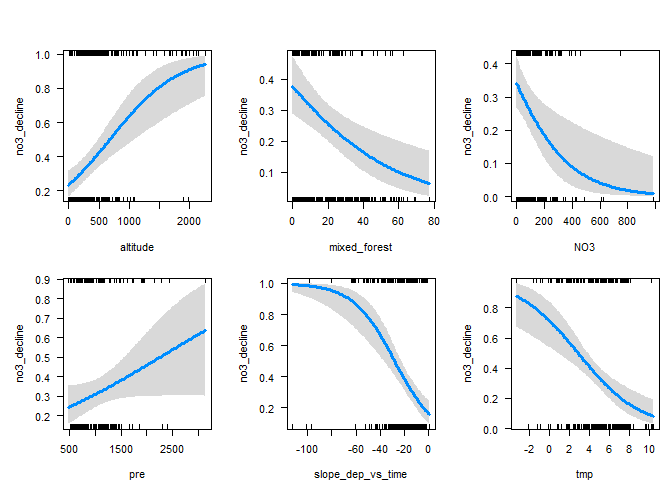
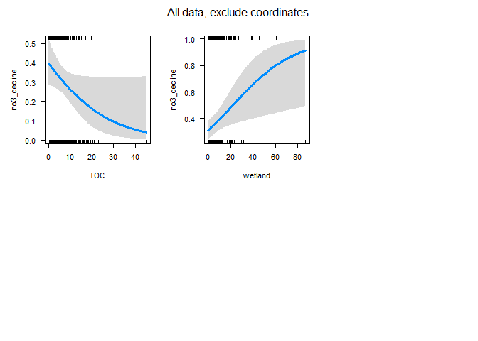
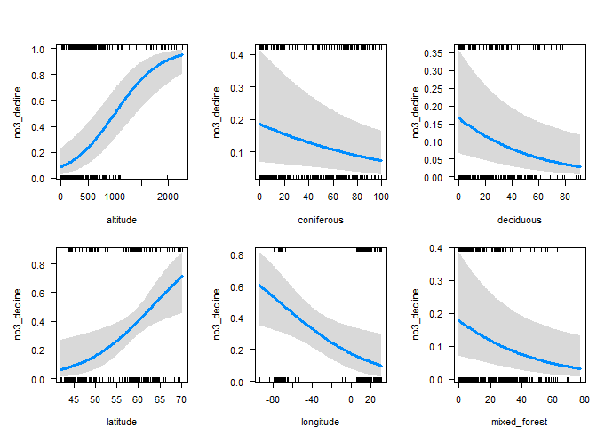
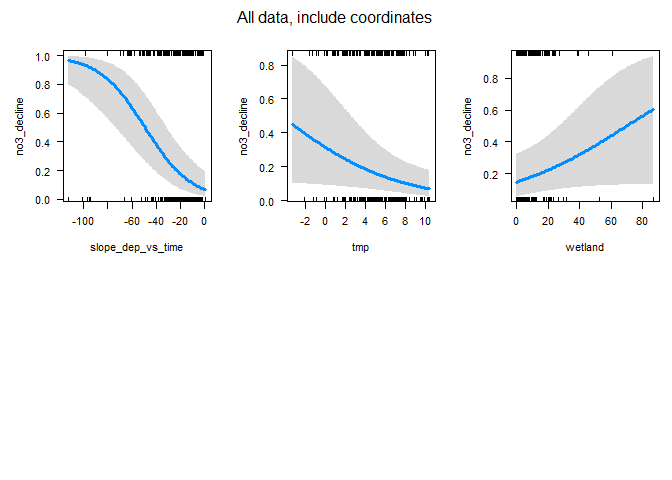
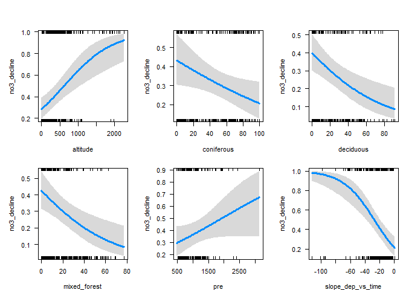
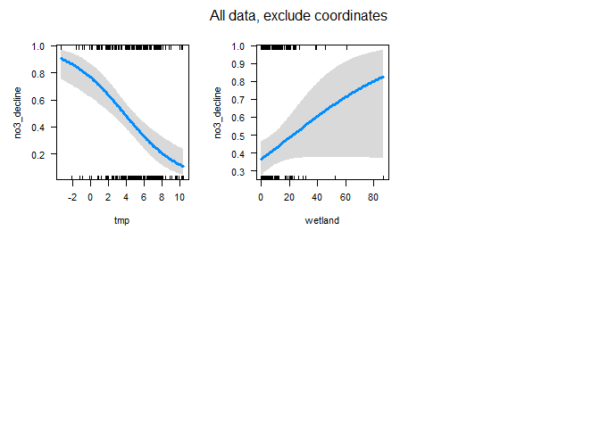
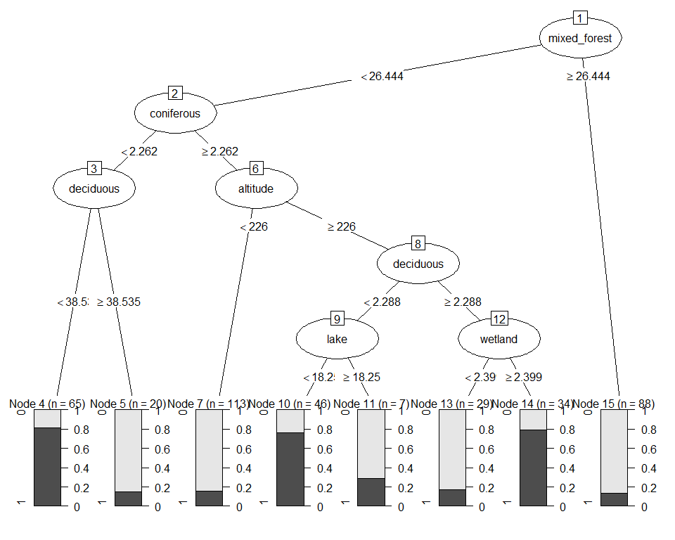
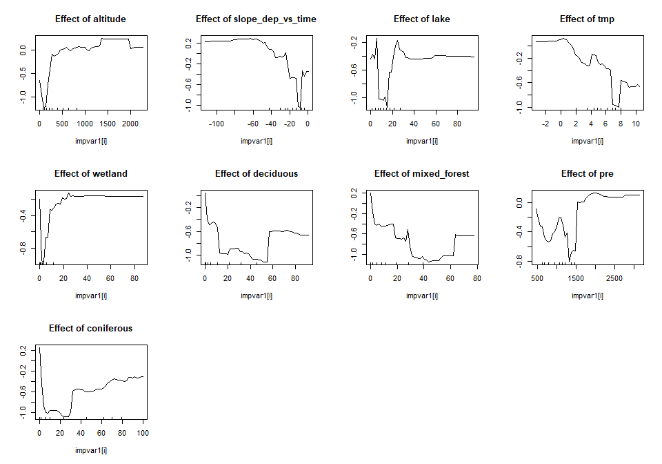

Analysis of NO3 decrease, based on James' trend results    
* Taken from `https://github.com/JamesSample/icpw2/tree/master/thematic_report_2020/results`   
* Sen slope of NO3, TOTN, TOC/TON etc.  
* Predictor variable in all analyses are *whether NO3 decreases or not*      
* Basically 3 sets of identical analyses (5,6,7) which only differ in data set (5 has the largest set of variables and the lowest sample size)  


## 1. Libraries  

```r
# All of tehse packages cn be loaded at once using library(tidyverse). (I just like to be specific.)
library(dplyr)
library(tidyr)
library(purrr)
library(lubridate)
library(ggplot2)

# Too many packages, not all are used
# library(forcats)
# library(mgcv)
# library(nlme)
library(mapview)
library(visreg)     # visreg
library(rkt)        # Theil -Sen Regression

library(MuMIn)      

# Trees and forests
# install.packages("party")
# install.packages("modeltools")
# install.packages("coin")
# install.packages("multcomp")
# install.packages("TH.data")
library(party)
# install.packages("evtree")
library(evtree)
# install.packages("randomForest")
library(randomForest)

library(maps)
my_map <- map_data("world")

library(effects)    # handles lme models  
library(readxl)

knitr::opts_chunk$set(results = 'hold')
knitr::opts_chunk$set(warning = FALSE)
```


## 2. Data

```r
dat_annual_sel <- readRDS("Data/120_dat_annual_sel.rds")
# ts_model_list <- readRDS("Data/120_ts_model_list_linear.rds")
# ts_model_list_wout_TOC <- readRDS("Data/120_ts_model_list_wout_TOC.rds")

df_stations <- readRDS("Data/100_Stations.rds")
df_deposition <- readRDS("Data/100_Deposition.rds")
df_climate <- readRDS("Data/100_Climate.rds")
```

### Station metadata

```r
df_station <- read_excel(
  "K:/Prosjekter/langtransporterte forurensninger/O-23300 - ICP-WATERS - HWI/Faglige rapporter/2020 report/Land cover/ICPW_All_Stations_2020_2020_05_04.xlsx") %>%
  mutate(station_id = as.character(station_id))
```

### James results  

```r
#
# Regression results
#
# fn <- "https://raw.githubusercontent.com/JamesSample/icpw2/master/thematic_report_2020/results/trends_1992-2016_toc_totn_no3_relax_italy/trends_1992-2016_toc_totn_no3_relax_italy_results.csv"
fn <- "https://github.com/JamesSample/icpw2/raw/master/thematic_report_2020/results/trends_1992-2016_no3/trends_1992-2016_no3_results.csv"
reg_no3 <- read.csv(fn, encoding = "UTF-8")
nrow(reg_no3)

# Station metadata
fn <- "https://raw.githubusercontent.com/JamesSample/icpw2/master/thematic_report_2020/results/trends_1992-2016_toc_totn_no3_relax_italy/trends_1992-2016_toc_totn_no3_relax_italy_stations.csv"
fn <- "https://github.com/JamesSample/icpw2/raw/master/thematic_report_2020/results/trends_1992-2016_no3/trends_1992-2016_no3_stations.csv"
reg_no3_st <- read.csv(fn, encoding = "UTF-8")

# xtabs(~variable, reg_no3)  
xtabs(~country, reg_no3_st)  

#
# Medians
#
fn <- "https://github.com/JamesSample/icpw2/raw/master/thematic_report_2020/results/medians_2012-2016/medians_2012-2016_no3.csv"
medians_no3 <- read.csv(fn, encoding = "UTF-8")
nrow(medians_no3)


if (FALSE){
  # Check Germany:
  x <- reg_no3_st %>% filter(country == "Germany") %>% pull(station_id)
  medians_no3 %>% filter(station_id %in% x) %>% View()  # only 3 stations??

  # Dounle check by reading and adding metadata 
  fn <- "https://github.com/JamesSample/icpw2/raw/master/thematic_report_2020/results/medians_2012-2016/medians_2012-2016_no3_stations.csv"
  medians_no3_st <- read.csv(fn, encoding = "UTF-8")
  medians_no3 <- medians_no3 %>% left_join(medians_no3_st)
  medians_no3 %>% filter(country %in% "Germany") %>% View()  # still only 3 stations

}

fn <- "https://github.com/JamesSample/icpw2/raw/master/thematic_report_2020/results/medians_2012-2016/medians_2012-2016_toc_totn_no3_nh4.csv"
medians_toc <- read.csv(fn, encoding = "UTF-8")
nrow(medians_toc)
```

```
## [1] 3176
## country
##         Canada Czech Republic        Estonia        Finland        Germany 
##            114              8              1             26             23 
##        Ireland          Italy         Latvia    Netherlands         Norway 
##              3              6              3              3             83 
##         Poland       Slovakia         Sweden    Switzerland United Kingdom 
##              6             12             92              6             21 
##  United States 
##             91 
## [1] 494
## [1] 225
```
### Start 'dat'  
With slope regression data  
* Make one line per station  

```r
df1 <- reg_no3 %>%
  filter(variable %in% c("NO3-N_µg/l N", "TOC/TON")) %>%
  select(station_id, variable, sen_slp) %>%
  tidyr::pivot_wider(names_from = "variable", values_from = "sen_slp")
df2 <- reg_no3 %>%
  filter(variable %in% c("NO3-N_µg/l N", "TOC/TON")) %>%
  select(station_id, variable, mk_p_val) %>%
  tidyr::pivot_wider(names_from = "variable", values_from = "mk_p_val")

names(df1)[2:3] <- c("slope_no3_vs_time", "slope_tocton_vs_time")
names(df2)[2:3] <- c("p_no3_vs_time", "p_tocton_vs_time")

dat <- full_join(df1, df2, by = "station_id")
```

### Deposition Theil-Senslope   

```r
### Get deposition  
df_deposition <- readRDS("Data/100_Deposition.rds") %>%
  as.data.frame()

# TEST Senslope
# df_test <- df_deposition %>% filter(station_id == 38115)
# result <- rkt(df_test$year, df_test$TOTN_dep)
# data.frame(station_id = 38115, TOTN_dep_P = result$sl, TOTN_dep_slope = result$B)

# Function for Sen slope
get_senslope <- function(data){
  result <- rkt(data$year, data$TOTN_dep)
  data.frame(station_id = data$station_id[1], slope_dep_vs_time = result$B, p_dep_vs_time = result$sl)
}

df_deposition_slope <- df_deposition %>%
  split(.$station_id) %>% # str()
  purrr::map_dfr(get_senslope)  
```


### Add deposition slope to data  

```r
nrow(dat)
dat <- left_join(dat, 
                 df_deposition_slope,
                 by = "station_id")

nrow(dat)
```

```
## [1] 498
## [1] 498
```
### Add medians and station metadata   

```r
nrow(dat)
dat <- dat %>%
  left_join(medians_no3, by = "station_id") %>%
  # left_join(medians_toc, by = "station_id") %>%   # not needed, overlap in variables  
  left_join(reg_no3_st, by = "station_id")
nrow(dat)

# Simplify names by removing units
# names(dat)
names(dat) <- sub(".N_µg.l.N", "", names(dat))
names(dat) <- sub("_mg.C.l", "", names(dat))
names(dat) <- sub("_µg.l.P", "", names(dat))
names(dat)
```

```
## [1] 498
## [1] 498
##  [1] "station_id"           "slope_no3_vs_time"    "slope_tocton_vs_time"
##  [4] "p_no3_vs_time"        "p_tocton_vs_time"     "slope_dep_vs_time"   
##  [7] "p_dep_vs_time"        "NH4"                  "NO3"                 
## [10] "TOC"                  "TO"                   "TOTP"                
## [13] "T"                    "TOTN.TOTP"            "NO3.TOTP"            
## [16] "TOC.TON"              "TOC.TOTP"             "station_code"        
## [19] "station_name"         "latitude"             "longitude"           
## [22] "altitude"             "continent"            "country"             
## [25] "region"               "group"
```

### Add climate and deposition means 

```r
df_climate <- readRDS("Data/100_Climate.rds")

df_climate_mean <- df_climate %>%
  group_by(station_id, variable) %>% 
  summarise(mean = mean(value)) %>%
  tidyr::pivot_wider(names_from = "variable", values_from = "mean")
```

```
## `summarise()` has grouped output by 'station_id'. You can override using the `.groups` argument.
```

```r
df_deposition_mean <-
  df_deposition %>% 
  group_by(station_id) %>% 
  summarise(Mean_dep = mean(TOTN_dep))

# Add
dat <- dat %>%
  left_join(df_climate_mean, by = "station_id") %>%
  left_join(df_deposition_mean, by = "station_id")
nrow(dat)
```

```
## [1] 498
```

### Add land cover    

```r
fn <- "K:/Prosjekter/langtransporterte forurensninger/O-23300 - ICP-WATERS - HWI/Faglige rapporter/2020 report/Land cover/ICPW_All_Stations_2020_2020_05_04.xlsx"

df_station <- read_excel(fn)

nrow(dat)
dat <- left_join(dat, 
                 df_station %>% select(-(station_code:longitude), -(altitude:region)), 
                 by = "station_id"
)

nrow(dat)
```

```
## [1] 498
## [1] 498
```


## 3. Plot estimates  

Note: **No USA**


```r
ggplot(dat, aes(slope_dep_vs_time, slope_no3_vs_time)) + 
  geom_point(data = dat %>% filter(p_no3_vs_time < 0.05), size = rel(2)) +
  geom_point(aes(color = country)) +
  geom_hline(yintercept = 0, linetype = 2) + 
  geom_vline(xintercept = 0, linetype = 2) 
```

<!-- -->

```r
ggplot(dat, aes(slope_dep_vs_time, slope_no3_vs_time,
                color = (p_no3_vs_time < 0.05))) + 
  geom_point() +
  facet_wrap(vars(country)) +
  geom_hline(yintercept = 0, linetype = 2) + 
  geom_vline(xintercept = 0, linetype = 2) + 
  labs(title = "A selection of countries")
```

<!-- -->

```r
dat %>%
  filter(!country %in% c("Latvia","Ireland","Italy","Netherlands")) %>%
  ggplot(aes(slope_dep_vs_time, slope_no3_vs_time,
             color = (p_no3_vs_time < 0.05))) + 
  geom_point() +
  facet_wrap(vars(country)) +
  geom_hline(yintercept = 0, linetype = 2) + 
  geom_vline(xintercept = 0, linetype = 2) + 
  labs(title = "A selection of countries") + 
  ylim(-50, 25)
```

<!-- -->


## 4. Analysis of 'Significant / non-significant NO3 decline'   
* Parts 5, 6 and 7 all run logistic regression + "trees and forest" methods  
* Each part differ only in dataset used  

## 5a. Data INCLUDING catchment_area    

```r
# Data for analyses
df_analysis <- dat %>%
  mutate(
    no3_decline = case_when(
      slope_no3_vs_time < 0 & p_no3_vs_time <= 0.05 ~ 1,
      TRUE ~ 0)
  ) %>%
  select(no3_decline, slope_dep_vs_time,
         NO3, TOC,
    latitude, longitude, altitude, 
    pre, tmp, catchment_area,
    coniferous, deciduous, lake, mixed_forest, wetland)

# Complete cases
apply(is.na(df_analysis), 2, sum)

# What is missing? (long output)
if (FALSE){
dat %>% 
  split(.$country) %>%
  purrr::map(~apply(is.na(.), 2, mean))
}

complete <- complete.cases(df_analysis)
table(complete)
table(dat$country, complete)

# Keep only complete cases
df_analysis <- df_analysis[complete.cases(df_analysis),]
```

```
##       no3_decline slope_dep_vs_time               NO3               TOC 
##                 0                 0                25                26 
##          latitude         longitude          altitude               pre 
##                 0                 0                 9                 0 
##               tmp    catchment_area        coniferous         deciduous 
##                 0                93                43                43 
##              lake      mixed_forest           wetland 
##                37                43                37 
## complete
## FALSE  TRUE 
##   153   345 
##                 complete
##                  FALSE TRUE
##   Canada             0  114
##   Czech Republic     0    8
##   Estonia            1    0
##   Finland            3   23
##   Germany           21    2
##   Ireland            1    2
##   Italy              2    4
##   Latvia             0    3
##   Netherlands        1    2
##   Norway             0   83
##   Poland             0    6
##   Slovakia           0   12
##   Sweden             6   86
##   Switzerland        6    0
##   United Kingdom    21    0
##   United States     91    0
```


## 5b. Logistic regression, all variables  

```r
# Full model  
fm <- glm(
  no3_decline ~ .,
  data = df_analysis, 
  family = "binomial",
  na.action = "na.fail")

# Dredging for best model
# dd1a <- dredge(fm)                           # only once
# saveRDS(dd1a, "Data/160_all_dd1a.rds")    # save it as it takes a couple of minutes

# Read dredge result
dd1a <- readRDS("Data/160_all_dd1a.rds")

# Check best models  
subset(dd1a, delta < 1)

cat("\n\nR2: \n")
dd1a_mod1 <- get.models(dd1a, 1)[[1]]  
# summary(dd1a_mod1)  

par(mfrow = c(2,3), mar = c(4,5,2,1), oma = c(0,0,2,0))
visreg(dd1a_mod1, scale = "response")
mtext("All data, include coordinates", outer = TRUE)
```

<!-- -->

```
## Global model call: glm(formula = no3_decline ~ ., family = "binomial", data = df_analysis, 
##     na.action = "na.fail")
## ---
## Model selection table 
##         (Int)      alt    ltt mxd_frs       NO3       pre slp_dep_vs_tim
## 3618   -9.370 0.002339 0.1243                   0.0010250       -0.03810
## 14114  -8.951 0.002622 0.1200         -0.002646 0.0006034       -0.03658
## 5922   -9.434 0.002610 0.1278         -0.002438 0.0006667       -0.03520
## 16162  -8.219 0.002443 0.1106         -0.002318 0.0007028       -0.04377
## 14242 -10.440 0.002782 0.1403 0.01389 -0.002341 0.0005943       -0.03978
## 3874   -9.286 0.002518 0.1217         -0.001556 0.0010000       -0.04266
## 7970   -8.637 0.002429 0.1176         -0.002137 0.0007687       -0.04341
## 7714   -8.908 0.002222 0.1218                   0.0008626       -0.03743
## 13602  -7.501 0.002661 0.1070         -0.003050                 -0.03991
##           tmp      TOC     wtl df   logLik  AICc delta weight
## 3618  -0.1675                   6 -166.153 344.6  0.00  0.149
## 14114         -0.08147 0.03140  8 -164.074 344.6  0.02  0.147
## 5922          -0.06388          7 -165.318 345.0  0.42  0.121
## 16162 -0.1041 -0.06793 0.03016  9 -163.383 345.3  0.75  0.102
## 14242         -0.07912 0.03525  9 -163.416 345.4  0.82  0.099
## 3874  -0.1596                   7 -165.539 345.4  0.86  0.097
## 7970  -0.1146 -0.04904          8 -164.502 345.4  0.88  0.096
## 7714  -0.1372 -0.03531          7 -165.556 345.4  0.89  0.095
## 13602         -0.10690 0.03569  7 -165.563 345.5  0.90  0.095
## Models ranked by AICc(x) 
## 
## 
## R2:
```

## 5c. Logistic regression, exclude coordinates    

```r
fm <- glm(
  no3_decline ~ slope_dep_vs_time + NO3 + TOC +
    altitude + 
    pre + tmp + catchment_area +
    coniferous + deciduous + lake + mixed_forest + 
    wetland,
  data = df_analysis, 
  family = "binomial",
  na.action = "na.fail")

# dd1b <- dredge(fm)                       # only once
# saveRDS(dd1b, "Data/160_all_dd1b.rds")    # save it as it takes a couple of minutes

dd1b <- readRDS("Data/160_all_dd1b.rds")

subset(dd1b, delta < 1)

cat("\n\nR2: \n")
dd1b_mod1 <- get.models(dd1b, 1)[[1]]  
# summary(dd1b_mod1)  

par(mfrow = c(2,3), mar = c(4,5,2,1), oma = c(0,0,2,0))
visreg(dd1b_mod1, scale = "response")
```

<!-- -->

```r
mtext("All data, exclude coordinates", outer = TRUE)
```

<!-- -->

```
## Global model call: glm(formula = no3_decline ~ slope_dep_vs_time + NO3 + TOC + altitude + 
##     pre + tmp + catchment_area + coniferous + deciduous + lake + 
##     mixed_forest + wetland, family = "binomial", data = df_analysis, 
##     na.action = "na.fail")
## ---
## Model selection table 
##         (Int)      alt       cnf      dcd  mxd_frs       NO3       pre
## 4074 -0.37410 0.001460           -0.02238 -0.01548 -0.002883 0.0005804
## 3950  0.33280 0.001574 -0.008691 -0.02683 -0.01731 -0.003258          
## 3946  0.06466 0.001644           -0.01983 -0.01366 -0.003409          
## 4042 -0.49790 0.001452           -0.02847          -0.002697 0.0005127
## 3914 -0.09034 0.001612           -0.02565          -0.003177          
## 4078 -0.08987 0.001425 -0.006561 -0.02728 -0.01797 -0.002842 0.0004843
##      slp_dep_vs_tim     tmp      TOC     wtl df   logLik  AICc delta weight
## 4074       -0.05323 -0.2509 -0.09644 0.03637 10 -170.230 361.1  0.00  0.223
## 3950       -0.05451 -0.2009 -0.09097 0.03303 10 -170.524 361.7  0.59  0.166
## 3946       -0.05284 -0.1974 -0.12370 0.04099  9 -171.616 361.8  0.65  0.161
## 4042       -0.05841 -0.2611 -0.10420 0.04421  9 -171.628 361.8  0.67  0.159
## 3914       -0.05741 -0.2118 -0.12770 0.04762  8 -172.736 361.9  0.78  0.151
## 4078       -0.05426 -0.2443 -0.07689 0.03088 11 -169.640 362.1  0.95  0.139
## Models ranked by AICc(x) 
## 
## 
## R2:
```


## 5d. Tree and forest classification


### Split into training and validation data

```r
set.seed(123)

x <- runif(nrow(df_analysis))
train <- ifelse(x < 0.9, TRUE, FALSE)

train_set <- df_analysis[train,]  %>% 
  mutate(no3_decline_f = factor(no3_decline)) %>% select(-no3_decline, -longitude, - latitude) %>%
  as.data.frame()
valid_set <- df_analysis[!train,] %>% 
  mutate(no3_decline_f = factor(no3_decline)) %>% select(-no3_decline, -longitude, - latitude) %>%
  as.data.frame()
```


### a. Tree classification using 'party'   

```r
(ct = ctree(no3_decline_f ~ ., data = train_set))

plot(ct, main="Conditional Inference Tree")
```

<!-- -->

```r
cat("\n\n")
cat("Table of prediction errors \n")
table(predict(ct), train_set$no3_decline_f)
cat("\n\n")

cat("Classification of training set \n")
tr.pred = predict(ct, newdata = valid_set, type="prob")
colnames(tr.pred) <- c("P0", "P1")
# tr.pred <- tr.pred %>% map_dfr(~data.frame(P0 = .[1], P1 = .[2]))
table(tr.pred[,"P1"] > 0.5, valid_set$no3_decline_f)
```

```
## 
## Model formula:
## no3_decline_f ~ slope_dep_vs_time + NO3 + TOC + altitude + pre + 
##     tmp + catchment_area + coniferous + deciduous + lake + mixed_forest + 
##     wetland
## 
## Fitted party:
## [1] root
## |   [2] altitude <= 203
## |   |   [3] slope_dep_vs_time <= -21.33716: 0 (n = 57, err = 40.4%)
## |   |   [4] slope_dep_vs_time > -21.33716
## |   |   |   [5] tmp <= 1.22633: 1 (n = 7, err = 28.6%)
## |   |   |   [6] tmp > 1.22633: 0 (n = 91, err = 3.3%)
## |   [7] altitude > 203
## |   |   [8] mixed_forest <= 29.71: 1 (n = 126, err = 38.1%)
## |   |   [9] mixed_forest > 29.71: 0 (n = 33, err = 24.2%)
## 
## Number of inner nodes:    4
## Number of terminal nodes: 5
## 
## 
## Table of prediction errors 
##    
##       0   1
##   0 147  34
##   1  50  83
## 
## 
## Classification of training set 
##        
##          0  1
##   FALSE 13  1
##   TRUE   6 11
```

### b. Evtree (Evolutionary Learning)   

```r
ev.raw = evtree(no3_decline_f ~ ., data = train_set)

plot(ev.raw)
```

<!-- -->

```r
cat("Predicted in training data: \n")
table(predict(ev.raw), train_set$no3_decline_f)

cat("\n\nPrediction errors in training data: \n")
1-mean(predict(ev.raw) == train_set$no3_decline_f)
```

```
## Predicted in training data: 
##    
##       0   1
##   0 178  34
##   1  19  83
## 
## 
## Prediction errors in training data: 
## [1] 0.1687898
```


### c. Random forest  
* *For results/interpretation, see separate document '160_randomforest_James_data.html'*  
* Model called 'model1'

```r
model1 <- randomForest(no3_decline_f ~ ., 
                       data = train_set, 
                       mtry = 5,
                       importance = TRUE)

model1
```

```
## 
## Call:
##  randomForest(formula = no3_decline_f ~ ., data = train_set, mtry = 5,      importance = TRUE) 
##                Type of random forest: classification
##                      Number of trees: 500
## No. of variables tried at each split: 5
## 
##         OOB estimate of  error rate: 21.97%
## Confusion matrix:
##     0  1 class.error
## 0 169 28   0.1421320
## 1  41 76   0.3504274
```


#### Random forest, predict on training data

```r
# Predicting on train set
pred_valid <- predict(model1, valid_set, type = "class")
# Checking classification accuracy
table(pred_valid, valid_set$no3_decline_f)  
```

```
##           
## pred_valid  0  1
##          0 14  4
##          1  5  8
```

#### Random forest, importance (but see separate result file)  
High MeanDecreaseGini = high importance in model  

```r
randomForest::importance(model1)
varImpPlot(model1)
```

<!-- -->

```
##                           0         1 MeanDecreaseAccuracy MeanDecreaseGini
## slope_dep_vs_time 16.095172  9.961779            18.962441        15.835297
## NO3               11.771612  1.904267            10.922560         9.961502
## TOC               21.700938 23.099189            32.056949        23.221035
## altitude          14.470720  9.741508            17.183749        15.497963
## pre               11.803386  1.215109            11.105992         9.973637
## tmp                7.990175  3.130453             8.707898         8.788499
## catchment_area     6.079605  3.968000             7.404545         9.594425
## coniferous         6.485133  7.855741            10.614760        11.126433
## deciduous          6.455327  8.648916            11.409659        10.163437
## lake               6.747708  8.424689            10.633523        12.570075
## mixed_forest       7.203030  7.431042            11.286080        10.634334
## wetland            7.041735  7.408902            10.180838         8.785747
```

#### Random forest, partial effects   
* NOt easy to interpret    

```r
imp <- randomForest::importance(model1)
impvar1 <- rownames(imp)[order(imp[, 2], decreasing=TRUE)]

# impvar1 <- readRDS("Data/130_impvar1.rmd")

par(mfrow=c(3,4))

for (i in seq_along(impvar1)) {
  partialPlot(x = model1, 
              pred.data = train_set, 
              x.var = impvar1[i], 
              which.class = "1",
              main=paste("Effect of", impvar1[i]))
}
```

<!-- -->
#### randomForestExplainer

```r
# install.packages("randomForestExplainer")
library(randomForestExplainer)
```

```
## Registered S3 method overwritten by 'GGally':
##   method from   
##   +.gg   ggplot2
```

```r
# COPY to console and run (this will create an Rmd file and render an HTML file):
# DON'T rin ith within this chunk, RStudio will hang

if (FALSE){
  explain_forest(model1, interactions = TRUE, data = train_set, 
                 path = "C:/Data/seksjon 317/icpw-R/160_randomforest_James_data_model1.html")
}
```


## 6a. Data EXCLUDING catchment_area   
* Includes USA data, still missing UK and most German data      
*  Germany is missing TOC and NO3 (87%), UK is missing land cover (100%)

```r
# Data for analyses
df_analysis <- dat %>%
  mutate(
    no3_decline = case_when(
      slope_no3_vs_time < 0 & p_no3_vs_time <= 0.05 ~ 1,
      TRUE ~ 0)
  ) %>%
  select(no3_decline, slope_dep_vs_time,
         NO3, TOC,
    latitude, longitude, altitude, 
    pre, tmp, 
    coniferous, deciduous, lake, mixed_forest, wetland)

# Complete cases
apply(is.na(df_analysis), 2, sum)

complete <- complete.cases(df_analysis)
table(complete)
table(dat$country, complete)

# What is missing? (long output)  
# Germany is missing TOC (87%)
if (FALSE){
dat %>% 
  split(.$country) %>%
  purrr::map(~apply(is.na(.), 2, mean))
}


# Keep only complete cases
df_analysis <- df_analysis[complete.cases(df_analysis),]
```

```
##       no3_decline slope_dep_vs_time               NO3               TOC 
##                 0                 0                25                26 
##          latitude         longitude          altitude               pre 
##                 0                 0                 9                 0 
##               tmp        coniferous         deciduous              lake 
##                 0                43                43                37 
##      mixed_forest           wetland 
##                43                37 
## complete
## FALSE  TRUE 
##    78   420 
##                 complete
##                  FALSE TRUE
##   Canada             0  114
##   Czech Republic     0    8
##   Estonia            1    0
##   Finland            3   23
##   Germany           21    2
##   Ireland            1    2
##   Italy              2    4
##   Latvia             0    3
##   Netherlands        1    2
##   Norway             0   83
##   Poland             0    6
##   Slovakia           0   12
##   Sweden             6   86
##   Switzerland        6    0
##   United Kingdom    21    0
##   United States     16   75
```


## 6b. Logistic regression, all variables  

```r
# Full model  
fm <- glm(
  no3_decline ~ .,
  data = df_analysis, 
  family = "binomial",
  na.action = "na.fail")

# Dredging for best model
# dd2a <- dredge(fm)                           # only once
# saveRDS(dd2a, "Data/160_all_dd2a.rds")    # save it as it takes a couple of minutes

# Read dredge result
dd2a <- readRDS("Data/160_all_dd2a.rds")

# Check best models  
subset(dd2a, delta < 1)

cat("\n\nR2: \n")
dd2a_mod1 <- get.models(dd2a, 1)[[1]]  
# summary(dd2a_mod1)  

par(mfrow = c(2,3), mar = c(4,5,2,1), oma = c(0,0,2,0))
visreg(dd2a_mod1, scale = "response")
```

<!-- -->

```r
mtext("All data, include coordinates", outer = TRUE)
```

<!-- -->

```
## Global model call: glm(formula = no3_decline ~ ., family = "binomial", data = df_analysis, 
##     na.action = "na.fail")
## ---
## Model selection table 
##       (Int)      alt     ltt mxd_frs       NO3       pre slp_dep_vs_tim     tmp
## 8146 -4.263 0.002248 0.05366 -0.0152 -0.003603 0.0006980       -0.05247 -0.2199
## 8082 -5.543 0.002408 0.07051         -0.003291 0.0006445       -0.05414 -0.1990
##           TOC     wtl df   logLik  AICc delta weight
## 8146 -0.06382 0.04390 10 -209.753 440.0  0.00  0.545
## 8082 -0.06738 0.05073  9 -210.981 440.4  0.36  0.455
## Models ranked by AICc(x) 
## 
## 
## R2:
```

## 6c. Logistic regression, exclude coordinates    

```r
fm <- glm(
  no3_decline ~ slope_dep_vs_time + NO3 + TOC +
    altitude + 
    pre + tmp + 
    coniferous + deciduous + lake + mixed_forest + 
    wetland,
  data = df_analysis, 
  family = "binomial",
  na.action = "na.fail")

# dd2b <- dredge(fm)                       # only once
# saveRDS(dd2b, "Data/160_all_dd2b.rds")    # save it as it takes a couple of minutes

dd2b <- readRDS("Data/160_all_dd2b.rds")

subset(dd2b, delta < 1)

cat("\n\nR2: \n")
dd2b_mod1 <- get.models(dd2b, 1)[[1]]  
# summary(dd2b_mod1)  

par(mfrow = c(2,3), mar = c(4,5,2,1), oma = c(0,0,2,0))
visreg(dd2b_mod1, scale = "response")
```

<!-- -->

```r
mtext("All data, exclude coordinates", outer = TRUE)
```

<!-- -->

```
## Global model call: glm(formula = no3_decline ~ slope_dep_vs_time + NO3 + TOC + altitude + 
##     pre + tmp + coniferous + deciduous + lake + mixed_forest + 
##     wetland, family = "binomial", data = df_analysis, na.action = "na.fail")
## ---
## Model selection table 
##        (Int)      alt      dcd  mxd_frs       NO3       pre slp_dep_vs_tim
## 2034 -0.5133 0.001738          -0.02802 -0.004148 0.0006341       -0.05859
## 2038 -0.4808 0.001736 -0.00794 -0.02600 -0.003902 0.0006543       -0.05782
##          tmp      TOC     wtl df   logLik  AICc delta weight
## 2034 -0.3199 -0.06086 0.03589  9 -213.220 444.9  0.00  0.553
## 2038 -0.3049 -0.06875 0.03927 10 -212.384 445.3  0.43  0.447
## Models ranked by AICc(x) 
## 
## 
## R2:
```


## 6d. Tree and forest classification


### Split into training and validation data

```r
set.seed(123)

x <- runif(nrow(df_analysis))
train <- ifelse(x < 0.9, TRUE, FALSE)

train_set <- df_analysis[train,]  %>% 
  mutate(no3_decline_f = factor(no3_decline)) %>% select(-no3_decline, -longitude, - latitude) %>%
  as.data.frame()
valid_set <- df_analysis[!train,] %>% 
  mutate(no3_decline_f = factor(no3_decline)) %>% select(-no3_decline, -longitude, - latitude) %>%
  as.data.frame()
```


### a. Tree classification using 'party'   

```r
(ct = ctree(no3_decline_f ~ ., data = train_set))

plot(ct, main="Conditional Inference Tree")
```

<!-- -->

```r
cat("\n\n")
cat("Table of prediction errors \n")
table(predict(ct), train_set$no3_decline_f)
cat("\n\n")

cat("Classification of training set \n")
tr.pred = predict(ct, newdata = valid_set, type="prob")
colnames(tr.pred) <- c("P0", "P1")
# tr.pred <- tr.pred %>% map_dfr(~data.frame(P0 = .[1], P1 = .[2]))
table(tr.pred[,"P1"] > 0.5, valid_set$no3_decline_f)
```

```
## 
## Model formula:
## no3_decline_f ~ slope_dep_vs_time + NO3 + TOC + altitude + pre + 
##     tmp + coniferous + deciduous + lake + mixed_forest + wetland
## 
## Fitted party:
## [1] root
## |   [2] altitude <= 203
## |   |   [3] deciduous <= 3.084: 0 (n = 70, err = 32.9%)
## |   |   [4] deciduous > 3.084
## |   |   |   [5] slope_dep_vs_time <= -38.72255: 0 (n = 10, err = 50.0%)
## |   |   |   [6] slope_dep_vs_time > -38.72255: 0 (n = 87, err = 4.6%)
## |   [7] altitude > 203
## |   |   [8] mixed_forest <= 29.71: 1 (n = 174, err = 39.1%)
## |   |   [9] mixed_forest > 29.71: 0 (n = 37, err = 24.3%)
## 
## Number of inner nodes:    4
## Number of terminal nodes: 5
## 
## 
## Table of prediction errors 
##    
##       0   1
##   0 163  41
##   1  68 106
## 
## 
## Classification of training set 
##        
##          0  1
##   FALSE 16  2
##   TRUE  11 13
```

### b. Evtree (Evolutionary Learning)   

```r
ev.raw = evtree(no3_decline_f ~ ., data = train_set)

plot(ev.raw)
```

<!-- -->

```r
cat("Predicted in training data: \n")
table(predict(ev.raw), train_set$no3_decline_f)

cat("\n\nPrediction errors in training data: \n")
1-mean(predict(ev.raw) == train_set$no3_decline_f)
```

```
## Predicted in training data: 
##    
##       0   1
##   0 206  41
##   1  25 106
## 
## 
## Prediction errors in training data: 
## [1] 0.1746032
```


### c. Random forest  
* *For results/interpretation, see separate document '160_randomforest_James_data.html'*  
* Model called 'model2'

```r
model2 <- randomForest(no3_decline_f ~ ., 
                       data = train_set, 
                       mtry = 5,
                       importance = TRUE)

model2
```

```
## 
## Call:
##  randomForest(formula = no3_decline_f ~ ., data = train_set, mtry = 5,      importance = TRUE) 
##                Type of random forest: classification
##                      Number of trees: 500
## No. of variables tried at each split: 5
## 
##         OOB estimate of  error rate: 24.87%
## Confusion matrix:
##     0  1 class.error
## 0 187 44   0.1904762
## 1  50 97   0.3401361
```


#### Random forest, predict on training data

```r
# Predicting on train set
pred_valid <- predict(model2, valid_set, type = "class")
# Checking classification accuracy
table(pred_valid, valid_set$no3_decline_f)  
```

```
##           
## pred_valid  0  1
##          0 24  3
##          1  3 12
```

#### Random forest, importance (but see separate result file)  
High MeanDecreaseGini = high importance in model  

```r
randomForest::importance(model2)
varImpPlot(model2)
```

<!-- -->

```
##                           0         1 MeanDecreaseAccuracy MeanDecreaseGini
## slope_dep_vs_time 19.329271 16.299669            24.599823         21.22609
## NO3               13.340090  2.151598            12.903752         14.34007
## TOC               16.254351 24.439163            29.966134         22.81956
## altitude          15.733447 17.499942            23.492887         26.92790
## pre               13.232342  8.504363            15.871216         13.02270
## tmp                7.132700  9.994468            12.918633         14.09981
## coniferous         7.462411  7.609056            12.445970         11.36415
## deciduous          6.996246  4.753874             8.977179         10.88013
## lake               2.614851  7.948136             7.649662         14.04822
## mixed_forest      10.548020  8.863458            14.483085         16.12061
## wetland            5.165532 10.968570            12.418336         14.21777
```

#### Random forest, partial effects   
* NOt easy to interpret    

```r
imp <- randomForest::importance(model2)
impvar1 <- rownames(imp)[order(imp[, 2], decreasing=TRUE)]

# impvar1 <- readRDS("Data/130_impvar1.rmd")

par(mfrow=c(3,4))

for (i in seq_along(impvar1)) {
  partialPlot(x = model2, 
              pred.data = train_set, 
              x.var = impvar1[i], 
              which.class = "1",
              main=paste("Effect of", impvar1[i]))
}
```

<!-- -->
#### randomForestExplainer

```r
# install.packages("randomForestExplainer")
library(randomForestExplainer)

# COPY to console and run (this will create an Rmd file and render an HTML file):
# DON'T rin ith within this chunk, RStudio will hang

if (FALSE){
  explain_forest(model2, interactions = TRUE, data = train_set, 
                 path = "C:/Data/seksjon 317/icpw-R/160_randomforest_James_data_model2.html")
}
```


## 7a. Data EXCLUDING catchment_area, TOC and NO3    
* Includes USA data, still missing UK and most German data      
*  Germany is missing TOC (87%), UK is missing land cover (100%)

```r
# Data for analyses
df_analysis <- dat %>%
  mutate(
    no3_decline = case_when(
      slope_no3_vs_time < 0 & p_no3_vs_time <= 0.05 ~ 1,
      TRUE ~ 0)
  ) %>%
  select(country, station_code, no3_decline, slope_dep_vs_time,
    latitude, longitude, altitude, 
    pre, tmp, 
    coniferous, deciduous, lake, mixed_forest, wetland)

# Complete cases
apply(is.na(df_analysis), 2, sum)

complete <- complete.cases(df_analysis)
table(complete)
table(df_analysis$country, complete)

# What is missing? (long output)  
# Germany is missing NO3 (87%)
if (FALSE){
df_analysis %>% 
  split(.$country) %>%
  purrr::map(~apply(is.na(.), 2, mean))
}


# Keep only complete cases
df_analysis <- df_analysis[complete.cases(df_analysis),] %>%
  select(-country, -station_code)
```

```
##           country      station_code       no3_decline slope_dep_vs_time 
##                 0                 0                 0                 0 
##          latitude         longitude          altitude               pre 
##                 0                 0                 9                 0 
##               tmp        coniferous         deciduous              lake 
##                 0                43                43                37 
##      mixed_forest           wetland 
##                43                37 
## complete
## FALSE  TRUE 
##    52   446 
##                 complete
##                  FALSE TRUE
##   Canada             0  114
##   Czech Republic     0    8
##   Estonia            1    0
##   Finland            0   26
##   Germany            1   22
##   Ireland            1    2
##   Italy              0    6
##   Latvia             0    3
##   Netherlands        0    3
##   Norway             0   83
##   Poland             0    6
##   Slovakia           0   12
##   Sweden             6   86
##   Switzerland        6    0
##   United Kingdom    21    0
##   United States     16   75
```


## 7b. Logistic regression, all variables  

```r
# Full model  
fm <- glm(
  no3_decline ~ .,
  data = df_analysis, 
  family = "binomial",
  na.action = "na.fail")

# Dredging for best model
# dd3a <- dredge(fm)                           # only once
# saveRDS(dd3a, "Data/160_all_dd3a.rds")    # save it as it takes a couple of minutes

# Read dredge result
dd3a <- readRDS("Data/160_all_dd3a.rds")

# Check best models  
subset(dd3a, delta < 1)

cat("\n\nR2: \n")
dd3a_mod1 <- get.models(dd3a, 1)[[1]]  
# summary(dd3a_mod1)  

par(mfrow = c(2,3), mar = c(4,5,2,1), oma = c(0,0,2,0))
visreg(dd3a_mod1, scale = "response")
```

<!-- -->

```r
mtext("All data, include coordinates", outer = TRUE)
```

<!-- -->

```
## Global model call: glm(formula = no3_decline ~ ., family = "binomial", data = df_analysis, 
##     na.action = "na.fail")
## ---
## Model selection table 
##       (Int)      alt       cnf      dcd     lak     ltt      lng  mxd_frs
## 1912 -7.941 0.002360 -0.010580 -0.02099         0.12690 -0.02112 -0.02442
## 1946 -6.391 0.002386                    0.01851 0.07396                  
## 2040 -7.587 0.002243 -0.008066 -0.01867         0.11420 -0.01744 -0.02289
## 2010 -5.443 0.002224                    0.01777 0.06218          -0.01083
## 2038 -9.088 0.002394           -0.01160         0.12870 -0.01808 -0.01745
##            pre slp_dep_vs_tim     tmp     wtl df   logLik  AICc delta weight
## 1912                 -0.05274 -0.1741 0.02500 10 -231.604 483.7  0.00  0.255
## 1946 0.0008399       -0.04426 -0.2419 0.04024  8 -233.774 483.9  0.16  0.235
## 2040 0.0004384       -0.05149 -0.2013 0.02671 11 -230.829 484.3  0.55  0.194
## 2010 0.0008713       -0.04212 -0.2560 0.03553  9 -233.115 484.6  0.93  0.160
## 2038 0.0006525       -0.05048 -0.2114 0.03090 10 -232.101 484.7  1.00  0.155
## Models ranked by AICc(x) 
## 
## 
## R2:
```

## 7c. Logistic regression, exclude coordinates    

```r
fm <- glm(
  no3_decline ~ slope_dep_vs_time + 
    altitude + 
    pre + tmp + 
    coniferous + deciduous + lake + mixed_forest + 
    wetland,
  data = df_analysis, 
  family = "binomial",
  na.action = "na.fail")

# dd3b <- dredge(fm)                       # only once
# saveRDS(dd3b, "Data/160_all_dd3b.rds")    # save it as it takes a couple of minutes

dd3b <- readRDS("Data/160_all_dd3b.rds")

subset(dd3b, delta < 1)

cat("\n\nR2: \n")
dd3b_mod1 <- get.models(dd3b, 1)[[1]]  
# summary(dd3b_mod1)  

par(mfrow = c(2,3), mar = c(4,5,2,1), oma = c(0,0,2,0))
visreg(dd3b_mod1, scale = "response")
```

<!-- -->

```r
mtext("All data, exclude coordinates", outer = TRUE)
```

<!-- -->

```
## Global model call: glm(formula = no3_decline ~ slope_dep_vs_time + altitude + pre + 
##     tmp + coniferous + deciduous + lake + mixed_forest + wetland, 
##     family = "binomial", data = df_analysis, na.action = "na.fail")
## ---
## Model selection table 
##       (Int)      alt      cnf      dcd  mxd_frs       pre slp_dep_vs_tim
## 504 -0.1051 0.001499 -0.01073 -0.02134 -0.02682 0.0005955       -0.04688
##         tmp     wtl df   logLik  AICc delta weight
## 504 -0.3155 0.02418  9 -233.587 485.6     0      1
## Models ranked by AICc(x) 
## 
## 
## R2:
```


## 7d. Tree and forest classification


### Split into training and validation data   

```r
set.seed(123)

x <- runif(nrow(df_analysis))
train <- ifelse(x < 0.9, TRUE, FALSE)

train_set <- df_analysis[train,]  %>% 
  mutate(no3_decline_f = factor(no3_decline)) %>% select(-no3_decline, -longitude, - latitude) %>%
  as.data.frame()
valid_set <- df_analysis[!train,] %>% 
  mutate(no3_decline_f = factor(no3_decline)) %>% select(-no3_decline, -longitude, - latitude) %>%
  as.data.frame()
```


### a. Tree classification using 'party'   

```r
(ct = ctree(no3_decline_f ~ ., data = train_set))

plot(ct, main="Conditional Inference Tree")
```

<!-- -->

```r
cat("\n\n")
cat("Table of prediction errors \n")
table(predict(ct), train_set$no3_decline_f)
cat("\n\n")

cat("Classification of training set \n")
tr.pred = predict(ct, newdata = valid_set, type="prob")
colnames(tr.pred) <- c("P0", "P1")
# tr.pred <- tr.pred %>% map_dfr(~data.frame(P0 = .[1], P1 = .[2]))
table(tr.pred[,"P1"] > 0.5, valid_set$no3_decline_f)
```

```
## 
## Model formula:
## no3_decline_f ~ slope_dep_vs_time + altitude + pre + tmp + coniferous + 
##     deciduous + lake + mixed_forest + wetland
## 
## Fitted party:
## [1] root
## |   [2] altitude <= 226
## |   |   [3] mixed_forest <= 0.056: 1 (n = 12, err = 41.7%)
## |   |   [4] mixed_forest > 0.056
## |   |   |   [5] slope_dep_vs_time <= -36.99988: 1 (n = 13, err = 38.5%)
## |   |   |   [6] slope_dep_vs_time > -36.99988
## |   |   |   |   [7] tmp <= 1.22633: 1 (n = 9, err = 44.4%)
## |   |   |   |   [8] tmp > 1.22633: 0 (n = 143, err = 8.4%)
## |   [9] altitude > 226
## |   |   [10] mixed_forest <= 29.71
## |   |   |   [11] deciduous <= 39.189: 1 (n = 147, err = 30.6%)
## |   |   |   [12] deciduous > 39.189: 0 (n = 36, err = 33.3%)
## |   |   [13] mixed_forest > 29.71: 0 (n = 42, err = 21.4%)
## 
## Number of inner nodes:    6
## Number of terminal nodes: 7
## 
## 
## Table of prediction errors 
##    
##       0   1
##   0 188  33
##   1  59 122
## 
## 
## Classification of training set 
##        
##          0  1
##   FALSE 13  8
##   TRUE  12 11
```

### b. Evtree (Evolutionary Learning)   

```r
ev.raw = evtree(no3_decline_f ~ ., data = train_set)

plot(ev.raw)
```

<!-- -->

```r
cat("Predicted in training data: \n")
table(predict(ev.raw), train_set$no3_decline_f)

cat("\n\nPrediction errors in training data: \n")
1-mean(predict(ev.raw) == train_set$no3_decline_f)
```

```
## Predicted in training data: 
##    
##       0   1
##   0 217  40
##   1  30 115
## 
## 
## Prediction errors in training data: 
## [1] 0.1741294
```


### c. Random forest  
* *For results/interpretation, see separate document '160_randomforest_James_data.html'*  
* Model called 'model3'

```r
model3 <- randomForest(no3_decline_f ~ ., 
                       data = train_set, 
                       mtry = 5,
                       importance = TRUE)

model3
```

```
## 
## Call:
##  randomForest(formula = no3_decline_f ~ ., data = train_set, mtry = 5,      importance = TRUE) 
##                Type of random forest: classification
##                      Number of trees: 500
## No. of variables tried at each split: 5
## 
##         OOB estimate of  error rate: 23.13%
## Confusion matrix:
##     0   1 class.error
## 0 206  41   0.1659919
## 1  52 103   0.3354839
```


#### Random forest, predict on training data

```r
# Predicting on train set
pred_valid <- predict(model3, valid_set, type = "class")
# Checking classification accuracy
table(pred_valid, valid_set$no3_decline_f)  
```

```
##           
## pred_valid  0  1
##          0 16  5
##          1  9 14
```

#### Random forest, importance (but see separate result file)  
High MeanDecreaseGini = high importance in model  

```r
randomForest::importance(model3)
varImpPlot(model3)
```

<!-- -->

```
##                           0         1 MeanDecreaseAccuracy MeanDecreaseGini
## slope_dep_vs_time 23.034237 14.127789             28.79625         24.05739
## altitude          25.788833 24.494315             35.17994         34.68589
## pre               16.130808  6.386841             17.65983         17.87176
## tmp               14.761984 12.049136             19.19591         20.34166
## coniferous        15.010933  6.115884             16.10507         18.50820
## deciduous         12.312695 11.408504             17.31096         19.14110
## lake               4.040603 13.157780             12.23178         16.87249
## mixed_forest      15.822622 10.344455             20.33389         22.18817
## wetland            9.365063 11.640628             14.89312         16.49332
```

#### Random forest, partial effects   
* NOt easy to interpret    

```r
imp <- randomForest::importance(model3)
impvar1 <- rownames(imp)[order(imp[, 2], decreasing=TRUE)]

# impvar1 <- readRDS("Data/130_impvar1.rmd")

par(mfrow=c(3,4))

for (i in seq_along(impvar1)) {
  partialPlot(x = model3, 
              pred.data = train_set, 
              x.var = impvar1[i], 
              which.class = "1",
              main=paste("Effect of", impvar1[i]))
}
```

<!-- -->
#### randomForestExplainer

```r
# install.packages("randomForestExplainer")
library(randomForestExplainer)

# COPY to console and run (this will create an Rmd file and render an HTML file):
# DON'T rin ith within this chunk, RStudio will hang

if (FALSE){
  explain_forest(model3, interactions = TRUE, data = train_set, 
                 path = "C:/Data/seksjon 317/icpw-R/160_randomforest_James_data_model3.html")
}
```

