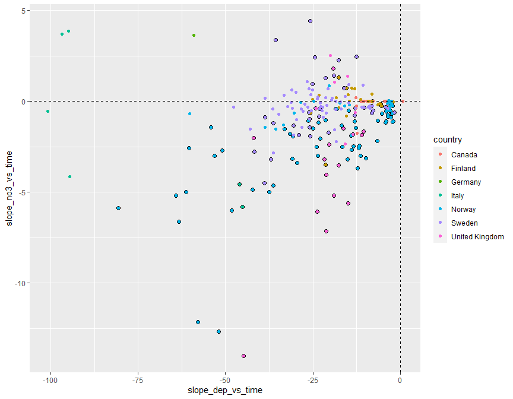
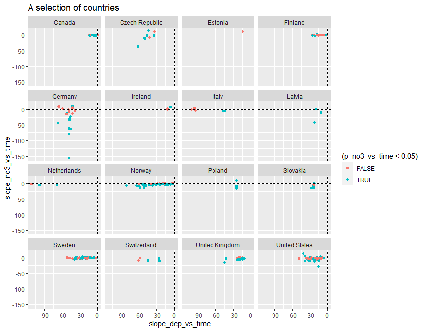
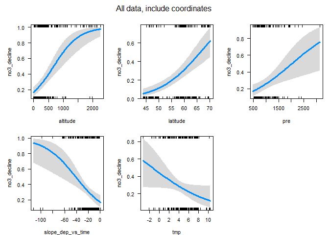
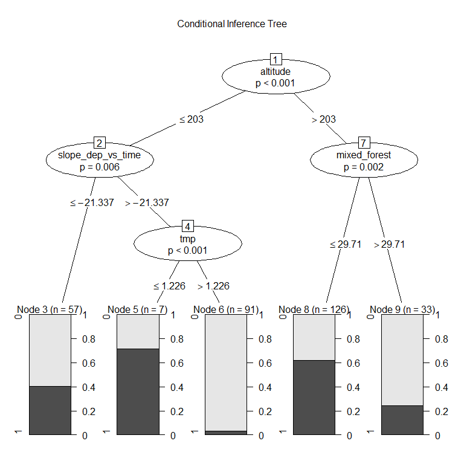
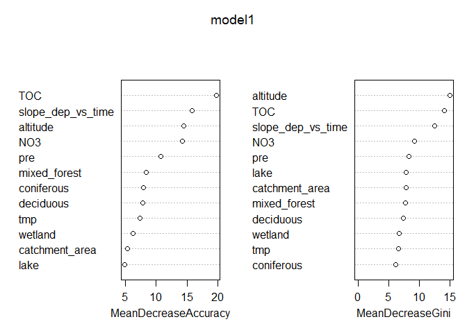

Analysis of James' trend results    
* Taken from `https://github.com/JamesSample/icpw2/tree/master/thematic_report_2020/results`   
* Sen slope of NO3, TOTN, TOC/TON etc.  
* Note that these contains no data fra United States!  


## 1. Libraries  

```r
# All of tehse packages cn be loaded at once using library(tidyverse). (I just like to be specific.)
library(dplyr)
library(tidyr)
library(purrr)
library(lubridate)
library(ggplot2)

# Too many packages, not all are used
# library(forcats)
# library(mgcv)
# library(nlme)
library(mapview)
library(visreg)     # visreg
library(rkt)        # Theil -Sen Regression

library(MuMIn)      

# Trees and forests
# install.packages("party")
# install.packages("modeltools")
# install.packages("coin")
# install.packages("multcomp")
# install.packages("TH.data")
library(party)
# install.packages("evtree")
library(evtree)
# install.packages("randomForest")
library(randomForest)

library(maps)
my_map <- map_data("world")

library(effects)    # handles lme models  
library(readxl)

knitr::opts_chunk$set(results = 'hold')
knitr::opts_chunk$set(warning = FALSE)
```


## 2. Data

```r
dat_annual_sel <- readRDS("Data/120_dat_annual_sel.rds")
# ts_model_list <- readRDS("Data/120_ts_model_list_linear.rds")
# ts_model_list_wout_TOC <- readRDS("Data/120_ts_model_list_wout_TOC.rds")

df_stations <- readRDS("Data/100_Stations.rds")
df_deposition <- readRDS("Data/100_Deposition.rds")
df_climate <- readRDS("Data/100_Climate.rds")
```

### Station metadata

```r
df_station <- read_excel(
  "K:/Prosjekter/langtransporterte forurensninger/O-23300 - ICP-WATERS - HWI/Faglige rapporter/2020 report/Land cover/ICPW_All_Stations_2020_2020_05_04.xlsx") %>%
  mutate(station_id = as.character(station_id))
```

### James results  

```r
#
# Regression results
#
fn <- "https://raw.githubusercontent.com/JamesSample/icpw2/master/thematic_report_2020/results/trends_1992-2016_toc_totn_no3_relax_italy/trends_1992-2016_toc_totn_no3_relax_italy_results.csv"
reg_no3 <- read.csv(fn, encoding = "UTF-8")
nrow(reg_no3)

# Station metadata
fn <- "https://raw.githubusercontent.com/JamesSample/icpw2/master/thematic_report_2020/results/trends_1992-2016_toc_totn_no3_relax_italy/trends_1992-2016_toc_totn_no3_relax_italy_stations.csv"
reg_no3_st <- read.csv(fn, encoding = "UTF-8")

# xtabs(~variable, reg_no3)  

#
# Medians
#
fn <- "https://github.com/JamesSample/icpw2/raw/master/thematic_report_2020/results/medians_2012-2016/medians_2012-2016_no3.csv"
medians_no3 <- read.csv(fn, encoding = "UTF-8")
nrow(medians_no3)

fn <- "https://github.com/JamesSample/icpw2/raw/master/thematic_report_2020/results/medians_2012-2016/medians_2012-2016_toc_totn_no3_nh4.csv"
medians_toc <- read.csv(fn, encoding = "UTF-8")
nrow(medians_toc)
```

```
## [1] 2418
## [1] 494
## [1] 225
```
### Start 'dat'  
With slope regression data  
* Make one line per station  

```r
df1 <- reg_no3 %>%
  filter(variable %in% c("NO3-N_µg/l N", "TOC/TON")) %>%
  select(station_id, variable, sen_slp) %>%
  tidyr::pivot_wider(names_from = "variable", values_from = "sen_slp")
df2 <- reg_no3 %>%
  filter(variable %in% c("NO3-N_µg/l N", "TOC/TON")) %>%
  select(station_id, variable, mk_p_val) %>%
  tidyr::pivot_wider(names_from = "variable", values_from = "mk_p_val")

names(df1)[2:3] <- c("slope_no3_vs_time", "slope_tocton_vs_time")
names(df2)[2:3] <- c("p_no3_vs_time", "p_tocton_vs_time")

dat <- full_join(df1, df2, by = "station_id")
```

### Deposition Theil-Senslope   

```r
### Get deposition  
df_deposition <- readRDS("Data/100_Deposition.rds") %>%
  as.data.frame()

# TEST Senslope
# df_test <- df_deposition %>% filter(station_id == 38115)
# result <- rkt(df_test$year, df_test$TOTN_dep)
# data.frame(station_id = 38115, TOTN_dep_P = result$sl, TOTN_dep_slope = result$B)

# Function for Sen slope
get_senslope <- function(data){
  result <- rkt(data$year, data$TOTN_dep)
  data.frame(station_id = data$station_id[1], slope_dep_vs_time = result$B, p_dep_vs_time = result$sl)
}

df_deposition_slope <- df_deposition %>%
  split(.$station_id) %>% # str()
  purrr::map_dfr(get_senslope)  
```


### Add deposition slope to data  

```r
nrow(dat)
dat <- left_join(dat, 
                 df_deposition_slope,
                 by = "station_id")

nrow(dat)
```

```
## [1] 293
## [1] 293
```
### Add medians and station metadata   

```r
nrow(dat)
dat <- dat %>%
  left_join(medians_no3, by = "station_id") %>%
  # left_join(medians_toc, by = "station_id") %>%   # not needed, overlap in variables  
  left_join(reg_no3_st, by = "station_id")
nrow(dat)

# Simplify names by removing units
# names(dat)
names(dat) <- sub(".N_µg.l.N", "", names(dat))
names(dat) <- sub("_mg.C.l", "", names(dat))
names(dat) <- sub("_µg.l.P", "", names(dat))
names(dat)
```

```
## [1] 293
## [1] 293
##  [1] "station_id"           "slope_no3_vs_time"    "slope_tocton_vs_time"
##  [4] "p_no3_vs_time"        "p_tocton_vs_time"     "slope_dep_vs_time"   
##  [7] "p_dep_vs_time"        "NH4"                  "NO3"                 
## [10] "TOC"                  "TO"                   "TOTP"                
## [13] "T"                    "TOTN.TOTP"            "NO3.TOTP"            
## [16] "TOC.TON"              "TOC.TOTP"             "station_code"        
## [19] "station_name"         "latitude"             "longitude"           
## [22] "altitude"             "continent"            "country"             
## [25] "region"               "group"
```

### Add climate and deposition means 

```r
df_climate <- readRDS("Data/100_Climate.rds")

df_climate_mean <- df_climate %>%
  group_by(station_id, variable) %>% 
  summarise(mean = mean(value)) %>%
  tidyr::pivot_wider(names_from = "variable", values_from = "mean")
```

```
## `summarise()` has grouped output by 'station_id'. You can override using the `.groups` argument.
```

```r
df_deposition_mean <-
  df_deposition %>% 
  group_by(station_id) %>% 
  summarise(Mean_dep = mean(TOTN_dep))

# Add
dat <- dat %>%
  left_join(df_climate_mean, by = "station_id") %>%
  left_join(df_deposition_mean, by = "station_id")
nrow(dat)
```

```
## [1] 293
```

### Add land cover    

```r
fn <- "K:/Prosjekter/langtransporterte forurensninger/O-23300 - ICP-WATERS - HWI/Faglige rapporter/2020 report/Land cover/ICPW_All_Stations_2020_2020_05_04.xlsx"

df_station <- read_excel(fn)

nrow(dat)
dat <- left_join(dat, 
                 df_station %>% select(-(station_code:longitude), -(altitude:region)), 
                 by = "station_id"
)

nrow(dat)
```

```
## [1] 293
## [1] 293
```


## 3. Plot estimates  

Note: **No USA**


```r
ggplot(dat, aes(slope_dep_vs_time, slope_no3_vs_time)) + 
  geom_point(data = dat %>% filter(p_no3_vs_time < 0.05), size = rel(2)) +
  geom_point(aes(color = country)) +
  geom_hline(yintercept = 0, linetype = 2) + 
  geom_vline(xintercept = 0, linetype = 2) 
```

<!-- -->

```r
ggplot(dat, aes(slope_dep_vs_time, slope_no3_vs_time,
                color = (p_no3_vs_time < 0.05))) + 
  geom_point() +
  facet_wrap(vars(country)) +
  geom_hline(yintercept = 0, linetype = 2) + 
  geom_vline(xintercept = 0, linetype = 2) + 
  labs(title = "A selection of countries")
```

<!-- -->

```r
dat %>%
  filter(!country %in% c("Latvia","Ireland","Italy","Netherlands")) %>%
  ggplot(aes(slope_dep_vs_time, slope_no3_vs_time,
             color = (p_no3_vs_time < 0.05))) + 
  geom_point() +
  facet_wrap(vars(country)) +
  geom_hline(yintercept = 0, linetype = 2) + 
  geom_vline(xintercept = 0, linetype = 2) + 
  labs(title = "A selection of countries")
```

<!-- -->


## 4. Significant / non-significant NO3 decline  

### Data for analysis  

```r
# Data for analyses
df_analysis <- dat %>%
  mutate(
    no3_decline = case_when(
      slope_no3_vs_time < 0 & p_no3_vs_time <= 0.05 ~ 1,
      TRUE ~ 0)
  ) %>%
  select(no3_decline, slope_dep_vs_time,
         NO3, TOC,
    latitude, longitude, altitude, 
    pre, tmp, catchment_area,
    coniferous, deciduous, lake, mixed_forest, wetland)

# Complete cases
apply(is.na(df_analysis), 2, sum)
table(complete.cases(df_analysis))

# Keep only complete cases
df_analysis <- df_analysis[complete.cases(df_analysis),]
```

```
##       no3_decline slope_dep_vs_time               NO3               TOC 
##                 0                 0                 5                 5 
##          latitude         longitude          altitude               pre 
##                 0                 0                 1                 0 
##               tmp    catchment_area        coniferous         deciduous 
##                 0                16                21                21 
##              lake      mixed_forest           wetland 
##                21                21                21 
## 
## FALSE  TRUE 
##    27   266
```


## 5. Logistic regression, all variables  

```r
# Full model  
fm <- glm(
  no3_decline ~ .,
  data = df_analysis, 
  family = "binomial",
  na.action = "na.fail")

# Dredging for best model
# dd1 <- dredge(fm)                           # only once
# saveRDS(dd1, "Data/160_all_dd1.rds")    # save it as it takes a couple of minutes

# Read dredge result
dd1 <- readRDS("Data/160_all_dd1.rds")

# Check best models  
subset(dd1, delta < 1)

cat("\n\nR2: \n")
dd1_mod1 <- get.models(dd1, 1)[[1]]  
# summary(dd1_mod1)  

par(mfrow = c(2,3), mar = c(4,5,2,1), oma = c(0,0,2,0))
visreg(dd1_mod1, scale = "response")
mtext("All data, include coordinates", outer = TRUE)
```

<!-- -->

```
## Global model call: glm(formula = no3_decline ~ NO3 + TOC + latitude + longitude + 
##     altitude + pre + tmp + catchment_area + coniferous + deciduous + 
##     lake + mixed_forest + wetland, family = "binomial", data = df_analysis, 
##     na.action = "na.fail")
## ---
## Model selection table 
##       (Int)      alt   ctc_are      cnf      dcd     lng      pre      TOC
## 6722 -3.086 0.002692                             0.06014 0.001535 -0.05868
## 4674 -3.884 0.003075                             0.06626 0.001807         
## 6726 -3.422 0.002842           0.008072          0.06136 0.001660 -0.08832
## 6730 -2.975 0.002544                    -0.01763 0.05879 0.001625 -0.06435
## 6724 -2.988 0.002716 -0.002334                   0.05987 0.001491 -0.05990
##          wtl df   logLik  AICc delta weight
## 6722 0.06185  6 -113.307 238.9  0.00  0.269
## 4674 0.04941  5 -114.670 239.6  0.63  0.196
## 6726 0.06236  7 -112.638 239.7  0.77  0.183
## 6730 0.06207  7 -112.645 239.7  0.78  0.182
## 6724 0.06157  7 -112.714 239.9  0.92  0.170
## Models ranked by AICc(x) 
## 
## 
## R2:
```

## 6. Logistic regression, exclude coordinates    

```r
fm <- glm(
  no3_decline ~ slope_dep_vs_time + NO3 + TOC +
    altitude + 
    pre + tmp + catchment_area +
    coniferous + deciduous + lake + mixed_forest + 
    wetland,
  data = df_analysis, 
  family = "binomial",
  na.action = "na.fail")

# dd2 <- dredge(fm)                       # only once
# saveRDS(dd2, "Data/160_all_dd2.rds")    # save it as it takes a couple of minutes

dd2 <- readRDS("Data/160_all_dd2.rds")

subset(dd2, delta < 1)

cat("\n\nR2: \n")
dd2_mod1 <- get.models(dd2, 1)[[1]]  
# summary(dd2_mod1)  

par(mfrow = c(2,3), mar = c(4,5,2,1), oma = c(0,0,2,0))
visreg(dd2_mod1, scale = "response")
mtext("All data, exclude coordinates", outer = TRUE)
```

<!-- -->

```
## Global model call: glm(formula = no3_decline ~ NO3 + TOC + altitude + pre + tmp + 
##     catchment_area + coniferous + deciduous + lake + mixed_forest + 
##     wetland, family = "binomial", data = df_analysis, na.action = "na.fail")
## ---
## Model selection table 
##       (Int)      alt ctc_are      dcd      lak  mxd_frs     TOC     wtl df
## 1594 0.7114 0.002540         -0.02707 -0.04090 -0.04292 -0.1376 0.04586  7
## 1596 0.8499 0.002532 -0.0033 -0.02715 -0.04486 -0.04329 -0.1396 0.04486  8
##        logLik  AICc delta weight
## 1594 -128.271 271.0  0.00  0.546
## 1596 -127.392 271.3  0.37  0.454
## Models ranked by AICc(x) 
## 
## 
## R2:
```


## 7. Tree and forest classification


### Split into training and validation data

```r
set.seed(123)

x <- runif(nrow(df_analysis))
train <- ifelse(x < 0.9, TRUE, FALSE)

train_set <- df_analysis[train,]  %>% 
  mutate(no3_decline_f = factor(no3_decline)) %>% select(-no3_decline, -longitude, - latitude) %>%
  as.data.frame()
valid_set <- df_analysis[!train,] %>% 
  mutate(no3_decline_f = factor(no3_decline)) %>% select(-no3_decline, -longitude, - latitude) %>%
  as.data.frame()
```


### a. Tree classification using 'party'   

```r
(ct = ctree(no3_decline_f ~ ., data = train_set))

plot(ct, main="Conditional Inference Tree")
```

<!-- -->

```r
cat("\n\n")
cat("Table of prediction errors \n")
table(predict(ct), train_set$no3_decline_f)
cat("\n\n")

cat("Classification of training set \n")
tr.pred = predict(ct, newdata = valid_set, type="prob")
table(tr.pred[,"1"] > 0.5, valid_set$no3_decline_f)
```

```
## 
## Model formula:
## no3_decline_f ~ slope_dep_vs_time + NO3 + TOC + altitude + pre + 
##     tmp + catchment_area + coniferous + deciduous + lake + mixed_forest + 
##     wetland
## 
## Fitted party:
## [1] root
## |   [2] altitude <= 226
## |   |   [3] mixed_forest <= 7.44: 0 (n = 66, err = 34.8%)
## |   |   [4] mixed_forest > 7.44
## |   |   |   [5] slope_dep_vs_time <= -34.77: 1 (n = 7, err = 42.9%)
## |   |   |   [6] slope_dep_vs_time > -34.77
## |   |   |   |   [7] tmp <= 2.40467: 0 (n = 7, err = 42.9%)
## |   |   |   |   [8] tmp > 2.40467
## |   |   |   |   |   [9] slope_dep_vs_time <= -25.83286: 0 (n = 9, err = 22.2%)
## |   |   |   |   |   [10] slope_dep_vs_time > -25.83286: 0 (n = 66, err = 0.0%)
## |   [11] altitude > 226: 1 (n = 85, err = 37.6%)
## 
## Number of inner nodes:    5
## Number of terminal nodes: 6
## 
## 
## Table of prediction errors 
##    
##       0   1
##   0 120  28
##   1  35  57
## 
## 
## Classification of training set 
##        
##          0  1
##   FALSE 12  2
##   TRUE   6  6
```

### b. Evtree (Evolutionary Learning)   

```r
ev.raw = evtree(no3_decline_f ~ ., data = train_set)
plot(ev.raw)
```

<!-- -->

```r
table(predict(ev.raw), train_set$no3_decline_f)
1-mean(predict(ev.raw) == train_set$no3_decline_f)
```

```
##    
##       0   1
##   0 134  17
##   1  21  68
## [1] 0.1583333
```


### c. Random forest  
* *For results/interpretation, see separate document '160_randomforest_James_data.html'*  

```r
model1 <- randomForest(no3_decline_f ~ ., 
                       data = train_set, 
                       mtry = 5,
                       importance = TRUE)

model1
```

```
## 
## Call:
##  randomForest(formula = no3_decline_f ~ ., data = train_set, mtry = 5,      importance = TRUE) 
##                Type of random forest: classification
##                      Number of trees: 500
## No. of variables tried at each split: 5
## 
##         OOB estimate of  error rate: 22.92%
## Confusion matrix:
##     0  1 class.error
## 0 129 26   0.1677419
## 1  29 56   0.3411765
```


#### Random forest, predict on training data

```r
# Predicting on train set
pred_valid <- predict(model1, valid_set, type = "class")
# Checking classification accuracy
table(pred_valid, valid_set$no3_decline_f)  
```

```
##           
## pred_valid  0  1
##          0 16  0
##          1  2  8
```

#### Random forest, importance (but see separate result file)  
High MeanDecreaseGini = high importance in model  

```r
randomForest::importance(model1)
varImpPlot(model1)
```

<!-- -->

```
##                           0         1 MeanDecreaseAccuracy MeanDecreaseGini
## slope_dep_vs_time 11.589585 12.236910            15.801628        12.512271
## NO3               11.364735  8.363124            14.196704         9.187061
## TOC               15.015323 12.832672            19.753397        14.179467
## altitude          10.242408 11.485648            14.504852        15.044501
## pre               11.070439  3.066279            10.760770         8.349842
## tmp                3.356195  7.105084             7.395860         6.641941
## catchment_area     2.985072  4.412090             5.386168         7.812831
## coniferous         3.729195  6.678900             7.955166         6.133620
## deciduous          3.533453  7.248403             7.786952         7.423444
## lake               4.859178  1.912812             4.908260         7.839968
## mixed_forest       5.637373  5.871351             8.393153         7.804689
## wetland            1.711976  7.332331             6.240403         6.768315
```

#### Random forest, partial effects   
* NOt easy to interpret    

```r
imp <- randomForest::importance(model1)
impvar1 <- rownames(imp)[order(imp[, 2], decreasing=TRUE)]

# impvar1 <- readRDS("Data/130_impvar1.rmd")

par(mfrow=c(3,4))

for (i in seq_along(impvar1)) {
  partialPlot(x = model1, 
              pred.data = train_set, 
              x.var = impvar1[i], 
              which.class = "1",
              main=paste("Effect of", impvar1[i]))
}
```

<!-- -->
#### randomForestExplainer

```r
# install.packages("randomForestExplainer")
library(randomForestExplainer)
```

```
## Registered S3 method overwritten by 'GGally':
##   method from   
##   +.gg   ggplot2
```

```r
# Copy to console and run (this will create an Rmd file and render an HTML file):
# explain_forest(model1, interactions = TRUE, data = train_set, path = "160_randomforest_James_data.html")
```


