Analysis of NO3 decrease, based on James' trend results    
* Taken from `https://github.com/JamesSample/icpw2/tree/master/thematic_report_2020/results`   
* Sen slope of NO3, TOTN, TOC/TON etc. 1992-2016
* Response variable in all analyses are *whether NO3 decreases or not*     
* Predictors:
    - slope_dep_vs_time: Trend in Tot-N deposition 1992-2016    
    - NO3, TOTN_dep: Medians of NO3, TOTN_dep (Tot-N deposition) 1992-2016   
    - TOC: Medians of TOC 1992-2016 (section 5 and 6 only)     
    - pre, tmp: mean precipitation + temp   
    - catchment_area (section 5 only)   
    - Land cover  
* Basically 3 sets of identical analyses (5,6,7) which only differ in data set (5 has the largest set of variables and the lowest sample size)  


## 1. Libraries  

```r
# All of tehse packages cn be loaded at once using library(tidyverse). (I just like to be specific.)
library(dplyr)
library(tidyr)
library(purrr)
library(lubridate)
library(ggplot2)

# Too many packages, not all are used
# library(forcats)
# library(mgcv)
# library(nlme)
library(mapview)
library(visreg)     # visreg
library(rkt)        # Theil -Sen Regression

library(MuMIn)      

# Trees and forests
# install.packages("party")
# install.packages("modeltools")
# install.packages("coin")
# install.packages("multcomp")
# install.packages("TH.data")
library(party)
# install.packages("evtree")
library(evtree)
# install.packages("randomForest")
library(randomForest)

library(maps)
my_map <- map_data("world")

library(effects)    # handles lme models  
library(readxl)

knitr::opts_chunk$set(results = 'hold')
knitr::opts_chunk$set(warning = FALSE)
```


```r
# run_randomForestExplainer <- TRUE
run_randomForestExplainer <- FALSE
```


## 2. Data

```r
dat_annual_sel <- readRDS("Data/120_dat_annual_sel.rds")
# ts_model_list <- readRDS("Data/120_ts_model_list_linear.rds")
# ts_model_list_wout_TOC <- readRDS("Data/120_ts_model_list_wout_TOC.rds")

df_stations <- readRDS("Data/100_Stations.rds")
df_deposition <- readRDS("Data/100_Deposition.rds")
df_climate <- readRDS("Data/100_Climate.rds")
```

### Station metadata

```r
df_station <- read_excel(
  "K:/Prosjekter/langtransporterte forurensninger/O-23300 - ICP-WATERS - HWI/Faglige rapporter/2020 report/Land cover/ICPW_All_Stations_2020_2020_05_04.xlsx") %>%
  mutate(station_id = as.character(station_id))
```

### James' trends and medians     

```r
#
# Regression results
#
folder <- "https://github.com/JamesSample/icpw2/raw/master/thematic_report_2020/results/trends_1992-2016_no3"
file <- "trends_1992-2016_no3_results.csv"
fn <- paste0(folder, "/", file)

reg_no3 <- read.csv(fn, encoding = "UTF-8")
cat("Regression results:", sQuote(file), ",n =", nrow(reg_no3), "\n\n")

# Station metadata
file <- "trends_1992-2016_no3_stations.csv"
fn <- paste0(folder, "/", file)

reg_no3_st <- read.csv(fn, encoding = "UTF-8")
cat("Regression result metadata:", sQuote(file), ",n =", nrow(reg_no3_st), "\n\n")

cat("Countries with trends: \n")
xtabs(~country, reg_no3_st)  

#
# Medians NO3
#

if (FALSE){

  # OLD: 2012-2016 medians NO3  

  cat("--------------------------------------------------------------------------\n")
  folder <- "https://github.com/JamesSample/icpw2/raw/master/thematic_report_2020/results/medians_2012-2016"
  file <- "medians_2012-2016_no3.csv"
  fn <- paste0(folder, "/", file)
  # data:
  medians_no3 <- read.csv(fn, encoding = "UTF-8")
  cat("Medians NO3:", sQuote(file), ",n =", nrow(medians_no3), "\n\n")
  file <- "medians_2012-2016_no3_stations.csv"
  fn <- paste0(folder, "/", file)
  # metadata:
  medians_no3_st <- read.csv(fn, encoding = "UTF-8")
  cat("Median metadata (not used):", sQuote(file), "n =", nrow(medians_no3_st), "\n\n")
  # stats:
  cat("Countries with medians: \n")
  xtabs(~country, medians_no3_st)  
  
  #
  #  OLD: 2012-2016 Medians TOC
  #
  cat("--------------------------------------------------------------------------\n")
  
  file <- "medians_2012-2016_toc_totn_no3_nh4.csv"
  fn <- paste0(folder, "/", file)
  
  medians_toc <- read.csv(fn, encoding = "UTF-8")
  cat("Medians TOC:", sQuote(file), ",n =", nrow(medians_toc), "\n\n")
  
  cat("Countries with medians: \n")
  xtabs(~country, medians_no3_st)  
  
}
```

```
## Regression results: 'trends_1992-2016_no3_results.csv' ,n = 3176 
## 
## Regression result metadata: 'trends_1992-2016_no3_stations.csv' ,n = 498 
## 
## Countries with trends: 
## country
##         Canada Czech Republic        Estonia        Finland        Germany 
##            114              8              1             26             23 
##        Ireland          Italy         Latvia    Netherlands         Norway 
##              3              6              3              3             83 
##         Poland       Slovakia         Sweden    Switzerland United Kingdom 
##              6             12             92              6             21 
##  United States 
##             91
```
### Start 'dat'  
With slope regression data  
* Make one line per station  

```r
# table(reg_no3$variable)

# Slope 
df1 <- reg_no3 %>%
  filter(variable %in% c("NO3-N_µg/l N", "TOC/TON")) %>%
  select(station_id, variable, sen_slp) %>%
  tidyr::pivot_wider(names_from = "variable", values_from = "sen_slp") %>%
  rename(slope_no3_vs_time = `NO3-N_µg/l N`, 
         slope_tocton_vs_time = `TOC/TON`)
  
# Slope p-value
df2 <- reg_no3 %>%
  filter(variable %in% c("NO3-N_µg/l N", "TOC/TON")) %>%
  select(station_id, variable, mk_p_val) %>%
  tidyr::pivot_wider(names_from = "variable", values_from = "mk_p_val") %>%
  rename(p_no3_vs_time = `NO3-N_µg/l N`, 
         p_tocton_vs_time = `TOC/TON`)

# Medians
df3 <- reg_no3 %>%
  filter(variable %in% c("NO3-N_µg/l N", "TOC_mg C/l")) %>%
  select(station_id, variable, median) %>%
  tidyr::pivot_wider(names_from = "variable", values_from = "median") %>%
  rename(NO3 = `NO3-N_µg/l N`, 
         TOC = `TOC_mg C/l`)

cat("\n")
cat("df1, n =", nrow(df1), "\n")
cat("df2, n =", nrow(df2), "\n")
cat("df3, n =", nrow(df3), "\n")

dat <- df1 %>%
  full_join(df2, by = "station_id") %>%
  full_join(df3, by = "station_id")

cat("dat, n =", nrow(dat), "\n")
```

```
## 
## df1, n = 498 
## df2, n = 498 
## df3, n = 498 
## dat, n = 498
```


### Deposition trends and median 1992-2006     

```r
fn <- "https://github.com/JamesSample/icpw2/raw/master/thematic_report_2020/results/deposition/totn_dep_trends_icpw_stns.csv"  

df_deposition <- read.csv(fn) %>% 
  filter(variable == "totn_mgNpm2")  

cat("n =", nrow(df_deposition), "\n")
```

```
## n = 556
```

### Add deposition slope and medians to data  

```r
cat("dat, n =", nrow(dat), "\n")

dat <- dat %>% 
  left_join(df_deposition %>% 
              select(station_id, median, sen_slp, mk_p_val) %>%
              rename(TOTN_dep = median,
                     slope_dep_vs_time = sen_slp,
                     p_dep_vs_time = mk_p_val),
                 by = "station_id")

cat("dat, n =", nrow(dat), "\n")

# names(dat)
```

```
## dat, n = 498 
## dat, n = 498
```
### Add medians and station metadata   

```r
dat <- dat %>%
  left_join(reg_no3_st, by = "station_id")

cat("dat, n =", nrow(dat), "\n")

# Simplify names by removing units
# names(dat)
# names(dat) <- sub(".N_µg.l.N", "", names(dat))
# names(dat) <- sub("_mg.C.l", "", names(dat))
# names(dat) <- sub("_µg.l.P", "", names(dat))

cat("\nVariable names: \n")
names(dat)
```

```
## dat, n = 498 
## 
## Variable names: 
##  [1] "station_id"           "slope_no3_vs_time"    "slope_tocton_vs_time"
##  [4] "p_no3_vs_time"        "p_tocton_vs_time"     "NO3"                 
##  [7] "TOC"                  "TOTN_dep"             "slope_dep_vs_time"   
## [10] "p_dep_vs_time"        "station_code"         "station_name"        
## [13] "latitude"             "longitude"            "altitude"            
## [16] "continent"            "country"              "region"              
## [19] "group"
```

### Add climate and deposition means 

```r
df_climate <- readRDS("Data/100_Climate.rds") %>%
  filter(year %in% 1992:2006)

df_climate_mean <- df_climate %>%
  group_by(station_id, variable) %>% 
  summarise(mean = mean(value), .groups = "drop") %>%
  tidyr::pivot_wider(names_from = "variable", values_from = "mean")

# Add
dat <- dat %>%
  left_join(df_climate_mean, by = "station_id")

cat("dat, n =", nrow(dat), "\n")
```

```
## dat, n = 498
```

### Add land cover    
* Combine: bare_sparse = bare_rock + sparsely_vegetated + glacier   
* Select: coniferous, deciduous, lake, mixed_forest, wetland, bare_sparse   

```r
fn <- "K:/Prosjekter/langtransporterte forurensninger/O-23300 - ICP-WATERS - HWI/Faglige rapporter/2020 report/Land cover/ICPW_All_Stations_2020_2020_05_04.xlsx"

df_station <- read_excel(fn) %>%
  mutate(bare_sparse = bare_rock + sparsely_vegetated + glacier)

nrow(dat)
dat <- left_join(dat, 
                 df_station %>% select(-(station_code:longitude), -(altitude:region)), 
                 by = "station_id"
)

nrow(dat)
names(dat) %>% paste(collapse = " + ") 
```

```
## [1] 498
## [1] 498
## [1] "station_id + slope_no3_vs_time + slope_tocton_vs_time + p_no3_vs_time + p_tocton_vs_time + NO3 + TOC + TOTN_dep + slope_dep_vs_time + p_dep_vs_time + station_code + station_name + latitude + longitude + altitude + continent + country + region + group + pre + tmp + catchment_area + urban + cultivated + total_forest + deciduous + coniferous + mixed_forest + total_shrub_herbaceous + grasslands + heathlands + transitional_woodland_shrub + bare_rock + sparsely_vegetated + glacier + wetland + lake + water_ex_lake + other + bare_sparse"
```


## 3. Plot estimates  

Note: **No USA**


```r
ggplot(dat, aes(slope_dep_vs_time, slope_no3_vs_time)) + 
  geom_point(data = dat %>% filter(p_no3_vs_time < 0.05), size = rel(2)) +
  geom_point(aes(color = country)) +
  geom_hline(yintercept = 0, linetype = 2) + 
  geom_vline(xintercept = 0, linetype = 2) 
```

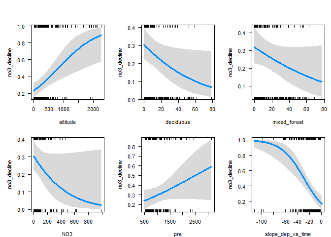<!-- -->

```r
ggplot(dat, aes(slope_dep_vs_time, slope_no3_vs_time,
                color = (p_no3_vs_time < 0.05))) + 
  geom_point() +
  facet_wrap(vars(country)) +
  geom_hline(yintercept = 0, linetype = 2) + 
  geom_vline(xintercept = 0, linetype = 2) + 
  labs(title = "A selection of countries")
```

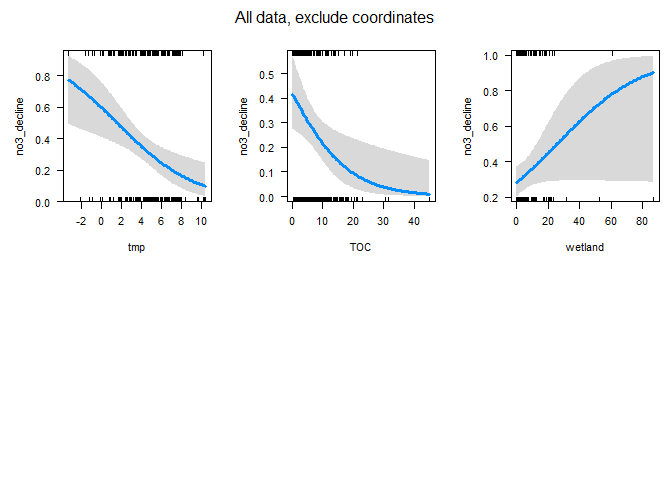<!-- -->

```r
dat %>%
  filter(!country %in% c("Latvia","Ireland","Italy","Netherlands")) %>%
  ggplot(aes(slope_dep_vs_time, slope_no3_vs_time,
             color = (p_no3_vs_time < 0.05))) + 
  geom_point() +
  facet_wrap(vars(country)) +
  geom_hline(yintercept = 0, linetype = 2) + 
  geom_vline(xintercept = 0, linetype = 2) + 
  labs(title = "A selection of countries") + 
  ylim(-50, 25)
```

<!-- -->


## 4. Analysis of 'Significant / non-significant NO3 decline'   
* Parts 5, 6 and 7 all run logistic regression + "trees and forest" methods  
* Each part differ only in dataset used  

## 5a. Data INCLUDING catchment_area    

```r
# Data for analyses
df_analysis <- dat %>%
  mutate(
    no3_decline = case_when(
      slope_no3_vs_time < 0 & p_no3_vs_time <= 0.05 ~ 1,
      TRUE ~ 0)
  ) %>%
  select(no3_decline, slope_dep_vs_time,
         NO3, TOC, TOTN_dep,
         latitude, longitude, altitude,
         pre, tmp, catchment_area,
         urban, cultivated, 
         deciduous, coniferous, mixed_forest, 
         total_shrub_herbaceous, 
         wetland, lake, water_ex_lake, 
         bare_sparse)

# names(dat) %>% paste(collapse = ", ")

cat("Number of missing values per variable: \n")
apply(is.na(df_analysis), 2, sum) 
cat("\n")

# What is missing? (long output)
if (FALSE){
dat %>% 
  split(.$country) %>%
  purrr::map(~apply(is.na(.), 2, mean))
}

cat("Number of complete observations: \n")
complete <- complete.cases(df_analysis)
table(complete)

cat("\n\n")
cat("Number of complete observations by country: \n")
table(dat$country, complete)

# Keep only complete cases
df_analysis <- df_analysis[complete.cases(df_analysis),]

cat("\n\n")
cat("Original data: n =", nrow(dat), "\n")
cat("Analysis: n =", nrow(df_analysis), "\n")
```

```
## Number of missing values per variable: 
##            no3_decline      slope_dep_vs_time                    NO3 
##                      0                      0                      0 
##                    TOC               TOTN_dep               latitude 
##                     33                      0                      0 
##              longitude               altitude                    pre 
##                      0                      9                      0 
##                    tmp         catchment_area                  urban 
##                      0                     93                     37 
##             cultivated              deciduous             coniferous 
##                     37                     43                     43 
##           mixed_forest total_shrub_herbaceous                wetland 
##                     43                     37                     37 
##                   lake          water_ex_lake            bare_sparse 
##                     37                     37                     37 
## 
## Number of complete observations: 
## complete
## FALSE  TRUE 
##   145   353 
## 
## 
## Number of complete observations by country: 
##                 complete
##                  FALSE TRUE
##   Canada             0  114
##   Czech Republic     1    7
##   Estonia            1    0
##   Finland            0   26
##   Germany            6   17
##   Ireland            3    0
##   Italy              6    0
##   Latvia             3    0
##   Netherlands        1    2
##   Norway             0   83
##   Poland             0    6
##   Slovakia           0   12
##   Sweden             6   86
##   Switzerland        6    0
##   United Kingdom    21    0
##   United States     91    0
## 
## 
## Original data: n = 498 
## Analysis: n = 353
```


## 5b. Tree and forest classification


### Split into training and validation data

```r
set.seed(123)

x <- runif(nrow(df_analysis))
train <- ifelse(x < 0.9, TRUE, FALSE)

train_set <- df_analysis[train,]  %>% 
  mutate(no3_decline_f = factor(no3_decline)) %>% select(-no3_decline, -longitude, - latitude) %>%
  as.data.frame()
valid_set <- df_analysis[!train,] %>% 
  mutate(no3_decline_f = factor(no3_decline)) %>% select(-no3_decline, -longitude, - latitude) %>%
  as.data.frame()
```


### a. Tree classification using 'party'   

```r
(ct = ctree(no3_decline_f ~ ., data = train_set))

plot(ct, main="Conditional Inference Tree")
```

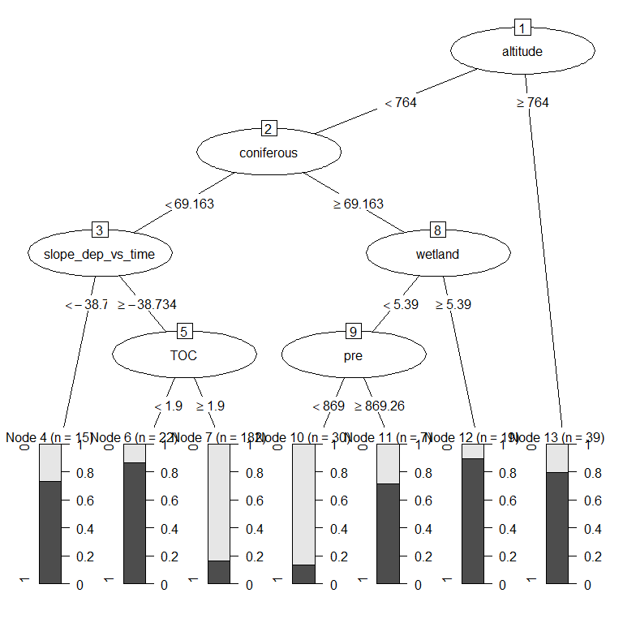<!-- -->

```r
cat("\n\n")
cat("Table of prediction errors \n")
table(predict(ct), train_set$no3_decline_f)
cat("\n\n")

cat("Classification of training set \n")
tr.pred = predict(ct, newdata = valid_set, type="prob")
colnames(tr.pred) <- c("P0", "P1")
# tr.pred <- tr.pred %>% map_dfr(~data.frame(P0 = .[1], P1 = .[2]))
table(tr.pred[,"P1"] > 0.5, valid_set$no3_decline_f)
```

```
## 
## Model formula:
## no3_decline_f ~ slope_dep_vs_time + NO3 + TOC + TOTN_dep + altitude + 
##     pre + tmp + catchment_area + urban + cultivated + deciduous + 
##     coniferous + mixed_forest + total_shrub_herbaceous + wetland + 
##     lake + water_ex_lake + bare_sparse
## 
## Fitted party:
## [1] root
## |   [2] altitude <= 223
## |   |   [3] water_ex_lake <= 0.48
## |   |   |   [4] slope_dep_vs_time <= -36.2425: 1 (n = 10, err = 40.0%)
## |   |   |   [5] slope_dep_vs_time > -36.2425
## |   |   |   |   [6] bare_sparse <= 0.211: 0 (n = 121, err = 6.6%)
## |   |   |   |   [7] bare_sparse > 0.211: 0 (n = 18, err = 16.7%)
## |   |   [8] water_ex_lake > 0.48: 1 (n = 15, err = 13.3%)
## |   [9] altitude > 223
## |   |   [10] mixed_forest <= 29.71: 1 (n = 124, err = 33.9%)
## |   |   [11] mixed_forest > 29.71: 0 (n = 32, err = 25.0%)
## 
## Number of inner nodes:    5
## Number of terminal nodes: 6
## 
## 
## Table of prediction errors 
##    
##       0   1
##   0 152  19
##   1  48 101
## 
## 
## Classification of training set 
##        
##          0  1
##   FALSE  7  1
##   TRUE  12 13
```

### b. Evtree (Evolutionary Learning)   

```r
ev.raw = evtree(no3_decline_f ~ ., data = train_set)

plot(ev.raw)
```

<!-- -->

```r
cat("Predicted in training data: \n")
table(predict(ev.raw), train_set$no3_decline_f)

cat("\n\nPrediction errors in training data: \n")
1-mean(predict(ev.raw) == train_set$no3_decline_f)
```

```
## Predicted in training data: 
##    
##       0   1
##   0 175  25
##   1  25  95
## 
## 
## Prediction errors in training data: 
## [1] 0.15625
```


### c. Random forest  
* *For results/interpretation, see separate document '160_randomforest_James_data.html'*  
* Model called 'model1'

```r
model1 <- randomForest(no3_decline_f ~ ., 
                       data = train_set, 
                       mtry = 5,
                       importance = TRUE)

model1
```

```
## 
## Call:
##  randomForest(formula = no3_decline_f ~ ., data = train_set, mtry = 5,      importance = TRUE) 
##                Type of random forest: classification
##                      Number of trees: 500
## No. of variables tried at each split: 5
## 
##         OOB estimate of  error rate: 23.44%
## Confusion matrix:
##     0  1 class.error
## 0 167 33       0.165
## 1  42 78       0.350
```


#### Random forest, predict on training data

```r
# Predicting on train set
pred_valid <- predict(model1, valid_set, type = "class")
# Checking classification accuracy
table(pred_valid, valid_set$no3_decline_f)  
```

```
##           
## pred_valid  0  1
##          0 15  5
##          1  4  9
```

#### Random forest, importance (but see separate result file)  
High MeanDecreaseGini = high importance in model  

```r
randomForest::importance(model1)
varImpPlot(model1)
```

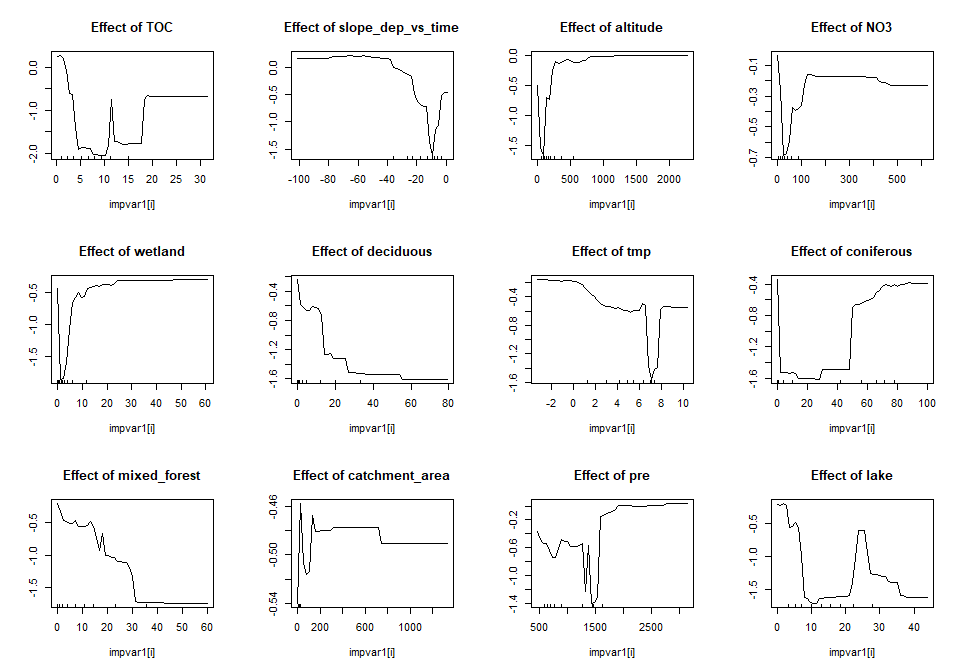<!-- -->

```
##                                0         1 MeanDecreaseAccuracy
## slope_dep_vs_time      12.320043  9.247796            15.814223
## NO3                    11.803465  4.531261            13.668697
## TOC                    10.741599 13.264266            16.091769
## TOTN_dep               11.896283  6.510043            14.322480
## altitude               18.898840  9.459553            21.072672
## pre                     8.299429  4.849181             9.871903
## tmp                     9.279237  3.974902            10.907701
## catchment_area          5.729029  2.380451             5.927249
## urban                   2.613988  3.129678             4.070903
## cultivated              3.239058  4.502073             5.688338
## deciduous               7.000467  8.708454            10.688826
## coniferous              6.153762  5.424430             8.501164
## mixed_forest            5.500884  8.867331            10.074414
## total_shrub_herbaceous  5.762396  1.295938             5.912114
## wetland                 6.007112  6.809353             9.239757
## lake                    3.161325  7.858077             7.512426
## water_ex_lake          16.175794 10.775912            17.968867
## bare_sparse             5.747553  6.592667             8.457561
##                        MeanDecreaseGini
## slope_dep_vs_time             10.276387
## NO3                           10.355567
## TOC                           12.500726
## TOTN_dep                      10.932978
## altitude                      16.221701
## pre                            7.789306
## tmp                            7.575128
## catchment_area                 7.390310
## urban                          2.958152
## cultivated                     1.382525
## deciduous                      8.858816
## coniferous                     6.650124
## mixed_forest                  10.049024
## total_shrub_herbaceous         6.202155
## wetland                        6.370490
## lake                           8.759831
## water_ex_lake                 11.230866
## bare_sparse                    4.028922
```

#### Random forest, partial effects   
* NOt easy to interpret    

```r
imp <- randomForest::importance(model1)
impvar1 <- rownames(imp)[order(imp[, 2], decreasing=TRUE)]

# impvar1 <- readRDS("Data/130_impvar1.rmd")

par(mfrow=c(3,4))

for (i in seq_along(impvar1)) {
  partialPlot(x = model1, 
              pred.data = train_set, 
              x.var = impvar1[i], 
              which.class = "1",
              main=paste("Effect of", impvar1[i]))
}
```

<!-- --><!-- -->
#### randomForestExplainer

```r
# install.packages("randomForestExplainer")
library(randomForestExplainer)

# COPY to console and run (this will create an Rmd file and render an HTML file):
# DON'T rin ith within this chunk, RStudio will hang

if (run_randomForestExplainer){
  explain_forest(model1, interactions = TRUE, data = train_set, 
                 path = "C:/Data/seksjon 317/icpw-R/160_randomforest_James_data_model1.html")
}
```


## 5c. Logistic regression, exclude coordinates    

```r
fm <- glm(
  no3_decline ~ altitude + mixed_forest + TOC + NO3 + TOTN_dep + 
    slope_dep_vs_time + deciduous + pre + wetland + tmp + lake +
    altitude:lake + altitude:TOTN_dep + altitude:tmp,
  data = df_analysis, 
  family = "binomial",
  na.action = "na.fail")

# dd1b <- dredge(fm)                       # only once
# saveRDS(dd1b, "Data/160_all_dd1b.rds")    # save it as it takes a couple of minutes

dd1b <- readRDS("Data/160_all_dd1b.rds")

# subset(dd1b, delta < 1)
subset(dd1b, delta < 2)

cat("\n\nR2: \n")
dd1b_mod1 <- get.models(dd1b, 1)[[1]]  
# summary(dd1b_mod1)  

par(mfrow = c(2,3), mar = c(4,5,2,1), oma = c(0,0,2,0))
visreg(dd1b_mod1, scale = "response")
```

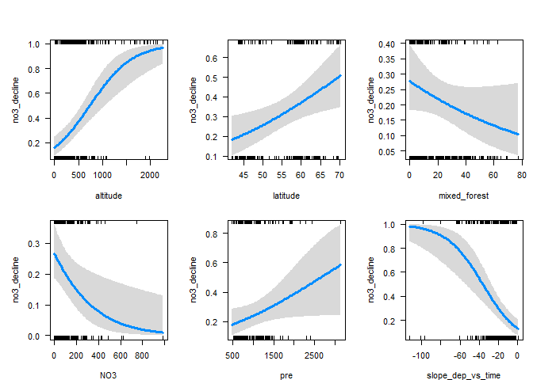<!-- -->

```r
mtext("All data, exclude coordinates", outer = TRUE)
```

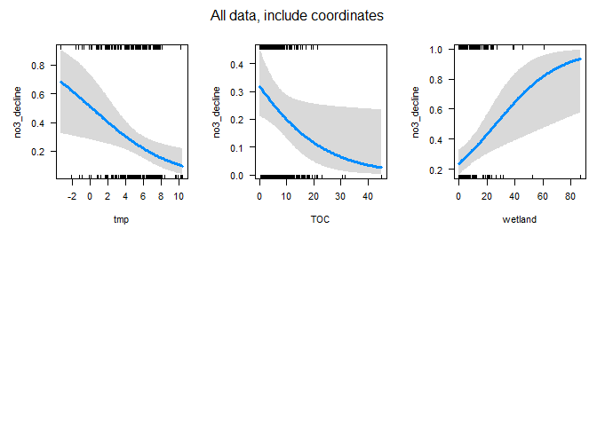<!-- -->

```
## Global model call: glm(formula = no3_decline ~ altitude + mixed_forest + TOC + NO3 + 
##     TOTN_dep + slope_dep_vs_time + deciduous + pre + wetland + 
##     tmp + lake + altitude:lake + altitude:TOTN_dep + altitude:tmp, 
##     family = "binomial", data = df_analysis, na.action = "na.fail")
## ---
## Model selection table 
##        (Int)       alt      dcd  mxd_frs       NO3       pre slp_dep_vs_tim
## 1516 -0.5547 1.040e-03 -0.02285 -0.01612           0.0008404       -0.06416
## 1508 -0.7164 1.066e-03 -0.02822                    0.0007601       -0.07013
## 5612 -0.3381 1.986e-04 -0.02374 -0.01454           0.0009339       -0.06446
## 1532 -0.5865 9.280e-04 -0.02400 -0.01611 0.0006999 0.0009408       -0.06045
## 5604 -0.4249 4.412e-05 -0.02865                    0.0008777       -0.06945
## 2028 -0.5321 1.109e-03 -0.02194 -0.01552           0.0008001       -0.07322
##          tmp      TOC    TOT_dep     wtl   alt:tmp df   logLik  AICc delta
## 1516 -0.3374 -0.10130            0.04723            9 -171.803 362.1  0.00
## 1508 -0.3422 -0.11100            0.05823            8 -173.295 363.0  0.88
## 5612 -0.4156 -0.09421            0.04682 0.0001837 10 -171.306 363.3  1.12
## 1532 -0.3584 -0.08877            0.04701           10 -171.351 363.3  1.21
## 5604 -0.4365 -0.10180            0.05648 0.0002246  9 -172.517 363.6  1.43
## 2028 -0.3129 -0.10610 -0.0004314 0.04670           10 -171.687 364.0  1.88
##      weight
## 1516  0.275
## 1508  0.177
## 5612  0.157
## 1532  0.150
## 5604  0.135
## 2028  0.107
## Models ranked by AICc(x) 
## 
## 
## R2:
```


## 6a. Data EXCLUDING catchment_area   
* Includes USA data, still missing UK and most German data      
*  Germany is missing TOC and NO3 (87%), UK is missing land cover (100%)

```r
# Data for analyses
df_analysis <- dat %>%
  mutate(
    no3_decline = case_when(
      slope_no3_vs_time < 0 & p_no3_vs_time <= 0.05 ~ 1,
      TRUE ~ 0)
  ) %>%
  select(country, no3_decline, slope_dep_vs_time,
         NO3, TOC, TOTN_dep,
         latitude, longitude, altitude, 
         pre, tmp, 
         urban, cultivated, deciduous, coniferous, mixed_forest, total_shrub_herbaceous, 
         wetland, lake, bare_sparse)
  
  

cat("Number of missing values per variable: \n")
apply(is.na(df_analysis), 2, sum) 
cat("\n")

# What is missing? (long output)
if (FALSE){
  df <- df_analysis %>% 
    mutate(country = substr(country, 1, 3)) %>%
    split(.$country) %>%
    purrr::map_dfr(~apply(is.na(.), 2, mean) %>% round(2), .id = "Country")
  names(df) <- substr(names(df), 1, 9)
  df
  
}

cat("Number of complete observations: \n")
complete <- complete.cases(df_analysis)
table(complete)

cat("\n\n")
cat("Number of complete observations by country: \n")
table(dat$country, complete)

# Keep only complete cases
df_analysis <- df_analysis[complete.cases(df_analysis),] %>%
  select(-country)

cat("\n\n")
cat("Original data: n =", nrow(dat), "\n")
cat("Analysis: n =", nrow(df_analysis), "\n")
```

```
## Number of missing values per variable: 
##                country            no3_decline      slope_dep_vs_time 
##                      0                      0                      0 
##                    NO3                    TOC               TOTN_dep 
##                      0                     33                      0 
##               latitude              longitude               altitude 
##                      0                      0                      9 
##                    pre                    tmp                  urban 
##                      0                      0                     37 
##             cultivated              deciduous             coniferous 
##                     37                     43                     43 
##           mixed_forest total_shrub_herbaceous                wetland 
##                     43                     37                     37 
##                   lake            bare_sparse 
##                     37                     37 
## 
## Number of complete observations: 
## complete
## FALSE  TRUE 
##    70   428 
## 
## 
## Number of complete observations by country: 
##                 complete
##                  FALSE TRUE
##   Canada             0  114
##   Czech Republic     1    7
##   Estonia            1    0
##   Finland            0   26
##   Germany            6   17
##   Ireland            3    0
##   Italy              6    0
##   Latvia             3    0
##   Netherlands        1    2
##   Norway             0   83
##   Poland             0    6
##   Slovakia           0   12
##   Sweden             6   86
##   Switzerland        6    0
##   United Kingdom    21    0
##   United States     16   75
## 
## 
## Original data: n = 498 
## Analysis: n = 428
```


## 6b. Tree and forest classification


### Split into training and validation data

```r
set.seed(123)

x <- runif(nrow(df_analysis))
train <- ifelse(x < 0.9, TRUE, FALSE)

train_set <- df_analysis[train,]  %>% 
  mutate(no3_decline_f = factor(no3_decline)) %>% select(-no3_decline, -longitude, - latitude) %>%
  as.data.frame()
valid_set <- df_analysis[!train,] %>% 
  mutate(no3_decline_f = factor(no3_decline)) %>% select(-no3_decline, -longitude, - latitude) %>%
  as.data.frame()
```


### a. Tree classification using 'party'   

```r
(ct = ctree(no3_decline_f ~ ., data = train_set))

plot(ct, main="Conditional Inference Tree")
```

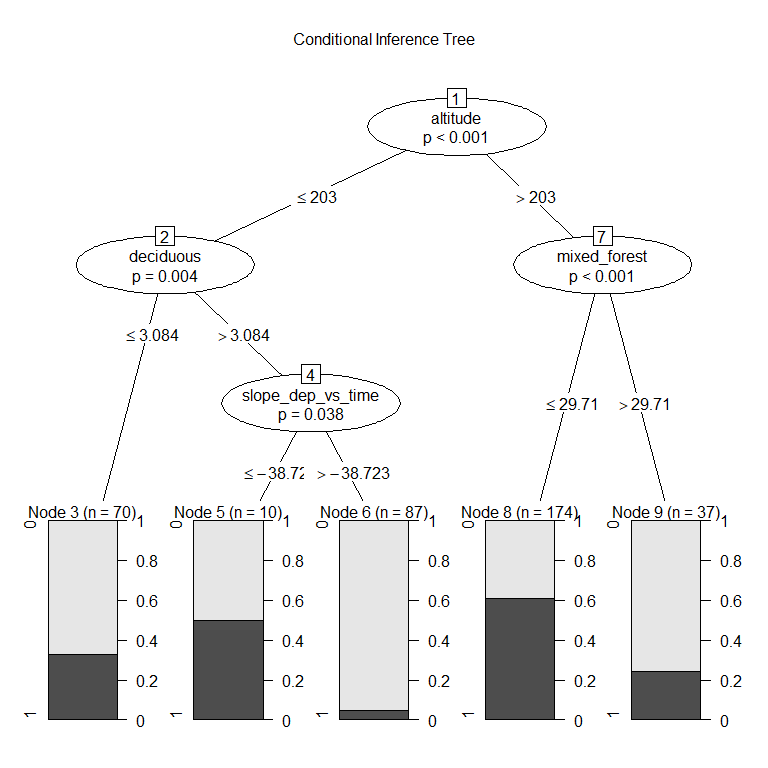<!-- -->

```r
cat("\n\n")
cat("Table of prediction errors \n")
table(predict(ct), train_set$no3_decline_f)
cat("\n\n")

cat("Classification of training set \n")
tr.pred = predict(ct, newdata = valid_set, type="prob")
colnames(tr.pred) <- c("P0", "P1")
# tr.pred <- tr.pred %>% map_dfr(~data.frame(P0 = .[1], P1 = .[2]))
table(tr.pred[,"P1"] > 0.5, valid_set$no3_decline_f)
```

```
## 
## Model formula:
## no3_decline_f ~ slope_dep_vs_time + NO3 + TOC + TOTN_dep + altitude + 
##     pre + tmp + urban + cultivated + deciduous + coniferous + 
##     mixed_forest + total_shrub_herbaceous + wetland + lake + 
##     bare_sparse
## 
## Fitted party:
## [1] root
## |   [2] altitude <= 223
## |   |   [3] NO3 <= 125.5
## |   |   |   [4] mixed_forest <= 1.359: 0 (n = 27, err = 44.4%)
## |   |   |   [5] mixed_forest > 1.359: 0 (n = 142, err = 8.5%)
## |   |   [6] NO3 > 125.5: 1 (n = 8, err = 12.5%)
## |   [7] altitude > 223
## |   |   [8] mixed_forest <= 29.71
## |   |   |   [9] bare_sparse <= 15.861: 1 (n = 144, err = 41.0%)
## |   |   |   [10] bare_sparse > 15.861: 1 (n = 27, err = 7.4%)
## |   |   [11] mixed_forest > 29.71: 0 (n = 38, err = 23.7%)
## 
## Number of inner nodes:    5
## Number of terminal nodes: 6
## 
## 
## Table of prediction errors 
##    
##       0   1
##   0 174  33
##   1  62 117
## 
## 
## Classification of training set 
##        
##          0  1
##   FALSE  9  6
##   TRUE  16 11
```

### b. Evtree (Evolutionary Learning)   

```r
ev.raw = evtree(no3_decline_f ~ ., data = train_set)

plot(ev.raw)
```

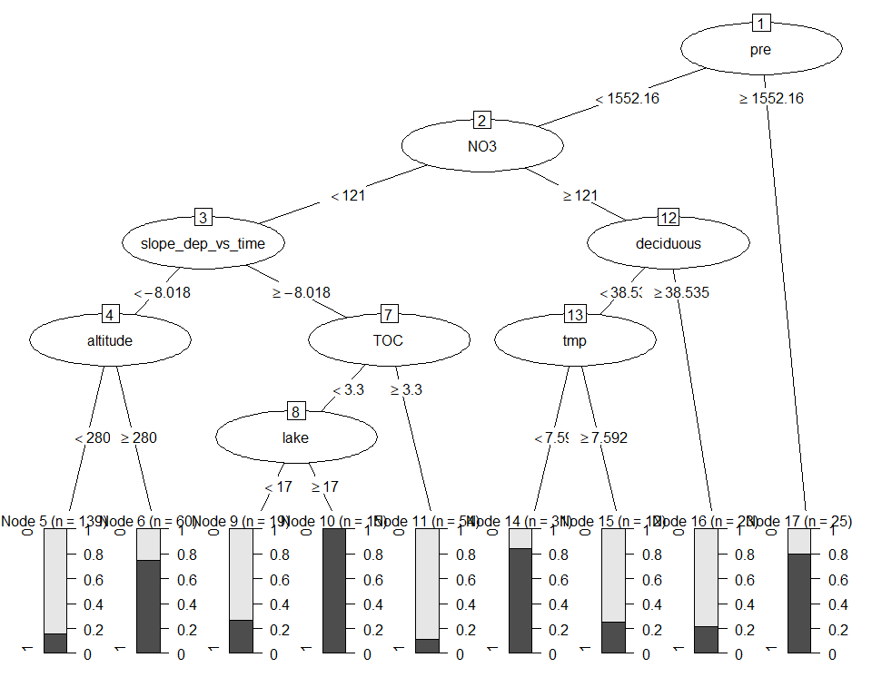<!-- -->

```r
cat("Predicted in training data: \n")
table(predict(ev.raw), train_set$no3_decline_f)

cat("\n\nPrediction errors in training data: \n")
1-mean(predict(ev.raw) == train_set$no3_decline_f)
```

```
## Predicted in training data: 
##    
##       0   1
##   0 197  26
##   1  39 124
## 
## 
## Prediction errors in training data: 
## [1] 0.1683938
```


### c. Random forest  
* *For results/interpretation, see separate document '160_randomforest_James_data.html'*  
* Model called 'model2'

```r
model2 <- randomForest(no3_decline_f ~ ., 
                       data = train_set, 
                       mtry = 5,
                       importance = TRUE)

model2
```

```
## 
## Call:
##  randomForest(formula = no3_decline_f ~ ., data = train_set, mtry = 5,      importance = TRUE) 
##                Type of random forest: classification
##                      Number of trees: 500
## No. of variables tried at each split: 5
## 
##         OOB estimate of  error rate: 22.02%
## Confusion matrix:
##     0   1 class.error
## 0 193  43   0.1822034
## 1  42 108   0.2800000
```


#### Random forest, predict on training data

```r
# Predicting on train set
pred_valid <- predict(model2, valid_set, type = "class")
# Checking classification accuracy
table(pred_valid, valid_set$no3_decline_f)  
```

```
##           
## pred_valid  0  1
##          0 19  5
##          1  6 12
```

#### Random forest, importance (but see separate result file)  
High MeanDecreaseGini = high importance in model  

```r
randomForest::importance(model2)
varImpPlot(model2)
```

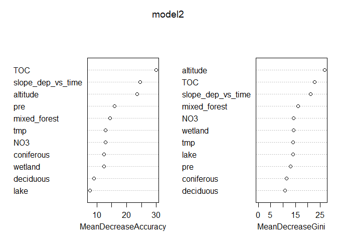<!-- -->

```
##                                0         1 MeanDecreaseAccuracy
## slope_dep_vs_time      13.239665 15.426510            20.065174
## NO3                    14.274488  5.342990            15.606900
## TOC                    12.084607 15.375908            18.432947
## TOTN_dep               13.023175 10.666145            18.545339
## altitude               22.426848 11.405891            24.065639
## pre                     8.416135  6.950489            11.195385
## tmp                     8.950396  7.459858            13.076987
## urban                   4.051719  3.668596             5.585528
## cultivated              3.204921  5.631711             6.653088
## deciduous               7.232131  5.741586             9.484358
## coniferous              2.924174  7.889910             8.173519
## mixed_forest           12.152709  9.289893            14.621749
## total_shrub_herbaceous  7.322701  1.285351             6.497962
## wetland                 4.645796  8.564017             9.605788
## lake                    3.588158 10.793062            10.137040
## bare_sparse             4.402885  7.997317             8.929063
##                        MeanDecreaseGini
## slope_dep_vs_time             16.469279
## NO3                           12.761978
## TOC                           16.450497
## TOTN_dep                      16.350265
## altitude                      24.196265
## pre                           10.550431
## tmp                           11.453715
## urban                          4.102292
## cultivated                     2.450389
## deciduous                      9.134110
## coniferous                     8.351456
## mixed_forest                  16.263215
## total_shrub_herbaceous         8.115649
## wetland                       10.074421
## lake                          11.116183
## bare_sparse                    4.885314
```

#### Random forest, partial effects   
* NOt easy to interpret    

```r
imp <- randomForest::importance(model2)
impvar1 <- rownames(imp)[order(imp[, 2], decreasing=TRUE)]

# impvar1 <- readRDS("Data/130_impvar1.rmd")

par(mfrow=c(3,4))

for (i in seq_along(impvar1)) {
  partialPlot(x = model2, 
              pred.data = train_set, 
              x.var = impvar1[i], 
              which.class = "1",
              main=paste("Effect of", impvar1[i]))
}
```

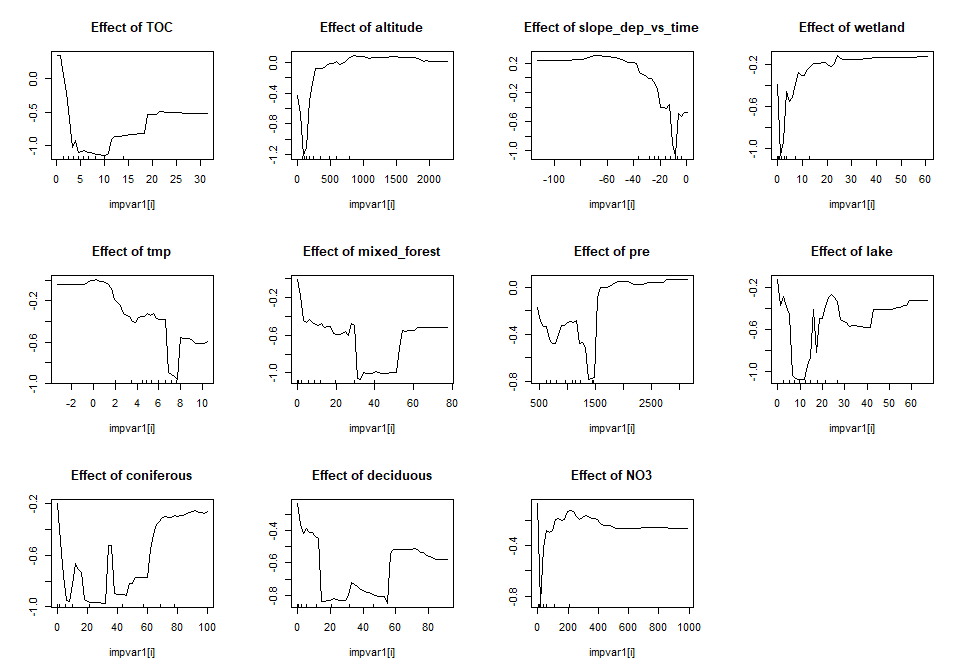<!-- --><!-- -->
#### randomForestExplainer

```r
# install.packages("randomForestExplainer")
library(randomForestExplainer)

# COPY to console and run (this will create an Rmd file and render an HTML file):
# DON'T rin ith within this chunk, RStudio will hang

if (run_randomForestExplainer){
  explain_forest(model2, interactions = TRUE, data = train_set, 
                 path = "C:/Data/seksjon 317/icpw-R/160_randomforest_James_data_model2.html")
}
```
## 6c. Logistic regression, exclude coordinates    

```r
fm <- glm(
  no3_decline ~ altitude + mixed_forest + TOC + NO3 + TOTN_dep + 
    slope_dep_vs_time + deciduous + pre + wetland + tmp + lake +
    altitude:lake + altitude:TOTN_dep + altitude:tmp,
  data = df_analysis, 
  family = "binomial",
  na.action = "na.fail")

# dd2b <- dredge(fm)                       # only once
# saveRDS(dd2b, "Data/160_all_dd2b.rds")    # save it as it takes a couple of minutes

dd2b <- readRDS("Data/160_all_dd2b.rds")

# subset(dd2b, delta < 1)
subset(dd2b, delta < 2)

cat("\n\nR2: \n")
dd2b_mod1 <- get.models(dd2b, 1)[[1]]  
# summary(dd2b_mod1)  

par(mfrow = c(2,3), mar = c(4,5,2,1), oma = c(0,0,2,0))
visreg(dd2b_mod1, scale = "response")
```

<!-- -->

```r
mtext("All data, exclude coordinates", outer = TRUE)
```

<!-- -->

```
## Global model call: glm(formula = no3_decline ~ altitude + mixed_forest + TOC + NO3 + 
##     TOTN_dep + slope_dep_vs_time + deciduous + pre + wetland + 
##     tmp + lake + altitude:lake + altitude:TOTN_dep + altitude:tmp, 
##     family = "binomial", data = df_analysis, na.action = "na.fail")
## ---
## Model selection table 
##        (Int)       alt       dcd     lak  mxd_frs       NO3       pre
## 1516 -0.6817 0.0011920 -0.010480         -0.02593           0.0009390
## 1280 -1.4300 0.0012210 -0.008898 0.01921 -0.02640 0.0011240 0.0012450
## 1278 -1.3770 0.0011920           0.01878 -0.02855 0.0010890 0.0011790
## 1260 -1.1280 0.0013730 -0.008520         -0.02738           0.0011320
## 1258 -1.0810 0.0013340                   -0.02935           0.0010700
## 1276 -1.0790 0.0011950 -0.008688         -0.02673 0.0009056 0.0012060
## 1514 -0.7153 0.0011820                   -0.02856           0.0009057
## 1274 -1.0350 0.0011650                   -0.02876 0.0008774 0.0011420
## 1790 -1.4310 0.0013450           0.02091 -0.02671 0.0015510 0.0011670
## 1264 -1.4250 0.0014220 -0.008645 0.01560 -0.02713           0.0011520
## 1262 -1.3720 0.0013830           0.01531 -0.02919           0.0010890
## 1532 -0.7211 0.0010960 -0.010260         -0.02569 0.0006341 0.0010230
## 1520 -0.9568 0.0012560 -0.010250 0.01115 -0.02603           0.0009803
## 1792 -1.4650 0.0013470 -0.007881 0.02078 -0.02512 0.0015150 0.0012260
## 1536 -1.1150 0.0011500 -0.009894 0.01548 -0.02579 0.0008872 0.0011110
## 2028 -0.6661 0.0012670 -0.010150         -0.02537           0.0009050
## 3326 -1.5800 0.0015750           0.03294 -0.02844 0.0010420 0.0012110
## 3328 -1.6170 0.0015770 -0.008649 0.03223 -0.02635 0.0010760 0.0012740
## 5612 -0.5896 0.0008488 -0.010750         -0.02548           0.0009766
## 1530 -0.7569 0.0010840                   -0.02824 0.0006726 0.0009950
##      slp_dep_vs_tim     tmp      TOC    TOT_dep     wtl    alt:lak   alt:tmp df
## 1516       -0.06398 -0.3846 -0.05957            0.04532                       9
## 1280       -0.06452 -0.4517                     0.04285                      10
## 1278       -0.06489 -0.4632                     0.03814                       9
## 1260       -0.06564 -0.4213                     0.03808                       8
## 1258       -0.06615 -0.4341                     0.03382                       7
## 1276       -0.06095 -0.4377                     0.04002                       9
## 1514       -0.06481 -0.4067 -0.04771            0.03881                       8
## 1274       -0.06170 -0.4507                     0.03566                       8
## 1790       -0.08451 -0.4093          -0.0010870 0.03859                      10
## 1264       -0.06999 -0.4312                     0.04002                       9
## 1262       -0.07015 -0.4427                     0.03553                       8
## 1532       -0.06098 -0.4021 -0.04979            0.04548                      10
## 1520       -0.06708 -0.3962 -0.05124            0.04569                      10
## 1792       -0.08080 -0.4073          -0.0009132 0.04272                      11
## 1536       -0.06376 -0.4240 -0.03450            0.04609                      11
## 2028       -0.07185 -0.3602 -0.06329 -0.0003983 0.04528                      10
## 3326       -0.06556 -0.4708                     0.03962 -3.202e-05           10
## 3328       -0.06524 -0.4591                     0.04413 -2.984e-05           11
## 5612       -0.06404 -0.4157 -0.05699            0.04535            7.211e-05 10
## 1530       -0.06170 -0.4252 -0.03767            0.03917                       9
##        logLik  AICc delta weight
## 1516 -216.362 451.2  0.00  0.088
## 1280 -215.528 451.6  0.43  0.071
## 1278 -216.637 451.7  0.55  0.067
## 1260 -217.807 452.0  0.80  0.059
## 1258 -218.853 452.0  0.82  0.058
## 1276 -216.835 452.1  0.95  0.055
## 1514 -217.882 452.1  0.95  0.054
## 1274 -217.916 452.2  1.02  0.053
## 1790 -215.828 452.2  1.03  0.052
## 1264 -216.921 452.3  1.12  0.050
## 1262 -217.981 452.3  1.15  0.049
## 1532 -215.906 452.3  1.19  0.049
## 1520 -215.929 452.4  1.23  0.047
## 1792 -214.987 452.6  1.45  0.042
## 1536 -215.135 452.9  1.75  0.037
## 2028 -216.235 453.0  1.84  0.035
## 3326 -216.250 453.0  1.87  0.034
## 3328 -215.207 453.0  1.89  0.034
## 5612 -216.280 453.1  1.93  0.033
## 1530 -217.358 453.1  1.99  0.032
## Models ranked by AICc(x) 
## 
## 
## R2:
```


## 7a. Data EXCLUDING catchment_area and TOC    
* Includes USA data, still missing Estonia (missing altitude) and UK (mising land cover)      
*  Germany is missing TOC (87%), UK is missing land cover (100%)

```r
# Data for analyses
df_analysis <- dat %>%
  mutate(
    no3_decline = case_when(
      slope_no3_vs_time < 0 & p_no3_vs_time <= 0.05 ~ 1,
      TRUE ~ 0)
  ) %>%
  select(country,
         no3_decline, slope_dep_vs_time, 
         TOTN_dep, NO3,
         latitude, longitude, altitude, 
         pre, tmp, 
         urban, cultivated, deciduous, coniferous, mixed_forest, total_shrub_herbaceous, 
         wetland, lake, bare_sparse)


cat("Number of missing values per variable: \n")
apply(is.na(df_analysis), 2, sum) 
cat("\n")

# What is missing? (long output)
if (FALSE){
  df <- df_analysis %>% 
    mutate(country = substr(country, 1, 8)) %>%
    split(.$country) %>%
    purrr::map_dfr(~apply(is.na(.), 2, mean) %>% round(2), .id = "Country")
  names(df) <- substr(names(df), 1, 9)
  df
}

cat("Number of complete observations: \n")
complete <- complete.cases(df_analysis)
table(complete)

cat("\n\n")
cat("Number of complete observations by country: \n")
table(dat$country, complete)

# Keep only complete cases
df_analysis <- df_analysis[complete.cases(df_analysis),] %>%
  select(-country)

cat("\n\n")
cat("Original data: n =", nrow(dat), "\n")
cat("Analysis: n =", nrow(df_analysis), "\n")
```

```
## Number of missing values per variable: 
##                country            no3_decline      slope_dep_vs_time 
##                      0                      0                      0 
##               TOTN_dep                    NO3               latitude 
##                      0                      0                      0 
##              longitude               altitude                    pre 
##                      0                      9                      0 
##                    tmp                  urban             cultivated 
##                      0                     37                     37 
##              deciduous             coniferous           mixed_forest 
##                     43                     43                     43 
## total_shrub_herbaceous                wetland                   lake 
##                     37                     37                     37 
##            bare_sparse 
##                     37 
## 
## Number of complete observations: 
## complete
## FALSE  TRUE 
##    52   446 
## 
## 
## Number of complete observations by country: 
##                 complete
##                  FALSE TRUE
##   Canada             0  114
##   Czech Republic     0    8
##   Estonia            1    0
##   Finland            0   26
##   Germany            1   22
##   Ireland            1    2
##   Italy              0    6
##   Latvia             0    3
##   Netherlands        0    3
##   Norway             0   83
##   Poland             0    6
##   Slovakia           0   12
##   Sweden             6   86
##   Switzerland        6    0
##   United Kingdom    21    0
##   United States     16   75
## 
## 
## Original data: n = 498 
## Analysis: n = 446
```


## 7b. Tree and forest classification


### Split into training and validation data   

```r
set.seed(123)

x <- runif(nrow(df_analysis))
train <- ifelse(x < 0.9, TRUE, FALSE)

train_set <- df_analysis[train,]  %>% 
  mutate(no3_decline_f = factor(no3_decline)) %>% select(-no3_decline, -longitude, - latitude) %>%
  as.data.frame()
valid_set <- df_analysis[!train,] %>% 
  mutate(no3_decline_f = factor(no3_decline)) %>% select(-no3_decline, -longitude, - latitude) %>%
  as.data.frame()
```


### a. Tree classification using 'party'   

```r
(ct = ctree(no3_decline_f ~ ., data = train_set))

plot(ct, main="Conditional Inference Tree")
```

<!-- -->

```r
cat("\n\n")
cat("Table of prediction errors \n")
table(predict(ct), train_set$no3_decline_f)
cat("\n\n")

cat("Classification of training set \n")
tr.pred = predict(ct, newdata = valid_set, type="prob")
colnames(tr.pred) <- c("P0", "P1")
# tr.pred <- tr.pred %>% map_dfr(~data.frame(P0 = .[1], P1 = .[2]))
table(tr.pred[,"P1"] > 0.5, valid_set$no3_decline_f)
```

```
## 
## Model formula:
## no3_decline_f ~ slope_dep_vs_time + TOTN_dep + NO3 + altitude + 
##     pre + tmp + urban + cultivated + deciduous + coniferous + 
##     mixed_forest + total_shrub_herbaceous + wetland + lake + 
##     bare_sparse
## 
## Fitted party:
## [1] root
## |   [2] altitude <= 226
## |   |   [3] total_shrub_herbaceous <= 41
## |   |   |   [4] mixed_forest <= 7.44: 0 (n = 63, err = 27.0%)
## |   |   |   [5] mixed_forest > 7.44
## |   |   |   |   [6] NO3 <= 69.5: 0 (n = 90, err = 2.2%)
## |   |   |   |   [7] NO3 > 69.5: 0 (n = 11, err = 36.4%)
## |   |   [8] total_shrub_herbaceous > 41: 1 (n = 13, err = 30.8%)
## |   [9] altitude > 226
## |   |   [10] mixed_forest <= 29.71
## |   |   |   [11] bare_sparse <= 15.861
## |   |   |   |   [12] wetland <= 3.385: 0 (n = 88, err = 43.2%)
## |   |   |   |   [13] wetland > 3.385: 1 (n = 63, err = 28.6%)
## |   |   |   [14] bare_sparse > 15.861: 1 (n = 32, err = 3.1%)
## |   |   [15] mixed_forest > 29.71: 0 (n = 42, err = 21.4%)
## 
## Number of inner nodes:    7
## Number of terminal nodes: 8
## 
## 
## Table of prediction errors 
##    
##       0   1
##   0 224  70
##   1  23  85
## 
## 
## Classification of training set 
##        
##          0  1
##   FALSE 16 12
##   TRUE   9  7
```

### b. Evtree (Evolutionary Learning)   

```r
ev.raw = evtree(no3_decline_f ~ ., data = train_set)

plot(ev.raw)
```

<!-- -->

```r
cat("Predicted in training data: \n")
table(predict(ev.raw), train_set$no3_decline_f)

cat("\n\nPrediction errors in training data: \n")
1-mean(predict(ev.raw) == train_set$no3_decline_f)
```

```
## Predicted in training data: 
##    
##       0   1
##   0 218  32
##   1  29 123
## 
## 
## Prediction errors in training data: 
## [1] 0.1517413
```


### c. Random forest  
* *For results/interpretation, see separate document '160_randomforest_James_data.html'*  
* Model called 'model3'

```r
model3 <- randomForest(no3_decline_f ~ ., 
                       data = train_set, 
                       mtry = 5,
                       importance = TRUE)

model3
```

```
## 
## Call:
##  randomForest(formula = no3_decline_f ~ ., data = train_set, mtry = 5,      importance = TRUE) 
##                Type of random forest: classification
##                      Number of trees: 500
## No. of variables tried at each split: 5
## 
##         OOB estimate of  error rate: 21.89%
## Confusion matrix:
##     0   1 class.error
## 0 206  41   0.1659919
## 1  47 108   0.3032258
```


#### Random forest, predict on training data

```r
# Predicting on train set
pred_valid <- predict(model3, valid_set, type = "class")
# Checking classification accuracy
table(pred_valid, valid_set$no3_decline_f)  
```

```
##           
## pred_valid  0  1
##          0 13  5
##          1 12 14
```

#### Random forest, importance (but see separate result file)  
High MeanDecreaseGini = high importance in model  

```r
randomForest::importance(model3)
varImpPlot(model3)
```

<!-- -->

```
##                                0         1 MeanDecreaseAccuracy
## slope_dep_vs_time      12.857850 13.038614            18.831576
## TOTN_dep               15.221682 10.056648            19.499895
## NO3                    15.358800  3.306000            15.643063
## altitude               24.634847 17.031452            29.104974
## pre                    11.975014  8.155094            14.347745
## tmp                    12.504180  9.789694            16.908435
## urban                   4.106631  5.683185             6.996606
## cultivated              4.686450  2.836035             5.825127
## deciduous              10.108216  9.353473            13.845286
## coniferous              9.848063  7.743308            13.402567
## mixed_forest           12.297965 10.736269            16.131290
## total_shrub_herbaceous  7.952128  1.629962             7.624967
## wetland                 8.016795  7.381024            11.842598
## lake                    5.054014  6.950792             8.245094
## bare_sparse            14.138220 16.797696            20.663706
##                        MeanDecreaseGini
## slope_dep_vs_time             15.940905
## TOTN_dep                      16.309146
## NO3                           12.808820
## altitude                      24.915097
## pre                           12.448483
## tmp                           14.613253
## urban                          4.243877
## cultivated                     2.347348
## deciduous                     13.821808
## coniferous                    12.806151
## mixed_forest                  15.017802
## total_shrub_herbaceous         8.887573
## wetland                       11.195916
## lake                          11.505811
## bare_sparse                   13.100836
```

#### Random forest, partial effects   
* NOt easy to interpret    

```r
imp <- randomForest::importance(model3)
impvar1 <- rownames(imp)[order(imp[, 2], decreasing=TRUE)]

# impvar1 <- readRDS("Data/130_impvar1.rmd")

par(mfrow=c(3,4))

for (i in seq_along(impvar1)) {
  partialPlot(x = model3, 
              pred.data = train_set, 
              x.var = impvar1[i], 
              which.class = "1",
              main=paste("Effect of", impvar1[i]))
}
```

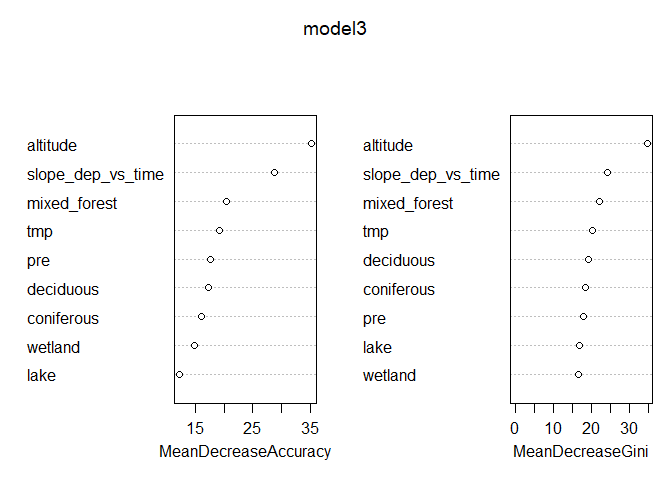<!-- --><!-- -->
#### randomForestExplainer

```r
# install.packages("randomForestExplainer")
library(randomForestExplainer)

# COPY to console and run (this will create an Rmd file and render an HTML file):
# DON'T rin ith within this chunk, RStudio will hang

if (run_randomForestExplainer){
  explain_forest(model3, interactions = TRUE, data = train_set, 
                 path = "C:/Data/seksjon 317/icpw-R/160_randomforest_James_data_model3.html")
}
```
## 7c. Logistic regression, exclude coordinates    

```r
fm <- glm(
  no3_decline ~ altitude + mixed_forest + NO3 + TOTN_dep +       # removed TOC
    slope_dep_vs_time + deciduous + pre + wetland + tmp + lake +
    altitude:lake + altitude:TOTN_dep + altitude:tmp,
  data = df_analysis, 
  family = "binomial",
  na.action = "na.fail")

# dd3b <- dredge(fm)                       # only once
# saveRDS(dd3b, "Data/160_all_dd3b.rds")    # save it as it takes a couple of minutes

dd3b <- readRDS("Data/160_all_dd3b.rds")

# subset(dd3b, delta < 1)
subset(dd3b, delta < 2)

cat("\n\nR2: \n")
dd3b_mod1 <- get.models(dd3b, 1)[[1]]  
# summary(dd3b_mod1)  

par(mfrow = c(2,3), mar = c(4,5,2,1), oma = c(0,0,2,0))
visreg(dd3b_mod1, scale = "response")
```

<!-- -->

```r
mtext("All data, exclude coordinates", outer = TRUE)
```

<!-- -->

```
## Global model call: glm(formula = no3_decline ~ altitude + mixed_forest + NO3 + TOTN_dep + 
##     slope_dep_vs_time + deciduous + pre + wetland + tmp + lake + 
##     altitude:lake + altitude:TOTN_dep + altitude:tmp, family = "binomial", 
##     data = df_analysis, na.action = "na.fail")
## ---
## Model selection table 
##        (Int)      alt      dcd     lak  mxd_frs       NO3       pre
## 748  -0.8028 0.001544 -0.01404         -0.02463           0.0008357
## 752  -1.0540 0.001633 -0.01393 0.01366 -0.02479           0.0008393
## 768  -1.0720 0.001502 -0.01461 0.01708 -0.02409 0.0006587 0.0009164
## 764  -0.7734 0.001439 -0.01450         -0.02409 0.0004394 0.0008863
## 1776 -1.1990 0.001987 -0.01354 0.02487 -0.02481           0.0008726
## 2800 -0.8956 0.001002 -0.01457 0.01537 -0.02380           0.0008987
## 1792 -1.2080 0.001844 -0.01419 0.02767 -0.02412 0.0006497 0.0009478
## 2796 -0.7000 0.001191 -0.01441         -0.02404           0.0008677
## 1004 -0.7961 0.001484 -0.01435         -0.02501           0.0008602
##      slp_dep_vs_tim     tmp   TOT_dep     wtl    alt:lak   alt:tmp df   logLik
## 748        -0.04075 -0.3233           0.02886                       8 -237.997
## 752        -0.04181 -0.3233           0.03039                       9 -237.050
## 768        -0.03829 -0.3400           0.03267                      10 -236.197
## 764        -0.03833 -0.3347           0.03015                       9 -237.581
## 1776       -0.04113 -0.3302           0.03161 -3.099e-05           10 -236.621
## 2800       -0.04254 -0.3764           0.03183            1.259e-04 10 -236.765
## 1792       -0.03760 -0.3467           0.03382 -2.990e-05           11 -235.789
## 2796       -0.04111 -0.3522           0.02958            6.895e-05  9 -237.907
## 1004       -0.03536 -0.3395 0.0002688 0.02897                       9 -237.915
##       AICc delta weight
## 748  492.3  0.00  0.190
## 752  492.5  0.19  0.172
## 768  492.9  0.58  0.142
## 764  493.6  1.25  0.101
## 1776 493.7  1.42  0.093
## 2800 494.0  1.71  0.081
## 1792 494.2  1.86  0.075
## 2796 494.2  1.90  0.073
## 1004 494.2  1.92  0.073
## Models ranked by AICc(x) 
## 
## 
## R2:
```

