**Analysis of NO3 decrease (categorical, "decrease or not"), based on James' trend results**  
  
**Dataset: all variables except catchment area (but including TOC)**   

* Response variable: 'Significant /NO3 decline' (locations with signif. *increase* are *not* excluded)  
* Data from https://github.com/JamesSample/icpw2/tree/master/thematic_report_2020/results      
* Sen slope of NO3, TOTN, TOC/TON etc. 1992-2016
* Response variable in all analyses are *whether NO3 decreases or not*     
* Predictors:
    - slope_dep_vs_time: Trend in Tot-N deposition 1992-2016    
    - NO3, TOTN_dep: Medians of NO3, TOTN_dep (Tot-N deposition) 1992-2016   
    - catchment_area (if included in data)      
    - TOC: Medians of TOC       
    - pre, tmp: mean precipitation + temp   
    - Land cover 
  
Technical details: This html file was rendered with `160parm_run_markdown.R` which runs the script `160parm_Time_series_results_James.Rmd` with different inputs, resulting in html files 160a, 160b and 160c.    

## 1. Libraries  

```r
# All of these packages cn be loaded at once using library(tidyverse). (I just like to be specific.)
library(dplyr)
library(tidyr)      # pivot_wider
library(purrr)      # 'map' functions  
library(lubridate)  
library(ggplot2)

# Too many packages, not all are used
library(mapview)
library(visreg)     # visreg
library(rkt)        # Theil -Sen Regression

library(MuMIn)      

# Trees and forests
library(party)                  # ctree
library(evtree)                 # evtree
library(randomForest)
library(randomForestExplainer)  # measure_importance, plot_multi_way_importance
library(pdp)                    # partial, autoplot

library(maps)
my_map <- map_data("world")

library(effects)    # handles lme models  
library(readxl)
library(readr)

source("160parm_functions.R")

knitr::opts_chunk$set(results = 'hold') # collect the results from a chunk  
knitr::opts_chunk$set(warning = FALSE)  

options(width = 95)
```

### Extra functions  

left_join2 - as 'left_join', but     
- Does not accept common variables that are not key variables (specified in "by")  
- Gives warning if there are nn-unique combinations of key variables i data set 2, so number of rows increase (duplicating rows in data set no. 1)   
- Optionally, Lists existing variables, key variables and added variables (if print_vars = TRUE)    


```r
left_join2 <- function(data1, data2, by = by, ..., print_vars = FALSE){
  
  common_vars <- intersect(names(data1), names(data2))
  common_vars_not_in_by <- common_vars[!common_vars %in% by]
  
  if (length(common_vars_not_in_by) > 0){
    stop("Columns ", paste(sQuote(common_vars_not_in_by), collapse = ", "), " exists in both data sets")
  }
  result <- left_join(data1, data2, by = by, ...)

  if (nrow(result) > nrow(data1)){
    warning("Data set 2 does not have unique rows. Number of rows increased from ", 
            nrow(data1), " to ", nrow(result))
  }
  
  vars_added <-   names(data2)[!names(data2) %in% names(data1)]
  
  if (print_vars){
    cat("Variables before join: \n")
    paste(sQuote(names(data1), q = FALSE), collapse = ", ") %>% cat()
    cat("\n\nVariables used to join: \n")
    paste(sQuote(by, q = FALSE), collapse = ", ") %>% cat()
    cat("\n\nVariables added: \n")
    paste(sQuote(vars_added, q = FALSE), collapse = ", ") %>% cat()
    cat("\n")
    
  }
  
  result
  
  }
```


## 2. Data

### James' trends and medians     

```r
#
# Regression results
#
folder <- "https://github.com/JamesSample/icpw2/raw/master/thematic_report_2020/results/trends_1992-2016_no3"
file <- "trends_1992-2016_no3_results.csv"
fn <- paste0(folder, "/", file)

reg_no3 <- read.csv(fn, encoding = "UTF-8")
cat("Regression results:", sQuote(file), ",n =", nrow(reg_no3), "\n\n")

# Station metadata

# THESE WILL BE ADDED TOGETHER WITH LAND COVER  

# file <- "trends_1992-2016_no3_stations.csv"
# fn <- paste0(folder, "/", file)
# 
# df_metadata <- read.csv(fn, encoding = "UTF-8")
# cat("Regression result metadata:", sQuote(file), ",n =", nrow(df_metadata), "\n\n")
# 
# cat("Countries with trends: \n")
# xtabs(~country, df_metadata)  

#
# Medians NO3
#

if (FALSE){

  # OLD: 2012-2016 medians NO3  

  cat("--------------------------------------------------------------------------\n")
  folder <- "https://github.com/JamesSample/icpw2/raw/master/thematic_report_2020/results/medians_2012-2016"
  file <- "medians_2012-2016_no3.csv"
  fn <- paste0(folder, "/", file)
  # data:
  medians_no3 <- read.csv(fn, encoding = "UTF-8")
  cat("Medians NO3:", sQuote(file), ",n =", nrow(medians_no3), "\n\n")
  file <- "medians_2012-2016_no3_stations.csv"
  fn <- paste0(folder, "/", file)
  # metadata:
  medians_no3_st <- read.csv(fn, encoding = "UTF-8")
  cat("Median metadata (not used):", sQuote(file), "n =", nrow(medians_no3_st), "\n\n")
  # stats:
  cat("Countries with medians: \n")
  xtabs(~country, medians_no3_st)  
  
  #
  #  OLD: 2012-2016 Medians TOC
  #
  cat("--------------------------------------------------------------------------\n")
  
  file <- "medians_2012-2016_toc_totn_no3_nh4.csv"
  fn <- paste0(folder, "/", file)
  
  medians_toc <- read.csv(fn, encoding = "UTF-8")
  cat("Medians TOC:", sQuote(file), ",n =", nrow(medians_toc), "\n\n")
  
  cat("Countries with medians: \n")
  xtabs(~country, medians_no3_st)  
  
}
```

```
## Regression results: 'trends_1992-2016_no3_results.csv' ,n = 3176
```

### Start 'dat'  

With slope regression data  
* Make one line per station  

```r
# table(reg_no3$variable)

# Slope 
df1 <- reg_no3 %>%
  filter(variable %in% c("NO3-N_µg/l N", "TOC/TON")) %>%
  select(station_id, variable, sen_slp) %>%
  tidyr::pivot_wider(names_from = "variable", values_from = "sen_slp") %>%
  rename(slope_no3_vs_time = `NO3-N_µg/l N`, 
         slope_tocton_vs_time = `TOC/TON`)
  
# Slope p-value
df2 <- reg_no3 %>%
  filter(variable %in% c("NO3-N_µg/l N", "TOC/TON")) %>%
  select(station_id, variable, mk_p_val) %>%
  tidyr::pivot_wider(names_from = "variable", values_from = "mk_p_val") %>%
  rename(p_no3_vs_time = `NO3-N_µg/l N`, 
         p_tocton_vs_time = `TOC/TON`)

# Medians
df3 <- reg_no3 %>%
  filter(variable %in% c("NO3-N_µg/l N", "TOC_mg C/l")) %>%
  select(station_id, variable, median) %>%
  tidyr::pivot_wider(names_from = "variable", values_from = "median") %>%
  rename(NO3 = `NO3-N_µg/l N`, 
         TOC = `TOC_mg C/l`)

cat("\n")
cat("df1, n =", nrow(df1), "\n")
cat("df2, n =", nrow(df2), "\n")
cat("df3, n =", nrow(df3), "\n")

dat_1 <- df1 %>%
  full_join(df2, by = "station_id") %>%
  full_join(df3, by = "station_id")

cat("dat_1, n =", nrow(dat_1), "\n")
```

```
## 
## df1, n = 498 
## df2, n = 498 
## df3, n = 498 
## dat_1, n = 498
```


```r
# dat_1
# 
# str <- "slope_no3_vs_time ~ p_no3_vs_time"
# plot(as.formula(str), data = dat_1)
# lm(as.formula(str), data = dat_1)
```

### Deposition trends and median 1992-2006     

```r
fn <- "https://github.com/JamesSample/icpw2/raw/master/thematic_report_2020/results/deposition/totn_dep_trends_icpw_stns.csv"  

df_deposition <- read.csv(fn) %>% 
  filter(variable == "totn_mgNpm2")  

cat("n =", nrow(df_deposition), "\n")
```

```
## n = 556
```


### Add deposition slope and medians to data  

```r
# debugonce(left_join2)
dat_2 <- dat_1 %>% 
  left_join2(df_deposition %>% 
              select(station_id, median, sen_slp, mk_p_val) %>%
              rename(TOTN_dep = median,
                     slope_dep_vs_time = sen_slp,
                     p_dep_vs_time = mk_p_val),
             by = "station_id",
             print_vars = TRUE)
```

```
## Variables before join: 
## 'station_id', 'slope_no3_vs_time', 'slope_tocton_vs_time', 'p_no3_vs_time', 'p_tocton_vs_time', 'NO3', 'TOC'
## 
## Variables used to join: 
## 'station_id'
## 
## Variables added: 
## 'TOTN_dep', 'slope_dep_vs_time', 'p_dep_vs_time'
```

### Add medians and station metadata   


```r
# dat_2 <- dat_2 %>%
#   left_join(df_metadata, by = "station_id")

# cat("dat_2, n =", nrow(dat_2), "\n")

# Simplify names by removing units
# names(dat_2)
# names(dat_2) <- sub(".N_µg.l.N", "", names(dat_2))
# names(dat_2) <- sub("_mg.C.l", "", names(dat_2))
# names(dat_2) <- sub("_µg.l.P", "", names(dat_2))

# cat("\nVariable names: \n")
# names(dat_2)
```

### Add climate and deposition medians and slopes  

```r
fn <- "https://github.com/JamesSample/icpw2/raw/master/thematic_report_2020/results/climate/cru_climate_trends_icpw_stns.csv"

df_climate_mean <- read_csv(fn) %>% 
  select(station_id, variable, median) %>%
  pivot_wider(names_from = "variable", values_from = "median")
```

```
## Rows: 1112 Columns: 8
```

```
## ── Column specification ───────────────────────────────────────────────────────────────────────
## Delimiter: ","
## chr (3): variable, mk_trend, sen_trend
## dbl (5): station_id, median, mk_p_val, sen_slp, sen_incpt
```

```
## 
## ℹ Use `spec()` to retrieve the full column specification for this data.
## ℹ Specify the column types or set `show_col_types = FALSE` to quiet this message.
```

```r
cat("\n")
# names(df_climate_mean)

df_climate_slope <- read_csv(fn) %>%
  select(station_id, variable, sen_slp) %>%
  pivot_wider(names_from = "variable", values_from = "sen_slp", names_prefix = "Slope_")
```

```
## Rows: 1112 Columns: 8
```

```
## ── Column specification ───────────────────────────────────────────────────────────────────────
## Delimiter: ","
## chr (3): variable, mk_trend, sen_trend
## dbl (5): station_id, median, mk_p_val, sen_slp, sen_incpt
```

```
## 
## ℹ Use `spec()` to retrieve the full column specification for this data.
## ℹ Specify the column types or set `show_col_types = FALSE` to quiet this message.
```

```r
# Add
dat_3 <- dat_2 %>%
  left_join2(df_climate_mean, by = "station_id", print_vars = TRUE) %>%
  left_join2(df_climate_slope, by = "station_id", print_vars = TRUE)
```

```
## 
## Variables before join: 
## 'station_id', 'slope_no3_vs_time', 'slope_tocton_vs_time', 'p_no3_vs_time', 'p_tocton_vs_time', 'NO3', 'TOC', 'TOTN_dep', 'slope_dep_vs_time', 'p_dep_vs_time'
## 
## Variables used to join: 
## 'station_id'
## 
## Variables added: 
## 'pre', 'tmp'
## Variables before join: 
## 'station_id', 'slope_no3_vs_time', 'slope_tocton_vs_time', 'p_no3_vs_time', 'p_tocton_vs_time', 'NO3', 'TOC', 'TOTN_dep', 'slope_dep_vs_time', 'p_dep_vs_time', 'pre', 'tmp'
## 
## Variables used to join: 
## 'station_id'
## 
## Variables added: 
## 'Slope_pre', 'Slope_tmp'
```

### Combine land cover types   
* Data including UK read using script 159   
* Note: also includes metadata (country, etc.)
* bare_sparse = bare_rock + sparsely_vegetated + glacier   
* Select: coniferous, deciduous, lake, mixed_forest, wetland, bare_sparse   


```r
# df_landcover3_OLD <- readRDS("Data/159_df_landcover3.rds")
df_landcover3 <- readRDS("Data/159_df_meta3.rds")

df_landcover3 <- df_landcover3 %>%
  mutate(bare_sparse = bare_rock + sparsely_vegetated + glacier,
         decid_mixed = deciduous + mixed_forest,
         lake_water = lake + water_ex_lake) %>%
  select(-c(bare_rock, sparsely_vegetated, glacier, deciduous, mixed_forest, lake, water_ex_lake))
```


### Add land cover columns to main data    

```r
dat_4 <- left_join2(dat_3, 
                   df_landcover3, 
                   by = "station_id", 
                   print_vars = TRUE
)
```

```
## Variables before join: 
## 'station_id', 'slope_no3_vs_time', 'slope_tocton_vs_time', 'p_no3_vs_time', 'p_tocton_vs_time', 'NO3', 'TOC', 'TOTN_dep', 'slope_dep_vs_time', 'p_dep_vs_time', 'pre', 'tmp', 'Slope_pre', 'Slope_tmp'
## 
## Variables used to join: 
## 'station_id'
## 
## Variables added: 
## 'station_code', 'station_name', 'latitude', 'longitude', 'altitude', 'continent', 'country', 'region', 'group', 'catchment_area', 'urban', 'cultivated', 'total_forest', 'coniferous', 'total_shrub_herbaceous', 'grasslands', 'heathlands', 'transitional_woodland_shrub', 'wetland', 'other', 'bare_sparse', 'decid_mixed', 'lake_water'
```

### Data set used  

```r
dat <- dat_4
```


## 3. Plot slopes    


```r
ggplot(dat, aes(slope_dep_vs_time, slope_no3_vs_time)) + 
  geom_point(data = dat %>% filter(p_no3_vs_time < 0.05), size = rel(2)) +
  geom_point(aes(color = country)) +
  geom_hline(yintercept = 0, linetype = 2) + 
  geom_vline(xintercept = 0, linetype = 2) 
```

<!-- -->

```r
ggplot(dat, aes(slope_dep_vs_time, slope_no3_vs_time,
                color = (p_no3_vs_time < 0.05))) + 
  geom_point() +
  facet_wrap(vars(country)) +
  geom_hline(yintercept = 0, linetype = 2) + 
  geom_vline(xintercept = 0, linetype = 2) + 
  labs(title = "A selection of countries")
```

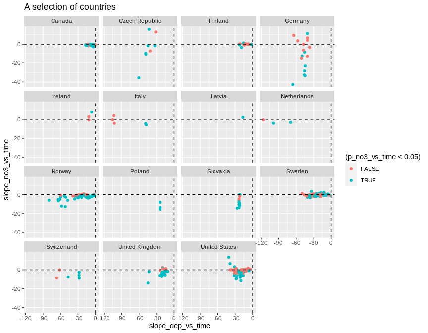<!-- -->

```r
dat %>%
  filter(!country %in% c("Latvia","Ireland","Italy","Netherlands")) %>%
  ggplot(aes(slope_dep_vs_time, slope_no3_vs_time,
             color = (p_no3_vs_time < 0.05))) + 
  geom_point() +
  facet_wrap(vars(country)) +
  geom_hline(yintercept = 0, linetype = 2) + 
  geom_vline(xintercept = 0, linetype = 2) + 
  labs(title = "A selection of countries") + 
  ylim(-50, 25)
```

<!-- -->


## 4. Select data   

### a. Selection of variables  
* Select variables to use, and thereby also cases  

```r
get_df_no3_decline <- function(data, variable_string){
  variable_string <- gsub(" ", "", variable_string)
  variables <- strsplit(variable_string, split = ",")[[1]]
  # Data for analyses
  df <- data %>%
    mutate(
      no3_decline = case_when(
        slope_no3_vs_time < 0 & p_no3_vs_time <= 0.05 ~ 1,
        TRUE ~ 0)
    )
  df[variables]
}

cat("-------------------------------------------------------------\n")
cat("Variables: \n")
cat(params$selected_vars)
cat("\n-------------------------------------------------------------\n")

df_analysis <- get_df_no3_decline(dat, params$selected_vars)  

# names(dat) %>% paste(collapse = ", ")

cat("Number of missing values per variable: \n")
apply(is.na(df_analysis), 2, sum) 
cat("\n")

# What is missing? (long output)
if (FALSE){
dat %>% 
  split(.$country) %>%
  purrr::map(~apply(is.na(.), 2, mean))
}

cat("Number of complete observations: \n")
complete <- complete.cases(df_analysis)
table(complete)

cat("\n\n")
cat("Number of complete observations by country: \n")
table(dat$country, complete)

# Keep only complete cases
df_analysis <- df_analysis[complete.cases(df_analysis),]

cat("\n\n")
cat("Original data: n =", nrow(dat), "\n")
cat("Analysis: n =", nrow(df_analysis), "\n")
```

```
## -------------------------------------------------------------
## Variables: 
## no3_decline,TOC,slope_dep_vs_time, NO3, TOTN_dep, latitude, longitude, altitude,pre, tmp, Slope_pre, Slope_tmp, urban, cultivated, total_forest, total_shrub_herbaceous,wetland, lake_water, bare_sparse
## -------------------------------------------------------------
## Number of missing values per variable: 
##            no3_decline                    TOC      slope_dep_vs_time                    NO3 
##                      0                     33                      0                      0 
##               TOTN_dep               latitude              longitude               altitude 
##                      0                      0                      0                      1 
##                    pre                    tmp              Slope_pre              Slope_tmp 
##                      0                      0                      0                      0 
##                  urban             cultivated           total_forest total_shrub_herbaceous 
##                     16                     16                     16                     16 
##                wetland             lake_water            bare_sparse 
##                     16                     16                     16 
## 
## Number of complete observations: 
## complete
## FALSE  TRUE 
##    48   450 
## 
## 
## Number of complete observations by country: 
##                 complete
##                  FALSE TRUE
##   Canada             0  114
##   Czech Republic     1    7
##   Estonia            1    0
##   Finland            0   26
##   Germany            5   18
##   Ireland            3    0
##   Italy              6    0
##   Latvia             3    0
##   Netherlands        1    2
##   Norway             0   83
##   Poland             0    6
##   Slovakia           0   12
##   Sweden             6   86
##   Switzerland        6    0
##   United Kingdom     0   21
##   United States     16   75
## 
## 
## Original data: n = 498 
## Analysis: n = 450
```


### b. Correlations   

```r
gg <- GGally::ggcorr(
  df_analysis, 
  method = c("complete.obs", "kendall"), 
  label = TRUE,
  hjust = 0.9, angle = -30) # +                    # slanted labels
gg + coord_cartesian(x = c(-2, 20), y = c(-2,22))  # fix margins
```

```
## Coordinate system already present. Adding new coordinate system, which will replace the existing one.
```

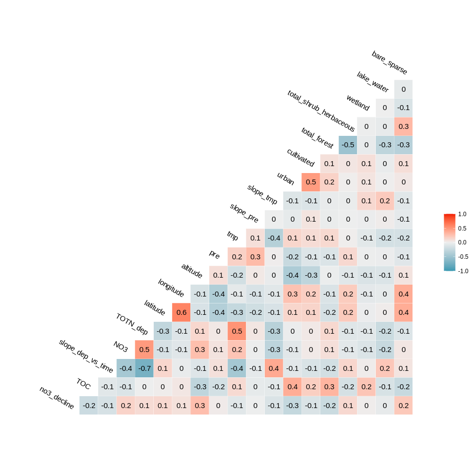<!-- -->


## 5. Tree and forest classification


### Split into training and validation data

```r
set.seed(123)

x <- runif(nrow(df_analysis))
train <- ifelse(x < 0.9, TRUE, FALSE)

train_set <- df_analysis[train,]  %>% 
  mutate(no3_decline_f = factor(no3_decline)) %>% select(-no3_decline, -longitude, - latitude) %>%
  as.data.frame()
valid_set <- df_analysis[!train,] %>% 
  mutate(no3_decline_f = factor(no3_decline)) %>% select(-no3_decline, -longitude, - latitude) %>%
  as.data.frame()
```


### a. Tree classification using 'party'   

```r
(ct = ctree(no3_decline_f ~ ., data = train_set))

plot(ct, main="Conditional Inference Tree")
```

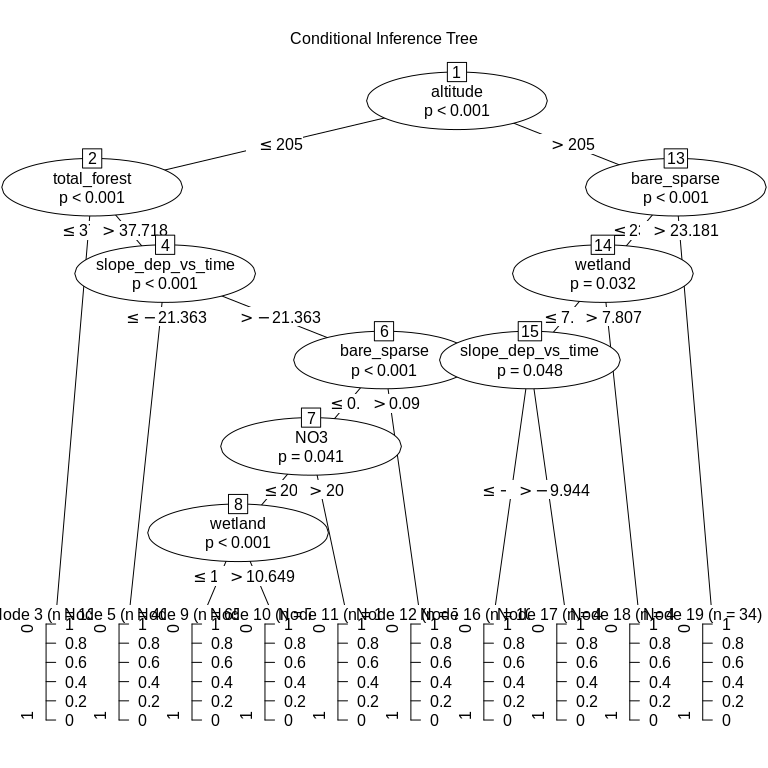<!-- -->

```r
cat("\n\n")
cat("Table of prediction errors \n")
table(predict(ct), train_set$no3_decline_f)
cat("\n\n")

cat("Classification of training set \n")
tr.pred = predict(ct, newdata = valid_set, type="prob")
colnames(tr.pred) <- c("P0", "P1")
# tr.pred <- tr.pred %>% map_dfr(~data.frame(P0 = .[1], P1 = .[2]))
table(tr.pred[,"P1"] > 0.5, valid_set$no3_decline_f)
```

```
## 
## Model formula:
## no3_decline_f ~ TOC + slope_dep_vs_time + NO3 + TOTN_dep + altitude + 
##     pre + tmp + Slope_pre + Slope_tmp + urban + cultivated + 
##     total_forest + total_shrub_herbaceous + wetland + lake_water + 
##     bare_sparse
## 
## Fitted party:
## [1] root
## |   [2] altitude <= 227
## |   |   [3] NO3 <= 63.5
## |   |   |   [4] tmp <= 1.05: 1 (n = 8, err = 37.5%)
## |   |   |   [5] tmp > 1.05: 0 (n = 138, err = 8.0%)
## |   |   [6] NO3 > 63.5: 1 (n = 33, err = 48.5%)
## |   [7] altitude > 227
## |   |   [8] bare_sparse <= 23.181: 1 (n = 199, err = 49.7%)
## |   |   [9] bare_sparse > 23.181: 1 (n = 28, err = 3.6%)
## 
## Number of inner nodes:    4
## Number of terminal nodes: 5
## 
## 
## Table of prediction errors 
##    
##       0   1
##   0 127  11
##   1 119 149
## 
## 
## Classification of training set 
##        
##          0  1
##   FALSE  9  4
##   TRUE  14 17
```

### b. Evtree (Evolutionary Learning)   

```r
ev.raw = evtree(no3_decline_f ~ ., data = train_set)

plot(ev.raw)
```

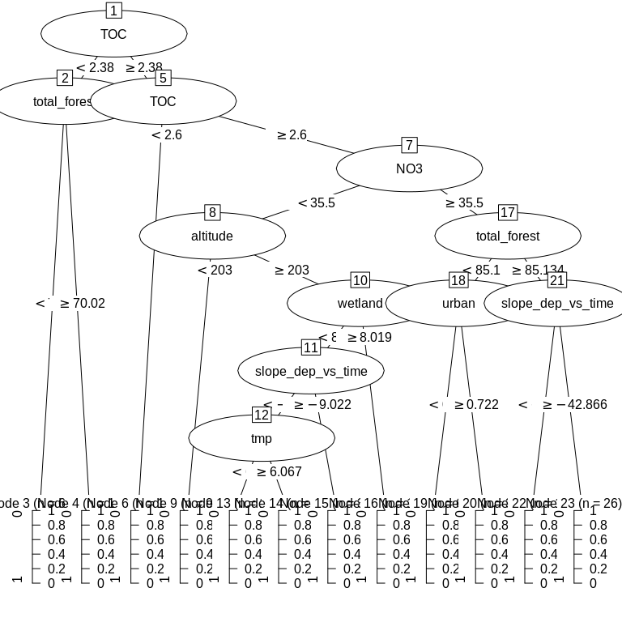<!-- -->

```r
cat("Predicted in training data: \n")
table(predict(ev.raw), train_set$no3_decline_f)

cat("\n\nPrediction errors in training data: \n")
1-mean(predict(ev.raw) == train_set$no3_decline_f)
```

```
## Predicted in training data: 
##    
##       0   1
##   0 223  46
##   1  23 114
## 
## 
## Prediction errors in training data: 
## [1] 0.1699507
```


### c. Random forest  
* *For results/interpretation, see separate document '160_randomforest_James_data.html'*  
* Model called 'model1'

```r
model1 <- randomForest(no3_decline_f ~ ., 
                       data = train_set, 
                       mtry = 5,
                       importance = TRUE)

model1
```

```
## 
## Call:
##  randomForest(formula = no3_decline_f ~ ., data = train_set, mtry = 5,      importance = TRUE) 
##                Type of random forest: classification
##                      Number of trees: 500
## No. of variables tried at each split: 5
## 
##         OOB estimate of  error rate: 23.4%
## Confusion matrix:
##     0   1 class.error
## 0 202  44   0.1788618
## 1  51 109   0.3187500
```


#### c1. Predict on training data

```r
# Predicting on train set
pred_valid <- predict(model1, valid_set, type = "class")
# Checking classification accuracy
table(pred_valid, valid_set$no3_decline_f)  

error_fraction <- mean(
  (pred_valid == 0 & valid_set$no3_decline_f == 1) | 
    (pred_valid == 1 & valid_set$no3_decline_f == 0))
cat("Error rate for training data:", round(error_fraction*100, 1), "%\n")
```

```
##           
## pred_valid  0  1
##          0 19  7
##          1  4 14
## Error rate for training data: 25 %
```

#### c2. Importance of variables

```r
# Calculation
importance <- measure_importance(model1)
```


```r
plot_multi_way_importance(importance, size_measure = "no_of_nodes", no_of_labels = 12)  
```

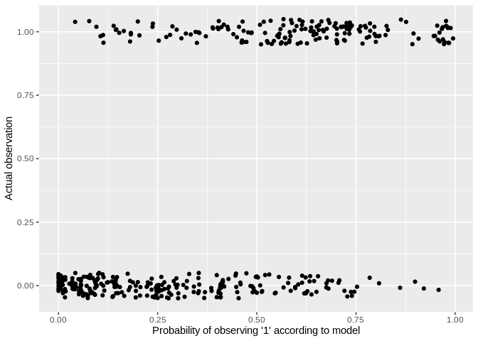<!-- -->

```r
plot_multi_way_importance(importance, x_measure = "accuracy_decrease", y_measure = "gini_decrease", 
                          size_measure = "p_value", no_of_labels = 12)
```

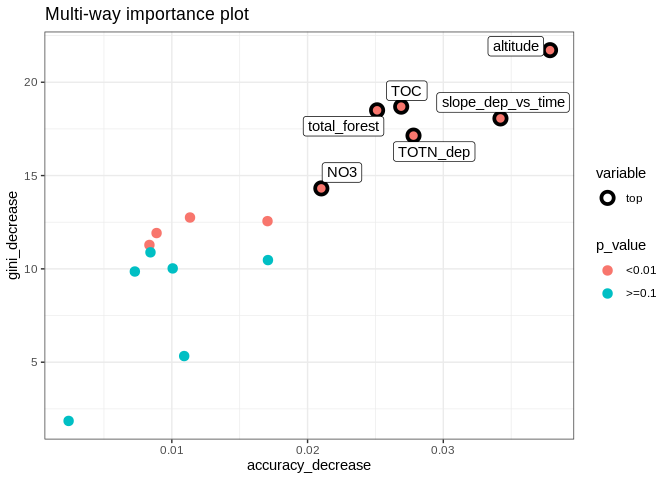<!-- -->


#### c3. Random forest, show partial effects  


```r
# Which variables to include:
variables_for_plot <- importance %>%
  mutate(variable = levels(variable)[as.numeric(variable)]) %>%
  arrange(desc(gini_decrease)) %>%
  pull(variable) %>%
  head(12)   # pick the first 12 variables (or less)

# Calculation

plotdata <- NULL  # will be list for storing results

max_number_of_plots <- length(variables_for_plot)/2 %>% floor()

for (i in 1:max_number_of_plots){
  varno1 <- c(1,3,5,7,9,11)[i]
  varno2 <- varno1 + 1
  plotdata[[i]] <- model1 %>%
    partial(pred.var = variables_for_plot[c(varno1, varno2)], chull = TRUE, progress = "text",
            which.class = "1", prob = TRUE)
}
```


```r
### Extra plots

i <- max_number_of_plots

plotpairs <- params$extra_pairwise_plots %>%
  gsub(" ", "", ., fixed = TRUE) %>%
  strsplit(x, split = ";") %>%
  .[[1]] %>%
  purrr::map(~strsplit(., split = ",")[[1]])

for (plotvar in plotpairs){
  # print(plotvar)
  if (plotvar[1] %in% names(train_set) & plotvar[2] %in% names(train_set)){
    i <- i + 1
    plotdata[[i]] <- model1 %>%
      partial(pred.var = c(plotvar[1], plotvar[2]), chull = TRUE, progress = "text",
             which.class = "1", prob = TRUE)
  }
}
```


```r
plot_pair_number <- function(i, zrange = NULL){
  
  variable_x <- rlang::sym(names(plotdata[[i]])[1])
  variable_y <- rlang::sym(names(plotdata[[i]])[2])
  
  gg <- ggplot(plotdata[[i]], aes(!!variable_x, !!variable_y)) +
    geom_tile(aes(fill = yhat)) +
    geom_contour(aes(z = yhat), color = "white") +
    geom_point(data = valid_set, shape = 21, size = 2, colour = "white", bg = "red") +
    theme_bw()
  
  if (is.null(zrange)){
    gg + scale_fill_viridis_c("Probability\nNO3 decline")
  } else {
    gg + scale_fill_viridis_c("Probability\nNO3 decline", limits = zrange)
  }

}
```


```r
plot_pair_number(1)
```

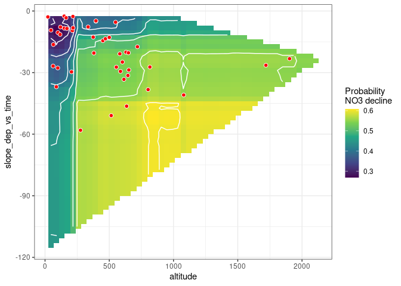<!-- -->

```r
# Find range of predicted values for each graph
ranges <- plotdata %>% purrr::map_dfc(~range(.$yhat))
```

```
## New names:
## * NA -> ...1
## * NA -> ...2
## * NA -> ...3
## * NA -> ...4
## * NA -> ...5
## * ...
```

```r
# use range of all the ranges
for (i in 1:length(plotdata)){
  
  if (params$pairwise_plots_same_scale == "TRUE"){
  
    gg <- plot_pair_number(i, zrange = range(ranges))
    print(gg)
    
  } else {
    
    gg <- plot_pair_number(i)
    print(gg)

  }
  
}
```

<!-- --><!-- --><!-- -->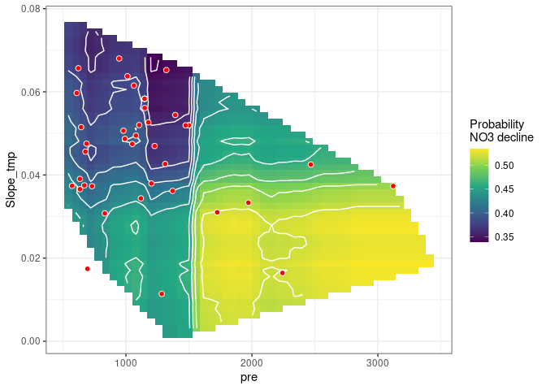<!-- -->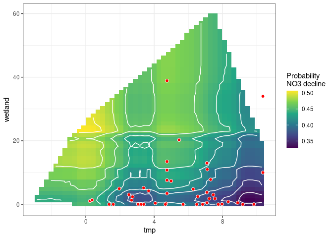<!-- -->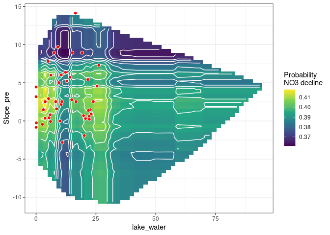<!-- -->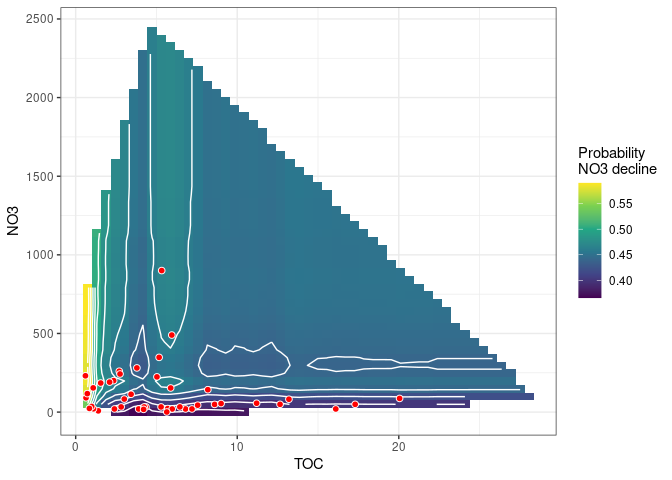<!-- --><!-- -->


## 6. Logistic regression       
Start model: **no3_decline ~ TOC*altitude + TOTN_dep*slope_dep_vs_time + NO3 + total_forest + tmp + lake_water + wetland**

```r
fm <- glm(
  as.formula(params$logistic_formula),
  data = df_analysis, 
  family = "binomial",  
  na.action = "na.fail")

dredged_models <- dredge(fm)                       # only once
```

```
## Fixed term is "(Intercept)"
```

```r
# saveRDS(dredged_models, "Data/162_all_dredged_models.rds")    # save it as it takes a couple of minutes
# dredged_models <- readRDS("Data/162_all_dredged_models.rds")

# cat("\n\nR2: \n")
# mod1 <- get.models(dredged_models, 1)[[1]]  
# summary(mod1)  
```

### Best models  

```r
# subset(dredged_models, delta < 1)

subset(dredged_models, delta < 2)

# Alternative way of showing result (didn't become any better)
# df <- subset(dredged_models, delta < 2)
# select(as.data.frame(df) %>% round(6), -`(Intercept)`, -logLik, -AICc)
```

```
## Global model call: glm(formula = as.formula(params$logistic_formula), family = "binomial", 
##     data = df_analysis, na.action = "na.fail")
## ---
## Model selection table 
##        (Int)       alt   lak_wtr       NO3 slp_dep_vs_tim     tmp      TOC   ttl_frs
## 2042 -0.3314 0.0006743                            -0.1240 -0.2315 -0.14080 -0.010460
## 2046 -0.2417 0.0005698           0.0009097        -0.1260 -0.2220 -0.13720 -0.011010
## 1530 -0.5473 0.0012280                            -0.1169 -0.2603 -0.08572 -0.009215
## 2044 -0.1283 0.0006368 -0.007573                  -0.1230 -0.2319 -0.14440 -0.010790
##         TOT_dep     wtl   alt:TOC slp_dep_vs_tim:TOT_dep df   logLik  AICc delta weight
## 2042 -0.0006818 0.05415 0.0002054              2.136e-05 10 -243.022 506.5  0.00  0.372
## 2046 -0.0010770 0.05571 0.0002173              2.058e-05 11 -242.268 507.1  0.59  0.277
## 1530 -0.0002493 0.05774                        2.301e-05  9 -244.749 507.9  1.36  0.188
## 2044 -0.0007465 0.05425 0.0002032              2.013e-05 11 -242.799 508.2  1.66  0.163
## Models ranked by AICc(x)
```


### Plots  

```r
# Pick model with lowest AICc
mod1 <- get.models(dredged_models, 1)[[1]]  

summ <- summary(mod1)
dev_expl <- summ$deviance/summ$null.deviance
cat("Percentage of deviance explained:", round(100*dev_expl, 1), "% \n")

modelvars <- get_model_variables(mod1)

# Interactions: 3D plot 
# visreg2d(mod1, xvar = vars[1], yvar = vars[2], 
#          type = 'conditional', scale = "response") 

# Interactions: 2D plot 
if (length(modelvars$interaction_list) > 0){
  modelvars$interaction_list %>% purrr::walk(
    ~visreg(mod1, .x[1], by = .x[2], scale = "response")
  )
}
```

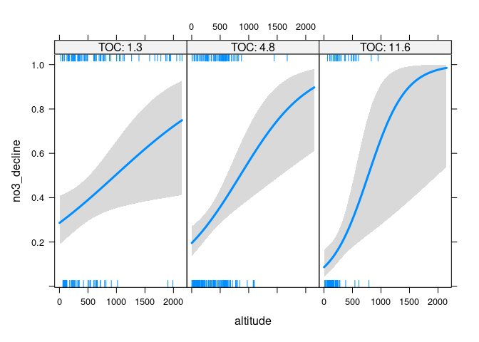<!-- -->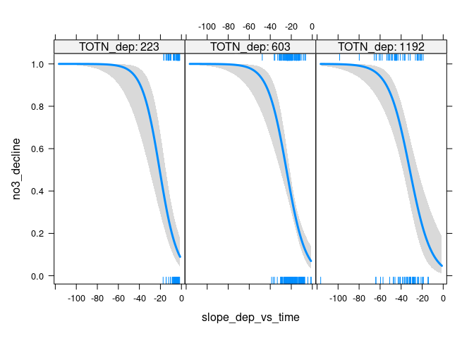<!-- -->

```r
# Additive effects: 1D plot
if (length(modelvars$additive_vars) > 0){
  par(mfrow = c(2,3), mar = c(4,5,2,1), oma = c(0,0,2,0))
  for (var in modelvars$additive_vars)
    visreg(mod1, var, scale = "response")  
}
```

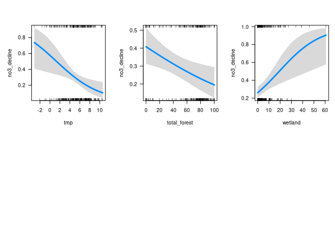<!-- -->

```
## Percentage of deviance explained: 80.1 % 
## Conditions used in construction of plot
## altitude: 276
## slope_dep_vs_time: -15.96809
## TOC: 4.84
## total_forest: 56.044
## TOTN_dep: 603.1866
## wetland: 1.5168
## Conditions used in construction of plot
## altitude: 276
## slope_dep_vs_time: -15.96809
## tmp: 5.458334
## TOC: 4.84
## TOTN_dep: 603.1866
## wetland: 1.5168
## Conditions used in construction of plot
## altitude: 276
## slope_dep_vs_time: -15.96809
## tmp: 5.458334
## TOC: 4.84
## total_forest: 56.044
## TOTN_dep: 603.1866
```


