**Analysis of NO3 decrease (categorical, "decrease or not"), based on James' trend results**  
  
**Dataset: all variables except catchment area and TOC**   

* Response variable: 'Significant /NO3 decline' (locations with signif. *increase* are *not* excluded)  
* Data from https://github.com/JamesSample/icpw2/tree/master/thematic_report_2020/results      
* Sen slope of NO3, TOTN, TOC/TON etc. 1992-2016
* Response variable in all analyses are *whether NO3 decreases or not*     
* Predictors:
    - slope_dep_vs_time: Trend in Tot-N deposition 1992-2016    
    - NO3, TOTN_dep: Medians of NO3, TOTN_dep (Tot-N deposition) 1992-2016   
    - catchment_area (if included in data)      
    - TOC: Medians of TOC       
    - pre, tmp: mean precipitation + temp   
    - Land cover 
  
Technical details: This html file was rendered with `160parm_run_markdown.R` which runs the script `160parm_Time_series_results_James.Rmd` with different inputs, resulting in html files 160a, 160b and 160c.    

## 1. Libraries  

```r
# All of these packages cn be loaded at once using library(tidyverse). (I just like to be specific.)
library(dplyr)
library(tidyr)      # pivot_wider
library(purrr)      # 'map' functions  
library(lubridate)  
library(ggplot2)

# Too many packages, not all are used
# library(mapview)
library(visreg)     # visreg
library(rkt)        # Theil -Sen Regression

library(MuMIn)      

# Trees and forests
library(party)                  # ctree
library(evtree)                 # evtree
library(randomForest)
library(randomForestExplainer)  # measure_importance, plot_multi_way_importance
library(pdp)                    # partial, autoplot

library(maps)
my_map <- map_data("world")

library(effects)    # handles lme models  
library(readxl)
library(readr)

source("002_Functions.R")
source("160parm_functions.R")

knitr::opts_chunk$set(results = 'hold') # collect the results from a chunk  
knitr::opts_chunk$set(warning = FALSE)  

options(width = 95)
```


## 2. Data

### James' trends and medians     

```r
#
# Regression results
#
folder <- "https://github.com/JamesSample/icpw2/raw/master/thematic_report_2020/results/trends_1992-2016_no3"
file <- "trends_1992-2016_no3_results.csv"
fn <- paste0(folder, "/", file)

reg_no3 <- read.csv(fn, encoding = "UTF-8")
cat("Regression results:", sQuote(file), ",n =", nrow(reg_no3), "\n\n")

# Station metadata

# THESE WILL BE ADDED TOGETHER WITH LAND COVER  

# file <- "trends_1992-2016_no3_stations.csv"
# fn <- paste0(folder, "/", file)
# 
# df_metadata <- read.csv(fn, encoding = "UTF-8")
# cat("Regression result metadata:", sQuote(file), ",n =", nrow(df_metadata), "\n\n")
# 
# cat("Countries with trends: \n")
# xtabs(~country, df_metadata)  

#
# Medians NO3
#

if (FALSE){

  # OLD: 2012-2016 medians NO3  

  cat("--------------------------------------------------------------------------\n")
  folder <- "https://github.com/JamesSample/icpw2/raw/master/thematic_report_2020/results/medians_2012-2016"
  file <- "medians_2012-2016_no3.csv"
  fn <- paste0(folder, "/", file)
  # data:
  medians_no3 <- read.csv(fn, encoding = "UTF-8")
  cat("Medians NO3:", sQuote(file), ",n =", nrow(medians_no3), "\n\n")
  file <- "medians_2012-2016_no3_stations.csv"
  fn <- paste0(folder, "/", file)
  # metadata:
  medians_no3_st <- read.csv(fn, encoding = "UTF-8")
  cat("Median metadata (not used):", sQuote(file), "n =", nrow(medians_no3_st), "\n\n")
  # stats:
  cat("Countries with medians: \n")
  xtabs(~country, medians_no3_st)  
  
  #
  #  OLD: 2012-2016 Medians TOC
  #
  cat("--------------------------------------------------------------------------\n")
  
  file <- "medians_2012-2016_toc_totn_no3_nh4.csv"
  fn <- paste0(folder, "/", file)
  
  medians_toc <- read.csv(fn, encoding = "UTF-8")
  cat("Medians TOC:", sQuote(file), ",n =", nrow(medians_toc), "\n\n")
  
  cat("Countries with medians: \n")
  xtabs(~country, medians_no3_st)  
  
}
```

```
## Regression results: 'trends_1992-2016_no3_results.csv' ,n = 3176
```

### Start 'dat'  

With slope regression data  
* Make one line per station  

```r
# table(reg_no3$variable)

# Slope 
df1 <- reg_no3 %>%
  filter(variable %in% c("NO3-N_µg/l N", "TOC/TON")) %>%
  select(station_id, variable, sen_slp) %>%
  tidyr::pivot_wider(names_from = "variable", values_from = "sen_slp") %>%
  rename(slope_no3_vs_time = `NO3-N_µg/l N`, 
         slope_tocton_vs_time = `TOC/TON`)
  
# Slope p-value
df2 <- reg_no3 %>%
  filter(variable %in% c("NO3-N_µg/l N", "TOC/TON")) %>%
  select(station_id, variable, mk_p_val) %>%
  tidyr::pivot_wider(names_from = "variable", values_from = "mk_p_val") %>%
  rename(p_no3_vs_time = `NO3-N_µg/l N`, 
         p_tocton_vs_time = `TOC/TON`)

# Medians
df3 <- reg_no3 %>%
  filter(variable %in% c("NO3-N_µg/l N", "TOC_mg C/l")) %>%
  select(station_id, variable, median) %>%
  tidyr::pivot_wider(names_from = "variable", values_from = "median") %>%
  rename(NO3 = `NO3-N_µg/l N`, 
         TOC = `TOC_mg C/l`)

cat("\n")
cat("df1, n =", nrow(df1), "\n")
cat("df2, n =", nrow(df2), "\n")
cat("df3, n =", nrow(df3), "\n")

dat_1_all <- df1 %>%
  full_join(df2, by = "station_id") %>%
  full_join(df3, by = "station_id")

cat("dat_1_all, n =", nrow(dat_1_all), " (may include series without slope_no3_vs_time)\n")

dat_1 <- dat_1_all %>%
  filter(!is.na(slope_no3_vs_time))

cat("dat_1, n =", nrow(dat_1), " (all data with existing values of 'slope_no3_vs_time')\n")
```

```
## 
## df1, n = 498 
## df2, n = 498 
## df3, n = 498 
## dat_1_all, n = 498  (may include series without slope_no3_vs_time)
## dat_1, n = 498  (all data with existing values of 'slope_no3_vs_time')
```


```r
# dat_1
# 
# str <- "slope_no3_vs_time ~ p_no3_vs_time"
# plot(as.formula(str), data = dat_1)
# lm(as.formula(str), data = dat_1)
```

### Deposition trends and median 1992-2006     

```r
fn <- "https://github.com/JamesSample/icpw2/raw/master/thematic_report_2020/results/deposition/totn_dep_trends_icpw_stns.csv"  

df_deposition <- read.csv(fn) %>% 
  filter(variable == "totn_mgNpm2")  

cat("n =", nrow(df_deposition), "\n")
```

```
## n = 556
```


### Add deposition slope and medians to data  

```r
# debugonce(left_join2)
dat_2 <- dat_1 %>% 
  left_join2(df_deposition %>% 
              select(station_id, median, sen_slp, mk_p_val) %>%
              rename(TOTN_dep = median,
                     slope_dep_vs_time = sen_slp,
                     p_dep_vs_time = mk_p_val),
             by = "station_id",
             print_vars = TRUE)
```

```
## Variables before join: 
## 'station_id', 'slope_no3_vs_time', 'slope_tocton_vs_time', 'p_no3_vs_time', 'p_tocton_vs_time', 'NO3', 'TOC'
## 
## Variables used to join: 
## 'station_id'
## 
## Variables added: 
## 'TOTN_dep', 'slope_dep_vs_time', 'p_dep_vs_time'
```

### Add medians and station metadata   


```r
# dat_2 <- dat_2 %>%
#   left_join(df_metadata, by = "station_id")

# cat("dat_2, n =", nrow(dat_2), "\n")

# Simplify names by removing units
# names(dat_2)
# names(dat_2) <- sub(".N_µg.l.N", "", names(dat_2))
# names(dat_2) <- sub("_mg.C.l", "", names(dat_2))
# names(dat_2) <- sub("_µg.l.P", "", names(dat_2))

# cat("\nVariable names: \n")
# names(dat_2)
```

### Add climate and deposition medians and slopes  

```r
fn <- "https://github.com/JamesSample/icpw2/raw/master/thematic_report_2020/results/climate/cru_climate_trends_icpw_stns.csv"

df_climate_mean <- read_csv(fn) %>% 
  select(station_id, variable, median) %>%
  pivot_wider(names_from = "variable", values_from = "median")
```

```
## Rows: 1112 Columns: 8
```

```
## ── Column specification ───────────────────────────────────────────────────────────────────────
## Delimiter: ","
## chr (3): variable, mk_trend, sen_trend
## dbl (5): station_id, median, mk_p_val, sen_slp, sen_incpt
```

```
## 
## ℹ Use `spec()` to retrieve the full column specification for this data.
## ℹ Specify the column types or set `show_col_types = FALSE` to quiet this message.
```

```r
cat("\n")
# names(df_climate_mean)

df_climate_slope <- read_csv(fn) %>%
  select(station_id, variable, sen_slp) %>%
  pivot_wider(names_from = "variable", values_from = "sen_slp", names_prefix = "slope_")
```

```
## Rows: 1112 Columns: 8
```

```
## ── Column specification ───────────────────────────────────────────────────────────────────────
## Delimiter: ","
## chr (3): variable, mk_trend, sen_trend
## dbl (5): station_id, median, mk_p_val, sen_slp, sen_incpt
```

```
## 
## ℹ Use `spec()` to retrieve the full column specification for this data.
## ℹ Specify the column types or set `show_col_types = FALSE` to quiet this message.
```

```r
# Add
dat_3 <- dat_2 %>%
  left_join2(df_climate_mean, by = "station_id", print_vars = TRUE) %>%
  left_join2(df_climate_slope, by = "station_id", print_vars = TRUE)
```

```
## 
## Variables before join: 
## 'station_id', 'slope_no3_vs_time', 'slope_tocton_vs_time', 'p_no3_vs_time', 'p_tocton_vs_time', 'NO3', 'TOC', 'TOTN_dep', 'slope_dep_vs_time', 'p_dep_vs_time'
## 
## Variables used to join: 
## 'station_id'
## 
## Variables added: 
## 'pre', 'tmp'
## Variables before join: 
## 'station_id', 'slope_no3_vs_time', 'slope_tocton_vs_time', 'p_no3_vs_time', 'p_tocton_vs_time', 'NO3', 'TOC', 'TOTN_dep', 'slope_dep_vs_time', 'p_dep_vs_time', 'pre', 'tmp'
## 
## Variables used to join: 
## 'station_id'
## 
## Variables added: 
## 'slope_pre', 'slope_tmp'
```

### Combine land cover types   
* Data including UK read using script 159   
* Note: also includes metadata (country, etc.)
* bare_sparse = bare_rock + sparsely_vegetated + glacier   
* Select: coniferous, deciduous, lake, mixed_forest, wetland, bare_sparse   


```r
# df_landcover3_OLD <- readRDS("Data/159_df_landcover3.rds")
df_landcover3 <- readRDS("Data/159_df_meta3.rds")

df_landcover3 <- df_landcover3 %>%
  mutate(bare_sparse = bare_rock + sparsely_vegetated + glacier,
         decid_mixed = deciduous + mixed_forest,
         lake_water = lake + water_ex_lake) %>%
  select(-c(bare_rock, sparsely_vegetated, glacier, deciduous, mixed_forest, lake, water_ex_lake))
```


### Add land cover columns to main data    

```r
dat_4 <- left_join2(dat_3, 
                   df_landcover3, 
                   by = "station_id", 
                   print_vars = TRUE
)
```

```
## Variables before join: 
## 'station_id', 'slope_no3_vs_time', 'slope_tocton_vs_time', 'p_no3_vs_time', 'p_tocton_vs_time', 'NO3', 'TOC', 'TOTN_dep', 'slope_dep_vs_time', 'p_dep_vs_time', 'pre', 'tmp', 'slope_pre', 'slope_tmp'
## 
## Variables used to join: 
## 'station_id'
## 
## Variables added: 
## 'station_code', 'station_name', 'latitude', 'longitude', 'altitude', 'continent', 'country', 'region', 'group', 'catchment_area', 'urban', 'cultivated', 'total_forest', 'coniferous', 'total_shrub_herbaceous', 'grasslands', 'heathlands', 'transitional_woodland_shrub', 'wetland', 'other', 'bare_sparse', 'decid_mixed', 'lake_water'
```


### Drop locations with >5% cultivated and >5% urban     
- also excluding stations 23517, 38273    

```r
cultivated_threshold <- 5
urban_threshold <- 5

dat_5 <- dat_4 %>%
  filter2(!station_id %in% c(23517, 38273), text = "Deleted stations 23517, 38273") %>%
  filter2(cultivated <= cultivated_threshold, 
          text = paste("Deleted stations with >", cultivated_threshold, "% cultivated")) %>%
  filter2(urban <= urban_threshold, 
          text = paste("Deleted stations with >", urban_threshold, "% urban"))
```

```
## Removed 2 rows (Deleted stations 23517, 38273)
## Removed 37 rows (Deleted stations with > 5 % cultivated)
## Removed 6 rows (Deleted stations with > 5 % urban)
```


### Data set used  

```r
dat <- dat_5 %>%
  mutate(
    no3_decline = case_when(
      slope_no3_vs_time < 0 & p_no3_vs_time <= 0.05 ~ 1,
      TRUE ~ 0)
  )
```


## 3. Plot slopes    


```r
ggplot(dat, aes(slope_dep_vs_time, slope_no3_vs_time)) + 
  geom_point(data = dat %>% filter(p_no3_vs_time < 0.05), size = rel(2)) +
  geom_point(aes(color = country)) +
  geom_hline(yintercept = 0, linetype = 2) + 
  geom_vline(xintercept = 0, linetype = 2) 
```

<!-- -->

```r
ggplot(dat, aes(slope_dep_vs_time, slope_no3_vs_time,
                color = (p_no3_vs_time < 0.05))) + 
  geom_point() +
  facet_wrap(vars(country)) +
  geom_hline(yintercept = 0, linetype = 2) + 
  geom_vline(xintercept = 0, linetype = 2) + 
  labs(title = "A selection of countries")
```

<!-- -->

```r
dat %>%
  filter(!country %in% c("Latvia","Ireland","Italy","Netherlands")) %>%
  ggplot(aes(slope_dep_vs_time, slope_no3_vs_time,
             color = (p_no3_vs_time < 0.05))) + 
  geom_point() +
  facet_wrap(vars(country)) +
  geom_hline(yintercept = 0, linetype = 2) + 
  geom_vline(xintercept = 0, linetype = 2) + 
  labs(title = "A selection of countries") + 
  ylim(-50, 25)
```

<!-- -->


## 4. Select data   

### a. Selection of variables  
* Select variables to use, and thereby also cases  
* Saves data both before and after rows with removing missing predictors are removed

```r
add_flag_variable <- function(data, variable_string){
  variable_string <- gsub(" ", "", variable_string)
  variables <- strsplit(variable_string, split = ",")[[1]]
  # Check if all variables are there
  found <- variables %in% names(data)
  if (sum(!found) > 0)
    stop("Not all variables found in data:", 
      paste(variables[!found], collapse = " ,"), 
      "\n")
  # Data for analyses
  complete <- complete.cases(data[variables])
  data$Row_excluded <- !complete
  variables %>% 
    purrr::map_dfr(~data.frame(Var = .x, Missing = sum(is.na(data[[.x]])))) %>%
    print()
  data
}

delete_unused_variables <- function(data, variable_string){
  variable_string <- gsub(" ", "", variable_string)
  variables <- strsplit(variable_string, split = ",")[[1]]
  data[variables]
}

cat("-------------------------------------------------------------\n")
cat("Variables: \n")
cat(params$selected_vars)
cat("\n-------------------------------------------------------------\n")

dat <- dat %>%
  filter2(!station_code %in% "PL05", text = "station PL05 (has dubious NO3 data)")

# debugonce(add_flag_variable)
# df_analysis <- add_flag_variable(dat, vars)  
df_analysis_allrows <- add_flag_variable(dat, params$selected_vars)  

# Save to excel
fn <- paste0(substr(params$document_title, 1, 3), "_", params$response_variable, "_data.xlsx")
writexl::write_xlsx(df_analysis_allrows, paste0("Data_analysed/", fn))
cat("\nDataset after removing urban, cultivated, PL05 saved as", sQuote(fn), "\n\n")

cat("Number of rows that will be excluded: \n")
table(df_analysis_allrows$Row_excluded)

cat("\n\n")
cat("Number of complete observations by country: \n")
xtabs(~country + Row_excluded, df_analysis_allrows)

# Keep only complete cases
df_analysis <- df_analysis_allrows %>%
  filter(!Row_excluded)

# Save to excel
fn <- paste0(
  stringr::str_extract(params$document_title, "[^[[:blank:]]]+"),
  "_data.xlsx")
writexl::write_xlsx(df_analysis, paste0("Data_analysed/", fn))

# Remove variables that will note be used
df_analysis <- delete_unused_variables(df_analysis, params$selected_vars)

cat("\n\n")
cat("Data before removing PL05: n =", nrow(dat_5), "\n")
cat("Data after removing PL05: n =", nrow(df_analysis_allrows), "\n")
cat("Data after removing missing predictors: n =", nrow(df_analysis), "\n")
```

```
## -------------------------------------------------------------
## Variables: 
## no3_decline,slope_dep_vs_time, NO3, TOTN_dep, latitude, longitude, altitude,pre, tmp, slope_pre, slope_tmp, urban, cultivated, coniferous, decid_mixed, total_shrub_herbaceous,wetland, lake_water, bare_sparse
## -------------------------------------------------------------
## Removed 0 rows (station PL05 (has dubious NO3 data))
##                       Var Missing
## 1             no3_decline       0
## 2       slope_dep_vs_time       0
## 3                     NO3       0
## 4                TOTN_dep       0
## 5                latitude       0
## 6               longitude       0
## 7                altitude       0
## 8                     pre       0
## 9                     tmp       0
## 10              slope_pre       0
## 11              slope_tmp       0
## 12                  urban       0
## 13             cultivated       0
## 14             coniferous       9
## 15            decid_mixed       9
## 16 total_shrub_herbaceous       0
## 17                wetland       0
## 18             lake_water       0
## 19            bare_sparse       0
## 
## Dataset after removing urban, cultivated, PL05 saved as '160__data.xlsx' 
## 
## Number of rows that will be excluded: 
## 
## FALSE  TRUE 
##   444     9 
## 
## 
## Number of complete observations by country: 
##                 Row_excluded
## country          FALSE TRUE
##   Canada           103    3
##   Czech Republic     8    0
##   Finland           24    0
##   Germany           19    0
##   Ireland            3    0
##   Italy              5    0
##   Latvia             1    0
##   Netherlands        3    0
##   Norway            80    0
##   Poland             5    0
##   Slovakia          12    0
##   Sweden            87    0
##   Switzerland        0    6
##   United Kingdom    21    0
##   United States     73    0
## 
## 
## Data before removing PL05: n = 453 
## Data after removing PL05: n = 453 
## Data after removing missing predictors: n = 444
```


### b. Correlations   

```r
gg <- GGally::ggcorr(
  df_analysis, 
  method = c("complete.obs", "kendall"), 
  label = TRUE,
  hjust = 0.9, angle = -30) # +                    # slanted labels
gg + coord_cartesian(x = c(-2, 20), y = c(-2,22))  # fix margins
```

```
## Coordinate system already present. Adding new coordinate system, which will replace the existing one.
```

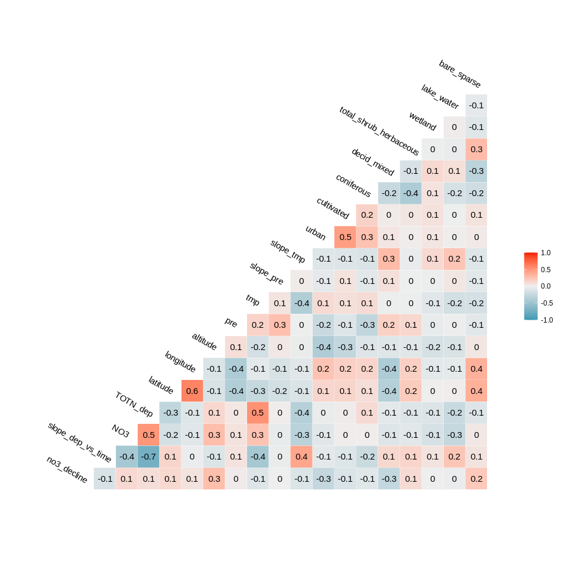<!-- -->


## 5. Tree and forest classification


### Split into training and validation data

```r
set.seed(123)

x <- runif(nrow(df_analysis))
train <- ifelse(x < 0.9, TRUE, FALSE)

train_set <- df_analysis[train,]  %>% 
  mutate(no3_decline_f = factor(no3_decline)) %>% select(-no3_decline, -longitude, - latitude) %>%
  as.data.frame()
valid_set <- df_analysis[!train,] %>% 
  mutate(no3_decline_f = factor(no3_decline)) %>% select(-no3_decline, -longitude, - latitude) %>%
  as.data.frame()
```


### a. Tree classification using 'party'   

```r
(ct = ctree(no3_decline_f ~ ., data = train_set))

plot(ct, main="Conditional Inference Tree")
```

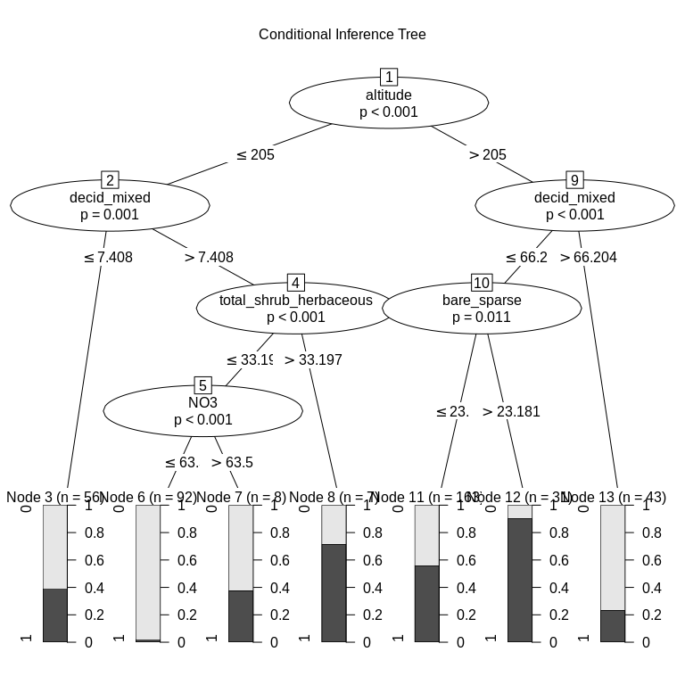<!-- -->

```r
cat("\n\n")
cat("Table of prediction errors \n")
table(predict(ct), train_set$no3_decline_f)
cat("\n\n")

cat("Classification of training set \n")
tr.pred = predict(ct, newdata = valid_set, type="prob")
colnames(tr.pred) <- c("P0", "P1")
# tr.pred <- tr.pred %>% map_dfr(~data.frame(P0 = .[1], P1 = .[2]))
table(tr.pred[,"P1"] > 0.5, valid_set$no3_decline_f)
```

```
## 
## Model formula:
## no3_decline_f ~ slope_dep_vs_time + NO3 + TOTN_dep + altitude + 
##     pre + tmp + slope_pre + slope_tmp + urban + cultivated + 
##     coniferous + decid_mixed + total_shrub_herbaceous + wetland + 
##     lake_water + bare_sparse
## 
## Fitted party:
## [1] root
## |   [2] altitude <= 205
## |   |   [3] decid_mixed <= 7.408: 0 (n = 56, err = 39.3%)
## |   |   [4] decid_mixed > 7.408
## |   |   |   [5] total_shrub_herbaceous <= 33.19745
## |   |   |   |   [6] NO3 <= 63.5: 0 (n = 92, err = 2.2%)
## |   |   |   |   [7] NO3 > 63.5: 0 (n = 8, err = 37.5%)
## |   |   |   [8] total_shrub_herbaceous > 33.19745: 1 (n = 7, err = 28.6%)
## |   [9] altitude > 205
## |   |   [10] decid_mixed <= 66.204
## |   |   |   [11] bare_sparse <= 23.181: 1 (n = 163, err = 44.2%)
## |   |   |   [12] bare_sparse > 23.181: 1 (n = 31, err = 9.7%)
## |   |   [13] decid_mixed > 66.204: 0 (n = 43, err = 23.3%)
## 
## Number of inner nodes:    6
## Number of terminal nodes: 7
## 
## 
## Table of prediction errors 
##    
##       0   1
##   0 162  37
##   1  77 124
## 
## 
## Classification of training set 
##        
##          0  1
##   FALSE 13  4
##   TRUE  11 16
```

### b. Evtree (Evolutionary Learning)   

```r
ev.raw = evtree(no3_decline_f ~ ., data = train_set)

plot(ev.raw)
```

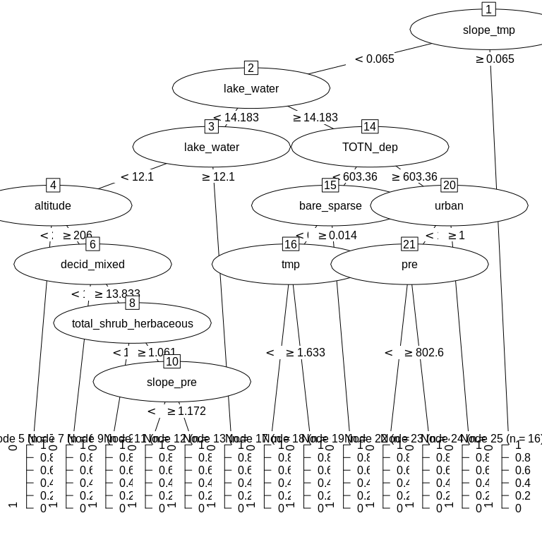<!-- -->

```r
cat("Predicted in training data: \n")
table(predict(ev.raw), train_set$no3_decline_f)

cat("\n\nPrediction errors in training data: \n")
1-mean(predict(ev.raw) == train_set$no3_decline_f)
```

```
## Predicted in training data: 
##    
##       0   1
##   0 211  32
##   1  28 129
## 
## 
## Prediction errors in training data: 
## [1] 0.15
```


### c. Random forest  
* *For results/interpretation, see separate document '160_randomforest_James_data.html'*  


#### c1a. Predict on training data

```r
model1 <- randomForest(no3_decline_f ~ ., 
                       data = train_set, 
                       mtry = 5,
                       importance = TRUE)

# Predicting on train set
pred_valid <- predict(model1, valid_set, type = "class")
# Checking classification accuracy
table(pred_valid, valid_set$no3_decline_f)  

error_fraction <- mean(
  (pred_valid == 0 & valid_set$no3_decline_f == 1) | 
    (pred_valid == 1 & valid_set$no3_decline_f == 0))
cat("Error rate for training data:", round(error_fraction*100, 1), "%\n")
```

```
##           
## pred_valid  0  1
##          0 18  5
##          1  6 15
## Error rate for training data: 25 %
```

#### c1b. Model for all data    

```r
full_set <- df_analysis  %>% 
  mutate(no3_decline_f = factor(no3_decline)) %>% 
  select(-no3_decline, -longitude, - latitude) %>%
  as.data.frame()

model1 <- randomForest(no3_decline_f ~ ., 
                       data = full_set, 
                       mtry = 5,
                       importance = TRUE)

# Predicting on train set
pred_valid <- predict(model1, valid_set, type = "class")
# Checking classification accuracy
table(pred_valid, valid_set$no3_decline_f)  

error_fraction <- mean(
  (pred_valid == 0 & valid_set$no3_decline_f == 1) | 
    (pred_valid == 1 & valid_set$no3_decline_f == 0))
cat("Error rate for training data:", round(error_fraction*100, 1), "%\n")
```

```
##           
## pred_valid  0  1
##          0 24  0
##          1  0 20
## Error rate for training data: 0 %
```

#### c1c. Quasi R-squared  

- Proportion of deviance explained  


```r
pred_prob <- predict(model1, type = "prob")

# Make data frame with P (modelled probability of no3_decline), Obs (observed no3_decline, 0 or 1),
#   and log-likelihood of data given the model
df_prob <- tibble(
  P = pred_prob[,2], 
  Obs = as.numeric(full_set$no3_decline) - 1
) %>%
  mutate(
    Lik = P*Obs + (1-P)*(1-Obs),
    Loglik = log(P*Obs + (1-P)*(1-Obs))
  )

# Null model (same probability for all observations)
df_prob$P_null <- mean(df_prob$Obs)

# Null probability   
df_prob <- df_prob %>%
  mutate(
    Loglik_null = log(P_null*Obs + (1-P_null)*(1-Obs))
    )
    
#
# Summary statistics
#
dev_model <- -2*sum(df_prob$Loglik)
dev_null <- -2*sum(df_prob$Loglik_null)
cat("Deviance of random forest model:", dev_model, "\n")
cat("Deviance of null model:", dev_null, "\n")

Quasi_R2 <- (dev_null - dev_model)/dev_null
cat("Proportion of deviance explained by model (quasi R.squared):", Quasi_R2, "\n")

#
# Plot
#
ggplot(df_prob, aes(P, Obs)) + 
  geom_jitter(width = 0, height = 0.05) +
  labs(x = "Probability of observing '1' according to model",
       y = "Actual observation"
  )
```

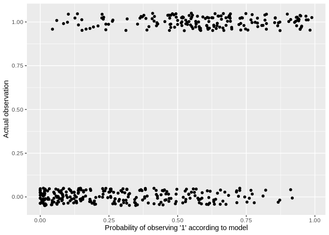<!-- -->

```
## Deviance of random forest model: 448.7327 
## Deviance of null model: 600.2833 
## Proportion of deviance explained by model (quasi R.squared): 0.2524651
```


#### c2. Importance of variables

```r
# Calculation
importance <- measure_importance(model1)
```


```r
plot_multi_way_importance(importance, size_measure = "no_of_nodes", no_of_labels = 6)  
```

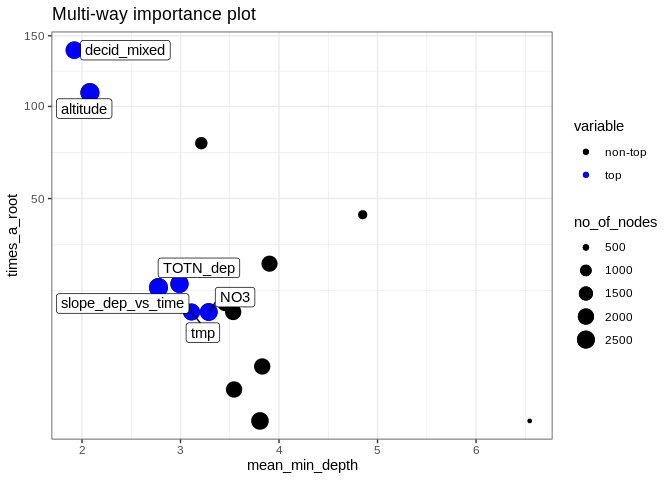<!-- -->

```r
plot_multi_way_importance(importance, 
                          x_measure = "accuracy_decrease", 
                          y_measure = "gini_decrease", 
                          size_measure = "p_value", no_of_labels = 6)
```

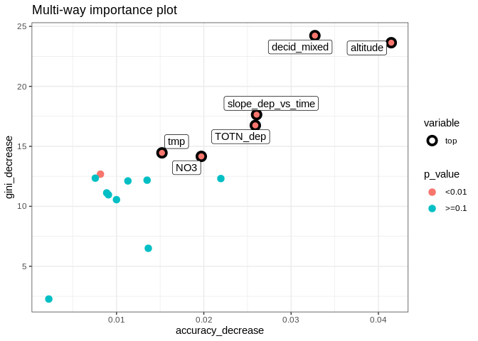<!-- -->

```r
# Plot immportance table as well
importance %>% 
  arrange(times_a_root)
```

```
##                  variable mean_min_depth no_of_nodes accuracy_decrease gini_decrease
## 1              cultivated       6.544593         467       0.002244205      2.270750
## 2              lake_water       3.806541        2419       0.008161358     12.682412
## 3                 wetland       3.543792        2053       0.007571646     12.349147
## 4               slope_tmp       3.829403        2035       0.009996520     10.556079
## 5                     NO3       3.286798        2430       0.019714994     14.164706
## 6                     pre       3.534589        2039       0.013504528     12.179641
## 7                     tmp       3.111631        2199       0.015208821     14.457629
## 8  total_shrub_herbaceous       3.453130        1937       0.011307653     12.116664
## 9               slope_pre       3.662253        2000       0.009073795     10.960922
## 10      slope_dep_vs_time       2.776257        2826       0.026047663     17.645076
## 11               TOTN_dep       2.989387        2587       0.025901399     16.748398
## 12             coniferous       3.903439        1991       0.008875015     11.119681
## 13                  urban       4.849283         702       0.013641320      6.500165
## 14            bare_sparse       3.210950        1163       0.021953067     12.315815
## 15               altitude       2.080160        2834       0.041473113     23.642218
## 16            decid_mixed       1.921844        2331       0.032727634     24.231652
##    no_of_trees times_a_root      p_value
## 1          298            0 1.000000e+00
## 2          492            0 4.020630e-21
## 3          498            1 1.166235e-01
## 4          488            3 2.179441e-01
## 5          493           12 4.062700e-22
## 6          494           12 1.918758e-01
## 7          497           12 3.391053e-06
## 8          493           14 9.317657e-01
## 9          492           15 5.107462e-01
## 10         498           18 9.985944e-73
## 11         497           19 8.304197e-39
## 12         491           25 5.928682e-01
## 13         403           43 1.000000e+00
## 14         467           78 1.000000e+00
## 15         499          109 4.942125e-74
## 16         499          139 5.310738e-14
```


#### c3. Random forest, show partial effects  


```r
# Which variables to include:
variables_for_plot <- importance %>%
  mutate(variable = levels(variable)[as.numeric(variable)]) %>%
  arrange(desc(gini_decrease)) %>%
  pull(variable) %>%
  head(12)   # pick the first 12 variables (or less)

# Calculation

plotdata <- NULL  # will be list for storing results

max_number_of_plots <- length(variables_for_plot)/2 %>% floor()

for (i in 1:max_number_of_plots){
  varno1 <- c(1,3,5,7,9,11)[i]
  varno2 <- varno1 + 1
  plotdata[[i]] <- model1 %>%
    partial(pred.var = variables_for_plot[c(varno1, varno2)], chull = TRUE, progress = "text",
            which.class = "1", prob = TRUE)
}
```


```r
### Extra plots

i <- max_number_of_plots

plotpairs <- params$extra_pairwise_plots %>%
  gsub(" ", "", ., fixed = TRUE) %>%
  strsplit(split = ";") %>%
  .[[1]] %>%
  purrr::map(~strsplit(., split = ",")[[1]])

for (plotvar in plotpairs){
  # print(plotvar)
  if (plotvar[1] %in% names(full_set) & plotvar[2] %in% names(full_set)){
    i <- i + 1
    plotdata[[i]] <- model1 %>%
      partial(pred.var = c(plotvar[1], plotvar[2]), chull = TRUE, progress = "text",
             which.class = "1", prob = TRUE)
  }
}
```


```r
# Find range of predicted values for each graph
ranges <- plotdata %>% purrr::map_dfc(~range(.$yhat))
```

```
## New names:
## * NA -> ...1
## * NA -> ...2
## * NA -> ...3
## * NA -> ...4
## * NA -> ...5
## * ...
```

```r
# use range of all the ranges
for (i in 1:length(plotdata)){
  
  if (params$pairwise_plots_same_scale == "TRUE"){
  
    gg <- plot_pair_number(i, zrange = range(ranges))
    print(gg)
    
  } else {
    
    gg <- plot_pair_number(i)
    print(gg)

  }
  
  # Save gg object for later plotting / changes
  # Saved in Figures/Partial_plots' with name e.g. "gg_164a1_7.rds" for plot number 7
  fn <- paste0(
    "Figures/Partial_plots/gg_",
    stringr::str_extract(params$document_title, "([^[[:blank:]]]+)"),   # extract e.g. "164a1"
    "_", i, ".rds")
  saveRDS(gg, fn)
  
}
```

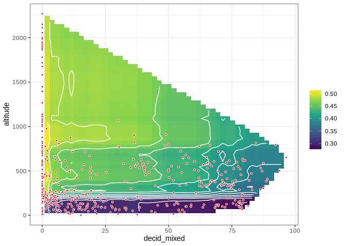<!-- --><!-- -->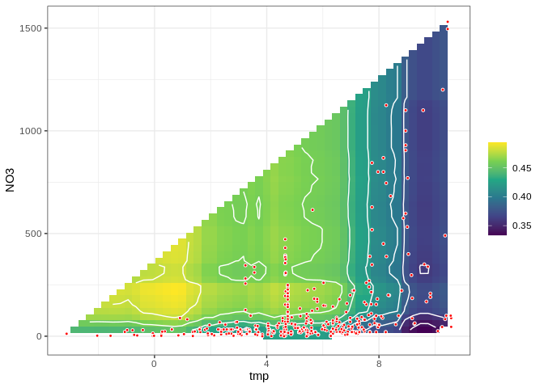<!-- -->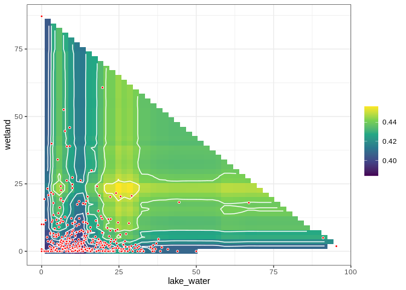<!-- --><!-- -->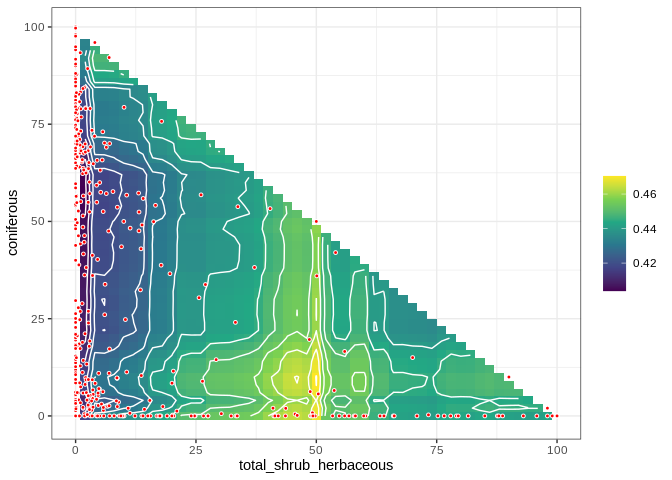<!-- -->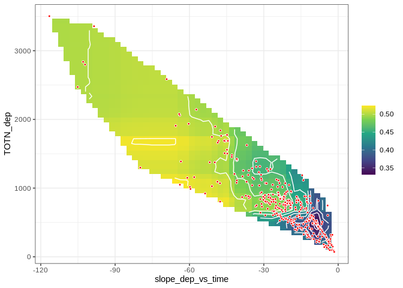<!-- -->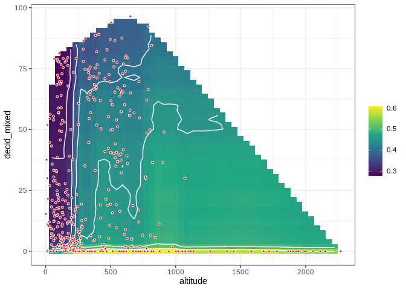<!-- -->


## 6. Logistic regression       
Start model: **no3_decline ~  altitude + decid_mixed + slope_dep_vs_time + NO3 + TOTN_dep + coniferous + tmp + lake_water + wetland**

```r
fm <- glm(
  as.formula(params$logistic_formula),
  data = df_analysis, 
  family = "binomial",  
  na.action = "na.fail")

dredged_models <- dredge(fm)                       # only once
```

```
## Fixed term is "(Intercept)"
```

```r
# saveRDS(dredged_models, "Data/162_all_dredged_models.rds")    # save it as it takes a couple of minutes
# dredged_models <- readRDS("Data/162_all_dredged_models.rds")

# cat("\n\nR2: \n")
# mod1 <- get.models(dredged_models, 1)[[1]]  
# summary(mod1)  
```

### Best models  

```r
# subset(dredged_models, delta < 1)

subset(dredged_models, delta < 2)

# Alternative way of showing result (didn't become any better)
# df <- subset(dredged_models, delta < 2)
# select(as.data.frame(df) %>% round(6), -`(Intercept)`, -logLik, -AICc)
```

```
## Global model call: glm(formula = as.formula(params$logistic_formula), family = "binomial", 
##     data = df_analysis, na.action = "na.fail")
## ---
## Model selection table 
##      (Int)      alt      cnf  dcd_mxd   lak_wtr        NO3 slp_dep_vs_tim     tmp    TOT_dep
## 376 0.3211 0.001846 -0.01531 -0.02725           -0.0011160       -0.04415 -0.1968           
## 488 0.4348 0.001852 -0.01627 -0.02730                            -0.05804 -0.1473 -0.0010580
## 120 0.4973 0.001810 -0.01627 -0.02798           -0.0011660       -0.04438 -0.1976           
## 232 0.6217 0.001815 -0.01733 -0.02810                            -0.05859 -0.1462 -0.0010930
## 360 0.5204 0.001603 -0.01563 -0.02768                            -0.03687 -0.2104           
## 504 0.3082 0.001970 -0.01578 -0.02702           -0.0008062       -0.05748 -0.1532 -0.0007835
## 104 0.7163 0.001550 -0.01664 -0.02846                            -0.03674 -0.2117           
## 248 0.4825 0.001941 -0.01677 -0.02778           -0.0008455       -0.05800 -0.1525 -0.0008043
## 128 0.6856 0.001792 -0.01710 -0.02835 -0.008469 -0.0012810       -0.04506 -0.2027           
## 384 0.4567 0.001832 -0.01591 -0.02753 -0.005662 -0.0011950       -0.04458 -0.2002           
##         wtl df   logLik  AICc delta weight
## 376 0.01795  8 -243.950 504.2  0.00  0.144
## 488 0.01814  8 -243.991 504.3  0.08  0.138
## 120          7 -245.134 504.5  0.29  0.124
## 232          7 -245.209 504.7  0.44  0.115
## 360 0.01889  7 -245.258 504.8  0.54  0.110
## 504 0.01767  9 -243.382 505.2  0.95  0.089
## 104          6 -246.567 505.3  1.09  0.083
## 248          8 -244.536 505.4  1.17  0.080
## 128          8 -244.833 506.0  1.76  0.059
## 384 0.01686  9 -243.821 506.1  1.83  0.058
## Models ranked by AICc(x)
```


### Plots  

```r
# Pick model with lowest AICc
mod1 <- get.models(dredged_models, 1)[[1]]  

summ <- summary(mod1)
dev_expl <- summ$deviance/summ$null.deviance
cat("Percentage of deviance explained:", round(100*dev_expl, 1), "% \n")

modelvars <- get_model_variables(mod1)

# Interactions: 3D plot 
# visreg2d(mod1, xvar = vars[1], yvar = vars[2], 
#          type = 'conditional', scale = "response") 

# Interactions: 2D plot 
if (length(modelvars$interaction_list) > 0){
  modelvars$interaction_list %>% purrr::walk(
    ~visreg(mod1, .x[1], by = .x[2], scale = "response")
  )
}

# Additive effects: 1D plot
if (length(modelvars$additive_vars) > 0){
  par(mfrow = c(2,3), mar = c(4,5,2,1), oma = c(0,0,2,0))
  for (var in modelvars$additive_vars)
    visreg(mod1, var, scale = "response")  
}
```

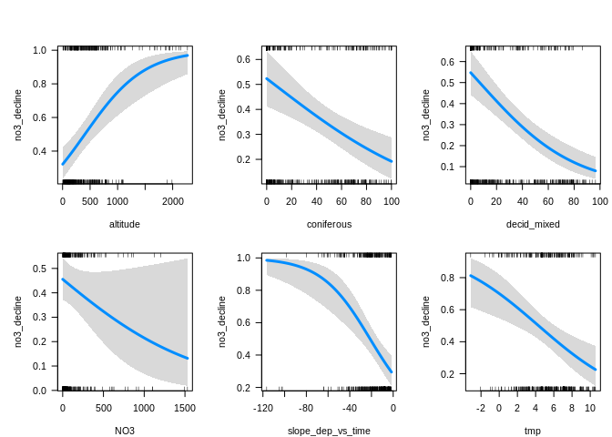<!-- -->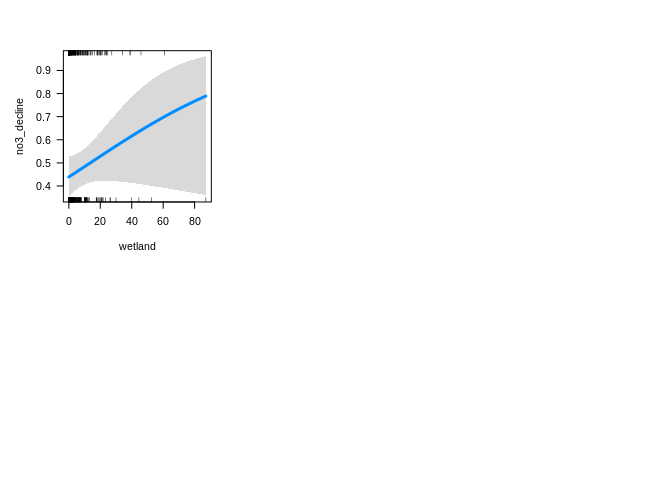<!-- -->

```
## Percentage of deviance explained: 81.3 %
```


