**Analysis of NO3 decrease (categorical, "decrease or not"), based on James' trend results**  
  
**Dataset: all variables except catchment area and TOC**   

* Response variable: 'Significant /NO3 decline' (locations with signif. *increase* are *not* excluded)  
* Data from https://github.com/JamesSample/icpw2/tree/master/thematic_report_2020/results      
* Sen slope of NO3, TOTN, TOC/TON etc. 1992-2016
* Response variable in all analyses are *whether NO3 decreases or not*     
* Predictors:
    - slope_dep_vs_time: Trend in Tot-N deposition 1992-2016    
    - NO3, TOTN_dep: Medians of NO3, TOTN_dep (Tot-N deposition) 1992-2016   
    - TOC: Medians of TOC 1992-2016 (section 5 and 6 only)     
    - catchment_area (section 5 only)   
    - pre, tmp: mean precipitation + temp   
    - Land cover   

## 1. Libraries  

```r
# All of these packages cn be loaded at once using library(tidyverse). (I just like to be specific.)
library(dplyr)
library(tidyr)
library(purrr)
library(lubridate)
library(ggplot2)

# Too many packages, not all are used
# library(forcats)
# library(mgcv)
# library(nlme)
library(mapview)
library(visreg)     # visreg
library(rkt)        # Theil -Sen Regression

library(MuMIn)      

# Trees and forests
# install.packages("party")
# install.packages("modeltools")
# install.packages("coin")
# install.packages("multcomp")
# install.packages("TH.data")
library(party)
# install.packages("evtree")
library(evtree)
# install.packages("randomForest")
library(randomForest)
library(randomForestExplainer)
library(pdp)

library(maps)
my_map <- map_data("world")

library(effects)    # handles lme models  
library(readxl)

knitr::opts_chunk$set(results = 'hold')
knitr::opts_chunk$set(warning = FALSE)
```


```r
# run_randomForestExplainer <- TRUE
run_randomForestExplainer <- FALSE
```


## 2. Data

```r
dat_annual_sel <- readRDS("Data/120_dat_annual_sel.rds")
# ts_model_list <- readRDS("Data/120_ts_model_list_linear.rds")
# ts_model_list_wout_TOC <- readRDS("Data/120_ts_model_list_wout_TOC.rds")

df_stations <- readRDS("Data/100_Stations.rds")
df_deposition <- readRDS("Data/100_Deposition.rds")
df_climate <- readRDS("Data/100_Climate.rds")
```

### Station metadata

```r
df_station <- read_excel(
  "K:/Prosjekter/langtransporterte forurensninger/O-23300 - ICP-WATERS - HWI/Faglige rapporter/2020 report/Land cover/ICPW_All_Stations_2020_2020_05_04.xlsx") %>%
  mutate(station_id = as.character(station_id))
```

### James' trends and medians     

```r
#
# Regression results
#
folder <- "https://github.com/JamesSample/icpw2/raw/master/thematic_report_2020/results/trends_1992-2016_no3"
file <- "trends_1992-2016_no3_results.csv"
fn <- paste0(folder, "/", file)

reg_no3 <- read.csv(fn, encoding = "UTF-8")
cat("Regression results:", sQuote(file), ",n =", nrow(reg_no3), "\n\n")

# Station metadata
file <- "trends_1992-2016_no3_stations.csv"
fn <- paste0(folder, "/", file)

reg_no3_st <- read.csv(fn, encoding = "UTF-8")
cat("Regression result metadata:", sQuote(file), ",n =", nrow(reg_no3_st), "\n\n")

cat("Countries with trends: \n")
xtabs(~country, reg_no3_st)  

#
# Medians NO3
#

if (FALSE){

  # OLD: 2012-2016 medians NO3  

  cat("--------------------------------------------------------------------------\n")
  folder <- "https://github.com/JamesSample/icpw2/raw/master/thematic_report_2020/results/medians_2012-2016"
  file <- "medians_2012-2016_no3.csv"
  fn <- paste0(folder, "/", file)
  # data:
  medians_no3 <- read.csv(fn, encoding = "UTF-8")
  cat("Medians NO3:", sQuote(file), ",n =", nrow(medians_no3), "\n\n")
  file <- "medians_2012-2016_no3_stations.csv"
  fn <- paste0(folder, "/", file)
  # metadata:
  medians_no3_st <- read.csv(fn, encoding = "UTF-8")
  cat("Median metadata (not used):", sQuote(file), "n =", nrow(medians_no3_st), "\n\n")
  # stats:
  cat("Countries with medians: \n")
  xtabs(~country, medians_no3_st)  
  
  #
  #  OLD: 2012-2016 Medians TOC
  #
  cat("--------------------------------------------------------------------------\n")
  
  file <- "medians_2012-2016_toc_totn_no3_nh4.csv"
  fn <- paste0(folder, "/", file)
  
  medians_toc <- read.csv(fn, encoding = "UTF-8")
  cat("Medians TOC:", sQuote(file), ",n =", nrow(medians_toc), "\n\n")
  
  cat("Countries with medians: \n")
  xtabs(~country, medians_no3_st)  
  
}
```

```
## Regression results: 'trends_1992-2016_no3_results.csv' ,n = 3176 
## 
## Regression result metadata: 'trends_1992-2016_no3_stations.csv' ,n = 498 
## 
## Countries with trends: 
## country
##         Canada Czech Republic        Estonia        Finland        Germany        Ireland          Italy         Latvia    Netherlands         Norway 
##            114              8              1             26             23              3              6              3              3             83 
##         Poland       Slovakia         Sweden    Switzerland United Kingdom  United States 
##              6             12             92              6             21             91
```
### Start 'dat'  
With slope regression data  
* Make one line per station  

```r
# table(reg_no3$variable)

# Slope 
df1 <- reg_no3 %>%
  filter(variable %in% c("NO3-N_µg/l N", "TOC/TON")) %>%
  select(station_id, variable, sen_slp) %>%
  tidyr::pivot_wider(names_from = "variable", values_from = "sen_slp") %>%
  rename(slope_no3_vs_time = `NO3-N_µg/l N`, 
         slope_tocton_vs_time = `TOC/TON`)
  
# Slope p-value
df2 <- reg_no3 %>%
  filter(variable %in% c("NO3-N_µg/l N", "TOC/TON")) %>%
  select(station_id, variable, mk_p_val) %>%
  tidyr::pivot_wider(names_from = "variable", values_from = "mk_p_val") %>%
  rename(p_no3_vs_time = `NO3-N_µg/l N`, 
         p_tocton_vs_time = `TOC/TON`)

# Medians
df3 <- reg_no3 %>%
  filter(variable %in% c("NO3-N_µg/l N", "TOC_mg C/l")) %>%
  select(station_id, variable, median) %>%
  tidyr::pivot_wider(names_from = "variable", values_from = "median") %>%
  rename(NO3 = `NO3-N_µg/l N`, 
         TOC = `TOC_mg C/l`)

cat("\n")
cat("df1, n =", nrow(df1), "\n")
cat("df2, n =", nrow(df2), "\n")
cat("df3, n =", nrow(df3), "\n")

dat <- df1 %>%
  full_join(df2, by = "station_id") %>%
  full_join(df3, by = "station_id")

cat("dat, n =", nrow(dat), "\n")
```

```
## 
## df1, n = 498 
## df2, n = 498 
## df3, n = 498 
## dat, n = 498
```


```r
# dat
# 
# str <- "slope_no3_vs_time ~ p_no3_vs_time"
# plot(as.formula(str), data = dat)
# lm(as.formula(str), data = dat)
```


### Deposition trends and median 1992-2006     

```r
fn <- "https://github.com/JamesSample/icpw2/raw/master/thematic_report_2020/results/deposition/totn_dep_trends_icpw_stns.csv"  

df_deposition <- read.csv(fn) %>% 
  filter(variable == "totn_mgNpm2")  

cat("n =", nrow(df_deposition), "\n")
```

```
## n = 556
```

### Add deposition slope and medians to data  

```r
cat("dat, n =", nrow(dat), "\n")

dat <- dat %>% 
  left_join(df_deposition %>% 
              select(station_id, median, sen_slp, mk_p_val) %>%
              rename(TOTN_dep = median,
                     slope_dep_vs_time = sen_slp,
                     p_dep_vs_time = mk_p_val),
                 by = "station_id")

cat("dat, n =", nrow(dat), "\n")

# names(dat)
```

```
## dat, n = 498 
## dat, n = 498
```
### Add medians and station metadata   

```r
dat <- dat %>%
  left_join(reg_no3_st, by = "station_id")

cat("dat, n =", nrow(dat), "\n")

# Simplify names by removing units
# names(dat)
# names(dat) <- sub(".N_µg.l.N", "", names(dat))
# names(dat) <- sub("_mg.C.l", "", names(dat))
# names(dat) <- sub("_µg.l.P", "", names(dat))

cat("\nVariable names: \n")
names(dat)
```

```
## dat, n = 498 
## 
## Variable names: 
##  [1] "station_id"           "slope_no3_vs_time"    "slope_tocton_vs_time" "p_no3_vs_time"        "p_tocton_vs_time"     "NO3"                 
##  [7] "TOC"                  "TOTN_dep"             "slope_dep_vs_time"    "p_dep_vs_time"        "station_code"         "station_name"        
## [13] "latitude"             "longitude"            "altitude"             "continent"            "country"              "region"              
## [19] "group"
```

### Add climate and deposition means 

```r
df_climate <- readRDS("Data/100_Climate.rds") %>%
  filter(year %in% 1992:2006)

df_climate_mean <- df_climate %>%
  group_by(station_id, variable) %>% 
  summarise(mean = mean(value), .groups = "drop") %>%
  tidyr::pivot_wider(names_from = "variable", values_from = "mean")

# Add
dat <- dat %>%
  left_join(df_climate_mean, by = "station_id")

cat("dat, n =", nrow(dat), "\n")
```

```
## dat, n = 498
```

### Add land cover    
* Combine: bare_sparse = bare_rock + sparsely_vegetated + glacier   
* Select: coniferous, deciduous, lake, mixed_forest, wetland, bare_sparse   

```r
fn <- "K:/Prosjekter/langtransporterte forurensninger/O-23300 - ICP-WATERS - HWI/Faglige rapporter/2020 report/Land cover/ICPW_All_Stations_2020_2020_05_04.xlsx"

df_station <- read_excel(fn) %>%
  mutate(bare_sparse = bare_rock + sparsely_vegetated + glacier,
         decid_mixed = deciduous + mixed_forest,
         lake_water = lake + water_ex_lake)

nrow(dat)
dat <- left_join(dat, 
                 df_station %>% select(-(station_code:longitude), -(altitude:region)), 
                 by = "station_id"
)

nrow(dat)
names(dat) %>% paste(collapse = " + ") 
```

```
## [1] 498
## [1] 498
## [1] "station_id + slope_no3_vs_time + slope_tocton_vs_time + p_no3_vs_time + p_tocton_vs_time + NO3 + TOC + TOTN_dep + slope_dep_vs_time + p_dep_vs_time + station_code + station_name + latitude + longitude + altitude + continent + country + region + group + pre + tmp + catchment_area + urban + cultivated + total_forest + deciduous + coniferous + mixed_forest + total_shrub_herbaceous + grasslands + heathlands + transitional_woodland_shrub + bare_rock + sparsely_vegetated + glacier + wetland + lake + water_ex_lake + other + bare_sparse + decid_mixed + lake_water"
```


## 3. Plot slopes    


```r
ggplot(dat, aes(slope_dep_vs_time, slope_no3_vs_time)) + 
  geom_point(data = dat %>% filter(p_no3_vs_time < 0.05), size = rel(2)) +
  geom_point(aes(color = country)) +
  geom_hline(yintercept = 0, linetype = 2) + 
  geom_vline(xintercept = 0, linetype = 2) 
```

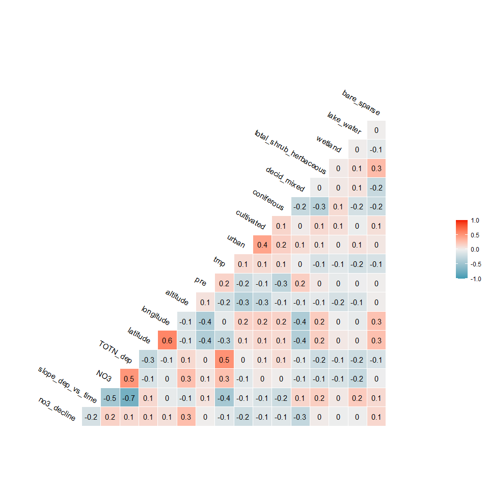<!-- -->

```r
ggplot(dat, aes(slope_dep_vs_time, slope_no3_vs_time,
                color = (p_no3_vs_time < 0.05))) + 
  geom_point() +
  facet_wrap(vars(country)) +
  geom_hline(yintercept = 0, linetype = 2) + 
  geom_vline(xintercept = 0, linetype = 2) + 
  labs(title = "A selection of countries")
```

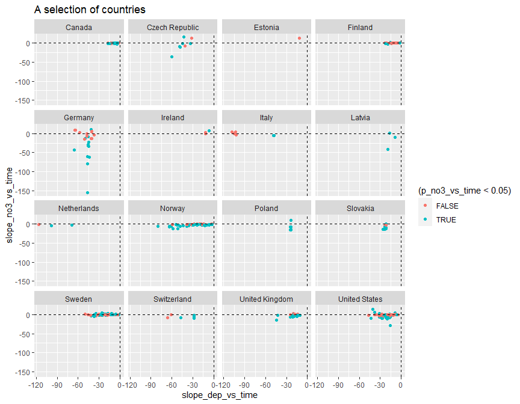<!-- -->

```r
dat %>%
  filter(!country %in% c("Latvia","Ireland","Italy","Netherlands")) %>%
  ggplot(aes(slope_dep_vs_time, slope_no3_vs_time,
             color = (p_no3_vs_time < 0.05))) + 
  geom_point() +
  facet_wrap(vars(country)) +
  geom_hline(yintercept = 0, linetype = 2) + 
  geom_vline(xintercept = 0, linetype = 2) + 
  labs(title = "A selection of countries") + 
  ylim(-50, 25)
```

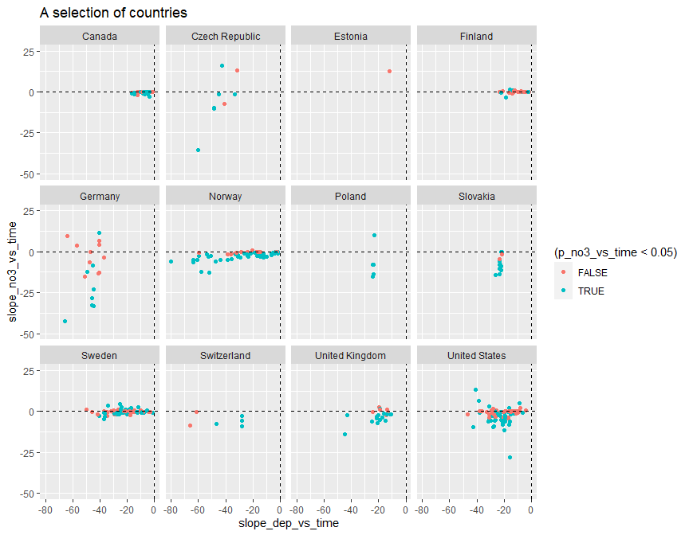<!-- -->


## 4. Select data   
* Select variables to use, and thereby also cases  

```r
get_df_no3_decline <- function(data, variable_string){
  variable_string <- gsub(" ", "", variable_string)
  variables <- strsplit(variable_string, split = ",")[[1]]
  # Data for analyses
  df <- data %>%
    mutate(
      no3_decline = case_when(
        slope_no3_vs_time < 0 & p_no3_vs_time <= 0.05 ~ 1,
        TRUE ~ 0)
    )
  df[variables]
}

cat("-------------------------------------------------------------\n")
cat("Variables: \n")
cat(params$selected_vars)
cat("\n-------------------------------------------------------------\n")

df_analysis <- get_df_no3_decline(dat, params$selected_vars)  

# names(dat) %>% paste(collapse = ", ")

cat("Number of missing values per variable: \n")
apply(is.na(df_analysis), 2, sum) 
cat("\n")

# What is missing? (long output)
if (FALSE){
dat %>% 
  split(.$country) %>%
  purrr::map(~apply(is.na(.), 2, mean))
}

cat("Number of complete observations: \n")
complete <- complete.cases(df_analysis)
table(complete)

cat("\n\n")
cat("Number of complete observations by country: \n")
table(dat$country, complete)

# Keep only complete cases
df_analysis <- df_analysis[complete.cases(df_analysis),]

cat("\n\n")
cat("Original data: n =", nrow(dat), "\n")
cat("Analysis: n =", nrow(df_analysis), "\n")
```

```
## -------------------------------------------------------------
## Variables: 
## no3_decline,slope_dep_vs_time, NO3, TOTN_dep, latitude, longitude, altitude,pre, tmp, urban, cultivated, coniferous, decid_mixed, total_shrub_herbaceous,wetland, lake_water, bare_sparse
## -------------------------------------------------------------
## Number of missing values per variable: 
##            no3_decline      slope_dep_vs_time                    NO3               TOTN_dep               latitude              longitude 
##                      0                      0                      0                      0                      0                      0 
##               altitude                    pre                    tmp                  urban             cultivated             coniferous 
##                      9                      0                      0                     37                     37                     43 
##            decid_mixed total_shrub_herbaceous                wetland             lake_water            bare_sparse 
##                     43                     37                     37                     37                     37 
## 
## Number of complete observations: 
## complete
## FALSE  TRUE 
##    52   446 
## 
## 
## Number of complete observations by country: 
##                 complete
##                  FALSE TRUE
##   Canada             0  114
##   Czech Republic     0    8
##   Estonia            1    0
##   Finland            0   26
##   Germany            1   22
##   Ireland            1    2
##   Italy              0    6
##   Latvia             0    3
##   Netherlands        0    3
##   Norway             0   83
##   Poland             0    6
##   Slovakia           0   12
##   Sweden             6   86
##   Switzerland        6    0
##   United Kingdom    21    0
##   United States     16   75
## 
## 
## Original data: n = 498 
## Analysis: n = 446
```


## 5. Tree and forest classification


### Split into training and validation data

```r
set.seed(123)

x <- runif(nrow(df_analysis))
train <- ifelse(x < 0.9, TRUE, FALSE)

train_set <- df_analysis[train,]  %>% 
  mutate(no3_decline_f = factor(no3_decline)) %>% select(-no3_decline, -longitude, - latitude) %>%
  as.data.frame()
valid_set <- df_analysis[!train,] %>% 
  mutate(no3_decline_f = factor(no3_decline)) %>% select(-no3_decline, -longitude, - latitude) %>%
  as.data.frame()
```


### a. Tree classification using 'party'   

```r
(ct = ctree(no3_decline_f ~ ., data = train_set))

plot(ct, main="Conditional Inference Tree")
```

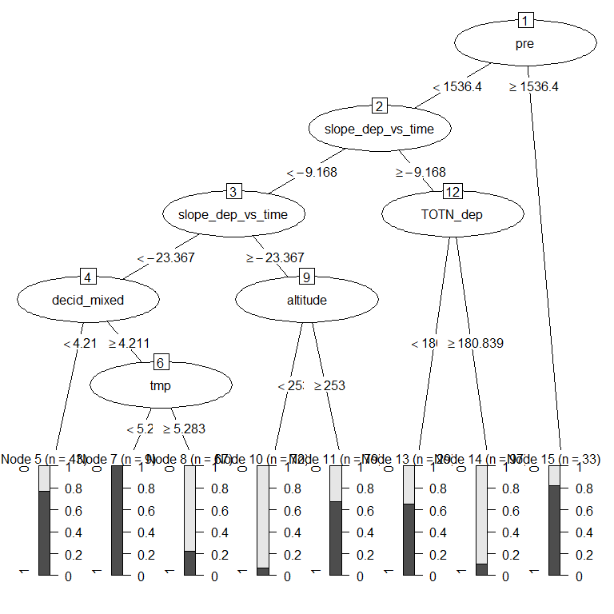<!-- -->

```r
cat("\n\n")
cat("Table of prediction errors \n")
table(predict(ct), train_set$no3_decline_f)
cat("\n\n")

cat("Classification of training set \n")
tr.pred = predict(ct, newdata = valid_set, type="prob")
colnames(tr.pred) <- c("P0", "P1")
# tr.pred <- tr.pred %>% map_dfr(~data.frame(P0 = .[1], P1 = .[2]))
table(tr.pred[,"P1"] > 0.5, valid_set$no3_decline_f)
```

```
## 
## Model formula:
## no3_decline_f ~ slope_dep_vs_time + NO3 + TOTN_dep + altitude + 
##     pre + tmp + urban + cultivated + coniferous + decid_mixed + 
##     total_shrub_herbaceous + wetland + lake_water + bare_sparse
## 
## Fitted party:
## [1] root
## |   [2] altitude <= 226
## |   |   [3] total_shrub_herbaceous <= 41
## |   |   |   [4] decid_mixed <= 0.861: 0 (n = 12, err = 50.0%)
## |   |   |   [5] decid_mixed > 0.861: 0 (n = 152, err = 11.2%)
## |   |   [6] total_shrub_herbaceous > 41: 1 (n = 13, err = 30.8%)
## |   [7] altitude > 226
## |   |   [8] decid_mixed <= 46.033
## |   |   |   [9] bare_sparse <= 15.861: 1 (n = 113, err = 40.7%)
## |   |   |   [10] bare_sparse > 15.861: 1 (n = 32, err = 3.1%)
## |   |   [11] decid_mixed > 46.033: 0 (n = 80, err = 31.2%)
## 
## Number of inner nodes:    5
## Number of terminal nodes: 6
## 
## 
## Table of prediction errors 
##    
##       0   1
##   0 196  48
##   1  51 107
## 
## 
## Classification of training set 
##        
##          0  1
##   FALSE 16 12
##   TRUE   9  7
```

### b. Evtree (Evolutionary Learning)   

```r
ev.raw = evtree(no3_decline_f ~ ., data = train_set)

plot(ev.raw)
```

<!-- -->

```r
cat("Predicted in training data: \n")
table(predict(ev.raw), train_set$no3_decline_f)

cat("\n\nPrediction errors in training data: \n")
1-mean(predict(ev.raw) == train_set$no3_decline_f)
```

```
## Predicted in training data: 
##    
##       0   1
##   0 213  31
##   1  34 124
## 
## 
## Prediction errors in training data: 
## [1] 0.1616915
```


### c. Random forest  
* *For results/interpretation, see separate document '160_randomforest_James_data.html'*  
* Model called 'model1'

```r
model1 <- randomForest(no3_decline_f ~ ., 
                       data = train_set, 
                       mtry = 5,
                       importance = TRUE)

model1
```

```
## 
## Call:
##  randomForest(formula = no3_decline_f ~ ., data = train_set, mtry = 5,      importance = TRUE) 
##                Type of random forest: classification
##                      Number of trees: 500
## No. of variables tried at each split: 5
## 
##         OOB estimate of  error rate: 22.14%
## Confusion matrix:
##     0   1 class.error
## 0 206  41   0.1659919
## 1  48 107   0.3096774
```


#### c1. Predict on training data

```r
# Predicting on train set
pred_valid <- predict(model1, valid_set, type = "class")
# Checking classification accuracy
table(pred_valid, valid_set$no3_decline_f)  
```

```
##           
## pred_valid  0  1
##          0 13  5
##          1 12 14
```

#### c2. Importance of variables

```r
# Calculation
importance <- measure_importance(model1)
```


```r
plot_multi_way_importance(importance, size_measure = "no_of_nodes", no_of_labels = 12)  
```

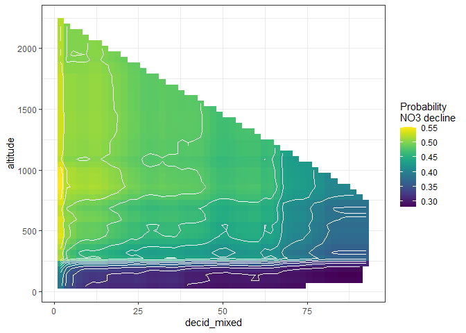<!-- -->

```r
plot_multi_way_importance(importance, x_measure = "accuracy_decrease", y_measure = "gini_decrease", 
                          size_measure = "p_value", no_of_labels = 12)
```

<!-- -->


#### c3. Random forest, show partial effects  


```r
# Which variables to include:
variables_for_plot <- importance %>%
  mutate(variable = levels(variable)[as.numeric(variable)]) %>%
  arrange(desc(gini_decrease)) %>%
  pull(variable) %>%
  head(12)   # pick the first 12 variables (or less)

# Calculation

plotdata <- NULL  # will be list for storing results

max_number_of_plots <- length(variables_for_plot)/2 %>% floor()

for (i in 1:max_number_of_plots){
  varno1 <- c(1,3,5,7,9,11)[i]
  varno2 <- varno1 + 1
  plotdata[[i]] <- model1 %>%
    partial(pred.var = variables_for_plot[c(varno1, varno2)], chull = TRUE, progress = "text",
            which.class = "1", prob = TRUE)
}

# saveRDS(plotdata, "Data/160a_plotdata.Rmd")

# plotdata <- readRDS("Data/160a_plotdata.Rmd")
```


```r
# Plot the plots 
for (i in 1:max_number_of_plots){
  autoplot(plotdata[[i]], contour = TRUE, legend.title = "Probability\nNO3 decline") %>%
    print()
}
```

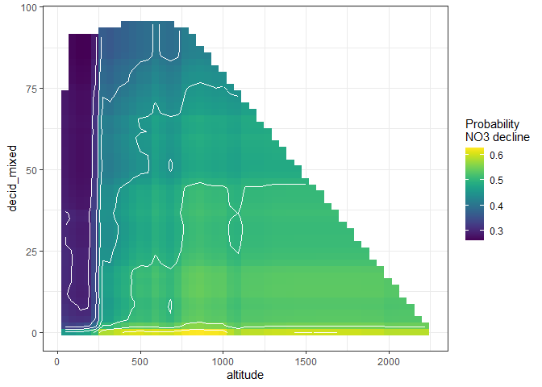<!-- -->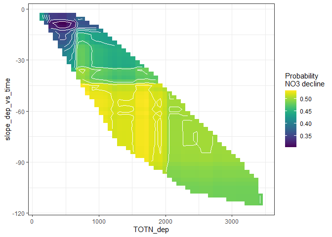<!-- -->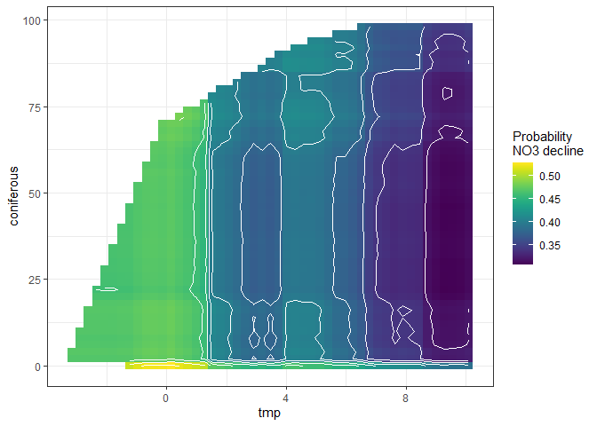<!-- -->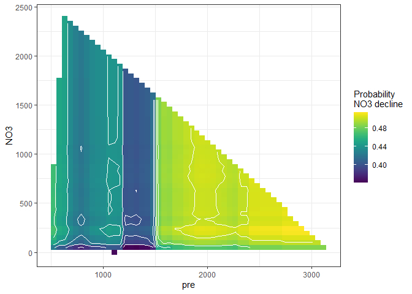<!-- -->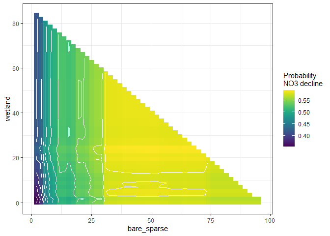<!-- --><!-- -->


## 6. Logistic regression      

```r
#   no3_decline ~ as.formula(params$logistic_formula),

fm <- glm(
  as.formula(params$logistic_formula),
  data = df_analysis, 
  family = "binomial",
  na.action = "na.fail")

dd1b <- dredge(fm)                       # only once
```

```
## Fixed term is "(Intercept)"
```

```r
saveRDS(dd1b, "Data/160_all_dd1b.rds")    # save it as it takes a couple of minutes
# dd1b <- readRDS("Data/160_all_dd1b.rds")

# subset(dd1b, delta < 1)
subset(dd1b, delta < 2)

cat("\n\nR2: \n")
dd1b_mod1 <- get.models(dd1b, 1)[[1]]  
# summary(dd1b_mod1)  

par(mfrow = c(2,3), mar = c(4,5,2,1), oma = c(0,0,2,0))
visreg(dd1b_mod1, scale = "response")
```

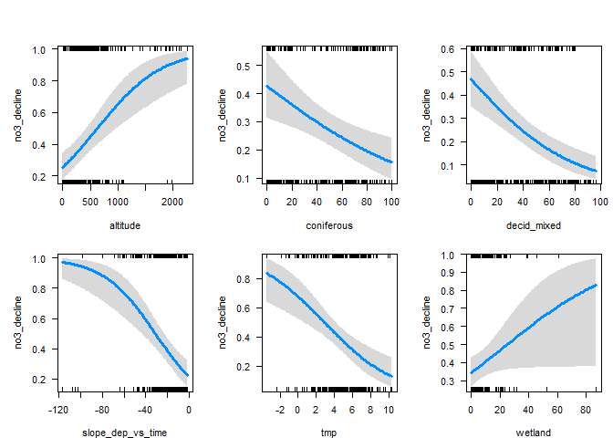<!-- -->

```
## Global model call: glm(formula = as.formula(params$logistic_formula), family = "binomial", 
##     data = df_analysis, na.action = "na.fail")
## ---
## Model selection table 
##      (Int)      alt      cnf  dcd_mxd  lak_wtr       NO3 slp_dep_vs_tim     tmp   TOT_dep     wtl df   logLik  AICc delta weight
## 360 0.3568 0.001695 -0.01402 -0.02483                          -0.04151 -0.2542           0.02536  7 -237.283 488.8  0.00  0.436
## 368 0.0808 0.001763 -0.01227 -0.02351 0.009524                 -0.04227 -0.2568           0.02750  8 -236.950 490.2  1.41  0.216
## 376 0.4081 0.001629 -0.01405 -0.02481          0.0002713       -0.03969 -0.2597           0.02595  8 -237.127 490.6  1.76  0.181
## 488 0.3354 0.001760 -0.01413 -0.02467                          -0.04667 -0.2379 -0.000267 0.02506  8 -237.201 490.7  1.91  0.168
## Models ranked by AICc(x) 
## 
## 
## R2:
```


