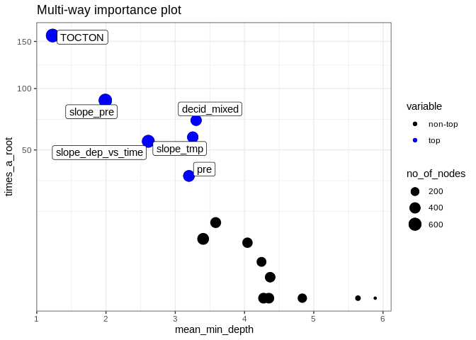
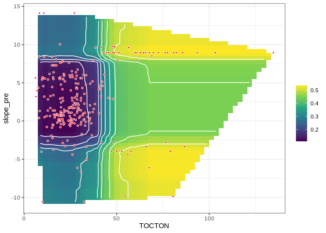
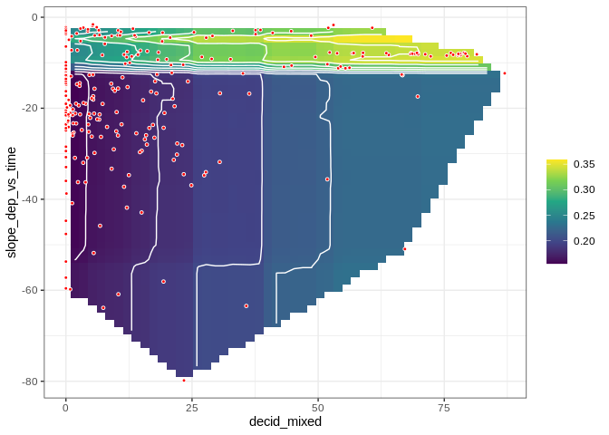
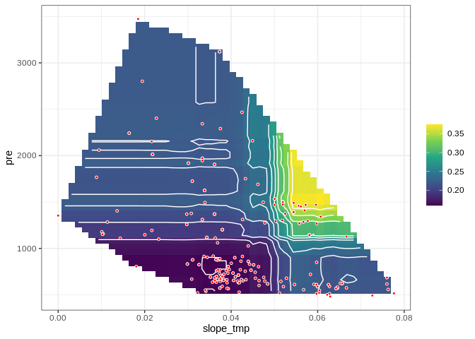
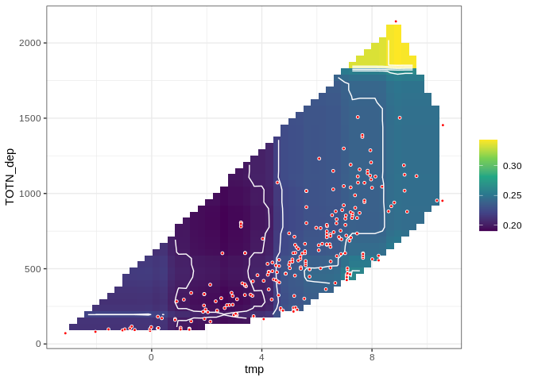

**Analysis of TOC/TON decrease (categorical, "decrease or not"), based on James' trend results**  
  
**Dataset: neither medians or slopes of TOC and TON**   

As 160, but analysing the trend in TOC/TON ratio

* Response variable: 'Significant decrease in TOC/TON ratio' (locations with signif. *decrease* are *not* excluded)  
* Data from https://github.com/JamesSample/icpw2/tree/master/thematic_report_2020/results      
* Sen slope of NO3, TOTN, TOC/TON etc. 1992-2016
* Response variable in all analyses are *whether TOC/TON decreases or not*     
* Predictors:
    - slope_toc_vs_time, slope_ton_vs_time  
    - TOC: Medians of TOC 1992-2016     
    - TON: Medians of TOC 1992-2016   
    - NO3, TOTN_dep: Medians of NO3, TOTN_dep (Tot-N deposition) 1992-2016   
    - catchment_area (if included in data)      
    - pre, tmp: mean precipitation + temp   
    - Land cover 
  
Technical details: This html file was created with `161parm_Time_series_tocton.Rmd` run with `161parm_run_markdown.R`    
Code: https://github.com/DagHjermann/icpw-R  

## 1. Libraries  

```r
# All of these packages cn be loaded at once using library(tidyverse). (I just like to be specific.)
library(dplyr)
library(tidyr)      # pivot_wider
library(purrr)      # 'map' functions  
library(lubridate)  
library(ggplot2)

# Too many packages, not all are used
# library(mapview)
library(visreg)     # visreg
library(rkt)        # Theil -Sen Regression

library(MuMIn)      

# Trees and forests
library(party)                  # ctree
library(evtree)                 # evtree
library(randomForest)
library(randomForestExplainer)  # measure_importance, plot_multi_way_importance
library(pdp)                    # partial, autoplot

library(maps)
my_map <- map_data("world")

library(effects)    # handles lme models  
library(readxl)
library(readr)

source("002_Functions.R")
source("160parm_functions.R")

knitr::opts_chunk$set(results = 'hold') # collect the results from a chunk  
knitr::opts_chunk$set(warning = FALSE)  

options(width = 95)
```


## 2. Data

### James' trends and medians     

```r
#
# Regression results
#
folder <- "https://github.com/JamesSample/icpw2/raw/master/thematic_report_2020/results/trends_1992-2016_toc_totn_no3_relax_italy"
file <- "trends_1992-2016_toc_totn_no3_relax_italy_results.csv"
fn <- paste0(folder, "/", file)

reg_ratio <- read.csv(fn, encoding = "UTF-8")
cat("Regression slopes and medians from:", sQuote(file), ",n =", nrow(reg_ratio), "\n\n")

# Station metadata
# THESE WILL BE ADDED WITH LAND COVER  
```

```
## Regression slopes and medians from: 'trends_1992-2016_toc_totn_no3_relax_italy_results.csv' ,n = 2418
```


### Start 'dat'  

With slope regression data  
* Make one line per station  

```r
# table(reg_ratio$variable)

# Slope 
df1 <- reg_ratio %>%
  filter(variable %in% c("NO3-N_µg/l N", "TOC/TON", "TOC_mg C/l", "TON_µg/l N")) %>%
  select(station_id, variable, sen_slp) %>%
  tidyr::pivot_wider(names_from = "variable", values_from = "sen_slp") %>%
  rename(slope_no3_vs_time = `NO3-N_µg/l N`, 
         slope_tocton_vs_time = `TOC/TON`,
         slope_toc_vs_time = `TOC_mg C/l`,
         slope_ton_vs_time = `TON_µg/l N`)

# Slope p-value
df2 <- reg_ratio %>%
  filter(variable %in% c("NO3-N_µg/l N", "TOC/TON", "TOC_mg C/l", "TON_µg/l N")) %>%
  select(station_id, variable, mk_p_val) %>%
  tidyr::pivot_wider(names_from = "variable", values_from = "mk_p_val") %>%
  rename(p_no3_vs_time = `NO3-N_µg/l N`, 
         p_tocton_vs_time = `TOC/TON`,
         p_toc_vs_time = `TOC_mg C/l`,
         p_ton_vs_time = `TON_µg/l N`)

# Medians
df3 <- reg_ratio %>%
  filter(variable %in% c("NO3-N_µg/l N", "TOC/TON", "TOC_mg C/l", "TON_µg/l N")) %>%
  select(station_id, variable, median) %>%
  tidyr::pivot_wider(names_from = "variable", values_from = "median") %>%
  rename(NO3 = `NO3-N_µg/l N`,
         TOCTON = `TOC/TON`,
         TOC = `TOC_mg C/l`,
         TON = `TON_µg/l N`)

cat("\n")
cat("df1, n =", nrow(df1), " (number of rows for slopes, including NA values in toc/ton slope)\n")
cat("df2, n =", nrow(df2), "\n")
cat("df3, n =", nrow(df3), "\n")

dat_1_all <- df1 %>%
  full_join(df2, by = "station_id") %>%
  full_join(df3, by = "station_id")

cat("dat_1_all, n =", nrow(dat_1_all), " (includes series without toc/ton)\n")

dat_1 <- dat_1_all %>%
  filter(!is.na(slope_tocton_vs_time))

cat("dat_1, n =", nrow(dat_1), " (all data with existing values of 'slope_tocton_vs_time')\n")
```

```
## 
## df1, n = 293  (number of rows for slopes, including NA values in toc/ton slope)
## df2, n = 293 
## df3, n = 293 
## dat_1_all, n = 293  (includes series without toc/ton)
## dat_1, n = 287  (all data with existing values of 'slope_tocton_vs_time')
```

### Deposition trends and median 1992-2006     

```r
fn <- "https://github.com/JamesSample/icpw2/raw/master/thematic_report_2020/results/deposition/totn_dep_trends_icpw_stns.csv"  

df_deposition <- read.csv(fn) %>% 
  filter(variable == "totn_mgNpm2")  

cat("n =", nrow(df_deposition), "\n")
```

```
## n = 556
```


### Add deposition slope and medians to data  

```r
# debugonce(left_join2)
dat_2 <- dat_1 %>% 
  left_join2(df_deposition %>% 
              select(station_id, median, sen_slp, mk_p_val) %>%
              rename(TOTN_dep = median,
                     slope_dep_vs_time = sen_slp,
                     p_dep_vs_time = mk_p_val),
             by = "station_id",
             print_vars = TRUE)
```

```
## Variables before join: 
## 'station_id', 'slope_no3_vs_time', 'slope_ton_vs_time', 'slope_toc_vs_time', 'slope_tocton_vs_time', 'p_no3_vs_time', 'p_ton_vs_time', 'p_toc_vs_time', 'p_tocton_vs_time', 'NO3', 'TON', 'TOC', 'TOCTON'
## 
## Variables used to join: 
## 'station_id'
## 
## Variables added: 
## 'TOTN_dep', 'slope_dep_vs_time', 'p_dep_vs_time'
```

### Add medians and station metadata   


```r
# dat_2 <- dat_2 %>%
#   left_join(df_metadata, by = "station_id")

# cat("dat_2, n =", nrow(dat_2), "\n")

# Simplify names by removing units
# names(dat_2)
# names(dat_2) <- sub(".N_µg.l.N", "", names(dat_2))
# names(dat_2) <- sub("_mg.C.l", "", names(dat_2))
# names(dat_2) <- sub("_µg.l.P", "", names(dat_2))

# cat("\nVariable names: \n")
# names(dat_2)
```

### Add climate and deposition medians and slopes  

```r
fn <- "https://github.com/JamesSample/icpw2/raw/master/thematic_report_2020/results/climate/cru_climate_trends_icpw_stns.csv"

df_climate <- read_csv(fn, 
                       col_types = cols(
                         station_id = col_double(),
                         variable = col_character(),
                         median = col_double(),
                         mk_p_val = col_double(),
                         mk_trend = col_character(),
                         sen_slp = col_double(),
                         sen_incpt = col_double(),
                         sen_trend = col_character()
                       ))
                            
df_climate_mean <- df_climate %>% 
  select(station_id, variable, median) %>%
  pivot_wider(names_from = "variable", values_from = "median")
cat("\n")
# names(df_climate_mean)

df_climate_slope <- df_climate %>%
  select(station_id, variable, sen_slp) %>%
  pivot_wider(names_from = "variable", values_from = "sen_slp", names_prefix = "slope_")

# Add
dat_3 <- dat_2 %>%
  left_join2(df_climate_mean, by = "station_id", print_vars = TRUE) %>%
  left_join2(df_climate_slope, by = "station_id", print_vars = TRUE)
```

```
## 
## Variables before join: 
## 'station_id', 'slope_no3_vs_time', 'slope_ton_vs_time', 'slope_toc_vs_time', 'slope_tocton_vs_time', 'p_no3_vs_time', 'p_ton_vs_time', 'p_toc_vs_time', 'p_tocton_vs_time', 'NO3', 'TON', 'TOC', 'TOCTON', 'TOTN_dep', 'slope_dep_vs_time', 'p_dep_vs_time'
## 
## Variables used to join: 
## 'station_id'
## 
## Variables added: 
## 'pre', 'tmp'
## Variables before join: 
## 'station_id', 'slope_no3_vs_time', 'slope_ton_vs_time', 'slope_toc_vs_time', 'slope_tocton_vs_time', 'p_no3_vs_time', 'p_ton_vs_time', 'p_toc_vs_time', 'p_tocton_vs_time', 'NO3', 'TON', 'TOC', 'TOCTON', 'TOTN_dep', 'slope_dep_vs_time', 'p_dep_vs_time', 'pre', 'tmp'
## 
## Variables used to join: 
## 'station_id'
## 
## Variables added: 
## 'slope_pre', 'slope_tmp'
```

### Combine land cover types   
* Data including UK read using script 159   
* Note: also includes metadata (country, etc.)
* bare_sparse = bare_rock + sparsely_vegetated + glacier   
* Select: coniferous, deciduous, lake, mixed_forest, wetland, bare_sparse   


```r
# df_landcover3_OLD <- readRDS("Data/159_df_landcover3.rds")
df_landcover3 <- readRDS("Data/159_df_meta3.rds")

df_landcover3 <- df_landcover3 %>%
  mutate(bare_sparse = bare_rock + sparsely_vegetated + glacier,
         decid_mixed = deciduous + mixed_forest,
         lake_water = lake + water_ex_lake) %>%
  select(-c(bare_rock, sparsely_vegetated, glacier, deciduous, mixed_forest, lake, water_ex_lake))
```


### Add land cover columns to main data    

```r
dat_4 <- left_join2(dat_3, 
                   df_landcover3, 
                   by = "station_id", 
                   print_vars = TRUE
)
```

```
## Variables before join: 
## 'station_id', 'slope_no3_vs_time', 'slope_ton_vs_time', 'slope_toc_vs_time', 'slope_tocton_vs_time', 'p_no3_vs_time', 'p_ton_vs_time', 'p_toc_vs_time', 'p_tocton_vs_time', 'NO3', 'TON', 'TOC', 'TOCTON', 'TOTN_dep', 'slope_dep_vs_time', 'p_dep_vs_time', 'pre', 'tmp', 'slope_pre', 'slope_tmp'
## 
## Variables used to join: 
## 'station_id'
## 
## Variables added: 
## 'station_code', 'station_name', 'latitude', 'longitude', 'altitude', 'continent', 'country', 'region', 'group', 'catchment_area', 'urban', 'cultivated', 'total_forest', 'coniferous', 'total_shrub_herbaceous', 'grasslands', 'heathlands', 'transitional_woodland_shrub', 'wetland', 'other', 'bare_sparse', 'decid_mixed', 'lake_water'
```
### Drop locations with >5% cultivated and >5% urban     
- also excluding stations 23517, 38273    

```r
cultivated_threshold <- 5
urban_threshold <- 5

dat_5 <- dat_4 %>%
  filter2(!station_id %in% c(23517, 38273), text = "Deleted stations 23517, 38273") %>%
  filter2(cultivated <= cultivated_threshold, 
          text = paste("Deleted stations with >", cultivated_threshold, "% cultivated")) %>%
  filter2(urban <= urban_threshold, 
          text = paste("Deleted stations with >", urban_threshold, "% urban"))
```

```
## Removed 1 rows (Deleted stations 23517, 38273)
## Removed 12 rows (Deleted stations with > 5 % cultivated)
## Removed 5 rows (Deleted stations with > 5 % urban)
```


### Data set used  

```r
dat <- dat_5 %>%
  mutate(
    tocton_decrease = case_when(
      slope_tocton_vs_time < 0 & p_tocton_vs_time <= 0.05 ~ 1,
      TRUE ~ 0)
  )
```


## 3. Plot slopes    


```r
dat <- dat %>%
  mutate(AtlCan = ifelse(region == "AtlCan", "AtlCan", "Not AtlCan"))

ggplot(dat, aes(slope_toc_vs_time, slope_tocton_vs_time)) + 
  geom_point(data = dat %>% filter(slope_tocton_vs_time < 0.05), size = rel(2)) +
  geom_point(aes(color = country)) +
  geom_hline(yintercept = 0, linetype = 2) + 
  geom_vline(xintercept = 0, linetype = 2) +
  facet_wrap(vars(AtlCan))
```

<!-- -->

```r
ggplot(dat, aes(slope_ton_vs_time, slope_tocton_vs_time)) + 
  geom_point(data = dat %>% filter(slope_tocton_vs_time < 0.05), size = rel(2)) +
  geom_point(aes(color = country)) +
  geom_hline(yintercept = 0, linetype = 2) + 
  geom_vline(xintercept = 0, linetype = 2)  +
  facet_wrap(vars(AtlCan))
```

<!-- -->

```r
ggplot(dat, aes(slope_dep_vs_time, slope_tocton_vs_time)) + 
  geom_point(data = dat %>% filter(slope_tocton_vs_time < 0.05), size = rel(2)) +
  geom_point(aes(color = country)) +
  geom_hline(yintercept = 0, linetype = 2) + 
  geom_vline(xintercept = 0, linetype = 2) +
  facet_wrap(vars(AtlCan)) 
```

<!-- -->

```r
if (FALSE){
dat %>%
  filter(!country %in% c("Latvia","Ireland","Italy","Netherlands")) %>%
  ggplot(aes(slope_dep_vs_time, slope_no3_vs_time,
             color = (p_no3_vs_time < 0.05))) + 
  geom_point() +
  facet_wrap(vars(country)) +
  geom_hline(yintercept = 0, linetype = 2) + 
  geom_vline(xintercept = 0, linetype = 2) + 
  labs(title = "A selection of countries") + 
  ylim(-50, 25)
}
```


## 4. Select data    
   
**See Section 2 - Drop locations... for data rows deleted before this part**    

### a. Select variables   
* Select variables to use, and thereby also cases   
* Also, 'AtlCan' data are excluded   
* Saves data both before and after rows with removing missing predictors are removed

```r
# Variables that will be included in excel output (removed afterwards)
vars_for_excel <- c("slope_tocton_vs_time", "station_id", "station_code", 
                    "station_name", "country", "region", "continent")

get_df_tocton_decrease <- function(data, variable_string){
  variable_string <- gsub(" ", "", variable_string)
  variables <- strsplit(variable_string, split = ",")[[1]]
  # Data for analyses
  df <- data %>%
    mutate(
      tocton_decrease = case_when(
        slope_tocton_vs_time < 0 & p_tocton_vs_time <= 0.05 ~ 1,
        TRUE ~ 0)
    )
  df[c(vars_for_excel, variables)]
}


table(dat$region)

cat("-------------------------------------------------------------\n")
cat("Variables: \n")
cat(params$selected_vars)
cat("\n-------------------------------------------------------------\n")

cat("\nStarting with partially filtered data - see 'Section 2 - Drop locations...' \n\n")

dat_filtered <- dat %>%
  filter2(region != "AtlCan" & country != "Italy", text = "Remove AtlCan and Italy")  

df_analysis_allrows <- get_df_tocton_decrease(dat_filtered, params$selected_vars)  

# Save to excel
fn <- paste0(substr(params$document_title, 1, 3), "_data.xlsx")
writexl::write_xlsx(df_analysis_allrows, paste0("Data_analysed/", fn))
cat("\nDataset at this point saved as", sQuote(fn), "\n\n")


# table(df_analysis_allrows$tocton_decrease)

# names(dat) %>% paste(collapse = ", ")

cat("Number of missing values per variable: \n")
apply(is.na(df_analysis_allrows), 2, sum) 
cat("\n")

# What is missing? (long output)
if (FALSE){
  dat %>% 
    split(.$country) %>%
    purrr::map(~apply(is.na(.), 2, mean))
}

cat("Number of complete observations: \n")
complete <- complete.cases(df_analysis_allrows)
table(complete)

cat("\n\n")
cat("Number of complete observations by country: \n")
table(df_analysis_allrows$country, complete)

# Keep only complete cases
df_analysis <- df_analysis_allrows[complete.cases(df_analysis_allrows),]

# Save to excel 
fn <- paste0(substr(params$document_title, 1, 5), "_data.xlsx")
writexl::write_xlsx(df_analysis, paste0("Data_analysed/", fn))

# Remove variables defined as 'vars_for_excel' in function above
sel <- names(df_analysis) %in% vars_for_excel
df_analysis <- df_analysis[!sel]

cat("\n\n")
cat("Data before removing AtlCan and Italy: n =", nrow(dat), " (also see 'Section 2 - Drop locations...')\n")
cat("Data after removing AtlCan and Italy: n =", nrow(df_analysis_allrows), "\n")
cat("Data after removing missing predictors: n =", nrow(df_analysis), "\n")
```

```
## 
##   AtlCan   NoNord      Ont   SoNord UK-IE-NL      WCE 
##       55       49        7      136       21        1 
## -------------------------------------------------------------
## Variables: 
## tocton_decrease,catchment_area, TOCTON,slope_pre, slope_tmp,slope_dep_vs_time, TOTN_dep, latitude, longitude, altitude,pre, tmp, urban, cultivated, coniferous, decid_mixed, total_shrub_herbaceous,wetland, lake_water, bare_sparse
## -------------------------------------------------------------
## 
## Starting with partially filtered data - see 'Section 2 - Drop locations...' 
## 
## Removed 55 rows (Remove AtlCan and Italy)
## 
## Dataset at this point saved as '161_data.xlsx' 
## 
## Number of missing values per variable: 
##   slope_tocton_vs_time             station_id           station_code           station_name 
##                      0                      0                      0                      0 
##                country                 region              continent        tocton_decrease 
##                      0                      0                      0                      0 
##         catchment_area                 TOCTON              slope_pre              slope_tmp 
##                      0                      0                      0                      0 
##      slope_dep_vs_time               TOTN_dep               latitude              longitude 
##                      0                      0                      0                      0 
##               altitude                    pre                    tmp                  urban 
##                      0                      0                      0                      0 
##             cultivated             coniferous            decid_mixed total_shrub_herbaceous 
##                      0                      3                      3                      0 
##                wetland             lake_water            bare_sparse 
##                      0                      0                      0 
## 
## Number of complete observations: 
## complete
## FALSE  TRUE 
##     3   211 
## 
## 
## Number of complete observations by country: 
##                 complete
##                  FALSE TRUE
##   Canada             3    4
##   Finland            0   24
##   Germany            0    1
##   Norway             0   80
##   Sweden             0   81
##   United Kingdom     0   21
## 
## 
## Data before removing AtlCan and Italy: n = 269  (also see 'Section 2 - Drop locations...')
## Data after removing AtlCan and Italy: n = 214 
## Data after removing missing predictors: n = 211
```

### a. Selection of variables  
* Select variables to use, and thereby also cases  
* Saves data both before and after rows with removing missing predictors are removed

```r
add_flag_variable <- function(data, variable_string){
  variable_string <- gsub(" ", "", variable_string)
  variables <- strsplit(variable_string, split = ",")[[1]]
  # Check if all variables are there
  found <- variables %in% names(data)
  if (sum(!found) > 0)
    stop("Not all variables found in data:", 
      paste(variables[!found], collapse = " ,"), 
      "\n")
  # Data for analyses
  complete <- complete.cases(data[variables])
  data$Row_excluded <- !complete
  variables %>% 
    purrr::map_dfr(~data.frame(Var = .x, Missing = sum(is.na(data[[.x]])))) %>%
    print()
  data
}

delete_unused_variables <- function(data, variable_string){
  variable_string <- gsub(" ", "", variable_string)
  variables <- strsplit(variable_string, split = ",")[[1]]
  data[variables]
}

cat("-------------------------------------------------------------\n")
cat("Variables: \n")
cat(params$selected_vars)
cat("\n-------------------------------------------------------------\n")

dat <- dat %>%
  filter2(!station_code %in% "PL05", text = "station PL05 (has dubious NO3 data)")

# debugonce(add_flag_variable)
# df_analysis <- add_flag_variable(dat, vars)  
df_analysis_allrows <- add_flag_variable(dat, params$selected_vars)  

# Save to excel
fn <- paste0(substr(params$document_title, 1, 3), "_", params$response_variable, "_data.xlsx")
writexl::write_xlsx(df_analysis_allrows, paste0("Data_analysed/", fn))
cat("\nDataset after removing urban, cultivated, PL05 saved as", sQuote(fn), "\n\n")

cat("Number of rows that will be excluded: \n")
table(df_analysis_allrows$Row_excluded)

cat("\n\n")
cat("Number of complete observations by country: \n")
xtabs(~country + Row_excluded, df_analysis_allrows)

# Keep only complete cases
df_analysis <- df_analysis_allrows %>%
  filter(!Row_excluded)

# Save to excel
fn <- paste0(
  stringr::str_extract(params$document_title, "[^[[:blank:]]]+"),
  "_data.xlsx")
writexl::write_xlsx(df_analysis, paste0("Data_analysed/", fn))

# Remove variables that will note be used
df_analysis <- delete_unused_variables(df_analysis, params$selected_vars)

cat("\n\n")
cat("Data before removing PL05: n =", nrow(dat_5), "\n")
cat("Data after removing PL05: n =", nrow(df_analysis_allrows), "\n")
cat("Data after removing missing predictors: n =", nrow(df_analysis), "\n")
```

```
## -------------------------------------------------------------
## Variables: 
## tocton_decrease,catchment_area, TOCTON,slope_pre, slope_tmp,slope_dep_vs_time, TOTN_dep, latitude, longitude, altitude,pre, tmp, urban, cultivated, coniferous, decid_mixed, total_shrub_herbaceous,wetland, lake_water, bare_sparse
## -------------------------------------------------------------
## Removed 0 rows (station PL05 (has dubious NO3 data))
##                       Var Missing
## 1         tocton_decrease       0
## 2          catchment_area       0
## 3                  TOCTON       0
## 4               slope_pre       0
## 5               slope_tmp       0
## 6       slope_dep_vs_time       0
## 7                TOTN_dep       0
## 8                latitude       0
## 9               longitude       0
## 10               altitude       0
## 11                    pre       0
## 12                    tmp       0
## 13                  urban       0
## 14             cultivated       0
## 15             coniferous       3
## 16            decid_mixed       3
## 17 total_shrub_herbaceous       0
## 18                wetland       0
## 19             lake_water       0
## 20            bare_sparse       0
## 
## Dataset after removing urban, cultivated, PL05 saved as '161_tocton_decrease_f_data.xlsx' 
## 
## Number of rows that will be excluded: 
## 
## FALSE  TRUE 
##   266     3 
## 
## 
## Number of complete observations by country: 
##                 Row_excluded
## country          FALSE TRUE
##   Canada            59    3
##   Finland           24    0
##   Germany            1    0
##   Norway            80    0
##   Sweden            81    0
##   United Kingdom    21    0
## 
## 
## Data before removing PL05: n = 269 
## Data after removing PL05: n = 269 
## Data after removing missing predictors: n = 266
```


### b. Correlations   

```r
gg <- GGally::ggcorr(
  df_analysis, 
  method = c("complete.obs", "kendall"), 
  label = TRUE,
  hjust = 0.9, angle = -30) # +
# class(gg)
gg + coord_cartesian(x = c(-2, 20), y = c(-2,22))
```

```
## Coordinate system already present. Adding new coordinate system, which will replace the existing one.
```

<!-- -->


## 5. Tree and forest classification


### Split into training and validation data

```r
set.seed(123)

x <- runif(nrow(df_analysis))
train <- ifelse(x < 0.9, TRUE, FALSE)

train_set <- df_analysis[train,]  %>% 
  mutate(tocton_decrease_f = factor(tocton_decrease)) %>% select(-tocton_decrease, -longitude, - latitude) %>%
  as.data.frame()

valid_set <- df_analysis[!train,] %>% 
  mutate(tocton_decrease_f = factor(tocton_decrease)) %>% select(-tocton_decrease, -longitude, - latitude) %>%
  as.data.frame()
```


### a. Tree classification using 'party'   

```r
(ct = ctree(tocton_decrease_f ~ ., data = train_set))

plot(ct, main="Conditional Inference Tree")
```

<!-- -->

```r
cat("\n\n")
cat("Table of prediction errors \n")
table(predict(ct), train_set$tocton_decrease_f)
cat("\n\n")

cat("Classification of training set \n")
tr.pred = predict(ct, newdata = valid_set, type="prob")
colnames(tr.pred) <- c("P0", "P1")
# tr.pred <- tr.pred %>% map_dfr(~data.frame(P0 = .[1], P1 = .[2]))
table(tr.pred[,"P1"] > 0.5, valid_set$tocton_decrease_f)
```

```
## 
## Model formula:
## tocton_decrease_f ~ catchment_area + TOCTON + slope_pre + slope_tmp + 
##     slope_dep_vs_time + TOTN_dep + altitude + pre + tmp + urban + 
##     cultivated + coniferous + decid_mixed + total_shrub_herbaceous + 
##     wetland + lake_water + bare_sparse
## 
## Fitted party:
## [1] root
## |   [2] TOCTON <= 41.56103
## |   |   [3] slope_pre <= -3.35667: 1 (n = 7, err = 42.9%)
## |   |   [4] slope_pre > -3.35667
## |   |   |   [5] coniferous <= 11.19292: 0 (n = 66, err = 9.1%)
## |   |   |   [6] coniferous > 11.19292: 0 (n = 116, err = 0.0%)
## |   [7] TOCTON > 41.56103
## |   |   [8] pre <= 1286.09998: 0 (n = 12, err = 50.0%)
## |   |   [9] pre > 1286.09998: 1 (n = 39, err = 0.0%)
## 
## Number of inner nodes:    4
## Number of terminal nodes: 5
## 
## 
## Table of prediction errors 
##    
##       0   1
##   0 182  12
##   1   3  43
## 
## 
## Classification of training set 
##        
##          0  1
##   FALSE 19  3
##   TRUE   2  2
```

### b. Evtree (Evolutionary Learning)   

```r
ev.raw = evtree(tocton_decrease_f ~ ., data = train_set)

plot(ev.raw)
```

<!-- -->

```r
cat("Predicted in training data: \n")
table(predict(ev.raw), train_set$tocton_decrease_f)

cat("\n\nPrediction errors in training data: \n")
1-mean(predict(ev.raw) == train_set$tocton_decrease_f)
```

```
## Predicted in training data: 
##    
##       0   1
##   0 183   4
##   1   2  51
## 
## 
## Prediction errors in training data: 
## [1] 0.025
```


### c. Random forest  
* *For results/interpretation, see separate document '160_randomforest_James_data.html'*  
* Model called 'model1'

```r
model1 <- randomForest(tocton_decrease_f ~ ., 
                       data = train_set, 
                       mtry = 5,
                       importance = TRUE)

model1
```

```
## 
## Call:
##  randomForest(formula = tocton_decrease_f ~ ., data = train_set,      mtry = 5, importance = TRUE) 
##                Type of random forest: classification
##                      Number of trees: 500
## No. of variables tried at each split: 5
## 
##         OOB estimate of  error rate: 4.17%
## Confusion matrix:
##     0  1 class.error
## 0 184  1 0.005405405
## 1   9 46 0.163636364
```


#### c1a. Predict on training data

```r
# Predicting on train set
pred_valid <- predict(model1, valid_set, type = "class")
# Checking classification accuracy
table(pred_valid, valid_set$tocton_decrease_f)  
```

```
##           
## pred_valid  0  1
##          0 20  1
##          1  1  4
```


#### c1b. Model for all data    

```r
full_set <- df_analysis  %>% 
  mutate(tocton_decrease_f = factor(tocton_decrease)) %>%
  select(-tocton_decrease, -longitude, - latitude) %>%
  as.data.frame()

model1 <- randomForest(tocton_decrease_f ~ ., 
                       data = full_set, 
                       mtry = 5,
                       importance = TRUE)

model1

# Predicting on full set
pred_full <- predict(model1, full_set, type = "class")

# Checking classification accuracy
table(pred_full, full_set$tocton_decrease_f)  
```

```
## 
## Call:
##  randomForest(formula = tocton_decrease_f ~ ., data = full_set,      mtry = 5, importance = TRUE) 
##                Type of random forest: classification
##                      Number of trees: 500
## No. of variables tried at each split: 5
## 
##         OOB estimate of  error rate: 4.51%
## Confusion matrix:
##     0  1 class.error
## 0 204  2 0.009708738
## 1  10 50 0.166666667
##          
## pred_full   0   1
##         0 206   0
##         1   0  60
```


#### c1c. Quasi R-squared  

- Proportion of deviance explained  


```r
pred_prob <- predict(model1, type = "prob")

# Make data frame with P (modelled probability of no3_decline), Obs (observed no3_decline, 0 or 1),
#   and log-likelihood of data given the model
df_prob <- tibble(
  P = pred_prob[,2], 
  Obs = as.numeric(full_set$tocton_decrease_f) - 1
) %>%
  mutate(
    Lik = P*Obs + (1-P)*(1-Obs),
    Loglik = log(P*Obs + (1-P)*(1-Obs))
  )

# Null model (same probability for all observations)
df_prob$P_null <- mean(df_prob$Obs)

# Null probability   
df_prob <- df_prob %>%
  mutate(
    Loglik_null = log(P_null*Obs + (1-P_null)*(1-Obs))
    )
    
#
# Summary statistics
#
dev_model <- -2*sum(df_prob$Loglik)
dev_null <- -2*sum(df_prob$Loglik_null)
cat("Deviance of random forest model:", dev_model, "\n")
cat("Deviance of null model:", dev_null, "\n")

Quasi_R2 <- (dev_null - dev_model)/dev_null
cat("Proportion of deviance explained by model (quasi R.squared):", Quasi_R2, "\n")

#
# Plot
#
ggplot(df_prob, aes(P, Obs)) + 
  geom_jitter(width = 0, height = 0.05) +
  labs(x = "Probability of observing '1' according to model",
       y = "Actual observation"
  )
```

<!-- -->

```
## Deviance of random forest model: 85.74143 
## Deviance of null model: 284.0137 
## Proportion of deviance explained by model (quasi R.squared): 0.6981081
```


#### c2. Importance of variables

```r
# Calculation
importance <- measure_importance(model1)
```


```r
plot_multi_way_importance(importance, size_measure = "no_of_nodes", no_of_labels = 6)  
```

<!-- -->

```r
plot_multi_way_importance(importance, x_measure = "accuracy_decrease", y_measure = "gini_decrease", 
                          size_measure = "p_value", no_of_labels = 6)
```

<!-- -->

```r
# Plot immportance table as well
importance %>% 
  arrange(times_a_root)
```

```
##                  variable mean_min_depth no_of_nodes accuracy_decrease gini_decrease
## 1          catchment_area       4.351918         364      0.0018283233    1.63712396
## 2              cultivated       5.638348          54      0.0002223232    0.19656212
## 3              lake_water       4.274667         371      0.0016625179    1.67219476
## 4                   urban       5.886990          22      0.0006551939    0.09723609
## 5                 wetland       4.834720         255      0.0004958750    1.15910163
## 6             bare_sparse       4.373512         312      0.0055686192    1.62996764
## 7  total_shrub_herbaceous       4.368778         340      0.0027997950    1.88999259
## 8              coniferous       4.245469         293      0.0043274424    1.52109710
## 9                altitude       4.042696         341      0.0096397762    3.13082795
## 10               TOTN_dep       3.402865         482      0.0084123758    3.29239409
## 11                    tmp       3.583874         387      0.0222702703    5.13998026
## 12                    pre       3.197556         452      0.0341690922    6.65707980
## 13      slope_dep_vs_time       2.610879         584      0.0415879247    7.79221316
## 14              slope_tmp       3.253058         423      0.0362833325    7.74594380
## 15            decid_mixed       3.301319         406      0.0244523002    7.87838453
## 16              slope_pre       1.990179         654      0.0461167945   13.37584657
## 17                 TOCTON       1.229469         675      0.0809459969   26.97879078
##    no_of_trees times_a_root      p_value
## 1          261            0 7.677627e-01
## 2           52            0 1.000000e+00
## 3          270            0 6.393955e-01
## 4           21            0 1.000000e+00
## 5          201            0 1.000000e+00
## 6          231            1 9.998343e-01
## 7          251            1 9.790002e-01
## 8          226            3 9.999985e-01
## 9          252            7 9.760758e-01
## 10         307            8 5.196552e-08
## 11         276           13 3.116002e-01
## 12         308           34 6.399775e-05
## 13         366           56 1.222947e-24
## 14         297           59 9.122293e-03
## 15         287           72 6.885360e-02
## 16         381           89 5.220397e-41
## 17         414          157 1.227792e-46
```


#### c3. Random forest, show partial effects  


```r
# Which variables to include:
variables_for_plot <- importance %>%
  mutate(variable = levels(variable)[as.numeric(variable)]) %>%
  arrange(desc(gini_decrease)) %>%
  pull(variable) %>%
  head(12)   # pick the first 12 variables (or less)

# Calculation

plotdata <- NULL  # will be list for storing results

max_number_of_plots <- length(variables_for_plot)/2 %>% floor()

for (i in 1:max_number_of_plots){
  varno1 <- c(1,3,5,7,9,11)[i]
  varno2 <- varno1 + 1
  plotdata[[i]] <- model1 %>%
    partial(pred.var = variables_for_plot[c(varno1, varno2)], chull = TRUE, progress = "text",
            which.class = "1", prob = TRUE)
}
```


```r
# Find range of predicted values for each graph
ranges <- plotdata %>% purrr::map_dfc(~range(.$yhat))
```

```
## New names:
## * NA -> ...1
## * NA -> ...2
## * NA -> ...3
## * NA -> ...4
## * NA -> ...5
## * ...
```

```r
# use range of all the ranges
for (i in 1:length(plotdata)){
  
  if (params$pairwise_plots_same_scale == "TRUE"){
  
    gg <- plot_pair_number(i, zrange = range(ranges))
    print(gg)
    
  } else {
    
    gg <- plot_pair_number(i)
    print(gg)

  }
  
  # Save gg object for later plotting / changes
  # Saved in Figures/Partial_plots' with name e.g. "gg_164a1_7.rds" for plot number 7
  fn <- paste0(
    "Figures/Partial_plots/gg_",
    stringr::str_extract(params$document_title, "([^[[:blank:]]]+)"),   # extract e.g. "164a1"
    "_", i, ".rds")
  saveRDS(gg, fn)
  
  
}
```

<!-- --><!-- --><!-- --><!-- --><!-- --><!-- -->


## 6. Logistic regression      

```r
#   tocton_decrease ~ as.formula(params$logistic_formula),
# 
# form <- "tocton_decrease ~ slope_dep_vs_time + slope_ton_vs_time + TOTN_dep + total_shrub_herbaceous + decid_mixed"
#  + slope_toc_vs_time ??

fm <- glm(
  # as.formula(form),
  as.formula(params$logistic_formula),
  data = df_analysis, 
  family = "binomial",
  na.action = "na.fail")

dredged_models <- dredge(fm)              
```

```
## Fixed term is "(Intercept)"
```

## Best models  

```r
# subset(dredged_models, delta < 1)

subset(dredged_models, delta < 2)

# Alternative way of showing result (didn't become any better)
# df <- subset(dredged_models, delta < 2)
# select(as.data.frame(df) %>% round(6), -`(Intercept)`, -logLik, -AICc)
```

```
## Global model call: glm(formula = as.formula(params$logistic_formula), family = "binomial", 
##     data = df_analysis, na.action = "na.fail")
## ---
## Model selection table 
##       (Int)      cnf  dcd_mxd lak_wtr slp_dep_vs_tim slp_tmp    tmp    TOC  TOT_dep      wtl
## 901  -10.80 -0.04794                                  105.60 0.3925 0.1163                  
## 2949 -10.81 -0.04605                                  109.20 0.3763 0.1218          -0.06883
## 3717 -11.68 -0.05096                                  115.40        0.1611 0.002884 -0.09415
## 3749 -11.65 -0.04539                         0.08218  115.70        0.1517 0.005072 -0.09718
## 3733 -11.72 -0.04952          0.04028                 100.80        0.1642 0.002780 -0.07785
## 917  -10.57 -0.04635          0.03262                  90.20 0.3400 0.1239                  
## 3973 -11.89 -0.05021                                  121.80 0.2438 0.1370 0.001635 -0.07855
## 3765 -11.58 -0.04382          0.03877        0.07922   99.95        0.1548 0.004833 -0.08114
## 1685 -11.13 -0.05068          0.04948                  85.83        0.1591 0.002443         
## 909  -10.59 -0.04443 0.010970                         100.20 0.3690 0.1123                  
## 1669 -11.14 -0.05334                                  103.80        0.1547 0.002633         
## 1717 -10.94 -0.04492          0.04953        0.07911   83.21        0.1498 0.004515         
## 1701 -11.01 -0.04786                         0.07855  102.30        0.1455 0.004737         
## 2965 -10.65 -0.04494          0.02546                  97.12 0.3397 0.1271          -0.06164
## 1925 -11.44 -0.05080                                  112.70 0.3061 0.1256 0.001044         
## 2957 -10.61 -0.04328 0.009492                         104.20 0.3529 0.1187          -0.06789
## 933  -10.46 -0.04548                         0.01595  101.70 0.4207 0.1111                  
## 4005 -11.83 -0.04523                         0.07504  121.10 0.1992 0.1324 0.003884 -0.08397
##      df  logLik  AICc delta weight
## 901   5 -46.499 103.2  0.00  0.101
## 2949  6 -45.501 103.3  0.10  0.096
## 3717  6 -45.653 103.6  0.40  0.083
## 3749  7 -44.695 103.8  0.59  0.075
## 3733  7 -44.960 104.4  1.13  0.058
## 917   6 -46.065 104.5  1.23  0.055
## 3973  7 -45.073 104.6  1.35  0.052
## 3765  8 -44.075 104.7  1.48  0.048
## 1685  6 -46.199 104.7  1.49  0.048
## 909   6 -46.250 104.8  1.59  0.046
## 1669  5 -47.302 104.8  1.61  0.045
## 1717  7 -45.208 104.8  1.62  0.045
## 1701  6 -46.279 104.9  1.65  0.044
## 2965  7 -45.247 104.9  1.70  0.043
## 1925  6 -46.308 104.9  1.71  0.043
## 2957  7 -45.325 105.1  1.86  0.040
## 933   6 -46.416 105.2  1.93  0.039
## 4005  8 -44.298 105.2  1.93  0.039
## Models ranked by AICc(x)
```

### Plots  

```r
# Pick model with lowest AICc
mod1 <- get.models(dredged_models, 1)[[1]]  

modelvars <- get_model_variables(mod1)

# Interactions: 3D plot 
# visreg2d(mod1, xvar = vars[1], yvar = vars[2], 
#          type = 'conditional', scale = "response") 

# Interactions: 2D plot 
if (length(modelvars$interaction_list) > 0){
  modelvars$interaction_list %>% purrr::walk(
    ~visreg(mod1, .x[1], by = .x[2], scale = "response")
  )
}

# Additive effects: 1D plot
if (length(modelvars$additive_vars) > 0){
  par(mfrow = c(2,3), mar = c(4,5,2,1), oma = c(0,0,2,0))
  for (var in modelvars$additive_vars)
    visreg(mod1, var, scale = "response")  
}
```

<!-- -->


