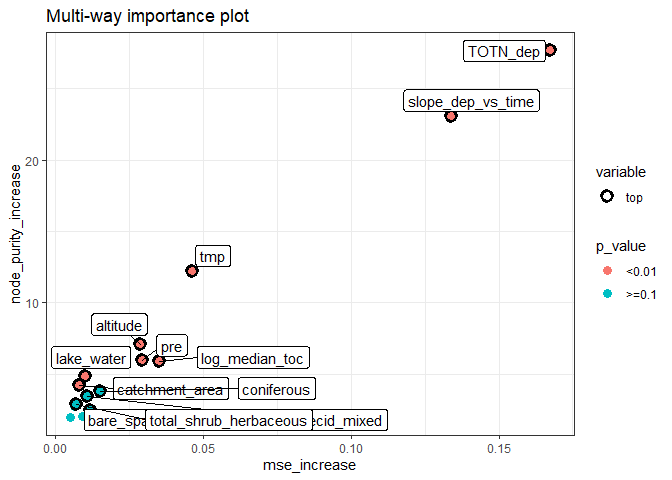
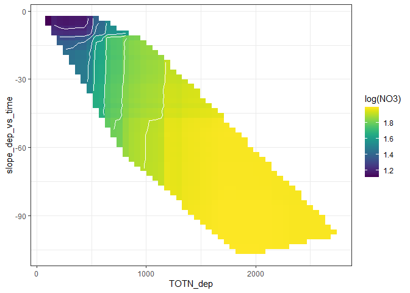
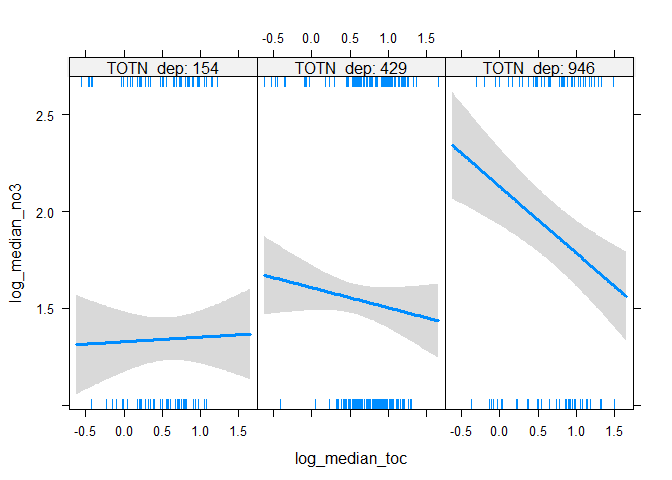
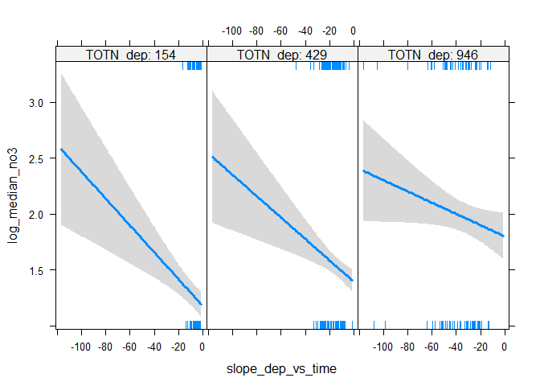
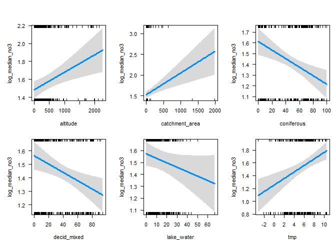
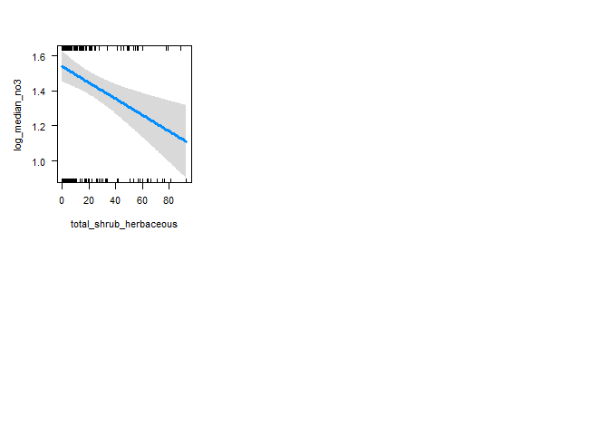

**Analysis of NO3 medians (2012-2016)**   

**Dataset: NO3 medians data set incl. catchment_area + TOC**   
**Name of dataset: medians_2012-2016_no3.csv**   


* Response variable: 'Current NO3 level' (locations with signif. *increase* are *not* excluded)  
* Data from https://github.com/JamesSample/icpw2/tree/master/thematic_report_2020/results      
* Sen slope of NO3, TOTN, TOC/TON etc. 1992-2016
* Response variable in all analyses are *whether NO3 decreases or not*     
* Predictors:
    - slope_dep_vs_time: Trend in Tot-N deposition 1992-2016    
    - NO3, TOTN_dep: Medians of NO3, TOTN_dep (Tot-N deposition) 1992-2016   
    - catchment_area (if included in data)      
    - TOC: Medians of TOC 1992-2016 (if included in data)     
    - pre, tmp: mean precipitation + temp   
    - Land cover 
  
Technical details: This html file was created was 

## 1. Libraries  

```r
# All of these packages cn be loaded at once using library(tidyverse). (I just like to be specific.)
library(dplyr)
library(tidyr)      # pivot_wider
library(purrr)      # 'map' functions  
library(lubridate)  
library(ggplot2)

# Too many packages, not all are used
library(mapview)
library(visreg)     # visreg
library(rkt)        # Theil -Sen Regression

library(MuMIn)      

# Trees and forests
library(party)                  # ctree
library(evtree)                 # evtree
library(randomForest)
library(randomForestExplainer)  # measure_importance, plot_multi_way_importance
library(pdp)                    # partial, autoplot

library(maps)
my_map <- map_data("world")

library(effects)    # handles lme models  
library(readxl)
library(readr)

knitr::opts_chunk$set(results = 'hold') # collect the results from a chunk  
knitr::opts_chunk$set(warning = FALSE)  

options(width = 95)
```


## 2. Data  
* The data part (part 2) is quite similar in scripts 160, 161 and 162 

### Available files

```
## Medians results: 'medians_2012-2016_no3.csv' ,n = 494 
## 
## Number of values per variable: 
## 
## Medians results: 'medians_2012-2016_toc_totn_no3.csv' ,n = 310 
## 
## Number of values per variable:
```

### James' trends and medians     

```r
#
# Median results 2012-2016  
#
folder <- "https://github.com/JamesSample/icpw2/raw/master/thematic_report_2020/results/medians_2012-2016"
file <- params$medians_filename
fn <- paste0(folder, "/", file)
df_medians <- read.csv(fn, encoding = "UTF-8")
cat("Medians results:", sQuote(file), ",n =", nrow(df_medians), "\n\n")  
cat("Number of values per variable: \n")
apply(!is.na(df_medians), 2, sum)
cat("\n")

# Station metadata
# WILL BE ADDED TOGETHER WITH LAND COVER, BELOW
# file_meta <- gsub(".csv", "_stations.csv", file)
# fn <- paste0(folder, "/", file_meta)
# df_metadata <- read.csv(fn, encoding = "UTF-8")
# cat("Regression result metadata:", sQuote(file_meta), ",n =",  
#      nrow(df_metadata), "\n\n")


#
# Regression results 1992-2016
#
folder <- "https://github.com/JamesSample/icpw2/raw/master/thematic_report_2020/results/trends_1992-2016_no3"
file <- "trends_1992-2016_no3_results.csv"
fn <- paste0(folder, "/", file)
df_trends <- read.csv(fn, encoding = "UTF-8")
cat("Trends used as predictor variable:", sQuote(file), ",n =", nrow(df_trends), "\n\n")
```

```
## Medians results: 'medians_2012-2016_no3.csv' ,n = 494 
## 
## Number of values per variable: 
##   station_id NH4.N_µg.l.N NO3.N_µg.l.N   TOC_mg.C.l  TOTN_µg.l.N  TOTP_µg.l.P   TON_µg.l.N 
##          494          382          494          487          316          365          231 
##    TOTN.TOTP     NO3.TOTP      TOC.TON     TOC.TOTP 
##          235          364          227          357 
## 
## Trends used as predictor variable: 'trends_1992-2016_no3_results.csv' ,n = 3176
```
### Start 'dat'  
Using medians    
* Make one line per station   
* Also including some trends for  

```r
# table(reg_no3$variable)

# Medians 2012-2016  
df1 <- df_medians %>%
  select(station_id, `NO3.N_µg.l.N`, `TOTN_µg.l.N`, `TON_µg.l.N`, `TOC_mg.C.l`, TOC.TON) %>%
  rename(median_no3 = `NO3.N_µg.l.N`,
         median_totn = `TOTN_µg.l.N`,
         median_ton = `TON_µg.l.N`,
         median_toc = `TOC_mg.C.l`,
         median_tocton = `TOC.TON`) %>%
  mutate(log_median_no3 = log10(median_no3 + 0.1),
         log_median_totn = log10(median_totn),
         log_median_ton = log10(median_ton),
         log_median_toc = log10(median_toc),
         log_median_tocton = log10(median_tocton))

# Some trends
df2 <- df_trends %>% # table()
  filter(variable %in% c("NO3-N_µg/l N", "TOTN_µg/l N", "TOC_mg C/l")) %>%
  select(station_id, variable, median) %>%
  tidyr::pivot_wider(names_from = "variable", values_from = "median") %>% # str()
  rename(trend_NO3 = `NO3-N_µg/l N`,
         trend_TOTN = `TOTN_µg/l N`,
         trend_TOC = `TOC_mg C/l`)

cat("\n")
cat("df1, n =", nrow(df1), "\n")
cat("df2, n =", nrow(df2), "\n")

dat <- df1 %>%
  left_join(df2, by = "station_id")

cat("dat, n =", nrow(dat), "\n")
```

```
## 
## df1, n = 494 
## df2, n = 498 
## dat, n = 494
```

### Deposition trends 1992-2006 and median 2012-2016      

```r
fn <- "https://github.com/JamesSample/icpw2/raw/master/thematic_report_2020/results/deposition/totn_dep_trends_icpw_stns.csv"  

# For trends
df_deposition <- read.csv(fn) %>% 
  filter(variable == "totn_mgNpm2" & !is.na(sen_slp)) %>%
  select(station_id, sen_slp, mk_p_val) %>%
              rename(slope_dep_vs_time = sen_slp,
                     p_dep_vs_time = mk_p_val) 

cat("n =", nrow(df_deposition), "\n")

# Deposition medians 2012-2016
fn <- "K:/Prosjekter/langtransporterte forurensninger/O-23300 - ICP-WATERS - HWI/Faglige rapporter/2020 report/Deposition data/Processed/dep_TOTN.csv"
df_deposition_medians <- read_csv(fn) %>%
  filter(year %in% 2012:2016) %>%
  group_by(station_id) %>%
  summarize(TOTN_dep = median(TOTN_dep))
```

```
## Parsed with column specification:
## cols(
##   station_id = col_double(),
##   year = col_double(),
##   TOTN_dep = col_double()
## )
```

```r
df_deposition <- df_deposition %>%
  left_join(df_deposition_medians)
```

```
## Joining, by = "station_id"
```

```r
cat("n =", nrow(df_deposition), "\n")

xtabs(~is.na(TOTN_dep), df_deposition)
```

```
## n = 556 
## n = 556 
## is.na(TOTN_dep)
## FALSE 
##   556
```

### Add deposition slope and medians to data  

```r
dat <- dat %>% 
  left_join(df_deposition,
                 by = "station_id")

cat("dat, n =", nrow(dat), "\n")

# names(dat)
```

```
## dat, n = 494
```


### Add climate medians   

```r
fn <- "https://github.com/JamesSample/icpw2/raw/master/thematic_report_2020/results/climate/cru_climate_trends_icpw_stns.csv"
df_climate_mean <- read_csv(fn) %>%
  select(station_id, variable, median) %>%
  pivot_wider(names_from = "variable", values_from = "median")
```

```
## Parsed with column specification:
## cols(
##   station_id = col_double(),
##   variable = col_character(),
##   median = col_double(),
##   mk_p_val = col_double(),
##   mk_trend = col_character(),
##   sen_slp = col_double(),
##   sen_incpt = col_double(),
##   sen_trend = col_character()
## )
```

```r
# names(df_climate_mean)

# Add
dat <- dat %>%
  left_join(df_climate_mean, by = "station_id")

cat("dat, n =", nrow(dat), "\n")
```

```
## dat, n = 494
```


### Combine land cover types   
* Data including UK read using script 159  
* bare_sparse = bare_rock + sparsely_vegetated + glacier   
* Select: coniferous, deciduous, lake, mixed_forest, wetland, bare_sparse   

```r
df_landcover3 <- readRDS("Data/159_df_landcover3.rds")

df_landcover3 <- df_landcover3 %>%
  mutate(bare_sparse = bare_rock + sparsely_vegetated + glacier,
         decid_mixed = deciduous + mixed_forest,
         lake_water = lake + water_ex_lake) %>%
  select(-c(bare_rock, sparsely_vegetated, glacier, 
            deciduous, mixed_forest, 
            lake, water_ex_lake))
```


### Add land cover columns to main data    

```r
dat <- left_join(dat, 
                 df_landcover3, 
                 by = "station_id"
)

cat("dat, n =", nrow(dat), "\n")
```

```
## dat, n = 494
```


## 3. Plot data      


```r
gg <- ggplot(dat, aes(TOTN_dep, log_median_no3)) + 
  geom_point(aes(color = country)) +
  geom_hline(yintercept = 0, linetype = 2) + 
  geom_vline(xintercept = 0, linetype = 2) 
  
gg
```

<!-- -->


## 4. Select data   

### a. Selection of variables    
* Select variables to use, and thereby also cases

```r
get_data_for_analysis <- function(data, variable_string){
  variable_string <- gsub(" ", "", variable_string)
  variables <- strsplit(variable_string, split = ",")[[1]]
  # Check if all variables are there
  found <- variables %in% names(data)
  if (sum(!found) > 0)
    stop("Not all variables found in data:", 
      paste(variables[!found], collapse = " ,"), 
      "\n")
  # Data for analyses
  data[variables]
}

cat("-------------------------------------------------------------\n")
cat("Variables: \n")
cat(params$selected_vars)
cat("\n-------------------------------------------------------------\n")

# debugonce(get_data_for_analysis)
# df_analysis <- get_data_for_analysis(dat, vars)  
df_analysis <- get_data_for_analysis(dat, params$selected_vars)  

# names(dat) %>% paste(collapse = ", ")

cat("Number of missing values per variable: \n")
apply(is.na(df_analysis), 2, sum) 
cat("\n")

# What is missing? (long output)
if (FALSE){
dat %>% 
  split(.$country) %>%
  purrr::map(~apply(is.na(.), 2, mean))
}

cat("Number of complete observations: \n")
complete <- complete.cases(df_analysis)
table(complete)

cat("\n\n")
cat("Number of complete observations by country: \n")
table(dat$country, complete)

# Keep only complete cases
df_analysis <- df_analysis[complete.cases(df_analysis),]

cat("\n\n")
cat("Original data: n =", nrow(dat), "\n")
cat("Analysis: n =", nrow(df_analysis), "\n")
```

```
## -------------------------------------------------------------
## Variables: 
## log_median_no3,catchment_area, log_median_toc,slope_dep_vs_time, TOTN_dep, latitude, longitude, altitude,pre, tmp, urban, cultivated, coniferous, decid_mixed, total_shrub_herbaceous,wetland, lake_water, bare_sparse
## -------------------------------------------------------------
## Number of missing values per variable: 
##         log_median_no3         catchment_area         log_median_toc      slope_dep_vs_time 
##                      0                     78                      7                      0 
##               TOTN_dep               latitude              longitude               altitude 
##                      0                      0                      0                     11 
##                    pre                    tmp                  urban             cultivated 
##                      0                      0                     18                     18 
##             coniferous            decid_mixed total_shrub_herbaceous                wetland 
##                     27                     27                     18                     18 
##             lake_water            bare_sparse 
##                     18                     18 
## 
## Number of complete observations: 
## complete
## FALSE  TRUE 
##   117   377 
## 
## 
## Number of complete observations by country: 
##                 complete
##                  FALSE TRUE
##   Canada             0  115
##   Czech Republic     0    8
##   Estonia            1    0
##   Finland            0   23
##   Germany            0    3
##   Ireland            9    2
##   Italy              0    4
##   Latvia             0    5
##   Moldova            2    0
##   Netherlands        1    2
##   Norway             0   83
##   Poland             4    6
##   Slovakia           0   12
##   Sweden             0   92
##   Switzerland        9    0
##   United Kingdom     0   22
##   United States     91    0
## 
## 
## Original data: n = 494 
## Analysis: n = 377
```


### b. Correlations   

```r
gg <- GGally::ggcorr(df_analysis, method = c("complete.obs", "kendall"), label = TRUE) # +
gg + theme(plot.margin = unit(c(.8, 2, .8, 2.5), "cm"))
```

<!-- -->

```r
# SHOULD also workaccording to ?element_rect (update ggplot2?)
# gg + theme(plot.margin = margin(.6, .5, .6, 1.7, "cm"))
```


## 5. Tree and forest classification


### Split into training and validation data

```r
set.seed(123)

x <- runif(nrow(df_analysis))
train <- ifelse(x < 0.9, TRUE, FALSE)

train_set <- df_analysis[train,]  %>% 
  select(-longitude, - latitude) %>%
  as.data.frame()
valid_set <- df_analysis[!train,] %>% 
  select(-longitude, - latitude) %>%
  as.data.frame()

# plot(train_set)
```


### a. Tree classification using 'party'   

```r
# train_set$X <- 10^train_set$log_median_no3
# (ct = ctree(X ~ ., data = train_set))

(ct = ctree(as.formula(params$tree_formula), 
            data = train_set))

plot(ct, main="Conditional Inference Tree")
```

<!-- -->

```
## 
## Model formula:
## log_median_no3 ~ catchment_area + log_median_toc + slope_dep_vs_time + 
##     TOTN_dep + altitude + pre + tmp + urban + cultivated + coniferous + 
##     decid_mixed + total_shrub_herbaceous + wetland + lake_water + 
##     bare_sparse
## 
## Fitted party:
## [1] root
## |   [2] TOTN_dep <= 484.27
## |   |   [3] slope_dep_vs_time <= -2.5575
## |   |   |   [4] slope_dep_vs_time <= -7.80595
## |   |   |   |   [5] bare_sparse <= 0.053: 1.268 (n = 86, err = 5.4)
## |   |   |   |   [6] bare_sparse > 0.053
## |   |   |   |   |   [7] decid_mixed <= 16.891: 1.622 (n = 15, err = 0.9)
## |   |   |   |   |   [8] decid_mixed > 16.891: 1.275 (n = 15, err = 0.3)
## |   |   |   [9] slope_dep_vs_time > -7.80595
## |   |   |   |   [10] pre <= 684.99994: 0.755 (n = 15, err = 2.0)
## |   |   |   |   [11] pre > 684.99994
## |   |   |   |   |   [12] TOTN_dep <= 173.96889: 1.300 (n = 21, err = 0.5)
## |   |   |   |   |   [13] TOTN_dep > 173.96889: 0.978 (n = 25, err = 1.3)
## |   |   [14] slope_dep_vs_time > -2.5575: 0.409 (n = 16, err = 1.2)
## |   [15] TOTN_dep > 484.27
## |   |   [16] log_median_toc <= 0.30103
## |   |   |   [17] TOTN_dep <= 918.86
## |   |   |   |   [18] bare_sparse <= 58.569: 2.047 (n = 9, err = 0.2)
## |   |   |   |   [19] bare_sparse > 58.569: 2.405 (n = 13, err = 0.2)
## |   |   |   [20] TOTN_dep > 918.86: 2.584 (n = 7, err = 0.4)
## |   |   [21] log_median_toc > 0.30103
## |   |   |   [22] cultivated <= 5.276
## |   |   |   |   [23] TOTN_dep <= 770.35: 1.570 (n = 71, err = 11.4)
## |   |   |   |   [24] TOTN_dep > 770.35
## |   |   |   |   |   [25] altitude <= 99: 1.574 (n = 13, err = 2.3)
## |   |   |   |   |   [26] altitude > 99: 2.203 (n = 28, err = 4.1)
## |   |   |   [27] cultivated > 5.276: 2.244 (n = 8, err = 2.5)
## 
## Number of inner nodes:    13
## Number of terminal nodes: 14
```

### b. Evtree (Evolutionary Learning)   

```r
ev.raw = evtree(as.formula(params$tree_formula), 
                data = train_set)

plot(ev.raw)
```

<!-- -->


### c. Random forest  
* Model called 'model1'

```r
model1 <- randomForest(as.formula(params$tree_formula), 
                       data = train_set, 
                       mtry = 5,
                       importance = TRUE)

model1
```

```
## 
## Call:
##  randomForest(formula = as.formula(params$tree_formula), data = train_set,      mtry = 5, importance = TRUE) 
##                Type of random forest: regression
##                      Number of trees: 500
## No. of variables tried at each split: 5
## 
##           Mean of squared residuals: 0.1110355
##                     % Var explained: 66.46
```


#### c1. Predict on training data
Not relevant here  

#### c2. Importance of variables   
* Classification forests result in   
    - mean_min_depth   
    - accuracy_decrease  
    - gini_decrease  
    - no_of_nodes   
    - times_a_root      
* Regression forests result in     
    - mean_min_depth   
    - mse_increase  
    - node_purity_increase  
    - no_of_nodes   
    - times_a_root      

```r
# Calculation
importance <- measure_importance(model1)
```


```r
plot_multi_way_importance(importance, size_measure = "no_of_nodes", no_of_labels = 12)  
```

<!-- -->

```r
plot_multi_way_importance(importance, x_measure = "mse_increase", y_measure = "node_purity_increase",
                          size_measure = "p_value", no_of_labels = 12)
```

<!-- -->


#### c3. Random forest, show partial effects  


```r
# Which variables to include:
variables_for_plot <- importance %>%
  mutate(variable = levels(variable)[as.numeric(variable)]) %>%
  arrange(desc(mse_increase)) %>%    # gini_decrease for classification trees
  pull(variable) %>%
  head(12)   # pick the first 12 variables (or less)

# Calculation

plotdata <- NULL  # will be list for storing results

max_number_of_plots <- length(variables_for_plot)/2 %>% floor()

for (i in 1:max_number_of_plots){
  varno1 <- c(1,3,5,7,9,11)[i]
  varno2 <- varno1 + 1
  plotdata[[i]] <- model1 %>%
    partial(pred.var = variables_for_plot[c(varno1, varno2)], chull = TRUE, progress = "text",
            which.class = "1", prob = TRUE)
}
```


```r
### Extra plots

plotpairs <- params$extra_pairwise_plots %>%
  gsub(" ", "", ., fixed = TRUE) %>%
  strsplit(x, split = ";") %>%
  .[[1]] %>%
  purrr::map(~strsplit(., split = ",")[[1]])

for (plotvar in plotpairs){
  # print(plotvar)
  if (plotvar[1] %in% names(train_set) & plotvar[2] %in% names(train_set)){
    i <- i + 1
    plotdata[[i]] <- model1 %>%
      partial(pred.var = c(plotvar[1], plotvar[2]), chull = TRUE, progress = "text",
             which.class = "1", prob = TRUE)
  }
}
```


```r
# Plot the plots 
for (i in 1:max_number_of_plots){
  autoplot(plotdata[[i]], contour = TRUE, legend.title = "log(NO3)") %>%
    print()
}
```

<!-- --><!-- --><!-- --><!-- --><!-- --><!-- -->


## 6. Linear regression      

```r
fm <- lm(
  as.formula(params$logistic_formula),
  data = df_analysis, 
  na.action = "na.fail")

dredged_models <- dredge(fm)                       # only once
```

```
## Fixed term is "(Intercept)"
```

```r
# saveRDS(dredged_models, "Data/162_all_dredged_models.rds")    # save it as it takes a couple of minutes
# dredged_models <- readRDS("Data/162_all_dredged_models.rds")

# cat("\n\nR2: \n")
# mod1 <- get.models(dredged_models, 1)[[1]]  
# summary(mod1)  
```

### Best models  

```r
# subset(dredged_models, delta < 1)

subset(dredged_models, delta < 2)

# Alternative way of showing result (didn't become any better)
# df <- subset(dredged_models, delta < 2)
# select(as.data.frame(df) %>% round(6), -`(Intercept)`, -logLik, -AICc)
```

```
## Global model call: lm(formula = as.formula(params$logistic_formula), data = df_analysis, 
##     na.action = "na.fail")
## ---
## Model selection table 
##        (Int)       alt  bar_spr   ctc_are        cnf   dcd_mxd   lak_wtr log_mdn_toc       pre
## 16254 0.8395 0.0001941          0.0005256 -0.0039710 -0.003077 -0.003734     0.09532          
## 16224 0.6273 0.0001530 0.003192 0.0005384 -0.0031250 -0.002236               0.20180          
## 16256 0.7337 0.0001471 0.002584 0.0005190 -0.0033180 -0.002367 -0.003056     0.15340          
## 15176 0.4285 0.0001350 0.005234 0.0005363                                    0.14210          
## 16222 0.7345 0.0002160          0.0005527 -0.0039210 -0.003123               0.14000          
## 16208 0.4984 0.0001390 0.004689 0.0005438 -0.0014140                         0.14990          
## 15184 0.4276 0.0001343 0.005202 0.0005390 -0.0009819                         0.18660          
## 16382 0.8764 0.0001933          0.0005158 -0.0040880 -0.003024 -0.004019     0.08575 -3.05e-05
##       slp_dep_vs_tim     tmp ttl_shr_hrb  TOT_dep log_mdn_toc:TOT_dep slp_dep_vs_tim:TOT_dep
## 16254       -0.01336 0.05100   -0.004612 0.001136          -0.0004636              8.811e-06
## 16224       -0.01325 0.04942   -0.003415 0.001255          -0.0005221              9.560e-06
## 16256       -0.01293 0.04989   -0.003741 0.001200          -0.0004902              8.985e-06
## 15176       -0.01043 0.06156             0.001264          -0.0004972              8.865e-06
## 16222       -0.01389 0.05072   -0.004457 0.001188          -0.0004967              9.499e-06
## 16208       -0.01292 0.05336   -0.001817 0.001260          -0.0004796              9.743e-06
## 15184       -0.01209 0.05683             0.001283          -0.0004981              9.629e-06
## 16382       -0.01354 0.05464   -0.004588 0.001113          -0.0004681              8.724e-06
##       df   logLik  AICc delta weight
## 16254 14 -155.861 340.9  0.00  0.186
## 16224 14 -155.919 341.0  0.12  0.176
## 16256 15 -154.909 341.1  0.27  0.163
## 15176 11 -159.538 341.8  0.92  0.118
## 16222 13 -157.441 341.9  1.00  0.113
## 16208 13 -157.716 342.4  1.55  0.086
## 15184 12 -158.798 342.5  1.57  0.085
## 16382 15 -155.682 342.7  1.81  0.075
## Models ranked by AICc(x)
```


### Plots  

```r
# Pick model with lowest AICc
mod1 <- get.models(dredged_models, 1)[[1]]  

modelvars <- get_model_variables(mod1)

# Interactions: 2D plot 
if (length(modelvars$interaction_list) > 0){
  modelvars$interaction_list %>% purrr::walk(
    ~visreg(mod1, .x[1], by = .x[2], scale = "response")
  )
}
```

<!-- --><!-- -->

```r
# Additive effects: 1D plot
if (length(modelvars$additive_vars) > 0){
  par(mfrow = c(2,3), mar = c(4,5,2,1), oma = c(0,0,2,0))
  for (var in modelvars$additive_vars)
    visreg(mod1, var, scale = "response")  
}
```

<!-- --><!-- -->

```
## Conditions used in construction of plot
## catchment_area: 3.413
## coniferous: 21.008
## decid_mixed: 11.531
## lake_water: 11.993
## log_median_toc: 0.7604225
## slope_dep_vs_time: -13.92201
## tmp: 5.425001
## total_shrub_herbaceous: 2.409
## TOTN_dep: 429.2518
## Conditions used in construction of plot
## altitude: 220
## coniferous: 21.008
## decid_mixed: 11.531
## lake_water: 11.993
## log_median_toc: 0.7604225
## slope_dep_vs_time: -13.92201
## tmp: 5.425001
## total_shrub_herbaceous: 2.409
## TOTN_dep: 429.2518
## Conditions used in construction of plot
## altitude: 220
## catchment_area: 3.413
## decid_mixed: 11.531
## lake_water: 11.993
## log_median_toc: 0.7604225
## slope_dep_vs_time: -13.92201
## tmp: 5.425001
## total_shrub_herbaceous: 2.409
## TOTN_dep: 429.2518
## Conditions used in construction of plot
## altitude: 220
## catchment_area: 3.413
## coniferous: 21.008
## lake_water: 11.993
## log_median_toc: 0.7604225
## slope_dep_vs_time: -13.92201
## tmp: 5.425001
## total_shrub_herbaceous: 2.409
## TOTN_dep: 429.2518
## Conditions used in construction of plot
## altitude: 220
## catchment_area: 3.413
## coniferous: 21.008
## decid_mixed: 11.531
## log_median_toc: 0.7604225
## slope_dep_vs_time: -13.92201
## tmp: 5.425001
## total_shrub_herbaceous: 2.409
## TOTN_dep: 429.2518
## Conditions used in construction of plot
## altitude: 220
## catchment_area: 3.413
## coniferous: 21.008
## decid_mixed: 11.531
## lake_water: 11.993
## log_median_toc: 0.7604225
## slope_dep_vs_time: -13.92201
## total_shrub_herbaceous: 2.409
## TOTN_dep: 429.2518
## Conditions used in construction of plot
## altitude: 220
## catchment_area: 3.413
## coniferous: 21.008
## decid_mixed: 11.531
## lake_water: 11.993
## log_median_toc: 0.7604225
## slope_dep_vs_time: -13.92201
## tmp: 5.425001
## TOTN_dep: 429.2518
```


