**Analysis of TOC/TON decrease (categorical, "decrease or not"), based on James' trend results**   
This script is identical to 161 except that a different data set is used for deposition medians     
  
**Dataset: all variables except TOC and TON slopes**   

As 160, but analysing the trend in TOC/TON ratio

* Response variable: 'Significant decrease in TOC/TON ratio' (locations with signif. *decrease* are *not* excluded)  
* Data from https://github.com/JamesSample/icpw2/tree/master/thematic_report_2020/results      
* Sen slope of NO3, TOTN, TOC/TON etc. 1992-2016
* Response variable in all analyses are *whether TOC/TON decreases or not*     
* Predictors:
    - slope_toc_vs_time, slope_ton_vs_time  
    - TOC: Medians of TOC 1992-2016     
    - TON: Medians of TOC 1992-2016   
    - NO3, TOTN_dep: Medians of NO3, TOTN_dep (Tot-N deposition) 1992-2016   
    - catchment_area (if included in data)      
    - pre, tmp: mean precipitation + temp   
    - Land cover 
  
Technical details: This html file was created with `163parm_Time_series_tocton.Rmd` run with `163parm_run_markdown.R`    
Code: https://github.com/DagHjermann/icpw-R  

## 1. Libraries  

```r
# All of these packages cn be loaded at once using library(tidyverse). (I just like to be specific.)
library(dplyr)
library(tidyr)      # pivot_wider
library(purrr)      # 'map' functions  
library(lubridate)  
library(ggplot2)

# Too many packages, not all are used
# library(mapview)
library(visreg)     # visreg
library(rkt)        # Theil -Sen Regression

library(MuMIn)      

# Trees and forests
library(party)                  # ctree
library(evtree)                 # evtree
library(randomForest)
library(randomForestExplainer)  # measure_importance, plot_multi_way_importance
library(pdp)                    # partial, autoplot

library(maps)
my_map <- map_data("world")

library(effects)    # handles lme models  
library(readxl)
library(readr)

source("002_Functions.R")
source("160parm_functions.R")

knitr::opts_chunk$set(results = 'hold') # collect the results from a chunk  
knitr::opts_chunk$set(warning = FALSE)  

options(width = 95)
```


## 2. Data

### James' trends and medians     

```r
#
# Regression results
#
folder <- "https://github.com/JamesSample/icpw2/raw/master/thematic_report_2020/results/trends_1992-2016_toc_totn_no3_relax_italy"
file <- "trends_1992-2016_toc_totn_no3_relax_italy_results.csv"
fn <- paste0(folder, "/", file)

reg_ratio_161 <- read.csv(fn, encoding = "UTF-8")
cat("Regression slopes and medians from:", sQuote(file), ",n =", nrow(reg_ratio_161), "\n\n")

# Station metadata
# THESE WILL BE ADDED WITH LAND COVER  
```

```
## Regression slopes and medians from: 'trends_1992-2016_toc_totn_no3_relax_italy_results.csv' ,n = 2418
```


### James' trends and medians  
From   
https://github.com/JamesSample/icpw2/tree/master/thematic_report_2020/results/trends_2000-2016_totn_no3   
While 


```r
#
# Regression results used in script 161
#
folder_161 <- "https://github.com/JamesSample/icpw2/raw/master/thematic_report_2020/results/trends_1992-2016_toc_totn_no3_relax_italy"
file_161 <- "trends_1992-2016_toc_totn_no3_relax_italy_results.csv"
fn_161 <- paste0(folder_161, "/", file_161)
reg_ratio_161 <- read.csv(fn_161, encoding = "UTF-8")

#
# Regression results
#

folder <- "https://raw.githubusercontent.com/JamesSample/icpw2/master/thematic_report_2020/results/trends_2000-2016_totn_no3"
file <- "trends_2000-2016_totn_no3_results.csv"
fn <- paste0(folder, "/", file)

reg_ratio <- read.csv(fn, encoding = "UTF-8")
cat("Regression slopes and medians from:", sQuote(file), ",n =", nrow(reg_ratio), "\n\n")

cat("------------------------------------------------------\n") 
cat("FOR COMPARISON: input data used in script 161:\n") 
cat("Regression slopes and medians from:", sQuote(file_161), ",n =", nrow(reg_ratio_161), "\n\n")

# Station metadata
# THESE WILL BE ADDED WITH LAND COVER  
```

```
## Regression slopes and medians from: 'trends_2000-2016_totn_no3_results.csv' ,n = 2630 
## 
## ------------------------------------------------------
## FOR COMPARISON: input data used in script 161:
## Regression slopes and medians from: 'trends_1992-2016_toc_totn_no3_relax_italy_results.csv' ,n = 2418
```

### Start 'dat'  

With slope regression data  
* Make one line per station  

```r
# table(reg_ratio$variable)

# Slope 
df1 <- reg_ratio %>%
  filter(variable %in% c("NO3-N_µg/l N", "TOC/TON", "TOC_mg C/l", "TON_µg/l N")) %>%
  select(station_id, variable, sen_slp) %>%
  tidyr::pivot_wider(names_from = "variable", values_from = "sen_slp") %>%
  rename(slope_no3_vs_time = `NO3-N_µg/l N`, 
         slope_tocton_vs_time = `TOC/TON`,
         slope_toc_vs_time = `TOC_mg C/l`,
         slope_ton_vs_time = `TON_µg/l N`)

# Slope p-value
df2 <- reg_ratio %>%
  filter(variable %in% c("NO3-N_µg/l N", "TOC/TON", "TOC_mg C/l", "TON_µg/l N")) %>%
  select(station_id, variable, mk_p_val) %>%
  tidyr::pivot_wider(names_from = "variable", values_from = "mk_p_val") %>%
  rename(p_no3_vs_time = `NO3-N_µg/l N`, 
         p_tocton_vs_time = `TOC/TON`,
         p_toc_vs_time = `TOC_mg C/l`,
         p_ton_vs_time = `TON_µg/l N`)

# Medians
df3 <- reg_ratio %>%
  filter(variable %in% c("NO3-N_µg/l N", "TOC/TON", "TOC_mg C/l", "TON_µg/l N")) %>%
  select(station_id, variable, median) %>%
  tidyr::pivot_wider(names_from = "variable", values_from = "median") %>%
  rename(NO3 = `NO3-N_µg/l N`,
         TOCTON = `TOC/TON`,
         TOC = `TOC_mg C/l`,
         TON = `TON_µg/l N`)

cat("\n")
cat("df1, n =", nrow(df1), " (number of rows for slopes, including NA values in toc/ton slope)\n")
cat("df2, n =", nrow(df2), "\n")
cat("df3, n =", nrow(df3), "\n")

dat_1_all <- df1 %>%
  full_join(df2, by = "station_id") %>%
  full_join(df3, by = "station_id")

cat("dat_1_all, n =", nrow(dat_1_all), " (includes series without toc/ton)\n")

dat_1 <- dat_1_all %>%
  filter(!is.na(slope_tocton_vs_time))

cat("dat_1, n =", nrow(dat_1), " (all data with existing values of 'slope_tocton_vs_time')\n")
```

```
## 
## df1, n = 312  (number of rows for slopes, including NA values in toc/ton slope)
## df2, n = 312 
## df3, n = 312 
## dat_1_all, n = 312  (includes series without toc/ton)
## dat_1, n = 302  (all data with existing values of 'slope_tocton_vs_time')
```

### Deposition trends and median 1992-2006     

```r
fn <- "https://github.com/JamesSample/icpw2/raw/master/thematic_report_2020/results/deposition/totn_dep_trends_icpw_stns.csv"  

df_deposition <- read.csv(fn) %>% 
  filter(variable == "totn_mgNpm2")  

cat("n =", nrow(df_deposition), "\n")
```

```
## n = 556
```


### Add deposition slope and medians to data  

```r
# debugonce(left_join2)
dat_2 <- dat_1 %>% 
  left_join2(df_deposition %>% 
              select(station_id, median, sen_slp, mk_p_val) %>%
              rename(TOTN_dep = median,
                     slope_dep_vs_time = sen_slp,
                     p_dep_vs_time = mk_p_val),
             by = "station_id",
             print_vars = TRUE)
```

```
## Variables before join: 
## 'station_id', 'slope_no3_vs_time', 'slope_ton_vs_time', 'slope_toc_vs_time', 'slope_tocton_vs_time', 'p_no3_vs_time', 'p_ton_vs_time', 'p_toc_vs_time', 'p_tocton_vs_time', 'NO3', 'TON', 'TOC', 'TOCTON'
## 
## Variables used to join: 
## 'station_id'
## 
## Variables added: 
## 'TOTN_dep', 'slope_dep_vs_time', 'p_dep_vs_time'
```

### Add medians and station metadata   


```r
# dat_2 <- dat_2 %>%
#   left_join(df_metadata, by = "station_id")

# cat("dat_2, n =", nrow(dat_2), "\n")

# Simplify names by removing units
# names(dat_2)
# names(dat_2) <- sub(".N_µg.l.N", "", names(dat_2))
# names(dat_2) <- sub("_mg.C.l", "", names(dat_2))
# names(dat_2) <- sub("_µg.l.P", "", names(dat_2))

# cat("\nVariable names: \n")
# names(dat_2)
```

### Add climate and deposition medians and slopes  

```r
fn <- "https://github.com/JamesSample/icpw2/raw/master/thematic_report_2020/results/climate/cru_climate_trends_icpw_stns.csv"

df_climate <- read_csv(fn, 
                       col_types = cols(
                         station_id = col_double(),
                         variable = col_character(),
                         median = col_double(),
                         mk_p_val = col_double(),
                         mk_trend = col_character(),
                         sen_slp = col_double(),
                         sen_incpt = col_double(),
                         sen_trend = col_character()
                       ))
                            
df_climate_mean <- df_climate %>% 
  select(station_id, variable, median) %>%
  pivot_wider(names_from = "variable", values_from = "median")
cat("\n")
# names(df_climate_mean)

df_climate_slope <- df_climate %>%
  select(station_id, variable, sen_slp) %>%
  pivot_wider(names_from = "variable", values_from = "sen_slp", names_prefix = "slope_")

# Add
dat_3 <- dat_2 %>%
  left_join2(df_climate_mean, by = "station_id", print_vars = TRUE) %>%
  left_join2(df_climate_slope, by = "station_id", print_vars = TRUE)
```

```
## 
## Variables before join: 
## 'station_id', 'slope_no3_vs_time', 'slope_ton_vs_time', 'slope_toc_vs_time', 'slope_tocton_vs_time', 'p_no3_vs_time', 'p_ton_vs_time', 'p_toc_vs_time', 'p_tocton_vs_time', 'NO3', 'TON', 'TOC', 'TOCTON', 'TOTN_dep', 'slope_dep_vs_time', 'p_dep_vs_time'
## 
## Variables used to join: 
## 'station_id'
## 
## Variables added: 
## 'pre', 'tmp'
## Variables before join: 
## 'station_id', 'slope_no3_vs_time', 'slope_ton_vs_time', 'slope_toc_vs_time', 'slope_tocton_vs_time', 'p_no3_vs_time', 'p_ton_vs_time', 'p_toc_vs_time', 'p_tocton_vs_time', 'NO3', 'TON', 'TOC', 'TOCTON', 'TOTN_dep', 'slope_dep_vs_time', 'p_dep_vs_time', 'pre', 'tmp'
## 
## Variables used to join: 
## 'station_id'
## 
## Variables added: 
## 'slope_pre', 'slope_tmp'
```

### Combine land cover types   
* Data including UK read using script 159   
* Note: also includes metadata (country, etc.)
* bare_sparse = bare_rock + sparsely_vegetated + glacier   
* Select: coniferous, deciduous, lake, mixed_forest, wetland, bare_sparse   


```r
# df_landcover3_OLD <- readRDS("Data/159_df_landcover3.rds")
df_landcover3 <- readRDS("Data/159_df_meta3.rds")

df_landcover3 <- df_landcover3 %>%
  mutate(bare_sparse = bare_rock + sparsely_vegetated + glacier,
         decid_mixed = deciduous + mixed_forest,
         lake_water = lake + water_ex_lake) %>%
  select(-c(bare_rock, sparsely_vegetated, glacier, deciduous, mixed_forest, lake, water_ex_lake))
```


### Add land cover columns to main data    

```r
dat_4 <- left_join2(dat_3, 
                   df_landcover3, 
                   by = "station_id", 
                   print_vars = TRUE
)
```

```
## Variables before join: 
## 'station_id', 'slope_no3_vs_time', 'slope_ton_vs_time', 'slope_toc_vs_time', 'slope_tocton_vs_time', 'p_no3_vs_time', 'p_ton_vs_time', 'p_toc_vs_time', 'p_tocton_vs_time', 'NO3', 'TON', 'TOC', 'TOCTON', 'TOTN_dep', 'slope_dep_vs_time', 'p_dep_vs_time', 'pre', 'tmp', 'slope_pre', 'slope_tmp'
## 
## Variables used to join: 
## 'station_id'
## 
## Variables added: 
## 'station_code', 'station_name', 'latitude', 'longitude', 'altitude', 'continent', 'country', 'region', 'group', 'catchment_area', 'urban', 'cultivated', 'total_forest', 'coniferous', 'total_shrub_herbaceous', 'grasslands', 'heathlands', 'transitional_woodland_shrub', 'wetland', 'other', 'bare_sparse', 'decid_mixed', 'lake_water'
```
### Drop locations with >5% cultivated and >5% urban     
- also excluding stations 23517, 38273    

```r
cultivated_threshold <- 5
urban_threshold <- 5

dat_5 <- dat_4 %>%
  filter2(!station_id %in% c(23517, 38273), text = "Deleted stations 23517, 38273") %>%
  filter2(cultivated <= cultivated_threshold, 
          text = paste("Deleted stations with >", cultivated_threshold, "% cultivated")) %>%
  filter2(urban <= urban_threshold, 
          text = paste("Deleted stations with >", urban_threshold, "% urban"))
```

```
## Removed 1 rows (Deleted stations 23517, 38273)
## Removed 17 rows (Deleted stations with > 5 % cultivated)
## Removed 5 rows (Deleted stations with > 5 % urban)
```


### Data set used  

```r
dat <- dat_5
```


## 3. Plot slopes    


```r
dat <- dat %>%
  mutate(AtlCan = ifelse(region == "AtlCan", "AtlCan", "Not AtlCan"))

ggplot(dat, aes(slope_toc_vs_time, slope_tocton_vs_time)) + 
  geom_point(data = dat %>% filter(slope_tocton_vs_time < 0.05), size = rel(2)) +
  geom_point(aes(color = country)) +
  geom_hline(yintercept = 0, linetype = 2) + 
  geom_vline(xintercept = 0, linetype = 2) +
  facet_wrap(vars(AtlCan))
```

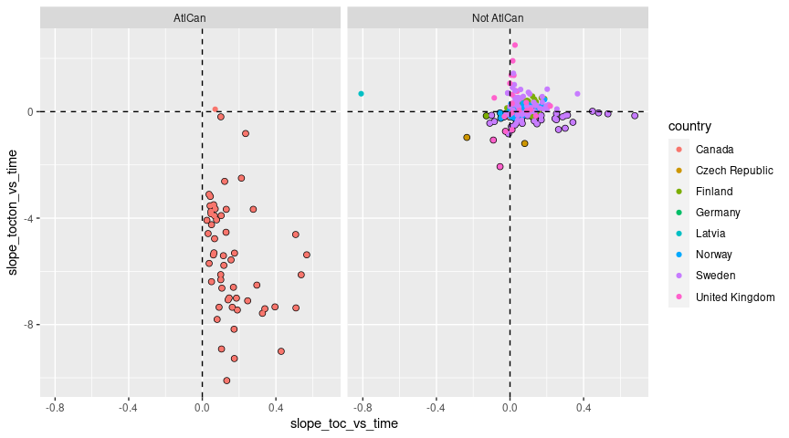<!-- -->

```r
ggplot(dat, aes(slope_ton_vs_time, slope_tocton_vs_time)) + 
  geom_point(data = dat %>% filter(slope_tocton_vs_time < 0.05), size = rel(2)) +
  geom_point(aes(color = country)) +
  geom_hline(yintercept = 0, linetype = 2) + 
  geom_vline(xintercept = 0, linetype = 2)  +
  facet_wrap(vars(AtlCan))
```

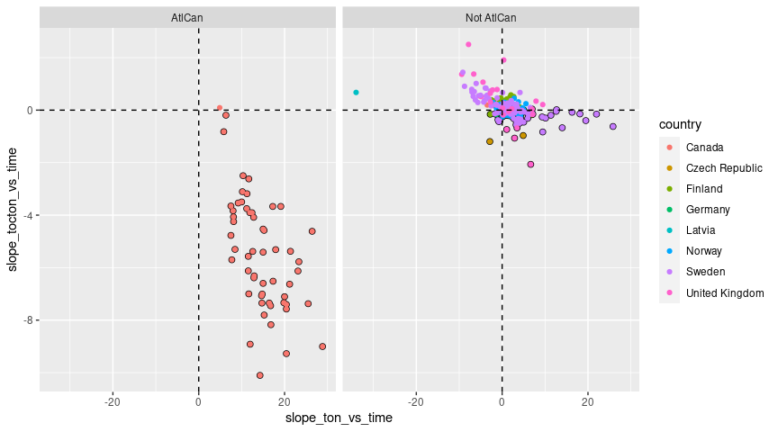<!-- -->

```r
ggplot(dat, aes(slope_dep_vs_time, slope_tocton_vs_time)) + 
  geom_point(data = dat %>% filter(slope_tocton_vs_time < 0.05), size = rel(2)) +
  geom_point(aes(color = country)) +
  geom_hline(yintercept = 0, linetype = 2) + 
  geom_vline(xintercept = 0, linetype = 2) +
  facet_wrap(vars(AtlCan)) 
```

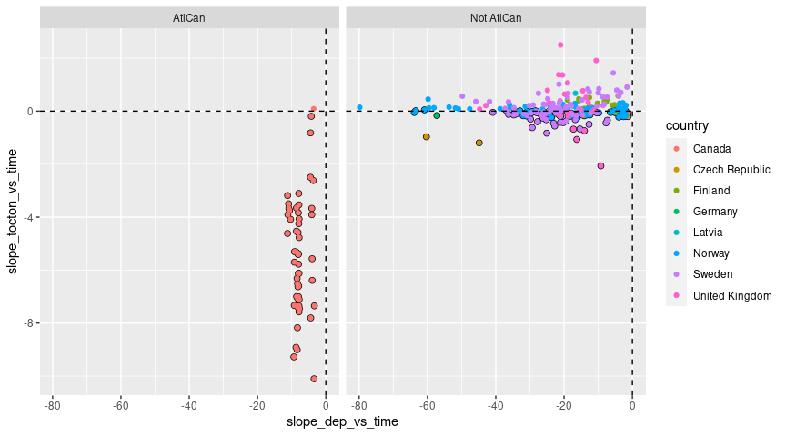<!-- -->

```r
if (FALSE){
dat %>%
  filter(!country %in% c("Latvia","Ireland","Italy","Netherlands")) %>%
  ggplot(aes(slope_dep_vs_time, slope_no3_vs_time,
             color = (p_no3_vs_time < 0.05))) + 
  geom_point() +
  facet_wrap(vars(country)) +
  geom_hline(yintercept = 0, linetype = 2) + 
  geom_vline(xintercept = 0, linetype = 2) + 
  labs(title = "A selection of countries") + 
  ylim(-50, 25)
}
```


## 4. Select data    
   
**See Section 2 - Drop locations... for data rows deleted before this part**    

### a. Select variables   
* Select variables to use, and thereby also cases   
* Also, 'AtlCan' data are excluded   
* Saves data both before and after rows with removing missing predictors are removed

```r
# Variables that will be included in excel output (removed afterwards)
vars_for_excel <- c("slope_tocton_vs_time", "station_id", "station_code", 
                    "station_name", "country", "region", "continent")

get_df_tocton_decrease <- function(data, variable_string){
  variable_string <- gsub(" ", "", variable_string)
  variables <- strsplit(variable_string, split = ",")[[1]]
  # Data for analyses
  df <- data %>%
    mutate(
      tocton_decrease = case_when(
        slope_tocton_vs_time < 0 & p_tocton_vs_time <= 0.05 ~ 1,
        TRUE ~ 0)
    )
  df[c(vars_for_excel, variables)]
}


table(dat$region)

cat("-------------------------------------------------------------\n")
cat("Variables: \n")
cat(params$selected_vars)
cat("\n-------------------------------------------------------------\n")

cat("\nStarting with partially filtered data - see 'Section 2 - Drop locations...' \n\n")

dat_filtered <- dat %>%
  filter2(region != "AtlCan" & country != "Italy", text = "Remove AtlCan and Italy")  

df_analysis_allrows <- get_df_tocton_decrease(dat_filtered, params$selected_vars)  

# Save to excel
fn <- paste0(substr(params$document_title, 1, 3), "_data.xlsx")
writexl::write_xlsx(df_analysis_allrows, paste0("Data_analysed/", fn))
cat("\nDataset at this point saved as", sQuote(fn), "\n\n")


# table(df_analysis_allrows$tocton_decrease)

# names(dat) %>% paste(collapse = ", ")

cat("Number of missing values per variable: \n")
apply(is.na(df_analysis_allrows), 2, sum) 
cat("\n")

# What is missing? (long output)
if (FALSE){
  dat %>% 
    split(.$country) %>%
    purrr::map(~apply(is.na(.), 2, mean))
}

cat("Number of complete observations: \n")
complete <- complete.cases(df_analysis_allrows)
table(complete)

cat("\n\n")
cat("Number of complete observations by country: \n")
table(df_analysis_allrows$country, complete)

# Keep only complete cases
df_analysis <- df_analysis_allrows[complete.cases(df_analysis_allrows),]

# Save to excel 
fn <- paste0(substr(params$document_title, 1, 5), "_data.xlsx")
writexl::write_xlsx(df_analysis, paste0("Data_analysed/", fn))

# Remove variables defined as 'vars_for_excel' in function above
sel <- names(df_analysis) %in% vars_for_excel
df_analysis <- df_analysis[!sel]

cat("\n\n")
cat("Data before removing AtlCan and Italy: n =", nrow(dat), " (also see 'Section 2 - Drop locations...')\n")
cat("Data after removing AtlCan and Italy: n =", nrow(df_analysis_allrows), "\n")
cat("Data after removing missing predictors: n =", nrow(df_analysis), "\n")
```

```
## 
##   AtlCan   Baltic      ECE   NoNord      Ont   SoNord UK-IE-NL      WCE 
##       55        1        2       51        7      140       22        1 
## -------------------------------------------------------------
## Variables: 
## tocton_decrease,catchment_area, TOC, TON, TOCTON,slope_pre, slope_tmp,slope_dep_vs_time, TOTN_dep, latitude, longitude, altitude,pre, tmp, urban, cultivated, coniferous, decid_mixed, total_shrub_herbaceous,wetland, lake_water, bare_sparse
## -------------------------------------------------------------
## 
## Starting with partially filtered data - see 'Section 2 - Drop locations...' 
## 
## Removed 55 rows (Remove AtlCan and Italy)
## 
## Dataset at this point saved as '163_data.xlsx' 
## 
## Number of missing values per variable: 
##   slope_tocton_vs_time             station_id           station_code           station_name 
##                      0                      0                      0                      0 
##                country                 region              continent        tocton_decrease 
##                      0                      0                      0                      0 
##         catchment_area                    TOC                    TON                 TOCTON 
##                      0                      0                      0                      0 
##              slope_pre              slope_tmp      slope_dep_vs_time               TOTN_dep 
##                      0                      0                      0                      0 
##               latitude              longitude               altitude                    pre 
##                      0                      0                      0                      0 
##                    tmp                  urban             cultivated             coniferous 
##                      0                      0                      0                      3 
##            decid_mixed total_shrub_herbaceous                wetland             lake_water 
##                      3                      0                      0                      0 
##            bare_sparse 
##                      0 
## 
## Number of complete observations: 
## complete
## FALSE  TRUE 
##     3   221 
## 
## 
## Number of complete observations by country: 
##                 complete
##                  FALSE TRUE
##   Canada             3    4
##   Czech Republic     0    2
##   Finland            0   24
##   Germany            0    1
##   Latvia             0    1
##   Norway             0   80
##   Sweden             0   87
##   United Kingdom     0   22
## 
## 
## Data before removing AtlCan and Italy: n = 279  (also see 'Section 2 - Drop locations...')
## Data after removing AtlCan and Italy: n = 224 
## Data after removing missing predictors: n = 221
```


### b. Correlations   

```r
gg <- GGally::ggcorr(
  df_analysis, 
  method = c("complete.obs", "kendall"), 
  label = TRUE,
  hjust = 0.9, angle = -30) # +
# class(gg)
gg + coord_cartesian(x = c(-2, 20), y = c(-2,22))
```

```
## Coordinate system already present. Adding new coordinate system, which will replace the existing one.
```

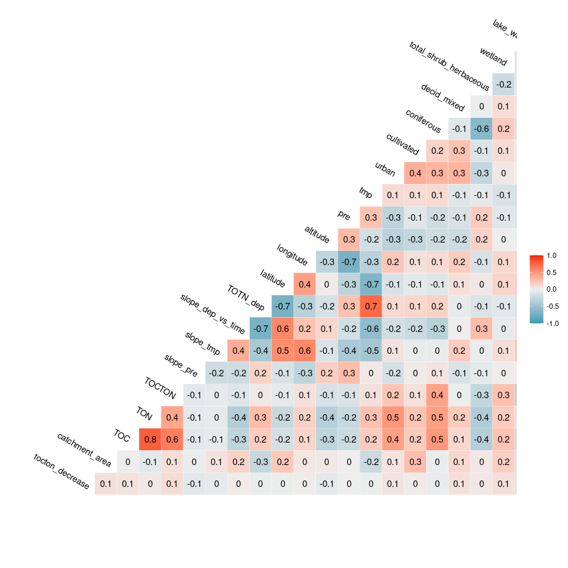<!-- -->


## 5. Tree and forest classification


### Split into training and validation data

```r
set.seed(123)

x <- runif(nrow(df_analysis))
train <- ifelse(x < 0.9, TRUE, FALSE)

train_set <- df_analysis[train,]  %>% 
  mutate(tocton_decrease_f = factor(tocton_decrease)) %>% select(-tocton_decrease, -longitude, - latitude) %>%
  as.data.frame()

valid_set <- df_analysis[!train,] %>% 
  mutate(tocton_decrease_f = factor(tocton_decrease)) %>% select(-tocton_decrease, -longitude, - latitude) %>%
  as.data.frame()
```


### a. Tree classification using 'party'   

```r
(ct = ctree(tocton_decrease_f ~ ., data = train_set))

plot(ct, main="Conditional Inference Tree")
```

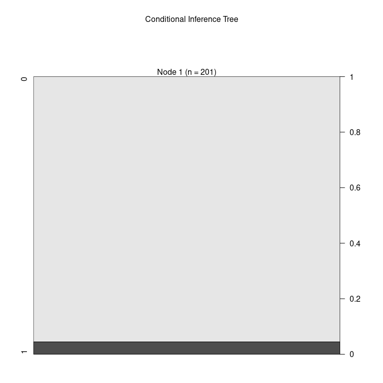<!-- -->

```r
cat("\n\n")
cat("Table of prediction errors \n")
table(predict(ct), train_set$tocton_decrease_f)
cat("\n\n")

cat("Classification of training set \n")
tr.pred = predict(ct, newdata = valid_set, type="prob")
colnames(tr.pred) <- c("P0", "P1")
# tr.pred <- tr.pred %>% map_dfr(~data.frame(P0 = .[1], P1 = .[2]))
table(tr.pred[,"P1"] > 0.5, valid_set$tocton_decrease_f)
```

```
## 
## Model formula:
## tocton_decrease_f ~ catchment_area + TOC + TON + TOCTON + slope_pre + 
##     slope_tmp + slope_dep_vs_time + TOTN_dep + altitude + pre + 
##     tmp + urban + cultivated + coniferous + decid_mixed + total_shrub_herbaceous + 
##     wetland + lake_water + bare_sparse
## 
## Fitted party:
## [1] root: 0 (n = 201, err = 4.5%) 
## 
## Number of inner nodes:    0
## Number of terminal nodes: 1
## 
## 
## Table of prediction errors 
##    
##       0   1
##   0 192   9
##   1   0   0
## 
## 
## Classification of training set 
##        
##          0
##   FALSE 20
```

### b. Evtree (Evolutionary Learning)   

```r
ev.raw = evtree(tocton_decrease_f ~ ., data = train_set)

plot(ev.raw)
```

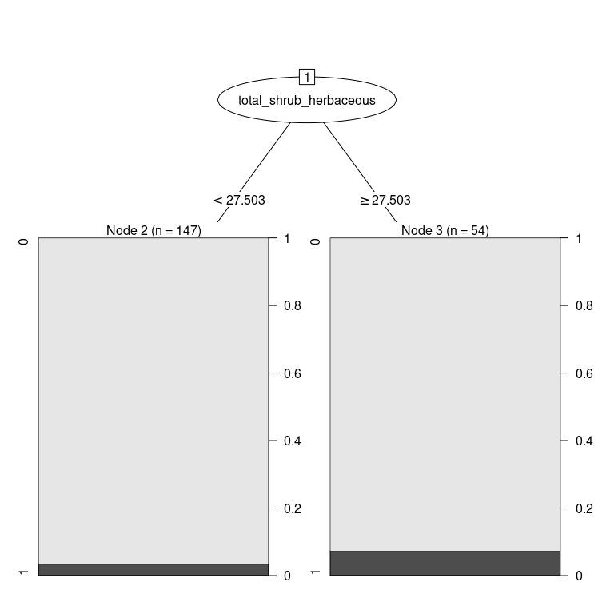<!-- -->

```r
cat("Predicted in training data: \n")
table(predict(ev.raw), train_set$tocton_decrease_f)

cat("\n\nPrediction errors in training data: \n")
1-mean(predict(ev.raw) == train_set$tocton_decrease_f)
```

```
## Predicted in training data: 
##    
##       0   1
##   0 192   9
##   1   0   0
## 
## 
## Prediction errors in training data: 
## [1] 0.04477612
```


### c. Random forest  
* *For results/interpretation, see separate document '160_randomforest_James_data.html'*  
* Model called 'model1'

```r
model1 <- randomForest(tocton_decrease_f ~ ., 
                       data = train_set, 
                       mtry = 5,
                       importance = TRUE)

model1
```

```
## 
## Call:
##  randomForest(formula = tocton_decrease_f ~ ., data = train_set,      mtry = 5, importance = TRUE) 
##                Type of random forest: classification
##                      Number of trees: 500
## No. of variables tried at each split: 5
## 
##         OOB estimate of  error rate: 4.48%
## Confusion matrix:
##     0 1 class.error
## 0 192 0           0
## 1   9 0           1
```


#### c1a. Predict on training data

```r
# Predicting on train set
pred_valid <- predict(model1, valid_set, type = "class")
# Checking classification accuracy
table(pred_valid, valid_set$tocton_decrease_f)  
```

```
##           
## pred_valid  0
##          0 20
##          1  0
```


#### c1b. Model for all data    

```r
full_set <- df_analysis  %>% 
  mutate(tocton_decrease_f = factor(tocton_decrease)) %>%
  select(-tocton_decrease, -longitude, - latitude) %>%
  as.data.frame()


# Predicting on full set
pred_valid <- predict(model1, valid_set, type = "class")

# Checking classification accuracy
table(pred_valid, valid_set$tocton_decrease_f)  
```

```
##           
## pred_valid  0
##          0 20
##          1  0
```


#### c2. Importance of variables

```r
# Calculation
importance <- measure_importance(model1)
```


```r
plot_multi_way_importance(importance, size_measure = "no_of_nodes", no_of_labels = 12)  
```

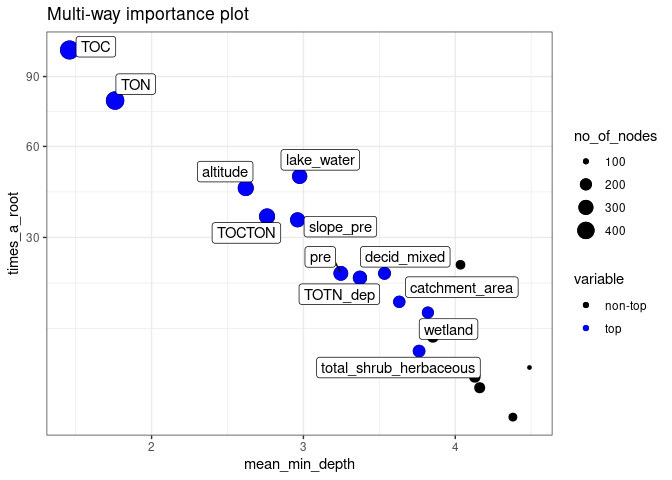<!-- -->

```r
plot_multi_way_importance(importance, x_measure = "accuracy_decrease", y_measure = "gini_decrease", 
                          size_measure = "p_value", no_of_labels = 12)
```

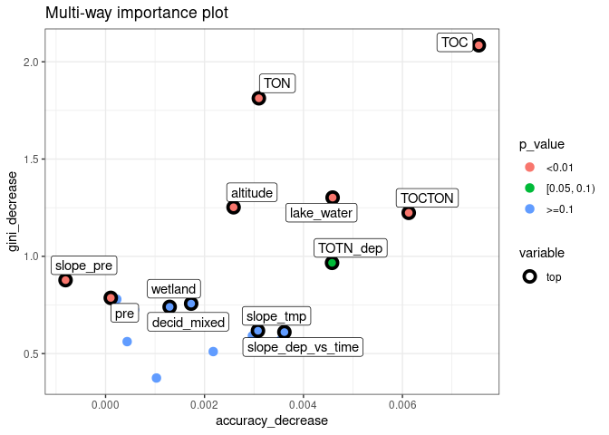<!-- -->


#### c3. Random forest, show partial effects  


```r
# Which variables to include:
variables_for_plot <- importance %>%
  mutate(variable = levels(variable)[as.numeric(variable)]) %>%
  arrange(desc(gini_decrease)) %>%
  pull(variable) %>%
  head(12)   # pick the first 12 variables (or less)

# Calculation

plotdata <- NULL  # will be list for storing results

max_number_of_plots <- length(variables_for_plot)/2 %>% floor()

for (i in 1:max_number_of_plots){
  varno1 <- c(1,3,5,7,9,11)[i]
  varno2 <- varno1 + 1
  plotdata[[i]] <- model1 %>%
    partial(pred.var = variables_for_plot[c(varno1, varno2)], chull = TRUE, progress = "text",
            which.class = "1", prob = TRUE)
}
```


```r
# Find range of predicted values for each graph
ranges <- plotdata %>% purrr::map_dfc(~range(.$yhat))
```

```
## New names:
## * NA -> ...1
## * NA -> ...2
## * NA -> ...3
## * NA -> ...4
## * NA -> ...5
## * ...
```

```r
# use range of all the ranges
for (i in 1:length(plotdata)){
  
  if (params$pairwise_plots_same_scale == "TRUE"){
  
    gg <- plot_pair_number(i, zrange = range(ranges))
    print(gg)
    
  } else {
    
    gg <- plot_pair_number(i)
    print(gg)

  }
  
}
```

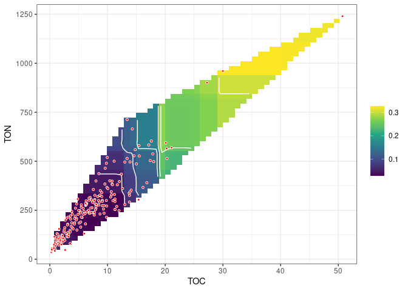<!-- -->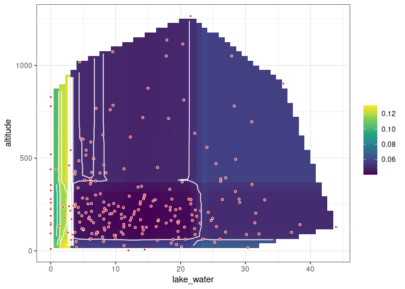<!-- -->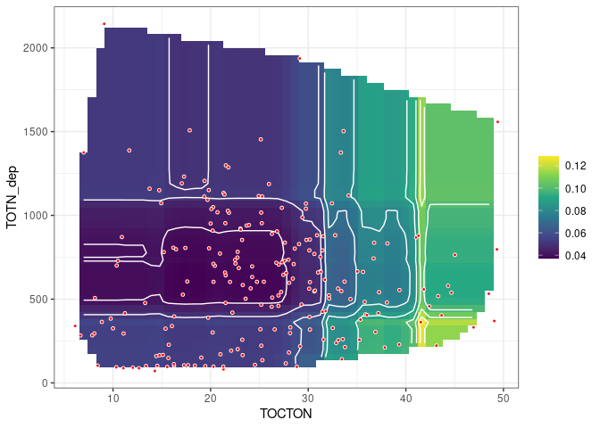<!-- -->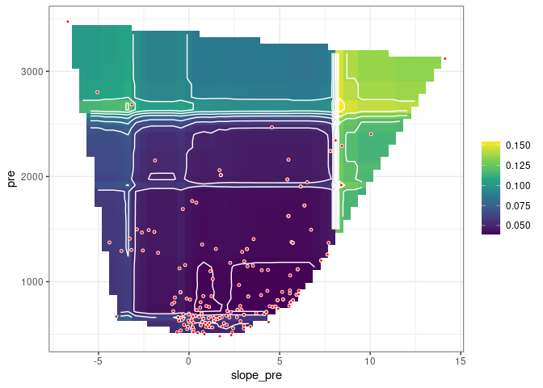<!-- -->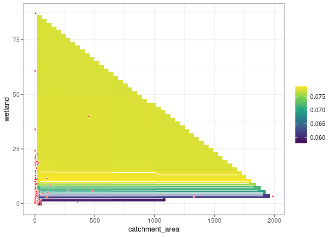<!-- -->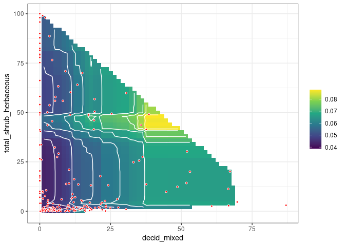<!-- -->


## 6. Logistic regression      

```r
#   tocton_decrease ~ as.formula(params$logistic_formula),
# 
# form <- "tocton_decrease ~ slope_dep_vs_time + slope_ton_vs_time + TOTN_dep + total_shrub_herbaceous + decid_mixed"
#  + slope_toc_vs_time ??

fm <- glm(
  # as.formula(form),
  as.formula(params$logistic_formula),
  data = df_analysis, 
  family = "binomial",
  na.action = "na.fail")

dredged_models <- dredge(fm)              
```

```
## Fixed term is "(Intercept)"
```

## Best models  

```r
# subset(dredged_models, delta < 1)

subset(dredged_models, delta < 2)

# Alternative way of showing result (didn't become any better)
# df <- subset(dredged_models, delta < 2)
# select(as.data.frame(df) %>% round(6), -`(Intercept)`, -logLik, -AICc)
```

```
## Global model call: glm(formula = as.formula(params$logistic_formula), family = "binomial", 
##     data = df_analysis, na.action = "na.fail")
## ---
## Model selection table 
##         (Int)       alt   ctc_are       cnf dcd_mxd  lak_wtr slp_dep_vs_tim  slp_pre slp_tmp
## 18   -1.39800 -0.003602                             -0.09555                                
## 50   -0.44940 -0.004218                             -0.10520        0.03913                 
## 274  -0.23260 -0.004452                             -0.11680                                
## 17   -2.25100                                       -0.09057                                
## 402   3.59600 -0.005954                             -0.08506                          -64.94
## 22   -0.76380 -0.004237           -0.012300         -0.09159                                
## 1042 -0.42550 -0.004102                             -0.11220                                
## 404   4.56900 -0.006375 -0.015870                   -0.11000                          -65.38
## 276   0.58070 -0.004769 -0.013000                   -0.13830                                
## 386   4.56300 -0.006231                                                               -99.32
## 518  -3.73400 -0.003833           -0.020980                                                 
## 52   -0.09998 -0.004347 -0.009117                   -0.11200        0.04535                 
## 898   2.95800 -0.006222                                                               -98.21
## 902   2.04100 -0.006217           -0.016530                                           -82.70
## 49   -1.59700                                       -0.09990        0.03062                 
## 26   -1.57200 -0.003588                     0.02016 -0.10400                                
## 278   0.30430 -0.004913           -0.011870         -0.11610                                
## 20   -1.26700 -0.003716 -0.004933                   -0.09770                                
## 1044  0.16480 -0.004336 -0.011410                   -0.12530                                
## 81   -2.07100                                       -0.08387                -0.12690        
## 82   -1.34500 -0.003197                             -0.09155                -0.09649        
## 1046  0.12640 -0.004645           -0.011870         -0.11010                                
## 517  -4.84600                     -0.018050                                                 
## 58   -0.67490 -0.004129                     0.01760 -0.11270        0.03581                 
## 54   -0.22590 -0.004509           -0.008317         -0.10090        0.03035                 
## 534  -2.32000 -0.003992           -0.017210         -0.06201                                
## 900   3.58600 -0.006781 -0.014980                                                    -104.10
## 530  -2.18000 -0.003480                             -0.08385                                
## 1041 -1.62100                                       -0.10400                                
## 2566 -4.01100 -0.004431           -0.024780                                                 
## 25   -2.38400                               0.01771 -0.09931                                
## 178   0.09690 -0.004388                             -0.09168        0.04586           -12.69
##          tmp     TOC    TOT_dep      wtl df  logLik AICc delta weight
## 18                                        3 -34.294 74.7  0.00  0.056
## 50                                        4 -33.313 74.8  0.11  0.053
## 274  -0.1613                              4 -33.523 75.2  0.53  0.043
## 17                                        2 -35.640 75.3  0.64  0.041
## 402  -0.4074                              5 -32.555 75.4  0.69  0.040
## 22                                        4 -33.627 75.4  0.74  0.039
## 1042                 -0.0011740           4 -33.630 75.4  0.75  0.039
## 404  -0.4907                              6 -31.566 75.5  0.82  0.037
## 276  -0.2345                              5 -32.641 75.6  0.86  0.037
## 386  -0.4842                              4 -33.706 75.6  0.90  0.036
## 518          0.08352                      4 -33.749 75.7  0.98  0.035
## 52                                        5 -32.733 75.7  1.05  0.033
## 898  -0.5150 0.05973                      5 -32.751 75.8  1.08  0.033
## 902  -0.4517 0.08483                      6 -31.808 76.0  1.31  0.029
## 49                                        3 -34.975 76.1  1.36  0.029
## 26                                        4 -33.940 76.1  1.37  0.028
## 278  -0.1473                              5 -32.911 76.1  1.40  0.028
## 20                                        4 -33.969 76.1  1.42  0.028
## 1044                 -0.0015880           5 -32.933 76.1  1.45  0.027
## 81                                        3 -35.020 76.2  1.45  0.027
## 82                                        4 -33.988 76.2  1.46  0.027
## 1046                 -0.0010770           5 -33.017 76.3  1.62  0.025
## 517          0.08774                      3 -35.108 76.3  1.63  0.025
## 58                                        5 -33.054 76.4  1.69  0.024
## 54                                        5 -33.058 76.4  1.70  0.024
## 534          0.05105                      5 -33.079 76.4  1.74  0.024
## 900  -0.5940 0.07039                      6 -32.058 76.5  1.81  0.023
## 530          0.02260                      4 -34.167 76.5  1.82  0.023
## 1041                 -0.0008333           3 -35.234 76.6  1.88  0.022
## 2566         0.10810            -0.02957  5 -33.188 76.7  1.96  0.021
## 25                                        3 -35.274 76.7  1.96  0.021
## 178                                       5 -33.207 76.7  1.99  0.021
## Models ranked by AICc(x)
```

### Plots  

```r
# Pick model with lowest AICc
mod1 <- get.models(dredged_models, 1)[[1]]  

modelvars <- get_model_variables(mod1)

# Interactions: 3D plot 
# visreg2d(mod1, xvar = vars[1], yvar = vars[2], 
#          type = 'conditional', scale = "response") 

# Interactions: 2D plot 
if (length(modelvars$interaction_list) > 0){
  modelvars$interaction_list %>% purrr::walk(
    ~visreg(mod1, .x[1], by = .x[2], scale = "response")
  )
}

# Additive effects: 1D plot
if (length(modelvars$additive_vars) > 0){
  par(mfrow = c(2,3), mar = c(4,5,2,1), oma = c(0,0,2,0))
  for (var in modelvars$additive_vars)
    visreg(mod1, var, scale = "response")  
}
```

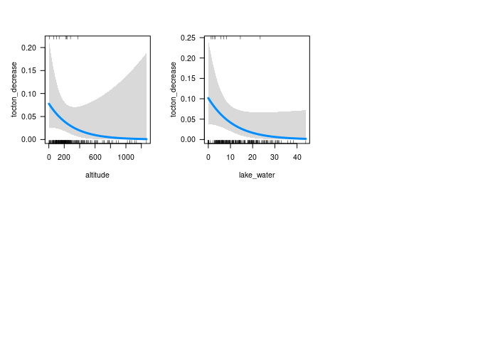<!-- -->


