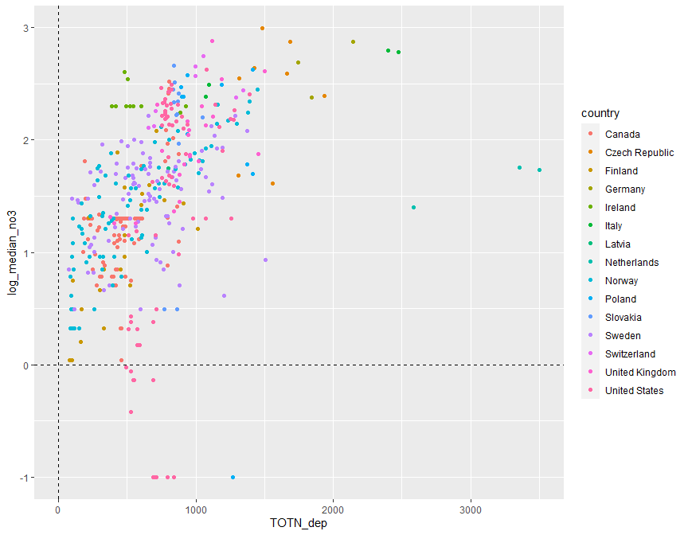
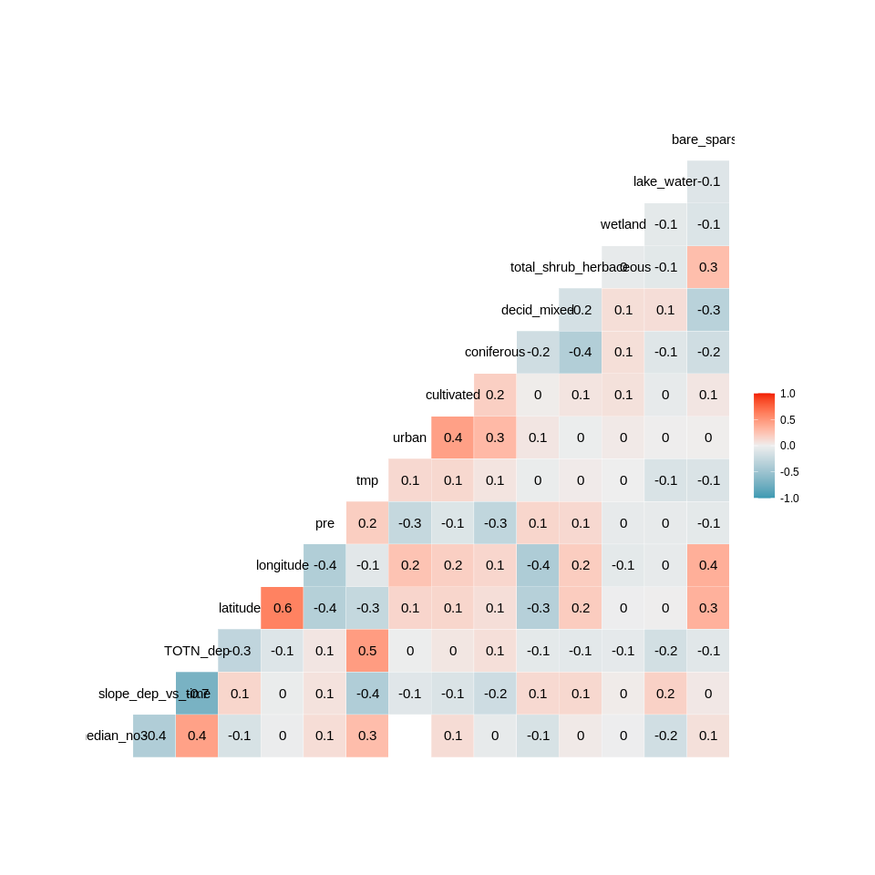
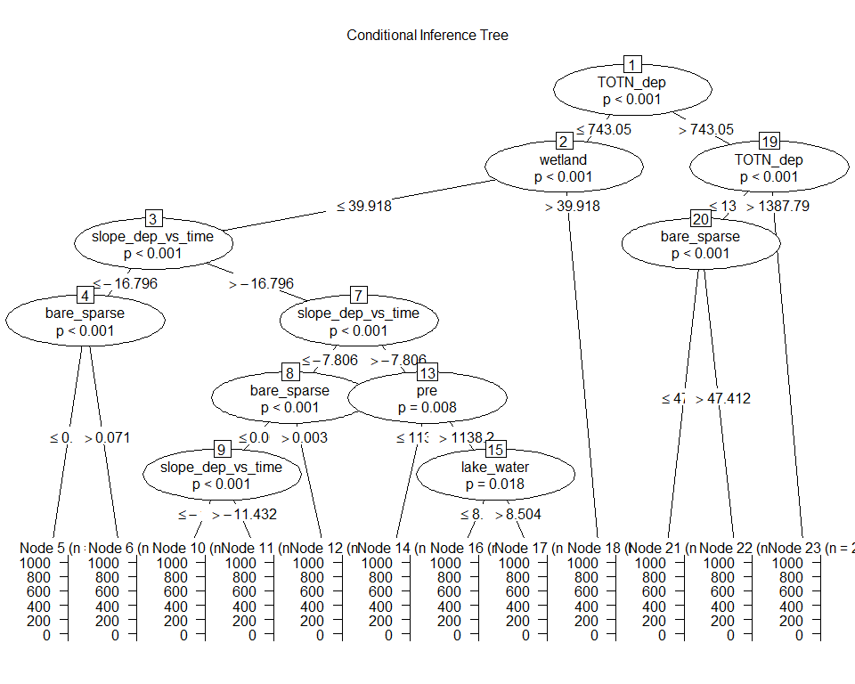
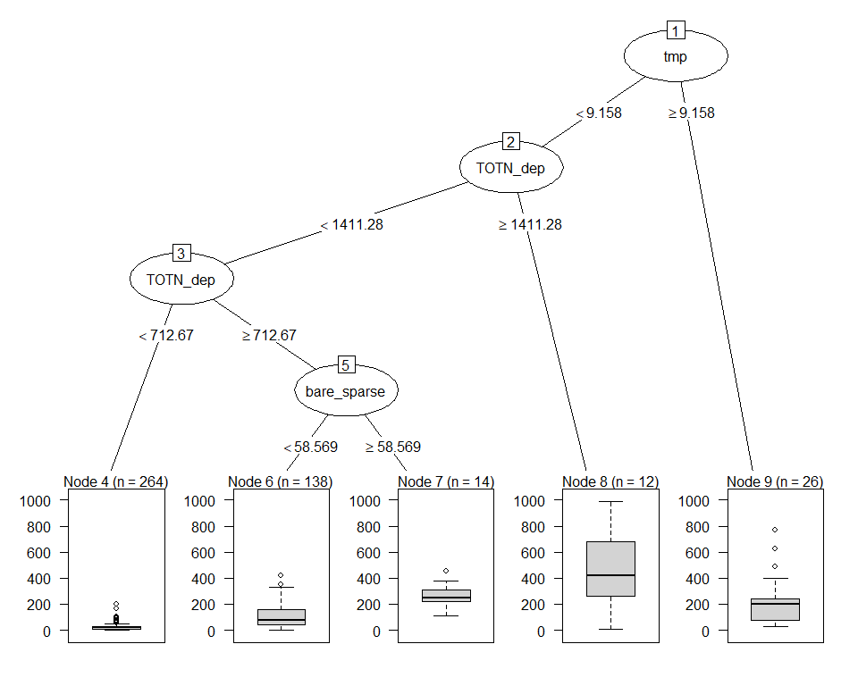
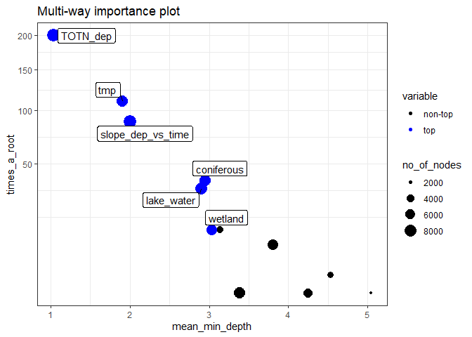
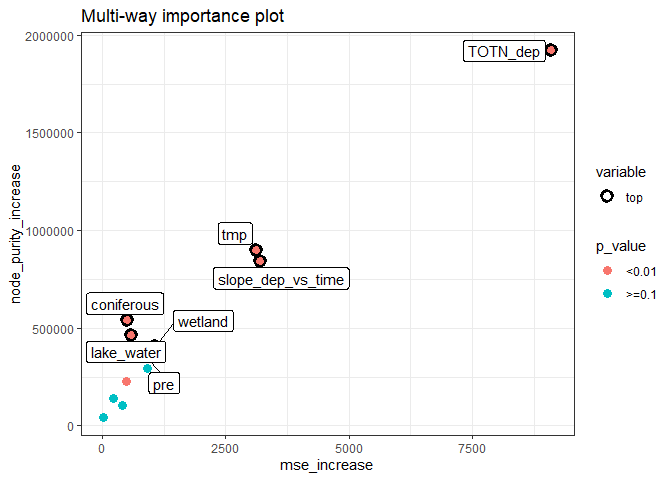
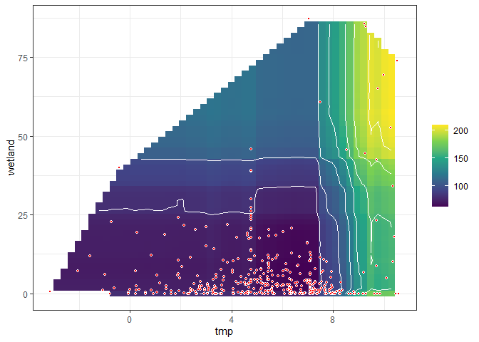
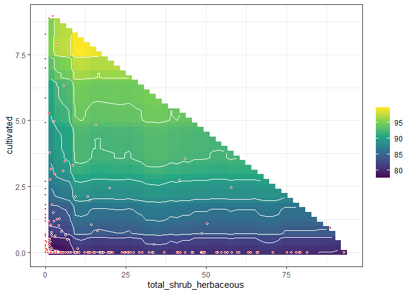
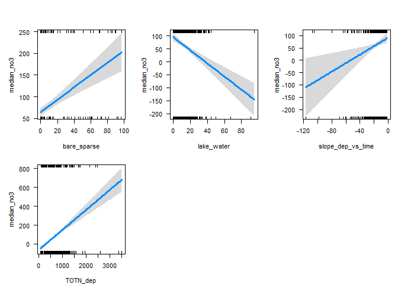

<<<<<<< HEAD

=======
>>>>>>> e5a7972e37222771881a7ff3ac9997f6a8a047b5
**Analysis of NO3 medians (2012-2016)**   

**Dataset: NO3 medians data set excl. TOC and catchment_area**   
**Name of dataset: medians_2012-2016_no3.csv**   


* Response variable: 'Current NO3 level' (locations with signif. *increase* are *not* excluded)  
* Data from https://github.com/JamesSample/icpw2/tree/master/thematic_report_2020/results      
<<<<<<< HEAD
* Sen slope of NO3, TOTN, TOC/TON etc. 1992-2016
=======
* Sen slope of NO3, TON, TOC/TON etc. 1992-2016
>>>>>>> e5a7972e37222771881a7ff3ac9997f6a8a047b5
* Response variable in all analyses are *whether NO3 decreases or not*     
* Predictors:
    - slope_dep_vs_time: Trend in Tot-N deposition 1992-2016    
    - NO3, TOTN_dep: Medians of NO3, TOTN_dep (Tot-N deposition) 1992-2016   
    - catchment_area (if included in data)      
    - TOC: Medians of TOC 1992-2016 (if included in data)     
    - pre, tmp: mean precipitation + temp   
    - Land cover 
  
Technical details: This html file was created was 

## 1. Libraries  

```r
# All of these packages cn be loaded at once using library(tidyverse). (I just like to be specific.)
library(dplyr)
library(tidyr)      # pivot_wider
library(purrr)      # 'map' functions  
library(lubridate)  
library(ggplot2)

# Too many packages, not all are used
# library(mapview)
library(visreg)     # visreg
library(rkt)        # Theil -Sen Regression

library(MuMIn)      

# Trees and forests
library(party)                  # ctree
library(evtree)                 # evtree
library(randomForest)
library(randomForestExplainer)  # measure_importance, plot_multi_way_importance
library(pdp)                    # partial, autoplot

library(maps)
my_map <- map_data("world")

library(effects)    # handles lme models  
library(readxl)
library(readr)
<<<<<<< HEAD
=======
library(stringr)    # str_extract
>>>>>>> e5a7972e37222771881a7ff3ac9997f6a8a047b5

source("002_Functions.R")
source("160parm_functions.R")

knitr::opts_chunk$set(results = 'hold') # collect the results from a chunk  
knitr::opts_chunk$set(warning = FALSE)  

options(width = 95)
```


## 2. Data  
<<<<<<< HEAD
* The data part (part 2) is quite similar in scripts 160-164 
=======
* The data part (part 2) is quite similar in scripts 160 - 165 
>>>>>>> e5a7972e37222771881a7ff3ac9997f6a8a047b5

### Available files

```
## Medians results: 'medians_2012-2016_no3.csv' ,n = 494 
## 
## Number of values per variable: 
## 
## Medians results: 'medians_2012-2016_toc_totn_no3.csv' ,n = 310 
## 
## Number of values per variable:
```

### James' trends and medians     

```r
#
# Median results 2012-2016  
#
folder <- "https://github.com/JamesSample/icpw2/raw/master/thematic_report_2020/results/medians_2012-2016"
file <- params$medians_filename
fn <- paste0(folder, "/", file)
df_medians <- read.csv(fn, encoding = "UTF-8")
cat("Medians results:", sQuote(file), ",n =", nrow(df_medians), "\n\n")  
cat("Number of values per variable: \n")
apply(!is.na(df_medians), 2, sum)
cat("\n")

# Station metadata
# WILL BE ADDED TOGETHER WITH LAND COVER, BELOW
# file_meta <- gsub(".csv", "_stations.csv", file)
# fn <- paste0(folder, "/", file_meta)
# df_metadata <- read.csv(fn, encoding = "UTF-8")
# cat("Regression result metadata:", sQuote(file_meta), ",n =",  
#      nrow(df_metadata), "\n\n")


#
# Regression results 1992-2016
#
folder <- "https://github.com/JamesSample/icpw2/raw/master/thematic_report_2020/results/trends_1992-2016_no3"
file <- "trends_1992-2016_no3_results.csv"
fn <- paste0(folder, "/", file)
df_trends <- read.csv(fn, encoding = "UTF-8")
cat("Trends used as predictor variable:", sQuote(file), ",n =", nrow(df_trends), "\n\n")
```

```
## Medians results: 'medians_2012-2016_no3.csv' ,n = 494 
## 
## Number of values per variable: 
##   station_id NH4.N_µg.l.N NO3.N_µg.l.N   TOC_mg.C.l  TOTN_µg.l.N  TOTP_µg.l.P   TON_µg.l.N 
##          494          382          494          487          316          365          231 
##    TOTN.TOTP     NO3.TOTP      TOC.TON     TOC.TOTP 
##          235          364          227          357 
## 
## Trends used as predictor variable: 'trends_1992-2016_no3_results.csv' ,n = 3176
```

### Start 'dat'  
Using medians    
* Make one line per station   
* Also including some trends for  

```r
# table(reg_no3$variable)

# Medians 2012-2016  
df1 <- df_medians %>%
<<<<<<< HEAD
  select(station_id, `NO3.N_µg.l.N`, `TOTN_µg.l.N`, `TON_µg.l.N`, `TOC_mg.C.l`, TOC.TON) %>%
  rename(median_no3 = `NO3.N_µg.l.N`,
         median_totn = `TOTN_µg.l.N`,
=======
  select(station_id, `NO3.N_µg.l.N`, `TON_µg.l.N`, `TON_µg.l.N`, `TOC_mg.C.l`, TOC.TON) %>%
  rename(median_no3 = `NO3.N_µg.l.N`,
         median_ton = `TON_µg.l.N`,
>>>>>>> e5a7972e37222771881a7ff3ac9997f6a8a047b5
         median_ton = `TON_µg.l.N`,
         median_toc = `TOC_mg.C.l`,
         median_tocton = `TOC.TON`) %>%
  mutate(log_median_no3 = log10(median_no3 + 0.1),
<<<<<<< HEAD
         log_median_totn = log10(median_totn),
=======
         log_median_ton = log10(median_ton),
>>>>>>> e5a7972e37222771881a7ff3ac9997f6a8a047b5
         log_median_ton = log10(median_ton),
         log_median_toc = log10(median_toc),
         log_median_tocton = log10(median_tocton))

# Some trends
df2 <- df_trends %>% # table()
  filter(variable %in% c("NO3-N_µg/l N", "TOTN_µg/l N", "TOC_mg C/l")) %>%
  select(station_id, variable, median) %>%
  tidyr::pivot_wider(names_from = "variable", values_from = "median") %>% # str()
  rename(trend_NO3 = `NO3-N_µg/l N`,
         trend_TOTN = `TOTN_µg/l N`,
         trend_TOC = `TOC_mg C/l`)

cat("\n")
cat("df1, n =", nrow(df1), "\n")
cat("df2, n =", nrow(df2), "\n")

<<<<<<< HEAD
dat_1 <- df1 %>%
  left_join(df2, by = "station_id")

cat("dat_1, n =", nrow(dat_1), "\n")
=======
dat_1_allrows <- df1 %>%
  left_join(df2, by = "station_id")

response_var <- str_extract(params$tree_formula, "[^[[:blank:]]]+")

cat("dat_1_allrows, n =", nrow(dat_1_allrows), 
    " (may include series where", response_var,  "= NA)\n")

sel <- !is.na(dat_1_allrows[[response_var]])

dat_1 <- dat_1_allrows[sel,]

cat("dat_1, n =", nrow(dat_1), 
    " (series where", response_var,  "has values)\n")
>>>>>>> e5a7972e37222771881a7ff3ac9997f6a8a047b5
```

```
## 
## df1, n = 494 
## df2, n = 498 
<<<<<<< HEAD
## dat_1, n = 494
```


=======
## dat_1_allrows, n = 494  (may include series where median_no3 = NA)
## dat_1, n = 494  (series where median_no3 has values)
```


```r
sum(is.na(dat_1$log_median_no3))
sum(is.na(dat_1$log_median_tocton))
```

```
## [1] 0
## [1] 267
```

>>>>>>> e5a7972e37222771881a7ff3ac9997f6a8a047b5
### Deposition trends and median 1992-2006     

```r
fn <- "https://github.com/JamesSample/icpw2/raw/master/thematic_report_2020/results/deposition/totn_dep_trends_icpw_stns.csv"  

df_deposition <- read.csv(fn) %>% 
  filter(variable == "totn_mgNpm2")  

cat("n =", nrow(df_deposition), "\n")
```

```
## n = 556
```


### Add deposition slope and medians to data  

```r
# debugonce(left_join2)
dat_2 <- dat_1 %>% 
  left_join2(df_deposition %>% 
              select(station_id, median, sen_slp, mk_p_val) %>%
              rename(TOTN_dep = median,
                     slope_dep_vs_time = sen_slp,
                     p_dep_vs_time = mk_p_val),
             by = "station_id",
             print_vars = TRUE)
```

```
## Variables before join: 
<<<<<<< HEAD
## 'station_id', 'median_no3', 'median_totn', 'median_ton', 'median_toc', 'median_tocton', 'log_median_no3', 'log_median_totn', 'log_median_ton', 'log_median_toc', 'log_median_tocton', 'trend_NO3', 'trend_TOC', 'trend_TOTN'
=======
## 'station_id', 'median_no3', 'median_ton', 'median_toc', 'median_tocton', 'log_median_no3', 'log_median_ton', 'log_median_toc', 'log_median_tocton', 'trend_NO3', 'trend_TOC', 'trend_TOTN'
>>>>>>> e5a7972e37222771881a7ff3ac9997f6a8a047b5
## 
## Variables used to join: 
## 'station_id'
## 
## Variables added: 
## 'TOTN_dep', 'slope_dep_vs_time', 'p_dep_vs_time'
```

### Add medians and station metadata   


```r
# dat_2 <- dat_2 %>%
#   left_join(df_metadata, by = "station_id")

# cat("dat_2, n =", nrow(dat_2), "\n")

# Simplify names by removing units
# names(dat_2)
# names(dat_2) <- sub(".N_µg.l.N", "", names(dat_2))
# names(dat_2) <- sub("_mg.C.l", "", names(dat_2))
# names(dat_2) <- sub("_µg.l.P", "", names(dat_2))

# cat("\nVariable names: \n")
# names(dat_2)
```

### Add climate and deposition medians and slopes  

```r
fn <- "https://github.com/JamesSample/icpw2/raw/master/thematic_report_2020/results/climate/cru_climate_trends_icpw_stns.csv"

df_climate_mean <- read_csv(fn) %>% 
  select(station_id, variable, median) %>%
  pivot_wider(names_from = "variable", values_from = "median")
```

```
## Rows: 1112 Columns: 8
```

```
<<<<<<< HEAD
## -- Column specification -----------------------------------------------------------------------
=======
## ── Column specification ───────────────────────────────────────────────────────────────────────
>>>>>>> e5a7972e37222771881a7ff3ac9997f6a8a047b5
## Delimiter: ","
## chr (3): variable, mk_trend, sen_trend
## dbl (5): station_id, median, mk_p_val, sen_slp, sen_incpt
```

```
## 
<<<<<<< HEAD
## i Use `spec()` to retrieve the full column specification for this data.
## i Specify the column types or set `show_col_types = FALSE` to quiet this message.
=======
## ℹ Use `spec()` to retrieve the full column specification for this data.
## ℹ Specify the column types or set `show_col_types = FALSE` to quiet this message.
>>>>>>> e5a7972e37222771881a7ff3ac9997f6a8a047b5
```

```r
cat("\n")
# names(df_climate_mean)

df_climate_slope <- read_csv(fn) %>%
  select(station_id, variable, sen_slp) %>%
<<<<<<< HEAD
  pivot_wider(names_from = "variable", values_from = "sen_slp", names_prefix = "Slope_")
=======
  pivot_wider(names_from = "variable", values_from = "sen_slp", names_prefix = "slope_")
>>>>>>> e5a7972e37222771881a7ff3ac9997f6a8a047b5
```

```
## Rows: 1112 Columns: 8
```

```
<<<<<<< HEAD
## -- Column specification -----------------------------------------------------------------------
=======
## ── Column specification ───────────────────────────────────────────────────────────────────────
>>>>>>> e5a7972e37222771881a7ff3ac9997f6a8a047b5
## Delimiter: ","
## chr (3): variable, mk_trend, sen_trend
## dbl (5): station_id, median, mk_p_val, sen_slp, sen_incpt
```

```
## 
<<<<<<< HEAD
## i Use `spec()` to retrieve the full column specification for this data.
## i Specify the column types or set `show_col_types = FALSE` to quiet this message.
=======
## ℹ Use `spec()` to retrieve the full column specification for this data.
## ℹ Specify the column types or set `show_col_types = FALSE` to quiet this message.
>>>>>>> e5a7972e37222771881a7ff3ac9997f6a8a047b5
```

```r
# Add
dat_3 <- dat_2 %>%
  left_join2(df_climate_mean, by = "station_id", print_vars = TRUE) %>%
  left_join2(df_climate_slope, by = "station_id", print_vars = TRUE)
```

```
## 
## Variables before join: 
<<<<<<< HEAD
## 'station_id', 'median_no3', 'median_totn', 'median_ton', 'median_toc', 'median_tocton', 'log_median_no3', 'log_median_totn', 'log_median_ton', 'log_median_toc', 'log_median_tocton', 'trend_NO3', 'trend_TOC', 'trend_TOTN', 'TOTN_dep', 'slope_dep_vs_time', 'p_dep_vs_time'
=======
## 'station_id', 'median_no3', 'median_ton', 'median_toc', 'median_tocton', 'log_median_no3', 'log_median_ton', 'log_median_toc', 'log_median_tocton', 'trend_NO3', 'trend_TOC', 'trend_TOTN', 'TOTN_dep', 'slope_dep_vs_time', 'p_dep_vs_time'
>>>>>>> e5a7972e37222771881a7ff3ac9997f6a8a047b5
## 
## Variables used to join: 
## 'station_id'
## 
## Variables added: 
## 'pre', 'tmp'
## Variables before join: 
<<<<<<< HEAD
## 'station_id', 'median_no3', 'median_totn', 'median_ton', 'median_toc', 'median_tocton', 'log_median_no3', 'log_median_totn', 'log_median_ton', 'log_median_toc', 'log_median_tocton', 'trend_NO3', 'trend_TOC', 'trend_TOTN', 'TOTN_dep', 'slope_dep_vs_time', 'p_dep_vs_time', 'pre', 'tmp'
=======
## 'station_id', 'median_no3', 'median_ton', 'median_toc', 'median_tocton', 'log_median_no3', 'log_median_ton', 'log_median_toc', 'log_median_tocton', 'trend_NO3', 'trend_TOC', 'trend_TOTN', 'TOTN_dep', 'slope_dep_vs_time', 'p_dep_vs_time', 'pre', 'tmp'
>>>>>>> e5a7972e37222771881a7ff3ac9997f6a8a047b5
## 
## Variables used to join: 
## 'station_id'
## 
## Variables added: 
<<<<<<< HEAD
## 'Slope_pre', 'Slope_tmp'
=======
## 'slope_pre', 'slope_tmp'
>>>>>>> e5a7972e37222771881a7ff3ac9997f6a8a047b5
```

### Combine land cover types   
* Data including UK read using script 159   
* Note: also includes metadata (country, etc.)
* bare_sparse = bare_rock + sparsely_vegetated + glacier   
* Select: coniferous, deciduous, lake, mixed_forest, wetland, bare_sparse   


```r
# df_landcover3_OLD <- readRDS("Data/159_df_landcover3.rds")
df_landcover3 <- readRDS("Data/159_df_meta3.rds")

df_landcover3 <- df_landcover3 %>%
  mutate(bare_sparse = bare_rock + sparsely_vegetated + glacier,
         decid_mixed = deciduous + mixed_forest,
         lake_water = lake + water_ex_lake) %>%
  select(-c(bare_rock, sparsely_vegetated, glacier, deciduous, mixed_forest, lake, water_ex_lake))
```


### Add land cover columns to main data    

```r
dat_4 <- left_join2(dat_3, 
                   df_landcover3, 
                   by = "station_id", 
                   print_vars = TRUE
)
```

```
## Variables before join: 
<<<<<<< HEAD
## 'station_id', 'median_no3', 'median_totn', 'median_ton', 'median_toc', 'median_tocton', 'log_median_no3', 'log_median_totn', 'log_median_ton', 'log_median_toc', 'log_median_tocton', 'trend_NO3', 'trend_TOC', 'trend_TOTN', 'TOTN_dep', 'slope_dep_vs_time', 'p_dep_vs_time', 'pre', 'tmp', 'Slope_pre', 'Slope_tmp'
=======
## 'station_id', 'median_no3', 'median_ton', 'median_toc', 'median_tocton', 'log_median_no3', 'log_median_ton', 'log_median_toc', 'log_median_tocton', 'trend_NO3', 'trend_TOC', 'trend_TOTN', 'TOTN_dep', 'slope_dep_vs_time', 'p_dep_vs_time', 'pre', 'tmp', 'slope_pre', 'slope_tmp'
>>>>>>> e5a7972e37222771881a7ff3ac9997f6a8a047b5
## 
## Variables used to join: 
## 'station_id'
## 
## Variables added: 
## 'station_code', 'station_name', 'latitude', 'longitude', 'altitude', 'continent', 'country', 'region', 'group', 'catchment_area', 'urban', 'cultivated', 'total_forest', 'coniferous', 'total_shrub_herbaceous', 'grasslands', 'heathlands', 'transitional_woodland_shrub', 'wetland', 'other', 'bare_sparse', 'decid_mixed', 'lake_water'
```

<<<<<<< HEAD
### Drop locations with >10% cultivated    

```r
dat_5 <- dat_4 %>%
  filter(cultivated <= 10)

cat(nrow(dat_4) - nrow(dat_5), "stations with > 10% cultivated deleted \n")
```

```
## 31 stations with > 10% cultivated deleted
```


=======


### Drop locations with >5% cultivated and >5% urban     
- also excluding stations 23517, 38273    

```r
cultivated_threshold <- 5
urban_threshold <- 5

dat_5 <- dat_4 %>%
  filter2(!station_id %in% c(23517, 38273), text = "Deleted stations 23517, 38273") %>%
  filter2(cultivated <= cultivated_threshold, 
          text = paste("Deleted stations with >", cultivated_threshold, "% cultivated")) %>%
  filter2(urban <= urban_threshold, 
          text = paste("Deleted stations with >", urban_threshold, "% urban"))
```

```
## Removed 1 rows (Deleted stations 23517, 38273)
## Removed 40 rows (Deleted stations with > 5 % cultivated)
## Removed 6 rows (Deleted stations with > 5 % urban)
```


>>>>>>> e5a7972e37222771881a7ff3ac9997f6a8a047b5
### Data set used  

```r
dat <- dat_5
```


<<<<<<< HEAD

=======
>>>>>>> e5a7972e37222771881a7ff3ac9997f6a8a047b5
## 3. Plot data      


```r
<<<<<<< HEAD
gg <- ggplot(dat, aes(TOTN_dep, log_median_no3)) + 
=======
gg <- ggplot(dat, aes(TOTN_dep, median_no3)) + 
>>>>>>> e5a7972e37222771881a7ff3ac9997f6a8a047b5
  geom_point(aes(color = country)) +
  geom_hline(yintercept = 0, linetype = 2) + 
  geom_vline(xintercept = 0, linetype = 2) 
  
gg
```

<<<<<<< HEAD
<!-- -->
=======
<!-- -->
>>>>>>> e5a7972e37222771881a7ff3ac9997f6a8a047b5


## 4. Select data   

### a. Selection of variables    
* Select variables to use, and thereby also cases  
* Also remove PL05, which has dubious values   

```r
<<<<<<< HEAD
get_data_for_analysis <- function(data, variable_string){
=======
add_flag_variable <- function(data, variable_string){
>>>>>>> e5a7972e37222771881a7ff3ac9997f6a8a047b5
  variable_string <- gsub(" ", "", variable_string)
  variables <- strsplit(variable_string, split = ",")[[1]]
  # Check if all variables are there
  found <- variables %in% names(data)
  if (sum(!found) > 0)
    stop("Not all variables found in data:", 
      paste(variables[!found], collapse = " ,"), 
      "\n")
  # Data for analyses
<<<<<<< HEAD
=======
  complete <- complete.cases(data[variables])
  data$Row_excluded <- !complete
  variables %>% 
    purrr::map_dfr(~data.frame(Var = .x, Missing = sum(is.na(data[[.x]])))) %>%
    print()
  data
}

delete_unused_variables <- function(data, variable_string){
  variable_string <- gsub(" ", "", variable_string)
  variables <- strsplit(variable_string, split = ",")[[1]]
>>>>>>> e5a7972e37222771881a7ff3ac9997f6a8a047b5
  data[variables]
}

cat("-------------------------------------------------------------\n")
cat("Variables: \n")
cat(params$selected_vars)
cat("\n-------------------------------------------------------------\n")

<<<<<<< HEAD
sel <- dat$station_code %in% "PL05"
dat <- dat[!sel,]
message(sum(sel), " station removed - station PL05 (has dubious NO3 data)")  
```

```
## 1 station removed - station PL05 (has dubious NO3 data)
```

```r
# debugonce(get_data_for_analysis)
# df_analysis <- get_data_for_analysis(dat, vars)  
df_analysis <- get_data_for_analysis(dat, params$selected_vars)  

# names(dat) %>% paste(collapse = ", ")

cat("Number of missing values per variable: \n")
apply(is.na(df_analysis), 2, sum) 
cat("\n")

# What is missing? (long output)
if (FALSE){
dat %>% 
  split(.$country) %>%
  purrr::map(~apply(is.na(.), 2, mean))
}

cat("Number of complete observations: \n")
complete <- complete.cases(df_analysis)
table(complete)

cat("\n\n")
cat("Number of complete observations by country: \n")
table(dat$country, complete)

# Keep only complete cases
df_analysis <- df_analysis[complete.cases(df_analysis),]

cat("\n\n")
cat("Original data: n =", nrow(dat), "\n")
cat("Analysis: n =", nrow(df_analysis), "\n")
=======
dat <- dat %>%
  filter2(!station_code %in% "PL05", text = "station PL05 (has dubious NO3 data)")

# debugonce(add_flag_variable)
# df_analysis <- add_flag_variable(dat, vars)  
df_analysis_allrows <- add_flag_variable(dat, params$selected_vars)  

# Save to excel
fn <- paste0(substr(params$document_title, 1, 3), "_", response_var, "_data.xlsx")
writexl::write_xlsx(df_analysis_allrows, paste0("Data_analysed/", fn))
cat("\nDataset after removing urban, cultivated, PL05 saved as", sQuote(fn), "\n\n")

cat("Number of rows that will be excluded: \n")
table(df_analysis_allrows$Row_excluded)

cat("\n\n")
cat("Number of complete observations by country: \n")
xtabs(~country + Row_excluded, df_analysis_allrows)

# Keep only complete cases
df_analysis <- df_analysis_allrows %>%
  filter(!Row_excluded)

# Save to excel
fn <- paste0(
  stringr::str_extract(params$document_title, "[^[[:blank:]]]+"),
  "_data.xlsx")
writexl::write_xlsx(df_analysis, paste0("Data_analysed/", fn))

# Remove variables that will note be used
df_analysis <- delete_unused_variables(df_analysis, params$selected_vars)

cat("\n\n")
cat("Data before removing PL05: n =", nrow(dat_5), "\n")
cat("Data after removing PL05: n =", nrow(df_analysis_allrows), "\n")
cat("Data after removing missing predictors: n =", nrow(df_analysis), "\n")
>>>>>>> e5a7972e37222771881a7ff3ac9997f6a8a047b5
```

```
## -------------------------------------------------------------
## Variables: 
## median_no3,slope_dep_vs_time, TOTN_dep, latitude, longitude,pre, tmp, urban, cultivated, coniferous, decid_mixed, total_shrub_herbaceous,wetland, lake_water, bare_sparse
## -------------------------------------------------------------
<<<<<<< HEAD
## Number of missing values per variable: 
##             median_no3      slope_dep_vs_time               TOTN_dep               latitude 
##                      0                      0                      0                      0 
##              longitude                    pre                    tmp                  urban 
##                      0                      0                      0                      0 
##             cultivated             coniferous            decid_mixed total_shrub_herbaceous 
##                      0                      8                      8                      0 
##                wetland             lake_water            bare_sparse 
##                      0                      0                      0 
## 
## Number of complete observations: 
## complete
## FALSE  TRUE 
##     8   454 
## 
## 
## Number of complete observations by country: 
##                 complete
##                  FALSE TRUE
##   Canada             0  113
##   Czech Republic     0    8
##   Finland            0   23
##   Germany            0    3
##   Ireland            0   10
##   Italy              0    4
##   Latvia             0    1
##   Netherlands        0    3
##   Norway             0   82
##   Poland             0    9
##   Slovakia           0   12
##   Sweden             0   91
##   Switzerland        8    0
##   United Kingdom     0   22
##   United States      0   73
## 
## 
## Original data: n = 462 
## Analysis: n = 454
=======
## Removed 1 rows (station PL05 (has dubious NO3 data))
##                       Var Missing
## 1              median_no3       0
## 2       slope_dep_vs_time       0
## 3                TOTN_dep       0
## 4                latitude       0
## 5               longitude       0
## 6                     pre       0
## 7                     tmp       0
## 8                   urban       0
## 9              cultivated       0
## 10             coniferous      12
## 11            decid_mixed      12
## 12 total_shrub_herbaceous       0
## 13                wetland       0
## 14             lake_water       0
## 15            bare_sparse       0
## 
## Dataset after removing urban, cultivated, PL05 saved as '164_median_no3_data.xlsx' 
## 
## Number of rows that will be excluded: 
## 
## FALSE  TRUE 
##   434    12 
## 
## 
## Number of complete observations by country: 
##                 Row_excluded
## country          FALSE TRUE
##   Canada           103    4
##   Czech Republic     8    0
##   Finland           22    0
##   Germany            3    0
##   Ireland           10    0
##   Italy              3    0
##   Latvia             1    0
##   Netherlands        3    0
##   Norway            80    0
##   Poland             7    0
##   Slovakia          12    0
##   Sweden            87    0
##   Switzerland        0    8
##   United Kingdom    22    0
##   United States     73    0
## 
## 
## Data before removing PL05: n = 447 
## Data after removing PL05: n = 446 
## Data after removing missing predictors: n = 434
>>>>>>> e5a7972e37222771881a7ff3ac9997f6a8a047b5
```


### b. Correlations   

```r
gg <- GGally::ggcorr(df_analysis, method = c("complete.obs", "kendall"), label = TRUE) # +
gg + theme(plot.margin = unit(c(.8, 2, .8, 2.5), "cm"))
```

<<<<<<< HEAD
<!-- -->
=======
<!-- -->
>>>>>>> e5a7972e37222771881a7ff3ac9997f6a8a047b5

```r
# SHOULD also workaccording to ?element_rect (update ggplot2?)
# gg + theme(plot.margin = margin(.6, .5, .6, 1.7, "cm"))
```


## 5. Tree and forest classification


### Split into training and validation data

```r
set.seed(123)

#
# NOT RELEVANT
#
# x <- runif(nrow(df_analysis))
# train <- ifelse(x < 0.9, TRUE, FALSE)
# 
# train_set <- df_analysis[train,]  %>% 
#   select(-longitude, - latitude) %>%
#   as.data.frame()
# valid_set <- df_analysis[!train,] %>% 
#   select(-longitude, - latitude) %>%
#   as.data.frame()

full_set <- df_analysis  %>% 
  select(-longitude, - latitude) %>%
  as.data.frame()

# plot(full_set)
```


### a. Tree classification using 'party'   

```r
<<<<<<< HEAD
# train_set$X <- 10^train_set$log_median_no3
=======
# train_set$X <- 10^train_set$median_no3
>>>>>>> e5a7972e37222771881a7ff3ac9997f6a8a047b5
# (ct = ctree(X ~ ., data = train_set))

(ct = ctree(as.formula(params$tree_formula), 
            data = full_set))

plot(ct, main="Conditional Inference Tree")
```

<<<<<<< HEAD
<!-- -->
=======
<!-- -->
>>>>>>> e5a7972e37222771881a7ff3ac9997f6a8a047b5

```
## 
## Model formula:
## median_no3 ~ slope_dep_vs_time + TOTN_dep + pre + tmp + urban + 
##     cultivated + coniferous + decid_mixed + total_shrub_herbaceous + 
##     wetland + lake_water + bare_sparse
## 
## Fitted party:
## [1] root
## |   [2] TOTN_dep <= 743.05
## |   |   [3] wetland <= 39.918
## |   |   |   [4] slope_dep_vs_time <= -16.79619
<<<<<<< HEAD
## |   |   |   |   [5] bare_sparse <= 0.071: 40.367 (n = 47, err = 29085.6)
## |   |   |   |   [6] bare_sparse > 0.071: 66.417 (n = 12, err = 44526.9)
## |   |   |   [7] slope_dep_vs_time > -16.79619
## |   |   |   |   [8] slope_dep_vs_time <= -7.80595
## |   |   |   |   |   [9] bare_sparse <= 0.003
## |   |   |   |   |   |   [10] slope_dep_vs_time <= -11.43238: 7.139 (n = 27, err = 1535.4)
## |   |   |   |   |   |   [11] slope_dep_vs_time > -11.43238: 18.545 (n = 66, err = 3864.1)
## |   |   |   |   |   [12] bare_sparse > 0.003: 39.821 (n = 28, err = 16031.6)
## |   |   |   |   [13] slope_dep_vs_time > -7.80595
## |   |   |   |   |   [14] pre <= 1138.20007: 8.358 (n = 51, err = 3247.0)
## |   |   |   |   |   [15] pre > 1138.20007
## |   |   |   |   |   |   [16] lake_water <= 8.504: 7.214 (n = 7, err = 85.9)
## |   |   |   |   |   |   [17] lake_water > 8.504: 18.398 (n = 33, err = 3434.7)
## |   |   [18] wetland > 39.918: 243.750 (n = 8, err = 47187.5)
## |   [19] TOTN_dep > 743.05
## |   |   [20] TOTN_dep <= 1387.79
## |   |   |   [21] bare_sparse <= 47.412: 115.118 (n = 141, err = 1505806.3)
## |   |   |   [22] bare_sparse > 47.412: 275.487 (n = 13, err = 83773.4)
## |   |   [23] TOTN_dep > 1387.79: 343.061 (n = 21, err = 1600251.1)
## 
## Number of inner nodes:    11
## Number of terminal nodes: 12
=======
## |   |   |   |   [5] bare_sparse <= 0.071: 39.582 (n = 46, err = 27751.6)
## |   |   |   |   [6] bare_sparse > 0.071: 60.000 (n = 10, err = 33476.0)
## |   |   |   [7] slope_dep_vs_time > -16.79619
## |   |   |   |   [8] bare_sparse <= 33.792
## |   |   |   |   |   [9] urban <= 0.001
## |   |   |   |   |   |   [10] pre <= 1148.69995: 8.366 (n = 74, err = 3982.6)
## |   |   |   |   |   |   [11] pre > 1148.69995: 17.184 (n = 53, err = 6220.3)
## |   |   |   |   |   [12] urban > 0.001: 24.189 (n = 57, err = 15077.8)
## |   |   |   |   [13] bare_sparse > 33.792: 33.706 (n = 17, err = 10535.0)
## |   |   [14] wetland > 39.918: 243.750 (n = 8, err = 47187.5)
## |   [15] TOTN_dep > 743.05
## |   |   [16] TOTN_dep <= 1387.79
## |   |   |   [17] bare_sparse <= 47.412: 116.073 (n = 139, err = 1496204.0)
## |   |   |   [18] bare_sparse > 47.412: 275.487 (n = 13, err = 83773.4)
## |   |   [19] TOTN_dep > 1387.79: 342.643 (n = 17, err = 1424544.8)
## 
## Number of inner nodes:     9
## Number of terminal nodes: 10
>>>>>>> e5a7972e37222771881a7ff3ac9997f6a8a047b5
```

### b. Evtree (Evolutionary Learning)   

```r
ev.raw = evtree(as.formula(params$tree_formula), 
                data = full_set)

plot(ev.raw)
```

<<<<<<< HEAD
<!-- -->
=======
<!-- -->
>>>>>>> e5a7972e37222771881a7ff3ac9997f6a8a047b5


### c. Random forest  
* Model called 'model1'

```r
model1 <- randomForest(as.formula(params$tree_formula), 
                       data = full_set, 
                       mtry = 5,
                       importance = TRUE)

model1
```

```
## 
## Call:
##  randomForest(formula = as.formula(params$tree_formula), data = full_set,      mtry = 5, importance = TRUE) 
##                Type of random forest: regression
##                      Number of trees: 500
## No. of variables tried at each split: 5
## 
<<<<<<< HEAD
##           Mean of squared residuals: 7750.005
##                     % Var explained: 46.79
=======
##           Mean of squared residuals: 7527.656
##                     % Var explained: 46.37
>>>>>>> e5a7972e37222771881a7ff3ac9997f6a8a047b5
```


#### c1. Predict on training data
Not relevant here  

#### c2. Importance of variables   
* Classification forests result in   
    - mean_min_depth   
    - accuracy_decrease  
    - gini_decrease  
    - no_of_nodes   
    - times_a_root      
* Regression forests result in     
    - mean_min_depth   
    - mse_increase  
    - node_purity_increase  
    - no_of_nodes   
    - times_a_root      

```r
# Calculation
importance <- measure_importance(model1)
```


```r
plot_multi_way_importance(importance, size_measure = "no_of_nodes", no_of_labels = 6)  
```

<<<<<<< HEAD
<!-- -->
=======
<!-- -->
>>>>>>> e5a7972e37222771881a7ff3ac9997f6a8a047b5

```r
plot_multi_way_importance(importance, x_measure = "mse_increase", y_measure = "node_purity_increase",
                          size_measure = "p_value", no_of_labels = 6)
```

<<<<<<< HEAD
<!-- -->
=======
<!-- -->

```r
importance %>%
  arrange(desc(times_a_root))
```

```
##                  variable mean_min_depth no_of_nodes mse_increase node_purity_increase
## 1                TOTN_dep       1.030000        8611   8987.72942           1684394.36
## 2                     tmp       1.912000        7061   3430.12460            796987.57
## 3       slope_dep_vs_time       1.934000        8734   3050.16476            796764.15
## 4              coniferous       2.918000        6495    475.58691            513031.30
## 5              lake_water       2.902000        7330    464.70900            439169.87
## 6             decid_mixed       3.738000        6275    583.32909            227063.32
## 7                 wetland       2.982000        6134   1193.47123            374995.05
## 8             bare_sparse       3.302000        3466    880.57346            273423.00
## 9  total_shrub_herbaceous       3.874000        5624    331.46039            216715.13
## 10             cultivated       5.432776        1720     26.51543             30654.10
## 11                    pre       3.240000        6800   1012.30157            334914.81
## 12                  urban       5.209232        2489    210.15760             47526.72
##    no_of_trees times_a_root       p_value
## 1          500          202 3.053872e-265
## 2          500           90  6.067696e-54
## 3          500           89 3.220946e-288
## 4          500           41  4.570801e-16
## 5          500           29  1.125385e-79
## 6          500           23  1.555884e-07
## 7          500           13  6.234834e-04
## 8          500            9  1.000000e+00
## 9          500            4  9.998991e-01
## 10         489            0  1.000000e+00
## 11         500            0  1.111791e-33
## 12         498            0  1.000000e+00
```
>>>>>>> e5a7972e37222771881a7ff3ac9997f6a8a047b5


#### c3. Random forest, show partial effects  


```r
# Which variables to include:
variables_for_plot <- importance %>%
  mutate(variable = levels(variable)[as.numeric(variable)]) %>%
  arrange(desc(mse_increase)) %>%    # gini_decrease for classification trees
  pull(variable) %>%
  head(12)   # pick the first 12 variables (or less)

# Calculation

plotdata <- NULL  # will be list for storing results

max_number_of_plots <- length(variables_for_plot)/2 %>% floor()

for (i in 1:max_number_of_plots){
  varno1 <- c(1,3,5,7,9,11)[i]
  varno2 <- varno1 + 1
  plotdata[[i]] <- model1 %>%
    partial(pred.var = variables_for_plot[c(varno1, varno2)], chull = TRUE, progress = "text",
            which.class = "1", prob = TRUE)
}
```


```r
### Extra plots

plotpairs <- params$extra_pairwise_plots %>%
  gsub(" ", "", ., fixed = TRUE) %>%
  strsplit(split = ";") %>%
  .[[1]] %>%
  purrr::map(~strsplit(., split = ",")[[1]])

for (plotvar in plotpairs){
  # print(plotvar)
  if (plotvar[1] %in% names(full_set) & plotvar[2] %in% names(full_set)){
    i <- i + 1
    plotdata[[i]] <- model1 %>%
      partial(pred.var = c(plotvar[1], plotvar[2]), chull = TRUE, progress = "text",
             which.class = "1", prob = TRUE)
  }
}
```


```r
# Find range of predicted values for each graph
ranges <- plotdata %>% purrr::map_dfc(~range(.$yhat))
```

```
## New names:
## * NA -> ...1
## * NA -> ...2
## * NA -> ...3
## * NA -> ...4
## * NA -> ...5
## * ...
```

```r
# use range of all the ranges
for (i in 1:length(plotdata)){
  
  if (params$pairwise_plots_same_scale == "TRUE"){
  
    gg <- plot_pair_number(i, zrange = range(ranges))
    print(gg)
    
  } else {
    
    gg <- plot_pair_number(i)
    print(gg)

  }
  
<<<<<<< HEAD
  # Save gg obkjct for later plotting / changes
  fn <- paste0(
    "Figures/Partial_plots/gg_",
    params$document_title %>% stringr::str_extract("([^[[:blank:]]]+)"),
    "_", i, ".rds")
  saveRDS(gg, fn)

=======
  # Save gg object for later plotting / changes
  # Saved in Figures/Partial_plots' with name e.g. "gg_164a1_7.rds" for plot number 7
  fn <- paste0(
    "Figures/Partial_plots/gg_",
    stringr::str_extract(params$document_title, "([^[[:blank:]]]+)"),   # extract e.g. "164a1"
    "_", i, ".rds")
  saveRDS(gg, fn)
  
>>>>>>> e5a7972e37222771881a7ff3ac9997f6a8a047b5
}
```

<!-- --><!-- --><!-- --><!-- --><!-- --><!-- --><!-- -->


<<<<<<< HEAD
=======


>>>>>>> e5a7972e37222771881a7ff3ac9997f6a8a047b5
## 6. Linear regression      

```r
fm <- lm(
  as.formula(params$logistic_formula),
  data = df_analysis, 
  na.action = "na.fail")

dredged_models <- dredge(fm)                       # only once
```

```
## Fixed term is "(Intercept)"
```

```r
# saveRDS(dredged_models, "Data/164_all_dredged_models.rds")    # save it as it takes a couple of minutes
# dredged_models <- readRDS("Data/164_all_dredged_models.rds")

# cat("\n\nR2: \n")
# mod1 <- get.models(dredged_models, 1)[[1]]  
# summary(mod1)  
```

### Best models  

```r
# subset(dredged_models, delta < 1)

subset(dredged_models, delta < 2)

# Alternative way of showing result (didn't become any better)
# df <- subset(dredged_models, delta < 2)
# select(as.data.frame(df) %>% round(6), -`(Intercept)`, -logLik, -AICc)
```

```
## Global model call: lm(formula = as.formula(params$logistic_formula), data = df_analysis, 
##     na.action = "na.fail")
## ---
## Model selection table 
<<<<<<< HEAD
##          (Int) bar_spr      cnf dcd_mxd lak_wtr      pre slp_dep_vs_tim    tmp TOT_dep
## 298  -4.704000   1.413                   -2.533                  1.7260         0.2120
## 810 -18.330000   1.425                   -2.341                  1.2080         0.2251
## 314   7.604000   1.460                   -2.569 -0.01150         1.8000         0.2151
## 826  -5.962000   1.474                   -2.375 -0.01174         1.2770         0.2285
## 828   8.464000   1.359 -0.24050          -2.494 -0.01810         0.8981         0.2241
## 832  24.650000   1.126 -0.41860 -0.2915  -2.582 -0.01878         0.8310         0.2245
## 874 -12.970000   1.376                   -2.359                  1.2020 -2.675  0.2418
## 302  -1.164000   1.362          -0.1144  -2.534                  1.8080         0.2142
## 812 -14.570000   1.357 -0.11730          -2.390                  1.0050         0.2221
## 362  -0.232400   1.386                   -2.566                  1.7870 -1.382  0.2190
## 814 -14.820000   1.378          -0.1050  -2.345                  1.2940         0.2268
## 316  20.330000   1.374 -0.17760          -2.687 -0.01617         1.6000         0.2099
## 300  -1.559000   1.370 -0.07216          -2.575                  1.6320         0.2094
## 816  -0.009744   1.135 -0.28210 -0.2768  -2.470                  0.9453         0.2224
##     slp_dep_vs_tim:TOT_dep df    logLik   AICc delta weight
## 298                         6 -2704.149 5420.5  0.00  0.125
## 810              0.0004194  7 -2703.170 5420.6  0.11  0.118
## 314                         7 -2703.490 5421.2  0.75  0.086
## 826              0.0004252  8 -2702.482 5421.3  0.80  0.084
## 828              0.0005132  9 -2701.557 5421.5  1.03  0.074
## 832              0.0005539 10 -2700.522 5421.5  1.06  0.074
## 874              0.0005208  8 -2702.618 5421.6  1.07  0.073
## 302                         7 -2703.901 5422.1  1.57  0.057
## 812              0.0004608  8 -2702.903 5422.1  1.64  0.055
## 362                         7 -2703.987 5422.2  1.74  0.052
## 814              0.0004113  8 -2702.961 5422.2  1.76  0.052
## 316                         8 -2702.965 5422.3  1.77  0.052
## 300                         7 -2704.045 5422.3  1.85  0.049
## 816              0.0004976  9 -2701.974 5422.4  1.87  0.049
=======
##      (Int)    cnf dcd_mxd lak_wtr       pre slp_dep_vs_tim    tmp ttl_shr_hrb TOT_dep
## 1007 113.1 -1.405  -1.447  -3.473                    1.167 -6.091      -1.342  0.2815
## 1023 122.3 -1.454  -1.442  -3.507 -0.008982          1.121 -5.466      -1.315  0.2788
##      slp_dep_vs_tim:TOT_dep df    logLik   AICc delta weight
## 1007               0.001036 10 -2570.347 5161.2  0.00   0.68
## 1023               0.001039 11 -2570.048 5162.7  1.51   0.32
>>>>>>> e5a7972e37222771881a7ff3ac9997f6a8a047b5
## Models ranked by AICc(x)
```


<<<<<<< HEAD


=======
>>>>>>> e5a7972e37222771881a7ff3ac9997f6a8a047b5
### Plots  

```r
# Pick model with lowest AICc
mod1 <- get.models(dredged_models, 1)[[1]]  

modelvars <- get_model_variables(mod1)

# Interactions: 2D plot 
if (length(modelvars$interaction_list) > 0){
  modelvars$interaction_list %>% purrr::walk(
    ~visreg(mod1, .x[1], by = .x[2], scale = "response")
  )
}
<<<<<<< HEAD

=======
```

<!-- -->

```r
>>>>>>> e5a7972e37222771881a7ff3ac9997f6a8a047b5
# Additive effects: 1D plot
if (length(modelvars$additive_vars) > 0){
  par(mfrow = c(2,3), mar = c(4,5,2,1), oma = c(0,0,2,0))
  for (var in modelvars$additive_vars)
    visreg(mod1, var, scale = "response")  
}
```

<<<<<<< HEAD
<!-- -->
=======
<!-- -->

```
## Conditions used in construction of plot
## decid_mixed: 14.1175
## lake_water: 11.707
## slope_dep_vs_time: -15.26935
## tmp: 5.420833
## total_shrub_herbaceous: 2.087125
## TOTN_dep: 597.5785
## Conditions used in construction of plot
## coniferous: 17.617
## lake_water: 11.707
## slope_dep_vs_time: -15.26935
## tmp: 5.420833
## total_shrub_herbaceous: 2.087125
## TOTN_dep: 597.5785
## Conditions used in construction of plot
## coniferous: 17.617
## decid_mixed: 14.1175
## slope_dep_vs_time: -15.26935
## tmp: 5.420833
## total_shrub_herbaceous: 2.087125
## TOTN_dep: 597.5785
## Conditions used in construction of plot
## coniferous: 17.617
## decid_mixed: 14.1175
## lake_water: 11.707
## slope_dep_vs_time: -15.26935
## total_shrub_herbaceous: 2.087125
## TOTN_dep: 597.5785
## Conditions used in construction of plot
## coniferous: 17.617
## decid_mixed: 14.1175
## lake_water: 11.707
## slope_dep_vs_time: -15.26935
## tmp: 5.420833
## TOTN_dep: 597.5785
```
>>>>>>> e5a7972e37222771881a7ff3ac9997f6a8a047b5


