**Analysis of NO3 medians (2012-2016)**   

**Dataset: NO3 medians data set excl. TOC and catchment_area**   
**Name of dataset: medians_2012-2016_no3.csv**   


* Response variable: 'Current NO3 level' (locations with signif. *increase* are *not* excluded)  
* Data from https://github.com/JamesSample/icpw2/tree/master/thematic_report_2020/results      
* Sen slope of NO3, TON, TOC/TON etc. 1992-2016
* Response variable in all analyses are *whether NO3 decreases or not*     
* Predictors:
    - slope_dep_vs_time: Trend in Tot-N deposition 1992-2016    
    - NO3, TOTN_dep: Medians of NO3, TOTN_dep (Tot-N deposition) 1992-2016   
    - catchment_area (if included in data)      
    - TOC: Medians of TOC 1992-2016 (if included in data)     
    - pre, tmp: mean precipitation + temp   
    - Land cover 
  
Technical details: This html file was created was 

## 1. Libraries  

```r
# All of these packages cn be loaded at once using library(tidyverse). (I just like to be specific.)
library(dplyr)
library(tidyr)      # pivot_wider
library(purrr)      # 'map' functions  
library(lubridate)  
library(ggplot2)

# Too many packages, not all are used
# library(mapview)
library(visreg)     # visreg
library(rkt)        # Theil -Sen Regression

library(MuMIn)      

# Trees and forests
library(party)                  # ctree
library(evtree)                 # evtree
library(randomForest)
library(randomForestExplainer)  # measure_importance, plot_multi_way_importance
library(pdp)                    # partial, autoplot

library(maps)
my_map <- map_data("world")

library(effects)    # handles lme models  
library(readxl)
library(readr)
library(stringr)    # str_extract

source("002_Functions.R")
source("160parm_functions.R")

knitr::opts_chunk$set(results = 'hold') # collect the results from a chunk  
knitr::opts_chunk$set(warning = FALSE)  

options(width = 95)
```


## 2. Data  
* The data part (part 2) is quite similar in scripts 160 - 165 

### Available files

```
## Medians results: 'medians_2012-2016_no3.csv' ,n = 494 
## 
## Number of values per variable: 
## 
## Medians results: 'medians_2012-2016_toc_totn_no3.csv' ,n = 310 
## 
## Number of values per variable:
```

### James' trends and medians     

```r
#
# Median results 2012-2016  
#
folder <- "https://github.com/JamesSample/icpw2/raw/master/thematic_report_2020/results/medians_2012-2016"
file <- params$medians_filename
fn <- paste0(folder, "/", file)
df_medians <- read.csv(fn, encoding = "UTF-8")
cat("Medians results:", sQuote(file), ",n =", nrow(df_medians), "\n\n")  
cat("Number of values per variable: \n")
apply(!is.na(df_medians), 2, sum)
cat("\n")

# Station metadata
# WILL BE ADDED TOGETHER WITH LAND COVER, BELOW
# file_meta <- gsub(".csv", "_stations.csv", file)
# fn <- paste0(folder, "/", file_meta)
# df_metadata <- read.csv(fn, encoding = "UTF-8")
# cat("Regression result metadata:", sQuote(file_meta), ",n =",  
#      nrow(df_metadata), "\n\n")


#
# Regression results 1992-2016
#
folder <- "https://github.com/JamesSample/icpw2/raw/master/thematic_report_2020/results/trends_1992-2016_no3"
file <- "trends_1992-2016_no3_results.csv"
fn <- paste0(folder, "/", file)
df_trends <- read.csv(fn, encoding = "UTF-8")
cat("Trends used as predictor variable:", sQuote(file), ",n =", nrow(df_trends), "\n\n")
```

```
## Medians results: 'medians_2012-2016_no3.csv' ,n = 494 
## 
## Number of values per variable: 
##   station_id NH4.N_µg.l.N NO3.N_µg.l.N   TOC_mg.C.l  TOTN_µg.l.N  TOTP_µg.l.P   TON_µg.l.N 
##          494          382          494          487          316          365          231 
##    TOTN.TOTP     NO3.TOTP      TOC.TON     TOC.TOTP 
##          235          364          227          357 
## 
## Trends used as predictor variable: 'trends_1992-2016_no3_results.csv' ,n = 3176
```

#### Use other dataset for slope_toc_vs_time    

* 'relax_italy' data  
* for slope_toc_vs_time as predictor variable  


```r
folder <- "https://github.com/JamesSample/icpw2/raw/master/thematic_report_2020/results/trends_1992-2016_toc_totn_no3_relax_italy"
file <- "trends_1992-2016_toc_totn_no3_relax_italy_results.csv"
fn <- paste0(folder, "/", file)
dat_relaxitaly <- read.csv(fn, encoding = "UTF-8")
cat("Data source:", sQuote(file), ",n =", nrow(dat_relaxitaly), "\n\n")

# table(dat_relaxitaly$variable)
sum(dat_relaxitaly$variable == "TOC_mg C/l")
# 293

df_toctrend <- dat_relaxitaly %>%
  filter(variable == "TOC_mg C/l") %>%
  select(station_id, sen_slp) %>%
  rename(slope_toc_vs_time = sen_slp)

check <- table(df_toctrend$station_id)
if (sum(check>1) > 0)
  stop("station_id must be unique")
```

```
## Data source: 'trends_1992-2016_toc_totn_no3_relax_italy_results.csv' ,n = 2418 
## 
## [1] 287
```


### Start 'dat'  
Using medians    
* Make one line per station   
* Also including some trends for  

```r
# table(reg_no3$variable)

# Medians 2012-2016  
df1 <- df_medians %>%
  select(station_id, `NO3.N_µg.l.N`, `TON_µg.l.N`, `TON_µg.l.N`, `TOC_mg.C.l`, TOC.TON) %>%
  rename(median_no3 = `NO3.N_µg.l.N`,
         median_ton = `TON_µg.l.N`,
         median_ton = `TON_µg.l.N`,
         median_toc = `TOC_mg.C.l`,
         median_tocton = `TOC.TON`) %>%
  mutate(log_median_no3 = log10(median_no3 + 0.1),
         log_median_ton = log10(median_ton),
         log_median_ton = log10(median_ton),
         log_median_toc = log10(median_toc),
         log_median_tocton = log10(median_tocton))

# Some trends
df2 <- df_trends %>% # table()
  filter(variable %in% c("NO3-N_µg/l N", "TOTN_µg/l N", "TOC_mg C/l")) %>%
  select(station_id, variable, median) %>%
  tidyr::pivot_wider(names_from = "variable", values_from = "median") %>% # str()
  rename(trend_NO3 = `NO3-N_µg/l N`,
         trend_TOTN = `TOTN_µg/l N`,
         trend_TOC = `TOC_mg C/l`)

# Remove this TOC trend - we will use TOC trend from the 'relax_italy' dataset, see above  
df2 <- df2 %>%
  select(-trend_TOC)

cat("\n")
cat("df1, n =", nrow(df1), "\n")
cat("df2, n =", nrow(df2), "\n")

dat_1_allrows <- df1 %>%
  left_join(df2, by = "station_id")

response_var <- str_extract(params$tree_formula, "[^[[:blank:]]]+")

cat("dat_1_allrows, n =", nrow(dat_1_allrows), 
    " (may include series where", response_var,  "= NA)\n")

sel <- !is.na(dat_1_allrows[[response_var]])

dat_1 <- dat_1_allrows[sel,]

cat("dat_1, n =", nrow(dat_1), 
    " (series where", response_var,  "has values)\n")
```

```
## 
## df1, n = 494 
## df2, n = 498 
## dat_1_allrows, n = 494  (may include series where median_no3 = NA)
## dat_1, n = 494  (series where median_no3 has values)
```


```r
sum(is.na(dat_1$log_median_no3))
sum(is.na(dat_1$log_median_tocton))
```

```
## [1] 0
## [1] 267
```

### Add TOC trend  

```r
n1 <- nrow(dat_1)

dat_1 <- dat_1 %>%
  left_join(df_toctrend)
```

```
## Joining, by = "station_id"
```

```r
n2 <- nrow(dat_1)

if (n1 != n2)
  stop("Number of rows changed - check join")
```


### Deposition trends and median 1992-2006     

```r
fn <- "https://github.com/JamesSample/icpw2/raw/master/thematic_report_2020/results/deposition/totn_dep_trends_icpw_stns.csv"  

df_deposition <- read.csv(fn) %>% 
  filter(variable == "totn_mgNpm2")  

cat("n =", nrow(df_deposition), "\n")
```

```
## n = 556
```


### Add deposition slope and medians to data  

```r
# debugonce(left_join2)
dat_2 <- dat_1 %>% 
  left_join2(df_deposition %>% 
              select(station_id, median, sen_slp, mk_p_val) %>%
              rename(TOTN_dep = median,
                     slope_dep_vs_time = sen_slp,
                     p_dep_vs_time = mk_p_val),
             by = "station_id",
             print_vars = TRUE)
```

```
## Variables before join: 
## 'station_id', 'median_no3', 'median_ton', 'median_toc', 'median_tocton', 'log_median_no3', 'log_median_ton', 'log_median_toc', 'log_median_tocton', 'trend_NO3', 'trend_TOTN', 'slope_toc_vs_time'
## 
## Variables used to join: 
## 'station_id'
## 
## Variables added: 
## 'TOTN_dep', 'slope_dep_vs_time', 'p_dep_vs_time'
```

### Add medians and station metadata   


```r
# dat_2 <- dat_2 %>%
#   left_join(df_metadata, by = "station_id")

# cat("dat_2, n =", nrow(dat_2), "\n")

# Simplify names by removing units
# names(dat_2)
# names(dat_2) <- sub(".N_µg.l.N", "", names(dat_2))
# names(dat_2) <- sub("_mg.C.l", "", names(dat_2))
# names(dat_2) <- sub("_µg.l.P", "", names(dat_2))

# cat("\nVariable names: \n")
# names(dat_2)
```

### Add climate and deposition medians and slopes  

```r
fn <- "https://github.com/JamesSample/icpw2/raw/master/thematic_report_2020/results/climate/cru_climate_trends_icpw_stns.csv"

df_climate_mean <- read_csv(fn) %>% 
  select(station_id, variable, median) %>%
  pivot_wider(names_from = "variable", values_from = "median")
```

```
## Rows: 1112 Columns: 8
```

```
## ── Column specification ───────────────────────────────────────────────────────────────────────
## Delimiter: ","
## chr (3): variable, mk_trend, sen_trend
## dbl (5): station_id, median, mk_p_val, sen_slp, sen_incpt
```

```
## 
## ℹ Use `spec()` to retrieve the full column specification for this data.
## ℹ Specify the column types or set `show_col_types = FALSE` to quiet this message.
```

```r
cat("\n")
# names(df_climate_mean)

df_climate_slope <- read_csv(fn) %>%
  select(station_id, variable, sen_slp) %>%
  pivot_wider(names_from = "variable", values_from = "sen_slp", names_prefix = "slope_")
```

```
## Rows: 1112 Columns: 8
```

```
## ── Column specification ───────────────────────────────────────────────────────────────────────
## Delimiter: ","
## chr (3): variable, mk_trend, sen_trend
## dbl (5): station_id, median, mk_p_val, sen_slp, sen_incpt
```

```
## 
## ℹ Use `spec()` to retrieve the full column specification for this data.
## ℹ Specify the column types or set `show_col_types = FALSE` to quiet this message.
```

```r
# Add
dat_3 <- dat_2 %>%
  left_join2(df_climate_mean, by = "station_id", print_vars = TRUE) %>%
  left_join2(df_climate_slope, by = "station_id", print_vars = TRUE)
```

```
## 
## Variables before join: 
## 'station_id', 'median_no3', 'median_ton', 'median_toc', 'median_tocton', 'log_median_no3', 'log_median_ton', 'log_median_toc', 'log_median_tocton', 'trend_NO3', 'trend_TOTN', 'slope_toc_vs_time', 'TOTN_dep', 'slope_dep_vs_time', 'p_dep_vs_time'
## 
## Variables used to join: 
## 'station_id'
## 
## Variables added: 
## 'pre', 'tmp'
## Variables before join: 
## 'station_id', 'median_no3', 'median_ton', 'median_toc', 'median_tocton', 'log_median_no3', 'log_median_ton', 'log_median_toc', 'log_median_tocton', 'trend_NO3', 'trend_TOTN', 'slope_toc_vs_time', 'TOTN_dep', 'slope_dep_vs_time', 'p_dep_vs_time', 'pre', 'tmp'
## 
## Variables used to join: 
## 'station_id'
## 
## Variables added: 
## 'slope_pre', 'slope_tmp'
```

### Combine land cover types   
* Data including UK read using script 159   
* Note: also includes metadata (country, etc.)
* bare_sparse = bare_rock + sparsely_vegetated + glacier   
* Select: coniferous, deciduous, lake, mixed_forest, wetland, bare_sparse   


```r
# df_landcover3_OLD <- readRDS("Data/159_df_landcover3.rds")
df_landcover3 <- readRDS("Data/159_df_meta3.rds")

df_landcover3 <- df_landcover3 %>%
  mutate(bare_sparse = bare_rock + sparsely_vegetated + glacier,
         decid_mixed = deciduous + mixed_forest,
         lake_water = lake + water_ex_lake) %>%
  select(-c(bare_rock, sparsely_vegetated, glacier, deciduous, mixed_forest, lake, water_ex_lake))
```


### Add land cover columns to main data    

```r
dat_4 <- left_join2(dat_3, 
                   df_landcover3, 
                   by = "station_id", 
                   print_vars = TRUE
)
```

```
## Variables before join: 
## 'station_id', 'median_no3', 'median_ton', 'median_toc', 'median_tocton', 'log_median_no3', 'log_median_ton', 'log_median_toc', 'log_median_tocton', 'trend_NO3', 'trend_TOTN', 'slope_toc_vs_time', 'TOTN_dep', 'slope_dep_vs_time', 'p_dep_vs_time', 'pre', 'tmp', 'slope_pre', 'slope_tmp'
## 
## Variables used to join: 
## 'station_id'
## 
## Variables added: 
## 'station_code', 'station_name', 'latitude', 'longitude', 'altitude', 'continent', 'country', 'region', 'group', 'catchment_area', 'urban', 'cultivated', 'total_forest', 'coniferous', 'total_shrub_herbaceous', 'grasslands', 'heathlands', 'transitional_woodland_shrub', 'wetland', 'other', 'bare_sparse', 'decid_mixed', 'lake_water'
```


### Drop locations with >5% cultivated and >5% urban     
- also excluding stations 23517, 38273    

```r
cultivated_threshold <- 5
urban_threshold <- 5

dat_5 <- dat_4 %>%
  filter2(!station_id %in% c(23517, 38273), text = "Deleted stations 23517, 38273") %>%
  filter2(cultivated <= cultivated_threshold, 
          text = paste("Deleted stations with >", cultivated_threshold, "% cultivated")) %>%
  filter2(urban <= urban_threshold, 
          text = paste("Deleted stations with >", urban_threshold, "% urban"))
```

```
## Removed 1 rows (Deleted stations 23517, 38273)
## Removed 40 rows (Deleted stations with > 5 % cultivated)
## Removed 6 rows (Deleted stations with > 5 % urban)
```


### Data set used  

```r
dat <- dat_5
```


## 3. Plot data      


```r
gg <- ggplot(dat, aes(TOTN_dep, median_no3)) + 
  geom_point(aes(color = country)) +
  geom_hline(yintercept = 0, linetype = 2) + 
  geom_vline(xintercept = 0, linetype = 2) 
  
gg
```

<!-- -->


## 4. Select data   

### a. Selection of variables    
* Select variables to use, and thereby also cases  
* Also remove PL05, which has dubious values   

```r
add_flag_variable <- function(data, variable_string){
  variable_string <- gsub(" ", "", variable_string)
  variables <- strsplit(variable_string, split = ",")[[1]]
  # Check if all variables are there
  found <- variables %in% names(data)
  if (sum(!found) > 0)
    stop("Not all variables found in data:", 
      paste(variables[!found], collapse = " ,"), 
      "\n")
  # Data for analyses
  complete <- complete.cases(data[variables])
  data$Row_excluded <- !complete
  variables %>% 
    purrr::map_dfr(~data.frame(Var = .x, Missing = sum(is.na(data[[.x]])))) %>%
    print()
  data
}

delete_unused_variables <- function(data, variable_string){
  variable_string <- gsub(" ", "", variable_string)
  variables <- strsplit(variable_string, split = ",")[[1]]
  data[variables]
}

cat("-------------------------------------------------------------\n")
cat("Variables: \n")
cat(params$selected_vars)
cat("\n-------------------------------------------------------------\n")

dat <- dat %>%
  filter2(!station_code %in% "PL05", text = "station PL05 (has dubious NO3 data)")

# debugonce(add_flag_variable)
# df_analysis <- add_flag_variable(dat, vars)  
df_analysis_allrows <- add_flag_variable(dat, params$selected_vars)  

# Save to excel
fn <- paste0(substr(params$document_title, 1, 3), "_", response_var, "_data.xlsx")
writexl::write_xlsx(df_analysis_allrows, paste0("Data_analysed/", fn))
cat("\nDataset after removing urban, cultivated, PL05 saved as", sQuote(fn), "\n\n")

cat("Number of rows that will be excluded: \n")
table(df_analysis_allrows$Row_excluded)

cat("\n\n")
cat("Number of complete observations by country: \n")
xtabs(~country + Row_excluded, df_analysis_allrows)

# Keep only complete cases
df_analysis <- df_analysis_allrows %>%
  filter(!Row_excluded)

# Save to excel
fn <- paste0(
  stringr::str_extract(params$document_title, "[^[[:blank:]]]+"),
  "_data.xlsx")
writexl::write_xlsx(df_analysis, paste0("Data_analysed/", fn))

# Remove variables that will note be used
df_analysis <- delete_unused_variables(df_analysis, params$selected_vars)

cat("\n\n")
cat("Data before removing PL05: n =", nrow(dat_5), "\n")
cat("Data after removing PL05: n =", nrow(df_analysis_allrows), "\n")
cat("Data after removing missing predictors: n =", nrow(df_analysis), "\n")
```

```
## -------------------------------------------------------------
## Variables: 
## median_no3,slope_dep_vs_time, TOTN_dep, latitude, longitude,pre, tmp, urban, cultivated, total_forest, total_shrub_herbaceous,wetland, lake_water, bare_sparse
## -------------------------------------------------------------
## Removed 1 rows (station PL05 (has dubious NO3 data))
##                       Var Missing
## 1              median_no3       0
## 2       slope_dep_vs_time       0
## 3                TOTN_dep       0
## 4                latitude       0
## 5               longitude       0
## 6                     pre       0
## 7                     tmp       0
## 8                   urban       0
## 9              cultivated       0
## 10           total_forest       0
## 11 total_shrub_herbaceous       0
## 12                wetland       0
## 13             lake_water       0
## 14            bare_sparse       0
## 
## Dataset after removing urban, cultivated, PL05 saved as '164_median_no3_data.xlsx' 
## 
## Number of rows that will be excluded: 
## 
## FALSE 
##   446 
## 
## 
## Number of complete observations by country: 
##                 Row_excluded
## country          FALSE
##   Canada           107
##   Czech Republic     8
##   Finland           22
##   Germany            3
##   Ireland           10
##   Italy              3
##   Latvia             1
##   Netherlands        3
##   Norway            80
##   Poland             7
##   Slovakia          12
##   Sweden            87
##   Switzerland        8
##   United Kingdom    22
##   United States     73
## 
## 
## Data before removing PL05: n = 447 
## Data after removing PL05: n = 446 
## Data after removing missing predictors: n = 446
```


### b. Correlations   

```r
gg <- GGally::ggcorr(df_analysis, method = c("complete.obs", "kendall"), label = TRUE) # +
gg + theme(plot.margin = unit(c(.8, 2, .8, 2.5), "cm"))
```

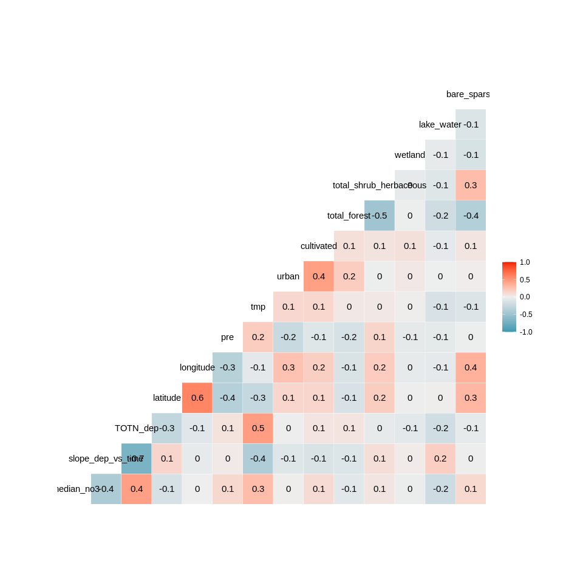<!-- -->

```r
# SHOULD also workaccording to ?element_rect (update ggplot2?)
# gg + theme(plot.margin = margin(.6, .5, .6, 1.7, "cm"))
```


## 5. Tree and forest classification


### Split into training and validation data

```r
set.seed(123)

#
# NOT RELEVANT
#
# x <- runif(nrow(df_analysis))
# train <- ifelse(x < 0.9, TRUE, FALSE)
# 
# train_set <- df_analysis[train,]  %>% 
#   select(-longitude, - latitude) %>%
#   as.data.frame()
# valid_set <- df_analysis[!train,] %>% 
#   select(-longitude, - latitude) %>%
#   as.data.frame()

full_set <- df_analysis  %>% 
  select(-longitude, - latitude) %>%
  as.data.frame()

# plot(full_set)
```


### a. Tree classification using 'party'   

```r
# train_set$X <- 10^train_set$median_no3
# (ct = ctree(X ~ ., data = train_set))

(ct = ctree(as.formula(params$tree_formula), 
            data = full_set))

plot(ct, main="Conditional Inference Tree")
```

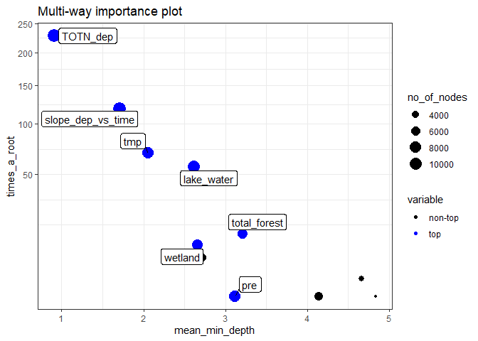<!-- -->

```
## 
## Model formula:
## median_no3 ~ slope_dep_vs_time + TOTN_dep + pre + tmp + urban + 
##     cultivated + total_forest + total_shrub_herbaceous + wetland + 
##     lake_water + bare_sparse
## 
## Fitted party:
## [1] root
## |   [2] TOTN_dep <= 743.05
## |   |   [3] wetland <= 39.918
## |   |   |   [4] slope_dep_vs_time <= -16.79619
## |   |   |   |   [5] bare_sparse <= 0.229: 41.611 (n = 52, err = 35663.7)
## |   |   |   |   [6] bare_sparse > 0.229: 99.571 (n = 7, err = 40403.7)
## |   |   |   [7] slope_dep_vs_time > -16.79619
## |   |   |   |   [8] slope_dep_vs_time <= -7.80595
## |   |   |   |   |   [9] bare_sparse <= 0.003
## |   |   |   |   |   |   [10] slope_dep_vs_time <= -11.43238: 7.144 (n = 26, err = 1535.4)
## |   |   |   |   |   |   [11] slope_dep_vs_time > -11.43238: 18.399 (n = 60, err = 3850.1)
## |   |   |   |   |   [12] bare_sparse > 0.003: 39.821 (n = 28, err = 16031.6)
## |   |   |   |   [13] slope_dep_vs_time > -7.80595
## |   |   |   |   |   [14] pre <= 1138.20007: 8.358 (n = 51, err = 3247.0)
## |   |   |   |   |   [15] pre > 1138.20007
## |   |   |   |   |   |   [16] lake_water <= 8.504: 7.214 (n = 7, err = 85.9)
## |   |   |   |   |   |   [17] lake_water > 8.504: 18.398 (n = 33, err = 3434.7)
## |   |   [18] wetland > 39.918: 243.750 (n = 8, err = 47187.5)
## |   [19] TOTN_dep > 743.05
## |   |   [20] bare_sparse <= 39.614
## |   |   |   [21] TOTN_dep <= 1387.79: 116.661 (n = 139, err = 1509733.5)
## |   |   |   [22] TOTN_dep > 1387.79: 342.643 (n = 17, err = 1424544.8)
## |   |   [23] bare_sparse > 39.614: 299.683 (n = 18, err = 206093.2)
## 
## Number of inner nodes:    11
## Number of terminal nodes: 12
```

### b. Evtree (Evolutionary Learning)   

```r
ev.raw = evtree(as.formula(params$tree_formula), 
                data = full_set)

plot(ev.raw)
```

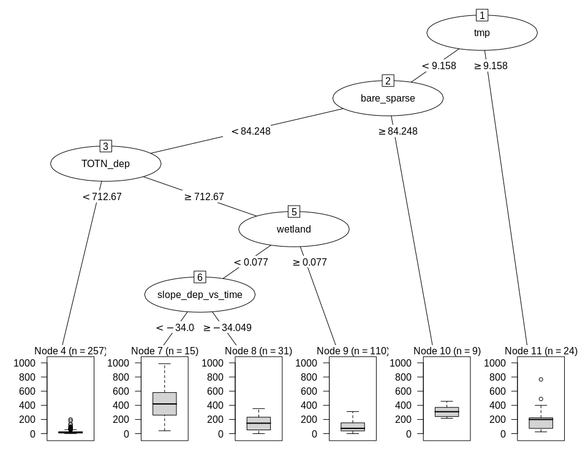<!-- -->


### c. Random forest  
* Model called 'model1'

```r
model1 <- randomForest(as.formula(params$tree_formula), 
                       data = full_set, 
                       mtry = 5,
                       importance = TRUE)

model1
```

```
## 
## Call:
##  randomForest(formula = as.formula(params$tree_formula), data = full_set,      mtry = 5, importance = TRUE) 
##                Type of random forest: regression
##                      Number of trees: 500
## No. of variables tried at each split: 5
## 
##           Mean of squared residuals: 8049.349
##                     % Var explained: 46.01
```


#### c1. Predict on training data
Not relevant here  

#### c2. Importance of variables   
* Classification forests result in   
    - mean_min_depth   
    - accuracy_decrease  
    - gini_decrease  
    - no_of_nodes   
    - times_a_root      
* Regression forests result in     
    - mean_min_depth   
    - mse_increase  
    - node_purity_increase  
    - no_of_nodes   
    - times_a_root      

```r
# Calculation
importance <- measure_importance(model1)
```


```r
plot_multi_way_importance(importance, size_measure = "no_of_nodes", no_of_labels = 6)  
```

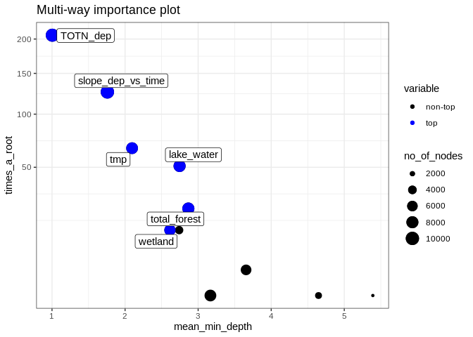<!-- -->

```r
plot_multi_way_importance(importance, x_measure = "mse_increase", y_measure = "node_purity_increase",
                          size_measure = "p_value", no_of_labels = 6)
```

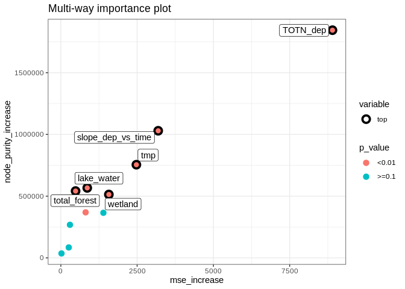<!-- -->

```r
importance %>%
  arrange(desc(times_a_root))
```

```
##                  variable mean_min_depth no_of_nodes mse_increase node_purity_increase
## 1                TOTN_dep       1.004000        9641   8902.77408           1844333.19
## 2       slope_dep_vs_time       1.758000       10088   3190.76899           1029674.71
## 3                     tmp       2.096000        7645   2475.75611            754814.65
## 4              lake_water       2.746000        8095    864.88257            566970.26
## 5            total_forest       2.866000        8129    482.81883            541555.76
## 6             bare_sparse       2.740000        3831   1394.29122            365252.20
## 7                 wetland       2.614000        6916   1573.34339            513594.93
## 8  total_shrub_herbaceous       3.656000        6234    297.85520            268072.13
## 9              cultivated       5.390976        1716     20.59713             36176.05
## 10                    pre       3.168000        7681    811.53193            368962.00
## 11                  urban       4.647496        2780    259.08185             84787.25
##    no_of_trees times_a_root       p_value
## 1          500          206 2.361753e-296
## 2          500          126  0.000000e+00
## 3          500           66  6.319669e-39
## 4          500           51  9.206372e-77
## 5          500           23  4.007982e-80
## 6          500           13  1.000000e+00
## 7          500           13  5.634068e-05
## 8          500            2  9.999996e-01
## 9          494            0  1.000000e+00
## 10         500            0  1.721767e-41
## 11         499            0  1.000000e+00
```


#### c3. Random forest, show partial effects  


```r
# Which variables to include:
variables_for_plot <- importance %>%
  mutate(variable = levels(variable)[as.numeric(variable)]) %>%
  arrange(desc(mse_increase)) %>%    # gini_decrease for classification trees
  pull(variable) %>%
  head(12)   # pick the first 12 variables (or less)

# Calculation

plotdata <- NULL  # will be list for storing results

max_number_of_plots <- length(variables_for_plot)/2 %>% floor()

for (i in 1:max_number_of_plots){
  varno1 <- c(1,3,5,7,9,11)[i]
  varno2 <- varno1 + 1
  plotdata[[i]] <- model1 %>%
    partial(pred.var = variables_for_plot[c(varno1, varno2)], chull = TRUE, progress = "text",
            which.class = "1", prob = TRUE)
}
```


```r
### Extra plots

plotpairs <- params$extra_pairwise_plots %>%
  gsub(" ", "", ., fixed = TRUE) %>%
  strsplit(split = ";") %>%
  .[[1]] %>%
  purrr::map(~strsplit(., split = ",")[[1]])

for (plotvar in plotpairs){
  # print(plotvar)
  if (plotvar[1] %in% names(full_set) & plotvar[2] %in% names(full_set)){
    i <- i + 1
    plotdata[[i]] <- model1 %>%
      partial(pred.var = c(plotvar[1], plotvar[2]), chull = TRUE, progress = "text",
             which.class = "1", prob = TRUE)
  }
}
```


```r
# Find range of predicted values for each graph
ranges <- plotdata %>% purrr::map_dfc(~range(.$yhat))
```

```
## New names:
## * NA -> ...1
## * NA -> ...2
## * NA -> ...3
## * NA -> ...4
## * NA -> ...5
## * ...
```

```r
# use range of all the ranges
for (i in 1:length(plotdata)){
  
  if (params$pairwise_plots_same_scale == "TRUE"){
  
    gg <- plot_pair_number(i, zrange = range(ranges))
    print(gg)
    
  } else {
    
    gg <- plot_pair_number(i)
    print(gg)

  }
  
  # Save gg object for later plotting / changes
  # Saved in Figures/Partial_plots' with name e.g. "gg_164a1_7.rds" for plot number 7
  fn <- paste0(
    "Figures/Partial_plots/gg_",
    stringr::str_extract(params$document_title, "([^[[:blank:]]]+)"),   # extract e.g. "164a1"
    "_", i, ".rds")
  saveRDS(gg, fn)
  
}
```

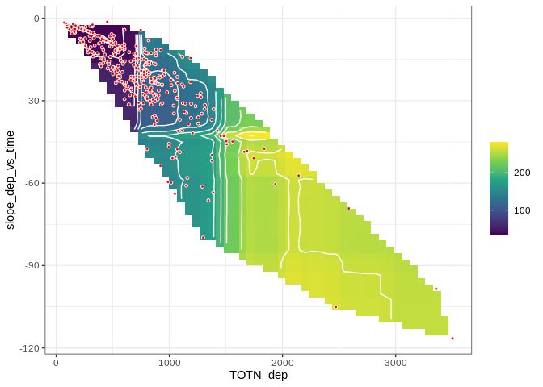<!-- -->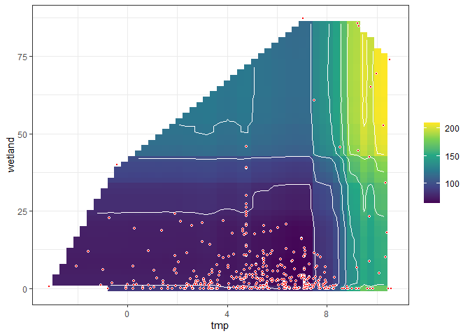<!-- -->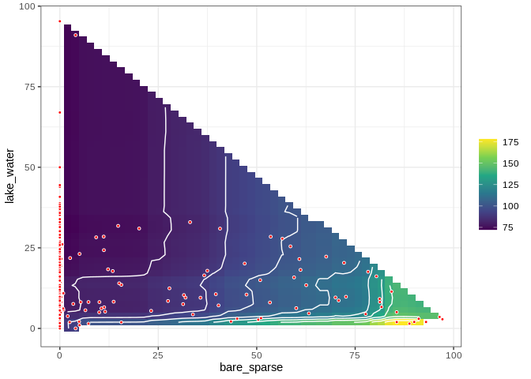<!-- -->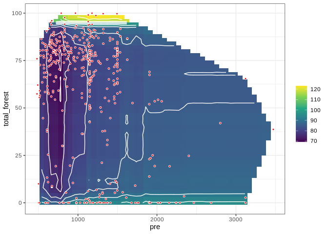<!-- -->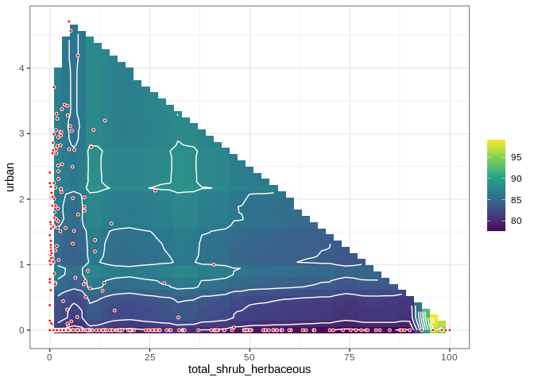<!-- -->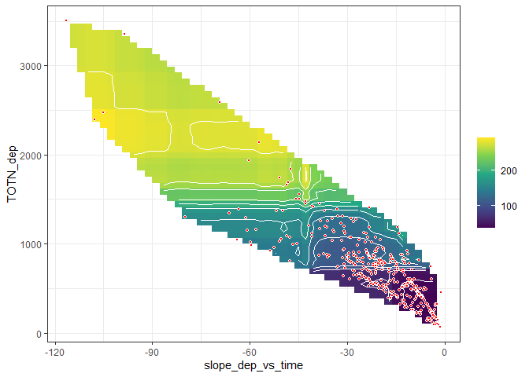<!-- -->


## 6. Linear regression      

```r
fm <- lm(
  as.formula(params$logistic_formula),
  data = df_analysis, 
  na.action = "na.fail")

dredged_models <- dredge(fm)                       # only once
```

```
## Fixed term is "(Intercept)"
```

```r
# saveRDS(dredged_models, "Data/164_all_dredged_models.rds")    # save it as it takes a couple of minutes
# dredged_models <- readRDS("Data/164_all_dredged_models.rds")

# cat("\n\nR2: \n")
# mod1 <- get.models(dredged_models, 1)[[1]]  
# summary(mod1)  
```

### Best models  

```r
# subset(dredged_models, delta < 1)

subset(dredged_models, delta < 2)

# Alternative way of showing result (didn't become any better)
# df <- subset(dredged_models, delta < 2)
# select(as.data.frame(df) %>% round(6), -`(Intercept)`, -logLik, -AICc)
```

```
## Global model call: lm(formula = as.formula(params$logistic_formula), data = df_analysis, 
##     na.action = "na.fail")
## ---
## Model selection table 
##     (Int) lak_wtr slp_dep_vs_tim    tmp ttl_frs ttl_shr_hrb TOT_dep slp_dep_vs_tim:TOT_dep df
## 507 120.6   -3.62          0.365 -6.431  -1.544      -1.376  0.2698               0.001151  9
##        logLik   AICc delta weight
## 507 -2648.715 5315.8     0      1
## Models ranked by AICc(x)
```


### Plots  

```r
# Pick model with lowest AICc
mod1 <- get.models(dredged_models, 1)[[1]]  

modelvars <- get_model_variables(mod1)

# Interactions: 2D plot 
if (length(modelvars$interaction_list) > 0){
  modelvars$interaction_list %>% purrr::walk(
    ~visreg(mod1, .x[1], by = .x[2], scale = "response")
  )
}
```

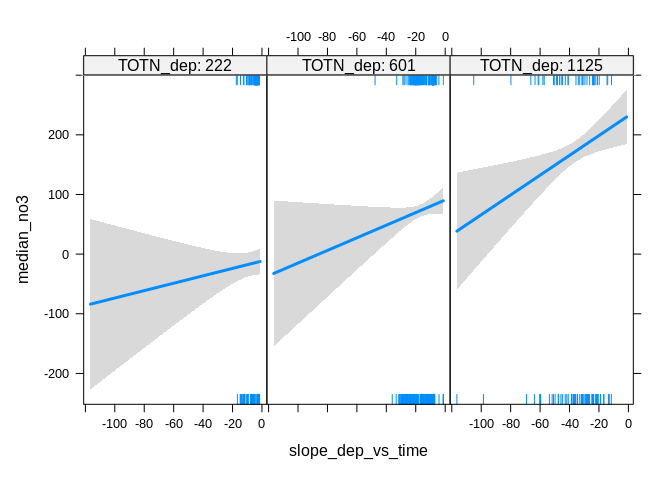<!-- -->

```r
# Additive effects: 1D plot
if (length(modelvars$additive_vars) > 0){
  par(mfrow = c(2,3), mar = c(4,5,2,1), oma = c(0,0,2,0))
  for (var in modelvars$additive_vars)
    visreg(mod1, var, scale = "response")  
}
```

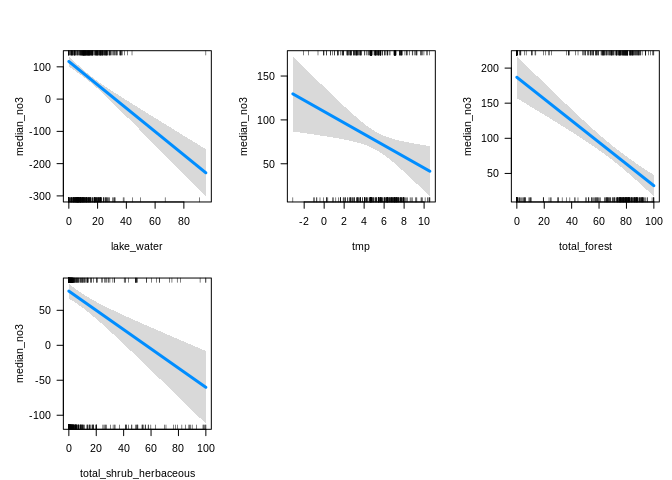<!-- -->

```
## Conditions used in construction of plot
## slope_dep_vs_time: -15.41778
## tmp: 5.425001
## total_forest: 72.75263
## total_shrub_herbaceous: 2.1225
## TOTN_dep: 601.9306
## Conditions used in construction of plot
## lake_water: 11.597
## slope_dep_vs_time: -15.41778
## total_forest: 72.75263
## total_shrub_herbaceous: 2.1225
## TOTN_dep: 601.9306
## Conditions used in construction of plot
## lake_water: 11.597
## slope_dep_vs_time: -15.41778
## tmp: 5.425001
## total_shrub_herbaceous: 2.1225
## TOTN_dep: 601.9306
## Conditions used in construction of plot
## lake_water: 11.597
## slope_dep_vs_time: -15.41778
## tmp: 5.425001
## total_forest: 72.75263
## TOTN_dep: 601.9306
```


