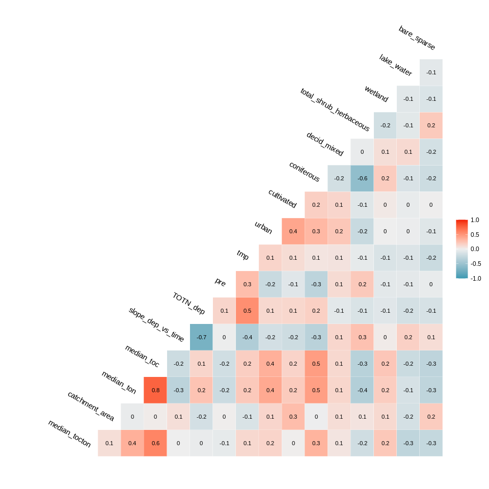
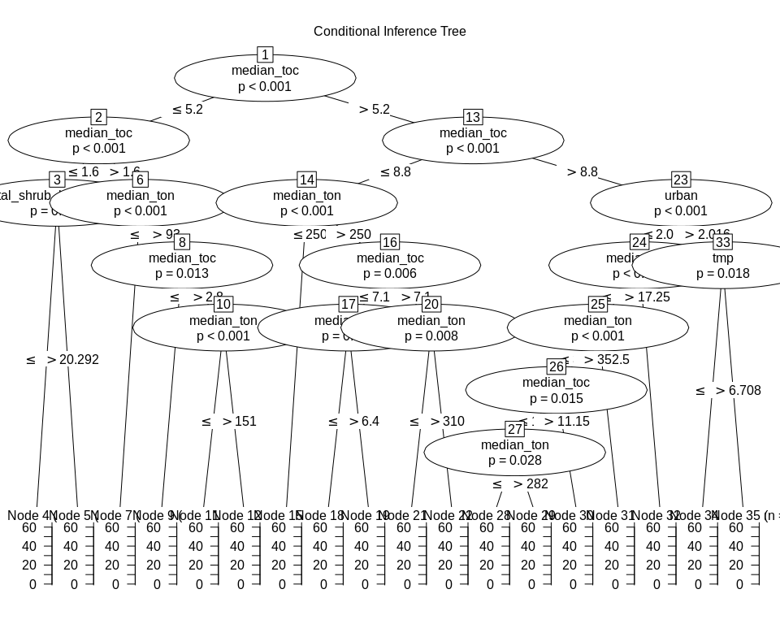
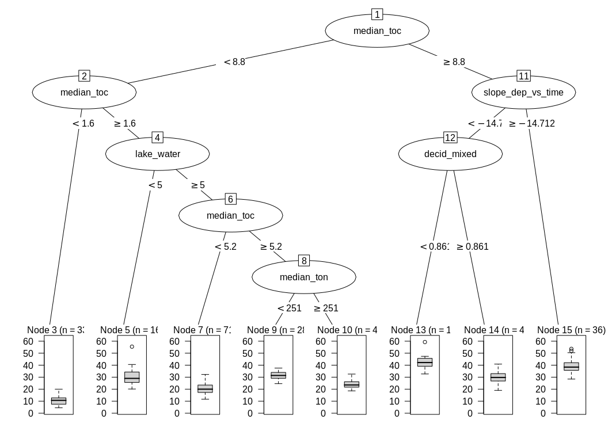

**Analysis of TOC/TON medians (2012-2016)**   

**Dataset: TOC/TON medians data set**   
**Name of dataset: medians_2012-2016_toc_totn_no3.csv**   


* Response variable: 'Current NO3 level' (locations with signif. *increase* are *not* excluded)  
* Data from https://github.com/JamesSample/icpw2/tree/master/thematic_report_2020/results      
* Sen slope of NO3, TON, TOC/TON etc. 1992-2016
* Response variable in all analyses are *whether NO3 decreases or not*     
* Predictors:
    - slope_dep_vs_time: Trend in Tot-N deposition 1992-2016    
    - NO3, TOTN_dep: Medians of NO3, TOTN_dep (Tot-N deposition) 1992-2016   
    - catchment_area (if included in data)      
    - TOC: Medians of TOC 1992-2016 (if included in data)     
    - pre, tmp: mean precipitation + temp   
    - Land cover 
  
Technical details: This html file was created was 

## 1. Libraries  

```r
# All of these packages cn be loaded at once using library(tidyverse). (I just like to be specific.)
library(dplyr)
library(tidyr)      # pivot_wider
library(purrr)      # 'map' functions  
library(lubridate)  
library(ggplot2)

# Too many packages, not all are used
# library(mapview)
library(visreg)     # visreg
library(rkt)        # Theil -Sen Regression

library(MuMIn)      

# Trees and forests
library(party)                  # ctree
library(evtree)                 # evtree
library(randomForest)
library(randomForestExplainer)  # measure_importance, plot_multi_way_importance
library(pdp)                    # partial, autoplot

library(maps)
my_map <- map_data("world")

library(effects)    # handles lme models  
library(readxl)
library(readr)
library(stringr)    # str_extract

source("002_Functions.R")
source("160parm_functions.R")

knitr::opts_chunk$set(results = 'hold') # collect the results from a chunk  
knitr::opts_chunk$set(warning = FALSE)  

options(width = 95)
```


## 2. Data  
* The data part (part 2) is quite similar in scripts 160 - 165 

### Available files

```
## Medians results: 'medians_2012-2016_no3.csv' ,n = 494 
## 
## Number of values per variable: 
## 
## Medians results: 'medians_2012-2016_toc_totn_no3.csv' ,n = 310 
## 
## Number of values per variable:
```

### James' trends and medians     

```r
#
# Median results 2012-2016  
#
folder <- "https://github.com/JamesSample/icpw2/raw/master/thematic_report_2020/results/medians_2012-2016"
file <- params$medians_filename
fn <- paste0(folder, "/", file)
df_medians <- read.csv(fn, encoding = "UTF-8")
cat("Medians results:", sQuote(file), ",n =", nrow(df_medians), "\n\n")  
cat("Number of values per variable: \n")
apply(!is.na(df_medians), 2, sum)
cat("\n")

# Station metadata
# WILL BE ADDED TOGETHER WITH LAND COVER, BELOW
# file_meta <- gsub(".csv", "_stations.csv", file)
# fn <- paste0(folder, "/", file_meta)
# df_metadata <- read.csv(fn, encoding = "UTF-8")
# cat("Regression result metadata:", sQuote(file_meta), ",n =",  
#      nrow(df_metadata), "\n\n")


#
# Regression results 1992-2016
#
folder <- "https://github.com/JamesSample/icpw2/raw/master/thematic_report_2020/results/trends_1992-2016_no3"
file <- "trends_1992-2016_no3_results.csv"
fn <- paste0(folder, "/", file)
df_trends <- read.csv(fn, encoding = "UTF-8")
cat("Trends used as predictor variable:", sQuote(file), ",n =", nrow(df_trends), "\n\n")
```

```
## Medians results: 'medians_2012-2016_toc_totn_no3.csv' ,n = 310 
## 
## Number of values per variable: 
##   station_id NH4.N_µg.l.N NO3.N_µg.l.N   TOC_mg.C.l  TOTN_µg.l.N  TOTP_µg.l.P   TON_µg.l.N 
##          310          225          310          310          310          229          310 
##    TOTN.TOTP     NO3.TOTP      TOC.TON     TOC.TOTP 
##          229          229          310          229 
## 
## Trends used as predictor variable: 'trends_1992-2016_no3_results.csv' ,n = 3176
```


### Start 'dat'  
Using medians    
* Make one line per station   
* Also including some trends for  

```r
# table(reg_no3$variable)

# Medians 2012-2016  
df1 <- df_medians %>%
  select(station_id, `NO3.N_µg.l.N`, `TON_µg.l.N`, `TON_µg.l.N`, `TOC_mg.C.l`, TOC.TON) %>%
  rename(median_no3 = `NO3.N_µg.l.N`,
         median_ton = `TON_µg.l.N`,
         median_ton = `TON_µg.l.N`,
         median_toc = `TOC_mg.C.l`,
         median_tocton = `TOC.TON`) %>%
  mutate(log_median_no3 = log10(median_no3 + 0.1),
         log_median_ton = log10(median_ton),
         log_median_ton = log10(median_ton),
         log_median_toc = log10(median_toc),
         log_median_tocton = log10(median_tocton))

# Some trends
df2 <- df_trends %>% # table()
  filter(variable %in% c("NO3-N_µg/l N", "TOTN_µg/l N", "TOC_mg C/l")) %>%
  select(station_id, variable, median) %>%
  tidyr::pivot_wider(names_from = "variable", values_from = "median") %>% # str()
  rename(trend_NO3 = `NO3-N_µg/l N`,
         trend_TOTN = `TOTN_µg/l N`,
         slope_toc_vs_time = `TOC_mg C/l`)

cat("\n")
cat("df1, n =", nrow(df1), "\n")
cat("df2, n =", nrow(df2), "\n")

dat_1_allrows <- df1 %>%
  left_join(df2, by = "station_id")

response_var <- str_extract(params$tree_formula, "[^[[:blank:]]]+")

cat("dat_1_allrows, n =", nrow(dat_1_allrows), 
    " (may include series where", response_var,  "= NA)\n")

sel <- !is.na(dat_1_allrows[[response_var]])

dat_1 <- dat_1_allrows[sel,]

cat("dat_1, n =", nrow(dat_1), 
    " (series where", response_var,  "has values)\n")
```

```
## 
## df1, n = 310 
## df2, n = 498 
## dat_1_allrows, n = 310  (may include series where median_tocton = NA)
## dat_1, n = 310  (series where median_tocton has values)
```


```r
sum(is.na(dat_1$log_median_no3))
sum(is.na(dat_1$log_median_tocton))
```

```
## [1] 0
## [1] 0
```


### Deposition trends and median 1992-2006     

```r
fn <- "https://github.com/JamesSample/icpw2/raw/master/thematic_report_2020/results/deposition/totn_dep_trends_icpw_stns.csv"  

df_deposition <- read.csv(fn) %>% 
  filter(variable == "totn_mgNpm2")  

cat("n =", nrow(df_deposition), "\n")
```

```
## n = 556
```


### Add deposition slope and medians to data  

```r
# debugonce(left_join2)
dat_2 <- dat_1 %>% 
  left_join2(df_deposition %>% 
              select(station_id, median, sen_slp, mk_p_val) %>%
              rename(TOTN_dep = median,
                     slope_dep_vs_time = sen_slp,
                     p_dep_vs_time = mk_p_val),
             by = "station_id",
             print_vars = TRUE)
```

```
## Variables before join: 
## 'station_id', 'median_no3', 'median_ton', 'median_toc', 'median_tocton', 'log_median_no3', 'log_median_ton', 'log_median_toc', 'log_median_tocton', 'trend_NO3', 'slope_toc_vs_time', 'trend_TOTN'
## 
## Variables used to join: 
## 'station_id'
## 
## Variables added: 
## 'TOTN_dep', 'slope_dep_vs_time', 'p_dep_vs_time'
```

### Add medians and station metadata   


```r
# dat_2 <- dat_2 %>%
#   left_join(df_metadata, by = "station_id")

# cat("dat_2, n =", nrow(dat_2), "\n")

# Simplify names by removing units
# names(dat_2)
# names(dat_2) <- sub(".N_µg.l.N", "", names(dat_2))
# names(dat_2) <- sub("_mg.C.l", "", names(dat_2))
# names(dat_2) <- sub("_µg.l.P", "", names(dat_2))

# cat("\nVariable names: \n")
# names(dat_2)
```

### Add climate and deposition medians and slopes  

```r
fn <- "https://github.com/JamesSample/icpw2/raw/master/thematic_report_2020/results/climate/cru_climate_trends_icpw_stns.csv"

df_climate_mean <- read_csv(fn) %>% 
  select(station_id, variable, median) %>%
  pivot_wider(names_from = "variable", values_from = "median")
```

```
## Rows: 1112 Columns: 8
## ── Column specification ───────────────────────────────────────────────────────────────────────
## Delimiter: ","
## chr (3): variable, mk_trend, sen_trend
## dbl (5): station_id, median, mk_p_val, sen_slp, sen_incpt
## 
## ℹ Use `spec()` to retrieve the full column specification for this data.
## ℹ Specify the column types or set `show_col_types = FALSE` to quiet this message.
```

```r
cat("\n")
# names(df_climate_mean)

df_climate_slope <- read_csv(fn) %>%
  select(station_id, variable, sen_slp) %>%
  pivot_wider(names_from = "variable", values_from = "sen_slp", names_prefix = "slope_")
```

```
## Rows: 1112 Columns: 8
## ── Column specification ───────────────────────────────────────────────────────────────────────
## Delimiter: ","
## chr (3): variable, mk_trend, sen_trend
## dbl (5): station_id, median, mk_p_val, sen_slp, sen_incpt
## 
## ℹ Use `spec()` to retrieve the full column specification for this data.
## ℹ Specify the column types or set `show_col_types = FALSE` to quiet this message.
```

```r
# Add
dat_3 <- dat_2 %>%
  left_join2(df_climate_mean, by = "station_id", print_vars = TRUE) %>%
  left_join2(df_climate_slope, by = "station_id", print_vars = TRUE)
```

```
## 
## Variables before join: 
## 'station_id', 'median_no3', 'median_ton', 'median_toc', 'median_tocton', 'log_median_no3', 'log_median_ton', 'log_median_toc', 'log_median_tocton', 'trend_NO3', 'slope_toc_vs_time', 'trend_TOTN', 'TOTN_dep', 'slope_dep_vs_time', 'p_dep_vs_time'
## 
## Variables used to join: 
## 'station_id'
## 
## Variables added: 
## 'pre', 'tmp'
## Variables before join: 
## 'station_id', 'median_no3', 'median_ton', 'median_toc', 'median_tocton', 'log_median_no3', 'log_median_ton', 'log_median_toc', 'log_median_tocton', 'trend_NO3', 'slope_toc_vs_time', 'trend_TOTN', 'TOTN_dep', 'slope_dep_vs_time', 'p_dep_vs_time', 'pre', 'tmp'
## 
## Variables used to join: 
## 'station_id'
## 
## Variables added: 
## 'slope_pre', 'slope_tmp'
```

### Combine land cover types   
* Data including UK read using script 159   
* Note: also includes metadata (country, etc.)
* bare_sparse = bare_rock + sparsely_vegetated + glacier   
* Select: coniferous, deciduous, lake, mixed_forest, wetland, bare_sparse   


```r
# df_landcover3_OLD <- readRDS("Data/159_df_landcover3.rds")
df_landcover3 <- readRDS("Data/159_df_meta3.rds")

df_landcover3 <- df_landcover3 %>%
  mutate(bare_sparse = bare_rock + sparsely_vegetated + glacier,
         decid_mixed = deciduous + mixed_forest,
         lake_water = lake + water_ex_lake) %>%
  select(-c(bare_rock, sparsely_vegetated, glacier, deciduous, mixed_forest, lake, water_ex_lake))
```


### Add land cover columns to main data    

```r
dat_4 <- left_join2(dat_3, 
                   df_landcover3, 
                   by = "station_id", 
                   print_vars = TRUE
)
```

```
## Variables before join: 
## 'station_id', 'median_no3', 'median_ton', 'median_toc', 'median_tocton', 'log_median_no3', 'log_median_ton', 'log_median_toc', 'log_median_tocton', 'trend_NO3', 'slope_toc_vs_time', 'trend_TOTN', 'TOTN_dep', 'slope_dep_vs_time', 'p_dep_vs_time', 'pre', 'tmp', 'slope_pre', 'slope_tmp'
## 
## Variables used to join: 
## 'station_id'
## 
## Variables added: 
## 'station_code', 'station_name', 'latitude', 'longitude', 'altitude', 'continent', 'country', 'region', 'group', 'catchment_area', 'urban', 'cultivated', 'total_forest', 'coniferous', 'total_shrub_herbaceous', 'grasslands', 'heathlands', 'transitional_woodland_shrub', 'wetland', 'other', 'bare_sparse', 'decid_mixed', 'lake_water'
```


### Drop locations with >5% cultivated and >5% urban     
- also excluding stations 23517, 38273    

```r
cultivated_threshold <- 5
urban_threshold <- 5

dat_5 <- dat_4 %>%
  filter2(!station_id %in% c(23517, 38273), text = "Deleted stations 23517, 38273") %>%
  filter2(cultivated <= cultivated_threshold, 
          text = paste("Deleted stations with >", cultivated_threshold, "% cultivated")) %>%
  filter2(urban <= urban_threshold, 
          text = paste("Deleted stations with >", urban_threshold, "% urban"))
```

```
## Removed 1 rows (Deleted stations 23517, 38273)
## Removed 15 rows (Deleted stations with > 5 % cultivated)
## Removed 6 rows (Deleted stations with > 5 % urban)
```


### Data set used  

```r
dat <- dat_5
```


## 3. Plot data      


```r
gg <- ggplot(dat, aes(TOTN_dep, median_no3)) + 
  geom_point(aes(color = country)) +
  geom_hline(yintercept = 0, linetype = 2) + 
  geom_vline(xintercept = 0, linetype = 2) 
  
gg
```

<!-- -->


## 4. Select data   

### a. Selection of variables    
* Select variables to use, and thereby also cases  
* Also remove PL05, which has dubious values   

```r
add_flag_variable <- function(data, variable_string){
  variable_string <- gsub(" ", "", variable_string)
  variables <- strsplit(variable_string, split = ",")[[1]]
  # Check if all variables are there
  found <- variables %in% names(data)
  if (sum(!found) > 0)
    stop("Not all variables found in data:", 
      paste(variables[!found], collapse = " ,"), 
      "\n")
  # Data for analyses
  complete <- complete.cases(data[variables])
  data$Row_excluded <- !complete
  variables %>% 
    purrr::map_dfr(~data.frame(Var = .x, Missing = sum(is.na(data[[.x]])))) %>%
    print()
  data
}

delete_unused_variables <- function(data, variable_string){
  variable_string <- gsub(" ", "", variable_string)
  variables <- strsplit(variable_string, split = ",")[[1]]
  data[variables]
}

cat("-------------------------------------------------------------\n")
cat("Variables: \n")
cat(params$selected_vars)
cat("\n-------------------------------------------------------------\n")

dat <- dat %>%
  filter2(!station_code %in% "PL05", text = "station PL05 (has dubious NO3 data)")

# debugonce(add_flag_variable)
# df_analysis <- add_flag_variable(dat, vars)  
df_analysis_allrows <- add_flag_variable(dat, params$selected_vars)  

# Save to excel
fn <- paste0(substr(params$document_title, 1, 3), "_", response_var, "_data.xlsx")
writexl::write_xlsx(df_analysis_allrows, paste0("Data_analysed/", fn))
cat("\nDataset after removing urban, cultivated, PL05 saved as", sQuote(fn), "\n\n")

cat("Number of rows that will be excluded: \n")
table(df_analysis_allrows$Row_excluded)

cat("\n\n")
cat("Number of complete observations by country: \n")
xtabs(~country + Row_excluded, df_analysis_allrows)

# Keep only complete cases
df_analysis <- df_analysis_allrows %>%
  filter(!Row_excluded)

# Save to excel
fn <- paste0(
  stringr::str_extract(params$document_title, "[^[[:blank:]]]+"),
  "_data.xlsx")
writexl::write_xlsx(df_analysis, paste0("Data_analysed/", fn))

# Remove variables that will note be used
df_analysis <- delete_unused_variables(df_analysis, params$selected_vars)

cat("\n\n")
cat("Data before removing PL05: n =", nrow(dat_5), "\n")
cat("Data after removing PL05: n =", nrow(df_analysis_allrows), "\n")
cat("Data after removing missing predictors: n =", nrow(df_analysis), "\n")
```

```
## -------------------------------------------------------------
## Variables: 
## median_tocton,catchment_area, median_ton, median_toc,slope_dep_vs_time, TOTN_dep,latitude, longitude,pre, tmp, urban, cultivated, coniferous, decid_mixed, total_shrub_herbaceous,wetland, lake_water, bare_sparse
## -------------------------------------------------------------
## Removed 0 rows (station PL05 (has dubious NO3 data))
##                       Var Missing
## 1           median_tocton       0
## 2          catchment_area       0
## 3              median_ton       0
## 4              median_toc       0
## 5       slope_dep_vs_time       0
## 6                TOTN_dep       0
## 7                latitude       0
## 8               longitude       0
## 9                     pre       0
## 10                    tmp       0
## 11                  urban       0
## 12             cultivated       0
## 13             coniferous       3
## 14            decid_mixed       3
## 15 total_shrub_herbaceous       0
## 16                wetland       0
## 17             lake_water       0
## 18            bare_sparse       0
## 
## Dataset after removing urban, cultivated, PL05 saved as '164_median_tocton_data.xlsx' 
## 
## Number of rows that will be excluded: 
## 
## FALSE  TRUE 
##   285     3 
## 
## 
## Number of complete observations by country: 
##                 Row_excluded
## country          FALSE TRUE
##   Canada            67    3
##   Czech Republic     2    0
##   Finland           22    0
##   Germany            1    0
##   Italy              3    0
##   Latvia             1    0
##   Norway            80    0
##   Sweden            87    0
##   United Kingdom    22    0
## 
## 
## Data before removing PL05: n = 288 
## Data after removing PL05: n = 288 
## Data after removing missing predictors: n = 285
```


### b. Correlations   

```r
df_correlationplot <- df_analysis %>% 
   select(-longitude, - latitude)

gg <- GGally::ggcorr(
  df_correlationplot, 
  method = c("complete.obs", "kendall"), 
  label = TRUE,
  label_size = 3,
  hjust = 0.9, angle = -30) # +                    # slanted labels
gg <- gg + 
  coord_cartesian(x = c(-2, ncol(df_correlationplot)), 
                  y = c(0, ncol(df_correlationplot) + 1))  # fix margins
```

```
## Coordinate system already present. Adding new coordinate system, which will replace the existing one.
```

```r
run_code <- stringr::str_extract(params$document_title, "([^[[:blank:]]]+)")   # extract e.g. "164a1"
fn <- paste0("Figures/Correlation_matrices/", run_code,
             "_correlationplot.png")
ggsave(fn, gg, width = 9, height = 9, dpi = 400)

gg
```

<!-- -->


## 5. Tree and forest classification


### Split into training and validation data

```r
set.seed(123)

#
# NOT RELEVANT
#
# x <- runif(nrow(df_analysis))
# train <- ifelse(x < 0.9, TRUE, FALSE)
# 
# train_set <- df_analysis[train,]  %>% 
#   select(-longitude, - latitude) %>%
#   as.data.frame()
# valid_set <- df_analysis[!train,] %>% 
#   select(-longitude, - latitude) %>%
#   as.data.frame()

full_set <- df_analysis  %>% 
  select(-longitude, - latitude) %>%
  as.data.frame()

# plot(full_set)
```


### a. Tree classification using 'party'   

```r
# train_set$X <- 10^train_set$median_no3
# (ct = ctree(X ~ ., data = train_set))

(ct = ctree(as.formula(params$tree_formula), 
            data = full_set))

plot(ct, main="Conditional Inference Tree")
```

<!-- -->

```
## 
## Model formula:
## median_tocton ~ catchment_area + median_ton + median_toc + slope_dep_vs_time + 
##     TOTN_dep + pre + tmp + urban + cultivated + coniferous + 
##     decid_mixed + total_shrub_herbaceous + wetland + lake_water + 
##     bare_sparse
## 
## Fitted party:
## [1] root
## |   [2] median_toc <= 5.2
## |   |   [3] median_toc <= 1.6
## |   |   |   [4] total_shrub_herbaceous <= 20.292: 6.988 (n = 12, err = 68.4)
## |   |   |   [5] total_shrub_herbaceous > 20.292: 12.810 (n = 23, err = 329.1)
## |   |   [6] median_toc > 1.6
## |   |   |   [7] median_ton <= 93: 29.875 (n = 10, err = 1067.6)
## |   |   |   [8] median_ton > 93
## |   |   |   |   [9] median_toc <= 2.8: 17.208 (n = 20, err = 226.8)
## |   |   |   |   [10] median_toc > 2.8
## |   |   |   |   |   [11] median_ton <= 151: 27.875 (n = 15, err = 209.8)
## |   |   |   |   |   [12] median_ton > 151: 20.334 (n = 37, err = 366.9)
## |   [13] median_toc > 5.2
## |   |   [14] median_toc <= 8.8
## |   |   |   [15] median_ton <= 250: 31.316 (n = 31, err = 353.8)
## |   |   |   [16] median_ton > 250
## |   |   |   |   [17] median_toc <= 7.1
## |   |   |   |   |   [18] median_toc <= 6.4: 21.794 (n = 13, err = 28.0)
## |   |   |   |   |   [19] median_toc > 6.4: 24.102 (n = 7, err = 4.7)
## |   |   |   |   [20] median_toc > 7.1
## |   |   |   |   |   [21] median_ton <= 310: 28.615 (n = 13, err = 88.4)
## |   |   |   |   |   [22] median_ton > 310: 23.039 (n = 9, err = 66.9)
## |   |   [23] median_toc > 8.8
## |   |   |   [24] urban <= 2.0161
## |   |   |   |   [25] median_toc <= 17.25
## |   |   |   |   |   [26] median_ton <= 352.5
## |   |   |   |   |   |   [27] median_toc <= 11.15
## |   |   |   |   |   |   |   [28] median_ton <= 282: 37.800 (n = 17, err = 367.5)
## |   |   |   |   |   |   |   [29] median_ton > 282: 32.876 (n = 8, err = 96.7)
## |   |   |   |   |   |   [30] median_toc > 11.15: 42.302 (n = 16, err = 203.1)
## |   |   |   |   |   [31] median_ton > 352.5: 31.100 (n = 19, err = 461.6)
## |   |   |   |   [32] median_toc > 17.25: 45.232 (n = 8, err = 477.9)
## |   |   |   [33] urban > 2.0161
## |   |   |   |   [34] tmp <= 6.70833: 31.916 (n = 13, err = 134.4)
## |   |   |   |   [35] tmp > 6.70833: 26.103 (n = 14, err = 343.6)
## 
## Number of inner nodes:    17
## Number of terminal nodes: 18
```

### b. Evtree (Evolutionary Learning)   

```r
ev.raw = evtree(as.formula(params$tree_formula), 
                data = full_set)

plot(ev.raw)
```

<!-- -->

```r
# dir.create("Figures/Methods")

run_code <- stringr::str_extract(params$document_title, "([^[[:blank:]]]+)")   # extract e.g. "164a1"
png(paste0("Figures/Methods/Example_tree_", run_code, ".png"), width = 16, height = 12, units = "in", res = 150)
plot(ev.raw)
dev.off()
```

```
## png 
##   2
```
