<<<<<<< HEAD

=======
>>>>>>> e5a7972e37222771881a7ff3ac9997f6a8a047b5
**Analysis of TOC/TON medians (2012-2016)**   

**Dataset: TOC/TON medians data set**   
**Name of dataset: medians_2012-2016_toc_totn_no3.csv**   


* Response variable: 'Current NO3 level' (locations with signif. *increase* are *not* excluded)  
* Data from https://github.com/JamesSample/icpw2/tree/master/thematic_report_2020/results      
<<<<<<< HEAD
* Sen slope of NO3, TOTN, TOC/TON etc. 1992-2016
=======
* Sen slope of NO3, TON, TOC/TON etc. 1992-2016
>>>>>>> e5a7972e37222771881a7ff3ac9997f6a8a047b5
* Response variable in all analyses are *whether NO3 decreases or not*     
* Predictors:
    - slope_dep_vs_time: Trend in Tot-N deposition 1992-2016    
    - NO3, TOTN_dep: Medians of NO3, TOTN_dep (Tot-N deposition) 1992-2016   
    - catchment_area (if included in data)      
    - TOC: Medians of TOC 1992-2016 (if included in data)     
    - pre, tmp: mean precipitation + temp   
    - Land cover 
  
Technical details: This html file was created was 

## 1. Libraries  

```r
# All of these packages cn be loaded at once using library(tidyverse). (I just like to be specific.)
library(dplyr)
library(tidyr)      # pivot_wider
library(purrr)      # 'map' functions  
library(lubridate)  
library(ggplot2)

# Too many packages, not all are used
# library(mapview)
library(visreg)     # visreg
library(rkt)        # Theil -Sen Regression

library(MuMIn)      

# Trees and forests
library(party)                  # ctree
library(evtree)                 # evtree
library(randomForest)
library(randomForestExplainer)  # measure_importance, plot_multi_way_importance
library(pdp)                    # partial, autoplot

library(maps)
my_map <- map_data("world")

library(effects)    # handles lme models  
library(readxl)
library(readr)
<<<<<<< HEAD
=======
library(stringr)    # str_extract
>>>>>>> e5a7972e37222771881a7ff3ac9997f6a8a047b5

source("002_Functions.R")
source("160parm_functions.R")

knitr::opts_chunk$set(results = 'hold') # collect the results from a chunk  
knitr::opts_chunk$set(warning = FALSE)  

options(width = 95)
```


## 2. Data  
<<<<<<< HEAD
* The data part (part 2) is quite similar in scripts 160-164 
=======
* The data part (part 2) is quite similar in scripts 160 - 165 
>>>>>>> e5a7972e37222771881a7ff3ac9997f6a8a047b5

### Available files

```
## Medians results: 'medians_2012-2016_no3.csv' ,n = 494 
## 
## Number of values per variable: 
## 
## Medians results: 'medians_2012-2016_toc_totn_no3.csv' ,n = 310 
## 
## Number of values per variable:
```

### James' trends and medians     

```r
#
# Median results 2012-2016  
#
folder <- "https://github.com/JamesSample/icpw2/raw/master/thematic_report_2020/results/medians_2012-2016"
file <- params$medians_filename
fn <- paste0(folder, "/", file)
df_medians <- read.csv(fn, encoding = "UTF-8")
cat("Medians results:", sQuote(file), ",n =", nrow(df_medians), "\n\n")  
cat("Number of values per variable: \n")
apply(!is.na(df_medians), 2, sum)
cat("\n")

# Station metadata
# WILL BE ADDED TOGETHER WITH LAND COVER, BELOW
# file_meta <- gsub(".csv", "_stations.csv", file)
# fn <- paste0(folder, "/", file_meta)
# df_metadata <- read.csv(fn, encoding = "UTF-8")
# cat("Regression result metadata:", sQuote(file_meta), ",n =",  
#      nrow(df_metadata), "\n\n")


#
# Regression results 1992-2016
#
folder <- "https://github.com/JamesSample/icpw2/raw/master/thematic_report_2020/results/trends_1992-2016_no3"
file <- "trends_1992-2016_no3_results.csv"
fn <- paste0(folder, "/", file)
df_trends <- read.csv(fn, encoding = "UTF-8")
cat("Trends used as predictor variable:", sQuote(file), ",n =", nrow(df_trends), "\n\n")
```

```
## Medians results: 'medians_2012-2016_toc_totn_no3.csv' ,n = 310 
## 
## Number of values per variable: 
##   station_id NH4.N_µg.l.N NO3.N_µg.l.N   TOC_mg.C.l  TOTN_µg.l.N  TOTP_µg.l.P   TON_µg.l.N 
##          310          225          310          310          310          229          310 
##    TOTN.TOTP     NO3.TOTP      TOC.TON     TOC.TOTP 
##          229          229          310          229 
## 
## Trends used as predictor variable: 'trends_1992-2016_no3_results.csv' ,n = 3176
```

### Start 'dat'  
Using medians    
* Make one line per station   
* Also including some trends for  

```r
# table(reg_no3$variable)

# Medians 2012-2016  
df1 <- df_medians %>%
<<<<<<< HEAD
  select(station_id, `NO3.N_µg.l.N`, `TOTN_µg.l.N`, `TON_µg.l.N`, `TOC_mg.C.l`, TOC.TON) %>%
  rename(median_no3 = `NO3.N_µg.l.N`,
         median_totn = `TOTN_µg.l.N`,
=======
  select(station_id, `NO3.N_µg.l.N`, `TON_µg.l.N`, `TON_µg.l.N`, `TOC_mg.C.l`, TOC.TON) %>%
  rename(median_no3 = `NO3.N_µg.l.N`,
         median_ton = `TON_µg.l.N`,
>>>>>>> e5a7972e37222771881a7ff3ac9997f6a8a047b5
         median_ton = `TON_µg.l.N`,
         median_toc = `TOC_mg.C.l`,
         median_tocton = `TOC.TON`) %>%
  mutate(log_median_no3 = log10(median_no3 + 0.1),
<<<<<<< HEAD
         log_median_totn = log10(median_totn),
=======
         log_median_ton = log10(median_ton),
>>>>>>> e5a7972e37222771881a7ff3ac9997f6a8a047b5
         log_median_ton = log10(median_ton),
         log_median_toc = log10(median_toc),
         log_median_tocton = log10(median_tocton))

# Some trends
df2 <- df_trends %>% # table()
  filter(variable %in% c("NO3-N_µg/l N", "TOTN_µg/l N", "TOC_mg C/l")) %>%
  select(station_id, variable, median) %>%
  tidyr::pivot_wider(names_from = "variable", values_from = "median") %>% # str()
  rename(trend_NO3 = `NO3-N_µg/l N`,
         trend_TOTN = `TOTN_µg/l N`,
         trend_TOC = `TOC_mg C/l`)

cat("\n")
cat("df1, n =", nrow(df1), "\n")
cat("df2, n =", nrow(df2), "\n")

<<<<<<< HEAD
dat_1 <- df1 %>%
  left_join(df2, by = "station_id")

cat("dat_1, n =", nrow(dat_1), "\n")
=======
dat_1_allrows <- df1 %>%
  left_join(df2, by = "station_id")

response_var <- str_extract(params$tree_formula, "[^[[:blank:]]]+")

cat("dat_1_allrows, n =", nrow(dat_1_allrows), 
    " (may include series where", response_var,  "= NA)\n")

sel <- !is.na(dat_1_allrows[[response_var]])

dat_1 <- dat_1_allrows[sel,]

cat("dat_1, n =", nrow(dat_1), 
    " (series where", response_var,  "has values)\n")
>>>>>>> e5a7972e37222771881a7ff3ac9997f6a8a047b5
```

```
## 
## df1, n = 310 
## df2, n = 498 
<<<<<<< HEAD
## dat_1, n = 310
```


=======
## dat_1_allrows, n = 310  (may include series where median_tocton = NA)
## dat_1, n = 310  (series where median_tocton has values)
```


```r
sum(is.na(dat_1$log_median_no3))
sum(is.na(dat_1$log_median_tocton))
```

```
## [1] 0
## [1] 0
```

>>>>>>> e5a7972e37222771881a7ff3ac9997f6a8a047b5
### Deposition trends and median 1992-2006     

```r
fn <- "https://github.com/JamesSample/icpw2/raw/master/thematic_report_2020/results/deposition/totn_dep_trends_icpw_stns.csv"  

df_deposition <- read.csv(fn) %>% 
  filter(variable == "totn_mgNpm2")  

cat("n =", nrow(df_deposition), "\n")
```

```
## n = 556
```


### Add deposition slope and medians to data  

```r
# debugonce(left_join2)
dat_2 <- dat_1 %>% 
  left_join2(df_deposition %>% 
              select(station_id, median, sen_slp, mk_p_val) %>%
              rename(TOTN_dep = median,
                     slope_dep_vs_time = sen_slp,
                     p_dep_vs_time = mk_p_val),
             by = "station_id",
             print_vars = TRUE)
```

```
## Variables before join: 
<<<<<<< HEAD
## 'station_id', 'median_no3', 'median_totn', 'median_ton', 'median_toc', 'median_tocton', 'log_median_no3', 'log_median_totn', 'log_median_ton', 'log_median_toc', 'log_median_tocton', 'trend_NO3', 'trend_TOC', 'trend_TOTN'
=======
## 'station_id', 'median_no3', 'median_ton', 'median_toc', 'median_tocton', 'log_median_no3', 'log_median_ton', 'log_median_toc', 'log_median_tocton', 'trend_NO3', 'trend_TOC', 'trend_TOTN'
>>>>>>> e5a7972e37222771881a7ff3ac9997f6a8a047b5
## 
## Variables used to join: 
## 'station_id'
## 
## Variables added: 
## 'TOTN_dep', 'slope_dep_vs_time', 'p_dep_vs_time'
```

### Add medians and station metadata   


```r
# dat_2 <- dat_2 %>%
#   left_join(df_metadata, by = "station_id")

# cat("dat_2, n =", nrow(dat_2), "\n")

# Simplify names by removing units
# names(dat_2)
# names(dat_2) <- sub(".N_µg.l.N", "", names(dat_2))
# names(dat_2) <- sub("_mg.C.l", "", names(dat_2))
# names(dat_2) <- sub("_µg.l.P", "", names(dat_2))

# cat("\nVariable names: \n")
# names(dat_2)
```

### Add climate and deposition medians and slopes  

```r
fn <- "https://github.com/JamesSample/icpw2/raw/master/thematic_report_2020/results/climate/cru_climate_trends_icpw_stns.csv"

df_climate_mean <- read_csv(fn) %>% 
  select(station_id, variable, median) %>%
  pivot_wider(names_from = "variable", values_from = "median")
```

```
## Rows: 1112 Columns: 8
```

```
<<<<<<< HEAD
## -- Column specification -----------------------------------------------------------------------
=======
## ── Column specification ───────────────────────────────────────────────────────────────────────
>>>>>>> e5a7972e37222771881a7ff3ac9997f6a8a047b5
## Delimiter: ","
## chr (3): variable, mk_trend, sen_trend
## dbl (5): station_id, median, mk_p_val, sen_slp, sen_incpt
```

```
## 
<<<<<<< HEAD
## i Use `spec()` to retrieve the full column specification for this data.
## i Specify the column types or set `show_col_types = FALSE` to quiet this message.
=======
## ℹ Use `spec()` to retrieve the full column specification for this data.
## ℹ Specify the column types or set `show_col_types = FALSE` to quiet this message.
>>>>>>> e5a7972e37222771881a7ff3ac9997f6a8a047b5
```

```r
cat("\n")
# names(df_climate_mean)

df_climate_slope <- read_csv(fn) %>%
  select(station_id, variable, sen_slp) %>%
<<<<<<< HEAD
  pivot_wider(names_from = "variable", values_from = "sen_slp", names_prefix = "Slope_")
=======
  pivot_wider(names_from = "variable", values_from = "sen_slp", names_prefix = "slope_")
>>>>>>> e5a7972e37222771881a7ff3ac9997f6a8a047b5
```

```
## Rows: 1112 Columns: 8
```

```
<<<<<<< HEAD
## -- Column specification -----------------------------------------------------------------------
=======
## ── Column specification ───────────────────────────────────────────────────────────────────────
>>>>>>> e5a7972e37222771881a7ff3ac9997f6a8a047b5
## Delimiter: ","
## chr (3): variable, mk_trend, sen_trend
## dbl (5): station_id, median, mk_p_val, sen_slp, sen_incpt
```

```
## 
<<<<<<< HEAD
## i Use `spec()` to retrieve the full column specification for this data.
## i Specify the column types or set `show_col_types = FALSE` to quiet this message.
=======
## ℹ Use `spec()` to retrieve the full column specification for this data.
## ℹ Specify the column types or set `show_col_types = FALSE` to quiet this message.
>>>>>>> e5a7972e37222771881a7ff3ac9997f6a8a047b5
```

```r
# Add
dat_3 <- dat_2 %>%
  left_join2(df_climate_mean, by = "station_id", print_vars = TRUE) %>%
  left_join2(df_climate_slope, by = "station_id", print_vars = TRUE)
```

```
## 
## Variables before join: 
<<<<<<< HEAD
## 'station_id', 'median_no3', 'median_totn', 'median_ton', 'median_toc', 'median_tocton', 'log_median_no3', 'log_median_totn', 'log_median_ton', 'log_median_toc', 'log_median_tocton', 'trend_NO3', 'trend_TOC', 'trend_TOTN', 'TOTN_dep', 'slope_dep_vs_time', 'p_dep_vs_time'
=======
## 'station_id', 'median_no3', 'median_ton', 'median_toc', 'median_tocton', 'log_median_no3', 'log_median_ton', 'log_median_toc', 'log_median_tocton', 'trend_NO3', 'trend_TOC', 'trend_TOTN', 'TOTN_dep', 'slope_dep_vs_time', 'p_dep_vs_time'
>>>>>>> e5a7972e37222771881a7ff3ac9997f6a8a047b5
## 
## Variables used to join: 
## 'station_id'
## 
## Variables added: 
## 'pre', 'tmp'
## Variables before join: 
<<<<<<< HEAD
## 'station_id', 'median_no3', 'median_totn', 'median_ton', 'median_toc', 'median_tocton', 'log_median_no3', 'log_median_totn', 'log_median_ton', 'log_median_toc', 'log_median_tocton', 'trend_NO3', 'trend_TOC', 'trend_TOTN', 'TOTN_dep', 'slope_dep_vs_time', 'p_dep_vs_time', 'pre', 'tmp'
=======
## 'station_id', 'median_no3', 'median_ton', 'median_toc', 'median_tocton', 'log_median_no3', 'log_median_ton', 'log_median_toc', 'log_median_tocton', 'trend_NO3', 'trend_TOC', 'trend_TOTN', 'TOTN_dep', 'slope_dep_vs_time', 'p_dep_vs_time', 'pre', 'tmp'
>>>>>>> e5a7972e37222771881a7ff3ac9997f6a8a047b5
## 
## Variables used to join: 
## 'station_id'
## 
## Variables added: 
<<<<<<< HEAD
## 'Slope_pre', 'Slope_tmp'
=======
## 'slope_pre', 'slope_tmp'
>>>>>>> e5a7972e37222771881a7ff3ac9997f6a8a047b5
```

### Combine land cover types   
* Data including UK read using script 159   
* Note: also includes metadata (country, etc.)
* bare_sparse = bare_rock + sparsely_vegetated + glacier   
* Select: coniferous, deciduous, lake, mixed_forest, wetland, bare_sparse   


```r
# df_landcover3_OLD <- readRDS("Data/159_df_landcover3.rds")
df_landcover3 <- readRDS("Data/159_df_meta3.rds")

df_landcover3 <- df_landcover3 %>%
  mutate(bare_sparse = bare_rock + sparsely_vegetated + glacier,
         decid_mixed = deciduous + mixed_forest,
         lake_water = lake + water_ex_lake) %>%
  select(-c(bare_rock, sparsely_vegetated, glacier, deciduous, mixed_forest, lake, water_ex_lake))
```


### Add land cover columns to main data    

```r
dat_4 <- left_join2(dat_3, 
                   df_landcover3, 
                   by = "station_id", 
                   print_vars = TRUE
)
```

```
## Variables before join: 
<<<<<<< HEAD
## 'station_id', 'median_no3', 'median_totn', 'median_ton', 'median_toc', 'median_tocton', 'log_median_no3', 'log_median_totn', 'log_median_ton', 'log_median_toc', 'log_median_tocton', 'trend_NO3', 'trend_TOC', 'trend_TOTN', 'TOTN_dep', 'slope_dep_vs_time', 'p_dep_vs_time', 'pre', 'tmp', 'Slope_pre', 'Slope_tmp'
=======
## 'station_id', 'median_no3', 'median_ton', 'median_toc', 'median_tocton', 'log_median_no3', 'log_median_ton', 'log_median_toc', 'log_median_tocton', 'trend_NO3', 'trend_TOC', 'trend_TOTN', 'TOTN_dep', 'slope_dep_vs_time', 'p_dep_vs_time', 'pre', 'tmp', 'slope_pre', 'slope_tmp'
>>>>>>> e5a7972e37222771881a7ff3ac9997f6a8a047b5
## 
## Variables used to join: 
## 'station_id'
## 
## Variables added: 
## 'station_code', 'station_name', 'latitude', 'longitude', 'altitude', 'continent', 'country', 'region', 'group', 'catchment_area', 'urban', 'cultivated', 'total_forest', 'coniferous', 'total_shrub_herbaceous', 'grasslands', 'heathlands', 'transitional_woodland_shrub', 'wetland', 'other', 'bare_sparse', 'decid_mixed', 'lake_water'
```

<<<<<<< HEAD
### Drop locations with >10% cultivated    

```r
dat_5 <- dat_4 %>%
  filter(cultivated <= 10)

cat(nrow(dat_4) - nrow(dat_5), "stations with > 10% cultivated deleted \n")
```

```
## 8 stations with > 10% cultivated deleted
```


=======


### Drop locations with >5% cultivated and >5% urban     
- also excluding stations 23517, 38273    

```r
cultivated_threshold <- 5
urban_threshold <- 5

dat_5 <- dat_4 %>%
  filter2(!station_id %in% c(23517, 38273), text = "Deleted stations 23517, 38273") %>%
  filter2(cultivated <= cultivated_threshold, 
          text = paste("Deleted stations with >", cultivated_threshold, "% cultivated")) %>%
  filter2(urban <= urban_threshold, 
          text = paste("Deleted stations with >", urban_threshold, "% urban"))
```

```
## Removed 1 rows (Deleted stations 23517, 38273)
## Removed 15 rows (Deleted stations with > 5 % cultivated)
## Removed 6 rows (Deleted stations with > 5 % urban)
```


>>>>>>> e5a7972e37222771881a7ff3ac9997f6a8a047b5
### Data set used  

```r
dat <- dat_5
```


<<<<<<< HEAD

=======
>>>>>>> e5a7972e37222771881a7ff3ac9997f6a8a047b5
## 3. Plot data      


```r
<<<<<<< HEAD
gg <- ggplot(dat, aes(TOTN_dep, log_median_no3)) + 
=======
gg <- ggplot(dat, aes(TOTN_dep, median_no3)) + 
>>>>>>> e5a7972e37222771881a7ff3ac9997f6a8a047b5
  geom_point(aes(color = country)) +
  geom_hline(yintercept = 0, linetype = 2) + 
  geom_vline(xintercept = 0, linetype = 2) 
  
gg
```

<<<<<<< HEAD
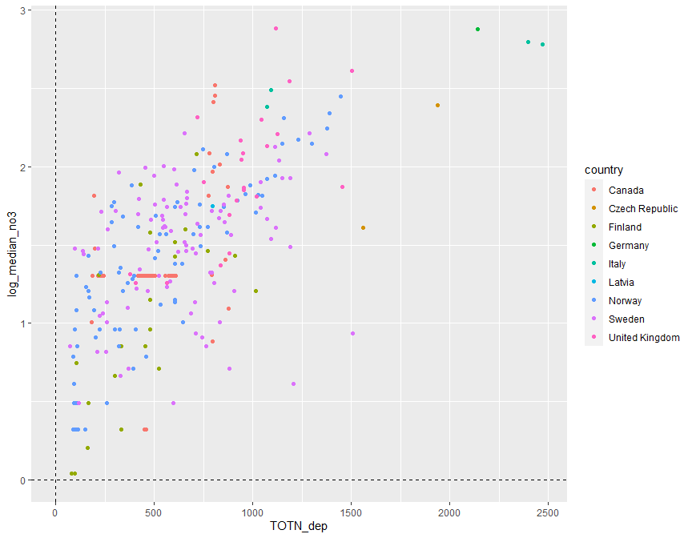<!-- -->
=======
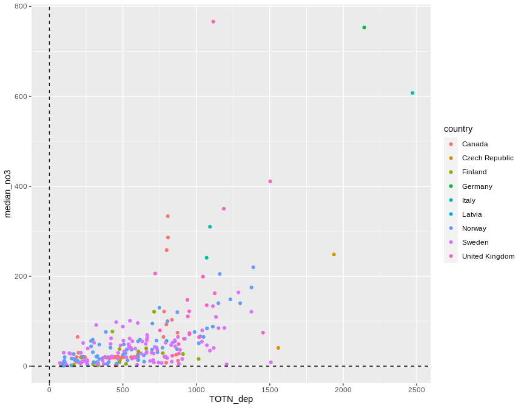<!-- -->
>>>>>>> e5a7972e37222771881a7ff3ac9997f6a8a047b5


## 4. Select data   

### a. Selection of variables    
* Select variables to use, and thereby also cases  
* Also remove PL05, which has dubious values   

```r
<<<<<<< HEAD
get_data_for_analysis <- function(data, variable_string){
=======
add_flag_variable <- function(data, variable_string){
>>>>>>> e5a7972e37222771881a7ff3ac9997f6a8a047b5
  variable_string <- gsub(" ", "", variable_string)
  variables <- strsplit(variable_string, split = ",")[[1]]
  # Check if all variables are there
  found <- variables %in% names(data)
  if (sum(!found) > 0)
    stop("Not all variables found in data:", 
      paste(variables[!found], collapse = " ,"), 
      "\n")
  # Data for analyses
<<<<<<< HEAD
=======
  complete <- complete.cases(data[variables])
  data$Row_excluded <- !complete
  variables %>% 
    purrr::map_dfr(~data.frame(Var = .x, Missing = sum(is.na(data[[.x]])))) %>%
    print()
  data
}

delete_unused_variables <- function(data, variable_string){
  variable_string <- gsub(" ", "", variable_string)
  variables <- strsplit(variable_string, split = ",")[[1]]
>>>>>>> e5a7972e37222771881a7ff3ac9997f6a8a047b5
  data[variables]
}

cat("-------------------------------------------------------------\n")
cat("Variables: \n")
cat(params$selected_vars)
cat("\n-------------------------------------------------------------\n")

<<<<<<< HEAD
sel <- dat$station_code %in% "PL05"
dat <- dat[!sel,]
message(sum(sel), " station removed - station PL05 (has dubious NO3 data)")  
```

```
## 0 station removed - station PL05 (has dubious NO3 data)
```

```r
# debugonce(get_data_for_analysis)
# df_analysis <- get_data_for_analysis(dat, vars)  
df_analysis <- get_data_for_analysis(dat, params$selected_vars)  

# names(dat) %>% paste(collapse = ", ")

cat("Number of missing values per variable: \n")
apply(is.na(df_analysis), 2, sum) 
cat("\n")

# What is missing? (long output)
if (FALSE){
dat %>% 
  split(.$country) %>%
  purrr::map(~apply(is.na(.), 2, mean))
}

cat("Number of complete observations: \n")
complete <- complete.cases(df_analysis)
table(complete)

cat("\n\n")
cat("Number of complete observations by country: \n")
table(dat$country, complete)

# Keep only complete cases
df_analysis <- df_analysis[complete.cases(df_analysis),]

cat("\n\n")
cat("Original data: n =", nrow(dat), "\n")
cat("Analysis: n =", nrow(df_analysis), "\n")
=======
dat <- dat %>%
  filter2(!station_code %in% "PL05", text = "station PL05 (has dubious NO3 data)")

# debugonce(add_flag_variable)
# df_analysis <- add_flag_variable(dat, vars)  
df_analysis_allrows <- add_flag_variable(dat, params$selected_vars)  

# Save to excel
fn <- paste0(substr(params$document_title, 1, 3), "_", response_var, "_data.xlsx")
writexl::write_xlsx(df_analysis_allrows, paste0("Data_analysed/", fn))
cat("\nDataset after removing urban, cultivated, PL05 saved as", sQuote(fn), "\n\n")

cat("Number of rows that will be excluded: \n")
table(df_analysis_allrows$Row_excluded)

cat("\n\n")
cat("Number of complete observations by country: \n")
xtabs(~country + Row_excluded, df_analysis_allrows)

# Keep only complete cases
df_analysis <- df_analysis_allrows %>%
  filter(!Row_excluded)

# Save to excel
fn <- paste0(
  stringr::str_extract(params$document_title, "[^[[:blank:]]]+"),
  "_data.xlsx")
writexl::write_xlsx(df_analysis, paste0("Data_analysed/", fn))

# Remove variables that will note be used
df_analysis <- delete_unused_variables(df_analysis, params$selected_vars)

cat("\n\n")
cat("Data before removing PL05: n =", nrow(dat_5), "\n")
cat("Data after removing PL05: n =", nrow(df_analysis_allrows), "\n")
cat("Data after removing missing predictors: n =", nrow(df_analysis), "\n")
>>>>>>> e5a7972e37222771881a7ff3ac9997f6a8a047b5
```

```
## -------------------------------------------------------------
## Variables: 
## median_tocton,catchment_area, median_ton, median_toc,slope_dep_vs_time, TOTN_dep, latitude, longitude,pre, tmp, urban, cultivated, total_forest, total_shrub_herbaceous,wetland, lake_water, bare_sparse
## -------------------------------------------------------------
<<<<<<< HEAD
## Number of missing values per variable: 
##          median_tocton         catchment_area             median_ton             median_toc 
##                      0                      0                      0                      0 
##      slope_dep_vs_time               TOTN_dep               latitude              longitude 
##                      0                      0                      0                      0 
##                    pre                    tmp                  urban             cultivated 
##                      0                      0                      0                      0 
##           total_forest total_shrub_herbaceous                wetland             lake_water 
##                      0                      0                      0                      0 
##            bare_sparse 
##                      0 
## 
## Number of complete observations: 
## complete
## TRUE 
##  302 
## 
## 
## Number of complete observations by country: 
##                 complete
##                  TRUE
##   Canada           76
##   Czech Republic    2
##   Finland          23
##   Germany           1
##   Italy             4
##   Latvia            1
##   Norway           82
##   Sweden           91
##   United Kingdom   22
## 
## 
## Original data: n = 302 
## Analysis: n = 302
=======
## Removed 0 rows (station PL05 (has dubious NO3 data))
##                       Var Missing
## 1           median_tocton       0
## 2          catchment_area       0
## 3              median_ton       0
## 4              median_toc       0
## 5       slope_dep_vs_time       0
## 6                TOTN_dep       0
## 7                latitude       0
## 8               longitude       0
## 9                     pre       0
## 10                    tmp       0
## 11                  urban       0
## 12             cultivated       0
## 13           total_forest       0
## 14 total_shrub_herbaceous       0
## 15                wetland       0
## 16             lake_water       0
## 17            bare_sparse       0
## 
## Dataset after removing urban, cultivated, PL05 saved as '164_median_tocton_data.xlsx' 
## 
## Number of rows that will be excluded: 
## 
## FALSE 
##   288 
## 
## 
## Number of complete observations by country: 
##                 Row_excluded
## country          FALSE
##   Canada            70
##   Czech Republic     2
##   Finland           22
##   Germany            1
##   Italy              3
##   Latvia             1
##   Norway            80
##   Sweden            87
##   United Kingdom    22
## 
## 
## Data before removing PL05: n = 288 
## Data after removing PL05: n = 288 
## Data after removing missing predictors: n = 288
>>>>>>> e5a7972e37222771881a7ff3ac9997f6a8a047b5
```


### b. Correlations   

```r
gg <- GGally::ggcorr(df_analysis, method = c("complete.obs", "kendall"), label = TRUE) # +
gg + theme(plot.margin = unit(c(.8, 2, .8, 2.5), "cm"))
```

<<<<<<< HEAD
<!-- -->
=======
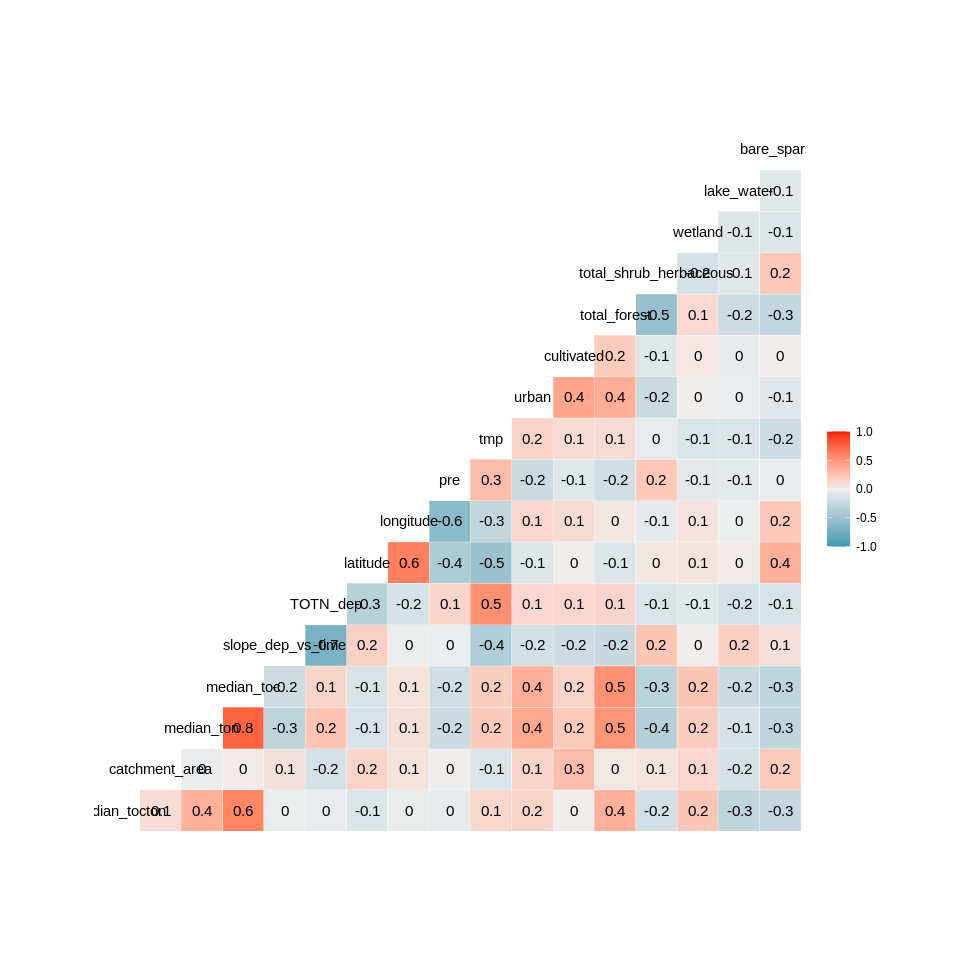<!-- -->
>>>>>>> e5a7972e37222771881a7ff3ac9997f6a8a047b5

```r
# SHOULD also workaccording to ?element_rect (update ggplot2?)
# gg + theme(plot.margin = margin(.6, .5, .6, 1.7, "cm"))
```


## 5. Tree and forest classification


### Split into training and validation data

```r
set.seed(123)

#
# NOT RELEVANT
#
# x <- runif(nrow(df_analysis))
# train <- ifelse(x < 0.9, TRUE, FALSE)
# 
# train_set <- df_analysis[train,]  %>% 
#   select(-longitude, - latitude) %>%
#   as.data.frame()
# valid_set <- df_analysis[!train,] %>% 
#   select(-longitude, - latitude) %>%
#   as.data.frame()

full_set <- df_analysis  %>% 
  select(-longitude, - latitude) %>%
  as.data.frame()

# plot(full_set)
```


### a. Tree classification using 'party'   

```r
<<<<<<< HEAD
# train_set$X <- 10^train_set$log_median_no3
=======
# train_set$X <- 10^train_set$median_no3
>>>>>>> e5a7972e37222771881a7ff3ac9997f6a8a047b5
# (ct = ctree(X ~ ., data = train_set))

(ct = ctree(as.formula(params$tree_formula), 
            data = full_set))

plot(ct, main="Conditional Inference Tree")
```

<<<<<<< HEAD
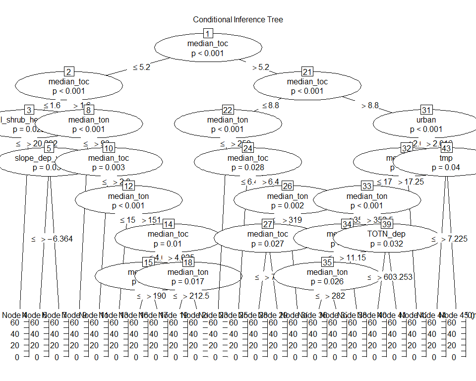<!-- -->
=======
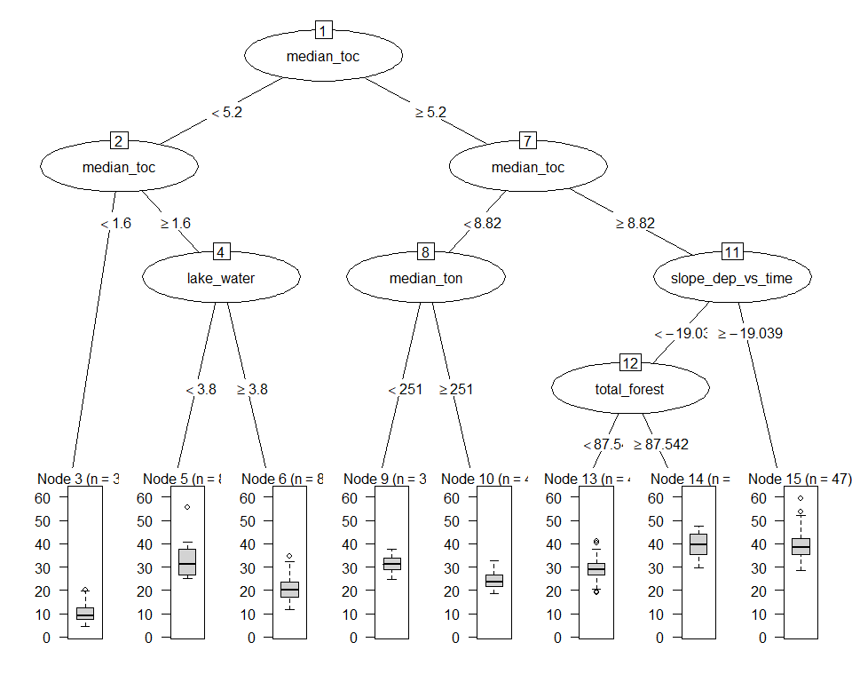<!-- -->
>>>>>>> e5a7972e37222771881a7ff3ac9997f6a8a047b5

```
## 
## Model formula:
## median_tocton ~ catchment_area + median_ton + median_toc + slope_dep_vs_time + 
##     TOTN_dep + pre + tmp + urban + cultivated + total_forest + 
##     total_shrub_herbaceous + wetland + lake_water + bare_sparse
## 
## Fitted party:
## [1] root
## |   [2] median_toc <= 5.2
## |   |   [3] median_toc <= 1.6
<<<<<<< HEAD
## |   |   |   [4] total_shrub_herbaceous <= 20.292: 7.058 (n = 13, err = 69.2)
## |   |   |   [5] total_shrub_herbaceous > 20.292
## |   |   |   |   [6] slope_dep_vs_time <= -6.36375: 9.808 (n = 11, err = 89.6)
## |   |   |   |   [7] slope_dep_vs_time > -6.36375: 14.845 (n = 13, err = 132.8)
## |   |   [8] median_toc > 1.6
## |   |   |   [9] median_ton <= 93: 29.875 (n = 10, err = 1067.6)
## |   |   |   [10] median_ton > 93
## |   |   |   |   [11] median_toc <= 2.8: 17.253 (n = 22, err = 227.5)
## |   |   |   |   [12] median_toc > 2.8
## |   |   |   |   |   [13] median_ton <= 151: 27.875 (n = 15, err = 209.8)
## |   |   |   |   |   [14] median_ton > 151
## |   |   |   |   |   |   [15] median_toc <= 4.025
## |   |   |   |   |   |   |   [16] median_ton <= 190: 20.426 (n = 11, err = 37.7)
## |   |   |   |   |   |   |   [17] median_ton > 190: 16.387 (n = 12, err = 33.1)
## |   |   |   |   |   |   [18] median_toc > 4.025
## |   |   |   |   |   |   |   [19] median_ton <= 212.5: 24.007 (n = 13, err = 63.3)
## |   |   |   |   |   |   |   [20] median_ton > 212.5: 19.141 (n = 8, err = 13.1)
## |   [21] median_toc > 5.2
## |   |   [22] median_toc <= 8.8
## |   |   |   [23] median_ton <= 250: 31.226 (n = 32, err = 361.8)
## |   |   |   [24] median_ton > 250
## |   |   |   |   [25] median_toc <= 6.4: 21.794 (n = 13, err = 28.0)
## |   |   |   |   [26] median_toc > 6.4
## |   |   |   |   |   [27] median_ton <= 319
## |   |   |   |   |   |   [28] median_toc <= 7.15: 24.514 (n = 10, err = 11.3)
## |   |   |   |   |   |   [29] median_toc > 7.15: 28.518 (n = 13, err = 95.5)
## |   |   |   |   |   [30] median_ton > 319: 22.040 (n = 9, err = 56.3)
## |   |   [31] median_toc > 8.8
## |   |   |   [32] urban <= 2.0161
## |   |   |   |   [33] median_toc <= 17.25
## |   |   |   |   |   [34] median_ton <= 352.5
## |   |   |   |   |   |   [35] median_toc <= 11.15
## |   |   |   |   |   |   |   [36] median_ton <= 282: 37.800 (n = 17, err = 367.5)
## |   |   |   |   |   |   |   [37] median_ton > 282: 32.876 (n = 8, err = 96.7)
## |   |   |   |   |   |   [38] median_toc > 11.15: 42.302 (n = 16, err = 203.1)
## |   |   |   |   |   [39] median_ton > 352.5
## |   |   |   |   |   |   [40] TOTN_dep <= 603.25317: 34.127 (n = 10, err = 173.6)
## |   |   |   |   |   |   [41] TOTN_dep > 603.25317: 27.777 (n = 10, err = 94.7)
## |   |   |   |   [42] median_toc > 17.25: 45.232 (n = 8, err = 477.9)
## |   |   |   [43] urban > 2.0161
## |   |   |   |   [44] tmp <= 7.225: 30.174 (n = 20, err = 432.7)
## |   |   |   |   [45] tmp > 7.225: 24.485 (n = 8, err = 182.7)
## 
## Number of inner nodes:    22
## Number of terminal nodes: 23
=======
## |   |   |   [4] total_shrub_herbaceous <= 20.292: 6.988 (n = 12, err = 68.4)
## |   |   |   [5] total_shrub_herbaceous > 20.292: 12.810 (n = 23, err = 329.1)
## |   |   [6] median_toc > 1.6
## |   |   |   [7] median_ton <= 93: 29.875 (n = 10, err = 1067.6)
## |   |   |   [8] median_ton > 93
## |   |   |   |   [9] median_toc <= 2.8: 17.208 (n = 20, err = 226.8)
## |   |   |   |   [10] median_toc > 2.8
## |   |   |   |   |   [11] median_ton <= 151: 27.875 (n = 15, err = 209.8)
## |   |   |   |   |   [12] median_ton > 151: 20.179 (n = 39, err = 386.0)
## |   [13] median_toc > 5.2
## |   |   [14] median_toc <= 8.8
## |   |   |   [15] median_ton <= 250: 31.316 (n = 31, err = 353.8)
## |   |   |   [16] median_ton > 250
## |   |   |   |   [17] median_toc <= 7.1
## |   |   |   |   |   [18] median_toc <= 6.4: 21.794 (n = 13, err = 28.0)
## |   |   |   |   |   [19] median_toc > 6.4: 24.132 (n = 8, err = 4.8)
## |   |   |   |   [20] median_toc > 7.1
## |   |   |   |   |   [21] median_ton <= 310: 28.615 (n = 13, err = 88.4)
## |   |   |   |   |   [22] median_ton > 310: 23.039 (n = 9, err = 66.9)
## |   |   [23] median_toc > 8.8
## |   |   |   [24] urban <= 2.0161
## |   |   |   |   [25] median_toc <= 17.25
## |   |   |   |   |   [26] median_ton <= 352.5
## |   |   |   |   |   |   [27] median_toc <= 11.15
## |   |   |   |   |   |   |   [28] median_ton <= 282: 37.800 (n = 17, err = 367.5)
## |   |   |   |   |   |   |   [29] median_ton > 282: 32.876 (n = 8, err = 96.7)
## |   |   |   |   |   |   [30] median_toc > 11.15: 42.302 (n = 16, err = 203.1)
## |   |   |   |   |   [31] median_ton > 352.5: 31.100 (n = 19, err = 461.6)
## |   |   |   |   [32] median_toc > 17.25: 45.232 (n = 8, err = 477.9)
## |   |   |   [33] urban > 2.0161
## |   |   |   |   [34] tmp <= 6.70833: 31.916 (n = 13, err = 134.4)
## |   |   |   |   [35] tmp > 6.70833: 26.103 (n = 14, err = 343.6)
## 
## Number of inner nodes:    17
## Number of terminal nodes: 18
>>>>>>> e5a7972e37222771881a7ff3ac9997f6a8a047b5
```

### b. Evtree (Evolutionary Learning)   

```r
ev.raw = evtree(as.formula(params$tree_formula), 
                data = full_set)

plot(ev.raw)
```

<<<<<<< HEAD
<!-- -->
=======
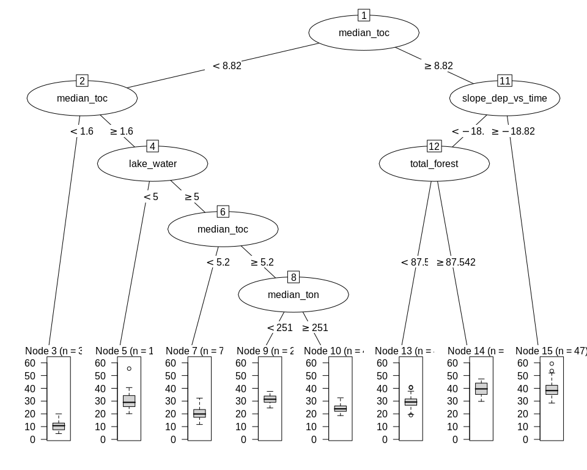<!-- -->
>>>>>>> e5a7972e37222771881a7ff3ac9997f6a8a047b5


### c. Random forest  
* Model called 'model1'

```r
model1 <- randomForest(as.formula(params$tree_formula), 
                       data = full_set, 
                       mtry = 5,
                       importance = TRUE)

model1
```

```
## 
## Call:
##  randomForest(formula = as.formula(params$tree_formula), data = full_set,      mtry = 5, importance = TRUE) 
##                Type of random forest: regression
##                      Number of trees: 500
## No. of variables tried at each split: 5
## 
<<<<<<< HEAD
##           Mean of squared residuals: 23.26143
##                     % Var explained: 76.44
=======
##           Mean of squared residuals: 22.82822
##                     % Var explained: 76.94
>>>>>>> e5a7972e37222771881a7ff3ac9997f6a8a047b5
```


#### c1. Predict on training data
Not relevant here  

#### c2. Importance of variables   
* Classification forests result in   
    - mean_min_depth   
    - accuracy_decrease  
    - gini_decrease  
    - no_of_nodes   
    - times_a_root      
* Regression forests result in     
    - mean_min_depth   
    - mse_increase  
    - node_purity_increase  
    - no_of_nodes   
    - times_a_root      

```r
# Calculation
importance <- measure_importance(model1)
```


```r
plot_multi_way_importance(importance, size_measure = "no_of_nodes", no_of_labels = 6)  
```

<<<<<<< HEAD
<!-- -->
=======
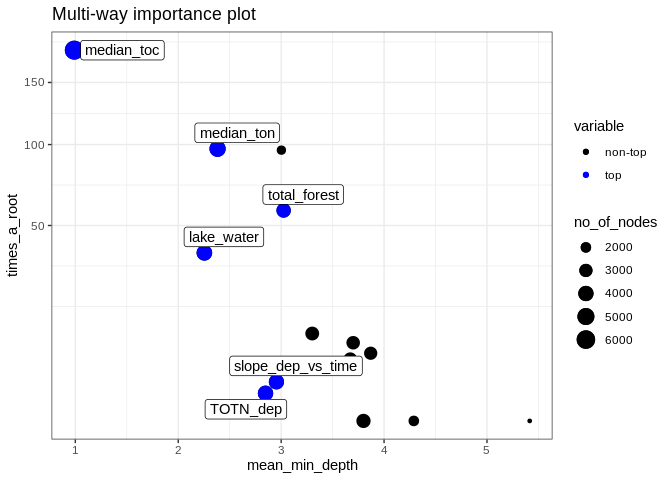<!-- -->
>>>>>>> e5a7972e37222771881a7ff3ac9997f6a8a047b5

```r
plot_multi_way_importance(importance, x_measure = "mse_increase", y_measure = "node_purity_increase",
                          size_measure = "p_value", no_of_labels = 6)
```

<<<<<<< HEAD
<!-- -->
=======
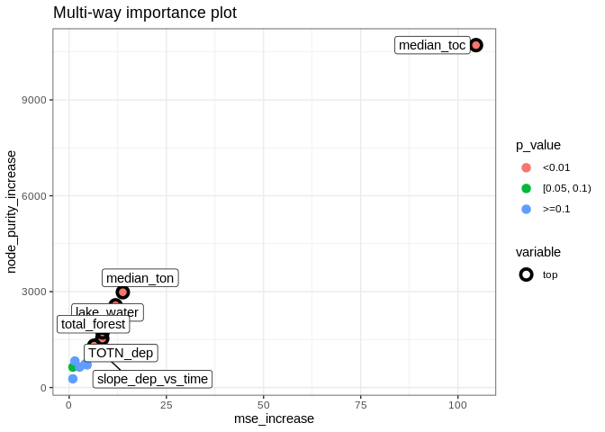<!-- -->

```r
importance %>%
  arrange(desc(times_a_root))
```

```
##                  variable mean_min_depth no_of_nodes mse_increase node_purity_increase
## 1              median_toc       0.990000        6323  104.6479720           10712.5003
## 2              median_ton       2.382000        4532   13.8058836            2981.7970
## 3             bare_sparse       3.002280        1719    9.7455950            2091.2068
## 4            total_forest       3.024000        3534    8.5873134            1724.1495
## 5              lake_water       2.254000        4170   11.9406259            2572.4251
## 6  total_shrub_herbaceous       3.302000        3285    5.6994787             975.1917
## 7                 wetland       3.699752        3147    1.4822238             830.0764
## 8                     pre       3.870000        3011    2.6859448             639.6559
## 9                     tmp       3.671504        3146    4.1005093             733.7469
## 10      slope_dep_vs_time       2.954000        3949    6.4410693            1309.9526
## 11               TOTN_dep       2.848000        4032    8.5112628            1532.4268
## 12         catchment_area       3.800000        3482    0.9724799             638.4907
## 13             cultivated       5.415072        1167    0.9518633             272.4010
## 14                  urban       4.289008        2039    4.6234545             707.6288
##    no_of_trees times_a_root      p_value
## 1          500          180 0.000000e+00
## 2          500           97 1.849321e-83
## 3          485           96 1.000000e+00
## 4          500           58 7.215596e-03
## 5          500           37 6.219855e-41
## 6          500           10 9.763197e-01
## 7          499            8 9.999963e-01
## 8          500            6 1.000000e+00
## 9          498            5 9.999966e-01
## 10         500            2 3.255019e-22
## 11         500            1 1.406748e-28
## 12         500            0 6.307237e-02
## 13         464            0 1.000000e+00
## 14         496            0 1.000000e+00
```
>>>>>>> e5a7972e37222771881a7ff3ac9997f6a8a047b5


#### c3. Random forest, show partial effects  


```r
# Which variables to include:
variables_for_plot <- importance %>%
  mutate(variable = levels(variable)[as.numeric(variable)]) %>%
  arrange(desc(mse_increase)) %>%    # gini_decrease for classification trees
  pull(variable) %>%
  head(12)   # pick the first 12 variables (or less)

# Calculation

plotdata <- NULL  # will be list for storing results

max_number_of_plots <- length(variables_for_plot)/2 %>% floor()

for (i in 1:max_number_of_plots){
  varno1 <- c(1,3,5,7,9,11)[i]
  varno2 <- varno1 + 1
  plotdata[[i]] <- model1 %>%
    partial(pred.var = variables_for_plot[c(varno1, varno2)], chull = TRUE, progress = "text",
            which.class = "1", prob = TRUE)
}
```


```r
### Extra plots

plotpairs <- params$extra_pairwise_plots %>%
  gsub(" ", "", ., fixed = TRUE) %>%
  strsplit(split = ";") %>%
  .[[1]] %>%
  purrr::map(~strsplit(., split = ",")[[1]])

for (plotvar in plotpairs){
  # print(plotvar)
  if (plotvar[1] %in% names(full_set) & plotvar[2] %in% names(full_set)){
    i <- i + 1
    plotdata[[i]] <- model1 %>%
      partial(pred.var = c(plotvar[1], plotvar[2]), chull = TRUE, progress = "text",
             which.class = "1", prob = TRUE)
  }
}
```


```r
# Find range of predicted values for each graph
ranges <- plotdata %>% purrr::map_dfc(~range(.$yhat))
```

```
## New names:
## * NA -> ...1
## * NA -> ...2
## * NA -> ...3
## * NA -> ...4
## * NA -> ...5
## * ...
```

```r
# use range of all the ranges
for (i in 1:length(plotdata)){
  
  if (params$pairwise_plots_same_scale == "TRUE"){
  
    gg <- plot_pair_number(i, zrange = range(ranges))
    print(gg)
    
  } else {
    
    gg <- plot_pair_number(i)
    print(gg)

  }
  
<<<<<<< HEAD
  # Save gg obkjct for later plotting / changes
  fn <- paste0(
    "Figures/Partial_plots/gg_",
    params$document_title %>% stringr::str_extract("([^[[:blank:]]]+)"),
    "_", i, ".rds")
  saveRDS(gg, fn)

=======
  # Save gg object for later plotting / changes
  # Saved in Figures/Partial_plots' with name e.g. "gg_164a1_7.rds" for plot number 7
  fn <- paste0(
    "Figures/Partial_plots/gg_",
    stringr::str_extract(params$document_title, "([^[[:blank:]]]+)"),   # extract e.g. "164a1"
    "_", i, ".rds")
  saveRDS(gg, fn)
  
>>>>>>> e5a7972e37222771881a7ff3ac9997f6a8a047b5
}
```

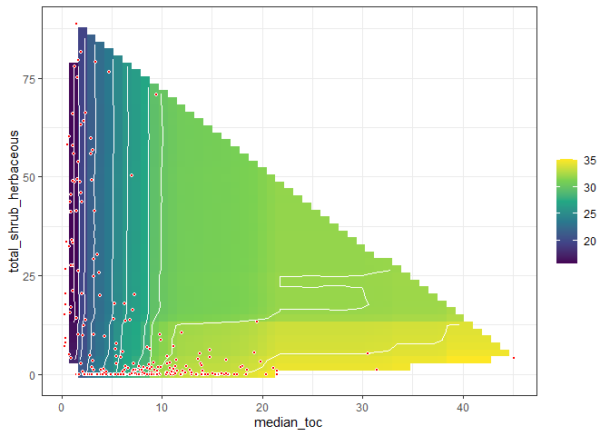<!-- -->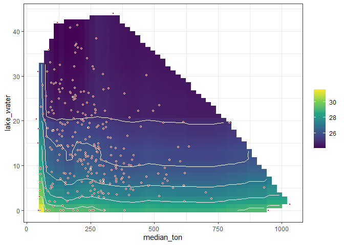<!-- -->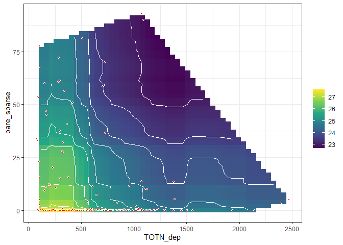<!-- --><!-- --><!-- -->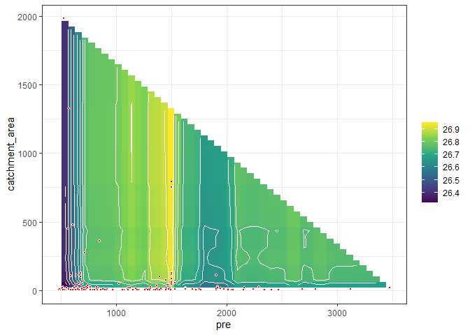<!-- --><!-- -->


<<<<<<< HEAD
=======


>>>>>>> e5a7972e37222771881a7ff3ac9997f6a8a047b5
## 6. Linear regression      

```r
fm <- lm(
  as.formula(params$logistic_formula),
  data = df_analysis, 
  na.action = "na.fail")

dredged_models <- dredge(fm)                       # only once
```

```
## Fixed term is "(Intercept)"
```

```r
# saveRDS(dredged_models, "Data/164_all_dredged_models.rds")    # save it as it takes a couple of minutes
# dredged_models <- readRDS("Data/164_all_dredged_models.rds")

# cat("\n\nR2: \n")
# mod1 <- get.models(dredged_models, 1)[[1]]  
# summary(mod1)  
```

### Best models  

```r
# subset(dredged_models, delta < 1)

subset(dredged_models, delta < 2)

# Alternative way of showing result (didn't become any better)
# df <- subset(dredged_models, delta < 2)
# select(as.data.frame(df) %>% round(6), -`(Intercept)`, -logLik, -AICc)
```

```
## Global model call: lm(formula = as.formula(params$logistic_formula), data = df_analysis, 
##     na.action = "na.fail")
## ---
## Model selection table 
<<<<<<< HEAD
##     (Int) bar_spr   ctc_are lak_wtr mdn_toc  mdn_ton        pre     tmp   ttl_frs     urb
## 542 23.29 -0.1475           -0.1246   3.342 -0.05983                                     
## 798 23.25 -0.1487           -0.1212   3.332 -0.05904                              -0.1371
## 606 22.92 -0.1451           -0.1227   3.344 -0.06024            0.07745                  
## 670 23.32 -0.1484           -0.1268   3.340 -0.05898                    -0.003814        
## 544 23.26 -0.1475 0.0005912 -0.1236   3.340 -0.05984                                     
## 574 23.59 -0.1470           -0.1265   3.339 -0.06012 -0.0001829                          
##     mdn_toc:mdn_ton df   logLik   AICc delta weight
## 542       -0.001347  7 -833.761 1681.9  0.00  0.315
## 798       -0.001348  8 -833.341 1683.2  1.27  0.167
## 606       -0.001343  8 -833.428 1683.3  1.44  0.153
## 670       -0.001364  8 -833.619 1683.7  1.83  0.126
## 544       -0.001344  8 -833.669 1683.8  1.92  0.120
## 574       -0.001341  8 -833.682 1683.9  1.95  0.119
=======
##     (Int) bar_spr   ctc_are lak_wtr mdn_toc  mdn_ton        pre    tmp mdn_toc:mdn_ton df
## 638 24.25 -0.1454           -0.1319   3.290 -0.06406 -0.0009038 0.2639       -0.001232  9
## 606 23.25 -0.1513           -0.1257   3.301 -0.06196            0.1523       -0.001270  8
## 542 23.93 -0.1552           -0.1299   3.301 -0.06104                         -0.001284  7
## 640 24.20 -0.1454 0.0005234 -0.1308   3.288 -0.06407 -0.0008923 0.2644       -0.001230 10
##       logLik   AICc delta weight
## 638 -788.767 1596.2  0.00  0.354
## 606 -790.056 1596.6  0.45  0.283
## 542 -791.310 1597.0  0.84  0.233
## 640 -788.691 1598.2  2.00  0.130
>>>>>>> e5a7972e37222771881a7ff3ac9997f6a8a047b5
## Models ranked by AICc(x)
```


<<<<<<< HEAD


=======
>>>>>>> e5a7972e37222771881a7ff3ac9997f6a8a047b5
### Plots  

```r
# Pick model with lowest AICc
mod1 <- get.models(dredged_models, 1)[[1]]  

modelvars <- get_model_variables(mod1)

# Interactions: 2D plot 
if (length(modelvars$interaction_list) > 0){
  modelvars$interaction_list %>% purrr::walk(
    ~visreg(mod1, .x[1], by = .x[2], scale = "response")
  )
}
```

<<<<<<< HEAD
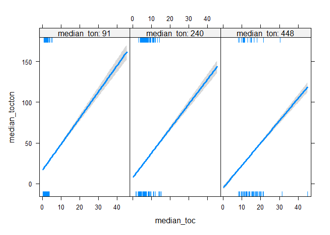<!-- -->
=======
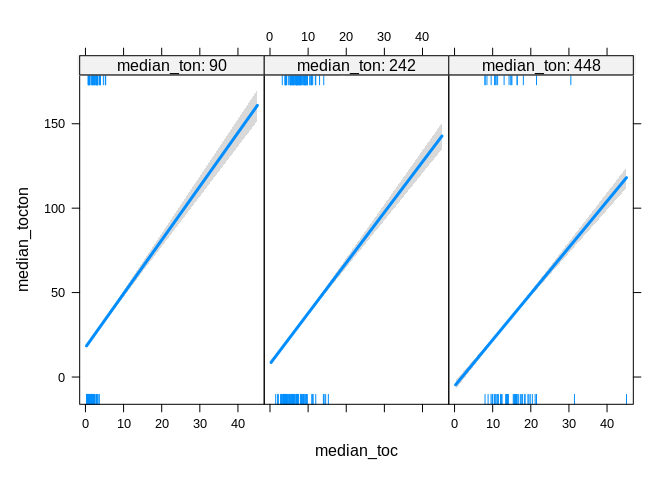<!-- -->
>>>>>>> e5a7972e37222771881a7ff3ac9997f6a8a047b5

```r
# Additive effects: 1D plot
if (length(modelvars$additive_vars) > 0){
  par(mfrow = c(2,3), mar = c(4,5,2,1), oma = c(0,0,2,0))
  for (var in modelvars$additive_vars)
    visreg(mod1, var, scale = "response")  
}
```

<<<<<<< HEAD
<!-- -->

```
## Conditions used in construction of plot
## lake_water: 12.34379
## median_toc: 6.21725
## median_ton: 240
## Conditions used in construction of plot
## bare_sparse: 0
## median_toc: 6.21725
## median_ton: 240
=======
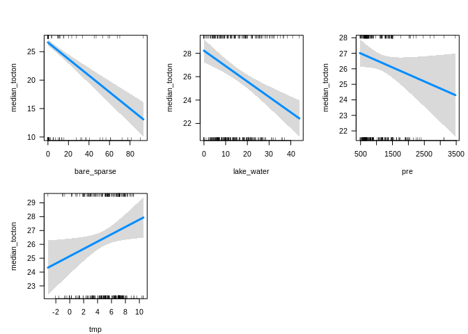<!-- -->

```
## Conditions used in construction of plot
## lake_water: 12.12353
## median_toc: 6.305
## median_ton: 242.5
## pre: 908.4
## tmp: 5.591667
## Conditions used in construction of plot
## bare_sparse: 0
## median_toc: 6.305
## median_ton: 242.5
## pre: 908.4
## tmp: 5.591667
## Conditions used in construction of plot
## bare_sparse: 0
## lake_water: 12.12353
## median_toc: 6.305
## median_ton: 242.5
## tmp: 5.591667
## Conditions used in construction of plot
## bare_sparse: 0
## lake_water: 12.12353
## median_toc: 6.305
## median_ton: 242.5
## pre: 908.4
>>>>>>> e5a7972e37222771881a7ff3ac9997f6a8a047b5
```


