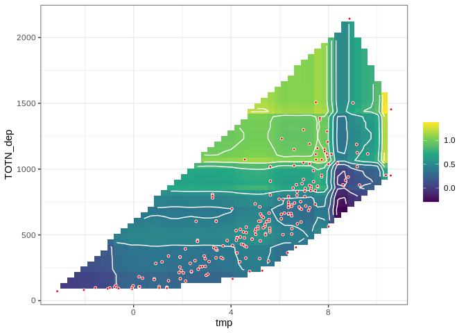
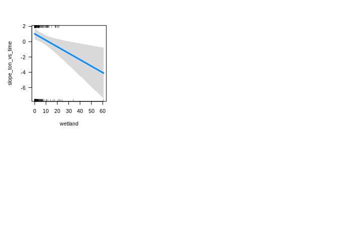

**Analysis of NO3 decrease (categorical, "decrease or not"), based on James' trend results**  
  
**Dataset: Not including TOC + slope_toc_vs_time**   

* Response variable: 'Significant /NO3 decline' (locations with signif. *increase* are *not* excluded)  
* Data from https://github.com/JamesSample/icpw2        
* Sen slope of NO3, TOTN, TOC/TON etc. 1992-2016
* Predictors:
    - catchment_area, TON, slope_pre, slope_tmp, slope_dep_vs_time, TOTN_dep, latitude, longitude, tmp, land cover (merk at altitude er tatt ut). 
    - I tillegg en variant med TOC, en med TOC+slope_toc_vs_time og en uten begge
    - slope_dep_vs_time: Trend in Tot-N deposition 1992-2016    
    - NO3, TOTN_dep: Medians of NO3, TOTN_dep (Tot-N deposition) 1992-2016   
    - catchment_area (if included in data)      
    - TOC: Medians of TOC       
    - pre, tmp: mean precipitation + temp   
    - Land cover 
  
Technical details: This html file was rendered with `165parm_run_markdown.R` which runs the script `165parm_Time_series_results_James.Rmd` with different inputs, resulting in html files 165a, 165b and 165c.    

## 1. Libraries  

```r
# All of these packages cn be loaded at once using library(tidyverse). (I just like to be specific.)
library(dplyr)
library(tidyr)      # pivot_wider
library(purrr)      # 'map' functions  
library(lubridate)  
library(ggplot2)

# Too many packages, not all are used
# library(mapview)
library(visreg)     # visreg
library(rkt)        # Theil -Sen Regression

library(MuMIn)      

# Trees and forests
library(party)                  # ctree
library(evtree)                 # evtree
library(randomForest)
library(randomForestExplainer)  # measure_importance, plot_multi_way_importance
library(pdp)                    # partial, autoplot

library(maps)
my_map <- map_data("world")

library(effects)    # handles lme models  
library(readxl)
library(readr)

source("002_Functions.R")
source("160parm_functions.R")

knitr::opts_chunk$set(results = 'hold') # collect the results from a chunk  
knitr::opts_chunk$set(warning = FALSE)  

options(width = 95)
```


## 2. Data

### James' trends and medians     

```r
if (FALSE){
  #
  # Regression results 1
  #
  folder <- "https://github.com/JamesSample/icpw2/raw/master/thematic_report_2020/results/trends_1992-2016_no3"
  file <- "trends_1992-2016_no3_results.csv"
  fn <- paste0(folder, "/", file)
  
  dat_start <- read.csv(fn, encoding = "UTF-8")
  cat("Data source:", sQuote(file), ",n =", nrow(dat_start), "\n\n")
  
  cat("Number of TON records:", sum(dat_start$variable == "TON_µg/l N"), "\n")
  # 302
  
} else {
  #
  # Regression results 2
  #
  folder <- "https://github.com/JamesSample/icpw2/raw/master/thematic_report_2020/results/trends_1992-2016_toc_totn_no3_relax_italy"
  file <- "trends_1992-2016_toc_totn_no3_relax_italy_results.csv"
  fn <- paste0(folder, "/", file)
  
  dat_start <- read.csv(fn, encoding = "UTF-8")
  cat("Data source:", sQuote(file), ",n =", nrow(dat_start), "\n\n")
  
  sum(dat_start$variable == "TON_µg/l N")
  # 293
  
}
```

```
## Data source: 'trends_1992-2016_toc_totn_no3_relax_italy_results.csv' ,n = 2418 
## 
## [1] 293
```

### Start 'dat'  

With slope regression data  
* Make one line per station    


```r
# table(dat_start$variable)

# Slope 
df1 <- dat_start %>%
  filter(variable %in% c("TON_µg/l N", "TOC_mg C/l")) %>%
  select(station_id, variable, sen_slp) %>%
  tidyr::pivot_wider(names_from = "variable", values_from = "sen_slp") %>%
  rename(slope_ton_vs_time = `TON_µg/l N`, 
         slope_toc_vs_time = `TOC_mg C/l`)
  
# Slope p-value
df2 <- dat_start %>%
  filter(variable %in% c("TON_µg/l N", "TOC_mg C/l")) %>%
  select(station_id, variable, mk_p_val) %>%
  tidyr::pivot_wider(names_from = "variable", values_from = "mk_p_val") %>%
  rename(p_ton_vs_time = `TON_µg/l N`, 
         p_toc_vs_time = `TOC_mg C/l`)

# Medians
df3 <- dat_start %>%
  filter(variable %in% c("TON_µg/l N", "TOC_mg C/l")) %>%
  select(station_id, variable, median) %>%
  tidyr::pivot_wider(names_from = "variable", values_from = "median") %>%
  rename(TON = `TON_µg/l N`, 
         TOC = `TOC_mg C/l`)

cat("\n")
cat("df1, n =", nrow(df1), "\n")
cat("df2, n =", nrow(df2), "\n")
cat("df3, n =", nrow(df3), "\n")

dat_1_all <- df1 %>%
  left_join2(df2, by = "station_id") %>%
  left_join2(df3, by = "station_id")

cat("dat_1_all, n =", nrow(dat_1_all), " \n")

dat_1 <- dat_1_all %>%
  filter(!is.na(slope_ton_vs_time) & !is.na(slope_toc_vs_time))

cat("dat_1, n =", nrow(dat_1), " \n")
```

```
## 
## df1, n = 293 
## df2, n = 293 
## df3, n = 293 
## dat_1_all, n = 293  
## dat_1, n = 287
```


```r
# dat_1
# 
# str <- "slope_no3_vs_time ~ p_no3_vs_time"
# plot(as.formula(str), data = dat_1)
# lm(as.formula(str), data = dat_1)
```

### Deposition trends and median 1992-2006     

```r
fn <- "https://github.com/JamesSample/icpw2/raw/master/thematic_report_2020/results/deposition/totn_dep_trends_icpw_stns.csv"  

df_deposition <- read.csv(fn) %>% 
  filter(variable == "totn_mgNpm2")  

cat("n =", nrow(df_deposition), "\n")
```

```
## n = 556
```


### Add deposition slope and medians to data  

```r
# debugonce(left_join2)
dat_2 <- dat_1 %>% 
  left_join2(df_deposition %>% 
              select(station_id, median, sen_slp, mk_p_val) %>%
              rename(TOTN_dep = median,
                     slope_dep_vs_time = sen_slp,
                     p_dep_vs_time = mk_p_val),
             by = "station_id",
             print_vars = TRUE)
```

```
## Variables before join: 
## 'station_id', 'slope_ton_vs_time', 'slope_toc_vs_time', 'p_ton_vs_time', 'p_toc_vs_time', 'TON', 'TOC'
## 
## Variables used to join: 
## 'station_id'
## 
## Variables added: 
## 'TOTN_dep', 'slope_dep_vs_time', 'p_dep_vs_time'
```

### Add medians and station metadata   


```r
# dat_2 <- dat_2 %>%
#   left_join(df_metadata, by = "station_id")

# cat("dat_2, n =", nrow(dat_2), "\n")

# Simplify names by removing units
# names(dat_2)
# names(dat_2) <- sub(".N_µg.l.N", "", names(dat_2))
# names(dat_2) <- sub("_mg.C.l", "", names(dat_2))
# names(dat_2) <- sub("_µg.l.P", "", names(dat_2))

# cat("\nVariable names: \n")
# names(dat_2)
```

### Add climate and deposition medians and slopes  

```r
fn <- "https://github.com/JamesSample/icpw2/raw/master/thematic_report_2020/results/climate/cru_climate_trends_icpw_stns.csv"

df_climate_mean <- read_csv(fn) %>% 
  select(station_id, variable, median) %>%
  pivot_wider(names_from = "variable", values_from = "median")
```

```
## Rows: 1112 Columns: 8
## ── Column specification ───────────────────────────────────────────────────────────────────────
## Delimiter: ","
## chr (3): variable, mk_trend, sen_trend
## dbl (5): station_id, median, mk_p_val, sen_slp, sen_incpt
## 
## ℹ Use `spec()` to retrieve the full column specification for this data.
## ℹ Specify the column types or set `show_col_types = FALSE` to quiet this message.
```

```r
cat("\n")
# names(df_climate_mean)

df_climate_slope <- read_csv(fn) %>%
  select(station_id, variable, sen_slp) %>%
  pivot_wider(names_from = "variable", values_from = "sen_slp", names_prefix = "slope_")
```

```
## Rows: 1112 Columns: 8
## ── Column specification ───────────────────────────────────────────────────────────────────────
## Delimiter: ","
## chr (3): variable, mk_trend, sen_trend
## dbl (5): station_id, median, mk_p_val, sen_slp, sen_incpt
## 
## ℹ Use `spec()` to retrieve the full column specification for this data.
## ℹ Specify the column types or set `show_col_types = FALSE` to quiet this message.
```

```r
# Add
dat_3 <- dat_2 %>%
  left_join2(df_climate_mean, by = "station_id", print_vars = TRUE) %>%
  left_join2(df_climate_slope, by = "station_id", print_vars = TRUE)
```

```
## 
## Variables before join: 
## 'station_id', 'slope_ton_vs_time', 'slope_toc_vs_time', 'p_ton_vs_time', 'p_toc_vs_time', 'TON', 'TOC', 'TOTN_dep', 'slope_dep_vs_time', 'p_dep_vs_time'
## 
## Variables used to join: 
## 'station_id'
## 
## Variables added: 
## 'pre', 'tmp'
## Variables before join: 
## 'station_id', 'slope_ton_vs_time', 'slope_toc_vs_time', 'p_ton_vs_time', 'p_toc_vs_time', 'TON', 'TOC', 'TOTN_dep', 'slope_dep_vs_time', 'p_dep_vs_time', 'pre', 'tmp'
## 
## Variables used to join: 
## 'station_id'
## 
## Variables added: 
## 'slope_pre', 'slope_tmp'
```

### Combine land cover types   
* Data including UK read using script 159   
* Note: also includes metadata (country, etc.)
* bare_sparse = bare_rock + sparsely_vegetated + glacier   
* Select: coniferous, deciduous, lake, mixed_forest, wetland, bare_sparse   


```r
# df_landcover3_OLD <- readRDS("Data/159_df_landcover3.rds")
df_landcover3 <- readRDS("Data/159_df_meta3.rds")

df_landcover3 <- df_landcover3 %>%
  mutate(bare_sparse = bare_rock + sparsely_vegetated + glacier,
         decid_mixed = deciduous + mixed_forest,
         lake_water = lake + water_ex_lake) %>%
  select(-c(bare_rock, sparsely_vegetated, glacier, deciduous, mixed_forest, lake, water_ex_lake))
```


### Add land cover columns to main data    

```r
dat_4 <- left_join2(dat_3, 
                   df_landcover3, 
                   by = "station_id", 
                   print_vars = TRUE
)
```

```
## Variables before join: 
## 'station_id', 'slope_ton_vs_time', 'slope_toc_vs_time', 'p_ton_vs_time', 'p_toc_vs_time', 'TON', 'TOC', 'TOTN_dep', 'slope_dep_vs_time', 'p_dep_vs_time', 'pre', 'tmp', 'slope_pre', 'slope_tmp'
## 
## Variables used to join: 
## 'station_id'
## 
## Variables added: 
## 'station_code', 'station_name', 'latitude', 'longitude', 'altitude', 'continent', 'country', 'region', 'group', 'catchment_area', 'urban', 'cultivated', 'total_forest', 'coniferous', 'total_shrub_herbaceous', 'grasslands', 'heathlands', 'transitional_woodland_shrub', 'wetland', 'other', 'bare_sparse', 'decid_mixed', 'lake_water'
```


### Drop locations with >5% cultivated and >5% urban     
- also excluding stations 23517, 38273    

```r
cultivated_threshold <- 5
urban_threshold <- 5

dat_5 <- dat_4 %>%
  filter2(!station_id %in% c(23517, 38273), text = "Deleted stations 23517, 38273") %>%
  filter2(cultivated <= cultivated_threshold, 
          text = paste("Deleted stations with >", cultivated_threshold, "% cultivated")) %>%
  filter2(urban <= urban_threshold, 
          text = paste("Deleted stations with >", urban_threshold, "% urban"))
```

```
## Removed 1 rows (Deleted stations 23517, 38273)
## Removed 12 rows (Deleted stations with > 5 % cultivated)
## Removed 5 rows (Deleted stations with > 5 % urban)
```


### Data set used  

```r
dat <- dat_5
```


## 3. Plot slopes    


```r
ggplot(dat, aes(slope_dep_vs_time, slope_ton_vs_time)) + 
  geom_point(data = dat %>% filter(p_ton_vs_time < 0.05), size = rel(2)) +
  geom_point(aes(color = country)) +
  geom_hline(yintercept = 0, linetype = 2) + 
  geom_vline(xintercept = 0, linetype = 2) 
```

<!-- -->


## 4. Select data   

### a. Selection of variables  
* Select variables to use, and thereby also cases  
* Saves data both before and after rows with removing missing predictors are removed

```r
add_flag_variable <- function(data, variable_string){
  variable_string <- gsub(" ", "", variable_string)
  variables <- strsplit(variable_string, split = ",")[[1]]
  # Check if all variables are there
  found <- variables %in% names(data)
  if (sum(!found) > 0)
    stop("Not all variables found in data:", 
      paste(variables[!found], collapse = " ,"), 
      "\n")
  # Data for analyses
  complete <- complete.cases(data[variables])
  data$Row_excluded <- !complete
  variables %>% 
    purrr::map_dfr(~data.frame(Var = .x, Missing = sum(is.na(data[[.x]])))) %>%
    print()
  data
}

delete_unused_variables <- function(data, variable_string){
  variable_string <- gsub(" ", "", variable_string)
  variables <- strsplit(variable_string, split = ",")[[1]]
  data[variables]
}

cat("-------------------------------------------------------------\n")
cat("Variables: \n")
cat(params$selected_vars)
cat("\n-------------------------------------------------------------\n")

dat <- dat %>%
  filter2(!station_code %in% "PL05", text = "station PL05 (has dubious NO3 data)")

dat <- dat %>%
  filter2(region != "AtlCan" & country != "Italy", text = "Remove AtlCan and Italy")  

# debugonce(add_flag_variable)
# df_analysis <- add_flag_variable(dat, vars)  
df_analysis_allrows <- add_flag_variable(dat, params$selected_vars)  

# Save to excel
fn <- paste0(substr(params$document_title, 1, 3), "_", params$response_variable, "_data.xlsx")
writexl::write_xlsx(df_analysis_allrows, paste0("Data_analysed/", fn))
cat("\nDataset after removing urban, cultivated, PL05 saved as", sQuote(fn), "\n\n")

cat("Number of rows that will be excluded: \n")
table(df_analysis_allrows$Row_excluded)

cat("\n\n")
cat("Number of complete observations by country: \n")
xtabs(~country + Row_excluded, df_analysis_allrows)

# Keep only complete cases
df_analysis <- df_analysis_allrows %>%
  filter(!Row_excluded)

# Save to excel
fn <- paste0(
  stringr::str_extract(params$document_title, "[^[[:blank:]]]+"),
  "_data.xlsx")
writexl::write_xlsx(df_analysis, paste0("Data_analysed/", fn))

# Remove variables that will note be used
df_analysis <- delete_unused_variables(df_analysis, params$selected_vars)

cat("\n\n")
cat("Data before removing PL05: n =", nrow(dat_5), "\n")
cat("Data after removing PL05: n =", nrow(df_analysis_allrows), "\n")
cat("Data after removing missing predictors: n =", nrow(df_analysis), "\n")
```

```
## -------------------------------------------------------------
## Variables: 
## slope_ton_vs_time,catchment_area, TON, slope_pre, slope_tmp, slope_dep_vs_time, TOTN_dep, pre, tmp,urban, cultivated, total_forest, total_shrub_herbaceous,wetland, lake_water, bare_sparse
## -------------------------------------------------------------
## Removed 0 rows (station PL05 (has dubious NO3 data))
## Removed 55 rows (Remove AtlCan and Italy)
##                       Var Missing
## 1       slope_ton_vs_time       0
## 2          catchment_area       0
## 3                     TON       0
## 4               slope_pre       0
## 5               slope_tmp       0
## 6       slope_dep_vs_time       0
## 7                TOTN_dep       0
## 8                     pre       0
## 9                     tmp       0
## 10                  urban       0
## 11             cultivated       0
## 12           total_forest       0
## 13 total_shrub_herbaceous       0
## 14                wetland       0
## 15             lake_water       0
## 16            bare_sparse       0
## 
## Dataset after removing urban, cultivated, PL05 saved as '165_slope_ton_vs_time_data.xlsx' 
## 
## Number of rows that will be excluded: 
## 
## FALSE 
##   214 
## 
## 
## Number of complete observations by country: 
##                 Row_excluded
## country          FALSE
##   Canada             7
##   Finland           24
##   Germany            1
##   Norway            80
##   Sweden            81
##   United Kingdom    21
## 
## 
## Data before removing PL05: n = 269 
## Data after removing PL05: n = 214 
## Data after removing missing predictors: n = 214
```


### b. Correlations   

```r
gg <- GGally::ggcorr(
  df_analysis, 
  method = c("complete.obs", "kendall"), 
  label = TRUE,
  hjust = 0.9, angle = -30) # +                    # slanted labels
gg + coord_cartesian(x = c(-2, 20), y = c(-2,22))  # fix margins
```

```
## Coordinate system already present. Adding new coordinate system, which will replace the existing one.
```

<!-- -->


## 5. Tree and forest classification


### Split into training and validation data

```r
set.seed(123)

x <- runif(nrow(df_analysis))
train <- ifelse(x < 0.9, TRUE, FALSE)

train_set <- df_analysis[train,]  %>% 
  # mutate(no3_decline_f = factor(no3_decline)) %>% select(-no3_decline, -longitude, - latitude) %>%
  as.data.frame()
valid_set <- df_analysis[!train,] %>% 
  # mutate(no3_decline_f = factor(no3_decline)) %>% select(-no3_decline, -longitude, - latitude) %>%
  as.data.frame()
```


### a. Tree classification using 'party'   

```r
# Formula for trees and forests
tree_formula <- paste0(params$response_variable, " ~ .") 

(ct = ctree(as.formula(tree_formula), data = train_set))

plot(ct, main="Conditional Inference Tree")
```

<!-- -->

```r
#
# Only for classification (when response variable is a classification)
#
if (FALSE){
  cat("\n\n")
  cat("Table of prediction errors \n")
  table(predict(ct), train_set[[params$response_variable]])
  cat("\n\n")
  cat("Classification of training set \n")
  
  # Validation set
  tr.pred = predict(ct, newdata = valid_set, type="prob")
  colnames(tr.pred) <- c("P0", "P1")
  # tr.pred <- tr.pred %>% map_dfr(~data.frame(P0 = .[1], P1 = .[2]))
  table(tr.pred[,"P1"] > 0.5, valid_set[[params$response_variable]])
  
}

plot(valid_set[[params$response_variable]],  predict(ct, newdata = valid_set))
abline(0, 1, lty = "dashed")
```

<!-- -->

```
## 
## Model formula:
## slope_ton_vs_time ~ catchment_area + TON + slope_pre + slope_tmp + 
##     slope_dep_vs_time + TOTN_dep + pre + tmp + urban + cultivated + 
##     total_forest + total_shrub_herbaceous + wetland + lake_water + 
##     bare_sparse
## 
## Fitted party:
## [1] root: 0.438 (n = 195, err = 1916.9) 
## 
## Number of inner nodes:    0
## Number of terminal nodes: 1
```

### b. Evtree (Evolutionary Learning)   

```r
ev.raw = evtree(tree_formula, data = train_set)
plot(ev.raw)
```

<!-- -->

```r
# For classification:
# cat("Predicted in training data: \n")
# table(predict(ev.raw), train_set[[params$response_variable]])

# For continuous response:
plot(predict(ev.raw), train_set[[params$response_variable]])
abline(0, 1, lty = "dashed")
mtext("Predictions in training set")
```

<!-- -->

```r
plot(predict(ev.raw, newdata = valid_set), 
     valid_set[[params$response_variable]])
abline(0, 1, lty = "dashed")
mtext("Predictions in validation set")
```

<!-- -->

```r
# cat("\n\nPrediction errors in training data: \n")
# 1-mean(predict(ev.raw) == train_set$no3_decline_f)
```


### c. Random forest  
* *For results/interpretation, see separate document '160_randomforest_James_data.html'*  


#### c1a. Predict on training data

```r
model1 <- randomForest(as.formula(tree_formula), 
                       data = train_set, 
                       mtry = 5,
                       importance = TRUE)

# Predicting in training set
df_plot <- data.frame(
  Predicted = predict(model1, train_set),
  Observed = train_set[[params$response_variable]])
ggplot(df_plot, aes(Predicted, Observed)) +
  geom_abline(intercept = 0, slope = 1) +
  geom_point() +
  labs(title = "Predictions in training set")
```

<!-- -->

```r
cat("R-square, predicting in training set: \n")
summary(lm(Observed ~ Predicted, data = df_plot))$r.sq

# Predicting in validation set
df_plot <- data.frame(
  Predicted = predict(model1, valid_set),
  Observed = valid_set[[params$response_variable]])
ggplot(df_plot, aes(Predicted, Observed)) +
  geom_abline(intercept = 0, slope = 1) +
  geom_point() +
  labs(title = "Predictions in validation set")
```

<!-- -->

```r
cat("R-square, predicting in validation set: \n")
summary(lm(Observed ~ Predicted, data = df_plot))$r.sq
```

```
## R-square, predicting in training set: 
## [1] 0.9503015
## R-square, predicting in validation set: 
## [1] 0.2022722
```

#### c1b. Model for all data    

```r
full_set <- df_analysis %>% 
  # mutate(no3_decline_f = factor(no3_decline)) %>% 
  # select(-no3_decline, -longitude, - latitude) %>%
  as.data.frame()

model1 <- randomForest(as.formula(tree_formula), 
                       data = full_set, 
                       mtry = 5,
                       importance = TRUE)

# Prediction
df_plot <- data.frame(
  Predicted = predict(model1, full_set),
  Observed = full_set[[params$response_variable]])
ggplot(df_plot, aes(Predicted, Observed)) +
  geom_abline(intercept = 0, slope = 1) +
  geom_point() +
  labs(title = "Predictions in entire data set")
```

<!-- -->

```r
cat("R-square, predicting in entire data set: \n")
summary(lm(Observed ~ Predicted, data = df_plot))$r.sq
```

```
## R-square, predicting in entire data set: 
## [1] 0.953135
```

#### c2. Importance of variables

```r
# Calculation
importance <- measure_importance(model1)
```


```r
plot_multi_way_importance(importance, size_measure = "no_of_nodes", no_of_labels = 6)  
```

<!-- -->

```r
if (FALSE){
  # For classification (discrete response variable)
  plot_multi_way_importance(importance, 
                            x_measure = "accuracy_decrease", 
                            y_measure = "gini_decrease", 
                            size_measure = "p_value", no_of_labels = 6)
} else {
  
  # For regression (continuous response variable)
  plot_multi_way_importance(importance, 
                            x_measure = "mse_increase", 
                            y_measure = "node_purity_increase",
                            size_measure = "p_value", no_of_labels = 6)
}
```

<!-- -->

```r
importance
```

```
##                  variable mean_min_depth no_of_nodes mse_increase node_purity_increase
## 1             bare_sparse       6.782269        1283    0.1702783             31.23678
## 2          catchment_area       3.901347        2635    0.4108592            111.54714
## 3              cultivated       5.985343         982    0.1208466             44.23754
## 4              lake_water       4.410365        2625    0.7295509            109.16775
## 5                     pre       4.671343        2483    0.3643289             73.13637
## 6       slope_dep_vs_time       3.577154        2912    0.9205214            145.13179
## 7               slope_pre       4.837535        2281    0.1910595             72.50931
## 8               slope_tmp       2.280561        2873    2.2539119            282.05283
## 9                     tmp       3.126253        2764    0.4824411            176.31027
## 10                    TON       2.454910        3309    1.4265549            319.80532
## 11           total_forest       4.406357        2634    0.6518550             78.80565
## 12 total_shrub_herbaceous       4.584713        2491    0.5880179             82.32614
## 13               TOTN_dep       3.656858        2787    0.9281162            141.11094
## 14                  urban       3.029006        1648    2.1709280            217.27093
## 15                wetland       4.983828        2203    0.2013382             66.22213
##    no_of_trees times_a_root      p_value
## 1          467            3 1.000000e+00
## 2          497           25 2.652312e-07
## 3          448            9 1.000000e+00
## 4          497            8 7.566660e-07
## 5          499            5 3.110937e-02
## 6          499           67 1.273182e-26
## 7          494            2 9.921545e-01
## 8          499           87 3.914021e-23
## 9          499           56 1.049246e-14
## 10         499          115 1.378890e-75
## 11         497            2 2.950705e-07
## 12         497           14 2.107689e-02
## 13         497           35 2.547210e-16
## 14         490           63 1.000000e+00
## 15         494            9 9.999793e-01
```


#### c3. Random forest, show partial effects  


```r
# Which variables to include:
variables_for_plot <- importance %>%
  mutate(variable = levels(variable)[as.numeric(variable)]) %>%
  arrange(desc(times_a_root)) %>%
  pull(variable) %>%
  head(12)   # pick the first 12 variables (or less)

# Calculation

plotdata <- NULL  # will be list for storing results

max_number_of_plots <- length(variables_for_plot)/2 %>% floor()

for (i in 1:max_number_of_plots){
  varno1 <- c(1,3,5,7,9,11)[i]
  varno2 <- varno1 + 1
  plotdata[[i]] <- model1 %>%
    partial(pred.var = variables_for_plot[c(varno1, varno2)], chull = TRUE, progress = "text",
            which.class = "1", prob = TRUE)
}
```


```r
### Extra plots

i <- max_number_of_plots

plotpairs <- params$extra_pairwise_plots %>%
  gsub(" ", "", ., fixed = TRUE) %>%
  strsplit(split = ";") %>%
  .[[1]] %>%
  purrr::map(~strsplit(., split = ",")[[1]])

for (plotvar in plotpairs){
  # print(plotvar)
  if (plotvar[1] %in% names(full_set) & plotvar[2] %in% names(full_set)){
    i <- i + 1
    plotdata[[i]] <- model1 %>%
      partial(pred.var = c(plotvar[1], plotvar[2]), chull = TRUE, progress = "text",
             which.class = "1", prob = TRUE)
  }
}
```


```r
# Find range of predicted values for each graph
ranges <- plotdata %>% purrr::map_dfc(~range(.$yhat))
```

```
## New names:
## * `` -> ...1
## * `` -> ...2
## * `` -> ...3
## * `` -> ...4
## * `` -> ...5
## * ...
```

```r
# use range of all the ranges
for (i in 1:length(plotdata)){
  
  if (params$pairwise_plots_same_scale == "TRUE"){
  
    gg <- plot_pair_number(i, zrange = range(ranges))
    print(gg)
    
  } else {
    
    gg <- plot_pair_number(i)
    print(gg)

  }
  
  # Save gg object for later plotting / changes
  # Saved in Figures/Partial_plots' with name e.g. "gg_164a1_7.rds" for plot number 7
  fn <- paste0(
    "Figures/Partial_plots/gg_",
    stringr::str_extract(params$document_title, "([^[[:blank:]]]+)"),   # extract e.g. "164a1"
    "_", i, ".rds")
  saveRDS(gg, fn)
  
}
```

<!-- --><!-- --><!-- --><!-- --><!-- --><!-- --><!-- -->


## 6. Linear regression      

```r
fm <- lm(
  as.formula(params$regression_formula),
  data = df_analysis, 
  na.action = "na.fail")

dredged_models <- dredge(fm)                       # only once
```

```
## Fixed term is "(Intercept)"
```

```r
# saveRDS(dredged_models, "Data/164_all_dredged_models.rds")    # save it as it takes a couple of minutes
# dredged_models <- readRDS("Data/164_all_dredged_models.rds")

# cat("\n\nR2: \n")
# mod1 <- get.models(dredged_models, 1)[[1]]  
# summary(mod1)  
```

### Best models  

```r
# subset(dredged_models, delta < 1)

subset(dredged_models, delta < 2)

# Alternative way of showing result (didn't become any better)
# df <- subset(dredged_models, delta < 2)
# select(as.data.frame(df) %>% round(6), -`(Intercept)`, -logLik, -AICc)
```

```
## Global model call: lm(formula = as.formula(params$regression_formula), data = df_analysis, 
##     na.action = "na.fail")
## ---
## Model selection table 
##        (Int) bar_spr   ctc_are    clt  lak_wtr      pre slp_dep_vs_tim slp_pre slp_tmp
## 25239 -5.348         -0.002272 0.3868          0.001586                          52.89
## 25235 -5.491         -0.001778                 0.001666                          54.06
## 29587 -5.343         -0.001694                 0.001747                          50.37
## 25233 -5.616                                   0.001708                          54.32
## 29585 -5.506                                   0.001781                          51.33
## 25240 -5.375 0.01582 -0.002318 0.4061          0.001469                          49.87
## 30609 -5.203                                   0.001649                          53.14
## 30611 -5.050         -0.001661                 0.001619                          52.16
## 26263 -5.031         -0.002258 0.3922          0.001478                          53.59
## 29591 -5.042         -0.002150 0.3426          0.001700                          46.58
## 29588 -5.606 0.01693 -0.001698                 0.001592                          50.89
## 26259 -5.184         -0.001758                 0.001562                          54.77
## 25236 -5.523 0.01458 -0.001798                 0.001562                          51.34
## 29586 -5.769 0.01687                           0.001627                          51.85
## 29331 -6.118         -0.001708                 0.001581                          64.02
## 26257 -5.301                                   0.001601                          55.04
## 26291 -5.569         -0.001736                 0.001446      -0.023790           63.77
## 29329 -6.288                                   0.001615                          65.08
## 29332 -6.355 0.01875 -0.001712                 0.001421                          63.63
## 25267 -5.826         -0.001768                 0.001617      -0.015690           59.82
## 25234 -5.648 0.01426                           0.001606                          51.66
## 30615 -4.753         -0.002115 0.3406          0.001573                          48.38
## 26289 -5.690                                   0.001483      -0.024160           64.18
## 29592 -5.305 0.01711 -0.002160 0.3462          0.001542                          47.06
## 29330 -6.525 0.01870                           0.001455                          64.69
## 25243 -5.290         -0.001883        -0.02035 0.001625                          58.61
## 25495 -4.721         -0.002343 0.4185          0.001685                          42.52
## 25247 -5.162         -0.002360 0.3783 -0.01904 0.001550                          57.16
## 25237 -5.546                   0.2463          0.001664                          53.62
## 25265 -5.955                                   0.001658      -0.015910           60.16
## 29335 -5.818         -0.002165 0.3423          0.001534                          60.24
## 26547 -4.711         -0.001778                 0.001580      -0.034580           50.29
## 30355 -5.855         -0.001678                 0.001455                          66.04
## 27287 -5.658         -0.002274 0.3867          0.001548                          55.77
## 30353 -6.016                                   0.001484                          67.13
## 27283 -5.802         -0.001780                 0.001628                          56.95
## 25268 -5.946 0.01734 -0.001790                 0.001482      -0.019560           57.99
## 29336 -6.054 0.01893 -0.002174 0.3463          0.001372                          59.80
## 25491 -5.046         -0.001800                 0.001743                          46.62
## 31635 -5.668         -0.001696                 0.001708                          53.28
## 29589 -5.358                   0.1988          0.001759                          49.28
## 26545 -4.864                                   0.001613      -0.034580           51.18
## 25271 -5.538         -0.002209 0.3410          0.001570      -0.008145           56.01
## 25299 -5.546         -0.001742                 0.001612                 0.0318   54.71
## 29595 -5.255         -0.001779        -0.01701 0.001699                          55.53
## 27288 -5.805 0.01815 -0.002329 0.4088          0.001400                          53.39
##            tmp     TON   ttl_frs ttl_shr_hrb   TOT_dep    urb      wtl df   logLik   AICc
## 25239          0.01277                                 -1.250 -0.08446  9 -517.738 1054.4
## 25235          0.01309                                 -1.185 -0.08627  8 -518.859 1054.4
## 29587 -0.25670 0.01313                       0.0018630 -1.146 -0.08714 10 -516.799 1054.7
## 25233          0.01336                                 -1.241 -0.08782  7 -520.089 1054.7
## 29585 -0.25850 0.01333                       0.0019340 -1.197 -0.08845  9 -517.934 1054.8
## 25240          0.01341                                 -1.270 -0.08099 10 -516.982 1055.0
## 30609 -0.26480 0.01433 -0.010660             0.0020640 -1.154 -0.09016 10 -517.017 1055.1
## 30611 -0.26290 0.01411 -0.010400             0.0019920 -1.105 -0.08883 11 -515.916 1055.1
## 26263          0.01370 -0.009182                       -1.217 -0.08613 10 -517.049 1055.2
## 29591 -0.25690 0.01307                       0.0016470 -1.207 -0.08618 11 -515.948 1055.2
## 29588 -0.24050 0.01356                       0.0020170 -1.161 -0.08266 11 -515.974 1055.3
## 26259          0.01400 -0.008970                       -1.152 -0.08792  9 -518.208 1055.3
## 25236          0.01369                                 -1.201 -0.08315  9 -518.221 1055.3
## 29586 -0.24220 0.01376                       0.0020880 -1.213 -0.08399 10 -517.124 1055.3
## 29331          0.01230                       0.0007861 -1.171 -0.08395  9 -518.289 1055.5
## 26257          0.01429 -0.009159                       -1.207 -0.08950  8 -519.418 1055.5
## 26291          0.01324 -0.012560                       -1.086 -0.08755 10 -517.231 1055.5
## 29329          0.01250                       0.0008501 -1.224 -0.08525  8 -519.428 1055.6
## 29332          0.01283                       0.0010320 -1.186 -0.07921 10 -517.283 1055.6
## 25267          0.01234                                 -1.151 -0.08558  9 -518.392 1055.7
## 25234          0.01395                                 -1.257 -0.08479  8 -519.486 1055.7
## 30615 -0.26300 0.01404 -0.010340             0.0017760 -1.166 -0.08787 12 -515.068 1055.7
## 26289          0.01351 -0.012810                       -1.139 -0.08910  9 -518.421 1055.7
## 29592 -0.24040 0.01350                       0.0018010 -1.223 -0.08164 12 -515.099 1055.7
## 29330          0.01303                       0.0010960 -1.239 -0.08053  9 -518.438 1055.8
## 25243          0.01290                                 -1.193 -0.08938  9 -518.462 1055.8
## 25495 -0.09663 0.01346                                 -1.253 -0.08671 10 -517.382 1055.8
## 25247          0.01260                                 -1.256 -0.08742 10 -517.388 1055.9
## 25237          0.01320                                 -1.292 -0.08695  8 -519.603 1055.9
## 25265          0.01260                                 -1.206 -0.08712  8 -519.615 1055.9
## 29335          0.01224                       0.0005698 -1.233 -0.08299 10 -517.451 1056.0
## 26547 -0.16490 0.01406 -0.013690                       -1.054 -0.09138 11 -516.368 1056.0
## 30355          0.01322 -0.009964             0.0008844 -1.132 -0.08550 10 -517.489 1056.1
## 27287          0.01307              0.005802           -1.219 -0.08193 10 -517.490 1056.1
## 30353          0.01344 -0.010220             0.0009497 -1.183 -0.08682  9 -518.596 1056.1
## 27283          0.01339              0.005809           -1.154 -0.08374  9 -518.613 1056.1
## 25268          0.01287                                 -1.160 -0.08171 10 -517.513 1056.1
## 29336          0.01277                       0.0008159 -1.248 -0.07819 11 -516.417 1056.1
## 25491 -0.07005 0.01361                                 -1.184 -0.08800  9 -518.670 1056.2
## 31635 -0.26120 0.01348              0.006344 0.0018800 -1.111 -0.08443 11 -516.500 1056.3
## 29589 -0.25880 0.01332                       0.0018200 -1.241 -0.08810 10 -517.624 1056.3
## 26545 -0.15910 0.01431 -0.013900                       -1.110 -0.09283 10 -517.626 1056.3
## 25271          0.01242                                 -1.225 -0.08432 10 -517.627 1056.3
## 25299          0.01305                                 -1.176 -0.08599  9 -518.733 1056.3
## 29595 -0.24090 0.01288                       0.0018380 -1.153 -0.08942 11 -516.524 1056.4
## 27288          0.01391              0.007973           -1.229 -0.07700 11 -516.526 1056.4
##       delta weight
## 25239  0.00  0.040
## 25235  0.06  0.039
## 29587  0.32  0.034
## 25233  0.36  0.033
## 29585  0.39  0.033
## 25240  0.69  0.028
## 30609  0.76  0.027
## 30611  0.78  0.027
## 26263  0.82  0.027
## 29591  0.84  0.026
## 29588  0.90  0.026
## 26259  0.94  0.025
## 25236  0.96  0.025
## 29586  0.97  0.025
## 29331  1.10  0.023
## 26257  1.18  0.022
## 26291  1.19  0.022
## 29329  1.20  0.022
## 29332  1.29  0.021
## 25267  1.31  0.021
## 25234  1.32  0.021
## 30615  1.33  0.021
## 26289  1.37  0.020
## 29592  1.39  0.020
## 29330  1.40  0.020
## 25243  1.45  0.019
## 25495  1.49  0.019
## 25247  1.50  0.019
## 25237  1.55  0.018
## 25265  1.57  0.018
## 29335  1.63  0.018
## 26547  1.68  0.017
## 30355  1.70  0.017
## 27287  1.71  0.017
## 30353  1.71  0.017
## 27283  1.75  0.017
## 25268  1.75  0.017
## 29336  1.78  0.016
## 25491  1.86  0.016
## 31635  1.95  0.015
## 29589  1.97  0.015
## 26545  1.98  0.015
## 25271  1.98  0.015
## 25299  1.99  0.015
## 29595  2.00  0.015
## 27288  2.00  0.015
## Models ranked by AICc(x)
```


### Plots  

```r
# Pick model with lowest AICc
mod1 <- get.models(dredged_models, 1)[[1]]  

modelvars <- get_model_variables(mod1)

# Interactions: 2D plot 
if (length(modelvars$interaction_list) > 0){
  modelvars$interaction_list %>% purrr::walk(
    ~visreg(mod1, .x[1], by = .x[2], scale = "response")
  )
}

# Additive effects: 1D plot
if (length(modelvars$additive_vars) > 0){
  par(mfrow = c(2,3), mar = c(4,5,2,1), oma = c(0,0,2,0))
  for (var in modelvars$additive_vars)
    visreg(mod1, var, scale = "response")  
}
```

<!-- --><!-- -->


