**Analysis of NO3 decrease (categorical, "decrease or not"), based on James' trend results**  
  
**Dataset: Including TOC, not including slope_toc_vs_time**   

* Response variable: 'Significant /NO3 decline' (locations with signif. *increase* are *not* excluded)  
* Data from https://github.com/JamesSample/icpw2        
* Sen slope of NO3, TOTN, TOC/TON etc. 1992-2016
* Predictors:
    - catchment_area, TON, slope_pre, slope_tmp, slope_dep_vs_time, TOTN_dep, latitude, longitude, tmp, land cover (merk at altitude er tatt ut). 
    - I tillegg en variant med TOC, en med TOC+slope_toc_vs_time og en uten begge
    - slope_dep_vs_time: Trend in Tot-N deposition 1992-2016    
    - NO3, TOTN_dep: Medians of NO3, TOTN_dep (Tot-N deposition) 1992-2016   
    - catchment_area (if included in data)      
    - TOC: Medians of TOC       
    - pre, tmp: mean precipitation + temp   
    - Land cover 
  
Technical details: This html file was rendered with `165parm_run_markdown.R` which runs the script `165parm_Time_series_results_James.Rmd` with different inputs, resulting in html files 165a, 165b and 165c.    

## 1. Libraries  

```r
# All of these packages cn be loaded at once using library(tidyverse). (I just like to be specific.)
library(dplyr)
library(tidyr)      # pivot_wider
library(purrr)      # 'map' functions  
library(lubridate)  
library(ggplot2)

# Too many packages, not all are used
# library(mapview)
library(visreg)     # visreg
library(rkt)        # Theil -Sen Regression

library(MuMIn)      

# Trees and forests
library(party)                  # ctree
library(evtree)                 # evtree
library(randomForest)
library(randomForestExplainer)  # measure_importance, plot_multi_way_importance
library(pdp)                    # partial, autoplot

library(maps)
my_map <- map_data("world")

library(effects)    # handles lme models  
library(readxl)
library(readr)

source("002_Functions.R")
source("160parm_functions.R")

knitr::opts_chunk$set(results = 'hold') # collect the results from a chunk  
knitr::opts_chunk$set(warning = FALSE)  

options(width = 95)
```


## 2. Data

### James' trends and medians     

```r
if (FALSE){
  #
  # Regression results 1
  #
  folder <- "https://github.com/JamesSample/icpw2/raw/master/thematic_report_2020/results/trends_1992-2016_no3"
  file <- "trends_1992-2016_no3_results.csv"
  fn <- paste0(folder, "/", file)
  
  dat_start <- read.csv(fn, encoding = "UTF-8")
  cat("Data source:", sQuote(file), ",n =", nrow(dat_start), "\n\n")
  
  cat("Number of TON records:", sum(dat_start$variable == "TON_µg/l N"), "\n")
  # 302
  
} else {
  #
  # Regression results 2
  #
  folder <- "https://github.com/JamesSample/icpw2/raw/master/thematic_report_2020/results/trends_1992-2016_toc_totn_no3_relax_italy"
  file <- "trends_1992-2016_toc_totn_no3_relax_italy_results.csv"
  fn <- paste0(folder, "/", file)
  
  dat_start <- read.csv(fn, encoding = "UTF-8")
  cat("Data source:", sQuote(file), ",n =", nrow(dat_start), "\n\n")
  
  sum(dat_start$variable == "TON_µg/l N")
  # 293
  
}
```

```
## Data source: 'trends_1992-2016_toc_totn_no3_relax_italy_results.csv' ,n = 2418 
## 
## [1] 293
```

### Start 'dat'  

With slope regression data  
* Make one line per station    


```r
# table(dat_start$variable)

# Slope 
df1 <- dat_start %>%
  filter(variable %in% c("TON_µg/l N", "TOC_mg C/l")) %>%
  select(station_id, variable, sen_slp) %>%
  tidyr::pivot_wider(names_from = "variable", values_from = "sen_slp") %>%
  rename(slope_ton_vs_time = `TON_µg/l N`, 
         slope_toc_vs_time = `TOC_mg C/l`)
  
# Slope p-value
df2 <- dat_start %>%
  filter(variable %in% c("TON_µg/l N", "TOC_mg C/l")) %>%
  select(station_id, variable, mk_p_val) %>%
  tidyr::pivot_wider(names_from = "variable", values_from = "mk_p_val") %>%
  rename(p_ton_vs_time = `TON_µg/l N`, 
         p_toc_vs_time = `TOC_mg C/l`)

# Medians
df3 <- dat_start %>%
  filter(variable %in% c("TON_µg/l N", "TOC_mg C/l")) %>%
  select(station_id, variable, median) %>%
  tidyr::pivot_wider(names_from = "variable", values_from = "median") %>%
  rename(TON = `TON_µg/l N`, 
         TOC = `TOC_mg C/l`)

cat("\n")
cat("df1, n =", nrow(df1), "\n")
cat("df2, n =", nrow(df2), "\n")
cat("df3, n =", nrow(df3), "\n")

dat_1_all <- df1 %>%
  left_join2(df2, by = "station_id") %>%
  left_join2(df3, by = "station_id")

cat("dat_1_all, n =", nrow(dat_1_all), " \n")

dat_1 <- dat_1_all %>%
  filter(!is.na(slope_ton_vs_time) & !is.na(slope_toc_vs_time))

cat("dat_1, n =", nrow(dat_1), " \n")
```

```
## 
## df1, n = 293 
## df2, n = 293 
## df3, n = 293 
## dat_1_all, n = 293  
## dat_1, n = 287
```


```r
# dat_1
# 
# str <- "slope_no3_vs_time ~ p_no3_vs_time"
# plot(as.formula(str), data = dat_1)
# lm(as.formula(str), data = dat_1)
```

### Deposition trends and median 1992-2006     

```r
fn <- "https://github.com/JamesSample/icpw2/raw/master/thematic_report_2020/results/deposition/totn_dep_trends_icpw_stns.csv"  

df_deposition <- read.csv(fn) %>% 
  filter(variable == "totn_mgNpm2")  

cat("n =", nrow(df_deposition), "\n")
```

```
## n = 556
```


### Add deposition slope and medians to data  

```r
# debugonce(left_join2)
dat_2 <- dat_1 %>% 
  left_join2(df_deposition %>% 
              select(station_id, median, sen_slp, mk_p_val) %>%
              rename(TOTN_dep = median,
                     slope_dep_vs_time = sen_slp,
                     p_dep_vs_time = mk_p_val),
             by = "station_id",
             print_vars = TRUE)
```

```
## Variables before join: 
## 'station_id', 'slope_ton_vs_time', 'slope_toc_vs_time', 'p_ton_vs_time', 'p_toc_vs_time', 'TON', 'TOC'
## 
## Variables used to join: 
## 'station_id'
## 
## Variables added: 
## 'TOTN_dep', 'slope_dep_vs_time', 'p_dep_vs_time'
```

### Add medians and station metadata   


```r
# dat_2 <- dat_2 %>%
#   left_join(df_metadata, by = "station_id")

# cat("dat_2, n =", nrow(dat_2), "\n")

# Simplify names by removing units
# names(dat_2)
# names(dat_2) <- sub(".N_µg.l.N", "", names(dat_2))
# names(dat_2) <- sub("_mg.C.l", "", names(dat_2))
# names(dat_2) <- sub("_µg.l.P", "", names(dat_2))

# cat("\nVariable names: \n")
# names(dat_2)
```

### Add climate and deposition medians and slopes  

```r
fn <- "https://github.com/JamesSample/icpw2/raw/master/thematic_report_2020/results/climate/cru_climate_trends_icpw_stns.csv"

df_climate_mean <- read_csv(fn) %>% 
  select(station_id, variable, median) %>%
  pivot_wider(names_from = "variable", values_from = "median")
```

```
## Rows: 1112 Columns: 8
## ── Column specification ───────────────────────────────────────────────────────────────────────
## Delimiter: ","
## chr (3): variable, mk_trend, sen_trend
## dbl (5): station_id, median, mk_p_val, sen_slp, sen_incpt
## 
## ℹ Use `spec()` to retrieve the full column specification for this data.
## ℹ Specify the column types or set `show_col_types = FALSE` to quiet this message.
```

```r
cat("\n")
# names(df_climate_mean)

df_climate_slope <- read_csv(fn) %>%
  select(station_id, variable, sen_slp) %>%
  pivot_wider(names_from = "variable", values_from = "sen_slp", names_prefix = "slope_")
```

```
## Rows: 1112 Columns: 8
## ── Column specification ───────────────────────────────────────────────────────────────────────
## Delimiter: ","
## chr (3): variable, mk_trend, sen_trend
## dbl (5): station_id, median, mk_p_val, sen_slp, sen_incpt
## 
## ℹ Use `spec()` to retrieve the full column specification for this data.
## ℹ Specify the column types or set `show_col_types = FALSE` to quiet this message.
```

```r
# Add
dat_3 <- dat_2 %>%
  left_join2(df_climate_mean, by = "station_id", print_vars = TRUE) %>%
  left_join2(df_climate_slope, by = "station_id", print_vars = TRUE)
```

```
## 
## Variables before join: 
## 'station_id', 'slope_ton_vs_time', 'slope_toc_vs_time', 'p_ton_vs_time', 'p_toc_vs_time', 'TON', 'TOC', 'TOTN_dep', 'slope_dep_vs_time', 'p_dep_vs_time'
## 
## Variables used to join: 
## 'station_id'
## 
## Variables added: 
## 'pre', 'tmp'
## Variables before join: 
## 'station_id', 'slope_ton_vs_time', 'slope_toc_vs_time', 'p_ton_vs_time', 'p_toc_vs_time', 'TON', 'TOC', 'TOTN_dep', 'slope_dep_vs_time', 'p_dep_vs_time', 'pre', 'tmp'
## 
## Variables used to join: 
## 'station_id'
## 
## Variables added: 
## 'slope_pre', 'slope_tmp'
```

### Combine land cover types   
* Data including UK read using script 159   
* Note: also includes metadata (country, etc.)
* bare_sparse = bare_rock + sparsely_vegetated + glacier   
* Select: coniferous, deciduous, lake, mixed_forest, wetland, bare_sparse   


```r
# df_landcover3_OLD <- readRDS("Data/159_df_landcover3.rds")
df_landcover3 <- readRDS("Data/159_df_meta3.rds")

df_landcover3 <- df_landcover3 %>%
  mutate(bare_sparse = bare_rock + sparsely_vegetated + glacier,
         decid_mixed = deciduous + mixed_forest,
         lake_water = lake + water_ex_lake) %>%
  select(-c(bare_rock, sparsely_vegetated, glacier, deciduous, mixed_forest, lake, water_ex_lake))
```


### Add land cover columns to main data    

```r
dat_4 <- left_join2(dat_3, 
                   df_landcover3, 
                   by = "station_id", 
                   print_vars = TRUE
)
```

```
## Variables before join: 
## 'station_id', 'slope_ton_vs_time', 'slope_toc_vs_time', 'p_ton_vs_time', 'p_toc_vs_time', 'TON', 'TOC', 'TOTN_dep', 'slope_dep_vs_time', 'p_dep_vs_time', 'pre', 'tmp', 'slope_pre', 'slope_tmp'
## 
## Variables used to join: 
## 'station_id'
## 
## Variables added: 
## 'station_code', 'station_name', 'latitude', 'longitude', 'altitude', 'continent', 'country', 'region', 'group', 'catchment_area', 'urban', 'cultivated', 'total_forest', 'coniferous', 'total_shrub_herbaceous', 'grasslands', 'heathlands', 'transitional_woodland_shrub', 'wetland', 'other', 'bare_sparse', 'decid_mixed', 'lake_water'
```


### Drop locations with >5% cultivated and >5% urban     
- also excluding stations 23517, 38273    

```r
cultivated_threshold <- 5
urban_threshold <- 5

dat_5 <- dat_4 %>%
  filter2(!station_id %in% c(23517, 38273), text = "Deleted stations 23517, 38273") %>%
  filter2(cultivated <= cultivated_threshold, 
          text = paste("Deleted stations with >", cultivated_threshold, "% cultivated")) %>%
  filter2(urban <= urban_threshold, 
          text = paste("Deleted stations with >", urban_threshold, "% urban"))
```

```
## Removed 1 rows (Deleted stations 23517, 38273)
## Removed 12 rows (Deleted stations with > 5 % cultivated)
## Removed 5 rows (Deleted stations with > 5 % urban)
```


### Data set used  

```r
dat <- dat_5
```


## 3. Plot slopes    


```r
ggplot(dat, aes(slope_dep_vs_time, slope_ton_vs_time)) + 
  geom_point(data = dat %>% filter(p_ton_vs_time < 0.05), size = rel(2)) +
  geom_point(aes(color = country)) +
  geom_hline(yintercept = 0, linetype = 2) + 
  geom_vline(xintercept = 0, linetype = 2) 
```

<!-- -->


## 4. Select data   

### a. Selection of variables  
* Select variables to use, and thereby also cases  
* Saves data both before and after rows with removing missing predictors are removed

```r
add_flag_variable <- function(data, variable_string){
  variable_string <- gsub(" ", "", variable_string)
  variables <- strsplit(variable_string, split = ",")[[1]]
  # Check if all variables are there
  found <- variables %in% names(data)
  if (sum(!found) > 0)
    stop("Not all variables found in data:", 
      paste(variables[!found], collapse = " ,"), 
      "\n")
  # Data for analyses
  complete <- complete.cases(data[variables])
  data$Row_excluded <- !complete
  variables %>% 
    purrr::map_dfr(~data.frame(Var = .x, Missing = sum(is.na(data[[.x]])))) %>%
    print()
  data
}

delete_unused_variables <- function(data, variable_string){
  variable_string <- gsub(" ", "", variable_string)
  variables <- strsplit(variable_string, split = ",")[[1]]
  data[variables]
}

cat("-------------------------------------------------------------\n")
cat("Variables: \n")
cat(params$selected_vars)
cat("\n-------------------------------------------------------------\n")

dat <- dat %>%
  filter2(!station_code %in% "PL05", text = "station PL05 (has dubious NO3 data)")

dat <- dat %>%
  filter2(region != "AtlCan" & country != "Italy", text = "Remove AtlCan and Italy")  

# debugonce(add_flag_variable)
# df_analysis <- add_flag_variable(dat, vars)  
df_analysis_allrows <- add_flag_variable(dat, params$selected_vars)  

# Save to excel
fn <- paste0(substr(params$document_title, 1, 3), "_", params$response_variable, "_data.xlsx")
writexl::write_xlsx(df_analysis_allrows, paste0("Data_analysed/", fn))
cat("\nDataset after removing urban, cultivated, PL05 saved as", sQuote(fn), "\n\n")

cat("Number of rows that will be excluded: \n")
table(df_analysis_allrows$Row_excluded)

cat("\n\n")
cat("Number of complete observations by country: \n")
xtabs(~country + Row_excluded, df_analysis_allrows)

# Keep only complete cases
df_analysis <- df_analysis_allrows %>%
  filter(!Row_excluded)

# Save to excel
fn <- paste0(
  stringr::str_extract(params$document_title, "[^[[:blank:]]]+"),
  "_data.xlsx")
writexl::write_xlsx(df_analysis, paste0("Data_analysed/", fn))

# Remove variables that will note be used
df_analysis <- delete_unused_variables(df_analysis, params$selected_vars)

cat("\n\n")
cat("Data before removing PL05: n =", nrow(dat_5), "\n")
cat("Data after removing PL05: n =", nrow(df_analysis_allrows), "\n")
cat("Data after removing missing predictors: n =", nrow(df_analysis), "\n")
```

```
## -------------------------------------------------------------
## Variables: 
## slope_ton_vs_time,catchment_area, TON, slope_pre, slope_tmp, slope_dep_vs_time, TOTN_dep, pre, tmp,urban, cultivated, total_forest, total_shrub_herbaceous,wetland, lake_water, bare_sparse, TOC
## -------------------------------------------------------------
## Removed 0 rows (station PL05 (has dubious NO3 data))
## Removed 55 rows (Remove AtlCan and Italy)
##                       Var Missing
## 1       slope_ton_vs_time       0
## 2          catchment_area       0
## 3                     TON       0
## 4               slope_pre       0
## 5               slope_tmp       0
## 6       slope_dep_vs_time       0
## 7                TOTN_dep       0
## 8                     pre       0
## 9                     tmp       0
## 10                  urban       0
## 11             cultivated       0
## 12           total_forest       0
## 13 total_shrub_herbaceous       0
## 14                wetland       0
## 15             lake_water       0
## 16            bare_sparse       0
## 17                    TOC       0
## 
## Dataset after removing urban, cultivated, PL05 saved as '165_slope_ton_vs_time_data.xlsx' 
## 
## Number of rows that will be excluded: 
## 
## FALSE 
##   214 
## 
## 
## Number of complete observations by country: 
##                 Row_excluded
## country          FALSE
##   Canada             7
##   Finland           24
##   Germany            1
##   Norway            80
##   Sweden            81
##   United Kingdom    21
## 
## 
## Data before removing PL05: n = 269 
## Data after removing PL05: n = 214 
## Data after removing missing predictors: n = 214
```


### b. Correlations   

```r
gg <- GGally::ggcorr(
  df_analysis, 
  method = c("complete.obs", "kendall"), 
  label = TRUE,
  hjust = 0.9, angle = -30) # +                    # slanted labels
gg + coord_cartesian(x = c(-2, 20), y = c(-2,22))  # fix margins
```

```
## Coordinate system already present. Adding new coordinate system, which will replace the existing one.
```

<!-- -->


## 5. Tree and forest classification


### Split into training and validation data

```r
set.seed(123)

x <- runif(nrow(df_analysis))
train <- ifelse(x < 0.9, TRUE, FALSE)

train_set <- df_analysis[train,]  %>% 
  # mutate(no3_decline_f = factor(no3_decline)) %>% select(-no3_decline, -longitude, - latitude) %>%
  as.data.frame()
valid_set <- df_analysis[!train,] %>% 
  # mutate(no3_decline_f = factor(no3_decline)) %>% select(-no3_decline, -longitude, - latitude) %>%
  as.data.frame()
```


### a. Tree classification using 'party'   

```r
# Formula for trees and forests
tree_formula <- paste0(params$response_variable, " ~ .") 

(ct = ctree(as.formula(tree_formula), data = train_set))

plot(ct, main="Conditional Inference Tree")
```

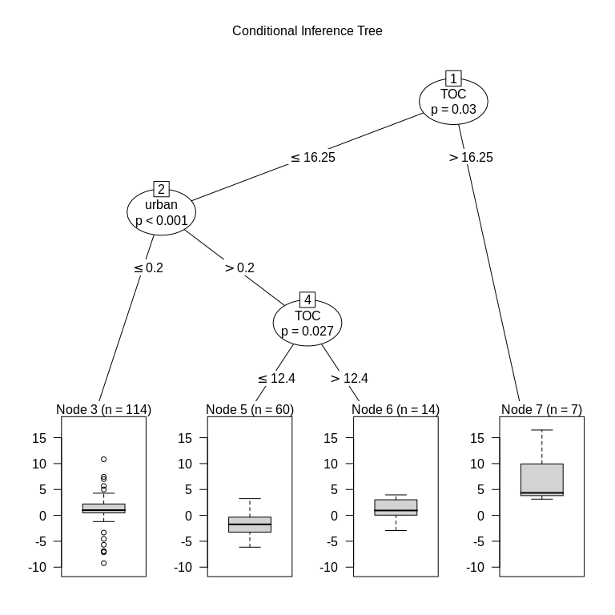<!-- -->

```r
#
# Only for classification (when response variable is a classification)
#
if (FALSE){
  cat("\n\n")
  cat("Table of prediction errors \n")
  table(predict(ct), train_set[[params$response_variable]])
  cat("\n\n")
  cat("Classification of training set \n")
  
  # Validation set
  tr.pred = predict(ct, newdata = valid_set, type="prob")
  colnames(tr.pred) <- c("P0", "P1")
  # tr.pred <- tr.pred %>% map_dfr(~data.frame(P0 = .[1], P1 = .[2]))
  table(tr.pred[,"P1"] > 0.5, valid_set[[params$response_variable]])
  
}

plot(valid_set[[params$response_variable]],  predict(ct, newdata = valid_set))
abline(0, 1, lty = "dashed")
```

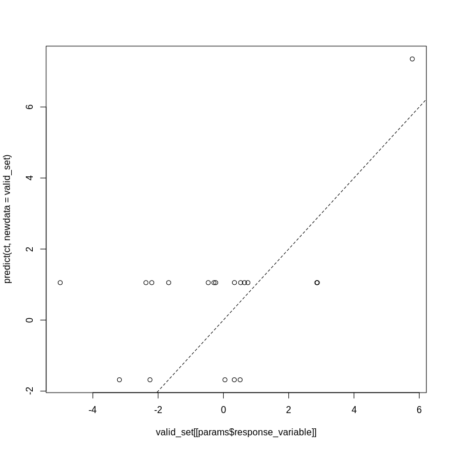<!-- -->

```
## 
## Model formula:
## slope_ton_vs_time ~ catchment_area + TON + slope_pre + slope_tmp + 
##     slope_dep_vs_time + TOTN_dep + pre + tmp + urban + cultivated + 
##     total_forest + total_shrub_herbaceous + wetland + lake_water + 
##     bare_sparse + TOC
## 
## Fitted party:
## [1] root
## |   [2] TOC <= 16.25
## |   |   [3] urban <= 0.2: 1.053 (n = 114, err = 734.5)
## |   |   [4] urban > 0.2
## |   |   |   [5] TOC <= 12.4: -1.682 (n = 60, err = 294.7)
## |   |   |   [6] TOC > 12.4: 1.056 (n = 14, err = 64.9)
## |   [7] TOC > 16.25: 7.353 (n = 7, err = 169.8)
## 
## Number of inner nodes:    3
## Number of terminal nodes: 4
```

### b. Evtree (Evolutionary Learning)   

```r
ev.raw = evtree(tree_formula, data = train_set)
plot(ev.raw)
```

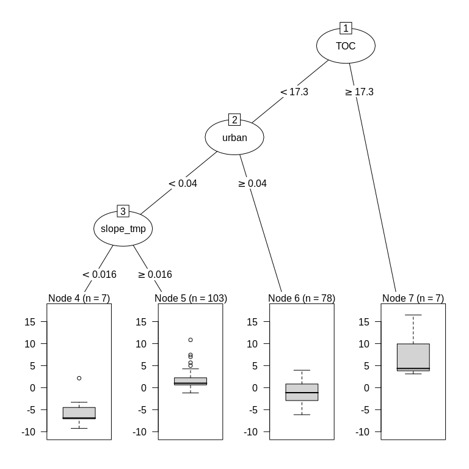<!-- -->

```r
# For classification:
# cat("Predicted in training data: \n")
# table(predict(ev.raw), train_set[[params$response_variable]])

# For continuous response:
plot(predict(ev.raw), train_set[[params$response_variable]])
abline(0, 1, lty = "dashed")
mtext("Predictions in training set")
```

<!-- -->

```r
plot(predict(ev.raw, newdata = valid_set), 
     valid_set[[params$response_variable]])
abline(0, 1, lty = "dashed")
mtext("Predictions in validation set")
```

<!-- -->

```r
# cat("\n\nPrediction errors in training data: \n")
# 1-mean(predict(ev.raw) == train_set$no3_decline_f)
```


### c. Random forest  
* *For results/interpretation, see separate document '160_randomforest_James_data.html'*  


#### c1a. Predict on training data

```r
model1 <- randomForest(as.formula(tree_formula), 
                       data = train_set, 
                       mtry = 5,
                       importance = TRUE)

# Predicting in training set
df_plot <- data.frame(
  Predicted = predict(model1, train_set),
  Observed = train_set[[params$response_variable]])
ggplot(df_plot, aes(Predicted, Observed)) +
  geom_abline(intercept = 0, slope = 1) +
  geom_point() +
  labs(title = "Predictions in training set")
```

<!-- -->

```r
cat("R-square, predicting in training set: \n")
summary(lm(Observed ~ Predicted, data = df_plot))$r.sq

# Predicting in validation set
df_plot <- data.frame(
  Predicted = predict(model1, valid_set),
  Observed = valid_set[[params$response_variable]])
ggplot(df_plot, aes(Predicted, Observed)) +
  geom_abline(intercept = 0, slope = 1) +
  geom_point() +
  labs(title = "Predictions in validation set")
```

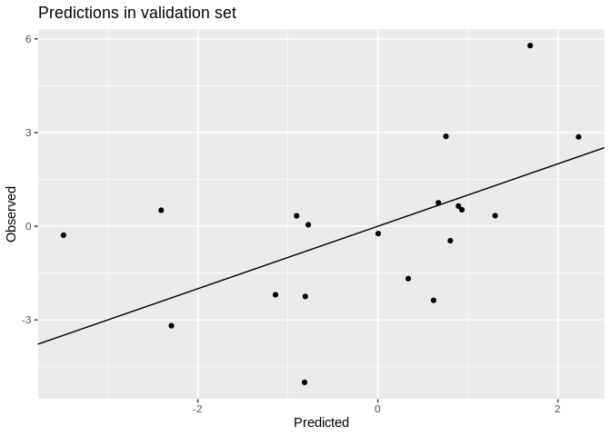<!-- -->

```r
cat("R-square, predicting in validation set: \n")
summary(lm(Observed ~ Predicted, data = df_plot))$r.sq
```

```
## R-square, predicting in training set: 
## [1] 0.9576098
## R-square, predicting in validation set: 
## [1] 0.2523973
```

#### c1b. Model for all data    

```r
full_set <- df_analysis %>% 
  # mutate(no3_decline_f = factor(no3_decline)) %>% 
  # select(-no3_decline, -longitude, - latitude) %>%
  as.data.frame()

model1 <- randomForest(as.formula(tree_formula), 
                       data = full_set, 
                       mtry = 5,
                       importance = TRUE)

# Prediction
df_plot <- data.frame(
  Predicted = predict(model1, full_set),
  Observed = full_set[[params$response_variable]])
ggplot(df_plot, aes(Predicted, Observed)) +
  geom_abline(intercept = 0, slope = 1) +
  geom_point() +
  labs(title = "Predictions in entire data set")
```

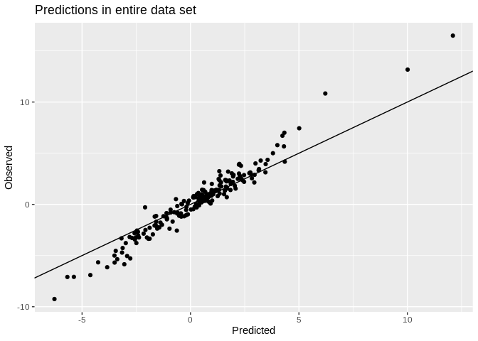<!-- -->

```r
cat("R-square, predicting in entire data set: \n")
summary(lm(Observed ~ Predicted, data = df_plot))$r.sq
```

```
## R-square, predicting in entire data set: 
## [1] 0.9538662
```

#### c2. Importance of variables

```r
# Calculation
importance <- measure_importance(model1)
```


```r
plot_multi_way_importance(importance, size_measure = "no_of_nodes", no_of_labels = 6)  
```

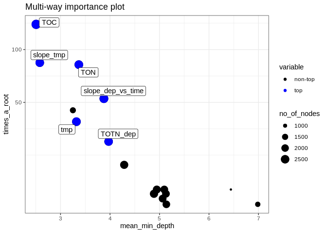<!-- -->

```r
if (FALSE){
  # For classification (discrete response variable)
  plot_multi_way_importance(importance, 
                            x_measure = "accuracy_decrease", 
                            y_measure = "gini_decrease", 
                            size_measure = "p_value", no_of_labels = 6)
} else {
  
  # For regression (continuous response variable)
  plot_multi_way_importance(importance, 
                            x_measure = "mse_increase", 
                            y_measure = "node_purity_increase",
                            size_measure = "p_value", no_of_labels = 6)
}
```

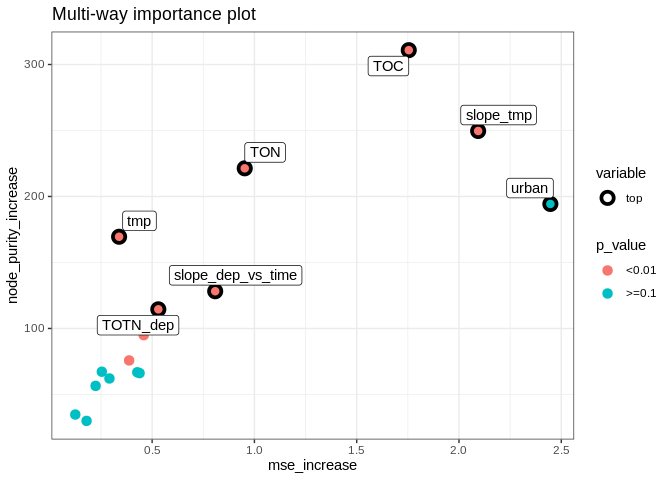<!-- -->

```r
importance
```

```
##                  variable mean_min_depth no_of_nodes mse_increase node_purity_increase
## 1             bare_sparse       6.985320        1276    0.1794800             29.96149
## 2          catchment_area       4.286332        2396    0.4588446             94.93569
## 3              cultivated       6.442300         879    0.1243390             34.80329
## 4              lake_water       4.888332        2430    0.3875720             75.79897
## 5                     pre       5.063552        2218    0.2912791             62.12756
## 6       slope_dep_vs_time       3.876332        2743    0.8082399            128.21235
## 7               slope_pre       5.138332        2121    0.2540353             67.23493
## 8               slope_tmp       2.580888        2596    2.0936148            249.61362
## 9                     tmp       3.320888        2657    0.3385079            169.48736
## 10                    TOC       2.507444        2988    1.7544808            310.85458
## 11                    TON       3.370000        2655    0.9526457            221.33620
## 12           total_forest       4.945220        2266    0.4386268             66.15956
## 13 total_shrub_herbaceous       5.096332        2206    0.4274356             66.81675
## 14               TOTN_dep       3.971444        2591    0.5301968            114.50702
## 15                  urban       3.249884        1498    2.4466660            194.33918
## 16                wetland       5.130108        2166    0.2237836             56.52818
##    no_of_trees times_a_root      p_value
## 1          470            2 1.000000e+00
## 2          497           13 1.758490e-04
## 3          425            5 1.000000e+00
## 4          497            4 8.560147e-06
## 5          492            3 6.097324e-01
## 6          497           53 1.145974e-27
## 7          497            2 9.922061e-01
## 8          498           86 3.155149e-15
## 9          498           36 6.211659e-20
## 10         499          130 1.749097e-56
## 11         500           84 9.075049e-20
## 12         495            5 2.208122e-01
## 13         497            5 7.060008e-01
## 14         499           24 7.171550e-15
## 15         489           44 1.000000e+00
## 16         493            4 9.224916e-01
```


#### c3. Random forest, show partial effects  


```r
# Which variables to include:
variables_for_plot <- importance %>%
  mutate(variable = levels(variable)[as.numeric(variable)]) %>%
  arrange(desc(times_a_root)) %>%
  pull(variable) %>%
  head(12)   # pick the first 12 variables (or less)

# Calculation

plotdata <- NULL  # will be list for storing results

max_number_of_plots <- length(variables_for_plot)/2 %>% floor()

for (i in 1:max_number_of_plots){
  varno1 <- c(1,3,5,7,9,11)[i]
  varno2 <- varno1 + 1
  plotdata[[i]] <- model1 %>%
    partial(pred.var = variables_for_plot[c(varno1, varno2)], chull = TRUE, progress = "text",
            which.class = "1", prob = TRUE)
}
```


```r
### Extra plots

i <- max_number_of_plots

plotpairs <- params$extra_pairwise_plots %>%
  gsub(" ", "", ., fixed = TRUE) %>%
  strsplit(split = ";") %>%
  .[[1]] %>%
  purrr::map(~strsplit(., split = ",")[[1]])

for (plotvar in plotpairs){
  # print(plotvar)
  if (plotvar[1] %in% names(full_set) & plotvar[2] %in% names(full_set)){
    i <- i + 1
    plotdata[[i]] <- model1 %>%
      partial(pred.var = c(plotvar[1], plotvar[2]), chull = TRUE, progress = "text",
             which.class = "1", prob = TRUE)
  }
}
```


```r
# Find range of predicted values for each graph
ranges <- plotdata %>% purrr::map_dfc(~range(.$yhat))
```

```
## New names:
## * `` -> ...1
## * `` -> ...2
## * `` -> ...3
## * `` -> ...4
## * `` -> ...5
## * ...
```

```r
# use range of all the ranges
for (i in 1:length(plotdata)){
  
  if (params$pairwise_plots_same_scale == "TRUE"){
  
    gg <- plot_pair_number(i, zrange = range(ranges))
    print(gg)
    
  } else {
    
    gg <- plot_pair_number(i)
    print(gg)

  }
  
  # Save gg object for later plotting / changes
  # Saved in Figures/Partial_plots' with name e.g. "gg_164a1_7.rds" for plot number 7
  fn <- paste0(
    "Figures/Partial_plots/gg_",
    stringr::str_extract(params$document_title, "([^[[:blank:]]]+)"),   # extract e.g. "164a1"
    "_", i, ".rds")
  saveRDS(gg, fn)
  
}
```

<!-- --><!-- --><!-- -->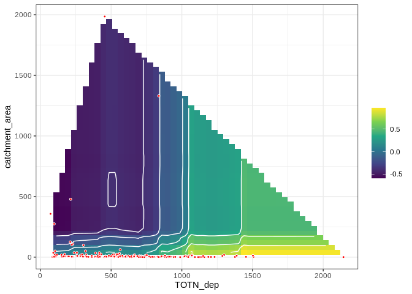<!-- --><!-- -->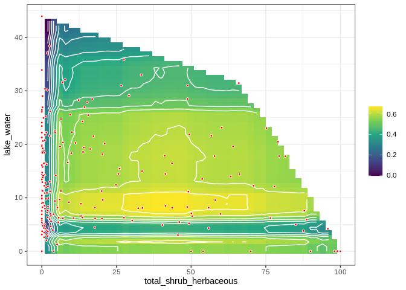<!-- -->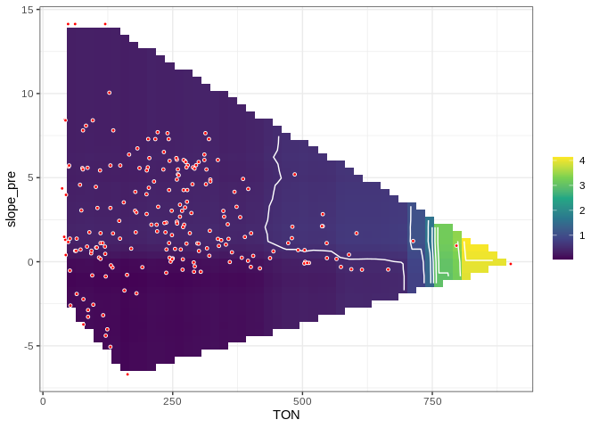<!-- -->


## 6. Linear regression      

```r
fm <- lm(
  as.formula(params$regression_formula),
  data = df_analysis, 
  na.action = "na.fail")

dredged_models <- dredge(fm)                       # only once
```

```
## Fixed term is "(Intercept)"
```

```r
# saveRDS(dredged_models, "Data/164_all_dredged_models.rds")    # save it as it takes a couple of minutes
# dredged_models <- readRDS("Data/164_all_dredged_models.rds")

# cat("\n\nR2: \n")
# mod1 <- get.models(dredged_models, 1)[[1]]  
# summary(mod1)  
```

### Best models  

```r
# subset(dredged_models, delta < 1)

subset(dredged_models, delta < 2)

# Alternative way of showing result (didn't become any better)
# df <- subset(dredged_models, delta < 2)
# select(as.data.frame(df) %>% round(6), -`(Intercept)`, -logLik, -AICc)
```

```
## Global model call: lm(formula = as.formula(params$regression_formula), data = df_analysis, 
##     na.action = "na.fail")
## ---
## Model selection table 
##        (Int)  bar_spr   ctc_are    clt lak_wtr      pre slp_dep_vs_tim slp_tmp     tmp    TOC
## 60311 -4.973          -0.002194 0.4229         0.001444                  63.22 -0.3346 0.4445
## 64407 -3.726          -0.002134 0.4227         0.001409                  57.74 -0.3374 0.4622
## 60319 -5.197          -0.002053 0.4476 0.03108 0.001563                  54.22 -0.3761 0.4735
## 64401 -4.182                                   0.001482                  63.32 -0.3366 0.4657
## 60307 -5.330          -0.001635                0.001494                  67.88 -0.3319 0.4425
## 64403 -4.083          -0.001575                0.001459                  62.40 -0.3347 0.4601
## 60305 -5.481                                   0.001520                  69.05 -0.3337 0.4477
## 60313 -5.715                           0.03188 0.001642                  59.97 -0.3759 0.4766
## 64405 -3.968                    0.2811         0.001454                  60.44 -0.3388 0.4684
## 60315 -5.550          -0.001479        0.02800 0.001604                  60.02 -0.3691 0.4685
## 60312 -5.246  0.01215 -0.002211 0.4261         0.001370                  63.05 -0.3212 0.4450
## 60339 -5.164          -0.001683                0.001468       -0.02703   67.77 -0.3222 0.4429
## 60317 -5.511                    0.3156 0.03512 0.001624                  55.87 -0.3827 0.4824
## 60309 -5.281                    0.2771         0.001492                  66.26 -0.3359 0.4501
## 58264 -5.723  0.02105 -0.002251 0.4249         0.001453                  60.16 -0.3015 0.4166
## 64408 -2.210 -0.02060 -0.002054 0.4172         0.001505                  53.40 -0.3626 0.4762
## 60337 -5.328                                   0.001495       -0.02555   68.97 -0.3246 0.4481
## 60343 -4.918          -0.002153 0.3703         0.001434       -0.01619   63.73 -0.3284 0.4445
## 64415 -4.178          -0.002068 0.4371 0.01798 0.001487                  53.95 -0.3607 0.4743
## 64402 -2.323 -0.02511                          0.001597                  57.91 -0.3671 0.4826
## 60320 -5.476  0.01238 -0.002069 0.4510 0.03133 0.001489                  53.97 -0.3628 0.4742
##        ttl_frs ttl_shr_hrb  TOT_dep     urb      wtl df   logLik   AICc delta weight
## 60311 -0.01583             0.003410 -1.0050 -0.10550 12 -506.208 1038.0  0.00  0.083
## 64407 -0.02924    -0.01796 0.003576 -1.0660 -0.11760 13 -505.079 1038.0  0.01  0.083
## 60319 -0.01587             0.003521 -1.0230 -0.10510 13 -505.321 1038.5  0.49  0.065
## 64401 -0.02985    -0.01862 0.003936 -1.0260 -0.11960 11 -507.589 1038.5  0.52  0.064
## 60307 -0.01570             0.003675 -0.9203 -0.10580 11 -507.624 1038.6  0.59  0.062
## 64403 -0.02912    -0.01796 0.003841 -0.9818 -0.11790 12 -506.509 1038.6  0.60  0.062
## 60305 -0.01595             0.003767 -0.9638 -0.10710 10 -508.777 1038.6  0.67  0.059
## 60313 -0.01596             0.003886 -0.9722 -0.10650 11 -507.847 1039.0  1.03  0.050
## 64405 -0.03011    -0.01877 0.003782 -1.0930 -0.11970 12 -506.905 1039.4  1.39  0.041
## 60315 -0.01573             0.003788 -0.9318 -0.10550 12 -506.911 1039.4  1.41  0.041
## 60312 -0.01278             0.003482 -1.0280 -0.10180 13 -505.824 1039.5  1.50  0.039
## 60339 -0.01900             0.002758 -0.8763 -0.10850 12 -506.985 1039.5  1.55  0.038
## 60317 -0.01612             0.003725 -1.0470 -0.10650 12 -506.996 1039.5  1.58  0.038
## 60309 -0.01609             0.003614 -1.0290 -0.10710 11 -508.119 1039.5  1.58  0.038
## 58264                      0.003300 -1.1010 -0.09654 12 -506.998 1039.5  1.58  0.038
## 64408 -0.04575    -0.03314 0.003594 -1.0790 -0.13410 14 -504.775 1039.7  1.69  0.036
## 60337 -0.01908             0.002904 -0.9234 -0.10960 11 -508.211 1039.7  1.76  0.034
## 60343 -0.01779             0.002894 -0.9681 -0.10710 13 -505.998 1039.8  1.85  0.033
## 64415 -0.02580    -0.01332 0.003597 -1.0610 -0.11420 14 -504.856 1039.8  1.85  0.033
## 64402 -0.04993    -0.03709 0.003948 -1.0400 -0.13960 12 -507.145 1039.8  1.87  0.033
## 60320 -0.01276             0.003596 -1.0470 -0.10130 14 -504.920 1039.9  1.98  0.031
## Models ranked by AICc(x)
```


### Plots  

```r
# Pick model with lowest AICc
mod1 <- get.models(dredged_models, 1)[[1]]  

modelvars <- get_model_variables(mod1)

# Interactions: 2D plot 
if (length(modelvars$interaction_list) > 0){
  modelvars$interaction_list %>% purrr::walk(
    ~visreg(mod1, .x[1], by = .x[2], scale = "response")
  )
}

# Additive effects: 1D plot
if (length(modelvars$additive_vars) > 0){
  par(mfrow = c(2,3), mar = c(4,5,2,1), oma = c(0,0,2,0))
  for (var in modelvars$additive_vars)
    visreg(mod1, var, scale = "response")  
}
```

<!-- -->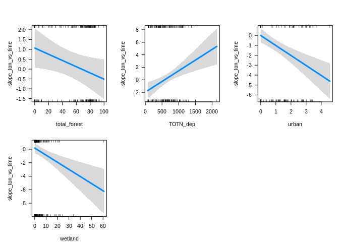<!-- -->


