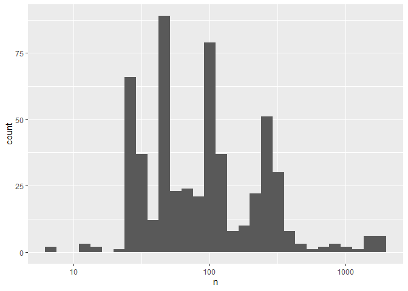
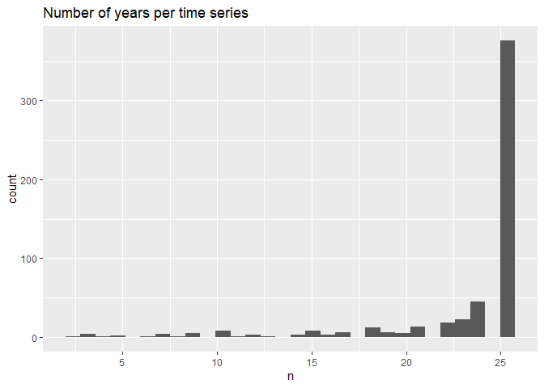
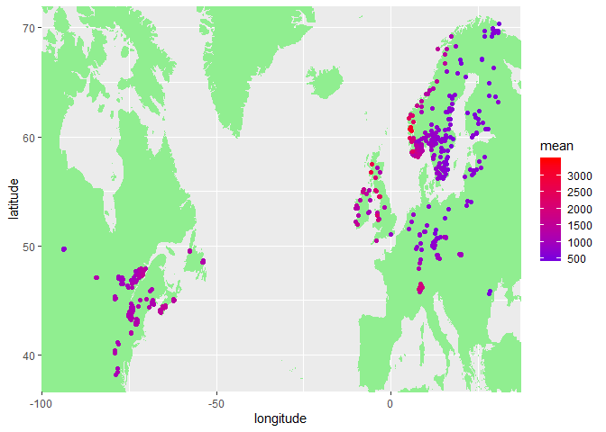

900 Check data
================
DHJ
5 5 2020

  - [1. Libraries](#libraries)
  - [2. Chemistry](#chemistry)
      - [Wide format](#wide-format)
      - [Check](#check)
      - [Long format](#long-format)
      - [Add stuff](#add-stuff)
      - [Check](#check-1)
  - [3. Deposition](#deposition)
      - [Check](#check-2)
  - [4. Land cover](#land-cover)
      - [Checks](#checks)
      - [Map](#map)
  - [5. Selection of stations](#selection-of-stations)
  - [6. Climate](#climate)
      - [Plot 1](#plot-1)
      - [Plot 2](#plot-2)

    Dataene finner du her:
    Kjemi: K:/Prosjekter/JES/ICPW/Thematic_Trends_Report_2020/data_matrices/all_icpw_samples_long.csv
    -   I første omgang er det NO3-N, TOT-N og TOC vi er interessert i
    -   Det må også genereres parametrene TON (=TOT-N – NO3-N) og TOC/TON (=(TOC*1000)/TON)
    -   Og som nevnt – prøvetakingsfrekvensen varierer mye
    
    Deposisjon: K:/Prosjekter/langtransporterte forurensninger/O-23300 - ICP-WATERS - HWI/Faglige rapporter/2020 report/Deposition data/Processed/dep_TOTN.csv
    -   Her mangler som nevnt data for 1990-1999 for US sites. Hvis ikke James kan fikse det, får vi droppe US enn så lenge
    
    Land cover + annen site info: K:/Prosjekter/langtransporterte forurensninger/O-23300 - ICP-WATERS - HWI/Faglige rapporter/2020 report/Land cover/ICPW_All_Stations_2020_2020_05_04.xlsx
    -   Bruk bare denne som basis – her er infoen oppdatert (i motsetning til filene under som har funksjon bare for å liste opp stasjoner)
    -   Land cover er gitt som %. Det gjør vel at noen vil være godt korrelert med andre, antar jeg (mye bart fjell har lite skog f.eks.). Noe å tenke på
    -   Total_forest og total_shrub_herbaceous er samlekategorier, dvs de er summen av de tre neste kategoriene. Så her må man bruke enten-eller. Hvis det er få i underkategoriene, er det kanskje best å bruke det høyere nivået. Kanskje er det også lurt å starte med det høyere nivået, vet ikke. Lake og water ex lake kan også slås sammen evt
    
    - Klima
    Tidsserier for årlig klima her: https://github.com/JamesSample/icpw2/tree/master/thematic_report_2020/results/climate
    
    Så var det det med utvalg av stasjoner. Dataene over er gitt for alle stasjoner (så langt det finnes data). Men vi har gjort visse utvalg for MK-analysene, gitt noen kriterier for hvor lite data de kan ha. Jeg tenker at det er greit å bruke samme utvalg av stasjoner – for sammenligning av ulike analyser, og fordi kriteriene var fornuftige. I mappene som starter med «trends» (K:/Prosjekter/JES/ICPW/Thematic_Trends_Report_2020), ligger det en csv-fil som slutter med «stations». Bruk station_id her for å velge stasjoner for de ulike utvalgene. Som er:
    1)  trends_1992-2016_no3: Her er kriteriene bare fylt for NO3-N, så dette settet skal bare analyseres med tanke på det som respons. Foreslår at du begynner her
    2)  trends_1992-2016_toc_totn_no3_relax_italy: Her er kriteriene fylt for TOC, TOTN og NO3 (TOC ikke for Italia). Her er de mest interessante responsene NO3-N (for sammenligning), TON, TOTN, TOC/TON (det siste vil ikke funke for de italienske)
    3)  trends_2000-2016_totn_no3: Her er kriteriene fylt for TOTN og NO3. Tidsperioden er kortere, så vi får med flere sites. Her er de mest interessante responsene NO3-N, TON, TOTN og TOC/TON (det siste vil ikke funke for alle, og være litt usikre for noen). Dette utvalget har lavest prioritet foreløpig. Det blir mest for å se om ting ser annerledes ut når man får med litt flere sites fra tempererte strøk i Europa

## 1\. Libraries

``` r
# All of tehse packages cn be loaded at once using library(tidyverse). (I just like to be specific.)
library(dplyr)
```

    ## Warning: package 'dplyr' was built under R version 3.6.3

    ## 
    ## Attaching package: 'dplyr'

    ## The following objects are masked from 'package:stats':
    ## 
    ##     filter, lag

    ## The following objects are masked from 'package:base':
    ## 
    ##     intersect, setdiff, setequal, union

``` r
library(readr)
library(readxl)
library(lubridate)
```

    ## Warning: package 'lubridate' was built under R version 3.6.3

    ## 
    ## Attaching package: 'lubridate'

    ## The following objects are masked from 'package:dplyr':
    ## 
    ##     intersect, setdiff, union

    ## The following objects are masked from 'package:base':
    ## 
    ##     date, intersect, setdiff, union

``` r
library(ggplot2)
library(tidyr)
library(forcats)
```

## 2\. Chemistry

### Wide format

``` r
df_wide <- readr::read_csv(
  "K:/Prosjekter/JES/ICPW/Thematic_Trends_Report_2020/data_matrices/all_icpw_samples_wide.csv",
  col_types = 
    cols(
      .default = col_double(),
      station_code = col_character(),
      station_name = col_character(),
      sample_date = col_datetime(format = "")
    )
)

names(df_wide)
```

    ##  [1] "station_id"     "station_code"   "station_name"   "sample_date"   
    ##  [5] "depth1"         "depth2"         "ALK-E_µEq/l"    "Al_µg/l"       
    ##  [9] "As_µg/l"        "COLOUR_"        "Ca_mg/l"        "Cd_µg/l"       
    ## [13] "Cl_mg/l"        "Cr_µg/l"        "Cu_µg/l"        "DOC_mg/L C"    
    ## [17] "F_mg/l"         "Fe_µg/l"        "Hg_ng/l"        "KOND20_µS/cm"  
    ## [21] "KOND_mS/m"      "K_mg/l"         "LAL_µg/l"       "Mg_mg/l"       
    ## [25] "Mn_µg/l"        "NH4-N_µg/l N"   "NO3-N_µg/l N"   "Na_mg/l"       
    ## [29] "Ni_µg/l"        "ORTP_µg/l"      "Pb_µg/l"        "Qs_m3/s"       
    ## [33] "SO4_mg/l"       "SiO2_mg SiO2/l" "TOC_mg C/l"     "TOTN_µg/l N"   
    ## [37] "TOTP_µg/l P"    "Temp_oC"        "Zn_µg/l"        "pH_"

### Check

``` r
df <- df_wide %>%
  filter(!is.na(`NO3-N_µg/l N`))

apply(!is.na(df), 2, sum) %>% sort() %>% rev()
```

    ##   NO3-N_µg/l N         depth2         depth1    sample_date   station_name 
    ##          87318          87318          87318          87318          87318 
    ##   station_code     station_id            pH_        Cl_mg/l       SO4_mg/l 
    ##          87318          87318          86145          85760          85654 
    ##        Ca_mg/l        Mg_mg/l        Na_mg/l         K_mg/l      KOND_mS/m 
    ##          85380          85363          84137          84093          80556 
    ##    ALK-E_µEq/l     TOC_mg C/l   NH4-N_µg/l N SiO2_mg SiO2/l    TOTN_µg/l N 
    ##          79710          75402          67355          47680          44098 
    ##    TOTP_µg/l P        Al_µg/l        Temp_oC      ORTP_µg/l        Fe_µg/l 
    ##          42150          40020          34518          22567          21683 
    ##        COLOUR_         F_mg/l        Mn_µg/l        Zn_µg/l       LAL_µg/l 
    ##          21311          15310          15009          13359           9761 
    ##        Qs_m3/s        Cd_µg/l        Pb_µg/l        Cu_µg/l        Ni_µg/l 
    ##           9592           6786           6614           5687           4432 
    ##        As_µg/l   KOND20_µS/cm        Cr_µg/l     DOC_mg/L C        Hg_ng/l 
    ##           1481           1207            991            581            195

### Long format

``` r
df1 <- readr::read_csv(
  "K:/Prosjekter/JES/ICPW/Thematic_Trends_Report_2020/data_matrices/all_icpw_samples_long.csv",
  col_types = 
    cols(
      station_id = col_double(),
      station_code = col_character(),
      station_name = col_character(),
      sample_date = col_datetime(format = ""),
      depth1 = col_double(),
      depth2 = col_double(),
      parameter = col_character(),
      unit = col_character(),
      value = col_double()
    ))
```

### Add stuff

``` r
df1 <- df1 %>%
  mutate(year = year(sample_date))
```

### Check

``` r
tab <- xtabs(~station_code, df1)
cat(length(tab), "stations \n\n")
```

    ## 549 stations

``` r
df1 %>%
  filter(parameter == "NO3-N") %>%
  count(station_code) %>%
  ggplot(aes(x = n)) +
  geom_histogram() +
  scale_x_log10()
```

    ## `stat_bin()` using `bins = 30`. Pick better value with `binwidth`.

<!-- -->

``` r
df1 %>%
  filter(parameter == "NO3-N" & year >= 1992) %>%
  distinct(station_code, year) %>%
  count(station_code) %>%
  ggplot(aes(n)) +
  geom_histogram() +
  labs(title = "Number of years per time series")
```

    ## `stat_bin()` using `bins = 30`. Pick better value with `binwidth`.

<!-- -->

``` r
gg <- ggplot(df1, aes(x = parameter)) +
  geom_histogram(stat = "count")
```

    ## Warning: Ignoring unknown parameters: binwidth, bins, pad

``` r
gg + theme(axis.text.x = element_text(angle = -45, hjust = 0))
```

<!-- -->

``` r
ggplot(df1, aes(x = year)) +
  geom_histogram(binwidth = 1)
```

<!-- -->

## 3\. Deposition

``` r
df2 <- read_csv(
  "K:/Prosjekter/langtransporterte forurensninger/O-23300 - ICP-WATERS - HWI/Faglige rapporter/2020 report/Deposition data/Processed/dep_TOTN.csv")
```

    ## Parsed with column specification:
    ## cols(
    ##   station_id = col_double(),
    ##   year = col_double(),
    ##   TOTN_dep = col_double()
    ## )

### Check

``` r
ggplot(df2, aes(TOTN_dep)) +
  geom_histogram()
```

    ## `stat_bin()` using `bins = 30`. Pick better value with `binwidth`.

<!-- -->

``` r
ggplot(df2, aes(year, TOTN_dep)) +
  geom_jitter(alpha = 0.2) +
  scale_y_log10()
```

<!-- -->

## 4\. Land cover

And station positions

``` r
df3 <- read_excel(
  "K:/Prosjekter/langtransporterte forurensninger/O-23300 - ICP-WATERS - HWI/Faglige rapporter/2020 report/Land cover/ICPW_All_Stations_2020_2020_05_04.xlsx")
```

### Checks

``` r
ggplot(df3, aes(country)) +
  geom_histogram(stat = "count") +
  theme(axis.text.x = element_text(angle = -45, hjust = 0))
```

    ## Warning: Ignoring unknown parameters: binwidth, bins, pad

<!-- -->

``` r
gg <- ggplot(df3, aes(catchment_area)) +
  geom_histogram(bins = 40)
gg
```

    ## Warning: Removed 106 rows containing non-finite values (stat_bin).

<!-- -->

``` r
gg + scale_x_log10()
```

    ## Warning: Removed 106 rows containing non-finite values (stat_bin).

<!-- -->

``` r
ggplot(df3, aes(altitude)) +
  geom_histogram()
```

    ## `stat_bin()` using `bins = 30`. Pick better value with `binwidth`.

    ## Warning: Removed 16 rows containing non-finite values (stat_bin).

<!-- -->

``` r
gg <- df3 %>%
  tidyr::pivot_longer(urban:other, names_to = "Land_cover", values_to = "Percentage") %>%
  ggplot(aes(Percentage)) +
  geom_histogram() +
  facet_wrap(vars(Land_cover))
gg
```

    ## `stat_bin()` using `bins = 30`. Pick better value with `binwidth`.

    ## Warning: Removed 978 rows containing non-finite values (stat_bin).

<!-- -->

``` r
# Custom transformation log(x+1)
# Could use gg + scale_y_log10(), but this is slightly more informative
#   by showing the cases where n = 1
tr <- scales::trans_new("", transform = function(x) log(x+1), inverse = function(x) exp(x)-1)

gg + 
  scale_y_continuous(
    trans = tr, 
    breaks = c(0,1,10, 100),
    labels = function(lab) round(lab,0)
  )
```

    ## `stat_bin()` using `bins = 30`. Pick better value with `binwidth`.

    ## Warning: Removed 978 rows containing non-finite values (stat_bin).

<!-- -->

### Map

``` r
library(maps)
my_map <- map_data("world")
ggplot(df3, aes(longitude, latitude)) +
  annotation_map(my_map, fill = "lightgreen") +
  geom_point()
```

<!-- -->

## 5\. Selection of stations

**Note: we keep only the station\_id column, since the other ‘metadata’
is updated in the ‘land cover’ file**

``` r
# dir("K:/Prosjekter/JES/ICPW/Thematic_Trends_Report_2020")

folder1 <- "K:/Prosjekter/JES/ICPW/Thematic_Trends_Report_2020/trends_1992-2016_no3"
folder2 <- "K:/Prosjekter/JES/ICPW/Thematic_Trends_Report_2020/trends_1992-2016_toc_totn_no3_relax_italy"
folder3 <- "K:/Prosjekter/JES/ICPW/Thematic_Trends_Report_2020/trends_2000-2016_totn_no3"
  
fn1 <- dir(folder1, pattern = "stations.csv")
fn2 <- dir(folder2, pattern = "stations.csv")
fn3 <- dir(folder3, pattern = "stations.csv")

column_types <- cols(
  station_id = col_double(),
  station_code = col_character(),
  station_name = col_character(),
  latitude = col_double(),
  longitude = col_double(),
  altitude = col_double(),
  continent = col_character(),
  country = col_character(),
  region = col_character(),
  group = col_character()
)

df4a <- read_csv(paste0(folder1, "/", fn1), col_types = column_types) %>% select(station_id)
df4b <- read_csv(paste0(folder2, "/", fn2), col_types = column_types) %>% select(station_id)
df4c <- read_csv(paste0(folder3, "/", fn3), col_types = column_types) %>% select(station_id)

nrow(df4a)
```

    ## [1] 498

``` r
nrow(df4b)
```

    ## [1] 293

``` r
nrow(df4c)
```

    ## [1] 312

## 6\. Climate

``` r
df_climate <- read_csv("https://github.com/JamesSample/icpw2/raw/master/thematic_report_2020/results/climate/cru_climate_timeseries_icpw_stns_1992-2016.csv")
```

    ## Parsed with column specification:
    ## cols(
    ##   station_id = col_double(),
    ##   year = col_double(),
    ##   variable = col_character(),
    ##   value = col_double()
    ## )

### Plot 1

``` r
df_climate %>%
  group_by(station_id, variable) %>%
  summarise(mean = mean(value)) %>%
  ggplot(aes(variable, mean)) + geom_boxplot()
```

<!-- -->

### Plot 2

``` r
df <- df_climate %>%
  group_by(station_id, variable) %>%
  summarise(mean = mean(value)) %>%
  left_join(df3, by = "station_id")

gg <- ggplot(df %>% filter(variable == "pre"),
  aes(longitude, latitude)) +
  annotation_map(my_map, fill = "lightgreen") +
  geom_point(aes(color = mean))

gg + 
  scale_color_gradient2(low = "darkgreen", mid = "blue", high = "red")
```

<!-- -->

``` r
gg <- ggplot(df %>% filter(variable == "tmp"),
  aes(longitude, latitude)) +
  annotation_map(my_map, fill = "lightgreen") +
  geom_point(aes(color = mean))

gg + 
  scale_color_gradient2(low = "darkgreen", mid = "blue", high = "red")
```

<!-- -->
