**Analysis of TOC/TON decrease (categorical, "decrease or not"), based on James' trend results**  
  
**Dataset: all variables except without catchment area, TOC, and TOC and TON slopes**   

As 160, but analysing the trend in TOC/TON ratio

* Response variable: 'Significant decrease in TOC/TON ratio' (locations with signif. *decrease* are *not* excluded)  
* Data from https://github.com/JamesSample/icpw2/tree/master/thematic_report_2020/results      
* Sen slope of NO3, TOTN, TOC/TON etc. 1992-2016
* Response variable in all analyses are *whether TOC/TON decreases or not*     
* Predictors:
    - slope_toc_vs_time, slope_ton_vs_time  
    - TOC: Medians of TOC 1992-2016     
    - TON: Medians of TOC 1992-2016   
    - NO3, TOTN_dep: Medians of NO3, TOTN_dep (Tot-N deposition) 1992-2016   
    - catchment_area (if included in data)      
    - pre, tmp: mean precipitation + temp   
    - Land cover 
  
Technical details: This html file was created with `161parm_Time_series_tocton.Rmd` run with `161parm_run_markdown.R`    
Code: https://github.com/DagHjermann/icpw-R   

## 1. Libraries  

```r
# All of these packages cn be loaded at once using library(tidyverse). (I just like to be specific.)
library(dplyr)
library(tidyr)      # pivot_wider
library(purrr)      # 'map' functions  
library(lubridate)  
library(ggplot2)

# Too many packages, not all are used
library(mapview)
library(visreg)     # visreg
library(rkt)        # Theil -Sen Regression

library(MuMIn)      

# Trees and forests
library(party)                  # ctree
library(evtree)                 # evtree
library(randomForest)
library(randomForestExplainer)  # measure_importance, plot_multi_way_importance
library(pdp)                    # partial, autoplot

library(maps)
my_map <- map_data("world")

library(effects)    # handles lme models  
library(readxl)
library(readr)

source("002_Functions.R")
source("160parm_functions.R")

knitr::opts_chunk$set(results = 'hold') # collect the results from a chunk  
knitr::opts_chunk$set(warning = FALSE)  

options(width = 95)
```


## 2. Data

### James' trends and medians     

```r
#
# Regression results
#
folder <- "https://github.com/JamesSample/icpw2/raw/master/thematic_report_2020/results/trends_1992-2016_toc_totn_no3_relax_italy"
file <- "trends_1992-2016_toc_totn_no3_relax_italy_results.csv"
fn <- paste0(folder, "/", file)

reg_ratio <- read.csv(fn, encoding = "UTF-8")
cat("Regression slopes and medians from:", sQuote(file), ",n =", nrow(reg_ratio), "\n\n")

# Station metadata
# THESE WILL BE ADDED WITH LAND COVER  
# file <- "trends_1992-2016_toc_totn_no3_relax_italy_stations.csv"
# fn <- paste0(folder, "/", file)
# df_metadata <- read.csv(fn, encoding = "UTF-8")
# cat("Regression result metadata:", sQuote(file), ",n =", nrow(df_metadata), "\n\n")

# cat("Countries with trends: \n")
# xtabs(~country, df_metadata)  
```

```
## Regression slopes and medians from: 'trends_1992-2016_toc_totn_no3_relax_italy_results.csv' ,n = 2418
```


### Start 'dat'  

With slope regression data  
* Make one line per station  

```r
# table(reg_ratio$variable)

# Slope 
df1 <- reg_ratio %>%
  filter(variable %in% c("NO3-N_µg/l N", "TOC/TON", "TOC_mg C/l", "TON_µg/l N")) %>%
  select(station_id, variable, sen_slp) %>%
  tidyr::pivot_wider(names_from = "variable", values_from = "sen_slp") %>%
  rename(slope_no3_vs_time = `NO3-N_µg/l N`, 
         slope_tocton_vs_time = `TOC/TON`,
         slope_toc_vs_time = `TOC_mg C/l`,
         slope_ton_vs_time = `TON_µg/l N`)

# Slope p-value
df2 <- reg_ratio %>%
  filter(variable %in% c("NO3-N_µg/l N", "TOC/TON", "TOC_mg C/l", "TON_µg/l N")) %>%
  select(station_id, variable, mk_p_val) %>%
  tidyr::pivot_wider(names_from = "variable", values_from = "mk_p_val") %>%
  rename(p_no3_vs_time = `NO3-N_µg/l N`, 
         p_tocton_vs_time = `TOC/TON`,
         p_toc_vs_time = `TOC_mg C/l`,
         p_ton_vs_time = `TON_µg/l N`)

# Medians
df3 <- reg_ratio %>%
  filter(variable %in% c("NO3-N_µg/l N", "TOC/TON", "TOC_mg C/l", "TON_µg/l N")) %>%
  select(station_id, variable, median) %>%
  tidyr::pivot_wider(names_from = "variable", values_from = "median") %>%
  rename(NO3 = `NO3-N_µg/l N`,
         TOCTON = `TOC/TON`,
         TOC = `TOC_mg C/l`,
         TON = `TON_µg/l N`)

cat("\n")
cat("df1, n =", nrow(df1), "\n")
cat("df2, n =", nrow(df2), "\n")
cat("df3, n =", nrow(df3), "\n")

dat_1 <- df1 %>%
  full_join(df2, by = "station_id") %>%
  full_join(df3, by = "station_id")

cat("dat_1, n =", nrow(dat_1), "\n")
```

```
## 
## df1, n = 293 
## df2, n = 293 
## df3, n = 293 
## dat_1, n = 293
```

### Deposition trends and median 1992-2006     

```r
fn <- "https://github.com/JamesSample/icpw2/raw/master/thematic_report_2020/results/deposition/totn_dep_trends_icpw_stns.csv"  

df_deposition <- read.csv(fn) %>% 
  filter(variable == "totn_mgNpm2")  

cat("n =", nrow(df_deposition), "\n")
```

```
## n = 556
```


### Add deposition slope and medians to data  

```r
# debugonce(left_join2)
dat_2 <- dat_1 %>% 
  left_join2(df_deposition %>% 
              select(station_id, median, sen_slp, mk_p_val) %>%
              rename(TOTN_dep = median,
                     slope_dep_vs_time = sen_slp,
                     p_dep_vs_time = mk_p_val),
             by = "station_id",
             print_vars = TRUE)
```

```
## Variables before join: 
## 'station_id', 'slope_no3_vs_time', 'slope_ton_vs_time', 'slope_toc_vs_time', 'slope_tocton_vs_time', 'p_no3_vs_time', 'p_ton_vs_time', 'p_toc_vs_time', 'p_tocton_vs_time', 'NO3', 'TON', 'TOC', 'TOCTON'
## 
## Variables used to join: 
## 'station_id'
## 
## Variables added: 
## 'TOTN_dep', 'slope_dep_vs_time', 'p_dep_vs_time'
```

### Add medians and station metadata   


```r
# dat_2 <- dat_2 %>%
#   left_join(df_metadata, by = "station_id")

# cat("dat_2, n =", nrow(dat_2), "\n")

# Simplify names by removing units
# names(dat_2)
# names(dat_2) <- sub(".N_µg.l.N", "", names(dat_2))
# names(dat_2) <- sub("_mg.C.l", "", names(dat_2))
# names(dat_2) <- sub("_µg.l.P", "", names(dat_2))

# cat("\nVariable names: \n")
# names(dat_2)
```

### Add climate and deposition medians and slopes  

```r
fn <- "https://github.com/JamesSample/icpw2/raw/master/thematic_report_2020/results/climate/cru_climate_trends_icpw_stns.csv"

df_climate_mean <- read_csv(fn) %>% 
  select(station_id, variable, median) %>%
  pivot_wider(names_from = "variable", values_from = "median")
```

```
## Rows: 1112 Columns: 8
```

```
## ── Column specification ───────────────────────────────────────────────────────────────────────
## Delimiter: ","
## chr (3): variable, mk_trend, sen_trend
## dbl (5): station_id, median, mk_p_val, sen_slp, sen_incpt
```

```
## 
## ℹ Use `spec()` to retrieve the full column specification for this data.
## ℹ Specify the column types or set `show_col_types = FALSE` to quiet this message.
```

```r
cat("\n")
# names(df_climate_mean)

df_climate_slope <- read_csv(fn) %>%
  select(station_id, variable, sen_slp) %>%
  pivot_wider(names_from = "variable", values_from = "sen_slp", names_prefix = "Slope_")
```

```
## Rows: 1112 Columns: 8
```

```
## ── Column specification ───────────────────────────────────────────────────────────────────────
## Delimiter: ","
## chr (3): variable, mk_trend, sen_trend
## dbl (5): station_id, median, mk_p_val, sen_slp, sen_incpt
```

```
## 
## ℹ Use `spec()` to retrieve the full column specification for this data.
## ℹ Specify the column types or set `show_col_types = FALSE` to quiet this message.
```

```r
# Add
dat_3 <- dat_2 %>%
  left_join2(df_climate_mean, by = "station_id", print_vars = TRUE) %>%
  left_join2(df_climate_slope, by = "station_id", print_vars = TRUE)
```

```
## 
## Variables before join: 
## 'station_id', 'slope_no3_vs_time', 'slope_ton_vs_time', 'slope_toc_vs_time', 'slope_tocton_vs_time', 'p_no3_vs_time', 'p_ton_vs_time', 'p_toc_vs_time', 'p_tocton_vs_time', 'NO3', 'TON', 'TOC', 'TOCTON', 'TOTN_dep', 'slope_dep_vs_time', 'p_dep_vs_time'
## 
## Variables used to join: 
## 'station_id'
## 
## Variables added: 
## 'pre', 'tmp'
## Variables before join: 
## 'station_id', 'slope_no3_vs_time', 'slope_ton_vs_time', 'slope_toc_vs_time', 'slope_tocton_vs_time', 'p_no3_vs_time', 'p_ton_vs_time', 'p_toc_vs_time', 'p_tocton_vs_time', 'NO3', 'TON', 'TOC', 'TOCTON', 'TOTN_dep', 'slope_dep_vs_time', 'p_dep_vs_time', 'pre', 'tmp'
## 
## Variables used to join: 
## 'station_id'
## 
## Variables added: 
## 'Slope_pre', 'Slope_tmp'
```

### Combine land cover types   
* Data including UK read using script 159   
* Note: also includes metadata (country, etc.)
* bare_sparse = bare_rock + sparsely_vegetated + glacier   
* Select: coniferous, deciduous, lake, mixed_forest, wetland, bare_sparse   


```r
# df_landcover3_OLD <- readRDS("Data/159_df_landcover3.rds")
df_landcover3 <- readRDS("Data/159_df_meta3.rds")

df_landcover3 <- df_landcover3 %>%
  mutate(bare_sparse = bare_rock + sparsely_vegetated + glacier,
         decid_mixed = deciduous + mixed_forest,
         lake_water = lake + water_ex_lake) %>%
  select(-c(bare_rock, sparsely_vegetated, glacier, deciduous, mixed_forest, lake, water_ex_lake))
```


### Add land cover columns to main data    

```r
dat_4 <- left_join2(dat_3, 
                   df_landcover3, 
                   by = "station_id", 
                   print_vars = TRUE
)
```

```
## Variables before join: 
## 'station_id', 'slope_no3_vs_time', 'slope_ton_vs_time', 'slope_toc_vs_time', 'slope_tocton_vs_time', 'p_no3_vs_time', 'p_ton_vs_time', 'p_toc_vs_time', 'p_tocton_vs_time', 'NO3', 'TON', 'TOC', 'TOCTON', 'TOTN_dep', 'slope_dep_vs_time', 'p_dep_vs_time', 'pre', 'tmp', 'Slope_pre', 'Slope_tmp'
## 
## Variables used to join: 
## 'station_id'
## 
## Variables added: 
## 'station_code', 'station_name', 'latitude', 'longitude', 'altitude', 'continent', 'country', 'region', 'group', 'catchment_area', 'urban', 'cultivated', 'total_forest', 'coniferous', 'total_shrub_herbaceous', 'grasslands', 'heathlands', 'transitional_woodland_shrub', 'wetland', 'other', 'bare_sparse', 'decid_mixed', 'lake_water'
```

### Drop locations with >10% cultivated    

```r
dat_5 <- dat_4 %>%
  filter(cultivated <= 10)

cat(nrow(dat_4) - nrow(dat_5), "stations with > 10% cultivated deleted \n")
```

```
## 4 stations with > 10% cultivated deleted
```


### Data set used  

```r
dat <- dat_5
```


## 3. Plot slopes    


```r
dat <- dat %>%
  mutate(AtlCan = ifelse(region == "AtlCan", "AtlCan", "Not AtlCan"))

ggplot(dat, aes(slope_toc_vs_time, slope_tocton_vs_time)) + 
  geom_point(data = dat %>% filter(slope_tocton_vs_time < 0.05), size = rel(2)) +
  geom_point(aes(color = country)) +
  geom_hline(yintercept = 0, linetype = 2) + 
  geom_vline(xintercept = 0, linetype = 2) +
  facet_wrap(vars(AtlCan))
```

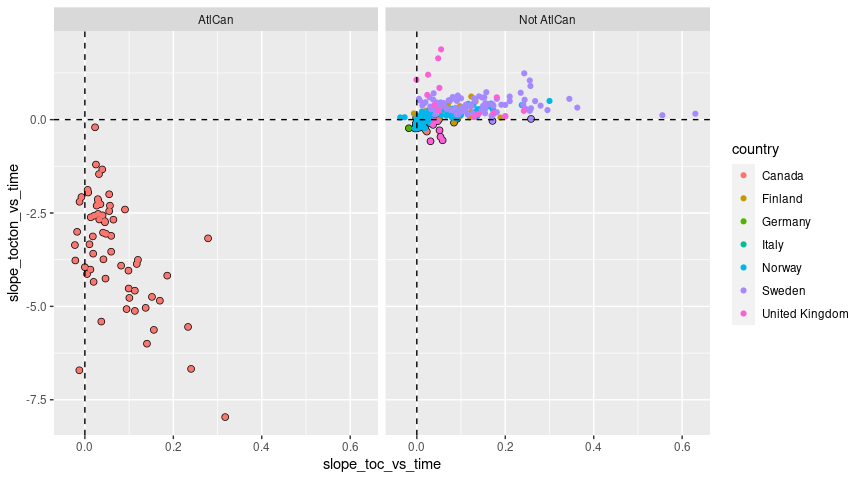<!-- -->

```r
ggplot(dat, aes(slope_ton_vs_time, slope_tocton_vs_time)) + 
  geom_point(data = dat %>% filter(slope_tocton_vs_time < 0.05), size = rel(2)) +
  geom_point(aes(color = country)) +
  geom_hline(yintercept = 0, linetype = 2) + 
  geom_vline(xintercept = 0, linetype = 2)  +
  facet_wrap(vars(AtlCan))
```

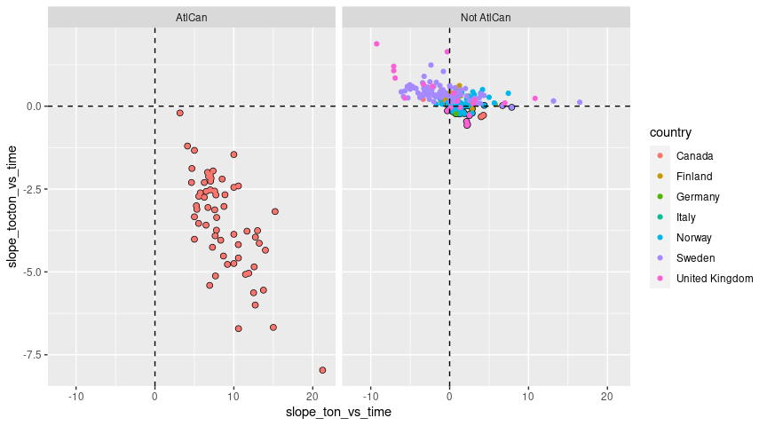<!-- -->

```r
ggplot(dat, aes(slope_dep_vs_time, slope_tocton_vs_time)) + 
  geom_point(data = dat %>% filter(slope_tocton_vs_time < 0.05), size = rel(2)) +
  geom_point(aes(color = country)) +
  geom_hline(yintercept = 0, linetype = 2) + 
  geom_vline(xintercept = 0, linetype = 2) +
  facet_wrap(vars(AtlCan)) 
```

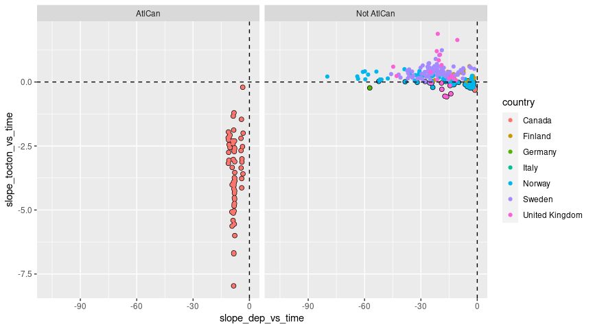<!-- -->

```r
if (FALSE){
dat %>%
  filter(!country %in% c("Latvia","Ireland","Italy","Netherlands")) %>%
  ggplot(aes(slope_dep_vs_time, slope_no3_vs_time,
             color = (p_no3_vs_time < 0.05))) + 
  geom_point() +
  facet_wrap(vars(country)) +
  geom_hline(yintercept = 0, linetype = 2) + 
  geom_vline(xintercept = 0, linetype = 2) + 
  labs(title = "A selection of countries") + 
  ylim(-50, 25)
}
```


## 4. Select data    

### a. Select variables  
* Select variables to use, and thereby also cases   
* Also, 'AtlCan' data are excluded  

```r
get_df_tocton_decrease <- function(data, variable_string){
  variable_string <- gsub(" ", "", variable_string)
  variables <- strsplit(variable_string, split = ",")[[1]]
  # Data for analyses
  df <- data %>%
    mutate(
      tocton_decrease = case_when(
        slope_tocton_vs_time < 0 & p_tocton_vs_time <= 0.05 ~ 1,
        TRUE ~ 0)
    )
  # Variables that will be included in excel output (removed afterwards)
  id_vars <- c("station_id", "station_code", "station_name", "country")
  df[c(id_vars, variables)]
}


table(dat$region)

cat("-------------------------------------------------------------\n")
cat("Variables: \n")
cat(params$selected_vars)
cat("\n-------------------------------------------------------------\n")

dat_filtered <- dat %>%
  filter(region != "AtlCan")

df_analysis <- get_df_tocton_decrease(dat_filtered, params$selected_vars)  

# table(df_analysis$tocton_decrease)


# names(dat) %>% paste(collapse = ", ")

cat("Number of missing values per variable: \n")
apply(is.na(df_analysis), 2, sum) 
cat("\n")

# What is missing? (long output)
if (FALSE){
  dat %>% 
    split(.$country) %>%
    purrr::map(~apply(is.na(.), 2, mean))
}

cat("Number of complete observations: \n")
complete <- complete.cases(df_analysis)
table(complete)

cat("\n\n")
cat("Number of complete observations by country: \n")
table(df_analysis$country, complete)

# Keep only complete cases
df_analysis <- df_analysis[complete.cases(df_analysis),]

# Save to excel
fn <- paste0(substr(params$document_title, 1, 5), "_data.xlsx")
writexl::write_xlsx(df_analysis, paste0("Data_analysed/", fn))

# Remove variables defined as 'id_vars' in function above
df_analysis <- df_analysis %>%
  select(-station_id, -station_code, -station_name, -country)

cat("\n\n")
cat("Original data: n =", nrow(dat), "\n")
cat("Data after filtering: n =", nrow(dat_filtered), "\n")
cat("Analysis: n =", nrow(df_analysis), "\n")
```

```
## 
##     Alps   AtlCan   NoNord      Ont   SoNord UK-IE-NL      WCE 
##        6       61       49        7      144       21        1 
## -------------------------------------------------------------
## Variables: 
## tocton_decrease,TON,slope_dep_vs_time, TOTN_dep, latitude, longitude, altitude,pre, tmp, urban, cultivated, coniferous, decid_mixed, total_shrub_herbaceous,wetland, lake_water, bare_sparse
## -------------------------------------------------------------
## Number of missing values per variable: 
##             station_id           station_code           station_name                country 
##                      0                      0                      0                      0 
##        tocton_decrease                    TON      slope_dep_vs_time               TOTN_dep 
##                      0                      0                      0                      0 
##               latitude              longitude               altitude                    pre 
##                      0                      0                      0                      0 
##                    tmp                  urban             cultivated             coniferous 
##                      0                      0                      0                      3 
##            decid_mixed total_shrub_herbaceous                wetland             lake_water 
##                      3                      0                      0                      0 
##            bare_sparse 
##                      0 
## 
## Number of complete observations: 
## complete
## FALSE  TRUE 
##     3   225 
## 
## 
## Number of complete observations by country: 
##                 complete
##                  FALSE TRUE
##   Canada             3    4
##   Finland            0   26
##   Germany            0    1
##   Italy              0    6
##   Norway             0   82
##   Sweden             0   85
##   United Kingdom     0   21
## 
## 
## Original data: n = 289 
## Data after filtering: n = 228 
## Analysis: n = 225
```


### b. Correlations   

```r
gg <- GGally::ggcorr(
  df_analysis, 
  method = c("complete.obs", "kendall"), 
  label = TRUE,
  hjust = 0.9, angle = -30) # +
# class(gg)
gg + coord_cartesian(x = c(-2, 20), y = c(-2,22))
```

```
## Coordinate system already present. Adding new coordinate system, which will replace the existing one.
```

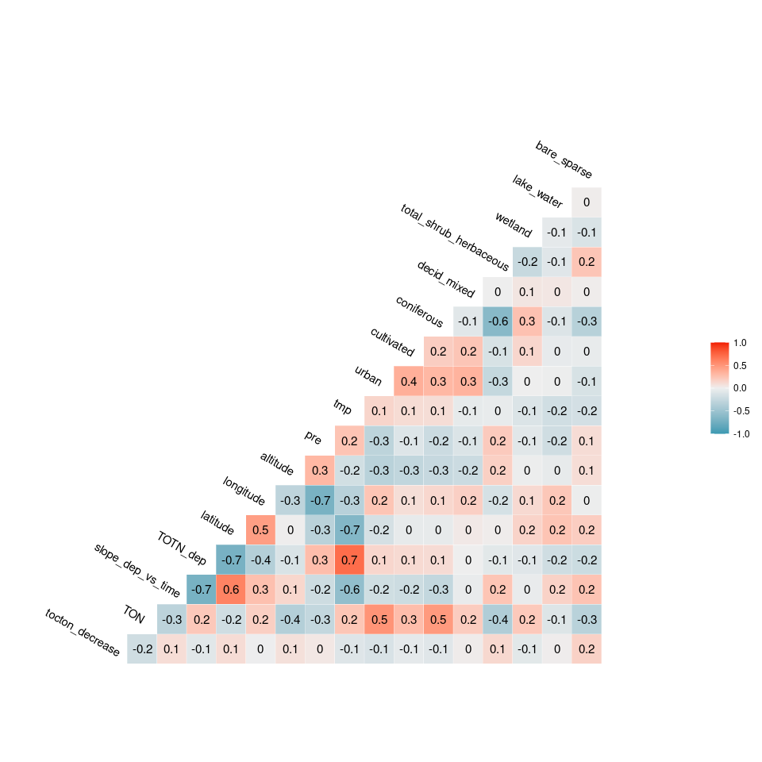<!-- -->


## 5. Tree and forest classification


### Split into training and validation data

```r
set.seed(123)

x <- runif(nrow(df_analysis))
train <- ifelse(x < 0.9, TRUE, FALSE)

train_set <- df_analysis[train,]  %>% 
  mutate(tocton_decrease_f = factor(tocton_decrease)) %>% select(-tocton_decrease, -longitude, - latitude) %>%
  as.data.frame()

valid_set <- df_analysis[!train,] %>% 
  mutate(tocton_decrease_f = factor(tocton_decrease)) %>% select(-tocton_decrease, -longitude, - latitude) %>%
  as.data.frame()
```


### a. Tree classification using 'party'   

```r
(ct = ctree(tocton_decrease_f ~ ., data = train_set))

plot(ct, main="Conditional Inference Tree")
```

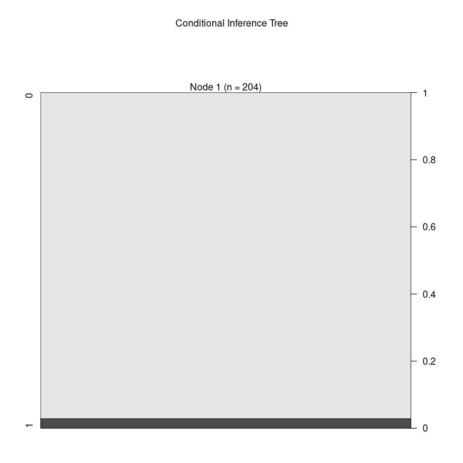<!-- -->

```r
cat("\n\n")
cat("Table of prediction errors \n")
table(predict(ct), train_set$tocton_decrease_f)
cat("\n\n")

cat("Classification of training set \n")
tr.pred = predict(ct, newdata = valid_set, type="prob")
colnames(tr.pred) <- c("P0", "P1")
# tr.pred <- tr.pred %>% map_dfr(~data.frame(P0 = .[1], P1 = .[2]))
table(tr.pred[,"P1"] > 0.5, valid_set$tocton_decrease_f)
```

```
## 
## Model formula:
## tocton_decrease_f ~ TON + slope_dep_vs_time + TOTN_dep + altitude + 
##     pre + tmp + urban + cultivated + coniferous + decid_mixed + 
##     total_shrub_herbaceous + wetland + lake_water + bare_sparse
## 
## Fitted party:
## [1] root: 0 (n = 204, err = 2.9%) 
## 
## Number of inner nodes:    0
## Number of terminal nodes: 1
## 
## 
## Table of prediction errors 
##    
##       0   1
##   0 198   6
##   1   0   0
## 
## 
## Classification of training set 
##        
##          0  1
##   FALSE 20  1
```

### b. Evtree (Evolutionary Learning)   

```r
ev.raw = evtree(tocton_decrease_f ~ ., data = train_set)

plot(ev.raw)
```

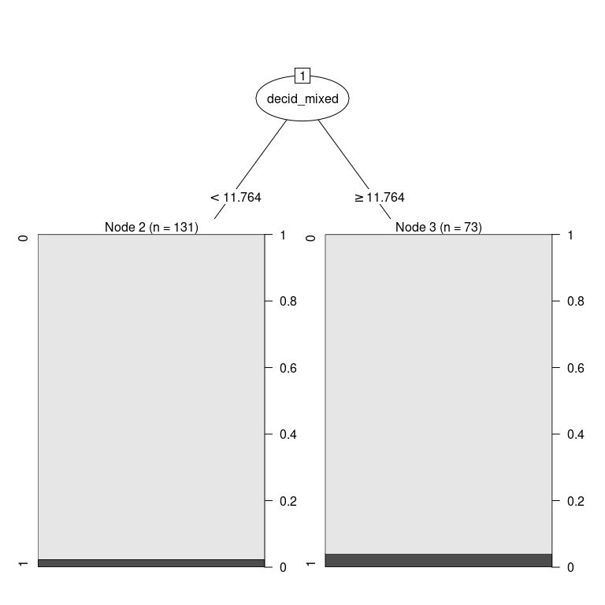<!-- -->

```r
cat("Predicted in training data: \n")
table(predict(ev.raw), train_set$tocton_decrease_f)

cat("\n\nPrediction errors in training data: \n")
1-mean(predict(ev.raw) == train_set$tocton_decrease_f)
```

```
## Predicted in training data: 
##    
##       0   1
##   0 198   6
##   1   0   0
## 
## 
## Prediction errors in training data: 
## [1] 0.02941176
```


### c. Random forest  
* *For results/interpretation, see separate document '160_randomforest_James_data.html'*  
* Model called 'model1'

```r
model1 <- randomForest(tocton_decrease_f ~ ., 
                       data = train_set, 
                       mtry = 5,
                       importance = TRUE)

model1
```

```
## 
## Call:
##  randomForest(formula = tocton_decrease_f ~ ., data = train_set,      mtry = 5, importance = TRUE) 
##                Type of random forest: classification
##                      Number of trees: 500
## No. of variables tried at each split: 5
## 
##         OOB estimate of  error rate: 2.94%
## Confusion matrix:
##     0 1 class.error
## 0 198 0           0
## 1   6 0           1
```


#### c1a. Predict on training data

```r
# Predicting on train set
pred_valid <- predict(model1, valid_set, type = "class")
# Checking classification accuracy
table(pred_valid, valid_set$tocton_decrease_f)  
```

```
##           
## pred_valid  0  1
##          0 20  1
##          1  0  0
```


#### c1b. Model for all data    

```r
full_set <- df_analysis  %>% 
  mutate(tocton_decrease_f = factor(tocton_decrease)) %>%
  select(-tocton_decrease, -longitude, - latitude) %>%
  as.data.frame()


# Predicting on full set
pred_valid <- predict(model1, valid_set, type = "class")

# Checking classification accuracy
table(pred_valid, valid_set$tocton_decrease_f)  
```

```
##           
## pred_valid  0  1
##          0 20  1
##          1  0  0
```


#### c2. Importance of variables

```r
# Calculation
importance <- measure_importance(model1)
```


```r
plot_multi_way_importance(importance, size_measure = "no_of_nodes", no_of_labels = 12)  
```

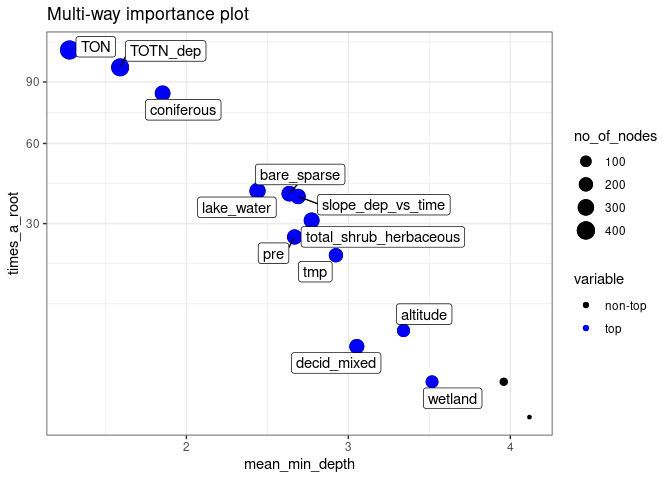<!-- -->

```r
plot_multi_way_importance(importance, x_measure = "accuracy_decrease", y_measure = "gini_decrease", 
                          size_measure = "p_value", no_of_labels = 12)
```

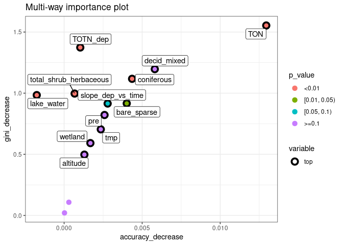<!-- -->


#### c3. Random forest, show partial effects  


```r
# Which variables to include:
variables_for_plot <- importance %>%
  mutate(variable = levels(variable)[as.numeric(variable)]) %>%
  arrange(desc(gini_decrease)) %>%
  pull(variable) %>%
  head(12)   # pick the first 12 variables (or less)

# Calculation

plotdata <- NULL  # will be list for storing results

max_number_of_plots <- length(variables_for_plot)/2 %>% floor()

for (i in 1:max_number_of_plots){
  varno1 <- c(1,3,5,7,9,11)[i]
  varno2 <- varno1 + 1
  plotdata[[i]] <- model1 %>%
    partial(pred.var = variables_for_plot[c(varno1, varno2)], chull = TRUE, progress = "text",
            which.class = "1", prob = TRUE)
}
```


```r
# Find range of predicted values for each graph
ranges <- plotdata %>% purrr::map_dfc(~range(.$yhat))
```

```
## New names:
## * NA -> ...1
## * NA -> ...2
## * NA -> ...3
## * NA -> ...4
## * NA -> ...5
## * ...
```

```r
# use range of all the ranges
for (i in 1:length(plotdata)){
  
  if (params$pairwise_plots_same_scale == "TRUE"){
  
    gg <- plot_pair_number(i, zrange = range(ranges))
    print(gg)
    
  } else {
    
    gg <- plot_pair_number(i)
    print(gg)

  }
  
}
```

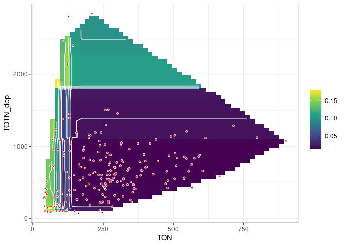<!-- -->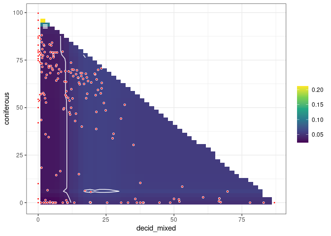<!-- -->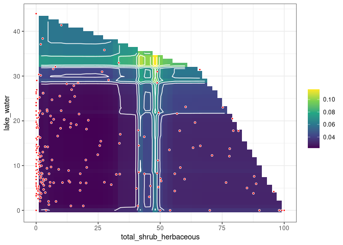<!-- -->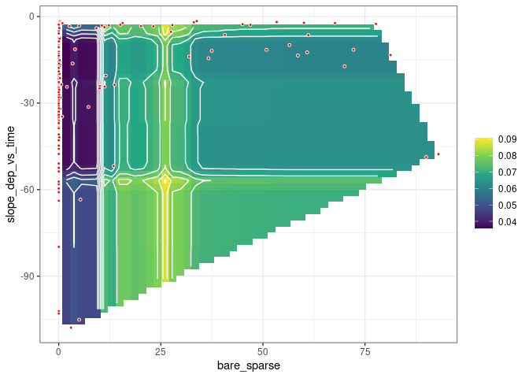<!-- -->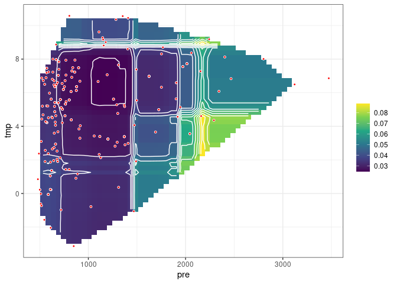<!-- -->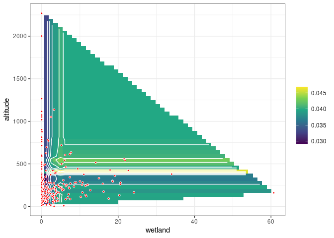<!-- -->


## 6. Logistic regression      

```r
#   tocton_decrease ~ as.formula(params$logistic_formula),
# 
# form <- "tocton_decrease ~ slope_dep_vs_time + slope_ton_vs_time + TOTN_dep + total_shrub_herbaceous + decid_mixed"
#  + slope_toc_vs_time ??

fm <- glm(
  # as.formula(form),
  as.formula(params$logistic_formula),
  data = df_analysis, 
  family = "binomial",
  na.action = "na.fail")

dredged_models <- dredge(fm)              
```

```
## Fixed term is "(Intercept)"
```

## Best models  

```r
# subset(dredged_models, delta < 1)

subset(dredged_models, delta < 2)

# Alternative way of showing result (didn't become any better)
# df <- subset(dredged_models, delta < 2)
# select(as.data.frame(df) %>% round(6), -`(Intercept)`, -logLik, -AICc)
```

```
## Global model call: glm(formula = as.formula(params$logistic_formula), family = "binomial", 
##     data = df_analysis, na.action = "na.fail")
## ---
## Model selection table 
##      (Int)       alt     cnf dcd_mxd lak_wtr slp_dep_vs_tim     tmp      TON   TOT_dep df
## 242 2.9280 -0.002948                                 0.2066 -0.6659 -0.05386 0.0105700  6
## 68  3.2920 -0.003348 0.05384                                        -0.05753            4
## 244 3.9960 -0.003628 0.03506                         0.1792 -0.5789 -0.06525 0.0089190  7
## 241 0.7894                                           0.2236 -0.6558 -0.04103 0.0107500  5
## 248 4.6470 -0.003558 0.05303 0.05399                 0.2535 -0.5798 -0.08523 0.0111200  8
## 72  3.6790 -0.003241 0.07035 0.04166                                -0.07030            5
## 246 3.0890 -0.002777         0.03099                 0.2612 -0.6912 -0.06288 0.0124200  7
## 245 1.2330                   0.03786                 0.2819 -0.6747 -0.05465 0.0128100  6
## 250 2.3970 -0.002944                 0.04253         0.2249 -0.6911 -0.05941 0.0117600  7
## 247 1.9610           0.04402 0.05745                 0.2930 -0.5672 -0.06833 0.0119600  7
## 228 3.9300 -0.003543 0.05090                                -0.2881 -0.06269 0.0017660  6
## 196 3.4100 -0.003687 0.05013                                        -0.06154 0.0007349  5
##      logLik AICc delta weight
## 242 -16.281 44.9  0.00  0.142
## 68  -18.660 45.5  0.55  0.107
## 244 -15.515 45.5  0.60  0.105
## 241 -17.654 45.6  0.64  0.103
## 248 -14.575 45.8  0.87  0.092
## 72  -17.935 46.1  1.20  0.078
## 246 -15.884 46.3  1.34  0.073
## 245 -17.002 46.4  1.44  0.069
## 250 -15.995 46.5  1.56  0.065
## 247 -16.094 46.7  1.76  0.059
## 228 -17.245 46.9  1.93  0.054
## 196 -18.311 46.9  1.95  0.053
## Models ranked by AICc(x)
```

### Plots  

```r
# Pick model with lowest AICc
mod1 <- get.models(dredged_models, 1)[[1]]  

modelvars <- get_model_variables(mod1)

# Interactions: 3D plot 
# visreg2d(mod1, xvar = vars[1], yvar = vars[2], 
#          type = 'conditional', scale = "response") 

# Interactions: 2D plot 
if (length(modelvars$interaction_list) > 0){
  modelvars$interaction_list %>% purrr::walk(
    ~visreg(mod1, .x[1], by = .x[2], scale = "response")
  )
}

# Additive effects: 1D plot
if (length(modelvars$additive_vars) > 0){
  par(mfrow = c(2,3), mar = c(4,5,2,1), oma = c(0,0,2,0))
  for (var in modelvars$additive_vars)
    visreg(mod1, var, scale = "response")  
}
```

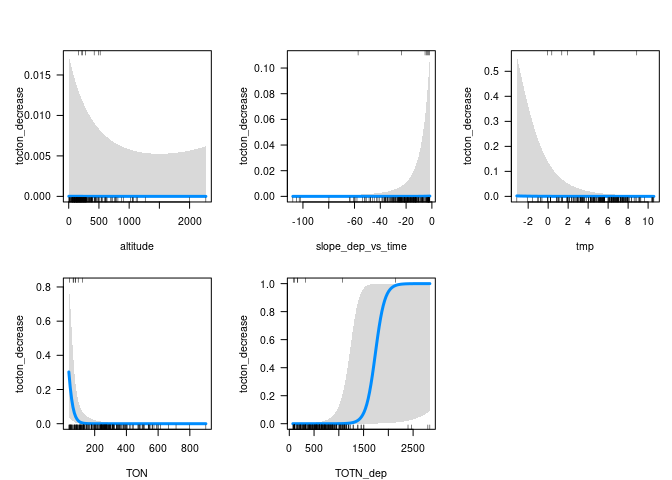<!-- -->


