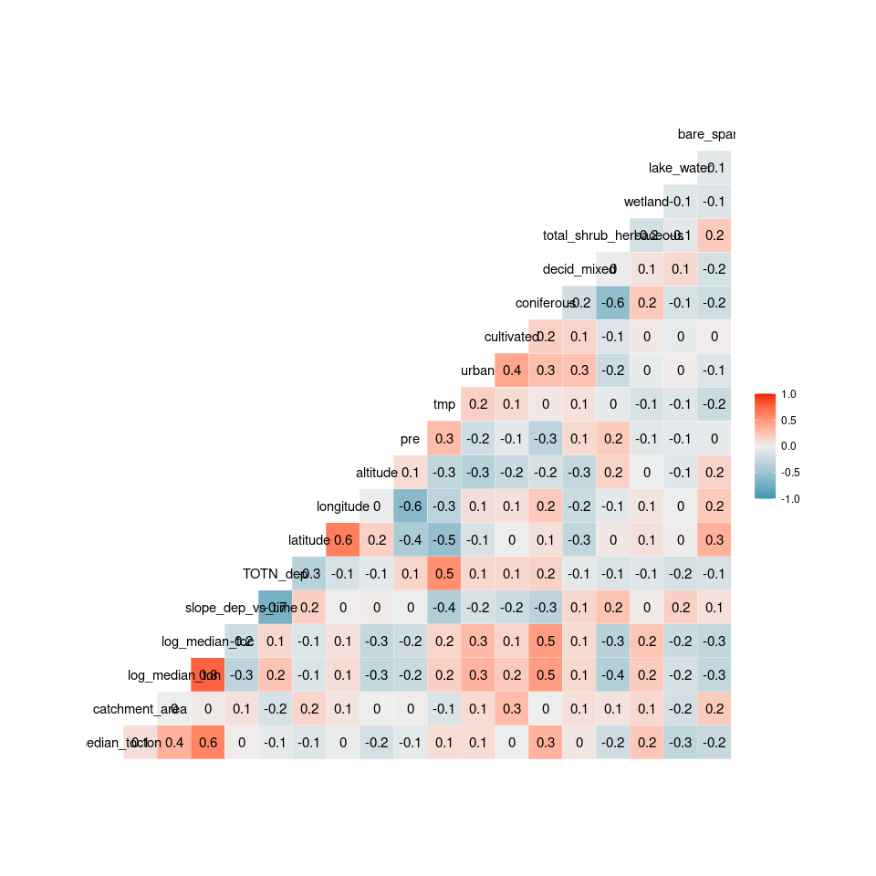
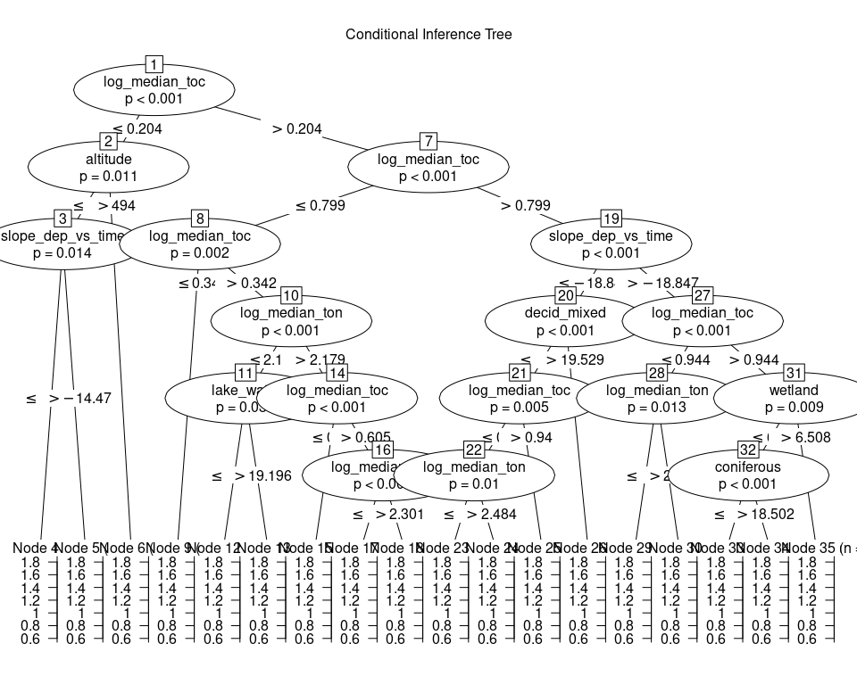
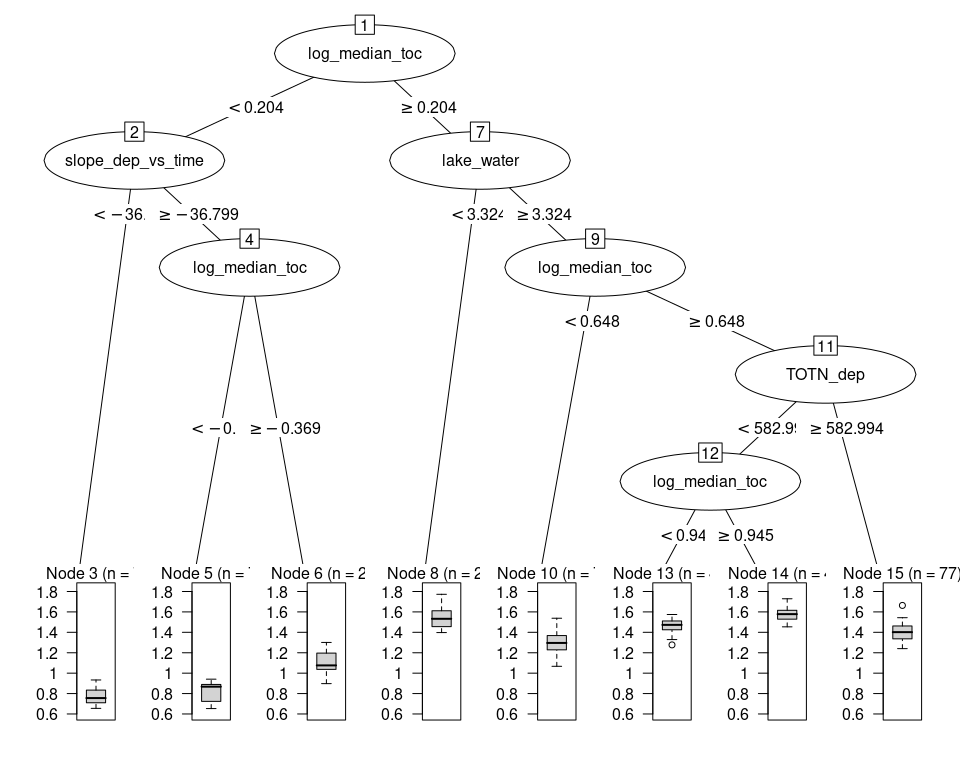
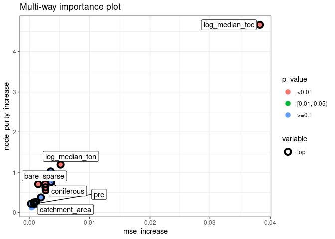
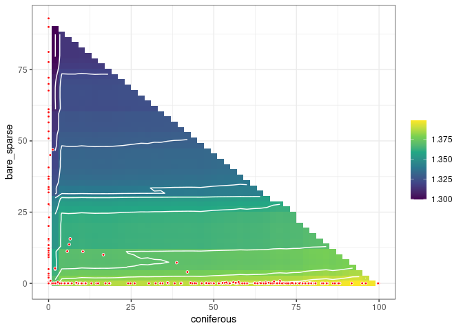
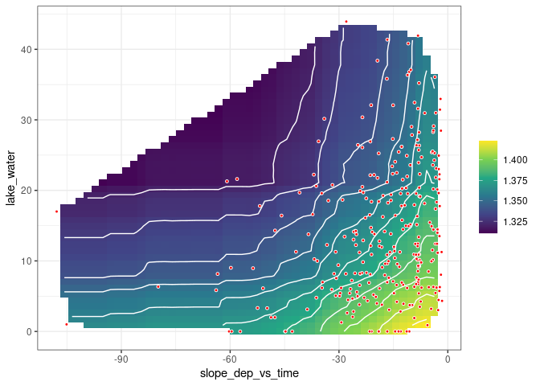
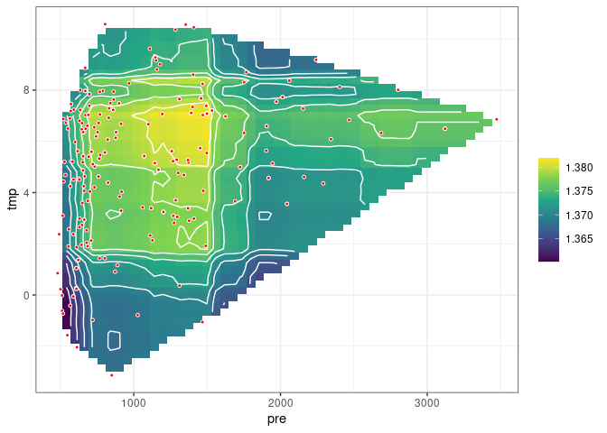
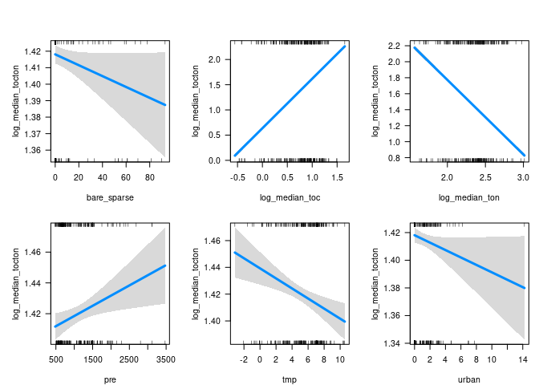

**Analysis of TOC/TON medians (2012-2016)**   

**Dataset: TOC/TON medians data set**   
**Name of dataset: medians_2012-2016_toc_totn_no3.csv**   


* Response variable: 'Current NO3 level' (locations with signif. *increase* are *not* excluded)  
* Data from https://github.com/JamesSample/icpw2/tree/master/thematic_report_2020/results      
* Sen slope of NO3, TOTN, TOC/TON etc. 1992-2016
* Response variable in all analyses are *whether NO3 decreases or not*     
* Predictors:
    - slope_dep_vs_time: Trend in Tot-N deposition 1992-2016    
    - NO3, TOTN_dep: Medians of NO3, TOTN_dep (Tot-N deposition) 1992-2016   
    - catchment_area (if included in data)      
    - TOC: Medians of TOC 1992-2016 (if included in data)     
    - pre, tmp: mean precipitation + temp   
    - Land cover 
  
Technical details: This html file was created was 

## 1. Libraries  

```r
# All of these packages cn be loaded at once using library(tidyverse). (I just like to be specific.)
library(dplyr)
library(tidyr)      # pivot_wider
library(purrr)      # 'map' functions  
library(lubridate)  
library(ggplot2)

# Too many packages, not all are used
library(mapview)
library(visreg)     # visreg
library(rkt)        # Theil -Sen Regression

library(MuMIn)      

# Trees and forests
library(party)                  # ctree
library(evtree)                 # evtree
library(randomForest)
library(randomForestExplainer)  # measure_importance, plot_multi_way_importance
library(pdp)                    # partial, autoplot

library(maps)
my_map <- map_data("world")

library(effects)    # handles lme models  
library(readxl)
library(readr)

source("002_Functions.R")
source("160parm_functions.R")

knitr::opts_chunk$set(results = 'hold') # collect the results from a chunk  
knitr::opts_chunk$set(warning = FALSE)  

options(width = 95)
```


## 2. Data  
* The data part (part 2) is quite similar in scripts 160, 161 and 162 

### Available files

```
## Medians results: 'medians_2012-2016_no3.csv' ,n = 494 
## 
## Number of values per variable: 
## 
## Medians results: 'medians_2012-2016_toc_totn_no3.csv' ,n = 310 
## 
## Number of values per variable:
```

### James' trends and medians     

```r
#
# Median results 2012-2016  
#
folder <- "https://github.com/JamesSample/icpw2/raw/master/thematic_report_2020/results/medians_2012-2016"
file <- params$medians_filename
fn <- paste0(folder, "/", file)
df_medians <- read.csv(fn, encoding = "UTF-8")
cat("Medians results:", sQuote(file), ",n =", nrow(df_medians), "\n\n")  
cat("Number of values per variable: \n")
apply(!is.na(df_medians), 2, sum)
cat("\n")

# Station metadata
# WILL BE ADDED TOGETHER WITH LAND COVER, BELOW
# file_meta <- gsub(".csv", "_stations.csv", file)
# fn <- paste0(folder, "/", file_meta)
# df_metadata <- read.csv(fn, encoding = "UTF-8")
# cat("Regression result metadata:", sQuote(file_meta), ",n =",  
#      nrow(df_metadata), "\n\n")


#
# Regression results 1992-2016
#
folder <- "https://github.com/JamesSample/icpw2/raw/master/thematic_report_2020/results/trends_1992-2016_no3"
file <- "trends_1992-2016_no3_results.csv"
fn <- paste0(folder, "/", file)
df_trends <- read.csv(fn, encoding = "UTF-8")
cat("Trends used as predictor variable:", sQuote(file), ",n =", nrow(df_trends), "\n\n")
```

```
## Medians results: 'medians_2012-2016_toc_totn_no3.csv' ,n = 310 
## 
## Number of values per variable: 
##   station_id NH4.N_µg.l.N NO3.N_µg.l.N   TOC_mg.C.l  TOTN_µg.l.N  TOTP_µg.l.P   TON_µg.l.N 
##          310          225          310          310          310          229          310 
##    TOTN.TOTP     NO3.TOTP      TOC.TON     TOC.TOTP 
##          229          229          310          229 
## 
## Trends used as predictor variable: 'trends_1992-2016_no3_results.csv' ,n = 3176
```

### Start 'dat'  
Using medians    
* Make one line per station   
* Also including some trends for  

```r
# table(reg_no3$variable)

# Medians 2012-2016  
df1 <- df_medians %>%
  select(station_id, `NO3.N_µg.l.N`, `TOTN_µg.l.N`, `TON_µg.l.N`, `TOC_mg.C.l`, TOC.TON) %>%
  rename(median_no3 = `NO3.N_µg.l.N`,
         median_totn = `TOTN_µg.l.N`,
         median_ton = `TON_µg.l.N`,
         median_toc = `TOC_mg.C.l`,
         median_tocton = `TOC.TON`) %>%
  mutate(log_median_no3 = log10(median_no3 + 0.1),
         log_median_totn = log10(median_totn),
         log_median_ton = log10(median_ton),
         log_median_toc = log10(median_toc),
         log_median_tocton = log10(median_tocton))

# Some trends
df2 <- df_trends %>% # table()
  filter(variable %in% c("NO3-N_µg/l N", "TOTN_µg/l N", "TOC_mg C/l")) %>%
  select(station_id, variable, median) %>%
  tidyr::pivot_wider(names_from = "variable", values_from = "median") %>% # str()
  rename(trend_NO3 = `NO3-N_µg/l N`,
         trend_TOTN = `TOTN_µg/l N`,
         trend_TOC = `TOC_mg C/l`)

cat("\n")
cat("df1, n =", nrow(df1), "\n")
cat("df2, n =", nrow(df2), "\n")

dat_1 <- df1 %>%
  left_join(df2, by = "station_id")

cat("dat_1, n =", nrow(dat_1), "\n")
```

```
## 
## df1, n = 310 
## df2, n = 498 
## dat_1, n = 310
```


### Deposition trends and median 1992-2006     

```r
fn <- "https://github.com/JamesSample/icpw2/raw/master/thematic_report_2020/results/deposition/totn_dep_trends_icpw_stns.csv"  

df_deposition <- read.csv(fn) %>% 
  filter(variable == "totn_mgNpm2")  

cat("n =", nrow(df_deposition), "\n")
```

```
## n = 556
```


### Add deposition slope and medians to data  

```r
# debugonce(left_join2)
dat_2 <- dat_1 %>% 
  left_join2(df_deposition %>% 
              select(station_id, median, sen_slp, mk_p_val) %>%
              rename(TOTN_dep = median,
                     slope_dep_vs_time = sen_slp,
                     p_dep_vs_time = mk_p_val),
             by = "station_id",
             print_vars = TRUE)
```

```
## Variables before join: 
## 'station_id', 'median_no3', 'median_totn', 'median_ton', 'median_toc', 'median_tocton', 'log_median_no3', 'log_median_totn', 'log_median_ton', 'log_median_toc', 'log_median_tocton', 'trend_NO3', 'trend_TOC', 'trend_TOTN'
## 
## Variables used to join: 
## 'station_id'
## 
## Variables added: 
## 'TOTN_dep', 'slope_dep_vs_time', 'p_dep_vs_time'
```

### Add medians and station metadata   


```r
# dat_2 <- dat_2 %>%
#   left_join(df_metadata, by = "station_id")

# cat("dat_2, n =", nrow(dat_2), "\n")

# Simplify names by removing units
# names(dat_2)
# names(dat_2) <- sub(".N_µg.l.N", "", names(dat_2))
# names(dat_2) <- sub("_mg.C.l", "", names(dat_2))
# names(dat_2) <- sub("_µg.l.P", "", names(dat_2))

# cat("\nVariable names: \n")
# names(dat_2)
```

### Add climate and deposition medians and slopes  

```r
fn <- "https://github.com/JamesSample/icpw2/raw/master/thematic_report_2020/results/climate/cru_climate_trends_icpw_stns.csv"

df_climate_mean <- read_csv(fn) %>% 
  select(station_id, variable, median) %>%
  pivot_wider(names_from = "variable", values_from = "median")
```

```
## Rows: 1112 Columns: 8
```

```
## ── Column specification ───────────────────────────────────────────────────────────────────────
## Delimiter: ","
## chr (3): variable, mk_trend, sen_trend
## dbl (5): station_id, median, mk_p_val, sen_slp, sen_incpt
```

```
## 
## ℹ Use `spec()` to retrieve the full column specification for this data.
## ℹ Specify the column types or set `show_col_types = FALSE` to quiet this message.
```

```r
cat("\n")
# names(df_climate_mean)

df_climate_slope <- read_csv(fn) %>%
  select(station_id, variable, sen_slp) %>%
  pivot_wider(names_from = "variable", values_from = "sen_slp", names_prefix = "Slope_")
```

```
## Rows: 1112 Columns: 8
```

```
## ── Column specification ───────────────────────────────────────────────────────────────────────
## Delimiter: ","
## chr (3): variable, mk_trend, sen_trend
## dbl (5): station_id, median, mk_p_val, sen_slp, sen_incpt
```

```
## 
## ℹ Use `spec()` to retrieve the full column specification for this data.
## ℹ Specify the column types or set `show_col_types = FALSE` to quiet this message.
```

```r
# Add
dat_3 <- dat_2 %>%
  left_join2(df_climate_mean, by = "station_id", print_vars = TRUE) %>%
  left_join2(df_climate_slope, by = "station_id", print_vars = TRUE)
```

```
## 
## Variables before join: 
## 'station_id', 'median_no3', 'median_totn', 'median_ton', 'median_toc', 'median_tocton', 'log_median_no3', 'log_median_totn', 'log_median_ton', 'log_median_toc', 'log_median_tocton', 'trend_NO3', 'trend_TOC', 'trend_TOTN', 'TOTN_dep', 'slope_dep_vs_time', 'p_dep_vs_time'
## 
## Variables used to join: 
## 'station_id'
## 
## Variables added: 
## 'pre', 'tmp'
## Variables before join: 
## 'station_id', 'median_no3', 'median_totn', 'median_ton', 'median_toc', 'median_tocton', 'log_median_no3', 'log_median_totn', 'log_median_ton', 'log_median_toc', 'log_median_tocton', 'trend_NO3', 'trend_TOC', 'trend_TOTN', 'TOTN_dep', 'slope_dep_vs_time', 'p_dep_vs_time', 'pre', 'tmp'
## 
## Variables used to join: 
## 'station_id'
## 
## Variables added: 
## 'Slope_pre', 'Slope_tmp'
```

### Combine land cover types   
* Data including UK read using script 159   
* Note: also includes metadata (country, etc.)
* bare_sparse = bare_rock + sparsely_vegetated + glacier   
* Select: coniferous, deciduous, lake, mixed_forest, wetland, bare_sparse   


```r
# df_landcover3_OLD <- readRDS("Data/159_df_landcover3.rds")
df_landcover3 <- readRDS("Data/159_df_meta3.rds")

df_landcover3 <- df_landcover3 %>%
  mutate(bare_sparse = bare_rock + sparsely_vegetated + glacier,
         decid_mixed = deciduous + mixed_forest,
         lake_water = lake + water_ex_lake) %>%
  select(-c(bare_rock, sparsely_vegetated, glacier, deciduous, mixed_forest, lake, water_ex_lake))
```


### Add land cover columns to main data    

```r
dat_4 <- left_join2(dat_3, 
                   df_landcover3, 
                   by = "station_id", 
                   print_vars = TRUE
)
```

```
## Variables before join: 
## 'station_id', 'median_no3', 'median_totn', 'median_ton', 'median_toc', 'median_tocton', 'log_median_no3', 'log_median_totn', 'log_median_ton', 'log_median_toc', 'log_median_tocton', 'trend_NO3', 'trend_TOC', 'trend_TOTN', 'TOTN_dep', 'slope_dep_vs_time', 'p_dep_vs_time', 'pre', 'tmp', 'Slope_pre', 'Slope_tmp'
## 
## Variables used to join: 
## 'station_id'
## 
## Variables added: 
## 'station_code', 'station_name', 'latitude', 'longitude', 'altitude', 'continent', 'country', 'region', 'group', 'catchment_area', 'urban', 'cultivated', 'total_forest', 'coniferous', 'total_shrub_herbaceous', 'grasslands', 'heathlands', 'transitional_woodland_shrub', 'wetland', 'other', 'bare_sparse', 'decid_mixed', 'lake_water'
```

### Drop locations with >10% cultivated    

```r
dat_5 <- dat_4 %>%
  filter(cultivated <= 10)

cat(nrow(dat_4) - nrow(dat_5), "stations with > 10% cultivated deleted \n")
```

```
## 8 stations with > 10% cultivated deleted
```


### Data set used  

```r
dat <- dat_5
```


## 3. Plot data      


```r
gg <- ggplot(dat, aes(TOTN_dep, log_median_no3)) + 
  geom_point(aes(color = country)) +
  geom_hline(yintercept = 0, linetype = 2) + 
  geom_vline(xintercept = 0, linetype = 2) 
  
gg
```

<!-- -->


## 4. Select data   

### a. Selection of variables    
* Select variables to use, and thereby also cases  
* Also remove PL05, which has dubious values   

```r
get_data_for_analysis <- function(data, variable_string){
  variable_string <- gsub(" ", "", variable_string)
  variables <- strsplit(variable_string, split = ",")[[1]]
  # Check if all variables are there
  found <- variables %in% names(data)
  if (sum(!found) > 0)
    stop("Not all variables found in data:", 
      paste(variables[!found], collapse = " ,"), 
      "\n")
  # Data for analyses
  # Variables that will be included in excel output (removed afterwards)
  id_vars <- c("station_id", "station_code", "station_name", "country")
  data[c(id_vars, variables)]
}

cat("-------------------------------------------------------------\n")
cat("Variables: \n")
cat(params$selected_vars)
cat("\n-------------------------------------------------------------\n")

sel <- dat$station_code %in% "PL05"
dat <- dat[!sel,]
message(sum(sel), " station removed - station PL05 (has dubious NO3 data)")  
```

```
## 0 station removed - station PL05 (has dubious NO3 data)
```

```r
# debugonce(get_data_for_analysis)
# df_analysis <- get_data_for_analysis(dat, vars)  
df_analysis <- get_data_for_analysis(dat, params$selected_vars)  

# names(dat) %>% paste(collapse = ", ")

cat("Number of missing values per variable: \n")
apply(is.na(df_analysis), 2, sum) 
cat("\n")

# What is missing? (long output)
if (FALSE){
dat %>% 
  split(.$country) %>%
  purrr::map(~apply(is.na(.), 2, mean))
}

cat("Number of complete observations: \n")
complete <- complete.cases(df_analysis)
table(complete)

cat("\n\n")
cat("Number of complete observations by country: \n")
table(dat$country, complete)

# Keep only complete cases
df_analysis <- df_analysis[complete.cases(df_analysis),]

# Save to excel
fn <- paste0(substr(params$document_title, 1, 5), "_data.xlsx")
writexl::write_xlsx(df_analysis, paste0("Data_analysed/", fn))

# Remove variables defined as 'id_vars' in function above
df_analysis <- df_analysis %>%
  select(-station_id, -station_code, -station_name, -country)

cat("\n\n")
cat("Original data: n =", nrow(dat), "\n")
cat("Analysis: n =", nrow(df_analysis), "\n")
```

```
## -------------------------------------------------------------
## Variables: 
## log_median_tocton,catchment_area, log_median_ton, log_median_toc,slope_dep_vs_time, TOTN_dep, latitude, longitude, altitude,pre, tmp, urban, cultivated, coniferous, decid_mixed, total_shrub_herbaceous,wetland, lake_water, bare_sparse
## -------------------------------------------------------------
## Number of missing values per variable: 
##             station_id           station_code           station_name                country 
##                      0                      0                      0                      0 
##      log_median_tocton         catchment_area         log_median_ton         log_median_toc 
##                      0                      0                      0                      0 
##      slope_dep_vs_time               TOTN_dep               latitude              longitude 
##                      0                      0                      0                      0 
##               altitude                    pre                    tmp                  urban 
##                      0                      0                      0                      0 
##             cultivated             coniferous            decid_mixed total_shrub_herbaceous 
##                      0                      3                      3                      0 
##                wetland             lake_water            bare_sparse 
##                      0                      0                      0 
## 
## Number of complete observations: 
## complete
## FALSE  TRUE 
##     3   299 
## 
## 
## Number of complete observations by country: 
##                 complete
##                  FALSE TRUE
##   Canada             3   73
##   Czech Republic     0    2
##   Finland            0   23
##   Germany            0    1
##   Italy              0    4
##   Latvia             0    1
##   Norway             0   82
##   Sweden             0   91
##   United Kingdom     0   22
## 
## 
## Original data: n = 302 
## Analysis: n = 299
```


### b. Correlations   

```r
gg <- GGally::ggcorr(df_analysis, method = c("complete.obs", "kendall"), label = TRUE) # +
gg + theme(plot.margin = unit(c(.8, 2, .8, 2.5), "cm"))
```

<!-- -->

```r
# SHOULD also workaccording to ?element_rect (update ggplot2?)
# gg + theme(plot.margin = margin(.6, .5, .6, 1.7, "cm"))
```


## 5. Tree and forest classification


### Split into training and validation data

```r
set.seed(123)

#
# NOT RELEVANT
#
# x <- runif(nrow(df_analysis))
# train <- ifelse(x < 0.9, TRUE, FALSE)
# 
# train_set <- df_analysis[train,]  %>% 
#   select(-longitude, - latitude) %>%
#   as.data.frame()
# valid_set <- df_analysis[!train,] %>% 
#   select(-longitude, - latitude) %>%
#   as.data.frame()

full_set <- df_analysis  %>% 
  select(-longitude, - latitude) %>%
  as.data.frame()

# plot(full_set)
```


### a. Tree classification using 'party'   

```r
# train_set$X <- 10^train_set$log_median_no3
# (ct = ctree(X ~ ., data = train_set))

(ct = ctree(as.formula(params$tree_formula), 
            data = full_set))

plot(ct, main="Conditional Inference Tree")
```

<!-- -->

```
## 
## Model formula:
## log_median_tocton ~ catchment_area + log_median_ton + log_median_toc + 
##     slope_dep_vs_time + TOTN_dep + altitude + pre + tmp + urban + 
##     cultivated + coniferous + decid_mixed + total_shrub_herbaceous + 
##     wetland + lake_water + bare_sparse
## 
## Fitted party:
## [1] root
## |   [2] log_median_toc <= 0.20412
## |   |   [3] altitude <= 494
## |   |   |   [4] slope_dep_vs_time <= -14.46973: 0.953 (n = 7, err = 0.2)
## |   |   |   [5] slope_dep_vs_time > -14.46973: 1.139 (n = 14, err = 0.2)
## |   |   [6] altitude > 494: 0.870 (n = 16, err = 0.4)
## |   [7] log_median_toc > 0.20412
## |   |   [8] log_median_toc <= 0.79934
## |   |   |   [9] log_median_toc <= 0.34242: 1.248 (n = 19, err = 0.2)
## |   |   |   [10] log_median_toc > 0.34242
## |   |   |   |   [11] log_median_ton <= 2.17898
## |   |   |   |   |   [12] lake_water <= 19.19582: 1.482 (n = 19, err = 0.2)
## |   |   |   |   |   [13] lake_water > 19.19582: 1.329 (n = 7, err = 0.0)
## |   |   |   |   [14] log_median_ton > 2.17898
## |   |   |   |   |   [15] log_median_toc <= 0.60477: 1.253 (n = 25, err = 0.1)
## |   |   |   |   |   [16] log_median_toc > 0.60477
## |   |   |   |   |   |   [17] log_median_ton <= 2.30103: 1.432 (n = 18, err = 0.1)
## |   |   |   |   |   |   [18] log_median_ton > 2.30103: 1.336 (n = 26, err = 0.1)
## |   |   [19] log_median_toc > 0.79934
## |   |   |   [20] slope_dep_vs_time <= -18.8471
## |   |   |   |   [21] decid_mixed <= 19.529
## |   |   |   |   |   [22] log_median_toc <= 0.93952
## |   |   |   |   |   |   [23] log_median_ton <= 2.48412: 1.438 (n = 12, err = 0.0)
## |   |   |   |   |   |   [24] log_median_ton > 2.48412: 1.357 (n = 8, err = 0.0)
## |   |   |   |   |   [25] log_median_toc > 0.93952: 1.497 (n = 43, err = 0.3)
## |   |   |   |   [26] decid_mixed > 19.529: 1.343 (n = 12, err = 0.1)
## |   |   |   [27] slope_dep_vs_time > -18.8471
## |   |   |   |   [28] log_median_toc <= 0.94448
## |   |   |   |   |   [29] log_median_ton <= 2.41747: 1.505 (n = 19, err = 0.0)
## |   |   |   |   |   [30] log_median_ton > 2.41747: 1.419 (n = 7, err = 0.0)
## |   |   |   |   [31] log_median_toc > 0.94448
## |   |   |   |   |   [32] wetland <= 6.50778
## |   |   |   |   |   |   [33] coniferous <= 18.50211: 1.610 (n = 15, err = 0.0)
## |   |   |   |   |   |   [34] coniferous > 18.50211: 1.523 (n = 16, err = 0.0)
## |   |   |   |   |   [35] wetland > 6.50778: 1.628 (n = 16, err = 0.1)
## 
## Number of inner nodes:    17
## Number of terminal nodes: 18
```

### b. Evtree (Evolutionary Learning)   

```r
ev.raw = evtree(as.formula(params$tree_formula), 
                data = full_set)

plot(ev.raw)
```

<!-- -->


### c. Random forest  
* Model called 'model1'

```r
model1 <- randomForest(as.formula(params$tree_formula), 
                       data = full_set, 
                       mtry = 5,
                       importance = TRUE)

model1
```

```
## 
## Call:
##  randomForest(formula = as.formula(params$tree_formula), data = full_set,      mtry = 5, importance = TRUE) 
##                Type of random forest: regression
##                      Number of trees: 500
## No. of variables tried at each split: 5
## 
##           Mean of squared residuals: 0.007352986
##                     % Var explained: 81.98
```


#### c1. Predict on training data
Not relevant here  

#### c2. Importance of variables   
* Classification forests result in   
    - mean_min_depth   
    - accuracy_decrease  
    - gini_decrease  
    - no_of_nodes   
    - times_a_root      
* Regression forests result in     
    - mean_min_depth   
    - mse_increase  
    - node_purity_increase  
    - no_of_nodes   
    - times_a_root      

```r
# Calculation
importance <- measure_importance(model1)
```


```r
plot_multi_way_importance(importance, size_measure = "no_of_nodes", no_of_labels = 12)  
```

<!-- -->

```r
plot_multi_way_importance(importance, x_measure = "mse_increase", y_measure = "node_purity_increase",
                          size_measure = "p_value", no_of_labels = 12)
```

<!-- -->


#### c3. Random forest, show partial effects  


```r
# Which variables to include:
variables_for_plot <- importance %>%
  mutate(variable = levels(variable)[as.numeric(variable)]) %>%
  arrange(desc(mse_increase)) %>%    # gini_decrease for classification trees
  pull(variable) %>%
  head(12)   # pick the first 12 variables (or less)

# Calculation

plotdata <- NULL  # will be list for storing results

max_number_of_plots <- length(variables_for_plot)/2 %>% floor()

for (i in 1:max_number_of_plots){
  varno1 <- c(1,3,5,7,9,11)[i]
  varno2 <- varno1 + 1
  plotdata[[i]] <- model1 %>%
    partial(pred.var = variables_for_plot[c(varno1, varno2)], chull = TRUE, progress = "text",
            which.class = "1", prob = TRUE)
}
```


```r
### Extra plots

plotpairs <- params$extra_pairwise_plots %>%
  gsub(" ", "", ., fixed = TRUE) %>%
  strsplit(split = ";") %>%
  .[[1]] %>%
  purrr::map(~strsplit(., split = ",")[[1]])

for (plotvar in plotpairs){
  # print(plotvar)
  if (plotvar[1] %in% names(full_set) & plotvar[2] %in% names(full_set)){
    i <- i + 1
    plotdata[[i]] <- model1 %>%
      partial(pred.var = c(plotvar[1], plotvar[2]), chull = TRUE, progress = "text",
             which.class = "1", prob = TRUE)
  }
}
```


```r
# Find range of predicted values for each graph
ranges <- plotdata %>% purrr::map_dfc(~range(.$yhat))
```

```
## New names:
## * NA -> ...1
## * NA -> ...2
## * NA -> ...3
## * NA -> ...4
## * NA -> ...5
## * ...
```

```r
# use range of all the ranges
for (i in 1:length(plotdata)){
  
  if (params$pairwise_plots_same_scale == "TRUE"){
  
    gg <- plot_pair_number(i, zrange = range(ranges))
    print(gg)
    
  } else {
    
    gg <- plot_pair_number(i)
    print(gg)

  }
  
}
```

<!-- --><!-- --><!-- --><!-- --><!-- --><!-- --><!-- --><!-- -->


## 6. Linear regression      

```r
fm <- lm(
  as.formula(params$logistic_formula),
  data = df_analysis, 
  na.action = "na.fail")

dredged_models <- dredge(fm)                       # only once
```

```
## Fixed term is "(Intercept)"
```

```r
# saveRDS(dredged_models, "Data/162_all_dredged_models.rds")    # save it as it takes a couple of minutes
# dredged_models <- readRDS("Data/162_all_dredged_models.rds")

# cat("\n\nR2: \n")
# mod1 <- get.models(dredged_models, 1)[[1]]  
# summary(mod1)  
```

### Best models  

```r
# subset(dredged_models, delta < 1)

subset(dredged_models, delta < 2)

# Alternative way of showing result (didn't become any better)
# df <- subset(dredged_models, delta < 2)
# select(as.data.frame(df) %>% round(6), -`(Intercept)`, -logLik, -AICc)
```

```
## Global model call: lm(formula = as.formula(params$logistic_formula), data = df_analysis, 
##     na.action = "na.fail")
## ---
## Model selection table 
##      (Int)        alt    bar_spr  ctc_are       cnf    dcd_mxd log_mdn_toc log_mdn_ton
## 1987 2.865            -0.0003299                                    0.9820     -0.9327
## 4033 2.823                                                          1.0470     -0.9156
## 1986 2.864 -1.479e-05                                               0.9850     -0.9319
## 2003 2.864            -0.0003726                    -8.908e-05      0.9818     -0.9319
## 4034 2.827 -1.176e-05                                               1.0330     -0.9141
## 963  2.875            -0.0003129                                    0.9860     -0.9392
## 1985 2.868                                                          0.9924     -0.9382
## 1988 2.863 -8.808e-06 -0.0002622                                    0.9797     -0.9301
## 4035 2.841            -0.0002321                                    1.0150     -0.9219
## 3009 2.833                                                          1.0500     -0.9216
## 1995 2.865            -0.0003371          5.297e-05                 0.9805     -0.9335
## 979  2.872            -0.0003730                    -1.204e-04      0.9852     -0.9372
## 1991 2.863            -0.0003329 7.44e-06                           0.9814     -0.9320
## 4049 2.817                                          -8.016e-05      1.0540     -0.9129
##            pre       tmp       urb log_mdn_toc:log_mdn_ton df  logLik    AICc delta weight
## 1987 1.323e-05 -0.003760 -0.002683                          8 569.747 -1123.0  0.00  0.135
## 4033 1.157e-05 -0.003442 -0.002554                -0.02628  8 569.469 -1122.4  0.56  0.102
## 1986 1.286e-05 -0.003739 -0.002999                          8 569.175 -1121.9  1.14  0.076
## 2003 1.500e-05 -0.003899 -0.002396                          9 570.205 -1121.8  1.21  0.074
## 4034 1.244e-05 -0.003690 -0.002915                -0.02221  9 570.193 -1121.8  1.23  0.073
## 963  1.507e-05 -0.004298                                    7 567.998 -1121.6  1.39  0.067
## 1985 1.181e-05 -0.003423 -0.002543                          7 567.983 -1121.6  1.42  0.066
## 1988 1.356e-05 -0.003879 -0.002926                          9 570.099 -1121.6  1.42  0.066
## 4035 1.267e-05 -0.003670 -0.002647                -0.01448  9 570.046 -1121.5  1.53  0.063
## 3009 1.340e-05 -0.003972                          -0.02616  7 567.881 -1121.4  1.62  0.060
## 1995 1.456e-05 -0.003827 -0.002628                          9 569.936 -1121.2  1.75  0.056
## 979  1.720e-05 -0.004408                                    8 568.862 -1121.2  1.77  0.056
## 1991 1.327e-05 -0.003730 -0.002759                          9 569.913 -1121.2  1.79  0.055
## 4049 1.297e-05 -0.003530 -0.002282                -0.02927  9 569.844 -1121.1  1.93  0.051
## Models ranked by AICc(x)
```


### Plots  

```r
# Pick model with lowest AICc
mod1 <- get.models(dredged_models, 1)[[1]]  

modelvars <- get_model_variables(mod1)

# Interactions: 2D plot 
if (length(modelvars$interaction_list) > 0){
  modelvars$interaction_list %>% purrr::walk(
    ~visreg(mod1, .x[1], by = .x[2], scale = "response")
  )
}

# Additive effects: 1D plot
if (length(modelvars$additive_vars) > 0){
  par(mfrow = c(2,3), mar = c(4,5,2,1), oma = c(0,0,2,0))
  for (var in modelvars$additive_vars)
    visreg(mod1, var, scale = "response")  
}
```

<!-- -->


