**Analysis of NO3 decrease (categorical, "decrease or not"), based on James' trend results**  
  
**Dataset: all variables except altitude and catchment area (but including TOC)**   

* Response variable: 'Significant /NO3 decline' (locations with signif. *increase* are *not* excluded)  
* Data from https://github.com/JamesSample/icpw2/tree/master/thematic_report_2020/results      
* Sen slope of NO3, TOTN, TOC/TON etc. 1992-2016
* Response variable in all analyses are *whether NO3 decreases or not*     
* Predictors:
    - slope_dep_vs_time: Trend in Tot-N deposition 1992-2016    
    - NO3, TOTN_dep: Medians of NO3, TOTN_dep (Tot-N deposition) 1992-2016   
    - catchment_area (if included in data)      
    - TOC: Medians of TOC       
    - pre, tmp: mean precipitation + temp   
    - Land cover 
  
Technical details: This html file was rendered with `160parm_run_markdown.R` which runs the script `160parm_Time_series_results_James.Rmd` with different inputs, resulting in html files 160a, 160b and 160c.    

## 1. Libraries  

```r
# All of these packages cn be loaded at once using library(tidyverse). (I just like to be specific.)
library(dplyr)
library(tidyr)      # pivot_wider
library(purrr)      # 'map' functions  
library(lubridate)  
library(ggplot2)

# Too many packages, not all are used
library(mapview)
library(visreg)     # visreg
library(rkt)        # Theil -Sen Regression

library(MuMIn)      

# Trees and forests
library(party)                  # ctree
library(evtree)                 # evtree
library(randomForest)
library(randomForestExplainer)  # measure_importance, plot_multi_way_importance
library(pdp)                    # partial, autoplot

library(maps)
my_map <- map_data("world")

library(effects)    # handles lme models  
library(readxl)
library(readr)

knitr::opts_chunk$set(results = 'hold') # collect the results from a chunk  
knitr::opts_chunk$set(warning = FALSE)  

options(width = 95)
```


## 2. Data

### James' trends and medians     

```r
#
# Regression results
#
folder <- "https://github.com/JamesSample/icpw2/raw/master/thematic_report_2020/results/trends_1992-2016_no3"
file <- "trends_1992-2016_no3_results.csv"
fn <- paste0(folder, "/", file)

reg_no3 <- read.csv(fn, encoding = "UTF-8")
cat("Regression results:", sQuote(file), ",n =", nrow(reg_no3), "\n\n")

# Station metadata

# THESE WILL BE ADDED TOGETHER WITH LAND COVER  

# file <- "trends_1992-2016_no3_stations.csv"
# fn <- paste0(folder, "/", file)
# 
# df_metadata <- read.csv(fn, encoding = "UTF-8")
# cat("Regression result metadata:", sQuote(file), ",n =", nrow(df_metadata), "\n\n")
# 
# cat("Countries with trends: \n")
# xtabs(~country, df_metadata)  

#
# Medians NO3
#

if (FALSE){

  # OLD: 2012-2016 medians NO3  

  cat("--------------------------------------------------------------------------\n")
  folder <- "https://github.com/JamesSample/icpw2/raw/master/thematic_report_2020/results/medians_2012-2016"
  file <- "medians_2012-2016_no3.csv"
  fn <- paste0(folder, "/", file)
  # data:
  medians_no3 <- read.csv(fn, encoding = "UTF-8")
  cat("Medians NO3:", sQuote(file), ",n =", nrow(medians_no3), "\n\n")
  file <- "medians_2012-2016_no3_stations.csv"
  fn <- paste0(folder, "/", file)
  # metadata:
  medians_no3_st <- read.csv(fn, encoding = "UTF-8")
  cat("Median metadata (not used):", sQuote(file), "n =", nrow(medians_no3_st), "\n\n")
  # stats:
  cat("Countries with medians: \n")
  xtabs(~country, medians_no3_st)  
  
  #
  #  OLD: 2012-2016 Medians TOC
  #
  cat("--------------------------------------------------------------------------\n")
  
  file <- "medians_2012-2016_toc_totn_no3_nh4.csv"
  fn <- paste0(folder, "/", file)
  
  medians_toc <- read.csv(fn, encoding = "UTF-8")
  cat("Medians TOC:", sQuote(file), ",n =", nrow(medians_toc), "\n\n")
  
  cat("Countries with medians: \n")
  xtabs(~country, medians_no3_st)  
  
}
```

```
## Regression results: 'trends_1992-2016_no3_results.csv' ,n = 3176
```
### Start 'dat'  
With slope regression data  
* Make one line per station  

```r
# table(reg_no3$variable)

# Slope 
df1 <- reg_no3 %>%
  filter(variable %in% c("NO3-N_µg/l N", "TOC/TON")) %>%
  select(station_id, variable, sen_slp) %>%
  tidyr::pivot_wider(names_from = "variable", values_from = "sen_slp") %>%
  rename(slope_no3_vs_time = `NO3-N_µg/l N`, 
         slope_tocton_vs_time = `TOC/TON`)
  
# Slope p-value
df2 <- reg_no3 %>%
  filter(variable %in% c("NO3-N_µg/l N", "TOC/TON")) %>%
  select(station_id, variable, mk_p_val) %>%
  tidyr::pivot_wider(names_from = "variable", values_from = "mk_p_val") %>%
  rename(p_no3_vs_time = `NO3-N_µg/l N`, 
         p_tocton_vs_time = `TOC/TON`)

# Medians
df3 <- reg_no3 %>%
  filter(variable %in% c("NO3-N_µg/l N", "TOC_mg C/l")) %>%
  select(station_id, variable, median) %>%
  tidyr::pivot_wider(names_from = "variable", values_from = "median") %>%
  rename(NO3 = `NO3-N_µg/l N`, 
         TOC = `TOC_mg C/l`)

cat("\n")
cat("df1, n =", nrow(df1), "\n")
cat("df2, n =", nrow(df2), "\n")
cat("df3, n =", nrow(df3), "\n")

dat <- df1 %>%
  full_join(df2, by = "station_id") %>%
  full_join(df3, by = "station_id")

cat("dat, n =", nrow(dat), "\n")
```

```
## 
## df1, n = 498 
## df2, n = 498 
## df3, n = 498 
## dat, n = 498
```


```r
# dat
# 
# str <- "slope_no3_vs_time ~ p_no3_vs_time"
# plot(as.formula(str), data = dat)
# lm(as.formula(str), data = dat)
```

### Deposition trends and median 1992-2006     

```r
fn <- "https://github.com/JamesSample/icpw2/raw/master/thematic_report_2020/results/deposition/totn_dep_trends_icpw_stns.csv"  

df_deposition <- read.csv(fn) %>% 
  filter(variable == "totn_mgNpm2")  

cat("n =", nrow(df_deposition), "\n")
```

```
## n = 556
```

### Add deposition slope and medians to data  

```r
cat("dat, n =", nrow(dat), "\n")

dat <- dat %>% 
  left_join(df_deposition %>% 
              select(station_id, median, sen_slp, mk_p_val) %>%
              rename(TOTN_dep = median,
                     slope_dep_vs_time = sen_slp,
                     p_dep_vs_time = mk_p_val),
                 by = "station_id")

cat("dat, n =", nrow(dat), "\n")

# names(dat)
```

```
## dat, n = 498 
## dat, n = 498
```
### Add medians and station metadata   

```r
# dat <- dat %>%
#   left_join(df_metadata, by = "station_id")

cat("dat, n =", nrow(dat), "\n")

# Simplify names by removing units
# names(dat)
# names(dat) <- sub(".N_µg.l.N", "", names(dat))
# names(dat) <- sub("_mg.C.l", "", names(dat))
# names(dat) <- sub("_µg.l.P", "", names(dat))

cat("\nVariable names: \n")
names(dat)
```

```
## dat, n = 498 
## 
## Variable names: 
##  [1] "station_id"           "slope_no3_vs_time"    "slope_tocton_vs_time"
##  [4] "p_no3_vs_time"        "p_tocton_vs_time"     "NO3"                 
##  [7] "TOC"                  "TOTN_dep"             "slope_dep_vs_time"   
## [10] "p_dep_vs_time"
```

### Add climate and deposition medians 

```r
fn <- "https://github.com/JamesSample/icpw2/raw/master/thematic_report_2020/results/climate/cru_climate_trends_icpw_stns.csv"
df_climate_mean <- read_csv(fn) %>%
  select(station_id, variable, median) %>%
  pivot_wider(names_from = "variable", values_from = "median")
```

```
## Parsed with column specification:
## cols(
##   station_id = col_double(),
##   variable = col_character(),
##   median = col_double(),
##   mk_p_val = col_double(),
##   mk_trend = col_character(),
##   sen_slp = col_double(),
##   sen_incpt = col_double(),
##   sen_trend = col_character()
## )
```

```r
# names(df_climate_mean)

# Add
dat <- dat %>%
  left_join(df_climate_mean, by = "station_id")

cat("dat, n =", nrow(dat), "\n")
```

```
## dat, n = 498
```


### Combine land cover types   
* Data including UK read using script 159   
* Note: also includes metadata (country, etc.)
* bare_sparse = bare_rock + sparsely_vegetated + glacier   
* Select: coniferous, deciduous, lake, mixed_forest, wetland, bare_sparse   

```r
df_landcover3 <- readRDS("Data/159_df_landcover3.rds")

df_landcover3 <- df_landcover3 %>%
  mutate(bare_sparse = bare_rock + sparsely_vegetated + glacier,
         decid_mixed = deciduous + mixed_forest,
         lake_water = lake + water_ex_lake) %>%
  select(-c(bare_rock, sparsely_vegetated, glacier, deciduous, mixed_forest, lake, water_ex_lake))
```


### Add land cover columns to main data    

```r
dat <- left_join(dat, 
                 df_landcover3, 
                 by = "station_id"
)

cat("dat, n =", nrow(dat), "\n")
```

```
## dat, n = 498
```


## 3. Plot slopes    


```r
ggplot(dat, aes(slope_dep_vs_time, slope_no3_vs_time)) + 
  geom_point(data = dat %>% filter(p_no3_vs_time < 0.05), size = rel(2)) +
  geom_point(aes(color = country)) +
  geom_hline(yintercept = 0, linetype = 2) + 
  geom_vline(xintercept = 0, linetype = 2) 
```

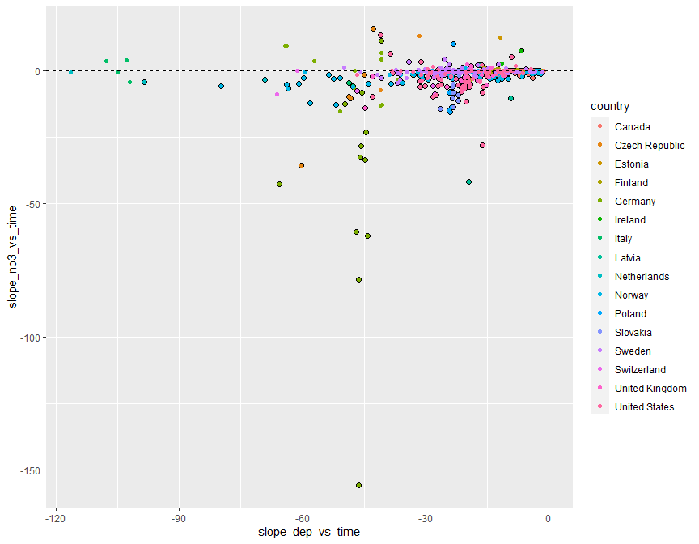<!-- -->

```r
ggplot(dat, aes(slope_dep_vs_time, slope_no3_vs_time,
                color = (p_no3_vs_time < 0.05))) + 
  geom_point() +
  facet_wrap(vars(country)) +
  geom_hline(yintercept = 0, linetype = 2) + 
  geom_vline(xintercept = 0, linetype = 2) + 
  labs(title = "A selection of countries")
```

<!-- -->

```r
dat %>%
  filter(!country %in% c("Latvia","Ireland","Italy","Netherlands")) %>%
  ggplot(aes(slope_dep_vs_time, slope_no3_vs_time,
             color = (p_no3_vs_time < 0.05))) + 
  geom_point() +
  facet_wrap(vars(country)) +
  geom_hline(yintercept = 0, linetype = 2) + 
  geom_vline(xintercept = 0, linetype = 2) + 
  labs(title = "A selection of countries") + 
  ylim(-50, 25)
```

<!-- -->


## 4. Select data   

### a. Selection of variables  
* Select variables to use, and thereby also cases  

```r
get_df_no3_decline <- function(data, variable_string){
  variable_string <- gsub(" ", "", variable_string)
  variables <- strsplit(variable_string, split = ",")[[1]]
  # Data for analyses
  df <- data %>%
    mutate(
      no3_decline = case_when(
        slope_no3_vs_time < 0 & p_no3_vs_time <= 0.05 ~ 1,
        TRUE ~ 0)
    )
  df[variables]
}

cat("-------------------------------------------------------------\n")
cat("Variables: \n")
cat(params$selected_vars)
cat("\n-------------------------------------------------------------\n")

df_analysis <- get_df_no3_decline(dat, params$selected_vars)  

# names(dat) %>% paste(collapse = ", ")

cat("Number of missing values per variable: \n")
apply(is.na(df_analysis), 2, sum) 
cat("\n")

# What is missing? (long output)
if (FALSE){
dat %>% 
  split(.$country) %>%
  purrr::map(~apply(is.na(.), 2, mean))
}

cat("Number of complete observations: \n")
complete <- complete.cases(df_analysis)
table(complete)

cat("\n\n")
cat("Number of complete observations by country: \n")
table(dat$country, complete)

# Keep only complete cases
df_analysis <- df_analysis[complete.cases(df_analysis),]

cat("\n\n")
cat("Original data: n =", nrow(dat), "\n")
cat("Analysis: n =", nrow(df_analysis), "\n")
```

```
## -------------------------------------------------------------
## Variables: 
## no3_decline,TOC,slope_dep_vs_time, NO3, TOTN_dep, latitude, longitude,pre, tmp, urban, cultivated, coniferous, decid_mixed, total_shrub_herbaceous,wetland, lake_water, bare_sparse
## -------------------------------------------------------------
## Number of missing values per variable: 
##            no3_decline                    TOC      slope_dep_vs_time                    NO3 
##                      0                     33                      0                      0 
##               TOTN_dep               latitude              longitude                    pre 
##                      0                      0                      0                      0 
##                    tmp                  urban             cultivated             coniferous 
##                      0                     16                     16                     22 
##            decid_mixed total_shrub_herbaceous                wetland             lake_water 
##                     22                     16                     16                     16 
##            bare_sparse 
##                     16 
## 
## Number of complete observations: 
## complete
## FALSE  TRUE 
##    48   450 
## 
## 
## Number of complete observations by country: 
##                 complete
##                  FALSE TRUE
##   Canada             0  114
##   Czech Republic     1    7
##   Estonia            1    0
##   Finland            0   26
##   Germany            5   18
##   Ireland            3    0
##   Italy              6    0
##   Latvia             3    0
##   Netherlands        1    2
##   Norway             0   83
##   Poland             0    6
##   Slovakia           0   12
##   Sweden             6   86
##   Switzerland        6    0
##   United Kingdom     0   21
##   United States     16   75
## 
## 
## Original data: n = 498 
## Analysis: n = 450
```


### b. Correlations   

```r
gg <- GGally::ggcorr(
  df_analysis, 
  method = c("complete.obs", "kendall"), 
  label = TRUE,
  hjust = 0.9, angle = -30) # +                    # slanted labels
gg + coord_cartesian(x = c(-2, 20), y = c(-2,22))  # fix margins
```

```
## Coordinate system already present. Adding new coordinate system, which will replace the existing one.
```

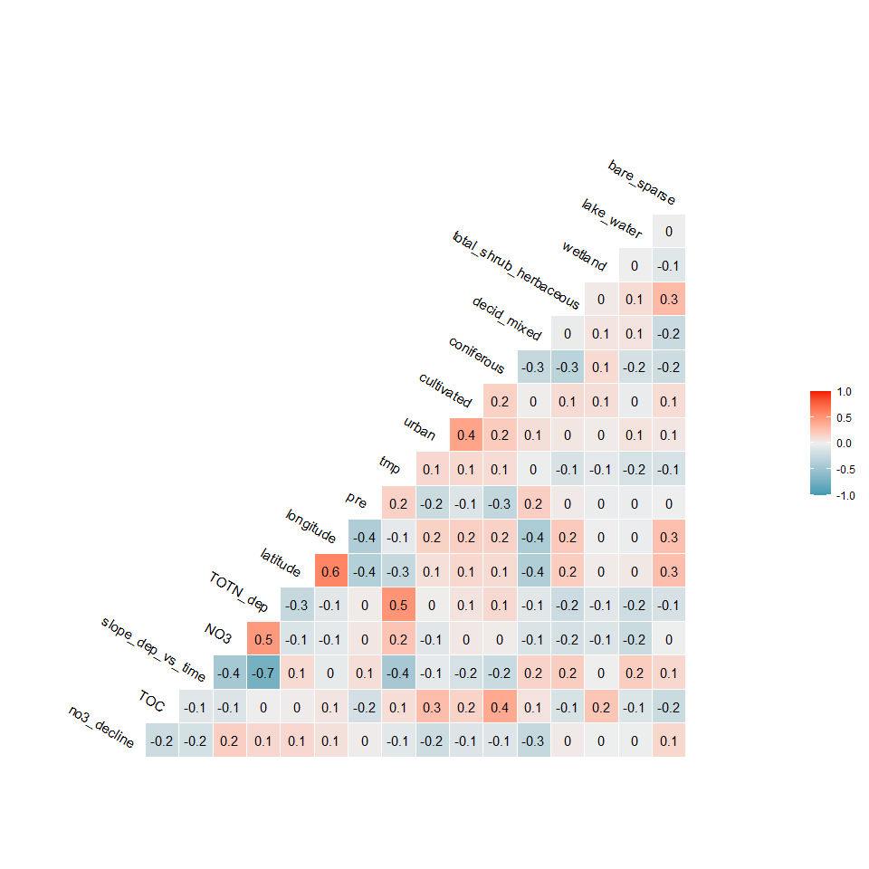<!-- -->


## 5. Tree and forest classification


### Split into training and validation data

```r
set.seed(123)

x <- runif(nrow(df_analysis))
train <- ifelse(x < 0.9, TRUE, FALSE)

train_set <- df_analysis[train,]  %>% 
  mutate(no3_decline_f = factor(no3_decline)) %>% select(-no3_decline, -longitude, - latitude) %>%
  as.data.frame()
valid_set <- df_analysis[!train,] %>% 
  mutate(no3_decline_f = factor(no3_decline)) %>% select(-no3_decline, -longitude, - latitude) %>%
  as.data.frame()
```


### a. Tree classification using 'party'   

```r
(ct = ctree(no3_decline_f ~ ., data = train_set))

plot(ct, main="Conditional Inference Tree")
```

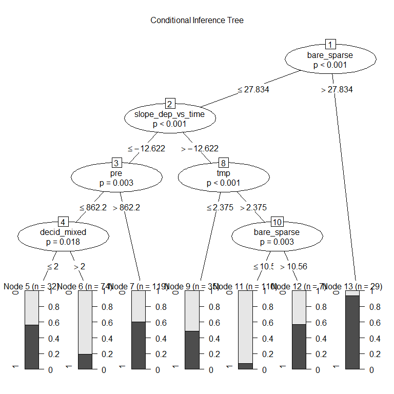<!-- -->

```r
cat("\n\n")
cat("Table of prediction errors \n")
table(predict(ct), train_set$no3_decline_f)
cat("\n\n")

cat("Classification of training set \n")
tr.pred = predict(ct, newdata = valid_set, type="prob")
colnames(tr.pred) <- c("P0", "P1")
# tr.pred <- tr.pred %>% map_dfr(~data.frame(P0 = .[1], P1 = .[2]))
table(tr.pred[,"P1"] > 0.5, valid_set$no3_decline_f)
```

```
## 
## Model formula:
## no3_decline_f ~ TOC + slope_dep_vs_time + NO3 + TOTN_dep + pre + 
##     tmp + urban + cultivated + coniferous + decid_mixed + total_shrub_herbaceous + 
##     wetland + lake_water + bare_sparse
## 
## Fitted party:
## [1] root
## |   [2] bare_sparse <= 27.834
## |   |   [3] slope_dep_vs_time <= -12.62167
## |   |   |   [4] pre <= 862.19995
## |   |   |   |   [5] decid_mixed <= 2: 1 (n = 32, err = 43.8%)
## |   |   |   |   [6] decid_mixed > 2: 0 (n = 74, err = 18.9%)
## |   |   |   [7] pre > 862.19995: 1 (n = 119, err = 39.5%)
## |   |   [8] slope_dep_vs_time > -12.62167
## |   |   |   [9] tmp <= 2.375: 0 (n = 35, err = 48.6%)
## |   |   |   [10] tmp > 2.375
## |   |   |   |   [11] bare_sparse <= 10.56: 0 (n = 110, err = 7.3%)
## |   |   |   |   [12] bare_sparse > 10.56: 1 (n = 7, err = 42.9%)
## |   [13] bare_sparse > 27.834: 1 (n = 29, err = 6.9%)
## 
## Number of inner nodes:    6
## Number of terminal nodes: 7
## 
## 
## Table of prediction errors 
##    
##       0   1
##   0 180  39
##   1  66 121
## 
## 
## Classification of training set 
##        
##          0  1
##   FALSE 14  7
##   TRUE   9 14
```

### b. Evtree (Evolutionary Learning)   

```r
ev.raw = evtree(no3_decline_f ~ ., data = train_set)

plot(ev.raw)
```

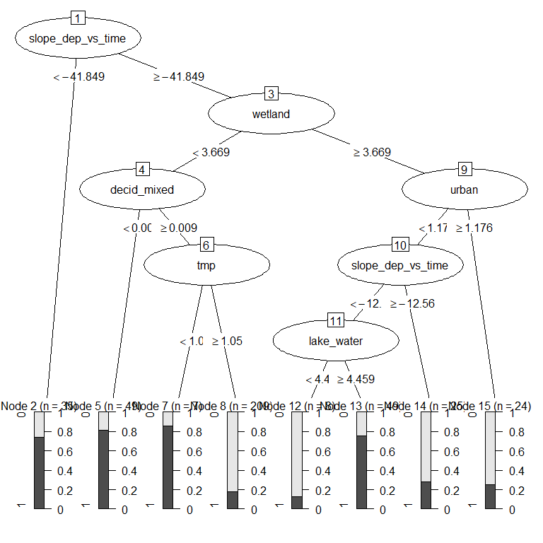<!-- -->

```r
cat("Predicted in training data: \n")
table(predict(ev.raw), train_set$no3_decline_f)

cat("\n\nPrediction errors in training data: \n")
1-mean(predict(ev.raw) == train_set$no3_decline_f)
```

```
## Predicted in training data: 
##    
##       0   1
##   0 215  51
##   1  31 109
## 
## 
## Prediction errors in training data: 
## [1] 0.2019704
```


### c. Random forest  
* *For results/interpretation, see separate document '160_randomforest_James_data.html'*  
* Model called 'model1'

```r
model1 <- randomForest(no3_decline_f ~ ., 
                       data = train_set, 
                       mtry = 5,
                       importance = TRUE)

model1
```

```
## 
## Call:
##  randomForest(formula = no3_decline_f ~ ., data = train_set, mtry = 5,      importance = TRUE) 
##                Type of random forest: classification
##                      Number of trees: 500
## No. of variables tried at each split: 5
## 
##         OOB estimate of  error rate: 23.89%
## Confusion matrix:
##     0   1 class.error
## 0 198  48    0.195122
## 1  49 111    0.306250
```


#### c1. Predict on training data

```r
# Predicting on train set
pred_valid <- predict(model1, valid_set, type = "class")
# Checking classification accuracy
table(pred_valid, valid_set$no3_decline_f)  
```

```
##           
## pred_valid  0  1
##          0 20  6
##          1  3 15
```

#### c2. Importance of variables

```r
# Calculation
importance <- measure_importance(model1)
```


```r
plot_multi_way_importance(importance, size_measure = "no_of_nodes", no_of_labels = 12)  
```

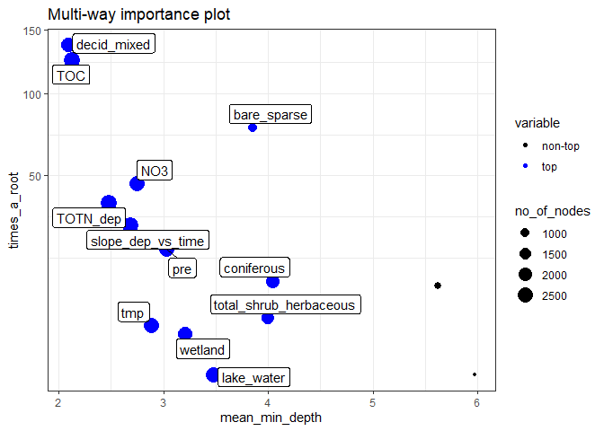<!-- -->

```r
plot_multi_way_importance(importance, x_measure = "accuracy_decrease", y_measure = "gini_decrease", 
                          size_measure = "p_value", no_of_labels = 12)
```

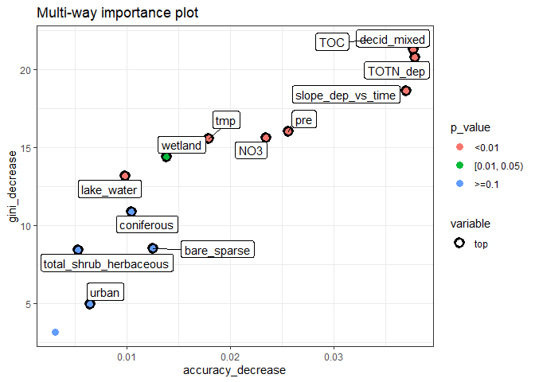<!-- -->


#### c3. Random forest, show partial effects  


```r
# Which variables to include:
variables_for_plot <- importance %>%
  mutate(variable = levels(variable)[as.numeric(variable)]) %>%
  arrange(desc(gini_decrease)) %>%
  pull(variable) %>%
  head(12)   # pick the first 12 variables (or less)

# Calculation

plotdata <- NULL  # will be list for storing results

max_number_of_plots <- length(variables_for_plot)/2 %>% floor()

for (i in 1:max_number_of_plots){
  varno1 <- c(1,3,5,7,9,11)[i]
  varno2 <- varno1 + 1
  plotdata[[i]] <- model1 %>%
    partial(pred.var = variables_for_plot[c(varno1, varno2)], chull = TRUE, progress = "text",
            which.class = "1", prob = TRUE)
}
```


```r
### Extra plots

i <- max_number_of_plots

plotpairs <- params$extra_pairwise_plots %>%
  gsub(" ", "", ., fixed = TRUE) %>%
  strsplit(x, split = ";") %>%
  .[[1]] %>%
  purrr::map(~strsplit(., split = ",")[[1]])

for (plotvar in plotpairs){
  # print(plotvar)
  if (plotvar[1] %in% names(train_set) & plotvar[2] %in% names(train_set)){
    i <- i + 1
    plotdata[[i]] <- model1 %>%
      partial(pred.var = c(plotvar[1], plotvar[2]), chull = TRUE, progress = "text",
             which.class = "1", prob = TRUE)
  }
}
```


```r
# params$pairwise_plots_same_scale

if (params$pairwise_plots_same_scale == "TRUE"){

  # Put on same color scale
  
  # Find range of predicted values for each graph
  ranges <- plotdata %>% purrr::map_dfc(~range(.$yhat))
  
  # use range of all the ranges
  for (i in 1:length(plotdata)){
    gg <- autoplot(plotdata[[i]], contour = TRUE, legend.title = "Probability\nNO3 decline") +
      scale_fill_viridis_c(limits = range(ranges))
    print(gg) 
  }
  
} else {

  # Plot the plots 
  for (i in 1:length(plotdata)){
    gg <- autoplot(plotdata[[i]], contour = TRUE, legend.title = "Probability\nNO3 decline")
    print(gg)
  }
  
}
```

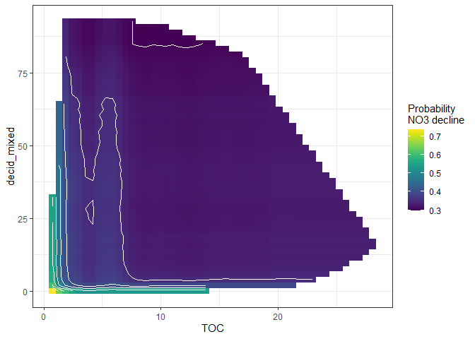<!-- -->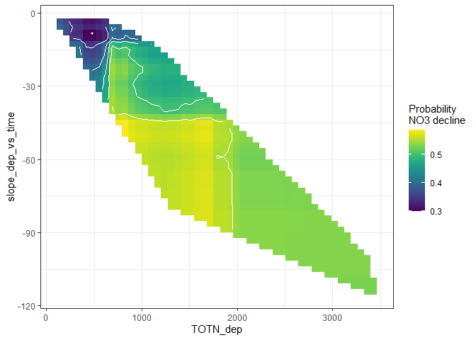<!-- -->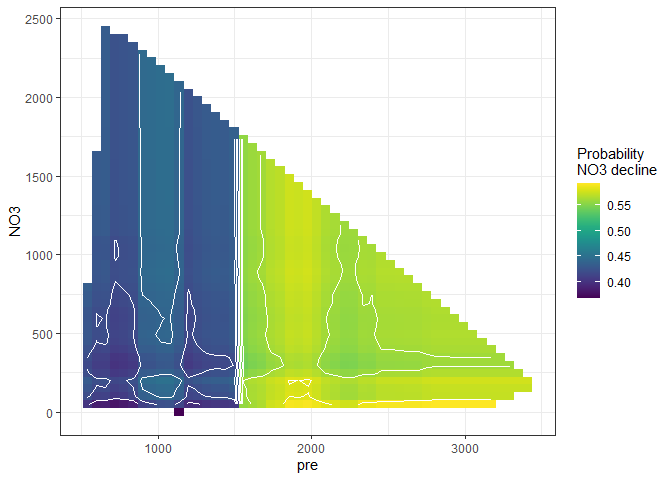<!-- -->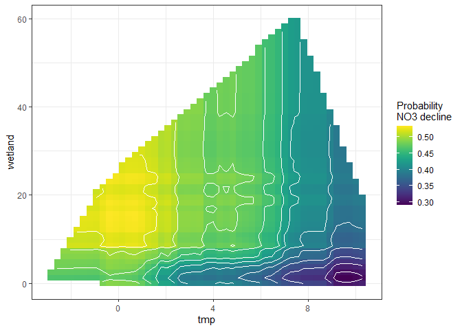<!-- -->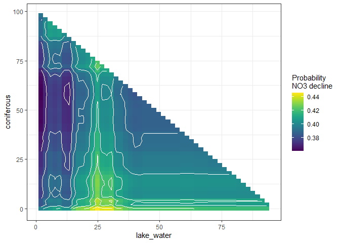<!-- -->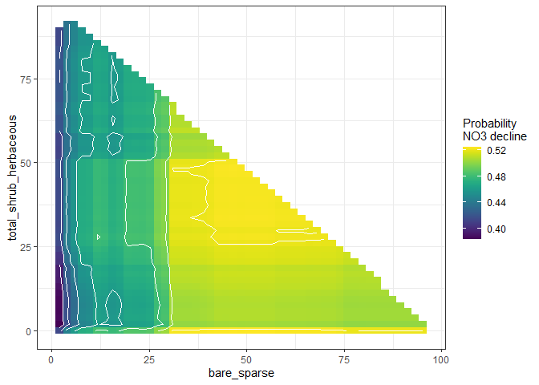<!-- -->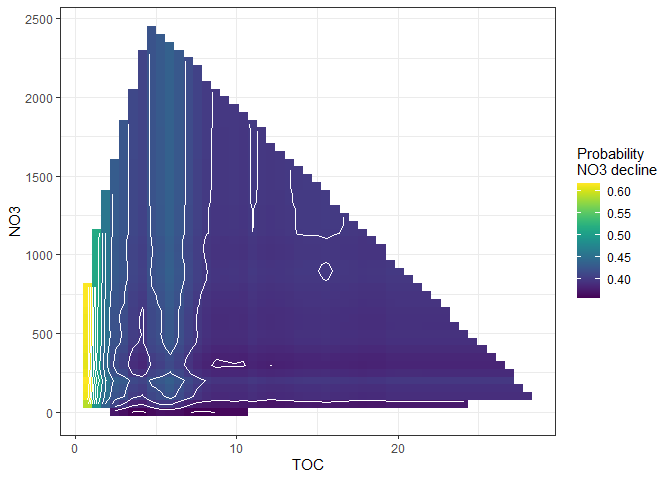<!-- -->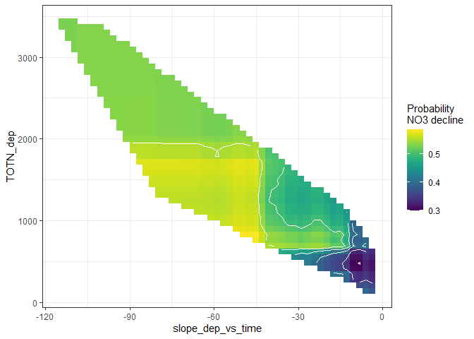<!-- -->


## 6. Logistic regression       
Start model: **no3_decline ~ TOC + TOTN_dep*slope_dep_vs_time + NO3 + decid_mixed + coniferous + tmp + lake_water + wetland**

```r
fm <- glm(
  as.formula(params$logistic_formula),
  data = df_analysis, 
  family = "binomial",  
  na.action = "na.fail")

dredged_models <- dredge(fm)                       # only once
```

```
## Fixed term is "(Intercept)"
```

```r
# saveRDS(dredged_models, "Data/162_all_dredged_models.rds")    # save it as it takes a couple of minutes
# dredged_models <- readRDS("Data/162_all_dredged_models.rds")

# cat("\n\nR2: \n")
# mod1 <- get.models(dredged_models, 1)[[1]]  
# summary(mod1)  
```

### Best models  

```r
# subset(dredged_models, delta < 1)

subset(dredged_models, delta < 2)

# Alternative way of showing result (didn't become any better)
# df <- subset(dredged_models, delta < 2)
# select(as.data.frame(df) %>% round(6), -`(Intercept)`, -logLik, -AICc)
```

```
## Global model call: glm(formula = as.formula(params$logistic_formula), family = "binomial", 
##     data = df_analysis, na.action = "na.fail")
## ---
## Model selection table 
##       (Int)      cnf  dcd_mxd   lak_wtr      NO3 slp_dep_vs_tim     tmp      TOC  TOT_dep
## 1012 0.9750 -0.02349 -0.03182                           -0.1077 -0.4203 -0.06087 0.001890
## 956  0.9973 -0.02866 -0.03295           0.001428        -0.1105 -0.4261          0.001418
## 1020 1.0250 -0.02487 -0.03160           0.001050        -0.1098 -0.4028 -0.04646 0.001374
## 948  0.8985 -0.02822 -0.03382                           -0.1078 -0.4634          0.002231
## 1016 1.1190 -0.02394 -0.03196 -0.005701                 -0.1070 -0.4191 -0.06180 0.001817
##          wtl slp_dep_vs_tim:TOT_dep df   logLik  AICc delta weight
## 1012 0.03781              3.936e-05  9 -231.996 482.4  0.00  0.267
## 956  0.03349              3.828e-05  9 -232.005 482.4  0.02  0.264
## 1020 0.03807              3.789e-05 10 -231.175 482.9  0.45  0.213
## 948  0.03104              4.115e-05  8 -233.617 483.6  1.16  0.149
## 1016 0.03728              3.827e-05 10 -231.869 484.2  1.84  0.106
## Models ranked by AICc(x)
```


### Plots  

```r
# Pick model with lowest AICc
mod1 <- get.models(dredged_models, 1)[[1]]  

modelvars <- get_model_variables(mod1)

vars <- modelvars$interaction_list[[1]]

# Interactions: 3D plot 
# visreg2d(mod1, xvar = vars[1], yvar = vars[2], 
#          type = 'conditional', scale = "response") 

# Interactions: 2D plot 
modelvars$interaction_list %>% purrr::walk(
  ~visreg(mod1, .x[1], by = .x[2], scale = "response")
)
```

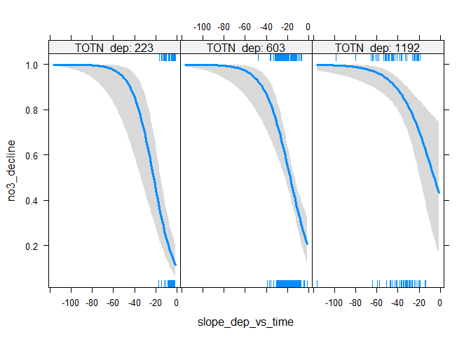<!-- -->

```r
par(mfrow = c(2,3), mar = c(4,5,2,1), oma = c(0,0,2,0))
for (var in modelvars$additive_vars)
  visreg(mod1, var, scale = "response")  
```

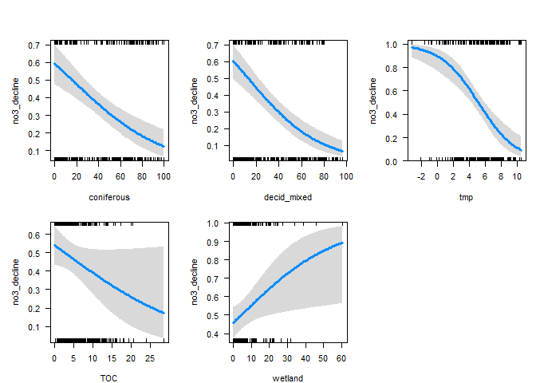<!-- -->

```
## Conditions used in construction of plot
## decid_mixed: 16.8925
## slope_dep_vs_time: -15.96809
## tmp: 5.458334
## TOC: 4.84
## TOTN_dep: 603.1866
## wetland: 1.2945
## Conditions used in construction of plot
## coniferous: 21.1745
## slope_dep_vs_time: -15.96809
## tmp: 5.458334
## TOC: 4.84
## TOTN_dep: 603.1866
## wetland: 1.2945
## Conditions used in construction of plot
## coniferous: 21.1745
## decid_mixed: 16.8925
## slope_dep_vs_time: -15.96809
## TOC: 4.84
## TOTN_dep: 603.1866
## wetland: 1.2945
## Conditions used in construction of plot
## coniferous: 21.1745
## decid_mixed: 16.8925
## slope_dep_vs_time: -15.96809
## tmp: 5.458334
## TOTN_dep: 603.1866
## wetland: 1.2945
## Conditions used in construction of plot
## coniferous: 21.1745
## decid_mixed: 16.8925
## slope_dep_vs_time: -15.96809
## tmp: 5.458334
## TOC: 4.84
## TOTN_dep: 603.1866
```


