As 160, but analysing the trend in TOC/TON ratio

Analysis of TOC/TON ratio increase, based on James' trend results    
* Taken from `https://github.com/JamesSample/icpw2/tree/master/thematic_report_2020/results`   
* Sen slope of NO3, TOTN, TOC/TON etc.  
* Predictor variable in all analyses are *whether TOC/TON ratio increases or not*     
* Basically 3 sets of identical analyses (5,6,7) which only differ in data set (5 has the largest set of variables and the lowest sample size)  


## 1. Libraries  

```r
# All of these packages cn be loaded at once using library(tidyverse). (I just like to be specific.)
library(dplyr)
library(tidyr)
library(purrr)
library(lubridate)
library(ggplot2)

# Too many packages, not all are used
# library(forcats)
# library(mgcv)
# library(nlme)
library(mapview)
library(visreg)     # visreg
library(rkt)        # Theil -Sen Regression

library(MuMIn)      

# Trees and forests
# install.packages("party")
# install.packages("modeltools")
# install.packages("coin")
# install.packages("multcomp")
# install.packages("TH.data")
library(party)
# install.packages("evtree")
library(evtree)
# install.packages("randomForest")
library(randomForest)

library(maps)
my_map <- map_data("world")

library(effects)    # handles lme models  
library(readxl)

knitr::opts_chunk$set(results = 'hold')
knitr::opts_chunk$set(warning = FALSE)
```


## 2. Data

```r
dat_annual_sel <- readRDS("Data/120_dat_annual_sel.rds")
# ts_model_list <- readRDS("Data/120_ts_model_list_linear.rds")
# ts_model_list_wout_TOC <- readRDS("Data/120_ts_model_list_wout_TOC.rds")

df_stations <- readRDS("Data/100_Stations.rds")
df_deposition <- readRDS("Data/100_Deposition.rds")
df_climate <- readRDS("Data/100_Climate.rds")
```

### Station metadata

```r
df_station <- read_excel(
  "K:/Prosjekter/langtransporterte forurensninger/O-23300 - ICP-WATERS - HWI/Faglige rapporter/2020 report/Land cover/ICPW_All_Stations_2020_2020_05_04.xlsx") %>%
  mutate(station_id = as.character(station_id))
```

### James results  

```r
#
# Regression results
#
# fn <- "https://raw.githubusercontent.com/JamesSample/icpw2/master/thematic_report_2020/results/trends_1992-2016_toc_totn_no3_relax_italy/trends_1992-2016_toc_totn_no3_relax_italy_results.csv"
fn <- "https://github.com/JamesSample/icpw2/raw/master/thematic_report_2020/results/trends_1992-2016_no3/trends_1992-2016_no3_results.csv"
reg_no3 <- read.csv(fn, encoding = "UTF-8")
nrow(reg_no3)

# Station metadata
fn <- "https://raw.githubusercontent.com/JamesSample/icpw2/master/thematic_report_2020/results/trends_1992-2016_toc_totn_no3_relax_italy/trends_1992-2016_toc_totn_no3_relax_italy_stations.csv"
fn <- "https://github.com/JamesSample/icpw2/raw/master/thematic_report_2020/results/trends_1992-2016_no3/trends_1992-2016_no3_stations.csv"
reg_no3_st <- read.csv(fn, encoding = "UTF-8")

# xtabs(~variable, reg_no3)  
xtabs(~country, reg_no3_st)  

#
# Medians
#
fn <- "https://github.com/JamesSample/icpw2/raw/master/thematic_report_2020/results/medians_2012-2016/medians_2012-2016_no3.csv"
medians_no3 <- read.csv(fn, encoding = "UTF-8")
nrow(medians_no3)


if (FALSE){
  # Check Germany:
  x <- reg_no3_st %>% filter(country == "Germany") %>% pull(station_id)
  medians_no3 %>% filter(station_id %in% x) %>% View()  # only 3 stations??

  # Dounle check by reading and adding metadata 
  fn <- "https://github.com/JamesSample/icpw2/raw/master/thematic_report_2020/results/medians_2012-2016/medians_2012-2016_no3_stations.csv"
  medians_no3_st <- read.csv(fn, encoding = "UTF-8")
  medians_no3 <- medians_no3 %>% left_join(medians_no3_st)
  medians_no3 %>% filter(country %in% "Germany") %>% View()  # still only 3 stations

}

fn <- "https://github.com/JamesSample/icpw2/raw/master/thematic_report_2020/results/medians_2012-2016/medians_2012-2016_toc_totn_no3_nh4.csv"
medians_toc <- read.csv(fn, encoding = "UTF-8")
nrow(medians_toc)
```

```
## [1] 3176
## country
##         Canada Czech Republic        Estonia        Finland        Germany 
##            114              8              1             26             23 
##        Ireland          Italy         Latvia    Netherlands         Norway 
##              3              6              3              3             83 
##         Poland       Slovakia         Sweden    Switzerland United Kingdom 
##              6             12             92              6             21 
##  United States 
##             91 
## [1] 494
## [1] 225
```
### Start 'dat'  
With slope regression data  
* Make one line per station  

```r
df1 <- reg_no3 %>%
  filter(variable %in% c("NO3-N_µg/l N", "TOC/TON")) %>%
  select(station_id, variable, sen_slp) %>%
  tidyr::pivot_wider(names_from = "variable", values_from = "sen_slp")
df2 <- reg_no3 %>%
  filter(variable %in% c("NO3-N_µg/l N", "TOC/TON")) %>%
  select(station_id, variable, mk_p_val) %>%
  tidyr::pivot_wider(names_from = "variable", values_from = "mk_p_val")

names(df1)[2:3] <- c("slope_no3_vs_time", "slope_tocton_vs_time")
names(df2)[2:3] <- c("p_no3_vs_time", "p_tocton_vs_time")

dat <- full_join(df1, df2, by = "station_id")
```

### Deposition Theil-Senslope   

```r
### Get deposition  
df_deposition <- readRDS("Data/100_Deposition.rds") %>%
  as.data.frame()

# TEST Senslope
# df_test <- df_deposition %>% filter(station_id == 38115)
# result <- rkt(df_test$year, df_test$TOTN_dep)
# data.frame(station_id = 38115, TOTN_dep_P = result$sl, TOTN_dep_slope = result$B)

# Function for Sen slope
get_senslope <- function(data){
  result <- rkt(data$year, data$TOTN_dep)
  data.frame(station_id = data$station_id[1], slope_dep_vs_time = result$B, p_dep_vs_time = result$sl)
}

df_deposition_slope <- df_deposition %>%
  split(.$station_id) %>% # str()
  purrr::map_dfr(get_senslope)  
```


### Add deposition slope to data  

```r
nrow(dat)
dat <- left_join(dat, 
                 df_deposition_slope,
                 by = "station_id")

nrow(dat)
```

```
## [1] 498
## [1] 498
```
### Add medians and station metadata   

```r
nrow(dat)
dat <- dat %>%
  left_join(medians_no3, by = "station_id") %>%
  # left_join(medians_toc, by = "station_id") %>%   # not needed, overlap in variables  
  left_join(reg_no3_st, by = "station_id")
nrow(dat)

# Simplify names by removing units
# names(dat)
names(dat) <- sub(".N_µg.l.N", "", names(dat))
names(dat) <- sub("_mg.C.l", "", names(dat))
names(dat) <- sub("_µg.l.P", "", names(dat))
names(dat)
```

```
## [1] 498
## [1] 498
##  [1] "station_id"           "slope_no3_vs_time"    "slope_tocton_vs_time"
##  [4] "p_no3_vs_time"        "p_tocton_vs_time"     "slope_dep_vs_time"   
##  [7] "p_dep_vs_time"        "NH4"                  "NO3"                 
## [10] "TOC"                  "TO"                   "TOTP"                
## [13] "T"                    "TOTN.TOTP"            "NO3.TOTP"            
## [16] "TOC.TON"              "TOC.TOTP"             "station_code"        
## [19] "station_name"         "latitude"             "longitude"           
## [22] "altitude"             "continent"            "country"             
## [25] "region"               "group"
```

### Add climate and deposition means 

```r
df_climate <- readRDS("Data/100_Climate.rds")

df_climate_mean <- df_climate %>%
  group_by(station_id, variable) %>% 
  summarise(mean = mean(value)) %>%
  tidyr::pivot_wider(names_from = "variable", values_from = "mean")
```

```
## `summarise()` has grouped output by 'station_id'. You can override using the `.groups` argument.
```

```r
df_deposition_mean <-
  df_deposition %>% 
  group_by(station_id) %>% 
  summarise(Mean_dep = mean(TOTN_dep))

# Add
dat <- dat %>%
  left_join(df_climate_mean, by = "station_id") %>%
  left_join(df_deposition_mean, by = "station_id")
nrow(dat)
```

```
## [1] 498
```

### Add land cover    

```r
fn <- "K:/Prosjekter/langtransporterte forurensninger/O-23300 - ICP-WATERS - HWI/Faglige rapporter/2020 report/Land cover/ICPW_All_Stations_2020_2020_05_04.xlsx"

df_station <- read_excel(fn)

nrow(dat)
dat <- left_join(dat, 
                 df_station %>% select(-(station_code:longitude), -(altitude:region)), 
                 by = "station_id"
)

nrow(dat)
```

```
## [1] 498
## [1] 498
```


## 3. Plot estimates  

Note: **No USA**


```r
ggplot(dat, aes(slope_dep_vs_time, slope_tocton_vs_time)) + 
  geom_point(data = dat %>% filter(p_tocton_vs_time < 0.05), size = rel(2)) +
  geom_point(aes(color = country)) +
  geom_hline(yintercept = 0, linetype = 2) + 
  geom_vline(xintercept = 0, linetype = 2) 
```

<!-- -->

```r
ggplot(dat, aes(slope_dep_vs_time, slope_tocton_vs_time,
                color = (p_tocton_vs_time < 0.05))) + 
  geom_point() +
  facet_wrap(vars(country)) +
  geom_hline(yintercept = 0, linetype = 2) + 
  geom_vline(xintercept = 0, linetype = 2) + 
  labs(title = "A selection of countries")
```

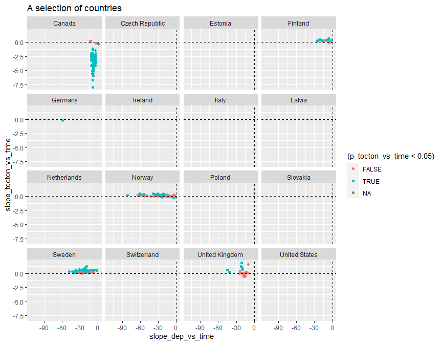<!-- -->

```r
dat %>%
  filter(!country %in% c("Latvia","Ireland","Italy","Netherlands")) %>%
  ggplot(aes(slope_dep_vs_time, slope_tocton_vs_time,
             color = (p_tocton_vs_time < 0.05))) + 
  geom_point() +
  facet_wrap(vars(country)) +
  geom_hline(yintercept = 0, linetype = 2) + 
  geom_vline(xintercept = 0, linetype = 2) + 
  labs(title = "A selection of countries") + 
  ylim(-2, 2)
```

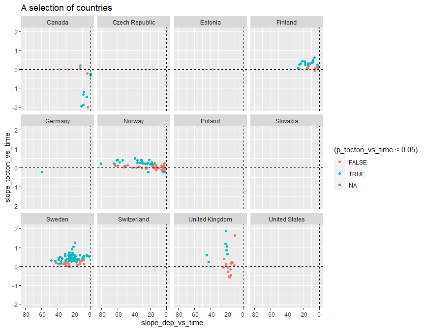<!-- -->


## 4. Analysis of 'Significant / non-significant TOC/TON increase'   
* Parts 5, 6 and 7 all run logistic regression + "trees and forest" methods  
* Each part differ only in dataset used  


```r
use_saved_results <- TRUE
```


## 5a. Data INCLUDING catchment_area    

```r
# Data for analyses
df_analysis <- dat %>%
  mutate(
    tocton_increase = case_when(
      slope_tocton_vs_time > 0 & p_tocton_vs_time <= 0.05 ~ 1,
      TRUE ~ 0)
  ) %>%
  select(tocton_increase, slope_dep_vs_time,
         NO3, TOC,
    latitude, longitude, altitude, 
    pre, tmp, catchment_area,
    coniferous, deciduous, lake, mixed_forest, wetland)

# Complete cases
apply(is.na(df_analysis), 2, sum)

# What is missing? (long output)
if (FALSE){
dat %>% 
  split(.$country) %>%
  purrr::map(~apply(is.na(.), 2, mean))
}

complete <- complete.cases(df_analysis)
table(complete)
table(dat$country, complete)

# Keep only complete cases
df_analysis <- df_analysis[complete.cases(df_analysis),]
```

```
##   tocton_increase slope_dep_vs_time               NO3               TOC 
##                 0                 0                25                26 
##          latitude         longitude          altitude               pre 
##                 0                 0                 9                 0 
##               tmp    catchment_area        coniferous         deciduous 
##                 0                93                43                43 
##              lake      mixed_forest           wetland 
##                37                43                37 
## complete
## FALSE  TRUE 
##   153   345 
##                 complete
##                  FALSE TRUE
##   Canada             0  114
##   Czech Republic     0    8
##   Estonia            1    0
##   Finland            3   23
##   Germany           21    2
##   Ireland            1    2
##   Italy              2    4
##   Latvia             0    3
##   Netherlands        1    2
##   Norway             0   83
##   Poland             0    6
##   Slovakia           0   12
##   Sweden             6   86
##   Switzerland        6    0
##   United Kingdom    21    0
##   United States     91    0
```


## 5b. Logistic regression, all variables  

```r
# Full model  
fm <- glm(
  tocton_increase ~ .,
  data = df_analysis, 
  family = "binomial",
  na.action = "na.fail")

# Dredging for best model
if (use_saved_results){
  # Read dredge result
  dd1a <- readRDS("Data/161_all_dd1a.rds")
} else {
  dd1a <- dredge(fm)                          # do only once
  saveRDS(dd1a, "Data/161_all_dd1a.rds")      # save it as it takes a couple of minutes
}


# Check best models  
subset(dd1a, delta < 1)

cat("\n\nR2: \n")
dd1a_mod1 <- get.models(dd1a, 1)[[1]]  
# summary(dd1a_mod1)  

par(mfrow = c(2,3), mar = c(4,5,2,1), oma = c(0,0,2,0))
visreg(dd1a_mod1, scale = "response")
```

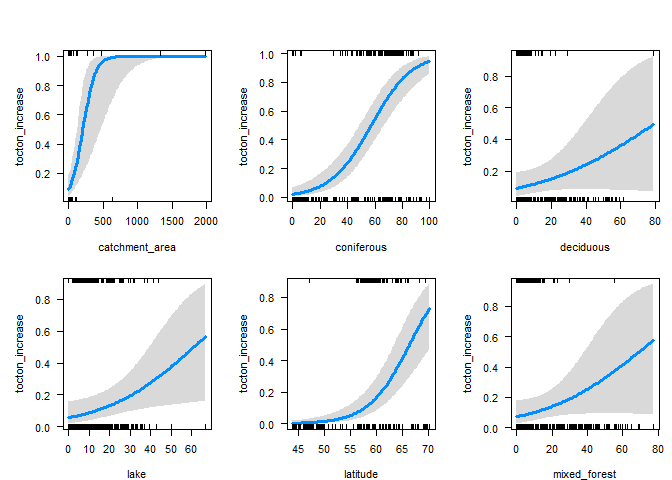<!-- -->

```r
mtext("All data, include coordinates", outer = TRUE)
```

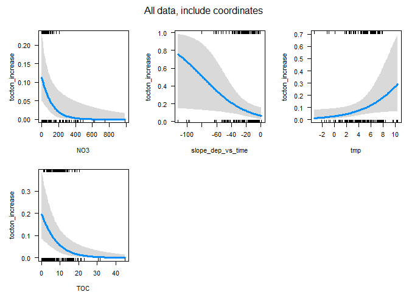<!-- -->

```
## Global model call: glm(formula = tocton_increase ~ ., family = "binomial", data = df_analysis, 
##     na.action = "na.fail")
## ---
## Model selection table 
##       (Int)  ctc_are     cnf     dcd     lak    ltt     lng mxd_frs       NO3
## 7615 -20.19 0.011140 0.06718 0.02896 0.04581 0.2536         0.03672 -0.009003
## 7607 -19.30 0.010600 0.06176         0.04038 0.2468         0.03754 -0.009024
## 7679 -15.68 0.010670 0.06327 0.03007 0.04296 0.1809 0.02142 0.04143 -0.010090
## 8103 -16.09 0.009791 0.05137                 0.2255         0.03018 -0.011160
## 7975 -13.59 0.009930 0.04558                 0.1931                 -0.011350
## 7671 -15.13 0.010140 0.05820         0.03789 0.1797 0.01992 0.04248 -0.009999
## 7487 -17.41 0.011280 0.06025 0.02987 0.04356 0.2179                 -0.009209
## 7983 -14.42 0.010340 0.04986 0.02570         0.2021                 -0.011610
## 8127 -18.41 0.010830 0.06239 0.02907 0.03380 0.2405         0.03359 -0.009799
## 8119 -17.45 0.010260 0.05685         0.02874 0.2323         0.03410 -0.009742
## 8111 -16.73 0.010200 0.05520 0.02458         0.2322         0.02893 -0.011450
##             pre slp_dep_vs_tim    tmp     TOC df   logLik  AICc delta weight
## 7615                  -0.03390 0.2552 -0.1425 11 -105.273 233.3  0.00  0.121
## 7607                  -0.03335 0.2581 -0.1396 10 -106.384 233.4  0.09  0.116
## 7679                  -0.02830 0.2545 -0.1481 12 -104.426 233.8  0.45  0.096
## 8103 -0.0010280       -0.03624 0.3688 -0.1834 10 -106.606 233.9  0.53  0.093
## 7975 -0.0010740       -0.03345 0.3632 -0.1706  9 -107.686 233.9  0.57  0.091
## 7671                  -0.02814 0.2563 -0.1446 11 -105.613 234.0  0.68  0.086
## 7487                  -0.03110 0.2491 -0.1276 10 -106.700 234.1  0.72  0.084
## 7983 -0.0011340       -0.03414 0.3766 -0.1798 10 -106.709 234.1  0.74  0.083
## 8127 -0.0006708       -0.03421 0.3115 -0.1654 12 -104.610 234.2  0.82  0.080
## 8119 -0.0006556       -0.03336 0.3120 -0.1614 11 -105.728 234.2  0.91  0.077
## 8111 -0.0011000       -0.03720 0.3792 -0.1911 11 -105.770 234.3  1.00  0.073
## Models ranked by AICc(x) 
## 
## 
## R2:
```

## 5c. Logistic regression, exclude coordinates    

```r
fm <- glm(
  tocton_increase ~ slope_dep_vs_time + NO3 + TOC +
    altitude + 
    pre + tmp + catchment_area +
    coniferous + deciduous + lake + mixed_forest + 
    wetland,
  data = df_analysis, 
  family = "binomial",
  na.action = "na.fail")

# Dredging for best model
if (use_saved_results){
  # Read dredge result
  dd1b <- readRDS("Data/161_all_dd1b.rds")
} else {
  dd1b <- dredge(fm)                          # do only once
  saveRDS(dd1b, "Data/161_all_dd1b.rds")      # save it as it takes a couple of minutes
}

subset(dd1b, delta < 1)

cat("\n\nR2: \n")
dd1b_mod1 <- get.models(dd1b, 1)[[1]]  
# summary(dd1b_mod1)  

par(mfrow = c(2,3), mar = c(4,5,2,1), oma = c(0,0,2,0))
visreg(dd1b_mod1, scale = "response")
```

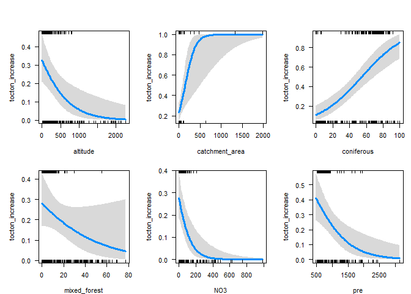<!-- -->

```r
mtext("All data, exclude coordinates", outer = TRUE)
```

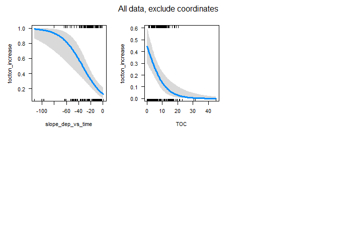<!-- -->

```
## Global model call: glm(formula = tocton_increase ~ slope_dep_vs_time + NO3 + TOC + 
##     altitude + pre + tmp + catchment_area + coniferous + deciduous + 
##     lake + mixed_forest + wetland, family = "binomial", data = df_analysis, 
##     na.action = "na.fail")
## ---
## Model selection table 
##       (Int)       alt  ctc_are     cnf  mxd_frs      NO3       pre
## 1512 0.6254 -0.002043 0.008242 0.03809 -0.02697 -0.01046 -0.001667
## 1480 0.4224 -0.002001 0.008376 0.04328          -0.01060 -0.001971
##      slp_dep_vs_tim     TOC df   logLik  AICc delta weight
## 1512       -0.05664 -0.1645  9 -117.754 254.0   0.0  0.586
## 1480       -0.06082 -0.1830  8 -119.156 254.7   0.7  0.414
## Models ranked by AICc(x) 
## 
## 
## R2:
```


## 5d. Tree and forest classification


### Split into training and validation data

```r
set.seed(123)

x <- runif(nrow(df_analysis))
train <- ifelse(x < 0.9, TRUE, FALSE)

train_set <- df_analysis[train,]  %>% 
  mutate(tocton_increase_f = factor(tocton_increase)) %>% select(-tocton_increase, -longitude, - latitude) %>%
  as.data.frame()
valid_set <- df_analysis[!train,] %>% 
  mutate(tocton_increase_f = factor(tocton_increase)) %>% select(-tocton_increase, -longitude, - latitude) %>%
  as.data.frame()
```


### a. Tree classification using 'party'   

```r
(ct = ctree(tocton_increase_f ~ ., data = train_set))

plot(ct, main="Conditional Inference Tree")
```

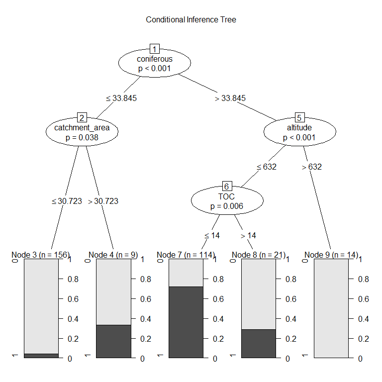<!-- -->

```r
cat("\n\n")
cat("Table of prediction errors \n")
table(predict(ct), train_set$tocton_increase_f)
cat("\n\n")

cat("Classification of training set \n")
tr.pred = predict(ct, newdata = valid_set, type="prob")
colnames(tr.pred) <- c("P0", "P1")
# tr.pred <- tr.pred %>% map_dfr(~data.frame(P0 = .[1], P1 = .[2]))
table(tr.pred[,"P1"] > 0.5, valid_set$tocton_increase_f)
```

```
## 
## Model formula:
## tocton_increase_f ~ slope_dep_vs_time + NO3 + TOC + altitude + 
##     pre + tmp + catchment_area + coniferous + deciduous + lake + 
##     mixed_forest + wetland
## 
## Fitted party:
## [1] root
## |   [2] coniferous <= 33.845
## |   |   [3] catchment_area <= 30.723: 0 (n = 156, err = 4.5%)
## |   |   [4] catchment_area > 30.723: 0 (n = 9, err = 33.3%)
## |   [5] coniferous > 33.845
## |   |   [6] altitude <= 632
## |   |   |   [7] TOC <= 14: 1 (n = 114, err = 28.1%)
## |   |   |   [8] TOC > 14: 0 (n = 21, err = 28.6%)
## |   |   [9] altitude > 632: 0 (n = 14, err = 0.0%)
## 
## Number of inner nodes:    4
## Number of terminal nodes: 5
## 
## 
## Table of prediction errors 
##    
##       0   1
##   0 184  16
##   1  32  82
## 
## 
## Classification of training set 
##        
##          0  1
##   FALSE 20  3
##   TRUE   2  6
```

### b. Evtree (Evolutionary Learning)   

```r
ev.raw = evtree(tocton_increase_f ~ ., data = train_set)

plot(ev.raw)
```

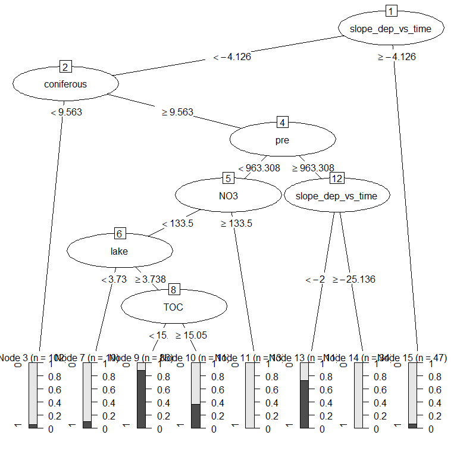<!-- -->

```r
cat("Predicted in training data: \n")
table(predict(ev.raw), train_set$tocton_increase_f)

cat("\n\nPrediction errors in training data: \n")
1-mean(predict(ev.raw) == train_set$tocton_increase_f)
```

```
## Predicted in training data: 
##    
##       0   1
##   0 203  14
##   1  13  84
## 
## 
## Prediction errors in training data: 
## [1] 0.08598726
```


### c. Random forest  
* *For results/interpretation, see separate document '161_randomforest_James_data.html'*  
* Model called 'model1'

```r
model1 <- randomForest(tocton_increase_f ~ ., 
                       data = train_set, 
                       mtry = 5,
                       importance = TRUE)

model1
```

```
## 
## Call:
##  randomForest(formula = tocton_increase_f ~ ., data = train_set,      mtry = 5, importance = TRUE) 
##                Type of random forest: classification
##                      Number of trees: 500
## No. of variables tried at each split: 5
## 
##         OOB estimate of  error rate: 15.29%
## Confusion matrix:
##     0  1 class.error
## 0 194 22   0.1018519
## 1  26 72   0.2653061
```


#### Random forest, predict on training data

```r
# Predicting on train set
pred_valid <- predict(model1, valid_set, type = "class")
# Checking classification accuracy
table(pred_valid, valid_set$tocton_increase_f)  
```

```
##           
## pred_valid  0  1
##          0 21  2
##          1  1  7
```

#### Random forest, importance (but see separate result file)  
High MeanDecreaseGini = high importance in model  

```r
randomForest::importance(model1)
varImpPlot(model1)
```

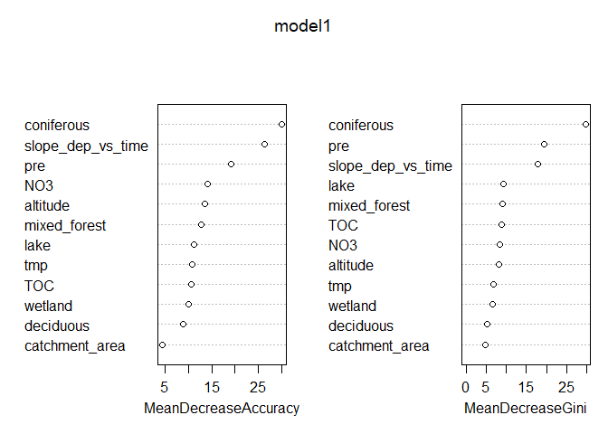<!-- -->

```
##                           0         1 MeanDecreaseAccuracy MeanDecreaseGini
## slope_dep_vs_time 18.947690 21.966572            26.315148        17.794814
## NO3                9.791595  9.365286            14.014688         8.305008
## TOC               10.642506  3.621392            10.593830         8.795885
## altitude           6.506598 12.159321            13.577350         8.068654
## pre               10.607977 18.555876            19.185197        19.479924
## tmp                7.266164  7.570141            10.764355         6.863986
## catchment_area     5.136281  0.982206             4.356013         4.844802
## coniferous        13.028937 29.312190            30.064998        29.826592
## deciduous          3.476714  7.898521             8.854332         5.146397
## lake               7.705355  8.188191            11.199702         9.177988
## mixed_forest       3.951148 12.780313            12.733915         9.012993
## wetland           10.587357  2.649578             9.966518         6.519251
```

#### Random forest, partial effects   
* NOt easy to interpret    

```r
imp <- randomForest::importance(model1)
impvar1 <- rownames(imp)[order(imp[, 2], decreasing=TRUE)]

# impvar1 <- readRDS("Data/130_impvar1.rmd")

par(mfrow=c(3,4))

for (i in seq_along(impvar1)) {
  partialPlot(x = model1, 
              pred.data = train_set, 
              x.var = impvar1[i], 
              which.class = "1",
              main=paste("Effect of", impvar1[i]))
}
```

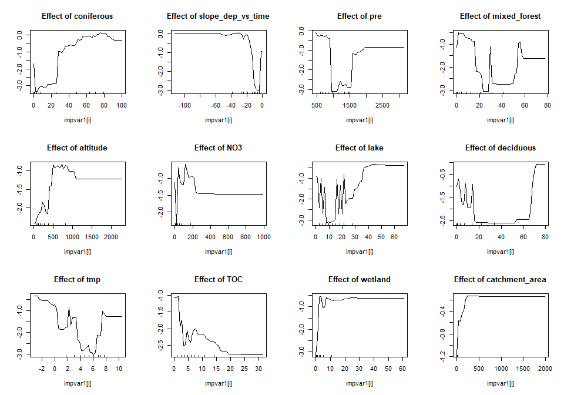<!-- -->
#### randomForestExplainer

```r
# install.packages("randomForestExplainer")
library(randomForestExplainer)
```

```
## Registered S3 method overwritten by 'GGally':
##   method from   
##   +.gg   ggplot2
```

```r
# COPY to console and run (this will create an Rmd file and render an HTML file):
# DON'T rin ith within this chunk, RStudio will hang

if (FALSE){
  explain_forest(model1, interactions = TRUE, data = train_set, 
                 path = "C:/Data/seksjon 317/icpw-R/161_randomforest_James_data_model1.html")
}
```


## 6a. Data EXCLUDING catchment_area   
* Includes USA data, still missing UK and most German data      
*  Germany is missing TOC and NO3 (87%), UK is missing land cover (100%)

```r
# Data for analyses
df_analysis <- dat %>%
  mutate(
    tocton_increase = case_when(
      slope_tocton_vs_time > 0 & p_tocton_vs_time <= 0.05 ~ 1,
      TRUE ~ 0)
  ) %>%
  select(tocton_increase, slope_dep_vs_time,
         NO3, TOC,
    latitude, longitude, altitude, 
    pre, tmp, 
    coniferous, deciduous, lake, mixed_forest, wetland)

# Complete cases
apply(is.na(df_analysis), 2, sum)

complete <- complete.cases(df_analysis)
table(complete)
table(dat$country, complete)

# What is missing? (long output)  
# Germany is missing TOC (87%)
if (FALSE){
dat %>% 
  split(.$country) %>%
  purrr::map(~apply(is.na(.), 2, mean))
}


# Keep only complete cases
df_analysis <- df_analysis[complete.cases(df_analysis),]
```

```
##   tocton_increase slope_dep_vs_time               NO3               TOC 
##                 0                 0                25                26 
##          latitude         longitude          altitude               pre 
##                 0                 0                 9                 0 
##               tmp        coniferous         deciduous              lake 
##                 0                43                43                37 
##      mixed_forest           wetland 
##                43                37 
## complete
## FALSE  TRUE 
##    78   420 
##                 complete
##                  FALSE TRUE
##   Canada             0  114
##   Czech Republic     0    8
##   Estonia            1    0
##   Finland            3   23
##   Germany           21    2
##   Ireland            1    2
##   Italy              2    4
##   Latvia             0    3
##   Netherlands        1    2
##   Norway             0   83
##   Poland             0    6
##   Slovakia           0   12
##   Sweden             6   86
##   Switzerland        6    0
##   United Kingdom    21    0
##   United States     16   75
```


## 6b. Logistic regression, all variables  

```r
# Full model  
fm <- glm(
  tocton_increase ~ .,
  data = df_analysis, 
  family = "binomial",
  na.action = "na.fail")

# Dredging for best model
if (use_saved_results){
  # Read dredge result
  dd2a <- readRDS("Data/161_all_dd2a.rds")
} else {
  dd2a <- dredge(fm)                          # do only once
  saveRDS(dd2a, "Data/161_all_dd2a.rds")      # save it as it takes a couple of minutes
}

# Check best models  
subset(dd2a, delta < 1)

cat("\n\nR2: \n")
dd2a_mod1 <- get.models(dd2a, 1)[[1]]  
# summary(dd2a_mod1)  

par(mfrow = c(2,3), mar = c(4,5,2,1), oma = c(0,0,2,0))
visreg(dd2a_mod1, scale = "response")
```

<!-- -->

```r
mtext("All data, include coordinates", outer = TRUE)
```

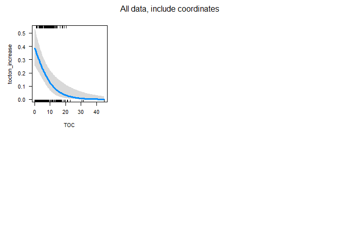<!-- -->

```
## Global model call: glm(formula = tocton_increase ~ ., family = "binomial", data = df_analysis, 
##     na.action = "na.fail")
## ---
## Model selection table 
##       (Int)       alt     cnf     lak     lng mxd_frs       NO3 slp_dep_vs_tim
## 2788 -1.786 -0.002072 0.04538         0.05247 0.03195 -0.008327       -0.03413
## 2724 -1.351 -0.002184 0.04129         0.04678         -0.008145       -0.03321
## 2796 -2.254 -0.001867 0.04739 0.02088 0.05246 0.03398 -0.007603       -0.02950
##          TOC df   logLik  AICc delta weight
## 2788 -0.1482  8 -112.851 242.1  0.00  0.385
## 2724 -0.1336  7 -113.948 242.2  0.12  0.364
## 2796 -0.1381  9 -112.236 242.9  0.86  0.251
## Models ranked by AICc(x) 
## 
## 
## R2:
```

## 6c. Logistic regression, exclude coordinates    

```r
fm <- glm(
  tocton_increase ~ slope_dep_vs_time + NO3 + TOC +
    altitude + 
    pre + tmp + 
    coniferous + deciduous + lake + mixed_forest + 
    wetland,
  data = df_analysis, 
  family = "binomial",
  na.action = "na.fail")

# Dredging for best model
if (use_saved_results){
  # Read dredge result
  dd2b <- readRDS("Data/161_all_dd2b.rds")
} else {
  dd2b <- dredge(fm)                          # do only once
  saveRDS(dd2b, "Data/161_all_dd2b.rds")      # save it as it takes a couple of minutes
}

subset(dd2b, delta < 1)

cat("\n\nR2: \n")
dd2b_mod1 <- get.models(dd2b, 1)[[1]]  
# summary(dd2b_mod1)  

par(mfrow = c(2,3), mar = c(4,5,2,1), oma = c(0,0,2,0))
visreg(dd2b_mod1, scale = "response")
```

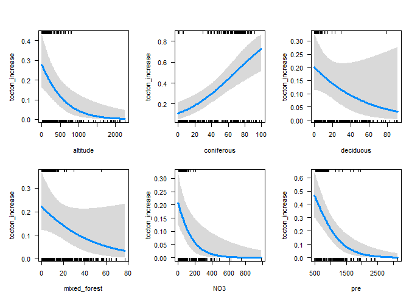<!-- -->

```r
mtext("All data, exclude coordinates", outer = TRUE)
```

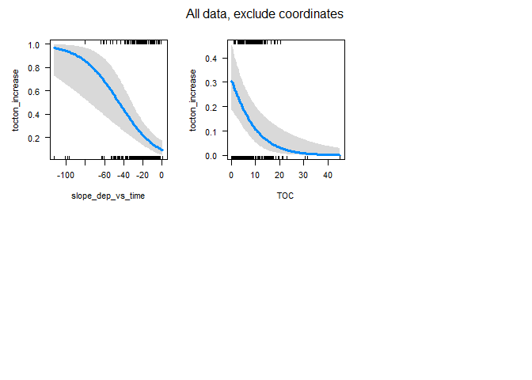<!-- -->

```
## Global model call: glm(formula = tocton_increase ~ slope_dep_vs_time + NO3 + TOC + 
##     altitude + pre + tmp + coniferous + deciduous + lake + mixed_forest + 
##     wetland, family = "binomial", data = df_analysis, na.action = "na.fail")
## ---
## Model selection table 
##       (Int)       alt     cnf      dcd  mxd_frs       NO3       pre
## 760  1.2890 -0.002108 0.03065 -0.02199 -0.02716 -0.007313 -0.002226
## 756  1.0980 -0.002178 0.03601          -0.02898 -0.007885 -0.002383
## 1012 1.1150 -0.002420 0.03821          -0.02417 -0.007267 -0.002124
## 996  0.9486 -0.002428 0.04248                   -0.007042 -0.002330
## 1016 1.2880 -0.002324 0.03310 -0.01898 -0.02371 -0.006844 -0.002038
## 744  1.0900 -0.002033 0.03445 -0.02547          -0.007187 -0.002500
## 1000 1.1360 -0.002338 0.03694 -0.02034          -0.006635 -0.002232
##      slp_dep_vs_tim     tmp     TOC df   logLik  AICc delta weight
## 760        -0.05070         -0.1307  9 -132.366 283.2  0.00  0.184
## 756        -0.05114         -0.1382  8 -133.544 283.4  0.27  0.161
## 1012       -0.06149 -0.1417 -0.1249  9 -132.568 283.6  0.40  0.151
## 996        -0.06718 -0.1756 -0.1330  8 -133.654 283.7  0.49  0.144
## 1016       -0.05946 -0.1179 -0.1206 10 -131.730 284.0  0.83  0.122
## 744        -0.05406         -0.1421  8 -133.845 284.0  0.87  0.119
## 1000       -0.06514 -0.1504 -0.1281  9 -132.806 284.1  0.88  0.119
## Models ranked by AICc(x) 
## 
## 
## R2:
```


## 6d. Tree and forest classification


### Split into training and validation data

```r
set.seed(123)

x <- runif(nrow(df_analysis))
train <- ifelse(x < 0.9, TRUE, FALSE)

train_set <- df_analysis[train,]  %>% 
  mutate(tocton_increase_f = factor(tocton_increase)) %>% select(-tocton_increase, -longitude, - latitude) %>%
  as.data.frame()
valid_set <- df_analysis[!train,] %>% 
  mutate(tocton_increase_f = factor(tocton_increase)) %>% select(-tocton_increase, -longitude, - latitude) %>%
  as.data.frame()
```


### a. Tree classification using 'party'   

```r
(ct = ctree(tocton_increase_f ~ ., data = train_set))

plot(ct, main="Conditional Inference Tree")
```

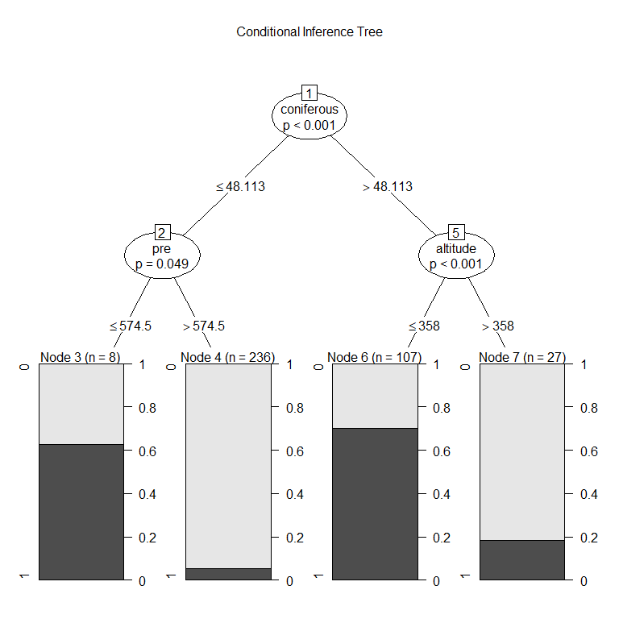<!-- -->

```r
cat("\n\n")
cat("Table of prediction errors \n")
table(predict(ct), train_set$tocton_increase_f)
cat("\n\n")

cat("Classification of training set \n")
tr.pred = predict(ct, newdata = valid_set, type="prob")
colnames(tr.pred) <- c("P0", "P1")
# tr.pred <- tr.pred %>% map_dfr(~data.frame(P0 = .[1], P1 = .[2]))
table(tr.pred[,"P1"] > 0.5, valid_set$tocton_increase_f)
```

```
## 
## Model formula:
## tocton_increase_f ~ slope_dep_vs_time + NO3 + TOC + altitude + 
##     pre + tmp + coniferous + deciduous + lake + mixed_forest + 
##     wetland
## 
## Fitted party:
## [1] root
## |   [2] coniferous <= 48.113
## |   |   [3] pre <= 574.50002: 1 (n = 8, err = 37.5%)
## |   |   [4] pre > 574.50002: 0 (n = 236, err = 5.5%)
## |   [5] coniferous > 48.113
## |   |   [6] altitude <= 358: 1 (n = 107, err = 29.9%)
## |   |   [7] altitude > 358: 0 (n = 27, err = 18.5%)
## 
## Number of inner nodes:    3
## Number of terminal nodes: 4
## 
## 
## Table of prediction errors 
##    
##       0   1
##   0 245  18
##   1  35  80
## 
## 
## Classification of training set 
##        
##          0  1
##   FALSE 31  1
##   TRUE   2  8
```

### b. Evtree (Evolutionary Learning)   

```r
ev.raw = evtree(tocton_increase_f ~ ., data = train_set)

plot(ev.raw)
```

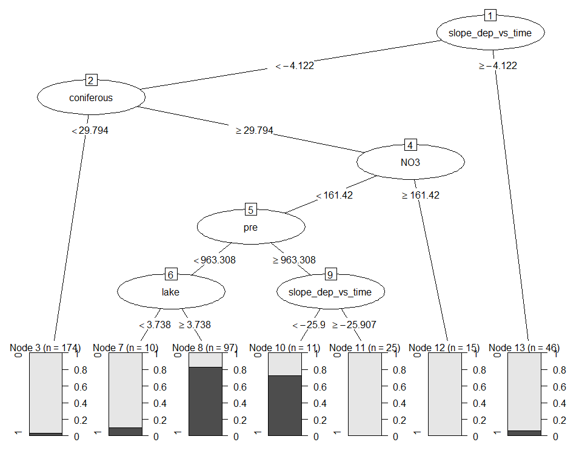<!-- -->

```r
cat("Predicted in training data: \n")
table(predict(ev.raw), train_set$tocton_increase_f)

cat("\n\nPrediction errors in training data: \n")
1-mean(predict(ev.raw) == train_set$tocton_increase_f)
```

```
## Predicted in training data: 
##    
##       0   1
##   0 260  10
##   1  20  88
## 
## 
## Prediction errors in training data: 
## [1] 0.07936508
```


### c. Random forest  
* *For results/interpretation, see separate document '161_randomforest_James_data.html'*  
* Model called 'model2'

```r
model2 <- randomForest(tocton_increase_f ~ ., 
                       data = train_set, 
                       mtry = 5,
                       importance = TRUE)

model2
```

```
## 
## Call:
##  randomForest(formula = tocton_increase_f ~ ., data = train_set,      mtry = 5, importance = TRUE) 
##                Type of random forest: classification
##                      Number of trees: 500
## No. of variables tried at each split: 5
## 
##         OOB estimate of  error rate: 11.9%
## Confusion matrix:
##     0  1 class.error
## 0 263 17  0.06071429
## 1  28 70  0.28571429
```


#### Random forest, predict on training data

```r
# Predicting on train set
pred_valid <- predict(model2, valid_set, type = "class")
# Checking classification accuracy
table(pred_valid, valid_set$tocton_increase_f)  
```

```
##           
## pred_valid  0  1
##          0 32  2
##          1  1  7
```

#### Random forest, importance (but see separate result file)  
High MeanDecreaseGini = high importance in model  

```r
randomForest::importance(model2)
varImpPlot(model2)
```

<!-- -->

```
##                           0         1 MeanDecreaseAccuracy MeanDecreaseGini
## slope_dep_vs_time 16.609192 20.049592             24.27784        16.171424
## NO3                9.538190 12.467401             15.26707         7.806443
## TOC               13.165043  3.024942             12.21891         8.914544
## altitude           6.297621 14.771249             15.65373         9.800067
## pre               15.106360 31.136095             31.89857        32.537715
## tmp               10.193674  8.903011             13.63746         7.836534
## coniferous         9.621238 29.084291             28.13642        31.227689
## deciduous          5.763090  8.983027             11.26001         7.388583
## lake               8.716703 11.437232             14.54896        10.690660
## mixed_forest       2.512157 12.778250             12.64769         6.786244
## wetland           10.594510  6.149192             12.06082         5.888182
```

#### Random forest, partial effects   
* NOt easy to interpret    

```r
imp <- randomForest::importance(model2)
impvar1 <- rownames(imp)[order(imp[, 2], decreasing=TRUE)]

# impvar1 <- readRDS("Data/130_impvar1.rmd")

par(mfrow=c(3,4))

for (i in seq_along(impvar1)) {
  partialPlot(x = model2, 
              pred.data = train_set, 
              x.var = impvar1[i], 
              which.class = "1",
              main=paste("Effect of", impvar1[i]))
}
```

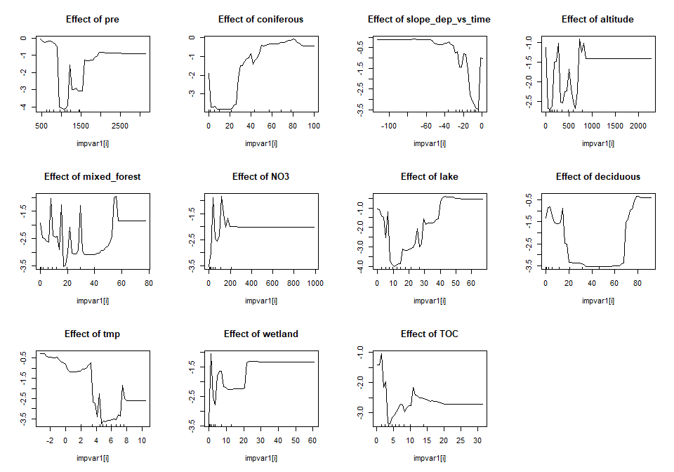<!-- -->
#### randomForestExplainer

```r
# install.packages("randomForestExplainer")
library(randomForestExplainer)

# COPY to console and run (this will create an Rmd file and render an HTML file):
# DON'T rin ith within this chunk, RStudio will hang

if (FALSE){
  explain_forest(model2, interactions = TRUE, data = train_set, 
                 path = "C:/Data/seksjon 317/icpw-R/161_randomforest_James_data_model2.html")
}
```


## 7a. Data EXCLUDING catchment_area, TOC and NO3    
* Includes USA data, still missing UK and most German data      
*  Germany is missing TOC (87%), UK is missing land cover (100%)

```r
# Data for analyses
df_analysis <- dat %>%
  mutate(
    tocton_increase = case_when(
      slope_tocton_vs_time > 0 & p_tocton_vs_time <= 0.05 ~ 1,
      TRUE ~ 0)
  ) %>%
  select(country, station_code, tocton_increase, slope_dep_vs_time,
    latitude, longitude, altitude, 
    pre, tmp, 
    coniferous, deciduous, lake, mixed_forest, wetland)

# Complete cases
apply(is.na(df_analysis), 2, sum)

complete <- complete.cases(df_analysis)
table(complete)
table(df_analysis$country, complete)

# What is missing? (long output)  
# Germany is missing NO3 (87%)
if (FALSE){
df_analysis %>% 
  split(.$country) %>%
  purrr::map(~apply(is.na(.), 2, mean))
}


# Keep only complete cases
df_analysis <- df_analysis[complete.cases(df_analysis),] %>%
  select(-country, -station_code)
```

```
##           country      station_code   tocton_increase slope_dep_vs_time 
##                 0                 0                 0                 0 
##          latitude         longitude          altitude               pre 
##                 0                 0                 9                 0 
##               tmp        coniferous         deciduous              lake 
##                 0                43                43                37 
##      mixed_forest           wetland 
##                43                37 
## complete
## FALSE  TRUE 
##    52   446 
##                 complete
##                  FALSE TRUE
##   Canada             0  114
##   Czech Republic     0    8
##   Estonia            1    0
##   Finland            0   26
##   Germany            1   22
##   Ireland            1    2
##   Italy              0    6
##   Latvia             0    3
##   Netherlands        0    3
##   Norway             0   83
##   Poland             0    6
##   Slovakia           0   12
##   Sweden             6   86
##   Switzerland        6    0
##   United Kingdom    21    0
##   United States     16   75
```


## 7b. Logistic regression, all variables  

```r
# Full model  
fm <- glm(
  tocton_increase ~ .,
  data = df_analysis, 
  family = "binomial",
  na.action = "na.fail")

# Dredging for best model
if (use_saved_results){
  # Read dredge result
  dd3a <- readRDS("Data/161_all_dd3a.rds")
} else {
  dd3a <- dredge(fm)                          # do only once
  saveRDS(dd3a, "Data/161_all_dd3a.rds")      # save it as it takes a couple of minutes
}

# Check best models  
subset(dd3a, delta < 1)

cat("\n\nR2: \n")
dd3a_mod1 <- get.models(dd3a, 1)[[1]]  
# summary(dd3a_mod1)  

par(mfrow = c(2,3), mar = c(4,5,2,1), oma = c(0,0,2,0))
visreg(dd3a_mod1, scale = "response")
mtext("All data, include coordinates", outer = TRUE)
```

<!-- -->

```
## Global model call: glm(formula = tocton_increase ~ ., family = "binomial", data = df_analysis, 
##     na.action = "na.fail")
## ---
## Model selection table 
##      (Int)      alt     cnf     lak    ltt mxd_frs slp_dep_vs_tim df   logLik
## 348 -18.66 -0.00122 0.05125 0.04530 0.2472 0.03843       -0.02294  7 -127.802
## 347 -21.37          0.05485 0.05393 0.2802 0.04875       -0.02449  6 -129.088
##      AICc delta weight
## 348 269.9  0.00  0.563
## 347 270.4  0.51  0.437
## Models ranked by AICc(x) 
## 
## 
## R2:
```

## 7c. Logistic regression, exclude coordinates    

```r
fm <- glm(
  tocton_increase ~ slope_dep_vs_time + 
    altitude + 
    pre + tmp + 
    coniferous + deciduous + lake + mixed_forest + 
    wetland,
  data = df_analysis, 
  family = "binomial",
  na.action = "na.fail")

# Dredging for best model
if (use_saved_results){
  # Read dredge result
  dd3b <- readRDS("Data/161_all_dd3b.rds")
} else {
  dd3b <- dredge(fm)                          # do only once
  saveRDS(dd3b, "Data/161_all_dd3b.rds")      # save it as it takes a couple of minutes
}

subset(dd3b, delta < 1)

cat("\n\nR2: \n")
dd3b_mod1 <- get.models(dd3b, 1)[[1]]  
# summary(dd3b_mod1)  

par(mfrow = c(2,3), mar = c(4,5,2,1), oma = c(0,0,2,0))
visreg(dd3b_mod1, scale = "response")
```

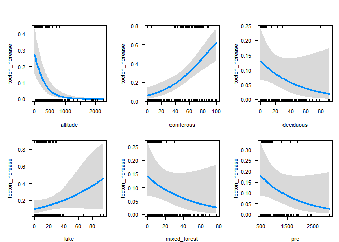<!-- -->

```r
mtext("All data, exclude coordinates", outer = TRUE)
```

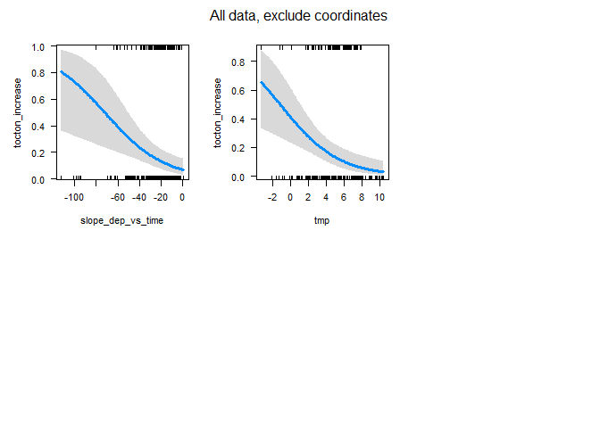<!-- -->

```
## Global model call: glm(formula = tocton_increase ~ slope_dep_vs_time + altitude + 
##     pre + tmp + coniferous + deciduous + lake + mixed_forest + 
##     wetland, family = "binomial", data = df_analysis, na.action = "na.fail")
## ---
## Model selection table 
##        (Int)       alt     cnf      dcd     lak  mxd_frs        pre
## 256  0.24310 -0.003708 0.03213 -0.02230 0.02163 -0.02313 -0.0007973
## 240 -0.05132 -0.003686 0.03584 -0.02267 0.02454          -0.0009155
## 236 -0.45650 -0.003787 0.04265          0.03145          -0.0009628
## 248  0.90390 -0.003888 0.02668 -0.02847         -0.02570 -0.0009080
## 252 -0.15740 -0.003826 0.03888          0.02854 -0.02265 -0.0008435
## 224 -0.43660 -0.003950 0.03550 -0.02332 0.02517 -0.02617           
## 504  1.10100 -0.003937 0.02545 -0.03019         -0.03060 -0.0008505
## 232  0.67440 -0.003890 0.02986 -0.03048                  -0.0010430
## 220 -0.88970 -0.004074 0.04255          0.03251 -0.02629           
##     slp_dep_vs_tim     tmp      wtl df   logLik  AICc delta weight
## 256       -0.03603 -0.3048           9 -150.662 319.7  0.00  0.135
## 240       -0.04198 -0.3412           8 -151.729 319.8  0.05  0.131
## 236       -0.04186 -0.3687           7 -152.801 319.9  0.12  0.127
## 248       -0.03575 -0.2791           8 -151.818 320.0  0.23  0.120
## 252       -0.03603 -0.3329           8 -151.818 320.0  0.23  0.120
## 224       -0.03585 -0.3341           8 -151.964 320.3  0.52  0.104
## 504       -0.03468 -0.2752 -0.02411  9 -151.006 320.4  0.69  0.095
## 232       -0.04230 -0.3158           7 -153.191 320.6  0.90  0.086
## 220       -0.03569 -0.3634           7 -153.234 320.7  0.99  0.082
## Models ranked by AICc(x) 
## 
## 
## R2:
```


## 7d. Tree and forest classification


### Split into training and validation data   

```r
set.seed(123)

x <- runif(nrow(df_analysis))
train <- ifelse(x < 0.9, TRUE, FALSE)

train_set <- df_analysis[train,]  %>% 
  mutate(tocton_increase_f = factor(tocton_increase)) %>% select(-tocton_increase, -longitude, - latitude) %>%
  as.data.frame()
valid_set <- df_analysis[!train,] %>% 
  mutate(tocton_increase_f = factor(tocton_increase)) %>% select(-tocton_increase, -longitude, - latitude) %>%
  as.data.frame()
```


### a. Tree classification using 'party'   

```r
(ct = ctree(tocton_increase_f ~ ., data = train_set))

plot(ct, main="Conditional Inference Tree")
```

<!-- -->

```r
cat("\n\n")
cat("Table of prediction errors \n")
table(predict(ct), train_set$tocton_increase_f)
cat("\n\n")

cat("Classification of training set \n")
tr.pred = predict(ct, newdata = valid_set, type="prob")
colnames(tr.pred) <- c("P0", "P1")
# tr.pred <- tr.pred %>% map_dfr(~data.frame(P0 = .[1], P1 = .[2]))
table(tr.pred[,"P1"] > 0.5, valid_set$tocton_increase_f)
```

```
## 
## Model formula:
## tocton_increase_f ~ slope_dep_vs_time + altitude + pre + tmp + 
##     coniferous + deciduous + lake + mixed_forest + wetland
## 
## Fitted party:
## [1] root
## |   [2] coniferous <= 48.113
## |   |   [3] coniferous <= 29.655: 0 (n = 216, err = 4.2%)
## |   |   [4] coniferous > 29.655
## |   |   |   [5] lake <= 24.569: 0 (n = 28, err = 7.1%)
## |   |   |   [6] lake > 24.569: 1 (n = 8, err = 12.5%)
## |   [7] coniferous > 48.113
## |   |   [8] altitude <= 358: 1 (n = 107, err = 29.0%)
## |   |   [9] altitude > 358
## |   |   |   [10] wetland <= 3.385: 0 (n = 36, err = 0.0%)
## |   |   |   [11] wetland > 3.385: 1 (n = 7, err = 42.9%)
## 
## Number of inner nodes:    5
## Number of terminal nodes: 6
## 
## 
## Table of prediction errors 
##    
##       0   1
##   0 269  11
##   1  35  87
## 
## 
## Classification of training set 
##        
##          0  1
##   FALSE 29  2
##   TRUE   5  8
```

### b. Evtree (Evolutionary Learning)   

```r
ev.raw = evtree(tocton_increase_f ~ ., data = train_set)

plot(ev.raw)
```

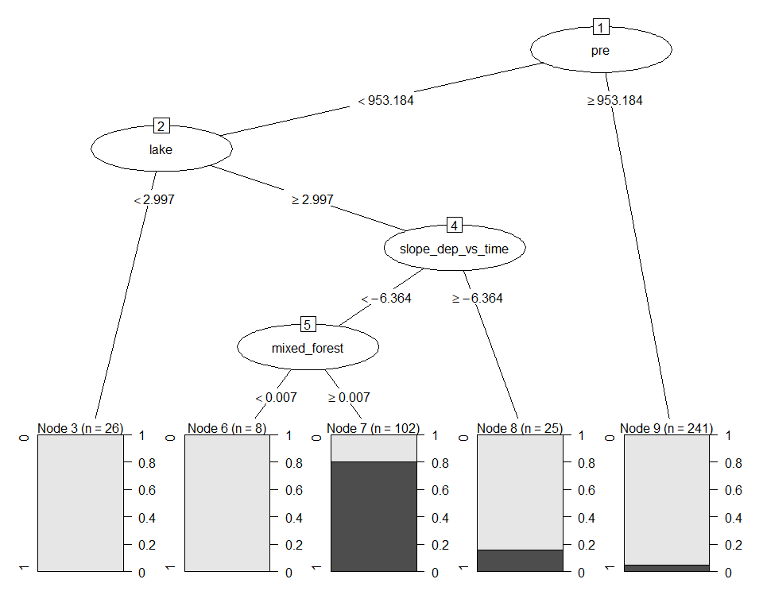<!-- -->

```r
cat("Predicted in training data: \n")
table(predict(ev.raw), train_set$tocton_increase_f)

cat("\n\nPrediction errors in training data: \n")
1-mean(predict(ev.raw) == train_set$tocton_increase_f)
```

```
## Predicted in training data: 
##    
##       0   1
##   0 284  16
##   1  20  82
## 
## 
## Prediction errors in training data: 
## [1] 0.08955224
```


### c. Random forest  
* *For results/interpretation, see separate document '161_randomforest_James_data.html'*  
* Model called 'model3'

```r
model3 <- randomForest(tocton_increase_f ~ ., 
                       data = train_set, 
                       mtry = 5,
                       importance = TRUE)

model3
```

```
## 
## Call:
##  randomForest(formula = tocton_increase_f ~ ., data = train_set,      mtry = 5, importance = TRUE) 
##                Type of random forest: classification
##                      Number of trees: 500
## No. of variables tried at each split: 5
## 
##         OOB estimate of  error rate: 11.44%
## Confusion matrix:
##     0  1 class.error
## 0 283 21  0.06907895
## 1  25 73  0.25510204
```


#### Random forest, predict on training data

```r
# Predicting on train set
pred_valid <- predict(model3, valid_set, type = "class")
# Checking classification accuracy
table(pred_valid, valid_set$tocton_increase_f)  
```

```
##           
## pred_valid  0  1
##          0 33  5
##          1  1  5
```

#### Random forest, importance (but see separate result file)  
High MeanDecreaseGini = high importance in model  

```r
randomForest::importance(model3)
varImpPlot(model3)
```

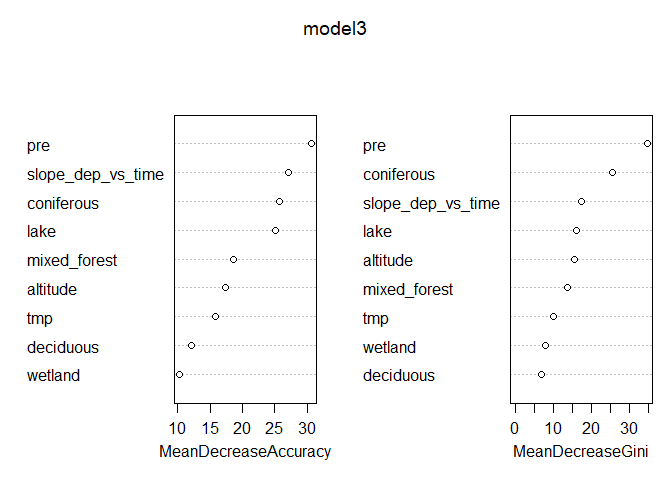<!-- -->

```
##                           0         1 MeanDecreaseAccuracy MeanDecreaseGini
## slope_dep_vs_time 18.729119 20.093069             27.08657        17.528293
## altitude           6.393074 18.155909             17.35278        15.460184
## pre               11.102956 32.961406             30.63447        34.871273
## tmp               12.612148  8.906571             15.86233         9.931896
## coniferous         7.070467 27.534920             25.67550        25.644655
## deciduous          4.612348 11.030249             12.07902         6.950461
## lake              13.868255 22.746115             25.08015        15.984351
## mixed_forest       3.607829 19.199311             18.59893        13.710130
## wetland            8.362271  5.855518             10.27470         7.798947
```

#### Random forest, partial effects   
* NOt easy to interpret    

```r
imp <- randomForest::importance(model3)
impvar1 <- rownames(imp)[order(imp[, 2], decreasing=TRUE)]

# impvar1 <- readRDS("Data/130_impvar1.rmd")

par(mfrow=c(3,4))

for (i in seq_along(impvar1)) {
  partialPlot(x = model3, 
              pred.data = train_set, 
              x.var = impvar1[i], 
              which.class = "1",
              main=paste("Effect of", impvar1[i]))
}
```

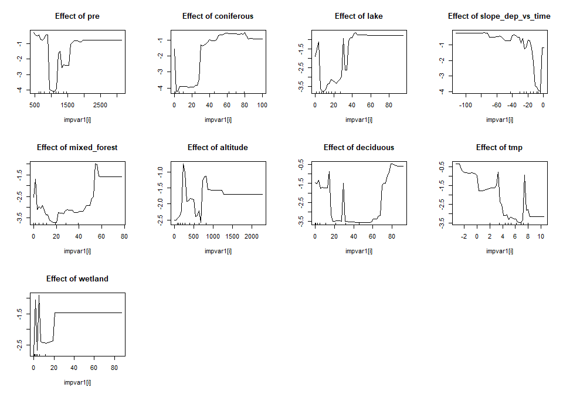<!-- -->
#### randomForestExplainer

```r
# install.packages("randomForestExplainer")
library(randomForestExplainer)

# COPY to console and run (this will create an Rmd file and render an HTML file):
# DON'T rin ith within this chunk, RStudio will hang

if (FALSE){
  explain_forest(model3, interactions = TRUE, data = train_set, 
                 path = "C:/Data/seksjon 317/icpw-R/161_randomforest_James_data_model3.html")
}
```

